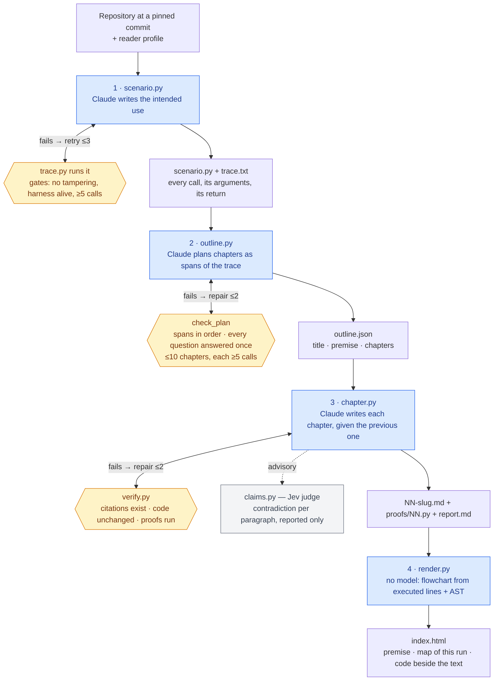

# The CodeStories pipeline

A repository and a reader go in; a reading page comes out. Four stages, run from the root with `.venv/bin/python`
(keys in `.env`). Each script's docstring says how to run it. Blue is a model stage; amber is its deterministic
check, which hands failures back to the model in the same conversation, a bounded number of times.



## What flows where

| Stage | Reads | Model call | Check (deterministic) | Writes |
|---|---|---|---|---|
| 1 `scenario.py` | repo (filtered, cached) | "write the intended use" → script | `trace.py` runs it: no tracing hooks touched, tracer alive, ≥ 5 calls into the repo | `scenario.py`, `scenario.json`, `trace.full.json`, compressed `trace.json` + `trace.txt` |
| 2 `outline.py` | repo, scenario, numbered trace, reader | "plan the story" → JSON plan | `check_plan`: spans well-formed, ordered, non-overlapping; questions answered exactly once by a later chapter; ≤ `MAX_CHAPTERS`, each ≥ `MIN_CALLS` | `outline.json` (+ `outline.response*.json`, `outline.prev.json` on repair) |
| 3 `chapter.py` | repo, scenario, trace, reader, plan, previous chapter | "write chapter N" → Markdown + proof | `verify.py`: every permalink points at real lines at the pinned commit, those lines are unchanged, every proof runs and can fail | `NN-slug.md`, `proofs/NN.py`, `report.md`, `traces/NN.*.json` |
| 3 (advisory) | each citing paragraph + its cited lines | Jev: "is any claim contradicted?" | none; a judge with known false positives at the cut-off is reported, never repaired on | column in `report.md` |
| 4 `render.py` | outline, chapters, `trace.json`, repo source | none | n/a | `index.html` |

## The shape of a stage

Every model stage is the same loop:

1. Build the prompt with the stable part first (the repository, marked for caching), the changing part last.
2. Call the model.
3. Run a check that code can decide.
4. If it fails, append the model's answer and the check's verdict to the same conversation and ask again, at most
   `REPAIRS` times. The cached repository makes the retry cost a fraction of the first turn.
5. A stage that still fails exits non-zero. Nothing flows on to the next stage on trust.

The checks are the design: the model fills whatever gap the check leaves, so each check says what we actually want
(a minimum of calls per chapter, not just a cap on their count; an assert that can fail, not just an assert).

## TypeScript, and a change's two runs

`codestory/ts/` traces TypeScript and JavaScript (Node 20.6 or later). `register.mjs` installs a module loader hook
ahead of the package's own TypeScript loader, and `instrument.mjs` rewrites each named function as
`return __cs$(…, () => { body })` without adding a line, so every line number stays the file's own and a permalink
needs no source map. `runtime.mjs` records the calls (with AsyncLocalStorage, so awaited calls nest under their
caller) in `trace.py`'s shape, and, through `coverage.mjs`, the lines each test ran (V8 coverage, mapped back through
the source maps). A test is the root of a run: the calls made while it runs are what is recorded. Two test runners
so far: Japa, for AdonisJS (`register.mjs`), and Vitest, for Vite and Vue, `.vue` script blocks included
(`vite-plugin.mjs`, `vitest-run.mjs`; run `npm install --legacy-peer-deps` in `codestory/ts/web` once, so the traced
repository needs no test runner of its own).

`diff.py` uses it to trace a change. It checks out the base and the head as worktrees, runs the head's tests on both
(on the base, imports of what the change adds become `undefined`, so only the tests that use them fail), and compares
the two runs call by call:

```bash
python3 codestory/diff.py <repo> <base> <head> <out-dir> --pkg <package> --spec <test file> [--runner vitest]
```

It writes the merged run (`diff.txt`: `+` happens only after the change, `-` only before, `~` is the same call with
other values, ` *` marks a function the change edited), each test's outcome before and after, and the changed
functions no test reaches. No model is involved.
