# Page: Overview

# Overview

<details>
<summary>Relevant source files</summary>

The following files were used as context for generating this wiki page:

- [README.md](README.md)
- [docs/_static/sponsors/Klaviyo.svg](docs/_static/sponsors/Klaviyo.svg)
- [docs/api-attr.rst](docs/api-attr.rst)
- [docs/glossary.md](docs/glossary.md)
- [docs/index.md](docs/index.md)
- [docs/names.md](docs/names.md)
- [docs/why.md](docs/why.md)
- [pyproject.toml](pyproject.toml)
- [src/attr/__init__.py](src/attr/__init__.py)
- [src/attr/__init__.pyi](src/attr/__init__.pyi)

</details>


This page provides a comprehensive introduction to the `attrs` repository, a Python package designed to eliminate boilerplate code when creating classes. It explains the core concepts, architecture, and key components that make up this library for class construction.

## What is attrs?

`attrs` is a Python library that automates the creation of well-behaved classes by generating common dunder methods (`__init__`, `__repr__`, `__eq__`, etc.) based on declarative attribute definitions [README.md:21-24](). It helps developers write concise, correct code without sacrificing performance or readability [README.md:24]().

The library is trusted in production environments across a wide range of applications, including NASA Mars missions since 2020 [README.md:22]().

```python
from attrs import asdict, define, field, Factory, make_class

@define
class SomeClass:
    a_number: int = 42
    list_of_numbers: list[int] = Factory(list)

    def hard_math(self, another_number):
        return self.a_number + sum(self.list_of_numbers) * another_number

sc = SomeClass(1, [1, 2, 3])
# Generated __repr__
# SomeClass(a_number=1, list_of_numbers=[1, 2, 3])
```

Sources: [README.md:19-24](), [README.md:68-100]()

## Core Philosophy

The design of `attrs` is guided by several key principles:

1.  **Regular Classes**: `attrs` creates normal Python classes, not special data carriers or containers [README.md:110]().
2.  **The Class Belongs to Users**: `attrs` doesn't add metaclasses or insert mysterious parent classes into your inheritance tree. It simply adds methods to your class [docs/why.md:64-65]().
3.  **Performance Matters**: `attrs` does its work at definition time (code generation), so there's minimal runtime impact when instantiating classes [README.md:110]().
4.  **Optional Typing**: `attrs` supports type annotations but does not force them on you [README.md:120-125]().

Sources: [README.md:110-125](), [docs/why.md:64-65]()

## System Architecture

The library is organized into a user-facing API and a core engine that handles class transformation and method generation.

### Code Entity Mapping
The following diagram maps high-level concepts to specific code entities within the `src/attr/` and `src/attrs/` directories.

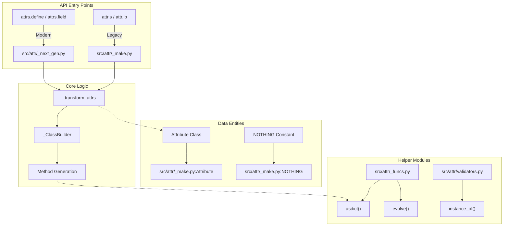

Sources: [src/attr/__init__.py:10-29](), [src/attr/_make.py:14-27](), [src/attr/_next_gen.py:1-28]()

## Attribute Lifecycle

This diagram illustrates the data flow from attribute definition to instance initialization, including validation and conversion.

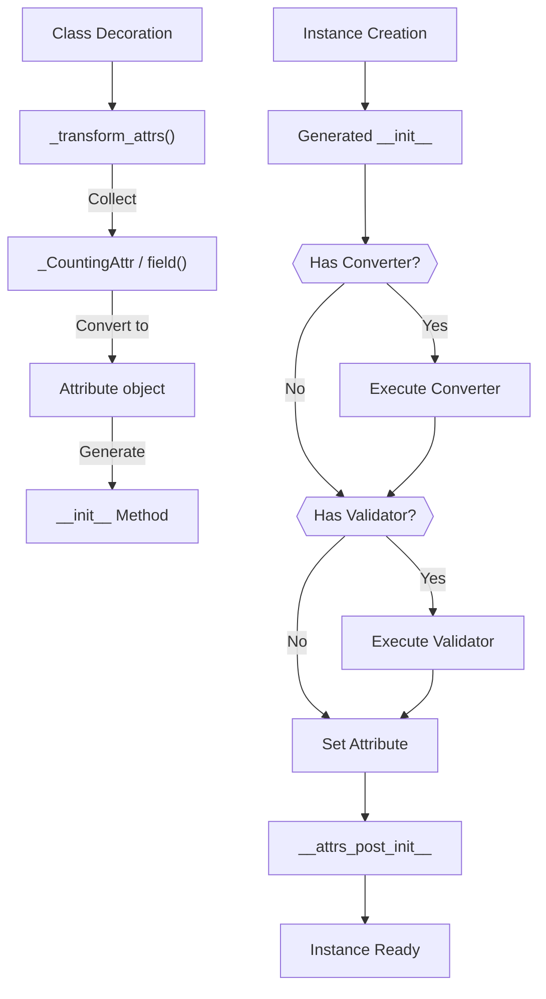

Sources: [src/attr/_make.py:14-27](), [src/attr/_next_gen.py:1-28](), [src/attr/converters.py:1-10](), [src/attr/validators.py:1-10]()

## Key Components

### Class Decorators

`attrs` provides two primary namespaces for class definition. The modern `attrs` namespace is recommended for new code [docs/names.md:12-24]().

| Feature | Legacy API (`attr.s`) | Modern API (`attrs.define`) |
| :--- | :--- | :--- |
| **Namespace** | `attr` [src/attr/__init__.py:21]() | `attrs` [src/attr/__init__.py:59]() |
| **Slots** | `False` by default [docs/api-attr.rst:17]() | `True` by default [docs/names.md:21]() |
| **Type Awareness** | `auto_attribs=False` [docs/api-attr.rst:17]() | `auto_attribs=True` [docs/names.md:21]() |
| **Immutability** | `@attr.s(frozen=True)` | `@attrs.frozen` [src/attr/__init__.py:66]() |

Sources: [src/attr/__init__.py:21-66](), [docs/names.md:12-24](), [docs/api-attr.rst:17]()

### Attribute Definition

Attributes are defined using either `attr.ib()` (alias `attrib`) or `attrs.field()`. They represent the metadata for a single class attribute [src/attr/_make.py:16]().

```python
from attrs import define, field, validators

@define
class User:
    email: str = field(validator=validators.instance_of(str))
    id: int = field(default=0)
```

Key metadata tracked by `Attribute` [src/attr/__init__.pyi:124-142]():
- `name`: The attribute name.
- `default`: Default value or `NOTHING`.
- `validator`: Callable for validation.
- `converter`: Callable for value transformation.
- `type`: The associated type hint.
- `kw_only`: Whether the attribute is keyword-only.
- `alias`: The public name used in `__init__`.

Sources: [src/attr/__init__.pyi:124-142](), [src/attr/_make.py:20-21]()

### Utility Functions

The library includes high-level functions for interacting with `attrs` instances:

| Function | Purpose | Location |
| :--- | :--- | :--- |
| `asdict()` | Recursively convert instance to a `dict`. | [src/attr/_funcs.py:13]() |
| `astuple()` | Recursively convert instance to a `tuple`. | [src/attr/_funcs.py:13]() |
| `evolve()` | Create a new instance with updated attributes. | [src/attr/_make.py:22]() |
| `fields()` | Return a tuple of `Attribute` objects for a class. | [src/attr/_make.py:23]() |
| `resolve_types()` | Resolve forward references in type annotations. | [src/attr/_funcs.py:13]() |
| `has()` | Check if a class is an `attrs` class. | [src/attr/_funcs.py:13]() |

Sources: [src/attr/__init__.py:13-26]()

## Comparison with Alternatives

### Data Classes
`attrs` was the inspiration for Python's standard library `dataclasses` [docs/why.md:9-12](). However, `attrs` remains more powerful by offering:
- **Validators and Converters**: Native support for data integrity [docs/why.md:19-20]().
- **Equality Customization**: Define special handling for complex types like NumPy arrays [README.md:140]().
- **Better Slots Support**: Advanced implementation including cell rewriting for `super()` calls [docs/why.md:25-26]().
- **Compatibility**: Supports older Python versions (>=3.9) and PyPy [pyproject.toml:13](), [docs/why.md:34-38]().

### Pydantic
While Pydantic focuses on data validation and type coercion (parsing untrusted data), `attrs` focuses on building well-behaved internal domain models without the overhead of re-validating trusted data [docs/why.md:53-65]().

Sources: [docs/why.md:7-65](), [pyproject.toml:13-26]()

## Project Structure and Navigation

- **Architecture**: See [Core Architecture](2) for details on the `_ClassBuilder` and code generation.
- **Features**: See [Features and Extensions](3) for validators, converters, and setters.
- **Advanced**: See [Advanced Topics](4) for `__slots__` implementation and type system integration.
- **Development**: See [Development and Contribution](5) for testing and CI workflows.

Sources: [pyproject.toml:40-72]()

---

# Page: Core Architecture

# Core Architecture

<details>
<summary>Relevant source files</summary>

The following files were used as context for generating this wiki page:

- [docs/api.rst](docs/api.rst)
- [src/attr/__init__.py](src/attr/__init__.py)
- [src/attr/__init__.pyi](src/attr/__init__.pyi)
- [src/attr/_make.py](src/attr/_make.py)
- [tests/test_annotations.py](tests/test_annotations.py)

</details>


The Core Architecture of `attrs` defines how the library transforms regular Python classes into feature-rich classes with well-defined attributes. This page explains the fundamental components and processes that power the `attrs` library, focusing on the internal mechanisms that enable its declarative approach to class creation.

For information about specific features like validators and converters, see [Features and Extensions](#3). For details on the differences between legacy and modern APIs, see [Legacy vs Modern APIs](#2.3).

## Core Components and Flow

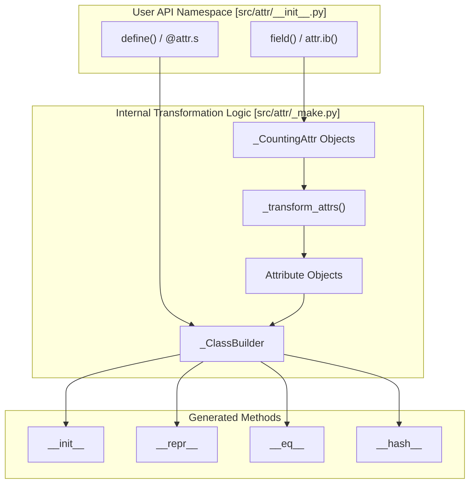

The core architecture of `attrs` consists of several key components:

1.  **Class Decorators** (`@attr.s`, `define`): Entry points that transform regular classes [src/attr/_make.py:840-1049](), [src/attr/_next_gen.py:38-75]().
2.  **Attribute Definitions** (`attr.ib()`, `field()`): Define class attributes with configuration by creating `_CountingAttr` instances [src/attr/_make.py:106-213]().
3.  **Attribute Transformation** (`_transform_attrs`): Converts attribute definitions and type hints into final `Attribute` objects [src/attr/_make.py:375-587]().
4.  **Class Builder** (`_ClassBuilder`): Generates methods and handles class reconstruction (e.g., for slots) [src/attr/_make.py:621-837]().

Sources: [src/attr/_make.py:106-213](), [src/attr/_make.py:375-587](), [src/attr/_make.py:621-837](), [src/attr/__init__.py:14-28](), [src/attr/_next_gen.py:38-75]()

## Class Decoration Process

When you decorate a class with `@attr.s` or `define`, the following process transforms it:

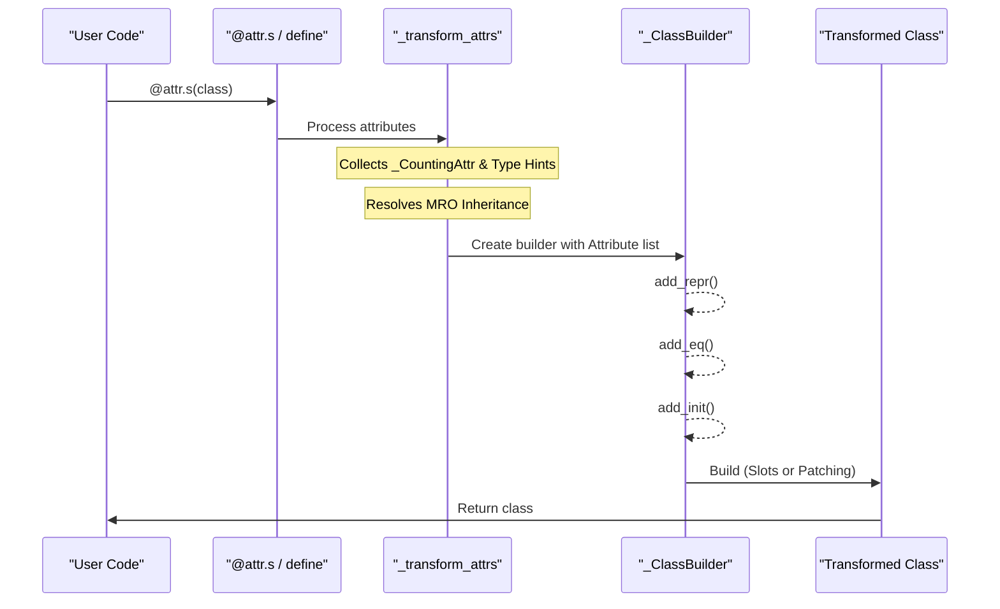

1.  The decorator captures the class and its attributes.
2.  `_transform_attrs` collects attribute definitions, processes inheritance by walking the MRO, and creates `Attribute` objects [src/attr/_make.py:375-480]().
3.  A `_ClassBuilder` instance is created with these attributes and the configuration parameters (like `slots`, `frozen`, `repr`) [src/attr/_make.py:621-684]().
4.  The builder generates methods based on parameters using dynamic script generation [src/attr/_make.py:721-800]().
5.  The builder returns the transformed class, either by patching the original or creating a new slotted version [src/attr/_make.py:802-837]().

For details, see [Class Definition](#2.1).

Sources: [src/attr/_make.py:375-587](), [src/attr/_make.py:621-837](), [docs/api.rst:6-18]()

## Attribute Lifecycle

Attributes in `attrs` go through several stages:

1.  **Definition**: Created with `attr.ib()` or `field()` as `_CountingAttr` objects. These use a global counter to maintain order [src/attr/_make.py:196-213]().
2.  **Transformation**: Converted to `Attribute` objects. During this stage, type annotations are merged with explicit definitions [src/attr/_make.py:482-587]().
3.  **Method Generation**: Used by the builder to write the logic for `__init__`, `__repr__`, etc. [src/attr/_make.py:721-800]().
4.  **Runtime**: During instance creation, the generated `__init__` processes values through defaults, then converters, and finally validators [src/attr/_make.py:1130-1160]().

For details, see [Attribute Definition](#2.2).

Sources: [src/attr/_make.py:106-213](), [src/attr/_make.py:375-587](), [src/attr/_make.py:1130-1160]()

## Class Builder Architecture

The `_ClassBuilder` is the central component for transforming a class. It handles the logic for:

*   **Initialization**: Takes the original class and its attributes, determining if the class should be frozen or slotted [src/attr/_make.py:621-684]().
*   **Method Generation**: Orchestrates the creation of dunder methods like `add_init`, `add_repr`, `add_eq`, and `add_hash` [src/attr/_make.py:721-800]().
*   **Class Construction**: If `slots=True`, it calls `_create_slots_class` to produce a new class object with `__slots__` defined [src/attr/_make.py:802-813](). If `slots=False`, it uses `_patch_original_class` [src/attr/_make.py:815-819]().

Sources: [src/attr/_make.py:621-837]()

## Method Generation System

`attrs` uses a unique code generation approach for method creation to avoid runtime introspection overhead:

1.  **Script Generation**: Functions like `_make_init_script()` generate Python code as strings [src/attr/_make.py:1130-1160]().
2.  **Compilation**: `_compile_and_eval()` compiles the script into bytecode [src/attr/_make.py:216-228]().
3.  **Debugging Support**: `_linecache_and_compile()` adds fake entries to Python's line cache so that generated code is visible in debuggers like `pdb` [src/attr/_make.py:230-258]().

This approach ensures that the resulting `__init__` is as fast as a hand-written one.

Sources: [src/attr/_make.py:216-258](), [src/attr/_make.py:1130-1160]()

## Attribute Transformation

The `_transform_attrs` function is the engine that understands class bodies:

1.  **Collection**: It looks for `_CountingAttr` objects in the class `__dict__` and also extracts PEP 526 type annotations [src/attr/_make.py:383-420]().
2.  **Inheritance**: It processes base classes in MRO order to ensure subclass attributes are correctly ordered [src/attr/_make.py:422-448]().
3.  **Validation**: It checks for common errors, such as mixing attributes with and without defaults in a way that would break Python's function signature rules [src/attr/_make.py:461-480]().

Sources: [src/attr/_make.py:375-480](), [tests/test_annotations.py:36-51]()

## API Evolution

`attrs` provides two complementary APIs that share the same implementation:

1.  **Legacy API**: Uses the `attr` namespace (e.g., `@attr.s`, `attr.ib`) [src/attr/__init__.py:32-33]().
2.  **Modern API**: Uses the `attrs` namespace (e.g., `define`, `field`) [src/attr/_next_gen.py:38-75]().

The Modern API defaults to `slots=True`, `auto_attribs=True`, and `frozen=False` (unless `frozen` is used) [src/attr/_next_gen.py:38-75]().

For details, see [Legacy vs Modern APIs](#2.3).

Sources: [src/attr/__init__.py:32-33](), [src/attr/_next_gen.py:38-75](), [docs/api.rst:11-19]()

---

# Page: Class Definition

# Class Definition

<details>
<summary>Relevant source files</summary>

The following files were used as context for generating this wiki page:

- [docs/how-does-it-work.md](docs/how-does-it-work.md)
- [src/attr/_make.py](src/attr/_make.py)
- [src/attr/exceptions.py](src/attr/exceptions.py)
- [tests/test_annotations.py](tests/test_annotations.py)
- [tests/test_functional.py](tests/test_functional.py)
- [tests/test_make.py](tests/test_make.py)
- [tests/utils.py](tests/utils.py)

</details>


This page explains how classes are defined using attrs decorators (`@attr.s` and `@attrs.define`), their parameters, and how they transform regular Python classes into attribute-rich classes with automatically generated methods. For information about attribute definition within these classes, see [Attribute Definition](2.2).

## Overview of Class Definition in attrs

The attrs library provides class decorators that transform normal Python classes by processing attribute definitions, generating dunder methods (like `__init__`, `__repr__`, `__eq__`), and setting up class-wide features like immutability or memory-efficient slots.

### Natural Language to Code Entity Mapping: Transformation Pipeline

This diagram maps the high-level transformation concepts to the specific code entities responsible for them in `src/attr/_make.py`.

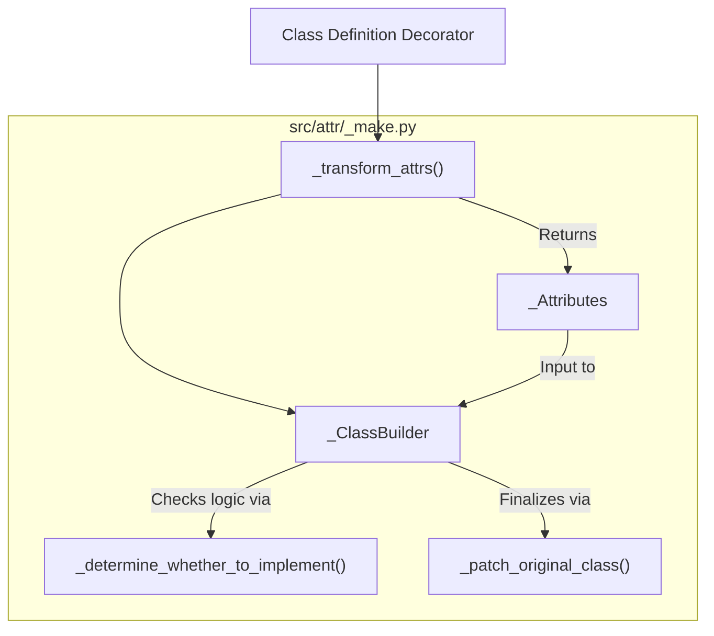
Sources: [src/attr/_make.py:381-540](), [src/attr/_make.py:654-855](), [src/attr/_make.py:1086-1130]()

## Class Definition APIs

attrs provides two API styles for defining classes:

### Legacy API (OG)
The original API using `@attr.s` (aliased as `@attr.attributes`) and `attr.ib()` (aliased as `attr.attrib`). It has more conservative defaults, such as `slots=False` and `auto_attribs=False`.
[src/attr/_make.py:1212-1222]()

### Modern API (NG)
The next-generation API using `@attrs.define` (and its aliases `@attrs.mutable` and `@attrs.frozen`). It defaults to `slots=True`, `auto_attribs=True`, and enables `on_setattr` hooks by default.
[src/attr/_next_gen.py:23-47]()

Sources: [src/attr/_next_gen.py:23-343](), [src/attr/_make.py:1212-1366]()

## The Transformation Pipeline

When a decorator is applied, the class undergoes a multi-stage transformation:

### 1. Attribute Collection (`_transform_attrs`)
This function scans the class for `_CountingAttr` objects (created by `field()` or `ib()`) and type annotations. It handles:
- **Inheritance**: It traverses the MRO to collect attributes from base classes [src/attr/_make.py:317-378]().
- **Auto-detection**: If `auto_attribs=True`, it converts PEP 526 annotations into attributes [src/attr/_make.py:381-440]().
- **Validation**: It ensures no mandatory attributes follow attributes with default values [src/attr/_make.py:480-495]().

### 2. Class Building (`_ClassBuilder`)
The `_ClassBuilder` takes the collected `_Attributes` and orchestrates the generation of dunder methods.

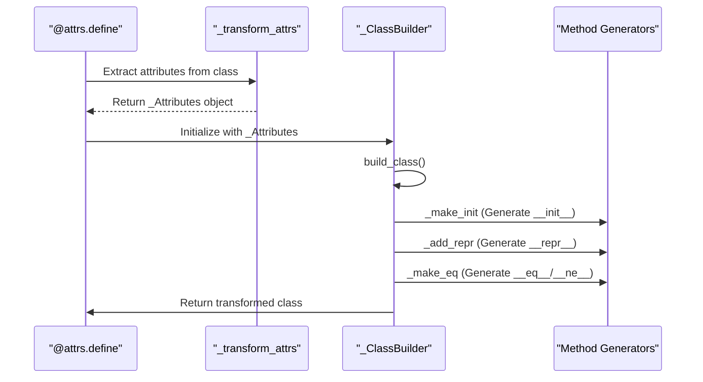
Sources: [src/attr/_make.py:654-855](), [src/attr/_make.py:1086-1130](), [tests/test_make.py:227-263]()

## Core Components and Parameters

### Decorator Parameters Comparison

| Parameter | `define` (NG) | `s` (OG) | Purpose |
| :--- | :--- | :--- | :--- |
| `slots` | `True` | `False` | Use `__slots__` for memory efficiency [src/attr/_next_gen.py:31-31]() |
| `frozen` | `False` | `False` | Prevent attribute modification after init [src/attr/_next_gen.py:32-32]() |
| `auto_attribs` | `True` | `False` | Detect attributes via type annotations [src/attr/_next_gen.py:35-35]() |
| `on_setattr` | `setters.pipe(...)` | `None` | Run converters/validators on assignment [src/attr/_next_gen.py:43-43]() |
| `auto_detect` | `True` | `False` | Skip generating methods if already present [src/attr/_next_gen.py:41-41]() |

Sources: [src/attr/_next_gen.py:23-47](), [src/attr/_make.py:1212-1366]()

### Method Generation Logic
The library uses dynamic code generation via `_compile_and_eval` to create highly optimized methods that avoid dictionary lookups where possible.

- **`__init__`**: Generated by `_make_init`. It handles default values, factories, and the `__attrs_post_init__` hook [src/attr/_make.py:2310-2545]().
- **`__repr__`**: Generated by `_add_repr`. It produces a string showing the class name and selected attributes [src/attr/_make.py:1550-1590]().
- **Comparison**: Generated by `_make_eq` and `_make_order`. These compare instances as tuples of their attributes [src/attr/_make.py:1620-1700]().

Sources: [src/attr/_make.py:216-228](), [src/attr/_make.py:2310-2545]()

## Slotted Class Construction

When `slots=True`, attrs cannot simply patch the existing class because `__slots__` must be defined when the class is created. Instead:
1. It creates a new class with the same name and bases but including a `__slots__` entry [src/attr/_make.py:898-925]().
2. It migrates attributes and methods from the original class to the new slotted class.
3. It handles complexities like `__weakref__` and fixing `super()` calls via `_fix_closure_cell` [src/attr/_make.py:970-995]().

Sources: [src/attr/_make.py:898-1045]()

## Immutability (Frozen Classes)

If `frozen=True` is set:
1. `_ClassBuilder` installs a custom `__setattr__` and `__delattr__` that raise `FrozenInstanceError` [src/attr/_make.py:560-585]().
2. In the generated `__init__`, attributes are set using `object.__setattr__` to bypass the protection [src/attr/_make.py:2455-2465]().
3. This state is inherited by subclasses; once a class is frozen, all its subclasses are also frozen.

Sources: [src/attr/_make.py:800-810](), [src/attr/_next_gen.py:32-32](), [src/attr/exceptions.py:23-30]()

## Programmatic Class Creation

The `make_class` function provides a functional interface to the same pipeline used by the decorators.

```python
# Equivalent to @attr.s class User: name = attr.ib()
User = attr.make_class("User", ["name"])
```

It internally creates a dictionary of attributes and calls the class builder pipeline.
Sources: [src/attr/_make.py:2735-2815](), [tests/test_make.py:187-191]()

---

# Page: Attribute Definition

# Attribute Definition

<details>
<summary>Relevant source files</summary>

The following files were used as context for generating this wiki page:

- [changelog.d/240.change.md](changelog.d/240.change.md)
- [docs/api.rst](docs/api.rst)
- [docs/init.md](docs/init.md)
- [docs/overview.md](docs/overview.md)
- [src/attr/_make.py](src/attr/_make.py)
- [tests/test_annotations.py](tests/test_annotations.py)
- [tests/test_make.py](tests/test_make.py)

</details>


This page explains how attributes (also known as fields) are defined in the `attrs` library. Understanding attribute definition is fundamental because attributes are the declarative building blocks that `attrs` uses to generate boilerplate methods.

## Overview

Attributes in the `attrs` library can be defined using two main functions:

1. `attr.ib()`: The original API function for defining attributes [src/attr/_make.py:106-163]().
2. `attrs.field()`: The modern API function, which is identical to `attr.ib()` except that it is keyword-only [src/attr/_make.py:125-129](), [docs/api.rst:38]().

Both functions return a `_CountingAttr` instance, which acts as a placeholder until the class decorator (like `@define` or `@attr.s`) transforms it into a final `Attribute` object.

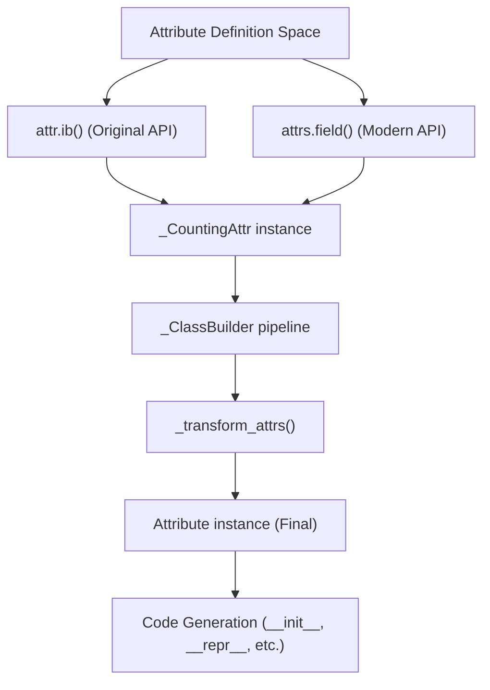

Sources: [src/attr/_make.py:106-213](), [docs/api.rst:6-18]()

## Internal Representation: _CountingAttr vs Attribute

The lifecycle of an attribute involves two distinct states:

### 1. _CountingAttr
When you call `attr.ib()` or `attrs.field()` in a class body, it returns a `_CountingAttr` [src/attr/_make.py:196-213](). This class tracks the order of definition using a global counter, which is essential for maintaining attribute order in Python versions where class dictionary order was not guaranteed [src/attr/_make.py:213](). It also provides decorators for defining defaults, validators, and converters [tests/test_make.py:108-201]().

### 2. Attribute
During the class transformation process (triggered by the class decorator), `_transform_attrs` converts these placeholders into `Attribute` objects [src/attr/_make.py:465-480](). The `Attribute` class is a read-only representation of the field's configuration, including its final `name`, `type`, and `alias` [src/attr/_make.py:2502-2545]().

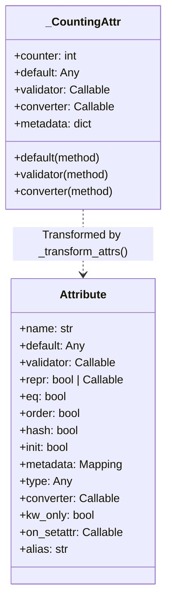

Sources: [src/attr/_make.py:196-213](), [src/attr/_make.py:465-480](), [src/attr/_make.py:2502-2545](), [docs/api.rst:40-56]()

## Key Attribute Parameters

### Default Values and Factories
`attrs` supports static defaults and dynamic factories.
- **Static Default**: Provided via the `default` argument [src/attr/_make.py:107]().
- **Factory**: Provided via the `factory` argument or the `attr.Factory` class. A factory is a callable that returns a new value for each instance [src/attr/_make.py:172-181]().
- **Decorator**: You can also use the `@attribute.default` decorator to define a factory that can optionally take `self` [tests/test_make.py:189-201]().

```python
@define
class C:
    x = field(default=42)
    y = field(factory=list)
    z = field()

    @z.default
    def _z_factory(self):
        return self.x + 1
```

Sources: [src/attr/_make.py:172-181](), [docs/init.md:123-135](), [tests/test_make.py:189-201]()

### Validation and Conversion
- **Converters**: Transform the input value before it is stored or validated [docs/init.md:231-242](). Converters can be provided as a decorator to the field [changelog.d/240.change.md:1](), [tests/test_make.py:139-153]().
- **Validators**: Check the final value and raise exceptions if invalid [docs/init.md:173-184](). They can also be applied via decorators [tests/test_make.py:108-138]().

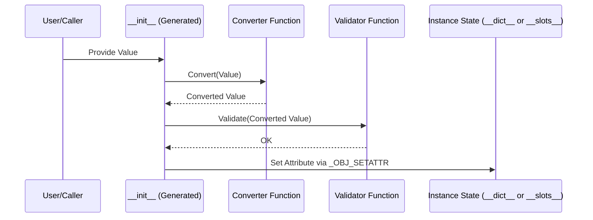

Sources: [docs/init.md:173-184](), [docs/init.md:231-242](), [changelog.d/240.change.md:1](), [tests/test_make.py:108-153]()

### Keyword-Only and Aliases
- **kw_only**: If set to `True`, the attribute must be passed as a keyword argument to `__init__` [src/attr/_make.py:149](). As of version 25.4.0, this can also be `None` to inherit class-level defaults [src/attr/_make.py:160-162]().
- **alias**: Overrides the name of the argument in `__init__`. By default, `attrs` strips leading underscores from attribute names (e.g., `_x` becomes `x` in `__init__`) [docs/init.md:73-82](), [docs/init.md:103-108]().

Sources: [src/attr/_make.py:149](), [src/attr/_make.py:160-162](), [docs/init.md:73-82](), [docs/init.md:103-108]()

## Type Annotations Integration

If `auto_attribs=True` is used (default in `@define`), `attrs` treats bare type annotations as attribute definitions [tests/test_annotations.py:106-114]().

- **Type Collection**: If a type annotation is present, it is stored in `Attribute.type` [tests/test_annotations.py:38-48]().
- **Conflicts**: If both a type annotation and a `type` argument in `field()` are present, `attrs` raises a `ValueError` [tests/test_annotations.py:57-65]().
- **ClassVars**: Annotations wrapped in `typing.ClassVar` are ignored by the attribute collection process [src/attr/_make.py:43-48](), [tests/test_annotations.py:108]().

Sources: [src/attr/_make.py:43-48](), [tests/test_annotations.py:38-48](), [tests/test_annotations.py:57-65](), [tests/test_annotations.py:106-114]()

## Attribute Metadata

The `metadata` parameter allows attaching arbitrary data to an attribute via a dictionary [src/attr/_make.py:183-184](). This data is stored in a `MappingProxyType` to ensure it is read-only after class creation [src/attr/_make.py:54](). It is primarily used by third-party extensions like `cattrs` for serialization hints [docs/api.rst:54]().

Sources: [src/attr/_make.py:54](), [src/attr/_make.py:183-184](), [docs/api.rst:54]()

## Attribute Definition Lifecycle

The following diagram illustrates how an attribute moves from declaration to usage in generated code.

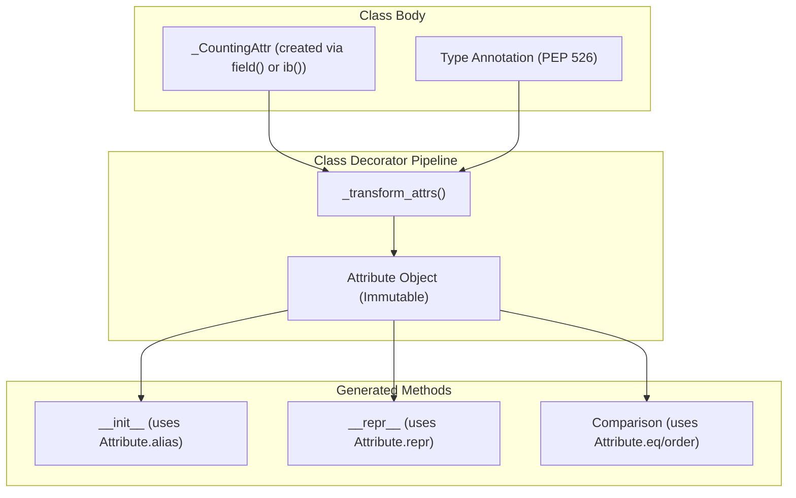

Sources: [src/attr/_make.py:375-480](), [src/attr/_make.py:621-792](), [src/attr/_make.py:2502-2545]()

---

# Page: Legacy vs Modern APIs

# Legacy vs Modern APIs

<details>
<summary>Relevant source files</summary>

The following files were used as context for generating this wiki page:

- [docs/api-attr.rst](docs/api-attr.rst)
- [docs/api.rst](docs/api.rst)
- [docs/glossary.md](docs/glossary.md)
- [docs/names.md](docs/names.md)
- [docs/why.md](docs/why.md)
- [src/attr/__init__.py](src/attr/__init__.py)
- [src/attr/__init__.pyi](src/attr/__init__.pyi)
- [src/attr/_next_gen.py](src/attr/_next_gen.py)
- [tests/test_next_gen.py](tests/test_next_gen.py)

</details>


## Purpose and Scope

This page documents the two API styles available in the `attrs` library: the original generation ("OG" or "legacy") API and the next generation ("NG" or "modern") API. While functionally similar, these APIs have different default behaviors and naming conventions. This document explains the differences between them, when to use each, and how to migrate between them.

The library maintains both namespaces: the legacy `attr` and the modern `attrs`. The modern API is primarily implemented in the `_next_gen` module as a set of wrappers that call the core logic with modernized defaults.

Sources: [src/attr/__init__.py:28-34](), [src/attr/_next_gen.py:1-6]()

## API Overview

The `attrs` repository provides two parallel API styles. Both APIs coexist and are fully supported, but they target different developer preferences regarding type annotations and class behavior. As of version 21.3.0, the package consists of two top-level names: `attr` (classic) and `attrs` (modern).

Sources: [docs/api.rst:11-17](), [src/attr/__init__.py:28-34]()

### System Mapping: API Entry Points

This diagram maps the natural language concepts of "Legacy" vs "Modern" to the specific code entities and file locations.

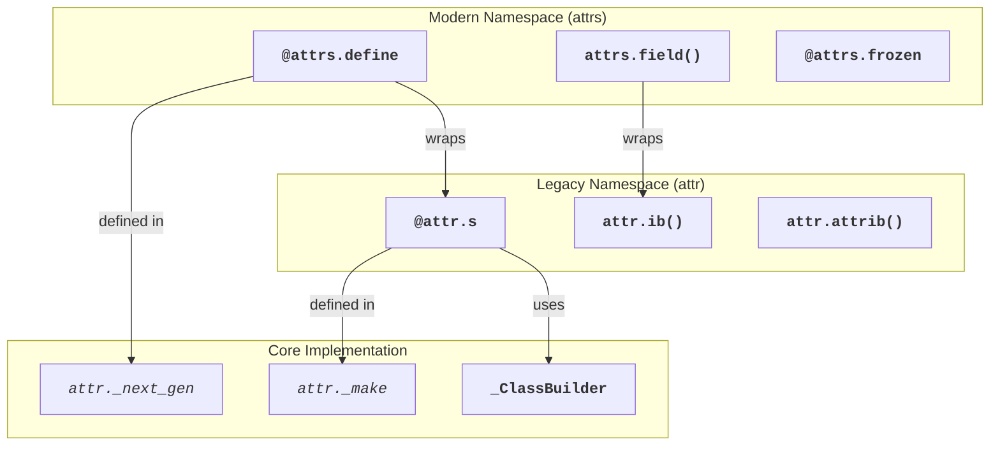

Sources: [src/attr/__init__.py:28-34](), [src/attr/_next_gen.py:23-47](), [src/attr/_make.py:1-50](), [docs/api.rst:6-18]()

## Legacy API (Original Generation)

The legacy API was designed before type annotations were common in Python. It relies on explicit attribute definitions assigned to class variables.

### Core Components
- **`@attr.s`**: The primary class decorator. It does not assume type annotations are used for fields unless `auto_attribs=True` is passed [docs/api-attr.rst:17-17]().
- **`attr.ib()`**: The function used to define attributes. It is typically assigned to a name: `x = attr.ib()` [docs/api-attr.rst:53-53]().
- **`attr.attrib`**: The "serious business" name for `attr.ib` [src/attr/__init__.py:33-33]().
- **`attr.s` aliases**: The decorator is also available as `attr.attributes` and `attr.s` [src/attr/__init__.py:32-32]().

### Default Behavior
By default, `@attr.s` creates "dict classes" (not slotted) and does not automatically run validators or converters when attributes are set after initialization [docs/api-attr.rst:17-17]().

Sources: [src/attr/__init__.py:32-34](), [docs/api-attr.rst:17-17](), [docs/names.md:44-50]()

## Modern API (Next Generation)

The modern API, introduced in version 20.1.0, is designed for modern Python (3.6+) and emphasizes type annotations and safer defaults.

### Core Components
- **`@attrs.define`**: The modern replacement for `@attr.s`. It enables `slots=True` and `auto_attribs=True` by default [src/attr/_next_gen.py:23-47]().
- **`attrs.field()`**: The modern replacement for `attr.ib()`. It is designed to work seamlessly with type annotations [src/attr/_next_gen.py:512-520]().
- **`@attrs.frozen`**: A convenience alias for `define(frozen=True)` which also sets `on_setattr=None` [src/attr/_next_gen.py:573-577]().
- **`@attrs.mutable`**: A direct alias for `define` to explicitly signal mutability [src/attr/_next_gen.py:566-570]().

### System Mapping: Modern Defaults Pipeline

The modern API functions as a configuration layer over the legacy core.

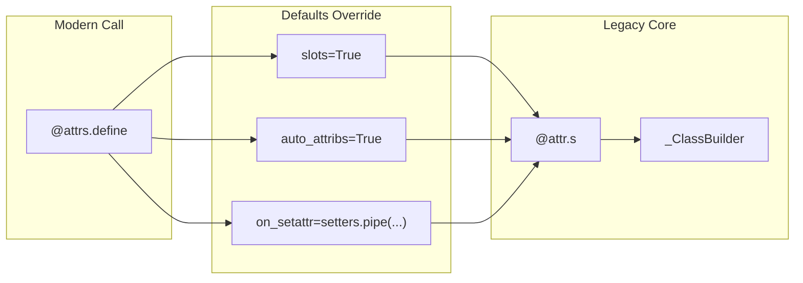

Sources: [src/attr/_next_gen.py:346-369](), [src/attr/_next_gen.py:48-115](), [docs/api.rst:24-38]()

## Key Differences

The following table compares the default configurations of the two APIs:

| Feature | Legacy (`@attr.s`) | Modern (`@attrs.define`) | Source |
| :--- | :--- | :--- | :--- |
| **Slots** | `False` | `True` | [src/attr/_next_gen.py:31]() |
| **Type Annotations** | `auto_attribs=False` | `auto_attribs=True` (Auto-detected) | [src/attr/_next_gen.py:35]() |
| **On SetAttr** | `None` (No action) | `setters.pipe(converter, validator)` | [src/attr/_next_gen.py:43]() |
| **Auto-Detect** | `False` | `True` | [src/attr/_next_gen.py:41]() |
| **Ordering** | `None` (Follows `eq`) | `False` | [src/attr/_next_gen.py:40]() |
| **Exception Support** | `False` | `True` (`auto_exc`) | [src/attr/_next_gen.py:38]() |

### Slotted Classes
Modern APIs default to `slots=True`. Slotted classes are more memory-efficient because they don't have a `__dict__`, but they prevent adding new attributes at runtime that weren't defined in `__slots__` [docs/glossary.md:21-30]().

### Attribute Setters (`on_setattr`)
A major functional difference is that `define` automatically runs converters and validators when you change an attribute value after the object is created (e.g., `obj.x = 5`). Legacy `@attr.s` only runs them during `__init__` unless explicitly configured [src/attr/_next_gen.py:101-115]().

Sources: [src/attr/_next_gen.py:23-47](), [src/attr/_next_gen.py:101-115](), [docs/glossary.md:21-30]()

## Automatic Type Handling

The modern API uses a sophisticated detection mechanism to decide whether to treat class variables as fields based on type annotations.

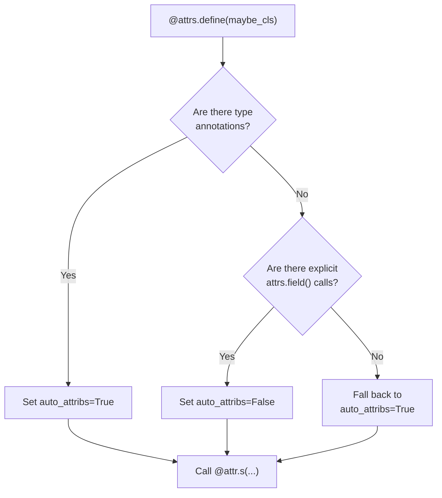

This logic allows developers to use bare type annotations (e.g., `x: int`) without needing an explicit `field()` call, which is the standard "Modern" style. If `auto_attribs` is `True`, unannotated `attrs.field()` calls will raise an `UnannotatedAttributeError` [src/attr/_next_gen.py:396-413](), [tests/test_next_gen.py:93-99]().

Sources: [src/attr/_next_gen.py:396-413](), [tests/test_next_gen.py:114-188]()

## When to Use Each API

### Use Modern (`attrs.define`) When:
- Starting a new project on Python 3.6+.
- You want the best performance and memory usage (via slots) by default [src/attr/_next_gen.py:31-31]().
- You use type annotations for your data models [docs/names.md:87-89]().
- You want runtime validation for attribute assignments [src/attr/_next_gen.py:101-115]().

### Use Legacy (`attr.s`) When:
- Maintaining older codebases that rely on the `attr` namespace [docs/api-attr.rst:6-9]().
- You explicitly need a "dict class" (non-slotted) without wanting to pass `slots=False` [docs/glossary.md:14-19]().
- You do not use type annotations and prefer the explicit `x = attr.ib()` syntax [docs/names.md:88-90]().
- You need the specific legacy behavior where validators only run during initialization [src/attr/_next_gen.py:4-6]().

Sources: [src/attr/_next_gen.py:23-47](), [src/attr/__init__.py:32-34](), [tests/test_next_gen.py:44-56](), [docs/names.md:10-29]()

---

# Page: Features and Extensions

# Features and Extensions

<details>
<summary>Relevant source files</summary>

The following files were used as context for generating this wiki page:

- [src/attr/_funcs.py](src/attr/_funcs.py)
- [src/attr/converters.py](src/attr/converters.py)
- [src/attr/converters.pyi](src/attr/converters.pyi)
- [src/attr/setters.py](src/attr/setters.py)
- [src/attr/validators.py](src/attr/validators.py)
- [src/attr/validators.pyi](src/attr/validators.pyi)
- [tests/__init__.py](tests/__init__.py)
- [tests/test_converters.py](tests/test_converters.py)
- [tests/test_funcs.py](tests/test_funcs.py)
- [tests/test_validators.py](tests/test_validators.py)

</details>


This page provides an overview of the additional features and extensions that `attrs` offers beyond basic class definition capabilities. These features enhance the robustness, flexibility, and utility of `attrs`-created classes, allowing for sophisticated validation, data transformation, mutation control, and object manipulation.

For information about the fundamental class definition mechanisms, see [Core Architecture](#2), and for specifics on how attributes are defined, see [Attribute Definition](#2.2).

## High-Level Features Overview

The `attrs` library extends far beyond simple boilerplate reduction with a comprehensive set of features:

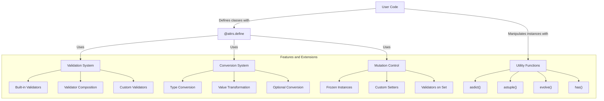

Sources: [src/attr/validators.py:1-40](), [src/attr/converters.py:1-18](), [src/attr/setters.py:1-80](), [src/attr/_funcs.py:1-25]()

## Validators System

Validators ensure that attribute values meet specific criteria. When a validator fails, it raises an exception (typically `ValueError` or `TypeError`), preventing invalid data from being assigned to attributes.

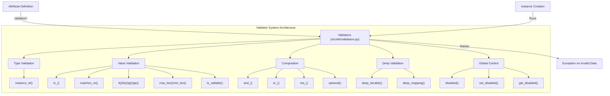

For details, see [Validators](#3.1).

### Global Validator Control

The `attrs` library provides functions to globally enable or disable validators via `set_disabled` [src/attr/validators.py:42-58](), which is useful for performance-critical code paths. The `disabled` context manager [src/attr/validators.py:73-90]() allows for temporary suppression of validation and is nestable [src/attr/validators.py:82]().

Sources: [src/attr/validators.py:42-90](), [tests/test_validators.py:39-116]()

## Conversion System

Converters transform attribute values during initialization, before validators run. This allows for automatic type conversion and value normalization. The `Converter` class [src/attr/_make.py:10]() can be configured with `takes_self` and `takes_field` parameters [tests/test_converters.py:19-20]().

| Converter | Description |
|-----------|-------------|
| `optional(converter)` | Allows `None` or applies the wrapped converter [src/attr/converters.py:21-63](). |
| `to_bool(val)` | Converts strings like "yes", "1", "on" to `True` [src/attr/converters.py:125-163](). |
| `default_if_none(default)` | Replaces `None` with a default value or factory result [src/attr/converters.py:66-123](). |
| `pipe(*converters)` | Chains multiple converters together [src/attr/_make.py:10](). |

For details, see [Converters](#3.2).

Sources: [src/attr/converters.py:1-163](), [tests/test_converters.py:18-260]()

## Setters and Mutation Control

The `attrs` library provides the `on_setattr` hook to control attribute mutation after object creation [src/attr/setters.py:4]().

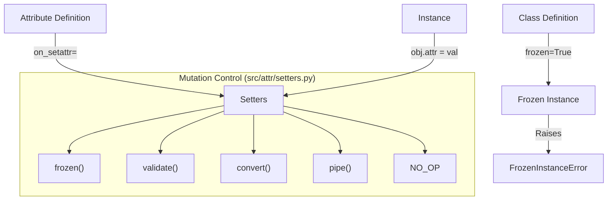

The `frozen` setter [src/attr/setters.py:29-35]() raises `FrozenAttributeError`, while `validate` [src/attr/setters.py:38-53]() and `convert` [src/attr/setters.py:56-74]() allow re-running logic during assignment. The `NO_OP` sentinel [src/attr/setters.py:79]() can be used to bypass class-wide hooks for specific attributes.

For details, see [Setters and Mutation Control](#3.3).

Sources: [src/attr/setters.py:1-80]()

## Utility Functions

`attrs` provides utility functions in `attr._funcs` to operate on instances.

| Function | Role |
|----------|------|
| `asdict()` | Recursively converts an instance to a dictionary [src/attr/_funcs.py:28-151](). Supports `filter` and `value_serializer`. |
| `astuple()` | Converts an instance to a tuple [src/attr/_funcs.py:207](). |
| `evolve()` | Creates a new instance with specified attributes changed [src/attr/_funcs.py:207](). |
| `has()` | Returns `True` if a class is an `attrs` class [src/attr/_funcs.py:207](). |
| `fields()` | Returns a tuple of `Attribute` objects for a class [src/attr/_funcs.py:7](). |

For details, see [Utility Functions](#3.4).

Sources: [src/attr/_funcs.py:1-240](), [tests/test_funcs.py:46-220]()

## Extension Points

`attrs` is designed for extensibility:
1. **Custom Validators**: Any callable taking `(inst, attr, value)` [src/attr/validators.py:96-108]().
2. **Custom Converters**: Functions taking a value (and optionally `inst` and `field` if using `Converter`) [src/attr/converters.py:38-41]().
3. **Hooks**: `__attrs_post_init__` for logic after the generated `__init__` finishes.

Sources: [src/attr/validators.py:113-127](), [src/attr/converters.py:21-63]()

---

# Page: Validators

# Validators

<details>
<summary>Relevant source files</summary>

The following files were used as context for generating this wiki page:

- [src/attr/_cmp.pyi](src/attr/_cmp.pyi)
- [src/attr/exceptions.pyi](src/attr/exceptions.pyi)
- [src/attr/filters.pyi](src/attr/filters.pyi)
- [src/attr/setters.pyi](src/attr/setters.pyi)
- [src/attr/validators.py](src/attr/validators.py)
- [src/attr/validators.pyi](src/attr/validators.pyi)
- [tests/test_validators.py](tests/test_validators.py)

</details>


This document explains the validation system in the `attrs` library, covering both built-in validators and the creation of custom validators. Validators provide run-time verification of attribute values during instance initialization and, optionally, during attribute assignment.

## Validator Concept

Validators are callables that check if attribute values meet specific criteria. If a value is invalid, the validator raises an exception (typically `ValueError` or `TypeError`). By default, validators run during the `__init__` method generated by `attrs`.

Title: Validator Execution Flow
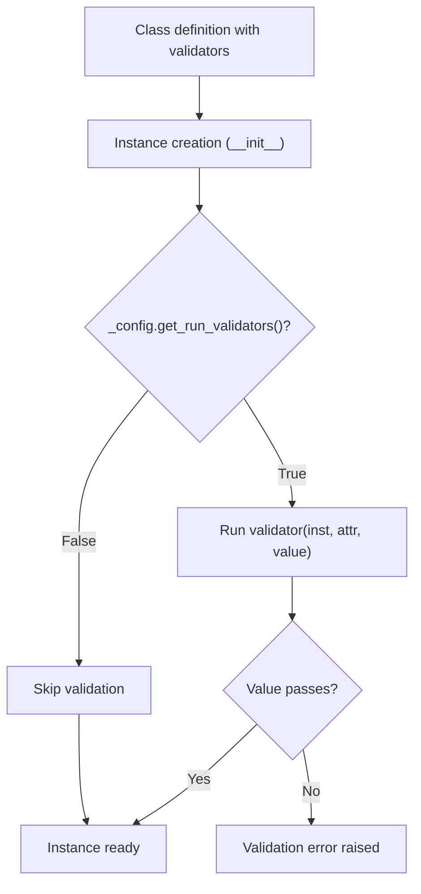
Sources: [src/attr/validators.py:13-17](), [src/attr/validators.py:96-107](), [src/attr/_make.py:3097-3112]()

### Validator Interface

A validator is any callable that follows this signature:

```python
def validator(instance, attribute, value):
    if not is_valid(value):
        raise ValueError("Invalid value")
```

- `instance`: The object being validated.
- `attribute`: The `attrs.Attribute` object being validated. [src/attr/validators.py:96-107]()
- `value`: The value being validated.

Title: Validator Class Hierarchy
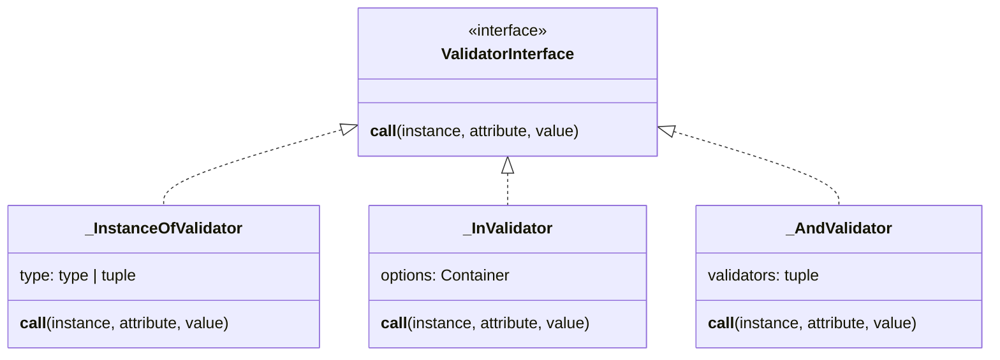
Sources: [src/attr/validators.py:93-108](), [src/attr/validators.py:236-254](), [src/attr/_make.py:3097-3112]()

## Using Validators

Validators are attached to attributes using the `validator` parameter in `attrs.field()` or `attr.ib()`. [src/attr/validators.py:14-15]()

```python
import attrs
from attrs.validators import instance_of

@attrs.define
class Person:
    name = attrs.field(validator=instance_of(str))
    age = attrs.field(validator=instance_of(int))
```
Sources: [src/attr/validators.py:113-128](), [tests/test_validators.py:183-186]()

## Built-in Validators

The `attrs` library provides a suite of commonly useful validators in the `attr.validators` (or `attrs.validators`) module. [src/attr/validators.py:19-39]()

### Type and Logic Validators
- `instance_of(type)`: Uses `isinstance` to check the value's type. Raises `TypeError` on failure. [src/attr/validators.py:113-127]()
- `is_callable()`: Ensures the value is a callable object. Raises `NotCallableError`. [src/attr/validators.py:316-331]()
- `optional(validator)`: Allows the value to be `None` or satisfy the provided validator. [src/attr/validators.py:214-232]()

### Comparison Validators
- `in_(options)`: Checks if the value is contained within `options`. [src/attr/validators.py:257-291]()
- `lt(val)`, `le(val)`, `gt(val)`, `ge(val)`: Perform standard comparison checks (`<`, `<=`, `>`, `>=`) using `operator` module. [src/attr/validators.py:440-501]()

### Collection and String Validators
- `matches_re(regex, flags=0, func=None)`: Validates a string against a regular expression. Supports `re.fullmatch`, `re.search`, and `re.match`. [src/attr/validators.py:152-197]()
- `min_len(length)` and `max_len(length)`: Validates the length of the value using `len()`. [src/attr/validators.py:503-558]()
- `deep_iterable(member_validator, iterable_validator=None)`: Validates every member of an iterable. [src/attr/validators.py:333-379]()
- `deep_mapping(key_validator, value_validator, mapping_validator=None)`: Validates keys and values of a mapping. [src/attr/validators.py:382-436]()

## Combining Validators

`attrs` provides logical combinators to build complex validation logic from simple parts.

| Combinator | Description | Implementation |
| :--- | :--- | :--- |
| `and_(*validators)` | All validators must pass. | `_AndValidator` [src/attr/_make.py:3097]() |
| `or_(*validators)` | At least one validator must pass. | `_OrValidator` [src/attr/validators.py:669]() |
| `not_(validator)` | Inverts the result of a validator. | `_NotValidator` [src/attr/validators.py:596]() |

Passing a `list` or `tuple` of validators to the `validator` argument of a field is automatically wrapped in an `and_` validator. [src/attr/validators.py:229-232](), [src/attr/_make.py:3115-3127]()

Sources: [src/attr/validators.py:596-666](), [src/attr/validators.py:669-712](), [src/attr/_make.py:3097-3112]()

## Creating Custom Validators

### Decorator Pattern
The most ergonomic way to define a custom validator is using the `.validator` decorator on a field. This adds the decorated function to the attribute's validator list.

```python
@attrs.define
class C:
    x = attrs.field()

    @x.validator
    def check(self, attribute, value):
        if value < 0:
            raise ValueError("x must be positive")
```
Sources: [tests/test_validators.py:183-186]()

### Callable Classes
For reusable validators, implementing a class with a `__call__` method allows for custom `__repr__` and parameterization.

```python
@attrs.frozen
class MyValidator:
    threshold = attrs.field()
    def __call__(self, inst, attr, value):
        if value < self.threshold:
            raise ValueError("Too low")
```
Sources: [src/attr/validators.py:93-112](), [src/attr/validators.py:130-149]()

## Disabling Validators

Validation can be expensive. `attrs` provides mechanisms to disable them globally or within specific scopes. This is not thread-safe. [src/attr/validators.py:51-53]()

- `set_disabled(bool)`: Globally enables or disables validation by calling `set_run_validators`. [src/attr/validators.py:42-57]()
- `get_disabled()`: Returns the current global state by calling `get_run_validators`. [src/attr/validators.py:60-69]()
- `disabled()`: A context manager to temporarily disable validators. As of version 26.1.0, this context manager is nestable. [src/attr/validators.py:72-89]()

```python
with attrs.validators.disabled():
    # Validation is skipped here
    c = C(x=-1) 
```
Sources: [src/attr/validators.py:72-89](), [tests/test_validators.py:83-85](), [src/attr/validators.py:82]()

## Execution Flow

Validators are executed after converters but before `__attrs_post_init__`.

Title: Data Flow from Input to Initialized Attribute
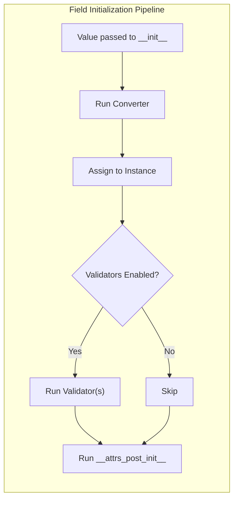
Sources: [src/attr/validators.py:84-89](), [src/attr/converters.py:15](), [src/attr/setters.pyi:12]()

---

# Page: Converters

# Converters

<details>
<summary>Relevant source files</summary>

The following files were used as context for generating this wiki page:

- [src/attr/_make.py](src/attr/_make.py)
- [src/attr/converters.py](src/attr/converters.py)
- [src/attr/converters.pyi](src/attr/converters.pyi)
- [tests/test_annotations.py](tests/test_annotations.py)
- [tests/test_converters.py](tests/test_converters.py)

</details>


Converters in `attrs` are functions that transform attribute values during object initialization. They provide a powerful way to normalize, validate, and transform input data before it's stored in an instance attribute. This page explains how converters work, the built-in converters provided by `attrs`, and how to create custom converters.

For information about validators, which check rather than transform values, see [Validators](#3.1).

## Core Concepts

When you define an attribute in an `attrs` class, you can specify a converter that will be applied to the attribute's value during initialization. Converters run before validators and can transform the input value into the desired form.

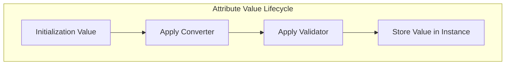

Sources: [src/attr/_make.py:106-213](), [src/attr/_make.py:1120-1135]()

Converters are specified using the `converter` parameter in `attr.ib()` or `attrs.field()` [src/attr/_make.py:115-122]():

```python
import attr
from attr.converters import to_bool

@attr.s
class Configuration:
    debug = attr.ib(converter=to_bool)

# These all result in config.debug = True
config1 = Configuration("yes")
config2 = Configuration(1)
config3 = Configuration("true")
```

Sources: [src/attr/_make.py:115-122](), [src/attr/converters.py:125-162]()

## Converter Types

`attrs` supports different types of converters with varying capabilities. The system distinguishes between simple callables and those wrapped in the `Converter` class which can request access to the instance (`self`) or the field definition.

### Code Entity Mapping: Converter Arguments
The following diagram maps the natural language requirements for "context-aware conversion" to the specific code entities in `attr._make`.

```mermaid
flowchart LR
    subgraph "attr._make.Converter"
        A["takes_self: bool"] -- "Enables" --> B["fn(val, self)"]
        C["takes_field: bool"] -- "Enables" --> D["fn(val, field)"]
        A & C -- "Combined" --> E["fn(val, self, field)"]
    end
    
    subgraph "attr._make._CountingAttr"
        F["converter attribute"] --> G["Simple Callable"]
        F --> H["Converter Instance"]
    end
```

Sources: [src/attr/_make.py:1120-1135](), [tests/test_converters.py:63-94]()

1. **Simple converters**: Functions that take a single argument (the value) and return the converted value.
2. **Self converters**: Functions that take the value and the instance being initialized [src/attr/_make.py:1120-1135]().
3. **Field converters**: Functions that take the value, the instance, and the field metadata (the `Attribute` object) [src/attr/_make.py:1120-1135]().

For complex converters that need access to the instance or field metadata, you must use the `Converter` class [src/attr/_make.py:1120-1135]():

```python
from attr import Converter

def complex_conversion(value, instance, field):
    # Access instance attributes or field metadata during conversion
    return value * instance.multiplier + field.metadata.get('offset', 0)

@attr.s
class C:
    multiplier = attr.ib(default=1)
    value = attr.ib(
        converter=Converter(complex_conversion, takes_self=True, takes_field=True),
        metadata={'offset': 10}
    )
```

## Built-in Converters

`attrs` provides several built-in converters in the `attr.converters` module [src/attr/converters.py:13-18]().

### optional

Wraps another converter to handle `None` values by returning `None` directly without calling the wrapped converter [src/attr/converters.py:21-63](). It also attempts to propagate type annotations from the wrapped converter using `_AnnotationExtractor` [src/attr/converters.py:50-58]().

```mermaid
flowchart TD
    A["Input Value"] --> B{"Is None?"}
    B -->|"Yes"| C["Return None"]
    B -->|"No"| D["Apply Wrapped Converter"]
    D --> E["Return Converted Value"]
```

Sources: [src/attr/converters.py:38-49](), [src/attr/converters.py:60-61]()

### default_if_none

Replaces `None` values with a static default value or the result of a factory function [src/attr/converters.py:66-122](). It does not support `takes_self=True` for factories [src/attr/converters.py:104-106]().

```python
from attr.converters import default_if_none

@attr.s
class Comment:
    # None values become empty strings
    text = attr.ib(converter=default_if_none(""))
    # None values become empty lists via factory
    tags = attr.ib(converter=default_if_none(factory=list))
```

Sources: [src/attr/converters.py:103-122]()

### pipe

Chains multiple converters together, applying them in sequence. The output of one converter becomes the input for the next [src/attr/_make.py:1145-1175]().

```mermaid
flowchart LR
    subgraph "pipe(c1, c2, c3)"
        A["Input"] --> B["c1"]
        B --> C["c2"]
        C --> D["c3"]
        D --> E["Output"]
    end
```

Sources: [src/attr/_make.py:1169-1175](), [tests/test_converters.py:231-241]()

For convenience, passing a `list` or `tuple` as the `converter` parameter to `attr.ib` automatically wraps them in a `pipe` [src/attr/_make.py:193-194]().

### to_bool

Converts various string, integer, and boolean values into a proper Python `bool` [src/attr/converters.py:125-162]().

| Category | Values mapping to `True` | Values mapping to `False` |
| :--- | :--- | :--- |
| **Boolean** | `True` | `False` |
| **String** | `"true"`, `"t"`, `"yes"`, `"y"`, `"on"`, `"1"` | `"false"`, `"f"`, `"no"`, `"n"`, `"off"`, `"0"` |
| **Integer** | `1` | `0` |

Sources: [src/attr/converters.py:156-159]()

## Integration with Type Annotations

`attrs` attempts to infer type annotations for `__init__` arguments from converters if they are present and introspectable [tests/test_annotations.py:203-226]().

### Annotation Extraction Logic
The `_AnnotationExtractor` utility is used internally by `optional` and other converters to propagate types [src/attr/converters.py:50-58]().

```mermaid
flowchart TD
    subgraph "Type Propagation"
        A["Converter Function"] --> B["_AnnotationExtractor"]
        B --> C["get_first_param_type()"]
        B --> D["get_return_type()"]
        C & D --> E["Update __annotations__ of result"]
    end
```

Sources: [src/attr/converters.py:50-58](), [src/attr/_compat.py:9]()

If a converter is provided, the `Converter` class will also copy return type annotations from the wrapped callable to its own `__call__` method [tests/test_converters.py:95-107]().

## Converter Execution in Initialization Process

Converters are executed inside the generated `__init__` method. If `on_setattr` is configured (e.g., via `setters.convert`), they also run during attribute assignment [src/attr/_make.py:59-60]().

```mermaid
flowchart TD
    A["__init__ Call"] --> B["Process Arguments"]
    B --> C["Run Converters"]
    C --> D["Run Validators"]
    D --> E["Assign to self._attribute"]
    E --> F["Run __attrs_post_init__"]
```

Sources: [src/attr/_make.py:1120-1135](), [tests/test_converters.py:115-133]()

### Performance and Implementation
The `Converter` class provides a `_fmt_converter_call` method which determines the exact string of Python code used to call the converter in the generated `__init__`, based on whether it `takes_self` or `takes_field` [tests/test_converters.py:34-61]().

Sources: `src/attr/_make.py`, `src/attr/converters.py`, `tests/test_converters.py`, `tests/test_annotations.py`

---

# Page: Setters and Mutation Control

# Setters and Mutation Control

<details>
<summary>Relevant source files</summary>

The following files were used as context for generating this wiki page:

- [src/attr/_cmp.pyi](src/attr/_cmp.pyi)
- [src/attr/exceptions.py](src/attr/exceptions.py)
- [src/attr/exceptions.pyi](src/attr/exceptions.pyi)
- [src/attr/filters.pyi](src/attr/filters.pyi)
- [src/attr/setters.py](src/attr/setters.py)
- [src/attr/setters.pyi](src/attr/setters.pyi)
- [tests/test_functional.py](tests/test_functional.py)
- [tests/test_setattr.py](tests/test_setattr.py)
- [tests/utils.py](tests/utils.py)

</details>


This page documents how the `attrs` library controls attribute mutation, including freezing attributes and classes, validating changes, and customizing attribute setting behavior. It covers implementation details of `on_setattr` hooks, the `setters` module, and exception handling for frozen instances.

## Overview

The `attrs` library provides several ways to control how attributes can be changed after an instance is created:

1.  **Freezing**: Preventing attributes from being modified at the class or attribute level [src/attr/setters.py:29-35]().
2.  **Validation**: Ensuring new values meet specific criteria during assignment [src/attr/setters.py:38-53]().
3.  **Conversion**: Transforming values during assignment [src/attr/setters.py:56-73]().
4.  **Custom setters**: Defining custom behavior during attribute setting via hooks [tests/test_setattr.py:26-50]().

These controls are implemented using hooks that intercept attribute assignments by generating or modifying the class's `__setattr__` method.

Sources: [src/attr/setters.py:1-80](), [src/attr/exceptions.py:1-38]()

## Mutation Control Mechanisms

### Freezing Instances

There are two main ways to create immutable (frozen) objects:

1.  **Class-level freezing**: Using `@attr.s(frozen=True)` [tests/test_functional.py:78-81](). This replaces `__setattr__` and `__delattr__` with versions that raise `FrozenInstanceError` [src/attr/exceptions.py:23-28]().
2.  **Attribute-level freezing**: Using `on_setattr=attr.setters.frozen` [src/attr/setters.py:29-35]().

When a class is frozen, an attempt to modify any attribute will raise a `FrozenInstanceError` [tests/test_functional.py:267-271]().

### On Setattr Hooks

The `on_setattr` parameter allows defining hooks that run when attributes are set. This can be specified:

1.  At the class level with `@attr.s(on_setattr=...)` [tests/test_setattr.py:81-84]().
2.  At the attribute level with `attr.ib(on_setattr=...)` [tests/test_setattr.py:37-38]().

Each hook is a function that takes `(instance, attribute, new_value)` as arguments and returns a potentially modified value [src/attr/setters.py:18-24]().

Sources: [tests/test_setattr.py:20-49](), [src/attr/setters.py:11-26](), [tests/test_functional.py:78-92]()

## Built-in Setters

The `attr.setters` module provides several pre-defined hooks:

### Frozen Setter (`attr.setters.frozen`)
Prevents a specific attribute from being modified after initialization by raising `FrozenAttributeError` [src/attr/setters.py:29-35](). This allows for "partially frozen" classes where only specific fields are immutable [tests/test_setattr.py:51-70]().

### Validate Setter (`attr.setters.validate`)
Runs the attribute's validator(s) on the new value [src/attr/setters.py:38-53](). It respects the global `_run_validators` configuration; if validators are disabled via `attr.set_run_validators(False)`, this hook returns the value without validating [src/attr/setters.py:44-45]().

### Convert Setter (`attr.setters.convert`)
Runs the attribute's converter on the new value and returns the result [src/attr/setters.py:56-73](). It supports both simple callables and the `attr._make.Converter` class which can take the instance and field as arguments [src/attr/setters.py:65-71]().

### Pipe Setter (`attr.setters.pipe`)
Combines multiple setters, executing them in sequence and passing the return value of one to the next [src/attr/setters.py:11-26](). It can also be triggered by passing a list of hooks to `on_setattr` [tests/test_setattr.py:122-134]().

### NO_OP Sentinel
The `attr.setters.NO_OP` sentinel is an object used to disable class-wide `on_setattr` hooks for specific attributes [src/attr/setters.py:76-79]().

Sources: [src/attr/setters.py:1-80](), [tests/test_setattr.py:72-147](), [src/attr/setters.pyi:1-21]()

## Attribute Mutation Lifecycle

The following diagram illustrates the data flow when an attribute is assigned a new value:

**Attribute Mutation Flow**
```mermaid
sequenceDiagram
    participant Client
    participant Instance
    participant SetAttr as "__setattr__"
    participant Hook as "on_setattr Hook"
    participant Validator as "Validator"
    participant Converter as "Converter"
    
    Client->>Instance: "instance.x = value"
    Instance->>SetAttr: "__setattr__('x', value)"
    
    alt "No on_setattr hooks"
        SetAttr->>Instance: "object.__setattr__(self, 'x', value)"
    else "frozen hook"
        SetAttr->>Hook: "frozen(instance, attribute, value)"
        Hook-->>Client: "raise FrozenAttributeError"
    else "validate hook"
        SetAttr->>Hook: "validate(instance, attribute, value)"
        Hook->>Validator: "v(instance, attribute, value)"
        Validator-->>Hook: "(validation passed)"
        Hook-->>SetAttr: "value"
        SetAttr->>Instance: "object.__setattr__(self, 'x', value)"
    else "convert hook"
        SetAttr->>Hook: "convert(instance, attribute, value)"
        Hook->>Converter: "c(value, instance, attribute)"
        Converter-->>Hook: "converted_value"
        Hook-->>SetAttr: "converted_value"
        SetAttr->>Instance: "object.__setattr__(self, 'x', converted_value)"
    else "pipe hooks"
        SetAttr->>Hook: "pipe(setters)(instance, attribute, value)"
        Note over Hook: "wrapped_pipe iterates through setters"
        Hook-->>SetAttr: "final_value"
        SetAttr->>Instance: "object.__setattr__(self, 'x', final_value)"
    end
```
Sources: [src/attr/setters.py:11-73](), [tests/test_setattr.py:26-50]()

## Code Entity Mapping

This diagram maps natural language concepts to the specific code entities in `attrs`:

**Mutation Control Entity Map**
```mermaid
flowchart TD
    subgraph "Natural Language Concepts"
        FreezeInst["Freeze Instance"]
        FreezeAttr["Freeze Attribute"]
        RunVal["Run Validators on Set"]
        RunConv["Run Converters on Set"]
        Combine["Combine Hooks"]
        Disable["Disable Class Hook"]
    end

    subgraph "Code Entity Space"
        FIE["FrozenInstanceError"]
        FAE["FrozenAttributeError"]
        SF["attr.setters.frozen"]
        SV["attr.setters.validate"]
        SC["attr.setters.convert"]
        SP["attr.setters.pipe"]
        SN["attr.setters.NO_OP"]
    end

    FreezeInst --> FIE
    FreezeAttr --> SF
    SF --> FAE
    RunVal --> SV
    RunConv --> SC
    Combine --> SP
    Disable --> SN
```
Sources: [src/attr/setters.py:1-80](), [src/attr/exceptions.py:1-38](), [tests/test_functional.py:267-282]()

## Implementation Details

### Frozen Classes and Hooks Conflict
A class cannot use both `frozen=True` and `on_setattr` hooks. Attempting to do so at the class level or on an individual attribute within a frozen class raises a `ValueError` with the message "Frozen classes can't use on_setattr." [tests/test_setattr.py:199-222](). However, `None` and `NO_OP` are permitted on frozen classes [tests/test_setattr.py:224-233]().

### Subclassing and `__setattr__`
If a class with an active `on_setattr` hook is subclassed, and the subclass does not generate a new setter, `attrs` ensures that `__setattr__` is correctly managed. If no hook is needed in the subclass, `__setattr__` may be reset to `object.__setattr__` [tests/test_setattr.py:234-258]().

### Exception Hierarchy
- `FrozenError`: Base class for mutation errors, inheriting from `AttributeError` [src/attr/exceptions.py:6-21]().
- `FrozenInstanceError`: Raised when a `frozen=True` class is modified [src/attr/exceptions.py:23-28]().
- `FrozenAttributeError`: Raised when an attribute with `setters.frozen` is modified [src/attr/exceptions.py:31-37]().

Sources: [src/attr/exceptions.py:1-38](), [tests/test_setattr.py:199-258](), [tests/test_functional.py:261-282]()

---

# Page: Utility Functions

# Utility Functions

<details>
<summary>Relevant source files</summary>

The following files were used as context for generating this wiki page:

- [docs/api.rst](docs/api.rst)
- [src/attr/_funcs.py](src/attr/_funcs.py)
- [src/attr/filters.py](src/attr/filters.py)
- [tests/__init__.py](tests/__init__.py)
- [tests/test_filters.py](tests/test_filters.py)
- [tests/test_funcs.py](tests/test_funcs.py)

</details>


This page documents the utility functions provided by the `attrs` library that operate on `attrs` class instances. These functions facilitate data serialization, instance modification, and introspection.

## Overview

The `attrs` library provides several essential utility functions primarily located in `attr._funcs`. These functions are designed to handle both modern `attrs.define` classes and legacy `attr.s` classes.

- `asdict`: Recursively converts an instance to a dictionary. [src/attr/_funcs.py:28-151]()
- `astuple`: Recursively converts an instance to a tuple. [src/attr/_funcs.py:207-285]()
- `has`: Checks if a class or instance is an `attrs` class. [src/attr/_funcs.py:326-351]()
- `evolve`: Creates a new instance based on an existing one with specified changes. [src/attr/_funcs.py:397-469]()
- `assoc`: A legacy function for creating modified copies. [src/attr/_funcs.py:354-394]()
- `resolve_types`: Resolves forward references in type annotations. [src/attr/_funcs.py:472-544]()

### Utility Function Data Flow
The following diagram illustrates how user code interacts with the main utility functions and their internal dependencies within the `attrs` package.

```mermaid
flowchart TD
    subgraph "attr._funcs"
        asdict["asdict()"] --> _asdict_anything["_asdict_anything()"]
        astuple["astuple()"] --> _astuple_anything["_astuple_anything()"]
        has["has()"]
        assoc["assoc()"] --> copy_copy["copy.copy()"]
        evolve["evolve()"]
    end
    
    subgraph "attr.filters"
        include["include()"] --> _split_what["_split_what()"]
        exclude["exclude()"] --> _split_what
    end
    
    A["User Code"] --> asdict
    A --> astuple
    A --> has
    A --> evolve
    A --> assoc
    A --> include
    A --> exclude
    
    asdict -.-> include
    asdict -.-> exclude
    astuple -.-> include
    astuple -.-> exclude
```

Sources: [src/attr/_funcs.py:11-544](), [src/attr/filters.py:1-72]()

## Instance Conversion Functions

### asdict

The `asdict` function iterates over the `Attribute` objects of a class (retrieved via `fields()`) and constructs a dictionary of their current values. [src/attr/_funcs.py:80-83]()

### asdict Internal Logic
This diagram maps the natural language requirements of serialization (recursion, filtering, serialization hooks) to the internal code path of `asdict`.

```mermaid
flowchart TD
    START["asdict(inst)"] --> FIELDS["Get attrs.fields(inst.__class__)"]
    FIELDS --> LOOP["For each Attribute 'a'"]
    LOOP --> FILTER{"filter(a, v)?"}
    FILTER -->|"False"| NEXT["Skip Attribute"]
    FILTER -->|"True"| SERIALIZE{"value_serializer?"}
    SERIALIZE -->|"Yes"| APPLY_SER["v = value_serializer(inst, a, v)"]
    APPLY_SER --> RECURSE
    SERIALIZE -->|"No"| RECURSE{"recurse=True?"}
    RECURSE -->|"Yes"| TYPE_CHECK{"Check type(v)"}
    TYPE_CHECK -->|"_ATOMIC_TYPES"| STORE["rv[a.name] = v"]
    TYPE_CHECK -->|"attrs class"| CALL_ASDICT["Recursive asdict(v)"]
    TYPE_CHECK -->|"Collection"| COLL_PROC["_asdict_anything(v)"]
    RECURSE -->|"No"| STORE
    STORE --> LOOP
```

**Key Features:**
- **Filtering**: Allows skipping attributes based on a predicate. [src/attr/_funcs.py:84-85]()
- **Recursion**: By default, it recursively converts nested `attrs` instances. [src/attr/_funcs.py:90-148]()
- **Collection Handling**: Converts `tuple`, `list`, `set`, and `frozenset` to `list` by default unless `retain_collection_types` is `True`. [src/attr/_funcs.py:103-104]()
- **Value Serializer**: A hook called for every attribute or dict key/value after filtering. [src/attr/_funcs.py:61-65](), [src/attr/_funcs.py:87-88]()
- **Dict Factory**: Allows using custom dictionary types like `OrderedDict`. [src/attr/_funcs.py:81]()

Sources: [src/attr/_funcs.py:28-151](), [tests/test_funcs.py:46-281]()

### astuple

Similar to `asdict`, but returns a tuple of values. It follows the same recursive logic through `_astuple_anything`. [src/attr/_funcs.py:207-285]()

| Parameter | Default | Description |
|-----------|---------|-------------|
| `recurse` | `True` | Recurse into nested `attrs` classes. [src/attr/_funcs.py:214]() |
| `filter` | `None` | A callable to include/exclude fields. [src/attr/_funcs.py:216]() |
| `tuple_factory` | `tuple` | The constructor for the resulting tuple. [src/attr/_funcs.py:222]() |
| `retain_collection_types` | `False` | Preserve original collection types. [src/attr/_funcs.py:225]() |

Sources: [src/attr/_funcs.py:207-285](), [tests/test_funcs.py:283-484]()

## Filtering

The `attrs.filters` module provides helpers for the `filter` argument in conversion functions.

- **`include(*what)`**: Returns `True` if the attribute or value matches the provided criteria (type, name string, or `Attribute` object). [src/attr/filters.py:21-45]()
- **`exclude(*what)`**: Returns `False` if the attribute or value matches. [src/attr/filters.py:48-72]()

Both use `_split_what` to categorize the filter criteria into classes, names (strings), and `Attribute` instances using `isinstance` checks. [src/attr/filters.py:10-19]()

Sources: [src/attr/filters.py:1-72](), [tests/test_filters.py:1-126]()

## Instance Inspection and Modification

### has

Determines if a class or instance is decorated with `attrs`. It checks for the presence of the `__attrs_attrs__` attribute on the class. [src/attr/_funcs.py:348-349]()

It also handles generic aliases (e.g., `List[int]`) by resolving the generic base via `get_generic_base`. [src/attr/_funcs.py:341-344]()

Sources: [src/attr/_funcs.py:326-351](), [src/attr/_compat.py:6]()

### evolve

The primary way to create a new instance with updated values. It is designed to work even with frozen classes by calling the constructor rather than mutating. [src/attr/_funcs.py:397-405]()

**Execution Flow:**
1. Identifying the attributes of the instance using `fields()`. [src/attr/_funcs.py:445]()
2. Collecting current values, preferring the `changes` provided in `**kwargs`. [src/attr/_funcs.py:447-459]()
3. Handling private attributes: if an attribute name starts with an underscore but the constructor argument does not (common in `attrs`), it strips the leading underscore. [src/attr/_funcs.py:453-455]()
4. Calling the class constructor with the aggregated arguments. [src/attr/_funcs.py:469]()

```mermaid
flowchart LR
    INST["Existing Instance"] --> EVOLVE["evolve(inst, **changes)"]
    EVOLVE --> FIELDS["fields(inst.__class__)"]
    FIELDS --> ARGS["Collect __init__ arguments"]
    ARGS --> OVERRIDE["Apply **changes** overrides"]
    OVERRIDE --> STRIP["Strip '_' from private attribute names"]
    STRIP --> NEW["inst.__class__(**args)"]
```

Sources: [src/attr/_funcs.py:397-469](), [tests/test_funcs.py:621-813]()

### assoc

A legacy version of `evolve`. Unlike `evolve`, which calls the constructor to ensure validation and consistency, `assoc` creates a shallow copy of the instance and then manually sets the new values on the copy using `_OBJ_SETATTR`. [src/attr/_funcs.py:388-394]()

Sources: [src/attr/_funcs.py:354-394](), [tests/test_funcs.py:547-619]()

## Type Resolution

### resolve_types

This utility is used to resolve forward references (strings) in type annotations into actual type objects. It modifies the `Attribute` objects of the class in-place by updating their `type` attribute. [src/attr/_funcs.py:472-544]()

It utilizes `typing.get_type_hints` to perform the resolution, allowing users to provide `globalns` and `localns` for the lookup. [src/attr/_funcs.py:535]()

Sources: [src/attr/_funcs.py:472-544]()

---

# Page: Advanced Topics

# Advanced Topics

<details>
<summary>Relevant source files</summary>

The following files were used as context for generating this wiki page:

- [CHANGELOG.md](CHANGELOG.md)
- [docs/extending.md](docs/extending.md)
- [docs/types.md](docs/types.md)
- [src/attr/_compat.py](src/attr/_compat.py)
- [src/attr/_make.py](src/attr/_make.py)
- [tests/strategies.py](tests/strategies.py)
- [tests/test_annotations.py](tests/test_annotations.py)
- [tests/test_slots.py](tests/test_slots.py)

</details>


This page covers the more complex and specialized features of the `attrs` library that go beyond basic usage. Understanding these topics will allow you to leverage the full power of `attrs` for sophisticated use cases. For information about basic usage, refer to [Core Architecture](#2).

## Slots Implementation

Python's `__slots__` is a memory optimization technique that restricts attributes to a predefined set, avoiding the need for a `__dict__` per instance. The `attrs` library provides robust support for this feature, making it the default in modern APIs like `@define`.

### System Mapping: Slots Generation

The following diagram bridges the natural language concept of "Slotted Class Creation" to the internal code entities that handle the transformation.

```mermaid
graph TD
    subgraph "Natural Language Space"
        UserDef["User defines @define(slots=True)"]
        MemOpt["Memory Optimization"]
        CP["Cached Property Support"]
    end

    subgraph "Code Entity Space (src/attr/_make.py)"
        CB["_ClassBuilder"]
        CSC["_create_slots_class"]
        Attribs["_CountingAttr / Attribute"]
    end

    UserDef --> CB
    CB --> CSC
    CSC -->|"Defines"| SlotsArray["__slots__"]
    SlotsArray --> MemOpt
    Attribs -->|"Metadata for"| CSC
    CSC -->|"Converts"| CP
```
Sources: [src/attr/_make.py:1052-1110](), [src/attr/_make.py:196-213]()

### Memory and Optimization
Enabling slots is achieved by passing `slots=True` to the class decorator. This creates a class where `__slots__` contains all defined attributes plus a `__weakref__` slot by default [tests/test_slots.py:82-91]().

Slotted classes consume significantly less memory because they do not have a per-instance `__dict__` [tests/test_slots.py:93-95](). However, they require special handling for features like `functools.cached_property`. `attrs` manages this by migrating cached properties and ensuring the class structure supports the necessary descriptors [tests/strategies.py:191-208]().

For details on the technical implementation of cell fixups, `super()` handling, and pickling, see [Slots Implementation](#4.1).

## Type Annotations

The `attrs` library seamlessly integrates with Python's type annotation system, providing support for static type checking with tools like mypy and pyright via `dataclass_transform`.

### Annotation Flow

```mermaid
graph LR
    subgraph "Annotation Extraction (src/attr/_compat.py)"
        AE["_AnnotationExtractor"]
        GA["_get_annotations"]
    end

    subgraph "Resolution (src/attr/_make.py)"
        RT["resolve_types()"]
        DT["dataclass_transform"]
    end

    GA --> AE
    AE --> RT
    RT -->|"Updates"| Fields["Attribute.type"]
```
Sources: [src/attr/_compat.py:26-40](), [src/attr/_compat.py:40-78](), [src/attr/_make.py:118-122]()

### Features
- **Auto-Attributes**: With `auto_attribs=True`, Python annotations are automatically converted to attributes without requiring explicit `attrs.field()` calls [tests/test_annotations.py:100-113]().
- **Forward References**: Type annotations can use strings for forward references, which can be resolved later using `attrs.resolve_types()` [docs/types.md:44-59](), [tests/test_annotations.py:41-52]().
- **Converter Inference**: `attrs` can infer attribute types for the `__init__` signature from the type hints of the converter function [tests/test_annotations.py:203-216]().
- **Modern Python Support**: Integration with `annotationlib` (PEP 749) ensures compatibility with deferred evaluation of annotations in Python 3.14+ [src/attr/_compat.py:20-29]().

For details on PEP-681 and static analysis integration, see [Type Annotations](#4.2).

## Customizing Comparison

By default, `attrs` generates equality (`__eq__`) and ordering (`__lt__`, `__le__`, `__gt__`, `__ge__`) methods based on the fields defined in the class.

### Comparison Logic
- **Class-Level**: Generation is controlled via `eq` and `order` parameters in the decorator [src/attr/_make.py:106-122]().
- **Field-Level**: Individual fields can be excluded or use a custom "key" function via the `eq` and `order` parameters of `field()` [src/attr/_make.py:164-166]().
- **Custom Callables**: Since version 21.1.0, `eq` and `order` also accept custom callables for specialized comparison logic [src/attr/_make.py:157-158]().
- **Key Functions**: The `_determine_attrib_eq_order` internal helper manages how comparison keys are assigned to attributes [src/attr/_make.py:164-166]().

For details on hashability, the `Hashability` enum, and the `_cmp` module, see [Customizing Comparison](#4.3).

## Hooks and Extensibility

The `attrs` library provides various hooks for customizing class and attribute behavior during initialization and mutation.

### Lifecycle Hooks
| Hook | Description |
| :--- | :--- |
| `__attrs_pre_init__` | Called before the generated `__init__` starts assigning values [tests/strategies.py:169-174](). |
| `__attrs_post_init__` | Called after the generated `__init__` finishes [tests/strategies.py:176-181](). |
| `field_transformer` | A hook that intercepts and modifies the list of attributes during class creation [docs/extending.md:186-204](). |
| `on_setattr` | Hooks called whenever an attribute is set on an instance after initialization [src/attr/_make.py:120-121](). |

### Mutation Control
`attrs` provides built-in `on_setattr` hooks in the `attrs.setters` module, such as `frozen` (to prevent changes), `validate` (to re-run validators), and `convert` (to re-run converters) [src/attr/_make.py:23](), [src/attr/_make.py:59]().

For details on subclassing behavior, metadata usage, and pattern matching, see [Hooks and Extensibility](#4.4).

## Notable Compatibility Features

### Python Version Abstractions
The library maintains a compatibility layer in `_compat.py` to handle differences across Python versions, including the new `annotationlib` introduced in Python 3.14 [src/attr/_compat.py:16-30](). It also detects PyPy environments to adjust behavior where necessary [src/attr/_compat.py:12]().

### Pattern Matching
`attrs` classes support Python's structural pattern matching (introduced in 3.10) by automatically generating `__match_args__` based on the attribute order [src/attr/_compat.py:13-16](), [CHANGELOG.md:150-151]().

Sources: [src/attr/_compat.py:1-100](), [src/attr/_make.py:1-250](), [docs/extending.md:1-220](), [docs/types.md:1-145]()

---

# Page: Slots Implementation

# Slots Implementation

<details>
<summary>Relevant source files</summary>

The following files were used as context for generating this wiki page:

- [src/attr/_compat.py](src/attr/_compat.py)
- [src/attr/_make.py](src/attr/_make.py)
- [tests/strategies.py](tests/strategies.py)
- [tests/test_annotations.py](tests/test_annotations.py)
- [tests/test_make.py](tests/test_make.py)
- [tests/test_slots.py](tests/test_slots.py)

</details>


This page details how the `attrs` library implements and utilizes Python's `__slots__` mechanism for memory optimization and performance enhancement. `__slots__` is a powerful Python feature that reduces memory consumption and improves attribute access speed by replacing the instance `__dict__` with a more efficient fixed attribute structure.

## Purpose and Benefits of Slots

Slots provide several key benefits when used with `attrs` classes:

1.  **Memory Efficiency**: Slotted classes consume less memory by eliminating the `__dict__` attribute per instance [tests/test_slots.py:78-95]().
2.  **Performance**: Attribute access is faster in slotted classes [tests/test_slots.py:100-101]().
3.  **Enforcement**: Slotted classes prevent adding arbitrary attributes at runtime, raising `AttributeError` on unauthorized assignments [tests/test_slots.py:97-98]().

### Data Representation Comparison

| Feature | Regular `attrs` Class | Slotted `attrs` Class |
| :--- | :--- | :--- |
| **Storage** | `__dict__` (hash map) | Fixed-size array (slots) |
| **Memory** | Larger per-instance overhead | Compact footprint |
| **Dynamic Attributes** | Allowed by default | Disallowed (AttributeError) |
| **Access Speed** | Standard lookup | Faster descriptor-based access |

```mermaid
graph TD
    subgraph "Memory Usage Comparison"
        A["Regular attrs Class"] --> B["Each Instance Has"]
        B --> C["__dict__ dictionary"]
        C --> D["Flexible but larger memory footprint"]
        
        E["Slotted attrs Class"] --> F["Each Instance Has"]
        F --> G["Fixed slots storage"]
        G --> H["Compact memory footprint"]
    end
```

**Sources:**
- [tests/test_slots.py:78-101]()
- [src/attr/_make.py:838-850]()

## Enabling Slots in attrs Classes

Slots can be enabled in both the legacy `attr.s` and modern `attrs.define` APIs by setting the `slots` parameter to `True`. By default, slotted classes in `attrs` include a `__weakref__` slot for weak reference support [tests/test_slots.py:91](). This can be controlled with the `weakref_slot` parameter [src/attr/_make.py:846-848]().

```mermaid
flowchart TD
    A["@attrs.define(slots=True)"] --> B["_ClassBuilder"]
    B --> C{"Process attr definition"}
    C --> D["_transform_attrs()"]
    D --> E["build_class()"]
    E --> F{"slots=True?"}
    F -->|"Yes"| G["_create_slots_class()"]
    F -->|"No"| H["_patch_original_class()"]
    G --> I["Add __slots__ tuple"]
    I --> J["Create new class with slots"]
    J --> K["Return slotted class"]
```

**Sources:**
- [src/attr/_make.py:784-786]()
- [src/attr/_make.py:846-848]()
- [tests/test_slots.py:91]()

## Implementation Details

The slots implementation in `attrs` is handled primarily by the `_ClassBuilder._create_slots_class()` method in `src/attr/_make.py`. This method is responsible for creating a new class based on the original one but with a defined `__slots__` structure.

### Slot Creation Process

When slots is enabled, `attrs` performs the following steps:

1.  **Class Dict Preparation**: It creates a clean class dictionary by copying the original `__dict__`, removing attributes that will be handled via slots [src/attr/_make.py:853-863]().
2.  **Slot Collection**: It determines which attributes need slots by checking current attributes and existing slots in base classes [src/attr/_make.py:865-877]().
3.  **Weakref Handling**: If `weakref_slot` is `True`, it adds `"__weakref__"` to the slots if not already present in a base class [src/attr/_make.py:882-890]().
4.  **Class Generation**: It calls `type(cls)(name, bases, cls_dict)` to create the new slotted class [src/attr/_make.py:937]().
5.  **Closure Cell Fixup**: It rewrites closure cell references to point to the new class to support `super()` and `__class__` [src/attr/_make.py:944-974]().

```mermaid
flowchart TD
    subgraph "_create_slots_class() Implementation"
        A["Begin slot creation"] --> B["Create clean class dict"]
        B --> C["Remove attributes that will be slotted"]
        C --> D["Check parent classes for existing slots"]
        D --> E["Determine which attributes need slots"]
        E --> F{"Add __weakref__ slot?"}
        F -->|"Yes"| G["Add __weakref__ to slots list"]
        F -->|"No"| H["Skip __weakref__"]
        G --> I["Create __slots__ tuple"]
        H --> I
        I --> J["Create new class with slots"]
        J --> K["Rewrite closure cell references"]
        K --> L["Return new slotted class"]
    end
```

**Sources:**
- [src/attr/_make.py:838-975]()
- [tests/test_slots.py:270-305]()

### Inheritance and Overrides

`attrs` handles complex inheritance scenarios:
*   **Slotted Base**: If a base class already has slots, `attrs` only adds slots for the new attributes defined in the subclass [src/attr/_make.py:865-877]().
*   **Non-Slotted Base**: If inheriting from a non-slotted class, the subclass still has slots, but instances will still have a `__dict__` inherited from the base, negating most memory benefits [tests/test_slots.py:143-169]().

**Sources:**
- [src/attr/_make.py:865-877]()
- [tests/test_slots.py:143-169]()
- [tests/test_slots.py:285-305]()

### super() and __class__ Cell Fixup

When a class is recreated as a slotted class, any methods using `super()` or `__class__` contain closure cells pointing to the *original* class. `attrs` iterates through the methods of the new class and updates these cells to point to the new slotted class [src/attr/_make.py:944-974](). This is critical for `super()` calls to resolve correctly in the new class hierarchy.

**Sources:**
- [src/attr/_make.py:944-974]()
- [tests/test_slots.py:415-485]()

## Advanced Features with Slots

### cached_property Migration

`functools.cached_property` typically relies on `__dict__`. When `slots=True`, `attrs` detects `cached_property` in base classes and migrates them to work with slots by adding the property name to `__slots__` and potentially generating a custom `__getattr__` [src/attr/_make.py:892-917]().

**Sources:**
- [src/attr/_make.py:892-917]()
- [src/attr/_make.py:483-532]()

### Hash Caching

If `cache_hash=True` is used with slots, `attrs` automatically adds a private slot `_attrs_cached_hash` to store the computed hash value [src/attr/_make.py:51-52](), [src/attr/_make.py:934-935](). For non-slotted classes, a `_CacheHashWrapper` is used to ensure the hash isn't pickled [src/attr/_make.py:90-103]().

**Sources:**
- [src/attr/_make.py:51-52]()
- [src/attr/_make.py:90-103]()
- [src/attr/_make.py:934-935]()

### Serialization (Pickling)

Slotted classes require explicit `__getstate__` and `__setstate__` for robust pickling since they lack a `__dict__`. `attrs` can generate these automatically [src/attr/_make.py:998-1037](). 

*   **`__getstate__`**: Returns a tuple or dict of slotted values [src/attr/_make.py:1016-1025]().
*   **`__setstate__`**: Restores values using `object.__setattr__` to bypass potential `__setattr__` logic (like frozen classes) [src/attr/_make.py:1027-1037]().

**Sources:**
- [src/attr/_make.py:998-1037]()
- [tests/test_slots.py:611-645]()

## Summary of Behavioral Differences

```mermaid
flowchart TD
    subgraph "Functional Differences with Slots"
        A["Slotted attrs Class"] --> B["Fast attribute access"]
        A --> C["Fixed attribute set"]
        A --> D["Lower memory usage"]
        A --> E["Special handling for weakrefs"]
        
        F["Regular attrs Class"] --> G["Standard attribute access"]
        F --> H["Dynamic attributes can be added"]
        F --> I["Higher memory usage"]
        F --> J["Automatic weakref support"]
    end
```

**Sources:**
- [src/attr/_make.py:838-975]()
- [tests/test_slots.py:78-101]()

---

# Page: Type Annotations

# Type Annotations

<details>
<summary>Relevant source files</summary>

The following files were used as context for generating this wiki page:

- [.github/AI_POLICY.md](.github/AI_POLICY.md)
- [.github/CONTRIBUTING.md](.github/CONTRIBUTING.md)
- [.github/PULL_REQUEST_TEMPLATE.md](.github/PULL_REQUEST_TEMPLATE.md)
- [.python-version-default](.python-version-default)
- [src/attr/_make.py](src/attr/_make.py)
- [src/attrs/__init__.py](src/attrs/__init__.py)
- [src/attrs/__init__.pyi](src/attrs/__init__.pyi)
- [tests/dataclass_transform_example.py](tests/dataclass_transform_example.py)
- [tests/test_annotations.py](tests/test_annotations.py)
- [tests/test_mypy.yml](tests/test_mypy.yml)
- [tests/test_pyright.py](tests/test_pyright.py)
- [typing-examples/README.md](typing-examples/README.md)
- [typing-examples/baseline.py](typing-examples/baseline.py)
- [typing-examples/mypy.py](typing-examples/mypy.py)

</details>


This page explains how `attrs` integrates with Python's type annotation system. It covers both PEP 526-style annotations and `attrs`' own type parameter mechanisms, how `attrs` preserves type information for introspection, and its integration with static type checkers including Mypy and Pyright.

## Overview of Type Annotations in attrs

The `attrs` library provides first-class support for Python's type annotation system. Type annotations in `attrs` serve multiple purposes:

1.  **Documentation**: Providing type information for users of the class.
2.  **Static type checking**: Enabling tools like Mypy and Pyright to validate code before execution.
3.  **Runtime introspection**: Making type information available at runtime through the `attrs` API.
4.  **Integration**: Supporting serialization (like `asdict`), validation, and IDE features.

Type annotations are optional, but when used with the modern API (`@attrs.define`), they enable powerful static checking capabilities and reduce boilerplate.

Sources: [src/attr/__init__.pyi:1-44](), [src/attrs/__init__.py:1-30]()

## Type Annotation Methods

`attrs` supports multiple ways to annotate attributes with type information:

### PEP 526 Style Annotations (Recommended)
Used with the modern API, `attrs` automatically detects these annotations when `auto_attribs=True` (which is the default for `define`). Bare annotations (without an explicit `field()` or `ib()`) are collected as attributes when this mode is enabled [tests/test_annotations.py:101-116]().

```python
from attrs import define

@define
class Person:
    name: str
    age: int
    address: str = "Unknown"
```

### Type Parameter with `field()` / `ib()`
For legacy code or explicit control, the `type` argument can be passed directly to the field definition [src/attr/_make.py:106-122]().

```python
from attr import s, ib

@s
class Person:
    name = ib(type=str)
    age = ib(type=int)
```

### Style Conflict Resolution
If both a PEP 526 annotation and a `type` argument are provided for the same attribute, `attrs` raises a `ValueError` to prevent ambiguity [tests/test_annotations.py:53-65]().

### Diagram: Type Discovery and Conflict Handling

```mermaid
flowchart TD
    subgraph "Type_Discovery_Flow"
        [Class_Definition] --> B{"auto_attribs?"}
        B -- "True (define)" --> C["Extract via _get_annotations"]
        B -- "False (attr.s)" --> D["Look for attr.ib()"]
        
        C --> E["Create _CountingAttr"]
        D --> E
        
        E --> F{"Conflict Check"}
        F -- "Annotation + type=" --> G["Raise ValueError"]
        F -- "Unique source" --> H["Store in Attribute.type"]
    end
    
    H --> I["Accessible via attrs.fields()"]
```

Sources: [src/attr/_make.py:106-122](), [tests/test_annotations.py:36-52](), [src/attr/_compat.py:28-31](), [src/attr/_make.py:196-213]()

## Storage and Access of Type Information

Type information is stored in the `Attribute` objects that make up a class's `__attrs_attrs__` metadata. Each attribute carries its type information in the `.type` field [src/attr/_make.py:2555-2570]().

```python
from attrs import define, field, fields

@define
class Example:
    x: int = field()

# Access type information at runtime
print(fields(Example).x.type)  # <class 'int'>
```

`attrs` itself does not perform runtime type checking based on these annotations by default, though they can be used by validators like `instance_of`.

Sources: [src/attr/__init__.pyi:24-38](), [src/attrs/__init__.py:15-22](), [src/attr/_make.py:2555-2570]()

## Forward References and `resolve_types`

Python often requires forward references (strings) for types not yet defined. `attrs` provides `resolve_types` to convert these string annotations into actual type objects at runtime.

```python
from attrs import define, resolve_types

@define
class Node:
    parent: "Node" | None = None

resolve_types(Node)
```

`resolve_types` iterates through the attributes and uses `typing.get_type_hints` to resolve string literals, updating the `Attribute.type` field in place [src/attr/_make.py:3095-3120](). It specifically handles `ClassVar` by ignoring them during attribute collection based on prefixes like `typing.ClassVar` [src/attr/_make.py:43-48]().

Sources: [src/attr/_make.py:3095-3140](), [tests/test_annotations.py:72-80](), [src/attr/_make.py:43-48]()

## Static Type Checker Integration

### Mypy Integration
Mypy uses a dedicated plugin to understand `attrs` classes. It validates that constructor arguments match the types defined in the class body [tests/test_mypy.yml:1-13](). It also handles `auto_attribs` logic, ensuring that unannotated `attr.ib`s are flagged if `auto_attribs=True` [tests/test_mypy.yml:101-112](). `attrs` also provides `AttrsInstance` as a `Protocol` for Mypy to statically accept `attrs` classes [src/attr/_typing_compat.pyi:6-10]().

### Pyright and `dataclass_transform`
`attrs` supports PEP 681 (`dataclass_transform`), allowing Pyright and other LSP-based tools to provide completions and type checking without a custom plugin. The `define`, `frozen`, and `mutable` decorators are marked with `@dataclass_transform` in the type stubs [src/attrs/__init__.pyi:158-182]().

| Feature | Mypy Support | Pyright (PEP 681) |
| :--- | :--- | :--- |
| **Decorator** | `@attr.s`, `@attrs.define` | `@attrs.define`, `@attrs.frozen` |
| **Field Alias** | Supported | Supported [tests/test_pyright.py:48-57]() |
| **Converters** | Complex inference | Basic inference [tests/test_pyright.py:111-135]() |
| **Frozen** | `frozen=True` detection | `frozen=True` detection [tests/test_pyright.py:26-33]() |

### Diagram: Static Analysis and Code Entity Mapping

```mermaid
graph LR
    subgraph "Static_Analysis_Space"
        [Mypy_Plugin]
        [Pyright_PEP_681]
    end

    subgraph "Code_Entity_Space"
        [define_decorator]
        [frozen_decorator]
        [attrs_init_pyi]
        [AttrsInstance_Protocol]
    end

    [attrs_init_pyi] -- "defines" --> [define_decorator]
    [attrs_init_pyi] -- "defines" --> [frozen_decorator]
    [define_decorator] -- "uses" --> [dataclass_transform]
    [dataclass_transform] -- "signals to" --> [Pyright_PEP_681]
    [Mypy_Plugin] -- "inspects" --> [define_decorator]
    [Mypy_Plugin] -- "uses" --> [AttrsInstance_Protocol]
```

Sources: [src/attrs/__init__.pyi:158-213](), [tests/test_pyright.py:35-80](), [tests/test_mypy.yml:82-99](), [src/attr/_typing_compat.pyi:1-16]()

## Converters and Type Annotations

Converters can complicate type signatures because the type passed to `__init__` might differ from the type stored on the instance.

1.  **Inference from Converter**: If an attribute is unannotated but has a converter with type hints, `attrs` can sometimes infer the `__init__` type from the converter's first argument [tests/test_annotations.py:203-217]().
2.  **Explicit Override**: Explicit annotations usually take precedence for the instance attribute type, while the converter's signature informs the `__init__` argument type [tests/test_annotations.py:227-242]().
3.  **Composite Converters**: When using a `list` or `tuple` of converters, `attrs` uses `pipe` to chain them, and type checkers can validate the sequence [src/attr/_make.py:193-194](), [tests/test_pyright.py:111-135]().

Sources: [tests/test_annotations.py:203-242](), [src/attr/_make.py:115-121](), [src/attr/_make.py:193-194]()

## Internal Type Processing Architecture

The following diagram shows how `attrs` processes type information during class creation using the `_ClassBuilder`.

```mermaid
sequenceDiagram
    participant User as "User Code"
    participant Define as "@attrs.define"
    participant Builder as "_ClassBuilder"
    participant Compat as "_compat._get_annotations"

    User->>Define: "Decorate Class"
    Define->>Builder: "__init__(..., auto_attribs=True)"
    Builder->>Compat: "_get_annotations(cls)"
    Compat-->>Builder: "Return dict of {name: type}"
    Builder->>Builder: "Match annotations to _CountingAttr"
    Note over Builder: "Create Attribute(type=extracted_type)"
    Builder->>User: "Return transformed class"
```

Sources: [src/attr/_make.py:1255-1280](), [src/attr/_compat.py:28-31](), [src/attr/_make.py:2360-2380]()

---

# Page: Customizing Comparison

# Customizing Comparison

<details>
<summary>Relevant source files</summary>

The following files were used as context for generating this wiki page:

- [docs/comparison.md](docs/comparison.md)
- [docs/hashing.md](docs/hashing.md)
- [src/attr/_cmp.py](src/attr/_cmp.py)
- [tests/test_cmp.py](tests/test_cmp.py)
- [tests/test_dunders.py](tests/test_dunders.py)

</details>


This page explains how to customize equality (`==`, `!=`) and ordering (`<`, `>`, `<=`, `>=`) comparisons in `attrs` classes. It covers class-level parameters, attribute-level overrides, the internal implementation of comparison logic, and the relationship between comparison and hashability.

## Default Comparison Behavior

By default, when you define a class with `@attrs.define` or `@attr.s`, `attrs` generates the following methods:

- `__eq__` and `__ne__` methods for equality comparison (controlled by the `eq` parameter). [docs/comparison.md:3-4]()
- `__lt__`, `__gt__`, `__le__`, and `__ge__` methods for ordering comparison (controlled by the `order` parameter). [docs/comparison.md:6]()

Note that `@attrs.define` sets `eq=True` and `order=False` by default, while the legacy `@attr.s` sets both to `True`. [docs/comparison.md:67-70]()

### Comparison Implementation Logic

#### Equality Comparison
For equality comparison (`==`, `!=`), `attrs` generates a statement that:
1. Compares the types of both instances (they must be identical). [docs/comparison.md:8-9]()
2. Compares each attribute in turn using the `==` operator. [docs/comparison.md:9]()

#### Ordering Comparison
For ordering comparison (`<`, `>`, `<=`, `>=`), `attrs`:
1. Checks if the types of the instances are equal. [docs/comparison.md:13]()
2. If equal, creates a tuple of all attribute values for each instance. [docs/comparison.md:14]()
3. Performs the desired comparison operation on those tuples. [docs/comparison.md:15]()

### Comparison Flow Diagram

```mermaid
flowchart TD
    subgraph "Equality: a == b"
    A["Check type(a) is type(b)"] --> B{"Types Match?"}
    B -- "No" --> C["Return False"]
    B -- "Yes" --> D["Compare attributes sequentially"]
    D --> E{"All attributes equal?"}
    E -- "Yes" --> F["Return True"]
    E -- "No" --> G["Return False"]
    end

    subgraph "Ordering: a < b"
    H["Check type(a) is type(b)"] --> I{"Types Match?"}
    I -- "No" --> J["Return NotImplemented"]
    I -- "Yes" --> K["Create value tuples: (attr1, attr2, ...)"]
    K --> L["Perform tuple comparison"]
    L --> M["Return Result"]
    end
```

Sources:
- [docs/comparison.md:3-15]()
- [tests/test_dunders.py:136-160]()
- [tests/test_dunders.py:186-217]()

## Excluding Attributes from Comparison

You can exclude specific fields from comparison operations using the `eq` and `order` parameters in `attrs.field`. [docs/comparison.md:21-28]()

```python
from attrs import define, field

@define
class User:
    login: str
    password: str = field(eq=False) # Excluded from ==
    last_seen: float = field(eq=False, order=False) # Excluded from all
```

When `eq=False` is set on an attribute, the generated `__eq__` logic skips that specific field. [tests/test_dunders.py:125-135]()

Sources:
- [docs/comparison.md:21-32]()
- [tests/test_dunders.py:125-135]()

## Custom Comparison Callables

Instead of a boolean, you can pass a *callable* to `eq` or `order`. This callable acts as a **key function** (similar to the `key` argument in `sorted()`). [docs/comparison.md:34-36]()

- **Equality customization**: The callable transforms the value before the `==` check. [docs/comparison.md:38-43]()
- **Order customization**: The callable transforms the value before it is placed into the comparison tuple. [docs/comparison.md:45-51]()

```python
@define
class S:
    x: str = field(eq=str.lower) # Case-insensitive equality

@define(order=True)
class C:
    x: str = field(order=int) # Order strings as integers
```

Sources:
- [docs/comparison.md:34-51]()
- [tests/test_dunders.py:40-62]()

## The `cmp_using` Helper

The `attr._cmp.cmp_using` helper creates a wrapper class to customize comparison for fields that don't support standard operators (like NumPy arrays, which return an array of booleans instead of a single boolean). [src/attr/_cmp.py:13-21]() [docs/comparison.md:56-65]()

### `cmp_using` Implementation

The function dynamically creates a class (default name "Comparable") using `types.new_class`. [src/attr/_cmp.py:53-94]() It implements `__eq__`, `__lt__`, `__le__`, `__gt__`, and `__ge__` by wrapping the provided callables. [src/attr/_cmp.py:71-90]()

| Parameter | Role |
| :--- | :--- |
| `eq`, `lt`, `le`, `gt`, `ge` | Callables used for the respective comparison operation. [src/attr/_cmp.py:30-47]() |
| `require_same_type` | If `True`, methods return `NotImplemented` if values are not of the same type. [src/attr/_cmp.py:49-51]() |
| `class_name` | The name of the generated wrapper class. [src/attr/_cmp.py:53]() |

```mermaid
graph TD
    A["cmp_using(eq=func1, lt=func2)"] --> B["Create 'Comparable' class via types.new_class"]
    B --> C["Define _make_init to store value in .value"]
    B --> D["Define __eq__ using _make_operator(eq, func1)"]
    B --> E["Define __lt__ using _make_operator(lt, func2)"]
    B --> F["Apply functools.total_ordering if partial ops defined"]
    F --> G["Return wrapper class"]
```

Sources:
- [src/attr/_cmp.py:13-109]()
- [docs/comparison.md:56-66]()
- [tests/test_cmp.py:14-37]()

## Hashing and Comparison

Hashing is intrinsically linked to equality. In Python, objects that compare equal **must** have the same hash. [docs/hashing.md:26-27]()

### Hashability Rules in `attrs`
- **Frozen Classes**: `attrs` automatically generates `__hash__` if `frozen=True`. [docs/hashing.md:57-58]()
- **Unsafe Hashing**: You can force hash generation with `unsafe_hash=True` (or the legacy `hash=True`), but the object should not be mutated after hashing. [docs/hashing.md:58-59]() [docs/hashing.md:65-69]()
- **Hash Caching**: If `cache_hash=True` is passed to `@define`, the hash value is computed once and stored on the instance to speed up future lookups. [docs/hashing.md:80-86]()

### Hash Generation Implementation
The hash is computed by hashing a tuple consisting of a unique ID for the class and all attribute values. [docs/hashing.md:24]() If `cache_hash=True` is enabled, the hash is computed once and stored. [docs/hashing.md:82-84]() In slotted classes, the cached hash is stored in a dedicated slot; in non-slotted classes, it is stored as an attribute. [tests/test_dunders.py:70-77]()

Sources:
- [docs/hashing.md:1-86]()
- [tests/test_dunders.py:64-77]()

## API Mapping

The following diagram maps the Natural Language concepts of comparison to the Code Entities in `attrs`.

```mermaid
classDiagram
    class ClassDecorator {
        <<@attrs.define / @attr.s>>
        +eq: bool
        +order: bool
        +unsafe_hash: bool
        +cache_hash: bool
    }
    class AttributeField {
        <<attrs.field / attr.ib>>
        +eq: bool | callable
        +order: bool | callable
        +hash: bool | None
    }
    class CmpModule {
        +cmp_using()
        +_make_operator()
        +_check_same_type()
    }
    class MakeModule {
        +_add_hash()
        +__ne__()
        +_make_init_script()
    }

    ClassDecorator --|> AttributeField : "Controls inclusion"
    AttributeField ..> CmpModule : "Uses cmp_using helper"
    ClassDecorator ..> MakeModule : "Generates dunders via _compile_and_eval"
```

Sources:
- [src/attr/_cmp.py:13-21]()
- [docs/comparison.md:1-71]()
- [docs/hashing.md:1-86]()
- [src/attr/_cmp.py:7-7]()
- [tests/test_dunders.py:89-107]()

---

# Page: Hooks and Extensibility

# Hooks and Extensibility

<details>
<summary>Relevant source files</summary>

The following files were used as context for generating this wiki page:

- [CHANGELOG.md](CHANGELOG.md)
- [docs/examples.md](docs/examples.md)
- [docs/extending.md](docs/extending.md)
- [docs/license.md](docs/license.md)
- [docs/types.md](docs/types.md)
- [tests/test_config.py](tests/test_config.py)
- [tests/test_hooks.py](tests/test_hooks.py)
- [tests/test_init_subclass.py](tests/test_init_subclass.py)
- [tests/test_pattern_matching.py](tests/test_pattern_matching.py)

</details>


This page documents the various hooks and extension points provided by the `attrs` library, allowing users to customize class creation, attribute behavior, and instance lifecycle. These mechanisms enable you to adapt `attrs` to specific use cases while maintaining its core simplicity.

## Overview

The `attrs` library provides several hooks that allow you to extend its functionality at different points in a class's lifecycle:

Title: Attrs Lifecycle and Extension Hooks
```mermaid
flowchart TD
    subgraph "Class Creation Phase"
        A["Class Definition (@attrs.define)"] --> B["field_transformer Hook"]
        B --> C["Class Finalization"]
    end
    
    subgraph "Instance Lifecycle"
        D["Instance Creation (__init__)"] --> E["__attrs_pre_init__"]
        E --> F["Attribute Assignment"]
        F --> G["__attrs_post_init__"]
        G --> H["Instance Ready"]
    end
    
    subgraph "Attribute Access/Mutation"
        H --> I["Attribute Setting (setattr)"]
        I --> J["on_setattr Hooks"]
        J --> J1["setters.convert"]
        J --> J2["setters.validate"]
        J --> J3["setters.frozen"]
        J --> J4["Custom Hooks"]
    end
    
    subgraph "Other Extensions"
        H --> K["Serialization (asdict)"]
        K --> L["value_serializer Hook"]
        C --> M["Subclass Creation"]
        M --> N["__init_subclass__"]
    end
```
Sources: [docs/extending.md:186-204](), [tests/test_hooks.py:12-235](), [CHANGELOG.md:75-76]()

## Field Transformer

The `field_transformer` hook allows you to transform attributes before they are applied to a class. This is specified as a parameter to `@attr.s()`, `@attrs.define()`, or `@attrs.frozen()`.

### Implementation and Data Flow

Title: field_transformer Data Flow
```mermaid
flowchart LR
    A["Raw _CountingAttr List"] --> B["_ClassBuilder._transform_attrs"]
    B --> C{{"field_transformer\n(Callable)"}}
    C --> D["Final list[Attribute]"]
    D --> E["__attrs_attrs__ Tuple"]
    
    subgraph "Logic in _make.py"
        B["_ClassBuilder._transform_attrs"]
        E["__attrs_attrs__"]
    end
```

The field transformer:
- Receives the class being decorated and a list of `Attribute` objects [docs/extending.md:195-201]().
- Can modify, add, remove, or reorder attributes [tests/test_hooks.py:56-105]().
- Field aliases are resolved *before* calling the transformer, so `Attribute` objects have populated `alias` and `alias_is_default` values [CHANGELOG.md:27-29]().
- Mandatory vs non-mandatory attribute order checks are performed *after* the transformer runs, allowing the hook to fix order issues dynamically [CHANGELOG.md:115-117](), [tests/test_hooks.py:139-155]().

Sources: [docs/extending.md:186-204](), [tests/test_hooks.py:12-235](), [CHANGELOG.md:27-29](), [CHANGELOG.md:115-117]()

### Examples

#### Type Resolution
You can resolve forward references within the transformer to ensure `Attribute.type` is concrete before the class is finalized.
```python
def resolve_types_hook(cls, attributes):
    attr.resolve_types(cls, attribs=attributes)
    results = [(a.name, a.type) for a in attributes]
    return attributes

@attr.s(field_transformer=resolve_types_hook)
class User:
    name: str
```
Sources: [tests/test_hooks.py:24-35](), [docs/types.md:58-59]()

#### Generator-based Transformers
Since version 25.3.0, `field_transformer` hooks can be implemented as generators [CHANGELOG.md:107-108]().
```python
def hook(cls, attributes):
    yield from attributes

@attr.s(auto_attribs=True, field_transformer=hook)
class Base:
    x: int
```
Sources: [tests/test_hooks.py:227-235](), [CHANGELOG.md:107-108]()

## On-Setattr Hooks

The `on_setattr` parameter specifies hooks that run whenever an attribute is set on an instance after initialization.

### Built-in Setters
Standard behaviors are provided for controlling mutation:

| Setter | Code Entity | Description |
|--------|-------------|-------------|
| `validate` | `attrs.setters.validate` | Runs validators on the new value. |
| `convert` | `attrs.setters.convert` | Runs converters before setting. |
| `NO_OP` | `attrs.setters.NO_OP` | Explicitly does nothing (can be used in frozen classes) [CHANGELOG.md:38-39](). |
| `frozen` | `attrs.setters.frozen` | Raises `FrozenAttributeError` or `FrozenInstanceError` [src/attr/exceptions.py:23-36](). |

Sources: [CHANGELOG.md:38-39](), [src/attr/exceptions.py:6-36]()

## Instance Lifecycle Hooks

### Pre-init Hook (`__attrs_pre_init__`)
Called at the very start of the generated `__init__`. Values passed to the `__init__()` method are now correctly passed to `__attrs_pre_init__()` instead of their default values (in cases where *kw_only* was not specified) [CHANGELOG.md:75-76]().
```python
def __attrs_pre_init__(self):
    # Setup before attribute assignment
    pass
```
Sources: [CHANGELOG.md:75-76]()

### Post-init Hook (`__attrs_post_init__`)
Called after all attributes have been initialized and validated. This is the standard location for cross-field validation or initializing non-`attrs` managed state.
```python
def __attrs_post_init__(self):
    # Logic after initialization
    pass
```

### Init Subclass Hook (`__init_subclass__`)
`attrs` supports standard Python `__init_subclass__` behavior. However, care must be taken with `slots=True` because the class is effectively recreated during the process, which can lead to `__init_subclass__` being triggered multiple times or on different class objects [tests/test_init_subclass.py:46-67]().

Sources: [tests/test_init_subclass.py:10-67]()

## Pattern Matching Support

`attrs` automatically generates the `__match_args__` attribute for classes to support Python 3.10+ structural pattern matching [tests/test_pattern_matching.py:24-34]().

- **Behavior**: It includes attribute names in the order they appear in `__init__`.
- **Exclusions**: `kw_only` attributes are excluded from positional matching in `__match_args__` [tests/test_pattern_matching.py:55-66]().
- **Manual Override**: If a user defines `__match_args__` manually (even as an empty tuple), `attrs` will not overwrite it [tests/test_pattern_matching.py:35-54]().

Sources: [tests/test_pattern_matching.py:1-101]()

## Extensibility and Metadata

### Accessing Metadata
Each decorated class stores its field definitions in `__attrs_attrs__`, which is a tuple of `Attribute` objects [docs/extending.md:3-5]().

### Custom Metadata
Users can attach arbitrary data to fields via the `metadata` dictionary in `attrs.field()`. This is useful for third-party libraries to store serialization or validation hints [docs/extending.md:136-155]().
```python
@define
class C:
    x: int = field(metadata={"unit": "meters"})
```
Sources: [docs/extending.md:136-155](), [tests/test_hooks.py:132-137]()

### Integration with Type Checkers
For custom decorators that wrap `attrs.define`, `typing.dataclass_transform` (PEP 681) is supported in Pyright/VS Code [docs/extending.md:96-106](). Mypy requires a dedicated plugin for wrapped decorators to recognize the resulting classes as `attrs` classes [docs/extending.md:51-80](). `attrs` also supports PEP 749 for deferred evaluation of annotations [CHANGELOG.md:77-79]().

Sources: [docs/extending.md:1-110](), [docs/types.md:81-140](), [CHANGELOG.md:77-79]()

---

# Page: Development and Contribution

# Development and Contribution

<details>
<summary>Relevant source files</summary>

The following files were used as context for generating this wiki page:

- [.github/AI_POLICY.md](.github/AI_POLICY.md)
- [.github/CONTRIBUTING.md](.github/CONTRIBUTING.md)
- [.github/PULL_REQUEST_TEMPLATE.md](.github/PULL_REQUEST_TEMPLATE.md)
- [.readthedocs.yaml](.readthedocs.yaml)
- [pyproject.toml](pyproject.toml)
- [tox.ini](tox.ini)
- [typing-examples/baseline.py](typing-examples/baseline.py)
- [typing-examples/mypy.py](typing-examples/mypy.py)

</details>


This page provides a comprehensive guide for developers who want to contribute to the `attrs` project. It covers setting up a development environment, the contribution workflow, testing infrastructure, code quality standards, and guidelines for submitting pull requests.

For detailed deep-dives into specific areas, please see the following child pages:
- [Development Environment](#5.1) — Setting up `uv`, `tox`, and pre-commit.
- [Testing Infrastructure](#5.2) — Running `pytest`, `hypothesis`, and benchmarks.
- [Continuous Integration](#5.3) — GitHub Actions workflows and release processes.
- [Contribution Guidelines](#5.4) — Detailed PR policies, AI policy, and `towncrier` fragments.

## Development Environment Setup

The `attrs` project uses modern Python tooling like `uv` and `tox` to manage dependencies and environments. The project adopts a `src` layout, where the core logic resides in `src/attr` and `src/attrs` [[pyproject.toml:89]]().

### Development Environment Diagram

```mermaid
flowchart LR
    A["Fork Repository on GitHub"] --> B["Clone Repository"]
    B --> C["Setup uv / tox-uv"]
    C --> D["Install Dependency Groups"]
    D --> E["Configure Pre-commit Hooks"]
    E --> F["Ready to Contribute"]
```

Sources: [.github/CONTRIBUTING.md:61-80](), [pyproject.toml:40-73]()

### Dependency Management

`attrs` defines several dependency groups in its `pyproject.toml` to facilitate focused development tasks:
- `dev`: Includes `tests` and `ruff` for general development [[pyproject.toml:72]]().
- `tests`: Core testing requirements like `pytest`, `hypothesis`, and `pympler` [[pyproject.toml:45-52]]().
- `docs`: Tools for building documentation like `sphinx`, `furo`, and `towncrier` [[pyproject.toml:62-70]]().
- `cov`: Testing plus `coverage[toml]` [[pyproject.toml:53]]().
- `benchmark`: Performance testing via `pytest-codspeed` [[pyproject.toml:57-61]]().
- `mypy`: Type checking requirements [[pyproject.toml:41-44]]().

The recommended way to install these is via `uv`:
```bash
uv sync --group dev
```

Sources: [pyproject.toml:40-73](), [.github/CONTRIBUTING.md:78-80]()

## Development Workflow

The `attrs` project follows a strict workflow to maintain high code quality and stability.

### Contribution Workflow Diagram

```mermaid
flowchart TD
    A["Fork Repository"] --> B["Create Branch from main"]
    B --> C["Make Changes"]
    C --> D["Run local tests (pytest)"]
    D --> E["Run pre-commit (Ruff)"]
    E --> F["Add changelog.d fragment"]
    F --> G["Push & Open PR"]
    G --> H["CI Pipeline Execution"]
    H --> I["Review & Feedback"]
    I --> J["Squash & Merge"]
```

Sources: [.github/CONTRIBUTING.md:18-59](), [.github/AI_POLICY.md:54-71]()

### Key Workflow Guidelines

- **AI Policy**: You must fully understand every line of code you contribute. LLM-generated "slop" is prohibited, and AI bots cannot be listed as co-authors [[.github/AI_POLICY.md:54-71]]().
- **Branching**: Never use your own `main` branch for pull requests; always create a feature branch [[.github/CONTRIBUTING.md:112-114]](), [[.github/PULL_REQUEST_TEMPLATE.md:19]]().
- **Changelog**: Every user-facing change requires a news fragment in `changelog.d/` [[.github/CONTRIBUTING.md:47-48]](), [[.github/PULL_REQUEST_TEMPLATE.md:34]]().
- **Backwards Compatibility**: Do not break existing public APIs without a formal deprecation cycle [[.github/CONTRIBUTING.md:58-59]]().

For details, see [Contribution Guidelines](#5.4).

## Testing Infrastructure

Testing is central to `attrs`. The project maintains 100% code coverage and uses property-based testing to ensure robustness across all supported Python versions from 3.9 to 3.15 [[pyproject.toml:18-24]]().

### Testing Tools Overview

| Tool | Purpose | File Reference |
| :--- | :--- | :--- |
| `pytest` | Primary test runner | [[pyproject.toml:50]]() |
| `hypothesis` | Property-based testing | [[pyproject.toml:48]]() |
| `tox-uv` | Multi-version test automation | [[tox.ini:22]](), [[.github/CONTRIBUTING.md:69-71]]() |
| `coverage` | Enforcing 100% code coverage | [[pyproject.toml:184-196]]() |
| `pytest-xdist` | Parallel test execution | [[pyproject.toml:51]]() |
| `pympler` | Memory usage testing | [[pyproject.toml:49]]() |

Sources: [pyproject.toml:45-61](), [tox.ini:5-14](), [.github/CONTRIBUTING.md:151-167]()

For details on how to write and run tests, see [Testing Infrastructure](#5.2).

## Code Style and Quality

`attrs` uses `ruff` for linting and formatting, adhering to a 79-character line length limit [[pyproject.toml:219]]().

### Code Quality Tools Diagram

```mermaid
flowchart LR
    subgraph "Local Validation"
        A["ruff format"] --> B["Code Style"]
        C["ruff check"] --> D["Linting Rules"]
        E["interrogate"] --> F["Docstring Coverage"]
    end
    
    subgraph "Type Safety"
        G[".pyi files"] --> H["Type Stubs"]
        I["mypy / pyright"] --> J["Static Analysis"]
    end
```

Sources: [pyproject.toml:217-255](), [.github/CONTRIBUTING.md:143-149]()

### Style Enforcement

The project configuration in `pyproject.toml` ignores specific Ruff rules to allow for the complexity of code generation. For instance, it ignores `S307` to allow `eval` and `SLF001` to allow private member access by friendly functions [[pyproject.toml:249-250]](). It also maintains 100% docstring coverage via `interrogate` [[pyproject.toml:209]]().

For details, see [Development Environment](#5.1).

## Continuous Integration and Release

Every pull request triggers a comprehensive CI suite via GitHub Actions to ensure compatibility across the Python ecosystem.

### CI Pipeline Overview

The CI system executes the following checks:
- **Tests**: Across all supported Python versions (3.9 - 3.15, including PyPy) [[pyproject.toml:13-26]](), [[tox.ini:7-9]]().
- **Static Analysis**: Type checking with `mypy`, `pyright`, `ty`, and `pyrefly` using dedicated dependency groups [[pyproject.toml:41-56]](), [[tox.ini:126-139]]().
- **Packaging**: Verifying the build with `check-wheel-contents` [[pyproject.toml:213-214]]().
- **Benchmarking**: Performance regression tracking via `pytest-codspeed` [[pyproject.toml:59]](), [[tox.ini:69-78]]().
- **Documentation**: Ensuring the Sphinx build and doctests pass [[tox.ini:80-88]]().

Sources: [pyproject.toml:13-26](), [pyproject.toml:41-61](), [tox.ini:3-14]()

For details on the CI workflows, see [Continuous Integration](#5.3).

## Governance

`attrs` is a community-driven project maintained by a team of volunteers.
- **Ownership**: Hynek Schlawack acts as the lead maintainer for design decisions [[pyproject.toml:10]]().
- **Review Policy**: All pull requests must address review feedback and maintain the "Van Halen test" checklist in the PR template [[.github/CONTRIBUTING.md:26-28]](), [[.github/PULL_REQUEST_TEMPLATE.md:9-16]]().
- **AI Policy**: Strict rules against unsupervised LLM contributions to protect project copyright and stability [[.github/AI_POLICY.md:1-28]]().

Sources: [pyproject.toml:10](), [.github/CONTRIBUTING.md:26-28](), [.github/PULL_REQUEST_TEMPLATE.md:1-40](), [.github/AI_POLICY.md:1-72]()

---

# Page: Development Environment

# Development Environment

<details>
<summary>Relevant source files</summary>

The following files were used as context for generating this wiki page:

- [.pre-commit-config.yaml](.pre-commit-config.yaml)
- [.readthedocs.yaml](.readthedocs.yaml)
- [pyproject.toml](pyproject.toml)
- [tox.ini](tox.ini)
- [uv.lock](uv.lock)

</details>


This document explains how to set up and use a development environment for contributing to the `attrs` library. The project uses modern Python tooling, including `uv` for dependency management, `tox-uv` for environment orchestration, and `ruff` for linting and formatting.

## Setting Up Your Environment

`attrs` uses a `src` layout, meaning the package code lives in `src/attr` and `src/attrs` [pyproject.toml:88-89](). This structure ensures that tests run against the installed package rather than the local directory, which is enforced by the `import-mode=importlib` setting in `pytest` [pyproject.toml:177]().

### Python Version and Tooling

The project supports Python 3.9 through 3.15, as well as PyPy [pyproject.toml:18-26](). The primary tool for environment management is `uv`. The project configuration in `pyproject.toml` includes a `tool.uv` section that implements a dependency cooldown of one week to ensure stability [pyproject.toml:75-77]().

```mermaid
flowchart TD
    subgraph "Environment Initialization (pyproject.toml)"
        A["Install uv"] --> B["uv sync"]
        B --> C["Create .venv"]
        C --> D["Install dependencies from uv.lock"]
        D --> E["Install attrs in editable mode"]
    end
    
    subgraph "Execution (tox.ini)"
        E --> F["uv run pytest"]
        E --> G["uvx --with tox-uv tox run"]
    end
```
Sources: [pyproject.toml:13](), [pyproject.toml:75-77](), [uv.lock:1-13]()

### Dependency Groups

Dependencies are managed via `dependency-groups` in `pyproject.toml`. This allows for granular installation of tools needed for specific tasks.

| Group | Purpose | Key Packages |
|-------|---------|--------------|
| `dev` | General development | `ruff`, includes `tests` group [pyproject.toml:72]() |
| `tests` | Core test suite | `pytest`, `hypothesis`, `pympler`, `cloudpickle` [pyproject.toml:45-52]() |
| `docs` | Documentation building | `sphinx`, `furo`, `myst-parser`, `towncrier`, `cogapp` [pyproject.toml:62-70]() |
| `mypy` | Type checking | `pytest-mypy-plugins`, includes `tests` group [pyproject.toml:41-44]() |
| `benchmark` | Performance testing | `pytest-codspeed`, `pytest-xdist` [pyproject.toml:57-61]() |

Sources: [pyproject.toml:40-73]()

## Development Tools and Data Flow

The following diagram illustrates how code changes flow through the validation tools before being ready for a Pull Request.

```mermaid
graph TD
    "Source Code (src/)" --> "ruff-format"
    "Source Code (src/)" --> "ruff-check"
    "tests/" --> "interrogate"
    "Project Files" --> "codespell"
    
    subgraph "Validation Layer (.pre-commit-config.yaml)"
        "ruff-format" --> "Clean Formatting"
        "ruff-check" --> "Linting Pass"
        "interrogate" --> "Docstring Check"
        "codespell" --> "Spelling Pass"
    end
    
    "Clean Formatting" --> "tox / uv run pytest"
    "Linting Pass" --> "tox / uv run pytest"
```
Sources: [.pre-commit-config.yaml:5-40](), [pyproject.toml:217-226]()

### Ruff: Linting and Formatting
The project uses `ruff` with a strict configuration. It enforces a line length of 79 characters [pyproject.toml:219](). While most linting rules (`ALL`) are enabled, specific exceptions are made for things like shadowing (A001-A003), complex code (C901, PLR0912), and specific Python version targets for experimental tests [pyproject.toml:221-253]().

### pre-commit Hooks
Hooks are configured to run automatically on `git commit`. Key hooks include:
- `ruff-check`: Lints code and applies safe fixes with `--fix` [.pre-commit-config.yaml:9-10]().
- `ruff-format`: Formats code to project standards [.pre-commit-config.yaml:11]().
- `interrogate`: Ensures the `tests` directory maintains docstring coverage [.pre-commit-config.yaml:16-17]().
- `codespell`: Checks for common misspellings, excluding specific files like `test_mypy.yml` [.pre-commit-config.yaml:19-23]().
- `validate-pyproject`: Validates the integrity of `pyproject.toml` using SchemaStore [.pre-commit-config.yaml:28-30]().

## Development Workflows

### Testing with tox-uv
`attrs` uses `tox` with the `uv-venv-lock-runner` to ensure tests are reproducible and fast [tox.ini:22](). The `env_list` defines a comprehensive matrix including tests, mypy, typing (pyright, ty, pyrefly), docs, and coverage [tox.ini:5-14]().

```bash
# Run the default test suite across environments
tox

# Run a specific environment, e.g., Python 3.12 tests
tox run -e py312-tests
```
Sources: [tox.ini:5-32]()

### Coverage and Quality
100% coverage is tracked via `coverage.py`. The `tox` configuration splits coverage into `coverage-combine` and `coverage-report` steps to manage data efficiently [tox.ini:50-66](). The project excludes certain lines from coverage, such as PyPy-specific blocks and `...` ellipsis used in type stubs [pyproject.toml:196-203]().

### Documentation Workflow
The documentation is built using `sphinx`. For local development, a `docs-watch` environment is provided that uses `watchfiles` to trigger rebuilds when source files or documentation files change [tox.ini:90-101]().

```bash
# Build and watch for changes
tox run -e docs-watch
```

The project also includes a `docs-sponsors` environment that uses `cogapp` to keep sponsor logos in `README.md` and `docs/index.md` up to date [tox.ini:103-108]().

### Type Validation
Because `attrs` provides extensive typing support, it runs a dedicated suite of typing tests:
- **Mypy**: Runs against `typing-examples` and the `.pyi` stub files [tox.ini:30-32]().
- **Pyright**: Validates `typing-examples/baseline.py` and runs `tests/test_pyright.py` [tox.ini:126-130]().
- **Ty / Pyrefly**: Additional type checkers used for baseline validation [tox.ini:132-138]().

Sources: [tox.ini:126-138](), [pyproject.toml:41-44]()

---

# Page: Testing Infrastructure

# Testing Infrastructure

<details>
<summary>Relevant source files</summary>

The following files were used as context for generating this wiki page:

- [.readthedocs.yaml](.readthedocs.yaml)
- [bench/test_benchmarks.py](bench/test_benchmarks.py)
- [src/attr/_compat.py](src/attr/_compat.py)
- [tests/conftest.py](tests/conftest.py)
- [tests/strategies.py](tests/strategies.py)
- [tests/test_3rd_party.py](tests/test_3rd_party.py)
- [tests/test_forward_references.py](tests/test_forward_references.py)
- [tests/test_slots.py](tests/test_slots.py)
- [tox.ini](tox.ini)

</details>


This document details the testing infrastructure for the `attrs` project. It covers the configuration for `pytest`, property-based testing with `hypothesis`, the use of `pytest-xdist` for parallelization, and the benchmarking suite. The project maintains a strict 100% code coverage policy and verifies type correctness across multiple type checkers.

## Overview of Testing Infrastructure

The `attrs` testing stack is built on `pytest`. It utilizes `uv` for high-performance dependency management, defined via dependency groups in `tox.ini` and `pyproject.toml`.

Title: Testing Infrastructure Components
```mermaid
flowchart TD
    subgraph "Test Orchestration (tox.ini)"
        A["uv-venv-lock-runner"]
    end

    subgraph "Test Runners & Tools"
        B["pytest"]
        C["hypothesis"]
        D["coverage.py"]
        E["mypy / pyright / ty / pyrefly"]
        F["CodSpeed (Benchmarks)"]
    end

    subgraph "Test Suites (tests/)"
        G["Functional Tests"]
        H["Type Tests"]
        I["Benchmark Tests (bench/)"]
    end

    A --> B
    B --> C
    B --> D
    B --> E
    B --> F
    
    B --> G
    B --> H
    F --> I
```

Sources: [tox.ini:21-32](), [tox.ini:69-77]()

## Test Environment Management

The project defines several environments in `tox.ini` to support different testing facets:
*   **tests**: Core testing environment running `pytest {posargs:-n auto}` for parallel execution. [tox.ini:29]()
*   **mypy**: Runs `mypy` against `typing-examples` and core `.pyi` stubs. [tox.ini:30-32]()
*   **coverage**: Managed via `coverage-combine` and `coverage-report` tasks. [tox.ini:50-66]()
*   **codspeed**: Benchmarking environment using `pytest --codspeed`. [tox.ini:69-77]()
*   **Static Analysis**: Dedicated environments for `typing-pyright`, `typing-ty`, and `typing-pyrefly`. [tox.ini:126-139]()

### Parallel Execution
Parallel execution is handled by `pytest-xdist`, invoked via the `-n auto` flag in `tox.ini` commands. [tox.ini:29](), [tox.ini:47](), [tox.ini:77]()

Sources: [tox.ini:5-14](), [tox.ini:21-32]()

## Pytest Configuration

The `pytest` behavior is configured to handle compatibility and strictness.

| Component | Behavior |
| :--- | :--- |
| `pytest_configure` | Registers the `patience` profile for `hypothesis`. [tests/conftest.py:22-32]() |
| `collect_ignore` | Dynamically ignores tests based on Python version (e.g., `test_pattern_matching.py` for `< 3.10`). [tests/conftest.py:34-39]() |
| `PYPY` check | Functional tests are restricted on PyPy (e.g., `tests/test_functional.py` only). [tox.ini:34-36]() |

Sources: [tests/conftest.py:22-39](), [tox.ini:34-36]()

## Property-Based Testing with Hypothesis

`attrs` extensively uses `hypothesis` for property-based testing to ensure robustness across generated class configurations.

### Strategy Integration
The `tests/strategies.py` module contains complex strategies for generating `attrs` classes:
*   `simple_attrs`: Generates various `attr.ib` definitions including metadata, validators, and converters. [tests/strategies.py:113]()
*   `simple_classes`: A composite strategy that generates entire `attrs` classes with varying `slots`, `frozen`, and `weakref_slot` configurations. It also generates hooks like `__attrs_pre_init__` and `__attrs_post_init__`. [tests/strategies.py:121-209]()
*   `nested_classes`: Uses `st.recursive` to generate classes that contain other `attrs` classes as attributes (e.g., lists, tuples, or dicts of classes). [tests/strategies.py:214-216]()

### Patience Profile
A custom Hypothesis profile named `patience` is registered in `conftest.py`. It suppresses `HealthCheck.too_slow` (which can be flaky in CI) and sets a deadline of 400ms for test cases. [tests/conftest.py:22-31]()

Sources: [tests/strategies.py:1-217](), [tests/conftest.py:22-31]()

## Test Utilities and Fixtures

The project provides shared utilities and fixtures to simplify test writing.

### Conftest Fixtures
The `tests/conftest.py` file defines parameterized fixtures that automatically run tests against multiple configurations:
*   `slots`: Returns `True` and `False`. [tests/conftest.py:12-14]()
*   `frozen`: Returns `True` and `False`. [tests/conftest.py:17-19]()

### Compatibility Constants
`src/attr/_compat.py` provides version flags (e.g., `PY_3_14_PLUS`) used throughout the test suite to gate feature-specific tests. [src/attr/_compat.py:12-17]()

Sources: [tests/conftest.py:12-20](), [src/attr/_compat.py:12-17]()

## Benchmarking with CodSpeed

Benchmarks are located in `bench/test_benchmarks.py` and run using `pytest-codspeed`.

Title: Benchmark Coverage Mapping
```mermaid
flowchart LR
    subgraph "Benchmark Suite (bench/test_benchmarks.py)"
        A["test_create_simple_class"]
        B["test_instantiate_with_defaults"]
        C["test_eq_equal"]
        D["test_asdict_complicated"]
        E["TestCachedProperties"]
    end
    
    F["CodSpeed Runner"] --> A
    F --> B
    F --> C
    F --> D
    F --> E
```

Benchmarks cover:
*   **Class Creation**: Timing the `@attrs.define`, `@attrs.frozen`, and `attrs.make_class` overhead. [bench/test_benchmarks.py:20-63]()
*   **Instantiation**: Comparing performance with and without default values. [bench/test_benchmarks.py:72-85]()
*   **Operations**: Measuring `__eq__`, `__hash__`, `asdict`, and `astuple`. [bench/test_benchmarks.py:88-178]()
*   **Cached Properties**: Performance of `functools.cached_property` on `Slotted` vs `Unslotted` classes. [bench/test_benchmarks.py:180-233]()

Sources: [bench/test_benchmarks.py:1-233](), [tox.ini:69-77]()

## Third-Party Compatibility

Tests ensure `attrs` plays well with other libraries.
*   **cloudpickle**: Verified in `tests/test_3rd_party.py` using `simple_classes` strategies to ensure instances can be pickled and un-pickled. [tests/test_3rd_party.py:17-32]()
*   **pympler**: Used in `tests/test_slots.py` to verify memory savings of slotted classes via `asizeof`. [tests/test_slots.py:22-28](), [tests/test_slots.py:93-94]()

Sources: [tests/test_3rd_party.py:17-32](), [tests/test_slots.py:22-94]()

## Adding New Tests

1.  **Functional Tests**: Add to `tests/test_functional.py` or a specific feature file (e.g., `tests/test_slots.py` for slot-specific behavior). [tests/test_slots.py:1-106]()
2.  **Forward References**: New tests for PEP 749 behavior should go into `tests/test_forward_references.py`. [tests/test_forward_references.py:1-23]()
3.  **Versioning**: If a test requires a specific Python version, use `collect_ignore` in `conftest.py`. For example, `test_forward_references.py` is ignored on versions below Python 3.14. [tests/conftest.py:37-38]()

Sources: [tests/conftest.py:34-39](), [tests/test_forward_references.py:1-23](), [tests/test_slots.py:1-106]()

---

# Page: Continuous Integration

# Continuous Integration

<details>
<summary>Relevant source files</summary>

The following files were used as context for generating this wiki page:

- [.github/workflows/build-docset.yml](.github/workflows/build-docset.yml)
- [.github/workflows/ci.yml](.github/workflows/ci.yml)
- [.github/workflows/codeql-analysis.yml](.github/workflows/codeql-analysis.yml)
- [.github/workflows/codspeed.yml](.github/workflows/codspeed.yml)
- [.github/workflows/pypi-package.yml](.github/workflows/pypi-package.yml)
- [.github/workflows/zizmor.yml](.github/workflows/zizmor.yml)
- [.readthedocs.yaml](.readthedocs.yaml)
- [tox.ini](tox.ini)

</details>


This document describes the continuous integration (CI) system and release process used in the `attrs` project. The CI system ensures code quality, 100% test coverage, and proper functioning across supported Python versions. For information about setting up a local development environment, see [Development Environment](#5.1).

## Overview of the CI System

The `attrs` project employs a comprehensive CI pipeline using GitHub Actions. This system automates testing, type checking, code quality verification, documentation building, and security analysis. A key feature of the CI setup is its requirement for 100% test coverage - no code is merged unless it is fully covered by tests.

### System Flow Diagram
The following diagram maps the high-level CI flow to the specific GitHub Actions workflows and tox environments that implement them.

**CI Pipeline Orchestration**
```mermaid
flowchart TD
    subgraph "Triggers"
        PR["Pull Request"]
        Push["Push to main"]
        Tags["Push tags"]
    end
    
    subgraph "Workflows (Code Entity Space)"
        CI_YML[".github/workflows/ci.yml"]
        CODEQL[".github/workflows/codeql-analysis.yml"]
        CODSPEED[".github/workflows/codspeed.yml"]
        PYPI_PKG[".github/workflows/pypi-package.yml"]
        ZIZMOR[".github/workflows/zizmor.yml"]
    end

    subgraph "Execution Units (tox.ini)"
        TOX_TESTS["py3x-tests"]
        TOX_MYPY["py3x-mypy"]
        TOX_COV["coverage-report"]
        TOX_DOCS["docs-build"]
    end
    
    PR --> CI_YML
    PR --> CODSPEED
    PR --> ZIZMOR
    
    Push --> CI_YML
    Push --> CODEQL
    Push --> PYPI_PKG
    
    CI_YML --> TOX_TESTS
    CI_YML --> TOX_MYPY
    CI_YML --> TOX_COV
    CI_YML --> TOX_DOCS
```

Sources: [.github/workflows/ci.yml:1-11](), [.github/workflows/codeql-analysis.yml:1-8](), [.github/workflows/codspeed.yml:1-17](), [.github/workflows/pypi-package.yml:1-12](), [tox.ini:3-14]()

## CI Configuration and Components

### GitHub Actions Workflows

The CI system consists of several specialized workflows:

| Workflow File | Purpose |
|---------------|---------|
| `ci.yml` | Primary pipeline: building, testing (CPython/PyPy), coverage, typing, and docs. |
| `pypi-package.yml` | Builds wheels/SDists and publishes to Test PyPI (on push) or PyPI (on release). |
| `codeql-analysis.yml` | Performs semantic code analysis for security vulnerabilities. |
| `codspeed.yml` | Runs performance benchmarks using the CodSpeed engine. |
| `zizmor.yml` | Audits GitHub Actions workflows for security misconfigurations. |
| `build-docset.yml` | Generates Dash.app compatible docsets on tag pushes. |

Sources: [.github/workflows/ci.yml:2-3](), [.github/workflows/pypi-package.yml:2-3](), [.github/workflows/codeql-analysis.yml:2-3](), [.github/workflows/codspeed.yml:2-3](), [.github/workflows/build-docset.yml:2]()

### Tox Environments

`tox` is the primary driver for CI tasks, ensuring consistency between local and remote environments. It uses `uv-venv-lock-runner` for fast environment setup [tox.ini:22-22]().

**Tox Environment Dependency Graph**
```mermaid
flowchart LR
    subgraph "tox.ini Environments"
        direction TB
        PRE["pre-commit"]
        TESTS["py3{9-15}-tests"]
        MYPY["py3{10-15}-mypy"]
        TYPING["typing-{pyright,ty,pyrefly}"]
        DOCS["docs-{build,doctests}"]
        COV["coverage-{combine,report}"]
    end
    
    PRE --> TESTS
    TESTS --> COV
    MYPY --> COV
```

Sources: [tox.ini:3-14](), [tox.ini:22-22]()

## Testing and Coverage Implementation

The `tests` job in `ci.yml` uses a matrix strategy based on supported Python versions extracted from package metadata.

1.  **Build & Inspect**: The `build-package` job uses `hynek/build-and-inspect-python-package` to build the distribution and determine the `supported-python-versions` output [ci.yml:25-42]().
2.  **Execution**: Tests run against the installed wheel (not the `src` directory) to ensure the packaged code works. The CI script explicitly removes the `src` directory before running tests [ci.yml:86-93]().
3.  **Coverage Enforcement**: Coverage data is uploaded as artifacts and combined in the `coverage` job [ci.yml:95-102](), [ci.yml:131-150]().

### Coverage Workflow Details
The `coverage` job in CI fails the build if total coverage is under 100%.

```bash
# Logic from .github/workflows/ci.yml:155-162
coverage combine
coverage report --fail-under=100
```

Sources: [.github/workflows/ci.yml:25-42](), [.github/workflows/ci.yml:86-93](), [.github/workflows/ci.yml:151-162](), [tox.ini:50-67]()

## Type Checking and Performance

### Multi-Checker Typing
`attrs` verifies type safety across multiple checkers:
*   **Mypy**: Run via `tox -e py3x-mypy` against `typing-examples` and the library's `.pyi` stubs [tox.ini:30-32]().
*   **Pyright**: Run via `tox -e typing-pyright` against `typing-examples/baseline.py` and specific pyright tests [tox.ini:126-130]().
*   **Ty & Pyrefly**: Additional checkers used to ensure broad compatibility [tox.ini:132-139]().

Sources: [tox.ini:30-32](), [tox.ini:126-139](), [.github/workflows/ci.yml:187-199]()

### Performance Benchmarking
The `codspeed.yml` workflow triggers on changes to `src/` or `bench/` [codspeed.yml:4-16](). It executes `pytest --codspeed` via the `codspeed` tox environment, which runs benchmarks defined in `bench/test_benchmarks.py` [tox.ini:69-77]().

Sources: [.github/workflows/codspeed.yml:4-16](), [tox.ini:69-77]()

## Documentation and Release Process

### ReadTheDocs Integration
Documentation is built on ReadTheDocs (RTD) using the configuration in `.readthedocs.yaml`. RTD uses `uv` to install dependencies and executes the `docs-build` tox environment [readthedocs.yaml:4-22](). It also ensures sponsor logos are up to date via the `docs-sponsors` environment [readthedocs.yaml:20-20]().

Sources: [.readthedocs.yaml:4-22](), [tox.ini:80-89](), [tox.ini:103-108]()

### PyPI Publishing
The `pypi-package.yml` workflow implements "Trusted Publishing" (OIDC):
*   **Test PyPI**: Triggered on every push to `main` [pypi-package.yml:39-60]().
*   **PyPI**: Triggered when a GitHub Release is `published` [pypi-package.yml:62-83]().
*   **Provenance**: Uses `attest-build-provenance-github` to provide build attestations [pypi-package.yml:34-37]().

Sources: [.github/workflows/pypi-package.yml:39-83]()

### Security Auditing
*   **CodeQL**: Scheduled weekly to scan for semantic vulnerabilities [codeql-analysis.yml:5-6]().
*   **Zizmor**: Audits the security posture of the YAML workflow files using the `pedantic` persona [zizmor.yml:18-32]().

Sources: [.github/workflows/codeql-analysis.yml:5-6](), [.github/workflows/zizmor.yml:1-32]()

## Summary of CI Jobs

| Job Name (in code) | Implementation File | Key Command/Action |
|-------------------|---------------------|--------------------|
| `build-package` | `ci.yml` | `hynek/build-and-inspect-python-package` |
| `tests` | `ci.yml` | `tox run -e $TOX_PYTHON-tests` |
| `coverage` | `ci.yml` | `coverage report --fail-under=100` |
| `codspeed` | `codspeed.yml` | `pytest --codspeed` |
| `analyze` | `codeql-analysis.yml`| `github/codeql-action/analyze` |
| `release-pypi` | `pypi-package.yml` | `pypa/gh-action-pypi-publish` |
| `zizmor` | `zizmor.yml` | `zizmorcore/zizmor-action` |

Sources: [.github/workflows/ci.yml:25-170](), [.github/workflows/codspeed.yml:31-49](), [.github/workflows/pypi-package.yml:62-83](), [.github/workflows/zizmor.yml:18-32]()

---

# Page: Contribution Guidelines

# Contribution Guidelines

<details>
<summary>Relevant source files</summary>

The following files were used as context for generating this wiki page:

- [.github/AI_POLICY.md](.github/AI_POLICY.md)
- [.github/CODE_OF_CONDUCT.md](.github/CODE_OF_CONDUCT.md)
- [.github/CONTRIBUTING.md](.github/CONTRIBUTING.md)
- [.github/PULL_REQUEST_TEMPLATE.md](.github/PULL_REQUEST_TEMPLATE.md)
- [.github/SECURITY.md](.github/SECURITY.md)
- [CHANGELOG.md](CHANGELOG.md)
- [changelog.d/1564.change.md](changelog.d/1564.change.md)
- [changelog.d/towncrier_template.md.jinja](changelog.d/towncrier_template.md.jinja)
- [docs/extending.md](docs/extending.md)
- [docs/types.md](docs/types.md)
- [typing-examples/baseline.py](typing-examples/baseline.py)
- [typing-examples/mypy.py](typing-examples/mypy.py)

</details>


This document outlines the process and standards for contributing to the `attrs` library. It provides guidance for anyone looking to submit code, documentation updates, bug fixes, or new features to the project.

## Generative AI and LLM Policy

Due to legal and technical responsibilities, `attrs` has a strict policy regarding the use of Generative AI/LLM tools.

```mermaid
graph TD
    A["Contributor Uses LLM"] --> B{"Meets Policy?"}
    B -- "No: LLM in Co-authored-by" --> C["PR Closed Immediately"]
    B -- "No: Unsupervised Agent (OpenClaw)" --> D["Permanent Ban"]
    B -- "No: Cannot explain/defend code" --> E["PR Rejected"]
    B -- "Yes: Human takes full ownership" --> F["Manual Review by Maintainers"]
    
    subgraph "Contributor Certification"
    G["I hold the copyright"]
    H["I understand the code"]
    I["I accept full responsibility"]
    end
    F --> G & H & I
```

Key requirements for AI-assisted contributions:
- **Ownership:** Every contribution must be backed by a human who unequivocally owns the copyright. No LLM bots are allowed in `Co-authored-by` tags [.github/AI_POLICY.md:10-14]().
- **Technical Defense:** "An LLM wrote it" is not an acceptable response to critique. If you cannot explain and defend the changes, do not submit them [.github/AI_POLICY.md:63-64]().
- **Signal-to-Noise:** Posting LLM-generated review comments or unverified summaries is prohibited [.github/AI_POLICY.md:68-71]().

Sources: [.github/AI_POLICY.md:1-72](), [.github/CONTRIBUTING.md:7-8]()

## Workflow and Branching Strategy

The `attrs` project follows a standard GitHub workflow, with a focus on squashing commits on merge and maintaining high quality.

```mermaid
flowchart TD
    A["Fork & Clone (with tags)"] --> B["Create Feature Branch"]
    B --> C["Implement One Change"]
    C --> D["Add Tests & Docs"]
    D --> E["Run tox / uv / pre-commit"]
    E --> F["Submit PR (not from main)"]
    F --> G["Address Review Feedback"]
    G --> H["Bump PR with note"]
    H --> I["Maintainer Squashes & Merges"]
```

- **Branching:** Never use your own `main` branch for a pull request. This prevents synchronization issues with the upstream repository [.github/CONTRIBUTING.md:42-43](), [.github/CONTRIBUTING.md:112-115]().
- **Atomic Changes:** Limit each pull request to exactly one change [.github/CONTRIBUTING.md:37]().
- **Cloning:** When forking, ensure "Copy the main branch only" is **unchecked**. The test suite requires Git tags (used by `setuptools_scm`) to function correctly [.github/CONTRIBUTING.md:63-66]().
- **Syncing:** Contributors should use the "Sync fork" button in GitHub's UI to ensure their fork is up to date before starting new work [.github/CONTRIBUTING.md:109-111]().

Sources: [.github/CONTRIBUTING.md:18-60](), [.github/CONTRIBUTING.md:63-66](), [.github/CONTRIBUTING.md:109-115](), [.github/PULL_REQUEST_TEMPLATE.md:19-20]()

## Testing and Quality Standards

Testing is a hard requirement; patches with missing tests or documentation will not be merged [.github/CONTRIBUTING.md:44-46]().

### Technical Requirements
1. **100% Coverage:** CI will not pass unless coverage is 100%. In rare cases, `# pragma: no cover` may be used with maintainer approval [.github/CONTRIBUTING.md:52-54]().
2. **Hypothesis:** New features must be integrated into the property-based testing strategies found in `tests/strategies.py` [.github/CONTRIBUTING.md:165-168]().
3. **Type Stubs:** Changes to public APIs must be reflected in the `.pyi` type stub files [.github/CONTRIBUTING.md:148-150]().
4. **Formatting:** The project enforces [PEP 8](https://peps.python.org/pep-0008/) via `Ruff` with a 79-character line limit [.github/CONTRIBUTING.md:143-144]().

### Code Entity Association (Tests)
| Code Entity | Purpose |
|:---|:---|
| `tests/strategies.py` | Central `Hypothesis` strategies for `attrs` classes and attributes [.github/CONTRIBUTING.md:167](). |
| `typing-examples/baseline.py` | Verification for standard type checkers (Pyright/Mypy) [typing-examples/baseline.py:1-6](). |
| `typing-examples/mypy.py` | Verification for Mypy-specific features and the `attrs` plugin [typing-examples/mypy.py:1-5](). |
| `.pyi` files | Type stubs for public API surface area [.github/CONTRIBUTING.md:148](). |

Sources: [.github/CONTRIBUTING.md:141-168](), [.github/PULL_REQUEST_TEMPLATE.md:21-24](), [typing-examples/baseline.py:1-12]()

## Documentation and Changelog Workflow

`attrs` uses `towncrier` to manage its changelog, allowing contributors to provide "news fragments" that are compiled at release time.

```mermaid
flowchart LR
    subgraph "changelog.d/"
    A["1564.change.md"]
    B["1235.bugfix.md"]
    C["1236.doc.md"]
    end
    
    D["towncrier_template.md.jinja"] -- "Renders" --> E["CHANGELOG.md"]
    A & B & C -- "Inputs" --> D
```

- **Semantic Newlines:** All `.rst` and `.md` documentation must use semantic newlines (one sentence per line) [.github/CONTRIBUTING.md:171-172]().
- **API Documentation:** New functions or classes must be manually added to `docs/api.rst`. Signatures for `@attr.s()` and `@attrs.define()` also require manual updates if changed [.github/PULL_REQUEST_TEMPLATE.md:26-27]().
- **News Fragments:** Contributors should add a small file to `changelog.d/` named `<issue_number>.<type>.md` (e.g., `1564.change.md`) [changelog.d/1564.change.md:1-2](), [.github/CONTRIBUTING.md:47-48]().
- **Version Directives:** Use `versionadded`, `versionchanged`, or `deprecated` Sphinx directives. The next version number is calculated as the second number in the current release + 1 (e.g., 26.2.0 -> 26.3.0) [.github/PULL_REQUEST_TEMPLATE.md:28-32]().

Sources: [.github/CONTRIBUTING.md:169-183](), [.github/PULL_REQUEST_TEMPLATE.md:25-34](), [changelog.d/towncrier_template.md.jinja:1-30](), [changelog.d/1564.change.md:1-2]()

## Security and Backwards Compatibility

`attrs` follows [Calendar Versioning (CalVer)](https://calver.org) and maintains generous backwards-compatibility guarantees [.github/SECURITY.md:5]().

- **Deprecation Policy:** Breaking changes are announced in the changelog and trigger a `DeprecationWarning` for at least one year before removal [.github/SECURITY.md:9]().
- **Exceptions:** The internal structure of the `attrs.Attribute` class is exempt from strict compatibility rules as it is considered read-only for most users [.github/SECURITY.md:12-13]().
- **Vulnerability Reporting:** Security issues should be reported via the [Tidelift security contact](https://tidelift.com/security). Tidelift coordinates the fix and disclosure [.github/SECURITY.md:20-22]().
- **Code of Conduct:** All contributors are expected to follow the [PSF Code of Conduct](https://policies.python.org/python.org/code-of-conduct/). Violations can be reported privately to Hynek Schlawack [.github/CODE_OF_CONDUCT.md:3-13]().

Sources: [.github/SECURITY.md:1-22](), [.github/CONTRIBUTING.md:58-59](), [.github/CODE_OF_CONDUCT.md:1-17]()

## Pull Request Checklist Summary

The PR template includes a "Van Halen test" (M&M test); ignoring or deleting the checklist may lead to the PR being closed [.github/PULL_REQUEST_TEMPLATE.md:9-11]().

| Category | Requirement |
|:---|:---|
| **Legal** | Acknowledge the **AI policy** [.github/PULL_REQUEST_TEMPLATE.md:18](). |
| **Git** | Branch is **not** `main` [.github/PULL_REQUEST_TEMPLATE.md:19](). |
| **Code** | 100% test coverage and Hypothesis strategies updated [.github/PULL_REQUEST_TEMPLATE.md:21](). |
| **Typing** | `.pyi` stubs updated and verified in `typing-examples/baseline.py` [.github/PULL_REQUEST_TEMPLATE.md:22-24](). |
| **Docs** | `docs/api.rst` updated; version directives included; semantic newlines used [.github/PULL_REQUEST_TEMPLATE.md:25-33](). |
| **Release** | News fragment added to `changelog.d/` [.github/PULL_REQUEST_TEMPLATE.md:34](). |

Sources: [.github/PULL_REQUEST_TEMPLATE.md:1-40]()

---

# Page: Glossary

# Glossary

<details>
<summary>Relevant source files</summary>

The following files were used as context for generating this wiki page:

- [docs/api-attr.rst](docs/api-attr.rst)
- [docs/api.rst](docs/api.rst)
- [docs/glossary.md](docs/glossary.md)
- [docs/names.md](docs/names.md)
- [docs/why.md](docs/why.md)
- [src/attr/__init__.py](src/attr/__init__.py)
- [src/attr/__init__.pyi](src/attr/__init__.pyi)
- [src/attr/_funcs.py](src/attr/_funcs.py)
- [src/attr/_make.py](src/attr/_make.py)
- [src/attr/converters.py](src/attr/converters.py)
- [src/attr/converters.pyi](src/attr/converters.pyi)
- [src/attr/setters.py](src/attr/setters.py)
- [src/attr/validators.py](src/attr/validators.py)
- [src/attr/validators.pyi](src/attr/validators.pyi)
- [tests/__init__.py](tests/__init__.py)
- [tests/test_annotations.py](tests/test_annotations.py)
- [tests/test_converters.py](tests/test_converters.py)
- [tests/test_funcs.py](tests/test_funcs.py)
- [tests/test_validators.py](tests/test_validators.py)

</details>


This page provides definitions for codebase-specific terms, jargon, and internal identifiers used within the `attrs` project. It is intended to help onboarding engineers navigate the implementation details of class transformation and attribute management.

## Core Concepts

### `attrs` vs `attr` Namespaces
The codebase maintains two top-level namespaces. The `attr` namespace is the "classic" API (e.g., `@attr.s`, `attr.ib`), while the `attrs` namespace contains the "modern" API (e.g., `@attrs.define`, `attrs.field`) with updated defaults like `slots=True` and `auto_attribs=True` [docs/api.rst:11-18](). Internally, the `attrs` namespace is built on top of the `attr` logic [docs/api.rst:17]().

### Attribute
A class representing a single field on an `attrs`-decorated class. Once a class is processed, its attributes are stored as a tuple of `Attribute` objects [src/attr/_make.py:2547-2550]().
*   **Implementation**: Defined as `attr.Attribute` [src/attr/_make.py:2547]().
*   **Access**: Retrieved via `attr.fields(cls)` [src/attr/_make.py:1262]().

### `_CountingAttr`
A temporary "placeholder" object created when you call `attr.ib()` or `attrs.field()` in a class body [src/attr/_make.py:196-213]().
*   **Purpose**: It tracks the order of declaration using a counter so that `attrs` knows the correct order of arguments for `__init__` even on older Python versions where class dictionary order wasn't guaranteed [src/attr/_make.py:106-213]().
*   **Lifecycle**: These are replaced by real `Attribute` objects during the class decoration process in `_ClassBuilder` [src/attr/_make.py:840-845]().

### `NOTHING`
A unique sentinel object used to distinguish between a value being `None` and a value being completely absent (e.g., an attribute with no default value) [src/attr/_make.py:62-82]().
*   **Implementation**: An instance of the `_Nothing` Enum [src/attr/_make.py:73-82]().
*   **Type Hinting**: Available as `NothingType` via `Literal[_Nothing.NOTHING]` [src/attr/__init__.py:41]().

---

## Data Flow: Class Transformation

The following diagram illustrates how a raw Python class is transformed into an `attrs` class.

**Class Decoration Lifecycle**
```mermaid
graph TD
    A["User Class Definition"] --> B["@attrs.define / @attr.s"]
    B --> C["_ClassBuilder.create_class()"]
    C --> D["_collect_base_attrs()"]
    C --> E["_transform_attrs()"]
    E --> F["Convert _CountingAttr to Attribute"]
    C --> G["Code Generation Pipeline"]
    G --> H["_make_init()"]
    G --> I["_make_eq()"]
    G --> J["_make_repr()"]
    H & I & J --> K["_compile_and_eval()"]
    K --> L["Final Attrs Class"]
```
**Sources:** [src/attr/_make.py:840-950](), [src/attr/_make.py:216-228]()

---

## Technical Jargon

| Term | Definition | Code Pointer |
| :--- | :--- | :--- |
| **auto_attribs** | A mode where `attrs` pulls type annotations from the class body to create attributes without requiring `attr.ib()`. | [src/attr/_make.py:1024-1040]() |
| **Converter** | A callable that transforms a value during `__init__` before it is assigned to the instance. | [src/attr/_make.py:2733-2760]() |
| **Factory** | A wrapper for callables used to generate default values (e.g., `list`). Can optionally take `self`. | [src/attr/_make.py:2691-2715]() |
| **OnSetAttr** | Hooks that run whenever an attribute is set after initialization (e.g., for validation or freezing). | [src/attr/setters.py:1-20]() |
| **Slots** | Memory-efficient class implementation using `__slots__`. `attrs` can automatically recreate the class to support this. | [src/attr/_make.py:1085-1100]() |
| **Validator** | A callable that checks the validity of a value. Can be combined using `and_`, `or_`, or `not_`. | [src/attr/validators.py:1-40]() |
| **Dicted Class** | A regular class whose attributes are stored in `__dict__`. Contrast with Slotted classes. | [docs/glossary.md:14-19]() |

---

## Internal Entity Mapping

The following diagram maps "Natural Language" requirements to the specific internal functions and classes that handle them.

**Feature to Entity Mapping**
```mermaid
graph LR
    subgraph "NaturalLanguageSpace"
        req1["'Create a dictionary from an instance'"]
        req2["'Copy an instance with changes'"]
        req3["'Check if a class is an attrs class'"]
        req4["'Update type hints at runtime'"]
    end

    subgraph "CodeEntitySpace"
        func1["attr.asdict()"]
        func2["attr.evolve()"]
        func3["attr.has()"]
        func4["attr.resolve_types()"]
    end

    req1 --> func1
    req2 --> func2
    req3 --> func3
    req4 --> func4

    style func1 font-family:monospace
    style func2 font-family:monospace
    style func3 font-family:monospace
    style func4 font-family:monospace
```
**Sources:** [src/attr/_funcs.py:28-35](), [src/attr/_make.py:2635-2645](), [src/attr/_funcs.py:343-345](), [src/attr/_funcs.py:421-425]()

---

## Specialized Types

### `AttrsInstance`
A `typing.Protocol` used to type-hint that a variable is an instance of a class decorated with `attrs` [src/attr/__init__.py:37-38]().

### `_CacheHashWrapper`
An integer subclass used for non-slotted classes when `cache_hash=True`. It ensures the hash is not pickled or copied, forcing a recalculation on the new instance to avoid stale hash values [src/attr/_make.py:90-103]().

### `ClassProps`
A metadata container returned by `attrs.inspect()` that describes the configuration of an `attrs` class (e.g., whether it is frozen, slotted, or has a custom `__init__`) [docs/api.rst:195-208]().

### `Converter`
A class used to wrap converter callables, supporting metadata such as whether the converter needs the instance (`takes_self`) or the field definition (`takes_field`) [src/attr/_make.py:2733-2760]().

---

## Validation Infrastructure

The validation system supports global and contextual toggling.

**Validation Control Mapping**
```mermaid
graph TD
    subgraph "ValidationLogic"
        set_dis["validators.set_disabled()"]
        get_dis["validators.get_disabled()"]
        ctx_dis["validators.disabled()"]
    end

    subgraph "InternalState"
        cfg_run["_config._run_validators"]
    end

    set_dis --> cfg_run
    get_dis --> cfg_run
    ctx_dis -- "contextmanager" --> cfg_run
```
**Sources:** [src/attr/validators.py:42-90](), [tests/test_validators.py:39-116]()

**Sources:**
* [src/attr/_make.py:62-213]()
* [src/attr/_funcs.py:28-151]()
* [src/attr/validators.py:1-40]()
* [docs/api.rst:1-100]()
* [src/attr/__init__.py:1-78]()
* [docs/glossary.md:1-126]()
