# Page: Overview

# Overview

<details>
<summary>Relevant source files</summary>

The following files were used as context for generating this wiki page:

- [CHANGES.rst](CHANGES.rst)
- [docs/index.rst](docs/index.rst)
- [src/click/__init__.py](src/click/__init__.py)
- [src/click/core.py](src/click/core.py)

</details>


## Purpose and Scope

This page introduces the Click library, covering its purpose, core concepts, and high-level architecture. For detailed information about specific subsystems, see:
- Core framework architecture: [Core Architecture](#2)
- Parameter system details: [Parameters](#3)
- Terminal UI features: [User Interface Features](#4)
- Testing approaches: [Testing Click Applications](#8)

**Sources:** [docs/index.rst:1-60]()

## What is Click?

Click (Command Line Interface Creation Kit) is a Python library for building command-line interfaces using a decorator-based API. It provides:

- **Composable command structure** - Arbitrary nesting of commands via `Group`
- **Automatic help generation** - Help pages generated from decorators and docstrings
- **Type-safe parameter handling** - Built-in and custom type conversion
- **Cross-platform compatibility** - Works on Windows, macOS, and Linux
- **Testing infrastructure** - Isolated CLI testing via `CliRunner`

**Sources:** [src/click/__init__.py:1-6](), [docs/index.rst:10-24]()

## Core Abstractions

Click is built around five primary abstractions:

| Abstraction | Code Entity | Purpose |
|-------------|-------------|---------|
| **Command** | `Command` | Single executable command with callback function |
| **Group** | `Group` | Container for subcommands, extends `Command` |
| **Context** | `Context` | Execution state and configuration storage |
| **Parameter** | `Option`, `Argument` | Command-line input definitions |
| **Type System** | `ParamType` subclasses | Value conversion and validation |

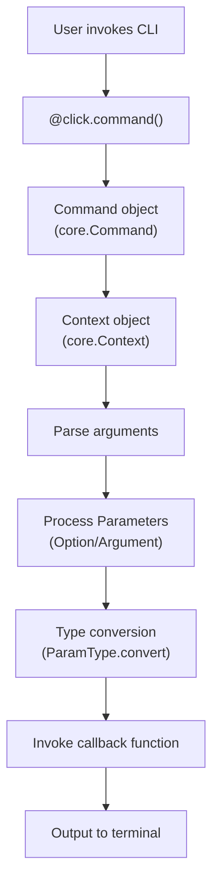

**Diagram: Click Execution Flow**

**Sources:** [src/click/core.py:873-919](), [src/click/__init__.py:10-16]()

## Decorator-Based API

Click uses decorators to transform Python functions into CLI applications. The decorator API is the primary user-facing interface:

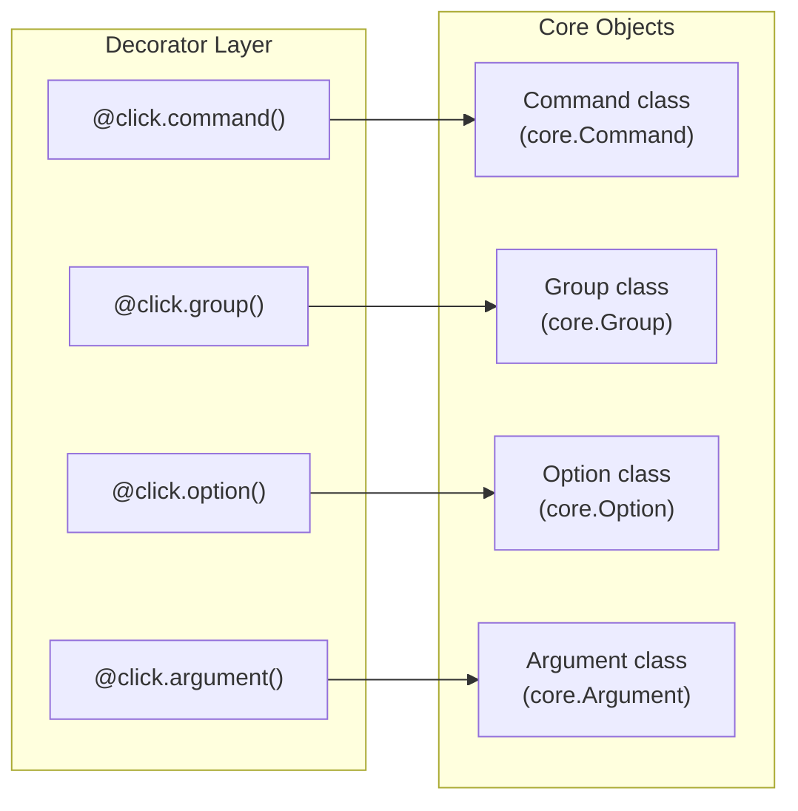

**Diagram: Decorator to Core Object Mapping**

The decorators are defined in [src/click/decorators.py]() and create instances of core classes from [src/click/core.py]().

**Sources:** [src/click/__init__.py:17-27](), [src/click/decorators.py]()

## Major Subsystems

Click's architecture consists of several interconnected subsystems:

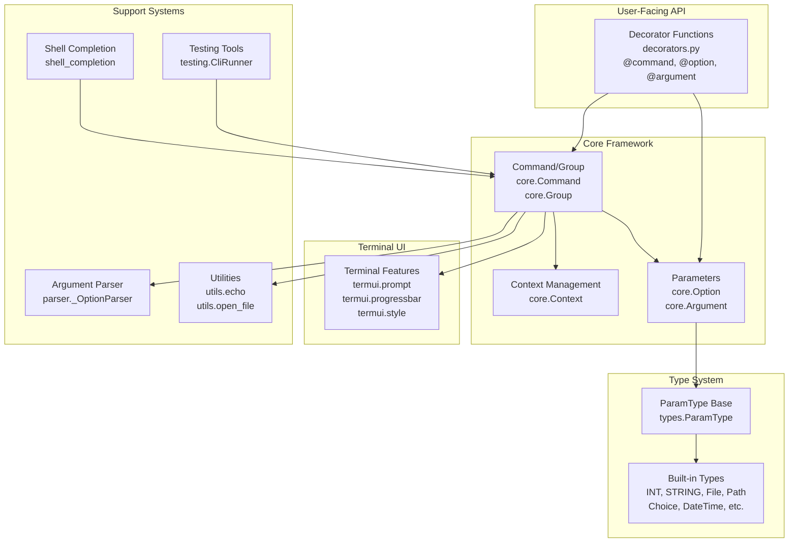

**Diagram: Click Subsystem Architecture**

**Sources:** [src/click/core.py:1-50](), [src/click/types.py](), [src/click/termui.py](), [src/click/testing.py]()

## Component Hierarchy

Click uses inheritance to organize its component hierarchy:

| Base Class | Subclass(es) | Purpose |
|------------|-------------|----------|
| `Command` | `Group`, `CommandCollection` | Command hierarchy |
| `Parameter` | `Option`, `Argument` | Parameter types |
| `ParamType` | `INT`, `STRING`, `File`, `Path`, etc. | Type conversion |
| `ClickException` | `UsageError`, `BadParameter`, etc. | Error handling |

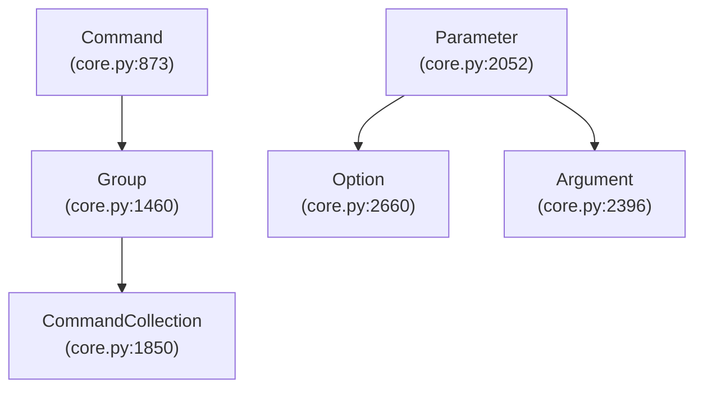

**Diagram: Core Class Hierarchy**

**Sources:** [src/click/core.py:873-1900](), [src/click/core.py:2052-2700]()

## Execution Lifecycle

When a Click application is invoked, the following lifecycle occurs:

1. **Decorator Application** - Decorators create `Command` and `Parameter` objects
2. **Context Creation** - `Command.make_context()` creates a `Context` object
3. **Argument Parsing** - `Command.parse_args()` parses command-line arguments
4. **Parameter Processing** - Each parameter's value is resolved and converted
5. **Callback Invocation** - The command's callback function is called with typed parameters
6. **Resource Cleanup** - Context managers and cleanup callbacks are executed

For detailed lifecycle documentation, see [Execution Lifecycle](#2.1).

**Sources:** [src/click/core.py:1182-1254](), [src/click/core.py:1255-1285]()

## Parameter Value Resolution

Click resolves parameter values from multiple sources in priority order:

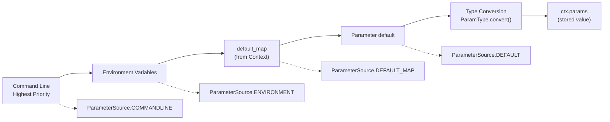

**Diagram: Parameter Value Resolution Pipeline**

The source of each parameter value is tracked using the `ParameterSource` enum. For more details, see [Value Resolution and Defaults](#3.4).

**Sources:** [src/click/core.py:143-167](), [src/click/core.py:845-871]()

## Repository Structure

The Click codebase is organized as follows:

| Directory/File | Purpose |
|----------------|---------|
| `src/click/core.py` | Core classes: `Command`, `Group`, `Context`, `Parameter` |
| `src/click/decorators.py` | Decorator functions: `@command`, `@option`, `@argument` |
| `src/click/types.py` | Type system: `ParamType` and built-in types |
| `src/click/termui.py` | Terminal UI: prompts, progress bars, styling |
| `src/click/parser.py` | Argument parser: `_OptionParser` |
| `src/click/shell_completion.py` | Shell completion support |
| `src/click/testing.py` | Testing infrastructure: `CliRunner` |
| `src/click/utils.py` | Utilities: `echo`, `open_file`, etc. |
| `src/click/exceptions.py` | Exception hierarchy |
| `src/click/formatting.py` | Help text formatting |
| `docs/` | Sphinx documentation |
| `tests/` | Test suite |

**Sources:** [src/click/__init__.py:1-124]()

## Type System

Click's type system converts string arguments to Python values:

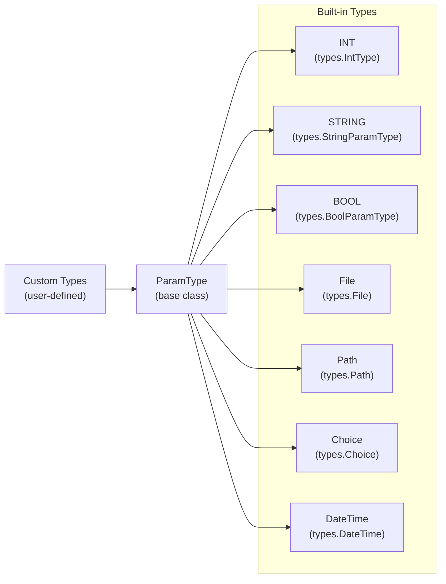

**Diagram: Type System Hierarchy**

All types inherit from `ParamType` and implement the `convert()` method. For details, see [Parameter Types and Conversion](#3.3).

**Sources:** [src/click/types.py](), [src/click/__init__.py:52-65]()

## Testing Infrastructure

Click provides `CliRunner` for isolated testing of CLI applications:

| Component | Purpose |
|-----------|---------|
| `CliRunner` | Test harness for invoking commands in isolation |
| `Result` | Captures output, exit code, and exceptions |
| `isolated_filesystem()` | Creates temporary directory for file operations |

For testing documentation, see [Testing Click Applications](#8) and [Using CliRunner](#8.1).

**Sources:** [src/click/testing.py](), [src/click/__init__.py]()

## Platform Compatibility

Click handles cross-platform differences internally:

- **Windows Console** - UTF-16 encoding, colorama integration
- **ANSI Support** - Color detection and ANSI code stripping
- **Stream Handling** - Binary/text stream compatibility
- **File System** - Path handling across operating systems

For platform-specific details, see [Platform Compatibility](#9), [Windows Support](#9.2), and [Unicode and Character Encoding](#9.1).

**Sources:** [src/click/_compat.py](), [src/click/_winconsole.py]()

## Next Steps

To understand how Click works in depth:

1. **For application developers**: Start with [Decorators and Public API](#2.4) to learn the user-facing API
2. **For framework understanding**: Read [Core Architecture](#2) for internal workings
3. **For parameter handling**: See [Parameters](#3) for the parameter system
4. **For testing**: Consult [Testing Click Applications](#8)
5. **For contributing**: Review [Development Guide](#10)

**Sources:** [docs/index.rst:59-128](), [CHANGES.rst:1-100]()

---

# Page: Core Architecture

# Core Architecture

<details>
<summary>Relevant source files</summary>

The following files were used as context for generating this wiki page:

- [CHANGES.rst](CHANGES.rst)
- [src/click/__init__.py](src/click/__init__.py)
- [src/click/core.py](src/click/core.py)
- [src/click/decorators.py](src/click/decorators.py)
- [src/click/exceptions.py](src/click/exceptions.py)
- [src/click/parser.py](src/click/parser.py)

</details>


This page documents the fundamental architecture of Click, a Python library for creating command-line interfaces (CLIs). It explains the core components, their relationships, and the execution flow of a Click application. For information about creating commands and organizing them into groups, see [Commands and Groups](#2.1). For details on parameters, see [Parameters: Options and Arguments](#2.2).

## Overview

Click's core architecture revolves around four main components:

1. **Commands**: Function-based handlers for CLI operations
2. **Parameters**: Input interfaces (options and arguments)
3. **Context**: State management during command execution
4. **Type System**: Validation and conversion of input values

These components work together to create a clean, composable framework for building command-line applications.

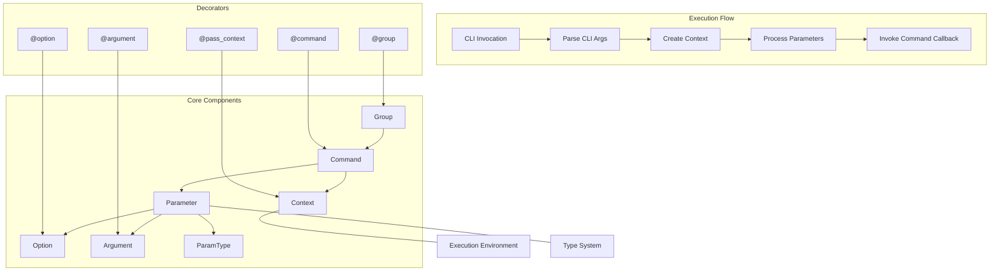

Sources: [src/click/core.py:61-161](). [src/click/decorators.py:1-132]()

## Command System

The command system is the backbone of Click applications. All Click applications are built around the `Command` class, which represents a single CLI command. Commands can be organized into hierarchical groups using the `Group` class, allowing for nested subcommands.

### Command Hierarchy

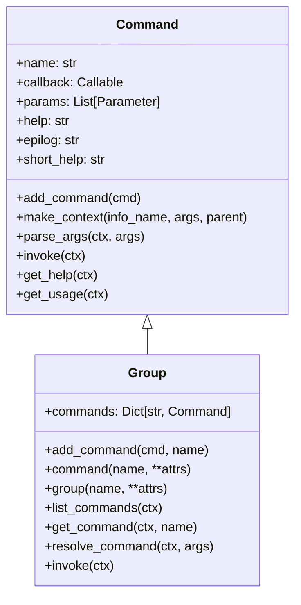

Commands are created using the `@command` decorator, which transforms a Python function into a `Command` object. Groups are created using the `@group` decorator, which creates a `Group` object that can contain multiple commands.

Sources: [src/click/core.py:161-1000](), [src/click/decorators.py:133-312]()

## Parameter System

Parameters define the inputs that a command can accept from the command line. There are two main types of parameters:

1. **Options**: Flags and values prefixed with dashes (e.g., `--name`, `-n`)
2. **Arguments**: Positional values without prefixes

### Parameter Structure

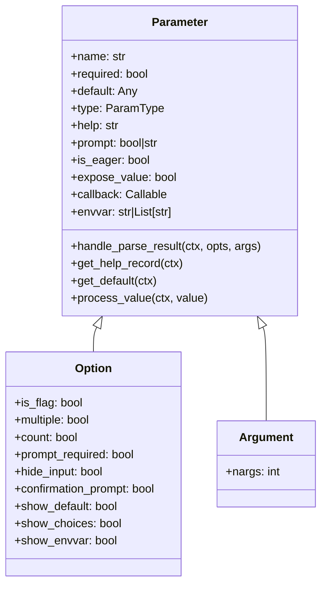

Parameters are typically created using decorators:
- `@option()` for creating options
- `@argument()` for creating arguments

Each parameter can have a type, default value, help text, and various other attributes that control its behavior.

Sources: [src/click/core.py:1000-2000](), [src/click/decorators.py:313-377]()

## Context Management

The `Context` class is a crucial component in Click that manages state during command execution. It stores parameter values, configuration, and provides methods for handling command execution.

```mermaid
graph TD
    subgraph "Context Hierarchy"
        ParentCtx["Parent Context"] --> ChildCtx["Child Context"]
        ChildCtx --> GrandchildCtx["Grandchild Context"]
    end
    
    subgraph "Context Properties"
        Context["Context"] --> params["params: Dict[str, Any]"]
        Context --> args["args: List[str]"]
        Context --> command["command: Command"]
        Context --> parent["parent: Context"]
        Context --> obj["obj: Any"]
        Context --> default_map["default_map: Dict[str, Any]"]
        Context --> auto_envvar_prefix["auto_envvar_prefix: str"]
        Context --> resilient_parsing["resilient_parsing: bool"]
        Context --> meta["meta: Dict[str, Any]"]
        Context --> _parameter_source["_parameter_source: Dict[str, ParameterSource]"]
    end
    
    subgraph "Context Methods"
        Context --> invoke["invoke(callback, *args, **kwargs)"]
        Context --> forward["forward(cmd, *args, **kwargs)"]
        Context --> get_help["get_help()"]
        Context --> exit["exit(code)"]
        Context --> abort["abort()"]
        Context --> find_root["find_root()"]
        Context --> ensure_object["ensure_object(cls)"]
        Context --> lookup_default["lookup_default(name)"]
    end
```

Each command invocation creates a new context. For nested commands, each child command has its own context with a reference to its parent context, forming a context hierarchy.

Sources: [src/click/core.py:135-614]()

## Command Execution Flow

The execution of a Click command follows a well-defined flow:

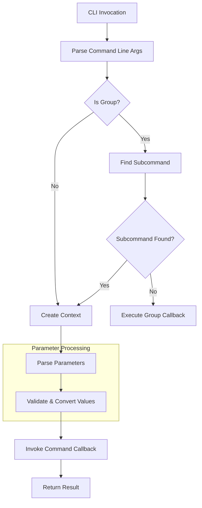

1. **CLI Invocation**: The command line is invoked with arguments
2. **Parse Command Line**: Click parses the command line to identify the command and its arguments
3. **Create Context**: A context is created for the command
4. **Parse Parameters**: Parameters are parsed and converted to Python values
5. **Invoke Callback**: The command's callback function is invoked with the processed parameter values

Sources: [src/click/core.py:615-807](), [src/click/parser.py:20-100]()

## Parameter Types and Validation

Click includes a robust type system for converting and validating command-line inputs.

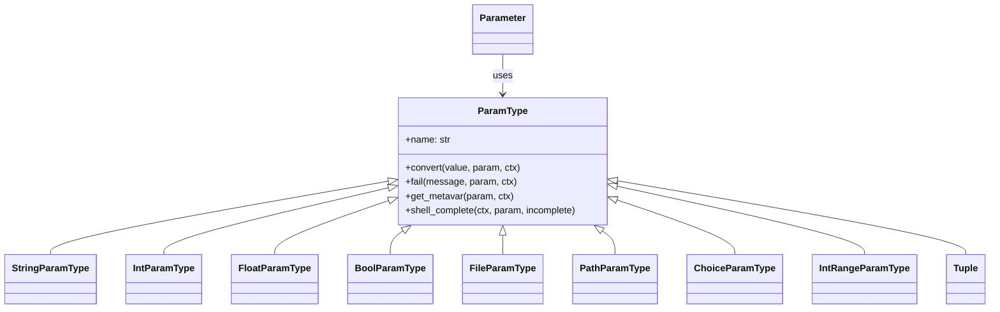

The type system is used to convert string inputs from the command line into appropriate Python types. It also handles validation to ensure that the input values are valid.

Sources: [src/click/core.py:2000-3000](), [src/click/types.py:1-100]()

## Error Handling and Exceptions

Click has a well-defined exception hierarchy for handling errors during command execution.

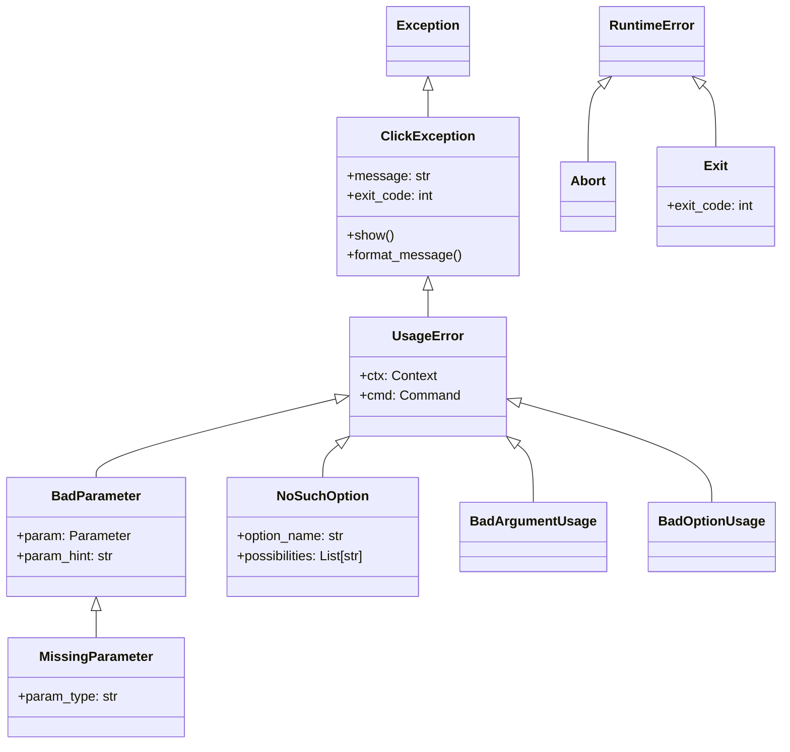

These exceptions are raised during various stages of command processing and are used to signal errors to the user with appropriate error messages.

Sources: [src/click/exceptions.py:1-309]()

## Integration with Python Environment

Click integrates with Python's environment through parameter sources, environment variables, and shell completion.

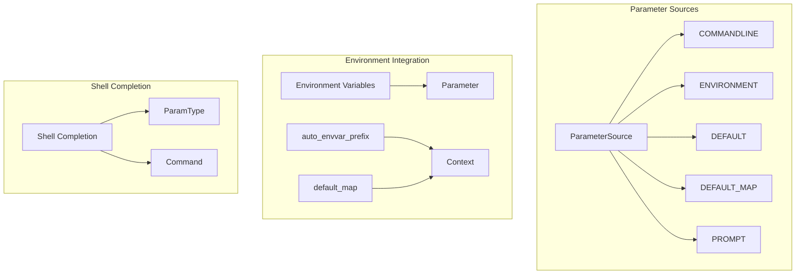

Click supports multiple sources for parameter values:
1. Command line arguments (highest priority)
2. Environment variables
3. Values from a default map
4. Default values defined in parameter declarations
5. Values obtained through prompting (if enabled)

The `ParameterSource` enum tracks where each parameter value came from, which can be useful for debugging and understanding parameter resolution.

Sources: [src/click/core.py:135-155](), [src/click/parser.py:100-200]()

## Summary

Click's core architecture provides a flexible and powerful foundation for building command-line interfaces in Python. Its component-based design allows for composability and extensibility, while its well-defined execution flow ensures consistent behavior across applications.

The key strengths of this architecture include:

1. **Composability**: Commands can be nested and combined in various ways
2. **Type Safety**: The parameter type system ensures valid input
3. **Contextual Awareness**: The context system maintains state and relationships
4. **Extensibility**: All components can be subclassed and customized
5. **Decorator-Based API**: The decorator-based interface provides a clean, declarative way to define commands and parameters

These architectural features make Click a powerful yet easy-to-use library for building command-line interfaces in Python.

Sources: [src/click/core.py:1-100](), [src/click/decorators.py:1-50]()

---

# Page: Execution Lifecycle

# Execution Lifecycle

<details>
<summary>Relevant source files</summary>

The following files were used as context for generating this wiki page:

- [CHANGES.rst](CHANGES.rst)
- [src/click/__init__.py](src/click/__init__.py)
- [src/click/core.py](src/click/core.py)
- [src/click/decorators.py](src/click/decorators.py)
- [src/click/exceptions.py](src/click/exceptions.py)
- [src/click/parser.py](src/click/parser.py)

</details>


## Purpose and Scope

This page provides a detailed walkthrough of Click's command execution lifecycle, from the moment a command is invoked to its completion. It covers the internal phases of context creation, argument parsing, parameter processing, callback invocation, and cleanup. 

For information about the Command and Group classes themselves, see [Commands and Groups](#2.2). For details on Context objects and their management, see [Context Management](#2.3). For parameter-specific processing details, see [Parameters](#3).

## Lifecycle Overview

The execution of a Click command follows a well-defined sequence of phases. Each phase has specific responsibilities and can be customized through various hooks and callbacks.

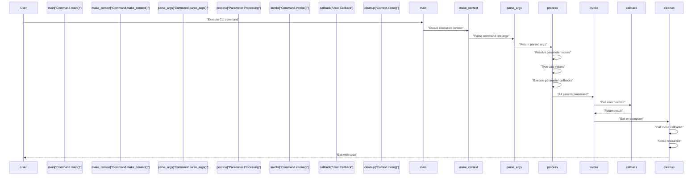

**Sources:** [src/click/core.py:1036-1281]()

## Entry Point: Command.main()

The `Command.main()` method is the primary entry point for command execution. It orchestrates the entire lifecycle and handles top-level exception management.

### Execution Flow

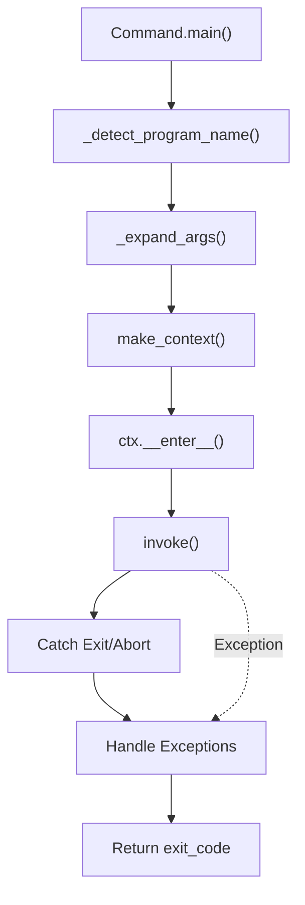

The `main()` method performs these key operations:

1. **Program Name Detection**: Determines the command name from `sys.argv[0]` or a provided `prog_name` parameter
2. **Argument Expansion**: On Windows, expands glob patterns and environment variables
3. **Context Creation**: Calls `make_context()` to create the execution context
4. **Context Activation**: Enters the context as a context manager
5. **Command Invocation**: Calls `invoke()` to execute the command
6. **Exception Handling**: Catches and formats exceptions according to the `standalone_mode` setting
7. **Exit Handling**: Returns the exit code or calls `sys.exit()` if in standalone mode

**Key Code Locations:**
- Entry point setup: [src/click/core.py:1036-1091]()
- Exception handling: [src/click/core.py:1092-1150]()
- Program name detection: [src/click/utils.py:479-514]()
- Windows argument expansion: [src/click/utils.py:516-565]()

**Sources:** [src/click/core.py:1036-1150](), [src/click/utils.py:479-565]()

## Phase 1: Context Creation

The `make_context()` method creates a `Context` object that holds all state for the command execution. This context is then used throughout the rest of the lifecycle.

### Context Creation Process

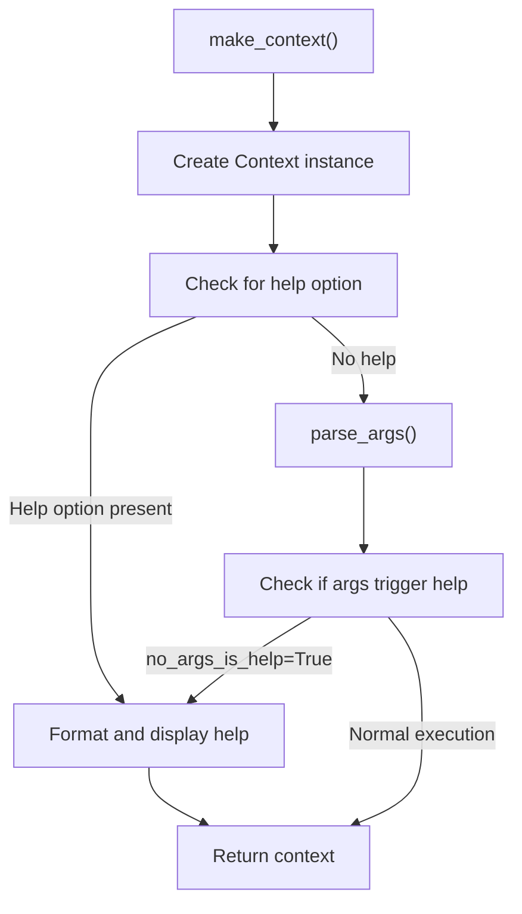

### Context Initialization

The `Context` constructor initializes the execution environment with:

- **Parent Context**: Links to parent context for nested commands
- **Command Reference**: Stores the command being executed  
- **Parameters Dictionary**: Empty dict that will be populated during parsing (`ctx.params`)
- **Arguments List**: Stores unparsed/remaining arguments (`ctx.args`)
- **Default Map**: Provides default values from configuration
- **Environment Variable Prefix**: For automatic environment variable lookup
- **Parsing Flags**: Control parsing behavior (e.g., `resilient_parsing`, `allow_extra_args`)
- **Resource Management**: Exit stack for cleanup (`_exit_stack`)

**Key Code Locations:**
- `make_context()` implementation: [src/click/core.py:1001-1034]()
- `Context.__init__()`: [src/click/core.py:273-441]()
- Help option injection: [src/click/core.py:1013-1029]()

**Sources:** [src/click/core.py:273-441](), [src/click/core.py:1001-1034]()

## Phase 2: Argument Parsing

The `parse_args()` method tokenizes the command line arguments and maps them to the command's parameters. This is where Click transforms raw string arguments into structured parameter values.

### Parsing Architecture

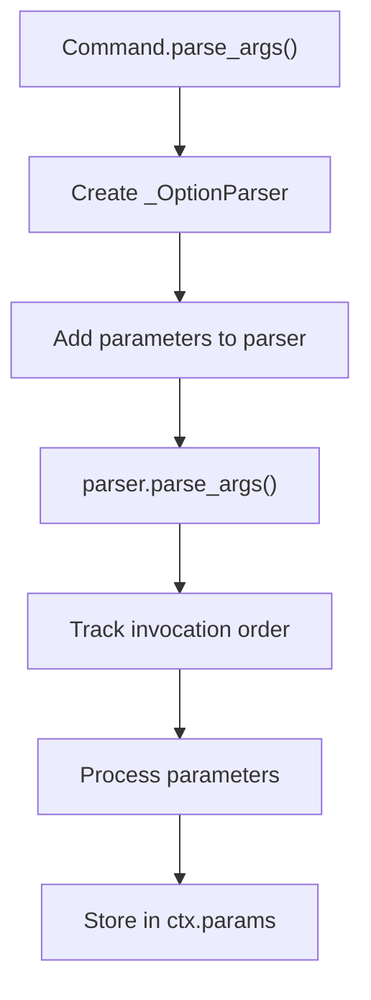

### Parameter Processing Order

Parameters are processed in a specific order that respects both their declaration order and invocation order. Eager parameters (like `--help`) are always processed first.

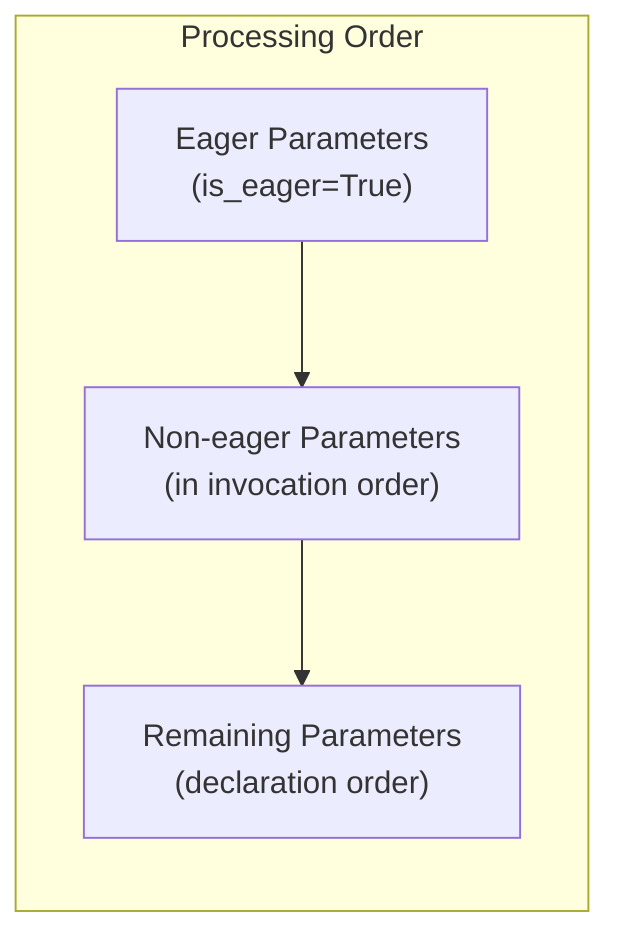

The `iter_params_for_processing()` function determines this order by:
1. Separating eager parameters from non-eager parameters
2. Processing eager parameters first (in invocation order if multiple)
3. Processing non-eager parameters in the order they were provided on the command line
4. Processing any remaining parameters in declaration order

**Key Code Locations:**
- `parse_args()` implementation: [src/click/core.py:1152-1270]()
- `iter_params_for_processing()`: [src/click/core.py:116-141]()
- `_OptionParser` usage: [src/click/core.py:1185-1196]()

**Sources:** [src/click/core.py:116-141](), [src/click/core.py:1152-1270]()

## Phase 3: Parameter Value Resolution

Each parameter's value goes through a multi-stage resolution process that checks multiple sources in priority order.

### Value Resolution Pipeline

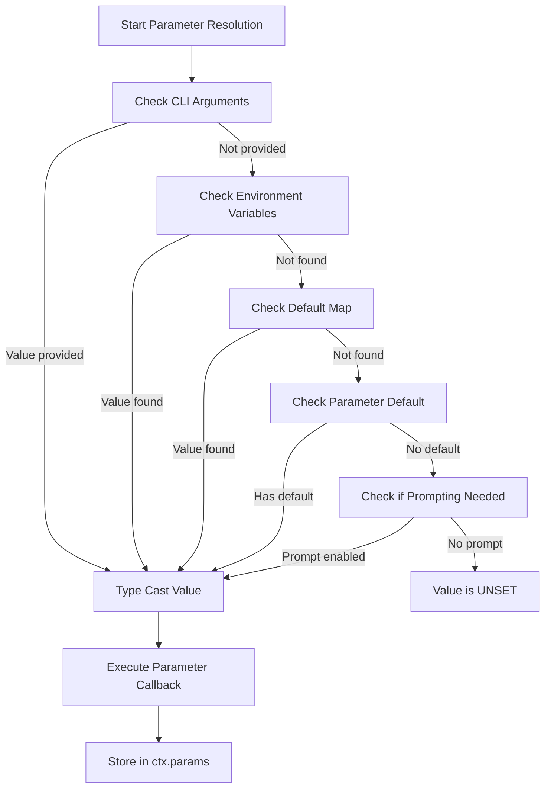

### Value Sources

Click tracks where each parameter value came from using the `ParameterSource` enum:

| Source | Priority | Description |
|--------|----------|-------------|
| `COMMANDLINE` | 1 (Highest) | Provided via command line arguments |
| `ENVIRONMENT` | 2 | Retrieved from environment variable |
| `DEFAULT_MAP` | 3 | Found in `ctx.default_map` |
| `DEFAULT` | 4 | Used parameter's default value |
| `PROMPT` | 5 | User provided value via prompt |

The source is tracked in `ctx._parameter_source` and can be queried using `ctx.get_parameter_source(param_name)`.

### Type Conversion

Once a value is resolved, it goes through `type_cast_value()`:

1. **Skip if UNSET**: If the value is the sentinel `UNSET`, skip type casting
2. **Already Correct Type**: If the value is already the correct type, return it as-is
3. **Type Conversion**: Call `ParamType.convert()` to transform the value
4. **Validation**: The type's convert method validates and transforms the value

**Key Code Locations:**
- Parameter value resolution: [src/click/core.py:2751-2906]()
- Type casting: [src/click/core.py:2968-3012]()
- `ParameterSource` enum: [src/click/core.py:143-167]()
- UNSET sentinel handling: [src/click/_utils.py:1-23]()

**Sources:** [src/click/core.py:143-167](), [src/click/core.py:2751-2906](), [src/click/core.py:2968-3012]()

## Phase 4: Command Invocation

After all parameters are processed, the command's callback function is invoked with the resolved parameter values.

### Invocation Mechanism

```mermaid
graph TD
    invoke["Command.invoke()"]
    check_cb["Check callback exists"]
    prep_kwargs["Prepare kwargs from ctx.params"]
    check_chain["Check if chaining enabled"]
    call_cb["Call callback function"]
    handle_rv["Handle return value"]
    invoke_subs["Invoke subcommands"]
    result_cb["Call result_callback"]
    
    invoke --> check_cb
    check_cb -->|"No callback"| invoke_subs
    check_cb -->|"Has callback"| prep_kwargs
    prep_kwargs --> call_cb
    call_cb --> handle_rv
    handle_rv --> check_chain
    check_chain -->|"Not chaining"| invoke_subs
    check_chain -->|"Chaining"| result_cb
    invoke_subs --> result_cb
```

### Context.invoke() for Nested Calls

The `Context.invoke()` method provides a way to programmatically invoke other commands or callbacks:

1. **Direct Callback**: Pass a callable and arguments directly
2. **Command Invocation**: Pass a `Command` object, and Click will:
   - Create a new child context
   - Resolve default values for any missing parameters
   - Convert UNSET values to None for public API consistency
   - Type-cast the default values
   - Track all kwargs in `ctx.params`

**Key Code Locations:**
- `Command.invoke()`: [src/click/core.py:1272-1281]()
- `Context.invoke()`: [src/click/core.py:768-824]()
- `Context.forward()`: [src/click/core.py:826-843]()
- Handling of UNSET in invoke: [src/click/core.py:800-814]()

**Sources:** [src/click/core.py:768-843](), [src/click/core.py:1272-1281]()

## Phase 5: Cleanup and Exit

The cleanup phase ensures proper resource management and cleanup of any registered callbacks or context managers.

### Cleanup Mechanism

```mermaid
graph TD
    exit_ctx["Context.__exit__()"]
    check_depth["Check _depth counter"]
    close_method["close()"]
    exit_stack["_exit_stack.__exit__()"]
    call_callbacks["Execute call_on_close callbacks"]
    close_resources["Close with_resource managers"]
    pop_ctx["pop_context()"]
    
    exit_ctx --> check_depth
    check_depth -->|"_depth == 0"| close_method
    check_depth -->|"_depth > 0"| pop_ctx
    close_method --> exit_stack
    exit_stack --> call_callbacks
    call_callbacks --> close_resources
    close_resources --> pop_ctx
```

### Resource Management

Click provides two mechanisms for cleanup:

1. **`call_on_close()`**: Register a callback to be called during cleanup
   ```python
   ctx.call_on_close(lambda: print("Cleaning up"))
   ```

2. **`with_resource()`**: Register a context manager that will be closed
   ```python
   db = ctx.with_resource(connect_db())
   ```

Both are managed through an internal `ExitStack` that ensures cleanup happens in reverse order of registration.

### Exit Handling

Three ways to exit a command:

1. **Normal Return**: Callback returns, exit code is 0
2. **`ctx.exit(code)`**: Explicit exit with specific code, triggers cleanup then raises `Exit` exception
3. **Exception**: Any unhandled exception, cleanup still occurs

**Key Code Locations:**
- Context `__exit__` method: [src/click/core.py:481-493]()
- `close()` method: [src/click/core.py:616-621]()
- `_close_with_exception_info()`: [src/click/core.py:623-639]()
- `with_resource()`: [src/click/core.py:575-602]()
- `call_on_close()`: [src/click/core.py:604-614]()
- `ctx.exit()`: [src/click/core.py:730-738]()

**Sources:** [src/click/core.py:481-493](), [src/click/core.py:575-639](), [src/click/core.py:730-738]()

## Nested Commands and Group Execution

When a command is part of a group hierarchy, the execution lifecycle is repeated for each level.

### Group Command Flow

```mermaid
sequenceDiagram
    participant User
    participant GroupMain["Group.main()"]
    participant GroupContext["Group Context"]
    participant GroupCallback["Group Callback"]
    participant SubContext["Subcommand Context"]
    participant SubCallback["Subcommand Callback"]
    participant Cleanup["Cleanup"]

    User->>GroupMain: "cli subcommand --opt value"
    GroupMain->>GroupContext: "make_context()"
    GroupContext->>GroupContext: "parse_args()"
    GroupContext->>GroupCallback: "invoke() group callback"
    GroupCallback->>SubContext: "resolve_command('subcommand')"
    SubContext->>SubContext: "make_context() for subcommand"
    SubContext->>SubContext: "parse_args()"
    SubContext->>SubCallback: "invoke() subcommand callback"
    SubCallback-->>SubContext: "return"
    SubContext->>Cleanup: "close() subcommand context"
    Cleanup->>GroupContext: "return to parent"
    GroupContext->>Cleanup: "close() group context"
    Cleanup-->>User: "exit"
```

### Context Hierarchy

Each command in a group chain has its own context, forming a parent-child relationship:

- Child contexts inherit settings from parent contexts
- Parameters from parent commands remain accessible via `ctx.parent`
- The `ctx.obj` can be used to share state across command levels
- Cleanup happens in reverse order: child contexts close before parent contexts

**Key Code Locations:**
- Group command resolution: [src/click/core.py:1408-1445]()
- Subcommand invocation: [src/click/core.py:1493-1614]()
- Child context creation: [src/click/core.py:752-758]()
- Context parent linkage: [src/click/core.py:293]()

**Sources:** [src/click/core.py:293](), [src/click/core.py:752-758](), [src/click/core.py:1408-1614]()

## Exception Handling Throughout Lifecycle

Click's exception handling ensures that errors are properly formatted and reported to users, with special handling for different exception types.

### Exception Flow

```mermaid
graph TD
    exception["Exception Raised"]
    check_type["Check Exception Type"]
    exit_exc["Exit Exception"]
    abort_exc["Abort Exception"]
    usage_err["UsageError"]
    click_exc["ClickException"]
    other_exc["Other Exception"]
    
    format_exit["Return exit_code"]
    format_abort["Exit code 1"]
    format_usage["Show usage + error"]
    format_click["Show error message"]
    standalone_check["Check standalone_mode"]
    reraise["Re-raise exception"]
    sys_exit["sys.exit()"]
    
    exception --> check_type
    check_type --> exit_exc
    check_type --> abort_exc
    check_type --> usage_err
    check_type --> click_exc
    check_type --> other_exc
    
    exit_exc --> format_exit
    abort_exc --> format_abort
    usage_err --> format_usage
    click_exc --> format_click
    other_exc --> standalone_check
    
    format_exit --> standalone_check
    format_abort --> standalone_check
    format_usage --> standalone_check
    format_click --> standalone_check
    
    standalone_check -->|"True"| sys_exit
    standalone_check -->|"False"| reraise
```

### Exception Types

| Exception | Exit Code | Behavior |
|-----------|-----------|----------|
| `Exit` | From exception | Clean exit with specific code |
| `Abort` | 1 | User interrupted (Ctrl+C) |
| `UsageError` | 2 | Invalid command usage |
| `ClickException` | 1 | General Click error |
| `NoArgsIsHelpError` | 2 | Triggered help display |
| Other exceptions | 1 | Unexpected errors |

### Error Context Enhancement

The `augment_usage_errors()` context manager attaches context information to exceptions as they bubble up:

```python
with augment_usage_errors(ctx, param):
    # If exception occurs here, it gets ctx and param attached
    value = convert_value(raw_value)
```

This ensures error messages include helpful context like the parameter name and command path.

**Key Code Locations:**
- Exception handling in `main()`: [src/click/core.py:1092-1150]()
- `augment_usage_errors()`: [src/click/core.py:97-114]()
- Exception classes: [src/click/exceptions.py:1-309]()
- `ClickException.show()`: [src/click/exceptions.py:32-42]()

**Sources:** [src/click/core.py:97-114](), [src/click/core.py:1092-1150](), [src/click/exceptions.py:1-309]()

## Complete Lifecycle Example

Here's how the lifecycle flows for a typical command execution:

```mermaid
sequenceDiagram
    autonumber
    participant CLI["CLI User"]
    participant main["Command.main()"]
    participant ctx["Context"]
    participant parse["parse_args()"]
    participant param["Parameter"]
    participant callback["User Callback"]
    
    CLI->>main: "mycli --verbose process file.txt"
    main->>main: "_detect_program_name()"
    main->>ctx: "make_context(args)"
    ctx->>ctx: "__init__() - setup state"
    ctx->>parse: "parse_args(args)"
    parse->>parse: "Create _OptionParser"
    parse->>param: "Process --verbose option"
    param->>param: "Resolve from CLI"
    param->>param: "Type cast to bool"
    param->>param: "Execute callback if any"
    param->>ctx: "Store in ctx.params['verbose']"
    parse->>param: "Process 'file.txt' argument"
    param->>param: "Resolve from CLI"
    param->>param: "Type cast to string"
    param->>ctx: "Store in ctx.params['filename']"
    parse-->>ctx: "Return parsed context"
    ctx->>ctx: "__enter__() - activate context"
    ctx->>callback: "invoke(ctx)"
    callback->>ctx: "Read ctx.params"
    callback->>callback: "Execute user logic"
    callback-->>ctx: "Return result"
    ctx->>ctx: "__exit__() - cleanup"
    ctx->>ctx: "close()"
    ctx->>ctx: "_exit_stack.__exit__()"
    ctx-->>main: "Exit"
    main->>main: "Format exit code"
    main-->>CLI: "sys.exit(0)"
```

This sequence demonstrates:
1. Entry through `main()`
2. Context creation with state initialization
3. Argument parsing and parameter processing
4. Value resolution and type conversion
5. Context activation as context manager
6. User callback invocation
7. Proper cleanup and exit handling

**Sources:** [src/click/core.py:1036-1281](), [src/click/core.py:273-843]()

---

# Page: Commands and Groups

# Commands and Groups

<details>
<summary>Relevant source files</summary>

The following files were used as context for generating this wiki page:

- [CHANGES.rst](CHANGES.rst)
- [docs/advanced.md](docs/advanced.md)
- [docs/commands.rst](docs/commands.rst)
- [examples/imagepipe/imagepipe.py](examples/imagepipe/imagepipe.py)
- [src/click/__init__.py](src/click/__init__.py)
- [src/click/core.py](src/click/core.py)
- [tests/test_chain.py](tests/test_chain.py)
- [tests/test_commands.py](tests/test_commands.py)
- [tests/test_formatting.py](tests/test_formatting.py)

</details>


This page documents the `Command` and `Group` classes, which are the core building blocks for Click CLIs. These classes define the structure of command hierarchies, handle command invocation, and manage subcommands.

Related pages: See [Context Management](#2.3) for details on the `Context` object, [Decorators and Public API](#2.4) for the `@click.command()` and `@click.group()` decorators, and [Parameters](#3) for options and arguments.

## Command Class Hierarchy

Click provides a hierarchy of command classes for different use cases:

**Class Hierarchy Diagram**

```mermaid
classDiagram
    class Command {
        +name: str | None
        +callback: Callable | None
        +params: list[Parameter]
        +help: str | None
        +context_settings: dict
        +invoke(ctx: Context) Any
        +main(args, **kwargs) Any
        +make_context(info_name, args, **kwargs) Context
        +parse_args(ctx, args) list[str]
        +get_help(ctx) str
    }
    
    class Group {
        +commands: dict[str, Command]
        +invoke_without_command: bool
        +no_args_is_help: bool
        +chain: bool
        +result_callback: Callable | None
        +add_command(cmd, name) None
        +command(**kwargs) Callable
        +group(**kwargs) Callable
        +list_commands(ctx) list[str]
        +get_command(ctx, name) Command | None
        +resolve_command(ctx, args) tuple
    }
    
    class CommandCollection {
        +sources: list[Group]
        +list_commands(ctx) list[str]
        +get_command(ctx, name) Command | None
    }
    
    Command <|-- Group : extends
    Group <|-- CommandCollection : extends
```

Sources: [src/click/core.py:1054-1671](), [src/click/core.py:1674-2113](), [src/click/core.py:2113-2296](), [src/click/core.py:2299-2424]()
</thinking>

## The Command Class

The `Command` class represents a single executable command. Each command has a callback function that is invoked when the command is executed.

**Command Structure**

```mermaid
flowchart TB
    A["Command Instance"]
    A --> B["name: str | None"]
    A --> C["callback: Callable | None"]
    A --> D["params: list[Parameter]"]
    A --> E["help: str | None"]
    A --> F["context_settings: dict"]
    
    G["Invocation Flow"]
    G --> H["main(args)"]
    H --> I["make_context(info_name, args)"]
    I --> J["parse_args(ctx, args)"]
    J --> K["invoke(ctx)"]
    K --> L["Execute callback"]
```

Sources: [src/click/core.py:1054-1671]()

### Key Command Attributes

| Attribute | Type | Description |
|-----------|------|-------------|
| `name` | `str \| None` | Command name used on command line |
| `callback` | `Callable \| None` | Function executed when command runs |
| `params` | `list[Parameter]` | List of options and arguments |
| `help` | `str \| None` | Help text displayed with `--help` |
| `context_settings` | `dict` | Settings passed to `Context` creation |
| `deprecated` | `bool \| str` | Marks command as deprecated |
| `hidden` | `bool` | Hides command from help output |
| `no_args_is_help` | `bool` | Shows help if no args provided |

Sources: [src/click/core.py:1054-1150]()

### Command Invocation Flow

**Invocation Sequence Diagram**

```mermaid
sequenceDiagram
    participant User
    participant main
    participant make_context
    participant parse_args
    participant invoke
    participant callback
    
    User->>main: command.main(args)
    main->>make_context: command.make_context(info_name, args)
    make_context->>parse_args: command.parse_args(ctx, args)
    parse_args-->>make_context: remaining args
    make_context-->>main: ctx
    main->>invoke: command.invoke(ctx)
    invoke->>callback: Execute callback(ctx.params)
    callback-->>invoke: return value
    invoke-->>main: return value
    main-->>User: exit code
```

Sources: [src/click/core.py:1318-1389](), [src/click/core.py:1391-1478](), [src/click/core.py:1480-1532](), [src/click/core.py:1534-1604]()

The invocation flow:

1. **`main(args, **kwargs)`**: Entry point that sets up the invocation environment. Handles standalone mode, exception handling, and exit codes.

2. **`make_context(info_name, args, parent=None, **extra)`**: Creates a new `Context` object for this command invocation. Parses arguments and validates parameters.

3. **`parse_args(ctx, args)`**: Parses command-line arguments using the command's parameter definitions. Returns remaining unparsed arguments.

4. **`invoke(ctx)`**: Executes the command's callback function with parameters from the context. Returns the callback's return value.

Sources: [src/click/core.py:1318-1604]()

## The Group Class

The `Group` class extends `Command` to support subcommands. A group can contain multiple commands and/or other groups, creating a command hierarchy.

**Group Structure**

```mermaid
flowchart TB
    A["Group Instance"]
    A --> B["Inherits from Command"]
    A --> C["commands: dict[str, Command]"]
    A --> D["invoke_without_command: bool"]
    A --> E["chain: bool"]
    A --> F["result_callback: Callable | None"]
    
    C --> G["Command 1"]
    C --> H["Command 2"]
    C --> I["Subgroup"]
    I --> J["Command 3"]
    I --> K["Command 4"]
```

Sources: [src/click/core.py:2113-2296]()

### Key Group Attributes

| Attribute | Type | Description |
|-----------|------|-------------|
| `commands` | `dict[str, Command]` | Dictionary of subcommands by name |
| `invoke_without_command` | `bool` | Whether to invoke group callback without subcommand |
| `no_args_is_help` | `bool` | Show help if no subcommand specified (default: `True`) |
| `chain` | `bool` | Allow chaining multiple subcommands |
| `result_callback` | `Callable \| None` | Callback invoked with subcommand results |
| `command_class` | `type[Command]` | Default class for subcommands |
| `group_class` | `type[Group]` | Default class for subgroups |

Sources: [src/click/core.py:2113-2184]()

### Group Methods

**`add_command(cmd, name=None)`**: Registers a command with the group. The command name can be overridden with the `name` parameter.

**`command(**attrs)`**: Decorator that creates a new `Command` and adds it to the group.

**`group(**attrs)`**: Decorator that creates a new `Group` and adds it to the group.

**`list_commands(ctx)`**: Returns a list of all subcommand names.

**`get_command(ctx, cmd_name)`**: Retrieves a subcommand by name. Returns `None` if not found.

**`resolve_command(ctx, args)`**: Resolves a command name from the argument list. Returns `(cmd_name, cmd, remaining_args)`.

Sources: [src/click/core.py:2186-2296]()

### Group Invocation Flow

Groups have a more complex invocation flow that handles subcommand resolution:

**Group Invocation Diagram**

```mermaid
flowchart TB
    A["group.invoke(ctx)"]
    A --> B{"invoke_without_command?"}
    B -->|"Yes"| C["Execute group callback"]
    B -->|"No"| D{"Subcommand in args?"}
    D -->|"Yes"| E["Execute group callback"]
    D -->|"No, no_args_is_help=True"| F["Show help, exit 2"]
    D -->|"No, no_args_is_help=False"| G["Show error"]
    C --> H{"Subcommand specified?"}
    E --> I["resolve_command(ctx, args)"]
    I --> J["get_command(ctx, cmd_name)"]
    J --> K["Create child context"]
    K --> L["Invoke subcommand"]
    H -->|"Yes"| I
    H -->|"No"| M["Set invoked_subcommand=None"]
    L --> N["Call result_callback if set"]
    M --> N
    N --> O["Return result"]
```

Sources: [src/click/core.py:2216-2296]()

The `Context.invoked_subcommand` attribute is set during group invocation:
- Set to the subcommand name if a single subcommand is invoked
- Set to `'*'` if chaining is enabled and multiple subcommands run
- Set to `None` if no subcommand is invoked

Sources: [src/click/core.py:329-339](), [src/click/core.py:2258-2274]()

## Command Hierarchies and Subcommands

Groups enable hierarchical command structures where commands and groups can be nested to arbitrary depth.

**Nested Command Structure**

```mermaid
flowchart TB
    RootGroup["Root Group (cli)"]
    RootGroup --> Cmd1["Command: init"]
    RootGroup --> Cmd2["Command: status"]
    RootGroup --> SubGroup1["Group: users"]
    RootGroup --> SubGroup2["Group: config"]
    
    SubGroup1 --> UserCmd1["Command: list"]
    SubGroup1 --> UserCmd2["Command: add"]
    SubGroup1 --> UserCmd3["Command: remove"]
    
    SubGroup2 --> ConfigCmd1["Command: get"]
    SubGroup2 --> ConfigCmd2["Command: set"]
    SubGroup2 --> ConfigSubGroup["Group: database"]
    
    ConfigSubGroup --> DbCmd1["Command: init"]
    ConfigSubGroup --> DbCmd2["Command: migrate"]
```

Sources: [src/click/core.py:2186-2219](), [docs/complex.rst:64-119]()

### Subcommand Registration

Subcommands are registered with a group using `add_command()` or the `@group.command()` and `@group.group()` decorators. The registration process:

1. The command is added to the group's `commands` dictionary
2. The command name is determined (either explicit or derived from function name)
3. Nested groups are validated (chaining groups cannot contain subgroups)

**Registration Flow**

```mermaid
flowchart LR
    A["add_command(cmd, name)"]
    A --> B["Determine command name"]
    B --> C{"Chain mode?"}
    C -->|"Yes"| D{"cmd is Group?"}
    D -->|"Yes"| E["Raise RuntimeError"]
    D -->|"No"| F["Add to self.commands"]
    C -->|"No"| F
```

Sources: [src/click/core.py:2186-2219](), [src/click/core.py:73-91]()

### Command Name Resolution

When a group receives arguments, it resolves the subcommand name through the following process:

1. **`resolve_command(ctx, args)`**: Takes the argument list and extracts the command name
2. **`get_command(ctx, cmd_name)`**: Retrieves the command object by name
3. Returns `(cmd_name, cmd, remaining_args)`

Custom groups can override these methods to implement features like:
- Command aliases
- Abbreviated command names
- Dynamic command loading

Sources: [src/click/core.py:2240-2256](), [tests/test_commands.py:302-320]()

## Command Chaining

Command chaining allows multiple subcommands to be invoked in a single invocation. This is enabled by setting `chain=True` on a group.

**Chaining Flow**

```mermaid
sequenceDiagram
    participant User
    participant Group
    participant Cmd1 as "Command 1"
    participant Cmd2 as "Command 2"
    participant Cmd3 as "Command 3"
    participant Result as "result_callback"
    
    User->>Group: cli cmd1 --opt1 val1 cmd2 --opt2 val2 cmd3
    Group->>Group: Set invoked_subcommand='*'
    Group->>Cmd1: Invoke with parsed args
    Cmd1-->>Group: Return value 1
    Group->>Cmd2: Invoke with parsed args
    Cmd2-->>Group: Return value 2
    Group->>Cmd3: Invoke with parsed args
    Cmd3-->>Group: Return value 3
    Group->>Result: Call with [val1, val2, val3]
    Result-->>Group: Final result
    Group-->>User: Exit
```

Sources: [src/click/core.py:2216-2296](), [docs/commands.rst:130-166]()

### Chaining Restrictions

When `chain=True` is set on a group:

1. **Nested groups not allowed**: Cannot add `Group` instances as subcommands (raises `RuntimeError`)
2. **Variadic arguments**: Only the last command can use `nargs=-1` on arguments
3. **Option order**: Options must come before arguments for each command
4. **`invoked_subcommand`**: Set to `'*'` instead of specific command name

Sources: [src/click/core.py:73-91](), [docs/commands.rst:157-166](), [tests/test_chain.py:192-219]()

### Chaining Example

The `imagepipe` example demonstrates a processing pipeline using command chaining:

```mermaid
flowchart LR
    A["cli open -i img.jpg"]
    A --> B["resize -w 128"]
    B --> C["blur -r 2"]
    C --> D["save"]
    
    Open["open() → Iterator[Image]"]
    Resize["resize() → Processor"]
    Blur["blur() → Processor"]
    Save["save() → None"]
    
    Open -.-> Resize
    Resize -.-> Blur
    Blur -.-> Save
```

Each command returns a processor function that is chained together through the `result_callback`.

Sources: [examples/imagepipe/imagepipe.py:10-40](), [docs/commands.rst:169-283]()

## Result Callbacks

Result callbacks are invoked after a group's subcommand(s) complete. They receive the return values from all invoked subcommands.

**Result Callback Registration**

The `result_callback` is registered using the `@group.result_callback()` decorator:

```mermaid
flowchart TB
    A["Group invocation"]
    A --> B["Execute group callback"]
    B --> C["Invoke subcommand(s)"]
    C --> D["Collect return values"]
    D --> E{"result_callback set?"}
    E -->|"Yes"| F["Call result_callback(results)"]
    E -->|"No"| G["Return results"]
    F --> G
```

Sources: [src/click/core.py:2198-2213](), [src/click/core.py:2275-2296]()

### Result Callback Behavior

The result callback receives different data depending on the group mode:

| Mode | `result_callback` receives |
|------|----------------------------|
| Regular group | Single return value from subcommand |
| Chaining group (`chain=True`) | List of return values from all subcommands |
| No subcommand invoked | Return value from group callback |

Sources: [docs/commands.rst:384-429](), [tests/test_chain.py:88-105]()

### Pipeline Pattern

Result callbacks enable the pipeline pattern where each subcommand returns a processor function:

**Pipeline Processing**

```mermaid
flowchart LR
    Input["Initial Data"]
    Input --> Proc1["Processor 1"]
    Proc1 --> Proc2["Processor 2"]
    Proc2 --> Proc3["Processor 3"]
    Proc3 --> Output["Final Output"]
    
    Cmd1["Command 1<br/>returns processor"] -.-> Proc1
    Cmd2["Command 2<br/>returns processor"] -.-> Proc2
    Cmd3["Command 3<br/>returns processor"] -.-> Proc3
    
    RC["result_callback<br/>chains processors"]
    RC -.-> Proc1
    RC -.-> Proc2
    RC -.-> Proc3
```

Sources: [docs/commands.rst:169-283](), [examples/imagepipe/imagepipe.py:23-40]()

## The CommandCollection Class

`CommandCollection` is a special group that merges commands from multiple source groups, useful for combining commands from different plugins or modules.

**CommandCollection Structure**

```mermaid
flowchart TB
    CC["CommandCollection"]
    CC --> S1["Source Group 1"]
    CC --> S2["Source Group 2"]
    CC --> S3["Source Group 3"]
    
    S1 --> C1["cmd1"]
    S1 --> C2["cmd2"]
    S2 --> C3["cmd3"]
    S2 --> C4["cmd4"]
    S3 --> C5["cmd5"]
    
    User["User invokes: cli cmd3"]
    User --> CC
    CC --> S2
    S2 --> C3
```

Sources: [src/click/core.py:2299-2424]()

### CommandCollection Behavior

**`list_commands(ctx)`**: Returns the union of all command names from all source groups. If multiple sources provide the same command name, all are included (first wins on lookup).

**`get_command(ctx, name)`**: Searches source groups in order and returns the first matching command. Later sources are shadowed if they provide the same command name.

**Command resolution**: Commands from earlier sources take precedence over later sources when names conflict.

Sources: [src/click/core.py:2376-2424]()

### Use Cases

`CommandCollection` is useful for:
- Plugin architectures where commands come from multiple sources
- Combining base commands with extended commands
- Merging commands from different modules or packages

Sources: [src/click/core.py:2299-2332]()

## Best Practices

### Command Naming

- Use lowercase names with dashes for commands (e.g., `my-command`)
- Pick descriptive verb-based names for commands (e.g., `create-user` instead of just `user`)
- Choose consistent naming patterns across all commands

### Group Organization

- Group related commands together
- Use nested groups for complex CLIs with many commands
- Consider the command hierarchy from the user's perspective

### Command Help and Documentation

- Always provide clear help text for commands and groups
- Use docstrings for help text when possible (they automatically become the command help)
- Include examples in help text where appropriate

### Context Usage

- Use the context object (`ctx.obj`) for sharing data between commands
- Don't put too much logic in group callbacks; keep it in the command callbacks
- Consider using the `ensure_object` method to guarantee the object exists

### General Tips

- Keep command callbacks focused on a single responsibility
- Use parameters (options and arguments) for configuration, not multiple commands
- For complex applications, consider organizing commands across multiple modules

Sources: [docs/commands.rst:1-429](docs/commands.rst:1-429), [docs/advanced.rst:113-209](docs/advanced.rst:113-209)

## Custom Group Classes

For more advanced use cases, you can create custom group classes that extend the base `Group` class:

```python
class CustomGroup(click.Group):
    def get_command(self, ctx, cmd_name):
        # Custom command resolution logic
        return super().get_command(ctx, cmd_name)
        
    def list_commands(self, ctx):
        # Custom command listing logic
        return super().list_commands(ctx)
```

This allows for features like:
- Command aliases
- Lazy loading of commands
- Dynamic command discovery

The custom group class can be used with the `cls` parameter:

```python
@click.group(cls=CustomGroup)
def cli():
    pass
```

Sources: [docs/advanced.rst:113-172](docs/advanced.rst:113-172), [docs/complex.rst:222-372](docs/complex.rst:222-372)

## Conclusion

Commands and Groups are the foundation of Click applications. Understanding how they work and interact is essential for building effective command-line interfaces. By utilizing the hierarchical nature of Groups and the Context system for communication, you can create complex yet intuitive CLI tools with minimal code.

For more advanced usage of Commands and Groups, including context management details and parameter types, refer to the other sections of this documentation.

---

# Page: Context Management

# Context Management

<details>
<summary>Relevant source files</summary>

The following files were used as context for generating this wiki page:

- [CHANGES.rst](CHANGES.rst)
- [docs/advanced.md](docs/advanced.md)
- [docs/commands.rst](docs/commands.rst)
- [examples/imagepipe/imagepipe.py](examples/imagepipe/imagepipe.py)
- [src/click/__init__.py](src/click/__init__.py)
- [src/click/core.py](src/click/core.py)
- [tests/test_chain.py](tests/test_chain.py)
- [tests/test_context.py](tests/test_context.py)

</details>


Context Management in Click is a central mechanism that manages state and facilitates communication between commands during CLI execution. This page describes how the `Context` object works, its lifecycle, and common patterns for using it effectively in Click applications. For information about Command structure, see [Commands and Groups](#2.1), and for more on Parameter handling, see [Parameters: Options and Arguments](#2.2).

## Context Object Overview

The `Context` class is a special internal object that maintains state throughout the execution of a command-line application. Every time a command is invoked, a new context is created and linked to its parent context (if any), forming a hierarchy that mirrors the command invocation chain.

```mermaid
graph TD
    subgraph "Context Hierarchy"
        RootCtx["Root Context"] --> SubCtx1["Subcommand Context"]
        RootCtx --> SubCtx2["Subcommand Context"]
        SubCtx1 --> SubSubCtx["Nested Subcommand Context"]
    end

    subgraph "Context Properties"
        Context["Context"] --- Command["Command"]
        Context --- Params["params: dict"]
        Context --- Args["args: list"]
        Context --- Obj["obj: Any"]
        Context --- Meta["meta: dict"]
        Context --- Parent["parent: Context"]
    end
```

Sources: [src/click/core.py:161-434]()

Key properties of the `Context` object include:

- `command`: Reference to the command this context belongs to
- `parent`: Reference to the parent context (if any)
- `params`: Dictionary mapping parameter names to their values
- `args`: Remaining arguments not consumed by parameter parsing
- `obj`: Application-defined object for passing data between commands
- `meta`: Dictionary shared across all contexts for storing application state
- `default_map`: Values to use as defaults for parameters

## Context Lifecycle

The `Context` object follows a well-defined lifecycle during command execution:

```mermaid
sequenceDiagram
    participant CLI as Command Line
    participant Cmd as Command
    participant Ctx as Context
    participant Child as Subcommand
    
    CLI->>Cmd: Invoke command
    Cmd->>Ctx: Create context
    Ctx->>Ctx: Setup (push to stack)
    Ctx->>Cmd: Parse parameters
    Ctx->>Child: Create child context (if subcommand)
    Child->>Child: Execute callback
    Child->>Ctx: Return to parent
    Ctx->>Ctx: Cleanup (call exit callbacks)
    Ctx->>Ctx: Pop from context stack
```

Sources: [src/click/core.py:468-482](), [src/click/core.py:605-612]()

A context can be used as a context manager, which ensures proper cleanup:

```python
with ctx:
    # Do something with the context
    pass  # Context is automatically cleaned up
```

When a context is closed, all registered callbacks and resources are properly cleaned up.

## Context Propagation & Data Sharing

One of the core features of Context is enabling data sharing across the command tree.

### The `obj` Attribute

The most common way to share data between commands is through the `obj` attribute:

```mermaid
graph TD
    subgraph "Data Sharing with obj"
        RootCmd["@click.group()"]-->RootCtx["Context"]
        RootCtx-->RootObj["ctx.obj = MyObject()"]
        RootObj-->SubCmd["@cli.command()"]
        SubCmd-->UseObj["Access ctx.obj"]
    end
```

Sources: [docs/commands.rst:62-83](), [docs/complex.rst:89-106]()

The `obj` attribute is explicitly designed for passing custom application objects through the command tree. Child commands automatically inherit the `obj` from their parent context unless overridden.

### The `meta` Dictionary

For more advanced state sharing, the `meta` dictionary provides a mechanism to store and retrieve arbitrary data across all contexts:

```python
# Set data
ctx.meta['key'] = value

# Get data, with default
value = ctx.meta.get('key', default_value)
```

The `meta` dictionary is shared among all contexts in the chain, making it ideal for application-wide settings or state that needs to persist across all commands.

Sources: [src/click/core.py:522-548](), [tests/test_context.py:141-157]()

## Finding Objects in Context

Click provides mechanisms to search up the context chain to find specific objects:

- `find_object(type)`: Searches for an object of a specific type in the context hierarchy
- `ensure_object(type)`: Like `find_object` but creates an instance if not found
- `find_root()`: Gets the outermost context

These methods allow commands to locate specific objects without having to navigate the context chain manually.

Sources: [src/click/core.py:633-659](), [docs/complex.rst:157-196]()

## Context Parameter Passing

Click provides decorators to access the context or objects within it:

```mermaid
graph LR
    subgraph "Parameter Passing Decorators"
        pass_context["@pass_context"]-->ctx["Access Context"]
        pass_obj["@pass_obj"]-->obj["Access ctx.obj"]
        make_pass_decorator["make_pass_decorator(cls)"]-->pass_custom["Access Object of Type"]
    end
```

Sources: [docs/commands.rst:54-59](), [docs/complex.rst:41-62](), [tests/test_context.py:208-222]()

- `@pass_context`: Passes the current context as first argument
- `@pass_obj`: Passes the current context's `obj` as first argument
- `make_pass_decorator()`: Creates custom decorators to pass specific object types

Example usage:

```python
@click.group()
@click.pass_context
def cli(ctx):
    ctx.obj = {'value': 42}

@cli.command()
@click.pass_obj
def cmd(obj):
    click.echo(f"Value: {obj['value']}")
```

## Resource Management

Context provides powerful resource management capabilities for cleaning up resources after command execution.

### Using Context with Resources

The `with_resource()` method allows registering a context manager with the context:

```python
@click.group()
@click.pass_context
def cli(ctx):
    # Resource will be automatically closed when context exits
    ctx.obj = ctx.with_resource(open_database())
```

The context keeps track of all resources and ensures they are properly closed when the context exits.

Sources: [src/click/core.py:564-591](), [docs/advanced.rst:586-662](), [tests/test_context.py:410-423]()

### Callback Registration

For resources that aren't context managers, you can register cleanup functions:

```python
@ctx.call_on_close
def cleanup():
    # Perform cleanup actions
    pass
```

These callbacks are executed when the context is closed, ensuring proper cleanup of resources.

Sources: [src/click/core.py:593-604](), [tests/test_context.py:225-243]()

## Command Invocation through Context

Context offers methods for invoking commands and callbacks:

- `invoke(callback, *args, **kwargs)`: Invokes a callback with proper Click handling
- `forward(cmd, *args, **kwargs)`: Similar to `invoke` but passes current parameters as defaults

These methods handle the complexity of determining whether to pass the context to the callback based on whether it uses `@pass_context` or not.

```mermaid
graph TD
    subgraph "Command Invocation"
        Ctx["Context"]
        Invoke["ctx.invoke(callback)"]
        Forward["ctx.forward(command)"]
        
        Ctx -->|"Invokes directly"| Invoke
        Ctx -->|"Passes current params"| Forward
        
        Invoke -->|"With @pass_context"| WithCtx["callback(ctx, ...)"]
        Invoke -->|"Without @pass_context"| WithoutCtx["callback(...)"]
    end
```

Sources: [src/click/core.py:733-806](), [docs/advanced.rst:324-361]()

## Context Settings and Default Values

Context allows configuration of default behaviors for commands:

```python
CONTEXT_SETTINGS = {
    'help_option_names': ['-h', '--help'],
    'auto_envvar_prefix': 'MYAPP',
    'default_map': {'command': {'option': 'value'}}
}

@click.group(context_settings=CONTEXT_SETTINGS)
def cli():
    pass
```

The `default_map` setting is particularly powerful, allowing override of default parameter values:

```python
cli(default_map={'command': {'option': 'value'}})
```

Sources: [docs/commands.rst:287-382](), [tests/test_context.py:463-474]()

## Parameter Sources

Context tracks where parameter values come from through the `ParameterSource` enum:

| Source | Description |
|--------|-------------|
| `COMMANDLINE` | Value came from command line arguments |
| `ENVIRONMENT` | Value came from an environment variable |
| `DEFAULT` | Value used the parameter's default |
| `DEFAULT_MAP` | Value came from context's default_map |
| `PROMPT` | Value was prompted from the user |

This can be queried with `ctx.get_parameter_source(param_name)` to determine how a parameter was set.

Sources: [src/click/core.py:135-158](), [docs/advanced.rst:557-584](), [tests/test_context.py:493-537]()

## Global Context Access

In some cases, you may need to access the current context from anywhere in your code:

```python
from click import get_current_context

def function():
    ctx = get_current_context()
    # Use context
```

This works within the same thread where a Click command is running. For multi-threaded applications, additional care is needed to propagate the context.

Sources: [docs/advanced.rst:518-555](), [tests/test_context.py:128-138]()

## Advanced Patterns with Context

### Custom Context Classes

You can customize the context behavior by subclassing `Context` and setting the `context_class` attribute on your command:

```python
class CustomContext(click.Context):
    def __init__(self, *args, **kwargs):
        super().__init__(*args, **kwargs)
        self.custom_attribute = "value"

@click.command(context_class=CustomContext)
def cli():
    pass
```

### Command Chaining with Context

Command chaining relies heavily on context to track execution state. The `invoked_subcommand` attribute is set to `'*'` for chained commands.

```python
@click.group(chain=True)
@click.pass_context
def cli(ctx):
    # ctx.invoked_subcommand will be '*' if any commands are executed
    pass
```

Sources: [tests/test_chain.py:1-245](), [docs/commands.rst:129-167]()

### Command Pipelines

Context-based result callbacks enable sophisticated pipeline patterns:

```python
@click.group(chain=True)
def cli():
    pass

@cli.result_callback()
def process_result(processors):
    # Process the results from all subcommands
    pass
```

Sources: [docs/commands.rst:168-284](), [examples/imagepipe/imagepipe.py:1-289]()

## Conclusion

The Context system is a fundamental part of Click that enables complex command structures, state management, and resource handling. It provides the foundation for building sophisticated CLI applications with proper encapsulation and state sharing.

---

# Page: Decorators and Public API

# Decorators and Public API

<details>
<summary>Relevant source files</summary>

The following files were used as context for generating this wiki page:

- [CHANGES.rst](CHANGES.rst)
- [src/click/__init__.py](src/click/__init__.py)
- [src/click/core.py](src/click/core.py)
- [src/click/decorators.py](src/click/decorators.py)
- [src/click/exceptions.py](src/click/exceptions.py)
- [src/click/parser.py](src/click/parser.py)

</details>


This page documents Click's decorator-based API for defining commands, options, arguments, and context access patterns. The decorator API provides a declarative syntax for building CLI applications by attaching metadata to functions that is later processed during command execution.

For information about the underlying command classes, see [Commands and Groups](#2.2). For details on option and argument behavior, see [Options](#3.1) and [Arguments](#3.2). For context object usage patterns, see [Context Management](#2.3).

## Decorator-Based Design Pattern

Click's API is built around Python decorators that transform ordinary functions into CLI commands. The framework uses a two-phase approach:

1. **Decoration Phase**: Decorators attach metadata to functions without executing them
2. **Instantiation Phase**: When decorators are fully applied, they create `Command`, `Group`, `Option`, or `Argument` objects

This design allows parameters to be declared in a natural top-to-bottom order while maintaining the correct processing order internally.

**Key Characteristics:**
- Decorators can be stacked in any order (with minor exceptions for eager parameters)
- Parameter decorators store metadata on the function itself using `__click_params__`
- Command decorators consume the stored metadata to create command objects
- Context-passing decorators wrap functions to inject dependencies automatically

Sources: [src/click/decorators.py:1-552]()

## Parameter Attachment Mechanism

When `@click.option()` or `@click.argument()` decorators are applied, they don't immediately create parameter objects. Instead, they use a memoization pattern to collect parameters on the function.

```mermaid
graph TD
    subgraph "Decoration Process"
        Func["Python Function"]
        ParamDec["@click.option() or<br/>@click.argument()"]
        CreateParam["Create Parameter<br/>Instance"]
        CheckAttr{"Function has<br/>__click_params__?"}
        CreateAttr["Create<br/>__click_params__ = []"]
        AppendParam["Append parameter to<br/>__click_params__"]
        
        ParamDec --> CreateParam
        CreateParam --> CheckAttr
        CheckAttr -->|No| CreateAttr
        CheckAttr -->|Yes| AppendParam
        CreateAttr --> AppendParam
        AppendParam --> Func
    end
    
    subgraph "Command Decoration"
        CmdDec["@click.command()"]
        ReadParams["Read __click_params__"]
        ReverseParams["Reverse parameter list"]
        CreateCmd["Create Command with<br/>params list"]
        DeleteAttr["Delete __click_params__"]
        
        Func --> CmdDec
        CmdDec --> ReadParams
        ReadParams --> ReverseParams
        ReverseParams --> CreateCmd
        CreateCmd --> DeleteAttr
    end
```

**The `_param_memo` Function**

The internal `_param_memo` function handles parameter storage:

| Condition | Action |
|-----------|--------|
| Target is already a `Command` | Append directly to `Command.params` |
| Target is a function without `__click_params__` | Create empty list, append parameter |
| Target is a function with `__click_params__` | Append parameter to existing list |

**Parameter Order Reversal**

Parameters are reversed when creating a command because:
- Decorators are applied bottom-to-top in Python
- Click processes parameters top-to-bottom in the decorator stack
- The reversal ensures proper parameter order

Sources: [src/click/decorators.py:314-322](), [src/click/decorators.py:217-250]()

```mermaid
sequenceDiagram
    participant User as "User Code"
    participant OptDec as "@click.option()"
    participant ArgDec as "@click.argument()"
    participant Func as "Function"
    participant CmdDec as "@click.command()"
    participant Cmd as "Command Object"
    
    Note over User: Decoration Order
    User->>ArgDec: Apply decorator
    ArgDec->>Func: Store in __click_params__[0]
    User->>OptDec: Apply decorator
    OptDec->>Func: Store in __click_params__[1]
    User->>CmdDec: Apply decorator
    CmdDec->>Func: Read __click_params__
    CmdDec->>CmdDec: Reverse to [opt, arg]
    CmdDec->>Cmd: Create with params=[opt, arg]
    CmdDec->>Func: Delete __click_params__
    Cmd-->>User: Return Command
```

Sources: [src/click/decorators.py:224-230]()

## Command Definition Decorators

### `@click.command()`

Creates a `Command` object from a function. The decorator can be used with or without parentheses.

**Signature Variants:**

```python
@command                           # Direct decoration, no args
@command()                         # With parentheses, no args  
@command(name="cmd-name")          # Custom name
@command(cls=CustomCommand)        # Custom command class
@command(name="cmd", cls=CustomCommand, **attrs)  # Full form
```

**Name Inference Rules**

When `name` is not provided, Click derives the command name from the function name:

| Function Name | Command Name | Transformation |
|--------------|--------------|----------------|
| `init_database` | `init-database` | Lowercase, `_` → `-` |
| `init_database_command` | `init-database` | Remove `_command` suffix |
| `init_db_cmd` | `init-db` | Remove `_cmd` suffix |
| `manage_group` | `manage` | Remove `_group` suffix |
| `manage_grp` | `manage` | Remove `_grp` suffix |

**Automatic Help Text**

If `help` is not explicitly provided, Click uses the function's docstring as the help text.

Sources: [src/click/decorators.py:168-255](), [src/click/decorators.py:239-246]()

### `@click.group()`

Creates a `Group` object, which is a special command that can contain subcommands. Internally, `@click.group()` delegates to `@click.command()` with `cls=Group`.

```python
@click.group()
def cli():
    pass

@cli.command()  # Registers subcommand on the group
def subcommand():
    pass
```

Sources: [src/click/decorators.py:293-311]()

```mermaid
graph LR
    subgraph "Decorator Variants"
        NoArgs["@command"]
        WithParens["@command()"]
        WithName["@command('name')"]
        WithClass["@command(cls=Custom)"]
        Full["@command(name, cls, **attrs)"]
    end
    
    subgraph "Processing"
        CheckCallable{"name is<br/>callable?"}
        SetDefaults["Set cls=Command<br/>if not provided"]
        CreateDecorator["Create decorator<br/>function"]
        ApplyNow["Apply decorator<br/>immediately"]
    end
    
    subgraph "Decorator Function"
        CheckCommand{"Already a<br/>Command?"}
        RaiseError["Raise TypeError"]
        ExtractParams["Extract __click_params__"]
        InferName["Infer name from<br/>function.__name__"]
        CreateCommandObj["Create Command<br/>object"]
    end
    
    NoArgs --> CheckCallable
    WithParens --> CheckCallable
    WithName --> CheckCallable
    WithClass --> CheckCallable
    Full --> CheckCallable
    
    CheckCallable -->|Yes| ApplyNow
    CheckCallable -->|No| SetDefaults
    SetDefaults --> CreateDecorator
    CreateDecorator --> CheckCommand
    ApplyNow --> CheckCommand
    
    CheckCommand -->|Yes| RaiseError
    CheckCommand -->|No| ExtractParams
    ExtractParams --> InferName
    InferName --> CreateCommandObj
```

Sources: [src/click/decorators.py:206-255]()

## Parameter Decorators

### `@click.option()`

Attaches an `Option` instance to a function. The decorator accepts parameter declarations as positional arguments and configuration as keyword arguments.

**Basic Usage:**

```python
@click.option('--name')              # Simple option
@click.option('-n', '--name')        # Short and long form
@click.option('--name', type=int)    # Explicit type
@click.option('--name', default='x') # With default
```

**Internal Process:**

1. Instantiate `Option` class with provided arguments
2. Call `_param_memo` to attach to function
3. Return decorated function unchanged

The `cls` parameter allows custom option classes:

```python
@click.option('--custom', cls=MyCustomOption)
```

Sources: [src/click/decorators.py:352-377]()

### `@click.argument()`

Attaches an `Argument` instance to a function. Works identically to `@click.option()` but creates `Argument` objects.

```python
@click.argument('filename')                    # Required argument
@click.argument('files', nargs=-1)             # Variadic argument
@click.argument('output', type=click.File('w')) # Typed argument
```

Sources: [src/click/decorators.py:324-349]()

```mermaid
graph TD
    subgraph "option() Decorator"
        OptArgs["*param_decls, **attrs"]
        OptCls{"cls specified?"}
        OptDefault["cls = Option"]
        OptCreateInst["Create Option instance"]
        OptMemo["_param_memo(func, option)"]
    end
    
    subgraph "argument() Decorator"
        ArgArgs["*param_decls, **attrs"]
        ArgCls{"cls specified?"}
        ArgDefault["cls = Argument"]
        ArgCreateInst["Create Argument instance"]
        ArgMemo["_param_memo(func, argument)"]
    end
    
    subgraph "_param_memo()"
        CheckType{"Target is<br/>Command?"}
        AppendToCmd["Append to<br/>Command.params"]
        CheckAttr2{"Has<br/>__click_params__?"}
        CreateList["Create<br/>__click_params__"]
        AppendToList["Append to<br/>__click_params__"]
    end
    
    OptArgs --> OptCls
    OptCls -->|No| OptDefault
    OptCls -->|Yes| OptCreateInst
    OptDefault --> OptCreateInst
    OptCreateInst --> OptMemo
    
    ArgArgs --> ArgCls
    ArgCls -->|No| ArgDefault
    ArgCls -->|Yes| ArgCreateInst
    ArgDefault --> ArgCreateInst
    ArgCreateInst --> ArgMemo
    
    OptMemo --> CheckType
    ArgMemo --> CheckType
    CheckType -->|Yes| AppendToCmd
    CheckType -->|No| CheckAttr2
    CheckAttr2 -->|No| CreateList
    CheckAttr2 -->|Yes| AppendToList
    CreateList --> AppendToList
```

Sources: [src/click/decorators.py:314-377]()

## Context-Passing Decorators

These decorators wrap callback functions to automatically inject context-related objects as the first argument. They use `update_wrapper` to preserve function metadata and `get_current_context()` to access the active context.

### `@click.pass_context`

Passes the current `Context` object as the first argument to the decorated function.

```python
@click.command()
@click.pass_context
def mycommand(ctx):
    click.echo(ctx.info_name)
```

**Implementation Pattern:**

1. Create wrapper function that captures args/kwargs
2. Call `get_current_context()` to retrieve active context
3. Invoke original function with context prepended
4. Use `update_wrapper` to preserve metadata

Sources: [src/click/decorators.py:28-36]()

### `@click.pass_obj`

Passes `Context.obj` (the user data object) as the first argument. This is a convenience decorator for accessing shared state without needing the full context.

```python
@click.command()
@click.pass_obj
def mycommand(obj):
    click.echo(obj.config)
```

Sources: [src/click/decorators.py:39-48]()

### `@click.make_pass_decorator()`

Creates custom context-passing decorators that find specific object types in the context hierarchy. This is useful for nested commands with typed state objects.

```python
class MyState:
    pass

pass_mystate = click.make_pass_decorator(MyState, ensure=True)

@click.command()
@pass_mystate
def mycommand(state: MyState):
    pass
```

**Parameters:**

| Parameter | Purpose |
|-----------|---------|
| `object_type` | Type to search for in context hierarchy |
| `ensure` | If `True`, create object if not found |

The decorator searches up the context chain using `ctx.find_object(object_type)` or `ctx.ensure_object(object_type)`.

Sources: [src/click/decorators.py:51-97]()

### `@click.pass_meta_key()`

Passes a specific key from `Context.meta` as the first argument. Useful for passing configuration or shared data.

```python
@click.command()
@click.pass_meta_key('config', doc_description='application config')
def mycommand(config):
    pass
```

Sources: [src/click/decorators.py:100-130]()

```mermaid
graph TD
    subgraph "Context-Passing Decorators"
        PassContext["@pass_context"]
        PassObj["@pass_obj"]
        MakePassDec["@make_pass_decorator"]
        PassMetaKey["@pass_meta_key"]
    end
    
    subgraph "Runtime Execution"
        GetCtx["get_current_context()"]
        GetObj["ctx.obj"]
        FindObj["ctx.find_object(type)"]
        EnsureObj["ctx.ensure_object(type)"]
        GetMeta["ctx.meta[key]"]
        Invoke["ctx.invoke(func, ...)"]
    end
    
    subgraph "Function Call"
        OrigFunc["Original Function"]
        CtxArg["ctx argument"]
        ObjArg["obj argument"]
        TypedArg["typed argument"]
        MetaArg["meta value argument"]
    end
    
    PassContext --> GetCtx
    GetCtx --> CtxArg
    CtxArg --> OrigFunc
    
    PassObj --> GetCtx
    GetCtx --> GetObj
    GetObj --> ObjArg
    ObjArg --> OrigFunc
    
    MakePassDec --> GetCtx
    GetCtx --> FindObj
    GetCtx --> EnsureObj
    FindObj --> Invoke
    EnsureObj --> Invoke
    Invoke --> TypedArg
    TypedArg --> OrigFunc
    
    PassMetaKey --> GetCtx
    GetCtx --> GetMeta
    GetMeta --> Invoke
    Invoke --> MetaArg
    MetaArg --> OrigFunc
```

Sources: [src/click/decorators.py:28-130](), [src/click/globals.py]()

## Helper Decorators

Click provides several pre-configured decorators for common CLI patterns. These decorators combine `@click.option()` with specific callbacks and defaults.

### `@click.confirmation_option()`

Adds a `--yes` flag that shows a confirmation prompt if not provided. If the prompt is declined, the program exits.

**Default Configuration:**

| Parameter | Value |
|-----------|-------|
| `param_decls` | `('--yes',)` |
| `is_flag` | `True` |
| `prompt` | `'Do you want to continue?'` |
| `help` | `'Confirm the action without prompting.'` |
| `expose_value` | `False` |

The callback invokes `ctx.abort()` if the value is `False`.

Sources: [src/click/decorators.py:380-401]()

### `@click.password_option()`

Adds a `--password` option with hidden input and confirmation prompt.

**Default Configuration:**

| Parameter | Value |
|-----------|-------|
| `param_decls` | `('--password',)` |
| `prompt` | `True` |
| `confirmation_prompt` | `True` |
| `hide_input` | `True` |

Sources: [src/click/decorators.py:404-418]()

### `@click.version_option()`

Adds a `--version` option that prints version information and exits. The version can be explicitly provided or automatically detected using `importlib.metadata`.

**Version Detection:**

1. If `version` is provided, use it directly
2. If `package_name` is provided, detect version from that package
3. Otherwise, inspect call stack to find `__name__` and `__package__`
4. Use `importlib.metadata.version()` to retrieve version

**Default Message Format:**

```
%(prog)s, version %(version)s
```

Sources: [src/click/decorators.py:421-524]()

### `@click.help_option()`

Adds a `--help` option that prints the help page and exits. This is added automatically to most commands, but this decorator allows customization.

**Default Configuration:**

| Parameter | Value |
|-----------|-------|
| `param_decls` | `('--help',)` |
| `is_flag` | `True` |
| `is_eager` | `True` |
| `expose_value` | `False` |
| `help` | `'Show this message and exit.'` |

Sources: [src/click/decorators.py:527-551]()

```mermaid
graph LR
    subgraph "Helper Decorators"
        ConfOpt["confirmation_option"]
        PassOpt["password_option"]
        VerOpt["version_option"]
        HelpOpt["help_option"]
    end
    
    subgraph "Internal Mechanism"
        BaseOpt["option() decorator"]
        SetDefaults["Set default params"]
        SetCallback["Set callback function"]
    end
    
    subgraph "Callbacks"
        ConfCB["Check value,<br/>ctx.abort() if False"]
        VerCB["Detect version,<br/>echo message,<br/>ctx.exit()"]
        HelpCB["Echo ctx.get_help(),<br/>ctx.exit()"]
    end
    
    ConfOpt --> SetDefaults
    PassOpt --> SetDefaults
    VerOpt --> SetDefaults
    HelpOpt --> SetDefaults
    
    SetDefaults --> SetCallback
    
    ConfOpt -.-> ConfCB
    VerOpt -.-> VerCB
    HelpOpt -.-> HelpCB
    
    SetCallback --> BaseOpt
```

Sources: [src/click/decorators.py:380-551]()

## Decorator Application Examples

### Stacking Parameter Decorators

Multiple parameters can be attached by stacking decorators:

```python
@click.command()
@click.option('--verbose', '-v', count=True)
@click.option('--output', '-o', type=click.File('w'))
@click.argument('input', type=click.File('r'))
def process(verbose, output, input):
    pass
```

The order in the stack (bottom to top) represents the order parameters appear in help text (top to bottom).

### Combining with Context Decorators

Context decorators are applied to the callback function, not the command decorator:

```python
@click.command()
@click.option('--debug', is_flag=True)
@click.pass_context
def mycommand(ctx, debug):
    if debug:
        ctx.obj = DebugState()
```

### Custom Command Classes

Custom command classes can be specified with the `cls` parameter:

```python
class MyCommand(click.Command):
    def invoke(self, ctx):
        # Custom logic
        return super().invoke(ctx)

@click.command(cls=MyCommand)
def mycommand():
    pass
```

Sources: [tests/test_basic.py:13-84]()

## Type Safety and Overloads

The decorator functions include extensive type annotations and overloads to support different usage patterns:

**`@command` Overloads:**

1. Direct decoration without parentheses: `@command`
2. With name and optional class: `@command(name, cls)`
3. With class as keyword: `@command(cls=Custom)`
4. With name only: `@command(name)`

These overloads enable proper type inference in IDEs and type checkers.

Sources: [src/click/decorators.py:136-166](), [src/click/decorators.py:261-291]()

## Internal Dependencies

The decorator module relies on several Click subsystems:

| Module | Usage |
|--------|-------|
| `click.core` | `Command`, `Group`, `Option`, `Argument`, `Parameter`, `Context` classes |
| `click.globals` | `get_current_context()` for context-passing decorators |
| `click.utils` | `echo()` for helper decorators |
| `functools` | `update_wrapper()` for preserving function metadata |
| `inspect` | Stack frame inspection for version detection |
| `importlib.metadata` | Automatic version detection |

Sources: [src/click/decorators.py:1-15]()

---

# Page: Argument Parsing

# Argument Parsing

<details>
<summary>Relevant source files</summary>

The following files were used as context for generating this wiki page:

- [docs/options.md](docs/options.md)
- [src/click/_utils.py](src/click/_utils.py)
- [src/click/decorators.py](src/click/decorators.py)
- [src/click/exceptions.py](src/click/exceptions.py)
- [src/click/parser.py](src/click/parser.py)
- [tests/test_basic.py](tests/test_basic.py)

</details>


## Purpose and Scope

This document describes Click's internal argument parsing system, which converts raw command-line argument strings into structured data that can be processed by Click's parameter system. The parser handles option matching, positional argument extraction, token processing, and maintains parsing state throughout the process.

This covers the low-level parsing mechanisms in [src/click/parser.py](). For information about how parameters define parsing behavior, see [Parameters](#3). For the broader execution lifecycle, see [Execution Lifecycle](#2.1).

## Overview

Click's argument parser is an internal system modeled after Python's optparse but simplified for Click's specific needs. The parser operates in two phases:

1. **Options Phase**: Processes options (tokens starting with `-` or `--`) and their values
2. **Arguments Phase**: Processes remaining positional arguments

The parser is invoked during context creation when [Command.make_context()](src/click/core.py:1045-1150) calls [Command.parse_args()](src/click/core.py:1330-1363), which in turn uses the `_OptionParser` to transform the raw argument list into a dictionary of parsed values.

```mermaid
graph TB
    CLI["CLI Invocation<br/>['--opt', 'value', 'arg']"]
    MakeContext["Command.make_context()"]
    ParseArgs["Command.parse_args()"]
    Parser["_OptionParser"]
    State["_ParsingState"]
    Options["_process_args_for_options()"]
    Arguments["_process_args_for_args()"]
    Result["Parsed Values Dict<br/>{'opt': 'value', 'arg': 'arg'}"]
    
    CLI --> MakeContext
    MakeContext --> ParseArgs
    ParseArgs --> Parser
    Parser --> State
    State --> Options
    Options --> Arguments
    Arguments --> Result
    
    style Parser fill:#e1f5ff
    style State fill:#fff4e1
```

**Sources:** [src/click/parser.py:220-310](), [src/click/core.py:1045-1150](), [src/click/core.py:1330-1363]()

## Core Components

### _OptionParser Class

The `_OptionParser` class is the central parsing engine. It maintains dictionaries of registered options and arguments, then processes raw argument strings to extract their values.

| Component | Type | Purpose |
|-----------|------|---------|
| `ctx` | `Context \| None` | Associated context for settings and error reporting |
| `_short_opt` | `dict[str, _Option]` | Maps short options (e.g., `-v`) to option objects |
| `_long_opt` | `dict[str, _Option]` | Maps long options (e.g., `--verbose`) to option objects |
| `_opt_prefixes` | `set[str]` | Set of valid option prefixes (default: `{"-", "--"}`) |
| `_args` | `list[_Argument]` | List of positional arguments to parse |
| `allow_interspersed_args` | `bool` | Whether to allow options after arguments |
| `ignore_unknown_options` | `bool` | Whether to skip unknown options instead of erroring |

**Sources:** [src/click/parser.py:220-260]()

### _ParsingState Class

The `_ParsingState` class tracks parsing progress as the parser consumes tokens from the argument list.

```python
class _ParsingState:
    opts: dict[str, t.Any]      # Parsed option/argument values
    largs: list[str]            # Left args (non-options encountered)
    rargs: list[str]            # Right args (remaining to process)
    order: list[CoreParameter]  # Order parameters were encountered
```

The parser pops tokens from `rargs`, processes them, and stores results in `opts`. Non-option tokens go to `largs` when interspersed arguments are allowed.

**Sources:** [src/click/parser.py:212-218]()

### _Option Class

The `_Option` class represents an internal option during parsing, created from the public `Option` class.

```mermaid
graph LR
    CoreOption["Option<br/>(core.py)"]
    InternalOption["_Option<br/>(parser.py)"]
    Parser["_OptionParser"]
    
    CoreOption -->|"add_option()"| InternalOption
    InternalOption -->|"registered in"| Parser
    
    subgraph "_Option Properties"
        ShortOpts["_short_opts<br/>e.g., ['-v']"]
        LongOpts["_long_opts<br/>e.g., ['--verbose']"]
        Dest["dest: str"]
        Action["action: str"]
        Nargs["nargs: int"]
    end
    
    InternalOption --> ShortOpts
    InternalOption --> LongOpts
    InternalOption --> Dest
    InternalOption --> Action
    InternalOption --> Nargs
```

The `action` field determines how values are stored:
- `"store"`: Replace value (default)
- `"store_const"`: Store constant value
- `"append"`: Append to list
- `"append_const"`: Append constant to list
- `"count"`: Increment counter

**Sources:** [src/click/parser.py:127-179]()

### _Argument Class

The `_Argument` class represents positional arguments. Unlike options, arguments don't have flags—they're identified by position.

```python
class _Argument:
    dest: str | None      # Parameter name
    nargs: int            # Number of values to consume
    obj: CoreArgument     # Reference to high-level Argument object
```

**Sources:** [src/click/parser.py:181-210]()

## Parsing Process Flow

The parsing process follows a two-phase approach:

```mermaid
sequenceDiagram
    participant Client
    participant Parser as "_OptionParser"
    participant State as "_ParsingState"
    participant Options as "Options Phase"
    participant Args as "Arguments Phase"
    
    Client->>Parser: parse_args(['--opt', 'val', 'arg'])
    Parser->>State: Create state with rargs
    Parser->>Options: _process_args_for_options(state)
    
    loop While rargs not empty
        Options->>State: Pop next token
        alt Token is "--"
            Options->>Options: Break (all remaining are args)
        else Token starts with prefix
            Options->>Options: _process_opts(token, state)
        else allow_interspersed_args
            Options->>State: Add to largs
        else not allow_interspersed_args
            Options->>Options: Break (remaining are args)
        end
    end
    
    Parser->>Args: _process_args_for_args(state)
    Args->>Args: _unpack_args(largs + rargs)
    
    loop For each argument
        Args->>State: Process argument value
    end
    
    Parser->>Client: Return (opts, largs, order)
```

**Key Phases:**

1. **Initialization**: Create `_ParsingState` with the raw argument list in `rargs`
2. **Options Phase**: Process all option tokens from `rargs`, storing values in `opts`
3. **Arguments Phase**: Unpack remaining tokens as positional arguments
4. **Return**: Return parsed values, leftover args, and parameter order

**Sources:** [src/click/parser.py:294-322]()

## Option Matching

### Long Option Matching

Long options are matched by looking up the normalized option name in `_long_opt`. If an option includes an explicit value (e.g., `--name=value`), the parser splits on `=` before matching.

```mermaid
flowchart TD
    Token["Token: '--name=value'"]
    Split["Split on '='"]
    Normalize["Normalize '--name'"]
    Lookup["Lookup in _long_opt"]
    Found{Found?}
    TakesValue{Takes<br/>Value?}
    InjectValue["Inject 'value' into rargs"]
    GetValue["Get value from state"]
    NoValue["Use UNSET"]
    Process["Process value"]
    Error["Raise NoSuchOption"]
    
    Token --> Split
    Split --> Normalize
    Normalize --> Lookup
    Lookup --> Found
    Found -->|Yes| TakesValue
    Found -->|No| Error
    TakesValue -->|Yes| InjectValue
    InjectValue --> GetValue
    GetValue --> Process
    TakesValue -->|No| NoValue
    NoValue --> Process
```

**Normalization**: If the context has a `token_normalize_func`, it's applied to option names. This allows case-insensitive matching or other transformations.

**Error Handling**: When an option is not found, `NoSuchOption` is raised with suggested alternatives from `difflib.get_close_matches()`.

**Sources:** [src/click/parser.py:359-387](), [src/click/parser.py:120-124]()

### Short Option Matching

Short options can be combined (e.g., `-abc` is equivalent to `-a -b -c`). The parser processes each character individually:

```python
# Example: -vvf output.txt
# Parses as: -v -v -f output.txt
```

**Process:**
1. Iterate through characters after the prefix
2. For each character, construct option (e.g., `-v`)
3. Look up in `_short_opt`
4. If option takes a value, remaining characters become the value
5. Otherwise, continue to next character

**Unknown Options**: If `ignore_unknown_options=True`, unknown characters are collected and re-added to `largs` as a combined token.

**Sources:** [src/click/parser.py:389-427]()

## Argument Value Extraction

### Getting Values from State

The `_get_value_from_state()` method extracts the value for an option based on its `nargs` requirement:

| nargs | Behavior | Return Type |
|-------|----------|-------------|
| 1 | Pop single value from `rargs` | `str` |
| > 1 | Pop `nargs` values as tuple | `tuple[str, ...]` |
| Missing values | Error or return `FLAG_NEEDS_VALUE` | Exception or sentinel |

**FLAG_NEEDS_VALUE Sentinel**: If an option has `_flag_needs_value=True` and the next token looks like another option, the parser returns the `FLAG_NEEDS_VALUE` sentinel instead of consuming it. This allows optional values and flag-value patterns.

```mermaid
flowchart TD
    Check["Check rargs length"]
    Enough{Enough<br/>values?}
    FlagNeeds{_flag_needs_<br/>value?}
    NextOption{Next is<br/>option?}
    Return1["Return FLAG_NEEDS_VALUE"]
    Return2["Return value(s)"]
    Error["Raise BadOptionUsage"]
    
    Check --> Enough
    Enough -->|No| FlagNeeds
    FlagNeeds -->|Yes| Return1
    FlagNeeds -->|No| Error
    Enough -->|Yes, nargs=1| NextOption
    NextOption -->|Yes + flag_needs_value| Return1
    NextOption -->|No| Return2
    Enough -->|Yes, nargs>1| Return2
```

**Sources:** [src/click/parser.py:429-467](), [src/click/_utils.py:22-30]()

## Positional Arguments Processing

After options are processed, remaining tokens are unpacked as positional arguments using the `_unpack_args()` function.

### Argument Unpacking Algorithm

The `_unpack_args()` function distributes tokens to arguments based on their `nargs` specifications:

```python
# Example: args = ['a', 'b', 'c', 'd', 'e']
#          nargs_spec = [1, 2, -1, 1]
# Result:  ['a', ('b', 'c'), ('d',), 'e']
```

**Special Cases:**
- `nargs=1`: Consume single value
- `nargs>1`: Consume fixed number as tuple
- `nargs=-1`: Consume all remaining (variadic)
- Missing values: Fill with `UNSET` sentinel

**Variadic Arguments**: When `nargs=-1`, the argument position is marked and filled with all remaining tokens. If there are multiple arguments, the parser processes from both ends to avoid ambiguity.

**Validation**: The `_Argument.process()` method checks for incomplete tuples (some values are `UNSET` but not all) and raises `BadArgumentUsage`.

**Sources:** [src/click/parser.py:51-108](), [src/click/parser.py:187-209](), [src/click/parser.py:312-321]()

## Configuration and Special Features

### Interspersed Arguments

The `allow_interspersed_args` setting controls whether options can appear after positional arguments:

```python
# allow_interspersed_args = True (default)
$ cmd arg1 --option value arg2  # OK

# allow_interspersed_args = False
$ cmd arg1 --option value arg2  # --option and value treated as args
```

When `False`, the parser stops option processing at the first non-option token. This is used for nested subcommands to prevent parent options from consuming subcommand arguments.

**Sources:** [src/click/parser.py:241-254](), [src/click/parser.py:323-337]()

### The -- Separator

The double dash `--` is a universal separator that forces all subsequent tokens to be treated as positional arguments, regardless of their format:

```bash
$ cmd --option -- --not-an-option
# --option is parsed as option
# --not-an-option is parsed as argument
```

This is handled explicitly in `_process_args_for_options()` by returning immediately when `--` is encountered.

**Sources:** [src/click/parser.py:329-330]()

### Unknown Options

When `ignore_unknown_options=True`, the parser:
1. Skips unknown long options
2. Collects unknown short options in combined form
3. Adds them to `largs` for later processing

This is useful for command chaining and multi-pass parsing scenarios.

**Sources:** [src/click/parser.py:246-254](), [src/click/parser.py:396-427](), [src/click/parser.py:496-499]()

### Token Normalization

The `token_normalize_func` on the context allows custom transformations of option names before matching:

```python
# Example: Case-insensitive matching
def normalize(opt):
    return opt.lower()

ctx.token_normalize_func = normalize
# Now --NAME matches --name
```

The `_normalize_opt()` function applies this transformation while preserving the prefix.

**Sources:** [src/click/parser.py:120-124](), [src/click/parser.py:278]()

## Error Handling

The parser raises specific exceptions for different error conditions:

| Exception | When Raised | Example |
|-----------|-------------|---------|
| `NoSuchOption` | Option not registered | `--unknown` |
| `BadOptionUsage` | Wrong number of arguments | `--opt` (when value required) |
| `BadArgumentUsage` | Incomplete argument tuple | `nargs=2` but only 1 value |
| `UsageError` | General parsing errors | Various conditions |

**Resilient Parsing**: If `ctx.resilient_parsing=True`, parsing errors are suppressed. This mode is used when generating help text or shell completions where full validation isn't needed.

**Close Matches**: When `NoSuchOption` is raised, the parser suggests similar options using `difflib.get_close_matches()` to improve error messages.

**Sources:** [src/click/parser.py:362-366](), [src/click/exceptions.py:208-240](), [src/click/exceptions.py:242-257](), [src/click/exceptions.py:259-265](), [src/click/parser.py:307-310]()

## Integration with Parameter System

The parser produces low-level parsed data, which is then processed by the parameter system:

```mermaid
graph TB
    subgraph "Parser Layer"
        Parser["_OptionParser"]
        ParsedData["opts dict<br/>order list"]
    end
    
    subgraph "Parameter Layer"
        Option["Option objects"]
        Argument["Argument objects"]
        Processing["Type conversion<br/>Validation<br/>Callbacks"]
    end
    
    subgraph "Context Layer"
        Params["ctx.params<br/>(final values)"]
    end
    
    Parser --> ParsedData
    ParsedData --> Option
    ParsedData --> Argument
    Option --> Processing
    Argument --> Processing
    Processing --> Params
    
    style Parser fill:#e1f5ff
    style Processing fill:#c8e6c9
    style Params fill:#fff4e1
```

**Process:**
1. Parser extracts raw string values into `opts` dict
2. Parameter objects process values in the order specified by `order` list
3. Each parameter performs type conversion, validation, and callbacks
4. Final processed values are stored in `ctx.params`

The `order` list ensures that parameters marked as `is_eager=True` are processed first, which is essential for `--help` and `--version` options that exit immediately.

**Sources:** [src/click/parser.py:296-310](), [src/click/core.py:2579-2699](), [src/click/core.py:2890-3010]()

---

# Page: Parameters

# Parameters

<details>
<summary>Relevant source files</summary>

The following files were used as context for generating this wiki page:

- [CHANGES.rst](CHANGES.rst)
- [src/click/__init__.py](src/click/__init__.py)
- [src/click/core.py](src/click/core.py)
- [tests/test_arguments.py](tests/test_arguments.py)
- [tests/test_options.py](tests/test_options.py)

</details>


## Purpose and Scope

This page provides an overview of Click's parameter system, which is the mechanism for defining and processing command-line inputs. Parameters are the fundamental building blocks that specify what inputs a command accepts and how those inputs are parsed, validated, and transformed.

For detailed information on specific parameter types, see [Options](#3.1) and [Arguments](#3.2). For information on type conversion and validation, see [Parameter Types and Conversion](#3.3). For details on how parameter values are resolved from various sources, see [Value Resolution and Defaults](#3.4).

For information on how parameters fit into command execution, see [Execution Lifecycle](#2.1).

## Overview

Parameters represent inputs that commands can accept from users. Click provides two types of parameters:

- **Options**: Named parameters prefixed with `--` or `-` (e.g., `--verbose`, `-v`)
- **Arguments**: Positional parameters provided without prefixes (e.g., `filename`)

Both types inherit from the `Parameter` base class and share common functionality for value processing, type conversion, and validation.

Sources: [src/click/core.py:1095-2800]()

## Parameter Class Hierarchy

```mermaid
classDiagram
    class Parameter {
        +str name
        +list~str~ opts
        +ParamType type
        +bool required
        +Any default
        +bool multiple
        +int nargs
        +callback
        +bool expose_value
        +bool is_eager
        +envvar
        +process_value(ctx, value)
        +type_cast_value(ctx, value)
        +get_default(ctx)
        +consume_value(ctx, opts)
    }
    
    class Option {
        +bool is_flag
        +flag_value
        +bool is_bool_flag
        +bool count
        +str help
        +bool hidden
        +bool show_default
        +prompt
        +confirmation_prompt
        +show_envvar
        +bool allow_from_autoenv
        +resolve_envvar_value(ctx)
        +prompt_for_value(ctx)
    }
    
    class Argument {
        +get_usage_pieces(ctx)
        +get_error_hint(ctx)
    }
    
    Parameter <|-- Option
    Parameter <|-- Argument
```

The `Parameter` class [src/click/core.py:1095-1890]() provides the foundation with common functionality:
- Value processing and type conversion
- Default value resolution
- Validation and callbacks
- Environment variable handling

The `Option` class [src/click/core.py:1890-2650]() adds:
- Named flag support (`--flag` or `-f`)
- Boolean flag handling
- Interactive prompts
- Help text generation

The `Argument` class [src/click/core.py:2650-2800]() adds:
- Positional argument parsing
- Variadic argument support (`nargs=-1`)
- Usage string generation

Sources: [src/click/core.py:1095-2800]()

## Parameter Definition with Decorators

Parameters are typically defined using decorators that wrap command functions:

```python
@click.command()
@click.option('--count', '-c', default=1, help='Number of iterations')
@click.argument('filename', type=click.Path(exists=True))
def process(count, filename):
    pass
```

```mermaid
graph TB
    decorator_option["@click.option()"]
    decorator_argument["@click.argument()"]
    
    decorator_option --> Option_instance["Option instance"]
    decorator_argument --> Argument_instance["Argument instance"]
    
    Option_instance --> params_list["Command.params list"]
    Argument_instance --> params_list
    
    params_list --> parsing["Parameter parsing"]
    parsing --> ctx_params["Context.params dict"]
    
    ctx_params --> callback["Command callback function"]
```

The decorator functions [src/click/decorators.py:280-520]() create parameter instances and attach them to the command. When invoked, parameters are processed in order and their values are passed to the command callback as keyword arguments.

Sources: [src/click/decorators.py:280-520](), [src/click/core.py:935-968]()

## Parameter Processing Pipeline

```mermaid
graph TB
    subgraph "Value Sources"
        CLI["Command Line Args"]
        ENV["Environment Variables"]
        DEFAULT_MAP["Context.default_map"]
        DEFAULT["Parameter.default"]
        UNSET_SENTINEL["UNSET sentinel"]
    end
    
    subgraph "Resolution"
        resolve["Parameter.consume_value()"]
        CLI --> resolve
        ENV --> resolve
        DEFAULT_MAP --> resolve
        DEFAULT --> resolve
        UNSET_SENTINEL --> resolve
    end
    
    subgraph "Processing"
        resolve --> process["Parameter.process_value()"]
        process --> type_cast["Parameter.type_cast_value()"]
        type_cast --> callback_exec["Parameter callback execution"]
        callback_exec --> validation["Type validation"]
    end
    
    subgraph "Storage"
        validation --> ctx_params_store["Context.params[name]"]
        validation --> param_source["Context._parameter_source[name]"]
    end
    
    ctx_params_store --> command_callback["Command callback(**params)"]
```

The parameter processing lifecycle [src/click/core.py:1095-1890]() follows this sequence:

1. **Value Resolution**: Parameters check multiple sources for values in priority order:
   - Command-line arguments (highest priority)
   - Environment variables
   - `Context.default_map` entries
   - Parameter's `default` value
   - `UNSET` sentinel (no value)

2. **Type Casting**: The raw string value is converted using the parameter's `ParamType` [src/click/core.py:1482-1543]()

3. **Callback Execution**: If a callback is defined, it's invoked for custom validation [src/click/core.py:1545-1587]()

4. **Storage**: The final value is stored in `Context.params` if `expose_value=True` [src/click/core.py:1589-1601]()

Sources: [src/click/core.py:1095-1890](), [src/click/core.py:2223-2280]()

## Key Parameter Attributes

### Core Attributes

| Attribute | Type | Description | Default |
|-----------|------|-------------|---------|
| `name` | `str` | Internal parameter name used in function signature | Derived from opts |
| `opts` | `list[str]` | Option names (e.g., `['-v', '--verbose']`) or argument names | Required |
| `type` | `ParamType` | Type converter for values | `STRING` |
| `required` | `bool` | Whether parameter must be provided | `False` |
| `default` | `Any` | Default value when not provided | `None` |
| `callback` | `Callable` | Function for custom validation/transformation | `None` |
| `expose_value` | `bool` | Whether to pass value to command callback | `True` |
| `is_eager` | `bool` | Process before non-eager parameters | `False` |

Sources: [src/click/core.py:1095-1200]()

### Multiple Values

| Attribute | Type | Description |
|-----------|------|-------------|
| `multiple` | `bool` | Accept parameter multiple times (creates tuple) |
| `nargs` | `int` | Number of arguments per invocation (`-1` for unlimited) |

```python
# multiple=True: --tag foo --tag bar → ('foo', 'bar')
@click.option('--tag', multiple=True)

# nargs=2: --point 1 2 → (1, 2)
@click.option('--point', nargs=2, type=int)

# nargs=-1: FILES... → ('a.txt', 'b.txt', 'c.txt')
@click.argument('files', nargs=-1)
```

Sources: [src/click/core.py:1200-1250](), [tests/test_options.py:101-111](), [tests/test_arguments.py:10-21]()

### Environment Variables

Parameters can automatically read from environment variables:

| Attribute | Type | Description |
|-----------|------|-------------|
| `envvar` | `str \| list[str]` | Environment variable name(s) to read from |
| `show_envvar` | `bool` | Show environment variable in help text |
| `allow_from_autoenv` | `bool` | Allow auto-generation with `auto_envvar_prefix` |

```python
@click.option('--api-key', envvar='API_KEY')
@click.option('--config', envvar=['MY_CONFIG', 'DEFAULT_CONFIG'])
```

The `auto_envvar_prefix` context setting automatically generates environment variable names from parameter names [src/click/core.py:409-424]().

Sources: [src/click/core.py:409-424](), [src/click/core.py:1250-1300](), [tests/test_options.py:384-429]()

## Parameter to Code Entity Mapping

```mermaid
graph LR
    subgraph "Decorator Layer"
        option_decorator["@click.option()"]
        argument_decorator["@click.argument()"]
    end
    
    subgraph "Core Classes"
        Parameter_class["Parameter class<br/>src/click/core.py:1095"]
        Option_class["Option class<br/>src/click/core.py:1890"]
        Argument_class["Argument class<br/>src/click/core.py:2650"]
    end
    
    subgraph "Processing Methods"
        consume_value["consume_value()<br/>line 2223"]
        process_value["process_value()<br/>line 1589"]
        type_cast_value["type_cast_value()<br/>line 1482"]
        get_default["get_default()<br/>line 1642"]
    end
    
    subgraph "Storage"
        Context_params["Context.params<br/>dict[str, Any]"]
        Context_parameter_source["Context._parameter_source<br/>dict[str, ParameterSource]"]
    end
    
    option_decorator --> Option_class
    argument_decorator --> Argument_class
    Option_class --> Parameter_class
    Argument_class --> Parameter_class
    
    Parameter_class --> consume_value
    consume_value --> process_value
    process_value --> type_cast_value
    type_cast_value --> get_default
    
    process_value --> Context_params
    process_value --> Context_parameter_source
```

This diagram maps high-level concepts to specific code entities in the Click codebase. Each box represents an actual class, method, or data structure with its file location.

Sources: [src/click/core.py:1095-2800](), [src/click/decorators.py:280-520]()

## Parameter Value Storage

Parameters interact with the `Context` object to store and retrieve values:

```mermaid
graph TB
    subgraph "Context State"
        params_dict["Context.params<br/>dict[str, Any]<br/>line 300"]
        param_source_dict["Context._parameter_source<br/>dict[str, ParameterSource]<br/>line 440"]
    end
    
    subgraph "Parameter Methods"
        process["Parameter.process_value()<br/>line 1589"]
        set_source["Context.set_parameter_source()<br/>line 845"]
    end
    
    subgraph "Access Methods"
        get_source["Context.get_parameter_source()<br/>line 854"]
        invoke["Context.invoke()<br/>line 760"]
    end
    
    process --> params_dict
    process --> set_source
    set_source --> param_source_dict
    
    params_dict --> invoke
    param_source_dict --> get_source
```

The `Context.params` dictionary [src/click/core.py:298-300]() stores all processed parameter values that have `expose_value=True`. The `Context._parameter_source` dictionary [src/click/core.py:440]() tracks where each value originated from using the `ParameterSource` enum [src/click/core.py:143-167]():

- `COMMANDLINE`: Value from CLI arguments
- `ENVIRONMENT`: Value from environment variable
- `DEFAULT`: Used parameter's default value
- `DEFAULT_MAP`: Value from `Context.default_map`
- `PROMPT`: Value obtained via interactive prompt

Sources: [src/click/core.py:143-167](), [src/click/core.py:298-300](), [src/click/core.py:440](), [src/click/core.py:845-871]()

## Special Parameter Behaviors

### Required Parameters

Parameters marked with `required=True` raise a `MissingParameter` exception if no value is provided:

```python
@click.option('--name', required=True)
@click.argument('filename', required=True)  # Arguments are required by default
```

Sources: [src/click/core.py:1370-1400](), [tests/test_options.py:851-863](), [tests/test_arguments.py:237-246]()

### Hidden Parameters

Parameters can be hidden from help output:

```python
@click.option('--debug', hidden=True)
```

Sources: [src/click/core.py:2140-2150]()

### Deprecated Parameters

Parameters can be marked as deprecated to warn users:

```python
@click.option('--old-flag', deprecated=True)
@click.option('--legacy', deprecated="Use --new instead")
```

Sources: [src/click/core.py:1330-1368](), [tests/test_options.py:46-90](), [tests/test_arguments.py:298-329]()

### Eager Parameters

Eager parameters are processed before non-eager ones, regardless of declaration order. This is useful for `--help` and `--version` flags that should exit immediately:

```python
@click.option('--version', is_flag=True, is_eager=True, expose_value=False)
```

The processing order is determined by `iter_params_for_processing()` [src/click/core.py:116-141]().

Sources: [src/click/core.py:116-141](), [src/click/core.py:1200-1220]()

## Parameter Name Resolution

```mermaid
graph TD
    opts_input["Parameter opts<br/>e.g., ['-v', '--verbose']"]
    
    opts_input --> parse_opts["_split_opt() parsing<br/>src/click/parser.py"]
    
    parse_opts --> long_name["Longest --name"]
    parse_opts --> short_name["First -name"]
    parse_opts --> no_prefix["Name without prefix"]
    
    long_name --> norm_long["Normalize:<br/>--my-option → my_option"]
    short_name --> norm_short["Normalize:<br/>-v → v"]
    
    norm_long --> select_name["Select first available:<br/>1. Longest --name<br/>2. First -name<br/>3. opts[0]"]
    norm_short --> select_name
    no_prefix --> select_name
    
    select_name --> param_name["Parameter.name attribute"]
    param_name --> func_param["Function parameter name"]
```

The parameter name used in the command callback function is determined by processing the `opts` list. For options, Click normalizes names by converting dashes to underscores and removing prefixes. Arguments use their names directly.

Sources: [src/click/core.py:1880-1890](), [src/click/parser.py:300-330](), [tests/test_options.py:1154-1181]()

## UNSET Sentinel Value

Click uses a special `UNSET` sentinel [src/click/_utils.py:1-10]() to distinguish between "no value provided" and explicit `None` values. This is important for:

- Determining if a parameter was provided on the command line
- Skipping unnecessary type conversions [src/click/core.py:1482-1490]()
- Handling optional prompts correctly

The `UNSET` value is converted to `None` when exposed through `Context.invoke()` [src/click/core.py:803-814]() to hide implementation details from users.

Sources: [src/click/_utils.py:1-10](), [src/click/core.py:803-814](), [src/click/core.py:1482-1490](), [CHANGES.rst:10-17]()

## Validation and Callbacks

Parameters support custom validation through callbacks that receive the context, parameter, and value:

```python
def validate_positive(ctx, param, value):
    if value < 0:
        raise click.BadParameter('Must be positive')
    return value

@click.option('--count', callback=validate_positive, type=int)
```

Callbacks are invoked during `process_value()` [src/click/core.py:1545-1587]() after type conversion but before the value is stored in `Context.params`.

Sources: [src/click/core.py:1545-1587](), [tests/test_options.py:769-785](), [tests/test_options.py:787-801]()

---

# Page: Options

# Options

<details>
<summary>Relevant source files</summary>

The following files were used as context for generating this wiki page:

- [CHANGES.rst](CHANGES.rst)
- [docs/options.md](docs/options.md)
- [src/click/__init__.py](src/click/__init__.py)
- [src/click/_utils.py](src/click/_utils.py)
- [src/click/core.py](src/click/core.py)
- [tests/test_arguments.py](tests/test_arguments.py)
- [tests/test_basic.py](tests/test_basic.py)
- [tests/test_options.py](tests/test_options.py)

</details>


Options are named parameters that provide configuration and control to Click commands. Unlike positional arguments (see [Arguments](#3.2)), options are identified by their names (e.g., `--verbose`, `-v`) and can appear in any order. Options are defined using the `@click.option` decorator, which creates instances of the `Option` class.

This page covers the definition, types, and features of options. For information about parameter type conversion, see [Parameter Types and Conversion](#3.3). For details on how values are resolved from CLI arguments, environment variables, and defaults, see [Value Resolution and Defaults](#3.4).

## Core Concepts

### The Option Decorator and Class

The `@click.option` decorator is the primary interface for defining options. At runtime, it instantiates the `Option` class and attaches it to the command's parameter list.

```mermaid
graph TB
    Decorator["@click.option()<br/>Decorator"]
    OptionClass["Option Class<br/>src/click/core.py"]
    Command["Command.params<br/>List[Parameter]"]
    ParamBase["Parameter<br/>Base class"]
    
    Decorator -->|"creates"| OptionClass
    OptionClass -->|"extends"| ParamBase
    OptionClass -->|"added to"| Command
    
    DecoratorArgs["Decorator Arguments:<br/>names, type, default,<br/>required, help, etc."]
    OptionAttrs["Option Attributes:<br/>is_flag, multiple,<br/>nargs, count, etc."]
    
    DecoratorArgs -->|"mapped to"| OptionAttrs
    OptionAttrs -->|"stored in"| OptionClass
```

**Sources:** [tests/test_options.py:20-44](), [docs/options.md:25-87]()

### Option Naming Convention

Options are distinguished from arguments by their prefix characters. The decorator accepts one or more option names that determine how the option is invoked and which Python parameter it maps to.

| Declaration Example | CLI Usage | Python Parameter |
|---------------------|-----------|------------------|
| `@click.option('--verbose')` | `--verbose` | `verbose` |
| `@click.option('-v', '--verbose')` | `-v` or `--verbose` | `verbose` |
| `@click.option('--output-file')` | `--output-file` | `output_file` |
| `@click.option('-f', '--file', 'filename')` | `-f` or `--file` | `filename` |
| `@click.option('++foo')` | `++foo` | `foo` |

The parameter name is inferred by:
1. Using the first positional argument without a prefix if provided
2. Otherwise, using the first long option (with two dashes) 
3. Otherwise, using the first short option (with one dash)
4. Converting to lowercase and replacing dashes with underscores

**Sources:** [docs/options.md:43-87](), [tests/test_options.py:1169-1181]()

## Option Types and Patterns

### Basic Options

Basic options accept a single value and have a default value or can be optional.

```python
@click.command()
@click.option('--name', default='World')
@click.option('--count', type=int)
def greet(name, count):
    click.echo(f"Hello {name}!" * (count or 1))
```

**Mermaid: Basic Option Flow**

```mermaid
graph LR
    CLI["CLI Input:<br/>--name John"]
    Parser["Option Parser"]
    TypeCast["Type Conversion"]
    Value["Python Value:<br/>name='John'"]
    
    CLI --> Parser
    Parser --> TypeCast
    TypeCast --> Value
    
    Default["default='World'"]
    Missing["No CLI value"]
    
    Missing --> Default
    Default --> Value
```

**Sources:** [tests/test_basic.py:110-133](), [docs/options.md:89-131]()

### Boolean Flags

Boolean flags represent on/off switches. Click supports several patterns for boolean options.

#### Simple Flags

```python
@click.option('--verbose', is_flag=True)
```

When passed: `True`, when omitted: `False` (or the default value).

#### Boolean Switch Pairs

```python
@click.option('--shout/--no-shout', default=False)
```

Provides explicit on/off options. Click automatically sets `is_flag=True` when this syntax is used.

**Mermaid: Boolean Flag Types**

```mermaid
graph TB
    subgraph "Simple Flag"
        SF_Decl["is_flag=True<br/>default=False"]
        SF_Pass["--verbose passed"]
        SF_Omit["--verbose omitted"]
        SF_True["value=True"]
        SF_False["value=False"]
        
        SF_Pass --> SF_True
        SF_Omit --> SF_False
    end
    
    subgraph "Boolean Switch"
        BS_Decl["--flag/--no-flag<br/>default=False"]
        BS_On["--flag passed"]
        BS_Off["--no-flag passed"]
        BS_None["neither passed"]
        BS_True["value=True"]
        BS_False["value=False"]
        BS_Default["value=default"]
        
        BS_On --> BS_True
        BS_Off --> BS_False
        BS_None --> BS_Default
    end
```

**Sources:** [tests/test_basic.py:209-257](), [docs/options.md:233-280](), [tests/test_options.py:1118-1151]()

### Flag Values

Flag values allow options to set a specific value when passed, rather than `True/False`. This pattern enables multiple options to set the same parameter to different values.

```python
@click.option('--upper', 'transformation', flag_value='upper', default=True)
@click.option('--lower', 'transformation', flag_value='lower')
def info(transformation):
    # transformation will be 'upper' or 'lower'
    pass
```

When `default=True` is set with a `flag_value`, the flag is activated by default and the parameter receives the `flag_value`, not the boolean `True`.

**Sources:** [docs/options.md:322-363](), [tests/test_basic.py:279-329](), [tests/test_options.py:1187-1299]()

### Multiple Options

The `multiple=True` parameter allows an option to be specified multiple times, collecting all values into a tuple.

```python
@click.option('--message', '-m', multiple=True)
def commit(message):
    for msg in message:
        click.echo(msg)
```

CLI usage: `--message "First" -m "Second" --message "Third"`

Result: `message = ("First", "Second", "Third")`

**Mermaid: Multiple Option Collection**

```mermaid
graph LR
    CLI1["--message 'First'"]
    CLI2["--message 'Second'"]
    CLI3["--message 'Third'"]
    
    Collector["Multiple Value<br/>Collector"]
    Tuple["Tuple Result:<br/>('First', 'Second', 'Third')"]
    
    CLI1 --> Collector
    CLI2 --> Collector
    CLI3 --> Collector
    Collector --> Tuple
    
    Default["default=[]<br/>or tuple()"]
    NoInput["No CLI input"]
    EmptyTuple["()"]
    
    NoInput --> Default
    Default --> EmptyTuple
```

**Sources:** [docs/options.md:194-213](), [tests/test_options.py:162-175](), [tests/test_options.py:224-232]()

### Multi-Value Options with nargs

The `nargs` parameter specifies that a single option occurrence takes multiple consecutive values.

```python
@click.option('--pos', nargs=2, type=float)
def findme(pos):
    x, y = pos  # pos is a tuple with 2 elements
    click.echo(f"{x}, {y}")
```

CLI usage: `--pos 2.0 3.0`

Result: `pos = (2.0, 3.0)`

#### Combining nargs with Tuple Types

```python
@click.option('--item', type=(str, int))
def putitem(item):
    name, id = item
```

This automatically sets `nargs=2` and creates a `Tuple` type with heterogeneous element types.

**Sources:** [docs/options.md:132-192](), [tests/test_options.py:101-110]()

### Counting Options

The `count=True` parameter counts how many times an option is passed.

```python
@click.option('-v', '--verbose', count=True)
def log(verbose):
    click.echo(f"Verbosity: {verbose}")
```

CLI usage: `-vvv` → `verbose = 3`

Counting can be combined with type constraints:

```python
@click.option('-v', count=True, type=click.IntRange(0, 3))
```

**Sources:** [docs/options.md:215-231](), [tests/test_options.py:113-133]()

## Option Features

### Required Options

By default, options are optional. Setting `required=True` makes them mandatory.

```python
@click.option('--config', required=True)
def cmd(config):
    pass
```

If omitted, Click raises a `MissingParameter` exception with an error message.

**Important Constraints:**
- Required options cannot be deprecated
- Required flag options must be passed explicitly

**Sources:** [tests/test_basic.py:604-613](), [tests/test_options.py:162-175](), [tests/test_options.py:851-863]()

### Default Values

Default values are returned when an option is not provided on the command line.

```python
@click.option('--count', default=42)
def cmd(count):
    pass
```

The type is inferred from the default value if not explicitly specified. Special sentinel values include:

- `None`: Explicit no-value default
- `UNSET`: Internal sentinel indicating no default is set

**Sources:** [tests/test_options.py:571-587](), [tests/test_options.py:224-381](), [src/click/_utils.py:22-23]()

### Environment Variables

Options can read values from environment variables using the `envvar` parameter.

```python
@click.option('--username', envvar='USERNAME')
def greet(username):
    click.echo(f"Hello {username}!")
```

Multiple environment variables can be specified; the first one found is used:

```python
@click.option('--username', envvar=['USER', 'USERNAME'])
```

#### Environment Variable Rules

**Mermaid: Environment Variable Resolution**

```mermaid
graph TD
    Start["Option Needs Value"]
    CLI["CLI Argument<br/>Provided?"]
    EnvVar["Environment<br/>Variable Set?"]
    Default["Default Value<br/>Defined?"]
    UseCLI["Use CLI Value"]
    UseEnv["Use Env Value"]
    UseDefault["Use Default"]
    UseNone["Use None"]
    
    Start --> CLI
    CLI -->|Yes| UseCLI
    CLI -->|No| EnvVar
    EnvVar -->|Yes| UseEnv
    EnvVar -->|No| Default
    Default -->|Yes| UseDefault
    Default -->|No| UseNone
```

For boolean flags, environment variable values are parsed as:
- Activate flag: `true`, `1`, `yes`, `on`, `t`, `y` (case-insensitive)
- Deactivate flag: `false`, `0`, `no`, `off`, `f`, `n` (case-insensitive)
- Empty string or unset: deactivates flag

**Sources:** [docs/options.md:365-420](), [tests/test_options.py:383-429](), [tests/test_options.py:493-544]()

### Prompts and Interactive Input

Options can prompt for input if not provided via CLI or environment variables:

```python
@click.option('--password', prompt=True, hide_input=True)
def login(password):
    pass
```

Prompts are validated by callbacks before being accepted.

**Sources:** [tests/test_options.py:787-800](), [docs/options.md:481-504]()

### Callbacks and Validation

Callbacks are functions that validate or transform option values.

```python
def validate_positive(ctx, param, value):
    if value < 0:
        raise click.BadParameter('Value must be positive')
    return value

@click.option('--count', callback=validate_positive, default=1)
def cmd(count):
    pass
```

Callbacks are invoked after type conversion but before the value is stored in `ctx.params`.

**Sources:** [tests/test_options.py:769-785]()

### Deprecated Options

Options can be marked as deprecated to warn users:

```python
@click.option('--old-flag', deprecated=True)
@click.option('--old-flag', deprecated="Use --new-flag instead")
```

- Deprecated options show "(DEPRECATED)" in help text
- Using them displays a warning message
- Cannot be combined with `required=True` or `prompt`

**Sources:** [tests/test_options.py:46-90]()

### Hidden Options

Hidden options are not shown in help text but still function normally:

```python
@click.option('--debug', hidden=True)
```

**Sources:** [tests/test_basic.py:658-667]()

### Custom Option Classes

The `Option` class can be subclassed to customize behavior:

```python
class CustomOption(click.Option):
    def get_help_record(self, ctx):
        # Customize help text
        return ("--custom", "Custom help text")

@click.option('--test', cls=CustomOption)
def cmd(test):
    pass
```

Custom classes can override methods like:
- `get_help_record()`: Customize help display
- `type_cast_value()`: Customize type conversion
- `process_value()`: Customize value processing

**Sources:** [tests/test_options.py:999-1077](), [tests/test_options.py:1027-1049]()

## Option Processing Flow

```mermaid
graph TB
    Start["Command Invoked"]
    Parse["Parse CLI Arguments<br/>core.py:parse_args()"]
    
    subgraph "For Each Option"
        Consume["consume_value()<br/>core.py"]
        Resolve["resolve_envvar_value()"]
        GetDefault["get_default()"]
        TypeCast["type_cast_value()"]
        Callback["Execute callback()"]
        Store["Store in ctx.params"]
        
        Consume --> CheckCLI{"CLI value<br/>provided?"}
        CheckCLI -->|Yes| TypeCast
        CheckCLI -->|No| CheckEnv{"envvar<br/>defined?"}
        CheckEnv -->|Yes| Resolve
        CheckEnv -->|No| GetDefault
        Resolve --> TypeCast
        GetDefault --> TypeCast
        TypeCast --> CheckCallback{"callback<br/>defined?"}
        CheckCallback -->|Yes| Callback
        CheckCallback -->|No| Store
        Callback --> Store
    end
    
    Start --> Parse
    Parse --> Consume
    Store --> CheckMore{"More<br/>options?"}
    CheckMore -->|Yes| Consume
    CheckMore -->|No| InvokeCmd["Invoke Command<br/>Callback"]
```

**Sources:** [src/click/core.py - Option class methods](), [tests/test_options.py - integration tests]()

## Special Option Configurations

### Eager Options

Eager options are processed before other parameters and can affect command execution:

```python
@click.option('--version', is_eager=True, is_flag=True, callback=print_version)
```

**Sources:** [tests/test_basic.py:615-656]()

### Option Prefixes

While `--` and `-` are standard, Click supports alternative prefixes:

```python
@click.option('++foo')  # Custom prefix
@click.option('/debug;/no-debug')  # Windows-style with semicolon separator
@click.option('+w/-w')  # Plus/minus prefix
```

**Sources:** [tests/test_options.py:20-34](), [tests/test_options.py:803-818](), [docs/options.md:458-478]()

### Multiple and nargs Combined

Options can use both `multiple=True` and `nargs` together:

```python
@click.option('--point', type=(float, float), multiple=True)
def plot(point):
    # Each --point takes 2 values, and can be specified multiple times
    for x, y in point:
        click.echo(f"Point: {x}, {y}")
```

CLI: `--point 1.0 2.0 --point 3.0 4.0`

Result: `point = ((1.0, 2.0), (3.0, 4.0))`

**Sources:** [tests/test_options.py:101-110](), [tests/test_options.py:707-730]()

## Error Handling

Options validate their values and produce helpful error messages:

```mermaid
graph TD
    Value["Option Value"]
    Required{"Required<br/>option?"}
    Missing["MissingParameter<br/>exception"]
    TypeCheck{"Valid<br/>type?"}
    BadParam["BadParameter<br/>exception"]
    CallbackCheck{"Callback<br/>validation?"}
    CallbackError["BadParameter from<br/>callback"]
    Success["Value accepted"]
    
    Value --> Required
    Required -->|Yes, no value| Missing
    Required -->|No or has value| TypeCheck
    TypeCheck -->|No| BadParam
    TypeCheck -->|Yes| CallbackCheck
    CallbackCheck -->|Fails| CallbackError
    CallbackCheck -->|Passes| Success
```

Common error scenarios:
- Missing required option: `Error: Missing option '--foo'`
- Invalid type: `Error: Invalid value for '--count': 'abc' is not a valid integer`
- Failed validation: Custom message from callback
- Unknown option: `No such option: --unknown` (with suggestions for similar options)

**Sources:** [tests/test_options.py:136-159](), [tests/test_options.py:769-785](), [tests/test_options.py:874-910]()

## Option Help Text

Options can display extensive help information:

```python
@click.option('--config', 
              type=click.Path(),
              help="Configuration file path",
              show_default=True,
              show_envvar=True)
```

Help display features:
- `help`: Description text
- `show_default`: Display the default value
- `show_envvar`: Display environment variable name
- Type information (e.g., `[foo|bar|baz]` for choices)
- Range constraints (e.g., `x>=1` for `IntRange(1)`)

**Sources:** [tests/test_options.py:732-767](), [tests/test_options.py:654-678](), [tests/test_options.py:956-981]()

---

# Page: Arguments

# Arguments

<details>
<summary>Relevant source files</summary>

The following files were used as context for generating this wiki page:

- [docs/arguments.rst](docs/arguments.rst)
- [tests/test_arguments.py](tests/test_arguments.py)
- [tests/test_options.py](tests/test_options.py)

</details>


Arguments are positional parameters in Click that capture values based on their position in the command line rather than by name. They provide the fundamental input mechanism for CLI commands.

This page covers the definition, behavior, and usage patterns of positional arguments. For named parameters with flags, see [Options](#3.1). For type conversion and validation, see [Parameter Types and Conversion](#3.3). For how values are resolved from various sources, see [Value Resolution and Defaults](#3.4).

## Overview

Arguments differ from options in several key ways:
- **Positional**: Arguments are identified by position, not by name or flag
- **Required by default**: Arguments must be provided unless a default is set
- **Limited features**: Arguments do not support features like prompting, multiple values with `multiple=True`, or boolean flags
- **Manual documentation**: Arguments are not automatically documented in help text beyond their names

The `click.Argument` class [src/click/core.py:2781-3026]() implements positional argument handling, while the `@click.argument()` decorator [src/click/decorators.py:358-438]() provides the user-facing API.

## Basic Argument Definition

Arguments are defined using the `@click.argument()` decorator, which takes the argument name as its first parameter:

```python
@click.command()
@click.argument('filename')
def process(filename):
    click.echo(f"Processing {filename}")
```

By default:
- Arguments have type `STRING` unless inferred from a default value
- Arguments are required (unless a default is provided)
- Arguments accept exactly one value

**Sources:** [tests/test_arguments.py:237-246](), [docs/arguments.rst:19-39]()

## Argument vs Option Comparison

| Feature | Argument | Option |
|---------|----------|--------|
| Declaration | `@click.argument('name')` | `@click.option('--name')` |
| Identification | By position | By flag (--name) |
| Required by default | Yes | No |
| `multiple=True` support | No (raises TypeError) | Yes |
| `nargs=-1` support | Yes (variadic) | No |
| Prompting | No | Yes |
| Boolean flags | No | Yes |
| Auto-documentation | Name only | Full details |

Arguments explicitly reject the `multiple` parameter that options support [tests/test_arguments.py:498-500]():

```python
# This raises TypeError
click.Argument(['a'], multiple=True)
```

**Sources:** [tests/test_arguments.py:498-500](), [tests/test_options.py:92-98]()

## The nargs Parameter

The `nargs` parameter controls how many values an argument consumes:

### Fixed Number of Arguments

Specify a positive integer to consume exactly that many values:

```python
@click.command()
@click.argument('point', nargs=2, type=click.INT)
def plot(point):
    x, y = point
    click.echo(f"Point: ({x}, {y})")
```

The result is a tuple with the specified number of elements [tests/test_arguments.py:23-35]().

### Variadic Arguments (nargs=-1)

Set `nargs=-1` to consume an arbitrary number of values:

```python
@click.command()
@click.argument('files', nargs=-1)
def process(files):
    for file in files:
        click.echo(file)
```

Variadic arguments:
- Return a tuple of all consumed values
- Can be empty (returns empty tuple) unless `required=True`
- Can only appear once in a command
- Must be positioned carefully when combined with other arguments

**Variadic Argument Behavior Diagram:**

```mermaid
graph TD
    Input["Command Line Input"]
    Parse["Argument Parser"]
    Check{"nargs value?"}
    Fixed["Fixed nargs (n > 0)"]
    Variadic["Variadic nargs (-1)"]
    Validate{"Exactly n values?"}
    ConsumeAll["Consume all remaining"]
    TupleN["Return tuple of n values"]
    TupleVar["Return tuple of all values"]
    Error["BadParameter Error"]
    
    Input --> Parse
    Parse --> Check
    Check -->|"Positive int"| Fixed
    Check -->|"-1"| Variadic
    Fixed --> Validate
    Validate -->|Yes| TupleN
    Validate -->|No| Error
    Variadic --> ConsumeAll
    ConsumeAll --> TupleVar
```

**Sources:** [tests/test_arguments.py:10-21](), [tests/test_arguments.py:217-235](), [docs/arguments.rst:47-67]()

## Ordering and Multiple Arguments

When a command has multiple arguments, their order matters significantly:

### Basic Ordering

Arguments are consumed in the order they are declared:

```python
@click.command()
@click.argument('source')
@click.argument('destination')
def copy(source, destination):
    pass
```

### Ordering with Variadic Arguments

When using `nargs=-1`, the variadic argument must be positioned to avoid ambiguity. Click resolves arguments from right to left:

```mermaid
graph LR
    CLI["CLI: foo bar baz qux"]
    
    subgraph "Resolution Order"
        Last["Last fixed arg (rightmost)"]
        SecondLast["Second-to-last fixed arg"]
        Variadic["Variadic arg gets remainder"]
    end
    
    CLI --> Last
    Last -.->|"qux"| SecondLast
    SecondLast -.->|"baz"| Variadic
    Variadic -.->|"foo, bar"| Result["Result: variadic=(foo, bar), arg1=baz, arg2=qux"]
    
    Result --> Output["a: ('foo', 'bar')<br/>b: baz<br/>c: qux"]
```

Example implementation [tests/test_arguments.py:352-363]():

```python
@click.command()
@click.argument('a', nargs=-1)  # Gets: ('foo', 'bar', 'c')
@click.argument('b')             # Gets: 'd'
@click.argument('c', nargs=2)    # Gets: ('e', 'f')
def cmd(a, b, c):
    pass

# Input: a b c d e f
# Result: a=('a', 'b', 'c'), b='d', c=('e', 'f')
```

**Sources:** [tests/test_arguments.py:352-376]()

## Default Values and Optional Arguments

### Making Arguments Optional

Arguments become optional when a default value is provided:

```python
@click.command()
@click.argument('config', default='config.yml')
def load(config):
    click.echo(f"Loading {config}")
```

The `required` parameter can be explicitly set, but it defaults to:
- `True` if no default is provided
- `False` if a default is provided

### Default Value Handling with nargs

When using `nargs` with defaults, the default must match the expected structure:

| nargs | Valid Default | Result Type |
|-------|---------------|-------------|
| 1 | `'value'` | `str` |
| 2 | `(1, 2)` or `[1, 2]` | `tuple` |
| -1 | `()` or `[42]` or `None` | `tuple` |

```python
# Valid defaults for nargs=2
@click.argument('point', nargs=2, default=(1, 2))  # OK
@click.argument('point', nargs=2, default=[1, 2])  # OK
@click.argument('point', nargs=2, default=None)    # OK (no default)

# Valid defaults for nargs=-1
@click.argument('files', nargs=-1, default=[42])   # OK
@click.argument('files', nargs=-1, default=None)   # OK (empty tuple)
```

Invalid defaults raise errors during processing [tests/test_arguments.py:411-487]().

**Sources:** [tests/test_arguments.py:287-296](), [tests/test_arguments.py:378-409](), [tests/test_arguments.py:411-487]()

## Environment Variables

Arguments can read values from environment variables using the `envvar` parameter:

```python
@click.command()
@click.argument('input_file', envvar='INPUT_FILE')
def process(input_file):
    click.echo(f"Processing {input_file}")
```

### Environment Variable Behavior

- Environment variables are checked only if no command-line value is provided
- For `nargs=-1`, environment variable is parsed as space-separated values
- Multiple environment variables can be specified as a list
- Environment variables are processed as strings and then type-converted

```mermaid
graph TD
    Start["Argument Resolution"]
    CheckCLI{"CLI args<br/>provided?"}
    UseCLI["Use CLI values"]
    CheckEnv{"envvar<br/>set?"}
    CheckNargs{"nargs == -1?"}
    ParseSpace["Parse as space-separated"]
    UseEnv["Use envvar value"]
    UseDefault["Use default or raise error"]
    Done["Return value"]
    
    Start --> CheckCLI
    CheckCLI -->|Yes| UseCLI
    CheckCLI -->|No| CheckEnv
    CheckEnv -->|Yes| CheckNargs
    CheckEnv -->|No| UseDefault
    CheckNargs -->|Yes| ParseSpace
    CheckNargs -->|No| UseEnv
    ParseSpace --> Done
    UseEnv --> Done
    UseCLI --> Done
    UseDefault --> Done
```

Example with `nargs=-1` [tests/test_arguments.py:184-202]():

```python
@click.command()
@click.argument('files', envvar='FILES', nargs=-1)
def cmd(files):
    return files

# FILES="foo bar baz" results in files=('foo', 'bar', 'baz')
```

**Sources:** [tests/test_arguments.py:184-215](), [docs/arguments.rst:112-159]()

## Escape Sequences

Arguments that look like options (starting with `-` or `--`) require special handling using the `--` separator:

```python
@click.command()
@click.argument('files', nargs=-1)
def touch(files):
    for f in files:
        click.echo(f)

# Usage: command -- -foo.txt --bar.txt
```

The `--` separator tells Click that everything after it should be treated as arguments, not options [tests/test_arguments.py:336-350]().

### Alternative: ignore_unknown_options

Instead of requiring `--`, you can set `ignore_unknown_options=True` in context settings:

```python
@click.command(context_settings={'ignore_unknown_options': True})
@click.argument('files', nargs=-1)
def touch(files):
    for f in files:
        click.echo(f)

# Usage: command -foo.txt --bar.txt (no -- needed)
```

**Sources:** [tests/test_arguments.py:336-350](), [docs/arguments.rst:72-110]()

## Deprecated Arguments

Arguments can be marked as deprecated to warn users:

```python
@click.command()
@click.argument('old_arg', required=False, deprecated=True)
def cmd(old_arg):
    pass
```

### Deprecation Behavior

- `deprecated=True` shows a generic deprecation message
- `deprecated="USE X INSTEAD"` shows a custom message
- Deprecated arguments **cannot** be required (raises `ValueError`)
- Using a deprecated argument shows a warning, but using the default does not
- Help text marks deprecated arguments with `[ARG!]`

Deprecation validation [tests/test_arguments.py:331-333]():

```python
# This raises ValueError
click.Argument(['a'], required=True, deprecated=True)
```

**Sources:** [tests/test_arguments.py:298-329](), [tests/test_arguments.py:331-333]()

## Implementation Details

### Argument Class Structure

```mermaid
classDiagram
    class Parameter {
        +name: str
        +type: ParamType
        +required: bool
        +default: Any
        +process_value(ctx, value)
        +type_cast_value(ctx, value)
    }
    
    class Argument {
        +nargs: int
        +envvar: str | list
        +deprecated: bool | str
        +consume_value(ctx, opts)
        +get_usage_pieces(ctx)
        +get_error_hint(ctx)
    }
    
    class Option {
        +multiple: bool
        +is_flag: bool
        +prompt: str
        +confirmation_prompt: bool
        +count: bool
    }
    
    Parameter <|-- Argument
    Parameter <|-- Option
    
    note for Argument "Positional parameters\nnargs=-1 for variadic\nNo multiple support"
    note for Option "Named parameters\nmultiple=True support\nNo nargs=-1 support"
```

### Key Differences in Implementation

| Aspect | Argument | Option |
|--------|----------|--------|
| Class location | [src/click/core.py:2781]() | [src/click/core.py:2861]() |
| Decorator | `@click.argument()` | `@click.option()` |
| Multiple values | `nargs=-1` (variadic) | `multiple=True` (repeated flag) |
| Required default | `True` | `False` |
| Name validation | Must not start with `-` | Must start with `-` or `--` |

### Invalid Configurations

The following raise errors during argument creation:

```python
# TypeError: Arguments don't support multiple
click.Argument(['a'], multiple=True)

# TypeError: nargs must not be passed with tuple type
click.Argument(['a'], type=(str, int), nargs=3)

# ValueError: Deprecated arguments cannot be required
click.Argument(['a'], required=True, deprecated=True)
```

**Sources:** [src/click/core.py:2781-3026](), [tests/test_arguments.py:489-501](), [tests/test_arguments.py:58-65]()

### Argument Value Processing Flow

```mermaid
sequenceDiagram
    participant CLI as Command Line
    participant Parser as Argument Parser
    participant Arg as Argument Instance
    participant Ctx as Context
    participant Type as ParamType
    
    CLI->>Parser: Parse command line
    Parser->>Arg: consume_value(ctx, opts)
    
    alt CLI value provided
        Arg->>Arg: Extract positional values
    else No CLI value
        Arg->>Arg: Check envvar
        alt envvar set
            Arg->>Arg: Parse envvar value
        else No envvar
            Arg->>Arg: Use default or UNSET
        end
    end
    
    Arg->>Arg: process_value(ctx, value)
    
    alt value is UNSET and required
        Arg->>Ctx: Raise MissingParameter
    else value needs type conversion
        Arg->>Type: type_cast_value(ctx, value)
        Type->>Arg: Converted value
    end
    
    Arg->>Ctx: Store in ctx.params
```

**Sources:** [src/click/core.py:2781-3026](), [tests/test_arguments.py:272-285]()

## Type Handling

Arguments support the full range of Click parameter types. When no type is specified:
1. If a default is provided, the type is inferred from the default value
2. Otherwise, the type defaults to `STRING`

For details on type conversion and validation, see [Parameter Types and Conversion](#3.3).

### Tuple Types with nargs

When using tuple types, `nargs` must match the tuple length (or be omitted):

```python
# These are equivalent
@click.argument('point', type=(str, int))
@click.argument('point', type=click.Tuple([str, int]))
@click.argument('point', nargs=2, type=(str, int))

# This raises ValueError - nargs mismatch
@click.argument('point', type=(str, int), nargs=3)
```

**Sources:** [tests/test_arguments.py:37-56](), [tests/test_arguments.py:58-65]()

---

# Page: Parameter Types and Conversion

# Parameter Types and Conversion

<details>
<summary>Relevant source files</summary>

The following files were used as context for generating this wiki page:

- [docs/options.md](docs/options.md)
- [src/click/_utils.py](src/click/_utils.py)
- [src/click/types.py](src/click/types.py)
- [tests/conftest.py](tests/conftest.py)
- [tests/test_basic.py](tests/test_basic.py)
- [tests/test_types.py](tests/test_types.py)

</details>


Parameter types in Click are responsible for converting and validating command-line input. When a user runs a command, the arguments and options they provide are initially strings. Click's parameter type system converts these strings into appropriate Python types (integers, booleans, file objects, etc.) and validates them against defined constraints.

This page covers the parameter type system architecture, built-in types, conversion process, and how to create custom types. For information about defining parameters themselves (options and arguments), see [Parameters: Options and Arguments](#2.2).

## The Type System Architecture

At the core of Click's type system is the `ParamType` class, which defines the interface for all parameter types. This class provides methods for converting, validating, and displaying parameter values.

```mermaid
classDiagram
    class "ParamType" {
        +name: str
        +convert(value, param, ctx)
        +fail(message, param, ctx)
        +get_metavar(param, ctx)
        +shell_complete(ctx, param, incomplete)
    }
    
    "ParamType" <|-- "StringParamType"
    "ParamType" <|-- "IntParamType"
    "ParamType" <|-- "FloatParamType"
    "ParamType" <|-- "BoolParamType"
    "ParamType" <|-- "UUIDParameterType"
    "ParamType" <|-- "FileParamType"
    "ParamType" <|-- "PathParamType"
    "ParamType" <|-- "ChoiceParamType"
    "ParamType" <|-- "DateTime"
    "ParamType" <|-- "_NumberRangeBase"
    "_NumberRangeBase" <|-- "IntRange"
    "_NumberRangeBase" <|-- "FloatRange"
    "ParamType" <|-- "CompositeParamType"
    "CompositeParamType" <|-- "Tuple"
```

Sources: [src/click/types.py:30-160]()

The key methods of `ParamType` include:

- `convert(value, param, ctx)`: Transforms input strings to the target Python type
- `fail(message, param, ctx)`: Raises a formatted error when conversion fails
- `get_metavar(param, ctx)`: Returns a string representation for help text
- `shell_complete(ctx, param, incomplete)`: Provides completion suggestions for shells

## Type Conversion Process

When a command is invoked, Click performs type conversion following this process:

```mermaid
flowchart TD
    A["Command Line Input (String)"] --> B["Parameter Object (Option/Argument)"]
    B --> C{"Has explicit type?"}
    C -- "Yes" --> D["Use specified type"]
    C -- "No" --> E{"Has default value?"}
    E -- "Yes" --> F["Infer type from default"]
    E -- "No" --> G["Use STRING type"]
    D --> H["Type.convert(value, param, ctx)"]
    F --> H
    G --> H
    H --> I{"Is value valid?"}
    I -- "Yes" --> J["Return converted value"]
    I -- "No" --> K["Call Type.fail()"]
    K --> L["Raise BadParameter exception"]
```

Sources: [src/click/types.py:83-90](), [src/click/types.py:102-124]()

The conversion happens in the `__call__` method of `ParamType`, which delegates to the `convert` method. If conversion fails, an exception is raised with a user-friendly error message.

## Built-in Parameter Types

Click provides a comprehensive set of built-in parameter types:

### Basic Types

| Type | Python Type | Description | Example |
|------|-------------|-------------|---------|
| `STRING` | `str` | Text (default type) | `@click.option('--name', type=click.STRING)` |
| `INT` | `int` | Integer number | `@click.option('--count', type=click.INT)` |
| `FLOAT` | `float` | Floating-point number | `@click.option('--rate', type=click.FLOAT)` |
| `BOOL` | `bool` | Boolean value | `@click.option('--enabled', type=click.BOOL)` |
| `UUID` | `uuid.UUID` | UUID strings | `@click.option('--id', type=click.UUID)` |

Sources: [src/click/types.py:196-708](), [tests/test_basic.py:119-258]()

### Complex Types

| Type | Description | Example |
|------|-------------|---------|
| `Choice` | Restricts to a set of choices | `@click.option('--color', type=click.Choice(['red', 'green', 'blue']))` |
| `IntRange` | Integer within a range | `@click.option('--port', type=click.IntRange(1024, 65535))` |
| `FloatRange` | Float within a range | `@click.option('--prob', type=click.FloatRange(0.0, 1.0))` |
| `File` | Opens a file | `@click.option('--config', type=click.File('r'))` |
| `Path` | Validates file/directory paths | `@click.option('--dir', type=click.Path(exists=True, file_okay=False))` |
| `DateTime` | Parses date/time strings | `@click.option('--date', type=click.DateTime())` |
| `Tuple` | Composite of multiple types | `@click.option('--item', type=(str, int))` |

Sources: [src/click/types.py:233-827](), [tests/test_basic.py:260-510]()

### Value Transformations

Parameter types transform string inputs into appropriate Python values:

```mermaid
flowchart LR
    subgraph "String Inputs"
        A1["'42'"]
        A2["'3.14'"]
        A3["'true'"]
        A4["'file.txt'"]
        A5["'red'"]
        A6["'2023-01-01'"]
    end
    
    subgraph "Parameter Types"
        B1["INT"]
        B2["FLOAT"]
        B3["BOOL"]
        B4["File('r')"]
        B5["Choice(['red', 'green', 'blue'])"]
        B6["DateTime()"]
    end
    
    subgraph "Python Values"
        C1["42 (int)"]
        C2["3.14 (float)"]
        C3["True (bool)"]
        C4["<file object>"]
        C5["'red' (validated)"]
        C6["datetime(2023, 1, 1)"]
    end
    
    A1 --> B1 --> C1
    A2 --> B2 --> C2
    A3 --> B3 --> C3
    A4 --> B4 --> C4
    A5 --> B5 --> C5
    A6 --> B6 --> C6
```

Sources: [tests/test_basic.py:119-258]()

## Using Parameter Types in Commands

Parameter types are specified using the `type` parameter in option and argument decorators:

```python
@click.command()
@click.option('--count', type=click.INT)
@click.option('--name', type=click.STRING)
@click.option('--enabled', type=click.BOOL)
@click.option('--color', type=click.Choice(['red', 'green', 'blue']))
@click.option('--config', type=click.File('r'))
@click.option('--output-dir', type=click.Path(exists=True, file_okay=False, writable=True))
@click.argument('source', type=click.Path(exists=True))
def cli(count, name, enabled, color, config, output_dir, source):
    # All parameters have been converted to the appropriate types
    pass
```

Sources: [docs/options.rst:9-17](), [docs/parameters.rst:30-31]()

## Special Type Features

### Type Inference

If you don't specify a type but provide a default value, Click infers the type from the default:

```python
@click.option('--count', default=1)  # Infers INT type
@click.option('--name', default="World")  # Infers STRING type
@click.option('--enabled', default=False)  # Infers BOOL type
```

Sources: [docs/options.rst:103-106]()

### Handling Multiple Values

Click supports parameters that take multiple values in several ways:

1. **Fixed number of arguments**: Using `nargs` to specify a fixed count
   ```python
   @click.option('--pos', nargs=2, type=float)  # Expects two float values
   ```

2. **Tuple types**: For values of different types
   ```python
   @click.option('--item', type=(str, int))  # Expects a string and an integer
   ```

3. **Multiple occurrences**: Using `multiple=True` to allow repeated options
   ```python
   @click.option('--name', multiple=True)  # Can be specified multiple times
   ```

Sources: [docs/options.rst:118-173](), [tests/test_options.py:91-100](), [tests/test_arguments.py:9-43]()

### Choice Type

The `Choice` type restricts input to predefined values with optional case sensitivity:

```python
@click.option('--method', type=click.Choice(['http', 'https', 'ftp'], case_sensitive=False))
```

Sources: [src/click/types.py:233-398](), [tests/test_basic.py:367-407]()

### File and Path Types

Click provides specialized types for handling files and paths:

- `File`: Opens and returns a file object
  ```python
  @click.option('--config', type=click.File('r', encoding='utf-8'))
  ```

- `Path`: Validates paths with various constraints
  ```python
  @click.option('--output', type=click.Path(
      exists=False,
      file_okay=True,
      dir_okay=False,
      writable=True,
      resolve_path=True
  ))
  ```

Sources: [src/click/types.py:710-827](), [tests/test_basic.py:260-365]()

### Range Types

`IntRange` and `FloatRange` restrict numeric values to specified ranges:

```python
@click.option('--port', type=click.IntRange(1024, 65535))
@click.option('--prob', type=click.FloatRange(0.0, 1.0, min_open=True))
```

Additional parameters include:
- `min_open`: Whether the minimum value is exclusive (`>` instead of `>=`)
- `max_open`: Whether the maximum value is exclusive (`<` instead of `<=`)
- `clamp`: Whether to clamp values to the range instead of failing

Sources: [src/click/types.py:490-658](), [tests/test_types.py:12-63]()

## Environment Variables and Type Conversion

Click can pull parameter values from environment variables, applying the same type conversion:

```python
@click.option('--user', envvar='USER')
@click.option('--paths', envvar='PATHS', multiple=True, type=click.Path())
```

For parameters accepting multiple values, Click calls the `split_envvar_value` method to split the environment variable string:

- Most types split on whitespace
- `File` and `Path` types split on the OS path separator (`:` on Unix, `;` on Windows)

Sources: [src/click/types.py:58-60](), [docs/options.rst:334-350]()

## Creating Custom Parameter Types

You can create custom parameter types by subclassing `ParamType` and implementing at least the `convert` method:

```python
class EmailParamType(click.ParamType):
    name = 'email'
    
    def convert(self, value, param, ctx):
        if '@' not in value:
            self.fail(f"'{value}' is not a valid email address", param, ctx)
        return value

EMAIL = EmailParamType()

@click.command()
@click.option('--email', type=EMAIL)
def cli(email):
    click.echo(f"Sending to: {email}")
```

For more complex types, you may also want to implement:
- `get_metavar`: For customizing the help text
- `shell_complete`: For providing shell completion suggestions

Sources: [src/click/types.py:30-160](), [tests/test_options.py:668-724]()

## Validation Callbacks

In addition to parameter types, Click supports validation callbacks for more complex validation:

```python
def validate_positive(ctx, param, value):
    if value <= 0:
        raise click.BadParameter('Value must be positive')
    return value

@click.option('--count', type=int, callback=validate_positive)
```

This allows validation logic that may depend on the command context or other parameters.

Sources: [tests/test_options.py:484-499](), [tests/test_options.py:502-515]()

## Shell Completion

Parameter types can provide shell completion suggestions through the `shell_complete` method:

```python
def shell_complete(self, ctx, param, incomplete):
    return [CompletionItem(suggestion) for suggestion in your_suggestions]
```

The built-in `Choice` type already implements this to suggest available choices.

Sources: [src/click/types.py:145-160](), [src/click/types.py:377-398]()

## Best Practices

- **Use appropriate types**: Match types to your parameter's intended use
- **Provide clear error messages**: In custom types, craft helpful failure messages
- **Show defaults**: Use `show_default=True` to make default values visible in help
- **Use validation**: Leverage types like `Choice` and `IntRange` to validate input early
- **Implement shell completion**: For custom types, provide completion suggestions

By leveraging Click's parameter type system effectively, you can create robust command-line interfaces that handle user input intelligently and provide helpful feedback.

---

# Page: Value Resolution and Defaults

# Value Resolution and Defaults

<details>
<summary>Relevant source files</summary>

The following files were used as context for generating this wiki page:

- [CHANGES.rst](CHANGES.rst)
- [src/click/__init__.py](src/click/__init__.py)
- [src/click/core.py](src/click/core.py)
- [tests/test_arguments.py](tests/test_arguments.py)
- [tests/test_options.py](tests/test_options.py)

</details>


## Purpose and Scope

This page explains how Click resolves parameter values from multiple sources and applies defaults. When a command is invoked, Click must determine the final value for each parameter by checking several potential sources in a specific priority order. This includes handling command-line arguments, environment variables, default maps, and default values.

For information about specific parameter types (options vs arguments), see [Options](#3.1) and [Arguments](#3.2). For details on type conversion and validation, see [Parameter Types and Conversion](#3.3). For context-level configuration including default maps, see [Context Management](#2.3).

## Overview

Click's value resolution system determines what value a parameter receives by consulting multiple sources in priority order. The system uses a special sentinel value (`UNSET`) to distinguish between "no value provided" and explicit values like `None`. Understanding this resolution process is critical for predictable parameter behavior.

Sources: [src/click/core.py:143-167](), [CHANGES.rst:10-17]()

## Value Sources and Priority

### Resolution Order

Click resolves parameter values by checking sources in the following priority order (highest to lowest):

| Priority | Source | Description | ParameterSource Enum |
|----------|--------|-------------|---------------------|
| 1 | Command Line | Values explicitly provided via CLI arguments | `COMMANDLINE` |
| 2 | Environment Variables | Values from environment variables (if configured) | `ENVIRONMENT` |
| 3 | Default Map | Values from `Context.default_map` | `DEFAULT_MAP` |
| 4 | Default Value | The parameter's `default` attribute | `DEFAULT` |
| 5 | Prompt | Values obtained via interactive prompt | `PROMPT` |

If none of these sources provide a value, the parameter value remains as the `UNSET` sentinel, which typically triggers validation errors for required parameters.

**Resolution Flow Diagram**

```mermaid
graph TD
    Start["Parameter Value Resolution"]
    CLI["Check Command Line Args"]
    HasCLI{"Value provided<br/>on CLI?"}
    Env["Check Environment Variable"]
    HasEnv{"Env var<br/>set?"}
    DefMap["Check Context.default_map"]
    HasDefMap{"Default map<br/>has value?"}
    Default["Check Parameter.default"]
    HasDefault{"Default<br/>specified?"}
    Prompt["Check if prompt enabled"]
    HasPrompt{"Should<br/>prompt?"}
    DoPrompt["Execute prompt()"]
    Unset["Value remains UNSET"]
    TypeCast["Type cast value"]
    Callback["Execute parameter callback"]
    Final["Store in ctx.params"]
    
    Start --> CLI
    CLI --> HasCLI
    HasCLI -->|Yes| TypeCast
    HasCLI -->|No| Env
    Env --> HasEnv
    HasEnv -->|Yes| TypeCast
    HasEnv -->|No| DefMap
    DefMap --> HasDefMap
    HasDefMap -->|Yes| TypeCast
    HasDefMap -->|No| Default
    Default --> HasDefault
    HasDefault -->|Yes| TypeCast
    HasDefault -->|No| Prompt
    Prompt --> HasPrompt
    HasPrompt -->|Yes| DoPrompt
    DoPrompt --> TypeCast
    HasPrompt -->|No| Unset
    TypeCast --> Callback
    Callback --> Final
```

Sources: [src/click/core.py:2468-2618](), [CHANGES.rst:577-585]()

## The UNSET Sentinel

### What is UNSET?

`UNSET` is a special sentinel object used internally by Click to distinguish between "no value provided" and explicit values including `None`. It is defined in `src/click/_utils.py` and is distinct from Python's `None`.

```python
# The UNSET sentinel indicates no value was provided
from click._utils import UNSET

# These are different:
value = None      # Explicit None value
value = UNSET     # No value provided at all
```

### Why UNSET Exists

The `UNSET` sentinel solves several critical problems:

1. **Distinguishing absence from None**: Parameters may legitimately accept `None` as a valid value
2. **Required parameter validation**: Click can determine if a required parameter was actually provided
3. **Default value resolution**: Enables proper fallback through the resolution chain
4. **Type casting optimization**: Avoids unnecessary type conversions when no value is present

### UNSET Handling Rules

```mermaid
graph LR
    subgraph "UNSET Conversion Rules"
        Input["Value is UNSET"]
        TypeCast{"Skip type_cast_value?"}
        Required{"Parameter<br/>required?"}
        Validate{"Parameter has<br/>callback?"}
        Error["Raise MissingParameter"]
        SkipType["Skip type casting"]
        ToNone["Convert to None<br/>for Context.invoke()"]
        
        Input --> TypeCast
        TypeCast -->|Yes| Required
        TypeCast -->|No| Validate
        Required -->|Yes| Error
        Required -->|No| ToNone
        SkipType --> Required
    end
```

**Key behaviors**:
- Type casting is skipped when value is `UNSET` (as of Click 8.3.x)
- `UNSET` is converted to `None` when passed through `Context.invoke()`
- Required parameters raise `MissingParameter` if value remains `UNSET`
- Custom parameter classes overriding `type_cast_value()` should never receive `UNSET`

Sources: [CHANGES.rst:10-17](), [src/click/core.py:800-814](), [tests/test_options.py:1027-1049](), [tests/test_arguments.py:597-619]()

## Value Source Details

### Command Line Arguments

Command-line arguments have the highest priority. These are the values provided by the user when invoking the command.

```python
@click.command()
@click.option('--name', default='World')
def hello(name):
    click.echo(f'Hello {name}')

# CLI value takes precedence: --name=Alice → name='Alice'
# Default used if not provided: → name='World'
```

Sources: [src/click/core.py:2468-2527]()

### Environment Variables

Environment variables provide values when not specified on the command line. They can be configured explicitly or automatically via `auto_envvar_prefix`.

**Explicit Environment Variable**:
```python
@click.command()
@click.option('--api-key', envvar='API_KEY')
def cli(api_key):
    pass
```

**Automatic Environment Variable** (with prefix):
```python
@click.command()
@click.option('--api-key')
def cli(api_key):
    pass

# Invoke with auto_envvar_prefix='MYAPP'
# Checks environment variable: MYAPP_API_KEY
```

**Environment Variable Processing**:

| Parameter Type | Processing Behavior |
|----------------|---------------------|
| String options | Used as-is |
| Boolean flags | Parsed as boolean (`true`, `false`, `1`, `0`, etc.) |
| Multiple values | Split on whitespace |
| Path parameters | Split on `os.pathsep` |
| Numeric values | Type cast to int/float |

**Empty Environment Variables**: As of Click 8.0+, empty environment variables (`""`) are treated as if the variable was not set, allowing fallback to defaults.

Sources: [src/click/core.py:2740-2840](), [CHANGES.rst:590-598](), [tests/test_options.py:383-393]()

### Default Map

The `Context.default_map` provides defaults that can be dynamically configured, often used for configuration files or nested command contexts.

```python
@click.command()
@click.option('--name')
def hello(name):
    click.echo(f'Hello {name}')

# Invoke with default_map
ctx = click.Context(hello, default_map={'name': 'DefaultName'})
```

**Default Map Lookup**:
- Accessed via `Context.lookup_default(name, call=True)`
- Supports callable values (functions that return defaults)
- Hierarchical: child contexts inherit from parent's default_map
- Takes precedence over `Parameter.default` but lower than environment variables

Sources: [src/click/core.py:688-716](), [CHANGES.rst:593-595](), [tests/test_options.py:559-569]()

### Default Values

The `default` parameter on `Option` and `Argument` provides the lowest-priority fallback value.

**Static Defaults**:
```python
@click.option('--count', default=1)
@click.option('--name', default='Guest')
```

**Dynamic Defaults** (callable):
```python
import os

@click.option('--user', default=lambda: os.environ.get('USER', 'unknown'))
```

**Special Default Behaviors**:

```mermaid
graph TD
    subgraph "Default Value Types"
        Default["Parameter.default"]
        
        Static["Static Value"]
        Callable["Callable (lambda/function)"]
        None["None"]
        Unset["UNSET (not specified)"]
        
        Default --> Static
        Default --> Callable
        Default --> None
        Default --> Unset
        
        StaticUse["Used as-is"]
        CallableUse["Called to get value"]
        NoneUse["Explicit None value"]
        UnsetUse["No default provided"]
        
        Static --> StaticUse
        Callable --> CallableUse
        None --> NoneUse
        Unset --> UnsetUse
    end
```

Sources: [src/click/core.py:2858-2890](), [tests/test_options.py:604-620]()

### Prompts

When `prompt=True` is set on an option, Click will interactively ask the user for a value if none is provided through other sources. Prompted values are tracked with `ParameterSource.PROMPT`.

```python
@click.option('--name', prompt=True)
@click.option('--password', prompt=True, hide_input=True)
```

For more details on prompts, see [User Input and Prompts](#4.2).

Sources: [src/click/core.py:2945-3044](), [CHANGES.rst:584-585]()

## Parameter Source Tracking

Click tracks where each parameter value came from using the `ParameterSource` enum and stores this information in the context.

### ParameterSource Enum

```python
class ParameterSource(enum.Enum):
    COMMANDLINE = enum.auto()  # From CLI arguments
    ENVIRONMENT = enum.auto()  # From environment variable
    DEFAULT = enum.auto()      # From Parameter.default
    DEFAULT_MAP = enum.auto()  # From Context.default_map
    PROMPT = enum.auto()       # From interactive prompt
```

### Tracking and Retrieval

```python
@click.command()
@click.option('--name', default='Guest')
@click.pass_context
def hello(ctx, name):
    source = ctx.get_parameter_source('name')
    if source == click.core.ParameterSource.COMMANDLINE:
        click.echo('Name was provided on command line')
    elif source == click.core.ParameterSource.DEFAULT:
        click.echo('Using default name')
```

**Setting Parameter Source**:
- Automatically set during value resolution in `Parameter.consume_value()`
- Can be manually set via `Context.set_parameter_source(name, source)`

Sources: [src/click/core.py:143-167](), [src/click/core.py:845-870]()

## Type Casting in Value Resolution

Type casting occurs after value resolution but before parameter callbacks. The `type_cast_value()` method handles conversion.

### Type Casting Flow

```mermaid
graph LR
    Resolve["Resolved Value"]
    Check{"Value is<br/>UNSET?"}
    SkipCast["Skip type casting"]
    Already{"Already correct<br/>type?"}
    SkipConv["Use value as-is"]
    Convert["ParamType.convert()"]
    Result["Typed Value"]
    
    Resolve --> Check
    Check -->|Yes| SkipCast
    Check -->|No| Already
    Already -->|Yes| SkipConv
    Already -->|No| Convert
    SkipConv --> Result
    Convert --> Result
```

### When Type Casting is Skipped

1. **Value is UNSET**: As of Click 8.3.x, `UNSET` values skip type casting entirely
2. **Value already correct type**: Click detects if the value is already the expected type
3. **UNPROCESSED values**: Special marker for values that should not be processed

```python
# From Click 8.3.x onwards, type_cast_value skips UNSET
def type_cast_value(self, ctx, value):
    if value is UNSET:
        return value  # Skip casting
    # ... rest of type casting logic
```

Sources: [CHANGES.rst:16-17](), [src/click/core.py:2715-2739]()

## Special Cases and Edge Cases

### Flag Options with default and flag_value

Flag options have complex interactions between `default`, `flag_value`, and `is_flag`. The behavior was significantly reworked in Click 8.3.0.

**Flag Option Resolution Rules**:

| Configuration | Behavior |
|--------------|----------|
| `is_flag=True, default=False` | Uses `False` when not provided |
| `is_flag=True, default=True` | Uses `flag_value` (maintains backwards compatibility) |
| `is_flag=True, default=None` | Uses `None` when not provided |
| `flag_value` + `envvar` | Always uses `flag_value`, ignoring env var value |

```python
# Before Click 8.3.0: default could be transformed unexpectedly
@click.option('--verbose', is_flag=True, flag_value='VERBOSE', default=False)
# Problem: default=False might become flag_value in some cases

# Click 8.3.0+: default preserved as-is
@click.option('--verbose', is_flag=True, flag_value='VERBOSE', default=False)
# Behavior: default=False is passed to callback when flag not provided
```

**Environment Variable with Flag Options**:
When `envvar` is used with `flag_value`, the `flag_value` always takes precedence over the environment variable's value.

Sources: [CHANGES.rst:24-33](), [CHANGES.rst:49-51](), [CHANGES.rst:126-128](), [tests/test_options.py:1188-1221]()

### Multiple Values

Parameters with `multiple=True` accept multiple occurrences and aggregate values into a tuple.

**Default Value Requirements**:
- Default must be an iterable (list, tuple, set, etc.)
- Empty iterables are normalized to empty tuple `()`
- Each item in the iterable is type-cast individually

```python
@click.option('--tag', multiple=True, default=['python', 'click'])
# Result: tag=('python', 'click')

@click.option('--tag', multiple=True)
# No default: tag=() (empty tuple)
```

**Resolution with multiple=True**:
1. CLI values are collected into a list
2. If no CLI values, check environment variable (split on whitespace)
3. If no env var, check default_map
4. If no default_map, use `Parameter.default`
5. Result is always a tuple

Sources: [src/click/core.py:2892-2944](), [tests/test_options.py:177-232]()

### nargs Parameter

The `nargs` parameter specifies how many values to consume for a single parameter.

**nargs Resolution Behavior**:

| nargs | Default Type | Behavior |
|-------|--------------|----------|
| 1 | Single value | Standard single-value parameter |
| 2+ | Tuple of length nargs | Must provide exactly nargs values |
| -1 | Tuple (variable length) | Consumes all remaining arguments |

```python
@click.option('--point', nargs=2, type=float)
# Requires exactly 2 values: --point 1.0 2.0

@click.option('--point', nargs=2, default=(0.0, 0.0))
# Default must be iterable with exactly 2 items

@click.argument('files', nargs=-1, default=['default.txt'])
# As of Click 8.3.0: Arguments with nargs=-1 can have defaults
```

Sources: [CHANGES.rst:34-35](), [tests/test_options.py:101-111](), [tests/test_arguments.py:378-409]()

### Required Parameters with UNSET

Required parameters must receive a value from one of the sources. If the value remains `UNSET` after checking all sources, a `MissingParameter` exception is raised.

```python
@click.option('--api-key', required=True)
def cli(api_key):
    pass

# If no value provided: raises MissingParameter
```

**Required Parameter Validation**:
- Validation occurs in `Parameter.process_value()` after resolution
- `UNSET` values trigger the error
- Even `None` is considered a valid value if explicitly provided

Sources: [src/click/core.py:2658-2681](), [tests/test_options.py:851-863]()

## Complete Resolution Example

Here's a comprehensive example showing how all pieces work together:

```mermaid
sequenceDiagram
    participant User
    participant CLI as Command Line
    participant Param as Parameter
    participant Ctx as Context
    participant Type as ParamType
    
    User->>CLI: Execute command
    CLI->>Param: consume_value(ctx, opts)
    
    Note over Param: Check command line
    Param->>Param: value from opts?
    alt Value on CLI
        Param->>Ctx: set_parameter_source(COMMANDLINE)
    else No CLI value
        Param->>Param: resolve_envvar_value(ctx)
        alt Env var set
            Param->>Ctx: set_parameter_source(ENVIRONMENT)
        else No env var
            Param->>Ctx: lookup_default(name)
            alt Default map has value
                Param->>Ctx: set_parameter_source(DEFAULT_MAP)
            else No default map
                Param->>Param: get_default(ctx)
                alt Has default
                    Param->>Ctx: set_parameter_source(DEFAULT)
                else No default
                    Note over Param: Value remains UNSET
                end
            end
        end
    end
    
    Param->>Param: type_cast_value(ctx, value)
    alt Value is UNSET
        Note over Param: Skip type casting
    else Value present
        Param->>Type: convert(value, param, ctx)
        Type-->>Param: converted value
    end
    
    Param->>Param: Execute parameter callback
    Param->>Ctx: Store in ctx.params
    
    alt Value is UNSET and required
        Param->>User: Raise MissingParameter
    end
```

Sources: [src/click/core.py:2468-2681]()

## Resolution Process Code Walkthrough

The complete value resolution process involves several key methods working together:

### Key Methods

1. **`Parameter.consume_value(ctx, opts)`** [src/click/core.py:2468-2527]()
   - Entry point for value resolution
   - Checks command-line arguments first
   - Delegates to other resolution methods

2. **`Parameter.resolve_envvar_value(ctx)`** [src/click/core.py:2740-2840]()
   - Resolves value from environment variables
   - Handles automatic prefix generation
   - Splits multiple values appropriately

3. **`Parameter.get_default(ctx, call=True)`** [src/click/core.py:2858-2890]()
   - Retrieves default value
   - Calls callable defaults if `call=True`
   - Checks `Context.default_map` first via `ctx.lookup_default()`

4. **`Parameter.type_cast_value(ctx, value)`** [src/click/core.py:2715-2739]()
   - Performs type conversion
   - Skips if value is `UNSET`
   - Handles already-correct types

5. **`Parameter.process_value(ctx, value)`** [src/click/core.py:2658-2681]()
   - Orchestrates the complete processing pipeline
   - Validates required parameters
   - Executes parameter callbacks

Sources: [src/click/core.py:2468-2890]()

## Summary Table

| Aspect | Behavior | Source |
|--------|----------|--------|
| Resolution Order | CLI → Env Var → Default Map → Default | [core.py:2468-2890]() |
| UNSET Sentinel | Distinguishes "no value" from `None` | [_utils.py, CHANGES.rst:10-17]() |
| Type Casting | Skipped for UNSET as of 8.3.x | [CHANGES.rst:16-17]() |
| Empty Env Vars | Treated as not set (8.0+) | [CHANGES.rst:590-598]() |
| Flag Options | `default` preserved as-is (8.3.0+) | [CHANGES.rst:24-33]() |
| Multiple Values | Default must be iterable | [tests/test_options.py:177-232]() |
| Required Parameters | Raise MissingParameter if UNSET | [core.py:2658-2681]() |
| Parameter Source | Tracked via ParameterSource enum | [core.py:143-167]() |

Sources: [src/click/core.py:2468-2890](), [CHANGES.rst:10-51]()

---

# Page: User Interface Features

# User Interface Features

<details>
<summary>Relevant source files</summary>

The following files were used as context for generating this wiki page:

- [src/click/_termui_impl.py](src/click/_termui_impl.py)
- [src/click/termui.py](src/click/termui.py)
- [src/click/utils.py](src/click/utils.py)
- [tests/test_termui.py](tests/test_termui.py)
- [tests/test_utils.py](tests/test_utils.py)

</details>


## Purpose and Scope

This page provides an overview of Click's terminal user interface (UI) capabilities. Click provides a comprehensive set of functions for interacting with users through terminal input/output, including styled text output, interactive prompts, progress indicators, and external editor integration. These features are designed to work cross-platform, handling differences between Unix-like systems and Windows transparently.

For detailed information on specific UI subsystems, see:
- Terminal output functions and ANSI styling: [Terminal Output and Styling](#4.1)
- Interactive user input functions: [User Input and Prompts](#4.2)
- Progress bars and paginated output: [Progress Bars and Pagers](#4.3)
- File and path operations: [File and Path Handling](#4.4)

## UI Feature Categories

Click's UI features are organized into several functional areas, each providing specific capabilities for terminal interaction.

```mermaid
graph TB
    subgraph "Terminal Output"
        echo["echo()"]
        secho["secho()"]
        style_func["style()"]
        unstyle["unstyle()"]
    end
    
    subgraph "User Input"
        prompt["prompt()"]
        confirm["confirm()"]
        getchar["getchar()"]
    end
    
    subgraph "Progress Display"
        progressbar["progressbar()"]
        ProgressBar["ProgressBar class"]
    end
    
    subgraph "Paged Output"
        echo_via_pager["echo_via_pager()"]
        pager["pager()"]
    end
    
    subgraph "External Tools"
        edit["edit()"]
        launch["launch()"]
        Editor["Editor class"]
    end
    
    subgraph "Utilities"
        clear["clear()"]
        pause["pause()"]
        raw_terminal["raw_terminal()"]
    end
    
    secho --> echo
    secho --> style_func
    
    progressbar --> ProgressBar
    echo_via_pager --> pager
    edit --> Editor
    
    echo -.uses.-> resolve_color_default
    style_func -.uses.-> _interpret_color
    prompt -.uses.-> echo
    confirm -.uses.-> echo
    
    style ProgressBar fill:#e1f5ff
    style echo_via_pager fill:#e1ffe1
    style edit fill:#ffe1f5
```

Sources: [src/click/termui.py:1-884](), [src/click/_termui_impl.py:1-853]()

## Core Architecture

The UI features are split between two main modules for performance reasons. Frequently used functions like `echo` are in `utils.py`, while less frequently used functionality is in `termui.py` and `_termui_impl.py` to reduce import time.

```mermaid
graph LR
    subgraph "click.utils"
        echo_util["echo()"]
        LazyFile_util["LazyFile"]
        open_file_util["open_file()"]
    end
    
    subgraph "click.termui"
        prompt_ui["prompt()"]
        confirm_ui["confirm()"]
        progressbar_ui["progressbar()"]
        echo_via_pager_ui["echo_via_pager()"]
        style_ui["style()"]
        secho_ui["secho()"]
        edit_ui["edit()"]
        launch_ui["launch()"]
        getchar_ui["getchar()"]
        pause_ui["pause()"]
        clear_ui["clear()"]
    end
    
    subgraph "click._termui_impl"
        ProgressBar_impl["ProgressBar"]
        Editor_impl["Editor"]
        pager_impl["pager()"]
        getchar_impl["getchar()"]
        raw_terminal_impl["raw_terminal()"]
    end
    
    secho_ui --> echo_util
    secho_ui --> style_ui
    prompt_ui --> echo_util
    confirm_ui --> echo_util
    progressbar_ui --> ProgressBar_impl
    echo_via_pager_ui --> pager_impl
    edit_ui --> Editor_impl
    getchar_ui --> getchar_impl
    pause_ui --> echo_util
    pause_ui --> getchar_ui
    clear_ui --> echo_util
```

Sources: [src/click/termui.py:1-10](), [src/click/_termui_impl.py:1-32](), [src/click/utils.py:1-30]()

## Terminal Output Functions

Click provides several functions for writing output to the terminal with proper encoding handling and optional styling.

| Function | Purpose | Key Features |
|----------|---------|--------------|
| `echo()` | Basic output function | Unicode support, binary mode, color stripping |
| `secho()` | Styled echo (shortcut) | Combines `echo()` and `style()` |
| `style()` | Apply ANSI styles | Foreground/background colors, text effects |
| `unstyle()` | Remove ANSI codes | Strips styling from text |
| `clear()` | Clear terminal screen | ANSI escape sequences |

### Echo Function Flow

```mermaid
flowchart TD
    echo_call["echo(message, file, nl, err, color)"]
    determine_file["Determine output file<br/>(stdout/stderr)"]
    convert_message["Convert message to<br/>str/bytes"]
    check_type{"Message type?"}
    handle_binary["Write to binary stream<br/>via _find_binary_writer()"]
    handle_text["Process text output"]
    check_color{"Color enabled?"}
    strip_ansi["strip_ansi(out)"]
    wrap_windows{"Windows?"}
    auto_wrap["auto_wrap_for_ansi(file)"]
    write_output["file.write(out)<br/>file.flush()"]
    
    echo_call --> determine_file
    determine_file --> convert_message
    convert_message --> check_type
    check_type -->|bytes/bytearray| handle_binary
    check_type -->|str| handle_text
    handle_binary --> write_output
    handle_text --> check_color
    check_color -->|should strip| strip_ansi
    check_color -->|keep ANSI| wrap_windows
    strip_ansi --> write_output
    wrap_windows -->|yes| auto_wrap
    wrap_windows -->|no| write_output
    auto_wrap --> write_output
```

Sources: [src/click/utils.py:222-323]()

## User Input Functions

Click provides functions for reading user input with proper handling of hidden input, validation, and confirmation.

| Function | Purpose | Parameters |
|----------|---------|------------|
| `prompt()` | Get user input | `text`, `default`, `hide_input`, `type`, `confirmation_prompt` |
| `confirm()` | Yes/no question | `text`, `default`, `abort` |
| `getchar()` | Single character | `echo` |
| `pause()` | Wait for key press | `info`, `err` |

### Prompt Value Processing

```mermaid
flowchart LR
    start["prompt()"]
    build_prompt["_build_prompt()<br/>Format prompt text"]
    prompt_func["prompt_func()<br/>Read input"]
    check_empty{"Input empty?"}
    use_default["Use default value"]
    value_proc["value_proc()<br/>Type conversion"]
    check_confirm{"Confirmation<br/>prompt?"}
    confirm_prompt["Prompt again"]
    check_match{"Values<br/>match?"}
    return_result["Return result"]
    retry["Show error<br/>Retry"]
    
    start --> build_prompt
    build_prompt --> prompt_func
    prompt_func --> check_empty
    check_empty -->|yes| use_default
    check_empty -->|no| value_proc
    use_default --> value_proc
    value_proc -->|UsageError| retry
    value_proc -->|success| check_confirm
    retry --> prompt_func
    check_confirm -->|yes| confirm_prompt
    check_confirm -->|no| return_result
    confirm_prompt --> check_match
    check_match -->|yes| return_result
    check_match -->|no| retry
```

Sources: [src/click/termui.py:83-195](), [src/click/termui.py:197-259]()

## Progress Bars

The `ProgressBar` class provides visual feedback for long-running operations with customizable display options.

### ProgressBar Architecture

```mermaid
graph TB
    subgraph "Public API"
        progressbar_func["progressbar()"]
    end
    
    subgraph "ProgressBar Class"
        init["__init__()"]
        enter["__enter__()"]
        exit["__exit__()"]
        iter_method["__iter__()"]
        update_method["update()"]
        render["render_progress()"]
        generator["generator()"]
    end
    
    subgraph "Formatting Methods"
        format_bar["format_bar()"]
        format_pct["format_pct()"]
        format_eta["format_eta()"]
        format_pos["format_pos()"]
        format_line["format_progress_line()"]
    end
    
    subgraph "State Tracking"
        pos["pos: current position"]
        length["length: total items"]
        avg["avg: time samples"]
        finished["finished: completion flag"]
        current_item["current_item: current value"]
    end
    
    progressbar_func --> init
    init --> enter
    enter --> render
    iter_method --> generator
    generator --> update_method
    update_method --> render
    render --> format_line
    format_line --> format_bar
    format_line --> format_pct
    format_line --> format_eta
    format_line --> format_pos
    
    update_method -.modifies.-> pos
    update_method -.modifies.-> avg
    update_method -.modifies.-> current_item
    generator -.sets.-> finished
```

Sources: [src/click/_termui_impl.py:43-367](), [src/click/termui.py:293-491]()

### Progress Bar Display Logic

The progress bar adapts its display based on whether output is to a TTY and supports various customization options.

| Parameter | Type | Purpose |
|-----------|------|---------|
| `iterable` | Iterable or None | Items to iterate over |
| `length` | int or None | Total count of items |
| `label` | str or None | Text label to display |
| `show_eta` | bool | Show estimated time remaining |
| `show_percent` | bool or None | Show percentage complete |
| `show_pos` | bool | Show current/total position |
| `item_show_func` | Callable or None | Function to display current item |
| `fill_char` | str | Character for filled portion |
| `empty_char` | str | Character for empty portion |
| `hidden` | bool | Hide progress bar entirely |
| `update_min_steps` | int | Minimum steps before re-render |

Sources: [src/click/termui.py:334-491](), [src/click/_termui_impl.py:44-62]()

## Paged Output

The pager system displays long text through platform-specific paging programs like `less` or `more`.

```mermaid
flowchart TD
    echo_via_pager["echo_via_pager()"]
    check_input{"Input type?"}
    generator_func["Call generator function"]
    string_input["Wrap string in list"]
    iterable_input["Use iterable"]
    pager_func["pager()"]
    check_tty{"Is TTY?"}
    nullpager["_nullpager()<br/>Direct output"]
    check_env{"PAGER env?"}
    pipepager["_pipepager()<br/>Pipe to pager"]
    tempfilepager["_tempfilepager()<br/>Write to temp file"]
    fallback["Try default pagers<br/>(less, more)"]
    
    echo_via_pager --> check_input
    check_input -->|generator function| generator_func
    check_input -->|string| string_input
    check_input -->|iterable| iterable_input
    generator_func --> pager_func
    string_input --> pager_func
    iterable_input --> pager_func
    pager_func --> check_tty
    check_tty -->|no| nullpager
    check_tty -->|yes| check_env
    check_env -->|set| pipepager
    check_env -->|not set| fallback
    pipepager -->|failed| fallback
    fallback --> tempfilepager
    tempfilepager -->|failed| nullpager
```

Sources: [src/click/termui.py:261-291](), [src/click/_termui_impl.py:369-562]()

## External Editor Integration

Click provides functions to launch external editors and applications.

### Editor Class

The `Editor` class handles launching text editors with proper handling of different platforms.

```mermaid
graph TB
    subgraph "edit() Function"
        edit_call["edit(text, editor, env,<br/>require_save, extension, filename)"]
        check_filename{"filename<br/>provided?"}
        edit_files["edit_files()<br/>Edit existing file(s)"]
        edit_text["edit()<br/>Edit text in temp file"]
    end
    
    subgraph "Editor Class"
        Editor_init["Editor.__init__()"]
        get_editor["get_editor()<br/>Detect editor"]
        edit_files_impl["edit_files()"]
        edit_impl["edit()"]
    end
    
    subgraph "Editor Detection Order"
        custom["Custom editor param"]
        visual["VISUAL env var"]
        editor_env["EDITOR env var"]
        platform_default["Platform default<br/>(notepad/vi/vim/nano)"]
    end
    
    edit_call --> Editor_init
    Editor_init --> check_filename
    check_filename -->|yes| edit_files
    check_filename -->|no| edit_text
    edit_files --> edit_files_impl
    edit_text --> edit_impl
    
    get_editor --> custom
    custom -->|not set| visual
    visual -->|not set| editor_env
    editor_env -->|not set| platform_default
```

Sources: [src/click/termui.py:693-780](), [src/click/_termui_impl.py:564-674]()

### Launch Function

The `launch()` function opens URLs or files in the default application.

| Platform | Method | Notes |
|----------|--------|-------|
| macOS | `open` command | Supports `-W` (wait) and `-R` (locate) |
| Windows | `start` command or `explorer` | Different behavior for locate |
| Cygwin | `cygstart` | Similar to Windows |
| Unix/Linux | `xdg-open` | Falls back to `webbrowser` module |

Sources: [src/click/termui.py:782-809](), [src/click/_termui_impl.py:676-745]()

## Platform-Specific Input Handling

Click handles character input differently on Windows vs Unix-like systems.

### Windows Character Input

```mermaid
flowchart TD
    getchar["getchar(echo)"]
    check_echo{"echo?"}
    getwche["msvcrt.getwche()"]
    getwch["msvcrt.getwch()"]
    check_special{"Special key?<br/>(\\x00 or \\xe0)"}
    read_second["Read second char"]
    translate["_translate_ch_to_exc()<br/>Check for Ctrl+C/Z"]
    return_char["Return character(s)"]
    
    getchar --> check_echo
    check_echo -->|yes| getwche
    check_echo -->|no| getwch
    getwche --> check_special
    getwch --> check_special
    check_special -->|yes| read_second
    check_special -->|no| translate
    read_second --> translate
    translate --> return_char
```

Sources: [src/click/_termui_impl.py:760-812]()

### Unix Character Input

```mermaid
flowchart TD
    getchar["getchar(echo)"]
    raw_terminal["raw_terminal()"]
    check_stdin{"stdin is TTY?"}
    open_tty["Open /dev/tty"]
    use_stdin["Use stdin fd"]
    get_settings["tcgetattr(fd)"]
    set_raw["tty.setraw(fd)"]
    read_char["os.read(fd, 32)"]
    decode["Decode to string"]
    echo_check{"echo?"}
    write_stdout["Write to stdout"]
    restore["Restore terminal settings"]
    translate["_translate_ch_to_exc()"]
    return_char["Return character"]
    
    getchar --> raw_terminal
    raw_terminal --> check_stdin
    check_stdin -->|no| open_tty
    check_stdin -->|yes| use_stdin
    open_tty --> get_settings
    use_stdin --> get_settings
    get_settings --> set_raw
    set_raw --> read_char
    read_char --> decode
    decode --> echo_check
    echo_check -->|yes| write_stdout
    echo_check -->|no| restore
    write_stdout --> restore
    restore --> translate
    translate --> return_char
```

Sources: [src/click/_termui_impl.py:813-853]()

## Color and ANSI Style Handling

Click provides comprehensive support for terminal colors and text styling through ANSI escape codes.

### Style Function Parameters

The `style()` function supports various text styling options:

| Parameter | Type | Values |
|-----------|------|--------|
| `fg` | str/int/tuple | Named colors, 0-255, RGB tuple |
| `bg` | str/int/tuple | Named colors, 0-255, RGB tuple |
| `bold` | bool or None | Enable/disable bold |
| `dim` | bool or None | Enable/disable dim |
| `underline` | bool or None | Enable/disable underline |
| `overline` | bool or None | Enable/disable overline |
| `italic` | bool or None | Enable/disable italic |
| `blink` | bool or None | Enable/disable blink |
| `reverse` | bool or None | Enable/disable reverse video |
| `strikethrough` | bool or None | Enable/disable strikethrough |
| `reset` | bool | Add reset code at end (default: True) |

### Color Types

```mermaid
graph LR
    subgraph "Color Specification"
        named["Named Colors<br/>black, red, green, etc."]
        bright["Bright Colors<br/>bright_red, bright_green, etc."]
        palette["256-Color Palette<br/>Integer 0-255"]
        rgb["True Color<br/>RGB Tuple (r, g, b)"]
    end
    
    subgraph "ANSI Codes"
        basic["\\033[30-37m<br/>Basic colors"]
        bright_code["\\033[90-97m<br/>Bright colors"]
        palette_code["\\033[38;5;Nm<br/>256-color mode"]
        rgb_code["\\033[38;2;R;G;Bm<br/>True color"]
    end
    
    named --> basic
    bright --> bright_code
    palette --> palette_code
    rgb --> rgb_code
```

Sources: [src/click/termui.py:518-645](), [src/click/termui.py:32-51]()

## Utility Functions

Click provides additional utility functions for terminal interaction.

| Function | Purpose | Behavior |
|----------|---------|----------|
| `clear()` | Clear terminal screen | Uses ANSI escape `\033[2J\033[1;1H`, no-op if not TTY |
| `pause()` | Wait for user to press any key | Shows message, waits for input, no-op if not TTY |
| `raw_terminal()` | Context manager for raw terminal mode | Platform-specific implementation |

### Clear Function

The `clear()` function clears the terminal screen and moves the cursor to the top-left position.

Sources: [src/click/termui.py:493-505]()

### Pause Function

The `pause()` function displays a message and waits for the user to press any key before continuing. It's similar to the Windows batch `pause` command.

```mermaid
flowchart TD
    pause_call["pause(info, err)"]
    check_tty{"stdin and stdout<br/>are TTY?"}
    return_early["Return (no-op)"]
    set_default{"info is None?"}
    use_default["info = 'Press any key...'"]
    echo_info["echo(info, nl=False, err)"]
    getchar_call["getchar()"]
    catch_interrupt["Catch KeyboardInterrupt,<br/>EOFError"]
    echo_newline["echo(err=err)"]
    
    pause_call --> check_tty
    check_tty -->|no| return_early
    check_tty -->|yes| set_default
    set_default -->|yes| use_default
    set_default -->|no| echo_info
    use_default --> echo_info
    echo_info --> getchar_call
    getchar_call --> catch_interrupt
    catch_interrupt --> echo_newline
```

Sources: [src/click/termui.py:852-884]()

## Cross-Platform Compatibility

Click's UI features handle platform differences transparently, particularly between Windows and Unix-like systems.

### Key Platform Differences

| Feature | Windows | Unix-like |
|---------|---------|-----------|
| Console encoding | UTF-16, requires special handling | UTF-8 standard |
| Character input | `msvcrt.getwch()` | `os.read()` with raw terminal |
| ANSI colors | Requires colorama or native support (Win10+) | Native support |
| Newlines | `\r\n` | `\n` |
| Editor default | `notepad` | `vi`, `vim`, or `nano` |
| File launcher | `start` or `explorer` | `xdg-open` |

### Color Detection

```mermaid
flowchart TD
    resolve_color["resolve_color_default(color)"]
    check_param{"color param<br/>specified?"}
    return_param["Return color value"]
    check_env{"NO_COLOR or<br/>FORCE_COLOR env?"}
    return_env["Return based on env"]
    check_tty{"Output is TTY?"}
    return_true["Return True"]
    return_false["Return False"]
    
    resolve_color --> check_param
    check_param -->|yes| return_param
    check_param -->|no| check_env
    check_env -->|yes| return_env
    check_env -->|no| check_tty
    check_tty -->|yes| return_true
    check_tty -->|no| return_false
```

Sources: [src/click/globals.py](), [src/click/_compat.py]()

## Integration with Click Commands

UI features integrate seamlessly with Click's command system, particularly through the `@click.option` decorator's `prompt` parameter and the `CliRunner` for testing.

### Testing UI Features

The `CliRunner` class provides special support for testing UI interactions:

| CliRunner Feature | Purpose |
|-------------------|---------|
| `input` parameter | Simulate user input |
| `isolation()` | Capture output streams |
| `invoke()` | Run command with mocked I/O |
| `isolated_filesystem()` | Temporary directory context |

Sources: [tests/test_utils.py:72-266](), [tests/test_termui.py:1-713]()

---

# Page: Terminal Output and Styling

# Terminal Output and Styling

<details>
<summary>Relevant source files</summary>

The following files were used as context for generating this wiki page:

- [src/click/_termui_impl.py](src/click/_termui_impl.py)
- [src/click/termui.py](src/click/termui.py)
- [src/click/utils.py](src/click/utils.py)
- [tests/test_termui.py](tests/test_termui.py)
- [tests/test_utils.py](tests/test_utils.py)

</details>


Click provides a collection of utilities for handling terminal output and styling, designed to work consistently across different platforms. This page documents the core functions used for output formatting, ANSI color styling, and terminal interaction in Click applications. For information about progress bars and interactive input, see [Progress Bars and User Input](#3.2).

## Output Functions Overview

Click's terminal output system provides platform-agnostic ways to display text to users, handling common issues like Unicode characters, ANSI color codes, and platform differences.

```mermaid
flowchart TD
    subgraph "Core Output Functions"
        echo["echo()"] --> stdout[/"stdout or stderr"/]
        secho["secho()"] --> echo
        style["style()"] --> textStyling["Text with ANSI styling"]
        secho --> style
        echo_via_pager["echo_via_pager()"] --> pager["System Pager"]
        clear["clear()"] --> terminal["Terminal Screen"]
    end
    
    subgraph "Implementation Details"
        echo --> isatty{"Is TTY?"}
        isatty -->|Yes| colorOutput["Apply colors"]
        isatty -->|No| stripANSI["Strip ANSI codes"]
        
        style --> _interpret_color["_interpret_color()"]
        _interpret_color --> ansiCodes["ANSI Color Codes"]

        echo_via_pager --> _pipepager["_pipepager()"]
        echo_via_pager --> _tempfilepager["_tempfilepager()"]
        echo_via_pager --> _nullpager["_nullpager()"]
    end
```

Sources: [src/click/termui.py:19-21](). [src/click/termui.py:255-269](). [src/click/termui.py:487-498](). [src/click/_termui_impl.py:367-492]().

### Basic Output with `echo`

The `echo()` function is Click's primary output mechanism, providing a consistent interface across platforms for printing text to the console.

Key features:
- Handles both text and binary data
- Supports outputting to stderr
- Intelligently handles ANSI colors
- Cross-platform Unicode support

```python
# Basic usage
click.echo('Hello World!')

# Output to stderr
click.echo('Error occurred!', err=True)

# Suppress newline
click.echo('Prompt: ', nl=False)

# Output binary data
click.echo(b'\xe2\x98\x83')  # Unicode snowman
```

Unlike Python's built-in `print()` function, `echo()` provides consistent behavior across platforms, especially on Windows, where special handling is required for Unicode characters and colored output.

Sources: [src/click/termui.py:19-21](). [docs/utils.rst:10-45]().

## ANSI Color and Text Styling

Click supports ANSI colors and styling through the `style()` function, which allows customizing text appearance.

```mermaid
classDiagram
    class style {
        +text: Any
        +fg: string|tuple|int|None
        +bg: string|tuple|int|None
        +bold: bool|None
        +dim: bool|None
        +underline: bool|None
        +overline: bool|None
        +italic: bool|None
        +blink: bool|None
        +reverse: bool|None
        +strikethrough: bool|None
        +reset: bool
        returns styled_text: string
    }
    
    class ColorOptions {
        <<enumeration>>
        black
        red
        green
        yellow
        blue
        magenta
        cyan
        white
        bright_black
        bright_red
        bright_green
        bright_yellow
        bright_blue
        bright_magenta
        bright_cyan
        bright_white
        reset
        RGB tuple(r,g,b)
        8-bit color code(0-255)
    }
    
    style --> ColorOptions: uses
```

Sources: [src/click/termui.py:500-638](). [src/click/termui.py:32-50]().

### Color Specification

Click supports multiple ways to specify colors:

| Format | Example | Description |
|--------|---------|-------------|
| Named color | `'red'` | Basic ANSI color names |
| 8-bit color | `123` | Integer in range 0-255 (requires terminal support) |
| RGB color | `(255, 0, 0)` | RGB tuple (requires true color terminal support) |

Available named colors include: `black`, `red`, `green`, `yellow`, `blue`, `magenta`, `cyan`, `white`, `bright_black`, `bright_red`, `bright_green`, `bright_yellow`, `bright_blue`, `bright_magenta`, `bright_cyan`, `bright_white`, and `reset`.

Sources: [src/click/termui.py:32-50](). [src/click/termui.py:538-566]().

### Using the `style` Function

The `style()` function takes text and styling parameters, returning a new string with ANSI escape codes:

```python
# Basic color styling
click.echo(click.style('Error!', fg='red'))

# Multiple styles combined
click.echo(click.style('Warning', fg='yellow', bold=True))

# Advanced color specification
click.echo(click.style('Custom color', fg=(255, 192, 0)))
```

By default, the styling is self-contained, meaning a reset code is added at the end to prevent style "leakage." This can be disabled with `reset=False`.

The styling parameters include:
- `fg`: Foreground color
- `bg`: Background color
- `bold`: Bold text
- `dim`: Dimmed text
- `underline`: Underlined text
- `overline`: Overlined text
- `italic`: Italic text
- `blink`: Blinking text
- `reverse`: Reversed colors
- `strikethrough`: Strikethrough text

Sources: [src/click/termui.py:512-637](). [docs/utils.rst:70-84]().

### The `secho` Function

For convenience, Click provides `secho()`, which combines `echo()` and `style()` in a single function:

```python
# These two calls are equivalent:
click.secho('Hello World!', fg='green')
click.echo(click.style('Hello World!', fg='green'))
```

This is particularly useful when you want to output styled text with fewer lines of code.

Sources: [src/click/termui.py:653-684](). [docs/utils.rst:78-84]().

## Pager Support

For displaying large amounts of text, Click provides `echo_via_pager()`, which uses the system's pager (like `less` or `more`):

```mermaid
flowchart TD
    subgraph "echo_via_pager Function"
        input["text_or_generator"] --> echoViaPager["echo_via_pager()"]
        echoViaPager --> isatty{"Is TTY?"}
        isatty -->|No| nullPager["_nullpager()"]
        isatty -->|Yes| checkEnv{"Check PAGER env var"}
        
        checkEnv -->|Set| usePagerCmd["Use specified pager"]
        checkEnv -->|Not set| detectPager["Detect appropriate pager"]
        
        usePagerCmd --> win{"Windows?"}
        detectPager --> win
        
        win -->|Yes| tempFilePager["_tempfilepager()"]
        win -->|No| pipePager["_pipepager()"]
        
        pipePager --> less["less"]
        pipePager --> more["more"]
        tempFilePager --> notepad["notepad/more"]
    end
```

Sources: [src/click/termui.py:255-284](). [src/click/_termui_impl.py:367-492]().

### Basic Usage

```python
# Simple text
click.echo_via_pager("A very long text...")

# Using a generator for memory efficiency
def generate_lines():
    for i in range(1000):
        yield f"Line {i}\n"
        
click.echo_via_pager(generate_lines())
```

The pager implementation will:
1. Detect if terminal is available
2. Check for pager preferences in environment variables
3. Choose an appropriate pager based on the platform
4. Pipe the content to the pager, handling ANSI colors correctly

Sources: [src/click/termui.py:255-284](). [docs/utils.rst:88-114]().

## Screen Clearing

Click provides a `clear()` function to clear the terminal screen:

```python
click.clear()  # Clears the entire visible screen
```

This is implemented using ANSI escape sequences (`\033[2J\033[1;1H`) and works across platforms where a TTY is available.

Sources: [src/click/termui.py:487-498](). [docs/utils.rst:116-129]().

## Unstyle Function

To remove ANSI styling information from a string, Click provides the `unstyle()` function:

```python
styled_text = click.style('Colored text', fg='red')
plain_text = click.unstyle(styled_text)  # Removes all ANSI codes
```

This is useful when you need to process styled text or ensure compatibility with terminals that don't support ANSI codes.

Sources: [src/click/termui.py:641-650]().

## Implementation Details

Click's terminal output system implements several strategies to handle platform differences:

1. **Windows Console Support**: Special handling for the Windows console through `colorama` for ANSI color support
2. **TTY Detection**: Checking if the output is connected to a terminal to determine if colors should be used
3. **ANSI Code Stripping**: Automatically removing ANSI codes when outputting to non-TTY destinations
4. **Unicode Handling**: Ensuring correct handling of Unicode characters across platforms

On Windows, Click detects if the output is a console and uses appropriate Windows API calls to display colors and Unicode characters correctly.

```mermaid
flowchart TD
    subgraph "Cross-Platform Implementation"
        output["Output Request"] --> isWindows{"Is Windows?"}
        
        isWindows -->|Yes| windowsAdapter["Windows Console Adapter"]
        isWindows -->|No| unixOutput["Standard ANSI Output"]
        
        windowsAdapter --> isatty{"Is TTY?"}
        unixOutput --> isatty
        
        isatty -->|Yes| ansiCodes["Apply ANSI Codes"]
        isatty -->|No| strip["Strip ANSI Codes"]
        
        ansiCodes --> terminalOutput["Terminal Output"]
        strip --> plainOutput["Plain Output"]
    end
```

Sources: [src/click/termui.py:500-638](). [src/click/_termui_impl.py:20-27]().

## Best Practices

When using Click's terminal output and styling functions:

1. **Use `echo()` instead of `print()`** for consistent cross-platform behavior
2. **Respect color preferences** by checking `click.globals.resolve_color_default()`
3. **For large outputs, use `echo_via_pager()`** to prevent overwhelming the terminal
4. **Use `secho()` for simple styled output** to reduce code verbosity
5. **Consider terminal capabilities** by providing fallbacks for non-TTY outputs

These practices ensure your CLI application provides a consistent and user-friendly experience across different platforms and terminal environments.

Sources: [docs/utils.rst:10-45](). [docs/utils.rst:50-84]().

---

# Page: User Input and Prompts

# User Input and Prompts

<details>
<summary>Relevant source files</summary>

The following files were used as context for generating this wiki page:

- [src/click/_termui_impl.py](src/click/_termui_impl.py)
- [src/click/termui.py](src/click/termui.py)
- [tests/test_termui.py](tests/test_termui.py)

</details>


This page documents Click's interactive user input capabilities, including text prompts, confirmation dialogs, and character-level input functions. These features enable CLI applications to request information from users during execution.

For terminal output and styling, see [Terminal Output and Styling](#4.1). For progress bars and pagers, see [Progress Bars and Pagers](#4.3). For using prompts with command-line options, see [Options](#3.1).

## Overview

Click provides several functions for interactive user input located in [src/click/termui.py](). These functions handle cross-platform differences, signal interrupts (Ctrl+C), and input validation automatically.

**Core Input Functions:**

| Function | Purpose | Location |
|----------|---------|----------|
| `prompt()` | Request text input with validation | [src/click/termui.py:83-195]() |
| `confirm()` | Ask yes/no questions | [src/click/termui.py:197-259]() |
| `getchar()` | Read single character without Enter | [src/click/termui.py:816-844]() |
| `pause()` | Wait for any key press | [src/click/termui.py:852-884]() |

Sources: [src/click/termui.py:1-884]()

## Input Function Architecture

```mermaid
graph TB
    subgraph "Public API - termui.py"
        prompt["prompt()<br/>[termui.py:83]"]
        confirm["confirm()<br/>[termui.py:197]"]
        getchar["getchar()<br/>[termui.py:816]"]
        pause["pause()<br/>[termui.py:852]"]
    end
    
    subgraph "Input Primitives"
        visible_func["visible_prompt_func<br/>= input"]
        hidden_func["hidden_prompt_func<br/>[termui.py:54]<br/>uses getpass.getpass"]
    end
    
    subgraph "Platform Implementation - _termui_impl.py"
        getchar_impl["getchar()<br/>Platform-specific"]
        raw_terminal["raw_terminal()<br/>Context manager"]
        windows["Windows: msvcrt<br/>[_termui_impl.py:767-811]"]
        unix["Unix: termios + tty<br/>[_termui_impl.py:844-852]"]
    end
    
    subgraph "Type System Integration"
        convert_type["convert_type()<br/>From types module"]
        ParamType["ParamType.convert()"]
    end
    
    prompt --> visible_func
    prompt --> hidden_func
    prompt --> convert_type
    confirm --> visible_func
    getchar --> getchar_impl
    pause --> getchar
    
    getchar_impl --> windows
    getchar_impl --> unix
    getchar_impl --> raw_terminal
    
    convert_type --> ParamType
    
    visible_func -.signals.-> Abort["Abort exception"]
    hidden_func -.signals.-> Abort
    getchar_impl -.signals.-> Abort
```

Sources: [src/click/termui.py:28-195](), [src/click/_termui_impl.py:760-852]()

## The prompt() Function

The `prompt()` function is Click's primary mechanism for requesting text input from users. It supports type conversion, validation, default values, and confirmation prompts.

### Basic Usage

```python
name = click.prompt('Please enter your name')
age = click.prompt('Your age', type=int)
password = click.prompt('Password', hide_input=True)
```

### Function Signature and Parameters

The `prompt()` function accepts the following parameters [src/click/termui.py:83-137]():

| Parameter | Type | Description |
|-----------|------|-------------|
| `text` | `str` | The prompt text to display |
| `default` | `Any \| None` | Default value if user provides no input |
| `hide_input` | `bool` | Hide input for passwords (default: `False`) |
| `confirmation_prompt` | `bool \| str` | Prompt again to confirm value |
| `type` | `ParamType \| Any` | Type for conversion/validation |
| `value_proc` | `Callable` | Custom value processor (overrides type) |
| `prompt_suffix` | `str` | Suffix after prompt (default: `": "`) |
| `show_default` | `bool` | Display default in prompt (default: `True`) |
| `err` | `bool` | Output to stderr instead of stdout |
| `show_choices` | `bool` | Show choices for Choice type (default: `True`) |

Sources: [src/click/termui.py:83-137]()

### Prompt Flow and Value Processing

```mermaid
flowchart TD
    Start["prompt() called"] --> BuildPrompt["_build_prompt()<br/>[termui.py:60-73]"]
    BuildPrompt --> CheckChoices{"type is Choice<br/>and show_choices?"}
    CheckChoices -->|Yes| AddChoices["Add choices to prompt<br/>(choice1, choice2, ...)"]
    CheckChoices -->|No| CheckDefault
    AddChoices --> CheckDefault{"show_default<br/>and default?"}
    CheckDefault -->|Yes| AddDefault["Add [default] to prompt"]
    CheckDefault -->|No| AddSuffix
    AddDefault --> AddSuffix["Add prompt_suffix"]
    
    AddSuffix --> InputLoop["Input loop begins"]
    InputLoop --> SelectFunc{"hide_input?"}
    SelectFunc -->|Yes| HiddenFunc["hidden_prompt_func<br/>(getpass.getpass)"]
    SelectFunc -->|No| VisibleFunc["visible_prompt_func<br/>(built-in input)"]
    
    HiddenFunc --> CatchSignals
    VisibleFunc --> CatchSignals{"Catch signals"}
    CatchSignals -->|"KeyboardInterrupt<br/>or EOFError"| RaiseAbort["raise Abort()"]
    CatchSignals -->|Success| CheckEmpty{"value empty?"}
    
    CheckEmpty -->|Yes, no default| InputLoop
    CheckEmpty -->|"Yes, has default"| UseDefault["value = default"]
    CheckEmpty -->|No| ProcessValue
    UseDefault --> ProcessValue["value_proc(value)"]
    
    ProcessValue --> CatchError{"UsageError?"}
    CatchError -->|Yes| ShowError["echo error message"]
    ShowError --> InputLoop
    CatchError -->|No| CheckConfirm{"confirmation_prompt?"}
    
    CheckConfirm -->|No| ReturnResult["return result"]
    CheckConfirm -->|Yes| ConfirmLoop["Prompt again"]
    ConfirmLoop --> CompareValues{"values match?"}
    CompareValues -->|No| ShowMismatch["Show mismatch error"]
    ShowMismatch --> InputLoop
    CompareValues -->|Yes| ReturnResult
```

Sources: [src/click/termui.py:60-195]()

### Type Conversion and Validation

The `prompt()` function integrates with Click's type system [src/click/termui.py:156-158]():

```python
if value_proc is None:
    value_proc = convert_type(type, default)
```

This means prompts can use any Click `ParamType`:

```python
# Built-in types
age = click.prompt('Age', type=int)
ratio = click.prompt('Ratio', type=float)

# Click types
path = click.prompt('Config file', type=click.Path(exists=True))
choice = click.prompt('Environment', type=click.Choice(['dev', 'prod']))

# Custom types
from datetime import datetime
date = click.prompt('Date', type=click.DateTime(['%Y-%m-%d']))
```

If validation fails, the prompt loop continues [src/click/termui.py:177-184]():

```python
try:
    result = value_proc(value)
except UsageError as e:
    if hide_input:
        echo(_("Error: The value you entered was invalid."), err=err)
    else:
        echo(_("Error: {e.message}").format(e=e), err=err)
    continue
```

Sources: [src/click/termui.py:156-184](), [src/click/types.py:18]()

### Confirmation Prompts

When `confirmation_prompt` is enabled, users must enter the same value twice [src/click/termui.py:163-194]():

```python
# Boolean mode: prompt="Repeat for confirmation"
password = click.prompt('Password', hide_input=True, confirmation_prompt=True)

# Custom message
password = click.prompt('Password', hide_input=True, 
                       confirmation_prompt='Confirm password')
```

The confirmation logic [src/click/termui.py:163-194]():

```python
if confirmation_prompt:
    if confirmation_prompt is True:
        confirmation_prompt = _("Repeat for confirmation")
    
    confirmation_prompt = _build_prompt(confirmation_prompt, prompt_suffix)

# ... after getting first value ...
while True:
    value2 = prompt_func(confirmation_prompt)
    is_empty = not value and not value2
    if value2 or is_empty:
        break

if value == value2:
    return result
echo(_("Error: The two entered values do not match."), err=err)
```

Sources: [src/click/termui.py:163-194](), [tests/test_termui.py:467-485]()

### Prompt Building and Formatting

The `_build_prompt()` helper constructs the full prompt text [src/click/termui.py:60-73]():

```python
def _build_prompt(
    text: str,
    suffix: str,
    show_default: bool = False,
    default: t.Any | None = None,
    show_choices: bool = True,
    type: ParamType | None = None,
) -> str:
    prompt = text
    if type is not None and show_choices and isinstance(type, Choice):
        prompt += f" ({', '.join(map(str, type.choices))})"
    if default is not None and show_default:
        prompt = f"{prompt} [{_format_default(default)}]"
    return f"{prompt}{suffix}"
```

For file defaults, the filename is displayed instead of the object [src/click/termui.py:76-80]():

```python
def _format_default(default: t.Any) -> t.Any:
    if isinstance(default, (io.IOBase, LazyFile)) and hasattr(default, "name"):
        return default.name
    return default
```

Sources: [src/click/termui.py:60-80](), [tests/test_termui.py:239-249]()

## The confirm() Function

The `confirm()` function prompts for yes/no confirmation [src/click/termui.py:197-259]().

### Function Signature

```python
def confirm(
    text: str,
    default: bool | None = False,
    abort: bool = False,
    prompt_suffix: str = ": ",
    show_default: bool = True,
    err: bool = False,
) -> bool:
```

| Parameter | Description |
|-----------|-------------|
| `text` | Question to ask |
| `default` | Default value; `None` means repeat until input given |
| `abort` | Raise `Abort` exception if answer is negative |
| `prompt_suffix` | Suffix after prompt (default: `": "`) |
| `show_default` | Show default in prompt |
| `err` | Output to stderr |

Sources: [src/click/termui.py:197-228]()

### Confirmation Logic

```mermaid
flowchart TD
    Start["confirm() called"] --> BuildPrompt["Build prompt with<br/>y/N, Y/n, or y/n"]
    BuildPrompt --> DetermineDefault{"Determine default display"}
    
    DetermineDefault -->|"default is None"| ShowYN["Show [y/n]<br/>(must choose)"]
    DetermineDefault -->|"default is True"| ShowYN2["Show [Y/n]<br/>(default yes)"]
    DetermineDefault -->|"default is False"| ShowYN3["Show [y/N]<br/>(default no)"]
    
    ShowYN --> PromptLoop
    ShowYN2 --> PromptLoop
    ShowYN3 --> PromptLoop
    
    PromptLoop["Display prompt"] --> GetInput["visible_prompt_func()"]
    GetInput --> CatchSignal{"Catch signal?"}
    CatchSignal -->|"KeyboardInterrupt<br/>or EOFError"| RaiseAbort["raise Abort()"]
    CatchSignal -->|No| NormalizeInput["Strip and lowercase"]
    
    NormalizeInput --> ParseInput{"Parse input"}
    ParseInput -->|"'y' or 'yes'"| SetTrue["rv = True"]
    ParseInput -->|"'n' or 'no'"| SetFalse["rv = False"]
    ParseInput -->|"empty and default set"| UseDefault["rv = default"]
    ParseInput -->|"invalid"| ShowInvalid["Show 'invalid input' error"]
    
    ShowInvalid --> PromptLoop
    
    SetTrue --> CheckAbort
    SetFalse --> CheckAbort
    UseDefault --> CheckAbort{"abort and not rv?"}
    
    CheckAbort -->|Yes| RaiseAbort
    CheckAbort -->|No| Return["return rv"]
```

Sources: [src/click/termui.py:197-259]()

### Usage Examples

```python
# Simple confirmation with default=False
if click.confirm('Do you want to continue?'):
    click.echo('Continuing...')

# Default to yes
if click.confirm('Delete file?', default=True):
    click.echo('Deleting...')

# Require explicit choice (no default)
if click.confirm('Agree to terms?', default=None):
    click.echo('Agreed')

# Abort on negative answer
click.confirm('Are you sure?', abort=True)  # Raises Abort if 'no'
```

The input parsing accepts various forms [src/click/termui.py:243-256]():

```python
value = visible_prompt_func(prompt[-1:]).lower().strip()

if value in ("y", "yes"):
    rv = True
elif value in ("n", "no"):
    rv = False
elif default is not None and value == "":
    rv = default
else:
    echo(_("Error: invalid input"), err=err)
    continue
```

Sources: [src/click/termui.py:236-259]()

## The getchar() Function

The `getchar()` function reads a single character from the terminal without requiring Enter [src/click/termui.py:816-844]().

### Function Interface

```python
def getchar(echo: bool = False) -> str:
    """Fetches a single character from the terminal and returns it."""
```

The function:
- Always reads from the terminal (even if stdin is piped)
- Returns a unicode character
- May return multiple characters for special keys
- Can optionally echo the character back

Sources: [src/click/termui.py:816-844]()

### Platform-Specific Implementations

```mermaid
graph TB
    subgraph "Public API"
        getchar_public["getchar(echo)<br/>[termui.py:816]"]
    end
    
    subgraph "Implementation Router"
        getchar_var["_getchar variable<br/>Lazy-loaded"]
        getchar_impl_import["Import from _termui_impl"]
    end
    
    subgraph "Windows Implementation"
        win_getchar["getchar(echo)<br/>[_termui_impl.py:767]"]
        msvcrt_func["msvcrt.getwch()<br/>or msvcrt.getwche()"]
        win_special["Handle \\x00, \\xe0<br/>special key prefixes"]
    end
    
    subgraph "Unix Implementation"
        unix_getchar["getchar(echo)<br/>[_termui_impl.py:844]"]
        raw_terminal_ctx["raw_terminal()<br/>context manager"]
        termios_mod["termios.tcgetattr()<br/>termios.tcsetattr()"]
        tty_mod["tty.setraw()"]
        os_read["os.read(fd, 32)"]
    end
    
    subgraph "Signal Translation"
        translate["_translate_ch_to_exc()<br/>[_termui_impl.py:747]"]
        kbd_interrupt["\\x03 → KeyboardInterrupt"]
        eof_unix["\\x04 → EOFError (Unix)"]
        eof_win["\\x1a → EOFError (Windows)"]
    end
    
    getchar_public --> getchar_var
    getchar_var --> getchar_impl_import
    
    getchar_impl_import -->|"sys.platform == 'win32'"| win_getchar
    getchar_impl_import -->|Unix-like| unix_getchar
    
    win_getchar --> msvcrt_func
    win_getchar --> win_special
    win_getchar --> translate
    
    unix_getchar --> raw_terminal_ctx
    raw_terminal_ctx --> termios_mod
    raw_terminal_ctx --> tty_mod
    unix_getchar --> os_read
    unix_getchar --> translate
    
    translate --> kbd_interrupt
    translate --> eof_unix
    translate --> eof_win
```

Sources: [src/click/termui.py:816-844](), [src/click/_termui_impl.py:747-852]()

### Windows Implementation Details

On Windows, `getchar()` uses `msvcrt.getwch()` or `msvcrt.getwche()` [src/click/_termui_impl.py:767-811]():

```python
if echo:
    func = t.cast(t.Callable[[], str], msvcrt.getwche)
else:
    func = t.cast(t.Callable[[], str], msvcrt.getwch)

rv = func()

if rv in ("\x00", "\xe0"):
    # \x00 and \xe0 are control characters that indicate special key
    rv += func()

_translate_ch_to_exc(rv)
return rv
```

**Special Key Handling:** Windows returns `\x00` or `\xe0` as a prefix for special keys (arrows, function keys). The function must call `getwch()` again to get the rest of the code. This creates a quirk where typing "à" (U+00E0) on a French keyboard waits for a second character [src/click/_termui_impl.py:768-796]().

Sources: [src/click/_termui_impl.py:760-811]()

### Unix Implementation Details

On Unix systems, `getchar()` uses `termios` and `tty` modules to put the terminal in raw mode [src/click/_termui_impl.py:817-852]():

```python
@contextlib.contextmanager
def raw_terminal() -> cabc.Iterator[int]:
    if not isatty(sys.stdin):
        f = open("/dev/tty")
        fd = f.fileno()
    else:
        fd = sys.stdin.fileno()
        f = None
    
    try:
        old_settings = termios.tcgetattr(fd)
        try:
            tty.setraw(fd)
            yield fd
        finally:
            termios.tcsetattr(fd, termios.TCSADRAIN, old_settings)
            sys.stdout.flush()
            if f is not None:
                f.close()
    except termios.error:
        pass

def getchar(echo: bool) -> str:
    with raw_terminal() as fd:
        ch = os.read(fd, 32).decode(get_best_encoding(sys.stdin), "replace")
        
        if echo and isatty(sys.stdout):
            sys.stdout.write(ch)
        
        _translate_ch_to_exc(ch)
        return ch
```

The `raw_terminal()` context manager:
1. Saves current terminal settings
2. Switches to raw mode (no line buffering, no echo)
3. Yields the file descriptor
4. Restores original settings on exit

Sources: [src/click/_termui_impl.py:817-852]()

### Signal Translation

Both implementations translate control characters to exceptions [src/click/_termui_impl.py:747-758]():

```python
def _translate_ch_to_exc(ch: str) -> None:
    if ch == "\x03":
        raise KeyboardInterrupt()
    
    if ch == "\x04" and not WIN:  # Unix-like, Ctrl+D
        raise EOFError()
    
    if ch == "\x1a" and WIN:  # Windows, Ctrl+Z
        raise EOFError()
    
    return None
```

| Control Sequence | Platform | Exception |
|-----------------|----------|-----------|
| `\x03` (Ctrl+C) | All | `KeyboardInterrupt` |
| `\x04` (Ctrl+D) | Unix | `EOFError` |
| `\x1a` (Ctrl+Z) | Windows | `EOFError` |

Sources: [src/click/_termui_impl.py:747-758]()

## The pause() Function

The `pause()` function halts execution until the user presses any key [src/click/termui.py:852-884]().

```python
def pause(info: str | None = None, err: bool = False) -> None:
    """This command stops execution and waits for the user to press any
    key to continue."""
```

### Implementation

```python
if not isatty(sys.stdin) or not isatty(sys.stdout):
    return  # Do nothing if not in terminal

if info is None:
    info = _("Press any key to continue...")

try:
    if info:
        echo(info, nl=False, err=err)
    try:
        getchar()
    except (KeyboardInterrupt, EOFError):
        pass
finally:
    if info:
        echo(err=err)  # Print newline
```

**Behavior:**
- Does nothing if stdin/stdout are not TTY
- Displays "Press any key to continue..." by default
- Catches Ctrl+C and EOF gracefully
- Always prints a newline after key press

Sources: [src/click/termui.py:852-884]()

## Hidden Input

Click provides two mechanisms for hidden input (passwords):

### Using prompt() with hide_input

```python
password = click.prompt('Password', hide_input=True)
password = click.prompt('Password', hide_input=True, confirmation_prompt=True)
```

Internally, this selects `hidden_prompt_func` instead of `visible_prompt_func` [src/click/termui.py:139-147]():

```python
def prompt_func(text: str) -> str:
    f = hidden_prompt_func if hide_input else visible_prompt_func
    try:
        echo(text[:-1], nl=False, err=err)
        return f(text[-1:])
    except (KeyboardInterrupt, EOFError):
        if hide_input:
            echo(None, err=err)  # Print newline
        raise Abort() from None
```

### The hidden_prompt_func

The `hidden_prompt_func` uses Python's `getpass` module [src/click/termui.py:54-57]():

```python
def hidden_prompt_func(prompt: str) -> str:
    import getpass
    return getpass.getpass(prompt)
```

The `getpass.getpass()` function:
- Reads from `/dev/tty` on Unix (not stdin)
- Does not echo characters
- Prompts to stderr by default
- Handles terminal restoration automatically

**Note:** `getpass` does not print a newline if the user aborts with Ctrl+C, which is why Click explicitly adds one [src/click/termui.py:149-154]().

Sources: [src/click/termui.py:54-57](), [src/click/termui.py:139-154]()

## Integration with Click Options

Prompts integrate with Click's option system through the `prompt` parameter. See [Options](#3.1) for full details.

### Prompt Parameter Modes

```python
@click.command()
@click.option('--name', prompt=True)  # Uses option name as prompt
@click.option('--name', prompt='Your name')  # Custom prompt text
@click.option('--password', prompt=True, hide_input=True)
@click.option('--password', prompt=True, confirmation_prompt=True, hide_input=True)
def cmd(name, password):
    pass
```

### Prompt Parameter Interaction

The option's `prompt` parameter behavior [tests/test_termui.py:407-424]():

| `prompt` | `required` | CLI Args | Behavior |
|----------|-----------|----------|----------|
| `True` | `False` | None | Prompt shown |
| `True` | `False` | `--opt val` | No prompt, uses value |
| `False` | `True` | None | Error: required option missing |
| `False` | `True` | `--opt val` | No prompt, uses value |
| `True` | `True` | None | Prompt shown |

### Prompt-Required Parameter

The `prompt_required` parameter controls when prompts appear [tests/test_termui.py:426-456]():

```python
@click.option('--value', prompt=True, prompt_required=False)
```

With `prompt_required=False`:
- If option not provided: no prompt
- If option flag provided without value: prompt
- If option provided with value: no prompt

This is useful for optional prompts where the user can choose to provide input interactively.

### Choice Type Prompts

Options with `Choice` type automatically show choices in the prompt [tests/test_termui.py:213-236]():

```python
@click.option('-g', type=click.Choice(['dev', 'prod']), prompt=True)
def cmd(g):
    pass
# Displays: "G (dev, prod): "

@click.option('-g', type=click.Choice(['dev', 'prod']), 
              prompt=True, show_choices=False)
def cmd(g):
    pass
# Displays: "G: "
```

Sources: [tests/test_termui.py:213-456]()

## Error Handling and Abort Exceptions

All input functions catch `KeyboardInterrupt` and `EOFError` and convert them to `Abort` exceptions:

```python
try:
    value = prompt_func(prompt)
except (KeyboardInterrupt, EOFError):
    if hide_input:
        echo(None, err=err)
    raise Abort() from None
```

The `Abort` exception:
- Is a subclass of `ClickException`
- Exits with status code 1
- Shows no error message by default
- Can be caught by application code

Sources: [src/click/termui.py:148-154](), [src/click/exceptions.py:14]()

## Testing Input Functions

Click's `CliRunner` provides input simulation for testing. See [Using CliRunner](#8.1) for full details.

### Simulating Input

```python
from click.testing import CliRunner

@click.command()
@click.option('--name', prompt=True)
def cmd(name):
    click.echo(f'Hello {name}')

runner = CliRunner()
result = runner.invoke(cmd, input='Alice\n')
assert 'Hello Alice' in result.output
```

### Testing Confirmation Prompts

```python
@click.command()
def cmd():
    if click.confirm('Continue?'):
        click.echo('Continuing')

result = runner.invoke(cmd, input='y\n')
assert 'Continuing' in result.output
```

### Testing Hidden Input

```python
@click.command()
@click.option('--password', prompt=True, hide_input=True,
              confirmation_prompt=True)
def cmd(password):
    click.echo(f'Password set: {password}')

result = runner.invoke(cmd, input='secret\nsecret\n')
assert 'Password set: secret' in result.output
```

Sources: [tests/test_termui.py:467-485]()

## Summary of Key Components

| Component | Purpose | Location |
|-----------|---------|----------|
| `prompt()` | General text input with validation | [src/click/termui.py:83]() |
| `confirm()` | Yes/no questions | [src/click/termui.py:197]() |
| `getchar()` | Single character input | [src/click/termui.py:816]() |
| `pause()` | Wait for any key | [src/click/termui.py:852]() |
| `visible_prompt_func` | Standard input function | [src/click/termui.py:30]() |
| `hidden_prompt_func` | Password input | [src/click/termui.py:54]() |
| `_build_prompt()` | Construct prompt text | [src/click/termui.py:60]() |
| `_format_default()` | Format default values | [src/click/termui.py:76]() |
| `_translate_ch_to_exc()` | Convert control chars to exceptions | [src/click/_termui_impl.py:747]() |
| `raw_terminal()` | Unix terminal raw mode context | [src/click/_termui_impl.py:818]() |

Sources: [src/click/termui.py:1-884](), [src/click/_termui_impl.py:747-852]()

---

# Page: Progress Bars and Pagers

# Progress Bars and Pagers

<details>
<summary>Relevant source files</summary>

The following files were used as context for generating this wiki page:

- [src/click/_termui_impl.py](src/click/_termui_impl.py)
- [src/click/termui.py](src/click/termui.py)
- [tests/test_termui.py](tests/test_termui.py)

</details>


## Purpose and Scope

This page documents Click's facilities for providing feedback during long-running operations and displaying large amounts of output. It covers two main features:

1. **Progress Bars**: Visual feedback for iterative or time-consuming operations using the `progressbar()` context manager
2. **Pagers**: Paginated display of long text output using the `echo_via_pager()` function

For general terminal output and styling, see [Terminal Output and Styling](#4.1). For interactive input prompts, see [User Input and Prompts](#4.2).

---

## Progress Bars

### Overview

Click provides the `progressbar()` function to display progress bars for long-running operations. Progress bars can iterate over collections or track manual progress updates. The progress bar automatically handles terminal detection, ETA calculation, and rendering.

**Sources:** [src/click/termui.py:293-490]()

### Basic Usage Patterns

```python
# Iterate over a collection
with click.progressbar(items) as bar:
    for item in bar:
        process_item(item)

# Manual progress tracking
with click.progressbar(length=total_bytes) as bar:
    for chunk in chunks:
        process_chunk(chunk)
        bar.update(chunk.size)
```

**Sources:** [src/click/termui.py:375-403]()

### Public API: `progressbar()` Function

The `progressbar()` function in [src/click/termui.py:334-490]() is the primary entry point. It accepts either an `iterable` or a `length` parameter and returns a `ProgressBar` instance that acts as a context manager.

```mermaid
graph TB
    subgraph "Public API"
        progressbar["progressbar()<br/>src/click/termui.py:334"]
    end
    
    subgraph "Implementation"
        ProgressBar["ProgressBar class<br/>src/click/_termui_impl.py:43"]
    end
    
    subgraph "Configuration Parameters"
        iterable["iterable: Iterable[V] | None"]
        length["length: int | None"]
        label["label: str"]
        show_eta["show_eta: bool"]
        show_percent["show_percent: bool"]
        show_pos["show_pos: bool"]
        item_show_func["item_show_func: Callable"]
        fill_char["fill_char: str = '#'"]
        empty_char["empty_char: str = '-'"]
        bar_template["bar_template: str"]
        width["width: int = 36"]
        hidden["hidden: bool = False"]
        update_min_steps["update_min_steps: int = 1"]
    end
    
    progressbar -->|"creates"| ProgressBar
    
    iterable --> progressbar
    length --> progressbar
    label --> progressbar
    show_eta --> progressbar
    show_percent --> progressbar
    show_pos --> progressbar
    item_show_func --> progressbar
    fill_char --> progressbar
    empty_char --> progressbar
    bar_template --> progressbar
    width --> progressbar
    hidden --> progressbar
    update_min_steps --> progressbar
```

**Key Parameters:**

| Parameter | Type | Default | Description |
|-----------|------|---------|-------------|
| `iterable` | `Iterable[V] \| None` | `None` | Items to iterate over |
| `length` | `int \| None` | `None` | Number of items (required if no iterable) |
| `label` | `str \| None` | `None` | Label to show next to progress bar |
| `show_eta` | `bool` | `True` | Display estimated time remaining |
| `show_percent` | `bool \| None` | Auto | Display percentage complete |
| `show_pos` | `bool` | `False` | Display absolute position |
| `item_show_func` | `Callable[[V \| None], str \| None] \| None` | `None` | Function to display current item |
| `fill_char` | `str` | `"#"` | Character for filled portion of bar |
| `empty_char` | `str` | `"-"` | Character for empty portion of bar |
| `bar_template` | `str` | `"%(label)s  [%(bar)s]  %(info)s"` | Format template for bar display |
| `width` | `int` | `36` | Width of progress bar (0 = auto) |
| `hidden` | `bool` | `False` | Completely hide the progress bar |
| `update_min_steps` | `int` | `1` | Minimum steps before rendering update |

**Sources:** [src/click/termui.py:334-490](), [src/click/_termui_impl.py:44-62]()

### The `ProgressBar` Class

The `ProgressBar` class in [src/click/_termui_impl.py:43-367]() implements the actual progress bar functionality. It serves as both a context manager and an iterator.

```mermaid
graph TB
    subgraph "ProgressBar Lifecycle"
        enter["__enter__()<br/>line 115"]
        iter["__iter__()<br/>line 128"]
        generator["generator()<br/>line 335"]
        update["update(n_steps)<br/>line 304"]
        render["render_progress()<br/>line 236"]
        exit["__exit__()<br/>line 120"]
        finish["render_finish()<br/>line 142"]
    end
    
    subgraph "Rendering Logic"
        format_line["format_progress_line()<br/>line 209"]
        format_bar["format_bar()<br/>line 190"]
        format_eta["format_eta()<br/>line 166"]
        format_pct["format_pct()<br/>line 187"]
        format_pos["format_pos()<br/>line 181"]
    end
    
    subgraph "State Tracking"
        pos["pos: int"]
        length["length: int | None"]
        finished["finished: bool"]
        avg["avg: list[float]"]
        eta_known["eta_known: bool"]
        current_item["current_item: V | None"]
    end
    
    enter --> render
    iter --> generator
    generator --> update
    update --> render
    render --> format_line
    format_line --> format_bar
    format_line --> format_eta
    format_line --> format_pct
    format_line --> format_pos
    exit --> finish
    
    pos --> format_pos
    length --> format_bar
    finished --> format_bar
    avg --> format_eta
    eta_known --> format_eta
    current_item --> format_line
```

**Sources:** [src/click/_termui_impl.py:43-367]()

### Progress Bar Update Flow

```mermaid
sequenceDiagram
    participant User as "User Code"
    participant Bar as "ProgressBar"
    participant Generator as "generator()"
    participant Render as "render_progress()"
    participant File as "file (stdout)"
    
    User->>Bar: with progressbar(...) as bar
    Bar->>Bar: __enter__()
    Bar->>Render: render_progress()
    
    User->>Bar: for item in bar
    Bar->>Generator: yield items
    
    loop For each item
        Generator->>Bar: set current_item
        Generator->>Render: render_progress()
        Generator-->>User: yield item
        User->>User: process item
        Generator->>Bar: update(1)
        Bar->>Bar: make_step(1)
        Bar->>Bar: calculate ETA
        Bar->>Render: render_progress()
        Render->>Render: format_progress_line()
        Render->>File: echo(line)
    end
    
    User->>Bar: exit context
    Bar->>Bar: render_finish()
    Bar->>File: write AFTER_BAR
```

**Sources:** [src/click/_termui_impl.py:115-141](), [src/click/_termui_impl.py:335-367]()

### Manual Progress Updates

The `update()` method allows manual control of progress:

```mermaid
graph LR
    subgraph "Manual Update Pattern"
        update_call["bar.update(n_steps, current_item)"]
        completed["_completed_intervals += n_steps"]
        threshold["_completed_intervals >= update_min_steps?"]
        make_step["make_step(_completed_intervals)"]
        render["render_progress()"]
        reset["_completed_intervals = 0"]
    end
    
    update_call --> completed
    completed --> threshold
    threshold -->|"Yes"| make_step
    threshold -->|"No"| skip["Skip rendering"]
    make_step --> render
    render --> reset
```

The `update_min_steps` parameter (default: 1) prevents excessive rendering for very fast iterations. Updates accumulate in `_completed_intervals` until the threshold is met.

**Sources:** [src/click/_termui_impl.py:304-328](), [tests/test_termui.py:333-340]()

### Display Behavior: TTY vs Non-TTY

Progress bars behave differently depending on whether the output is a terminal (TTY):

| Output Type | Behavior |
|-------------|----------|
| **TTY (terminal)** | Full animated progress bar with updates |
| **Non-TTY (pipe/file)** | Only prints label once, no bar animation |
| **hidden=True** | No output at all |

```mermaid
graph TD
    render["render_progress()"]
    hidden_check{"hidden == True?"}
    tty_check{"_is_atty?"}
    label_check{"_last_line != label?"}
    
    render --> hidden_check
    hidden_check -->|"Yes"| return1["return (no output)"]
    hidden_check -->|"No"| tty_check
    
    tty_check -->|"No (pipe/file)"| label_check
    label_check -->|"Yes"| output_label["echo(label)"]
    label_check -->|"No"| return2["return"]
    
    tty_check -->|"Yes (terminal)"| format["format_progress_line()"]
    format --> autowidth{"autowidth?"}
    autowidth -->|"Yes"| resize["Calculate terminal width"]
    autowidth -->|"No"| echo_bar["echo(bar line, nl=False)"]
    resize --> echo_bar
```

**Sources:** [src/click/_termui_impl.py:236-280](), [tests/test_termui.py:77-96]()

### ETA Calculation

The progress bar calculates estimated time of arrival (ETA) using a rolling average:

**Algorithm:**
1. Every second, calculate `step = (time_elapsed) / pos`
2. Maintain rolling list of last 7 step values in `avg`
3. Calculate `time_per_iteration = sum(avg) / len(avg)`
4. Calculate `eta = time_per_iteration * (length - pos)`

```mermaid
graph TB
    subgraph "ETA Calculation Flow"
        make_step["make_step(n_steps)"]
        time_check{"time.time() - last_eta >= 1.0?"}
        calc_step["step = (time.time() - start) / pos"]
        update_avg["avg = avg[-6:] + [step]"]
        set_known["eta_known = (length is not None)"]
        
        make_step --> time_check
        time_check -->|"No"| skip["Skip ETA update"]
        time_check -->|"Yes"| calc_step
        calc_step --> update_avg
        update_avg --> set_known
    end
    
    subgraph "ETA Properties"
        time_per_iteration["time_per_iteration<br/>= sum(avg) / len(avg)"]
        eta["eta<br/>= time_per_iteration * (length - pos)"]
        format_eta["format_eta()<br/>Returns HH:MM:SS or dd HH:MM:SS"]
    end
    
    update_avg --> time_per_iteration
    time_per_iteration --> eta
    eta --> format_eta
```

**Sources:** [src/click/_termui_impl.py:282-302](), [src/click/_termui_impl.py:155-179]()

### Format Templates

The `bar_template` parameter controls the overall layout. The default template is:

```
"%(label)s  [%(bar)s]  %(info)s"
```

Available template variables:
- `%(label)s` - The label text
- `%(bar)s` - The rendered progress bar
- `%(info)s` - Info section (percentage, ETA, position, custom item)

**Sources:** [src/click/_termui_impl.py:209-234]()

---

## Pagers

### Overview

Pagers allow displaying long text output in a scrollable interface. Click automatically selects an appropriate pager based on the platform and environment, with fallback mechanisms for different scenarios.

**Sources:** [src/click/termui.py:261-290]()

### Public API: `echo_via_pager()` Function

The `echo_via_pager()` function displays text through a system pager:

```python
# Simple text
click.echo_via_pager(long_text)

# Generator function
def generate_output():
    for i in range(1000):
        yield f"Line {i}\n"

click.echo_via_pager(generate_output)

# Iterable
click.echo_via_pager(lines_list)
```

**Signature:**
```python
def echo_via_pager(
    text_or_generator: Iterable[str] | Callable[[], Iterable[str]] | str,
    color: bool | None = None,
) -> None
```

**Sources:** [src/click/termui.py:261-290]()

### Pager Selection Strategy

The `pager()` function in [src/click/_termui_impl.py:369-408]() implements a cascading selection strategy:

```mermaid
graph TD
    pager["pager(generator, color)"]
    stdin_check{"isatty(stdin) and<br/>isatty(stdout)?"}
    env_pager{"PAGER env var set?"}
    
    pager --> stdin_check
    stdin_check -->|"No"| nullpager["_nullpager()<br/>Simple print to stdout"]
    
    stdin_check -->|"Yes"| env_pager
    env_pager -->|"Yes"| parse["Parse PAGER command"]
    env_pager -->|"No"| check_term
    
    parse --> win_check1{"WIN?"}
    win_check1 -->|"Yes"| tempfile1["_tempfilepager(cmd)"]
    win_check1 -->|"No"| pipe1["_pipepager(cmd)"]
    
    pipe1 --> success1{"Success?"}
    tempfile1 --> success1
    success1 -->|"Yes"| done1["Return"]
    success1 -->|"No"| check_term
    
    check_term{"TERM == 'dumb'<br/>or 'emacs'?"}
    check_term -->|"Yes"| nullpager
    
    check_term -->|"No"| win_check2{"WIN or os2?"}
    win_check2 -->|"Yes"| more_temp["_tempfilepager('more')"]
    win_check2 -->|"No"| less_pipe
    
    more_temp --> success2{"Success?"}
    success2 -->|"Yes"| done2["Return"]
    success2 -->|"No"| less_pipe
    
    less_pipe["_pipepager('less')"]
    less_pipe --> success3{"Success?"}
    success3 -->|"Yes"| done3["Return"]
    success3 -->|"No"| more_pipe["_pipepager('more')"]
    
    more_pipe --> success4{"Success?"}
    success4 -->|"Yes"| done4["Return"]
    success4 -->|"No"| nullpager
```

**Sources:** [src/click/_termui_impl.py:369-408]()

### Pager Implementation Types

Click uses three different pager implementations:

```mermaid
graph TB
    subgraph "_pipepager (Preferred)"
        pipe_desc["Pipes text to pager process<br/>Supports colors via -R flag<br/>Interactive scrolling"]
        pipe_impl["subprocess.Popen(stdin=PIPE)"]
        pipe_write["Write generator to stdin"]
        pipe_wait["Wait for pager exit"]
        
        pipe_impl --> pipe_write
        pipe_write --> pipe_wait
    end
    
    subgraph "_tempfilepager (Windows)"
        temp_desc["Writes text to temp file<br/>Invokes pager on file<br/>Blocks until pager exits"]
        temp_impl["tempfile.mkstemp()"]
        temp_write["Write generator to file"]
        temp_invoke["subprocess.call([pager, filename])"]
        temp_cleanup["os.unlink(filename)"]
        
        temp_impl --> temp_write
        temp_write --> temp_invoke
        temp_invoke --> temp_cleanup
    end
    
    subgraph "_nullpager (Fallback)"
        null_desc["Simple output to stream<br/>No paging, no interactivity<br/>Strips ANSI if color=False"]
        null_impl["for text in generator:<br/>    stream.write(text)"]
    end
```

**Sources:** [src/click/_termui_impl.py:411-561]()

### Pipe Pager Details

The `_pipepager()` function in [src/click/_termui_impl.py:411-504]() handles most Unix-like systems:

**Key Features:**
1. Searches for pager executable using `shutil.which()`
2. Resolves absolute path without following symlinks (for multi-call binaries like busybox)
3. For `less`, automatically enables color with `-R` flag if not already set
4. Handles `BrokenPipeError` when user exits pager early
5. Waits for pager to exit, handling `KeyboardInterrupt` specially for `less`

**Color Handling for `less`:**
```python
if color is None and cmd_name == "less":
    less_flags = f"{os.environ.get('LESS', '')}{' '.join(cmd_params)}"
    if not less_flags:
        env["LESS"] = "-R"
        color = True
    elif "r" in less_flags or "R" in less_flags:
        color = True
```

**Sources:** [src/click/_termui_impl.py:411-504]()

### Tempfile Pager Details

The `_tempfilepager()` function in [src/click/_termui_impl.py:507-551]() is used primarily on Windows:

**Process:**
1. Create temporary file with `tempfile.mkstemp()`
2. Consume entire generator and write to file
3. Strip ANSI codes if `color=False`
4. Invoke pager with filename as argument
5. Block until pager exits
6. Clean up temporary file

**Limitation:** This approach requires materializing the entire output before showing it, which can be problematic for very large outputs or infinite generators.

**Sources:** [src/click/_termui_impl.py:507-551]()

### Null Pager Details

The `_nullpager()` function in [src/click/_termui_impl.py:554-561]() is the ultimate fallback:

```python
def _nullpager(
    stream: t.TextIO, generator: cabc.Iterable[str], color: bool | None
) -> None:
    """Simply print unformatted text.  This is the ultimate fallback."""
    for text in generator:
        if not color:
            text = strip_ansi(text)
        stream.write(text)
```

This is used when:
- Output is not a TTY (piped or redirected)
- TERM environment variable is `"dumb"` or `"emacs"`
- No suitable pager can be found

**Sources:** [src/click/_termui_impl.py:554-561]()

### Platform-Specific Behavior

| Platform | Preferred Pager | Method | Fallback |
|----------|----------------|--------|----------|
| **Unix/Linux** | `$PAGER` env var, then `less` | `_pipepager` | `more`, then `_nullpager` |
| **macOS** | `$PAGER` env var, then `less` | `_pipepager` | `more`, then `_nullpager` |
| **Windows** | `$PAGER` env var, then `more` | `_tempfilepager` | `_nullpager` |
| **Cygwin** | `$PAGER` env var, then `less` | `_pipepager` | `more`, then `_nullpager` |

**Sources:** [src/click/_termui_impl.py:369-408]()

---

## Integration with Click Commands

Both progress bars and pagers integrate seamlessly with Click's command structure:

```python
import click

@click.command()
@click.argument('files', nargs=-1, type=click.Path())
def process_files(files):
    """Process multiple files with progress feedback."""
    with click.progressbar(files, label='Processing') as bar:
        for file in bar:
            process_file(file)

@click.command()
def show_help():
    """Display extensive help text."""
    def generate_help():
        yield "Long help documentation...\n"
        for section in help_sections:
            yield f"\n{section.title}\n"
            yield section.content
    
    click.echo_via_pager(generate_help)
```

**Sources:** [src/click/termui.py:261-490]()

---

# Page: File and Path Handling

# File and Path Handling

<details>
<summary>Relevant source files</summary>

The following files were used as context for generating this wiki page:

- [src/click/types.py](src/click/types.py)
- [src/click/utils.py](src/click/utils.py)
- [tests/conftest.py](tests/conftest.py)
- [tests/test_types.py](tests/test_types.py)
- [tests/test_utils.py](tests/test_utils.py)

</details>


This document covers Click's file and path handling capabilities, including the `File` and `Path` parameter types, lazy file opening, atomic writes, and file-related utilities. These features enable robust command-line file operations with proper validation, resource management, and cross-platform compatibility.

For information about parameter types in general, see [Parameter Types and Conversion](#3.3). For terminal output functions, see [Terminal Output and Styling](#4.1).

## Overview

Click provides two primary parameter types for working with files:

- **`File`** - Opens files and returns file objects, with support for lazy opening and atomic writes
- **`Path`** - Validates file paths and returns path strings/objects without opening files

Additionally, Click provides utility classes and functions for file operations:

- **`LazyFile`** - Delays file opening until first access
- **`KeepOpenFile`** - Wrapper that prevents closing standard streams
- **`open_file()`** - Utility function for opening files with Click's special behaviors
- **`format_filename()`** - Formats filenames for safe display

Sources: [src/click/types.py:754-1058](), [src/click/utils.py:109-404]()

## File Parameter Type Architecture

```mermaid
graph TB
    subgraph "File Type Components"
        FileType["File ParamType<br/>(types.py:754-873)"]
        LazyFileClass["LazyFile<br/>(utils.py:109-195)"]
        KeepOpenFileClass["KeepOpenFile<br/>(utils.py:197-220)"]
        OpenStream["open_stream()<br/>(_compat module)"]
    end
    
    subgraph "Configuration"
        Mode["mode: str<br/>(r/w/a/rb/wb)"]
        Encoding["encoding: str | None"]
        Errors["errors: str | None"]
        Lazy["lazy: bool | None"]
        Atomic["atomic: bool"]
    end
    
    subgraph "Special Cases"
        Dash["'-' input<br/>(stdin/stdout)"]
        StdStream["Standard Streams"]
        RegularFile["Regular Files"]
    end
    
    FileType -->|configured by| Mode
    FileType -->|configured by| Encoding
    FileType -->|configured by| Errors
    FileType -->|configured by| Lazy
    FileType -->|configured by| Atomic
    
    FileType -->|"convert() calls"| LazyFileClass
    FileType -->|"convert() calls"| OpenStream
    FileType -->|wraps with| KeepOpenFileClass
    
    Dash -->|becomes| StdStream
    StdStream -->|wrapped in| KeepOpenFileClass
    RegularFile -->|lazy=True| LazyFileClass
    RegularFile -->|lazy=False| OpenStream
```

The `File` type converts command-line arguments into Python file objects. The conversion process varies based on configuration and the input value.

Sources: [src/click/types.py:754-873](), [src/click/utils.py:109-220]()

## File Type Usage and Features

### Basic Configuration

The `File` type is configured with several parameters:

| Parameter | Type | Default | Description |
|-----------|------|---------|-------------|
| `mode` | `str` | `"r"` | File open mode (`r`, `w`, `rb`, `wb`, etc.) |
| `encoding` | `str \| None` | `None` | Text encoding (for text mode) |
| `errors` | `str \| None` | `"strict"` | Error handling mode |
| `lazy` | `bool \| None` | `None` | Delay opening until first access |
| `atomic` | `bool` | `False` | Write to temp file, rename on close |

Sources: [src/click/types.py:787-799]()

### Lazy File Opening

The `lazy` parameter controls when files are opened:

**Lazy Opening (default for write mode)**
- File is not opened until first I/O operation
- For reading: file is temporarily opened for validation, then closed
- For writing: file creation is deferred
- Uses `LazyFile` wrapper class

**Non-Lazy Opening (default for stdin/stdout and read mode)**
- File is opened immediately during conversion
- Standard streams are never lazy

The lazy behavior is determined by `resolve_lazy_flag()`:

```
lazy = True if:
  - self.lazy is explicitly True
  OR (self.lazy is None AND value != "-" AND "w" in mode)

lazy = False if:
  - self.lazy is explicitly False
  OR value == "-" (stdin/stdout)
  OR mode is read-only
```

Sources: [src/click/types.py:806-813](), [src/click/types.py:815-856]()

## File Conversion Flow

```mermaid
flowchart TD
    Start["File.convert(value, param, ctx)"]
    IsFileLike{"_is_file_like(value)?<br/>(has read/write)"}
    
    ResolveLazy["resolve_lazy_flag(value)"]
    LazyCheck{"lazy == True?"}
    
    CreateLazy["Create LazyFile<br/>(utils.py:109)"]
    RegisterLazy["ctx.call_on_close(<br/>lf.close_intelligently)"]
    
    OpenImmediate["open_stream(value, mode,<br/>encoding, errors, atomic)"]
    GetFile["Get file object f<br/>and should_close flag"]
    
    HasContext{"ctx is not None?"}
    ShouldClose{"should_close?"}
    
    RegisterClose["ctx.call_on_close(<br/>safecall(f.close))"]
    RegisterFlush["ctx.call_on_close(<br/>safecall(f.flush))"]
    
    WrapKeepOpen["Wrap in KeepOpenFile<br/>(for stdin/stdout)"]
    
    ReturnFile["Return file object"]
    
    Start --> IsFileLike
    IsFileLike -->|Yes| ReturnFile
    IsFileLike -->|No| ResolveLazy
    
    ResolveLazy --> LazyCheck
    LazyCheck -->|Yes| CreateLazy
    CreateLazy --> RegisterLazy
    RegisterLazy --> ReturnFile
    
    LazyCheck -->|No| OpenImmediate
    OpenImmediate --> GetFile
    GetFile --> HasContext
    
    HasContext -->|Yes| ShouldClose
    HasContext -->|No| ReturnFile
    
    ShouldClose -->|Yes| RegisterClose
    ShouldClose -->|No| RegisterFlush
    
    RegisterClose --> ReturnFile
    RegisterFlush --> ReturnFile
```

Sources: [src/click/types.py:815-856](), [src/click/utils.py:109-195]()

### Special Handling of `-` (Stdin/Stdout)

When the filename is `"-"`, it refers to standard input (read mode) or standard output (write mode). These streams are wrapped in `KeepOpenFile` to prevent closing them when used in a context manager.

```python
# In LazyFile.__init__
if self.name == "-":
    self._f, self.should_close = open_stream(filename, mode, encoding, errors)
    # should_close will be False for standard streams
```

Sources: [src/click/utils.py:132-133](), [src/click/utils.py:197-220]()

## LazyFile Implementation

The `LazyFile` class delays file opening until the file is actually accessed:

### Key Attributes

| Attribute | Type | Description |
|-----------|------|-------------|
| `name` | `str` | Filesystem path (from `os.fspath()`) |
| `mode` | `str` | Open mode |
| `encoding` | `str \| None` | Text encoding |
| `errors` | `str \| None` | Error handling mode |
| `atomic` | `bool` | Whether to use atomic writes |
| `_f` | `t.IO \| None` | Underlying file object (None until opened) |
| `should_close` | `bool` | Whether to close on cleanup |

### Behavior

1. **Initialization** [116-141]():
   - For stdin/stdout (`"-"`): Opens immediately
   - For read mode: Opens and immediately closes for validation
   - For write mode: Defers opening (`_f = None`)

2. **Attribute Access** [143-144]():
   - `__getattr__` delegates to `open()` then to the real file

3. **Opening** [151-167]():
   - Calls `open_stream()` with atomic flag if needed
   - Raises `FileError` on `OSError`

4. **Cleanup** [169-179]():
   - `close_intelligently()`: Only closes if `should_close` is True
   - Protects stdin/stdout from being closed

Sources: [src/click/utils.py:109-195]()

## Atomic Writes

When `atomic=True`, files are written atomically:

1. Data is written to a temporary file in the same directory
2. On successful close, the temp file is renamed to the target filename
3. If an error occurs, the temp file is deleted and the original remains unchanged

This prevents corruption of existing files during write operations.

The atomic write implementation is in the `open_stream()` function in the `_compat` module, which uses platform-specific techniques.

Sources: [src/click/types.py:773-776](), [src/click/types.py:830-831](), [src/click/types.py:840]()

## Path Parameter Type

The `Path` type validates filesystem paths without opening files. It returns the path as a string, bytes, or `pathlib.Path` object.

### Configuration Options

| Parameter | Type | Default | Description |
|-----------|------|---------|-------------|
| `exists` | `bool` | `False` | Path must exist |
| `file_okay` | `bool` | `True` | Allow regular files |
| `dir_okay` | `bool` | `True` | Allow directories |
| `writable` | `bool` | `False` | Path must be writable |
| `readable` | `bool` | `True` | Path must be readable |
| `executable` | `bool` | `False` | Path must be executable |
| `resolve_path` | `bool` | `False` | Resolve symlinks and make absolute |
| `allow_dash` | `bool` | `False` | Allow `"-"` for stdin/stdout |
| `path_type` | `type \| None` | `None` | Convert to `str`, `bytes`, or `pathlib.Path` |

Sources: [src/click/types.py:914-934]()

### Path Validation Flow

```mermaid
flowchart TD
    Start["Path.convert(value, param, ctx)"]
    
    IsDash{"file_okay AND<br/>allow_dash AND<br/>value in ('-', b'-')?"}
    
    ResolveCheck{"resolve_path?"}
    Realpath["rv = os.path.realpath(rv)"]
    
    StatFile["st = os.stat(rv)"]
    StatError{"OSError?"}
    ExistsCheck{"exists required?"}
    FailNotExist["fail: does not exist"]
    
    FileCheck{"file_okay=False AND<br/>S_ISREG?"}
    FailIsFile["fail: is a file"]
    
    DirCheck{"dir_okay=False AND<br/>S_ISDIR?"}
    FailIsDir["fail: is a directory"]
    
    ReadableCheck{"readable AND<br/>NOT os.access(R_OK)?"}
    FailNotReadable["fail: not readable"]
    
    WritableCheck{"writable AND<br/>NOT os.access(W_OK)?"}
    FailNotWritable["fail: not writable"]
    
    ExecutableCheck{"executable AND<br/>NOT os.access(X_OK)?"}
    FailNotExecutable["fail: not executable"]
    
    Coerce["coerce_path_result(rv)"]
    Return["Return path"]
    
    Start --> IsDash
    IsDash -->|Yes| Coerce
    IsDash -->|No| ResolveCheck
    
    ResolveCheck -->|Yes| Realpath
    ResolveCheck -->|No| StatFile
    Realpath --> StatFile
    
    StatFile --> StatError
    StatError -->|Yes| ExistsCheck
    ExistsCheck -->|No| Coerce
    ExistsCheck -->|Yes| FailNotExist
    
    StatError -->|No| FileCheck
    FileCheck -->|Yes| FailIsFile
    FileCheck -->|No| DirCheck
    
    DirCheck -->|Yes| FailIsDir
    DirCheck -->|No| ReadableCheck
    
    ReadableCheck -->|Yes| FailNotReadable
    ReadableCheck -->|No| WritableCheck
    
    WritableCheck -->|Yes| FailNotWritable
    WritableCheck -->|No| ExecutableCheck
    
    ExecutableCheck -->|Yes| FailNotExecutable
    ExecutableCheck -->|No| Coerce
    
    Coerce --> Return
```

Sources: [src/click/types.py:968-1039]()

### Path Type Coercion

The `coerce_path_result()` method converts the path to the requested type:

```python
# If path_type is None, returns value as-is
# If path_type is str, calls os.fsdecode()
# If path_type is bytes, calls os.fsencode()
# Otherwise, calls path_type(value) - typically pathlib.Path
```

Sources: [src/click/types.py:955-966]()

## File Utilities

### open_file() Function

The `open_file()` utility function provides Click's file opening behavior without using the parameter type system:

```python
def open_file(
    filename: str | os.PathLike[str],
    mode: str = "r",
    encoding: str | None = None,
    errors: str | None = "strict",
    lazy: bool = False,
    atomic: bool = False,
) -> t.IO[t.Any]
```

**Key behaviors:**
- Handles `"-"` as stdin/stdout
- Wraps stdin/stdout in `KeepOpenFile` to prevent closing
- Supports lazy opening via `LazyFile`
- Supports atomic writes

Sources: [src/click/utils.py:358-404]()

### format_filename() Function

Formats filenames for safe display in terminal output:

```python
def format_filename(
    filename: str | bytes | os.PathLike[str] | os.PathLike[bytes],
    shorten: bool = False,
) -> str
```

**Features:**
- Replaces invalid bytes and surrogate escapes with `�`
- Optionally shortens to basename only
- Ensures filename can be displayed without encoding errors
- Handles both byte and string paths

This is important for displaying filenames on systems where the filesystem encoding differs from the terminal encoding.

Sources: [src/click/utils.py:407-446]()

## File and Path Type Relationship

```mermaid
graph TB
    subgraph "Parameter Types"
        FileType["File Type<br/>(types.py:754)"]
        PathType["Path Type<br/>(types.py:879)"]
    end
    
    subgraph "Return Values"
        FileObject["File Object<br/>(t.IO[t.Any])"]
        PathString["Path String/Bytes/<br/>pathlib.Path"]
    end
    
    subgraph "Validation"
        FileValidation["- File can be opened<br/>- Mode is valid<br/>- Encoding is valid"]
        PathValidation["- exists check<br/>- file_okay/dir_okay<br/>- readable/writable<br/>- executable"]
    end
    
    subgraph "Context Management"
        AutoClose["Automatic cleanup via<br/>ctx.call_on_close()"]
    end
    
    FileType -->|validates| FileValidation
    FileType -->|returns| FileObject
    FileObject -->|registered with| AutoClose
    
    PathType -->|validates| PathValidation
    PathType -->|returns| PathString
```

**Key Differences:**

| Aspect | File Type | Path Type |
|--------|-----------|-----------|
| **Returns** | Open file object | Path string/object |
| **Opens File** | Yes | No |
| **Validation** | Can file be opened? | Does path meet constraints? |
| **Cleanup** | Automatic via context | N/A |
| **Use Case** | Reading/writing file content | Validating paths for later use |

Sources: [src/click/types.py:754-873](), [src/click/types.py:879-1058]()

## Shell Completion

Both `File` and `Path` types provide shell completion support:

### File Type Completion

Returns a special `CompletionItem` with `type="file"`, telling the shell to provide file path completions.

Sources: [src/click/types.py:858-872]()

### Path Type Completion  

Returns a `CompletionItem` with:
- `type="dir"` if `dir_okay=True` and `file_okay=False`
- `type="file"` otherwise

This allows shells to filter completions appropriately (e.g., only showing directories when that's what's expected).

Sources: [src/click/types.py:1041-1057]()

## Usage Examples

### File Type Example

```python
@click.command()
@click.option('--input', type=click.File('r'))
@click.option('--output', type=click.File('w', atomic=True))
def process(input, output):
    """Process input file and write to output atomically."""
    for line in input:
        output.write(line.upper())
# Files are automatically closed after command execution
```

### Path Type Example

```python
@click.command()
@click.option('--config', type=click.Path(exists=True, file_okay=True, 
              dir_okay=False, readable=True, path_type=pathlib.Path))
def load_config(config):
    """Load configuration from an existing, readable file."""
    # config is a pathlib.Path object
    data = config.read_text()
```

### Using open_file() Utility

```python
@click.command()
@click.argument('filename')
def cat(filename):
    """Display file contents, handling '-' as stdin."""
    with click.open_file(filename) as f:
        click.echo(f.read())
```

Sources: [tests/test_utils.py:546-565](), [tests/test_types.py:98-106]()

## Testing Considerations

When testing commands that use file parameters:

1. **Use CliRunner with isolated_filesystem()** - Creates a temporary directory
2. **Provide input for stdin** - Use the `input` parameter with `runner.invoke()`
3. **Check file contents** - Verify output files were written correctly
4. **Test error cases** - Missing files, permission errors, etc.

Example test pattern:

```python
def test_file_command(runner):
    with runner.isolated_filesystem():
        # Create test file
        with open('input.txt', 'w') as f:
            f.write('test data')
        
        # Invoke command
        result = runner.invoke(cli, ['input.txt'])
        
        # Verify result
        assert result.exit_code == 0
```

Sources: [tests/test_utils.py:546-565](), [tests/test_types.py:98-146]()

---

# Page: Shell Completion

# Shell Completion

<details>
<summary>Relevant source files</summary>

The following files were used as context for generating this wiki page:

- [src/click/shell_completion.py](src/click/shell_completion.py)
- [tests/test_info_dict.py](tests/test_info_dict.py)
- [tests/test_shell_completion.py](tests/test_shell_completion.py)

</details>


Shell completion provides suggestions when users press Tab in their terminal. Click supports Bash (4.4+), Zsh, and Fish shells. The system generates completion scripts that integrate with each shell's native completion framework, providing suggestions for commands, options, and parameter values.

## Core Components

The shell completion system consists of several key classes and functions defined in [src/click/shell_completion.py:1-668]().

### Class Hierarchy

Title: Shell Completion Class Structure

```mermaid
classDiagram
    class ShellComplete {
        +name: ClassVar[str]
        +source_template: ClassVar[str]
        +cli: Command
        +ctx_args: MutableMapping
        +prog_name: str
        +complete_var: str
        +__init__(cli, ctx_args, prog_name, complete_var)
        +func_name: str
        +source_vars() dict
        +source() str
        +get_completion_args() tuple[list, str]
        +get_completions(args, incomplete) list[CompletionItem]
        +format_completion(item) str
        +complete() str
    }

    class BashComplete {
        +name = "bash"
        +source_template = _SOURCE_BASH
        +_check_version() None
        +get_completion_args() tuple
        +format_completion(item) str
    }

    class ZshComplete {
        +name = "zsh"
        +source_template = _SOURCE_ZSH
        +get_completion_args() tuple
        +format_completion(item) str
    }

    class FishComplete {
        +name = "fish"
        +source_template = _SOURCE_FISH
        +get_completion_args() tuple
        +format_completion(item) str
    }

    class CompletionItem {
        +value: Any
        +type: str
        +help: str | None
        +_info: dict
        +__init__(value, type, help, **kwargs)
        +__getattr__(name) Any
    }

    ShellComplete <|-- BashComplete
    ShellComplete <|-- ZshComplete
    ShellComplete <|-- FishComplete
    ShellComplete ..> CompletionItem
```

Sources: [src/click/shell_completion.py:200-302](), [src/click/shell_completion.py:304-361](), [src/click/shell_completion.py:363-397](), [src/click/shell_completion.py:399-424](), [src/click/shell_completion.py:57-92]()

### Key Functions

| Function | Location | Purpose |
|----------|----------|---------|
| `shell_complete()` | [src/click/shell_completion.py:19-54]() | Entry point for completion requests |
| `add_completion_class()` | [src/click/shell_completion.py:436-454]() | Registers custom shell completion classes |
| `get_completion_class()` | [src/click/shell_completion.py:456-463]() | Retrieves registered completion class by name |
| `split_arg_string()` | [src/click/shell_completion.py:466-500]() | Parses incomplete shell argument strings |
| `_resolve_context()` | [src/click/shell_completion.py:562-621]() | Builds context hierarchy from command args |
| `_resolve_incomplete()` | [src/click/shell_completion.py:623-668]() | Determines which object handles completion |
| `_is_incomplete_argument()` | [src/click/shell_completion.py:503-526]() | Checks if argument can still accept values |
| `_is_incomplete_option()` | [src/click/shell_completion.py:537-560]() | Checks if option needs a value |

Sources: [src/click/shell_completion.py:19-668]()

### Registry System

The completion system maintains a global registry `_available_shells` at [src/click/shell_completion.py:429-433]() that maps shell names to their completion classes. By default, it contains:

```python
_available_shells: dict[str, type[ShellComplete]] = {
    "bash": BashComplete,
    "fish": FishComplete,
    "zsh": ZshComplete,
}
```

Sources: [src/click/shell_completion.py:429-433]()

## Completion Process Flow

Title: Completion Request Processing

```mermaid
flowchart TD
    A["User presses Tab"] --> B["Shell exports COMP_WORDS, COMP_CWORD"]
    B --> C["Shell script runs:\nCOMP_WORDS='...' COMP_CWORD=N _CMD_COMPLETE=shell_complete cmd"]
    C --> D["shell_complete(cli, ctx_args, prog_name, complete_var, instruction)"]
    D --> E["get_completion_class(shell)"]
    E --> F["ShellComplete subclass instantiated"]
    F --> G["comp.complete()"]
    G --> H["comp.get_completion_args()"]
    H --> I["Parses COMP_WORDS → args, incomplete"]
    I --> J["comp.get_completions(args, incomplete)"]
    J --> K["_resolve_context(cli, ctx_args, prog_name, args)"]
    K --> L["Builds Context hierarchy\nwith resilient_parsing=True"]
    L --> M["_resolve_incomplete(ctx, args, incomplete)"]
    M --> N{{"What needs completion?"}}
    N --> O["ctx.command (for command names)"]
    N --> P["Parameter (for option/arg values)"]
    O --> Q["obj.shell_complete(ctx, incomplete)"]
    P --> Q
    Q --> R["Returns list[CompletionItem]"]
    R --> S["comp.format_completion(item) for each"]
    S --> T["Shell-specific formatting"]
    T --> U["Output to stdout"]
    U --> V["Shell displays completions"]
```

Sources: [src/click/shell_completion.py:19-54](), [src/click/shell_completion.py:264-302](), [src/click/shell_completion.py:562-668]()

### Resolution Process

The completion system uses two key resolution functions:

**`_resolve_context()`** [src/click/shell_completion.py:562-621]() traverses the command hierarchy:
1. Creates context with `resilient_parsing=True` to suppress errors
2. For `Group` commands, resolves subcommands from remaining args
3. Handles both regular and chained command groups
4. Returns the deepest context that matches the completed args

**`_resolve_incomplete()`** [src/click/shell_completion.py:623-668]() determines what to complete:
1. Handles `=` in `--option=value` by splitting into separate args
2. If `--` not seen and incomplete starts with option prefix, completes option names
3. Checks for incomplete options via `_is_incomplete_option()` [src/click/shell_completion.py:537-560]()
4. Checks for incomplete arguments via `_is_incomplete_argument()` [src/click/shell_completion.py:503-526]()
5. Returns the `Command` or `Parameter` object that will handle completion

Sources: [src/click/shell_completion.py:503-668]()

## Enabling Completion

To use shell completion, a Click application must be installed as an entry point (not run directly with `python`). Users then need to configure their shell to enable completion for the specific command.

### For Bash (4.4+)

Add to `~/.bashrc`:

```bash
eval "$(YOUR_COMMAND_COMPLETE=bash_source your-command)"
```

Or generate and save the completion script:

```bash
YOUR_COMMAND_COMPLETE=bash_source your-command > ~/.your-command-complete.bash
echo '. ~/.your-command-complete.bash' >> ~/.bashrc
```

### For Zsh

Add to `~/.zshrc`:

```zsh
eval "$(YOUR_COMMAND_COMPLETE=zsh_source your-command)"
```

Or generate and save the completion script:

```zsh
YOUR_COMMAND_COMPLETE=zsh_source your-command > ~/.your-command-complete.zsh
echo '. ~/.your-command-complete.zsh' >> ~/.zshrc
```

### For Fish

Add to `~/.config/fish/completions/your-command.fish`:

```fish
YOUR_COMMAND_COMPLETE=fish_source your-command | source
```

The environment variable naming follows the pattern: `_{COMMAND}_COMPLETE`, where `COMMAND` is the uppercase version of your command with dashes replaced by underscores.

Sources: [src/click/shell_completion.py:94-191](), [docs/shell-completion.rst:10-119]()

## Activation Mechanism

The completion system is activated via an environment variable matching the pattern `_{PROG}_COMPLETE`, where `PROG` is the uppercase program name with dashes replaced by underscores.

### Environment Variable Format

The `complete_var` value determines the action:

| Value | Action | Function |
|-------|--------|----------|
| `{shell}_source` | Generate completion script | `ShellComplete.source()` [src/click/shell_completion.py:256-262]() |
| `{shell}_complete` | Generate completions | `ShellComplete.complete()` [src/click/shell_completion.py:291-302]() |

The `shell_complete()` function [src/click/shell_completion.py:19-54]() parses this instruction:

```python
shell, _, instruction = instruction.partition("_")
comp_cls = get_completion_class(shell)
comp = comp_cls(cli, ctx_args, prog_name, complete_var)

if instruction == "source":
    echo(comp.source())
elif instruction == "complete":
    echo(comp.complete())
```

Sources: [src/click/shell_completion.py:19-54](), [src/click/shell_completion.py:38-52]()

### Shell Script Templates

Each shell class provides a `source_template` that defines a shell-specific completion function:

**Bash** [src/click/shell_completion.py:95-125]() - Uses `complete -F` with `COMPREPLY` array
**Zsh** [src/click/shell_completion.py:133-175]() - Uses `compdef` with `_describe` and `compadd`
**Fish** [src/click/shell_completion.py:177-197]() - Uses `complete --command` with custom function

The templates use `%(complete_func)s`, `%(complete_var)s`, and `%(prog_name)s` placeholders filled by `source_vars()` [src/click/shell_completion.py:244-254]().

Sources: [src/click/shell_completion.py:95-197](), [src/click/shell_completion.py:244-254]()

## Shell-Specific Implementation

### Bash Implementation

**Class:** `BashComplete` [src/click/shell_completion.py:304-361]()

**Completion Format:** `type,value` (comma-separated)

**Environment Variables:**
- `COMP_WORDS`: Space-separated string of all words on command line
- `COMP_CWORD`: Index of word being completed

**Argument Parsing** [src/click/shell_completion.py:347-357]():
```python
cwords = split_arg_string(os.environ["COMP_WORDS"])
cword = int(os.environ["COMP_CWORD"])
args = cwords[1:cword]
incomplete = cwords[cword] if cword < len(cwords) else ""
```

**Format** [src/click/shell_completion.py:359-360](): `f"{item.type},{item.value}"`

**Version Check:** `_check_version()` [src/click/shell_completion.py:310-345]() ensures Bash ≥ 4.4

Sources: [src/click/shell_completion.py:304-361]()

### Zsh Implementation

**Class:** `ZshComplete` [src/click/shell_completion.py:363-397]()

**Completion Format:** `type\nvalue\nhelp` (newline-separated)

**Environment Variables:** Same as Bash (`COMP_WORDS`, `COMP_CWORD`)

**Argument Parsing** [src/click/shell_completion.py:369-379](): Identical to Bash

**Format** [src/click/shell_completion.py:381-396]():
- Escapes colons in value with `\:` if help text is present (not `"_"`)
- This handles Zsh's `_describe` colon-splitting behavior
- Returns `f"{item.type}\n{value}\n{help_}"` where `help_` defaults to `"_"`

Sources: [src/click/shell_completion.py:363-397]()

### Fish Implementation

**Class:** `FishComplete` [src/click/shell_completion.py:399-424]()

**Completion Format:** `type,value` or `type,value\thelp` (tab-separated for help)

**Environment Variables:**
- `COMP_WORDS`: Space-separated command line
- `COMP_CWORD`: The partial word being completed (not an index)

**Argument Parsing** [src/click/shell_completion.py:405-417]():
```python
cwords = split_arg_string(os.environ["COMP_WORDS"])
incomplete = os.environ["COMP_CWORD"]
if incomplete:
    incomplete = split_arg_string(incomplete)[0]
args = cwords[1:]
# Fish includes partial word in COMP_WORDS, remove it
if incomplete and args and args[-1] == incomplete:
    args.pop()
```

**Format** [src/click/shell_completion.py:419-423]():
- With help: `f"{item.type},{item.value}\t{item.help}"`
- Without help: `f"{item.type},{item.value}"`

Sources: [src/click/shell_completion.py:399-424]()

### Completion Type Handling

All shell scripts handle three completion types returned by `CompletionItem.type`:

| Type | Bash | Zsh | Fish |
|------|------|-----|------|
| `"plain"` | Add to `COMPREPLY` | Add to completions | Echo value |
| `"dir"` | `compopt -o dirnames` | `_path_files -/` | `__fish_complete_directories` |
| `"file"` | `compopt -o default` | `_path_files -f` | `__fish_complete_path` |

Sources: [src/click/shell_completion.py:95-197]()

## Customizing Completion

### CompletionItem Class

The `CompletionItem` class [src/click/shell_completion.py:57-92]() represents a single completion suggestion:

**Attributes:**
- `value`: The completion text
- `type`: One of `"plain"`, `"dir"`, or `"file"` (defaults to `"plain"`)
- `help`: Optional help text displayed by the shell
- `_info`: Dictionary for arbitrary metadata accessible via `__getattr__`

**Example:**
```python
CompletionItem("config.yaml", type="file", help="Configuration file")
```

Sources: [src/click/shell_completion.py:57-92]()

### Shell Completion Protocol

The `shell_complete()` method must be implemented by three Click object types:

**Commands** - Return subcommand names for `Group` instances
**Parameters** - Return completions for option/argument values
**ParamTypes** - Return type-specific completions

All return `list[CompletionItem]` or `list[str]` (strings are converted to plain `CompletionItem` objects).

Sources: [src/click/core.py]() (referenced), [src/click/types.py]() (referenced)

### Custom Parameter Types

Override `shell_complete(ctx, param, incomplete)` in `ParamType` subclasses:

```python
class EnvVarType(ParamType):
    name = "envvar"

    def shell_complete(self, ctx, param, incomplete):
        return [
            CompletionItem(name)
            for name in os.environ 
            if name.startswith(incomplete)
        ]
```

The method receives:
- `ctx`: Current `Context` object
- `param`: The `Parameter` instance
- `incomplete`: String being completed (may be empty)

Sources: [src/click/types.py]() (referenced)

### Parameter-Level Completion Functions

Provide `shell_complete` callable when defining options or arguments:

```python
def complete_env_vars(ctx, param, incomplete):
    return [k for k in os.environ if k.startswith(incomplete)]

@click.command()
@click.argument("name", shell_complete=complete_env_vars)
def cli(name):
    pass
```

The function signature matches the `ParamType.shell_complete()` method. This approach allows customizing completion without creating a new `ParamType` class.

Sources: [src/click/core.py:2395-2415]() (Parameter.shell_complete method), [tests/test_shell_completion.py:236-250]()

## Extending to New Shells

### Registration System

The `add_completion_class()` function [src/click/shell_completion.py:436-454]() registers new shell implementations:

```python
def add_completion_class(cls: ShellCompleteType, name: str | None = None) -> ShellCompleteType:
    if name is None:
        name = cls.name
    _available_shells[name] = cls
    return cls
```

Use as a decorator or function call. The function returns the class unchanged, allowing it to be used as a decorator.

**Retrieval:** `get_completion_class(shell)` [src/click/shell_completion.py:456-463]() looks up registered classes.

Sources: [src/click/shell_completion.py:436-463]()

### Implementation Requirements

Title: Custom Shell Implementation Requirements

```mermaid
graph TD
    A["ShellComplete subclass"] --> B["Define 'name' class attribute"]
    A --> C["Define 'source_template' class attribute"]
    A --> D["Implement get_completion_args()"]
    A --> E["Implement format_completion(item)"]
    
    B --> F["Shell identifier\ne.g., 'mysh'"]
    C --> G["Shell script with placeholders:\n%(complete_func)s\n%(complete_var)s\n%(prog_name)s"]
    D --> H["Parse shell env vars\nReturn (args: list[str], incomplete: str)"]
    E --> I["Convert CompletionItem to\nshell-specific format string"]
    
    F --> J["Used in _{PROG}_COMPLETE=mysh_source"]
    G --> K["Returned by source() method"]
    H --> L["Used by get_completions()"]
    I --> M["Assembled by complete() method"]
```

Sources: [src/click/shell_completion.py:200-302](), [src/click/shell_completion.py:436-454]()

### Example Implementation

```python
from click.shell_completion import add_completion_class, ShellComplete

_MYSH_SOURCE = """
_%(complete_func)s() {
    local response
    response=$(%(complete_var)s=mysh_complete %(prog_name)s)
    # Shell-specific completion logic using $response
}
complete -F _%(complete_func)s %(prog_name)s
"""

@add_completion_class
class MyshComplete(ShellComplete):
    name = "mysh"
    source_template = _MYSH_SOURCE

    def get_completion_args(self) -> tuple[list[str], str]:
        # Parse shell-provided environment variables
        import os
        words = os.environ.get("MYSH_WORDS", "").split()
        incomplete = os.environ.get("MYSH_INCOMPLETE", "")
        args = words[1:]  # Exclude program name
        return args, incomplete

    def format_completion(self, item: CompletionItem) -> str:
        # Format for shell consumption
        if item.help:
            return f"{item.type}:{item.value}:{item.help}"
        return f"{item.type}:{item.value}"
```

**Activation:**
```bash
_MYCMD_COMPLETE=mysh_source mycmd  # Generate script
_MYCMD_COMPLETE=mysh_complete mycmd  # Generate completions
```

Sources: [src/click/shell_completion.py:200-302](), [src/click/shell_completion.py:304-424](), [tests/test_shell_completion.py:479-538]()

## Completion Context Resolution

Title: Determining What Object Handles Completion

```mermaid
graph TD
    A["get_completions(args, incomplete)"] --> B["_resolve_context(cli, ctx_args, prog_name, args)"]
    B --> C["Create Context with resilient_parsing=True"]
    C --> D{{"cli is Group?"}}
    D -->|Yes| E["Resolve subcommands from args"]
    D -->|No| F["Return current Context"]
    E --> G{{"Chain mode?"}}
    G -->|No| H["Single subcommand\nresolve_command(ctx, args)"]
    G -->|Yes| I["Multiple subcommands\nLoop resolve_command()"]
    H --> J["Create child Context"]
    I --> J
    J --> K["Continue with remaining args"]
    K --> D
    
    F --> L["_resolve_incomplete(ctx, args, incomplete)"]
    L --> M{{"incomplete == '='?"}}
    M -->|Yes| N["Set incomplete = ''"]
    M -->|No| O{{"'=' in incomplete\nand starts with opt prefix?"}}
    O -->|Yes| P["Split on '='\nappend name to args"]
    O -->|No| Q{{"'--' not in args\nand starts with opt prefix?"}}
    Q -->|Yes| R["Return (ctx.command, incomplete)\nfor option name completion"]
    Q -->|No| S["Check for incomplete option\n_is_incomplete_option()"]
    
    S --> T{{"Option needs value?"}}
    T -->|Yes| U["Return (param, incomplete)"]
    T -->|No| V["Check for incomplete argument\n_is_incomplete_argument()"]
    
    V --> W{{"Argument can accept more?"}}
    W -->|Yes| X["Return (param, incomplete)"]
    W -->|No| Y["Return (ctx.command, incomplete)\nfor subcommand completion"]
```

**Key Helper Functions:**

`_start_of_option(ctx, value)` [src/click/shell_completion.py:528-535](): Checks if value starts with an option prefix character from `ctx._opt_prefixes`

`_is_incomplete_option(ctx, args, param)` [src/click/shell_completion.py:537-560](): Returns True if last seen option in args matches param.opts and param is not a flag/count option

`_is_incomplete_argument(ctx, args, param)` [src/click/shell_completion.py:503-526](): Returns True if:
- `param.nargs == -1` (variadic), or
- Parameter value not from commandline (`ParameterSource.COMMANDLINE`), or  
- `param.nargs > 1` and received fewer than `nargs` values

Sources: [src/click/shell_completion.py:503-668]()

## Testing Shell Completion

The test suite [tests/test_shell_completion.py:1-562]() provides patterns for testing completion behavior.

### Test Helpers

**`_get_completions(cli, args, incomplete)`** [tests/test_shell_completion.py:20-22]():
```python
def _get_completions(cli, args, incomplete):
    comp = ShellComplete(cli, {}, cli.name, "_CLICK_COMPLETE")
    return comp.get_completions(args, incomplete)
```

Instantiates `ShellComplete` directly to test completion logic without shell integration.

**`_get_words(cli, args, incomplete)`** [tests/test_shell_completion.py:25-26]():
```python
def _get_words(cli, args, incomplete):
    return [c.value for c in _get_completions(cli, args, incomplete)]
```

Returns just the completion values for simpler assertions.

Sources: [tests/test_shell_completion.py:20-26]()

### Test Coverage

The test suite covers:

| Test Category | Example Test | Lines |
|--------------|--------------|-------|
| Command completion | `test_command()` | [tests/test_shell_completion.py:29-36]() |
| Group subcommands | `test_group()` | [tests/test_shell_completion.py:39-42]() |
| Nested groups | `test_nested_group()` | [tests/test_shell_completion.py:45-72]() |
| Chained commands | `test_chained()` | [tests/test_shell_completion.py:85-101]() |
| Choice types | `test_type_choice()` | [tests/test_shell_completion.py:142-146]() |
| File/Path types | `test_path_types()` | [tests/test_shell_completion.py:188-198]() |
| Custom completion | `test_option_custom()` | [tests/test_shell_completion.py:236-249]() |
| Option nargs | `test_option_nargs()` | [tests/test_shell_completion.py:264-268]() |
| Argument nargs | `test_argument_nargs()` | [tests/test_shell_completion.py:271-286]() |
| Hidden params | `test_hidden()` | [tests/test_shell_completion.py:304-322]() |
| Shell integration | `test_full_complete()` | [tests/test_shell_completion.py:365-370]() |
| Zsh colons | `test_zsh_full_complete_with_colons()` | [tests/test_shell_completion.py:423-443]() |

### Testing Shell Integration

Full integration tests use environment variables:

```python
def test_full_complete(runner, shell, env, expect):
    cli = Group("cli", commands=[Command("a"), Command("b", help="bee")])
    env["_CLI_COMPLETE"] = f"{shell}_complete"
    result = runner.invoke(cli, env=env)
    assert result.output == expect
```

The `_patch_for_completion` fixture [tests/test_shell_completion.py:338-342]() mocks `BashComplete._check_version()` to avoid version checks during testing.

Sources: [tests/test_shell_completion.py:1-562]()

## Summary

Click's shell completion system provides a powerful and flexible way to enhance the user experience of command-line applications. It offers built-in support for common shells, allows for customization through parameter types and completion functions, and can be extended to support additional shells.

When properly configured, shell completion makes Click-based applications more discoverable and easier to use, improving the overall user experience of the command line.

---

# Page: Help Formatting

# Help Formatting

<details>
<summary>Relevant source files</summary>

The following files were used as context for generating this wiki page:

- [src/click/_compat.py](src/click/_compat.py)
- [src/click/_winconsole.py](src/click/_winconsole.py)
- [src/click/formatting.py](src/click/formatting.py)
- [tests/test_commands.py](tests/test_commands.py)
- [tests/test_formatting.py](tests/test_formatting.py)
- [tests/test_imports.py](tests/test_imports.py)

</details>


## Purpose and Scope

This document explains Click's help generation system, which automatically produces formatted help text and usage strings for CLI commands. The system handles text wrapping, indentation, option documentation, and usage string construction. For information about shell completion, see [Shell Completion](#5). For terminal output styling and echo functionality, see [Terminal Output and Styling](#4.1).

---

## System Overview

The help formatting system centers around the `HelpFormatter` class, which provides low-level text formatting capabilities, and higher-level methods on `Command` and `Context` that orchestrate help generation. Help text is generated on-demand when a user requests it (via `--help`) or when validation errors occur.

```mermaid
graph TB
    User["User invokes --help"]
    Context["Context"]
    Command["Command"]
    
    User --> Context
    Context -->|"get_help()"| Command
    Command -->|"format_help(ctx)"| FormatHelp["format_help()"]
    
    FormatHelp --> MakeFormatter["make_formatter()"]
    MakeFormatter --> HelpFormatter["HelpFormatter"]
    
    FormatHelp --> FormatUsage["format_usage(ctx, formatter)"]
    FormatHelp --> FormatHelp2["format_help_text(ctx, formatter)"]
    FormatHelp --> FormatOptions["format_options(ctx, formatter)"]
    FormatHelp --> FormatEpilog["format_epilog(ctx, formatter)"]
    
    FormatUsage --> GetUsagePieces["get_usage_pieces(ctx)"]
    FormatHelp2 --> InspectDoc["inspect.cleandoc()"]
    FormatOptions --> GetHelpRecord["param.get_help_record(ctx)"]
    
    HelpFormatter --> WriteUsage["write_usage()"]
    HelpFormatter --> WriteText["write_text()"]
    HelpFormatter --> WriteDL["write_dl()"]
    
    WriteUsage --> GetValue["getvalue()"]
    WriteText --> GetValue
    WriteDL --> GetValue
    GetValue --> Output["Formatted help text"]
```

**Sources:** [src/click/core.py:561-573](), [src/click/core.py:740-750](), [src/click/core.py:1028-1113]()

---

## Core Components

### HelpFormatter Class

The `HelpFormatter` class (referenced at [src/click/core.py:31]()) provides the foundational text formatting engine. Each `Context` maintains a reference to its formatter class via the `formatter_class` attribute [src/click/core.py:271]().

```mermaid
graph LR
    Context["Context"]
    FormatterClass["formatter_class<br/>(type[HelpFormatter])"]
    MakeFormatter["make_formatter()"]
    HelpFormatterInstance["HelpFormatter instance"]
    
    Context -->|"attribute"| FormatterClass
    Context -->|"calls"| MakeFormatter
    MakeFormatter -->|"instantiates"| HelpFormatterInstance
    FormatterClass -->|"class reference"| HelpFormatterInstance
    
    HelpFormatterInstance --> width["width<br/>(terminal_width)"]
    HelpFormatterInstance --> max_width["max_width<br/>(max_content_width)"]
```

**Sources:** [src/click/core.py:268-271](), [src/click/core.py:561-573]()

### Context Integration

The `Context` class provides high-level methods for retrieving formatted help:

| Method | Purpose | Returns |
|--------|---------|---------|
| `get_usage()` | Get formatted usage string | `str` |
| `get_help()` | Get complete formatted help page | `str` |
| `make_formatter()` | Create a `HelpFormatter` instance | `HelpFormatter` |

**Sources:** [src/click/core.py:561-573](), [src/click/core.py:740-750]()

---

## Help Generation Flow

### Command.format_help() Pipeline

The primary entry point for help generation is `Command.format_help()`, which delegates to specialized formatting methods:

```mermaid
graph TD
    FormatHelp["Command.format_help(ctx, formatter)"]
    
    FormatHelp --> Step1["1. format_usage(ctx, formatter)"]
    Step1 --> Step2["2. format_help_text(ctx, formatter)"]
    Step2 --> Step3["3. format_options(ctx, formatter)"]
    Step3 --> Step4["4. format_epilog(ctx, formatter)"]
    
    Step1 --> UsagePieces["get_usage_pieces(ctx)"]
    UsagePieces --> ProgName["prog_name = ctx.command_path"]
    UsagePieces --> Metavar["options_metavar<br/>(default: '[OPTIONS]')"]
    UsagePieces --> Params["Parameter usage pieces"]
    
    Step2 --> HelpAttr["self.help"]
    HelpAttr --> CleanDoc["inspect.cleandoc()"]
    CleanDoc --> ProcessMarkers["Process \\f and \\b markers"]
    ProcessMarkers --> WriteText["formatter.write_text()"]
    
    Step3 --> GetParams["self.get_params(ctx)"]
    GetParams --> GetHelpRecord["param.get_help_record(ctx)"]
    GetHelpRecord --> WriteDL["formatter.write_dl(rows)"]
    
    Step4 --> EpilogAttr["self.epilog"]
    EpilogAttr --> CleanDoc2["inspect.cleandoc()"]
    CleanDoc2 --> WriteText2["formatter.write_text()"]
```

**Sources:** [src/click/core.py:1028-1113]()

---

## Usage String Generation

Usage strings follow the pattern: `Usage: <prog_name> [OPTIONS] <arguments>`

### get_usage_pieces() Method

The `Command.get_usage_pieces()` method constructs the components of the usage string:

```mermaid
graph LR
    GetUsagePieces["get_usage_pieces(ctx)"]
    
    GetUsagePieces --> ProgName["ctx.command_path"]
    GetUsagePieces --> OptionsMetavar["self.options_metavar<br/>(default: '[OPTIONS]')"]
    GetUsagePieces --> ParamLoop["for param in get_params(ctx)"]
    
    ParamLoop --> ParamUsage["param.get_usage_pieces(ctx)"]
    ParamUsage --> ArgumentPieces["Argument pieces<br/>(e.g., 'ARG', '[ARG]')"]
    ParamUsage --> OptionPieces["Option pieces<br/>(typically empty)"]
    
    ProgName --> Pieces["pieces: list[str]"]
    OptionsMetavar --> Pieces
    ArgumentPieces --> Pieces
    
    Pieces --> Return["return pieces"]
```

The `format_usage()` method then uses these pieces:

```mermaid
graph TD
    FormatUsage["format_usage(ctx, formatter)"]
    
    FormatUsage --> GetPieces["get_usage_pieces(ctx)"]
    GetPieces --> Pieces["pieces: list[str]"]
    
    Pieces --> Prefix["prefix = 'Usage: '"]
    Prefix --> WriteUsage["formatter.write_usage(prog_name, ' '.join(pieces), prefix)"]
    
    WriteUsage --> IndentUsage["Indent and wrap long usage strings"]
    IndentUsage --> Output["Formatted usage output"]
```

**Sources:** [src/click/core.py:1040-1057](), [src/click/core.py:1028-1038]()

### Usage String Examples

From test cases:

| Scenario | Usage String |
|----------|-------------|
| Simple command | `Usage: cli [OPTIONS]` |
| Command with argument | `Usage: cmd [OPTIONS] ARG` |
| Nested command | `Usage: cli a-very-long command [OPTIONS] FIRST SECOND THIRD` |
| Custom metavar | `Usage: cmd [OPTIONS] metavar` |
| No options metavar | `Usage: cli VAR` |

**Sources:** [tests/test_formatting.py:29-49](), [tests/test_formatting.py:73-84](), [tests/test_formatting.py:172-179](), [tests/test_formatting.py:355-358]()

---

## Option and Argument Documentation

### Parameter Help Records

Each `Parameter` (both `Option` and `Argument`) can provide help information via `get_help_record()`:

```mermaid
graph TD
    FormatOptions["Command.format_options(ctx, formatter)"]
    
    FormatOptions --> GetParams["self.get_params(ctx)"]
    GetParams --> ParamLoop["for param in params"]
    
    ParamLoop --> GetHelpRecord["param.get_help_record(ctx)"]
    GetHelpRecord --> CheckHidden["if param.hidden: skip"]
    GetHelpRecord --> ReturnRecord["return (names, help_text)"]
    
    ReturnRecord --> Names["names: str<br/>(e.g., '--name TEXT')"]
    ReturnRecord --> HelpText["help_text: str<br/>(description + defaults)"]
    
    ParamLoop --> CollectRows["rows: list[tuple[str, str]]"]
    CollectRows --> WriteDL["formatter.write_dl(rows)"]
    
    WriteDL --> Options["Options:<br/>  --name TEXT  Description  [default: value]"]
```

**Sources:** [src/click/core.py:1074-1113]()

### Option Name Formatting

The `join_options()` utility formats option names from their declarations:

```mermaid
graph LR
    JoinOptions["join_options(opts)"]
    
    JoinOptions --> ShortOpts["Short options<br/>(e.g., ['-n', '-v'])"]
    JoinOptions --> LongOpts["Long options<br/>(e.g., ['--name', '--verbose'])"]
    
    ShortOpts --> Sort["Sort and separate"]
    LongOpts --> Sort
    Sort --> Joined["'-n, -v, --name, --verbose'"]
```

**Sources:** [src/click/core.py:32]()

### Default Value Display

Parameters can display default values in help text. The `show_default` setting controls this behavior:

| Level | Priority | Source |
|-------|----------|--------|
| Parameter-level | Highest | `Option.show_default` / `Command.show_default` |
| Context-level | Medium | `Context.show_default` |
| Parent context | Lowest | Inherited from `parent.show_default` |

**Sources:** [src/click/core.py:432-436](), [tests/test_formatting.py:338-352]()

---

## Text Processing and Formatting

### Help Text Cleaning

Help text undergoes several processing steps before display:

```mermaid
graph TD
    RawHelp["Raw help string<br/>(from Command.help)"]
    
    RawHelp --> Store["Stored unprocessed<br/>(since Click 8.1)"]
    Store --> Request["User requests --help"]
    
    Request --> Process["format_help_text()"]
    Process --> CleanDoc["inspect.cleandoc()"]
    CleanDoc --> RemoveIndent["Remove common leading whitespace"]
    
    RemoveIndent --> TruncMarker["Check for \\f marker"]
    TruncMarker --> Truncate["Truncate everything after \\f"]
    
    Truncate --> BlockMarker["Check for \\b markers"]
    BlockMarker --> Preserve["Preserve literal blocks<br/>(no rewrapping)"]
    
    Preserve --> WriteText["formatter.write_text()"]
    WriteText --> Wrap["Wrap to terminal width"]
    Wrap --> Output["Formatted help text"]
```

**Sources:** [src/click/core.py:1059-1073](), [tests/test_formatting.py:270-296]()

### Special Formatting Markers

| Marker | Purpose | Effect |
|--------|---------|--------|
| `\f` | Truncation | Everything after this marker is excluded from help |
| `\b` | Block marker | Text until next paragraph break is not rewrapped |

**Sources:** [tests/test_formatting.py:12-49](), [tests/test_formatting.py:274-296]()

### Text Wrapping Behavior

The `HelpFormatter.write_text()` method handles text wrapping:

- Respects `formatter.width` (from `Context.terminal_width`)
- Respects `formatter.max_width` (from `Context.max_content_width`, default 80)
- Adds current indentation level
- Preserves paragraph breaks
- Handles `\b` marker for literal blocks

**Sources:** [tests/test_formatting.py:361-368]()

---

## Usage Error Formatting

When validation errors occur, Click generates formatted error messages that include usage information:

```mermaid
graph TD
    Error["Validation Error"]
    
    Error --> UsageError["UsageError exception"]
    UsageError --> Show["exception.show()"]
    
    Show --> GetUsage["ctx.get_usage()"]
    Show --> HelpHint["Generate help hint"]
    Show --> ErrorMsg["Format error message"]
    
    GetUsage --> Usage["Usage: cmd [OPTIONS] ARG"]
    HelpHint --> Hint["Try 'cmd --help' for help."]
    ErrorMsg --> Msg["Error: Missing argument 'ARG'."]
    
    Usage --> Output["Error output"]
    Hint --> Output
    Msg --> Output
    
    Output --> Format["Usage: cmd [OPTIONS] ARG<br/>Try 'cmd --help' for help.<br/><br/>Error: Missing argument 'ARG'."]
```

**Sources:** [tests/test_formatting.py:145-158](), [tests/test_formatting.py:161-180]()

### Help Hint Customization

The help hint adapts to the command's configuration:

| Configuration | Help Hint |
|---------------|-----------|
| Default (`--help`) | `Try 'cmd --help' for help.` |
| Custom (`--man`) | `Try 'cmd --man' for help.` |
| No help option | *(no hint displayed)* |

**Sources:** [tests/test_formatting.py:218-246]()

---

## Customization Options

### Context Settings

The `Context` class provides several settings that affect help formatting:

```python
context_settings = {
    'terminal_width': 80,           # Terminal width for formatting
    'max_content_width': 80,        # Maximum content width
    'help_option_names': ['--help'], # Names for help option
    'show_default': True,           # Show defaults globally
}
```

**Sources:** [src/click/core.py:273-436]()

### Command Attributes

The `Command` class exposes several attributes for customization:

| Attribute | Type | Purpose |
|-----------|------|---------|
| `help` | `str \| None` | Main help text for the command |
| `epilog` | `str \| None` | Text shown after options |
| `short_help` | `str \| None` | Brief description for parent's command list |
| `options_metavar` | `str \| None` | Metavar for options section (default: `"[OPTIONS]"`) |
| `hidden` | `bool` | Hide command from help output |
| `deprecated` | `bool \| str` | Mark command as deprecated with optional custom message |

**Sources:** [src/click/core.py:935-978]()

### Custom Formatter Classes

Applications can override `Context.formatter_class` to use custom formatter implementations:

```mermaid
graph LR
    BaseClass["HelpFormatter<br/>(base class)"]
    CustomClass["CustomFormatter<br/>(user-defined)"]
    Context["Context.formatter_class"]
    
    BaseClass -->|"inherit"| CustomClass
    CustomClass -->|"assigned to"| Context
    
    Context --> MakeFormatter["make_formatter()"]
    MakeFormatter --> Instance["CustomFormatter instance"]
```

**Sources:** [src/click/core.py:268-273](), [src/click/core.py:561-573]()

---

## Implementation Details

### Storage vs. Processing

Since Click 8.1, help text is stored in its raw form and only processed when needed:

- **Storage phase**: `Command.__init__()` stores `help`, `epilog`, `short_help` as-is
- **Processing phase**: `format_help()` processes text via `inspect.cleandoc()` and applies formatting

**Sources:** [src/click/core.py:969-972](), [CHANGES.rst:337-339]()

### Short Help Generation

Commands in groups display short help, which is automatically generated if not provided:

```mermaid
graph TD
    ShortHelp["Get short_help"]
    
    ShortHelp --> Provided{"short_help<br/>provided?"}
    Provided -->|"Yes"| Use["Use provided value"]
    Provided -->|"No"| Generate["make_default_short_help()"]
    
    Generate --> FromHelp["Extract from help text"]
    FromHelp --> FirstPara["Stop at first period or double linebreak"]
    FromHelp --> MaxWidth["Truncate to max_width"]
    FromHelp --> RemoveMarkers["Remove \\b markers"]
    
    FirstPara --> ShortText["Short help text"]
    MaxWidth --> ShortText
    RemoveMarkers --> ShortText
```

**Sources:** [src/click/core.py:43](), [tests/test_formatting.py:66-95](), [tests/test_formatting.py:319-335]()

---

## Complete Example Flow

Putting it all together, here's the complete flow when a user invokes `--help`:

```mermaid
sequenceDiagram
    participant User
    participant CLI as "CLI Entry Point"
    participant Context
    participant Command
    participant Formatter as "HelpFormatter"
    participant Output
    
    User->>CLI: Execute with --help flag
    CLI->>Command: parse_args(ctx, args)
    Command->>Context: Handle help option
    Context->>Command: get_help(ctx)
    
    Command->>Context: make_formatter()
    Context->>Formatter: __init__(width, max_width)
    Formatter-->>Command: formatter instance
    
    Command->>Command: format_help(ctx, formatter)
    
    Command->>Command: format_usage(ctx, formatter)
    Command->>Formatter: write_usage(prog, pieces, prefix)
    
    Command->>Command: format_help_text(ctx, formatter)
    Command->>Formatter: write_text(help_text)
    
    Command->>Command: format_options(ctx, formatter)
    Command->>Formatter: write_dl(option_rows)
    
    Command->>Command: format_epilog(ctx, formatter)
    Command->>Formatter: write_text(epilog)
    
    Command->>Formatter: getvalue()
    Formatter-->>Command: Formatted help string
    
    Command-->>Context: Help text
    Context->>Output: Display help and exit
    Output->>User: Formatted help message
```

**Sources:** [src/click/core.py:740-750](), [src/click/core.py:1028-1113]()

---

# Page: Exception Handling

# Exception Handling

<details>
<summary>Relevant source files</summary>

The following files were used as context for generating this wiki page:

- [src/click/decorators.py](src/click/decorators.py)
- [src/click/exceptions.py](src/click/exceptions.py)
- [src/click/parser.py](src/click/parser.py)

</details>


Click provides a structured exception hierarchy for handling errors during CLI application execution. This system enables clear error reporting to users, context-aware error messages, and controlled program termination. The exception framework distinguishes between user-facing errors (validation, usage mistakes) and internal control flow signals (abort, exit).

For information about testing exception behavior, see [Using CliRunner](#8.1). For details on parameter validation that triggers these exceptions, see [Parameter Types and Conversion](#3.3).

## Exception Hierarchy

Click's exception system is built on a hierarchy of specialized exception classes. All user-facing exceptions inherit from `ClickException`, while control flow exceptions inherit directly from `RuntimeError`.

```mermaid
graph TD
    Exception["Exception<br/>(Python base)"]
    RuntimeError["RuntimeError<br/>(Python base)"]
    
    ClickException["ClickException<br/>exit_code=1"]
    UsageError["UsageError<br/>exit_code=2"]
    BadParameter["BadParameter"]
    MissingParameter["MissingParameter"]
    NoSuchOption["NoSuchOption"]
    BadOptionUsage["BadOptionUsage"]
    BadArgumentUsage["BadArgumentUsage"]
    FileError["FileError"]
    NoArgsIsHelpError["NoArgsIsHelpError"]
    
    Abort["Abort<br/>Internal signal"]
    Exit["Exit<br/>exit_code property"]
    
    Exception --> ClickException
    ClickException --> UsageError
    ClickException --> FileError
    UsageError --> BadParameter
    UsageError --> NoSuchOption
    UsageError --> BadOptionUsage
    UsageError --> BadArgumentUsage
    UsageError --> NoArgsIsHelpError
    BadParameter --> MissingParameter
    
    RuntimeError --> Abort
    RuntimeError --> Exit
```

**Sources:** [src/click/exceptions.py:26-309]()

## Base Exception Class: ClickException

`ClickException` is the base class for all user-facing exceptions in Click. It provides standard error formatting and display functionality.

### Key Attributes and Methods

| Attribute/Method | Type | Purpose |
|-----------------|------|---------|
| `exit_code` | `int` | Exit code when exception causes program termination (default: 1) |
| `message` | `str` | Error message to display to user |
| `show_color` | `bool \| None` | Whether to use color in error output (cached from context) |
| `format_message()` | `str` | Returns formatted error message |
| `show(file)` | `None` | Displays error to stderr or specified file |

```mermaid
graph LR
    ClickException["ClickException"]
    
    Init["__init__(message)"]
    FormatMsg["format_message()"]
    Show["show(file=None)"]
    
    ClickException --> Init
    ClickException --> FormatMsg
    ClickException --> Show
    
    Init --> CacheColor["Cache color setting<br/>from context"]
    Show --> GetStderr["get_text_stderr()"]
    Show --> Echo["echo()<br/>to file"]
```

The `show_color` attribute is cached during exception construction because the context may be removed by the time the error is displayed. This ensures consistent color behavior in error messages.

**Sources:** [src/click/exceptions.py:26-54](), [CHANGES.rst:197-198]()

## Usage Errors

`UsageError` represents errors in how the user invoked the command. It has an exit code of 2 (by convention for usage errors) and can display usage information.

### UsageError Display Behavior

When a `UsageError` is displayed, it shows:
1. The command's usage string
2. A hint about the `--help` option (if available)
3. The error message

```mermaid
sequenceDiagram
    participant Code
    participant UsageError
    participant Context
    participant Stderr
    
    Code->>UsageError: raise UsageError(message, ctx)
    Note over UsageError: exit_code = 2
    UsageError->>UsageError: show(file)
    UsageError->>Context: get_usage()
    Context-->>UsageError: usage string
    UsageError->>Context: help_option_names[0]
    Context-->>UsageError: "--help"
    UsageError->>Stderr: Usage: command [OPTIONS]<br/>Try 'command --help'<br/>Error: message
```

The `ctx` attribute stores the context where the error occurred, enabling context-aware error reporting. Click automatically attaches context information using the `augment_usage_errors` context manager.

**Sources:** [src/click/exceptions.py:56-93](), [src/click/core.py:97-114]()

## Parameter Validation Exceptions

### BadParameter

`BadParameter` formats error messages for invalid parameter values. It can be raised by parameter type converters or validation callbacks.

#### Key Features

| Feature | Description |
|---------|-------------|
| Context attachment | Automatically receives context if not provided |
| Parameter attachment | Links to the specific `Parameter` object |
| Error hints | Generates parameter name hints from `param` or `param_hint` |
| Flexible construction | Can specify parameter via object or hint string |

```python
# Example usage in type conversion
def convert(value, param, ctx):
    try:
        return int(value)
    except ValueError:
        raise BadParameter(
            f"'{value}' is not a valid integer",
            ctx=ctx,
            param=param
        )
```

The `param_hint` parameter allows passing a list of strings (e.g., multiple option names) that will be formatted as a hint.

**Sources:** [src/click/exceptions.py:95-135](), [CHANGES.rst:52-54]()

### MissingParameter

`MissingParameter` is raised when a required parameter is not provided. It extends `BadParameter` with additional metadata about the parameter type.

```mermaid
graph TD
    MissingParam["MissingParameter"]
    
    ParamType["param_type<br/>'option' | 'argument' | 'parameter'"]
    Message["Custom message"]
    TypeMsg["type.get_missing_message()"]
    
    MissingParam --> ParamType
    MissingParam --> Message
    MissingParam --> TypeMsg
    
    FormatMsg["format_message()"]
    
    FormatMsg --> Translate["Translate param_type<br/>'Missing option'<br/>'Missing argument'"]
    FormatMsg --> AddHint["Add param_hint"]
    FormatMsg --> AddMsg["Add custom/type message"]
```

The formatted output follows the pattern: `"Missing {param_type}{param_hint}.{message}"`

**Example outputs:**
- `"Missing option '--name'."`
- `"Missing argument 'input_file'. Choose from: a, b, c"`

**Sources:** [src/click/exceptions.py:137-206]()

### NoSuchOption

`NoSuchOption` is raised when the user provides an unknown option name. It uses difflib to suggest possible corrections.

```mermaid
graph LR
    Parse["Argument parsing"]
    Unknown["Unknown option"]
    Difflib["get_close_matches()"]
    Suggest["Format suggestions"]
    Display["Error with suggestions"]
    
    Parse --> Unknown
    Unknown --> Difflib
    Difflib --> Suggest
    Suggest --> Display
```

**Example output:**
```
Error: No such option: --naem (Possible options: --name)
```

**Sources:** [src/click/exceptions.py:208-240](), [src/click/parser.py:359-367]()

### BadOptionUsage and BadArgumentUsage

These exceptions handle specific errors in how options or arguments are used:

| Exception | Use Case | Example |
|-----------|----------|---------|
| `BadOptionUsage` | Incorrect option usage | Wrong number of values for option |
| `BadArgumentUsage` | Incorrect argument usage | Wrong number of values for argument |

Both store the `option_name` or indicate the argument in the error message.

**Sources:** [src/click/exceptions.py:242-266](), [src/click/parser.py:198-202](), [src/click/parser.py:440-448]()

## Specialized Exceptions

### NoArgsIsHelpError

`NoArgsIsHelpError` is raised when a command requires arguments but is invoked without any, and `no_args_is_help=True` is configured. It displays the help message with exit code 2 instead of 0.

```mermaid
graph TD
    Invoke["Command invoked<br/>with no args"]
    Check["no_args_is_help=True?"]
    Raise["raise NoArgsIsHelpError(ctx)"]
    Show["show(file)"]
    Echo["echo(help, err=True)"]
    
    Invoke --> Check
    Check -->|Yes| Raise
    Raise --> Show
    Show --> Echo
```

This ensures users understand they need to provide arguments while maintaining the convention that errors exit with code 2.

**Sources:** [src/click/exceptions.py:268-275](), [CHANGES.rst:131-133]()

### FileError

`FileError` is raised when file operations fail. It stores both the raw filename and a UI-friendly formatted filename.

| Attribute | Type | Description |
|-----------|------|-------------|
| `filename` | `str` | Original filename |
| `ui_filename` | `str` | Formatted for display (via `format_filename()`) |
| `hint` | `str` | Error description (default: "unknown error") |

**Example output:**
```
Error: Could not open file 'data.txt': Permission denied
```

**Sources:** [src/click/exceptions.py:277-292]()

## Control Flow Exceptions

### Abort and Exit

These exceptions control program flow rather than report errors:

```mermaid
graph LR
    Abort["Abort<br/>RuntimeError"]
    Exit["Exit<br/>RuntimeError<br/>exit_code: int"]
    
    CtxAbort["Context.abort()"]
    CtxExit["Context.exit(code)"]
    
    CtxAbort --> Close["Context.close()"]
    Close --> RaiseAbort["raise Abort()"]
    
    CtxExit --> Close2["Context.close()"]
    Close2 --> RaiseExit["raise Exit(code)"]
    
    Abort --> Caught["Caught in main()"]
    Exit --> Caught
    
    Caught --> SysExit["sys.exit(code)"]
```

**Key differences:**

| Exception | Inherits From | Exit Code | Typical Use |
|-----------|---------------|-----------|-------------|
| `Abort` | `RuntimeError` | 1 | User cancellation (Ctrl+C response) |
| `Exit` | `RuntimeError` | Configurable | Controlled exit after operation |

Both exceptions trigger context cleanup (callbacks and resource managers) before program termination.

**Sources:** [src/click/exceptions.py:294-309](), [src/click/core.py:726-738](), [CHANGES.rst:733-736]()

## Context Attachment Mechanism

Click uses the `augment_usage_errors` context manager to automatically attach context and parameter information to exceptions during parsing and validation.

```mermaid
graph TD
    augment["augment_usage_errors(ctx, param)"]
    
    Try["try: yield"]
    CatchBad["except BadParameter"]
    CatchUsage["except UsageError"]
    
    AttachCtx["if e.ctx is None:<br/>e.ctx = ctx"]
    AttachParam["if param and e.param is None:<br/>e.param = param"]
    Reraise["raise"]
    
    augment --> Try
    Try --> CatchBad
    Try --> CatchUsage
    
    CatchBad --> AttachCtx
    AttachCtx --> AttachParam
    AttachParam --> Reraise
    
    CatchUsage --> AttachCtx
    AttachCtx --> Reraise
```

This pattern is used throughout parameter processing to ensure exceptions have full context information for error reporting.

**Example usage:**
```python
with augment_usage_errors(ctx, param):
    value = param.type_cast_value(ctx, raw_value)
```

**Sources:** [src/click/core.py:97-114]()

## Exception Handling in Command Execution

The main command execution flow catches and handles exceptions appropriately:

```mermaid
sequenceDiagram
    participant User
    participant Main
    participant Command
    participant Exception
    participant Stderr
    
    User->>Main: Invoke CLI
    Main->>Command: main(standalone_mode=True)
    
    alt Normal execution
        Command-->>Main: return value
        Main->>User: sys.exit(0)
    else ClickException
        Command->>Exception: raise
        Exception->>Exception: show(file=stderr)
        Exception-->>Main: exit_code
        Main->>User: sys.exit(exit_code)
    else Abort
        Command->>Main: raise Abort()
        Main->>User: sys.exit(1)
    else Exit
        Command->>Main: raise Exit(code)
        Main->>User: sys.exit(code)
    else EOFError or KeyboardInterrupt
        Command->>Main: raise
        alt standalone_mode=True
            Main->>User: sys.exit(1)
        else
            Main->>User: re-raise
        end
    end
```

When `standalone_mode=False`, exceptions are not caught, allowing the calling code to handle them. This is useful for testing and embedding Click commands in other applications.

**Sources:** [src/click/core.py:1194-1263](), [CHANGES.rst:252-253]()

## Exception Display and Color Support

Exceptions respect the context's color settings when displaying error messages. The color preference is cached during exception construction to ensure consistent output.

```mermaid
graph TD
    Create["Exception created"]
    Cache["show_color = resolve_color_default()"]
    
    Show["show() called later"]
    UseColor["Use cached show_color"]
    Echo["echo(message, color=show_color)"]
    
    Create --> Cache
    Show --> UseColor
    UseColor --> Echo
```

This mechanism ensures that even if the context is removed before the exception is displayed, the color settings remain consistent.

**Example of color behavior:**
- Error messages use red styling when color is enabled
- The context's `color` parameter controls whether ANSI codes are used
- The `--no-color` option (if implemented) can disable color globally

**Sources:** [src/click/exceptions.py:32-53](), [CHANGES.rst:197-198]()

## Environment Variable Error Hints

When an option is configured with `show_envvar=True`, error messages include the environment variable name in the parameter hint.

```mermaid
graph LR
    BadParam["BadParameter raised"]
    GetHint["param.get_error_hint(ctx)"]
    CheckEnv["show_envvar=True?"]
    AddEnv["Add env var to hint"]
    Format["Format error message"]
    
    BadParam --> GetHint
    GetHint --> CheckEnv
    CheckEnv -->|Yes| AddEnv
    CheckEnv -->|No| Format
    AddEnv --> Format
```

**Example output:**
```
Error: Invalid value for '--port' / 'PORT': 'abc' is not a valid integer.
```

**Sources:** [CHANGES.rst:118-119](), [CHANGES.rst:59]()

## Testing Exception Behavior

Click's `CliRunner` provides facilities for testing exception behavior without causing actual program termination. The `catch_exceptions` parameter controls whether exceptions are caught or propagated.

| Mode | Behavior | Use Case |
|------|----------|----------|
| `catch_exceptions=True` | Exceptions caught, stored in `result.exception` | Normal testing |
| `catch_exceptions=False` | Exceptions propagate to test code | Debugging, assertion checking |

**Example:**
```python
result = runner.invoke(cli, catch_exceptions=False)
# Exception will propagate if raised
```

For detailed information on testing, see [Using CliRunner](#8.1).

**Sources:** [CHANGES.rst:163-165]()

---

# Page: Testing Click Applications

# Testing Click Applications

<details>
<summary>Relevant source files</summary>

The following files were used as context for generating this wiki page:

- [src/click/testing.py](src/click/testing.py)
- [tests/test_commands.py](tests/test_commands.py)
- [tests/test_formatting.py](tests/test_formatting.py)
- [tests/test_testing.py](tests/test_testing.py)

</details>


## Purpose and Scope

This document provides an overview of the testing infrastructure available for Click-based command-line applications. Click includes a built-in testing framework centered around the `CliRunner` class, which enables isolated, programmatic execution of CLI commands without requiring actual command-line invocation.

This page introduces the core testing concepts and components. For detailed usage of the `CliRunner` class, see [Using CliRunner](#8.1). For testing patterns and best practices, see [Testing Strategies and Best Practices](#8.2).

---

## Testing Infrastructure Overview

Click's testing infrastructure provides an isolated environment for executing CLI commands programmatically. The system consists of two primary components:

| Component | Purpose | Key Attributes |
|-----------|---------|----------------|
| `CliRunner` | Test harness for invoking commands | `invoke()`, `isolation()`, `isolated_filesystem()` |
| `Result` | Captures output and execution state | `output`, `exit_code`, `exception`, `stdout`, `stderr` |

The testing infrastructure isolates standard streams (stdin, stdout, stderr), environment variables, and the filesystem to prevent tests from interfering with each other or the surrounding system.

**Sources:** [src/click/testing.py:229-578](), [src/click/testing.py:151-227]()

---

## Core Testing Workflow

The following diagram illustrates the typical testing workflow with Click's `CliRunner`:

```mermaid
sequenceDiagram
    participant Test as "Test Code"
    participant Runner as "CliRunner"
    participant Isolation as "isolation()"
    participant Command as "Command Object"
    participant Result as "Result"

    Test->>Runner: "runner = CliRunner()"
    Test->>Runner: "invoke(cli, args=['--option', 'value'])"
    Runner->>Isolation: "Setup isolated environment"
    Isolation->>Isolation: "Mock sys.stdin/stdout/stderr"
    Isolation->>Isolation: "Override os.environ"
    Isolation->>Isolation: "Mock prompt functions"
    Runner->>Command: "cli.main(args, prog_name)"
    Command->>Command: "Parse arguments"
    Command->>Command: "Execute callback"
    Command-->>Runner: "Return/Exit"
    Runner->>Result: "Create Result object"
    Result-->>Test: "Return result"
    Test->>Result: "Assert result.exit_code == 0"
    Test->>Result: "Assert result.output contains text"
```

**Sources:** [src/click/testing.py:433-544](), [tests/test_testing.py:12-28]()

---

## Isolation Mechanism

The `CliRunner` achieves test isolation by temporarily replacing global state during command execution. The `isolation()` context manager is the core of this mechanism.

### Isolation Architecture

```mermaid
graph TB
    subgraph "Original State"
        OrigStdin["sys.stdin"]
        OrigStdout["sys.stdout"]
        OrigStderr["sys.stderr"]
        OrigEnv["os.environ"]
        OrigPrompt["termui.visible_prompt_func"]
    end
    
    subgraph "Isolated State (During Test)"
        MockStdin["_NamedTextIOWrapper<br/>(wraps BytesIO)"]
        MockStdout["_NamedTextIOWrapper<br/>(wraps StreamMixer.stdout)"]
        MockStderr["_NamedTextIOWrapper<br/>(wraps StreamMixer.stderr)"]
        MockEnv["Merged environment dict"]
        MockPrompt["visible_input()"]
    end
    
    subgraph "Stream Capture"
        StreamMixer["StreamMixer"]
        OutputBytes["output (BytesIO)"]
        StdoutBytes["stdout (BytesIOCopy)"]
        StderrBytes["stderr (BytesIOCopy)"]
        
        StreamMixer --> OutputBytes
        StreamMixer --> StdoutBytes
        StreamMixer --> StderrBytes
        StdoutBytes -.copies to.-> OutputBytes
        StderrBytes -.copies to.-> OutputBytes
    end
    
    OrigStdin -.replaced by.-> MockStdin
    OrigStdout -.replaced by.-> MockStdout
    OrigStderr -.replaced by.-> MockStderr
    OrigEnv -.replaced by.-> MockEnv
    OrigPrompt -.replaced by.-> MockPrompt
    
    MockStdout --> StdoutBytes
    MockStderr --> StderrBytes
```

### What Gets Isolated

The isolation mechanism replaces the following global components:

| Component | Replaced With | Purpose |
|-----------|---------------|---------|
| `sys.stdin` | `_NamedTextIOWrapper` wrapping input stream | Provides test input |
| `sys.stdout` | `_NamedTextIOWrapper` wrapping `StreamMixer.stdout` | Captures standard output |
| `sys.stderr` | `_NamedTextIOWrapper` wrapping `StreamMixer.stderr` | Captures error output |
| `os.environ` | Merged dictionary | Isolates environment variables |
| `termui.visible_prompt_func` | `visible_input()` | Mocks interactive prompts |
| `termui.hidden_prompt_func` | `hidden_input()` | Mocks password prompts |
| `termui._getchar` | `_getchar()` | Mocks character input |
| `utils.should_strip_ansi` | Custom function | Controls color output |
| `formatting.FORCED_WIDTH` | Fixed value (80) | Ensures consistent formatting |

**Sources:** [src/click/testing.py:279-432](), [src/click/testing.py:88-112]()

---

## Testing Infrastructure Components

### CliRunner Class

The `CliRunner` class is the primary interface for testing Click applications. It provides methods for invoking commands and managing test isolation.

```mermaid
classDiagram
    class CliRunner {
        +str charset
        +Mapping env
        +bool echo_stdin
        +bool catch_exceptions
        +invoke(cli, args, input, env, catch_exceptions, color) Result
        +isolation(input, env, color) Iterator
        +isolated_filesystem(temp_dir) Iterator
        +get_default_prog_name(cli) str
        +make_env(overrides) Mapping
    }
    
    class Result {
        +CliRunner runner
        +bytes stdout_bytes
        +bytes stderr_bytes
        +bytes output_bytes
        +Any return_value
        +int exit_code
        +BaseException exception
        +tuple exc_info
        +str output
        +str stdout
        +str stderr
    }
    
    class StreamMixer {
        +BytesIO output
        +BytesIOCopy stdout
        +BytesIOCopy stderr
    }
    
    class EchoingStdin {
        +BinaryIO _input
        +BinaryIO _output
        +bool _paused
        +read(n) bytes
        +readline(n) bytes
    }
    
    CliRunner --> Result : returns
    CliRunner --> StreamMixer : creates
    CliRunner --> EchoingStdin : optionally uses
    Result --> CliRunner : references
```

**Key CliRunner Parameters:**

- `charset` (default: `"utf-8"`): Character encoding for input and output
- `env`: Dictionary of environment variable overrides
- `echo_stdin` (default: `False`): Whether to echo stdin to stdout (useful for documentation examples)
- `catch_exceptions` (default: `True`): Whether to catch exceptions or let them propagate

**Sources:** [src/click/testing.py:229-261]()

### Result Class

The `Result` class encapsulates the outcome of a command invocation, providing access to output, exit codes, and exceptions.

**Key Result Attributes:**

| Attribute | Type | Description |
|-----------|------|-------------|
| `output` | `str` | Mixed stdout and stderr as the user would see it |
| `stdout` | `str` | Standard output only |
| `stderr` | `str` | Standard error only |
| `output_bytes` | `bytes` | Raw mixed output bytes |
| `stdout_bytes` | `bytes` | Raw stdout bytes |
| `stderr_bytes` | `bytes` | Raw stderr bytes |
| `exit_code` | `int` | Exit code (0 for success) |
| `exception` | `BaseException \| None` | Exception if one occurred |
| `exc_info` | `tuple \| None` | Full exception information |
| `return_value` | `Any` | Value returned from command (when `standalone_mode=False`) |

**Sources:** [src/click/testing.py:151-227]()

---

## Stream Handling and Output Capture

The testing infrastructure uses a sophisticated stream mixing system to capture both stdout and stderr while preserving their interleaved order.

### StreamMixer Architecture

```mermaid
graph LR
    subgraph "Command Execution"
        Command["Command callback"]
        StdoutWrite["Write to stdout"]
        StderrWrite["Write to stderr"]
        
        Command --> StdoutWrite
        Command --> StderrWrite
    end
    
    subgraph "StreamMixer"
        StdoutCopy["BytesIOCopy<br/>(stdout)"]
        StderrCopy["BytesIOCopy<br/>(stderr)"]
        OutputMix["BytesIO<br/>(output)"]
        
        StdoutCopy -.writes to.-> OutputMix
        StderrCopy -.writes to.-> OutputMix
    end
    
    subgraph "Result Object"
        StdoutAttr["result.stdout_bytes"]
        StderrAttr["result.stderr_bytes"]
        OutputAttr["result.output_bytes"]
    end
    
    StdoutWrite --> StdoutCopy
    StderrWrite --> StderrCopy
    
    StdoutCopy --> StdoutAttr
    StderrCopy --> StderrAttr
    OutputMix --> OutputAttr
```

The `BytesIOCopy` class extends `io.BytesIO` to duplicate all writes to a secondary stream, allowing both separate and mixed capture of stdout and stderr.

**Sources:** [src/click/testing.py:69-86](), [src/click/testing.py:88-112]()

---

## Input Simulation

The `CliRunner` supports multiple forms of input simulation for testing interactive commands:

| Input Type | Format | Example |
|------------|--------|---------|
| String | `str` | `input="yes\n"` |
| Bytes | `bytes` | `input=b"yes\n"` |
| Stream | `IO[Any]` | `input=BytesIO(b"yes\n")` |
| None | `None` | `input=None` (empty input) |

When `echo_stdin=True`, the `EchoingStdin` wrapper echoes all input to stdout, useful for generating documentation examples that show both prompts and user responses.

**Sources:** [src/click/testing.py:25-67](), [src/click/testing.py:131-149](), [tests/test_testing.py:30-86]()

---

## Exception Handling in Tests

The `CliRunner` provides flexible exception handling through the `catch_exceptions` parameter:

**With `catch_exceptions=True` (default):**
- Exceptions are caught and stored in `result.exception`
- Exit code is set to 1
- Full traceback available in `result.exc_info`
- Test continues normally

**With `catch_exceptions=False`:**
- Exceptions propagate to the test code
- Useful for debugging with full stack traces
- Test fails immediately on exception

**Special case for `SystemExit`:**
- Always caught regardless of `catch_exceptions` setting
- Exit code extracted from exception
- String exit codes written to stdout

**Sources:** [src/click/testing.py:486-527](), [tests/test_testing.py:163-207]()

---

## Basic Testing Example

The following example demonstrates the fundamental testing pattern used throughout Click applications:

```python
# From tests/test_testing.py:12-28
def test_runner():
    @click.command()
    def test():
        i = click.get_binary_stream("stdin")
        o = click.get_binary_stream("stdout")
        while True:
            chunk = i.read(4096)
            if not chunk:
                break
            o.write(chunk)
            o.flush()

    runner = CliRunner()
    result = runner.invoke(test, input="Hello World!\n")
    assert not result.exception
    assert result.output == "Hello World!\n"
```

This example shows:
1. Command definition using decorators
2. `CliRunner` instantiation
3. Command invocation with input
4. Assertion on result attributes

**Sources:** [tests/test_testing.py:12-28]()

---

## Environment Variable Testing

The `CliRunner` supports environment variable isolation and override:

```python
# From tests/test_testing.py:326-342
def test_env():
    @click.command()
    def cli_env():
        click.echo(f"ENV={os.environ['TEST_CLICK_ENV']}")

    runner = CliRunner()
    
    env_orig = dict(os.environ)
    env = dict(env_orig)
    assert "TEST_CLICK_ENV" not in env
    env["TEST_CLICK_ENV"] = "some_value"
    result = runner.invoke(cli_env, env=env)
    assert result.exit_code == 0
    assert result.output == "ENV=some_value\n"
    
    assert os.environ == env_orig  # Original environment unchanged
```

Environment changes are isolated to the test invocation and do not affect the global environment.

**Sources:** [tests/test_testing.py:326-342](), [src/click/testing.py:270-277]()

---

## Filesystem Isolation

The `isolated_filesystem()` context manager creates a temporary directory for tests that manipulate files:

```python
# Usage pattern from tests/test_testing.py:428-432
def test_isolated_runner(runner):
    with runner.isolated_filesystem() as d:
        assert os.path.exists(d)
        # Perform file operations in temporary directory
    
    assert not os.path.exists(d)  # Cleaned up after context
```

This ensures file-based tests don't interfere with each other or leave artifacts in the test directory.

**Sources:** [src/click/testing.py:546-578](), [tests/test_testing.py:428-441]()

---

## Testing with Prompts and Interactive Input

The testing infrastructure mocks Click's prompt functions to enable testing of interactive commands:

```python
# From tests/test_testing.py:48-67
def test_echo_stdin_prompts():
    @click.command()
    @click.option("--foo", prompt=True)
    def test_prompt(foo):
        click.echo(f"foo={foo}")
    
    runner = CliRunner(echo_stdin=True)
    result = runner.invoke(test_prompt, input="bar bar\n")
    assert not result.exception
    assert result.output == "Foo: bar bar\nfoo=bar bar\n"
```

The mocked prompt functions consume input from the provided input stream and optionally echo it to stdout.

**Sources:** [tests/test_testing.py:48-86](), [src/click/testing.py:352-381]()

---

## Color and ANSI Code Handling

The `color` parameter controls whether ANSI color codes appear in output:

```python
# From tests/test_testing.py:209-223
def test_with_color():
    @click.command()
    def cli():
        click.secho("hello world", fg="blue")
    
    runner = CliRunner()
    
    result = runner.invoke(cli)
    assert result.output == "hello world\n"  # No color codes
    
    result = runner.invoke(cli, color=True)
    assert result.output == f"{click.style('hello world', fg='blue')}\n"  # With codes
```

This allows testing both the visible output (without codes) and the raw output (with codes) depending on test requirements.

**Sources:** [tests/test_testing.py:209-243](), [src/click/testing.py:384-400]()

---

## Return Value Testing

When `standalone_mode=False`, the command's return value is available in `result.return_value`:

```python
# From tests/test_testing.py:404-414
def test_command_standalone_mode_returns_value():
    @click.command()
    def cli():
        click.echo("ok")
        return "Hello, World!"
    
    runner = CliRunner()
    result = runner.invoke(cli, standalone_mode=False)
    assert result.output == "ok\n"
    assert result.return_value == "Hello, World!"
    assert result.exit_code == 0
```

This enables testing of commands that return values for programmatic use in addition to producing output.

**Sources:** [tests/test_testing.py:404-414](), [tests/test_commands.py:262-276]()

---

## Summary

Click's testing infrastructure provides comprehensive support for testing CLI applications through:

- **Isolated execution environment** that prevents test interference
- **Stream capture** for stdout, stderr, and mixed output
- **Input simulation** for interactive commands
- **Environment and filesystem isolation**
- **Flexible exception handling**
- **Return value access** for non-standalone mode

For detailed information on using the `CliRunner` and its methods, see [Using CliRunner](#8.1). For practical testing patterns and strategies, see [Testing Strategies and Best Practices](#8.2).

**Sources:** [src/click/testing.py:1-578](), [tests/test_testing.py:1-472]()

---

# Page: Using CliRunner

# Using CliRunner

<details>
<summary>Relevant source files</summary>

The following files were used as context for generating this wiki page:

- [src/click/testing.py](src/click/testing.py)
- [tests/test_testing.py](tests/test_testing.py)

</details>


The `CliRunner` class is a testing utility provided by Click that allows you to invoke command-line applications and verify their behavior in an isolated environment. This page explains how to use `CliRunner` to test Click applications. For information about general testing strategies and best practices, see [Testing Strategies and Best Practices](#4.2).

## Overview

The `CliRunner` provides a controlled environment for testing Click commands by:

1. Isolating the command execution from the actual system environment
2. Capturing stdout, stderr, and return values
3. Providing input simulation for testing interactive commands
4. Offering filesystem isolation for testing file operations
5. Managing exit codes and exceptions

The diagram below shows how `CliRunner` fits into the Click testing workflow:

```mermaid
flowchart TD
    subgraph "Test Code"
        A["Create CliRunner instance"]
        B["runner.invoke(command, args)"]
        E["Assert on result object"]
    end
    
    subgraph "CliRunner Internals"
        C["Create isolation environment"]
        D["Execute command"]
        F["Capture outputs/results"]
    end
    
    subgraph "Click Command"
        G["Command execution"]
        H["Parameter processing"]
        I["Callback invocation"]
    end
    
    A --> B
    B --> C
    C --> D
    D --> G
    G --> H
    H --> I
    I --> F
    F --> E
```

Sources: [src/click/testing.py:218-252](), [tests/test_testing.py:12-27]()

## Basic Usage

### Creating a CliRunner Instance

To test a Click command, first create a `CliRunner` instance:

```python
from click.testing import CliRunner

runner = CliRunner()
```

You can pass the following arguments when creating a `CliRunner`:

| Parameter | Type | Default | Description |
|-----------|------|---------|-------------|
| `charset` | str | "utf-8" | Character set for input and output data |
| `env` | dict | None | Environment variables to override |
| `echo_stdin` | bool | False | Whether stdin should be echoed to stdout |
| `catch_exceptions` | bool | True | Whether to catch exceptions during command execution |

Sources: [src/click/testing.py:238-251]()

### Invoking Commands

Use the `invoke()` method to run a command:

```python
result = runner.invoke(cli, ['--option', 'arg1', 'arg2'])
```

The `invoke()` method accepts the following parameters:

| Parameter | Type | Description |
|-----------|------|-------------|
| `cli` | Command | The Click command to invoke |
| `args` | str \| Sequence[str] | Command line arguments (string or list) |
| `input` | str \| bytes \| IO | Input data for stdin |
| `env` | dict | Environment variables |
| `catch_exceptions` | bool | Whether to catch exceptions |
| `color` | bool | Whether the output should contain color codes |
| `**extra` | Any | Additional kwargs passed to Command.main() |

Sources: [src/click/testing.py:414-524]()

### Working with Result Objects

The `invoke()` method returns a `Result` object containing information about the command execution:

```mermaid
classDiagram
    class Result {
        +runner: CliRunner
        +stdout_bytes: bytes
        +stderr_bytes: bytes
        +output_bytes: bytes
        +return_value: Any
        +exit_code: int
        +exception: Exception
        +exc_info: tuple
        +output: str
        +stdout: str
        +stderr: str
    }
```

Key attributes of the `Result` object:

| Attribute | Description |
|-----------|-------------|
| `output` | Combined terminal output (stdout + stderr) as a string |
| `stdout` | Standard output as a string |
| `stderr` | Standard error as a string |
| `exit_code` | Exit code of the command (0 for success) |
| `exception` | Exception that occurred, if any |
| `return_value` | Value returned by the command function |

Example usage:

```python
from click.testing import CliRunner
from myapp import cli

def test_cli():
    runner = CliRunner()
    result = runner.invoke(cli, ['--debug', 'run'])
    
    assert result.exit_code == 0
    assert 'Success' in result.output
    assert not result.exception
```

Sources: [src/click/testing.py:140-216](), [tests/test_testing.py:12-27]()

## Advanced Testing Features

### Testing Commands with Input

You can test commands that require user input by passing the `input` parameter to `invoke()`:

```python
# Test a command that prompts for input
result = runner.invoke(command, input='user input\n')
```

The newline (`\n`) simulates the user pressing Enter. For multiple prompts, separate inputs with newlines:

```python
result = runner.invoke(command, input='input1\ninput2\n')
```

Sources: [src/click/testing.py:341-353](), [tests/test_testing.py:111-131]()

### Testing Interactive Features

The `CliRunner` handles various interactive features:

1. **Prompts**: Regular prompts automatically echo the input
2. **Hidden prompts**: For password inputs, no echo occurs
3. **Single character input**: Using `click.getchar()`

```python
# Test regular prompt
result = runner.invoke(prompt_cmd, input='typed value\n')
assert 'typed value' in result.output

# Test hidden prompt (like password)
result = runner.invoke(password_cmd, input='secret\n')
assert 'secret' not in result.output

# Test single character input
result = runner.invoke(confirm_cmd, input='y')
assert 'y' in result.output
```

Sources: [tests/test_testing.py:133-160](), [src/click/testing.py:355-364]()

### Isolated Filesystem

The `isolated_filesystem()` context manager creates a temporary directory and changes the current working directory to it, which is useful for testing commands that interact with the filesystem:

```python
with runner.isolated_filesystem():
    # Create test files
    with open('test.txt', 'w') as f:
        f.write('test content')
    
    # Run command that reads/writes files
    result = runner.invoke(cli, ['process', 'test.txt'])
    
    # Check results
    assert result.exit_code == 0
    assert os.path.exists('output.txt')
```

You can specify a custom directory for the temporary files:

```python
with runner.isolated_filesystem(temp_dir='/path/to/dir'):
    # Test code here
```

When using a custom directory, the temporary files are not automatically cleaned up.

Sources: [src/click/testing.py:527-555](), [tests/test_testing.py:428-440]()

### Environment Variables

To test commands that use environment variables, provide an `env` dictionary to `invoke()`:

```python
result = runner.invoke(cli, env={'MY_VAR': 'test_value'})
```

This sets environment variables only for the duration of the command execution.

Sources: [src/click/testing.py:259-266](), [tests/test_testing.py:326-341]()

### Exception Handling

By default, `CliRunner` catches exceptions raised by the command and stores them in the `result.exception` attribute. To let exceptions propagate instead, set `catch_exceptions=False`:

```python
# Default: exceptions are caught
result = runner.invoke(cli)
if result.exception:
    print(f"Command failed with: {result.exception}")

# Let exceptions propagate
try:
    result = runner.invoke(cli, catch_exceptions=False)
except Exception as e:
    print(f"Command failed with: {e}")
```

You can also set the default behavior when creating the runner:

```python
runner = CliRunner(catch_exceptions=False)
```

Sources: [src/click/testing.py:163-207](), [tests/test_testing.py:187-206]()

### Testing Return Values

The `result.return_value` attribute contains the value returned by the command function when invoked with `standalone_mode=False`:

```python
result = runner.invoke(cli, standalone_mode=False)
assert result.return_value == expected_value
```

Sources: [tests/test_testing.py:404-414](), [src/click/testing.py:157-159]()

### Color Support

By default, `CliRunner` strips ANSI color codes from output. To test colored output, use `color=True`:

```python
result = runner.invoke(cli, color=True)
assert click.style('Success', fg='green') in result.output
```

Sources: [src/click/testing.py:209-242](), [tests/test_testing.py:365-385]()

## Testing Different Output Streams

The `Result` object provides separate access to stdout and stderr:

```python
result = runner.invoke(cli)
assert "Regular output" in result.stdout
assert "Error message" in result.stderr
```

The `output` attribute contains both stdout and stderr combined, as a user would see in a terminal:

```python
result = runner.invoke(cli)
assert "All output" in result.output  # Combined stdout and stderr
```

Sources: [src/click/testing.py:183-211](), [tests/test_testing.py:344-369]()

## Common Testing Patterns

### Testing Exit Codes

```python
# Test successful execution
result = runner.invoke(cli)
assert result.exit_code == 0

# Test command failure
result = runner.invoke(cli, ['--invalid'])
assert result.exit_code != 0
```

### Testing Output Text

```python
result = runner.invoke(cli)
assert "Expected text" in result.output
assert result.output.startswith("Hello")
assert "Error:" not in result.output
```

### Testing with Arguments

Arguments can be passed as a list or as a shell-style string:

```python
# As a list
result = runner.invoke(cli, ['--option', 'value'])

# As a string (will be split using shlex)
result = runner.invoke(cli, '--option value')

# With quoted values
result = runner.invoke(cli, '--option "value with spaces"')
```

Sources: [src/click/testing.py:476-478](), [tests/test_testing.py:371-390]()

## Summary

The `CliRunner` class is a powerful tool for testing Click applications in an isolated environment. It allows you to:

1. Execute commands and capture their output
2. Simulate user input for interactive commands
3. Provide a controlled filesystem environment
4. Set environment variables
5. Control exception handling
6. Test with or without ANSI colors

By using `CliRunner`, you can write comprehensive tests for your Click applications that verify their behavior under various conditions without affecting the actual system environment.

Sources: [src/click/testing.py:218-556](), [tests/test_testing.py:12-453](), [docs/testing.md:1-199]()

---

# Page: Testing Strategies and Best Practices

# Testing Strategies and Best Practices

<details>
<summary>Relevant source files</summary>

The following files were used as context for generating this wiki page:

- [docs/options.md](docs/options.md)
- [src/click/_utils.py](src/click/_utils.py)
- [src/click/testing.py](src/click/testing.py)
- [tests/test_arguments.py](tests/test_arguments.py)
- [tests/test_basic.py](tests/test_basic.py)
- [tests/test_commands.py](tests/test_commands.py)
- [tests/test_formatting.py](tests/test_formatting.py)
- [tests/test_options.py](tests/test_options.py)
- [tests/test_testing.py](tests/test_testing.py)

</details>


This page covers testing strategies and patterns for Click CLI applications, focusing on test organization, common testing scenarios, and best practices derived from Click's own test suite. For information about the `CliRunner` API and its features, see [Using CliRunner](#8.1).

## Test Organization

### Test Suite Structure

Click's test suite demonstrates a modular organization where each test file focuses on a specific aspect of the framework:

**Test Suite Organization**
```mermaid
graph TB
    TestSuite["Click Test Suite"]
    
    TestSuite --> BasicTests["tests/test_basic.py"]
    TestSuite --> OptionsTests["tests/test_options.py"]
    TestSuite --> ArgumentsTests["tests/test_arguments.py"]
    TestSuite --> CommandsTests["tests/test_commands.py"]
    TestSuite --> TestingTests["tests/test_testing.py"]
    TestSuite --> FormattingTests["tests/test_formatting.py"]
    
    BasicTests --> test_basic_functionality["test_basic_functionality()"]
    BasicTests --> test_basic_group["test_basic_group()"]
    BasicTests --> test_string_option["test_string_option()"]
    BasicTests --> test_boolean_switch["test_boolean_switch()"]
    
    OptionsTests --> test_prefixes["test_prefixes()"]
    OptionsTests --> test_multiple_required["test_multiple_required()"]
    OptionsTests --> test_multiple_envvar["test_multiple_envvar()"]
    OptionsTests --> test_custom_validation["test_custom_validation()"]
    
    ArgumentsTests --> test_nargs_star["test_nargs_star()"]
    ArgumentsTests --> test_empty_nargs["test_empty_nargs()"]
    ArgumentsTests --> test_file_args["test_file_args()"]
    
    CommandsTests --> test_other_command_invoke["test_other_command_invoke()"]
    CommandsTests --> test_default_maps["test_default_maps()"]
    
    TestingTests --> test_runner["test_runner()"]
    TestingTests --> test_prompts["test_prompts()"]
    TestingTests --> test_catch_exceptions["test_catch_exceptions()"]
    
    FormattingTests --> test_basic_functionality["test_basic_functionality()"]
    FormattingTests --> test_formatting_usage_error["test_formatting_usage_error()"]
```

**Sources:** [tests/test_basic.py:1-736](), [tests/test_options.py:1-1837](), [tests/test_arguments.py:1-619](), [tests/test_commands.py:1-576](), [tests/test_testing.py:1-472](), [tests/test_formatting.py:1-369]()
</thinking>

### Pytest Fixture Patterns

Click tests commonly use a `runner` fixture that provides a `CliRunner` instance. This fixture is typically shared across the test suite:

**Fixture Usage Pattern**
```mermaid
graph LR
    FixtureDef["Fixture Definition<br/>(conftest.py)"]
    TestFunction["Test Function"]
    RunnerInstance["CliRunner instance"]
    
    FixtureDef -->|"@pytest.fixture"| RunnerInstance
    RunnerInstance -->|"injected as parameter"| TestFunction
    TestFunction -->|"runner.invoke()"| CommandExecution["Command Execution"]
```

Test functions receive the runner through dependency injection:

```python
def test_basic_functionality(runner):  # runner injected by pytest
    @click.command()
    def cli():
        click.echo("I EXECUTED")

    result = runner.invoke(cli, [])
    assert not result.exception
```

**Common Fixture Patterns:**
- `runner` - Provides `CliRunner()` instance
- `runner_with_options` - Pre-configured runner (e.g., with `echo_stdin=True`)
- `isolated_cli` - Command fixture with isolated filesystem

**Sources:** [tests/test_basic.py:13-30](), [tests/test_options.py:21-34](), [tests/test_testing.py:12-28]()
</thinking>

### Test Function Naming Conventions

Click tests follow consistent naming and parametrization patterns:

| Pattern | Example Function | Purpose |
|---------|---------|---------|
| `test_<feature>` | `test_prefixes()` at [tests/test_options.py:21]() | Single feature test |
| `test_<feature>_<scenario>` | `test_option_custom_class()` at [tests/test_options.py:1000]() | Specific scenario |
| `test_<type>_<feature>` | `test_boolean_flag_envvar()` at [tests/test_options.py:494]() | Type-specific feature |
| `@pytest.mark.parametrize` | Used in `test_string_option()` at [tests/test_basic.py:120]() | Data-driven testing |

**Standard Assertion Patterns:**

| Assertion | Purpose | Example Location |
|-----------|---------|------------------|
| `assert not result.exception` | Verify no exceptions raised | [tests/test_basic.py:20]() |
| `assert result.exit_code == 0` | Verify success exit code | [tests/test_basic.py:23]() |
| `assert result.exit_code == 2` | Verify error exit code | [tests/test_basic.py:611]() |
| `assert "text" in result.output` | Check output content | [tests/test_basic.py:21]() |
| `assert result.output == "expected\n"` | Exact output match | [tests/test_basic.py:29]() |

**Sources:** [tests/test_options.py:21-34](), [tests/test_basic.py:13-30](), [tests/test_basic.py:110-133]()

## Testing Command Behavior

### Basic Command Invocation

The fundamental pattern for testing commands:

```mermaid
graph LR
    DefineCommand["1. Define Command<br/>@click.command()"]
    CreateRunner["2. Create CliRunner<br/>runner = CliRunner()"]
    InvokeCommand["3. Invoke<br/>result = runner.invoke()"]
    AssertResults["4. Assert Results<br/>result.output/exit_code"]
    
    DefineCommand --> CreateRunner
    CreateRunner --> InvokeCommand
    InvokeCommand --> AssertResults
```

Example from test suite at [tests/test_basic.py:13-30]():

```python
def test_basic_functionality(runner):
    @click.command()
    def cli():
        """Hello World!"""
        click.echo("I EXECUTED")

    result = runner.invoke(cli, ["--help"])
    assert not result.exception
    assert "Hello World!" in result.output
    assert result.exit_code == 0
```

**Key Assertions:**
- `result.exception` - Checks if exception occurred
- `result.exit_code` - Verifies return code
- `result.output` - Mixed stdout/stderr
- `result.stdout` - Only stdout
- `result.stderr` - Only stderr

**Sources:** [tests/test_basic.py:13-30](), [src/click/testing.py:151-227]()

### Testing Command Groups

Commands with subcommands require testing both the group and individual commands:

```mermaid
graph TB
    TestGroup["Test Group Command"]
    
    TestGroup --> GroupHelp["Test Group Help<br/>runner.invoke(cli, ['--help'])"]
    TestGroup --> SubcommandExec["Test Subcommand Execution<br/>runner.invoke(cli, ['subcommand'])"]
    TestGroup --> SubcommandHelp["Test Subcommand Help<br/>runner.invoke(cli, ['subcommand', '--help'])"]
    
    GroupHelp --> VerifyGroupDoc["Verify group documentation"]
    GroupHelp --> VerifySubcommandList["Verify subcommand listing"]
    
    SubcommandExec --> VerifyGroupRan["Verify group callback ran"]
    SubcommandExec --> VerifySubcommandRan["Verify subcommand ran"]
    
    SubcommandHelp --> VerifyUsage["Verify full usage path"]
```

Pattern from [tests/test_basic.py:60-84]():

```python
def test_basic_group(runner):
    @click.group()
    def cli():
        """This is the root."""
        click.echo("ROOT EXECUTED")

    @cli.command()
    def subcommand():
        """This is a subcommand."""
        click.echo("SUBCOMMAND EXECUTED")

    # Test group help
    result = runner.invoke(cli, ["--help"])
    assert "This is the root" in result.output
    assert "This is a subcommand." in result.output
    
    # Test subcommand execution
    result = runner.invoke(cli, ["subcommand"])
    assert "ROOT EXECUTED" in result.output
    assert "SUBCOMMAND EXECUTED" in result.output
```

**Sources:** [tests/test_basic.py:60-84](), [tests/test_arguments.py:503-542]()

## Testing Parameters

### Testing Options with Parametrize

Use `pytest.mark.parametrize` to test multiple scenarios efficiently:

```python
@pytest.mark.parametrize(
    ("args", "expect"),
    [
        ([], "S:[no value]"),
        (["--s=42"], "S:[42]"),
        (["--s"], "Error: Option '--s' requires an argument."),
        (["--s="], "S:[]"),
    ],
)
def test_string_option(runner, args, expect):
    @click.command()
    @click.option("--s", default="no value")
    def cli(s):
        click.echo(f"S:[{s}]")

    result = runner.invoke(cli, args)
    assert expect in result.output
```

**Sources:** [tests/test_basic.py:110-133]()

### Testing Multiple Values

Test options with `multiple=True` or `nargs`:

| Test Scenario | Example Args | Expected Result |
|---------------|--------------|-----------------|
| No values | `[]` | Default (empty tuple) |
| Single occurrence | `["-m", "foo"]` | `("foo",)` |
| Multiple occurrences | `["-m", "foo", "-m", "bar"]` | `("foo", "bar")` |
| With nargs | `["--item", "a", "b"]` | `("a", "b")` |

Pattern from [tests/test_options.py:162-175]():

```python
def test_multiple_required(runner):
    @click.command()
    @click.option("-m", "--message", multiple=True, required=True)
    def cli(message):
        click.echo("\n".join(message))

    result = runner.invoke(cli, ["-m", "foo", "-mbar"])
    assert not result.exception
    assert result.output == "foo\nbar\n"

    result = runner.invoke(cli, [])
    assert result.exception
    assert "Missing option '-m' / '--message'." in result.output
```

**Sources:** [tests/test_options.py:162-175](), [tests/test_options.py:101-111]()

### Testing Default Values

Test default value resolution and type inference:

```mermaid
graph LR
    TestDefaults["Testing Defaults"]
    
    TestDefaults --> SimpleDefault["Simple Default<br/>default=value"]
    TestDefaults --> CallableDefault["Callable Default<br/>default=lambda"]
    TestDefaults --> MultipleDefault["Multiple Default<br/>default=(a, b)"]
    
    SimpleDefault --> VerifyType["Verify type inferred"]
    SimpleDefault --> VerifyHelp["Verify shown in help"]
    
    CallableDefault --> VerifyDynamic["Verify marked 'dynamic'"]
    CallableDefault --> VerifyNotLambda["Verify 'lambda' not shown"]
    
    MultipleDefault --> VerifyTuple["Verify tuple format"]
    MultipleDefault --> VerifyTypeInferred["Verify type from items"]
```

Pattern from [tests/test_options.py:571-578]():

```python
def test_multiple_default_type():
    opt = click.Option(["-a"], multiple=True, default=(1, 2))
    assert opt.nargs == 1
    assert opt.multiple
    assert opt.type is click.INT  # Type inferred from default
    ctx = click.Context(click.Command("test"))
    assert opt.get_default(ctx) == (1, 2)
```

**Sources:** [tests/test_options.py:571-602](), [tests/test_options.py:604-652]()

### Testing Environment Variables

Test environment variable resolution for options:

```python
def test_multiple_envvar(runner):
    @click.command()
    @click.option("--arg", multiple=True)
    def cmd(arg):
        click.echo("|".join(arg))

    # Test auto environment variable
    result = runner.invoke(
        cmd, [], 
        auto_envvar_prefix="TEST", 
        env={"TEST_ARG": "foo bar baz"}
    )
    assert result.output == "foo|bar|baz\n"
```

**Environment Variable Test Matrix:**

| Feature | Test Case | File Reference |
|---------|-----------|----------------|
| Basic envvar | Option with `envvar="VAR"` | [tests/test_options.py:383-393]() |
| Auto prefix | `auto_envvar_prefix="TEST"` | [tests/test_options.py:395-406]() |
| Boolean flags | Parse "true"/"false" values | [tests/test_options.py:431-505]() |
| Multiple values | Split on whitespace | [tests/test_options.py:395-429]() |
| Path splitting | Split on `os.pathsep` | [tests/test_options.py:416-429]() |
| Empty values | Treat as None | [tests/test_options.py:383-393]() |

**Sources:** [tests/test_options.py:383-429](), [tests/test_options.py:431-544]()

### Testing Boolean Flags

Boolean flag testing requires checking multiple states:

```python
@pytest.mark.parametrize(
    ("args", "default", "expect"),
    [
        (["--on"], True, True),
        (["--off"], True, False),
        ([], True, True),
        ([], False, False),
        ([], None, None),
    ],
)
def test_boolean_switch(runner, args, default, expect):
    @click.command()
    @click.option("--on/--off", default=default)
    def cli(on):
        return on

    result = runner.invoke(cli, args, standalone_mode=False)
    assert result.return_value is expect
```

**Sources:** [tests/test_basic.py:209-234](), [tests/test_options.py:1118-1152]()

## Testing Argument Handling

### Variadic Arguments (nargs=-1)

Test arguments that accept variable numbers of values:

```mermaid
graph TB
    VarArgs["Testing Variadic Arguments"]
    
    VarArgs --> NoArgs["No Arguments<br/>nargs=-1, required=False"]
    VarArgs --> SomeArgs["Some Arguments<br/>nargs=-1"]
    VarArgs --> Required["Required Variadic<br/>nargs=-1, required=True"]
    
    NoArgs --> EmptyTuple["Returns empty tuple ()"]
    SomeArgs --> ArgsTuple["Returns tuple of args"]
    Required --> ErrorMissing["Error if no args"]
    
    VarArgs --> WithDefault["With Default<br/>nargs=-1, default=[42]"]
    WithDefault --> DefaultValue["Returns default if no args"]
```

Pattern from [tests/test_arguments.py:217-235]():

```python
def test_empty_nargs(runner):
    @click.command()
    @click.argument("arg", nargs=-1)
    def cmd(arg):
        click.echo(f"arg:{'|'.join(arg)}")

    result = runner.invoke(cmd, [])
    assert result.exit_code == 0
    assert result.output == "arg:\n"

    @click.command()
    @click.argument("arg", nargs=-1, required=True)
    def cmd2(arg):
        click.echo(f"arg:{'|'.join(arg)}")

    result = runner.invoke(cmd2, [])
    assert result.exit_code == 2
    assert "Missing argument 'ARG...'" in result.output
```

**Sources:** [tests/test_arguments.py:10-21](), [tests/test_arguments.py:217-235]()

### Testing Fixed nargs

Test arguments with specific value counts:

```python
def test_nargs_tup(runner):
    @click.command()
    @click.argument("name", nargs=1)
    @click.argument("point", nargs=2, type=click.INT)
    def copy(name, point):
        click.echo(f"name={name}")
        x, y = point
        click.echo(f"point={x}/{y}")

    result = runner.invoke(copy, ["peter", "1", "2"])
    assert not result.exception
    assert result.output.splitlines() == ["name=peter", "point=1/2"]
```

**Sources:** [tests/test_arguments.py:23-35]()

### Testing Composite Types

Test tuple types with different element types:

```python
@pytest.mark.parametrize(
    "opts",
    [
        dict(type=(str, int)),
        dict(type=click.Tuple([str, int])),
        dict(nargs=2, type=click.Tuple([str, int])),
        dict(nargs=2, type=(str, int)),
    ],
)
def test_nargs_tup_composite(runner, opts):
    @click.command()
    @click.argument("item", **opts)
    def copy(item):
        name, id = item
        click.echo(f"name={name} id={id:d}")

    result = runner.invoke(copy, ["peter", "1"])
    assert result.exception is None
    assert result.output.splitlines() == ["name=peter id=1"]
```

**Sources:** [tests/test_arguments.py:37-56]()

## Testing User Interaction

### Testing Prompts

Test interactive prompts by providing input:

```python
def test_prompts(runner):
    @click.command()
    @click.option("--foo", prompt=True)
    def test(foo):
        click.echo(f"foo={foo}")

    runner = CliRunner()
    result = runner.invoke(test, input="wau wau\n")
    assert not result.exception
    assert result.output == "Foo: wau wau\nfoo=wau wau\n"
```

**Prompt Testing Scenarios:**

| Scenario | Input Format | Expected Output |
|----------|--------------|-----------------|
| Basic prompt | `input="value\n"` | Prompt + echoed value |
| Hidden prompt | `hide_input=True` | Prompt only, no echo |
| Multiple prompts | `input="val1\nval2\n"` | Each prompt + value |
| With echo_stdin | `echo_stdin=True` | Input echoed twice |

**Sources:** [tests/test_testing.py:111-131](), [tests/test_testing.py:48-86]()

### Testing with echo_stdin

Enable `echo_stdin` to see input in output:

```python
def test_echo_stdin_stream():
    @click.command()
    def test():
        i = click.get_binary_stream("stdin")
        o = click.get_binary_stream("stdout")
        while True:
            chunk = i.read(4096)
            if not chunk:
                break
            o.write(chunk)
            o.flush()

    runner = CliRunner(echo_stdin=True)
    result = runner.invoke(test, input="Hello World!\n")
    assert not result.exception
    assert result.output == "Hello World!\nHello World!\n"
```

**Sources:** [tests/test_testing.py:30-46]()

## Testing Error Handling

### Testing Expected Errors

```mermaid
graph TB
    ErrorTests["Testing Errors"]
    
    ErrorTests --> InvalidValue["Invalid Value<br/>BadParameter"]
    ErrorTests --> MissingRequired["Missing Required<br/>MissingParameter"]
    ErrorTests --> WrongType["Wrong Type<br/>Type conversion error"]
    ErrorTests --> CustomError["Custom Validation<br/>raise BadParameter()"]
    
    InvalidValue --> CheckExitCode["assert exit_code == 2"]
    InvalidValue --> CheckMessage["assert 'Invalid value' in output"]
    
    MissingRequired --> CheckMissing["assert 'Missing' in output"]
    
    WrongType --> CheckTypeError["assert type error message"]
    
    CustomError --> CheckCustomMsg["assert custom message"]
```

Pattern for testing expected failures:

```python
def test_invalid_option(runner):
    @click.command()
    @click.option("--method", type=click.Choice(["foo", "bar", "baz"]))
    def cli(method):
        click.echo(method)

    result = runner.invoke(cli, ["--method=meh"])
    assert result.exit_code == 2
    assert "Invalid value for '--method'" in result.output
    assert "'meh' is not one of 'foo', 'bar', 'baz'" in result.output
```

**Sources:** [tests/test_basic.py:438-454](), [tests/test_options.py:769-785]()

### Testing Custom Validation

Test parameter callbacks for validation:

```python
def test_custom_validation(runner):
    def validate_pos_int(ctx, param, value):
        if value < 0:
            raise click.BadParameter("Value needs to be positive")
        return value

    @click.command()
    @click.option("--foo", callback=validate_pos_int, default=1)
    def cmd(foo):
        click.echo(foo)

    result = runner.invoke(cmd, ["--foo", "-1"])
    assert "Invalid value for '--foo': Value needs to be positive" in result.output

    result = runner.invoke(cmd, ["--foo", "42"])
    assert result.output == "42\n"
```

**Sources:** [tests/test_options.py:769-785]()

### Testing Exception Handling

Control exception catching with `catch_exceptions`:

```python
def test_catch_exceptions():
    class CustomError(Exception):
        pass

    @click.command()
    def cli():
        raise CustomError(1)

    runner = CliRunner()

    # Caught by default
    result = runner.invoke(cli)
    assert isinstance(result.exception, CustomError)
    assert type(result.exc_info) is tuple
    assert len(result.exc_info) == 3

    # Not caught when disabled
    with pytest.raises(CustomError):
        runner.invoke(cli, catch_exceptions=False)
```

**Sources:** [tests/test_testing.py:163-186]()

## Testing with Context and State

### Testing Context Passing

Test commands that share state via context:

```python
def test_subcommand_help(runner):
    @click.group()
    @click.argument("name")
    @click.argument("val")
    @click.option("--opt")
    @click.pass_context
    def cli(ctx, name, val, opt):
        ctx.obj = dict(name=name, val=val)

    @cli.command()
    @click.pass_obj
    def cmd(obj):
        click.echo(f"CMD for {obj['name']} with value {obj['val']}")

    result = runner.invoke(cli, ["foo", "bar", "cmd"])
    assert "CMD for foo with value bar" in result.output
```

**Sources:** [tests/test_arguments.py:503-520]()

### Testing Return Values

Test commands that return values (not just output):

```python
def test_command_standalone_mode_returns_value():
    @click.command()
    def cli():
        click.echo("ok")
        return "Hello, World!"

    runner = CliRunner()
    result = runner.invoke(cli, standalone_mode=False)
    assert result.output == "ok\n"
    assert result.return_value == "Hello, World!"
    assert result.exit_code == 0
```

**Sources:** [tests/test_testing.py:404-415](), [tests/test_basic.py:50-58]()

## Testing with Isolated Filesystem

### Using isolated_filesystem

Test file operations in isolated temporary directory:

```python
def test_file_args(runner):
    @click.command()
    @click.argument("input", type=click.File("rb"))
    @click.argument("output", type=click.File("wb"))
    def inout(input, output):
        while True:
            chunk = input.read(1024)
            if not chunk:
                break
            output.write(chunk)

    with runner.isolated_filesystem():
        result = runner.invoke(inout, ["-", "hello.txt"], input="Hey!")
        assert result.output == ""
        assert result.exit_code == 0
        
        with open("hello.txt", "rb") as f:
            assert f.read() == b"Hey!"

        result = runner.invoke(inout, ["hello.txt", "-"])
        assert result.output == "Hey!"
```

**Benefits:**
- Clean temporary directory for each test
- Automatic cleanup after test
- Prevents test interference
- Safe file manipulation

**Sources:** [tests/test_arguments.py:105-126](), [tests/test_testing.py:428-441]()

## Testing Stream Management

### Testing stdout and stderr

Test commands that write to both streams:

```mermaid
graph LR
    OutputTest["Testing Output Streams"]
    
    OutputTest --> CheckOutput["result.output<br/>(mixed stdout+stderr)"]
    OutputTest --> CheckStdout["result.stdout<br/>(stdout only)"]
    OutputTest --> CheckStderr["result.stderr<br/>(stderr only)"]
    
    CheckOutput --> MixedOrder["Verify interleaved order"]
    CheckStdout --> StdoutContent["Verify stdout content"]
    CheckStderr --> StderrContent["Verify stderr content"]
```

Pattern from [tests/test_testing.py:344-369]():

```python
def test_stderr():
    @click.command()
    def cli_stderr():
        click.echo("1 - stdout")
        click.echo("2 - stderr", err=True)
        click.echo("3 - stdout")
        click.echo("4 - stderr", err=True)

    runner = CliRunner()
    result = runner.invoke(cli_stderr)

    assert result.output == "1 - stdout\n2 - stderr\n3 - stdout\n4 - stderr\n"
    assert result.stdout == "1 - stdout\n3 - stdout\n"
    assert result.stderr == "2 - stderr\n4 - stderr\n"
```

**Sources:** [tests/test_testing.py:344-369](), [src/click/testing.py:88-112]()

## Common Patterns and Best Practices

### Test Structure Best Practices

**Core Testing Principles**
```mermaid
graph TB
    BestPractices["Testing Best Practices"]
    
    BestPractices --> Fixtures["Use Fixtures"]
    BestPractices --> Parametrize["Parametrize Tests"]
    BestPractices --> Comprehensive["Comprehensive Coverage"]
    BestPractices --> Assertions["Clear Assertions"]
    
    Fixtures --> RunnerFixture["runner fixture<br/>CliRunner instance"]
    Fixtures --> IsolatedFS["isolated_filesystem()<br/>context manager"]
    
    Parametrize --> MultipleInputs["@pytest.mark.parametrize<br/>test_string_option()"]
    Parametrize --> DataDriven["Test multiple scenarios<br/>single function"]
    
    Comprehensive --> HappyPath["Test valid inputs"]
    Comprehensive --> ErrorPath["Test invalid inputs"]
    Comprehensive --> HelpOutput["Test --help output"]
    Comprehensive --> EdgeCases["Test edge cases<br/>(empty, None, defaults)"]
    
    Assertions --> ExitCode["result.exit_code checks"]
    Assertions --> OutputContent["result.output checks"]
    Assertions --> ExceptionCheck["result.exception checks"]
```

| Practice | Implementation | Example Reference |
|----------|----------------|-------------------|
| Use fixtures | `def test_x(runner):` | [tests/test_basic.py:13]() |
| Parametrize tests | `@pytest.mark.parametrize(("args", "expect"), [...])` | [tests/test_basic.py:110]() |
| Test help output | `runner.invoke(cli, ["--help"])` | [tests/test_basic.py:19]() |
| Test both success and failure | Separate test cases for valid/invalid | [tests/test_basic.py:444-454]() |
| Use descriptive assertions | `assert "Missing option" in result.output` | [tests/test_basic.py:612]() |
| Test exit codes | `assert result.exit_code == 0` or `== 2` | [tests/test_basic.py:23]() |
| Check exceptions | `assert result.exception` or `assert not result.exception` | [tests/test_testing.py:174]() |
| Test with isolation | `with runner.isolated_filesystem():` | [tests/test_arguments.py:116]() |

**Sources:** [tests/test_options.py:21-34](), [tests/test_basic.py:13-30](), [tests/test_basic.py:110-156](), [tests/test_testing.py:428-441]()

### Testing Custom Parameter Classes

Test custom `Option` and `Argument` subclasses to ensure overrides work correctly:

**Custom Class Testing Flow**
```mermaid
graph TB
    CustomClass["Custom Parameter Class"]
    
    CustomClass --> OverrideMethod["Override Method<br/>(e.g., get_help_record())"]
    CustomClass --> CreateParam["Create Parameter<br/>@click.option(..., cls=CustomOption)"]
    CustomClass --> TestBehavior["Test Custom Behavior"]
    
    TestBehavior --> MethodCalled["Verify override called"]
    TestBehavior --> CustomOutput["Verify custom output"]
    TestBehavior --> NoInterference["Verify no UNSET interference"]
    TestBehavior --> Reusable["Verify reusable decorator"]
```

Example from [tests/test_options.py:1000-1013]():

```python
def test_option_custom_class(runner):
    class CustomOption(click.Option):
        def get_help_record(self, ctx):
            """a dumb override of a help text for testing"""
            return ("--help", "I am a help text")

    @click.command()
    @click.option("--testoption", cls=CustomOption, help="you wont see me")
    def cmd(testoption):
        click.echo(testoption)

    result = runner.invoke(cmd, ["--help"])
    assert "I am a help text" in result.output
    assert "you wont see me" not in result.output
```

**Testing Custom `type_cast_value` Override:**

Pattern from [tests/test_options.py:1028-1049]():

```python
def test_option_custom_class_can_override_type_cast_value_and_never_sees_unset(
    runner, param_decl, option_kwargs, pass_argv
):
    """Test that overriding type_cast_value is supported.
    In particular, the option is never passed an UNSET sentinel value.
    """
    class CustomOption(click.Option):
        def type_cast_value(self, ctx, value):
            assert value is not UNSET  # Critical assertion
            return value

    @click.command()
    @click.option("myparam", param_decl, **option_kwargs, cls=CustomOption)
    def cmd(myparam):
        click.echo("ok")

    result = runner.invoke(cmd, pass_argv)
    assert not result.exception
    assert result.exit_code == 0
```

**Testing Decorator Reusability:**

Pattern from [tests/test_options.py:1052-1078]():

```python
def test_option_custom_class_reusable(runner):
    """Ensure we can reuse a custom class option. See Issue #926"""
    class CustomOption(click.Option):
        def get_help_record(self, ctx):
            return ("--help", "I am a help text")

    # Assign to a variable to re-use the decorator
    testoption = click.option("--testoption", cls=CustomOption, help="you wont see me")

    @click.command()
    @testoption
    def cmd1(testoption):
        click.echo(testoption)

    @click.command()
    @testoption
    def cmd2(testoption):
        click.echo(testoption)

    # Both commands should have the custom option
    for cmd in (cmd1, cmd2):
        result = runner.invoke(cmd, ["--help"])
        assert "I am a help text" in result.output
```

**Key Testing Points for Custom Classes:**
1. Override methods are actually called at runtime
2. Custom behavior takes precedence over default behavior
3. Custom classes don't receive `UNSET` sentinel in `type_cast_value()`
4. Decorator with custom class can be reused across multiple commands
5. Custom classes work with both `Option` and `Argument` parameters

**Sources:** [tests/test_options.py:1000-1078](), [tests/test_arguments.py:544-562](), [tests/test_arguments.py:597-619](), [src/click/_utils.py:22-24]()

### Environment Variable Testing Strategy

```mermaid
graph TB
    EnvTest["Environment Variable Testing"]
    
    EnvTest --> Pass["Pass via runner.invoke()<br/>env parameter"]
    EnvTest --> AutoPrefix["Use auto_envvar_prefix"]
    EnvTest --> ExplicitVar["Use explicit envvar parameter"]
    
    Pass --> TestNone["Test env var not set"]
    Pass --> TestEmpty["Test empty string value"]
    Pass --> TestValid["Test valid value"]
    
    AutoPrefix --> TestNaming["Test auto-generated names"]
    AutoPrefix --> TestOverride["Test explicit override"]
    
    ExplicitVar --> TestFallback["Test fallback behavior"]
    ExplicitVar --> TestList["Test list of env vars"]
```

**Sources:** [tests/test_testing.py:326-342](), [tests/test_options.py:383-429]()

### Testing Deprecated Features

Test deprecated options and arguments show warnings:

```python
@pytest.mark.parametrize("deprecated", [True, "USE B INSTEAD"])
def test_deprecated_warning(runner, deprecated):
    @click.command()
    @click.option(
        "--my-option", required=False, deprecated=deprecated, default="default option"
    )
    def cli(my_option: str):
        click.echo(f"{my_option}")

    # defaults should not give a deprecated warning
    result = runner.invoke(cli, [])
    assert result.exit_code == 0
    assert "is deprecated" not in result.output

    result = runner.invoke(cli, ["--my-option", "hello"])
    assert result.exit_code == 0
    assert "option 'my_option' is deprecated" in result.output

    if isinstance(deprecated, str):
        assert deprecated in result.output
```

**Sources:** [tests/test_options.py:60-80](), [tests/test_arguments.py:298-329]()

### Anti-patterns to Avoid

| Anti-pattern | Problem | Better Approach | Example Reference |
|--------------|---------|-----------------|-------------------|
| Not checking `result.exception` | Failures may be silently ignored | Always check exception or exit_code | [tests/test_basic.py:20]() |
| Testing only happy path | Bugs in error handling go unnoticed | Test both success and failure cases | [tests/test_basic.py:444-454]() |
| Not testing help output | Documentation bugs not caught | Include `--help` in test suite | [tests/test_basic.py:19]() |
| Hardcoded file paths | Tests fail outside specific environment | Use `isolated_filesystem()` | [tests/test_arguments.py:116]() |
| Not using parametrize | Duplicate test code for similar tests | Use `@pytest.mark.parametrize` | [tests/test_basic.py:110-133]() |
| Testing implementation details | Tests break on internal refactoring | Test public behavior and API | [tests/test_options.py:1000-1013]() |
| Ignoring stderr | Error messages not verified | Check both `result.stdout` and `result.stderr` | [tests/test_testing.py:344-369]() |
| Not testing edge cases | Bugs with empty/None values | Test empty strings, None, UNSET | [tests/test_options.py:178-233]() |

**Specific Pitfalls to Avoid:**

```mermaid
graph TB
    Pitfalls["Common Test Pitfalls"]
    
    Pitfalls --> IgnoredErrors["Ignoring Exceptions"]
    Pitfalls --> IncompleteTests["Incomplete Coverage"]
    Pitfalls --> BrittleTests["Brittle Tests"]
    
    IgnoredErrors --> NoExceptionCheck["Not checking<br/>result.exception"]
    IgnoredErrors --> NoExitCodeCheck["Not checking<br/>result.exit_code"]
    
    IncompleteTests --> OnlyHappyPath["Only testing<br/>valid inputs"]
    IncompleteTests --> NoHelp["Not testing<br/>--help output"]
    IncompleteTests --> NoEdgeCases["Not testing<br/>edge cases"]
    
    BrittleTests --> HardcodedPaths["Hardcoded<br/>file paths"]
    BrittleTests --> ImplementationDetails["Testing internal<br/>implementation"]
    BrittleTests --> NoIsolation["Not using<br/>isolated_filesystem()"]
```

**Sources:** [tests/test_basic.py:13-30](), [tests/test_options.py:1028-1049](), [tests/test_testing.py:344-369](), [tests/test_arguments.py:116-126]()

### Integration Testing Pattern

Test complete workflows with multiple commands:

```python
def test_nested_subcommand_help(runner):
    @click.group()
    @click.argument("arg1")
    @click.option("--opt1")
    def cli(arg1, opt1):
        pass

    @cli.group()
    @click.argument("arg2")
    @click.option("--opt2")
    def cmd(arg2, opt2):
        pass

    @cmd.command()
    def subcmd():
        click.echo("subcommand")

    result = runner.invoke(cli, ["arg1", "cmd", "arg2", "subcmd", "--help"])
    assert not result.exception
    assert "Usage: cli ARG1 cmd ARG2 subcmd [OPTIONS]" in result.output
```

This tests:
- Multi-level command hierarchy
- Argument propagation
- Help text generation for nested commands

**Sources:** [tests/test_arguments.py:522-542]()

---

# Page: Platform Compatibility

# Platform Compatibility

<details>
<summary>Relevant source files</summary>

The following files were used as context for generating this wiki page:

- [src/click/_compat.py](src/click/_compat.py)
- [src/click/_winconsole.py](src/click/_winconsole.py)
- [src/click/formatting.py](src/click/formatting.py)
- [tests/test_imports.py](tests/test_imports.py)

</details>


Click provides a compatibility layer that abstracts platform-specific differences in terminal I/O, character encoding, and console interfaces. This system is primarily implemented in [src/click/_compat.py]() and [src/click/_winconsole.py](), providing a unified API that works consistently across Unix-like systems and Windows.

For detailed information on specific topics:
- **Unicode and Character Encoding**: See page 9.1 for encoding detection, stream wrapping, and handling of misconfigured environments
- **Windows Support**: See page 9.2 for Windows console I/O, UTF-16-LE handling, and colorama integration

## Platform Compatibility Challenges

Click addresses several platform-specific challenges:

| Challenge | Unix/Linux/macOS | Windows | Click Solution |
|-----------|------------------|---------|----------------|
| Terminal I/O | Standard file descriptors | Console API required for full Unicode | Stream abstraction layer |
| Character Encoding | UTF-8 common | UTF-16-LE for console | Automatic encoding detection and wrapping |
| ANSI Colors | Native support | Requires translation | `colorama` integration on Windows |
| Binary/Text Streams | Direct access to `.buffer` | Console streams lack `.buffer` | `_FixupStream` adapter |
| Atomic File Writes | `os.replace()` available | Same on Python 3.3+ | Cross-platform `_AtomicFile` |

Sources: [src/click/_compat.py:1-17]()

## Platform Detection

Click detects the platform at import time using two boolean constants defined in [src/click/_compat.py:13-14]():

```python
CYGWIN = sys.platform.startswith("cygwin")
WIN = sys.platform.startswith("win")
```

### Platform Detection Flow

```mermaid
flowchart TD
    import["Module Import"] --> check_platform["sys.platform"]
    check_platform --> cygwin_check{"startswith('cygwin')"}
    cygwin_check -->|True| set_cygwin["CYGWIN = True"]
    cygwin_check -->|False| set_cygwin_false["CYGWIN = False"]
    
    check_platform --> win_check{"startswith('win')"}
    win_check -->|True| set_win["WIN = True"]
    win_check -->|False| set_win_false["WIN = False"]
    
    set_win --> import_winconsole["Import _winconsole module"]
    import_winconsole --> define_windows_funcs["Define:\n_get_windows_console_stream()\nauto_wrap_for_ansi()"]
    
    set_win_false --> stub_funcs["Define stub functions:\n_get_windows_console_stream() returns None\nauto_wrap_for_ansi is None"]
```

These constants control conditional imports and function definitions:

- **`WIN = True`**: Imports [src/click/_winconsole.py]() and enables Windows console handling, colorama integration [src/click/_compat.py:512-555]()
- **`WIN = False`**: Uses Unix-style stream handling [src/click/_compat.py:557-565]()
- **`CYGWIN = True`**: Currently tracked but not used for special behavior

Sources: [src/click/_compat.py:13-14](), [src/click/_compat.py:512-565]()

## Compatibility Layer Architecture

The compatibility layer is organized around three main subsystems implemented in [src/click/_compat.py]():

### System Overview

```mermaid
graph TB
    subgraph "Public API"
        get_text_stdin["get_text_stdin()"]
        get_text_stdout["get_text_stdout()"]
        get_text_stderr["get_text_stderr()"]
        get_binary_stdin["get_binary_stdin()"]
        get_binary_stdout["get_binary_stdout()"]
        get_binary_stderr["get_binary_stderr()"]
        open_stream["open_stream()"]
        isatty["isatty()"]
        strip_ansi["strip_ansi()"]
    end
    
    subgraph "Platform Adaptation Layer"
        direction TB
        get_best_encoding["get_best_encoding()"]
        is_ascii_encoding["is_ascii_encoding()"]
        _make_text_stream["_make_text_stream()"]
        _force_correct_text_stream["_force_correct_text_stream()"]
        _get_windows_console_stream["_get_windows_console_stream()"]
        auto_wrap_for_ansi["auto_wrap_for_ansi()"]
    end
    
    subgraph "Stream Wrappers"
        _NonClosingTextIOWrapper["_NonClosingTextIOWrapper"]
        _FixupStream["_FixupStream"]
        _AtomicFile["_AtomicFile"]
        ConsoleStream["ConsoleStream\n(Windows only)"]
    end
    
    get_text_stdin --> _get_windows_console_stream
    get_text_stdout --> _get_windows_console_stream
    get_text_stderr --> _get_windows_console_stream
    
    get_text_stdin --> _force_correct_text_stream
    get_text_stdout --> _force_correct_text_stream
    get_text_stderr --> _force_correct_text_stream
    
    _force_correct_text_stream --> _make_text_stream
    _make_text_stream --> get_best_encoding
    _make_text_stream --> _NonClosingTextIOWrapper
    _NonClosingTextIOWrapper --> _FixupStream
    
    get_best_encoding --> is_ascii_encoding
    
    _get_windows_console_stream --> ConsoleStream
    
    open_stream --> _AtomicFile
    open_stream --> get_text_stdin
    open_stream --> get_text_stdout
```

### Key Subsystems

| Subsystem | Components | Purpose |
|-----------|------------|---------|
| **Stream Access** | `get_text_stdin()`, `get_text_stdout()`, `get_text_stderr()`, `get_binary_stdin()`, `get_binary_stdout()`, `get_binary_stderr()` | Provide platform-neutral access to standard streams |
| **Stream Adaptation** | `_FixupStream`, `_NonClosingTextIOWrapper`, `_force_correct_text_stream()` | Wrap and adapt streams for consistent behavior |
| **Encoding Management** | `get_best_encoding()`, `is_ascii_encoding()` | Detect and normalize character encoding |
| **Windows Console** | `_get_windows_console_stream()`, `ConsoleStream` (in [src/click/_winconsole.py]()) | Handle Windows console API |
| **ANSI Handling** | `strip_ansi()`, `should_strip_ansi()`, `auto_wrap_for_ansi()` | Manage ANSI escape sequences |
| **File Operations** | `open_stream()`, `_AtomicFile` | Cross-platform file handling with atomic writes |

Sources: [src/click/_compat.py:19-623](), [src/click/_winconsole.py:1-297]()

## Stream Abstraction System

Click provides six core functions for stream access that abstract platform differences:

### Binary Stream Functions

```python
# Defined in src/click/_compat.py:316-334
def get_binary_stdin() -> t.BinaryIO
def get_binary_stdout() -> t.BinaryIO
def get_binary_stderr() -> t.BinaryIO
```

These functions use `_find_binary_reader()` and `_find_binary_writer()` [src/click/_compat.py:173-206]() to locate the underlying binary buffer, typically via the `.buffer` attribute of text streams.

### Text Stream Functions

```python
# Defined in src/click/_compat.py:337-355
def get_text_stdin(encoding=None, errors=None) -> t.TextIO
def get_text_stdout(encoding=None, errors=None) -> t.TextIO
def get_text_stderr(encoding=None, errors=None) -> t.TextIO
```

Each text stream function follows this resolution order:

```mermaid
flowchart TD
    get_text["get_text_stdin/stdout/stderr()"] --> win_check{"WIN platform?"}
    win_check -->|Yes| try_windows["_get_windows_console_stream()"]
    try_windows --> is_console{"Is Windows Console?"}
    is_console -->|Yes| return_console["Return ConsoleStream\nwith UTF-16-LE"]
    is_console -->|No| force_correct["_force_correct_text_stream()"]
    
    win_check -->|No| force_correct
    
    force_correct --> check_compat{"Stream compatible?"}
    check_compat -->|Yes| return_as_is["Return stream as-is"]
    check_compat -->|No| find_binary["Find underlying\nbinary stream"]
    find_binary --> wrap["Wrap with\n_NonClosingTextIOWrapper"]
    wrap --> fixup["Wrap binary with\n_FixupStream"]
```

The `_FixupStream` class [src/click/_compat.py:82-148]() provides compatibility shims for streams that don't fully implement the I/O interface (e.g., `read1()`, `readable()`, `writable()`, `seekable()` methods).

Sources: [src/click/_compat.py:316-355](), [src/click/_compat.py:82-148](), [src/click/_compat.py:238-313]()

## File Operations

The `open_stream()` function [src/click/_compat.py:371-449]() provides cross-platform file handling with three special features:

### Special Filename Handling

```mermaid
flowchart LR
    filename["filename"] --> dash_check{"== '-' ?"}
    dash_check -->|Yes| mode_check{"mode contains\n'w', 'a', 'x'?"}
    mode_check -->|Yes| write_mode["get_binary_stdout() or\nget_text_stdout()"]
    mode_check -->|No| read_mode["get_binary_stdin() or\nget_text_stdin()"]
    
    dash_check -->|No| normal["Normal file path"] --> atomic_check{"atomic=True?"}
    atomic_check -->|Yes| atomic_write["Create _AtomicFile"]
    atomic_check -->|No| direct_open["Direct open()"]
```

### Atomic File Writes

The `_AtomicFile` class [src/click/_compat.py:452-485]() implements atomic file replacement:

1. Creates temporary file with random name: `.__atomic-write{random:08x}`
2. Writes all content to temporary file
3. On successful close: `os.replace(tmp, target)` (atomic on all platforms)
4. On exception: Deletes temporary file

This ensures that file modifications either complete fully or don't happen at all, preventing corrupted partial writes.

Sources: [src/click/_compat.py:371-449](), [src/click/_compat.py:452-485]()

## ANSI Escape Sequence Handling

Click manages ANSI escape sequences for colored and styled terminal output across platforms:

### ANSI Stripping

The `strip_ansi()` function [src/click/_compat.py:488-489]() removes ANSI escape sequences using a compiled regex pattern:

```python
_ansi_re = re.compile(r"\033\[[;?0-9]*[a-zA-Z]")  # Line 16

def strip_ansi(value: str) -> str:
    return _ansi_re.sub("", value)
```

This is used by:
- `term_len()` [src/click/_compat.py:568-569]() to calculate display width
- `should_strip_ansi()` [src/click/_compat.py:499-506]() to determine if ANSI codes should be removed
- Help formatting in [src/click/formatting.py:7-19]()

### Platform-Specific ANSI Support

```mermaid
flowchart TD
    output["Terminal Output"] --> platform_check{"Platform?"}
    
    platform_check -->|"WIN=True"| win_path["Windows Path"]
    platform_check -->|"WIN=False"| unix_path["Unix Path"]
    
    win_path --> console_check{"_is_console()?"}
    console_check -->|Yes| colorama["auto_wrap_for_ansi()"]
    colorama --> ansi_to_win32["colorama.AnsiToWin32"]
    ansi_to_win32 --> translate["Translates ANSI to\nWin32 Console API calls"]
    
    console_check -->|No| check_tty{"isatty()?"}
    unix_path --> check_tty
    
    check_tty -->|No| strip["strip_ansi()"]
    check_tty -->|Yes| check_jupyter{"_is_jupyter_kernel_output()?"}
    check_jupyter -->|Yes| keep_ansi["Keep ANSI codes"]
    check_jupyter -->|No| keep_ansi
```

On Windows, `auto_wrap_for_ansi()` [src/click/_compat.py:522-555]() uses the `colorama` library to translate ANSI escape sequences to Windows Console API calls, enabling colored output on Windows terminals.

Sources: [src/click/_compat.py:16](), [src/click/_compat.py:488-506](), [src/click/_compat.py:522-555]()

## Caching Strategy

Click caches wrapped streams to avoid recreating wrappers on repeated access:

### Stream Caching Implementation

```mermaid
graph TB
    subgraph "Cached Stream Factories"
        _default_text_stdin["_default_text_stdin"]
        _default_text_stdout["_default_text_stdout"]
        _default_text_stderr["_default_text_stderr"]
    end
    
    subgraph "_make_cached_stream_func()"
        cache["WeakKeyDictionary cache"]
        src_func["Source function\n(lambda: sys.stdin)"]
        wrapper_func["Wrapper function\n(get_text_stdin)"]
        
        src_func --> check_cache["Check cache"]
        check_cache -->|Hit| return_cached["Return cached wrapper"]
        check_cache -->|Miss| create_wrapper["Call wrapper_func()"]
        create_wrapper --> store_cache["Store in cache"]
        store_cache --> return_new["Return new wrapper"]
    end
    
    _default_text_stdin --> cache
    _default_text_stdout --> cache
    _default_text_stderr --> cache
```

The `_make_cached_stream_func()` utility [src/click/_compat.py:579-604]() creates cached wrapper functions that reuse stream wrappers when the underlying stream hasn't changed. This is implemented using `WeakKeyDictionary` to avoid memory leaks.

Similarly, `auto_wrap_for_ansi()` on Windows maintains a cache [src/click/_compat.py:520]():

```python
_ansi_stream_wrappers: cabc.MutableMapping[t.TextIO, t.TextIO] = WeakKeyDictionary()
```

Sources: [src/click/_compat.py:520](), [src/click/_compat.py:579-609]()

## Terminal Capability Detection

Click provides the `isatty()` function [src/click/_compat.py:572-576]() as a safe wrapper around stream detection:

```python
def isatty(stream: t.IO[t.Any]) -> bool:
    try:
        return stream.isatty()
    except Exception:
        return False
```

This function safely handles streams that don't implement `isatty()` or raise exceptions. It's used throughout Click to determine:

- Whether to enable ANSI colors
- Whether to use pagers for long output
- Whether to display progress bars
- Terminal width detection for help formatting

### Windows Console Detection

On Windows, `_is_console()` [src/click/_winconsole.py:263-273]() determines if a stream is connected to a Windows console (as opposed to a redirected file or pipe):

```python
def _is_console(f: t.TextIO) -> bool:
    # Get file handle and call Windows GetConsoleMode API
    handle = msvcrt.get_osfhandle(fileno)
    return bool(GetConsoleMode(handle, byref(DWORD())))
```

This is critical for deciding whether to use UTF-16-LE console streams with direct Win32 API access.

Sources: [src/click/_compat.py:572-576](), [src/click/_winconsole.py:263-273]()

## Dependency Management

Click maintains minimal dependencies to ensure broad compatibility. The test suite verifies this constraint in [tests/test_imports.py:28-70]():

### Allowed Standard Library Imports

```python
ALLOWED_IMPORTS = {
    "__future__", "codecs", "collections", "collections.abc",
    "configparser", "contextlib", "datetime", "enum", "errno",
    "fcntl", "functools", "gettext", "inspect", "io", "itertools",
    "os", "re", "stat", "struct", "sys", "threading", "types",
    "typing", "weakref",
}

if WIN:
    ALLOWED_IMPORTS.update(["ctypes", "ctypes.wintypes", "msvcrt", "time"])
```

### Platform-Specific Import Strategy

```mermaid
flowchart TD
    import_click["import click"] --> always["Always Import\n(All Platforms)"]
    always --> stdlib["Standard Library:\nos, sys, io, typing,\ncollections.abc, re,\ncodecs, weakref, ..."]
    
    import_click --> conditional{"Platform Check"}
    conditional -->|"WIN=True"| windows_imports["Windows Imports:\nctypes, ctypes.wintypes,\nmsvcrt, time"]
    windows_imports --> winconsole["Import _winconsole module"]
    winconsole --> win32_api["Access Win32 API:\nReadConsoleW, WriteConsoleW,\nGetConsoleMode, etc."]
    
    conditional -->|"WIN=False"| unix_imports["Unix Imports:\nfcntl (for file locking)"]
    
    import_click --> runtime_optional["Runtime Optional"]
    runtime_optional --> colorama_import["colorama\n(imported in\nauto_wrap_for_ansi)"]
```

The `colorama` library is not a dependency but is imported at runtime when `auto_wrap_for_ansi()` is called on Windows. If not available, ANSI color support is degraded but Click still functions.

Sources: [tests/test_imports.py:28-70](), [src/click/_compat.py:512-555]()

## Best Practices for Cross-Platform Click Applications

When developing Click applications intended to run on multiple platforms, consider the following recommendations:

1. Use Click's built-in I/O functions rather than direct `sys.stdout` access:
   - `click.echo()` instead of `print()`
   - `click.open_file()` instead of `open()`
   - `click.get_text_stream()` instead of direct access to `sys.stdin/stdout/stderr`

2. For file paths, use `os.path` functions or `pathlib` to ensure cross-platform compatibility

3. If using features like ANSI colors, let Click handle the platform detection rather than implementing your own

4. Be aware of terminal width differences and use Click's terminal size detection

5. For atomic file operations, use Click's `open_stream()` with `atomic=True` rather than platform-specific implementations

Sources: [docs/wincmd.rst:46-60](), [docs/unicode-support.rst:18-39]()

---

# Page: Unicode and Character Encoding

# Unicode and Character Encoding

<details>
<summary>Relevant source files</summary>

The following files were used as context for generating this wiki page:

- [src/click/_compat.py](src/click/_compat.py)
- [src/click/_winconsole.py](src/click/_winconsole.py)
- [src/click/formatting.py](src/click/formatting.py)
- [tests/test_imports.py](tests/test_imports.py)

</details>


## Purpose and Scope

This document explains Click's comprehensive handling of character encoding across different platforms and environments. Click abstracts away encoding complexities to ensure that CLI applications work correctly with Unicode text on all platforms, including Windows where special UTF-16 console handling is required.

For information about Windows-specific console I/O beyond encoding, see [Windows Support](#9.2). For general stream handling in terminal output, see [Terminal Output and Styling](#4.1).

## Encoding Detection and Stream Management

Click automatically detects and configures the correct encoding for standard streams (`stdin`, `stdout`, `stderr`) and file operations. The library prioritizes UTF-8 over misconfigured ASCII encodings and handles platform-specific quirks.

### Encoding Detection Flow

```mermaid
flowchart TD
    Stream["Stream Object"] --> HasEncoding{Has encoding<br/>attribute?}
    HasEncoding -->|Yes| CheckASCII{Is ASCII?}
    HasEncoding -->|No| UseDefault["Use sys.getdefaultencoding()"]
    CheckASCII -->|Yes| ReturnUTF8["Return 'utf-8'"]
    CheckASCII -->|No| ReturnOriginal["Return stream.encoding"]
    UseDefault --> CheckASCIIDefault{Is ASCII?}
    CheckASCIIDefault -->|Yes| ReturnUTF8
    CheckASCIIDefault -->|No| ReturnDefault["Return default encoding"]
    
    ReturnUTF8 --> Result["Best Encoding"]
    ReturnOriginal --> Result
    ReturnDefault --> Result
```

**Sources:** [src/click/_compat.py:40-53]()

The `get_best_encoding()` function implements this logic. It checks if a stream has an encoding attribute, and if that encoding is ASCII (often misconfigured in test environments), it returns UTF-8 instead.

### ASCII Encoding Detection

```mermaid
graph LR
    Input["Encoding String"] --> Lookup["codecs.lookup(encoding)"]
    Lookup -->|Success| CheckName{name == 'ascii'?}
    Lookup -->|LookupError| ReturnFalse["Return False"]
    CheckName -->|Yes| ReturnTrue["Return True"]
    CheckName -->|No| ReturnFalse
```

**Sources:** [src/click/_compat.py:40-45]()

The `is_ascii_encoding()` function uses Python's `codecs` module to normalize encoding names and check if they resolve to ASCII. This handles various ASCII aliases like "us-ascii", "646", etc.

## Text Stream Wrapping and Correction

Click wraps streams to ensure they have the correct encoding, error handling, and interface compliance. This is necessary because some environments provide misconfigured or incomplete stream objects.

### Stream Wrapping Architecture

```mermaid
graph TB
    subgraph "Stream Wrapping Layers"
        RawStream["Raw Stream<br/>(sys.stdin/stdout/stderr)"]
        BinaryStream["Binary Stream<br/>(stream.buffer)"]
        FixupStream["_FixupStream<br/>Interface completion"]
        TextWrapper["_NonClosingTextIOWrapper<br/>Text encoding layer"]
        FinalStream["Corrected Text Stream"]
    end
    
    RawStream --> CheckBinary{Is binary?}
    CheckBinary -->|Yes| FixupStream
    CheckBinary -->|No| CheckEncoding{Encoding OK?}
    CheckEncoding -->|Yes| RawStream
    CheckEncoding -->|No| FindBuffer["Find .buffer attribute"]
    FindBuffer --> BinaryStream
    BinaryStream --> FixupStream
    FixupStream --> TextWrapper
    TextWrapper --> FinalStream
```

**Sources:** [src/click/_compat.py:19-37](), [src/click/_compat.py:56-80](), [src/click/_compat.py:82-148](), [src/click/_compat.py:238-281]()

### Key Classes and Functions

| Component | Purpose | Key Features |
|-----------|---------|--------------|
| `_make_text_stream()` | Creates properly encoded text streams | Uses `get_best_encoding()`, defaults errors to "replace" |
| `_NonClosingTextIOWrapper` | Wraps binary streams as text | Extends `io.TextIOWrapper`, prevents accidental closing |
| `_FixupStream` | Completes stream interface | Implements `read1()`, `readable()`, `writable()`, `seekable()` |
| `_force_correct_text_stream()` | Ensures correct encoding | Unwraps to binary, re-wraps with correct parameters |

**Sources:** [src/click/_compat.py:19-37](), [src/click/_compat.py:56-80](), [src/click/_compat.py:82-148](), [src/click/_compat.py:238-281]()

### Stream Misconfiguration Detection

```python
def _stream_is_misconfigured(stream: t.TextIO) -> bool:
    """A stream is misconfigured if its encoding is ASCII."""
    return is_ascii_encoding(getattr(stream, "encoding", None) or "ascii")
```

**Sources:** [src/click/_compat.py:209-215]()

Click considers a stream misconfigured if it has ASCII encoding, which commonly occurs in unittest environments and other restricted contexts. When detected, Click forces UTF-8 encoding instead.

## Binary vs Text Stream Resolution

Click provides functions to obtain binary streams from text streams (or vice versa) by detecting and accessing the underlying `.buffer` attribute.

### Stream Detection Functions

```mermaid
graph TB
    subgraph "_find_binary_reader"
        InputReader["Text Stream"] --> TestRead["Try stream.read(0)"]
        TestRead --> IsBinary{Returns bytes?}
        IsBinary -->|Yes| ReturnStream["Return stream as BinaryIO"]
        IsBinary -->|No| CheckBuffer["Check stream.buffer"]
        CheckBuffer --> BufferExists{buffer exists?}
        BufferExists -->|Yes| TestBuffer["Test buffer.read(0)"]
        BufferExists -->|No| ReturnNone["Return None"]
        TestBuffer --> BufferBinary{Returns bytes?}
        BufferBinary -->|Yes| ReturnBuffer["Return buffer as BinaryIO"]
        BufferBinary -->|No| ReturnNone
    end
```

**Sources:** [src/click/_compat.py:173-206]()

| Function | Purpose | Return Value |
|----------|---------|--------------|
| `_is_binary_reader()` | Tests if stream reads bytes | `bool` |
| `_is_binary_writer()` | Tests if stream writes bytes | `bool` |
| `_find_binary_reader()` | Finds underlying binary reader | `BinaryIO` or `None` |
| `_find_binary_writer()` | Finds underlying binary writer | `BinaryIO` or `None` |

**Sources:** [src/click/_compat.py:151-206]()

## Standard Stream Accessors

Click provides wrapper functions for accessing standard streams with correct encoding handling.

### Standard Stream Functions

```mermaid
graph TB
    subgraph "Binary Streams"
        GetBinaryStdin["get_binary_stdin()"] --> FindStdinBin["_find_binary_reader(sys.stdin)"]
        GetBinaryStdout["get_binary_stdout()"] --> FindStdoutBin["_find_binary_writer(sys.stdout)"]
        GetBinaryStderr["get_binary_stderr()"] --> FindStderrBin["_find_binary_writer(sys.stderr)"]
    end
    
    subgraph "Text Streams"
        GetTextStdin["get_text_stdin(encoding, errors)"] --> CheckWinStdin{Windows Console?}
        GetTextStdout["get_text_stdout(encoding, errors)"] --> CheckWinStdout{Windows Console?}
        GetTextStderr["get_text_stderr(encoding, errors)"] --> CheckWinStderr{Windows Console?}
        
        CheckWinStdin -->|Yes| WinStdin["_get_windows_console_stream()"]
        CheckWinStdin -->|No| ForceStdin["_force_correct_text_reader()"]
        CheckWinStdout -->|Yes| WinStdout["_get_windows_console_stream()"]
        CheckWinStdout -->|No| ForceStdout["_force_correct_text_writer()"]
        CheckWinStderr -->|Yes| WinStderr["_get_windows_console_stream()"]
        CheckWinStderr -->|No| ForceStderr["_force_correct_text_writer()"]
    end
```

**Sources:** [src/click/_compat.py:316-356]()

### Stream Caching

Click caches corrected streams using `WeakKeyDictionary` to avoid redundant wrapping:

```python
_default_text_stdin = _make_cached_stream_func(lambda: sys.stdin, get_text_stdin)
_default_text_stdout = _make_cached_stream_func(lambda: sys.stdout, get_text_stdout)
_default_text_stderr = _make_cached_stream_func(lambda: sys.stderr, get_text_stderr)
```

**Sources:** [src/click/_compat.py:579-609]()

The `_make_cached_stream_func()` creates a closure that caches wrapped streams per original stream object. This ensures that repeated calls return the same wrapper instance, preserving any state modifications.

## Windows Console UTF-16 Handling

On Windows, Click provides special handling for console streams which use UTF-16-LE encoding rather than the system code page.

### Windows Console Architecture

```mermaid
graph TB
    subgraph "Windows Console I/O"
        CheckConsole["_is_console(stream)"] --> IsConsole{Is Windows Console?}
        IsConsole -->|Yes| GetHandle["msvcrt.get_osfhandle(fileno)"]
        IsConsole -->|No| ReturnNone["Return None"]
        
        GetHandle --> CheckMode["GetConsoleMode(handle)"]
        CheckMode --> CreateRawIO["Create _WindowsConsoleReader/<br/>_WindowsConsoleWriter"]
        CreateRawIO --> Buffered["Wrap in BufferedReader/<br/>BufferedWriter"]
        Buffered --> TextWrapper["_NonClosingTextIOWrapper<br/>(encoding='utf-16-le')"]
        TextWrapper --> ConsoleStream["ConsoleStream<br/>(handles both str and bytes)"]
    end
```

**Sources:** [src/click/_winconsole.py:263-296]()

### Console Stream Classes

| Class | Purpose | Encoding |
|-------|---------|----------|
| `_WindowsConsoleRawIOBase` | Base class for raw console I/O | N/A (binary) |
| `_WindowsConsoleReader` | Reads UTF-16-LE from console | UTF-16-LE |
| `_WindowsConsoleWriter` | Writes UTF-16-LE to console | UTF-16-LE |
| `ConsoleStream` | Unified text/binary stream | UTF-16-LE (text mode) |

**Sources:** [src/click/_winconsole.py:118-224]()

### UTF-16-LE Read/Write Operations

The Windows console reader and writer use Windows API functions to read/write UTF-16 code units:

```mermaid
sequenceDiagram
    participant App as "Application"
    participant Reader as "_WindowsConsoleReader"
    participant API as "ReadConsoleW"
    participant Console as "Windows Console"
    
    App->>Reader: readinto(buffer)
    Reader->>Reader: Calculate code_units_to_read<br/>(bytes_to_read // 2)
    Reader->>API: ReadConsoleW(handle, buffer,<br/>code_units, &read, NULL)
    API->>Console: Read UTF-16 code units
    Console-->>API: code_units_read
    API-->>Reader: Return status
    Reader->>Reader: Check for EOF (0x1A)
    Reader-->>App: Return bytes_read<br/>(2 * code_units_read)
```

**Sources:** [src/click/_winconsole.py:127-159](), [src/click/_winconsole.py:162-191]()

The `_WindowsConsoleReader.readinto()` method:
- Validates buffer size is even (UTF-16 uses 2-byte code units)
- Calls `ReadConsoleW` to read UTF-16-LE code units
- Checks for EOF marker (`0x1A`)
- Returns byte count (code units × 2)

The `_WindowsConsoleWriter.write()` method:
- Gets buffer from input
- Calculates code units to write (limited to `MAX_BYTES_WRITTEN`)
- Calls `WriteConsoleW` to write UTF-16-LE code units
- Returns bytes written (code units × 2)

## File Operations with Encoding

The `open_stream()` function provides unified file opening with encoding handling and support for special filenames.

### File Stream Opening Flow

```mermaid
flowchart TD
    OpenStream["open_stream(filename, mode,<br/>encoding, errors, atomic)"] --> CheckStdio{filename == '-'?}
    CheckStdio -->|Yes| CheckMode{Mode?}
    CheckStdio -->|No| CheckAtomic{atomic=True?}
    
    CheckMode -->|write/append/excl| BinaryOut{Binary mode?}
    CheckMode -->|read| BinaryIn{Binary mode?}
    
    BinaryOut -->|Yes| GetBinStdout["get_binary_stdout()"]
    BinaryOut -->|No| GetTextStdout["get_text_stdout(encoding, errors)"]
    BinaryIn -->|Yes| GetBinStdin["get_binary_stdin()"]
    BinaryIn -->|No| GetTextStdin["get_text_stdin(encoding, errors)"]
    
    CheckAtomic -->|No| DirectOpen["_wrap_io_open(filename,<br/>mode, encoding, errors)"]
    CheckAtomic -->|Yes| ValidateAtomic{Validate mode}
    ValidateAtomic -->|'a' in mode| RaiseAppend["Raise ValueError"]
    ValidateAtomic -->|'x' in mode| RaiseExcl["Raise ValueError"]
    ValidateAtomic -->|'w' not in mode| RaiseWrite["Raise ValueError"]
    ValidateAtomic -->|Valid| CreateAtomic["Create temporary file<br/>_AtomicFile"]
```

**Sources:** [src/click/_compat.py:371-449]()

### Atomic File Writes

For atomic writes, Click:
1. Creates a temporary file with a randomized name in the same directory
2. Opens the temporary file with the requested mode and encoding
3. Wraps it in an `_AtomicFile` object
4. On successful close, replaces the target file with `os.replace()`
5. On exception, deletes the temporary file

```python
class _AtomicFile:
    def __init__(self, f: t.IO[t.Any], tmp_filename: str, real_filename: str) -> None:
        self._f = f
        self._tmp_filename = tmp_filename
        self._real_filename = real_filename
        self.closed = False
    
    def close(self, delete: bool = False) -> None:
        if self.closed:
            return
        self._f.close()
        os.replace(self._tmp_filename, self._real_filename)
        self.closed = True
```

**Sources:** [src/click/_compat.py:452-482]()

## ANSI Code Handling

Click's `term_len()` function calculates the display length of strings containing ANSI escape codes by stripping them before measuring.

```mermaid
graph LR
    Input["String with ANSI codes"] --> StripANSI["strip_ansi(value)"]
    StripANSI --> Pattern["_ansi_re.sub('', value)"]
    Pattern --> Plain["Plain text"]
    Plain --> Len["len(plain)"]
    Len --> Result["Display length"]
```

**Sources:** [src/click/_compat.py:16](), [src/click/_compat.py:488-489](), [src/click/_compat.py:568-569]()

The regex pattern `_ansi_re = re.compile(r"\033\[[;?0-9]*[a-zA-Z]")` matches standard ANSI escape sequences used for colors and styles.

## Platform-Specific Encoding Utilities

Click provides platform-specific encoding detection for command-line arguments.

### Argument Encoding Detection

```mermaid
graph TB
    GetArgvEncoding["_get_argv_encoding()"] --> Platform{Platform}
    Platform -->|Windows| GetPreferred["locale.getpreferredencoding()"]
    Platform -->|Unix/Mac| GetStdin["sys.stdin.encoding or<br/>sys.getfilesystemencoding()"]
    GetPreferred --> Result["Encoding"]
    GetStdin --> Result
```

**Sources:** [src/click/_compat.py:515-560]()

On Windows, Click uses `locale.getpreferredencoding()` which returns the Windows ANSI code page. On other platforms, it prefers `sys.stdin.encoding` and falls back to the filesystem encoding.

## Integration with Terminal Output

The encoding system integrates with Click's terminal output features:

| Feature | Encoding Consideration |
|---------|------------------------|
| `echo()` / `secho()` | Uses corrected text streams from `get_text_stdout()` |
| `prompt()` | Uses `get_text_stdin()` for input, `get_text_stdout()` for prompts |
| Progress bars | Ensures proper encoding for progress characters |
| Help formatting | Uses `term_len()` to calculate widths with ANSI codes |

**Sources:** [src/click/_compat.py:337-356](), [src/click/formatting.py:7](), [src/click/formatting.py:19]()

## Error Handling Strategy

Click's encoding error handling strategy prioritizes usability over strict correctness:

- Default error handler: `"replace"` rather than `"strict"`
- Rationale: Prefer mojibake over crashes
- Applied in: `_make_text_stream()`, `_force_correct_text_stream()`

**Sources:** [src/click/_compat.py:28-29](), [src/click/_compat.py:268-271]()

This strategy ensures that CLI applications remain functional even when encountering encoding issues, displaying replacement characters (�) instead of raising `UnicodeDecodeError` or `UnicodeEncodeError` exceptions.

---

# Page: Windows Support

# Windows Support

<details>
<summary>Relevant source files</summary>

The following files were used as context for generating this wiki page:

- [src/click/_compat.py](src/click/_compat.py)
- [src/click/_winconsole.py](src/click/_winconsole.py)
- [src/click/formatting.py](src/click/formatting.py)
- [tests/test_imports.py](tests/test_imports.py)

</details>


## Purpose and Scope

This document explains Click's Windows-specific features and implementations that ensure cross-platform compatibility. Click provides specialized handling for Windows console I/O, UTF-16 encoding, and ANSI color code support through integration with colorama.

For general character encoding and unicode handling across platforms, see [Unicode and Character Encoding](#9.1). For cross-platform stream compatibility abstractions, see [Platform Compatibility](#9).

## Platform Detection

Click detects the Windows platform at import time to enable platform-specific behavior.

**Platform Detection Flags**

| Flag | Definition | Purpose |
|------|------------|---------|
| `WIN` | `sys.platform.startswith("win")` | Identifies Windows platforms (excluding Cygwin) |
| `CYGWIN` | `sys.platform.startswith("cygwin")` | Identifies Cygwin environment |

These flags control conditional imports and behavior throughout the codebase. On Windows, Click imports additional modules including `ctypes`, `ctypes.wintypes`, `msvcrt`, and `time` for low-level console operations.

```mermaid
graph LR
    SysPlatform["sys.platform"] -->|"startswith('win')"| WIN["WIN flag = True"]
    SysPlatform -->|"startswith('cygwin')"| CYGWIN["CYGWIN flag = True"]
    
    WIN --> ConditionalImport["Conditional Import Block"]
    ConditionalImport --> WinConsole["from ._winconsole import<br/>_get_windows_console_stream"]
    ConditionalImport --> Colorama["import colorama"]
    ConditionalImport --> Msvcrt["import msvcrt"]
    ConditionalImport --> Ctypes["import ctypes, ctypes.wintypes"]
    
    WIN --> AutoWrap["Enable auto_wrap_for_ansi function"]
    WIN --> ArgvEncoding["_get_argv_encoding uses<br/>locale.getpreferredencoding()"]
```

**Sources:** [src/click/_compat.py:13-14](), [src/click/_compat.py:512-556](), [tests/test_imports.py:55-56]()

## Windows Console I/O Architecture

Windows console I/O differs fundamentally from Unix-like systems. The Windows console uses UTF-16-LE encoding and requires Win32 API calls (`ReadConsoleW`, `WriteConsoleW`) instead of standard stream operations for proper Unicode support.

### Console Stream Classes

Click implements custom stream classes that wrap Windows console handles:

```mermaid
graph TB
    subgraph "Stream Class Hierarchy"
        RawIOBase["io.RawIOBase"]
        WindowsConsoleRawIOBase["_WindowsConsoleRawIOBase"]
        WindowsConsoleReader["_WindowsConsoleReader"]
        WindowsConsoleWriter["_WindowsConsoleWriter"]
        
        RawIOBase --> WindowsConsoleRawIOBase
        WindowsConsoleRawIOBase --> WindowsConsoleReader
        WindowsConsoleRawIOBase --> WindowsConsoleWriter
    end
    
    subgraph "Console Handles"
        STDIN_HANDLE["STDIN_HANDLE = -10"]
        STDOUT_HANDLE["STDOUT_HANDLE = -11"]
        STDERR_HANDLE["STDERR_HANDLE = -12"]
    end
    
    subgraph "Win32 API Functions"
        GetStdHandle["kernel32.GetStdHandle"]
        ReadConsoleW["kernel32.ReadConsoleW"]
        WriteConsoleW["kernel32.WriteConsoleW"]
        GetConsoleMode["kernel32.GetConsoleMode"]
    end
    
    STDIN_HANDLE --> WindowsConsoleReader
    STDOUT_HANDLE --> WindowsConsoleWriter
    STDERR_HANDLE --> WindowsConsoleWriter
    
    WindowsConsoleReader --> ReadConsoleW
    WindowsConsoleWriter --> WriteConsoleW
    GetStdHandle --> STDIN_HANDLE
    GetStdHandle --> STDOUT_HANDLE
    GetStdHandle --> STDERR_HANDLE
```

**Sources:** [src/click/_winconsole.py:118-192](), [src/click/_winconsole.py:53-55](), [src/click/_winconsole.py:42-46]()

### _WindowsConsoleRawIOBase

Base class for Windows console I/O operations.

**Key Attributes:**
- `handle`: Windows console handle (integer)

**Methods:**
- `isatty()`: Always returns `True` for console streams

**Sources:** [src/click/_winconsole.py:118-124]()

### _WindowsConsoleReader

Handles reading from Windows console using UTF-16-LE encoding.

**Key Methods:**

| Method | Parameters | Behavior |
|--------|-----------|----------|
| `readable()` | None | Returns `True` |
| `readinto(b)` | `b: Buffer` | Reads UTF-16-LE bytes into buffer using `ReadConsoleW` |

**UTF-16 Reading Process:**
1. Validates buffer length is even (UTF-16 requires pairs of bytes)
2. Calculates code units to read (bytes / 2)
3. Calls `ReadConsoleW` Win32 API
4. Handles `ERROR_OPERATION_ABORTED` for KeyboardInterrupt
5. Returns 0 if EOF marker (`\x1a`) is encountered
6. Returns bytes read (2 × code units read)

**Sources:** [src/click/_winconsole.py:127-159]()

### _WindowsConsoleWriter

Handles writing to Windows console using UTF-16-LE encoding.

**Key Methods:**

| Method | Parameters | Behavior |
|--------|-----------|----------|
| `writable()` | None | Returns `True` |
| `write(b)` | `b: Buffer` | Writes UTF-16-LE bytes using `WriteConsoleW` |

**Constants:**
- `MAX_BYTES_WRITTEN = 32767`: Maximum bytes per write operation

**Error Codes:**
- `ERROR_SUCCESS = 0`
- `ERROR_NOT_ENOUGH_MEMORY = 8`

**Sources:** [src/click/_winconsole.py:162-191](), [src/click/_winconsole.py:69](), [src/click/_winconsole.py:60-62]()

## UTF-16 Encoding Handling

Windows console streams use UTF-16-LE encoding instead of UTF-8. Click provides a factory function to create properly encoded text streams for Windows consoles.

### Stream Creation Flow

```mermaid
sequenceDiagram
    participant App as "Application Code"
    participant GetText as "get_text_stdin/stdout/stderr"
    participant WinConsole as "_get_windows_console_stream"
    participant IsConsole as "_is_console"
    participant Factory as "_stream_factories"
    participant ConsoleStream as "ConsoleStream"
    
    App->>GetText: Request text stream
    GetText->>WinConsole: _get_windows_console_stream(f, encoding, errors)
    WinConsole->>IsConsole: Check if f is console
    
    alt Is Console
        IsConsole-->>WinConsole: True
        WinConsole->>WinConsole: Validate encoding in {utf-16-le, None}
        WinConsole->>WinConsole: Validate errors in {strict, None}
        WinConsole->>Factory: Get factory for fileno
        Factory-->>WinConsole: _get_text_stdin/stdout/stderr
        WinConsole->>ConsoleStream: Create ConsoleStream
        ConsoleStream-->>GetText: Return ConsoleStream
    else Not Console
        IsConsole-->>WinConsole: False
        WinConsole-->>GetText: Return None
        GetText->>GetText: Fall back to _force_correct_text_writer/reader
    end
    
    GetText-->>App: Text stream
```

**Sources:** [src/click/_compat.py:337-356](), [src/click/_winconsole.py:276-296](), [src/click/_winconsole.py:263-273]()

### _get_windows_console_stream

Factory function that creates Windows console streams when appropriate.

**Parameters:**
- `f: t.TextIO`: The stream to potentially wrap
- `encoding: str | None`: Desired encoding (must be `"utf-16-le"` or `None`)
- `errors: str | None`: Error handling (must be `"strict"` or `None`)

**Return Value:**
- `t.TextIO | None`: A `ConsoleStream` if conditions are met, otherwise `None`

**Conditions for Creating Console Stream:**
1. `get_buffer` is available (not on PyPy)
2. `encoding` is `"utf-16-le"` or `None`
3. `errors` is `"strict"` or `None`
4. Stream is connected to a console (`_is_console` returns `True`)

**Sources:** [src/click/_winconsole.py:276-296]()

### _is_console

Determines if a stream is connected to a Windows console.

**Algorithm:**
1. Check if stream has `fileno` attribute
2. Get file descriptor number
3. Convert fileno to OS handle using `msvcrt.get_osfhandle`
4. Call `GetConsoleMode` Win32 API
5. Return `True` if `GetConsoleMode` succeeds (indicating console)

**Sources:** [src/click/_winconsole.py:263-273]()

### ConsoleStream

Wrapper class that provides a unified interface for both text and binary operations on Windows console streams.

**Attributes:**
- `_text_stream: t.TextIO`: UTF-16-LE encoded text stream
- `buffer: t.BinaryIO`: Underlying binary stream

**Key Methods:**

| Method | Behavior |
|--------|----------|
| `write(x)` | Routes to `_text_stream.write(x)` for `str`, `buffer.write(x)` for bytes |
| `writelines(lines)` | Iterates and writes each line |
| `isatty()` | Returns `buffer.isatty()` |
| `__getattr__(name)` | Delegates to `_text_stream` for other attributes |

**Sources:** [src/click/_winconsole.py:194-223]()

### Stream Factory Pattern

Click uses a mapping to associate file descriptors with their appropriate stream factory functions.

```mermaid
graph LR
    subgraph "Stream Factories Mapping"
        Map["_stream_factories dict"]
        F0["0: _get_text_stdin"]
        F1["1: _get_text_stdout"]
        F2["2: _get_text_stderr"]
        
        Map --> F0
        Map --> F1
        Map --> F2
    end
    
    subgraph "Factory Functions"
        GetStdin["_get_text_stdin"]
        GetStdout["_get_text_stdout"]
        GetStderr["_get_text_stderr"]
    end
    
    F0 --> GetStdin
    F1 --> GetStdout
    F2 --> GetStderr
    
    subgraph "Created Streams"
        GetStdin --> StdinStream["ConsoleStream with<br/>_WindowsConsoleReader<br/>UTF-16-LE encoding"]
        GetStdout --> StdoutStream["ConsoleStream with<br/>_WindowsConsoleWriter<br/>UTF-16-LE encoding"]
        GetStderr --> StderrStream["ConsoleStream with<br/>_WindowsConsoleWriter<br/>UTF-16-LE encoding"]
    end
```

**Sources:** [src/click/_winconsole.py:256-260](), [src/click/_winconsole.py:226-253]()

## ANSI Color Support via Colorama

Windows console historically did not support ANSI escape codes for colors and styles. Click integrates with colorama to convert ANSI codes to Win32 console API calls on Windows.

### auto_wrap_for_ansi Function

On Windows platforms, Click defines `auto_wrap_for_ansi` to wrap output streams with colorama.

```mermaid
graph TB
    Stream["stream: t.TextIO"] --> CheckCache["Check _ansi_stream_wrappers cache"]
    
    CheckCache -->|"Cache hit"| ReturnCached["Return cached wrapper"]
    CheckCache -->|"Cache miss"| ImportColorama["import colorama"]
    
    ImportColorama --> ShouldStrip["should_strip_ansi(stream, color)"]
    ShouldStrip --> CreateWrapper["colorama.AnsiToWin32(stream, strip=strip)"]
    CreateWrapper --> WrapWrite["Wrap write method with _safe_write"]
    WrapWrite --> CacheWrapper["Store in _ansi_stream_wrappers"]
    CacheWrapper --> ReturnWrapper["Return wrapped stream"]
    
    ReturnCached --> Output["Wrapped stream"]
    ReturnWrapper --> Output
```

**Function Signature:**
```python
def auto_wrap_for_ansi(stream: t.TextIO, color: bool | None = None) -> t.TextIO
```

**Parameters:**
- `stream: t.TextIO`: The stream to wrap
- `color: bool | None`: Whether to enable color (if `None`, auto-detect)

**Behavior:**
1. Check `_ansi_stream_wrappers` cache (WeakKeyDictionary)
2. If cached, return cached wrapper
3. Otherwise:
   - Import colorama
   - Determine if ANSI codes should be stripped via `should_strip_ansi`
   - Create `colorama.AnsiToWin32` wrapper
   - Wrap the `write` method with `_safe_write` for exception safety
   - Cache the wrapper
   - Return wrapped stream

**_safe_write Implementation:**
```python
def _safe_write(s: str) -> int:
    try:
        return _write(s)
    except BaseException:
        ansi_wrapper.reset_all()
        raise
```

This ensures colorama state is reset on exceptions.

**Sources:** [src/click/_compat.py:522-555](), [src/click/_compat.py:520]()

### Platform-Specific Implementation

The `auto_wrap_for_ansi` function only exists on Windows. On other platforms, it is set to `None`.

```mermaid
graph LR
    PlatformCheck["Platform Check:<br/>sys.platform.startswith('win')"]
    
    PlatformCheck -->|"True (Windows)"| DefineFunc["Define auto_wrap_for_ansi<br/>with colorama support"]
    PlatformCheck -->|"False (Unix-like)"| SetNone["auto_wrap_for_ansi = None"]
    
    DefineFunc --> WinImports["Import _winconsole,<br/>locale, colorama"]
    DefineFunc --> ArgvEnc["_get_argv_encoding uses<br/>locale.getpreferredencoding()"]
    
    SetNone --> UnixArgvEnc["_get_argv_encoding uses<br/>sys.stdin.encoding or<br/>sys.getfilesystemencoding()"]
```

**Windows-specific imports:**
- `from ._winconsole import _get_windows_console_stream`
- `import colorama`
- `import locale` (for `_get_argv_encoding`)

**Sources:** [src/click/_compat.py:512-566]()

### should_strip_ansi Function

Determines whether ANSI codes should be stripped from output.

**Function Signature:**
```python
def should_strip_ansi(stream: t.IO[t.Any] | None = None, color: bool | None = None) -> bool
```

**Decision Logic:**

| Condition | Result |
|-----------|--------|
| `color` is not `None` | Return `not color` |
| Stream is TTY | Return `False` (keep ANSI) |
| Stream is Jupyter kernel output | Return `False` (keep ANSI) |
| Otherwise | Return `True` (strip ANSI) |

**Sources:** [src/click/_compat.py:499-506]()

## Argument Encoding

Windows uses a different encoding for command-line arguments compared to Unix-like systems.

### _get_argv_encoding

Platform-specific function to determine the encoding for command-line arguments.

**Windows Implementation:**
```python
def _get_argv_encoding() -> str:
    import locale
    return locale.getpreferredencoding()
```

**Unix-like Implementation:**
```python
def _get_argv_encoding() -> str:
    return getattr(sys.stdin, "encoding", None) or sys.getfilesystemencoding()
```

**Sources:** [src/click/_compat.py:515-518](), [src/click/_compat.py:559-560]()

## Integration with Click's Stream System

Windows console streams integrate with Click's general stream compatibility layer.

```mermaid
graph TB
    subgraph "Public API"
        GetTextStdin["get_text_stdin(encoding, errors)"]
        GetTextStdout["get_text_stdout(encoding, errors)"]
        GetTextStderr["get_text_stderr(encoding, errors)"]
    end
    
    subgraph "Windows Check Layer"
        WinConsoleStream["_get_windows_console_stream"]
    end
    
    subgraph "Fallback Layer"
        ForceCorrectReader["_force_correct_text_reader"]
        ForceCorrectWriter["_force_correct_text_writer"]
    end
    
    subgraph "Windows Console Streams"
        ConsoleStdin["ConsoleStream (stdin)<br/>UTF-16-LE"]
        ConsoleStdout["ConsoleStream (stdout)<br/>UTF-16-LE"]
        ConsoleStderr["ConsoleStream (stderr)<br/>UTF-16-LE"]
    end
    
    subgraph "Standard Streams"
        CompatStdin["_NonClosingTextIOWrapper<br/>with correct encoding"]
        CompatStdout["_NonClosingTextIOWrapper<br/>with correct encoding"]
        CompatStderr["_NonClosingTextIOWrapper<br/>with correct encoding"]
    end
    
    GetTextStdin --> WinConsoleStream
    GetTextStdout --> WinConsoleStream
    GetTextStderr --> WinConsoleStream
    
    WinConsoleStream -->|"Windows Console"| ConsoleStdin
    WinConsoleStream -->|"Windows Console"| ConsoleStdout
    WinConsoleStream -->|"Windows Console"| ConsoleStderr
    
    WinConsoleStream -->|"Not Windows Console"| ForceCorrectReader
    WinConsoleStream -->|"Not Windows Console"| ForceCorrectWriter
    
    ForceCorrectReader --> CompatStdin
    ForceCorrectWriter --> CompatStdout
    ForceCorrectWriter --> CompatStderr
```

**Sources:** [src/click/_compat.py:337-355](), [src/click/_winconsole.py:276-296]()

## Summary

Click's Windows support provides:

1. **Console Detection**: Platform flags (`WIN`, `CYGWIN`) enable conditional behavior
2. **UTF-16 Encoding**: Custom stream classes (`_WindowsConsoleReader`, `_WindowsConsoleWriter`) use Win32 APIs for proper Unicode support
3. **Stream Wrapping**: `ConsoleStream` class unifies text and binary operations
4. **ANSI Support**: `auto_wrap_for_ansi` integrates colorama to convert ANSI codes to Win32 console calls
5. **Stream Integration**: Windows console streams integrate seamlessly with Click's general stream compatibility layer

These components work together to ensure Click applications behave consistently across Windows and Unix-like platforms, handling the fundamental differences in console I/O architecture transparently.

**Sources:** [src/click/_compat.py](), [src/click/_winconsole.py]()

---

# Page: Development Guide

# Development Guide

<details>
<summary>Relevant source files</summary>

The following files were used as context for generating this wiki page:

- [.github/workflows/pre-commit.yaml](.github/workflows/pre-commit.yaml)
- [.github/workflows/publish.yaml](.github/workflows/publish.yaml)
- [.github/workflows/tests.yaml](.github/workflows/tests.yaml)
- [.pre-commit-config.yaml](.pre-commit-config.yaml)
- [pyproject.toml](pyproject.toml)
- [uv.lock](uv.lock)

</details>


This document provides a high-level overview of the development workflow for contributing to Click. It describes the tools, processes, and infrastructure used to maintain code quality and release new versions. For detailed setup instructions, code quality standards, and CI/CD configuration, see the child pages below:

- For environment setup instructions, see [Development Environment Setup](#10.1)
- For code quality tools and pre-commit hooks, see [Code Quality and Pre-commit Hooks](#10.2)
- For CI/CD workflows and releases, see [CI/CD and Release Process](#10.3)

## Development Workflow Overview

Click's development workflow integrates multiple tools and automation systems to ensure code quality and reliable releases. The workflow progresses through local development, automated pre-commit checks, continuous integration testing, and automated publishing.

```mermaid
graph TD
    subgraph "Local Development"
        Dev["Developer"]
        Clone["git clone"]
        Install["uv sync"]
        Write["Write Code"]
        Dev --> Clone
        Clone --> Install
        Install --> Write
    end
    
    subgraph "Pre-commit Stage"
        Commit["git commit"]
        PreCommit[".pre-commit-config.yaml"]
        Ruff["ruff (lint)"]
        RuffFormat["ruff-format"]
        UvLock["uv-lock"]
        PreCommitHooks["pre-commit-hooks"]
        
        Write --> Commit
        Commit --> PreCommit
        PreCommit --> Ruff
        PreCommit --> RuffFormat
        PreCommit --> UvLock
        PreCommit --> PreCommitHooks
    end
    
    subgraph "Continuous Integration"
        Push["git push"]
        TestsWorkflow[".github/workflows/tests.yaml"]
        TestMatrix["Test Matrix<br/>Python 3.10-3.14, PyPy<br/>Ubuntu, Windows, macOS"]
        Typing["mypy type checking"]
        
        PreCommit --> Push
        Push --> TestsWorkflow
        TestsWorkflow --> TestMatrix
        TestsWorkflow --> Typing
    end
    
    subgraph "Release Process"
        Tag["git tag"]
        PublishWorkflow[".github/workflows/publish.yaml"]
        Build["uv build"]
        Release["GitHub Release"]
        PyPI["PyPI Publish"]
        
        Tag --> PublishWorkflow
        PublishWorkflow --> Build
        Build --> Release
        Build --> PyPI
    end
    
    TestMatrix --> Approved["Tests Pass"]
    Typing --> Approved
    Approved --> Tag
```

**Sources:** [.pre-commit-config.yaml:1-19](), [.github/workflows/tests.yaml:1-52](), [.github/workflows/publish.yaml:1-46]()

## Tool Configuration Mapping

The following diagram maps the development tools to their configuration files and execution contexts:

```mermaid
graph LR
    subgraph "Configuration Files"
        PyProject["pyproject.toml"]
        PreCommitConfig[".pre-commit-config.yaml"]
        ToxIni["tox.ini"]
        TestsYaml[".github/workflows/tests.yaml"]
        PublishYaml[".github/workflows/publish.yaml"]
    end
    
    subgraph "Package Management"
        UV["uv"]
        UvLock["uv.lock"]
        
        PyProject --> UV
        UV --> UvLock
    end
    
    subgraph "Code Quality Tools"
        Ruff["ruff"]
        RuffCheck["ruff check"]
        RuffFormat["ruff format"]
        Mypy["mypy"]
        
        PreCommitConfig --> Ruff
        Ruff --> RuffCheck
        Ruff --> RuffFormat
        PyProject --> Ruff
        PyProject --> Mypy
    end
    
    subgraph "Testing Tools"
        Tox["tox"]
        Pytest["pytest"]
        Coverage["coverage"]
        
        ToxIni --> Tox
        Tox --> Pytest
        Tox --> Coverage
        PyProject --> Pytest
    end
    
    subgraph "CI/CD"
        GitHubActions["GitHub Actions"]
        TestsJob["tests job"]
        TypingJob["typing job"]
        BuildJob["build job"]
        
        TestsYaml --> GitHubActions
        GitHubActions --> TestsJob
        GitHubActions --> TypingJob
        PublishYaml --> GitHubActions
        GitHubActions --> BuildJob
    end
    
    UV --> Tox
    PreCommitConfig --> UV
    TestsJob --> Tox
    TypingJob --> Mypy
    BuildJob --> UV
```

**Sources:** [.pre-commit-config.yaml:1-19](), [.github/workflows/tests.yaml:1-52](), [.github/workflows/publish.yaml:1-46]()

## Testing Matrix

Click is tested across multiple Python versions and operating systems to ensure broad compatibility:

| Configuration | Python Version | Operating System | Tox Environment |
|--------------|----------------|------------------|-----------------|
| Latest | 3.14 | Ubuntu | py3.14 |
| Free-threaded | 3.14t | Ubuntu | py3.14t |
| Stable | 3.13 | Ubuntu | py3.13 |
| Windows | 3.13 | windows-latest | py3.13 |
| macOS | 3.13 | macos-latest | py3.13 |
| Standard | 3.12 | Ubuntu | py3.12 |
| Standard | 3.11 | Ubuntu | py3.11 |
| Standard | 3.10 | Ubuntu | py3.10 |
| PyPy | pypy-3.11 | Ubuntu | pypy3.11 |

**Sources:** [.github/workflows/tests.yaml:14-24]()

## Pre-commit Hooks

Click uses pre-commit hooks to enforce code quality standards before commits. The hooks are configured in `.pre-commit-config.yaml` and run automatically when you commit code.

### Configured Hooks

| Hook | Purpose | Configuration |
|------|---------|---------------|
| `ruff` | Python linting | astral-sh/ruff-pre-commit |
| `ruff-format` | Code formatting | astral-sh/ruff-pre-commit |
| `uv-lock` | Dependency lock validation | astral-sh/uv-pre-commit |
| `check-merge-conflict` | Detect merge conflicts | pre-commit/pre-commit-hooks |
| `debug-statements` | Detect debug statements | pre-commit/pre-commit-hooks |
| `fix-byte-order-marker` | Fix BOM markers | pre-commit/pre-commit-hooks |
| `trailing-whitespace` | Remove trailing whitespace | pre-commit/pre-commit-hooks |
| `end-of-file-fixer` | Ensure newline at EOF | pre-commit/pre-commit-hooks |

**Sources:** [.pre-commit-config.yaml:1-19]()

## CI/CD Workflow Triggers

The continuous integration and deployment workflows are triggered by specific Git events:

```mermaid
graph TD
    subgraph "Source Events"
        PR["Pull Request"]
        PushMain["Push to main"]
        PushStable["Push to stable"]
        Tag["Git Tag"]
    end
    
    subgraph "Workflow Triggers"
        TestsTrigger["tests.yaml trigger"]
        PublishTrigger["publish.yaml trigger"]
        LockTrigger["lock.yaml trigger"]
    end
    
    subgraph "Workflow Execution"
        TestsMatrix["tests job matrix"]
        TypingJob["typing job"]
        BuildJob["build job"]
        CreateRelease["create-release job"]
        PublishPyPI["publish-pypi job"]
        LockJob["lock job"]
    end
    
    PR --> TestsTrigger
    PushMain --> TestsTrigger
    PushStable --> TestsTrigger
    
    TestsTrigger --> TestsMatrix
    TestsTrigger --> TypingJob
    
    Tag --> PublishTrigger
    PublishTrigger --> BuildJob
    BuildJob --> CreateRelease
    BuildJob --> PublishPyPI
    
    Schedule["Daily Schedule"] --> LockTrigger
    LockTrigger --> LockJob
```

**Sources:** [.github/workflows/tests.yaml:2-7](), [.github/workflows/publish.yaml:2-4](), [.github/workflows/lock.yaml:7-9]()

## Key Tools and Technologies

### UV Package Manager

Click uses `uv` as its primary package and dependency manager. The `uv` tool handles:
- Virtual environment creation
- Dependency resolution and locking
- Package installation
- Build operations

**Sources:** [.github/workflows/tests.yaml:27-30](), [.github/workflows/publish.yaml:10-13]()

### Ruff Linter and Formatter

Ruff provides fast Python linting and formatting. It is configured to run both as a pre-commit hook and in CI:
- `ruff check` for linting
- `ruff format` for code formatting

**Sources:** [.pre-commit-config.yaml:2-6]()

### Tox Test Automation

Tox orchestrates test execution across multiple Python versions. The CI workflow invokes tox with specific environment names corresponding to Python versions:

```bash
uv run --locked tox run -e py3.10
uv run --locked tox run -e typing
```

**Sources:** [.github/workflows/tests.yaml:34](), [.github/workflows/tests.yaml:51]()

### MyPy Type Checking

Static type checking is performed using MyPy in a dedicated CI job. The MyPy cache is preserved between runs to improve performance:

```yaml
- name: cache mypy
  uses: actions/cache@v4
  with:
    path: ./.mypy_cache
    key: mypy|${{ hashFiles('pyproject.toml') }}
```

**Sources:** [.github/workflows/tests.yaml:46-50]()

## Release Automation

The release process is triggered by pushing a Git tag and consists of three parallel jobs:

```mermaid
graph LR
    TagPush["Git Tag Push"]
    
    subgraph "Build Job"
        Checkout1["checkout code"]
        SetupUV1["setup uv"]
        SetEpoch["set SOURCE_DATE_EPOCH"]
        UvBuild["uv build"]
        UploadArtifact["upload artifact"]
        
        Checkout1 --> SetupUV1
        SetupUV1 --> SetEpoch
        SetEpoch --> UvBuild
        UvBuild --> UploadArtifact
    end
    
    subgraph "Create Release Job"
        DownloadArtifact1["download artifact"]
        GhRelease["gh release create --draft"]
        
        DownloadArtifact1 --> GhRelease
    end
    
    subgraph "Publish PyPI Job"
        DownloadArtifact2["download artifact"]
        PyPIPublish["pypa/gh-action-pypi-publish"]
        
        DownloadArtifact2 --> PyPIPublish
    end
    
    TagPush --> Checkout1
    UploadArtifact --> DownloadArtifact1
    UploadArtifact --> DownloadArtifact2
```

**Sources:** [.github/workflows/publish.yaml:6-45]()

### Build Process

The build process sets `SOURCE_DATE_EPOCH` from the Git commit timestamp to ensure reproducible builds:

```bash
SOURCE_DATE_EPOCH=$(git log -1 --pretty=%ct)
uv build
```

**Sources:** [.github/workflows/publish.yaml:17-18]()

### GitHub Release Creation

A draft GitHub release is created with the built artifacts attached:

```bash
gh release create --draft --repo ${{ github.repository }} ${{ github.ref_name }} artifact/*
```

**Sources:** [.github/workflows/publish.yaml:30]()

### PyPI Publishing

The package is published to PyPI using trusted publishing with OpenID Connect tokens, requiring no manual credential management:

```yaml
permissions:
  id-token: write
```

**Sources:** [.github/workflows/publish.yaml:39-43]()

## Issue Management

Click uses an automated workflow to lock inactive closed issues after 14 days of inactivity. This runs daily via GitHub Actions:

**Sources:** [.github/workflows/lock.yaml:1-25]()

## Path Exclusions

Both the tests and publish workflows exclude documentation changes to avoid unnecessary CI runs:

```yaml
paths-ignore: ['docs/**', 'README.md']
```

**Sources:** [.github/workflows/tests.yaml:4-7]()

## Next Steps

For detailed information about specific aspects of the development process:

- **[Development Environment Setup](#10.1)**: Instructions for setting up a local development environment
- **[Code Quality and Pre-commit Hooks](#10.2)**: Detailed configuration and usage of code quality tools
- **[CI/CD and Release Process](#10.3)**: In-depth documentation of CI/CD workflows and release procedures

---

# Page: Development Environment Setup

# Development Environment Setup

<details>
<summary>Relevant source files</summary>

The following files were used as context for generating this wiki page:

- [.github/workflows/pre-commit.yaml](.github/workflows/pre-commit.yaml)
- [.github/workflows/publish.yaml](.github/workflows/publish.yaml)
- [.github/workflows/tests.yaml](.github/workflows/tests.yaml)
- [docs/conf.py](docs/conf.py)
- [pyproject.toml](pyproject.toml)
- [uv.lock](uv.lock)

</details>


## Purpose and Scope

This document provides instructions for setting up a local development environment to contribute to the Click CLI framework. It covers cloning the repository, installing dependencies, configuring development tools, and verifying your setup is working correctly.

For information about code quality standards and pre-commit hook configuration, see [Code Quality and Pre-commit Hooks](#10.2). For details on the CI/CD pipeline and release process, see [CI/CD and Release Process](#10.3).

## Overview

The Click development environment uses modern Python tooling to ensure consistent code quality and efficient workflows. The setup process involves installing system prerequisites, cloning the repository, managing dependencies with `uv`, and configuring pre-commit hooks for automatic code quality checks.

```mermaid
graph TD
    Prerequisites["Prerequisites Check<br/>(Python 3.8+, Git, uv)"]
    Clone["Clone Repository<br/>github.com/pallets/click"]
    Virtual["Create Virtual Environment<br/>uv venv"]
    Install["Install Dependencies<br/>uv sync"]
    PreCommit["Setup Pre-commit Hooks<br/>pre-commit install"]
    Verify["Verify Setup<br/>(Run tests, linting)"]
    Ready["Development Ready"]
    
    Prerequisites --> Clone
    Clone --> Virtual
    Virtual --> Install
    Install --> PreCommit
    PreCommit --> Verify
    Verify --> Ready
```

**Figure 1: Development Environment Setup Workflow**

Sources: [.pre-commit-config.yaml:1-19]()

## Prerequisites

Before setting up the Click development environment, ensure you have the following tools installed on your system:

| Tool | Minimum Version | Purpose |
|------|----------------|---------|
| Python | 3.8 | Core runtime (Click supports 3.8-3.14) |
| Git | 2.x | Version control |
| uv | 0.9.4+ | Fast Python package manager |
| pip | Latest | Fallback package installer |

### Python Version Support

Click supports multiple Python versions and implementations:

- CPython: 3.8, 3.9, 3.10, 3.11, 3.12, 3.13, 3.14
- PyPy: 3.9, 3.10

For development, Python 3.9 or later is recommended to ensure compatibility with all development tools.

Sources: Architecture diagrams (Development Workflow section)

## Repository Setup

### Cloning the Repository

Clone the Click repository from GitHub:

```bash
git clone https://github.com/pallets/click.git
cd click
```

The repository structure includes:

```
click/
├── src/click/          # Source code
├── tests/              # Test suite
├── docs/               # Documentation
├── pyproject.toml      # Project configuration
├── .pre-commit-config.yaml  # Pre-commit hook configuration
└── tox.ini             # Tox automation configuration
```

### Creating a Virtual Environment

Create an isolated virtual environment for Click development:

```bash
# Using uv (recommended)
uv venv

# Activate the virtual environment
# On Linux/macOS:
source .venv/bin/activate

# On Windows:
.venv\Scripts\activate
```

Sources: Architecture diagrams (Dependency Management section)

## Dependency Management

Click uses `uv` as the primary package manager for fast and reliable dependency management. The project configuration is defined in `pyproject.toml`.

```mermaid
graph LR
    pyproject["pyproject.toml<br/>(Project Config)"]
    uv["uv Package Manager"]
    uvLock["uv.lock<br/>(Locked Dependencies)"]
    venv["Virtual Environment"]
    deps["Installed Dependencies"]
    
    pyproject --> uv
    uv --> uvLock
    uvLock --> venv
    venv --> deps
    
    uvSync["uv sync command"] --> deps
    uvLock --> uvLock2["uv-lock pre-commit hook"]
```

**Figure 2: Dependency Management Flow**

### Installing Dependencies

Install all development dependencies including the Click package itself in editable mode:

```bash
# Install all dependencies with uv
uv sync

# Alternative: Install with pip (if uv is not available)
pip install -e ".[dev]"
```

This installs:
- Click package in editable mode
- Testing dependencies (pytest, coverage)
- Documentation dependencies (Sphinx)
- Development tools (ruff, mypy)
- Pre-commit framework

### Dependency Locking

The `uv.lock` file maintains pinned versions of all dependencies to ensure reproducible builds. The `uv-lock` pre-commit hook automatically updates this file when `pyproject.toml` changes.

Sources: [.pre-commit-config.yaml:7-10](), Architecture diagrams (Dependency Management section)

## Development Tools

Click's development environment includes several tools for maintaining code quality:

```mermaid
graph TB
    subgraph "Pre-commit Framework"
        PreCommit[".pre-commit-config.yaml"]
    end
    
    subgraph "Linting and Formatting"
        Ruff["ruff<br/>(Linter)"]
        RuffFormat["ruff-format<br/>(Formatter)"]
    end
    
    subgraph "Dependency Management"
        UvLock["uv-lock<br/>(Lock File Sync)"]
    end
    
    subgraph "Code Quality Checks"
        CheckMerge["check-merge-conflict"]
        DebugStmt["debug-statements"]
        ByteOrder["fix-byte-order-marker"]
        Trailing["trailing-whitespace"]
        EndOfFile["end-of-file-fixer"]
    end
    
    subgraph "Testing"
        Pytest["pytest"]
        Mypy["mypy<br/>(Type Checking)"]
    end
    
    PreCommit --> Ruff
    PreCommit --> RuffFormat
    PreCommit --> UvLock
    PreCommit --> CheckMerge
    PreCommit --> DebugStmt
    PreCommit --> ByteOrder
    PreCommit --> Trailing
    PreCommit --> EndOfFile
    
    CodeChange["Code Changes"] --> PreCommit
    PreCommit --> Pass["Checks Pass"]
    Pass --> Commit["Git Commit"]
```

**Figure 3: Development Tools Chain**

### Ruff (Linter and Formatter)

Ruff is a fast Python linter and formatter that replaces multiple tools (flake8, isort, black). The configuration is managed through `pyproject.toml`.

- **Linter**: Identifies code quality issues, potential bugs, and style violations
- **Formatter**: Automatically formats code to consistent style

The pre-commit configuration uses version `v0.14.1` as shown in [.pre-commit-config.yaml:3]().

### Pre-commit Hooks

Pre-commit hooks run automatically before each commit to enforce code quality standards:

| Hook | Repository | Version | Purpose |
|------|-----------|---------|---------|
| `ruff` | astral-sh/ruff-pre-commit | v0.14.1 | Lint Python code |
| `ruff-format` | astral-sh/ruff-pre-commit | v0.14.1 | Format Python code |
| `uv-lock` | astral-sh/uv-pre-commit | 0.9.4 | Sync dependency lock file |
| `check-merge-conflict` | pre-commit/pre-commit-hooks | v6.0.0 | Detect merge conflicts |
| `debug-statements` | pre-commit/pre-commit-hooks | v6.0.0 | Find debug statements |
| `fix-byte-order-marker` | pre-commit/pre-commit-hooks | v6.0.0 | Remove BOM |
| `trailing-whitespace` | pre-commit/pre-commit-hooks | v6.0.0 | Remove trailing spaces |
| `end-of-file-fixer` | pre-commit/pre-commit-hooks | v6.0.0 | Ensure newline at EOF |

### Installing Pre-commit Hooks

After installing dependencies, set up the pre-commit hooks:

```bash
pre-commit install
```

This configures Git to run the hooks automatically before each commit.

### Running Pre-commit Manually

Run pre-commit hooks on all files manually:

```bash
# Run all hooks on all files
pre-commit run --all-files

# Run specific hook
pre-commit run ruff --all-files

# Run on specific files
pre-commit run --files src/click/core.py
```

Sources: [.pre-commit-config.yaml:1-19]()

## Testing Setup

The Click test suite uses `pytest` as the test runner and includes comprehensive coverage of all framework features.

### Running Tests

Run the complete test suite:

```bash
# Run all tests
pytest

# Run with coverage report
pytest --cov=click --cov-report=html

# Run specific test file
pytest tests/test_basic.py

# Run specific test function
pytest tests/test_basic.py::test_basic_option
```

### Test Organization

The test suite is organized by feature area:

- `test_basic.py` - Core functionality tests
- `test_options.py` - Option parameter tests
- `test_arguments.py` - Argument parameter tests
- `test_commands.py` - Command execution tests
- `test_types.py` - Type system tests
- `test_utils.py` - Utility function tests
- `test_shell_completion.py` - Shell completion tests
- `test_context.py` - Context management tests

For detailed information on testing strategies, see [Testing Click Applications](#8) and [Using CliRunner](#8.1).

Sources: Architecture diagrams (Testing Infrastructure section)

## Type Checking

Click includes type annotations and uses `mypy` for static type checking:

```bash
# Run type checking
mypy src/click

# Run type checking with strict mode
mypy --strict src/click
```

Type checking is also part of the CI pipeline to ensure type safety across all supported Python versions.

Sources: Architecture diagrams (Development Workflow section)

## Documentation Setup

The Click documentation is built using Sphinx and follows the Diátaxis framework:

```bash
# Install documentation dependencies (included in dev dependencies)
uv sync

# Build documentation
cd docs
make html

# Open built documentation
# On Linux/macOS:
open _build/html/index.html

# On Windows:
start _build/html/index.html
```

The documentation source is located in the `docs/` directory:

- `docs/conf.py` - Sphinx configuration
- `docs/index.rst` - Main entry point
- Documentation is organized into: Tutorials, How-to Guides, Conceptual Guides, and API Reference

Sources: Architecture diagrams (Development Workflow section)

## Verifying the Setup

After completing the setup, verify your development environment is working correctly:

```mermaid
graph TD
    Start["Start Verification"]
    
    ImportTest["Test Import<br/>python -c 'import click'"]
    RunTests["Run Test Suite<br/>pytest"]
    RunLint["Run Linter<br/>ruff check src/click"]
    RunFormat["Check Formatting<br/>ruff format --check src/click"]
    TypeCheck["Type Check<br/>mypy src/click"]
    PreCommitTest["Test Pre-commit<br/>pre-commit run --all-files"]
    
    Success["Setup Verified ✓"]
    
    Start --> ImportTest
    ImportTest -->|Pass| RunTests
    RunTests -->|Pass| RunLint
    RunLint -->|Pass| RunFormat
    RunFormat -->|Pass| TypeCheck
    TypeCheck -->|Pass| PreCommitTest
    PreCommitTest -->|Pass| Success
    
    ImportTest -->|Fail| Debug["Check virtual env activation"]
    RunTests -->|Fail| Debug2["Check dependencies installed"]
    RunLint -->|Fail| Debug3["Fix linting issues"]
    RunFormat -->|Fail| Debug4["Run: ruff format src/click"]
    TypeCheck -->|Fail| Debug5["Fix type errors"]
    PreCommitTest -->|Fail| Debug6["Review pre-commit output"]
```

**Figure 4: Setup Verification Workflow**

### Verification Checklist

Run through this checklist to ensure your environment is properly configured:

1. **Import Check**:
   ```bash
   python -c "import click; print(click.__version__)"
   ```

2. **Test Suite**:
   ```bash
   pytest -v
   ```

3. **Linting**:
   ```bash
   ruff check src/click
   ```

4. **Formatting**:
   ```bash
   ruff format --check src/click
   ```

5. **Type Checking**:
   ```bash
   mypy src/click
   ```

6. **Pre-commit Hooks**:
   ```bash
   pre-commit run --all-files
   ```

All commands should complete without errors. If any command fails, review the error messages and refer to the troubleshooting section below.

Sources: [.pre-commit-config.yaml:1-19]()

## Troubleshooting

### Common Issues

| Issue | Solution |
|-------|----------|
| `ModuleNotFoundError: No module named 'click'` | Ensure virtual environment is activated and dependencies are installed with `uv sync` |
| `pre-commit: command not found` | Install pre-commit: `uv sync` or `pip install pre-commit` |
| `ruff: command not found` | Pre-commit will install ruff automatically. Run `pre-commit install` |
| Test failures | Ensure you're on a supported Python version (3.8+) |
| Type checking errors | Some type errors may be expected on older Python versions |
| `uv: command not found` | Install uv following instructions at https://github.com/astral-sh/uv |

### Virtual Environment Issues

If you encounter issues with the virtual environment:

```bash
# Deactivate current environment
deactivate

# Remove old environment
rm -rf .venv

# Create new environment
uv venv

# Activate and reinstall
source .venv/bin/activate  # or .venv\Scripts\activate on Windows
uv sync
```

### Dependency Conflicts

If you experience dependency conflicts:

```bash
# Clear uv cache
uv cache clean

# Reinstall dependencies
uv sync --refresh
```

Sources: [.pre-commit-config.yaml:1-19]()

## Development Workflow Summary

Once your environment is set up, the typical development workflow is:

1. **Create a feature branch**:
   ```bash
   git checkout -b feature-name
   ```

2. **Make changes** to the codebase

3. **Run tests** to verify functionality:
   ```bash
   pytest
   ```

4. **Pre-commit hooks run automatically** on `git commit`
   - If hooks fail, fix issues and commit again

5. **Push changes** and create a pull request:
   ```bash
   git push origin feature-name
   ```

The CI pipeline will run additional checks including:
- Multi-platform testing (Ubuntu, Windows, macOS)
- Multiple Python versions (3.8-3.14, PyPy)
- Type checking with mypy
- Documentation build verification

For details on CI/CD processes, see [CI/CD and Release Process](#10.3).

Sources: [.pre-commit-config.yaml:1-19](), Architecture diagrams (Development Workflow section)

## Next Steps

Now that your development environment is set up:

1. **Code Quality**: Review [Code Quality and Pre-commit Hooks](#10.2) for detailed information on code standards and pre-commit configuration
2. **Testing**: Learn about testing strategies in [Testing Click Applications](#8) and [Using CliRunner](#8.1)
3. **Architecture**: Familiarize yourself with Click's [Core Architecture](#2) and [Execution Lifecycle](#2.1)
4. **Contributing**: Review the CI/CD pipeline in [CI/CD and Release Process](#10.3)

Sources: [.pre-commit-config.yaml:1-19]()

---

# Page: Code Quality and Pre-commit Hooks

# Dependency Management

<details>
<summary>Relevant source files</summary>

The following files were used as context for generating this wiki page:

- [.pre-commit-config.yaml](.pre-commit-config.yaml)

</details>


This page documents the dependency management approach used in the Click project. It explains how the project organizes and manages its dependencies for various purposes like development, testing, documentation, and building. For information about the development environment setup, see [Development Environment Setup](#6.1). For details on the CI/CD processes, see [CI/CD and Release Process](#6.3).

## Overview

Click employs a structured approach to dependency management, separating dependencies by purpose into distinct files. This separation allows contributors and users to install only the dependencies needed for their specific tasks, keeping environments lightweight and avoiding unnecessary installations.

```mermaid
graph TD
    subgraph "Dependency Structure"
        PyProject["pyproject.toml"] --> RequirementsDir["requirements/ directory"]
        RequirementsDir --> BuildReqs["build.txt\n(package building)"]
        RequirementsDir --> TestsReqs["tests.txt\n(testing)"]
        RequirementsDir --> DocsReqs["docs.txt\n(documentation)"]
        RequirementsDir --> TypingReqs["typing.txt\n(type checking)"]
        RequirementsDir --> DevReqs["dev.txt\n(full development)"]
        
        BuildReqs -.-> DevReqs
        TestsReqs -.-> DevReqs
        DocsReqs -.-> DevReqs
        TypingReqs -.-> DevReqs
    end
```

Sources: [requirements/build.txt](), [requirements/tests.txt](), [requirements/docs.txt](), [requirements/typing.txt](), [requirements/dev.txt]()

## Dependency File Structure

Click organizes its dependencies in a hierarchical manner, with specialized requirement files for different purposes.

### Source vs. Generated Files

The dependency management system uses input (`.in`) files that contain direct dependencies, which are then compiled into comprehensive `.txt` files that include all transitive dependencies with pinned versions.

```mermaid
flowchart LR
    subgraph "Dependency Compilation Process"
        BuildIn["build.in"] --> |"uv pip compile"| BuildTxt["build.txt"]
        TestsIn["tests.in"] --> |"uv pip compile"| TestsTxt["tests.txt"]
        DocsIn["docs.in"] --> |"uv pip compile"| DocsTxt["docs.txt"]
        TypingIn["typing.in"] --> |"uv pip compile"| TypingTxt["typing.txt"]
        DevIn["dev.in"] --> |"uv pip compile"| DevTxt["dev.txt"]
    end
```

Sources: [requirements/build.txt:1-6](), [requirements/tests.txt:1-6](), [requirements/docs.txt:1-2](), [requirements/typing.txt:1-6](), [requirements/dev.txt:1-2]()

## Primary Dependency Categories

### Build Dependencies

The `build.txt` file contains dependencies required for building the Click package:

| Package | Purpose |
|---------|---------|
| build | Python package builder following PEP 517 |
| packaging | Utilities for version handling |
| pyproject-hooks | Support for PEP 517 build hooks |

Sources: [requirements/build.txt]()

### Test Dependencies

The `tests.txt` file contains dependencies needed for running the test suite:

| Package | Purpose |
|---------|---------|
| pytest | Testing framework |
| pluggy | Plugin system used by pytest |
| iniconfig | Configuration parsing for pytest |

Sources: [requirements/tests.txt]()

### Documentation Dependencies

The `docs.txt` file contains dependencies for building documentation:

| Package | Purpose |
|---------|---------|
| sphinx | Documentation generator |
| pallets-sphinx-themes | Pallets project Sphinx themes |
| myst-parser | Markdown parser for Sphinx |
| sphinx-tabs | Tabbed content for Sphinx |
| sphinxcontrib-log-cabinet | Sphinx extension for log formats |

Sources: [requirements/docs.txt]()

### Type Checking Dependencies

The `typing.txt` file contains dependencies for static type checking:

| Package | Purpose |
|---------|---------|
| mypy | Static type checker |
| pyright | Alternative static type checker |
| typing-extensions | Backport of typing features |
| nodeenv | Node.js virtual environment (for pyright) |

Sources: [requirements/typing.txt]()

### Development Dependencies

The `dev.txt` file is the most comprehensive, containing all dependencies needed for development. It includes all dependencies from the specialized categories above, plus additional tools for development:

| Package | Purpose |
|---------|---------|
| pre-commit | Git pre-commit hooks framework |
| tox | Testing automation tool |
| sphinx-autobuild | Live preview for Sphinx docs |

The file includes clear comments indicating which packages are imported from other requirement files, making it easy to trace dependency origins.

Sources: [requirements/dev.txt]()

## Dependency Management Workflow

```mermaid
flowchart TD
    subgraph "Development Workflow"
        A["Update direct dependencies\n(.in files)"] --> B["Compile with uv\n(generates .txt files)"]
        B --> C["Commit updated requirements files"]
        C --> D["CI validates dependencies\nwith tox"]
    end
```

Sources: [requirements/dev.txt:1-2](), [requirements/docs.txt:1-2](), [requirements/tests.txt:1-6](), [requirements/typing.txt:1-6](), [requirements/build.txt:1-6]()

## Implementation Details

### Dependency Resolution Tools

The Click project uses modern dependency resolution tools:

1. **uv** - A faster alternative to pip for compiling dependencies, as evidenced by the comments in requirements files:
   ```
   # This file was autogenerated by uv via the following command:
   #    uv pip compile -o dev.txt dev.in
   ```

2. **pip-compile** - Used as an alternative tool in some files:
   ```
   # This file is autogenerated by pip-compile with Python 3.13
   # by the following command:
   #    pip-compile typing.in
   ```

Sources: [requirements/dev.txt:1-2](), [requirements/tests.txt:1-6](), [requirements/typing.txt:1-6](), [requirements/build.txt:1-6]()

### Integration with Project Configuration

The dependency management system is integrated with the overall project configuration:

```mermaid
graph TD
    subgraph "Project Configuration Integration"
        PyProject["pyproject.toml"] --> |"defines"| BuildSystem["Build system requirements"]
        PyProject --> |"references"| Tox["tox.ini"]
        Tox --> |"uses"| ReqFiles["Requirements files"]
        PyProject --> |"optional deps"| OptionalDeps["Optional dependencies"]
        ReqFiles --> DevEnv["Development environment"]
        ReqFiles --> CI["CI/CD pipelines"]
    end
```

Sources: [requirements/dev.txt](), [requirements/docs.txt](), [requirements/tests.txt](), [requirements/typing.txt](), [requirements/build.txt]()

## Best Practices in Click's Dependency Management

1. **Separation of concerns**: Dependencies are organized by purpose
2. **Pinned versions**: Exact versions are specified in generated files to ensure reproducibility
3. **Hierarchical structure**: Dependencies build on each other logically
4. **Source control**: Generated files are committed to the repository to ensure consistent environments
5. **Automation**: Dependency compilation is automated with modern tools

These practices help maintain a clean, reproducible development environment while making it easy for contributors to get started with only the dependencies they need.

---

# Page: CI/CD and Release Process

# CI/CD and Release Process

<details>
<summary>Relevant source files</summary>

The following files were used as context for generating this wiki page:

- [.github/workflows/pre-commit.yaml](.github/workflows/pre-commit.yaml)
- [.github/workflows/publish.yaml](.github/workflows/publish.yaml)
- [.github/workflows/tests.yaml](.github/workflows/tests.yaml)
- [pyproject.toml](pyproject.toml)
- [uv.lock](uv.lock)

</details>


This document describes Click's automated continuous integration, testing, and release pipeline. It covers GitHub Actions workflows, test automation via tox, code quality enforcement, and the process for publishing releases to PyPI.

For information about local development setup and pre-commit hooks, see [Development Environment Setup](#10.1) and [Code Quality and Pre-commit Hooks](#10.2).

## Overview

Click uses GitHub Actions for all CI/CD automation. The pipeline consists of three primary workflows:

| Workflow | Trigger | Purpose |
|----------|---------|---------|
| `tests.yaml` | PRs, pushes to main/stable | Run test suite across Python versions and platforms |
| `pre-commit.yaml` | PRs, pushes to main/stable | Enforce code quality standards |
| `publish.yaml` | Tag pushes | Build and publish releases to PyPI |

All workflows use the `uv` package manager for fast, reproducible dependency resolution and `tox` for test environment management.

Sources: [.github/workflows/tests.yaml:1-52](), [.github/workflows/pre-commit.yaml:1-26](), [.github/workflows/publish.yaml:1-46]()

## CI/CD Pipeline Architecture

```mermaid
flowchart TB
    subgraph "Developer Actions"
        Commit["git commit"]
        Push["git push"]
        Tag["git tag X.Y.Z && git push --tags"]
    end
    
    subgraph "Quality Gates"
        PreCommit["pre-commit.yaml<br/>Code Quality Checks"]
        Tests["tests.yaml<br/>Test Matrix"]
        Typing["tests.yaml: typing job<br/>mypy + pyright"]
    end
    
    subgraph "Release Pipeline"
        Build["publish.yaml: build job<br/>uv build"]
        GitHubRelease["publish.yaml: create-release job<br/>GitHub Draft Release"]
        PyPI["publish.yaml: publish-pypi job<br/>PyPI via OIDC"]
    end
    
    subgraph "Artifacts"
        Dist["dist/ artifacts<br/>wheel + sdist"]
        Release["GitHub Release"]
        Package["PyPI Package"]
    end
    
    Commit --> PreCommit
    Push --> PreCommit
    Push --> Tests
    Push --> Typing
    
    Tag --> Build
    Build --> Dist
    Build --> GitHubRelease
    Build --> PyPI
    
    Dist --> GitHubRelease
    Dist --> PyPI
    
    GitHubRelease --> Release
    PyPI --> Package
    
    PreCommit -.blocks merge.-> Push
    Tests -.blocks merge.-> Push
    Typing -.blocks merge.-> Push
```

**CI/CD Pipeline Flow**

The pipeline enforces quality gates on all code changes and automates releases when tags are pushed. All workflows use locked dependencies via `uv.lock` for reproducibility.

Sources: [.github/workflows/tests.yaml:2-7](), [.github/workflows/pre-commit.yaml:2-5](), [.github/workflows/publish.yaml:2-4]()

## Continuous Integration

### Test Workflow (`tests.yaml`)

The main test workflow runs on every pull request and push to `main` or `stable` branches, excluding documentation-only changes.

```mermaid
flowchart LR
    subgraph "Trigger Conditions"
        PR["Pull Request"]
        MainPush["Push to main/stable"]
        Exclude["Exclude: docs/**, README.md"]
    end
    
    subgraph "Matrix Tests Job"
        Python314["Python 3.14"]
        Python314t["Python 3.14t<br/>free-threaded"]
        Python313["Python 3.13"]
        Python313Win["Python 3.13<br/>Windows"]
        Python313Mac["Python 3.13<br/>macOS"]
        Python312["Python 3.12"]
        Python311["Python 3.11"]
        Python310["Python 3.10"]
        PyPy["PyPy 3.11"]
    end
    
    subgraph "Typing Job"
        Mypy["mypy"]
        Pyright["pyright"]
        Cache["mypy cache"]
    end
    
    subgraph "Execution"
        UV["uv run --locked"]
        Tox["tox run -e pyX.XX"]
        TypingTox["tox run -e typing"]
    end
    
    PR --> MainPush
    MainPush --> Exclude
    
    Exclude --> Python314
    Exclude --> Python314t
    Exclude --> Python313
    Exclude --> Python313Win
    Exclude --> Python313Mac
    Exclude --> Python312
    Exclude --> Python311
    Exclude --> Python310
    Exclude --> PyPy
    
    Python314 --> UV
    Python314t --> UV
    Python313 --> UV
    Python313Win --> UV
    Python313Mac --> UV
    Python312 --> UV
    Python311 --> UV
    Python310 --> UV
    PyPy --> UV
    
    UV --> Tox
    
    Exclude --> Cache
    Cache --> Mypy
    Cache --> Pyright
    Mypy --> TypingTox
    Pyright --> TypingTox
```

**Test Workflow Structure**

Sources: [.github/workflows/tests.yaml:1-52]()

#### Test Matrix Configuration

The test matrix is defined using GitHub Actions matrix strategy with `fail-fast: false` to ensure all configurations run even if one fails:

| Configuration | Python Version | OS | Tox Environment |
|---------------|----------------|-----|-----------------|
| Latest | 3.14 | ubuntu-latest | `py3.14` |
| Free-threaded | 3.14t | ubuntu-latest | `py3.14t` |
| Standard | 3.13 | ubuntu-latest | `py3.13` |
| Windows | 3.13 | windows-latest | `py3.13` |
| Mac | 3.13 | macos-latest | `py3.13` |
| Standard | 3.12 | ubuntu-latest | `py3.12` |
| Standard | 3.11 | ubuntu-latest | `py3.11` |
| Standard | 3.10 | ubuntu-latest | `py3.10` |
| PyPy | pypy-3.11 | ubuntu-latest | `pypy3.11` |

Sources: [.github/workflows/tests.yaml:12-24]()

#### Test Execution Steps

The test job performs these steps:

1. **Checkout**: Uses `actions/checkout@93cb6efe18208431cddfb8368fd83d5badbf9bfd` (v5.0.1)
2. **Setup uv**: Uses `astral-sh/setup-uv@5a7eac68fb9809dea845d802897dc5c723910fa3` (v7.1.3) with caching enabled
3. **Setup Python**: Uses `actions/setup-python@e797f83bcb11b83ae66e0230d6156d7c80228e7c` (v6.0.0) with matrix-specified version
4. **Run Tests**: Executes `uv run --locked tox run -e ${{ matrix.tox }}`

The `--locked` flag ensures tests use exact dependency versions from `uv.lock`, preventing flaky tests due to dependency updates.

Sources: [.github/workflows/tests.yaml:25-34]()

#### Type Checking Job

A separate `typing` job runs static type checkers in parallel with tests:

- Runs on `ubuntu-latest` with Python version from `pyproject.toml`
- Caches mypy results using `actions/cache@0057852bfaa89a56745cba8c7296529d2fc39830` (v4.3.0)
- Cache key: `mypy|${{ hashFiles('pyproject.toml') }}`
- Executes `tox run -e typing` which runs both `mypy` and `pyright`

Sources: [.github/workflows/tests.yaml:35-51]()

### Pre-commit Workflow (`pre-commit.yaml`)

The pre-commit workflow enforces code quality standards on every pull request and push:

```mermaid
flowchart TB
    Trigger["PR or Push to main/stable"]
    
    subgraph "Setup"
        Checkout["actions/checkout"]
        SetupUV["astral-sh/setup-uv<br/>with caching"]
        SetupPython["actions/setup-python<br/>from pyproject.toml"]
        Cache["Cache ~/.cache/pre-commit<br/>key: pre-commit|hash(pyproject.toml, .pre-commit-config.yaml)"]
    end
    
    subgraph "Execution"
        Run["uv run --locked --group pre-commit<br/>pre-commit run --all-files"]
        Lite["pre-commit-ci/lite-action<br/>if: !cancelled()"]
    end
    
    Trigger --> Checkout
    Checkout --> SetupUV
    SetupUV --> SetupPython
    SetupPython --> Cache
    Cache --> Run
    Run --> Lite
```

**Pre-commit Workflow Steps**

The workflow uses `--group pre-commit` to install only pre-commit-related dependencies and runs all hooks with `--show-diff-on-failure --color=always --all-files`. The `pre-commit-ci/lite-action` step always runs (even if previous step fails) to provide integration with pre-commit.ci.

Sources: [.github/workflows/pre-commit.yaml:1-26]()

## Continuous Deployment

### Release Workflow (`publish.yaml`)

The release workflow is triggered exclusively by pushing Git tags (pattern: `*`). It consists of three sequential jobs:

```mermaid
flowchart TB
    TagPush["git push origin X.Y.Z"]
    
    subgraph "Build Job"
        BuildSetup["Setup: checkout + uv + python"]
        SetEpoch["Set SOURCE_DATE_EPOCH<br/>from git log -1 --pretty=%ct"]
        UVBuild["uv build"]
        UploadArtifact["Upload dist/ artifacts"]
    end
    
    subgraph "Create Release Job"
        NeedsBuild["needs: [build]"]
        Download1["Download artifacts"]
        GHRelease["gh release create --draft<br/>--repo $repo $tag artifact/*"]
    end
    
    subgraph "Publish PyPI Job"
        NeedsBuild2["needs: [build]"]
        Environment["environment: publish<br/>url: pypi.org/project/click/$tag"]
        Permissions["permissions: id-token: write"]
        Download2["Download artifacts"]
        PyPIPublish["pypa/gh-action-pypi-publish<br/>with packages-dir: artifact/"]
    end
    
    TagPush --> BuildSetup
    BuildSetup --> SetEpoch
    SetEpoch --> UVBuild
    UVBuild --> UploadArtifact
    
    UploadArtifact --> NeedsBuild
    NeedsBuild --> Download1
    Download1 --> GHRelease
    
    UploadArtifact --> NeedsBuild2
    NeedsBuild2 --> Environment
    Environment --> Permissions
    Permissions --> Download2
    Download2 --> PyPIPublish
```

**Release Pipeline Flow**

Sources: [.github/workflows/publish.yaml:1-46]()

#### Build Job

The build job creates distributable packages:

1. **Setup**: Standard checkout, uv, and Python setup
2. **Reproducible Builds**: Sets `SOURCE_DATE_EPOCH` environment variable to the timestamp of the tag commit using `git log -1 --pretty=%ct`. This ensures builds are reproducible by using a consistent timestamp.
3. **Build**: Runs `uv build` which uses the `flit_core` build backend (configured in `pyproject.toml`)
4. **Upload**: Uploads `./dist` directory as artifacts for downstream jobs

The build produces both a source distribution (`.tar.gz`) and wheel (`.whl`) file.

Sources: [.github/workflows/publish.yaml:6-21](), [pyproject.toml:60-62]()

#### GitHub Release Creation

The `create-release` job creates a draft release on GitHub:

- **Dependency**: `needs: [build]` ensures build completes first
- **Permissions**: `contents: write` to create releases
- **Downloads**: Retrieves build artifacts
- **Creates Release**: Uses `gh release create --draft --repo ${{ github.repository }} ${{ github.ref_name }} artifact/*`

The release is created as a draft, allowing maintainers to review and edit before publishing.

Sources: [.github/workflows/publish.yaml:22-32]()

#### PyPI Publishing

The `publish-pypi` job publishes to PyPI using OpenID Connect (OIDC) trusted publishing:

- **Dependency**: `needs: [build]` ensures build completes first
- **Environment**: Named `publish` with URL `https://pypi.org/project/click/${{ github.ref_name }}`
- **Permissions**: `id-token: write` for OIDC authentication (no API token required)
- **Publisher**: Uses `pypa/gh-action-pypi-publish@ed0c53931b1dc9bd32ceb73a98c7f6766f8a527e` (v1.13.0)
- **Package Location**: `packages-dir: artifact/` (downloaded from build job)

OIDC trusted publishing eliminates the need to manage PyPI API tokens as secrets. The PyPI project must be configured to trust the GitHub repository.

Sources: [.github/workflows/publish.yaml:33-45]()

## Development Automation with Tox

### Tox Configuration

Click uses `tox` for standardized test environment management. The configuration is in `pyproject.toml`:

```mermaid
flowchart TB
    subgraph "Tox Environments"
        PyVersions["py3.10, py3.11, py3.12<br/>py3.13, py3.14<br/>py3.14t (free-threaded)<br/>pypy3.11"]
        Style["style<br/>(pre-commit hooks)"]
        Typing["typing<br/>(mypy + pyright)"]
        Docs["docs<br/>(sphinx-build)"]
        DocsAuto["docs-auto<br/>(sphinx-autobuild)"]
        Update["update-actions<br/>update-pre_commit<br/>update-requirements"]
    end
    
    subgraph "Base Configuration"
        Runner["runner: uv-venv-lock-runner"]
        ConstrainedDeps["constrain_package_deps: true<br/>use_frozen_constraints: true"]
        DepGroups["dependency_groups"]
    end
    
    subgraph "Test Execution"
        PyTest["pytest -v --tb=short<br/>--basetemp={env_tmp_dir}"]
    end
    
    PyVersions --> Runner
    Style --> Runner
    Typing --> Runner
    Docs --> Runner
    DocsAuto --> Runner
    Update --> Runner
    
    Runner --> ConstrainedDeps
    ConstrainedDeps --> DepGroups
    
    PyVersions --> PyTest
```

**Tox Environment Structure**

Sources: [pyproject.toml:140-208]()

### Environment Definitions

| Environment | Description | Dependencies | Commands |
|-------------|-------------|--------------|----------|
| `py3.{10-14}`, `py3.14t`, `pypy3.11` | Run pytest on specific Python version | `tests` group | `pytest -v --tb=short --basetemp={env_tmp_dir}` |
| `style` | Run all pre-commit hooks | `pre-commit` group | `pre-commit run --all-files` |
| `typing` | Run static type checkers | `typing` group | `mypy`, `pyright --ignoreexternal --verifytypes click` |
| `docs` | Build documentation | `docs` group | `sphinx-build -E -W -b dirhtml docs docs/_build/dirhtml` |
| `docs-auto` | Auto-rebuild docs with live server | `docs`, `docs-auto` groups | `sphinx-autobuild -W -b dirhtml --watch src docs docs/_build/dirhtml` |
| `update-actions` | Update GitHub Actions pins | `gha-update` group | `gha-update` (Python ≥3.12 only) |
| `update-pre_commit` | Update pre-commit hooks | `pre-commit` group | `pre-commit autoupdate --freeze -j4` |
| `update-requirements` | Update uv.lock | None | `uv lock -U` |

Sources: [pyproject.toml:140-208]()

### Base Environment Configuration

All test environments share this base configuration:

- **Runner**: `uv-venv-lock-runner` - Uses uv for fast virtual environment creation with locked dependencies
- **Package Type**: `wheel` - Builds a wheel for installation
- **Wheel Build Env**: `.pkg` - Dedicated environment for building wheels
- **Dependency Constraints**: `constrain_package_deps: true` and `use_frozen_constraints: true` ensure reproducible test runs using `uv.lock`
- **Dependency Groups**: Defined in `pyproject.toml` under `[dependency-groups]`

Sources: [pyproject.toml:150-161]()

### Dependency Groups

Click organizes development dependencies into logical groups:

```mermaid
flowchart TB
    subgraph "Main Package"
        Click["click<br/>(colorama on Windows)"]
    end
    
    subgraph "Development Groups"
        Dev["dev<br/>ruff, tox, tox-uv"]
        Tests["tests<br/>pytest"]
        Typing["typing<br/>mypy, pyright, pytest"]
        PreCommit["pre-commit<br/>pre-commit, pre-commit-uv"]
        Docs["docs<br/>sphinx, myst-parser,<br/>pallets-sphinx-themes,<br/>sphinx-tabs,<br/>sphinxcontrib-log-cabinet"]
        DocsAuto["docs-auto<br/>sphinx-autobuild"]
        GHAUpdate["gha-update<br/>gha-update (Python ≥3.12)"]
    end
    
    subgraph "Tool Usage"
        CITests["CI: tests.yaml"]
        CIPreCommit["CI: pre-commit.yaml"]
        LocalDev["Local Development"]
        DocsBuild["Documentation Building"]
    end
    
    Tests --> CITests
    Typing --> CITests
    PreCommit --> CIPreCommit
    Dev --> LocalDev
    Docs --> DocsBuild
    DocsAuto --> LocalDev
    GHAUpdate --> LocalDev
```

**Dependency Group Organization**

The `uv` tool's `default-groups` setting includes `dev`, `pre-commit`, `tests`, and `typing` for convenient local development.

Sources: [pyproject.toml:28-58](), [pyproject.toml:78-79]()

## Dependency Management

### Lock File Strategy

Click uses `uv.lock` for deterministic dependency resolution:

- **Generated by**: `uv lock` command
- **Version**: Lock file format version 1, revision 3
- **Python Support**: `requires-python = ">=3.10"`
- **Resolution Markers**: Separate resolutions for Python 3.12+, 3.11, and <3.11 to optimize for each version
- **Included in Source Distribution**: Listed in `[tool.flit.sdist]` include list

The lock file contains exact versions and hashes for all dependencies and their transitive dependencies.

Sources: [uv.lock:1-8](), [pyproject.toml:67-73]()

### Build System

The package uses `flit_core` as the build backend:

```mermaid
flowchart LR
    subgraph "Build Configuration"
        Backend["flit_core.buildapi"]
        Module["module: click"]
    end
    
    subgraph "Source Distribution Includes"
        Docs["docs/"]
        Tests["tests/"]
        Changes["CHANGES.rst"]
        Lock["uv.lock"]
    end
    
    subgraph "Source Distribution Excludes"
        DocsBuild["docs/_build/"]
    end
    
    subgraph "Build Process"
        UVBuild["uv build"]
        FEBuild["flit_core build"]
        Artifacts["wheel + sdist"]
    end
    
    Backend --> FEBuild
    Module --> FEBuild
    UVBuild --> FEBuild
    FEBuild --> Artifacts
    
    Docs --> Artifacts
    Tests --> Artifacts
    Changes --> Artifacts
    Lock --> Artifacts
```

**Build System Configuration**

The build system is configured to include tests, documentation source, changelog, and lock file in the source distribution, but exclude built documentation.

Sources: [pyproject.toml:60-76]()

### Update Automation

Three tox environments automate dependency updates:

1. **`update-actions`**: Updates GitHub Actions versions using `gha-update` tool (Python ≥3.12 only)
2. **`update-pre_commit`**: Updates pre-commit hook versions with `pre-commit autoupdate --freeze -j4`
3. **`update-requirements`**: Updates `uv.lock` with `uv lock -U` (or custom args via `posargs`)

All three environments have the `update` label for easy execution: `tox run -m update`

Sources: [pyproject.toml:187-208]()

## Tool Configurations

### Testing Configuration

**pytest** configuration in `pyproject.toml`:

- **Test Paths**: `testpaths = ["tests"]`
- **Warnings**: `filterwarnings = ["error"]` - All warnings are treated as errors to catch deprecations

Sources: [pyproject.toml:81-85]()

### Type Checking Configuration

**mypy** configuration:

- **Python Version**: 3.10 (minimum supported)
- **Files**: `src`, `tests/typing`
- **Mode**: `strict = true` with pretty output and error codes
- **Overrides**: Ignores missing imports for `colorama.*` (optional Windows dependency)

**pyright** configuration:

- **Python Version**: 3.10
- **Include**: `src`, `tests/typing`
- **Mode**: `basic` type checking

Sources: [pyproject.toml:101-117]()

### Code Quality Configuration

**ruff** configuration:

- **Excluded**: `examples/` directory
- **Source Root**: `src`
- **Auto-fix**: `fix = true` with `show-fixes = true`
- **Selected Rules**:
  - `B` - flake8-bugbear
  - `E` - pycodestyle errors
  - `F` - pyflakes
  - `I` - isort (import sorting)
  - `UP` - pyupgrade
  - `W` - pycodestyle warnings
- **Import Sorting**: `force-single-line = true`, `order-by-type = false`

Sources: [pyproject.toml:119-138]()

## Summary

Click's CI/CD pipeline provides:

1. **Comprehensive Testing**: 9 Python version/platform combinations with fail-fast disabled
2. **Static Analysis**: Parallel type checking with mypy and pyright
3. **Code Quality**: Pre-commit hooks enforcing style and correctness
4. **Automated Releases**: OIDC-based PyPI publishing triggered by Git tags
5. **Reproducible Builds**: Locked dependencies via `uv.lock` and deterministic timestamps
6. **Developer Tools**: Tox environments for local testing, documentation, and updates

All workflows use pinned action versions with SHA hashes for security and reproducibility.

Sources: [.github/workflows/tests.yaml:1-52](), [.github/workflows/pre-commit.yaml:1-26](), [.github/workflows/publish.yaml:1-46](), [pyproject.toml:1-208]()

---

# Page: Advanced Usage Examples

# Advanced Usage Examples

<details>
<summary>Relevant source files</summary>

The following files were used as context for generating this wiki page:

- [docs/advanced.md](docs/advanced.md)
- [docs/commands.rst](docs/commands.rst)
- [docs/index.rst](docs/index.rst)
- [examples/imagepipe/imagepipe.py](examples/imagepipe/imagepipe.py)
- [tests/test_chain.py](tests/test_chain.py)

</details>


This page demonstrates advanced Click patterns for building complex command-line interfaces. It covers command chaining, pipeline processing, custom decorators, resource management, and sophisticated CLI structures.

For basic command and group concepts, see [Commands and Groups](#2.2). For fundamental context usage, see [Context Management](#2.3). For testing advanced patterns, see [Testing Click Applications](#8).

## Command Chaining

Command chaining allows multiple subcommands to be invoked in a single command-line call. Enable this by setting `chain=True` on a `Group`.

### Basic Chaining Mechanism

When chaining is enabled, the parser processes multiple subcommands sequentially. Each subcommand executes in order, with its own context.

```mermaid
sequenceDiagram
    participant User
    participant Group["Group(chain=True)"]
    participant Cmd1["Command 'validate'"]
    participant Cmd2["Command 'build'"]
    participant Cmd3["Command 'upload'"]
    
    User->>Group: $ cli validate build upload
    Group->>Group: "parse_args()"
    Group->>Cmd1: "invoke validate"
    Cmd1-->>Group: "return value 1"
    Group->>Cmd2: "invoke build"
    Cmd2-->>Group: "return value 2"
    Group->>Cmd3: "invoke upload"
    Cmd3-->>Group: "return value 3"
    Group->>Group: "result_callback([val1, val2, val3])"
    Group-->>User: "exit"
```

**Sources:** [docs/commands.rst:130-166](), [tests/test_chain.py:15-35]()

### Chaining Restrictions

The parser enforces several restrictions to maintain unambiguous command identification:

| Restriction | Reason | Example |
|-------------|--------|---------|
| Only last command may use `nargs=-1` | Parser cannot find subsequent commands | `cmd1 arg1 arg2... cmd2` is ambiguous |
| No nested groups in chain | Increases parsing complexity | `chain_group sub_group cmd` not allowed |
| Options before arguments | Ensures option association | `cmd1 --opt val arg1 cmd2` required |
| `invoked_subcommand` is `'*'` | Full command list unknown at parse time | Cannot know all commands upfront |

**Sources:** [docs/commands.rst:157-165]()

### Example: Build Pipeline

The test suite demonstrates basic chaining where multiple build commands execute sequentially:

[tests/test_chain.py:15-35]() shows a group with `chain=True` that allows invoking `bdist`, `sdist`, and `bdist` again in a single call. The group callback executes once, followed by each subcommand in order.

[tests/test_chain.py:68-86]() demonstrates chaining with per-command options, where each command receives its own option values.

**Sources:** [tests/test_chain.py:15-86]()

## Command Pipelines with Result Callbacks

Command pipelines process data through multiple stages, with each command transforming the output of the previous command.

### Pipeline Architecture

```mermaid
graph LR
    subgraph "Group(chain=True, invoke_without_command=True)"
        Entry["CLI Entry Point<br/>with arguments"]
    end
    
    subgraph "Subcommand Chain"
        Cmd1["Command 1<br/>returns processor1()"]
        Cmd2["Command 2<br/>returns processor2()"]
        Cmd3["Command 3<br/>returns processor3()"]
    end
    
    subgraph "Result Callback"
        RC["result_callback()<br/>receives [processor1, processor2, processor3]"]
        Pipeline["Apply processors<br/>in sequence"]
        Output["Final output"]
    end
    
    Entry-->Cmd1
    Cmd1-->Cmd2
    Cmd2-->Cmd3
    Cmd3-->RC
    RC-->Pipeline
    Pipeline-->Output
```

**Sources:** [docs/commands.rst:169-278]()

### Text Processing Pipeline

[docs/commands.rst:214-251]() demonstrates a file processing pipeline. Key components:

1. **Group setup**: `@click.group(chain=True, invoke_without_command=True)` with a file input argument
2. **Result callback**: Decorated with `@cli.result_callback()`, receives list of processor functions
3. **Subcommands**: Each returns a generator function that processes an iterator
4. **Processing**: Result callback chains processors together and iterates through results

The pattern:
- Each subcommand creates and returns a processor function
- Processors are generator functions that transform iterators
- The result callback composes all processors into a pipeline
- Data flows through: `input → processor1 → processor2 → ... → output`

**Sources:** [docs/commands.rst:214-278]()

### Image Processing Pipeline

The `imagepipe` example implements a sophisticated pipeline for image manipulation:

```mermaid
graph TB
    subgraph "Decorator Helpers"
        ProcDec["@processor decorator<br/>wraps function to return processor"]
        GenDec["@generator decorator<br/>passes through old values + new"]
    end
    
    subgraph "Command Chain"
        Open["open_cmd<br/>@generator<br/>yields Image objects"]
        Resize["resize_cmd<br/>@processor<br/>transforms images"]
        Blur["blur_cmd<br/>@processor<br/>applies filter"]
        Save["save_cmd<br/>@processor<br/>writes to disk"]
    end
    
    subgraph "Pipeline Execution"
        RC["process_commands()<br/>@result_callback"]
        Stream["stream = ()<br/>initial empty iterable"]
        Compose["for proc in processors:<br/>  stream = proc(stream)"]
        Eval["for _ in stream:<br/>  pass (evaluate)"]
    end
    
    ProcDec-->Resize
    ProcDec-->Blur
    ProcDec-->Save
    GenDec-->Open
    
    Open-->RC
    Resize-->RC
    Blur-->RC
    Save-->RC
    
    RC-->Stream
    Stream-->Compose
    Compose-->Eval
```

Key implementation details from [examples/imagepipe/imagepipe.py]():

- **`@processor` decorator** [lines 42-53](): Wraps a function to return a processor function that transforms streams
- **`@generator` decorator** [lines 56-66](): Passes through existing stream values and yields new values
- **`process_commands()` result callback** [lines 23-39](): Starts with empty iterable, pipes through all processors, evaluates stream
- **Command implementations**: Each command is decorated with `@processor` or `@generator` and returns transformation functions

**Sources:** [examples/imagepipe/imagepipe.py:1-289](), [docs/commands.rst:280-284]()

### Pipeline Data Flow

The context object shares data between commands using `make_pass_decorator`:

[docs/commands.rst:178-200]() shows using `click.make_pass_decorator(dict, ensure=True)` to create a custom pass decorator. Each command:
1. Receives the namespace object via `@pass_ns`
2. Modifies the namespace (e.g., `ns["name"] = ns["name"].lower()`)
3. Next command in chain receives modified namespace

**Sources:** [docs/commands.rst:178-200]()

## Custom Decorators and Context Manipulation

### Building Custom Pass Decorators

Custom decorators can inject specific context data into command callbacks. The pattern uses `Context.invoke()` to maintain decorator compatibility.

```mermaid
graph TD
    subgraph "Decorator Implementation Pattern"
        PassCtx["@click.pass_context"]
        NewFunc["new_func(ctx, *args, **kwargs)"]
        Invoke["ctx.invoke(f, custom_obj, *args, **kwargs)"]
        Original["original_function(custom_obj, ...)"]
    end
    
    subgraph "Example: @pass_obj"
        PO1["@pass_obj decorator"]
        PO2["wraps with @pass_context"]
        PO3["extracts ctx.obj"]
        PO4["invokes with obj as first arg"]
    end
    
    PassCtx-->NewFunc
    NewFunc-->Invoke
    Invoke-->Original
    
    PO1-->PO2
    PO2-->PO3
    PO3-->PO4
```

[docs/commands.rst:108-118]() demonstrates implementing `pass_obj`:
- Wraps the target function with `@click.pass_context`
- Extracts `ctx.obj` from the context
- Uses `ctx.invoke(f, ctx.obj, *args, **kwargs)` to call original function
- `update_wrapper` preserves function metadata

The `Context.invoke()` method automatically handles whether the target function expects the context or not, maintaining compatibility with nested decorators.

**Sources:** [docs/commands.rst:94-126]()

### State Management with Context Object

Commands propagate state through the context chain:

[docs/commands.rst:65-84]() shows:
1. Group callback receives `@click.pass_context`
2. Initializes `ctx.ensure_object(dict)` to create `ctx.obj` dictionary
3. Stores state: `ctx.obj['DEBUG'] = debug`
4. Subcommands access via `@click.pass_context` and read `ctx.obj['DEBUG']`
5. Context chain: each subcommand context links to parent via `context.parent`

**Sources:** [docs/commands.rst:43-92]()

## Invoking Other Commands

### Forward vs Invoke

Click provides two methods for calling commands programmatically:

```mermaid
graph TB
    subgraph "Context.forward(command)"
        FWD1["Current context params"]
        FWD2["Pass to target command"]
        FWD3["Like shell argument forwarding"]
    end
    
    subgraph "Context.invoke(command, **kwargs)"
        INV1["Explicit kwargs provided"]
        INV2["No param forwarding"]
        INV3["Like function call"]
    end
    
    subgraph "Example Usage"
        Dist["dist command"]
        Test["test command"]
        Dist-->|"ctx.forward(test)"|Test
        Dist-->|"ctx.invoke(test, count=42)"|Test
    end
```

[docs/advanced.md:203-240]() demonstrates:
- `ctx.forward(test)`: Passes current command's parameters to target command
- `ctx.invoke(test, count=42)`: Calls target command with explicit parameters
- Both methods respect the target command's decorator configuration (`@pass_context`)

**Sources:** [docs/advanced.md:203-240]()

## Forwarding Unknown Options

For wrapper commands that need to pass unrecognized options to external programs:

### Configuration Requirements

| Setting | Purpose | Location |
|---------|---------|----------|
| `ignore_unknown_options=True` | Parser collects unknown options | `context_settings` dict or `Command.ignore_unknown_options` |
| `allow_extra_args=True` | Permits extra arguments in `ctx.args` | `context_settings` dict or `Context.allow_extra_args` |
| `nargs=-1, type=UNPROCESSED` | Argument collects leftover tokens | Parameter definition |

### Implementation Pattern

[docs/advanced.md:282-309]() shows a wrapper around Python's timeit:
1. Set `context_settings=dict(ignore_unknown_options=True)` on command
2. Define known options (e.g., `-v/--verbose`)
3. Add `@click.argument('timeit_args', nargs=-1, type=click.UNPROCESSED)`
4. Forward collected arguments to subprocess

The `UNPROCESSED` type prevents Click from converting arguments to Unicode strings, preserving them exactly as provided.

**Sources:** [docs/advanced.md:242-337]()

## Managing Resources with Contexts

### Context Resource Management

Click contexts can manage resource lifecycles across command execution:

```mermaid
graph TD
    subgraph "Resource Lifecycle"
        Entry["Group invoked"]
        Enter["ctx.with_resource(Repo())"]
        EnterCM["Repo.__enter__() called"]
        Store["Resource stored in ctx"]
        SubCmd["Subcommand executes"]
        Access["Subcommand accesses resource"]
        Exit["Group completes"]
        ExitCM["Repo.__exit__() called"]
        Cleanup["Resource cleaned up"]
    end
    
    Entry-->Enter
    Enter-->EnterCM
    EnterCM-->Store
    Store-->SubCmd
    SubCmd-->Access
    Access-->Exit
    Exit-->ExitCM
    ExitCM-->Cleanup
```

[docs/advanced.md:349-391]() demonstrates:
- Define resource as context manager with `__enter__` and `__exit__` methods
- In group callback: `ctx.obj = ctx.with_resource(Repo(repo_home))`
- Context enters the context manager immediately
- Resource available to all subcommands via `@click.pass_obj`
- When CLI exits, context automatically calls `__exit__` to cleanup

### Alternative: Call On Close

For resources that aren't context managers, use `ctx.call_on_close()`:

[docs/advanced.md:398-410]() shows:
1. Open resource in group: `ctx.obj = db = open_db(repo_home)`
2. Register cleanup: `@ctx.call_on_close` decorator on nested function
3. Cleanup function executes when context closes
4. Multiple cleanup functions can be registered, executed in reverse order

As of Click 8.2, cleanup functions execute when the CLI exits, not when the context is popped.

**Sources:** [docs/advanced.md:339-416]()

## Overriding Defaults

### Default Map Structure

The `Context.default_map` provides hierarchical default values:

```mermaid
graph TB
    subgraph "default_map Structure"
        Root["default_map = {"]
        TopOpt["  'debug': True,"]
        SubCmd["  'runserver': {"]
        SubOpt["    'port': 5000"]
        Close["  }"]
        End["}"]
    end
    
    subgraph "Resolution Priority"
        CLI["1. Command line args<br/>(highest priority)"]
        Env["2. Environment variables"]
        DefMap["3. default_map"]
        ParamDef["4. Parameter default<br/>(lowest priority)"]
    end
    
    Root-->TopOpt
    TopOpt-->SubCmd
    SubCmd-->SubOpt
    SubOpt-->Close
    Close-->End
    
    CLI-->Env
    Env-->DefMap
    DefMap-->ParamDef
```

[docs/commands.rst:287-343]() demonstrates two ways to provide default maps:

1. **At invocation**: `cli(default_map={'runserver': {'port': 5000}})`
2. **In decorator**: `@click.group(context_settings=CONTEXT_SETTINGS)` where `CONTEXT_SETTINGS = dict(default_map={...})`

The map supports arbitrary nesting matching command hierarchy. Top-level keys are option names or subcommand names.

**Sources:** [docs/commands.rst:287-382]()

## Command Return Values and Result Processing

### Return Value Flow

```mermaid
graph TD
    subgraph "Non-Chained Group"
        NC1["Command.invoke()"]
        NC2["Returns subcommand result"]
        NC3["Or group callback result<br/>if invoke_without_command"]
    end
    
    subgraph "Chained Group"
        C1["Command.invoke()"]
        C2["Returns list of results"]
        C3["[result1, result2, ...]"]
    end
    
    subgraph "Result Callback Processing"
        RC1["@group.result_callback()"]
        RC2["Receives return values"]
        RC3["Can transform/aggregate"]
        RC4["Final result"]
    end
    
    NC1-->NC2
    NC2-->NC3
    
    C1-->C2
    C2-->C3
    
    NC3-->RC1
    C3-->RC1
    RC1-->RC2
    RC2-->RC3
    RC3-->RC4
```

[docs/commands.rst:384-429]() specifies return value behavior:

- Regular groups: Return value is the subcommand's return value
- Exception: Group callback return value when `invoke_without_command=True` and no subcommand given
- Chained groups: Return value is list of all subcommand return values
- Result callbacks: Process return values via `@group.result_callback()`
- `Context.invoke()` and `Context.forward()` bubble return values
- `Command.main()` ignores return value unless `standalone_mode=False`

**Sources:** [docs/commands.rst:384-429]()

## Parameter Validation with Callbacks

### Validation Pattern

Custom validation logic executes after type conversion:

[docs/advanced.md:70-114]() shows dice notation validation:
1. Define callback: `def validate_rolls(ctx, param, value)`
2. Check if already tuple (from multiple sources)
3. Parse string format: `"2d12"` → `(12, 2)`
4. Raise `click.BadParameter("format must be 'NdM'")` on error
5. Apply with `@click.option('--rolls', callback=validate_rolls)`

The callback receives `(ctx, param, value)` and returns processed value or raises `BadParameter`.

**Sources:** [docs/advanced.md:70-114]()

## Token Normalization

For case-insensitive options or commands:

[docs/advanced.md:172-201]() demonstrates:
- Define normalization function: `lambda x: x.lower()`
- Pass in context settings: `context_settings=dict(token_normalize_func=...)`
- Applies to option names, choice values, and command names
- Example: `--NAME=Pete` becomes `--name=Pete` internally

**Sources:** [docs/advanced.md:172-201]()

## Advanced Testing Patterns

### Testing Chained Commands

[tests/test_chain.py:88-104]() tests result callbacks with and without invoked commands:
- `chain=False`: Result callback receives the group's return value
- `chain=True`: Result callback receives empty list `[]` when no subcommand invoked
- `invoke_without_command=True`: Result callback always runs

[tests/test_chain.py:127-167]() demonstrates testing pipelines:
- Provide input via `input` parameter to `runner.invoke()`
- Test different command combinations: `['-f', '-', 'strip', 'uppercase']`
- Verify output after pipeline processing

**Sources:** [tests/test_chain.py:88-167]()

### Testing Command Arguments with Chaining

[tests/test_chain.py:192-218]() shows restrictions on chain group arguments:
- Required arguments allowed: `@click.argument("arg")`
- Optional arguments forbidden: `@click.argument("forbidden", required=False)` raises `RuntimeError`
- Variadic arguments forbidden: `@click.argument("forbidden", nargs=-1)` raises `RuntimeError`

This ensures the parser can reliably identify subsequent commands in the chain.

**Sources:** [tests/test_chain.py:192-218]()
