# Page: Overview

# Overview

<details>
<summary>Relevant source files</summary>

The following files were used as context for generating this wiki page:

- [CHANGES.rst](CHANGES.rst)
- [README.md](README.md)
- [docs/_static/flask-icon.svg](docs/_static/flask-icon.svg)
- [docs/_static/flask-logo.svg](docs/_static/flask-logo.svg)
- [docs/_static/flask-name.svg](docs/_static/flask-name.svg)
- [docs/api.rst](docs/api.rst)
- [docs/cli.rst](docs/cli.rst)
- [docs/conf.py](docs/conf.py)
- [docs/config.rst](docs/config.rst)
- [docs/debugging.rst](docs/debugging.rst)
- [docs/index.rst](docs/index.rst)
- [docs/patterns/appfactories.rst](docs/patterns/appfactories.rst)
- [docs/patterns/packages.rst](docs/patterns/packages.rst)
- [docs/quickstart.rst](docs/quickstart.rst)
- [docs/server.rst](docs/server.rst)
- [docs/tutorial/deploy.rst](docs/tutorial/deploy.rst)
- [docs/tutorial/factory.rst](docs/tutorial/factory.rst)
- [docs/tutorial/install.rst](docs/tutorial/install.rst)
- [examples/javascript/README.rst](examples/javascript/README.rst)
- [examples/tutorial/README.rst](examples/tutorial/README.rst)
- [src/flask/__init__.py](src/flask/__init__.py)
- [src/flask/globals.py](src/flask/globals.py)

</details>


This page introduces the Flask framework: what it is, its role as a WSGI microframework, the external libraries it depends on, and a high-level map of the source code and its major subsystems. For installation steps, see [Installation and Setup](#1.1). For design principles and architectural decisions, see [Design Philosophy](#1.2).

---

## What Flask Is

Flask is a lightweight WSGI web application framework written in Python. It provides the minimal scaffolding needed to receive HTTP requests and return responses, while remaining easy to extend for larger applications.

The framework's own documentation describes it as:

> "A lightweight WSGI web application framework. It is designed to make getting started quick and easy, with the ability to scale up to complex applications."

Flask does not prescribe a database layer, form library, or any other component beyond what is needed to handle HTTP. Those concerns are left to the application or to third-party extensions.

Sources: [docs/index.rst:10-11](), [README.md:5-9]()

---

## Core Dependencies

Flask delegates large portions of its functionality to well-defined external libraries from the Pallets project. Each dependency has a clear, non-overlapping responsibility.

| Library | PyPI Name | Minimum Version (3.x) | Role in Flask |
|---|---|---|---|
| Werkzeug | `werkzeug` | >= 3.1 | WSGI utilities, request/response objects, routing, development server |
| Jinja2 | `jinja2` | > 3.1.2 | HTML templating engine |
| Click | `click` | >= 8.1.3 | Command-line interface (`flask run`, `flask shell`, custom commands) |
| ItsDangerous | `itsdangerous` | >= 2.2 | Cryptographic signing for session cookies |
| Blinker | `blinker` | >= 1.9 | Signal/event system (`request_started`, `template_rendered`, etc.) |

Sources: [CHANGES.rst:72-73](), [CHANGES.rst:182-183](), [docs/index.rst:22-28](), [docs/conf.py:31-40]()

---

## Source Code Layout

Flask's source lives under `src/flask/`. The public API is re-exported from a single top-level `__init__.py`. Recent versions (3.0+) introduced a "Sans-IO" architecture to separate logic from IO-specific implementations.

**Source tree overview:**

```
src/flask/
├── __init__.py         # Public API re-exports
├── app.py              # Flask class (main application object)
├── blueprints.py       # Blueprint class
├── cli.py              # Click-based CLI (FlaskGroup, run_command, shell_command)
├── config.py           # Config class
├── ctx.py              # AppContext, context helpers
├── globals.py          # current_app, g, request, session proxies
├── helpers.py          # url_for, abort, redirect, flash, send_file, etc.
├── json/               # JSONProvider, DefaultJSONProvider, TaggedJSONSerializer
├── sessions.py         # SessionInterface, SecureCookieSessionInterface
├── signals.py          # Blinker signals
├── templating.py       # render_template, render_template_string, stream_template
├── testing.py          # FlaskClient, FlaskCliRunner
├── views.py            # View, MethodView
├── wrappers.py         # Request, Response (Werkzeug subclasses)
└── sansio/             # Sans-IO base classes (introduced in Flask 3.0)
    ├── app.py          # App base class
    ├── blueprints.py   # Blueprint base class
    └── scaffold.py     # Scaffold base class
```

Sources: [src/flask/__init__.py:1-40](), [CHANGES.rst:141-142]()

---

## Public API Entry Point

All names intended for use by application code are exported from `src/flask/__init__.py`. This is the single import surface for users.

**What `from flask import *` covers:**

- **Application object:** `Flask` [src/flask/__init__.py:2]()
- **Modular structure:** `Blueprint` [src/flask/__init__.py:3](), `Config` [src/flask/__init__.py:4]()
- **Request/response cycle:** `Request` [src/flask/__init__.py:38](), `Response` [src/flask/__init__.py:39](), `request` [src/flask/__init__.py:11](), `session` [src/flask/__init__.py:12](), `g` [src/flask/__init__.py:10](), `current_app` [src/flask/__init__.py:9]()
- **Context utilities:** `has_app_context` [src/flask/__init__.py:7](), `has_request_context` [src/flask/__init__.py:8](), `after_this_request` [src/flask/__init__.py:5](), `copy_current_request_context` [src/flask/__init__.py:6]()
- **HTTP helpers:** `url_for` [src/flask/__init__.py:22](), `abort` [src/flask/__init__.py:13](), `redirect` [src/flask/__init__.py:18](), `make_response` [src/flask/__init__.py:17](), `send_file` [src/flask/__init__.py:19](), `send_from_directory` [src/flask/__init__.py:20](), `stream_with_context` [src/flask/__init__.py:21]()
- **User feedback:** `flash` [src/flask/__init__.py:14](), `get_flashed_messages` [src/flask/__init__.py:15]()
- **Templating:** `render_template` [src/flask/__init__.py:34](), `render_template_string` [src/flask/__init__.py:35](), `stream_template` [src/flask/__init__.py:36](), `stream_template_string` [src/flask/__init__.py:37]()
- **JSON:** `jsonify` [src/flask/__init__.py:23](), `json` module [src/flask/__init__.py:1]()
- **Signals:** `request_started`, `request_finished`, `request_tearing_down`, `got_request_exception`, `template_rendered`, `before_render_template`, `appcontext_pushed`, `appcontext_popped`, `appcontext_tearing_down`, `message_flashed` [src/flask/__init__.py:24-33]()

Sources: [src/flask/__init__.py:1-40]()

---

## Major Subsystems and Code Entities

**Flask subsystem map:**

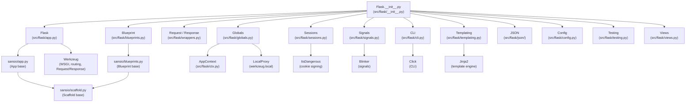

Sources: [src/flask/__init__.py:1-40](), [CHANGES.rst:141-142]()

---

## Request Lifecycle — High Level

Flask 3.2 simplified the internal code by merging `RequestContext` with `AppContext`. If an app context is already pushed, it is no longer reused when dispatching a request to simplify tracking.

**Request flow through Flask's code:**

```mermaid
sequenceDiagram
    participant "WSGI Server" as WSGI
    participant "Flask.__call__\n(app.py)" as App
    participant "AppContext\n(ctx.py)" as Ctx
    participant "Router\n(Werkzeug Map)" as Router
    participant "View Function" as View
    participant "SessionInterface\n(sessions.py)" as Session
    participant "Response\n(wrappers.py)" as Resp

    WSGI->>"Flask.__call__\n(app.py)": environ, start_response
    "Flask.__call__\n(app.py)">>"AppContext\n(ctx.py)": push context
    "AppContext\n(ctx.py)">>"SessionInterface\n(sessions.py)": open_session
    "AppContext\n(ctx.py)">>"Router\n(Werkzeug Map)": match URL
    "Router\n(Werkzeug Map)"->>"View Function": dispatch_request
    "View Function"->>"Response\n(wrappers.py)": return value
    "Response\n(wrappers.py)">>"SessionInterface\n(sessions.py)": save_session
    "Response\n(wrappers.py)">>"AppContext\n(ctx.py)": pop context / teardown
    "AppContext\n(ctx.py)">>WSGI: WSGI response
```

Sources: [CHANGES.rst:8-11](), [docs/quickstart.rst:24-37]()

---

## Context Proxies

Flask makes four thread-safe (and coroutine-safe) proxy objects available as module-level globals. They are backed by `contextvars.ContextVar` and `werkzeug.local.LocalProxy`.

| Name | Type | Backed by | Available when |
|---|---|---|---|
| `current_app` | `Flask` | `_cv_app` → `.app` | App context is active |
| `g` | `_AppCtxGlobals` | `_cv_app` → `.g` | App context is active |
| `request` | `Request` | `_cv_app` → `.request` | Request context is active |
| `session` | `SessionMixin` | `_cv_app` → `.session` | Request context is active |

All four are defined in `src/flask/globals.py`. Note that in Flask 3.2, many internal methods now take the `AppContext` directly instead of using these proxies.

Sources: [src/flask/globals.py:9-12](), [CHANGES.rst:12-13](), [docs/api.rst:34-43](), [docs/api.rst:65-73](), [docs/api.rst:154-170](), [docs/api.rst:178-189]()

---

## Subsystem Index

Each subsystem listed below has a dedicated wiki page.

| Subsystem | Key Code Entity | Wiki Page |
|---|---|---|
| Application object | `Flask` (`src/flask/app.py`) | [Flask Application Object](#2.1) |
| Context system | `AppContext`, `_cv_app` (`src/flask/ctx.py`, `src/flask/globals.py`) | [Context System](#2.2) |
| Blueprints | `Blueprint` (`src/flask/blueprints.py`) | [Blueprints](#2.3) |
| Sessions | `SessionInterface`, `SecureCookieSessionInterface` (`src/flask/sessions.py`) | [Sessions](#2.4) |
| Signals | `request_started`, `template_rendered` etc. (`src/flask/signals.py`) | [Signals](#2.5) |
| Routing | `Flask.route`, `Flask.add_url_rule`, `url_for` | [Routing](#3.1) |
| Views & responses | `View`, `MethodView` (`src/flask/views.py`) | [Views and Responses](#3.2) |
| Error handling | `Flask.errorhandler`, `abort` | [Error Handling](#3.3) |
| Security | `TRUSTED_HOSTS`, `MAX_CONTENT_LENGTH`, cookie config | [Security](#3.4) |
| Template rendering | `render_template`, `DispatchingJinjaLoader` (`src/flask/templating.py`) | [Template Rendering](#4.1) |
| JSON | `jsonify`, `JSONProvider`, `DefaultJSONProvider` (`src/flask/json/`) | [JSON Handling](#4.2) |
| Configuration | `Config` (`src/flask/config.py`) | [Configuration Loading](#5.1) |
| Extensions | `Flask.extensions`, `init_app` pattern | [Using Extensions](#6.1) |
| CLI | `FlaskGroup`, `run_command`, `shell_command` (`src/flask/cli.py`) | [Built-in Commands](#7.1) |
| Testing | `FlaskClient`, `FlaskCliRunner` (`src/flask/testing.py`) | [Test Client](#8.1) |
| Deployment | WSGI servers, async support | [WSGI Servers](#9.1) |

Sources: [src/flask/__init__.py:1-40](), [docs/index.rst:39-90](), [docs/api.rst:1-40]()

---

# Page: Installation and Setup

# Installation and Setup

<details>
<summary>Relevant source files</summary>

The following files were used as context for generating this wiki page:

- [docs/cli.rst](docs/cli.rst)
- [docs/config.rst](docs/config.rst)
- [docs/debugging.rst](docs/debugging.rst)
- [docs/extensiondev.rst](docs/extensiondev.rst)
- [docs/extensions.rst](docs/extensions.rst)
- [docs/installation.rst](docs/installation.rst)
- [docs/patterns/appfactories.rst](docs/patterns/appfactories.rst)
- [docs/patterns/packages.rst](docs/patterns/packages.rst)
- [docs/quickstart.rst](docs/quickstart.rst)
- [docs/server.rst](docs/server.rst)
- [docs/tutorial/deploy.rst](docs/tutorial/deploy.rst)
- [docs/tutorial/factory.rst](docs/tutorial/factory.rst)
- [docs/tutorial/install.rst](docs/tutorial/install.rst)
- [examples/javascript/README.rst](examples/javascript/README.rst)
- [examples/tutorial/README.rst](examples/tutorial/README.rst)
- [pyproject.toml](pyproject.toml)

</details>


This document provides a technical guide to installing Flask and setting up a development environment. It covers system requirements, virtual environment management, dependency resolution, and the initialization of a minimal web application.

## System Requirements

Flask requires **Python 3.10 or newer** [docs/installation.rst:8-9](). It is built as a WSGI microframework that coordinates several core libraries to handle routing, templating, and CLI interactions.

### Core Dependencies

When you install Flask, the following distributions are automatically included:

| Dependency | Role in Framework | Key Code Entities |
| :--- | :--- | :--- |
| **Werkzeug** | Implements WSGI and HTTP primitives | `werkzeug.serving`, `werkzeug.wrappers` |
| **Jinja** | Template rendering engine | `jinja2.Environment` |
| **MarkupSafe** | HTML string escaping for security | `markupsafe.escape` |
| **ItsDangerous** | Cryptographic data signing | `itsdangerous.URLSafeTimedSerializer` |
| **Click** | Command line interface toolkit | `click.Group`, `click.Command` |
| **Blinker** | Object-to-object signaling | `blinker.Signal` |

Sources: [docs/installation.rst:11-34](), [pyproject.toml:23-30]()

### Optional Features

Additional functionality can be enabled by installing optional providers:
*   **python-dotenv**: Enables automatic loading of `.env` and `.flaskenv` files for CLI configuration [docs/installation.rst:42-43]().
*   **asgiref**: Required for advanced async features [pyproject.toml:33-33]().
*   **Watchdog**: Provides optimized file system monitoring for the reloader [docs/installation.rst:44-45]().

## Environment Setup

Flask development should occur within a virtual environment to isolate project-specific dependencies from the system Python installation [docs/installation.rst:62-79]().

### Virtual Environment Workflow

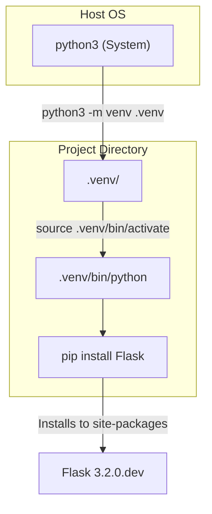

**Execution Commands:**
*   **macOS/Linux**: `python3 -m venv .venv` followed by `. .venv/bin/activate` [docs/installation.rst:94-120]().
*   **Windows**: `py -3 -m venv .venv` followed by `.venv\Scripts\activate` [docs/installation.rst:102-127]().

Sources: [docs/installation.rst:81-130]()

## Minimal Application Implementation

A minimal Flask application is defined by an instance of the `Flask` class, which acts as the central registry for configurations, routes, and the WSGI entry point.

### Code-to-Entity Mapping

The following diagram maps the code structure of a minimal app (e.g., `hello.py`) to the internal Flask architecture.

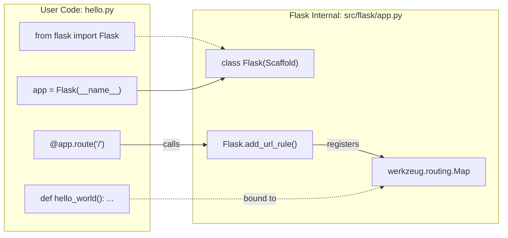

Sources: [docs/quickstart.rst:11-37](), [docs/tutorial/factory.rst:6-9]()

### Implementation Detail
1.  **Initialization**: `app = Flask(__name__)`. The `__name__` argument allows Flask to resolve the `root_path`, which is critical for locating `/static` and `/templates` folders [docs/quickstart.rst:25-31]().
2.  **Routing**: The `@app.route("/")` decorator is a wrapper around `add_url_rule` [docs/quickstart.rst:32-33]().
3.  **Security**: Flask defaults to HTML responses. Use `markupsafe.escape` for any user-provided data to prevent XSS [docs/quickstart.rst:128-152]().

## Application Discovery and CLI

The `flask` command (entry point `flask.cli:main`) uses an "Application Discovery" mechanism to find your app instance [pyproject.toml:82-83]().

### Discovery Logic

When running `flask run`, the system searches for a target based on the `--app` flag or `FLASK_APP` environment variable [docs/cli.rst:14-19]().

| Discovery Target | Priority / Search Logic |
| :--- | :--- |
| **Instance Name** | Looks for an object named `app` or `application` [docs/cli.rst:58-60](). |
| **Factory Function** | Looks for functions named `create_app` or `make_app` [docs/cli.rst:60-61](). |
| **Default Files** | If no `--app` is provided, it attempts to import `app.py` or `wsgi.py` [docs/cli.rst:54-57](). |

Sources: [docs/cli.rst:14-67](), [docs/quickstart.rst:42-55]()

### The Development Server

The development server is provided by Werkzeug and should **never** be used in production [docs/server.rst:10-16]().

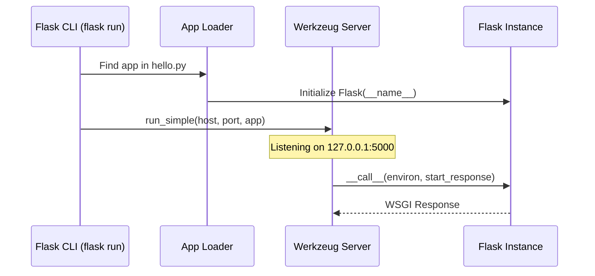

**Debug Mode Features**:
*   **Interactive Debugger**: Triggered on unhandled exceptions; allows code execution in-browser via a PIN-protected console [docs/quickstart.rst:87-105]().
*   **Reloader**: Restarts the process when `.py` files change. It can monitor additional files via `--extra-files` [docs/cli.rst:115-127]().

Sources: [docs/server.rst:1-32](), [docs/cli.rst:89-113](), [docs/debugging.rst:23-58]()

## Configuration Management

Configuration is handled via the `app.config` object, which is a specialized dictionary [docs/config.rst:14-26]().

### Loading Methods
*   **Direct Mapping**: `app.config.from_mapping({"SECRET_KEY": "dev"})` [docs/tutorial/factory.rst:46-49]().
*   **Python Files**: `app.config.from_pyfile("config.py")` [docs/tutorial/factory.rst:53-53]().
*   **Environment Variables**: Use `from_prefixed_env()` to load variables starting with `FLASK_` [docs/cli.rst:154-157]().

### Critical Config Keys
*   `DEBUG`: Enables/disables debug mode [docs/config.rst:68-79]().
*   `SECRET_KEY`: Used for signing session cookies. Generate using `secrets.token_hex()` [docs/config.rst:114-127]().
*   `TESTING`: Propagates exceptions for test runners [docs/config.rst:80-87]().

Sources: [docs/config.rst:1-127](), [docs/tutorial/factory.rst:43-66]()

---

# Page: Design Philosophy

# Design Philosophy

<details>
<summary>Relevant source files</summary>

The following files were used as context for generating this wiki page:

- [CHANGES.rst](CHANGES.rst)
- [docs/design.rst](docs/design.rst)
- [docs/patterns/streaming.rst](docs/patterns/streaming.rst)
- [docs/templating.rst](docs/templating.rst)
- [docs/web-security.rst](docs/web-security.rst)
- [src/flask/__init__.py](src/flask/__init__.py)
- [src/flask/globals.py](src/flask/globals.py)
- [src/flask/sansio/app.py](src/flask/sansio/app.py)
- [src/flask/sansio/blueprints.py](src/flask/sansio/blueprints.py)
- [src/flask/sansio/scaffold.py](src/flask/sansio/scaffold.py)

</details>


This document explains Flask's core design philosophy and the architectural decisions that shape the framework. It covers the principles behind Flask's microframework approach, the Sans-IO base class architecture introduced in recent versions, the deprecation cycle, and the boundaries between Flask's core functionality and extension ecosystem.

## Core Design Principles

Flask's design is guided by several fundamental principles that distinguish it from other web frameworks. These decisions prioritize simplicity, explicitness, and extensibility over convenience features that might limit flexibility.

### Explicit Application Object

Flask requires explicit instantiation of the `Flask` class rather than using implicit global application state. This design choice enables multiple application instances, subclassing, and proper resource management.

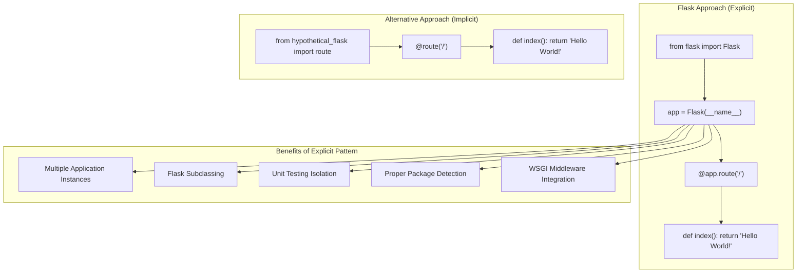

The explicit pattern provides three key advantages:

| Advantage | Benefit | Use Case |
|-----------|---------|----------|
| Multiple Instances | Support for multiple applications in one process | Unit testing, application factories |
| Subclassing | Ability to extend `Flask` class behavior | Custom application logic, middleware integration |
| Package Detection | Reliable resource location using `__name__` | Template and static file loading |

Sources: [docs/design.rst:10-78]()

### Microframework Philosophy

Flask's "micro" designation refers to keeping the core simple and extensible rather than limiting application size. The framework provides essential web functionality while delegating specialized features to extensions.

```mermaid
graph TB
    subgraph "Flask Core"
        FlaskClass["Flask Class"]
        Routing["URL Routing"]
        Templates["Jinja2 Integration"]
        WSGI["WSGI Interface"]
        Context["Context System"]
        Config["Configuration System"]
    end
    
    subgraph "Werkzeug Foundation"
        WSGIUtils["WSGI Utilities"]
        RequestResponse["Request/Response Objects"]
        URLRouting["URL Routing Engine"]
        Development["Development Server"]
    end
    
    subgraph "Extension Ecosystem"
        Database["Database Integration"]
        Forms["Form Validation"]
        Auth["Authentication"]
        Admin["Admin Interfaces"]
        API["REST API Tools"]
        Cache["Caching Systems"]
    end
    
    subgraph "Not Included in Core"
        ORM["Database ORM"]
        FormLib["Form Libraries"]
        AdminPanel["Admin Panels"]
        AuthSys["Authentication Systems"]
    end
    
    FlaskClass --> Routing
    FlaskClass --> Templates
    FlaskClass --> WSGI
    FlaskClass --> Context
    FlaskClass --> Config
    
    WSGI --> WSGIUtils
    Routing --> URLRouting
    FlaskClass --> RequestResponse
    FlaskClass --> Development
    
    FlaskClass -.-> Database
    FlaskClass -.-> Forms
    FlaskClass -.-> Auth
    FlaskClass -.-> Admin
    FlaskClass -.-> API
    FlaskClass -.-> Cache
    
    FlaskClass -.- ORM
    FlaskClass -.- FormLib
    FlaskClass -.- AdminPanel
    FlaskClass -.- AuthSys
```

Sources: [docs/design.rst:133-151](), [docs/design.rst:206-229]()

### Template Engine Integration

Flask bundles Jinja2 as its template engine. While users can use other engines, Flask's core features (like rich extensions and autoescaping) depend on Jinja being present.

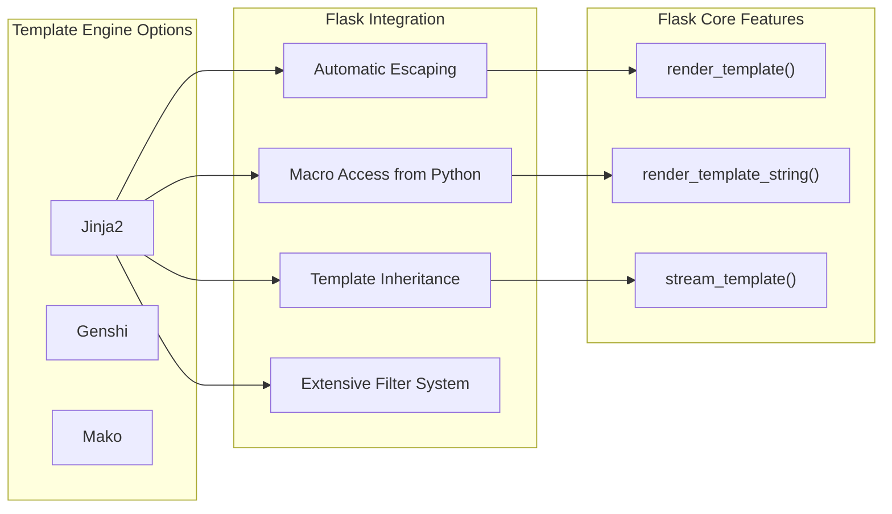

Sources: [docs/design.rst:96-131](), [docs/templating.rst:4-7]()

## Sans-IO Architecture

Introduced in Flask 3.0, the framework transitioned to a "Sans-IO" architecture. This involves separating the core logic of application and blueprint management from the I/O-heavy WSGI request handling.

### The Scaffold Pattern

The `Scaffold` base class provides common behavior shared between the `Flask` application and `Blueprint` objects. This includes route registration, error handling, and resource loading logic.

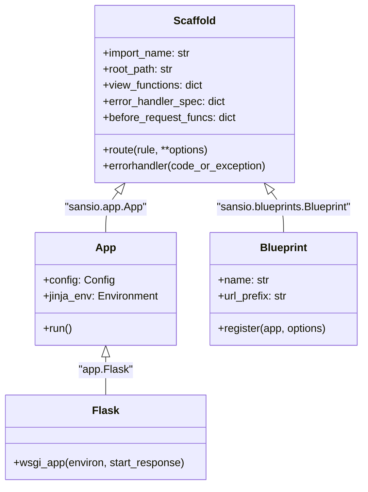

| Component | Role | File Path |
|-----------|------|-----------|
| `Scaffold` | Common logic for routes/handlers | [src/flask/sansio/scaffold.py:52-82]() |
| `App` | Base application logic (Sans-IO) | [src/flask/sansio/app.py:59-154]() |
| `Flask` | Concrete WSGI implementation | [src/flask/app.py:102]() |
| `Blueprint` | Modular route collection | [src/flask/sansio/blueprints.py:119-170]() |

Sources: [CHANGES.rst:141-142](), [src/flask/sansio/scaffold.py:52-108](), [src/flask/sansio/app.py:59-154]()

## Context Evolution and Deprecation

Flask 3.2 introduced a significant simplification of the internal context tracking system.

### Context Merging
The `RequestContext` has been merged into the `AppContext`. While `request_ctx` remains as a deprecated alias, the framework now uses a single `ContextVar` to track the active context, simplifying request dispatching.

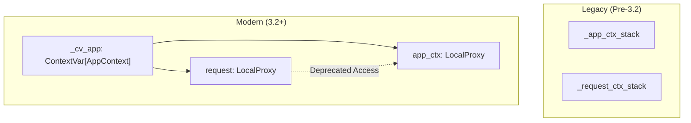

- **Deprecated Aliases**: `request_ctx` is now a deprecated alias for `app_ctx` and will be removed in Flask 4.0. [src/flask/globals.py:65-77]()
- **Method Signatures**: Many `Flask` methods now take `AppContext` as the first parameter instead of relying on global proxies internally. [CHANGES.rst:12-16]()

Sources: [CHANGES.rst:8-16](), [src/flask/globals.py:40-62]()

## Technical Trade-offs

### Thread Locals vs. ContextVars
Flask historically used `werkzeug.local.Local` (thread-locals). Modern Flask uses `contextvars.ContextVar` to power `LocalProxy` objects like `request` and `current_app`, allowing better support for asynchronous tasks while maintaining the simple global-proxy API.

| Proxy | Target | Source |
|-------|--------|--------|
| `current_app` | `app_ctx.app` | [src/flask/globals.py:44-46]() |
| `request` | `app_ctx.request` | [src/flask/globals.py:57-59]() |
| `session` | `app_ctx.session` | [src/flask/globals.py:60-62]() |
| `g` | `app_ctx.g` | [src/flask/globals.py:47-49]() |

### Streaming and Context
Streaming responses (using generators) present a challenge for the context system because the view function returns before the generator finishes. Flask provides `stream_with_context` to keep the context active during the generator's execution.

Sources: [docs/patterns/streaming.rst:64-87](), [src/flask/helpers.py:21]()

## Framework Boundaries

### What Flask Provides
- WSGI application interface and request dispatching. [src/flask/app.py:102]()
- URL routing via Werkzeug. [src/flask/sansio/app.py:13-15]()
- Template rendering with Jinja2. [docs/templating.rst:4-7]()
- Secure cookie-based sessions. [src/flask/globals.py:60-62]()
- Built-in CLI via Click. [src/flask/sansio/scaffold.py:70]()

### What Flask Delegates
- **Databases**: No built-in ORM; delegates to extensions like Flask-SQLAlchemy. [docs/design.rst:133-151]()
- **Forms**: No built-in validation; delegates to extensions like Flask-WTF. [docs/design.rst:133-151]()
- **Security**: Provides basic protections (XSS via Jinja, JSON security) but delegates CSRF to form libraries. [docs/web-security.rst:103-137]()

Sources: [docs/design.rst:133-151](), [docs/web-security.rst:44-102]()

---

# Page: Core Components

# Core Components

<details>
<summary>Relevant source files</summary>

The following files were used as context for generating this wiki page:

- [CHANGES.rst](CHANGES.rst)
- [docs/api.rst](docs/api.rst)
- [src/flask/__init__.py](src/flask/__init__.py)
- [src/flask/app.py](src/flask/app.py)
- [src/flask/blueprints.py](src/flask/blueprints.py)
- [src/flask/ctx.py](src/flask/ctx.py)
- [src/flask/globals.py](src/flask/globals.py)
- [src/flask/helpers.py](src/flask/helpers.py)
- [src/flask/sessions.py](src/flask/sessions.py)
- [src/flask/templating.py](src/flask/templating.py)
- [src/flask/testing.py](src/flask/testing.py)
- [src/flask/typing.py](src/flask/typing.py)

</details>


This page introduces the five fundamental building blocks of a Flask application and shows how they relate to each other. Each component has a dedicated sub-page with full implementation details. For background on Flask's overall architecture and design goals, see the [Overview](#1) and [Design Philosophy](#1.2) pages. For request handling specifics such as routing and views, see [Request Handling](#3).

---

## Component Map

The diagram below maps each natural-language concept to its primary code entity.

**Flask Core Components — Concept to Code**

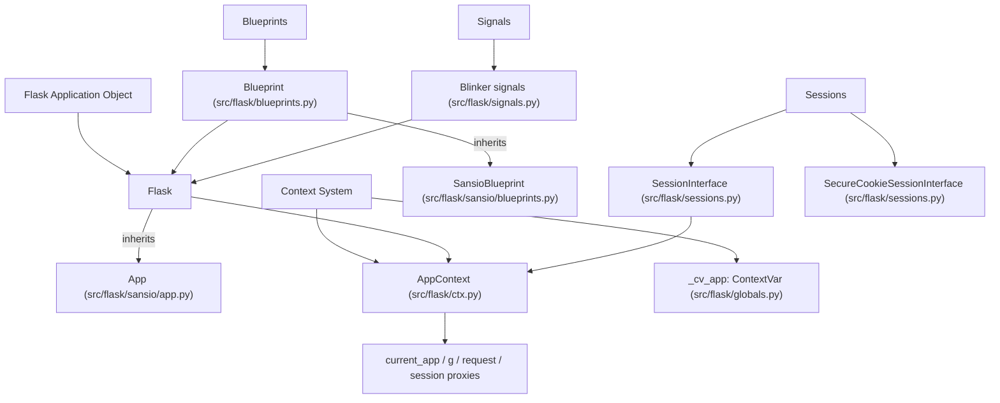

Sources: [src/flask/app.py:109-109](), [src/flask/ctx.py:30-30](), [src/flask/globals.py:40-62](), [src/flask/blueprints.py:18-18](), [src/flask/sessions.py:100-100](), [src/flask/__init__.py:1-39]()

---

## Components at a Glance

| Component | Primary Class / Symbol | Source File | Sub-page |
|---|---|---|---|
| Application Object | `Flask` | `src/flask/app.py` | [Flask Application Object](#2.1) |
| Context System | `AppContext`, `_cv_app` | `src/flask/ctx.py`, `src/flask/globals.py` | [Context System](#2.2) |
| Blueprints | `Blueprint` | `src/flask/blueprints.py` | [Blueprints](#2.3) |
| Sessions | `SessionInterface`, `SecureCookieSessionInterface` | `src/flask/sessions.py` | [Sessions](#2.4) |
| Signals | `appcontext_pushed`, `request_started`, etc. | `src/flask/signals.py` | [Signals](#2.5) |

Sources: [src/flask/__init__.py:1-39]()

---

## Flask Application Object

The `Flask` class in [src/flask/app.py:109-109]() is the central object of every Flask application. It:

- Implements the WSGI callable interface.
- Maintains the URL map, registered view functions, error handlers, and template context processors.
- Holds application-level configuration via `app.config` [src/flask/app.py:109-109]().
- Owns the `session_interface` (defaulting to `SecureCookieSessionInterface`) [src/flask/app.py:45-46]().
- Manages the lifecycle of `AppContext` instances for each request and CLI command.

`Flask` inherits from the Sans-IO base class `App` [src/flask/app.py:109-109](), which contains logic that does not require I/O. The concrete `Flask` class adds the WSGI entry point and other I/O-bound behavior like `run()` and `test_client()`.

See [Flask Application Object](#2.1) for constructor parameters, lifecycle methods, and inheritance details.

Sources: [src/flask/app.py:109-363](), [src/flask/sansio/app.py:1-1]()

---

## Context System

Flask uses the `AppContext` object to carry all state for the current activity. It is stored in a Python `ContextVar` named `_cv_app` [src/flask/globals.py:40-40]().

Four `LocalProxy` objects in [src/flask/globals.py:41-62]() provide convenient access to context state:

| Proxy | Points To | Available When |
|---|---|---|
| `current_app` | `AppContext.app` | Any app context |
| `g` | `AppContext.g` (`_AppCtxGlobals`) | Any app context |
| `request` | `AppContext.request` | Request context is active |
| `session` | `AppContext.session` | Request context is active |

**Note on Flask 3.2:** `RequestContext` has merged with `AppContext`. `RequestContext` is now a deprecated alias [CHANGES.rst:8-11](). If an app context is already pushed, it is no longer reused when dispatching a request to simplify internal tracking [CHANGES.rst:9-11]().

See [Context System](#2.2) for push/pop mechanics, `contextvars` integration, and CLI command context behavior.

Sources: [src/flask/ctx.py:30-116](), [src/flask/globals.py:33-77](), [CHANGES.rst:8-16]()

---

## Blueprints

The `Blueprint` class in [src/flask/blueprints.py:18-18]() provides a way to organize a Flask application into modular components. Each blueprint:

- Registers routes, error handlers, and template filters under its own namespace.
- Can define its own `template_folder` and `static_folder` [src/flask/blueprints.py:23-25]().
- Provides a `cli` attribute (an `AppGroup`) for registering CLI commands [src/flask/blueprints.py:49-53]().
- Is registered onto the `Flask` app via `app.register_blueprint(bp)`.

`Blueprint` inherits from `SansioBlueprint` [src/flask/blueprints.py:18-18](). During registration, blueprint routes can be prefixed with a `url_prefix` [src/flask/blueprints.py:26-26]().

See [Blueprints](#2.3) for `url_prefix`, template resolution, CLI groups, and the registration process.

Sources: [src/flask/blueprints.py:18-128](), [src/flask/sansio/blueprints.py:1-1]()

---

## Sessions

Flask's session system is built around the `SessionInterface` abstract base class in [src/flask/sessions.py:100-100](), which defines the contract for session backends:

- `open_session(app, request)` — Loads or creates the session [src/flask/sessions.py:249-251]().
- `save_session(app, session, response)` — Persists the session state [src/flask/sessions.py:261-263]().

The default implementation is `SecureCookieSessionInterface` [src/flask/sessions.py:105-105](), which:

- Serializes session data using `TaggedJSONSerializer` [src/flask/sessions.py:14-14]().
- Signs the cookie using `itsdangerous.URLSafeTimedSerializer`.
- Supports key rotation via the `SECRET_KEY_FALLBACKS` config [CHANGES.rst:88-90]().

A `Vary: Cookie` header is automatically added to responses when the session is accessed or modified [CHANGES.rst:163-165]().

See [Sessions](#2.4) for the full `SessionInterface` contract and custom backend implementation.

Sources: [src/flask/sessions.py:100-270](), [CHANGES.rst:36-37](), [CHANGES.rst:163-165]()

---

## Signals

Flask uses the [Blinker](https://blinker.readthedocs.io/) library to emit signals at key points. All built-in signals are defined in `src/flask/signals.py` and re-exported in [src/flask/__init__.py:24-33]().

| Signal | Emitted When |
|---|---|
| `request_started` | Before request dispatching [src/flask/app.py:50-50]() |
| `request_finished` | After request dispatching [src/flask/app.py:49-49]() |
| `appcontext_pushed` | When an `AppContext` is pushed [src/flask/__init__.py:25-25]() |
| `appcontext_popped` | When an `AppContext` is popped [src/flask/__init__.py:24-24]() |
| `template_rendered` | After a template is rendered [src/flask/templating.py:14-14]() |
| `message_flashed` | When `flash()` is called [src/flask/helpers.py:22-22]() |

Blinker >= 1.9 is a required dependency [CHANGES.rst:73-73](). Signals support `async` subscribers.

See [Signals](#2.5) for subscription patterns and the full signal reference.

Sources: [src/flask/__init__.py:24-33](), [src/flask/app.py:47-51](), [CHANGES.rst:71-73]()

---

## How the Components Interact

The following diagram shows the runtime relationships between components during a single HTTP request.

**Runtime Interaction During Request Dispatch**

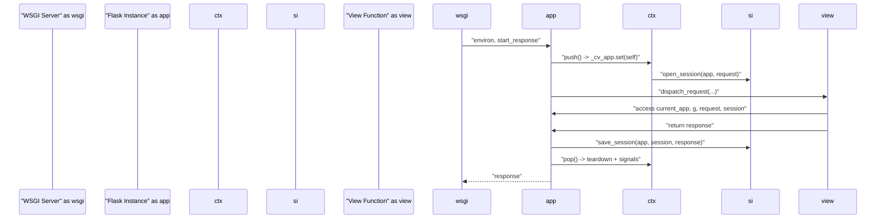

Sources: [src/flask/app.py:109-363](), [src/flask/ctx.py:12-12](), [src/flask/sessions.py:100-102](), [src/flask/globals.py:40-62]()

---

## Public API Surface

The symbols each component contributes to `flask`'s top-level namespace are listed below.

| Component | Exported Names |
|---|---|
| Application Object | `Flask` |
| Context System | `current_app`, `g`, `request`, `session`, `has_app_context`, `has_request_context`, `after_this_request`, `copy_current_request_context` |
| Blueprints | `Blueprint` |
| Sessions | *(accessed via `session` proxy)* |
| Signals | `request_started`, `request_finished`, `request_tearing_down`, `got_request_exception`, `appcontext_pushed`, `appcontext_popped`, `appcontext_tearing_down`, `before_render_template`, `template_rendered`, `message_flashed` |

Sources: [src/flask/__init__.py:1-39]()

---

# Page: Flask Application Object

# Flask Application Object

<details>
<summary>Relevant source files</summary>

The following files were used as context for generating this wiki page:

- [docs/api.rst](docs/api.rst)
- [src/flask/app.py](src/flask/app.py)
- [src/flask/blueprints.py](src/flask/blueprints.py)
- [src/flask/ctx.py](src/flask/ctx.py)
- [src/flask/helpers.py](src/flask/helpers.py)
- [src/flask/sessions.py](src/flask/sessions.py)
- [src/flask/templating.py](src/flask/templating.py)
- [src/flask/testing.py](src/flask/testing.py)
- [src/flask/typing.py](src/flask/typing.py)

</details>


This document covers the central `Flask` application class, its initialization, configuration, and core functionality. The Flask application object serves as the WSGI application entry point and coordinates all framework components including routing, context management, configuration, and request processing.

## Flask Application Class Overview

The `Flask` class is the core application object that implements the WSGI interface and acts as a central registry for view functions, URL rules, and template configuration [src/flask/app.py:110-113](). It inherits from the `App` base class (which provides Sans-IO functionality) and the `Scaffold` class (which provides common setup methods for both apps and blueprints) [src/flask/app.py:109]().

### Inheritance and Base Classes

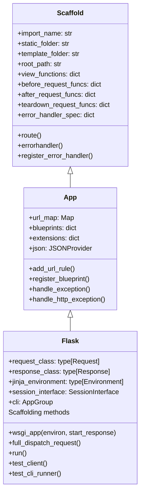
Sources: [src/flask/app.py:109](), [src/flask/sansio/app.py:41](), [src/flask/sansio/scaffold.py:46]()

## Application Initialization

The `Flask` constructor requires an `import_name` to resolve resources from the filesystem [src/flask/app.py:115-118](). This name is used to find templates, static files, and can be used by extensions for debugging [src/flask/app.py:130-133]().

### Constructor Parameters

| Parameter | Type | Description |
|-----------|------|-------------|
| `import_name` | `str` | The name of the application package/module [src/flask/app.py:175](). |
| `static_url_path` | `str` | URL path for static files [src/flask/app.py:176](). |
| `static_folder` | `str` | Folder containing static files, relative to `root_path` [src/flask/app.py:179](). |
| `template_folder` | `str` | Folder containing templates [src/flask/app.py:186](). |
| `instance_path` | `str` | Explicit path to the instance folder [src/flask/app.py:189](). |
| `instance_relative_config` | `bool` | If True, relative config paths are relative to the instance path [src/flask/app.py:192](). |
| `root_path` | `str` | Root path for the application (usually auto-detected) [src/flask/app.py:196](). |

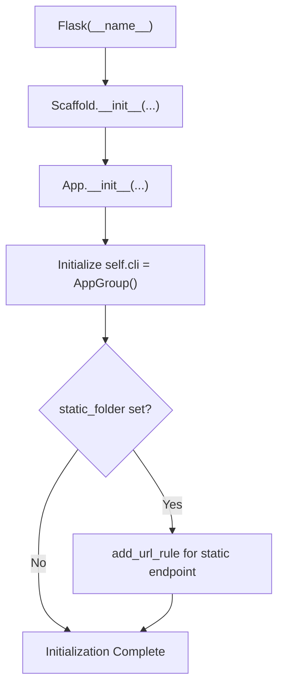
Sources: [src/flask/app.py:226-280](), [src/flask/sansio/app.py:64-118]()

## WSGI Interface and Lifecycle

The `Flask` object is a WSGI application. When a WSGI server calls the application, it triggers the `__call__` method, which delegates to `wsgi_app` [src/flask/app.py:1161-1166]().

### Request Processing Flow

1.  **`wsgi_app`**: Entry point. It creates a `RequestContext` and pushes it [src/flask/app.py:1138-1153]().
2.  **`full_dispatch_request`**: Orchestrates the request. It handles the first request setup, triggers `preprocess_request`, dispatches to the view, and finalizes the response [src/flask/app.py:904-922]().
3.  **`dispatch_request`**: Performs URL matching via `url_adapter.match()` and calls the associated view function [src/flask/app.py:931-945]().
4.  **`finalize_request`**: Converts the return value of the view into a `Response` object via `make_response` and runs `process_response` (after-request hooks) [src/flask/app.py:954-972]().

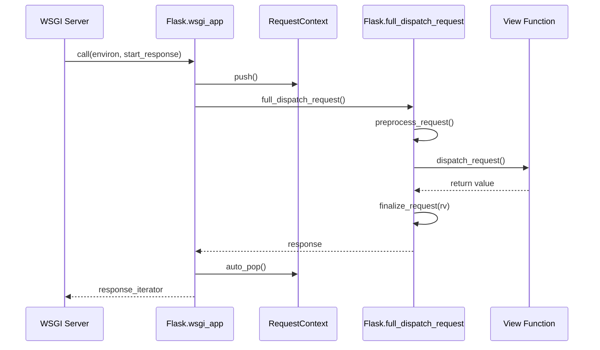
Sources: [src/flask/app.py:1138-1166](), [src/flask/app.py:904-972]()

## Core Lifecycle Methods

### Server Execution: `run()`
The `run()` method starts a local development server using Werkzeug's `run_simple` [src/flask/app.py:614-668](). It automatically detects if it is running from the reloader to avoid duplicate initialization logic [src/flask/app.py:633]().

### Testing Utilities
-   **`test_client()`**: Returns an instance of `FlaskClient` [src/flask/app.py:721-742](). This allows simulating requests to the application without a live server.
-   **`test_cli_runner()`**: Returns an instance of `FlaskCliRunner` [src/flask/app.py:744-760](). This is used to test Click-based CLI commands registered with the app.
-   **`test_request_context()`**: Creates a `RequestContext` for use in a `with` block during tests [src/flask/app.py:702-719]().

### Context Management
-   **`app_context()`**: Returns an `AppContext`. This is required to access `current_app` or `g` outside of a request [src/flask/app.py:683-700]().
-   **`teardown_appcontext`**: A decorator to register functions called when the application context is popped [src/flask/app.py:461-482]().

Sources: [src/flask/app.py:614-760](), [src/flask/testing.py:109-133](), [src/flask/ctx.py:139-207]()

## Resource and Instance Handling

Flask provides helpers to access files relative to the application's location:

-   **`open_resource()`**: Opens a file relative to the application's `root_path` [src/flask/app.py:353-371]().
-   **`open_instance_resource()`**: Opens a file relative to the `instance_path` [src/flask/app.py:373-383]().
-   **`instance_path`**: A dedicated directory for files that change at runtime (like databases or configuration) [src/flask/app.py:189-191]().

Sources: [src/flask/app.py:353-383](), [src/flask/sansio/scaffold.py:58-64]()

## Configuration and State

The application state is managed through several key attributes:

-   **`config`**: A `Config` object containing the application's configuration dictionary [src/flask/app.py:178]().
-   **`url_map`**: A Werkzeug `Map` that stores all registered `Rule` objects for routing [src/flask/sansio/app.py:103]().
-   **`view_functions`**: A dictionary mapping endpoint names to the actual view functions [src/flask/sansio/scaffold.py:95]().
-   **`blueprints`**: A dictionary of registered `Blueprint` objects [src/flask/sansio/app.py:97]().

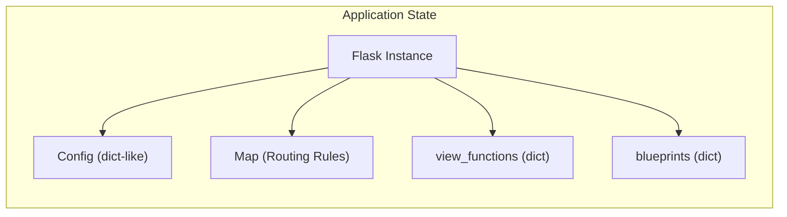
Sources: [src/flask/app.py:178-210](), [src/flask/sansio/app.py:95-105](), [src/flask/sansio/scaffold.py:80-100]()

---

# Page: Context System

# Context System

<details>
<summary>Relevant source files</summary>

The following files were used as context for generating this wiki page:

- [CHANGES.rst](CHANGES.rst)
- [docs/appcontext.rst](docs/appcontext.rst)
- [docs/reqcontext.rst](docs/reqcontext.rst)
- [docs/shell.rst](docs/shell.rst)
- [docs/signals.rst](docs/signals.rst)
- [src/flask/__init__.py](src/flask/__init__.py)
- [src/flask/app.py](src/flask/app.py)
- [src/flask/blueprints.py](src/flask/blueprints.py)
- [src/flask/ctx.py](src/flask/ctx.py)
- [src/flask/globals.py](src/flask/globals.py)
- [src/flask/helpers.py](src/flask/helpers.py)
- [src/flask/sessions.py](src/flask/sessions.py)
- [src/flask/templating.py](src/flask/templating.py)
- [src/flask/testing.py](src/flask/testing.py)
- [src/flask/typing.py](src/flask/typing.py)
- [tests/test_appctx.py](tests/test_appctx.py)
- [tests/test_regression.py](tests/test_regression.py)
- [tests/test_reqctx.py](tests/test_reqctx.py)
- [tests/test_signals.py](tests/test_signals.py)
- [tests/test_subclassing.py](tests/test_subclassing.py)
- [tests/test_templating.py](tests/test_templating.py)
- [tests/test_views.py](tests/test_views.py)

</details>


## Purpose and Scope

The Flask Context System provides thread-local and coroutine-local storage for application and request data during the lifecycle of web requests, CLI commands, and other activities. This system enables access to application configuration, request data, and user sessions via global proxies without explicitly passing these objects between functions [docs/appcontext.rst:4-13]().

As of **Flask 3.2**, the internal architecture has been significantly simplified: `RequestContext` has merged into `AppContext`, and many internal dispatch methods now take the context object directly to reduce reliance on global proxies during internal execution [CHANGES.rst:8-16]().

## Context Types and Merged Architecture

Historically, Flask maintained separate stacks for Application and Request contexts. In modern Flask, the `AppContext` serves as the primary container.

| Context Entity | Proxy Objects | Scope |
|----------------|---------------|-------|
| **App Context** | `current_app`, `g` | Active whenever an application instance is "pushed" (Requests, CLI, Tasks) [docs/appcontext.rst:11-13](). |
| **Request Data**| `request`, `session`| Active only when the context was created from a WSGI environment [docs/appcontext.rst:12-14](). |

### Context Hierarchy and Data Flow

The following diagram illustrates how `AppContext` encapsulates both application-level state and optional request-level state.

**Context Entity Space Mapping**

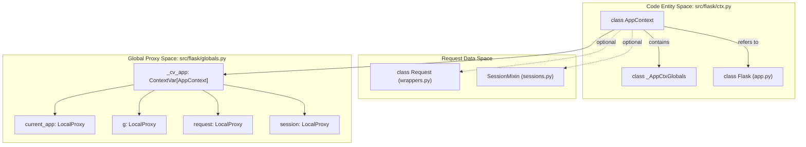
Sources: [src/flask/ctx.py:30-116](), [src/flask/globals.py:24-52](), [CHANGES.rst:8-11]()

## Context Implementation

### ContextVars and LocalProxy
Flask uses Python's `contextvars` for low-level isolation. `LocalProxy` wraps these variables so that attribute access is forwarded to the object bound to the current context [docs/appcontext.rst:173-176]().

*   `_cv_app`: The `ContextVar` holding the active `AppContext` [src/flask/globals.py:24]().
*   `current_app`: Points to `_cv_app.get().app` [src/flask/globals.py:31-33]().
*   `g`: Points to `_cv_app.get().g` (an instance of `_AppCtxGlobals`) [src/flask/globals.py:35-36]().
*   `request`: Points to `_cv_app.get().request` [src/flask/globals.py:42-47]().
*   `session`: Points to `_cv_app.get().session` [src/flask/globals.py:49-51]().

### The Merged RequestContext (Deprecated 3.2+)
In Flask 3.2, `RequestContext` is a deprecated alias for `AppContext` [CHANGES.rst:8-9](). If an app context is already pushed, Flask no longer attempts to reuse it when dispatching a request; a fresh context is pushed to simplify tracking [CHANGES.rst:9-11]().

Sources: [src/flask/globals.py:24-52](), [CHANGES.rst:8-16]()

## Context Lifecycle

The lifecycle of a context involves "pushing" it onto the `contextvars` storage at the start of an operation and "popping" it (which triggers teardown) at the end.

**Natural Language to Code Entity Lifecycle**

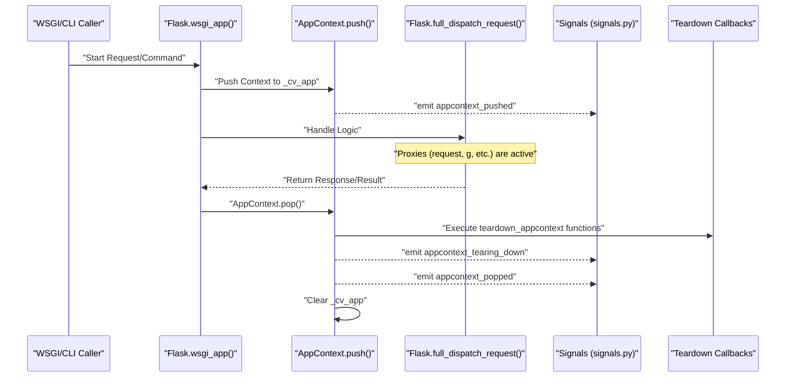
Sources: [docs/appcontext.rst:144-160](), [src/flask/app.py:109-113](), [src/flask/ctx.py:12-16]()

## Manual Context Management

While Flask handles contexts automatically during requests, developers must manage them manually in scripts or tests.

### Application Context
Used for tasks that require `current_app` or `g` but no HTTP request (e.g., database migrations, CLI scripts).
```python
with app.app_context():
    # current_app.config is now accessible
    db.create_all()
```
Sources: [docs/appcontext.rst:53-68]()

### Request Context
Used for unit testing functions that depend on `request` or `session`.
```python
with app.test_request_context('/login', method='POST'):
    # request.path == '/login'
    # request.method == 'POST'
    do_login()
```
Sources: [docs/appcontext.rst:107-111]()

### Streaming with Context
When returning a streamed response, the context must be preserved even after the view function returns. `stream_with_context` wraps a generator to ensure the context remains pushed during iteration [src/flask/helpers.py:63-148]().

Sources: [src/flask/helpers.py:126-148](), [docs/appcontext.rst:98-111]()

## Signals and Teardown

The context system is responsible for cleaning up resources via teardown functions.

*   **Teardown Functions**: Registered via `@app.teardown_appcontext`. These are called even if an exception occurs during request dispatch [docs/appcontext.rst:162-167]().
*   **Signal Integration**: Signals like `appcontext_pushed` and `request_started` are emitted when contexts are activated, allowing extensions to initialize state [docs/signals.rst:144-151]().
*   **Error Handling**: In Flask 3.2, all teardown callbacks are guaranteed to be called even if one raises an error [CHANGES.rst:17]().

Sources: [src/flask/app.py:47-51](), [CHANGES.rst:17-19](), [docs/appcontext.rst:152-160]()

---

# Page: Blueprints

# Blueprints

<details>
<summary>Relevant source files</summary>

The following files were used as context for generating this wiki page:

- [docs/blueprints.rst](docs/blueprints.rst)
- [docs/errorhandling.rst](docs/errorhandling.rst)
- [docs/patterns/appdispatch.rst](docs/patterns/appdispatch.rst)
- [docs/patterns/caching.rst](docs/patterns/caching.rst)
- [docs/patterns/fileuploads.rst](docs/patterns/fileuploads.rst)
- [docs/patterns/flashing.rst](docs/patterns/flashing.rst)
- [docs/patterns/index.rst](docs/patterns/index.rst)
- [docs/patterns/viewdecorators.rst](docs/patterns/viewdecorators.rst)
- [docs/views.rst](docs/views.rst)
- [src/flask/app.py](src/flask/app.py)
- [src/flask/blueprints.py](src/flask/blueprints.py)
- [src/flask/ctx.py](src/flask/ctx.py)
- [src/flask/helpers.py](src/flask/helpers.py)
- [src/flask/sessions.py](src/flask/sessions.py)
- [src/flask/templating.py](src/flask/templating.py)
- [src/flask/testing.py](src/flask/testing.py)
- [src/flask/typing.py](src/flask/typing.py)
- [tests/test_basic.py](tests/test_basic.py)
- [tests/test_blueprints.py](tests/test_blueprints.py)
- [tests/test_helpers.py](tests/test_helpers.py)
- [tests/test_testing.py](tests/test_testing.py)

</details>


This page describes how the `Blueprint` class provides modular structure within a Flask application: route registration, URL prefixes, template and static file resolution, scoped error handlers, request lifecycle hooks, and CLI command groups. For how the application object itself is structured, see [Flask Application Object](#2.1). For information on routing mechanics such as `url_for` and converters, see [Routing](#3.1). For error handler lookup order, see [Error Handling](#3.3).

---

## Purpose

A `Blueprint` is a container for a group of routes, error handlers, template context processors, and other application callbacks [src/flask/blueprints.py:18-31](). The functions registered on a blueprint are not active until the blueprint is registered on a `Flask` app via `app.register_blueprint(bp)` [src/flask/app.py:946-955](). At registration time, the blueprint's deferred operations are applied to the app [src/flask/sansio/blueprints.py:150-165]().

Blueprints are not separate WSGI applications [docs/blueprints.rst:35-40](). They share configuration, the application context, and the URL map with the host app. The key benefit is organizational: related view functions, error handlers, templates, and CLI commands can live in the same module and be attached to the app as a unit [docs/blueprints.rst:19-33]().

---

## Class Hierarchy

**Blueprint inheritance chain**

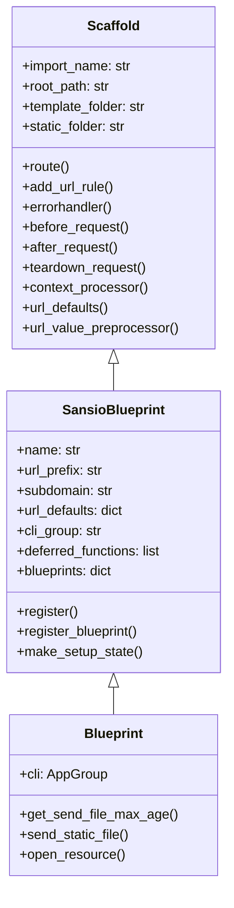

Sources: [src/flask/sansio/scaffold.py:44-60](), [src/flask/sansio/blueprints.py:18-50](), [src/flask/blueprints.py:18-53]()

- `Scaffold` ([src/flask/sansio/scaffold.py]()) — shared base for both `Flask` and `Blueprint`. Provides decorators for routes and lifecycle hooks [src/flask/sansio/scaffold.py:44-55]().
- `SansioBlueprint` ([src/flask/sansio/blueprints.py]()) — adds blueprint-specific state like `name`, `url_prefix`, and `deferred_functions` [src/flask/sansio/blueprints.py:18-40]().
- `Blueprint` ([src/flask/blueprints.py]()) — the public class users instantiate. Adds a `self.cli` (`AppGroup`) for command-line integration [src/flask/blueprints.py:49-53]().

---

## Constructor Parameters

```python
Blueprint(
    name,
    import_name,
    static_folder=None,
    static_url_path=None,
    template_folder=None,
    url_prefix=None,
    subdomain=None,
    url_defaults=None,
    root_path=None,
    cli_group=_sentinel,
)
```

| Parameter | Type | Purpose |
|---|---|---|
| `name` | `str` | Unique identifier. Prefixes all endpoint names [src/flask/sansio/blueprints.py:18-20](). |
| `import_name` | `str` | Used to locate the blueprint's root path [src/flask/sansio/blueprints.py:21](). |
| `static_folder` | `str \| PathLike \| None` | Folder containing static files [src/flask/sansio/blueprints.py:22](). |
| `static_url_path` | `str \| None` | URL path for static files [src/flask/sansio/blueprints.py:23](). |
| `template_folder` | `str \| PathLike \| None` | Folder for Jinja2 templates [src/flask/sansio/blueprints.py:24](). |
| `url_prefix` | `str \| None` | Path segment prepended to all routes [src/flask/sansio/blueprints.py:25](). |
| `subdomain` | `str \| None` | Subdomain constraint applied to all routes [src/flask/sansio/blueprints.py:26](). |
| `url_defaults` | `dict \| None` | Default values for URL rule generation [src/flask/sansio/blueprints.py:27](). |
| `cli_group` | `str \| None` | Name of the subcommand group on `flask` CLI [src/flask/sansio/blueprints.py:29](). |

Sources: [src/flask/blueprints.py:19-31](), [src/flask/sansio/blueprints.py:18-42]()

---

## Deferred Registration Model

Blueprints record operations rather than executing them immediately. Every decorator call (`@bp.route`, `@bp.before_request`, etc.) appends a setup function to `self.deferred_functions` [src/flask/sansio/scaffold.py:61-75]().

**Deferred operation lifecycle**

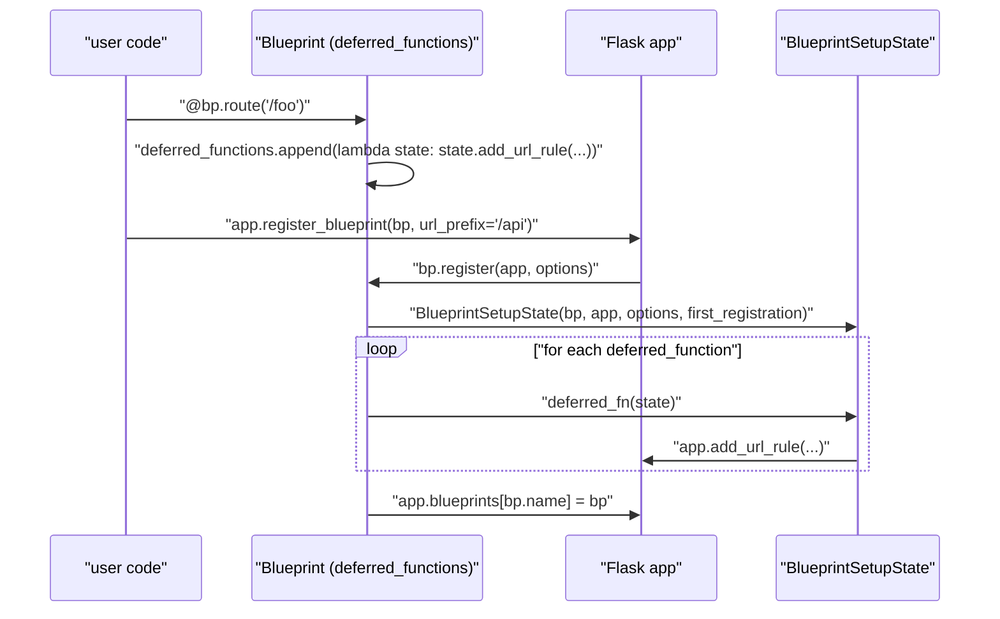

Sources: [src/flask/sansio/blueprints.py:150-165](), [src/flask/sansio/scaffold.py:61-80]()

### BlueprintSetupState

`BlueprintSetupState` ([src/flask/sansio/blueprints.py:34-130]()) is the temporary holder that bridges a blueprint's deferred operations into the app. It resolves the final URL prefix and subdomain based on the registration options [src/flask/sansio/blueprints.py:55-80]().

---

## Route Registration and Endpoint Naming

Routes on a blueprint are registered via the `route` decorator [src/flask/sansio/scaffold.py:165-180](). At registration, `BlueprintSetupState.add_url_rule` prepends the URL prefix and qualifies the endpoint name with the blueprint's name [src/flask/sansio/blueprints.py:115-130]().

**Endpoint naming**

```mermaid
flowchart LR
    subgraph "Blueprint definition"
        R["@bp.route('/users/<id>')"]
        E["endpoint = 'get_user'"]
    end
    subgraph "BlueprintSetupState.add_url_rule"
        PE["prefixed endpoint = 'api.get_user'"]
        PU["prefixed URL = '/api/users/<id>'"]
    end
    subgraph "app.url_map"
        RULE["Rule('/api/users/<id>', endpoint='api.get_user')"]
    end
    R --> PE
    E --> PE
    R --> PU
    PE --> RULE
    PU --> RULE
```

Sources: [src/flask/sansio/blueprints.py:115-130](), [docs/blueprints.rst:95-106]()

The final endpoint string is `<blueprint_name>.<view_function_name>`. Inside a blueprint, `url_for(".view")` resolves relative to the current blueprint [docs/blueprints.rst:210-212]().

---

## Template Folder

When `template_folder` is set, the blueprint's template directory is added to the app's `DispatchingJinjaLoader` [src/flask/templating.py:36-50](). The loader checks the app's template folder first, then each blueprint in registration order [src/flask/templating.py:100-115]().

**Template resolution order**

```mermaid
flowchart TD
    T["render_template('admin/index.html')"]
    T --> AL["DispatchingJinjaLoader"]
    AL --> AT["app templates/ folder"]
    AT -->|"not found"| BT1["blueprint 'admin' templates/ folder"]
    BT1 -->|"not found"| NF["TemplateNotFound"]
    AT -->|"found"| R["return template"]
    BT1 -->|"found"| R
```

Sources: [src/flask/templating.py:100-115](), [tests/test_blueprints.py:176-185]()

---

## Static Files

When `static_folder` is set, a route is automatically registered at `static_url_path` [src/flask/blueprints.py:82-93](). Static files are served via `Blueprint.send_static_file`, which uses `send_from_directory` [src/flask/blueprints.py:100-102]().

```python
# URL for blueprint static files
flask.url_for("admin.static", filename="style.css")
# → /admin/static/style.css
```

Sources: [src/flask/blueprints.py:82-102](), [tests/test_blueprints.py:208-212]()

---

## Error Handlers

Blueprints support scoped error handling via `@bp.errorhandler` [src/flask/sansio/scaffold.py:300-315](). These take precedence over app-level handlers if the error occurs within a blueprint route [docs/errorhandling.rst:169-173]().

**Error handler lookup**

```mermaid
flowchart TD
    EX["Exception raised in view"]
    EX --> BHL["app._find_error_handler(e, request.blueprints)"]
    BHL --> BSP["check app.error_handler_spec[blueprint_name]"]
    BSP -->|"handler found"| H["call blueprint handler"]
    BSP -->|"not found"| ASP["check app-level handlers"]
```

Sources: [docs/errorhandling.rst:158-165](), [tests/test_blueprints.py:8-43]()

> **Note**: Blueprint handlers cannot catch 404 errors triggered by the routing system because the blueprint is not identified until after a route matches [docs/errorhandling.rst:171-173]().

---

## CLI Command Groups

Each `Blueprint` has an `AppGroup` assigned to `self.cli` [src/flask/blueprints.py:49-53](). Commands registered here are nested under the blueprint's name in the `flask` command-line interface [src/flask/blueprints.py:45-48]().

```python
@bp.cli.command("init")
def init_db():
    ...
```

Sources: [src/flask/blueprints.py:44-53](), [src/flask/sansio/blueprints.py:21-30]()

---

## Registering a Blueprint

Registration occurs via `app.register_blueprint(bp)` [src/flask/app.py:946-955](). This triggers the `bp.register` method, which creates a `BlueprintSetupState` and executes all `deferred_functions` [src/flask/sansio/blueprints.py:150-165]().

Sources: [src/flask/app.py:946-955](), [src/flask/sansio/blueprints.py:150-165]()

---

## Nesting Blueprints

Blueprints can be registered on other blueprints [docs/blueprints.rst:126-133](). The child blueprint inherits the parent's URL prefix and subdomain, and its name is prefixed with the parent's name [docs/blueprints.rst:135-141]().

Sources: [docs/blueprints.rst:126-159](), [src/flask/sansio/blueprints.py:167-180]()

---

# Page: Sessions

# Sessions

<details>
<summary>Relevant source files</summary>

The following files were used as context for generating this wiki page:

- [src/flask/app.py](src/flask/app.py)
- [src/flask/blueprints.py](src/flask/blueprints.py)
- [src/flask/ctx.py](src/flask/ctx.py)
- [src/flask/helpers.py](src/flask/helpers.py)
- [src/flask/sessions.py](src/flask/sessions.py)
- [src/flask/templating.py](src/flask/templating.py)
- [src/flask/testing.py](src/flask/testing.py)
- [src/flask/typing.py](src/flask/typing.py)
- [tests/test_converters.py](tests/test_converters.py)
- [tests/test_session_interface.py](tests/test_session_interface.py)

</details>


This page documents Flask's session system: the `session` proxy, the `SessionInterface` abstract base class, the default `SecureCookieSessionInterface` implementation, and the steps needed to build a custom session backend. For context on how the session proxy is made available within a request, see the Context System page ([2.2]()). For cookie security configuration options such as `SESSION_COOKIE_SECURE` and `SESSION_COOKIE_HTTPONLY`, see the Security page ([3.4]()).

---

## Overview

Flask sessions provide a way to persist data across requests for a given client. By default, Flask stores session data in a **signed cookie** using the `itsdangerous` library. The client can read the cookie content but cannot alter it without knowing the `SECRET_KEY`, because any tampering breaks the cryptographic signature.

The session is accessible inside a request context through the `session` proxy (imported from `flask`), which behaves like a dictionary.

**Session lifecycle per request:**

```mermaid
sequenceDiagram
    participant "WSGI server" as wsgi
    participant "AppContext" as ctx
    participant "SessionInterface" as si
    participant "View function" as view
    participant "Response" as resp

    wsgi->>ctx: "push context (full_dispatch_request)"
    ctx->>si: "open_session(app, request) [lazy, on first access]"
    si-->>ctx: "SecureCookieSession (or NullSession)"
    ctx->>view: "dispatch_request()"
    view->>ctx: "read/write session[]"
    view-->>ctx: "return response"
    ctx->>si: "save_session(app, session, response)"
    si-->>resp: "Set-Cookie header"
    ctx->>wsgi: "pop context"
```

Sources: [src/flask/sessions.py:1-320](), [src/flask/ctx.py:381-403](), [src/flask/app.py:109-253]()

---

## The `session` Proxy

```python
from flask import session
```

The `session` object is a `LocalProxy` that resolves to the `SessionMixin` instance stored on the active `AppContext`. It is only available when a request context is active.

**Key behaviors:**

| Behavior | Detail |
|---|---|
| Dict-like access | `session["key"]`, `session.get("key")`, `session.pop("key")` |
| Change detection | `session.modified` is set automatically on direct key assignment |
| Nested mutation | Must manually set `session.modified = True` after mutating a nested structure |
| Permanence | Setting `session.permanent = True` persists the cookie for `PERMANENT_SESSION_LIFETIME` |
| Access tracking | Accessing the proxy sets `session.accessed = True`, which triggers a `Vary: Cookie` response header |

The `accessed` flag is tracked by the request context and set whenever the proxy is resolved [src/flask/sessions.py:46-54](). Accessing it via `AppContext.session` ensures that `session.accessed` is set [src/flask/ctx.py:395-403]().

Sources: [src/flask/sessions.py:24-55](), [src/flask/ctx.py:370-403](), [src/flask/app.py:38-38]()

---

## Session Classes

**Class hierarchy diagram:**

```mermaid
classDiagram
    class "MutableMapping" {
        <<abstract>>
    }
    class "CallbackDict" {
    }
    class "SessionMixin" {
        +permanent: bool
        +new: bool
        +modified: bool
        +accessed: bool
    }
    class "SecureCookieSession" {
        +modified: bool
        +__init__(initial)
    }
    class "NullSession" {
        +_fail(*args)
    }

    MutableMapping <|-- SessionMixin
    CallbackDict <|-- SecureCookieSession
    SessionMixin <|-- SecureCookieSession
    SecureCookieSession <|-- NullSession
```

Sources: [src/flask/sessions.py:24-97]()

### `SessionMixin`

[src/flask/sessions.py:24-55]()

Abstract mixin that every session object must include. Defines:

- `permanent` — a property backed by the `"_permanent"` key in the dict.
- `new` — class-level `False`; implementations may override.
- `modified` — class-level `True`; signals that the session needs saving.
- `accessed` — class-level `False`; set to `True` when the session is accessed through the request context.

### `SecureCookieSession`

[src/flask/sessions.py:57-81]()

The concrete session object used by the default backend. Extends `CallbackDict` (from Werkzeug) and `SessionMixin`. When any key is set directly, the `on_update` callback fires, setting `modified = True`. Nested mutations (e.g., appending to a list stored in the session) are not detected automatically.

### `NullSession`

[src/flask/sessions.py:83-97]()

A subclass of `SecureCookieSession` that raises a `RuntimeError` on any write operation. It is returned by `SessionInterface.make_null_session()` when `open_session()` returns `None` (typically because `SECRET_KEY` is not set). Read-only access returns empty results without errors, which allows templates to call `session.get(...)` without crashing.

---

## `SessionInterface`

[src/flask/sessions.py:100-296]()

The abstract base class for all session backends. Flask's `Flask` class holds a single instance of a `SessionInterface` on the attribute `session_interface` [src/flask/app.py:252]().

To replace the backend:

```python
app.session_interface = MySessionInterface()
```

### Required Methods

Both methods must be implemented in any custom backend:

| Method | Signature | Purpose |
|---|---|---|
| `open_session` | `(app, request) -> SessionMixin \| None` | Load or create the session for the incoming request. Return `None` to trigger `NullSession`. |
| `save_session` | `(app, session, response) -> None` | Persist the session, typically by setting a `Set-Cookie` header on the response. |

### Helper Methods on `SessionInterface`

These have default implementations that read from `app.config` and can be overridden:

| Method | Config key used |
|---|---|
| `get_cookie_name` | `SESSION_COOKIE_NAME` |
| `get_cookie_domain` | `SESSION_COOKIE_DOMAIN` |
| `get_cookie_path` | `SESSION_COOKIE_PATH` or `APPLICATION_ROOT` |
| `get_cookie_httponly` | `SESSION_COOKIE_HTTPONLY` |
| `get_cookie_secure` | `SESSION_COOKIE_SECURE` |
| `get_cookie_samesite` | `SESSION_COOKIE_SAMESITE` |
| `get_cookie_partitioned` | `SESSION_COOKIE_PARTITIONED` |
| `get_expiration_time` | `PERMANENT_SESSION_LIFETIME` (when `session.permanent`) |
| `should_set_cookie` | `SESSION_REFRESH_EACH_REQUEST` |

`make_null_session(app)` creates an instance of `null_session_class` (default: `NullSession`) [src/flask/sessions.py:150-160]().

`is_null_session(obj)` checks whether the given object is an instance of `null_session_class` [src/flask/sessions.py:162-169]().

Sources: [src/flask/sessions.py:100-232]()

---

## `SecureCookieSessionInterface`

[src/flask/sessions.py:234-320]()

The default implementation registered on every `Flask` application.

**How it works:**

```mermaid
flowchart TD
    A["open_session(app, request)"] --> B{"SECRET_KEY set?"}
    B -- "No" --> C["return None → NullSession"]
    B -- "Yes" --> D["URLSafeTimedSerializer.loads(cookie_value)"]
    D -- "BadSignature / expired" --> E["return empty SecureCookieSession"]
    D -- "OK" --> F["return SecureCookieSession(data)"]

    G["save_session(app, session, response)"] --> H{"is_null_session?"}
    H -- "Yes" --> I["skip"]
    H -- "No" --> J{"should_set_cookie?"}
    J -- "No" --> K["skip"]
    J -- "Yes" --> L["URLSafeTimedSerializer.dumps(session)"]
    L --> M["response.set_cookie(...)"]
```

**Serialization:**

Session data is serialized with `TaggedJSONSerializer` (from `flask.json.tag`) before being passed to `itsdangerous.URLSafeTimedSerializer` [src/flask/sessions.py:246-250](). This handles Python types that plain JSON does not support.

**Key attributes:**

| Attribute | Value |
|---|---|
| `salt` | `"cookie-session"` |
| `digest_method` | `hashlib.sha1` |
| `key_derivation` | `"hmac"` |
| `serializer` | `TaggedJSONSerializer()` |
| `session_class` | `SecureCookieSession` |

**`SECRET_KEY_FALLBACKS`:** When rotating the secret key, old keys can be listed under `app.config["SECRET_KEY_FALLBACKS"]`. `open_session` will try each in sequence if the primary key fails to verify the cookie [src/flask/sessions.py:256-295]().

Sources: [src/flask/sessions.py:234-320](), [src/flask/app.py:206-238]()

---

## Session Lazy Loading

The session is loaded lazily the first time it is accessed via the context.

The loading happens in `AppContext._get_session()` [src/flask/ctx.py:381-393]():

1. If `_session` is already cached on the context, return it.
2. Otherwise call `app.session_interface.open_session(app, request)`.
3. If `open_session` returns `None`, call `make_null_session(app)`.

The public `AppContext.session` property wraps `_get_session()` and sets `session.accessed = True` [src/flask/ctx.py:395-403]().

The `Vary: Cookie` response header is added by `save_session` whenever `session.accessed` is `True`, ensuring that caches treat the response as unique to the session cookie [src/flask/sessions.py:313-315]().

Sources: [src/flask/ctx.py:381-403](), [src/flask/sessions.py:296-320]()

---

## Session Configuration

All session-related configuration keys and their defaults:

| Config key | Default | Description |
|---|---|---|
| `SECRET_KEY` | `None` | Required for signing cookies. |
| `SECRET_KEY_FALLBACKS` | `None` | List of old keys for rotation. |
| `SESSION_COOKIE_NAME` | `"session"` | Name of the cookie. |
| `SESSION_COOKIE_DOMAIN` | `None` | Cookie domain. |
| `SESSION_COOKIE_PATH` | `None` | Cookie path; falls back to `APPLICATION_ROOT`. |
| `SESSION_COOKIE_HTTPONLY` | `True` | Block JavaScript access to cookie. |
| `SESSION_COOKIE_SECURE` | `False` | HTTPS-only cookie. |
| `SESSION_COOKIE_SAMESITE` | `None` | `"Strict"`, `"Lax"`, or `None`. |
| `SESSION_COOKIE_PARTITIONED` | `False` | Enable cookie partitioning (CHIPS). |
| `SESSION_REFRESH_EACH_REQUEST` | `True` | Re-send cookie on every request when permanent. |
| `PERMANENT_SESSION_LIFETIME` | `timedelta(days=31)` | Lifetime for permanent sessions. |

Sources: [src/flask/app.py:206-238](), [src/flask/sessions.py:171-232]()

---

## Implementing a Custom Session Backend

To replace the default cookie-based session with a server-side store (e.g. Redis, a database), subclass `SessionInterface` and implement `open_session` and `save_session`.

**Minimal structure:**

```python
class MySession(dict, SessionMixin):
    pass

class MySessionInterface(SessionInterface):
    def open_session(self, app, request):
        # 1. Extract session ID from request cookie
        # 2. Load data from backend store
        # 3. Return a MySession instance
        ...

    def save_session(self, app, session, response):
        # 1. Persist session data to backend store
        # 2. Set session ID cookie on response
        ...
```

**Things to consider:**

- Call `self.get_expiration_time(app, session)` for the cookie expiry [src/flask/sessions.py:199-214]().
- Call `self.should_set_cookie(app, session)` before writing the cookie [src/flask/sessions.py:216-224]().
- If saving is skipped because `not session` and `not session.modified`, ensure the cookie is deleted if it previously existed.
- Set the `Vary: Cookie` response header if `session.accessed` is `True`.

Sources: [src/flask/sessions.py:100-135](), [src/flask/sessions.py:296-320]()

---

## Session in Tests

The `FlaskClient.session_transaction()` context manager allows reading and writing session data directly between requests:

```python
with client.session_transaction() as sess:
    sess["user_id"] = 42
```

Internally, this opens a temporary request context, calls `open_session`, allows modifications, and then calls `save_session` to update the client's cookie jar [src/flask/testing.py:135-183]().

Sources: [src/flask/testing.py:135-183](), [src/flask/app.py:60-60]()

---

## Relationship to Other Components

```mermaid
flowchart LR
    proxy["session proxy\n(flask.globals)"] -->|"resolves to"| ctx_session["AppContext.session\n(ctx.py)"]
    ctx_session -->|"calls"| open_session["SessionInterface.open_session()"]
    open_session -->|"default impl"| sci["SecureCookieSessionInterface\n(sessions.py)"]
    sci -->|"uses"| its["URLSafeTimedSerializer\n(itsdangerous)"]
    sci -->|"uses"| tag["TaggedJSONSerializer\n(flask.json.tag)"]
    sci -->|"returns"| scs["SecureCookieSession\n(sessions.py)"]
    flask_app["Flask.session_interface\n(app.py)"] -->|"holds instance of"| sci
    finalize["Flask.process_response()\n(app.py)"] -->|"calls"| save_session["SessionInterface.save_session()"]
    save_session -->|"writes"| resp["Set-Cookie header\n(Response)"]
```

Sources: [src/flask/app.py:109-253](), [src/flask/ctx.py:381-403](), [src/flask/sessions.py:234-320]()

---

# Page: Signals

# Signals

<details>
<summary>Relevant source files</summary>

The following files were used as context for generating this wiki page:

- [docs/appcontext.rst](docs/appcontext.rst)
- [docs/reqcontext.rst](docs/reqcontext.rst)
- [docs/shell.rst](docs/shell.rst)
- [docs/signals.rst](docs/signals.rst)
- [src/flask/signals.py](src/flask/signals.py)
- [tests/test_appctx.py](tests/test_appctx.py)
- [tests/test_regression.py](tests/test_regression.py)
- [tests/test_reqctx.py](tests/test_reqctx.py)
- [tests/test_signals.py](tests/test_signals.py)
- [tests/test_subclassing.py](tests/test_subclassing.py)
- [tests/test_templating.py](tests/test_templating.py)
- [tests/test_views.py](tests/test_views.py)

</details>


Flask's signal system provides a lightweight publish-subscribe mechanism for reacting to internal lifecycle events without modifying Flask's core dispatch logic. This page covers all built-in signals, their parameters, when they fire, how to subscribe to them, and how to define and emit custom signals.

For information about the request and application context lifecycle that many signals are tied to, see [Context System](#2.2). For the callback-based hooks that mirror several signals (such as `before_request`), see [Request Handling](#3).

---

## Overview

Flask integrates with the [Blinker](https://pypi.org/project/blinker/) library for signals [docs/signals.rst:8-9](). Blinker is a required dependency. All built-in signal objects are defined in `src/flask/signals.py` [src/flask/signals.py:1-17]() and re-exported from `src/flask/__init__.py`.

Signals differ from Flask's decorator callbacks (`before_request`, `after_request`, etc.) in that they are observation-only; they cannot directly affect the application flow or modify the response (except for `before_render_template` which allows context mutation) [docs/signals.rst:11-17](). This makes them ideal for testing, metrics, and auditing [docs/signals.rst:14-15]().

### Signal vs. Callback Comparison

| Aspect | Decorator callbacks | Signals |
|---|---|---|
| **Return value** | Can return a response to short-circuit dispatch | Ignored by Flask [docs/signals.rst:13-14]() |
| **Subscription scope** | Tied to the app or blueprint at setup time | Can be connected/disconnected at any time [docs/signals.rst:30-35]() |
| **Execution Order** | Interleaved with signals | See [Signal Firing Order](#signal-firing-order-during-a-request) |

Sources: [docs/signals.rst:1-18](), [src/flask/signals.py:1-17]()

---

## Built-in Signals

The following signals are defined in `src/flask/signals.py` using a dedicated `_signals` `Namespace` [src/flask/signals.py:6]().

| Signal | Sender | Keyword arguments | When fired |
|---|---|---|---|
| `request_started` | `app` | _(none)_ | Before view function is called, after context is pushed [src/flask/signals.py:10]() |
| `request_finished` | `app` | `response` | After the response is fully formed [src/flask/signals.py:11]() |
| `request_tearing_down` | `app` | `exc` | During request context teardown [src/flask/signals.py:12]() |
| `got_request_exception` | `app` | `exception` | When an unhandled exception occurs during dispatch [src/flask/signals.py:13]() |
| `appcontext_pushed` | `app` | _(none)_ | Immediately after an app context is pushed [src/flask/signals.py:15]() |
| `appcontext_popped` | `app` | _(none)_ | Immediately after an app context is popped [src/flask/signals.py:16]() |
| `appcontext_tearing_down` | `app` | `exc` | During app context teardown [src/flask/signals.py:14]() |
| `template_rendered` | `app` | `template`, `context` | After a template is rendered [src/flask/signals.py:8]() |
| `before_render_template` | `app` | `template`, `context` | Before a template is rendered [src/flask/signals.py:9]() |
| `message_flashed` | `app` | `message`, `category` | When `flask.flash()` is called [src/flask/signals.py:17]() |

Sources: [src/flask/signals.py:1-17](), [docs/signals.rst:20-24](), [docs/appcontext.rst:144-161]()

---

## Signal Firing Order During a Request

The lifecycle involves both app context and request context signals. Teardown signals fire even if exceptions occur [docs/appcontext.rst:162-167]().

**Request Dispatch Sequence**

```mermaid
sequenceDiagram
    participant App as "Flask Application"
    participant Ctx as "AppContext / RequestContext"
    participant Sig as "Blinker Signals"
    
    App->>Ctx: push()
    Ctx->>Sig: appcontext_pushed.send(app)
    App->>Sig: request_started.send(app)
    
    Note over App: View Processing
    App->>Sig: before_render_template.send(app, template, context)
    Note over App: Jinja2 Rendering
    App->>Sig: template_rendered.send(app, template, context)
    
    App->>Sig: request_finished.send(app, response)
    
    Note over App: Error occurs?
    App->>Sig: got_request_exception.send(app, exception)
    
    Ctx->>Sig: request_tearing_down.send(app, exc)
    Ctx->>Sig: appcontext_tearing_down.send(app, exc)
    App->>Ctx: pop()
    Ctx->>Sig: appcontext_popped.send(app)
```

Sources: [docs/appcontext.rst:152-161](), [tests/test_signals.py:50-93](), [tests/test_appctx.py:216-248]()

---

## Subscribing to Signals

### Connection Methods

Subscribers should always accept `**extra` arguments to remain compatible with future Flask updates [docs/signals.rst:69-71]().

1.  **`Signal.connect(receiver, sender)`**: Manual connection. Always specify the `app` as `sender` to avoid receiving signals from other apps in the same process [docs/signals.rst:30-39]().
2.  **`Signal.connected_to(receiver, sender)`**: Context manager for temporary subscription, useful in unit tests [docs/signals.rst:77-89]().
3.  **`@Signal.connect_via(sender)`**: Decorator-based subscription [docs/signals.rst:153-164]().

**Example: Capturing Templates in Tests**
```python
# Based on docs/signals.rst:48-58
@contextmanager
def captured_templates(app):
    recorded = []
    def record(sender, template, context, **extra):
        recorded.append((template, context))
    template_rendered.connect(record, app)
    try:
        yield recorded
    finally:
        template_rendered.disconnect(record, app)
```

Sources: [docs/signals.rst:27-96](), [docs/signals.rst:153-165]()

---

## Custom Signals

To create signals in an extension or application, use a custom `Namespace` to avoid collisions [docs/signals.rst:100-106]().

```python
from blinker import Namespace
my_signals = Namespace()
model_saved = my_signals.signal('model-saved') # docs/signals.rst:110
```

### Emitting Signals

Use the `send()` method. The first argument is the sender [docs/signals.rst:121-125]().

**Warning on Proxies**: Never pass `current_app` as the sender. It is a `LocalProxy` and will not match subscribers connected to the real app object [docs/signals.rst:136-141](). Use `current_app._get_current_object()` instead [docs/appcontext.rst:134-141]().

```python
# Correct way to send from a function
from flask import current_app
model_saved.send(current_app._get_current_object(), custom_data=42)
```

Sources: [docs/signals.rst:97-141](), [docs/appcontext.rst:134-141]()

---

## Code Entity Space Mapping

This diagram maps the high-level Signal concepts to the specific classes and instances in the Flask and Blinker codebases.

**Code Entity Map: Signals Architecture**

```mermaid
flowchart TD
    subgraph "Blinker Library"
        NS["Namespace Class"]
        SIG_OBJ["Signal / NamedSignal Instance"]
    end

    subgraph "flask.signals (src/flask/signals.py)"
        FLASK_NS["_signals = Namespace()"]
        REQ_S["request_started"]
        REQ_F["request_finished"]
        TMP_R["template_rendered"]
    end

    subgraph "flask.app (src/flask/app.py)"
        DISPATCH["full_dispatch_request()"]
    end

    FLASK_NS -- "creates" --> REQ_S
    FLASK_NS -- "creates" --> REQ_F
    FLASK_NS -- "creates" --> TMP_R
    
    NS -.->|"instantiates"| FLASK_NS
    SIG_OBJ -.->|"instantiates"| REQ_S
    
    DISPATCH -- "calls .send(self)" --> REQ_S
    DISPATCH -- "calls .send(self, response)" --> REQ_F
```

Sources: [src/flask/signals.py:1-17](), [docs/signals.rst:1-10](), [tests/test_signals.py:50-93]()

---

# Page: Request Handling

# Request Handling

<details>
<summary>Relevant source files</summary>

The following files were used as context for generating this wiki page:

- [src/flask/app.py](src/flask/app.py)
- [src/flask/blueprints.py](src/flask/blueprints.py)
- [src/flask/ctx.py](src/flask/ctx.py)
- [src/flask/helpers.py](src/flask/helpers.py)
- [src/flask/sessions.py](src/flask/sessions.py)
- [src/flask/templating.py](src/flask/templating.py)
- [src/flask/testing.py](src/flask/testing.py)
- [src/flask/typing.py](src/flask/typing.py)
- [tests/test_basic.py](tests/test_basic.py)
- [tests/test_blueprints.py](tests/test_blueprints.py)
- [tests/test_helpers.py](tests/test_helpers.py)
- [tests/test_testing.py](tests/test_testing.py)

</details>


This page covers how Flask processes HTTP requests from initial receipt through WSGI to final response generation. It describes the complete request-response cycle, the core components involved, and the mechanisms for accessing request data and generating responses.

| Sub-page | Purpose |
|----------|---------|
| [Routing](#3.1) | URL rules, `app.route`, variable converters, `url_for` |
| [Views and Responses](#3.2) | View functions, `View`, `MethodView`, `make_response` |
| [Error Handling](#3.3) | `errorhandler`, `abort`, `handle_http_exception` |
| [Security](#3.4) | `MAX_CONTENT_LENGTH`, `TRUSTED_HOSTS`, session cookie flags, `secure_filename` |

## Request Processing Overview

Flask processes HTTP requests through a well-defined pipeline that transforms incoming WSGI requests into Python objects, routes them to appropriate handlers, and converts Python return values back into HTTP responses.

### Complete Request Flow

**Flask request-response pipeline (`Flask.wsgi_app` → WSGI response)**

```mermaid
graph TD
    HTTP["HTTP Request"] --> WSGI["WSGI Server"]
    WSGI --> FlaskCall["Flask.__call__"]
    FlaskCall --> WsgiApp["Flask.wsgi_app"]

    WsgiApp --> CreateCtx["AppContext.from_environ()"]
    CreateCtx --> PushCtx["AppContext.push()"]
    PushCtx --> MatchReq["AppContext.match_request()"]
    MatchReq --> RouteMatch{"Route matched?"}

    RouteMatch -->|"No"| RoutingException["routing_exception stored on Request"]
    RouteMatch -->|"Yes"| FullDispatch["Flask.full_dispatch_request()"]

    RoutingException --> FullDispatch

    FullDispatch --> RequestStarted["request_started signal"]
    RequestStarted --> Preprocess["Flask.preprocess_request()"]
    Preprocess --> PreResult{"before_request returned?"}

    PreResult -->|"Yes"| Finalize["Flask.finalize_request()"]
    PreResult -->|"No"| Dispatch["Flask.dispatch_request()"]
    Dispatch --> ViewFunc["view_functions[endpoint]()"]
    ViewFunc --> Finalize

    Finalize --> MakeResp["Flask.make_response()"]
    MakeResp --> ProcessResp["Flask.process_response()"]
    ProcessResp --> SaveSession["session_interface.save_session()"]
    SaveSession --> RequestFinished["request_finished signal"]
    RequestFinished --> PopCtx["AppContext.pop()"]
    PopCtx --> TeardownReq["Flask.do_teardown_request()"]
    TeardownReq --> TeardownApp["Flask.do_teardown_appcontext()"]
    TeardownApp --> HTTPResponse["HTTP Response to WSGI server"]

    FullDispatch -->|"exception"| HandleException["Flask.handle_user_exception()"]
    HandleException --> HandleHTTP["Flask.handle_http_exception()"]
    HandleHTTP --> Finalize
```

Sources: [src/flask/app.py:2098-2121](), [src/flask/app.py:1439-1520](), [src/flask/ctx.py:382-475]()

### Core Request Processing Components

**Code entities involved in the request pipeline**

```mermaid
graph TB
    subgraph "src/flask/app.py"
        FlaskClass["Flask class"]
        WsgiApp["Flask.wsgi_app()"]
        FullDispatch["Flask.full_dispatch_request()"]
        DispatchReq["Flask.dispatch_request()"]
        MakeResponse["Flask.make_response()"]
        ProcessResp["Flask.process_response()"]
        HandleExc["Flask.handle_user_exception()"]
    end

    subgraph "src/flask/ctx.py"
        AppCtxClass["AppContext class"]
        PushMethod["AppContext.push()"]
        MatchReqMethod["AppContext.match_request()"]
        CVApp["_cv_app (ContextVar)"]
    end

    subgraph "src/flask/globals.py"
        CurrentApp["current_app (LocalProxy)"]
        RequestProxy["request (LocalProxy)"]
        SessionProxy["session (LocalProxy)"]
        GProxy["g (LocalProxy)"]
    end

    subgraph "src/flask/wrappers.py"
        RequestClass["Request class"]
        ResponseClass["Response class"]
    end

    subgraph "src/flask/sansio/app.py"
        URLMap["url_map (werkzeug.routing.Map)"]
        ViewFunctions["view_functions dict"]
    end

    WsgiApp --> AppCtxClass
    PushMethod --> CVApp
    CVApp --> CurrentApp
    CVApp --> RequestProxy
    CVApp --> SessionProxy
    CVApp --> GProxy
    MatchReqMethod --> URLMap
    URLMap --> ViewFunctions
    DispatchReq --> ViewFunctions
    MakeResponse --> ResponseClass
```

Sources: [src/flask/app.py:2098-2121](), [src/flask/ctx.py:382-415](), [src/flask/globals.py:1-65]()

## WSGI Integration and Application Context

Flask implements the WSGI callable interface through `Flask.__call__`, which delegates to `Flask.wsgi_app`. For each request, a single `AppContext` (defined in `src/flask/ctx.py`) is pushed, which carries both application-level data (`g`, `current_app`) and request-level data (`request`, `session`) when handling an HTTP request.

> **Flask 3.2 change:** `RequestContext` was merged into `AppContext`. A single `AppContext` instance now serves both roles. The `RequestContext` name is kept as a deprecated alias until Flask 4.0.

### Context Lifecycle per Request

**`AppContext` push/pop lifecycle for a single HTTP request**

```mermaid
graph TD
    WSGICall["Flask.__call__(environ, start_response)"] --> WsgiApp["Flask.wsgi_app(environ, start_response)"]
    WsgiApp --> FromEnv["AppContext.from_environ(app, environ)"]
    FromEnv --> CreateReq["app.request_class(environ) → Request"]
    CreateReq --> CreateCtx["AppContext(app, request=request)"]
    CreateCtx --> CreateURLAdapter["app.create_url_adapter(request)"]
    CreateURLAdapter --> PushCtx["ctx.push() → _cv_app.set(ctx)"]
    PushCtx --> MatchReq["ctx.match_request() → url_adapter.match()"]
    MatchReq --> FullDispatch["Flask.full_dispatch_request()"]
    FullDispatch --> Response["Response object"]
    Response --> PopCtx["ctx.pop() → _cv_app.reset(token)"]
    PopCtx --> TeardownSignals["appcontext_tearing_down signal"]
    TeardownSignals --> WSGIResponse["WSGI iterator returned"]

    subgraph "Active during request"
        CVApp["_cv_app ContextVar holds AppContext"]
        CurrentApp["current_app → ctx.app"]
        RequestProxy["request → ctx.request"]
        SessionProxy["session → ctx.session (lazy)"]
        GProxy["g → ctx.g"]
    end

    PushCtx --> CVApp
    CVApp --> CurrentApp
    CVApp --> RequestProxy
    CVApp --> SessionProxy
    CVApp --> GProxy
```

Sources: [src/flask/ctx.py:382-530](), [src/flask/app.py:2098-2121]()

## Request Object and Data Access

The `request` proxy (defined in `src/flask/globals.py`) points to the `Request` object on the active `AppContext`. `flask.wrappers.Request` extends `werkzeug.wrappers.Request` with Flask-specific attributes such as `url_rule`, `view_args`, and `routing_exception`.

### Request Data Access Patterns

| Data Type | Attribute | Werkzeug type |
|-----------|-----------|---------------|
| Query string | `request.args` | `ImmutableMultiDict` |
| Form fields | `request.form` | `ImmutableMultiDict` |
| File uploads | `request.files` | `ImmutableMultiDict[str, FileStorage]` |
| JSON body | `request.json` | `dict` or `None` |
| Cookies | `request.cookies` | `ImmutableMultiDict` |
| HTTP method | `request.method` | `str` |
| Headers | `request.headers` | `EnvironHeaders` |
| Matched URL rule | `request.url_rule` | `werkzeug.routing.Rule` or `None` |
| URL variables | `request.view_args` | `dict` or `None` |
| Max body size | `request.max_content_length` | `int` or `None` |

**`flask.wrappers.Request` attribute map**

```mermaid
graph LR
    HTTPRequest["HTTP Request (WSGI environ)"] --> RequestObj["flask.wrappers.Request"]

    RequestObj --> Args["request.args"]
    RequestObj --> Form["request.form"]
    RequestObj --> Files["request.files"]
    RequestObj --> JSON["request.json"]
    RequestObj --> Cookies["request.cookies"]
    RequestObj --> Method["request.method"]
    RequestObj --> Headers["request.headers"]
    RequestObj --> URLRule["request.url_rule"]
    RequestObj --> ViewArgs["request.view_args"]
    RequestObj --> RoutingExc["request.routing_exception"]
```

Sources: [src/flask/wrappers.py:18-160](), [src/flask/app.py:37-38]()

## Response Generation

`Flask.make_response` (in `src/flask/app.py`) converts view function return values into `flask.wrappers.Response` objects. The `ResponseReturnValue` type alias in `src/flask/typing.py` documents the accepted return types.

### Response Conversion Rules

**`Flask.make_response` conversion logic**

```mermaid
graph TD
    ViewReturn["View function return value"] --> CheckType{"Type check"}

    CheckType -->|"flask.wrappers.Response instance"| DirectReturn["Return as-is"]
    CheckType -->|"str or bytes"| StringResp["Wrap in Response with text/html"]
    CheckType -->|"dict or list"| JSONResp["flask.json.jsonify()"]
    CheckType -->|"tuple (rv, status)"| TupleStatus["Set status code"]
    CheckType -->|"tuple (rv, headers)"| TupleHeaders["Set headers"]
    CheckType -->|"tuple (rv, status, headers)"| TupleFull["Set status and headers"]
    CheckType -->|"iterator/generator"| StreamResp["Streaming Response"]
    CheckType -->|"WSGI callable"| WSGIResp["Wrap WSGI app as Response"]

    StringResp --> ResponseObj["flask.wrappers.Response"]
    JSONResp --> ResponseObj
    TupleStatus --> ResponseObj
    TupleHeaders --> ResponseObj
    TupleFull --> ResponseObj
    StreamResp --> ResponseObj
    WSGIResp --> ResponseObj
    DirectReturn --> ResponseObj

    ResponseObj --> ProcessResponse["Flask.process_response()"]
    ProcessResponse --> AfterRequest["after_request callbacks"]
    AfterRequest --> SaveSession["session_interface.save_session()"]
```

The `make_response` helper in `src/flask/helpers.py` delegates to `current_app.make_response()` and is available for direct use in view functions to build a response before returning it.

Sources: [src/flask/typing.py:36-42](), [src/flask/helpers.py:151-197](), [src/flask/app.py:1680-1765]()

## Helper Functions for Common Operations

Flask provides helper functions that simplify common request handling tasks like file serving, redirects, and error responses.

### Core Helper Functions

```mermaid
graph TB
    subgraph "File Operations"
        SendFile["flask.send_file()"]
        SendFromDir["flask.send_from_directory()"]
        StaticFiles["Flask.send_static_file()"]
    end
    
    subgraph "Navigation Helpers"
        URLFor["flask.url_for()"]
        Redirect["flask.redirect()"]
        Abort["flask.abort()"]
    end
    
    subgraph "Response Helpers"
        MakeResponse["flask.make_response()"]
        Jsonify["flask.jsonify()"]
        RenderTemplate["flask.render_template()"]
    end
    
    subgraph "Streaming"
        StreamWithContext["flask.stream_with_context()"]
        StreamingResponse["Streaming Response Generator"]
    end
    
    SendFile --> MakeResponse
    URLFor --> Redirect
    Jsonify --> MakeResponse
    StreamWithContext --> StreamingResponse
```

Sources: [tests/test_helpers.py:34-93](), [src/flask/helpers.py:200-240](), [src/flask/helpers.py:13-14]()

### URL Generation and Redirects

The `url_for` function generates URLs for view functions, while `redirect` creates redirect responses. These work together to provide flexible navigation control.

```mermaid
graph LR
    ViewName["View Function Name"] --> URLFor["url_for('view_name')"]
    URLFor --> URLString["Generated URL String"]
    URLString --> Redirect["redirect(url)"]
    Redirect --> RedirectResponse["302 Redirect Response"]
    
    URLFor --> External["_external=True"]
    External --> AbsoluteURL["Absolute URL with scheme"]
    
    URLFor --> Anchor["_anchor='section'"]
    Anchor --> URLWithAnchor["URL + #section"]
```

Sources: [src/flask/helpers.py:200-240](), [tests/test_helpers.py:95-134](), [tests/test_helpers.py:164-179]()

### Error Handling Integration

The `abort` function provides a way to trigger HTTP error responses from within view functions, integrating with Flask's error handling system.

| Function | Purpose | Behavior |
|----------|---------|-------------|
| `abort(404)` | Trigger 404 Not Found | Raises `werkzeug.exceptions.NotFound` |
| `abort(401)` | Trigger 401 Unauthorized | Raises `werkzeug.exceptions.Unauthorized` |
| `abort(500)` | Trigger 500 Internal Server Error | Raises `werkzeug.exceptions.InternalServerError` |

Sources: [src/flask/helpers.py:13](), [tests/test_helpers.py:180-207](), [src/flask/app.py:1530-1580]()

---

# Page: Routing

# Routing

<details>
<summary>Relevant source files</summary>

The following files were used as context for generating this wiki page:

- [docs/cli.rst](docs/cli.rst)
- [docs/config.rst](docs/config.rst)
- [docs/debugging.rst](docs/debugging.rst)
- [docs/patterns/appfactories.rst](docs/patterns/appfactories.rst)
- [docs/patterns/packages.rst](docs/patterns/packages.rst)
- [docs/patterns/urlprocessors.rst](docs/patterns/urlprocessors.rst)
- [docs/quickstart.rst](docs/quickstart.rst)
- [docs/server.rst](docs/server.rst)
- [docs/tutorial/deploy.rst](docs/tutorial/deploy.rst)
- [docs/tutorial/factory.rst](docs/tutorial/factory.rst)
- [docs/tutorial/install.rst](docs/tutorial/install.rst)
- [examples/javascript/README.rst](examples/javascript/README.rst)
- [examples/tutorial/README.rst](examples/tutorial/README.rst)
- [tests/test_basic.py](tests/test_basic.py)
- [tests/test_blueprints.py](tests/test_blueprints.py)
- [tests/test_converters.py](tests/test_converters.py)
- [tests/test_helpers.py](tests/test_helpers.py)
- [tests/test_session_interface.py](tests/test_session_interface.py)
- [tests/test_testing.py](tests/test_testing.py)

</details>


Flask's routing system maps incoming HTTP request URLs to Python view functions. This page covers route registration, URL variable rules and converters, HTTP method restrictions, shorthand decorators, URL building with `url_for`, and the `url_defaults` and `url_value_preprocessor` hooks.

For class-based views that integrate with routing, see [Views and Responses](#3.2). For blueprint-level routing with `url_prefix` and scoped endpoints, see [Blueprints](#2.3).

---

## Route Registration

### `app.route()` decorator

The most common way to register a route is the `@app.route()` decorator. It binds a URL pattern to a view function.

```python
@app.route("/")
def index():
    return "Index Page"

@app.route("/hello")
def hello():
    return "Hello, World"
```

Sources: [docs/quickstart.rst:19-21](), [docs/quickstart.rst:161-169]()

### `add_url_rule()`

`app.route()` is a convenience wrapper around `add_url_rule(rule, endpoint=None, view_func=None, **options)`. Calling `add_url_rule` directly gives more control and is equivalent in outcome.

```python
def index():
    return "Hello World"

app.add_url_rule("/", "index", index)
app.add_url_rule("/more", "more", more, methods=["GET", "POST"])
```

Sources: [tests/test_basic.py:81-81](), [tests/test_basic.py:169-170]()

### Internal registration

**Route Registration Data Flow**

```mermaid
flowchart LR
    route_dec["@app.route()"] --> aur["add_url_rule()"]
    get_dec["@app.get()"] --> aur
    post_dec["@app.post()"] --> aur
    aur --> url_map["url_map\n(werkzeug.routing.Map)"]
    aur --> view_funcs["view_functions\n(dict: endpoint -> callable)"]
    url_map --> rule["werkzeug.routing.Rule"]
```

- `url_map` is a Werkzeug `Map` instance held on the `App` object.
- `view_functions` is a plain `dict` mapping endpoint name strings to callables.
- Each `add_url_rule` call creates a Werkzeug `Rule` and adds it to `url_map`, then registers the callable in `view_functions` under the endpoint name.

Sources: [tests/test_basic.py:157-190](), [tests/test_basic.py:207-208]()

---

## Variable Rules

URL segments can be made dynamic with the `<variable_name>` syntax. The captured string is passed as a keyword argument to the view function. An optional converter prefix can specify the expected type: `<converter:variable_name>`.

```python
@app.route('/user/<username>')
def show_user_profile(username):
    return f'User {username}'

@app.route('/post/<int:post_id>')
def show_post(post_id):
    return f'Post {post_id}'
```

### Built-in converters

| Converter | Accepts |
|-----------|---------|
| `string` | Any text without a slash (default) |
| `int` | Positive integers |
| `float` | Positive floating-point values |
| `path` | Like `string` but accepts slashes |
| `uuid` | UUID strings |

Converters are provided by Werkzeug's routing system. The converted Python value is passed directly into the view function. A URL that cannot be converted raises a 404.

Sources: [docs/quickstart.rst:175-207]()

---

## Trailing Slash Behavior

The presence or absence of a trailing slash in the rule string has a distinct effect:

| Rule | Behavior |
|------|----------|
| `/projects/` | Canonical URL has trailing slash. Accessing `/projects` triggers a redirect to `/projects/`. |
| `/about` | No trailing slash. Accessing `/about/` returns a 404. |

This mirrors file-system semantics: a trailing slash acts like a directory; no trailing slash acts like a file path. Werkzeug's `Rule` handles the redirect automatically.

Sources: [docs/quickstart.rst:210-232]()

---

## HTTP Methods

By default, a route only responds to `GET` requests. The `methods` parameter accepts a list of HTTP method strings.

```python
@app.route('/login', methods=['GET', 'POST'])
def login():
    ...
```

### Automatic method behavior

| Condition | Automatic behavior |
|-----------|--------------------|
| `GET` in `methods` | `HEAD` is handled automatically. |
| `OPTIONS` not in `methods` | `OPTIONS` is implemented automatically (controlled by `PROVIDE_AUTOMATIC_OPTIONS`). |
| Method not in `methods` | Flask returns 405 Method Not Allowed, with an `Allow` header. |

The `PROVIDE_AUTOMATIC_OPTIONS` config key (default: `True`) controls global automatic OPTIONS generation. It can also be set per-route via the `provide_automatic_options` argument to `add_url_rule`, or as an attribute on the view function.

Sources: [tests/test_basic.py:32-40](), [tests/test_basic.py:72-101](), [tests/test_basic.py:139-141]()

### Shorthand method decorators

Flask provides dedicated decorators for each common HTTP method. Each is equivalent to calling `add_url_rule` with the corresponding `methods` value set. Passing a `methods` keyword argument to these decorators raises a `TypeError`.

| Decorator | HTTP Method |
|-----------|-------------|
| `@app.get()` | GET |
| `@app.post()` | POST |
| `@app.put()` | PUT |
| `@app.delete()` | DELETE |
| `@app.patch()` | PATCH |

Sources: [tests/test_basic.py:55-69](), [tests/test_basic.py:108-109]()

---

## Endpoints

Every route has an **endpoint name** used internally to identify it. By default, this is the view function's `__name__`. It can be overridden:

```python
@app.route('/bar', endpoint='bar')
def foo_bar():
    ...
```

or via `add_url_rule`:

```python
app.add_url_rule("/", endpoint="index", view_func=index)
```

**Blueprint endpoints** are automatically namespaced as `blueprint_name.endpoint_name`. For example, a view named `foo` in a blueprint named `bp` has the endpoint `bp.foo`.

The `@app.endpoint(name)` decorator registers a view function for a URL rule that was added directly to `url_map` (e.g., via Werkzeug's `Submount`) without going through `add_url_rule`.

Sources: [tests/test_basic.py:169-169](), [tests/test_basic.py:214-231](), [tests/test_blueprints.py:164-168]()

---

## Request Dispatch Flow

**How an HTTP request is matched to a view function**

```mermaid
flowchart TD
    req["HTTP Request"] --> call["Flask.__call__()"]
    call --> fdr["full_dispatch_request()"]
    fdr --> dr["dispatch_request()"]
    dr --> match["MapAdapter.match()"]
    match --> ep["endpoint + view_args"]
    ep --> vf["view_functions[endpoint]"]
    vf --> result["view function result"]
```

- When a request comes in, the WSGI application matches the URL against the `url_map`.
- `dispatch_request` performs the lookup in `view_functions` using the matched endpoint.
- If no match is found, a `NotFound` (404) exception is raised. If the method is not allowed, a `MethodNotAllowed` (405) is raised.

Sources: [tests/test_basic.py:129-150](), [tests/test_basic.py:193-212]()

---

## URL Building with `url_for`

`url_for(endpoint, **values)` builds a URL for the given endpoint name by reversing the routing table.

```python
url_for('index')                         # → '/'
url_for('login', next='/')               # → '/login?next=/'
url_for('static', filename='style.css')  # → '/static/style.css'
```

**How values are consumed:**
- URL rule variables are consumed from `values`.
- Remaining keyword arguments are appended as query string parameters.

**Special keyword arguments:**

| Argument | Effect |
|----------|--------|
| `_external=True` | Generate absolute URL with scheme and host. |
| `_scheme` | Override the URL scheme (implies `_external=True`). |
| `_anchor` | Append `#fragment` to the URL. |
| `_method` | Select the URL matching a specific HTTP method when an endpoint has multiple rules. |

Sources: [tests/test_helpers.py:95-110](), [tests/test_helpers.py:135-155](), [docs/quickstart.rst:235-290]()

---

## `url_defaults` Hook

`url_defaults` registers a callback that runs whenever `url_for` builds a URL for an endpoint in the associated blueprint or application. The callback can inject or modify URL values before the URL is built.

```python
@bp.url_defaults
def add_language_code(endpoint, values):
    values.setdefault("lang_code", flask.g.lang_code)
```

Sources: [tests/test_blueprints.py:131-142](), [tests/test_blueprints.py:154-156]()

---

## `url_value_preprocessor` Hook

`url_value_preprocessor` registers a callback that runs after URL matching but before the view function is called. It receives the matched URL variables and can extract values from them (e.g., storing them in `g` and removing them from `view_args`).

```python
@bp.url_value_preprocessor
def pull_lang_code(endpoint, values):
    flask.g.lang_code = values.pop("lang_code")
```

When used together, `url_value_preprocessor` and `url_defaults` allow a blueprint to transparently manage a URL segment — such as `/<lang_code>/` — without requiring individual view functions to declare it as a parameter.

Sources: [tests/test_blueprints.py:158-160](), [tests/test_blueprints.py:172-173]()

---

# Page: Views and Responses

# Views and Responses

<details>
<summary>Relevant source files</summary>

The following files were used as context for generating this wiki page:

- [docs/patterns/appdispatch.rst](docs/patterns/appdispatch.rst)
- [docs/patterns/index.rst](docs/patterns/index.rst)
- [docs/views.rst](docs/views.rst)
- [src/flask/debughelpers.py](src/flask/debughelpers.py)
- [src/flask/logging.py](src/flask/logging.py)
- [src/flask/views.py](src/flask/views.py)
- [src/flask/wrappers.py](src/flask/wrappers.py)
- [tests/test_appctx.py](tests/test_appctx.py)
- [tests/test_logging.py](tests/test_logging.py)
- [tests/test_regression.py](tests/test_regression.py)
- [tests/test_reqctx.py](tests/test_reqctx.py)
- [tests/test_request.py](tests/test_request.py)
- [tests/test_signals.py](tests/test_signals.py)
- [tests/test_subclassing.py](tests/test_subclassing.py)
- [tests/test_templating.py](tests/test_templating.py)
- [tests/test_views.py](tests/test_views.py)

</details>


This page documents Flask's view functions, class-based views, and response generation mechanisms. These components form the core part of how Flask handles HTTP requests and generates appropriate responses. For information about URL routing and how requests reach views, see [Routing](3.1).

## Overview of Views and Responses

In Flask, a view is a function or class that processes a request and returns a response. Views are the heart of your application's logic, determining what content is displayed to users and how the application responds to different requests.

```mermaid
flowchart TB
    subgraph "Request Handling"
        A["HTTP Request"] --> B["Routing"]
        B --> C["View Function/Class"]
        C --> D["Response Generation"]
        D --> E["HTTP Response"]
    end
    
    subgraph "View Types"
        F["Function-based Views"]
        G["Class-based Views"]
        G1["View Class"]
        G2["MethodView Class"]
        G --> G1
        G --> G2
    end
    
    subgraph "Response Types"
        H["String"]
        I["Response Object"]
        J["Tuple (content, status, headers)"]
        K["JSON/Rendered Template"]
    end
    
    C --- F
    C --- G
    D --- H
    D --- I
    D --- J
    D --- K
```

Sources: [src/flask/views.py:16-136](), [src/flask/wrappers.py:18-29](), [docs/views.rst:6-12]()

## Function-based Views

The simplest way to define a view in Flask is through a function. Function-based views are typically decorated with `@app.route()` or shorthand decorators like `@app.get()` to associate them with a URL pattern.

```python
@app.route('/users/')
def user_list():
    users = User.query.all()
    return render_template('users.html', users=users)
```

### View Function Workflow

When a request matches a route, Flask calls the associated view function. Any variables captured by the URL rule are passed as keyword arguments to the function.

```mermaid
sequenceDiagram
    participant Client
    participant Flask
    participant ViewFunction as "View Function"
    
    Client->>Flask: HTTP Request
    Flask->>Flask: Match URL to endpoint
    Flask->>ViewFunction: Call with URL variables
    ViewFunction-->>Flask: Return value
    Flask->>Flask: Convert to Response (make_response)
    Flask-->>Client: HTTP Response
```

Sources: [docs/views.rst:104-107](), [src/flask/views.py:78-82]()

### Return Values from Views

Flask defines a flexible set of valid return types for views. Internally, these are handled by the `ResponseReturnValue` type alias.

| Return Type | Effect |
|-------------|--------|
| `Response` | Returned directly; no conversion |
| `str` | Wrapped in `Response` with `text/html` content type |
| `bytes` | Wrapped in `Response` with `text/html` content type |
| `dict` or `list` | Converted to JSON via `jsonify()` |
| `Iterator[str]` or `Iterator[bytes]` | Streaming response |
| `tuple` `(body, int)` | Body with explicit status code |
| `tuple` `(body, Headers)` | Body with extra headers |
| `tuple` `(body, int, Headers)` | Body, status code, and headers |

Sources: [src/flask/views.py:78-82](), [docs/views.rst:55-60]()

## Class-based Views

Flask provides class-based views as an alternative to function-based views. The two base classes are `View` (in `src/flask/views.py`) and its subclass `MethodView`.

### The `View` Class

`View` is the base class for all class-based views. Subclasses must implement `dispatch_request`. The class is registered with the routing system via the `as_view()` class method.

**Class-based view structure (`View` and `MethodView`)**

```mermaid
classDiagram
    class View {
        +methods: Collection[str]
        +provide_automatic_options: bool
        +decorators: list[Callable]
        +init_every_request: bool
        +dispatch_request() ResponseReturnValue
        +as_view(name, *args, **kwargs) RouteCallable
    }

    class MethodView {
        +dispatch_request(**kwargs) ResponseReturnValue
    }

    class ListView {
        +dispatch_request() ResponseReturnValue
    }

    class CounterAPI {
        +get() ResponseReturnValue
        +post() ResponseReturnValue
    }

    View <|-- MethodView
    View <|-- ListView
    MethodView <|-- CounterAPI
```

Sources: [src/flask/views.py:16-136](), [docs/views.rst:48-60]()

#### `dispatch_request`

`dispatch_request` is the method subclasses must override. It receives the same URL keyword arguments as a regular view function and must return a valid view return value. In `MethodView`, this method is overridden to automatically route to method-named handlers like `get()` or `post()`.

Sources: [src/flask/views.py:78-83](), [src/flask/views.py:182-191]()

#### `as_view`

`as_view(name, *class_args, **class_kwargs)` is a class method that produces a callable suitable for passing to `add_url_rule`. The `name` argument becomes the endpoint name. Any extra arguments passed to `as_view` are forwarded to the class constructor (`__init__`).

```python
# Registers the view under the endpoint name "user_list"
app.add_url_rule("/users/", view_func=ListView.as_view("user_list", User, "users.html"))
```

Sources: [src/flask/views.py:86-135](), [docs/views.rst:84-98]()

#### `init_every_request`

| Value | Behavior |
|-------|----------|
| `True` (default) | A **new** instance of the view class is created for each request. `self` is not shared between requests. |
| `False` | The class is instantiated **once** during `as_view()`. The same instance handles all requests, so `self` data is shared. |

Setting `init_every_request = False` is useful when the view performs expensive initialization that should be reused across requests. In this mode, request-specific data should be stored in `flask.g` rather than `self`.

Sources: [src/flask/views.py:66-76](), [docs/views.rst:125-157]()

#### `decorators`

The `decorators` class attribute is a list of callables applied to the view function created by `as_view()`. Unlike standard Python decorators which apply bottom-to-top, the list in `decorators` is applied in order (the first element is the outermost wrapper).

```python
class UserList(View):
    decorators = [cache(minutes=2), login_required]
```

Sources: [src/flask/views.py:58-64](), [docs/views.rst:160-194]()

### The `MethodView` Class

`MethodView` extends `View` and provides automatic method-based dispatch. It inspects the class for methods named after HTTP verbs (e.g., `get`, `post`) and sets the `methods` attribute automatically.

**`MethodView` dispatch logic**

```mermaid
sequenceDiagram
    participant Flask
    participant "MethodView.dispatch_request" as dispatch
    participant "Handler (e.g. self.get)" as handler

    Flask->>dispatch: call with URL kwargs
    dispatch->>dispatch: Lowercase request.method
    dispatch->>handler: Call matching method
    handler-->>dispatch: ResponseReturnValue
    dispatch->>Flask: ResponseReturnValue
```

If a `HEAD` request is received but no `head()` method is defined, `MethodView` automatically falls back to the `get()` method if it exists.

Sources: [src/flask/views.py:138-191](), [tests/test_views.py:153-165]()

## Response Generation

### Return Value Conversion

Flask uses the `make_response` helper internally to convert view return values into `Response` objects. 

**Response Conversion Logic**

```mermaid
flowchart TD
    A["View Return Value"] --> B{"Is Response?"}
    B -->|"Yes"| C["Return As-Is"]
    B -->|"No"| D{"Is Tuple?"}
    D -->|"Yes"| E["Unpack (body, status, headers)"]
    D -->|"No"| F{"Is Dict/List?"}
    F -->|"Yes"| G["jsonify()"]
    F -->|"No"| H["Wrap in Response object"]
    E --> H
    G --> H
    H --> C
```

Sources: [src/flask/wrappers.py:8-11](), [tests/test_views.py:82-86]()

### Response Objects

`flask.Response` (defined in `src/flask/wrappers.py`) extends Werkzeug's base response class. It provides several Flask-specific integrations, such as using the application's configured JSON module.

| Property / Method | Description |
|------------------|-------------|
| `status_code` | The HTTP status code (e.g., 200, 404). |
| `headers` | A multidict of response headers. |
| `set_cookie()` | Adds a `Set-Cookie` header to the response. |
| `mimetype` | The MIME type (e.g., `text/html`). |
| `data` | The response body as bytes. |

Sources: [src/flask/wrappers.py:8-11](), [tests/test_views.py:155-156]()

### Specialized Responses

Flask provides helpers for common response patterns:

*   **`render_template`**: Renders a Jinja2 template and returns the resulting string as a response.
*   **`jsonify`**: Serializes data to JSON and sets the `application/json` mimetype.
*   **`redirect`**: Returns a response that redirects the client to a different URL.
*   **`abort`**: Raises an `HTTPException` to immediately stop request handling and return an error response.

Sources: [tests/test_templating.py:11-21](), [tests/test_regression.py:4-14](), [src/flask/debughelpers.py:6-10]()

## Implementation Details

### View Patching for Testing
Because the `as_view` method attaches the original class to the generated function as `view_class`, developers can patch the class during testing to change behavior without re-registering routes.

Sources: [src/flask/views.py:124-129](), [tests/test_views.py:42-60]()

### Automatic OPTIONS Handling
Flask views handle `OPTIONS` requests automatically by default. This can be controlled via the `provide_automatic_options` attribute on class-based views or the `options` argument in `add_url_rule`.

Sources: [src/flask/views.py:53-56](), [tests/test_views.py:102-116]()

---

# Page: Error Handling

# Error Handling

<details>
<summary>Relevant source files</summary>

The following files were used as context for generating this wiki page:

- [docs/blueprints.rst](docs/blueprints.rst)
- [docs/errorhandling.rst](docs/errorhandling.rst)
- [docs/patterns/caching.rst](docs/patterns/caching.rst)
- [docs/patterns/fileuploads.rst](docs/patterns/fileuploads.rst)
- [docs/patterns/flashing.rst](docs/patterns/flashing.rst)
- [docs/patterns/viewdecorators.rst](docs/patterns/viewdecorators.rst)
- [tests/test_basic.py](tests/test_basic.py)
- [tests/test_blueprints.py](tests/test_blueprints.py)
- [tests/test_helpers.py](tests/test_helpers.py)
- [tests/test_testing.py](tests/test_testing.py)
- [tests/test_user_error_handler.py](tests/test_user_error_handler.py)

</details>


This page covers Flask's error handling system: registering handlers with `errorhandler` and `register_error_handler`, triggering errors with `abort`, the internal dispatch chain (`handle_http_exception`, `handle_user_exception`, `handle_exception`), handler lookup precedence, blueprint-scoped vs. app-level handler differences, and the configuration keys that control propagation behavior.

For the broader request processing pipeline, see [Request Handling](). For blueprint architecture and registration, see [Blueprints](). For the `got_request_exception` signal, see [Signals]().

---

## Registering Error Handlers

Error handlers are functions that intercept a raised exception and return a response. They are registered against either an HTTP status code integer or an exception class. An `HTTPException` subclass and its corresponding integer code are interchangeable for registration purposes.

**Two registration forms:**

| Form | Example |
|------|---------|
| `@app.errorhandler(code_or_exc)` | Decorator |
| `app.register_error_handler(code_or_exc, f)` | Imperative |

The handler function receives the exception instance as its only argument. The status code of the response is **not** automatically set from the handler's registered code — it must be returned explicitly.

```python
@app.errorhandler(404)
def not_found(e):
    return render_template("404.html"), 404   # status code must be explicit

app.register_error_handler(werkzeug.exceptions.BadRequest, handle_bad_request)
```

Handlers can also be registered for arbitrary exception classes, not just `HTTPException` subclasses [tests/test_user_error_handler.py:11-17]():

```python
@app.errorhandler(MyDomainException)
def handle_domain_error(e):
    return jsonify(error=str(e)), 400
```

Non-standard HTTP codes (not defined by Werkzeug) cannot be registered by integer. Define a subclass of `werkzeug.exceptions.HTTPException` [docs/errorhandling.rst:118-131]():

```python
class InsufficientStorage(werkzeug.exceptions.HTTPException):
    code = 507
    description = "Not enough storage space."

app.register_error_handler(InsufficientStorage, handle_507)
raise InsufficientStorage()
```

**Sources:** [docs/errorhandling.rst:97-131](), [tests/test_user_error_handler.py:11-17](), [tests/test_user_error_handler.py:29-37]()

---

## The `abort` Function

`flask.abort` raises an `HTTPException` for a given status code, immediately terminating the current view function. It is the standard way to signal HTTP errors from view functions and hooks.

Inside an application context, `abort` delegates to `app.aborter`. The `aborter` is an instance of `werkzeug.exceptions.Aborter`, which maps status codes to exception classes [tests/test_helpers.py:188-197]().

```python
flask.abort(404)
flask.abort(403)
flask.abort(400, description="Missing required field")
```

The `aborter` mapping can be extended by modifying `app.aborter.mapping`, or by setting `aborter_class` on a `Flask` subclass [tests/test_helpers.py:199-206]():

```python
class My900Error(werkzeug.exceptions.HTTPException):
    code = 900

app.aborter.mapping[900] = My900Error
```

**Sources:** [tests/test_helpers.py:180-206]()

---

## Error Handling Pipeline

**Error Dispatch Flow**

Title: Flask Exception Dispatch Internal Logic
```mermaid
flowchart TD
    V["View/Hook raises exception"] --> HUE["Flask.handle_user_exception(e)"]

    HUE --> BRK{"BadRequestKeyError and\ndebug or TRAP_BAD_REQUEST_ERRORS?"}
    BRK -->|yes| ShowExc["e.show_exception = True"]
    ShowExc --> IsHTTP
    BRK -->|no| IsHTTP

    IsHTTP{"isinstance(e, HTTPException)\nand not trap_http_exception(e)?"} -->|yes| HHE["Flask.handle_http_exception(e)"]
    IsHTTP -->|no, user exception| FindH["_find_error_handler(e)"]

    HHE --> CodeCheck{"e.code is None\nor RoutingException?"}
    CodeCheck -->|yes| ReturnRaw["Return e as Response"]
    CodeCheck -->|no| FindH2["_find_error_handler(e)"]
    FindH2 -->|found| CallH2["Invoke Handler(e)"]
    FindH2 -->|not found| ReturnRaw

    FindH -->|found| CallH["Invoke Handler(e)"]
    FindH -->|not found| Reraise["bare raise (propagate)"]

    Reraise --> HE["Flask.handle_exception(e)"]
    HE --> Signal["got_request_exception.send(app, exception=e)"]
    HE --> Prop{"PROPAGATE_EXCEPTIONS\nor debug/testing?"}
    Prop -->|yes| RaiseUp["Re-raise for Debugger"]
    Prop -->|no| Wrap["Wrap as InternalServerError\n(500)"]
    Wrap --> Find500["_find_error_handler(InternalServerError)"]
    Find500 -->|found| Call500["Invoke Handler(500)"]
    Find500 -->|not found| Def500["Default 500 HTML"]
```

**Method Reference**

| Method | Role |
|--------|------|
| `handle_http_exception` | Dispatches `HTTPException` to a registered handler or returns the exception as a response. |
| `handle_user_exception` | Entry point for all exceptions from view code; routes HTTP errors to `handle_http_exception`, non-HTTP errors to a registered handler, or re-raises. |
| `handle_exception` | Last resort fallback; always sends `got_request_exception` signal, produces a 500 response or propagates. |

**Sources:** [docs/errorhandling.rst:158-174](), [tests/test_user_error_handler.py:217-253]()

---

## Handler Lookup Precedence

Flask resolves the best registered handler for a given exception by searching from the most specific to the most general class.

**Lookup Order**

Title: Error Handler Resolution Hierarchy
```mermaid
flowchart LR
    E["Raised Exception"] --> S1["Blueprint Handlers\n(Innermost to Outermost)"]
    S1 --> S2["App-Level Handlers"]
    
    subgraph "Resolution Logic"
        T1["Match by exact class"]
        T2["Match by HTTP code"]
        T3["Match by MRO (parent classes)"]
    end
    
    S1 --- T1
    S2 --- T1
```

**Precedence rules:**

- **Specificity:** A handler for a specific subclass (e.g., `ForbiddenSubclass`) beats a handler for the base class or the HTTP code (e.g., `403`) [tests/test_user_error_handler.py:100-134]().
- **MRO:** If no exact match exists, Flask walks the Method Resolution Order (MRO) to find the nearest parent class handler [tests/test_user_error_handler.py:61-98]().
- **Scope:** Blueprint handlers beat app-level handlers when the matched request belongs to that blueprint [tests/test_blueprints.py:8-43]().

**Sources:** [docs/errorhandling.rst:158-174](), [tests/test_user_error_handler.py:61-134](), [tests/test_blueprints.py:8-43]()

---

## Blueprint vs. App-Level Handlers

Blueprints support three distinct handler registration mechanisms:

| Method | Scope |
|--------|-------|
| `@blueprint.errorhandler(code_or_exc)` | Only for requests matched to this blueprint [tests/test_blueprints.py:13-20](). |
| `blueprint.register_error_handler()` | Imperative version of the above [tests/test_blueprints.py:64](). |
| `@blueprint.app_errorhandler()` | Registers an app-wide handler via the blueprint [tests/test_blueprints.py:83-85](). |

**Important caveat for 404 and 405:**
Blueprint handlers for `404` and `405` only activate when `abort(404)` is called explicitly inside a view belonging to that blueprint. Routing-level 404s (no route matched) occur before the blueprint is determined, so only app-level handlers apply [docs/errorhandling.rst:169-174]().

**Sources:** [tests/test_blueprints.py:8-101](), [docs/errorhandling.rst:169-174]()

---

## Configuration Keys

| Key | Default | Effect |
|-----|---------|--------|
| `PROPAGATE_EXCEPTIONS` | `None` | If `True`, exceptions bypass handlers and are re-raised. Implicitly `True` when `TESTING` or `DEBUG` is `True`. |
| `TRAP_HTTP_EXCEPTIONS` | `False` | If `True`, `HTTPException` instances skip `handle_http_exception` and are treated as unhandled user exceptions. |
| `TRAP_BAD_REQUEST_ERRORS` | `None` | If `True`, `BadRequestKeyError` reveals the missing key in the description. Implicitly `True` in debug mode. |

**`PROPAGATE_EXCEPTIONS`**
When enabled, the original exception is re-raised instead of being wrapped in an `InternalServerError`. This enables the Werkzeug interactive debugger to show the full traceback [docs/errorhandling.rst:237-255]().

**Sources:** [docs/errorhandling.rst:237-255](), [tests/test_user_error_handler.py:241]()

---

## The 500 Internal Server Error Handler

`handle_exception` is the final catch-all. Its behavior [docs/errorhandling.rst:21-25]():

1. Sends `got_request_exception` signal.
2. Checks `PROPAGATE_EXCEPTIONS`. If `True`, re-raises.
3. Logs the exception.
4. Wraps the exception in `werkzeug.exceptions.InternalServerError`. The original exception is stored as `e.original_exception` [tests/test_user_error_handler.py:33-34]().
5. Looks up a handler for `500`. If found, calls it with the `InternalServerError` instance.

```python
@app.errorhandler(500)
def handle_500(e):
    # e is an InternalServerError instance
    return "Something went wrong", 500
```

**Sources:** [docs/errorhandling.rst:21-25](), [tests/test_user_error_handler.py:29-37]()

---

# Page: Security

# Security

<details>
<summary>Relevant source files</summary>

The following files were used as context for generating this wiki page:

- [CHANGES.rst](CHANGES.rst)
- [docs/blueprints.rst](docs/blueprints.rst)
- [docs/cli.rst](docs/cli.rst)
- [docs/config.rst](docs/config.rst)
- [docs/debugging.rst](docs/debugging.rst)
- [docs/errorhandling.rst](docs/errorhandling.rst)
- [docs/patterns/appfactories.rst](docs/patterns/appfactories.rst)
- [docs/patterns/caching.rst](docs/patterns/caching.rst)
- [docs/patterns/fileuploads.rst](docs/patterns/fileuploads.rst)
- [docs/patterns/flashing.rst](docs/patterns/flashing.rst)
- [docs/patterns/packages.rst](docs/patterns/packages.rst)
- [docs/patterns/viewdecorators.rst](docs/patterns/viewdecorators.rst)
- [docs/quickstart.rst](docs/quickstart.rst)
- [docs/server.rst](docs/server.rst)
- [docs/tutorial/deploy.rst](docs/tutorial/deploy.rst)
- [docs/tutorial/factory.rst](docs/tutorial/factory.rst)
- [docs/tutorial/install.rst](docs/tutorial/install.rst)
- [examples/javascript/README.rst](examples/javascript/README.rst)
- [examples/tutorial/README.rst](examples/tutorial/README.rst)
- [src/flask/__init__.py](src/flask/__init__.py)
- [src/flask/globals.py](src/flask/globals.py)

</details>


This page covers Flask's built-in security configuration options for hardening request handling and session management. It includes the `MAX_CONTENT_LENGTH`, `MAX_FORM_MEMORY_SIZE`, `MAX_FORM_PARTS`, `TRUSTED_HOSTS`, and session cookie configuration keys, as well as secure file upload practices using `secure_filename`.

For session internals (signing, `SessionInterface`, custom backends), see [Sessions (2.4)](). For configuration loading mechanics, see [Configuration Loading (5.1)](). For error handling responses triggered by security violations, see [Error Handling (3.3)]().

---

## Overview of Security Layers

Flask's security controls operate at three levels: request ingestion, session/cookie delivery, and host validation.

**Flask's built-in security: what it handles vs. what it does not**

```mermaid
flowchart TD
    subgraph "Flask_Built-in_Security"
        A["Request size limits\n(MAX_CONTENT_LENGTH,\nMAX_FORM_MEMORY_SIZE,\nMAX_FORM_PARTS)"]
        B["Session cookie flags\n(SESSION_COOKIE_SECURE,\nSESSION_COOKIE_HTTPONLY,\nSESSION_COOKIE_SAMESITE)"]
        C["Host header validation\n(TRUSTED_HOSTS)"]
        D["Secret key signing\n(SECRET_KEY,\nSECRET_KEY_FALLBACKS)"]
        E["Jinja2 autoescaping\n(XSS in templates)"]
        F["Secure filename sanitization\n(secure_filename)"]
    end
    subgraph "Application_Infrastructure"
        G["CSRF tokens\n(no built-in; use extensions)"]
        H["Security response headers\n(HSTS, CSP, X-Frame-Options)"]
        I["Rate limiting / DDoS"]
        J["TLS termination"]
    end
```

Sources: [docs/quickstart.rst:128-152](), [docs/config.rst:114-370](), [docs/patterns/fileuploads.rst:77-158]()

---

## Request Size Limits

These config keys guard against resource exhaustion (DoS) attacks by capping how much data Flask reads from incoming requests. Starting in Flask 3.1, these can be customized per-request by setting attributes on the `Request` object [CHANGES.rst:79-82]().

### Configuration Keys

| Config Key | Default | Per-request attribute | Raises on violation |
|---|---|---|---|
| `MAX_CONTENT_LENGTH` | `None` | `Request.max_content_length` | `413 RequestEntityTooLarge` |
| `MAX_FORM_MEMORY_SIZE` | `500_000` (500 kB) | `Request.max_form_memory_size` | `413 RequestEntityTooLarge` |
| `MAX_FORM_PARTS` | `1_000` | `Request.max_form_parts` | `413 RequestEntityTooLarge` |

**`MAX_CONTENT_LENGTH`** — Maximum bytes read from a request body. If `None`, Flask does not impose a limit itself. Set this to a value appropriate for the largest upload your application should accept [docs/patterns/fileuploads.rst:138-149]().

**`MAX_FORM_MEMORY_SIZE`** — Maximum size of any single non-file field in a `multipart/form-data` body [docs/config.rst:352-358]().

**`MAX_FORM_PARTS`** — Maximum number of fields (parts) in a `multipart/form-data` body [docs/config.rst:360-366]().

Sources: [docs/config.rst:320-369](), [CHANGES.rst:79-82](), [docs/patterns/fileuploads.rst:130-158]()

### Setting Size Limits

```python
app.config['MAX_CONTENT_LENGTH'] = 16 * 1000 * 1000  # 16 MB
app.config['MAX_FORM_MEMORY_SIZE'] = 500_000           # 500 kB (default)
app.config['MAX_FORM_PARTS'] = 1_000                   # 1000 fields (default)
```

For a specific view, the limit can be narrowed in Flask 3.1+:

```python
from flask import request

@app.post('/upload')
def upload():
    request.max_content_length = 5 * 1000 * 1000  # 5 MB for this view only
    ...
```

Sources: [docs/patterns/fileuploads.rst:141-144](), [CHANGES.rst:79-82]()

---

## Session Cookie Security

Flask's default session is stored as a signed cookie. Several config keys control the cookie's transport and accessibility flags.

### Configuration Keys

| Config Key | Default | Effect |
|---|---|---|
| `SESSION_COOKIE_SECURE` | `False` | Browser only sends cookie over HTTPS [docs/config.rst:187-191]() |
| `SESSION_COOKIE_HTTPONLY` | `True` | JavaScript cannot read cookie via `document.cookie` [docs/config.rst:180-185]() |
| `SESSION_COOKIE_SAMESITE` | `None` | Restricts cross-site delivery (`'Lax'` or `'Strict'`) [docs/config.rst:207-226]() |
| `SESSION_COOKIE_PARTITIONED` | `False` | Support for CHIPS (Partitioned cookies) [docs/config.rst:195-205]() |
| `SESSION_COOKIE_NAME` | `'session'` | Name of the cookie [docs/config.rst:147-152]() |
| `SESSION_COOKIE_DOMAIN` | `None` | If set, cookie is sent to subdomains [docs/config.rst:154-172]() |

### Recommended Production Settings

```python
app.config.update(
    SESSION_COOKIE_SECURE=True,
    SESSION_COOKIE_HTTPONLY=True,
    SESSION_COOKIE_SAMESITE='Lax',
)
```

Sources: [docs/config.rst:147-232](), [CHANGES.rst:83-84]()

---

## Secret Key Management

The `SECRET_KEY` config value is used by the `SecureCookieSessionInterface` to cryptographically sign session cookies.

| Config Key | Purpose |
|---|---|
| `SECRET_KEY` | Signs session cookies and other security-sensitive values [docs/config.rst:114-126]() |
| `SECRET_KEY_FALLBACKS` | List of old keys still valid for unsigning (key rotation) [docs/config.rst:128-145]() |

### Key Rotation with `SECRET_KEY_FALLBACKS`

Introduced in Flask 3.1, `SECRET_KEY_FALLBACKS` allows rotation without invalidating active sessions. The default implementation tests the last key in the list first [docs/config.rst:128-145]().

```python
app.config['SECRET_KEY'] = 'new-secure-key'
app.config['SECRET_KEY_FALLBACKS'] = ['old-key-1']
```

Sources: [docs/config.rst:114-145](), [CHANGES.rst:88-90](), [CHANGES.rst:56-57]()

---

## Host Header Validation (`TRUSTED_HOSTS`)

The `Host` header is used to construct external URLs via `url_for(..., _external=True)`. By default, Flask trusts any `Host` value. Malicious requests can lead to host header injection.

**Setting `TRUSTED_HOSTS`:**

```python
app.config['TRUSTED_HOSTS'] = ['example.com', '.myapp.com']
```

- A value starting with `.` matches that domain and any subdomain [docs/config.rst:264-277]().
- `Request.trusted_hosts` is checked during routing [CHANGES.rst:94-95]().

Sources: [docs/config.rst:264-277](), [CHANGES.rst:94-95]()

---

## Secure File Uploads

User-supplied filenames must never be used directly on the filesystem to avoid path traversal attacks (e.g., `../../etc/passwd`).

### `secure_filename` from Werkzeug

The `werkzeug.utils.secure_filename` function sanitizes filenames to a safe string [docs/patterns/fileuploads.rst:77-103]().

```python
from werkzeug.utils import secure_filename

@app.post('/upload')
def upload_file():
    if 'file' not in request.files:
        return redirect(request.url)
    file = request.files['file']
    if file.filename == '':
        return redirect(request.url)
    if file:
        filename = secure_filename(file.filename)
        file.save(os.path.join(app.config['UPLOAD_FOLDER'], filename))
```

**File Upload Security Flow:**

```mermaid
flowchart LR
    User["User_Uploads_File"] --> RequestFiles["request.files['file']"]
    RequestFiles --> CheckExt{"allowed_file()?\n(Extension_Whitelist)"}
    CheckExt -->|"No"| Reject["Flash_Error_/_Redirect"]
    CheckExt -->|"Yes"| Sanitize["secure_filename(file.filename)"]
    Sanitize --> Save["file.save(UPLOAD_FOLDER_/_sanitized_name)"]
```

Sources: [docs/patterns/fileuploads.rst:21-75](), [docs/patterns/fileuploads.rst:101-103]()

---

## Security Configuration Summary

**Diagram: Config keys and the Flask/Werkzeug code entities they affect**

```mermaid
flowchart TD
    subgraph "app_config_Keys"
        MCL["MAX_CONTENT_LENGTH"]
        MFMS["MAX_FORM_MEMORY_SIZE"]
        MFP["MAX_FORM_PARTS"]
        TH["TRUSTED_HOSTS"]
        SK["SECRET_KEY"]
        SKF["SECRET_KEY_FALLBACKS"]
        SCS["SESSION_COOKIE_SECURE"]
        SCH["SESSION_COOKIE_HTTPONLY"]
    end

    MCL -->|"Sets"| ReqAttr1["Request.max_content_length"]
    MFMS -->|"Sets"| ReqAttr2["Request.max_form_memory_size"]
    MFP -->|"Sets"| ReqAttr3["Request.max_form_parts"]
    TH -->|"Validated_in"| Routing["flask.wrappers.Request.trusted_hosts"]
    SK -->|"Used_by"| Session["SecureCookieSessionInterface"]
    SKF -->|"Used_by"| Session
    SCS -->|"Flag_in"| Cookie["Set-Cookie_Header"]
    SCH -->|"Flag_in"| Cookie
```

Sources: [src/flask/wrappers.py:38-38](), [docs/config.rst:114-370](), [CHANGES.rst:79-82](), [CHANGES.rst:94-95]()

---

# Page: Templates and Data

# Templates and Data

<details>
<summary>Relevant source files</summary>

The following files were used as context for generating this wiki page:

- [docs/patterns/streaming.rst](docs/patterns/streaming.rst)
- [docs/templating.rst](docs/templating.rst)
- [docs/web-security.rst](docs/web-security.rst)
- [src/flask/app.py](src/flask/app.py)
- [src/flask/blueprints.py](src/flask/blueprints.py)
- [src/flask/ctx.py](src/flask/ctx.py)
- [src/flask/helpers.py](src/flask/helpers.py)
- [src/flask/json/__init__.py](src/flask/json/__init__.py)
- [src/flask/sansio/app.py](src/flask/sansio/app.py)
- [src/flask/sansio/blueprints.py](src/flask/sansio/blueprints.py)
- [src/flask/sansio/scaffold.py](src/flask/sansio/scaffold.py)
- [src/flask/sessions.py](src/flask/sessions.py)
- [src/flask/templating.py](src/flask/templating.py)
- [src/flask/testing.py](src/flask/testing.py)
- [src/flask/typing.py](src/flask/typing.py)
- [tests/test_json.py](tests/test_json.py)
- [tests/test_json_tag.py](tests/test_json_tag.py)

</details>


This page covers Flask's two output-generation subsystems: **template rendering** (Jinja2 integration for HTML and other text formats) and **JSON handling** (serialization for API responses and session storage). Both systems are configured on the application object and are extensible per-application.

- For full detail on `render_template`, autoescaping, context processors, and blueprint template resolution, see [Template Rendering](#4.1).
- For full detail on `jsonify`, the `JSONProvider` interface, and `TaggedJSONSerializer`, see [JSON Handling](#4.2).

---

## System Overview

Both subsystems are rooted in the `App` class in [src/flask/sansio/app.py]() and are accessed through instance attributes set during `App.__init__`.

| Subsystem | App Attribute | Configured Via | Key Class |
|---|---|---|---|
| Template Rendering | `jinja_env` | `jinja_environment`, `jinja_options` | `Environment` |
| JSON Handling | `json` | `json_provider_class` | `JSONProvider` |

**Subsystem map — Templates and Data**

```mermaid
flowchart LR
    App["App\n(sansio/app.py)"]

    App -->|"jinja_env (cached_property)"| Env["Environment\n(templating.py)"]
    App -->|"json (JSONProvider instance)"| JP["DefaultJSONProvider\n(json/provider.py)"]

    Env -->|"loader"| DJL["DispatchingJinjaLoader\n(templating.py)"]
    Env -->|"filters / tests / globals"| Ext["Custom Extensions"]

    DJL -->|"app templates"| FSL1["FileSystemLoader\n(app template_folder)"]
    DJL -->|"blueprint templates"| FSL2["FileSystemLoader\n(blueprint template_folder)"]

    JP -->|"called by"| jsonify_fn["jsonify()\n(json/__init__.py)"]
    JP -->|"called by"| dumps_fn["dumps() / loads()\n(json/__init__.py)"]
    JP -->|"separate serializer"| TJS["TaggedJSONSerializer\n(json/tag.py)"]

    TJS -->|"used for"| Session["Session cookie data"]
```

Sources: [src/flask/sansio/app.py:226-231](), [src/flask/sansio/app.py:466-482](), [src/flask/json/__init__.py:13-171](), [src/flask/templating.py:36-47]()

---

## Template Rendering

Flask uses Jinja2 as its template engine. The `App` class (and by extension the `Flask` class) sets `jinja_environment = Environment`, where `Environment` is a Flask-specific subclass of `jinja2.Environment` defined in `src/flask/templating.py`.

The Jinja environment is created lazily when `app.jinja_env` is first accessed. The `jinja_options` dict on the `App` class controls options passed to the environment constructor. Changing `jinja_options` after first access has no effect.

### Template Loading

The `DispatchingJinjaLoader` is created by `App.create_global_jinja_loader()` and coordinates template lookup across the application and all registered blueprints. Each `Scaffold` subclass (`Flask`, `Blueprint`) exposes a `jinja_loader` cached property that returns a `jinja2.FileSystemLoader` pointing at its `template_folder`.

**Template resolution order:**

```mermaid
flowchart TD
    Request["render_template call"] --> DJL["DispatchingJinjaLoader\n(templating.py)"]
    DJL -->|"1. check first"| AppLoader["App jinja_loader\n(FileSystemLoader → templates/)"]
    DJL -->|"2. check next"| BP1["Blueprint A jinja_loader\n(FileSystemLoader → blueprintA/templates/)"]
    DJL -->|"3. check next"| BP2["Blueprint B jinja_loader\n(FileSystemLoader → blueprintB/templates/)"]
    AppLoader -->|"found"| Template["Template rendered"]
    BP1 -->|"found"| Template
    BP2 -->|"found"| Template
```

Sources: [src/flask/templating.py:49-121](), [src/flask/sansio/scaffold.py:271-282]()

### Autoescaping

`App.select_jinja_autoescape()` controls which templates are autoescaped. By default, autoescaping is active for files ending in `.html`, `.htm`, `.xml`, `.xhtml`, and `.svg`. `render_template_string` always autoescapes.

Sources: [docs/templating.rst:20-26](), [src/flask/sansio/app.py:533-544]()

### Standard Template Context

The `_default_template_ctx_processor` replaces proxies with concrete objects for faster access. It injects the following variables into every template context:

| Variable | Source |
|---|---|
| `config` | `current_app.config` |
| `request` | `flask.request` proxy |
| `session` | `flask.session` proxy |
| `g` | `flask.g` proxy |
| `url_for` | `flask.url_for` |
| `get_flashed_messages` | `flask.get_flashed_messages` |

`request`, `session`, and `g` are only available when a request context is active.

Sources: [src/flask/templating.py:21-33](), [docs/templating.rst:31-76]()

### Registration API

The app and blueprints expose a symmetric API for extending the Jinja environment with custom filters, tests, and globals.

**Template extension registration — code entity map**

```mermaid
flowchart LR
    AppObj["App\n(sansio/app.py)"]
    BpObj["Blueprint\n(sansio/blueprints.py)"]
    ScaffoldObj["Scaffold\n(sansio/scaffold.py)"]

    AppObj -->|"template_filter\nadd_template_filter"| F["jinja_env.filters dict"]
    AppObj -->|"template_test\nadd_template_test"| T["jinja_env.tests dict"]
    AppObj -->|"template_global\nadd_template_global"| G["jinja_env.globals dict"]
    ScaffoldObj -->|"context_processor"| CP["template_context_processors dict"]

    BpObj -->|"app_template_filter\nadd_app_template_filter"| F
    BpObj -->|"app_template_test\nadd_app_template_test"| T
    BpObj -->|"app_template_global\nadd_app_template_global"| G
    BpObj -->|"app_context_processor"| CP
```

Blueprint methods prefixed with `app_` register extensions that apply to all templates application-wide, not just templates rendered from that blueprint's views.

Sources: [src/flask/sansio/scaffold.py:541-556](), [docs/templating.rst:140-192]()

### Rendering and Streaming

| Function | Source | Behavior |
|---|---|---|
| `render_template` | `src/flask/templating.py` | Renders a named template file |
| `render_template_string` | `src/flask/templating.py` | Renders a template from a string |
| `stream_template` | `src/flask/templating.py` | Yields the rendered output in chunks |
| `stream_template_string` | `src/flask/templating.py` | Streaming equivalent for string templates |

`stream_template` and `stream_template_string` automatically wrap output with `stream_with_context` when a request is active, keeping the request context alive across the generator's lifetime.

Sources: [src/flask/templating.py:136-201](), [docs/patterns/streaming.rst:98-100]()

---

## JSON Handling

Flask's JSON support is provided through a `JSONProvider` interface. An instance of the configured provider is stored as `app.json` during `App.__init__`. The default provider is `DefaultJSONProvider`, which wraps Python's built-in `json` module with additional type support.

**JSON call chain**

```mermaid
flowchart LR
    View["View function"] -->|"calls"| jsonify_fn["jsonify()\n(json/__init__.py)"]
    View -->|"or calls"| dumps_fn["dumps()\n(json/__init__.py)"]

    jsonify_fn -->|"delegates to"| AppJSON["current_app.json.response()"]
    dumps_fn -->|"delegates to"| AppJSON2["current_app.json.dumps()"]

    AppJSON --> DJP["DefaultJSONProvider\n(json/provider.py)"]
    AppJSON2 --> DJP

    DJP -->|"handles"| Types["datetime, date, UUID,\nDecimal, Markup"]
    DJP -->|"returns"| Resp["Response with\napplication/json mimetype"]
```

Sources: [src/flask/json/__init__.py:13-171](), [src/flask/sansio/app.py:226-231]()

### `flask.json` Module Functions

The `flask.json` module provides module-level wrappers that automatically delegate to `current_app.json.*` when an application context is active. Without an active context, they fall back to the standard `json` module with Flask's type defaults.

| Function | Delegates to |
|---|---|
| `flask.json.dumps(obj)` | `current_app.json.dumps(obj)` |
| `flask.json.dump(obj, fp)` | `current_app.json.dump(obj, fp)` |
| `flask.json.loads(s)` | `current_app.json.loads(s)` |
| `flask.json.load(fp)` | `current_app.json.load(fp)` |
| `flask.json.jsonify(*args, **kwargs)` | `current_app.json.response(*args, **kwargs)` |

Sources: [src/flask/json/__init__.py:13-171]()

### Tagged JSON for Sessions

Session cookies use a separate serializer, `TaggedJSONSerializer` (in `src/flask/json/tag.py`), which is distinct from the `JSONProvider` used for HTTP responses. `TaggedJSONSerializer` extends plain JSON with type tags to allow round-tripping of Python types like `tuple`, `bytes`, and `datetime` that standard JSON cannot represent.

Sources: [src/flask/sessions.py:14](), [src/flask/json/tag.py]()

---

## Configuration Keys

| Config Key | Subsystem | Effect |
|---|---|---|
| `TEMPLATES_AUTO_RELOAD` | Templates | Reload templates on disk change. Defaults to `None` (follows `DEBUG`). |
| `EXPLAIN_TEMPLATE_LOADING` | Templates | Log which loaders are tried when resolving a template. |
| `SESSION_COOKIE_NAME` | Data/Sessions | The name of the session cookie. |

Sources: [src/flask/templating.py:60-61](), [src/flask/sessions.py:171-173]()

---

# Page: Template Rendering

# Template Rendering

<details>
<summary>Relevant source files</summary>

The following files were used as context for generating this wiki page:

- [docs/patterns/streaming.rst](docs/patterns/streaming.rst)
- [docs/templating.rst](docs/templating.rst)
- [docs/web-security.rst](docs/web-security.rst)
- [src/flask/app.py](src/flask/app.py)
- [src/flask/blueprints.py](src/flask/blueprints.py)
- [src/flask/ctx.py](src/flask/ctx.py)
- [src/flask/helpers.py](src/flask/helpers.py)
- [src/flask/sansio/app.py](src/flask/sansio/app.py)
- [src/flask/sansio/blueprints.py](src/flask/sansio/blueprints.py)
- [src/flask/sansio/scaffold.py](src/flask/sansio/scaffold.py)
- [src/flask/sessions.py](src/flask/sessions.py)
- [src/flask/templating.py](src/flask/templating.py)
- [src/flask/testing.py](src/flask/testing.py)
- [src/flask/typing.py](src/flask/typing.py)
- [tests/test_appctx.py](tests/test_appctx.py)
- [tests/test_regression.py](tests/test_regression.py)
- [tests/test_reqctx.py](tests/test_reqctx.py)
- [tests/test_signals.py](tests/test_signals.py)
- [tests/test_subclassing.py](tests/test_subclassing.py)
- [tests/test_templating.py](tests/test_templating.py)
- [tests/test_views.py](tests/test_views.py)

</details>


Template rendering in Flask provides the interface between view functions and Jinja2 templates, handling template loading, context injection, and response generation. This system manages template discovery across applications and blueprints, context processors, and streaming template responses.

For JSON serialization and response generation, see [JSON Handling](#4.2). For view function basics and response handling, see [Views and Responses](#3.2).

## Core Template Rendering Functions

Flask provides primary functions for template rendering, each serving different use cases:

| Function | Purpose | Return Type |
|----------|---------|-------------|
| `render_template()` | Render template by name from the loader | `str` |
| `render_template_string()` | Render template from a Python string | `str` |
| `stream_template()` | Stream template by name | `Iterator[str]` |
| `stream_template_string()` | Stream template from a Python string | `Iterator[str]` |
| `get_template_attribute()` | Load a single macro or variable from a template | `t.Any` |

> `get_template_attribute(template_name, attribute)` is useful when you need to invoke a single Jinja2 macro from Python code, rather than rendering an entire template [src/flask/templating.py:222-243]().

### Template Rendering Flow

```mermaid
graph TD
    ViewFunc["View Function"] --> RenderTemplate["render_template()"]
    ViewFunc --> RenderString["render_template_string()"]
    ViewFunc --> StreamTemplate["stream_template()"]
    
    RenderTemplate --> GetTemplate["app.jinja_env.get_or_select_template()"]
    RenderString --> FromString["app.jinja_env.from_string()"]
    StreamTemplate --> GetTemplate
    
    GetTemplate --> InternalRender["_render()"]
    FromString --> InternalRender
    GetTemplate --> InternalStream["_stream()"]
    
    InternalRender --> UpdateContext["app.update_template_context()"]
    InternalStream --> UpdateContext
    
    UpdateContext --> BeforeSignal["before_render_template signal"]
    BeforeSignal --> JinjaRender["template.render()"]
    BeforeSignal --> JinjaGenerate["template.generate()"]
    
    JinjaRender --> AfterSignal["template_rendered signal"]
    JinjaGenerate --> StreamContext["stream_with_context()"]
    
    AfterSignal --> StringResponse["String Response"]
    StreamContext --> IteratorResponse["Iterator Response"]
```

The rendering process involves template resolution, context processing, signal emission, and actual Jinja2 rendering. The internal `_render()` and `_stream()` functions handle the core logic [src/flask/templating.py:126-162](). Both emit the `before_render_template` and `template_rendered` signals [src/flask/templating.py:146-159]().

**Sources:** [src/flask/templating.py:126-219](), [src/flask/signals.py:47-51]()

## Jinja2 Integration Architecture

Flask extends Jinja2's functionality through custom environment and loader classes:

```mermaid
graph TB
    subgraph "Flask Application Entity"
        FlaskApp["class Flask"]
        JinjaEnv["Flask.jinja_env"]
        AppLoader["Flask.jinja_loader"]
    end
    
    subgraph "Custom Jinja2 Components"
        Environment["class Environment"]
        DispatchingLoader["class DispatchingJinjaLoader"]
    end
    
    subgraph "Blueprint System"
        Blueprint1["class Blueprint"]
        BP1Loader["Blueprint.jinja_loader"]
    end
    
    subgraph "Jinja2 Core"
        BaseEnvironment["jinja2.Environment"]
        BaseLoader["jinja2.BaseLoader"]
    end
    
    FlaskApp --> JinjaEnv
    JinjaEnv --> Environment
    Environment --> BaseEnvironment
    
    FlaskApp --> AppLoader
    AppLoader --> DispatchingLoader
    DispatchingLoader --> BaseLoader
    
    Blueprint1 --> BP1Loader
    DispatchingLoader --> BP1Loader
```

The `Environment` class extends Jinja2's `Environment` with Flask-specific functionality, particularly autoescaping configuration [src/flask/templating.py:39-49](). The `DispatchingJinjaLoader` handles template discovery across the application and all registered blueprints [src/flask/templating.py:52-123]().

The Jinja2 environment is created lazily on first access via the `jinja_env` cached property on the `App` class [src/flask/sansio/app.py:466-474]().

| Attribute | Default | Purpose |
|-----------|---------|---------|
| `jinja_environment` | `Environment` | Class used to instantiate the Jinja2 environment [src/flask/sansio/app.py:166-170]() |
| `jinja_options` | `ImmutableDict` | Extra keyword arguments passed to the environment constructor [src/flask/sansio/app.py:248]() |

**Sources:** [src/flask/templating.py:39-123](), [src/flask/sansio/app.py:166-477]()

## Template Loading and Resolution

The `DispatchingJinjaLoader` searches for templates across multiple sources in a specific order:

1.  **Application Loader**: The primary `jinja_loader` of the `Flask` application object [src/flask/templating.py:84-87]().
2.  **Blueprint Loaders**: Loaders for all registered blueprints, iterated in registration order [src/flask/templating.py:89-92]().

Blueprint templates have **lower precedence** than the application's own `templates` folder. When `EXPLAIN_TEMPLATE_LOADING` is enabled in config, the loader logs debugging information about each resolution attempt [src/flask/templating.py:102-123]().

```mermaid
graph TD
    Request["Loader.get_source()"] --> Iter["_iter_loaders()"]
    Iter --> App["App Loader"]
    App --> FoundApp{"Found?"}
    FoundApp -->|No| BPs["Blueprint Loaders (Ordered)"]
    BPs --> FoundBP{"Found?"}
    FoundBP -->|No| Fail["TemplateNotFound"]
    FoundApp -->|Yes| Success["Return Source"]
    FoundBP -->|Yes| Success
```

**Sources:** [src/flask/templating.py:52-123](), [src/flask/sansio/app.py:520-527]()

## Template Context System

Flask automatically injects variables and functions into template contexts through context processors.

### Default Context Variables

The following global variables are available within Jinja templates by default [docs/templating.rst:31-77]():

| Variable | Source | Description |
|----------|--------|-------------|
| `config` | `current_app.config` | Application configuration [docs/templating.rst:37-41]() |
| `request` | `flask.request` | Current request object [docs/templating.rst:47-52]() |
| `session` | `flask.session` | Current session object [docs/templating.rst:54-59]() |
| `g` | `flask.g` | Request-bound global variables [docs/templating.rst:61-66]() |
| `url_for` | `flask.url_for` | URL generation function [docs/templating.rst:68-71]() |
| `get_flashed_messages` | `flask.get_flashed_messages` | Message flashing helper [docs/templating.rst:73-76]() |

These are injected by `_default_template_ctx_processor` [src/flask/templating.py:24-36]().

### Custom Context Processors

Context processors are functions that return a dictionary of variables to be merged into the template context [docs/templating.rst:193-205]().

```python
@app.context_processor
def inject_user():
    return dict(user=g.user)
```

**Sources:** [src/flask/templating.py:24-36](), [src/flask/sansio/scaffold.py:182-184](), [docs/templating.rst:31-205]()

## Autoescaping

Autoescaping automatically replaces special characters like `<`, `>`, and `&` with HTML entities to prevent XSS attacks [docs/templating.rst:99-109]().

- **Default Behavior**: Enabled for templates ending in `.html`, `.htm`, `.xml`, `.xhtml`, and `.svg` when using `render_template` [docs/templating.rst:18-22]().
- **Strings**: Always enabled when using `render_template_string` [docs/templating.rst:23-24]().
- **Manual Control**:
    - Wrap strings in `markupsafe.Markup` in Python [docs/templating.rst:118-119]().
    - Use the `|safe` filter in Jinja [docs/templating.rst:121-122]().
    - Use `` blocks [docs/templating.rst:125-134]().

**Sources:** [docs/templating.rst:18-134](), [src/flask/templating.py:39-49]()

## Filters, Tests, and Globals

Flask provides decorators to register custom Jinja components:

| Component | Decorator | Registration Method |
|-----------|-----------|---------------------|
| **Filter** | `@app.template_filter()` | `add_template_filter()` |
| **Test** | `@app.template_test()` | `add_template_test()` |
| **Global** | `@app.template_global()` | `add_template_global()` |

Blueprint-specific registrations (e.g., `@blueprint.app_template_filter`) are available application-wide [docs/templating.rst:185-188]().

**Sources:** [src/flask/sansio/scaffold.py:662-762](), [docs/templating.rst:140-191]()

## Streaming Templates

Streaming allows sending a response in chunks, which is useful for large pages or generating content dynamically [docs/patterns/streaming.rst]().

- **`stream_template()`**: Returns an iterator that generates the template content chunk by chunk [src/flask/templating.py:165-190]().
- **`stream_with_context()`**: A decorator/wrapper that ensures the request context remains pushed while the generator is running [src/flask/helpers.py:63-148]().

```python
@app.get("/stream")
def streamed_response():
    return Response(stream_template("large_page.html"))
```

**Sources:** [src/flask/templating.py:165-219](), [src/flask/helpers.py:63-148]()

---

# Page: JSON Handling

# JSON Handling

<details>
<summary>Relevant source files</summary>

The following files were used as context for generating this wiki page:

- [src/flask/config.py](src/flask/config.py)
- [src/flask/json/__init__.py](src/flask/json/__init__.py)
- [src/flask/json/provider.py](src/flask/json/provider.py)
- [src/flask/json/tag.py](src/flask/json/tag.py)
- [tests/conftest.py](tests/conftest.py)
- [tests/test_config.py](tests/test_config.py)
- [tests/test_instance_config.py](tests/test_instance_config.py)
- [tests/test_json.py](tests/test_json.py)
- [tests/test_json_tag.py](tests/test_json_tag.py)

</details>


This page covers Flask's JSON serialization layer: the `flask.json` module's convenience functions, the `JSONProvider` abstraction, the `DefaultJSONProvider` implementation, and the `TaggedJSONSerializer` used for session cookie data.

---

## Overview

Flask wraps Python's built-in `json` module behind a provider pattern. All JSON operations are routed through an application-bound `JSONProvider` instance (accessible as `app.json`), which allows behavior to be overridden per application without monkey-patching global state. The `flask.json` module exposes convenience functions that delegate to the active app's provider when an app context is present, and fall back to the standard library otherwise.

**Architecture diagram: JSON module layers**

```mermaid
flowchart TD
    A["flask.json.dumps / loads / dump / load / jsonify"]
    B["current_app.json (JSONProvider instance)"]
    C["DefaultJSONProvider"]
    D["json.dumps / json.loads (stdlib)"]
    E["flask.Flask.json_provider_class"]

    A -->|"if current_app active"| B
    A -->|"no app context"| D
    B --> C
    E -->|"instantiated as app.json"| B
    C --> D
```

Sources: [src/flask/json/__init__.py:1-44](), [src/flask/json/provider.py:19-36]()

---

## The `flask.json` Module

The module is located at [src/flask/json/__init__.py]() and exposes five public functions.

| Function | Signature | Purpose |
|---|---|---|
| `dumps` | `dumps(obj, **kwargs) -> str` | Serialize to a JSON string |
| `dump` | `dump(obj, fp, **kwargs) -> None` | Serialize and write to a file object |
| `loads` | `loads(s, **kwargs) -> Any` | Deserialize from a string or UTF-8 bytes |
| `load` | `load(fp, **kwargs) -> Any` | Deserialize from a file object |
| `jsonify` | `jsonify(*args, **kwargs) -> Response` | Serialize and return a `Response` with `application/json` mimetype |

### Dispatch logic

Each function checks whether `current_app` is active. If it is, the function delegates to the corresponding method on `app.json`. If not, it falls back to the Python standard library directly (using `_default` as the fallback serializer).

[src/flask/json/__init__.py:40-44]()

```python
if current_app:
    return current_app.json.dumps(obj, **kwargs)

kwargs.setdefault("default", _default)
return _json.dumps(obj, **kwargs)
```

### `jsonify`

`jsonify` always requires an active app context. It calls `current_app.json.response()`, which serializes the data and wraps it in a `Response` with `Content-Type: application/json`. A `dict` or `list` returned directly from a view function is automatically converted to a JSON response by Flask's response handling, without needing to call `jsonify` explicitly.

[src/flask/json/__init__.py:138-170]()

Sources: [src/flask/json/__init__.py:1-171]()

---

## The `JSONProvider` Interface

`JSONProvider` ([src/flask/json/provider.py:19-106]()) is the abstract base class for all JSON backends. It holds a `weakref.proxy` to the application instance as `_app`.

**Diagram: `JSONProvider` class interface**

```mermaid
classDiagram
    class JSONProvider {
        +_app: App
        +dumps(obj, **kwargs) str
        +dump(obj, fp, **kwargs) None
        +loads(s, **kwargs) Any
        +load(fp, **kwargs) Any
        +response(*args, **kwargs) Response
        #_prepare_response_obj(args, kwargs) Any
    }
    class DefaultJSONProvider {
        +default: Callable
        +ensure_ascii: bool
        +sort_keys: bool
        +compact: bool | None
        +mimetype: str
        +dumps(obj, **kwargs) str
        +loads(s, **kwargs) Any
        +response(*args, **kwargs) Response
    }
    JSONProvider <|-- DefaultJSONProvider
```

### Required methods

Subclasses must implement `dumps` and `loads`. All other methods have default implementations:

- `dump` calls `fp.write(self.dumps(obj, **kwargs))` [src/flask/json/provider.py:49-57]()
- `load` calls `self.loads(fp.read(), **kwargs)` [src/flask/json/provider.py:67-73]()
- `response` calls `_prepare_response_obj` then `dumps`, and wraps the result in `self._app.response_class` [src/flask/json/provider.py:89-105]()

### Attaching a custom provider

There are two ways to attach a custom provider to an application:

1. Set `Flask.json_provider_class` to a subclass before creating the app instance. Flask will instantiate it automatically.
2. Assign an already-instantiated provider to `app.json` at runtime.

Sources: [src/flask/json/provider.py:19-106]()

---

## `DefaultJSONProvider`

`DefaultJSONProvider` ([src/flask/json/provider.py:124-215]()) is Flask's default implementation. It wraps Python's `json` module and extends it to handle several additional types through the `_default` function ([src/flask/json/provider.py:108-121]()).

### Extra types handled by `_default`

| Python type | JSON representation |
|---|---|
| `datetime.datetime`, `datetime.date` | RFC 822 / HTTP date string via `werkzeug.http.http_date` |
| `uuid.UUID` | String (`str(uuid)`) |
| `dataclasses.dataclass` instances | `dict` via `dataclasses.asdict` |
| Objects with `__html__` method | String via `str(o.__html__())` |
| `decimal.Decimal` | String (`str(decimal)`) |

### Configurable attributes

| Attribute | Default | Effect |
|---|---|---|
| `default` | `_default` static method | Fallback serializer for unknown types |
| `ensure_ascii` | `True` | Escapes non-ASCII characters to `\uXXXX` sequences |
| `sort_keys` | `True` | Sorts dict keys in output |
| `compact` | `None` | Controls indentation in `response()`; `None` means compact unless app is in debug mode |
| `mimetype` | `"application/json"` | Content-Type header set by `response()` |

### Debug mode formatting

When `compact` is `None` and `app.debug` is `True`, or when `compact is False`, `response()` passes `indent=2` to `dumps`, producing human-readable output. Otherwise it passes `separators=(",", ":")` for compact output.

[src/flask/json/provider.py:189-215]()

Sources: [src/flask/json/provider.py:108-215](), [tests/test_json.py:48-54]()

---

## `TaggedJSONSerializer`

The `TaggedJSONSerializer` lives in `flask.json.tag` ([src/flask/json/tag.py]()) and is used by `SecureCookieSessionInterface` to serialize session data into the signed cookie. Its purpose is to round-trip Python types that standard JSON cannot preserve.

### Built-in tags (from `flask.json.tag`)

| Tag key | Python type handled | Code Entity |
|---|---|---|
| `" t"` | `tuple` | `TagTuple` [src/flask/json/tag.py:133]() |
| `" b"` | `bytes` | `TagBytes` [src/flask/json/tag.py:159]() |
| `" m"` | `markupsafe.Markup` | `TagMarkup` [src/flask/json/tag.py:173]() |
| `" u"` | `uuid.UUID` | `TagUUID` [src/flask/json/tag.py:191]() |
| `" d"` | `datetime.datetime` | `TagDateTime` [src/flask/json/tag.py:205]() |
| `" di"` | `dict` with tag-like keys | `TagDict` [src/flask/json/tag.py:93]() |

### `JSONTag` base class

Each tag is implemented as a subclass of `JSONTag` ([src/flask/json/tag.py:60]()) with three methods:

| Method | Purpose |
|---|---|
| `check(value)` | Returns `True` if this tag handles the given value |
| `to_json(value)` | Converts the Python value to a JSON-safe representation |
| `to_python(value)` | Reconstructs the Python value from the JSON representation |

### Registering a custom tag

Custom tags can be registered on a `TaggedJSONSerializer` instance with `register(tag_class, force=False, index=None)`.

**Diagram: `TaggedJSONSerializer` structure**

```mermaid
flowchart LR
    TJS["TaggedJSONSerializer"]
    TJS --> tags["tags: dict[key, JSONTag]"]
    TJS --> order["order: list[JSONTag]"]

    subgraph "Built-in JSONTag subclasses"
        TagTuple["TagTuple (key: \" t\")"]
        TagBytes["TagBytes (key: \" b\")"]
        TagMarkup["TagMarkup (key: \" m\")"]
        TagUUID["TagUUID (key: \" u\")"]
        TagDatetime["TagDatetime (key: \" d\")"]
        TagDict["TagDict (key: \" di\")"]
    end

    order --> TagTuple
    order --> TagBytes
    order --> TagMarkup
    order --> TagUUID
    order --> TagDatetime
    order --> TagDict
```

Sources: [src/flask/json/tag.py:1-251](), [tests/test_json_tag.py:43-63]()

---

## Customizing JSON Serialization

**Diagram: customization points in the JSON system**

```mermaid
flowchart TD
    A["app.json_provider_class"]
    B["app.json (JSONProvider instance)"]
    C["DefaultJSONProvider.default"]
    D["DefaultJSONProvider.ensure_ascii"]
    E["DefaultJSONProvider.sort_keys"]
    F["DefaultJSONProvider.compact"]
    G["TaggedJSONSerializer.register()"]

    A -->|"controls which class is used"| B
    B --> C
    B --> D
    B --> E
    B --> F

    H["SecureCookieSessionInterface"]
    H -->|"uses"| I["TaggedJSONSerializer"]
    I -->|"extend via"| G
```

### Replacing the default handler for unknown types

Set `app.json.default` to a callable. To preserve built-in handling, call `DefaultJSONProvider.default(o)` as a fallback.

[tests/test_json.py:223-257]()

### Subclassing `DefaultJSONProvider`

Override `dumps`, `loads`, or `response` for full control. Assign the instance directly to `app.json` after app creation:

```python
app.json = CustomProvider(app)
```

[src/flask/json/provider.py:27-30]()

### Config in Environment Variables

`app.config.from_prefixed_env` uses `json.loads` by default to parse environment variables into Python types (like lists or dicts).

[src/flask/config.py:126-151]()

Sources: [src/flask/json/provider.py:124-215](), [tests/test_json.py:223-257](), [src/flask/config.py:126-151]()

---

# Page: Configuration

# Configuration

<details>
<summary>Relevant source files</summary>

The following files were used as context for generating this wiki page:

- [docs/cli.rst](docs/cli.rst)
- [docs/config.rst](docs/config.rst)
- [docs/debugging.rst](docs/debugging.rst)
- [docs/patterns/appfactories.rst](docs/patterns/appfactories.rst)
- [docs/patterns/packages.rst](docs/patterns/packages.rst)
- [docs/quickstart.rst](docs/quickstart.rst)
- [docs/server.rst](docs/server.rst)
- [docs/tutorial/deploy.rst](docs/tutorial/deploy.rst)
- [docs/tutorial/factory.rst](docs/tutorial/factory.rst)
- [docs/tutorial/install.rst](docs/tutorial/install.rst)
- [examples/javascript/README.rst](examples/javascript/README.rst)
- [examples/tutorial/README.rst](examples/tutorial/README.rst)
- [src/flask/config.py](src/flask/config.py)
- [src/flask/json/tag.py](src/flask/json/tag.py)
- [tests/conftest.py](tests/conftest.py)
- [tests/test_config.py](tests/test_config.py)
- [tests/test_instance_config.py](tests/test_instance_config.py)

</details>


This page documents Flask's configuration system, which provides a flexible way to customize the behavior of a Flask application. The configuration system allows you to define settings that control everything from debug mode and session handling to security features and template rendering.

For details on the implementation of the `Config` class, specific loading methods, and built-in keys, see [Configuration Loading](#5.1).

## Configuration Overview

Flask's configuration system centers around the `Config` class defined in [src/flask/config.py:50](), which extends Python's `dict` with methods for loading configuration from various sources. Every Flask application has a `config` attribute that is an instance of this class [docs/config.rst:16-19]().

### Config Class Architecture

```mermaid
graph TD
    FlaskApp["flask.Flask"] --> ConfigInstance["flask.Config"]
    ConfigInstance --> DictBase["dict"]
    
    ConfigInstance --> FromPyfile["from_pyfile()"]
    ConfigInstance --> FromObject["from_object()"]
    ConfigInstance --> FromEnvvar["from_envvar()"]
    ConfigInstance --> FromPrefixedEnv["from_prefixed_env()"]
    ConfigInstance --> FromFile["from_file()"]
    ConfigInstance --> FromMapping["from_mapping()"]
    ConfigInstance --> GetNamespace["get_namespace()"]
    
    ConfigInstance --> RootPath["root_path"]
```

### Configuration Sources to Code Mapping

```mermaid
graph TD
    subgraph "Natural Language Space"
        PythonFile["Python Config File"]
        EnvVar["Environment Variable"]
        PrefixedEnv["Prefixed Env Vars"]
        DictObj["Python Dictionary"]
        ClassObj["Python Class/Module"]
    end

    subgraph "Code Entity Space"
        M_PyFile["Config.from_pyfile()"]
        M_EnvVar["Config.from_envvar()"]
        M_Prefix["Config.from_prefixed_env()"]
        M_Map["Config.from_mapping()"]
        M_Obj["Config.from_object()"]
        ConfigDict["app.config"]
    end

    PythonFile -.-> M_PyFile
    EnvVar -.-> M_EnvVar
    PrefixedEnv -.-> M_Prefix
    DictObj -.-> M_Map
    ClassObj -.-> M_Obj

    M_PyFile --> ConfigDict
    M_EnvVar --> ConfigDict
    M_Prefix --> ConfigDict
    M_Map --> ConfigDict
    M_Obj --> ConfigDict
```

Sources: [src/flask/config.py:50-368](), [docs/config.rst:14-19]()

## Configuration Basics

The `flask.Config` object is a subclass of a dictionary and can be modified directly [docs/config.rst:25-30](). Certain configuration values are also exposed via `ConfigAttribute` descriptors on the `Flask` application object itself, allowing for direct access like `app.testing = True` [docs/config.rst:31-35]().

```python
app = Flask(__name__)
app.config['TESTING'] = True
# Or via attribute
app.testing = True
```

For details, see [Configuration Loading](#5.1).

Sources: [docs/config.rst:25-42](), [src/flask/config.py:20-48]()

## Loading Configuration

Flask provides several specialized methods for populating the `config` dictionary from external sources. These methods typically filter for **uppercase** keys to distinguish configuration from internal variables [src/flask/config.py:69-73]().

*   **Python Files**: `from_pyfile()` executes a `.py` file and loads its top-level uppercase variables [src/flask/config.py:187-216]().
*   **Objects/Modules**: `from_object()` imports a module or class and extracts uppercase attributes [src/flask/config.py:218-254]().
*   **Environment**: `from_envvar()` uses an environment variable to find a config file [src/flask/config.py:102-124](). `from_prefixed_env()` loads all variables starting with a prefix (default `FLASK_`) [src/flask/config.py:126-185]().
*   **Data Formats**: `from_file()` allows loading from JSON or TOML using custom loaders [src/flask/config.py:256-302]().

For details on these methods and their behaviors, see [Configuration Loading](#5.1).

Sources: [src/flask/config.py:102-321](), [tests/test_config.py:19-113]()

## Instance Folders and Factories

Flask supports the "instance folder" pattern for configuration that should not be committed to version control [docs/tutorial/factory.rst:78-83](). This is particularly useful when using **Application Factories** to create different app instances for testing and production [docs/patterns/appfactories.rst:12-19]().

```python
def create_app(test_config=None):
    app = Flask(__name__, instance_relative_config=True)
    app.config.from_mapping(SECRET_KEY='dev')
    
    if test_config:
        app.config.from_mapping(test_config)
    else:
        app.config.from_pyfile('config.py', silent=True)
    return app
```

For details on the instance path and factory patterns, see [Configuration Loading](#5.1).

Sources: [docs/tutorial/factory.rst:43-66](), [docs/patterns/appfactories.rst:25-39](), [tests/test_instance_config.py:8-13]()

## Built-in Configuration Values

Flask reserves several keys for internal behavior. Notable examples include:

| Key | Code Entity | Purpose |
|-----|-------------|---------|
| `DEBUG` | `app.debug` | Enables reloader and interactive debugger [docs/config.rst:68-79]() |
| `TESTING` | `app.testing` | Propagates exceptions for test runners [docs/config.rst:80-87]() |
| `SECRET_KEY` | `app.secret_key` | Cryptographic signing for sessions [docs/config.rst:114-127]() |
| `SESSION_COOKIE_NAME` | - | Name of the session cookie [docs/config.rst:147-152]() |

For a complete list of built-in keys, see [Configuration Loading](#5.1).

Sources: [docs/config.rst:64-447](), [src/flask/config.py:20-48]()

---

# Page: Configuration Loading

# Configuration Loading

<details>
<summary>Relevant source files</summary>

The following files were used as context for generating this wiki page:

- [docs/cli.rst](docs/cli.rst)
- [docs/config.rst](docs/config.rst)
- [docs/debugging.rst](docs/debugging.rst)
- [docs/patterns/appfactories.rst](docs/patterns/appfactories.rst)
- [docs/patterns/packages.rst](docs/patterns/packages.rst)
- [docs/quickstart.rst](docs/quickstart.rst)
- [docs/server.rst](docs/server.rst)
- [docs/tutorial/deploy.rst](docs/tutorial/deploy.rst)
- [docs/tutorial/factory.rst](docs/tutorial/factory.rst)
- [docs/tutorial/install.rst](docs/tutorial/install.rst)
- [examples/javascript/README.rst](examples/javascript/README.rst)
- [examples/tutorial/README.rst](examples/tutorial/README.rst)
- [src/flask/config.py](src/flask/config.py)
- [src/flask/json/tag.py](src/flask/json/tag.py)
- [tests/conftest.py](tests/conftest.py)
- [tests/test_config.py](tests/test_config.py)
- [tests/test_instance_config.py](tests/test_instance_config.py)

</details>


This document covers Flask's configuration loading system. It includes the `Config` class (the primary configuration store), the `ConfigAttribute` descriptor (which maps Flask app attributes to config keys), multiple loading methods that read from Python files, environment variables, objects, and data files, the `instance_path` pattern for deployment-specific configuration files, and a reference for Flask's built-in configuration keys.

For the Flask application object, see page [2.1](). For the configuration system landing page, see page [5]().

## Configuration Methods Overview

Flask's configuration loading is handled by the `Config` class, which extends Python's `dict` and provides specialized methods for loading configuration data from various sources. All configuration loading methods follow Flask's convention of only storing uppercase keys as configuration values.

**Configuration Loading Methods**

| Method | Purpose | Source Type |
|--------|---------|-------------|
| `from_pyfile()` | Load from Python file | `.py` files |
| `from_object()` | Load from Python object/module | Objects, classes, modules |
| `from_envvar()` | Load from file path in environment variable | Environment variable → file |
| `from_prefixed_env()` | Load from prefixed environment variables | Environment variables |
| `from_file()` | Load from data file with custom loader | JSON, TOML, YAML, etc. |
| `from_mapping()` | Load from dictionary-like object | Dicts, mappings |

Sources: [src/flask/config.py:50-368](), [tests/test_config.py:1-251]()

## Configuration Architecture

The configuration system centers around the `Config` class and its integration with the Flask application object.

**Config class and its relationships (config.py, sansio/app.py)**
```mermaid
graph TB
    App["App (src/flask/sansio/app.py)"]
    Config["Config (src/flask/config.py, extends dict)"]
    ConfigAttribute["ConfigAttribute (src/flask/config.py)"]

    App -->|"app.config instance"| Config
    App -->|"class-level descriptor attributes"| ConfigAttribute
    ConfigAttribute -->|"__get__ / __set__ proxy"| Config

    Config --> from_pyfile["from_pyfile()"]
    Config --> from_object["from_object()"]
    Config --> from_envvar["from_envvar()"]
    Config --> from_prefixed_env["from_prefixed_env()"]
    Config --> from_file["from_file()"]
    Config --> from_mapping["from_mapping()"]
    Config --> get_namespace["get_namespace()"]
```

Sources: [src/flask/config.py:20-49](), [src/flask/config.py:50-100]()

## ConfigAttribute Descriptors

`ConfigAttribute` in [src/flask/config.py:20-47]() is a Python descriptor that transparently proxies attribute reads and writes on the Flask application object to `app.config`. Writing to `app.testing`, for example, stores the value in `app.config['TESTING']`, and reading it retrieves the value from there.

The `App` class in `src/flask/sansio/app.py` defines several class-level `ConfigAttribute` instances:

| App Attribute | Config Key | Converter |
|---|---|---|
| `debug` | `DEBUG` | None |
| `testing` | `TESTING` | None |
| `secret_key` | `SECRET_KEY` | None |
| `permanent_session_lifetime` | `PERMANENT_SESSION_LIFETIME` | `_make_timedelta` |

The optional `get_converter` parameter transforms the raw config value on read but not on write [src/flask/config.py:24-44](). For example, `permanent_session_lifetime` stores any value written to `app.config['PERMANENT_SESSION_LIFETIME']`, but reading `app.permanent_session_lifetime` runs the stored value through `_make_timedelta`, which converts an integer number of seconds to a `datetime.timedelta` [tests/test_config.py:211-215]().

**How ConfigAttribute proxies reads and writes**
```mermaid
graph LR
    AppAttr["app.testing / app.secret_key / ..."]
    CA["ConfigAttribute descriptor (src/flask/config.py)"]
    ConfigDict["app.config (Config dict)"]

    AppAttr -->|"read / write"| CA
    CA -->|"obj.config[self.__name__]"| ConfigDict
```

The `config_class` attribute on `App` (defaulting to `Config`) can be replaced with a subclass to customize config behavior, as demonstrated in [tests/test_config.py:198-208]().

Sources: [src/flask/config.py:20-47](), [tests/test_config.py:211-216]()

## Loading from Python Files

The `from_pyfile()` method loads configuration from Python files by executing them as modules and extracting uppercase attributes [src/flask/config.py:187-217]().

**Python File Loading Process**
```mermaid
graph LR
    PyFile["Python file<br/>(config.py)"]
    ModuleType["types.ModuleType<br/>('config')"]
    Execute["exec() with<br/>compile()"]
    Extract["Extract uppercase<br/>attributes"]
    ConfigDict["Config dictionary"]
    
    PyFile --> ModuleType
    ModuleType --> Execute
    Execute --> Extract
    Extract --> ConfigDict
```

The method supports both absolute and relative file paths, with relative paths resolved against the application's `root_path` [src/flask/config.py:204-207]().

**Key Features:**
- Executes Python files as modules using `exec()` [src/flask/config.py:212]().
- Only extracts uppercase attributes as configuration values [src/flask/config.py:241-245]().
- Supports relative paths from application root [src/flask/config.py:204]().
- Provides silent failure option for missing files [src/flask/config.py:208-210]().

Sources: [src/flask/config.py:187-217](), [tests/test_config.py:19-23](), [tests/test_config.py:243-251]()

## Loading from Objects

The `from_object()` method loads configuration from Python objects, classes, or modules by importing and inspecting their attributes [src/flask/config.py:218-255]().

**Object Loading Flow**
```mermaid
graph TB
    StringImport["String import path"]
    ObjectRef["Direct object reference"]
    ImportString["werkzeug.utils.import_string()"]
    DirScan["dir() to get attributes"]
    UpperFilter["Filter uppercase attributes"]
    GetAttr["getattr() to extract values"]
    ConfigUpdate["Update config dict"]
    
    StringImport --> ImportString
    ObjectRef --> DirScan
    ImportString --> DirScan
    DirScan --> UpperFilter
    UpperFilter --> GetAttr
    GetAttr --> ConfigUpdate
```

The method accepts either string import paths or direct object references. It uses `werkzeug.utils.import_string()` for string imports and `dir()` + `getattr()` for attribute extraction [src/flask/config.py:236-248]().

Sources: [src/flask/config.py:218-255](), [tests/test_config.py:25-28](), [tests/test_config.py:132-142]()

## Loading from Environment Variables

### Environment Variable File Loading

The `from_envvar()` method loads configuration from a file whose path is specified in an environment variable [src/flask/config.py:102-125]().

**Environment Variable File Loading**
```mermaid
graph LR
    EnvVar["Environment variable<br/>(MYAPP_SETTINGS)"]
    FilePath["File path value"]
    PyFile["Configuration file<br/>(settings.py)"]
    FromPyfile["from_pyfile() method"]
    Config["Loaded configuration"]
    
    EnvVar --> FilePath
    FilePath --> PyFile
    PyFile --> FromPyfile
    FromPyfile --> Config
```

Sources: [src/flask/config.py:102-125](), [tests/test_config.py:144-159]()

### Prefixed Environment Variable Loading

The `from_prefixed_env()` method loads environment variables that start with a specific prefix (default `FLASK_`), removing the prefix and attempting to parse values as JSON [src/flask/config.py:126-186]().

**Prefixed Environment Variable Processing**
```mermaid
graph TB
    EnvVars["Environment variables<br/>(FLASK_* prefix)"]
    SortFilter["Sort and filter<br/>by prefix"]
    RemovePrefix["Remove prefix<br/>(FLASK_ → key)"]
    JSONParse["json.loads() attempt"]
    NestedKey["Handle nested keys<br/>(__ separator)"]
    ConfigDict["Update config dict"]
    
    EnvVars --> SortFilter
    SortFilter --> RemovePrefix
    RemovePrefix --> JSONParse
    JSONParse --> NestedKey
    NestedKey --> ConfigDict
```

**Key Features:**
- Default prefix is `FLASK_` [src/flask/config.py:127]().
- Attempts JSON parsing with fallback to string values [src/flask/config.py:161-165]().
- Supports nested dictionaries using `__` separator [src/flask/config.py:172-184]().

Sources: [src/flask/config.py:126-186](), [tests/test_config.py:48-108]()

## Loading from Data Files

The `from_file()` method provides a generic interface for loading configuration from various file formats using custom loading functions [src/flask/config.py:256-303]().

**File Loading Architecture**
```mermaid
graph TB
    DataFile["Data file<br/>(JSON, TOML, YAML)"]
    LoadFunc["Load function<br/>(json.load, tomllib.load)"]
    FileHandle["File handle<br/>(text or binary)"]
    ParsedData["Parsed data<br/>(dict/mapping)"]
    FromMapping["from_mapping() method"]
    Config["Configuration dict"]
    
    DataFile --> FileHandle
    LoadFunc --> FileHandle
    FileHandle --> ParsedData
    ParsedData --> FromMapping
    FromMapping --> Config
```

**Common Load Functions:**
- `json.load` for JSON files [tests/test_config.py:34]().
- `tomllib.load` for TOML files [tests/test_config.py:43]().

Sources: [src/flask/config.py:256-303](), [tests/test_config.py:31-46]()

## Loading from Mappings

The `from_mapping()` method loads configuration from dictionary-like objects, keyword arguments, or any mapping type [src/flask/config.py:304-322]().

**Usage Patterns:**
- Dictionary: `from_mapping({'KEY': 'value'})` [tests/test_config.py:112]().
- List of tuples: `from_mapping([('KEY', 'value')])` [tests/test_config.py:116]().
- Keyword arguments: `from_mapping(KEY='value')` [tests/test_config.py:120]().

Sources: [src/flask/config.py:304-322](), [tests/test_config.py:110-131]()

## Configuration Namespace Management

The `get_namespace()` method extracts a subset of configuration values that share a common prefix [src/flask/config.py:323-365]().

**Namespace Extraction Process**
```mermaid
graph LR
    ConfigDict["Full config dictionary<br/>(IMAGE_STORE_TYPE, etc.)"]
    Namespace["Namespace prefix<br/>(IMAGE_STORE_)"]
    FilterKeys["Filter by prefix"]
    TrimPrefix["Trim namespace<br/>(optional)"]
    Lowercase["Convert to lowercase<br/>(optional)"]
    SubsetDict["Namespace subset<br/>({'type': 'fs', ...})"]
    
    ConfigDict --> FilterKeys
    Namespace --> FilterKeys
    FilterKeys --> TrimPrefix
    TrimPrefix --> Lowercase
    Lowercase --> SubsetDict
```

Sources: [src/flask/config.py:323-365](), [tests/test_config.py:217-241]()

## Instance Path Pattern

Flask supports an "instance folder" for deployment-specific files excluded from version control [docs/tutorial/factory.rst:78-84]().

| Name | Kind | Description |
|---|---|---|
| `instance_path` | `Flask.__init__` parameter | Absolute path to the instance folder [tests/test_instance_config.py:12](). |
| `instance_relative_config` | `Flask.__init__` parameter | If `True`, paths passed to `from_pyfile()` resolve from `instance_path` [docs/tutorial/factory.rst:45](). |

The default `instance_path` is resolved to the `instance/` directory adjacent to the application package [tests/test_instance_config.py:27]().

**How instance_relative_config changes from_pyfile() resolution**
```mermaid
graph TB
    FlaskInit["Flask(__name__, instance_relative_config=True)"]
    InstancePath["instance_path (deployment config)"]
    from_pyfile["from_pyfile('config.py')"]
    File["instance_path / config.py"]

    FlaskInit --> InstancePath
    FlaskInit --> from_pyfile
    from_pyfile -->|"resolves relative to"| InstancePath
    InstancePath --> File
```

Sources: [docs/tutorial/factory.rst:43-60](), [tests/test_instance_config.py:1-112]()

## Built-in Configuration Keys

Flask uses several internal configuration keys to control framework behavior [docs/config.rst:63-67]().

| Key | Default | Purpose |
|---|---|---|
| `DEBUG` | `False` | Enable debug mode [docs/config.rst:68-79](). |
| `TESTING` | `False` | Enable testing mode; propagates exceptions [docs/config.rst:80-87](). |
| `PROPAGATE_EXCEPTIONS` | `None` | Re-raise exceptions instead of handling them [docs/config.rst:88-94](). |
| `SECRET_KEY` | `None` | Key for signing session cookies [docs/config.rst:114-127](). |
| `SECRET_KEY_FALLBACKS` | `None` | Old keys for rotation [docs/config.rst:128-146](). |
| `SESSION_COOKIE_NAME` | `'session'` | Name of the session cookie [docs/config.rst:147-152](). |
| `SESSION_COOKIE_HTTPONLY` | `True` | Block JavaScript access to cookies [docs/config.rst:180-186](). |
| `SESSION_COOKIE_SECURE` | `False` | Require HTTPS for cookies [docs/config.rst:187-193](). |
| `MAX_CONTENT_LENGTH` | `None` | Maximum request body size. |

Sources: [docs/config.rst:63-396](), [src/flask/config.py:1-368]()

---

# Page: Extensions and Patterns

# Extensions and Patterns

<details>
<summary>Relevant source files</summary>

The following files were used as context for generating this wiki page:

- [docs/extensiondev.rst](docs/extensiondev.rst)
- [docs/extensions.rst](docs/extensions.rst)
- [docs/installation.rst](docs/installation.rst)
- [docs/patterns/appdispatch.rst](docs/patterns/appdispatch.rst)
- [docs/patterns/index.rst](docs/patterns/index.rst)
- [docs/patterns/jquery.rst](docs/patterns/jquery.rst)
- [docs/patterns/mongoengine.rst](docs/patterns/mongoengine.rst)
- [docs/patterns/sqlalchemy.rst](docs/patterns/sqlalchemy.rst)
- [docs/patterns/wtforms.rst](docs/patterns/wtforms.rst)
- [docs/views.rst](docs/views.rst)

</details>


Flask is designed as a microframework that provides a solid core while remaining highly extensible. This page serves as the landing hub for Flask's extension ecosystem and common architectural patterns used to build robust applications.

## Overview of Extensibility

Flask maintains a minimal core by delegating specific features—such as database ORMs, form validation, and authentication—to extensions. These are independent Python packages that integrate with the Flask application object using standardized lifecycle hooks.

### System Integration Map

The following diagram illustrates how extensions and patterns bridge the gap between the high-level application logic and the low-level Flask core entities.

**Extension and Pattern Integration**

```mermaid
graph TD
    subgraph "Application Space"
        AppFactory["create_app() Factory"]
        ExtInstance["Extension Instance (e.g., db = SQLAlchemy())"]
        CustomView["View Function / MethodView"]
    end

    subgraph "Flask Core Entities"
        FlaskObj["class Flask"]
        AppExtensions["Flask.extensions (dict)"]
        AppConfig["Flask.config"]
        TeardownHook["Flask.teardown_appcontext"]
        GProxy["flask.g (Context Variable)"]
    end

    AppFactory -->|"instantiates"| FlaskObj
    ExtInstance -->|"registers via"| InitApp["init_app(app)"]
    InitApp -->|"stores state in"| AppExtensions
    InitApp -->|"configures"| AppConfig
    InitApp -->|"registers cleanup"| TeardownHook
    CustomView -->|"accesses state via"| GProxy
    ExtInstance -->|"injects data into"| GProxy
```

Sources: [docs/extensiondev.rst:48-75](), [docs/extensiondev.rst:91-95](), [docs/extensiondev.rst:105-109](), [docs/views.rst:46-53]()

---

## [Using Extensions](#6.1)

Extensions are the primary way to add functionality to Flask. To ensure compatibility with various deployment strategies, they follow the **Application Factory** pattern.

*   **Initialization**: Extensions typically use an `init_app` method. This allows the extension to be defined globally but initialized later once the `Flask` object is created. [docs/extensiondev.rst:51-66]()
*   **State Management**: Extensions store their application-specific state in the `Flask.extensions` dictionary. [docs/extensiondev.rst:91-95]()
*   **Resource Cleanup**: Extensions often register functions with `teardown_appcontext` to ensure resources like database connections are closed after a request. [docs/extensiondev.rst:105-109]()
*   **Context Awareness**: Rather than storing a reference to the `app` object, extensions use `current_app` to access the active application context. [docs/extensiondev.rst:67-70]()

For implementation details, see **[Using Extensions](#6.1)**.

---

## [Common Patterns](#6.2)

While Flask is unopinionated, several "best practice" patterns have emerged for structuring applications and handling recurring tasks.

### Pattern Overview Table

| Pattern | Core Components | Purpose |
| :--- | :--- | :--- |
| **Application Factories** | `create_app()` | Allows multiple instances of an app with different configs for testing or deployment. |
| **View Decorators** | `functools.wraps` | Implements cross-cutting concerns like `login_required` or caching. |
| **Message Flashing** | `flash()`, `get_flashed_messages()` | Provides feedback to users across redirects. |
| **Form Handling** | `WTForms`, `request.form` | Simplifies HTML form generation and server-side validation. |
| **Database Integration** | `SQLAlchemy`, `flask.g` | Manages connections and models using the `scoped_session` pattern. |

**Code Entity Relationship: Patterns**

```mermaid
graph LR
    subgraph "Pattern Logic"
        LoginReq["@login_required"]
        FormVal["RegistrationForm.validate()"]
        FlashMsg["flash('Success')"]
    end

    subgraph "Flask Core API"
        Session["flask.session"]
        Request["flask.request"]
        UrlFor["flask.url_for"]
    end

    LoginReq -->|"checks"| Session
    FormVal -->|"reads"| Request
    FlashMsg -->|"stores in"| Session
    LoginReq -->|"redirects via"| UrlFor
```

For guides on these implementations, see **[Common Patterns](#6.2)**.

Sources: [docs/patterns/wtforms.rst:10-13](), [docs/patterns/wtforms.rst:44-55](), [docs/patterns/sqlalchemy.rst:34-44](), [docs/views.rst:160-173]()

---

## [Application Dispatching](#6.3)

Application dispatching is the process of combining multiple isolated Flask (or WSGI) applications at the server level. This is useful for large-scale architectures where different parts of a site (e.g., `/admin` vs `/api`) are handled by separate application instances.

*   **Middleware**: Using `DispatcherMiddleware` from Werkzeug to route requests based on URL prefixes. [docs/patterns/appdispatch.rst:39-44]()
*   **Subdomain Dispatching**: Dynamically creating or retrieving application instances based on the `Host` header. [docs/patterns/appdispatch.rst:60-68]()
*   **Path Dispatching**: Splitting requests based on the first segment of the URL path to support multi-tenant architectures. [docs/patterns/appdispatch.rst:133-140]()

For advanced WSGI configurations, see **[Application Dispatching](#6.3)**.

Sources: [docs/patterns/appdispatch.rst:49-58](), [docs/patterns/appdispatch.rst:86-108](), [docs/patterns/appdispatch.rst:145-168]()

---

# Page: Using Extensions

# Using Extensions

<details>
<summary>Relevant source files</summary>

The following files were used as context for generating this wiki page:

- [docs/extensiondev.rst](docs/extensiondev.rst)
- [docs/extensions.rst](docs/extensions.rst)
- [docs/installation.rst](docs/installation.rst)
- [src/flask/config.py](src/flask/config.py)
- [src/flask/json/tag.py](src/flask/json/tag.py)
- [tests/conftest.py](tests/conftest.py)
- [tests/test_config.py](tests/test_config.py)
- [tests/test_instance_config.py](tests/test_instance_config.py)

</details>


This page explains how Flask extensions work, how to initialize them with your application, how they store state in `Flask.extensions`, how they access the active application via `current_app`, and how they clean up resources with `teardown_appcontext`.

## What Are Extensions

Extensions are Python packages that integrate with Flask's application architecture to provide additional functionality, such as database integration, form validation, or authentication [docs/extensions.rst:4-8](). They follow Flask's design patterns to ensure compatibility with the application factory pattern and multi-app environments [docs/extensiondev.rst:20-23]().

Extensions typically follow these core conventions:

| Convention | Mechanism | Purpose |
|---|---|---|
| **Application Factory Compatibility** | `init_app(app)` method | Allows the extension to be created once and attached to multiple apps [docs/extensiondev.rst:52-55](). |
| **Per-Deployment Configuration** | `app.config` | Pulls settings from the application's global configuration [docs/extensions.rst:20-23](). |
| **Per-Application State Storage** | `Flask.extensions` dict | Stores state (like connection pools) specific to a `Flask` instance [docs/extensiondev.rst:91-96](). |
| **Safe App Access** | `current_app` proxy | Accesses the active app instance without storing a hard reference [docs/extensiondev.rst:67-70](). |
| **Resource Cleanup** | `teardown_appcontext` | Ensures resources are released when a request or CLI command ends [docs/extensiondev.rst:104-108](). |

**Extension Architecture Overview**

```mermaid
graph TB
    subgraph "flask_core_module"
        FlaskClass["Flask class [src/flask/sansio/app.py]"]
        ExtensionsDict["Flask.extensions dict"]
        ConfigDict["Flask.config dict [src/flask/config.py]"]
        CurrentApp["current_app proxy [src/flask/globals.py]"]
    end

    subgraph "Extension_Package"
        ExtClass["Extension class"]
        InitAppMethod["init_app(app)"]
        ExtStateObj["Extension state object"]
    end

    subgraph "Flask_Lifecycle_Hooks"
        BeforeReq["before_request"]
        TeardownReq["teardown_request"]
        TeardownApp["teardown_appcontext"]
        RegisterBP["register_blueprint"]
    end

    ExtClass --> InitAppMethod
    InitAppMethod --> FlaskClass
    InitAppMethod --> ExtensionsDict
    InitAppMethod --> BeforeReq
    InitAppMethod --> TeardownReq
    InitAppMethod --> TeardownApp
    InitAppMethod --> RegisterBP
    ExtClass --> ExtStateObj
    ExtStateObj --> ExtensionsDict
    FlaskClass --> CurrentApp
```
Sources: [docs/extensions.rst:4-7](), [docs/extensiondev.rst:48-96](), [src/flask/config.py:50-92]()

## Finding Extensions

Flask extensions are distributed via PyPI and usually follow a standard naming convention to make them discoverable.

### Naming Conventions
Extensions typically use "Flask" as a prefix or suffix [docs/extensiondev.rst:28-31]().

| Install Name (PyPI) | Import Name (Python) |
|---|---|
| `Flask-SQLAlchemy` | `flask_sqlalchemy` |
| `Flask-Login` | `flask_login` |
| `Name-Flask` | `name_flask` |

Search PyPI for packages tagged with `Framework :: Flask` [docs/extensions.rst:13-15]().

## The `init_app` Pattern

The most common pattern for extensions is to provide an `init_app(app)` method. This allows the extension instance to be defined globally (e.g., in an `extensions.py` module) and then bound to an application instance later inside a factory function [docs/extensiondev.rst:51-55]().

**Crucial Implementation Rule:** An extension must **not** store the `app` instance on itself (e.g., `self.app = app`). It should only use the `app` during the `init_app` call for setup and use `current_app` at runtime [docs/extensiondev.rst:67-70]().

**Initialization flow (Application Factory)**

```mermaid
sequenceDiagram
    participant M as "module scope (extensions.py)"
    participant F as "create_app() factory"
    participant E as "Extension Class"
    participant A as "Flask instance"

    M->>E: "ext = Extension()"
    M->>F: "create_app() called"
    F->>A: "app = Flask(__name__)"
    F->>A: "app.config.from_object(...)"
    F->>E: "ext.init_app(app)"
    E->>A: "app.before_request(ext.before)"
    E->>A: "app.teardown_appcontext(ext.teardown)"
    E->>A: "app.extensions['ext_name'] = state"
    F-->>M: "return app"
```
Sources: [docs/extensiondev.rst:59-84](), [docs/extensiondev.rst:88-96]()

## The `Flask.extensions` Dictionary

The `Flask.extensions` attribute is a dictionary intended for storing extension-specific state or objects that are tied to the lifecycle of the application instance [docs/extensiondev.rst:91-94]().

- **Namespace:** Extensions should use a unique key, typically the extension name without the "flask" prefix [docs/extensiondev.rst:94-96]().
- **Persistence:** Objects stored here live as long as the `Flask` application object exists.
- **Example:** A database extension might store its engine or connection pool here so that different parts of the app (or different apps in the same process) access the correct resources.

Sources: [docs/extensiondev.rst:91-96]()

## Using `current_app` in Extensions

Because extensions support multiple applications, they cannot rely on a single global `app` object. Instead, they use the `current_app` proxy.

`current_app` points to the application handling the current activity (a request, a CLI command, or a manual `app_context`). Using this proxy ensures that the extension always interacts with the correct configuration and state [docs/extensiondev.rst:67-75]().

**`current_app` resolution within extensions**

```mermaid
graph LR
    subgraph "Flask_Globals"
        CA["current_app [src/flask/globals.py]"]
    end

    subgraph "Active_Application_Instance"
        CFG["app.config [src/flask/config.py]"]
        EXT["app.extensions dict"]
        LOG["app.logger"]
    end

    subgraph "Extension_Runtime_Methods"
        M1["ext.get_data()"]
        M2["ext.perform_action()"]
    end

    M1 --> CA
    M2 --> CA
    CA -- resolves to --> ActiveApp["Active Flask App"]
    ActiveApp --> CFG
    ActiveApp --> EXT
    ActiveApp --> LOG
```
Sources: [docs/extensiondev.rst:67-75](), [src/flask/config.py:20-49]()

## `teardown_appcontext` for Resource Cleanup

Extensions that open resources (like database connections or file handles) should use the `teardown_appcontext` hook to ensure those resources are cleaned up when the application context is popped [docs/extensiondev.rst:104-108]().

The application context is pushed during:
1. Every HTTP request.
2. Every `flask` CLI command.
3. Manual usage of `with app.app_context():`.

**Cleanup pattern with `g` and `teardown_appcontext`:**

1. The extension provides a "getter" method (e.g., `ext.get_db()`) that stores the resource on `flask.g` using a namespaced key (e.g., `g._ext_db_connection`) [docs/extensiondev.rst:164-168]().
2. In `init_app`, the extension registers a teardown function: `app.teardown_appcontext(self.teardown)`.
3. The `teardown` function checks `g` and closes the resource if it exists [docs/extensiondev.rst:180-188]().

**Teardown execution flow**

```mermaid
sequenceDiagram
    participant A as "Flask App"
    participant G as "flask.g [src/flask/globals.py]"
    participant E as "Extension.teardown(exception)"

    Note over A: "Context ends (Request/CLI finished)"
    A->>E: "Call registered teardown functions"
    E->>G: "Check for resource (e.g., g._my_ext_connection)"
    G-->>E: "Resource found"
    E->>E: "resource.close()"
    Note over A: "Context is popped"
```
Sources: [docs/extensiondev.rst:161-189]()

## Extension Configuration

Extensions should pull their configuration from `app.config`. To avoid collisions, configuration keys should be prefixed with the extension's name (e.g., `MYEXT_DATABASE_URI`) [docs/extensiondev.rst:128-133]().

The `Config` class provides several methods that extensions can use to help users load settings, such as `from_prefixed_env` [src/flask/config.py:126-151]() or `from_object` [src/flask/config.py:230-245]().

| Method | Source | Use Case |
|---|---|---|
| `from_envvar` | Environment variable pointing to a file | Production secrets [src/flask/config.py:102-124]() |
| `from_prefixed_env` | Environment variables starting with prefix | Container/Twelve-Factor apps [src/flask/config.py:126-151]() |
| `from_mapping` | Dictionary or keyword arguments | Programmatic setup [src/flask/config.py:314-332]() |

Sources: [docs/extensiondev.rst:121-158](), [src/flask/config.py:102-332]()

---

# Page: Common Patterns

# Common Patterns

<details>
<summary>Relevant source files</summary>

The following files were used as context for generating this wiki page:

- [docs/blueprints.rst](docs/blueprints.rst)
- [docs/cli.rst](docs/cli.rst)
- [docs/config.rst](docs/config.rst)
- [docs/debugging.rst](docs/debugging.rst)
- [docs/errorhandling.rst](docs/errorhandling.rst)
- [docs/patterns/appfactories.rst](docs/patterns/appfactories.rst)
- [docs/patterns/caching.rst](docs/patterns/caching.rst)
- [docs/patterns/celery.rst](docs/patterns/celery.rst)
- [docs/patterns/fileuploads.rst](docs/patterns/fileuploads.rst)
- [docs/patterns/flashing.rst](docs/patterns/flashing.rst)
- [docs/patterns/jquery.rst](docs/patterns/jquery.rst)
- [docs/patterns/mongoengine.rst](docs/patterns/mongoengine.rst)
- [docs/patterns/packages.rst](docs/patterns/packages.rst)
- [docs/patterns/sqlalchemy.rst](docs/patterns/sqlalchemy.rst)
- [docs/patterns/viewdecorators.rst](docs/patterns/viewdecorators.rst)
- [docs/patterns/wtforms.rst](docs/patterns/wtforms.rst)
- [docs/quickstart.rst](docs/quickstart.rst)
- [docs/server.rst](docs/server.rst)
- [docs/tutorial/deploy.rst](docs/tutorial/deploy.rst)
- [docs/tutorial/factory.rst](docs/tutorial/factory.rst)
- [docs/tutorial/install.rst](docs/tutorial/install.rst)
- [examples/celery/README.md](examples/celery/README.md)
- [examples/celery/make_celery.py](examples/celery/make_celery.py)
- [examples/celery/requirements.txt](examples/celery/requirements.txt)
- [examples/celery/src/task_app/__init__.py](examples/celery/src/task_app/__init__.py)
- [examples/celery/src/task_app/tasks.py](examples/celery/src/task_app/tasks.py)
- [examples/celery/src/task_app/templates/index.html](examples/celery/src/task_app/templates/index.html)
- [examples/celery/src/task_app/views.py](examples/celery/src/task_app/views.py)
- [examples/javascript/README.rst](examples/javascript/README.rst)
- [examples/tutorial/README.rst](examples/tutorial/README.rst)

</details>


This page covers frequently used patterns in Flask development, including application structuring with factories, request-level enhancements like view decorators and message flashing, and the integration of essential tools like WTForms and SQLAlchemy.

## Application Factories

As applications grow, creating the `Flask` instance at the module level can lead to circular imports and difficulty in testing. The application factory pattern moves the creation of the `Flask` object into a function, typically named `create_app`.

### Factory Implementation Pattern

```mermaid
flowchart TD
    A["CLI / WSGI Server"] -- "Calls" --> B["create_app()"]
    subgraph Factory_Function ["create_app(config_name)"]
        B --> C["app = Flask(__name__)"]
        C --> D["app.config.from_pyfile()"]
        D --> E["extension.init_app(app)"]
        E --> F["app.register_blueprint()"]
        F --> G["return app"]
    end
    G -- "Returns Instance" --> H["WSGI Application"]
```

Using a factory allows for:
1.  **Testing**: Creating multiple instances with different configurations [docs/patterns/appfactories.rst:12-13]().
2.  **Multiple Instances**: Running different versions or configurations of the same app in one process [docs/patterns/appfactories.rst:14-18]().
3.  **Extension Decoupling**: Initializing extensions without binding them to a specific app instance immediately [docs/patterns/appfactories.rst:58-60]().

When using factories, use `flask.current_app` to access the application object within routes or other functions that don't have direct access to the `app` variable [docs/patterns/appfactories.rst:41-44]().

Sources: [docs/patterns/appfactories.rst:1-106](), [docs/cli.rst:14-61]()

## View Decorators

Flask allows using decorators to wrap view functions with common logic. This is frequently used for authentication and caching.

### Authentication Pattern (`login_required`)
A common pattern is to check if a user is in the `session` before allowing access to a view. If not, the user is redirected to a login page.

### Caching Pattern
Decorators can be used to cache the response of a view function for a specific duration, reducing database load for expensive queries.

Sources: [docs/patterns/viewdecorators.rst:1-40](), [docs/patterns/caching.rst:1-20]()

## Message Flashing

Flask provides the `flash()` system to provide feedback to users. Messages are stored in the session and can be retrieved in the next request.

| Function | Role | Source |
| :--- | :--- | :--- |
| `flash(message, category)` | Records a message to the next request's session | [docs/patterns/flashing.rst:1-10]() |
| `get_flashed_messages()` | Retrieves and clears messages from the session | [docs/patterns/flashing.rst:15-25]() |

### Data Flow for Flashing
```mermaid
sequenceDiagram
    participant V as View Function
    participant S as Session (Cookie)
    participant T as Template
    V->>S: flash("Login Successful")
    Note over V,S: Redirects to Dashboard
    S->>T: get_flashed_messages()
    T->>S: (Messages cleared)
    T->>T: Render Alert to User
```

Sources: [docs/patterns/flashing.rst:1-50]()

## File Uploads

Uploading files involves handling `multipart/form-data` and ensuring security by validating filenames.

### Secure Upload Workflow
1.  **Form Config**: Set `enctype="multipart/form-data"` on the HTML form [docs/patterns/fileuploads.rst:7-8]().
2.  **Access**: Use `request.files` to access the `FileStorage` object [docs/patterns/fileuploads.rst:9-10]().
3.  **Sanitize**: Always use `werkzeug.utils.secure_filename` to prevent directory traversal attacks [docs/patterns/fileuploads.rst:64-65](), [docs/patterns/fileuploads.rst:77-83]().
4.  **Limit Size**: Set `MAX_CONTENT_LENGTH` in `app.config` to prevent large uploads from exhausting server memory [docs/patterns/fileuploads.rst:138-145]().

Sources: [docs/patterns/fileuploads.rst:1-149]()

## WTForms Integration

WTForms separates form definition from the view logic, providing validation and HTML generation.

### Form Definition and Validation
Forms are defined as classes inheriting from `wtforms.Form`. Fields include validators like `DataRequired` or `Length` [docs/patterns/wtforms.rst:27-40]().

```python
# docs/patterns/wtforms.rst:46-55
@app.route('/register', methods=['GET', 'POST'])
def register():
    form = RegistrationForm(request.form)
    if request.method == 'POST' and form.validate():
        # Process validated data via form.username.data
        return redirect(url_for('login'))
    return render_template('register.html', form=form)
```

Sources: [docs/patterns/wtforms.rst:1-127]()

## SQLAlchemy Integration

Flask supports several patterns for using SQLAlchemy, the most common being the **Declarative** approach.

### Declarative Pattern Components
-   **`create_engine`**: Connects to the database [docs/patterns/sqlalchemy.rst:39]().
-   **`scoped_session`**: Provides a thread-local session management, ensuring different requests don't interfere with each other [docs/patterns/sqlalchemy.rst:40-42]().
-   **`declarative_base`**: A base class for models that automatically maps classes to database tables [docs/patterns/sqlalchemy.rst:43]().
-   **`teardown_appcontext`**: A hook used to remove the session at the end of every request to prevent connection leaks [docs/patterns/sqlalchemy.rst:64-68]().

### Code-to-System Mapping

```mermaid
classDiagram
    class FlaskApp {
        +teardown_appcontext()
    }
    class SQLAlchemy_Session {
        +add()
        +commit()
        +remove()
    }
    class Model_Base {
        +metadata
        +query
    }
    class User_Model {
        +id: Integer
        +name: String
    }
    FlaskApp --> SQLAlchemy_Session : "Triggers shutdown_session"
    SQLAlchemy_Session ..> User_Model : "Manages"
    Model_Base <|-- User_Model : "Inherits from"
```

Sources: [docs/patterns/sqlalchemy.rst:1-107](), [docs/patterns/packages.rst:74-92]()

---

# Page: Application Dispatching

# Application Dispatching

<details>
<summary>Relevant source files</summary>

The following files were used as context for generating this wiki page:

- [docs/cli.rst](docs/cli.rst)
- [docs/config.rst](docs/config.rst)
- [docs/debugging.rst](docs/debugging.rst)
- [docs/patterns/appdispatch.rst](docs/patterns/appdispatch.rst)
- [docs/patterns/appfactories.rst](docs/patterns/appfactories.rst)
- [docs/patterns/index.rst](docs/patterns/index.rst)
- [docs/patterns/packages.rst](docs/patterns/packages.rst)
- [docs/quickstart.rst](docs/quickstart.rst)
- [docs/server.rst](docs/server.rst)
- [docs/tutorial/deploy.rst](docs/tutorial/deploy.rst)
- [docs/tutorial/factory.rst](docs/tutorial/factory.rst)
- [docs/tutorial/install.rst](docs/tutorial/install.rst)
- [docs/views.rst](docs/views.rst)
- [examples/javascript/README.rst](examples/javascript/README.rst)
- [examples/tutorial/README.rst](examples/tutorial/README.rst)

</details>


Application dispatching is the process of combining multiple Flask applications (or any WSGI-compliant applications) at the WSGI layer so they operate within the same Python interpreter process. Each application remains fully isolated, maintaining its own configuration, request context, and lifecycle. Routing between them occurs at the WSGI middleware level before any Flask-internal routing takes place.

This strategy is distinct from using **Blueprints**, which provide modularity within a single application instance and share the same configuration. Dispatching allows for multi-tenant or split-service architectures where entirely different Flask instances run side-by-side.

Sources: [docs/patterns/appdispatch.rst:1-15](), [docs/patterns/packages.rst:1-17]()

---

## WSGI-Level Dispatching Mechanics

A WSGI application is a callable that accepts `(environ, start_response)` and returns a response iterable. Dispatchers are themselves WSGI callables that inspect the incoming `environ` dictionary—specifically `PATH_INFO` or `HTTP_HOST`—and forward the call to one of several backing WSGI apps.

**Diagram: WSGI Dispatcher Entity Mapping**

This diagram maps the natural language concept of "Dispatching" to specific code entities and data structures used in the WSGI environment.

```mermaid
graph TD
    subgraph "Code Entity Space"
        WSGI_CALL["__call__(environ, start_response)"]
        ENV["environ (dict)"]
        PATH["PATH_INFO"]
        HOST["HTTP_HOST"]
        APP_MAP["instances (dict)"]
        LOCK["threading.Lock"]
    end

    subgraph "Natural Language Space"
        REQ["Incoming Request"]
        ROUTE["Dispatch Logic"]
        TENANT["Application Instance"]
    end

    REQ -- "passed to" --> WSGI_CALL
    WSGI_CALL -- "inspects" --> ENV
    ENV -- "contains" --> PATH
    ENV -- "contains" --> HOST
    ROUTE -- "implemented by" --> WSGI_CALL
    ROUTE -- "uses" --> APP_MAP
    TENANT -- "stored in" --> APP_MAP
    LOCK -- "synchronizes" --> APP_MAP
```

Sources: [docs/patterns/appdispatch.rst:84-107](), [docs/patterns/appdispatch.rst:142-168]()

---

## Path-Prefix Dispatching

Werkzeug provides `DispatcherMiddleware` to route requests based on a URL path prefix. It mounts sub-applications under specific prefixes and adjusts the environment so the sub-app is unaware of the prefix.

### DispatcherMiddleware Implementation

When a request matches a prefix, the middleware:
1. Moves the prefix from `PATH_INFO` to `SCRIPT_NAME`.
2. Forwards the modified `environ` to the target application.

**Example Configuration:**

| Mount Point | Target Application |
| :--- | :--- |
| `/` (default) | `frontend_app` |
| `/backend` | `backend_app` |

Reference: [docs/patterns/appdispatch.rst:49-57]()

**Diagram: Path-Prefix Data Flow**

```mermaid
sequenceDiagram
    participant S as WSGI Server
    participant DM as DispatcherMiddleware
    participant FE as Frontend (Flask)
    participant BE as Backend (Flask)

    S->>DM: __call__(environ, start_response)
    alt "PATH_INFO starts with /backend"
        DM->>DM: Update SCRIPT_NAME and PATH_INFO
        DM->>BE: __call__(modified_environ, start_response)
        BE-->>S: Response
    else "Default Case"
        DM->>FE: __call__(environ, start_response)
        FE-->>S: Response
    end
```

Sources: [docs/patterns/appdispatch.rst:36-57]()

---

## Dynamic Subdomain Dispatching

For multi-tenant architectures (e.g., `user1.example.com`), a custom dispatcher can dynamically instantiate Flask applications using the **Application Factory** pattern.

### SubdomainDispatcher Logic

The `SubdomainDispatcher` class extracts the subdomain from the `HTTP_HOST` header and uses a factory function to create instances on-the-fly.

- **Class Definition**: `SubdomainDispatcher` [docs/patterns/appdispatch.rst:86-107]()
- **Caching**: Instances are stored in `self.instances` to avoid re-initializing the `Flask` object on every request.
- **Concurrency**: A `threading.Lock` ensures that only one thread creates a specific application instance at a time. [docs/patterns/appdispatch.rst:91-103]()

**Code Reference for get_application:**
The core logic resides in `get_application(self, host)`, which parses the host string and performs the cache lookup. [docs/patterns/appdispatch.rst:94-103]()

Sources: [docs/patterns/appdispatch.rst:60-107](), [docs/patterns/appfactories.rst:1-18]()

---

## Dynamic Path Dispatching

Similar to subdomain dispatching, `PathDispatcher` uses the first segment of the URL path to identify which application to load.

### PathDispatcher Implementation Details

Unlike `DispatcherMiddleware`, which uses a static map, `PathDispatcher` uses a creator function. It relies on `wsgiref.util.shift_path_info` to correctly update the WSGI environment before delegating the call.

- **Path Peeking**: The `_peek_path_info` helper extracts the first segment without consuming it. [docs/patterns/appdispatch.rst:170-175]()
- **Environment Shifting**: `shift_path_info(environ)` is called only if a valid sub-application is found. [docs/patterns/appdispatch.rst:163-165]()
- **Fallback**: If the creator function returns `None`, the dispatcher falls back to a `default_app`. [docs/patterns/appdispatch.rst:167-168]()

**Diagram: PathDispatcher Logic Flow**

```mermaid
flowchart TD
    START["__call__(environ, start_response)"]
    PEEK["_peek_path_info(environ)"]
    GET_APP["get_application(prefix)"]
    CACHE_CHECK{"In self.instances?"}
    FACTORY["create_app(prefix)"]
    DECISION{"App exists?"}
    SHIFT["shift_path_info(environ)"]
    EXEC_SUB["app(environ, start_response)"]
    EXEC_DEF["default_app(environ, start_response)"]

    START --> PEEK
    PEEK --> GET_APP
    GET_APP --> CACHE_CHECK
    CACHE_CHECK -- "No" --> FACTORY
    CACHE_CHECK -- "Yes" --> DECISION
    FACTORY --> DECISION
    DECISION -- "Yes" --> SHIFT
    SHIFT --> EXEC_SUB
    DECISION -- "No" --> EXEC_DEF
```

Sources: [docs/patterns/appdispatch.rst:142-175]()

---

## Comparison of Modularization Strategies

| Feature | Blueprints | Application Dispatching |
| :--- | :--- | :--- |
| **Isolation** | Shared `Flask` instance | Entirely isolated `Flask` instances |
| **Configuration** | Single `app.config` | Unique `app.config` per instance |
| **Contexts** | Shared `current_app` | Unique `current_app` per instance |
| **Dispatch Layer** | Flask Routing | WSGI Middleware |
| **Use Case** | Organizing code into modules | Multi-tenancy or mixing frameworks |

Sources: [docs/patterns/appdispatch.rst:11-15](), [docs/patterns/packages.rst:127-133](), [docs/patterns/appfactories.rst:41-53]()

---

## Deployment and Discovery

When using dispatchers, the resulting object (often named `application`) is the entry point for WSGI servers.

- **CLI Usage**: Use `flask --app <module>:application run` to serve the combined middleware. [docs/cli:18-48](), [docs/patterns/appdispatch.rst:17-23]()
- **Production**: Deploy the `application` object using Gunicorn or Waitress. [docs/server:10-17]()
- **Debug Mode**: While the dispatcher itself is WSGI middleware, the underlying Flask apps can still have `debug=True` set during their factory creation to enable the interactive debugger. [docs/debugging:42-54]()

Sources: [docs/patterns/appdispatch.rst:17-33](), [docs/cli:18-48]()

---

# Page: Command Line Interface

# Command Line Interface

<details>
<summary>Relevant source files</summary>

The following files were used as context for generating this wiki page:

- [docs/cli.rst](docs/cli.rst)
- [docs/config.rst](docs/config.rst)
- [docs/debugging.rst](docs/debugging.rst)
- [docs/patterns/appfactories.rst](docs/patterns/appfactories.rst)
- [docs/patterns/packages.rst](docs/patterns/packages.rst)
- [docs/quickstart.rst](docs/quickstart.rst)
- [docs/server.rst](docs/server.rst)
- [docs/tutorial/deploy.rst](docs/tutorial/deploy.rst)
- [docs/tutorial/factory.rst](docs/tutorial/factory.rst)
- [docs/tutorial/install.rst](docs/tutorial/install.rst)
- [examples/javascript/README.rst](examples/javascript/README.rst)
- [examples/tutorial/README.rst](examples/tutorial/README.rst)
- [src/flask/cli.py](src/flask/cli.py)
- [tests/test_cli.py](tests/test_cli.py)

</details>


Flask's CLI provides the `flask` command for managing applications from the terminal. It is built on top of [Click](https://click.palletsprojects.com/) and integrates with Flask's application context system.

The CLI is implemented in [src/flask/cli.py]() and covers:

- **Application discovery** — locating a Flask app from an import path, file, or factory function.
- **Built-in commands** — `flask run`, `flask shell`, `flask routes` (see page [Built-in Commands](#7.1)).
- **Custom commands** — `app.cli`, `AppGroup`, `with_appcontext`, and blueprint CLI groups (see page [Custom Commands](#7.2)).
- **Environment variable loading** — `.env` and `.flaskenv` files via `python-dotenv`.

For information about the development server specifically, see page [9](). For application configuration, see page [5]().

## CLI System Architecture

The CLI architecture centers around `FlaskGroup`, which extends Click's `Group` to add application discovery and context management. All key symbols live in [src/flask/cli.py]().

**Component map: `flask` command → code entities**

```mermaid
graph TB
    subgraph "EntryPoint"
        flask["flask command"]
        FlaskGroup["FlaskGroup(AppGroup)"]
    end

    subgraph "AppDiscovery"
        ScriptInfo["ScriptInfo.load_app()"]
        prepare_import["prepare_import(path)"]
        locate_app["locate_app(module, name)"]
        find_best_app["find_best_app(module)"]
        find_app_by_string["find_app_by_string(module, name)"]
    end

    subgraph "BuiltinCommands"
        run_command["run_command"]
        shell_command["shell_command"]
        routes_command["routes_command"]
    end

    subgraph "CustomCommands"
        AppGroup["AppGroup(click.Group)"]
        with_appcontext["with_appcontext(f)"]
        BlueprintCLI["Blueprint.cli (AppGroup)"]
        PluginEntry["flask.commands entry_points"]
    end

    subgraph "FlaskApp"
        FlaskInst["Flask instance"]
        AppContext["app.app_context()"]
        app_cli["app.cli (AppGroup)"]
    end

    flask --> FlaskGroup
    FlaskGroup --> ScriptInfo
    FlaskGroup --> run_command
    FlaskGroup --> shell_command
    FlaskGroup --> routes_command
    FlaskGroup --> PluginEntry

    ScriptInfo --> prepare_import
    ScriptInfo --> locate_app
    locate_app --> find_best_app
    locate_app --> find_app_by_string

    FlaskGroup --> AppGroup
    AppGroup --> with_appcontext
    app_cli --> AppGroup
    BlueprintCLI --> AppGroup

    ScriptInfo --> FlaskInst
    with_appcontext --> AppContext
    FlaskInst --> app_cli
```

Sources: [src/flask/cli.py:531-655](), [docs/cli.rst:1-13]()

## Application Discovery Mechanism

When `flask` runs, it needs to locate a Flask app instance. This is handled by `ScriptInfo.load_app()` in [src/flask/cli.py:333-372](). The search respects the `--app` CLI option, the `FLASK_APP` environment variable, and falls back to scanning `wsgi.py` / `app.py` in the current directory.

**Application discovery flow**

```mermaid
flowchart TD
    start["flask command invoked"]
    checkapp{"--app or\nFLASK_APP set?"}
    autofiles["Try wsgi.py, then app.py"]
    prepare["prepare_import(path)"]
    locate["locate_app(module_name, app_name)"]

    subgraph "find_best_app(module)"
        attrcheck["Check 'app', 'application' attrs"]
        scandict["Scan module.__dict__ for Flask instances"]
        factories["Check 'create_app', 'make_app' callables"]
        callfactory["Call factory with no args"]
    end

    subgraph "find_app_by_string(module, name)"
        parseast["ast.parse(name)"]
        isname{"ast.Name?"}
        iscall{"ast.Call?"}
        extractliterals["ast.literal_eval() args"]
        callwithargs["Call factory(args, kwargs)"]
    end

    found["Flask instance returned"]
    noapp["NoAppException raised"]

    start --> checkapp
    checkapp -->|"yes"| prepare
    checkapp -->|"no"| autofiles
    autofiles --> prepare
    prepare --> locate
    locate -->|"no app_name"| attrcheck
    locate -->|"has app_name"| parseast

    attrcheck --> scandict --> factories --> callfactory
    callfactory --> found
    attrcheck -->|"nothing found"| noapp

    parseast --> isname
    parseast --> iscall
    isname -->|"yes"| found
    iscall --> extractliterals --> callwithargs --> found
    parseast -->|"invalid"| noapp
```

Sources: [src/flask/cli.py:41-91](), [src/flask/cli.py:120-197](), [src/flask/cli.py:200-226](), [docs/cli.rst:14-66]()

The discovery priority order:

| Priority | Method | Pattern |
|----------|--------|---------|
| 1 | `--app` / `FLASK_APP` | Explicit import path or file |
| 2 | Named attribute | `app` or `application` in module |
| 3 | Single Flask instance | Any `Flask` object in `module.__dict__` |
| 4 | Factory function | `create_app()` or `make_app()` |
| 5 | Default filenames | `wsgi.py` then `app.py` in current directory |

A `NoAppException` (subclass of `click.UsageError`) is raised when no app can be found. See [src/flask/cli.py:37-40]().

The `--app` value supports several forms:

| Form | Meaning |
|------|---------|
| `hello` | Import `hello`, auto-detect app |
| `hello:app2` | Use `app2` attribute in `hello` |
| `src/hello` | Set current directory to `src`, then import `hello` |
| `hello.web` | Dotted import path |
| `'hello:create_app("dev")'` | Call factory with string argument |

Sources: [docs/cli.rst:35-66](), [src/flask/cli.py:120-197]()

## Built-in Commands

Flask registers three built-in commands on the `FlaskGroup` in [src/flask/cli.py:593-597]():

| Command | Click object | Purpose |
|---------|-------------|---------|
| `flask run` | `run_command` | Start the Werkzeug development server |
| `flask shell` | `shell_command` | Open an interactive Python shell with app context |
| `flask routes` | `routes_command` | List registered URL rules |

For details on options and behavior, see [Built-in Commands](#7.1).

**`run_command` option summary:**

| Option | Description |
|--------|-------------|
| `--host` | Bind address (default `127.0.0.1`) |
| `--port` | Port number (default `5000`) |
| `--debug` | Enable debug mode, reloader, and debugger |
| `--cert`, `--key` | SSL certificate and private key |
| `--extra-files` | Additional paths for the reloader to watch |
| `--exclude-patterns` | `fnmatch` patterns for the reloader to ignore |

Sources: [src/flask/cli.py:593-597](), [docs/cli.rst:68-147](), [docs/server.rst:21-33]()

## Custom Commands and Extensions

The CLI is extensible via application-level commands, blueprint groups, or external plugins. For details, see [Custom Commands](#7.2).

**Command registration pathways**

```mermaid
graph TB
    subgraph "RegistrationSurfaces"
        appcli["app.cli.command() decorator"]
        appgroup["AppGroup instance added via app.cli.add_command()"]
        bpcli["Blueprint.cli.command() decorator"]
        plugin["flask.commands entry_point in pyproject.toml"]
    end

    subgraph "AppGroup(click.Group)"
        commandmethod["AppGroup.command() wraps with with_appcontext"]
        groupmethod["AppGroup.group() defaults cls=AppGroup"]
    end

    subgraph "ContextGuarantee"
        with_appcontext["with_appcontext(f)"]
        appctx["app.app_context()"]
        current_app["current_app proxy"]
    end

    appcli --> commandmethod
    appgroup --> commandmethod
    bpcli --> commandmethod
    plugin --> with_appcontext

    commandmethod --> with_appcontext
    with_appcontext --> appctx
    appctx --> current_app
```

Sources: [src/flask/cli.py:380-437](), [src/flask/cli.py:600-607](), [docs/cli.rst:318-469]()

### `AppGroup` and `with_appcontext`

`AppGroup` ([src/flask/cli.py:405-437]()) is a `click.Group` subclass whose `command()` decorator automatically wraps callbacks with `with_appcontext`. This ensures that `current_app` is available during execution. Commands registered via `app.cli` or `blueprint.cli` receive this behavior automatically.

### Plugin Entry Points

Extensions can add commands by declaring a `flask.commands` entry point in `pyproject.toml`. `FlaskGroup._load_plugin_commands()` ([src/flask/cli.py:600-607]()) scans these at runtime via `importlib.metadata.entry_points`.

## Configuration and Environment Integration

The CLI system integrates with Flask's configuration system and supports environment variable loading from `.env` and `.flaskenv` files if `python-dotenv` is installed.

```mermaid
graph TB
    subgraph "Environment Loading"
        DotenvFiles[".env and .flaskenv files"]
        EnvFileOption["--env-file option"]
        FlaskSkipDotenv["FLASK_SKIP_DOTENV"]
        load_dotenv["load_dotenv()"]
    end
    
    subgraph "CLI Options"
        AppOption["--app / FLASK_APP"]
        DebugOption["--debug / FLASK_DEBUG"] 
        CommandOptions["FLASK_COMMAND_OPTION"]
        AutoEnvPrefix["auto_envvar_prefix='FLASK'"]
    end
    
    subgraph "Configuration Flow"
        ScriptInfo["ScriptInfo object"]
        AppConfig["app.config"]
        DebugFlag["get_debug_flag()"]
    end
    
    DotenvFiles --> load_dotenv
    EnvFileOption --> load_dotenv
    FlaskSkipDotenv -->|if set| load_dotenv
    
    load_dotenv --> AppOption
    load_dotenv --> DebugOption
    load_dotenv --> CommandOptions
    
    AppOption --> ScriptInfo
    DebugOption --> DebugFlag
    CommandOptions --> AutoEnvPrefix
    
    ScriptInfo --> AppConfig
    DebugFlag --> AppConfig
```

Sources: [src/flask/cli.py:468-528](), [docs/cli.rst:149-315](), [docs/config.rst:45-74]()

The CLI supports multiple configuration sources with the following precedence (highest to lowest):
1. Command line options (`flask run --port 8000`)
2. Environment variables (`FLASK_RUN_PORT=8000`)
3. `.env` file values
4. `.flaskenv` file values
5. Default values

Sources: [docs/cli.rst:170-173](), [src/flask/helpers.py:24-25]()

---

# Page: Built-in Commands

# Built-in Commands

<details>
<summary>Relevant source files</summary>

The following files were used as context for generating this wiki page:

- [docs/cli.rst](docs/cli.rst)
- [docs/config.rst](docs/config.rst)
- [docs/debugging.rst](docs/debugging.rst)
- [docs/patterns/appfactories.rst](docs/patterns/appfactories.rst)
- [docs/patterns/packages.rst](docs/patterns/packages.rst)
- [docs/quickstart.rst](docs/quickstart.rst)
- [docs/server.rst](docs/server.rst)
- [docs/tutorial/deploy.rst](docs/tutorial/deploy.rst)
- [docs/tutorial/factory.rst](docs/tutorial/factory.rst)
- [docs/tutorial/install.rst](docs/tutorial/install.rst)
- [examples/javascript/README.rst](examples/javascript/README.rst)
- [examples/tutorial/README.rst](examples/tutorial/README.rst)
- [src/flask/cli.py](src/flask/cli.py)
- [tests/test_cli.py](tests/test_cli.py)

</details>


This page documents the three built-in commands provided by Flask's CLI — `run`, `shell`, and `routes` — along with application discovery rules, dotenv loading, and global CLI options. For information about defining your own commands and working with `AppGroup`, see [Custom Commands](#7.2). For running the test CLI runner in tests, see [Test Client](#8.1).

---

## Overview

Installing Flask installs the `flask` entry-point script. All `flask` invocations follow the same top-level pattern:

```text
flask [GLOBAL OPTIONS] COMMAND [COMMAND OPTIONS]
```

The main CLI group is implemented as `FlaskGroup` in [src/flask/cli.py:531-655](), which extends `AppGroup` (itself a `click.Group` subclass). On startup, `FlaskGroup` registers three default commands: `run_command`, `shell_command`, and `routes_command`.

**Top-level structure diagram:**

```mermaid
flowchart TD
    A["flask (FlaskGroup)"]
    A --> B["run (run_command)"]
    A --> C["shell (shell_command)"]
    A --> D["routes (routes_command)"]
    A --> E["--app / -A"]
    A --> F["--debug / --no-debug"]
    A --> G["--env-file / -e"]
    A --> H["--version"]
    A --> I["app.cli commands (AppGroup)"]
    A --> J["plugin entry points\n(flask.commands)"]
```

Sources: [src/flask/cli.py:531-597](), [docs/cli.rst:6-12]()

---

## Application Discovery

Every `flask` command must locate a Flask application before executing. The `ScriptInfo` class ([src/flask/cli.py:293-372]()) manages this process.

### The `--app` Option

`--app` (alias `-A`) accepts an import string in the form `[path/]module[:name]`. It is registered as an eager option so that the app is available before other options process.

| Format | Behavior |
|---|---|
| *(not set)* | Tries `wsgi.py`, then `app.py` in the current directory [docs/cli.rst:54-57]() |
| `hello` | Imports module `hello`, auto-detects app or factory [docs/cli.rst:29-32]() |
| `hello:app2` | Uses the attribute `app2` from module `hello` [docs/cli.rst:47-49]() |
| `src/hello` | Sets cwd to `src`, then imports `hello` [docs/cli.rst:41-42]() |
| `hello.web` | Imports dotted path `hello.web` [docs/cli.rst:44-45]() |
| `'hello:create_app("dev")'` | Calls `create_app` factory with argument `"dev"` [docs/cli.rst:50-53]() |

The environment variable `FLASK_APP` is equivalent to `--app` and is read automatically because `FlaskGroup` sets `auto_envvar_prefix="FLASK"` on its Click context ([src/flask/cli.py:585]()).

### Discovery Logic

**Application discovery flow:**

```mermaid
flowchart TD
    S["ScriptInfo.load_app()"]
    S --> CA{"create_app\ncallback set?"}
    CA -- yes --> CALL["call create_app()"]
    CA -- no --> IAP{"app_import_path\nset?"}
    IAP -- yes --> PREP["prepare_import(path)\nlocate_app(module, name)"]
    IAP -- no --> AUTO["try wsgi.py\nthen app.py"]
    AUTO --> FOUND{"app found?"}
    FOUND -- no --> ERR["raise NoAppException"]
    FOUND -- yes --> SETDBG["set app.debug\nfrom FLASK_DEBUG"]
    PREP --> SETDBG
    CALL --> SETDBG
    SETDBG --> RET["return app"]
```

Sources: [src/flask/cli.py:333-372](), [src/flask/cli.py:200-226]()

### Auto-Detection within a Module

`find_best_app()` ([src/flask/cli.py:41-91]()) searches an imported module in this order:

1. Attribute named `app` or `application` that is a `Flask` instance [src/flask/cli.py:48-52]().
2. Any single `Flask` instance present in the module [src/flask/cli.py:55-58]().
3. A callable named `create_app` or `make_app` — called with no arguments [src/flask/cli.py:67-75]().

If none of these succeed, or if multiple `Flask` instances exist without a factory, `NoAppException` is raised [src/flask/cli.py:59-64]().

`find_app_by_string()` ([src/flask/cli.py:120-197]()) handles the `:name` portion. It parses the name as a Python expression using `ast.parse`, allowing either an attribute access or a function call with literal arguments [src/flask/cli.py:129-155]().

Sources: [src/flask/cli.py:41-197](), [docs/cli.rst:58-66]()

---

## `flask run` — Development Server

`run_command` ([src/flask/cli.py]()) starts Werkzeug's development server via `werkzeug.run_simple`. It is the recommended way to serve during development [docs/cli.rst:71-72]().

> **Warning:** Do not use `flask run` in production. It uses Werkzeug's built-in server, which is not designed for stability, efficiency, or security under load [docs/server.rst:10-17](), [docs/debugging.rst:8-11]().

### Options

| Option | Default | Description |
|---|---|---|
| `--host`, `-h` | `127.0.0.1` | The interface to bind to [docs/quickstart.rst:71-82]() |
| `--port`, `-p` | `5000` | The port to listen on [docs/server.rst:48-49]() |
| `--debug/--no-debug` | *(from `--debug` global)* | Enable debug mode [docs/cli.rst:92-94]() |
| `--reload/--no-reload` | *(auto in debug mode)* | Enable/disable reloader [docs/cli.rst:118-121]() |
| `--debugger/--no-debugger` | *(auto in debug mode)* | Enable/disable Werkzeug debugger [docs/debugging.rst:42-46]() |
| `--cert` | *(none)* | SSL certificate path or `"adhoc"` |
| `--key` | *(none)* | SSL private key path (used with `--cert path`) |
| `--extra-files` | *(none)* | Additional files/dirs for the reloader to watch [docs/cli.rst:119-121]() |
| `--exclude-patterns` | *(none)* | `fnmatch` patterns for the reloader to ignore [docs/cli.rst:128-130]() |

### Debug Mode

`--debug` can appear either at the top-level `flask` command or under `run`; both are equivalent [docs/cli.rst:106-112]():

```bash
flask --app hello --debug run
flask --app hello run --debug
```

When debug mode is active:
- The interactive Werkzeug debugger is enabled [docs/quickstart.rst:91-93]().
- The reloader restarts the server on source file changes [docs/quickstart.rst:115-116]().
- The `FLASK_DEBUG` environment variable is set to `"1"` [docs/config.rst:68-74]().

### SSL

`--cert` accepts:
- A filesystem path to a certificate file (must be paired with `--key`).
- `"adhoc"` to generate a self-signed certificate at runtime (requires the `cryptography` package).
- A dotted import path to an `ssl.SSLContext` instance.

### Reloader Watch / Exclude

```bash
flask run --extra-files file1:dirA/file2
flask run --exclude-patterns "*.pyc:tests/*"
```

Multiple values are separated by `:` on Unix or `;` on Windows [docs/cli.rst:120-121]().

Sources: [src/flask/cli.py](), [docs/cli.rst:68-131](), [docs/server.rst:21-32](), [docs/quickstart.rst:87-118]()

---

## `flask shell` — Interactive Shell

`shell_command` ([src/flask/cli.py]()) opens a Python interactive interpreter with an active application context. The application instance is made available in the shell namespace [docs/cli.rst:133-140]().

```text
$ flask shell
Python 3.10.0 (default, Oct 27 2021, 06:59:51) [GCC 11.1.0] on linux
App: example [production]
Instance: /home/david/Projects/pallets/flask/instance
>>>
```

To add variables to the shell context automatically, use `Flask.shell_context_processor` [docs/cli.rst:146]().

Sources: [src/flask/cli.py](), [docs/cli.rst:133-147]()

---

## `flask routes` — Route Listing

`routes_command` ([src/flask/cli.py]()) prints all registered URL rules from `app.url_map`.

### Options

| Option | Default | Description |
|---|---|---|
| `--sort`, `-s` | `endpoint` | Sort key: `endpoint`, `methods`, `rule`, or `match` |
| `--all-methods` | `False` | Show `HEAD` and `OPTIONS` (normally hidden) |

Sort mode `match` outputs routes in the order that Werkzeug's URL map would match them.

Sources: [src/flask/cli.py](), [tests/test_cli.py:446-519]()

---

## Global Options

These options appear before the subcommand name and are processed eagerly.

| Option | Env Variable | Description |
|---|---|---|
| `-A` / `--app IMPORT` | `FLASK_APP` | Application import path [docs/cli.rst:18-22]() |
| `--debug` / `--no-debug` | `FLASK_DEBUG` | Enable or disable debug mode [docs/cli.rst:92-94]() |
| `-e` / `--env-file FILE` | — | Load an extra dotenv file [docs/cli.rst:164-166]() |
| `--version` | — | Print Python, Flask, and Werkzeug versions [src/flask/cli.py:267-280]() |

The `--version` option calls `get_version()` ([src/flask/cli.py:267-280]()), which reads package metadata via `importlib.metadata` [tests/test_cli.py:242-244]().

Sources: [src/flask/cli.py:449-528](), [tests/test_cli.py:231-245]()

---

## Dotenv Loading

Flask's CLI automatically loads environment variables from `.env` and `.flaskenv` files when `python-dotenv` is installed [docs/cli.rst:163-168]().

### File Precedence

```mermaid
flowchart LR
    OS["OS environment\n(highest priority)"]
    EF["--env-file FILE\n(_env_file_option)"]
    ENV[".env file"]
    FE[".flaskenv file\n(lowest priority)"]
    FE --> ENV --> EF --> OS
```

Sources: [src/flask/cli.py:493-528](), [docs/cli.rst:170-173]()

### File Discovery

`load_dotenv()` ([src/flask/cli.py:657]()) walks directories upward from the current working directory until it finds `.env` and `.flaskenv` [docs/cli.rst:175-176]().

### File Usage Conventions

| File | Committed? | Typical Contents |
|---|---|---|
| `.flaskenv` | Yes | Public variables: `FLASK_APP`, `FLASK_RUN_PORT` [docs/cli.rst:170-172]() |
| `.env` | No | Private variables: secrets, credentials [docs/cli.rst:172-173]() |

### Setting Command Options via Environment

Click's `auto_envvar_prefix="FLASK"` means any option on any command can be set as `FLASK_<COMMAND>_<OPTION>` [docs/cli.rst:154-157]().

| Environment Variable | Equivalent CLI Option |
|---|---|
| `FLASK_APP=hello` | `flask --app hello` |
| `FLASK_RUN_PORT=8000` | `flask run --port 8000` |
| `FLASK_RUN_HOST=0.0.0.0` | `flask run --host 0.0.0.0` |

Sources: [src/flask/cli.py:493-528](), [docs/cli.rst:149-183](), [docs/cli.rst:230-278]()

---

## Internal Architecture

The following diagram maps the CLI runtime objects to the source file symbols.

```mermaid
flowchart TD
    ENTRY["flask (entry point)\ncli.py: cli (FlaskGroup instance)"]
    ENTRY --> FG["FlaskGroup\ncli.py:531"]
    FG --> SI["ScriptInfo\ncli.py:293"]
    SI --> LA["ScriptInfo.load_app()\ncli.py:333"]
    LA --> FBA["find_best_app()\ncli.py:41"]
    LA --> FABS["find_app_by_string()\ncli.py:120"]
    LA --> PI["prepare_import()\ncli.py:200"]
    FG --> RC["run_command\n(Click Command)"]
    FG --> SC["shell_command\n(Click Command)"]
    FG --> RTC["routes_command\n(Click Command)"]
    FG --> APPG["app.cli\n(AppGroup instance)"]
    FG --> PLUG["flask.commands entry points\n_load_plugin_commands()"]
```

Sources: [src/flask/cli.py:293-655]()

---

## `ScriptInfo` and App Loading

`ScriptInfo` ([src/flask/cli.py:293-372]()) is the Click context object (`obj`) passed through all command invocations. It is created once per `flask` call and caches the loaded app after the first call to `load_app()` [src/flask/cli.py:333-335]().

| Attribute | Type | Purpose |
|---|---|---|
| `app_import_path` | `str \| None` | Set by `--app` or `FLASK_APP` |
| `create_app` | `Callable \| None` | Optional factory, used by `FlaskGroup(create_app=...)` |
| `set_debug_flag` | `bool` | Whether to apply `FLASK_DEBUG` to the loaded app |
| `_loaded_app` | `Flask \| None` | Cached app after first `load_app()` call |

The `pass_script_info` decorator ([src/flask/cli.py:375]()) is a convenience wrapper for passing the `ScriptInfo` object.

Sources: [src/flask/cli.py:293-375]()

---

# Page: Custom Commands

# Custom Commands

<details>
<summary>Relevant source files</summary>

The following files were used as context for generating this wiki page:

- [src/flask/cli.py](src/flask/cli.py)
- [tests/test_apps/cliapp/factory.py](tests/test_apps/cliapp/factory.py)
- [tests/test_apps/cliapp/inner1/__init__.py](tests/test_apps/cliapp/inner1/__init__.py)
- [tests/test_apps/cliapp/inner1/inner2/__init__.py](tests/test_apps/cliapp/inner1/inner2/__init__.py)
- [tests/test_apps/cliapp/inner1/inner2/flask.py](tests/test_apps/cliapp/inner1/inner2/flask.py)
- [tests/test_apps/cliapp/message.txt](tests/test_apps/cliapp/message.txt)
- [tests/test_cli.py](tests/test_cli.py)

</details>


Flask provides a command-line interface (CLI) built on the **Click** library, allowing you to create custom commands for your application. This page explains how to define and use custom CLI commands using the `app.cli` decorator, `AppGroup` for grouped commands, the `with_appcontext` decorator, and how blueprints register their own CLI command groups.

## Overview of Flask CLI Commands

Flask's CLI system extends the standard `flask` command. Custom commands are registered via `AppGroup` instances attached to Flask applications or `Blueprint` objects. These commands typically receive application context automatically when executed.

Core CLI components:

| Component | Class | Purpose |
|-----------|-------|---------|
| Command Group | `AppGroup` | Groups commands and provides app context wrapping. |
| Script Info | `ScriptInfo` | Manages app loading and state during CLI execution. |
| Flask Group | `FlaskGroup` | Main CLI entry point that handles application discovery. |
| Context Decorator | `with_appcontext` | Ensures a command runs within an active `AppContext`. |

### Code Entity Map: CLI Architecture
The following diagram maps high-level CLI concepts to the specific classes and functions in `src/flask/cli.py`.

```mermaid
graph TD
    subgraph "Command Definition Space"
        AppGroup_class["AppGroup (class)"]
        command_decorator["@AppGroup.command"]
        group_decorator["@AppGroup.group"]
    end

    subgraph "Execution & Discovery Space"
        FlaskGroup_class["FlaskGroup (class)"]
        ScriptInfo_class["ScriptInfo (class)"]
        find_best_app_func["find_best_app()"]
        locate_app_func["locate_app()"]
    end

    AppGroup_class --> command_decorator
    AppGroup_class --> group_decorator
    
    FlaskGroup_class --> ScriptInfo_class
    ScriptInfo_class --> locate_app_func
    locate_app_func --> find_best_app_func
    
    command_decorator -.-> with_appcontext_func["with_appcontext()"]
    
    Flask_obj["Flask instance"] --> cli_attr["app.cli (AppGroup)"]
    cli_attr --> AppGroup_class
```
Sources: [src/flask/cli.py:405-438](), [src/flask/cli.py:531-599](), [src/flask/cli.py:292-372](), [src/flask/cli.py:41-91]()

## Defining Custom Commands

### The `app.cli.command` Decorator
The simplest way to add a command is using the `app.cli.command()` decorator. By default, this wraps the command in `with_appcontext`, ensuring that `current_app` and configuration are available.

```python
@app.cli.command("create-user")
@click.argument("name")
def create_user(name):
    """Create a new user in the database."""
    # current_app is available here
    click.echo(f"Creating user: {name}")
```

The `AppGroup.command` implementation defaults `with_appcontext=True` [src/flask/cli.py:420-421]().

### Grouping Commands with `AppGroup`
For complex applications, you can organize commands into nested groups using `app.cli.group()`. This returns an instance of `AppGroup`, which ensures that all sub-commands also inherit the application context wrapping [src/flask/cli.py:429-437]().

```python
user_cli = app.cli.group("user")

@user_cli.command("list")
def list_users():
    click.echo("Listing all users...")
```

Sources: [src/flask/cli.py:413-427](), [src/flask/cli.py:436](), [tests/test_cli.py:289-305]()

## Blueprint Commands

Blueprints can define their own CLI commands. When a blueprint is registered with an application, its commands are added to the `flask` CLI.

### Registration Behavior
The `Blueprint` constructor accepts a `cli_group` parameter which determines how the commands are nested [tests/test_cli.py:648-698]().

| `cli_group` Value | Resulting Command Path |
|------------------|------------------------|
| `None` | `flask <command>` (Merged into root) |
| `"my-group"` | `flask my-group <command>` |
| Default (Not set) | `flask <blueprint_name> <command>` |

```python
from flask import Blueprint

bp = Blueprint("auth", __name__, cli_group="auth-tasks")

@bp.cli.command("sync")
def sync_auth():
    click.echo("Syncing auth...")
```

Sources: [tests/test_cli.py:674](), [tests/test_cli.py:692-697]()

## The `with_appcontext` Decorator

The `with_appcontext` decorator is the mechanism that bridges the Click execution cycle with Flask's `AppContext`.

### Implementation Logic
When a command decorated with `with_appcontext` is invoked:
1. It accesses the Click `Context` via `@click.pass_context` [src/flask/cli.py:382]().
2. It retrieves the `ScriptInfo` object [src/flask/cli.py:394]().
3. It calls `script_info.load_app()` to ensure the Flask instance is ready [src/flask/cli.py:396]().
4. It pushes an application context using `ctx.with_resource(app.app_context())` [src/flask/cli.py:398]().

```mermaid
graph TD
    Call["Command Invocation"] --> PassCtx["@click.pass_context"]
    PassCtx --> CheckApp["Is current_app active?"]
    CheckApp -- No --> GetScriptInfo["Get ScriptInfo from ctx.obj"]
    GetScriptInfo --> LoadApp["ScriptInfo.load_app()"]
    LoadApp --> PushCtx["ctx.with_resource(app.app_context())"]
    PushCtx --> Exec["Execute decorated function"]
    CheckApp -- Yes --> Exec
```
Sources: [src/flask/cli.py:380-402](), [src/flask/cli.py:394-400]()

## Application Discovery and Loading

When running `flask <command>`, the CLI must find your application. This is handled by `ScriptInfo` and several utility functions.

### Discovery Sequence
1. **`locate_app`**: Takes an import path (e.g., from `FLASK_APP`) and attempts to import the module [src/flask/cli.py:248-290]().
2. **`find_best_app`**: Inspects the imported module for a `Flask` instance or a factory function like `create_app` or `make_app` [src/flask/cli.py:41-91]().
3. **`find_app_by_string`**: Used if a specific attribute or function call is provided (e.g., `myapp:create_app('dev')`) [src/flask/cli.py:120-198]().

### Discovery Logic Table
| Priority | Search Target | Code Reference |
|----------|---------------|----------------|
| 1 | Attributes named `app` or `application` | [src/flask/cli.py:48-52]() |
| 2 | The single `Flask` instance in the module | [src/flask/cli.py:55-58]() |
| 3 | Factory functions `create_app` or `make_app` | [src/flask/cli.py:67-75]() |

Sources: [src/flask/cli.py:41-91](), [src/flask/cli.py:120-198](), [tests/test_cli.py:48-133]()

## Testing Custom Commands

Flask provides a `FlaskCliRunner` (accessible via `app.test_cli_runner()`) to test commands in an isolated environment.

```python
def test_my_command(app):
    runner = app.test_cli_runner()
    result = runner.invoke(args=["create-user", "admin"])
    assert result.exit_code == 0
    assert "Creating user: admin" in result.output
```

The runner ensures that the application is correctly loaded and that the `ScriptInfo` object is populated so that `with_appcontext` functions as expected during the test [tests/test_cli.py:676-688]().

Sources: [tests/test_cli.py:36-38](), [tests/test_cli.py:676-688]()

---

# Page: Testing

# Testing

<details>
<summary>Relevant source files</summary>

The following files were used as context for generating this wiki page:

- [docs/patterns/sqlite3.rst](docs/patterns/sqlite3.rst)
- [docs/testing.rst](docs/testing.rst)
- [src/flask/app.py](src/flask/app.py)
- [src/flask/blueprints.py](src/flask/blueprints.py)
- [src/flask/ctx.py](src/flask/ctx.py)
- [src/flask/helpers.py](src/flask/helpers.py)
- [src/flask/sessions.py](src/flask/sessions.py)
- [src/flask/templating.py](src/flask/templating.py)
- [src/flask/testing.py](src/flask/testing.py)
- [src/flask/typing.py](src/flask/typing.py)
- [tests/test_basic.py](tests/test_basic.py)
- [tests/test_blueprints.py](tests/test_blueprints.py)
- [tests/test_helpers.py](tests/test_helpers.py)
- [tests/test_testing.py](tests/test_testing.py)

</details>


This document covers Flask's built-in testing framework, which provides utilities for testing Flask applications without running a live server. The testing system includes a test client for simulating HTTP requests, a CLI runner for testing command-line interfaces, and context management tools for accessing Flask's request and application contexts during tests.

For information about deploying applications for testing in production-like environments, see [Deployment](#9). For development workflow and tooling setup, see [Development Environment](#10.1).

## Overview

Flask's testing framework is built on top of Werkzeug's testing utilities and integrates seamlessly with pytest. The core components enable comprehensive testing of web applications, CLI commands, and context-dependent functionality without requiring a running server.

### Testing Architecture

```mermaid
graph TB
    subgraph "Test Framework Components"
        TestClient["FlaskClient"]
        CLIRunner["FlaskCliRunner"] 
        EnvironBuilder["EnvironBuilder"]
        SessionTransaction["session_transaction()"]
    end
    
    subgraph "Context Management"
        AppContext["app_context()"]
        RequestContext["test_request_context()"]
        ContextBinding["Context Binding"]
    end
    
    subgraph "Flask Application"
        FlaskApp["Flask App Instance"]
        Routes["URL Routes"]
        CLICommands["CLI Commands"]
        Sessions["Session Interface"]
    end
    
    subgraph "Test Framework Integration"
        PytestFixtures["Pytest Fixtures"]
        TestDiscovery["test_ discovery"]
        Assertions["assert statements"]
    end
    
    TestClient["flask.testing.FlaskClient"] --> FlaskApp["flask.app.Flask"]
    CLIRunner["flask.testing.FlaskCliRunner"] --> CLICommands["flask.cli.AppGroup"]
    EnvironBuilder["flask.testing.EnvironBuilder"] --> TestClient
    SessionTransaction["flask.testing.FlaskClient.session_transaction"] --> Sessions["flask.sessions.SessionInterface"]
    
    AppContext["flask.ctx.AppContext"] --> FlaskApp
    RequestContext["flask.app.Flask.test_request_context"] --> Routes
    ContextBinding --> AppContext
    ContextBinding --> RequestContext
    
    PytestFixtures --> TestClient
    PytestFixtures --> CLIRunner
    PytestFixtures --> AppContext
```

Sources: [docs/testing.rst:1-32](), [src/flask/testing.py:109-121](), [src/flask/app.py:843-858](), [src/flask/ctx.py:33-48]()

## Test Client

The `FlaskClient` class extends Werkzeug's test client to provide Flask-specific testing capabilities. It allows making HTTP requests to your application and examining responses without running a server.

For details, see [Test Client](#8.1).

### Basic Test Client Usage

The test client is created using `app.test_client()` [src/flask/app.py:843-858]() and supports all standard HTTP methods inherited from Werkzeug:

| Method | Usage | Description |
|--------|-------|-------------|
| `get()` | `client.get("/path")` | GET request |
| `post()` | `client.post("/path", data={})` | POST request with form data |
| `put()` | `client.put("/path", json={})` | PUT request with JSON |
| `delete()` | `client.delete("/path")` | DELETE request |
| `head()` | `client.head("/path")` | HEAD request |
| `options()` | `client.options("/path")` | OPTIONS request |

### Request Flow Through Test Client

```mermaid
sequenceDiagram
    participant Test as "Test Function"
    participant Client as "flask.testing.FlaskClient"
    participant Builder as "flask.testing.EnvironBuilder"
    participant App as "flask.app.Flask"
    participant Response as "werkzeug.test.TestResponse"
    
    Test->>Client: "client.get('/path')"
    Client->>Builder: "Create WSGI environ"
    Builder->>Client: "Return environ dict"
    Client->>App: "app.wsgi_app(environ, start_response)"
    App->>App: "Process request normally"
    App->>Client: "Return response data"
    Client->>Response: "Create TestResponse"
    Response->>Test: "Return response object"
```

Sources: [src/flask/testing.py:109-210](), [src/flask/app.py:2045-2060](), [docs/testing.rst:83-103]()

## CLI Testing

The `FlaskCliRunner` [src/flask/testing.py:228-235]() enables testing of Flask CLI commands without executing them in a subprocess. It is built on Click's testing infrastructure and integrates with Flask's application context.

### CLI Runner Usage

```mermaid
graph LR
    TestFunc["Test Function"] --> CLIRunner["flask.testing.FlaskCliRunner"]
    CLIRunner --> InvokeMethod["invoke()"]
    InvokeMethod --> ClickCommand["flask.cli.AppGroup"]
    ClickCommand --> Result["click.testing.Result"]
    Result --> Output["result.output"]
    Result --> ExitCode["result.exit_code"]
```

The CLI runner captures command output and exit codes while ensuring the application context is active during command execution [src/flask/testing.py:246-270]().

Sources: [src/flask/testing.py:228-270](), [docs/testing.rst:78-81]()

## Context Management in Tests

Flask's context system requires special handling in tests to access `request`, `session`, `g`, and `current_app` objects.

For details, see [Testing Techniques](#8.2).

### Application Context Testing

For testing functions that require `current_app` or `g`, use `app.app_context()` [src/flask/app.py:734-755]():

```python
def test_database_function(app):
    with app.app_context():
        # current_app and g are available
        assert flask.current_app.name == "my_app"
```

### Request Context Testing

For testing functions that access `request` or `session` without making a full client request, use `app.test_request_context()` [src/flask/app.py:757-802]():

```python
def test_request_params(app):
    with app.test_request_context("/?name=Flask"):
        assert flask.request.args["name"] == "Flask"
```

Sources: [src/flask/app.py:734-802](), [src/flask/ctx.py:209-220](), [docs/testing.rst:202-241]()

## Session Testing

Flask provides `session_transaction()` [src/flask/testing.py:136-184]() for modifying sessions before making requests and accessing sessions after requests.

### Session Transaction Flow

```mermaid
sequenceDiagram
    participant Test as "Test Function"
    participant Client as "flask.testing.FlaskClient"
    participant SessionInterface as "flask.sessions.SessionInterface"
    participant SessionObj as "flask.sessions.SessionMixin"
    
    Test->>Client: "with client.session_transaction()"
    Client->>SessionInterface: "open_session()"
    SessionInterface->>SessionObj: "Create session"
    SessionObj->>Test: "Yield session for modification"
    Test->>SessionObj: "session['user_id'] = 1"
    Test->>Client: "Exit context manager"
    Client->>SessionInterface: "save_session()"
```

Sources: [src/flask/testing.py:136-184](), [src/flask/sessions.py:100-135](), [docs/testing.rst:202-241]()

## Pytest Integration

Flask testing typically integrates with pytest through fixtures that provide reusable test components.

### Common Test Fixtures

| Fixture | Definition Site | Purpose |
|---------|-----------------|---------|
| `app` | `tests/conftest.py` | Creates and configures the `Flask` application instance [docs/testing.rst:59-71]() |
| `client` | `tests/conftest.py` | Provides a `FlaskClient` for simulating HTTP requests [docs/testing.rst:73-76]() |
| `runner` | `tests/conftest.py` | Provides a `FlaskCliRunner` for testing CLI commands [docs/testing.rst:78-81]() |

Sources: [docs/testing.rst:35-81](), [tests/test_basic.py:32-40]()

## Environment and Configuration

The `EnvironBuilder` class [src/flask/testing.py:27-47]() handles the creation of WSGI environment dictionaries for test requests, taking defaults from the application configuration such as `SERVER_NAME` and `APPLICATION_ROOT` [src/flask/testing.py:65-84]().

### Environment Building Process

```mermaid
flowchart TD
    TestCall["client.get('/path')"] --> EnvironBuilder["flask.testing.EnvironBuilder"]
    EnvironBuilder --> WSGIEnviron["WSGI Environ Dict"]
    WSGIEnviron --> Config["app.config"]
    Config --> ServerName["SERVER_NAME"]
    Config --> AppRoot["APPLICATION_ROOT"]
    WSGIEnviron --> Headers["HTTP_USER_AGENT"]
    
    ServerName --> WSGIEnviron
    AppRoot --> WSGIEnviron
```

Sources: [src/flask/testing.py:27-95](), [tests/test_testing.py:15-28]()

---

# Page: Test Client

# Test Client

<details>
<summary>Relevant source files</summary>

The following files were used as context for generating this wiki page:

- [docs/patterns/sqlite3.rst](docs/patterns/sqlite3.rst)
- [docs/testing.rst](docs/testing.rst)
- [src/flask/app.py](src/flask/app.py)
- [src/flask/blueprints.py](src/flask/blueprints.py)
- [src/flask/ctx.py](src/flask/ctx.py)
- [src/flask/helpers.py](src/flask/helpers.py)
- [src/flask/sessions.py](src/flask/sessions.py)
- [src/flask/templating.py](src/flask/templating.py)
- [src/flask/testing.py](src/flask/testing.py)
- [src/flask/typing.py](src/flask/typing.py)
- [tests/test_basic.py](tests/test_basic.py)
- [tests/test_blueprints.py](tests/test_blueprints.py)
- [tests/test_helpers.py](tests/test_helpers.py)
- [tests/test_testing.py](tests/test_testing.py)

</details>


This page documents Flask's built-in testing utilities: `FlaskClient` for simulating HTTP requests without a live server, `session_transaction` for reading and writing session data directly, `TestResponse` for inspecting responses, and `FlaskCliRunner` for testing CLI commands. For testing patterns, pytest fixtures, and context-based testing strategies, see [Testing Techniques](#8.2).

---

## Overview

Flask ships a `FlaskClient` class in `src/flask/testing.py` that subclasses Werkzeug's `Client`. It drives the WSGI application directly through the Python call stack, skipping TCP. This makes tests fast and deterministic while preserving all Flask dispatch logic — middleware, before/after request hooks, error handlers, and sessions all behave exactly as they do in production.

**Key classes**

| Class | Module | Purpose |
|---|---|---|
| `FlaskClient` | `flask.testing` | HTTP test client [src/flask/testing.py:109]() |
| `FlaskCliRunner` | `flask.testing` | CLI command runner [src/flask/testing.py:246]() |
| `EnvironBuilder` | `flask.testing` | Builds WSGI environ dicts with Flask defaults [src/flask/testing.py:27]() |
| `TestResponse` | `werkzeug.test` | Response object returned by client methods |

Sources: [src/flask/testing.py:27-260](), [docs/testing.rst:83-108]()

---

## Creating a Test Client

Call `app.test_client()` to get a `FlaskClient` instance. The application's `test_client_class` attribute controls which class is instantiated (defaults to `FlaskClient`).

```python
app = Flask(__name__)
app.config["TESTING"] = True
client = app.test_client()
```

Setting `TESTING = True` disables Flask's internal exception swallowing so test failures propagate as real Python exceptions rather than 500 responses.

The recommended pattern is a pytest fixture:

```python
@pytest.fixture
def client(app):
    return app.test_client()
```

Sources: [src/flask/app.py:837-848](), [docs/testing.rst:59-75]()

---

## Making Requests

`FlaskClient` exposes convenience methods for each HTTP verb. They all accept the same keyword arguments as Werkzeug's `EnvironBuilder`.

**HTTP method shortcuts**

| Method | Call |
|---|---|
| `client.get(path, ...)` | GET |
| `client.post(path, ...)` | POST |
| `client.put(path, ...)` | PUT |
| `client.delete(path, ...)` | DELETE |
| `client.patch(path, ...)` | PATCH |
| `client.head(path, ...)` | HEAD |
| `client.options(path, ...)` | OPTIONS |
| `client.open(path, method=..., ...)` | Any method [src/flask/testing.py:204]() |

**Common parameters**

| Parameter | Type | Purpose |
|---|---|---|
| `path` | `str` | URL path, or a full URL like `http://example.com/path` |
| `query_string` | `dict` | Appended as `?key=value` |
| `headers` | `dict` | Request headers |
| `data` | `dict` or `bytes` | Form data or raw body |
| `json` | `Any` | Serialized as JSON via `app.json.dumps`; sets `Content-Type: application/json` [src/flask/testing.py:88-94]() |
| `follow_redirects` | `bool` | Follow redirects automatically (default `False`) |
| `url_scheme` | `str` | Override the URL scheme (`http`, `https`) |

Sources: [docs/testing.rst:83-108](), [src/flask/testing.py:27-86](), [tests/test_testing.py:89-98]()

### Form Data

Pass a `dict` to `data`. If a value is a file object opened in `"rb"` mode, it is treated as an uploaded file. A `(file, filename, content_type)` tuple overrides the detected name and type.

```python
response = client.post("/upload", data={
    "name": "Flask",
    "file": (open("picture.png", "rb"), "custom_name.png", "image/png"),
})
```

Sources: [docs/testing.rst:120-149]()

### JSON Data

Pass any serializable value to `json`. The `Content-Type` header is set to `application/json` automatically. The serialization uses the application's configured `JSONProvider`.

```python
response = client.post("/api/user", json={"name": "Flask"})
```

Sources: [docs/testing.rst:152-176](), [src/flask/testing.py:88-94](), [tests/test_testing.py:251-267]()

### Low-level: `EnvironBuilder` and `open`

`EnvironBuilder` (re-exported from `flask.testing`) constructs a raw WSGI environ dict. It takes defaults from `app.config` for `SERVER_NAME`, `APPLICATION_ROOT`, and `PREFERRED_URL_SCHEME`.

```python
from flask.testing import EnvironBuilder

builder = EnvironBuilder(app, path="/index", method="GET")
rv = client.open(builder)

environ = builder.get_environ()
rv = client.open(environ)
```

Sources: [src/flask/testing.py:27-86](), [tests/test_testing.py:73-86]()

---

## Inspecting Responses

Each request method returns a `TestResponse` (from `werkzeug.test`).

**Commonly used attributes**

| Attribute | Type | Description |
|---|---|---|
| `status_code` | `int` | HTTP status code |
| `data` | `bytes` | Raw response body |
| `text` | `str` | Response body decoded as text |
| `json` | `Any` | Deserialized JSON body (uses Flask's JSON provider) |
| `headers` | `Headers` | Response headers |
| `mimetype` | `str` | Content-Type MIME type |
| `history` | `tuple[TestResponse]` | Prior responses when `follow_redirects=True` |
| `request` | `Request` | The request that produced this response |

Sources: [docs/testing.rst:96-108](), [docs/testing.rst:179-199](), [tests/test_testing.py:251-267]()

---

## Request and Response Flow

**Natural Language to Code Entity Mapping: HTTP Request Lifecycle**

```mermaid
sequenceDiagram
    participant "Test Code" as Test
    participant "FlaskClient" as FC
    participant "EnvironBuilder" as EB
    participant "Flask.wsgi_app" as WSGI
    participant "Flask.full_dispatch_request" as FDR
    participant "View Function" as VF
    participant "TestResponse" as TR

    Test->>FC: "client.get('/path')"
    FC->>EB: "build WSGI environ [src/flask/testing.py:197]"
    EB-->>FC: "environ dict"
    FC->>WSGI: "app(environ, start_response) [src/flask/app.py:1463]"
    WSGI->>FDR: "dispatch [src/flask/app.py:852]"
    FDR->>VF: "call view"
    VF-->>FDR: "return value"
    FDR-->>WSGI: "Response object"
    WSGI-->>FC: "iterable body"
    FC-->>Test: "TestResponse object"
```

Sources: [src/flask/testing.py:193-210](), [src/flask/app.py:852-870](), [src/flask/app.py:1463-1490]()

---

## Context Preservation with `with client`

By default, Flask's request and app contexts are torn down immediately after each request. Wrapping the client in a `with` block preserves the last context until the block exits, giving access to `flask.session`, `flask.g`, and `flask.request` after the call returns.

```python
from flask import session

def test_access_session(client):
    with client:
        client.post("/auth/login", data={"username": "flask"})
        # context still active here
        assert session["user_id"] == 1
    # context torn down here
```

This works because `FlaskClient` manages an `ExitStack` and sets `preserve_context = True` internally when used as a context manager.

Sources: [docs/testing.rst:202-219](), [src/flask/testing.py:125-133](), [tests/test_testing.py:200-226]()

---

## Session Manipulation

### Pre-seeding the Session with `session_transaction`

To set session values *before* a request — for example, to simulate a logged-in user — use `client.session_transaction()`:

```python
def test_modify_session(client):
    with client.session_transaction() as sess:
        sess["user_id"] = 1
    # session is now saved; subsequent requests will see it
    response = client.get("/users/me")
    assert response.json["username"] == "flask"
```

`session_transaction()` is a context manager defined on `FlaskClient`. It opens the session using the app's `SessionInterface`, yields the session object, then saves it when the block exits.

**Constraints**

- **Cookies required**: If the client was created with `use_cookies=False`, a `TypeError` is raised [src/flask/testing.py:155-158]().
- **Backend check**: If the session backend returns no session, a `RuntimeError` is raised [src/flask/testing.py:167-168]().

Sources: [src/flask/testing.py:135-184](), [docs/testing.rst:222-241](), [tests/test_testing.py:157-198]()

---

## Modifying the Default Environment

`FlaskClient` exposes an `environ_base` dict that is merged into every request's WSGI environ. This is useful for simulating a specific client IP or User-Agent.

```python
client.environ_base["REMOTE_ADDR"] = "192.168.0.22"
client.environ_base["HTTP_USER_AGENT"] = "MyTestBot"
```

Sources: [src/flask/testing.py:130-133](), [tests/test_testing.py:57-70]()

---

## CLI Runner: `FlaskCliRunner`

`app.test_cli_runner()` returns a `FlaskCliRunner` instance. It extends Click's `CliRunner` and automatically passes the Flask app through a `ScriptInfo` object so CLI commands have an application context.

### Invoking Commands

Call `runner.invoke()` with either a command name (via `args`) or a command object. The return value is a `click.testing.Result`.

```python
@app.cli.command("hello")
@click.option("--name", default="World")
def hello_command(name):
    click.echo(f"Hello, {name}!")

def test_hello_command(runner):
    result = runner.invoke(args=["hello"])
    assert "World" in result.output
```

**`invoke` implementation details**

- It wraps the call in `ScriptInfo` to ensure the `Flask` app is available to the command [src/flask/testing.py:257]().
- It supports passing a custom `obj` (like `ScriptInfo`) to override default application discovery [src/flask/testing.py:254]().

Sources: [src/flask/testing.py:246-260](), [docs/testing.rst:243-272](), [tests/test_testing.py:326-367]()

---

## Class Relationships and Data Flow

**Code Entity Space: Testing Utility Hierarchy**

```mermaid
classDiagram
    class "werkzeug.test.Client" {
        +open()
        +get()
        +post()
    }
    class "FlaskClient" {
        +application: Flask
        +environ_base: dict
        +session_transaction()
        +open()
    }
    class "Flask" {
        +test_client_class
        +test_cli_runner_class
        +test_client()
        +test_cli_runner()
    }
    class "FlaskCliRunner" {
        +app: Flask
        +invoke()
    }
    class "click.testing.CliRunner" {
        +invoke()
    }
    class "EnvironBuilder" {
        +app: Flask
        +json_dumps()
    }
    class "werkzeug.test.EnvironBuilder" {
    }

    "werkzeug.test.Client" <|-- "FlaskClient" : "src/flask/testing.py:109"
    "click.testing.CliRunner" <|-- "FlaskCliRunner" : "src/flask/testing.py:246"
    "werkzeug.test.EnvironBuilder" <|-- "EnvironBuilder" : "src/flask/testing.py:27"
    "Flask" --> "FlaskClient" : "test_client() [src/flask/app.py:837]"
    "Flask" --> "FlaskCliRunner" : "test_cli_runner() [src/flask/app.py:826]"
    "FlaskClient" ..> "EnvironBuilder" : "uses in _request_from_builder_args [src/flask/testing.py:197]"
```

Sources: [src/flask/testing.py:27-260](), [src/flask/app.py:826-848]()

---

## Common Gotchas

| Situation | Detail |
|---|---|
| `session_transaction` fails with `TypeError` | Client was created with `use_cookies=False` [src/flask/testing.py:155]() |
| `session_transaction` fails with `RuntimeError` | Session backend did not open a session [src/flask/testing.py:167]() |
| Context variables unavailable after request | Client must be used inside a `with client:` block [docs/testing.rst:202]() |
| Exceptions swallowed as 500 responses | Set `app.config["TESTING"] = True` or `app.testing = True` [docs/testing.rst:63]() |
| JSON serialization mismatch | `EnvironBuilder.json_dumps` uses `app.json.dumps` [src/flask/testing.py:88]() |

Sources: [src/flask/testing.py:155-168](), [docs/testing.rst:202-241](), [src/flask/testing.py:88-94]()

---

# Page: Testing Techniques

# Testing Techniques

<details>
<summary>Relevant source files</summary>

The following files were used as context for generating this wiki page:

- [docs/patterns/sqlite3.rst](docs/patterns/sqlite3.rst)
- [docs/testing.rst](docs/testing.rst)
- [docs/tutorial/tests.rst](docs/tutorial/tests.rst)
- [examples/tutorial/tests/test_auth.py](examples/tutorial/tests/test_auth.py)
- [examples/tutorial/tests/test_blog.py](examples/tutorial/tests/test_blog.py)
- [tests/test_appctx.py](tests/test_appctx.py)
- [tests/test_basic.py](tests/test_basic.py)
- [tests/test_blueprints.py](tests/test_blueprints.py)
- [tests/test_helpers.py](tests/test_helpers.py)
- [tests/test_regression.py](tests/test_regression.py)
- [tests/test_reqctx.py](tests/test_reqctx.py)
- [tests/test_signals.py](tests/test_signals.py)
- [tests/test_subclassing.py](tests/test_subclassing.py)
- [tests/test_templating.py](tests/test_templating.py)
- [tests/test_testing.py](tests/test_testing.py)
- [tests/test_views.py](tests/test_views.py)

</details>


This document covers advanced testing patterns and techniques for Flask applications beyond basic test client usage. For information about the Flask test client fundamentals, see [Test Client](#8.1). The focus here is on sophisticated testing strategies including fixtures, database testing, context management, and complex testing scenarios.

## Purpose and Scope

This section documents advanced testing techniques for Flask applications, including:
- Test fixtures and setup patterns using pytest.
- Database testing strategies and lifecycle management.
- Context management in test environments using `app_context` and `test_request_context`.
- Session testing and manipulation using `session_transaction`.
- CLI command testing with `FlaskCliRunner`.
- Strategy for testing Blueprints and error handlers.

## Test Fixtures and Setup Patterns

Flask testing relies heavily on pytest fixtures to manage application lifecycle and shared test resources. The core pattern involves creating reusable fixtures that can be composed together.

### Core Fixture Architecture

The following diagram illustrates how pytest fixtures bridge the gap between test code and Flask's internal classes like `FlaskClient` and `FlaskCliRunner`.

**Fixture to Code Entity Mapping**
```mermaid
graph TD
    subgraph "Pytest Fixture Space"
        fixture_app["@pytest.fixture app()"] 
        fixture_client["@pytest.fixture client(app)"]
        fixture_runner["@pytest.fixture runner(app)"] 
    end
    
    subgraph "Flask Code Entity Space"
        class_flask["flask.app.Flask"]
        class_client["flask.testing.FlaskClient"]
        class_runner["flask.testing.FlaskCliRunner"]
        method_test_client["app.test_client()"]
        method_test_runner["app.test_cli_runner()"]
    end
    
    fixture_app -.->|"instantiates"| class_flask
    fixture_client -.->|"calls"| method_test_client
    method_test_client -.->|"returns"| class_client
    fixture_runner -.->|"calls"| method_test_runner
    method_test_runner -.->|"returns"| class_runner

    subgraph "Lifecycle"
        setup["Setup: app.config['TESTING']=True"]
        yield_point["yield app"]
        teardown["Teardown: cleanup resources"]
    end
    
    fixture_app --> setup
    setup --> yield_point
    yield_point --> teardown
```

Sources: [docs/testing.rst:35-81](), [tests/test_basic.py:24-24](), [tests/test_testing.py:12-12]()

### Application Factory Integration

When using application factories, the `app` fixture creates and configures the application instance with test-specific configuration. Setting `TESTING = True` is critical as it enables better error reports and allows the test client to track context.

```python
@pytest.fixture()
def app():
    app = create_app()
    app.config.update({
        "TESTING": True,
    })
    
    # other setup can go here (e.g., init_db)
    
    yield app
    
    # clean up / reset resources here
```

Sources: [docs/testing.rst:54-71](), [tests/test_testing.py:200-201]()

## Database Testing Patterns

Database testing requires careful management of the database lifecycle to ensure test isolation. Flask uses the application context to bind database connections to the current "unit of work".

### Database Connection Management

Applications typically use a connection-on-demand pattern. The `get_db()` function retrieves the connection from `flask.g`, while `@app.teardown_appcontext` ensures it is closed regardless of whether the request succeeded.

```python
def get_db():
    db = getattr(g, '_database', None)
    if db is None:
        db = g._database = sqlite3.connect(DATABASE)
    return db

@app.teardown_appcontext
def close_connection(exception):
    db = getattr(g, '_database', None)
    if db is not None:
        db.close()
```

Sources: [docs/patterns/sqlite3.rst:15-26](), [tests/test_appctx.py:49-56]()

### Schema Initialization in Tests

Test databases often require schema initialization through SQL scripts before tests run. This is best handled within the `app` fixture or a dedicated `init_db` function called during setup.

```python
def init_db():
    with app.app_context():
        db = get_db()
        with app.open_resource('schema.sql', mode='r') as f:
            db.cursor().executescript(f.read())
        db.commit()
```

Sources: [docs/patterns/sqlite3.rst:137-142]()

## Context Management in Tests

Flask's context system (`AppContext` and `RequestContext`) must be managed explicitly in tests when not using the test client's automatic handling.

### Context Selection Matrix

| Context Helper | Primary Purpose | Key Globals Available |
| :--- | :--- | :--- |
| `app.app_context()` | Testing CLI, DB models, or extensions. | `current_app`, `g` |
| `app.test_request_context()` | Testing view logic, URL building, or auth hooks. | `request`, `session`, `url_for` |

Sources: [tests/test_reqctx.py:116-121](), [tests/test_appctx.py:18-20]()

### Manual Request Processing

When testing requires `before_request` handlers to run without making a full HTTP call through the client, use `test_request_context` and manually trigger preprocessing.

```python
def test_auth_logic(app):
    with app.test_request_context("/path", headers={"X-Token": "test"}):
        app.preprocess_request()  # Runs before_request functions
        assert flask.g.user is not None
```

Sources: [docs/testing.rst:316-319](), [tests/test_reqctx.py:140-143]()

## Session Testing Techniques

### Session Modification with Transactions

The `session_transaction()` context manager allows tests to pre-seed the session before a request is made. This is essential for testing "logged-in" states without repeating the login flow in every test.

```python
def test_with_session(client):
    with client.session_transaction() as sess:
        sess['user_id'] = 42
        sess['is_admin'] = True
    
    # The session is now saved to the client's cookie jar
    response = client.get('/admin')
    assert response.status_code == 200
```

Sources: [tests/test_testing.py:157-172](), [docs/testing.rst:232-241]()

## Testing Blueprints and Error Handlers

Blueprints allow for modular error handling. Tests should verify that blueprint-specific handlers take precedence over application-level handlers when the request matches the blueprint's criteria.

**Error Dispatch Flow**
```mermaid
graph TD
    subgraph "Request Lifecycle"
        req["client.get('/bp/error')"]
        match["URL Match: Blueprint 'test_bp'"]
        raise_err["raise Forbidden(403)"]
    end

    subgraph "Error Resolver"
        check_bp["Check 'test_bp' handlers"]
        check_app["Check app handlers"]
    end

    subgraph "Handlers"
        bp_h["@test_bp.errorhandler(403)"]
        app_h["@app.errorhandler(403)"]
    end

    req --> match
    match --> raise_err
    raise_err --> check_bp
    check_bp -- "Found" --> bp_h
    check_bp -- "Not Found" --> check_app
    check_app --> app_h
```

Sources: [tests/test_blueprints.py:8-44](), [tests/test_regression.py:4-18]()

## CLI Testing

CLI commands are tested using `FlaskCliRunner.invoke`. This captures standard output and exit codes for assertion.

```python
def test_custom_command(runner):
    # 'runner' is a FlaskCliRunner instance
    result = runner.invoke(args=["my-command", "--option", "value"])
    assert result.exit_code == 0
    assert "Expected Output" in result.output
```

Sources: [tests/test_testing.py:12-12](), [docs/testing.rst:260-272]()

## Summary of Techniques

| Technique | Implementation | Source |
| :--- | :--- | :--- |
| **File Uploads** | Pass `(io.BytesIO, filename)` in `client.post(data=...)` | [docs/testing.rst:138-149]() |
| **JSON APIs** | Use `client.post(json=...)` and `response.json` | [docs/testing.rst:163-176]() |
| **Redirects** | Use `client.get(follow_redirects=True)` | [docs/testing.rst:194-199]() |
| **Teardown** | Use `@app.teardown_request` for per-test cleanup | [tests/test_reqctx.py:19-27]() |

Sources: [docs/testing.rst:1-320](), [tests/test_basic.py:1-100](), [tests/test_testing.py:1-250]()

---

# Page: Deployment

# Deployment

<details>
<summary>Relevant source files</summary>

The following files were used as context for generating this wiki page:

- [docs/async-await.rst](docs/async-await.rst)
- [docs/deploying/apache-httpd.rst](docs/deploying/apache-httpd.rst)
- [docs/deploying/asgi.rst](docs/deploying/asgi.rst)
- [docs/deploying/eventlet.rst](docs/deploying/eventlet.rst)
- [docs/deploying/gevent.rst](docs/deploying/gevent.rst)
- [docs/deploying/gunicorn.rst](docs/deploying/gunicorn.rst)
- [docs/deploying/index.rst](docs/deploying/index.rst)
- [docs/deploying/mod_wsgi.rst](docs/deploying/mod_wsgi.rst)
- [docs/deploying/nginx.rst](docs/deploying/nginx.rst)
- [docs/deploying/uwsgi.rst](docs/deploying/uwsgi.rst)
- [docs/deploying/waitress.rst](docs/deploying/waitress.rst)
- [docs/gevent.rst](docs/gevent.rst)
- [docs/patterns/lazyloading.rst](docs/patterns/lazyloading.rst)

</details>


This page is the entry point for deploying Flask applications to production. It covers the fundamental concepts behind Flask's WSGI architecture, the categories of deployment options available, and how the pieces fit together. Detailed configuration for specific WSGI servers is in [WSGI Servers](#9.1). Managed hosting services are covered in [Hosting Platforms](#9.2). Flask's async view support and event loop behavior are covered in [Async Support](#9.3).

---

## The Development Server Is Not for Production

Flask's built-in development server (invoked via `flask run`) is provided by Werkzeug and is designed for local iteration only. It is not designed to be secure, stable, or efficient under real load. Do not use it when deploying to production. [docs/deploying/index.rst:4-15]()

> **"Production"** means "not development" — whether you are serving millions of users or running privately on a single machine. [docs/deploying/index.rst:10-15]()

For CLI and development server details, see [Built-in Commands](#7.1).

Sources: [docs/deploying/index.rst:1-16]()

---

## Flask as a WSGI Application

Flask implements the WSGI interface. This means Flask itself is a *callable* that accepts `(environ, start_response)` and returns an iterable of response bytes. A *WSGI server* wraps this callable, accepting raw HTTP connections from clients (or from a reverse proxy), converting them into the WSGI `environ` dict, and passing them to Flask. [docs/deploying/index.rst:20-22]()

**Deployment architecture (WSGI + reverse proxy):**

```mermaid
flowchart LR
    client["Client\n(Browser / API)"]
    proxy["Reverse Proxy\n(Nginx / Apache)"]
    wsgi["WSGI Server\n(Gunicorn / Waitress /\nmod_wsgi / uWSGI)"]
    app["Flask Application\n(flask.Flask.__call__)"]

    client --> proxy
    proxy --> wsgi
    wsgi --> app
    app --> wsgi
    wsgi --> proxy
    proxy --> client
```

Sources: [docs/deploying/index.rst:17-54]()

---

## Self-Hosted Deployment Options

### WSGI Servers

Each WSGI server has distinct characteristics affecting installation complexity, platform support, and concurrency model.

| Server | Python | Windows | Compilation | Concurrency |
|---|---|---|---|---|
| **Gunicorn** | Pure Python | WSL only | Not required | Multi-process, gevent workers |
| **Waitress** | Pure Python | Yes | Not required | Single process, multi-thread |
| **mod_wsgi** | C extension | Yes | Required | Apache-integrated, multi-process |
| **uWSGI** | C program | WSL only | Sometimes | Multi-process, gevent workers |
| **gevent** | C extension | No | Required | Greenlet-based, many connections |

Sources: [docs/deploying/gunicorn.rst:1-15](), [docs/deploying/waitress.rst:1-15](), [docs/deploying/mod_wsgi.rst:1-12](), [docs/deploying/uwsgi.rst:1-14](), [docs/deploying/gevent.rst:1-16]()

### Reverse Proxies

Most WSGI servers should not be run as root, so they cannot bind to privileged ports (80, 443). A reverse proxy (Nginx or Apache httpd) sits in front of the WSGI server, terminates TLS, handles static file serving, and forwards application traffic. [docs/deploying/nginx.rst:4-9]() The exception is `mod_wsgi`, which integrates directly with Apache and can be started as root while dropping to an unprivileged user for worker processes. [docs/deploying/mod_wsgi.rst:81-89]()

Sources: [docs/deploying/gunicorn.rst:77-81](), [docs/deploying/waitress.rst:64-68](), [docs/deploying/uwsgi.rst:92-98](), [docs/deploying/mod_wsgi.rst:78-95](), [docs/deploying/nginx.rst:1-16]()

---

## Application Entry Point

All WSGI servers need a way to import your Flask application object. The two common patterns are direct import (when `app` is a module-level variable) and the app factory pattern (when the application is created by calling a function like `create_app()`). [docs/deploying/gunicorn.rst:42-47]()

**How servers load the Flask app object:**

```mermaid
flowchart TD
    subgraph "Direct import pattern"
        D1["hello.py defines\n`app = Flask(__name__)`"]
        D2["WSGI server imports\n`hello:app`"]
        D1 --> D2
    end

    subgraph "App factory pattern"
        F1["hello.py defines\n`def create_app()`"]
        F2["wsgi.py:\n`application = create_app()`"]
        F3["WSGI server imports\n`wsgi:application`"]
        F1 --> F2 --> F3
    end

    subgraph "Gunicorn factory shorthand"
        G1["hello.py defines\n`def create_app()`"]
        G2["gunicorn 'hello:create_app()'"]
        G1 --> G2
    end
```

Sources: [docs/deploying/gunicorn.rst:40-56](), [docs/deploying/waitress.rst:39-52](), [docs/deploying/mod_wsgi.rst:45-68](), [docs/deploying/uwsgi.rst:49-81]()

---

## Concurrency Models

WSGI servers use different strategies to serve multiple requests simultaneously. Understanding the model matters because it affects how many worker processes/threads to configure and whether gevent or async views are useful. [docs/deploying/gunicorn.rst:65-67]()

```mermaid
flowchart TD
    subgraph "Multi-process (Gunicorn sync / uWSGI preforking)"
        MP["Master process"]
        W1["Worker 1\n(one request at a time)"]
        W2["Worker 2\n(one request at a time)"]
        W3["Worker N\n(one request at a time)"]
        MP --> W1
        MP --> W2
        MP --> W3
    end

    subgraph "Threaded (Waitress)"
        TP["Single process"]
        T1["Thread 1"]
        T2["Thread 2"]
        TP --> T1
        TP --> T2
    end

    subgraph "Greenlet-based (gevent worker)"
        GW["Single worker process"]
        G1["Greenlet 1"]
        G2["Greenlet 2"]
        G3["Greenlet N (100s)"]
        GW --> G1
        GW --> G2
        GW --> G3
    end
```

The common starting point for worker count in multi-process servers is `CPU * 2`. [docs/deploying/gunicorn.rst:65-66]()

Sources: [docs/deploying/gunicorn.rst:96-115](), [docs/deploying/uwsgi.rst:119-143](), [docs/deploying/waitress.rst:7-12](), [docs/deploying/gevent.rst:1-16]()

---

## Async Support Summary

Flask 2.0+ supports `async def` view functions when installed with `pip install flask[async]`. [docs/async-await.rst:6-11]() However, Flask is still a synchronous WSGI application underneath. Each async request runs an event loop in a thread; one worker is still consumed per request. [docs/async-await.rst:30-33]() This is useful for concurrent I/O within a single request (e.g., multiple database calls), but does not increase total request throughput. [docs/async-await.rst:35-39]()

For workloads that are primarily async or require persistent connections (WebSockets, long polling), consider `Quart`, which is built on ASGI rather than WSGI. [docs/async-await.rst:68-73]()

For details on `async def` views, `Flask.ensure_sync`, and gevent/asyncio integration, see [Async Support](#9.3).

Sources: [docs/async-await.rst:1-83]()

---

## Hosting Platforms

Managed platforms handle the server infrastructure, letting you deploy application code without configuring WSGI servers or reverse proxies directly. [docs/deploying/index.rst:60-65]()

| Platform | Notes |
|---|---|
| PythonAnywhere | Has explicit Flask setup docs |
| Google App Engine | Standard Python 3 environment |
| Google Cloud Run | Container-based deployment |
| AWS Elastic Beanstalk | Python/Flask environment |
| Microsoft Azure App Service | Python quickstart available |

Most hosting platforms place a proxy in front of your application. When this happens, headers like `X-Forwarded-For` and `X-Forwarded-Proto` need to be trusted, which requires configuring Werkzeug's `ProxyFix` middleware. [docs/deploying/index.rst:77-78]()

For details, see [Hosting Platforms](#9.2).

Sources: [docs/deploying/index.rst:57-79]()

---

## Deployment Decision Tree

```mermaid
flowchart TD
    start["Deploying Flask to production"]
    managed{"Manage your\nown server?"}
    platform["Use a hosting platform\n(see page 9.2)"]
    async_first{"Primarily\nasync workload?"}
    quart["Consider Quart\n(ASGI framework)"]
    windows{"Needs Windows\nsupport?"}
    wait["Waitress\nor mod_wsgi"]
    compile{"Can compile\nC extensions?"}
    uwsgi["uWSGI\n(pyuwsgi for no-compile)"]
    gunicorn["Gunicorn\n(recommended default)"]
    proxy{"Expose ports\n80 / 443?"}
    nginx["Add Nginx or Apache\nas reverse proxy"]
    done["WSGI server\nready for production"]

    start --> managed
    managed -- No --> platform
    managed -- Yes --> async_first
    async_first -- Yes --> quart
    async_first -- No --> windows
    windows -- Yes --> wait
    windows -- No --> compile
    compile -- No --> gunicorn
    compile -- Yes --> uwsgi
    wait --> proxy
    gunicorn --> proxy
    uwsgi --> proxy
    proxy -- Yes --> nginx --> done
    proxy -- No --> done
```

Sources: [docs/deploying/index.rst:1-79](), [docs/deploying/gunicorn.rst:1-15](), [docs/deploying/waitress.rst:1-15](), [docs/deploying/mod_wsgi.rst:1-12](), [docs/deploying/uwsgi.rst:1-14]()

---

# Page: WSGI Servers

# WSGI Servers

<details>
<summary>Relevant source files</summary>

The following files were used as context for generating this wiki page:

- [docs/async-await.rst](docs/async-await.rst)
- [docs/deploying/eventlet.rst](docs/deploying/eventlet.rst)
- [docs/deploying/gevent.rst](docs/deploying/gevent.rst)
- [docs/deploying/gunicorn.rst](docs/deploying/gunicorn.rst)
- [docs/deploying/index.rst](docs/deploying/index.rst)
- [docs/deploying/mod_wsgi.rst](docs/deploying/mod_wsgi.rst)
- [docs/deploying/uwsgi.rst](docs/deploying/uwsgi.rst)
- [docs/deploying/waitress.rst](docs/deploying/waitress.rst)
- [docs/gevent.rst](docs/gevent.rst)
- [docs/patterns/lazyloading.rst](docs/patterns/lazyloading.rst)

</details>


This page documents the deployment of Flask applications using production-grade WSGI servers. Flask is a WSGI *application* [docs/deploying/index.rst:20-20](). A WSGI *server* is required to run the application in production, converting incoming HTTP requests to the standard WSGI `environ` and outgoing WSGI responses back to HTTP [docs/deploying/index.rst:20-22]().

**Important:** The built-in development server provided by `flask run` is intended only for local development. It is not designed to be secure, stable, or efficient for production use [docs/deploying/index.rst:12-15]().

## WSGI Server Implementations

### Gunicorn
Gunicorn ("Green Unicorn") is a pure Python WSGI server for UNIX. It uses a pre-fork worker model, meaning a central master process manages a set of worker processes [docs/deploying/gunicorn.rst:4-5]().

*   **Installation:** `pip install gunicorn` [docs/deploying/gunicorn.rst:36-36]().
*   **Execution:** `gunicorn -w 4 'hello:app'` where `-w` defines the number of worker processes (recommended: `CPU * 2`) [docs/deploying/gunicorn.rst:52-67]().
*   **Async Support:** Supports `gevent` workers for handling numerous concurrent long-running connections [docs/deploying/gunicorn.rst:99-101]().

### Waitress
Waitress is a pure Python WSGI server that supports Windows and UNIX directly [docs/deploying/waitress.rst:4-7](). It uses a single process with multiple thread workers [docs/deploying/waitress.rst:12-12]().

*   **Installation:** `pip install waitress` [docs/deploying/waitress.rst:33-33]().
*   **Execution:** `waitress-serve --host 127.0.0.1 hello:app` [docs/deploying/waitress.rst:48-48]().
*   **Limitation:** It does not support streaming requests; all request data is buffered [docs/deploying/waitress.rst:10-11]().

### mod_wsgi (Apache)
`mod_wsgi` integrates Flask directly into the Apache HTTP server [docs/deploying/mod_wsgi.rst:4-4](). The `mod_wsgi-express` command simplifies configuration [docs/deploying/mod_wsgi.rst:5-6]().

*   **Execution:** `mod_wsgi-express start-server wsgi.py --processes 4` [docs/deploying/mod_wsgi.rst:68-68]().
*   **Privileges:** Can run as root to bind to ports 80/443, provided it is configured to drop permissions for workers via `--user` and `--group` [docs/deploying/mod_wsgi.rst:81-84]().

### uWSGI
A high-performance, compiled server suite [docs/deploying/uwsgi.rst:4-5](). It is highly configurable but complex [docs/deploying/uwsgi.rst:8-9]().

*   **Installation:** `pip install pyuwsgi` (wheels) or `pip install uwsgi` (requires compiler) [docs/deploying/uwsgi.rst:22-37]().
*   **Execution:** `uwsgi --http 127.0.0.1:8000 --master -p 4 -w hello:app` [docs/deploying/uwsgi.rst:57-57]().

### gevent
`gevent` uses "greenlets" to provide concurrency without `async/await` syntax [docs/deploying/gevent.rst:8-10](). It is usually recommended to run gevent as a worker type within Gunicorn or uWSGI rather than using `gevent.pywsgi` directly [docs/deploying/gevent.rst:4-6]().

*   **Monkey Patching:** Requires `gevent.monkey.patch_all()` at the very top of the application to convert standard library blocking calls into cooperative ones [docs/gevent.rst:25-33]().

---

## Code Entity Mapping: Application Entry Points

Production servers require a specific "entry point" variable, usually named `application` or `app`.

### Standard WSGI Entry Point Pattern
```mermaid
graph TD
    subgraph "Code Entity Space"
        Factory["create_app() function"]
        Instance["app = Flask(__name__)"]
        WSGIFile["wsgi.py"]
    end

    subgraph "Server Space"
        Gunicorn["Gunicorn/uWSGI/Waitress"]
    end

    WSGIFile -->|imports| Factory
    WSGIFile -->|defines| Var["application = create_app()"]
    Gunicorn -->|loads| Var
    
    style Var stroke-width:2px
```
Sources:
- [docs/deploying/mod_wsgi.rst:50-63]()
- [docs/deploying/uwsgi.rst:72-78]()
- [docs/deploying/gunicorn.rst:42-47]()

---

## Reverse Proxy Configuration

While WSGI servers have built-in HTTP capabilities, it is standard practice to use a dedicated HTTP server (Nginx or Apache) as a "reverse proxy" [docs/deploying/index.rst:41-43]().

### Data Flow with Reverse Proxy
```mermaid
sequenceDiagram
    participant Browser as "Client Browser"
    participant Proxy as "Nginx / Apache (Reverse Proxy)"
    participant WSGI as "WSGI Server (Gunicorn/uWSGI)"
    participant Flask as "Flask.wsgi_app"

    Browser->>Proxy: HTTP Request (Port 80/443)
    Proxy->>WSGI: Forwarded Request (Local Port/Unix Socket)
    WSGI->>Flask: WSGI environ (PEP 3333)
    Flask-->>WSGI: Response Iterable
    WSGI-->>Proxy: HTTP Response
    Proxy-->>Browser: HTTP Response
```
Sources:
- [docs/deploying/index.rst:41-43]()
- [docs/deploying/uwsgi.rst:89-98]()
- [docs/deploying/gunicorn.rst:74-80]()

### Proxy Configuration Considerations
1.  **Binding:** When using a proxy, bind the WSGI server to `127.0.0.1` (localhost) rather than `0.0.0.0` to prevent users from bypassing the proxy [docs/deploying/gunicorn.rst:81-83]().
2.  **Headers:** Proxies often change request headers (like `Host` or `Remote-Addr`). Applications may need the `ProxyFix` middleware (from Werkzeug) to correctly handle these headers [docs/deploying/index.rst:77-78]().
3.  **Permissions:** Most WSGI servers should not run as `root`. Use a reverse proxy to bind to privileged ports (80/443) and forward to the WSGI server running as an unprivileged user [docs/deploying/uwsgi.rst:91-95]().

---

## Async and Concurrency Models

Flask 2.0+ supports `async def` views, but the underlying WSGI model remains synchronous (one worker per request) [docs/async-await.rst:8-11]().

| Model | Implementation | Use Case |
| :--- | :--- | :--- |
| **Sync Workers** | Gunicorn (default), Waitress | Standard web apps, CPU-bound tasks |
| **Gevent/Greenlets** | `gunicorn -k gevent`, `uwsgi --gevent` | Many long-running IO-bound connections without `async` syntax [docs/gevent.rst:11-14]() |
| **Asyncio (WSGI)** | `pip install flask[async]` | Using `await` within views while remaining on WSGI [docs/async-await.rst:30-34]() |
| **ASGI** | Quart or `asgiref.WsgiToAsgi` | Native websockets, high-concurrency async [docs/async-await.rst:65-73]() |

### Async to Sync Mapping
When an `async def` view is called, Flask starts an event loop in a thread for that specific request [docs/async-await.rst:32-34]().

```mermaid
graph TD
    Request["Incoming Request"] --> Worker["WSGI Worker Process"]
    Worker --> EnsureSync["Flask.ensure_sync()"]
    EnsureSync -->|if async| Loop["New Event Loop (Thread)"]
    Loop --> Coro["await view_func()"]
    Coro --> Result["Response"]
    Result --> Worker
```
Sources:
- [docs/async-await.rst:30-39]()
- [docs/async-await.rst:95-98]()

---
**Sources:**
- [docs/deploying/index.rst:1-79]()
- [docs/deploying/gunicorn.rst:1-116]()
- [docs/deploying/waitress.rst:1-76]()
- [docs/deploying/uwsgi.rst:1-144]()
- [docs/deploying/mod_wsgi.rst:1-95]()
- [docs/deploying/gevent.rst:1-77]()
- [docs/gevent.rst:1-126]()
- [docs/async-await.rst:1-120]()

---

# Page: Hosting Platforms

# Hosting Platforms

<details>
<summary>Relevant source files</summary>

The following files were used as context for generating this wiki page:

- [docs/async-await.rst](docs/async-await.rst)
- [docs/cli.rst](docs/cli.rst)
- [docs/config.rst](docs/config.rst)
- [docs/debugging.rst](docs/debugging.rst)
- [docs/deploying/eventlet.rst](docs/deploying/eventlet.rst)
- [docs/deploying/gevent.rst](docs/deploying/gevent.rst)
- [docs/deploying/gunicorn.rst](docs/deploying/gunicorn.rst)
- [docs/deploying/index.rst](docs/deploying/index.rst)
- [docs/deploying/waitress.rst](docs/deploying/waitress.rst)
- [docs/gevent.rst](docs/gevent.rst)
- [docs/patterns/appfactories.rst](docs/patterns/appfactories.rst)
- [docs/patterns/packages.rst](docs/patterns/packages.rst)
- [docs/quickstart.rst](docs/quickstart.rst)
- [docs/server.rst](docs/server.rst)
- [docs/tutorial/deploy.rst](docs/tutorial/deploy.rst)
- [docs/tutorial/factory.rst](docs/tutorial/factory.rst)
- [docs/tutorial/install.rst](docs/tutorial/install.rst)
- [examples/javascript/README.rst](examples/javascript/README.rst)
- [examples/tutorial/README.rst](examples/tutorial/README.rst)

</details>


This page provides a technical overview of managed hosting options for Flask applications. Unlike self-hosted WSGI servers where you manage the operating system and process manager, managed platforms automate infrastructure, scaling, and deployment workflows.

Sources: [docs/deploying/index.rst:58-65]()

## Platform Architecture and Code Integration

Managed platforms typically interface with a Flask application through a WSGI entry point. While the development server is started via `flask run` or `app.run()`, production platforms require a stable WSGI callable, usually named `app` or `application`.

### Mapping Code Entities to Hosting Runtimes

The following diagram illustrates how Flask code structures (like the `Flask` class and Application Factories) map to the requirements of various hosting environments.

**Diagram: Code-to-Platform Mapping**

```mermaid
graph TD
    subgraph "Natural Language Space"
        AppFactory["Application Factory Pattern"]
        StaticAssets["Static Files"]
        EnvConfig["Environment Config"]
        Entry["WSGI Entry Point"]
    end

    subgraph "Code Entity Space (flask/*)"
        FlaskClass["class Flask [flask/app.py:119]"]
        CreateApp["function create_app() [docs/patterns/appfactories.rst:27]"]
        ConfigObj["attr app.config [flask/app.py:344]"]
        StaticFolder["attr static_folder [flask/scaffold.py:101]"]
    end

    subgraph "Platform Runtimes"
        PythonAnywhere["PythonAnywhere (WSGI Config)"]
        GAE["Google App Engine (app.yaml)"]
        CloudRun["Cloud Run (Dockerfile)"]
        Beanstalk["AWS Elastic Beanstalk (application.py)"]
    end

    CreateApp -- "Implements" --> AppFactory
    FlaskClass -- "Provides" --> Entry
    ConfigObj -- "Loads from" --> EnvConfig
    StaticFolder -- "Points to" --> StaticAssets

    AppFactory --> GAE
    Entry --> PythonAnywhere
    Entry --> Beanstalk
    EnvConfig --> CloudRun
```

Sources: [docs/patterns/appfactories.rst:25-39](), [docs/quickstart.rst:15-21](), [docs/deploying/index.rst:60-75]()

## Major Hosting Platforms

### PythonAnywhere
PythonAnywhere is a specialized Python PaaS. It does not use `flask run` but requires a `wsgi.py` configuration file on their servers that imports your `Flask` instance.

*   **Implementation**: You must point their web configuration to a file that contains `application = app`.
*   **Data Flow**: Web Traffic -> PythonAnywhere Load Balancer -> uWSGI/Nginx (Internal) -> Your Flask App.

Sources: [docs/deploying/index.rst:67]()

### Google Cloud Platform (GCP)
GCP offers two primary paths for Flask:

1.  **Google App Engine (Standard)**: A traditional PaaS. You define an `app.yaml`. It looks for a variable named `app` in `main.py` by default.
2.  **Google Cloud Run**: A serverless container platform. You package Flask into a Docker image. The container must listen on the port defined by the `PORT` environment variable.

**Container Deployment Flow**

```mermaid
graph LR
    subgraph "Local Code"
        AppPy["app.py [docs/quickstart.rst:15]"]
        Reqs["requirements.txt"]
        DFile["Dockerfile"]
    end

    subgraph "Build Phase"
        Artifact["Container Image"]
    end

    subgraph "Cloud Run Runtime"
        EnvPort["$PORT Variable"]
        Gunicorn["Gunicorn/Waitress Server"]
        FlaskInst["Flask Instance"]
    end

    AppPy --> Artifact
    Reqs --> Artifact
    DFile --> Artifact
    Artifact --> Gunicorn
    Gunicorn --> FlaskInst
    EnvPort --> Gunicorn
```

Sources: [docs/deploying/index.rst:68-69](), [docs/server.rst:10-15]()

### AWS Elastic Beanstalk
Elastic Beanstalk automates the deployment of applications on AWS EC2. It looks for an `application.py` file and a WSGI callable named `application`.

*   **Configuration**: Uses `.ebextensions` for customizing the EC2 environment.
*   **Scaling**: Automatically manages Load Balancers (ELB) and Auto Scaling Groups.

Sources: [docs/deploying/index.rst:70]()

### Microsoft Azure App Service
Azure App Service provides a managed Linux/Windows environment for Python.

*   **Discovery**: It searches for `app.py` or `application.py` and identifies the `Flask` object.
*   **Integration**: Supports deployment via Git, GitHub Actions, or Zip deploy.

Sources: [docs/deploying/index.rst:71]()

## Technical Implementation Details

### The Proxy Problem
Most managed platforms use a reverse proxy. This causes `request.remote_addr` to show the proxy's IP and `url_for` to potentially generate `http` links instead of `https`.

**Solution: ProxyFix Middleware**
Flask applications on these platforms should use the `ProxyFix` middleware from Werkzeug to respect `X-Forwarded-For` and `X-Forwarded-Proto` headers.

Sources: [docs/deploying/index.rst:77-79]()

### Environment Configuration
Production platforms discourage hardcoding secrets. Flask's `Config` class supports loading from environment variables which these platforms inject.

| Method | Usage | Source |
| :--- | :--- | :--- |
| `app.config.from_prefixed_env()` | Loads variables starting with `FLASK_` | [docs/config.rst:110-115]() |
| `os.environ.get()` | Manual retrieval in `create_app` | [docs/tutorial/factory.rst:38-49]() |

### Application Factories vs. Global Instances
For managed hosting, the **Application Factory** pattern is preferred. It allows the platform's WSGI runner to call a function (e.g., `create_app()`) to instantiate the app with specific production configurations.

```python
# Recommended for Platforms
def create_app():
    app = Flask(__name__)
    # platform-specific setup
    return app
```

Sources: [docs/patterns/appfactories.rst:25-39](), [docs/cli.rst:54-62]()

## Summary of Hosting Options

| Platform | Entry Point | Config File | Scaling |
| :--- | :--- | :--- | :--- |
| **PythonAnywhere** | `wsgi.py` | Web Dashboard | Manual |
| **App Engine** | `main:app` | `app.yaml` | Automatic |
| **Cloud Run** | `Dockerfile` | `Dockerfile` | Request-based (to zero) |
| **Elastic Beanstalk** | `application.py` | `.ebextensions/` | Auto Scaling Group |
| **Azure** | `app:app` | Deployment Center | Service Plan based |

Sources: [docs/deploying/index.rst:65-75]()

---

# Page: Async Support

# Async Support

<details>
<summary>Relevant source files</summary>

The following files were used as context for generating this wiki page:

- [CHANGES.rst](CHANGES.rst)
- [docs/async-await.rst](docs/async-await.rst)
- [docs/deploying/apache-httpd.rst](docs/deploying/apache-httpd.rst)
- [docs/deploying/asgi.rst](docs/deploying/asgi.rst)
- [docs/deploying/eventlet.rst](docs/deploying/eventlet.rst)
- [docs/deploying/gevent.rst](docs/deploying/gevent.rst)
- [docs/deploying/gunicorn.rst](docs/deploying/gunicorn.rst)
- [docs/deploying/index.rst](docs/deploying/index.rst)
- [docs/deploying/nginx.rst](docs/deploying/nginx.rst)
- [docs/deploying/waitress.rst](docs/deploying/waitress.rst)
- [docs/gevent.rst](docs/gevent.rst)
- [src/flask/__init__.py](src/flask/__init__.py)
- [src/flask/globals.py](src/flask/globals.py)
- [tests/test_async.py](tests/test_async.py)

</details>


This page covers Flask's built-in support for `async def` view functions, the per-request event loop model, the `ensure_sync` and `async_to_sync` APIs, and when to prefer Quart or gevent over Flask's native async support.

For information on deploying Flask with a WSGI server alongside gevent workers, see [WSGI Servers](#9.1). For information on the general request handling pipeline that async views plug into, see [Request Handling](#3).

---

## Overview

Flask is a WSGI framework and is synchronous by design. Starting with Flask 2.0, it optionally supports coroutine view functions via the `async` extra package (`asgiref`). When a coroutine function is used as a view, Flask runs it in a dedicated thread with a new `asyncio` event loop for that request. The WSGI worker is still blocked for the duration of the request [docs/async-await.rst:30-33]().

**Install the async extra:**

```bash
pip install flask[async]
```

This installs `asgiref` as an additional dependency. All async functionality requires it. The test suite confirms this with `pytest.importorskip("asgiref")` at [tests/test_async.py:11]().

---

## What Can Be Async

The following Flask hook types all accept coroutine functions in addition to regular callables. 

| Hook type | Supports `async def`? |
|---|---|
| Route / view function | ✓ [docs/async-await.rst:8-11]() |
| Error handler | ✓ [docs/async-await.rst:8-11]() |
| Before-request function | ✓ [docs/async-await.rst:8-11]() |
| After-request function | ✓ [docs/async-await.rst:8-11]() |
| Teardown function | ✓ [docs/async-await.rst:8-11]() |
| `View.dispatch_request` | ✓ [docs/async-await.rst:20-22]() |
| `MethodView` method handlers (`get`, `post`, etc.) | ✓ [docs/async-await.rst:23-24]() |

**Example async view:**

```python
@app.route("/get-data")
async def get_data():
    data = await async_db_query(...)
    return jsonify(data)
```

**Example async before-request hook:**

```python
@app.before_request
async def check_auth():
    await asyncio.sleep(0)
```

Sources: [docs/async-await.rst:1-25](), [tests/test_async.py:40-78]()

---

## Execution Model: One Event Loop Per Request

Flask is a WSGI application. Each worker handles one request at a time. When an async view is called, Flask does **not** use a persistent event loop. Instead:

1. A new `asyncio` event loop is created in a **new thread** [docs/async-await.rst:32-33]().
2. The coroutine runs to completion in that thread.
3. The result is returned to the WSGI worker [docs/async-await.rst:33-33]().
4. The event loop and thread are discarded upon completion [docs/async-await.rst:51-52]().

**Async Request Dispatch Logic**

```mermaid
flowchart TD
    W["WSGI worker (thread)"] --> FD["Flask.full_dispatch_request"]
    FD --> DR["Flask.dispatch_request"]
    DR --> ES["Flask.ensure_sync(view_func)"]
    ES --> CK{"inspect.iscoroutinefunction(view_func)?"}
    CK -- "No" --> SC["call view_func directly"]
    CK -- "Yes" --> ATS["Flask.async_to_sync(view_func)"]
    ATS --> AT["asgiref: new thread + asyncio event loop"]
    AT --> CO["coroutine runs; await expressions work"]
    CO --> RES["result returned to WSGI worker"]
    SC --> RES
```

**Consequences of this model:**

- **Worker Blocking:** Each request still ties up **one WSGI worker** for its full duration [docs/async-await.rst:35-35]().
- **Background Tasks:** `asyncio.create_task` tasks that have not completed when the view function returns **will be cancelled** because the event loop is shut down [docs/async-await.rst:51-55]().
- **Performance:** Async is beneficial for concurrent IO-bound tasks within a single request but will not improve CPU-bound tasks or total application throughput [docs/async-await.rst:41-43]().

Sources: [docs/async-await.rst:28-55]()

---

## `ensure_sync`: The Core Integration Point

`Flask.ensure_sync(func)` is the method that bridges sync and async code throughout Flask's internals. Its behavior:

- If `func` is a regular callable: return `func` unchanged.
- If `func` is a coroutine function (`async def`): wrap it using `Flask.async_to_sync(func)` so it can be called from synchronous WSGI code.

### For Extension Authors

Extensions that provide decorators for views must call `ensure_sync` before invoking the wrapped function to ensure compatibility with `async def` views [docs/async-await.rst:95-97]().

**Standard Extension Pattern:**

```python
def extension(func):
    @wraps(func)
    def wrapper(*args, **kwargs):
        # Extension logic here
        return current_app.ensure_sync(func)(*args, **kwargs)

    return wrapper
```

Sources: [docs/async-await.rst:86-112]()

---

## `async_to_sync`: The asyncio Bridge

`Flask.async_to_sync(func)` is called by `ensure_sync` when a coroutine function is detected. By default, it uses `asgiref` to run the coroutine to completion [docs/async-await.rst:8-11]().

**Async-to-Sync Code Association**

```mermaid
flowchart LR
    A["Flask.ensure_sync(func)"] --> B{"iscoroutinefunction(func)"}
    B -- "False" --> C["func (unchanged)"]
    B -- "True" --> D["Flask.async_to_sync(func)"]
    D --> E["asgiref.sync.async_to_sync"]
    E --> F["new thread + asyncio.run(coroutine)"]
    F --> G["blocking result returned to WSGI thread"]
```

Sources: [docs/async-await.rst:28-45](), [docs/gevent.rst:62-100]()

---

## Overriding `async_to_sync` for Gevent

Gevent's monkey-patching does not interact well with Flask's built-in asyncio support [docs/gevent.rst:67-67](). If you need to use Gevent and asyncio in the same app, you must override `Flask.async_to_sync` to run async functions inside gevent [docs/gevent.rst:68-69]().

**Gevent + Async Implementation:**

```python
import gevent.monkey
gevent.monkey.patch_all()

import asyncio
from flask import Flask

loop = asyncio.EventLoop()
gevent.spawn(loop.run_forever)

class GeventFlask(Flask):
    def async_to_sync(self, func):
        def run(*args, **kwargs):
            coro = func(*args, **kwargs)
            future = asyncio.run_coroutine_threadsafe(coro, loop)
            return future.result()

        return run

app = GeventFlask(__name__)
```

Sources: [docs/gevent.rst:62-91](), [docs/async-await.rst:117-119]()

---

## Class-Based Views with Async

Both `View` and `MethodView` support handlers implemented as coroutines [docs/async-await.rst:20-24]().

```python
class AsyncView(View):
    methods = ["GET", "POST"]

    async def dispatch_request(self):
        await asyncio.sleep(0)
        return request.method

class AsyncMethodView(MethodView):
    async def get(self):
        await asyncio.sleep(0)
        return "GET"
```

These patterns are verified in [tests/test_async.py:22-38]().

Sources: [docs/async-await.rst:20-24](), [tests/test_async.py:22-38]()

---

## When to Use Quart Instead

Flask's async support is less performant than async-first frameworks due to the per-request event loop implementation [docs/async-await.rst:68-69](). If you have a mainly async codebase, consider **Quart**.

Quart is a reimplementation of Flask based on the **ASGI** standard instead of WSGI [docs/async-await.rst:70-71](). This allows it to handle:
- Many concurrent requests in a single worker [docs/async-await.rst:72-73]().
- Long-running requests and WebSockets [docs/async-await.rst:73-73]().
- Persistent event loops that allow for background tasks [docs/async-await.rst:61-62]().

Alternatively, you can run Flask with an ASGI server using the `asgiref` `WsgiToAsgi` adapter to gain a persistent event loop for background tasks [docs/deploying/asgi.rst:4-9]().

| Approach | Best for | Concurrency model |
|---|---|---|
| **Flask (sync)** | Standard web apps | One request per worker |
| **Flask + `async def`** | Concurrent I/O within one request | One request per worker, asyncio per request |
| **Flask + gevent** | High-concurrency I/O without `async/await` | Greenlets, shared event loop [docs/gevent.rst:11-14]() |
| **Quart** | Async-first, WebSockets, long-lived requests | ASGI, persistent event loop [docs/async-await.rst:70-73]() |

Sources: [docs/async-await.rst:65-83](), [docs/deploying/asgi.rst:1-21](), [docs/gevent.rst:1-18]()

---

# Page: Development

# Development

<details>
<summary>Relevant source files</summary>

The following files were used as context for generating this wiki page:

- [.github/ISSUE_TEMPLATE/config.yml](.github/ISSUE_TEMPLATE/config.yml)
- [.github/workflows/lock.yaml](.github/workflows/lock.yaml)
- [.github/workflows/pre-commit.yaml](.github/workflows/pre-commit.yaml)
- [.github/workflows/publish.yaml](.github/workflows/publish.yaml)
- [.github/workflows/tests.yaml](.github/workflows/tests.yaml)
- [.github/workflows/zizmor.yaml](.github/workflows/zizmor.yaml)
- [.pre-commit-config.yaml](.pre-commit-config.yaml)
- [docs/contributing.rst](docs/contributing.rst)
- [pyproject.toml](pyproject.toml)
- [uv.lock](uv.lock)

</details>


This document covers Flask's development workflow, tooling infrastructure, and automated systems that support the project's code quality, testing, and release processes. It explains the technical infrastructure that enables Flask's development lifecycle, from code linting to automated publishing.

For information about setting up a local development environment, see [Development Environment](#10.1). For guidelines on contributing code to Flask, see [Contributing Guidelines](#10.2).

## Development Ecosystem Overview

Flask uses a comprehensive development ecosystem built around modern Python tooling to ensure code quality, comprehensive testing, and automated releases. The project has transitioned to using `uv` for lightning-fast dependency management and `tox` for environment orchestration.

```mermaid
graph TB
    subgraph "Local Development"
        PreCommit["pre-commit hooks"]
        Ruff["ruff linting & formatting"]
        MyPy["mypy type checking"]
        UV["uv dependency management"]
    end
    
    subgraph "Testing Infrastructure"
        Pytest["pytest test runner"]
        Tox["tox automation"]
        TestMatrix["multi-version testing"]
        Coverage["code coverage"]
    end
    
    subgraph "CI/CD Pipeline"
        GHActions[".github/workflows/"]
        TestsYAML["tests.yaml"]
        PreCommitYAML["pre-commit.yaml"] 
        PublishYAML["publish.yaml"]
        LockYAML["lock.yaml"]
    end
    
    subgraph "Build & Release"
        PyprojectTOML["pyproject.toml"]
        FlitCore["flit_core build backend"]
        PyPI["PyPI publishing"]
        UVLock["uv.lock dependencies"]
    end
    
    PreCommit --> Ruff
    PreCommit --> UVLock
    UV --> UVLock
    
    TestsYAML --> Pytest
    TestsYAML --> Tox
    Tox --> TestMatrix
    Pytest --> Coverage
    
    GHActions --> TestsYAML
    GHActions --> PreCommitWorkflow["pre-commit.yaml"]
    GHActions --> PublishYAML
    GHActions --> LockYAML
    
    PyprojectTOML --> FlitCore
    PublishYAML --> PyPI
    PyprojectTOML --> UV
```

Sources: [.pre-commit-config.yaml:1-24](), [.github/workflows/tests.yaml:1-64](), [pyproject.toml:1-279](), [uv.lock:1-43]()

## Code Quality Tools

Flask uses several automated tools to maintain consistent code quality and style across the codebase.

### Pre-commit Framework

The project uses `pre-commit` to run code quality checks before commits are made. The configuration defines multiple hooks that run automatically, including `ruff` for linting and formatting, and `codespell` for typo detection.

```mermaid
graph LR
    subgraph "pre-commit-config.yaml"
        RuffRepo["astral-sh/ruff-pre-commit"]
        UVRepo["astral-sh/uv-pre-commit"] 
        CodespellRepo["codespell-project/codespell"]
        PreCommitRepo["pre-commit/pre-commit-hooks"]
    end
    
    subgraph "Ruff Hooks"
        RuffLint["ruff-check"]
        RuffFormat["ruff-format"]
    end
    
    subgraph "UV Hooks" 
        UVLock["uv-lock"]
    end
    
    subgraph "Standard Hooks"
        CheckMerge["check-merge-conflict"]
        DebugStmts["debug-statements"]
        TrailingWS["trailing-whitespace"]
        EOFixer["end-of-file-fixer"]
    end
    
    RuffRepo --> RuffLint
    RuffRepo --> RuffFormat
    UVRepo --> UVLock
    CodespellRepo --> Codespell["codespell"]
    PreCommitRepo --> CheckMerge
    PreCommitRepo --> DebugStmts
    PreCommitRepo --> TrailingWS
    PreCommitRepo --> EOFixer
```

Sources: [.pre-commit-config.yaml:2-23]()

### Ruff Configuration

Ruff handles both linting and code formatting. The configuration in `pyproject.toml` defines the linting rules and formatting behavior:

| Configuration | Value | Purpose |
|---------------|-------|---------|
| `src` | `["src"]` | Source directory for imports [pyproject.toml:149]() |
| `fix` | `true` | Automatically fix issues [pyproject.toml:150]() |
| `show-fixes` | `true` | Display what was fixed [pyproject.toml:151]() |
| `output-format` | `"full"` | Detailed output format [pyproject.toml:152]() |

The linting rules include `B` (flake8-bugbear), `E`/`W` (pycodestyle), `F` (pyflakes), `I` (isort), and `UP` (pyupgrade) [pyproject.toml:155-162]().

### Type Checking

Flask uses both `mypy` and `pyright` for static type analysis, targeting Python 3.10 as the baseline [pyproject.toml:128,144]().

| Tool | Config Path | Strictness |
|------|-------------|------------|
| `mypy` | `[tool.mypy]` | `strict = true` [pyproject.toml:132]() |
| `pyright` | `[tool.pyright]` | `typeCheckingMode = "basic"` [pyproject.toml:146]() |

Sources: [pyproject.toml:127-147]()

## Testing Infrastructure

Flask uses a comprehensive testing setup that runs tests across multiple Python versions and configurations using `tox` and GitHub Actions.

### Test Matrix Configuration

The GitHub Actions workflow defines a test matrix that covers multiple scenarios, including the upcoming Python 3.14 and experimental free-threaded builds (`3.14t`) [.github/workflows/tests.yaml:20-21]().

| Test Type | Python Version | OS | Special Configuration |
|-----------|----------------|----|--------------------|
| Standard | 3.14, 3.13, 3.12, 3.11, 3.10 | ubuntu-latest | Default dependencies |
| Windows | 3.14 | windows-latest | Windows compatibility |
| Mac | 3.14 | macos-latest | macOS compatibility |
| PyPy | pypy-3.11 | ubuntu-latest | PyPy interpreter |
| Minimum Versions | 3.14 | ubuntu-latest | `tests-min` tox env |
| Development Versions | 3.10 | ubuntu-latest | `tests-dev` tox env |

Sources: [.github/workflows/tests.yaml:19-30]()

### Tox Automation

Tox orchestrates testing across different environments. The configuration uses the `uv-venv-lock-runner` for faster environment creation [pyproject.toml:184]().

| Tox Env | Description | Command |
|---------|-------------|---------|
| `py3.x` | Standard pytest | `pytest -v --tb=short` [pyproject.toml:191-194]() |
| `tests-min` | Minimum dependencies | `uv pip install` specific versions [pyproject.toml:201-208]() |
| `tests-dev` | Bleeding edge | Install from Pallets git main branches [pyproject.toml:220-227]() |
| `style` | Linting | `pre-commit run --all-files` [pyproject.toml:238]() |
| `typing` | Types | `mypy` and `pyright` [pyproject.toml:244-245]() |

Sources: [pyproject.toml:171-279]()

## CI/CD Pipeline

The continuous integration and deployment pipeline uses GitHub Actions with multiple workflows.

### Workflow Architecture

```mermaid
graph TB
    subgraph "GitHub Events"
        PullRequest["pull_request"]
        PushMain["push: main, stable"] 
        PushTags["push: tags"]
        Schedule["schedule: daily"]
    end
    
    subgraph "Workflow Files"
        TestsWorkflow[".github/workflows/tests.yaml"]
        PreCommitWorkflow[".github/workflows/pre-commit.yaml"]
        PublishWorkflow[".github/workflows/publish.yaml"]
        LockWorkflow[".github/workflows/lock.yaml"]
        ZizmorWorkflow[".github/workflows/zizmor.yaml"]
    end
    
    subgraph "Jobs"
        TestsJob["tests matrix"]
        TypingJob["typing checks"]
        PreCommitJob["pre-commit hooks"]
        BuildJob["build distributions"]
        PublishJob["publish to PyPI"]
        LockJob["lock inactive issues"]
        ZizmorJob["GHA security audit"]
    end
    
    PullRequest --> TestsWorkflow
    PullRequest --> PreCommitWorkflow
    PullRequest --> ZizmorWorkflow
    PushMain --> TestsWorkflow
    PushMain --> PreCommitWorkflow
    PushTags --> PublishWorkflow
    Schedule --> LockWorkflow
    
    TestsWorkflow --> TestsJob
    TestsWorkflow --> TypingJob
    PreCommitWorkflow --> PreCommitJob
    PublishWorkflow --> BuildJob
    PublishWorkflow --> PublishJob
    LockWorkflow --> LockJob
    ZizmorWorkflow --> ZizmorJob
```

Sources: [.github/workflows/tests.yaml:2-7](), [.github/workflows/pre-commit.yaml:2-5](), [.github/workflows/publish.yaml:2-4](), [.github/workflows/lock.yaml:7-9](), [.github/workflows/zizmor.yaml:2-7]()

### Build and Release Process

The publish workflow handles building and releasing Flask to PyPI:

1. **Build Step**: Uses `uv build` to create source and wheel distributions [publish.yaml:26]().
2. **Create Release**: Creates a GitHub draft release with artifacts [publish.yaml:44]().
3. **Publish to PyPI**: Uses trusted publishing via `pypa/gh-action-pypi-publish` [publish.yaml:60]().

The build system uses `flit_core` as the build backend, configured in `pyproject.toml` [pyproject.toml:85-87]().

Sources: [.github/workflows/publish.yaml:10-63](), [pyproject.toml:85-102]()

## Dependency Management

Flask uses `uv` for modern Python dependency management and `pyproject.toml` for configuration.

### Dependency Groups

The project organizes dependencies into logical groups for different use cases [pyproject.toml:36-73]():

| Group | Key Dependencies | Purpose |
|-------|------------------|---------|
| `dev` | `ruff`, `tox`, `tox-uv` | Core development tools |
| `docs` | `pallets-sphinx-themes`, `sphinx` | Documentation building |
| `tests` | `pytest`, `asgiref`, `python-dotenv` | Testing framework |
| `typing` | `mypy`, `pyright`, `cryptography` | Type checking |
| `pre-commit` | `pre-commit`, `pre-commit-uv` | Git hooks |

The default groups automatically installed by `uv` for development are: `["dev", "pre-commit", "tests", "typing"]` [pyproject.toml:105]().

Sources: [pyproject.toml:36-73, 105]()

---

# Page: Development Environment

# Development Environment

<details>
<summary>Relevant source files</summary>

The following files were used as context for generating this wiki page:

- [.github/workflows/lock.yaml](.github/workflows/lock.yaml)
- [.github/workflows/pre-commit.yaml](.github/workflows/pre-commit.yaml)
- [.github/workflows/publish.yaml](.github/workflows/publish.yaml)
- [.github/workflows/tests.yaml](.github/workflows/tests.yaml)
- [.github/workflows/zizmor.yaml](.github/workflows/zizmor.yaml)
- [.pre-commit-config.yaml](.pre-commit-config.yaml)
- [pyproject.toml](pyproject.toml)
- [uv.lock](uv.lock)

</details>


This page describes the toolchain used to develop Flask itself: how dependencies are managed, how tests are run across multiple Python versions, how code style is enforced, and how CI/CD pipelines are configured. For information on installing Flask as an end user, see [Installation and Setup](#1.1). For contribution guidelines and the pull request process, see [Contributing Guidelines](#10.2).

---

## Overview

Flask's development environment is built around three primary tools:

| Tool | Role |
|---|---|
| `uv` | Dependency management, virtual environment creation, lock file management |
| `tox` (via `tox-uv`) | Test environment matrix runner |
| `pre-commit` | Automated code quality hooks (linting, formatting, spell-checking) |

All of these are configured in [pyproject.toml]() as a single source of truth.

Sources: [pyproject.toml:1-50](), [pyproject.toml:171-180]()

---

## Project Configuration (`pyproject.toml`)

[pyproject.toml]() declares the project metadata, runtime dependencies, optional extras, development dependency groups, and tool configurations for every major dev tool.

### Runtime Dependencies

[pyproject.toml:23-30]()

```toml
blinker>=1.9.0
click>=8.1.3
itsdangerous>=2.2.0
jinja2>=3.1.2
markupsafe>=2.1.1
werkzeug>=3.1.0
```

### Optional Extras

[pyproject.toml:32-35]()

| Extra | Package |
|---|---|
| `async` | `asgiref>=3.2` |
| `dotenv` | `python-dotenv` |

### Build Backend

The project uses `flit_core>=3.11,<4` as the build backend, declared under `[build-system]`. The module name is `flask`, located under `src/`. [pyproject.toml:85-91]()

### Development Dependency Groups

Flask separates dev dependencies into named groups rather than a single flat `dev` list. [pyproject.toml:36-73]()

| Group | Contents |
|---|---|
| `dev` | `ruff`, `tox`, `tox-uv` |
| `tests` | `asgiref`, `greenlet`, `pytest`, `python-dotenv` |
| `typing` | `asgiref`, `cryptography`, `mypy`, `pyright`, `pytest`, `python-dotenv`, type stubs |
| `pre-commit` | `pre-commit`, `pre-commit-uv` |
| `docs` | `pallets-sphinx-themes`, `sphinx<9`, `sphinx-tabs`, `sphinxcontrib-log-cabinet` |
| `docs-auto` | `sphinx-autobuild` |
| `gha-update` | `gha-update` |

The `[tool.uv]` section sets `default-groups` to `["dev", "pre-commit", "tests", "typing"]`, so a plain `uv sync` installs all groups needed for development. [pyproject.toml:104-105]()

Sources: [pyproject.toml:36-105]()

---

## Dependency Management with `uv`

`uv` manages the virtual environment and the lock file `uv.lock`. All tox environments use the `uv-venv-lock-runner` runner (provided by `tox-uv`), which means every tox run resolves against the frozen `uv.lock`. [pyproject.toml:184]()

Key `uv` operations used in the project:

| Command | Purpose |
|---|---|
| `uv sync` | Install all default dependency groups |
| `uv run --locked <cmd>` | Run a command inside the locked environment |
| `uv build` | Build source distribution and wheel |
| `uv lock` | Regenerate `uv.lock` |
| `uv pip install <pkgs>` | Used in `tests-min` / `tests-dev` tox envs to override dependency versions |

The lock file (`uv.lock`) pins all transitive dependencies for reproducible installs. The `uv-lock` pre-commit hook ensures `uv.lock` stays in sync whenever `pyproject.toml` changes. [uv.lock:1-10](), [.pre-commit-config.yaml:7-10]()

Sources: [pyproject.toml:104-105](), [pyproject.toml:182-194](), [.pre-commit-config.yaml:7-10](), [uv.lock:1-10]()

---

## Tox Test Environment Matrix

All tox configuration lives in `pyproject.toml` under `[tool.tox]`. The runner is `uv-venv-lock-runner`. [pyproject.toml:171-184]()

**Base test environment** (`[tool.tox.env_run_base]`) runs:
```bash
pytest -v --tb=short --basetemp={env_tmp_dir}
```
[pyproject.toml:182-194]()

### Full Environment List

**Tox environment matrix diagram:**

```mermaid
graph TD
    A["tox env_list"] --> B["py3.14 / py3.14t / py3.13 / py3.12 / py3.11 / py3.10"]
    A --> C["pypy3.11"]
    A --> D["tests-min"]
    A --> E["tests-dev"]
    A --> F["style"]
    A --> G["typing"]
    A --> H["docs"]

    B --> B1["pytest via env_run_base\nuv-venv-lock-runner\ndep_groups: tests"]
    C --> C1["pytest via env_run_base\ndep_groups: tests"]
    D --> D1["uv pip install minimum pinned versions\nthen pytest"]
    E --> E1["uv pip install git main branches\nthen pytest"]
    F --> F1["pre-commit run --all-files\nskip_install: true\ndep_groups: pre-commit"]
    G --> G1["mypy\npyright\ndep_groups: typing"]
    H --> H1["sphinx-build -E -W -b dirhtml\ndep_groups: docs"]
```

Sources: [pyproject.toml:171-256]()

### Specialized Environments

**`tests-min`** installs minimum allowed versions of each runtime dependency before running pytest, verifying the declared version lower bounds are correct. [pyproject.toml:196-213]()

Minimum versions tested:
- `blinker==1.9.0`
- `click==8.1.3`
- `itsdangerous==2.2.0`
- `jinja2==3.1.2`
- `markupsafe==2.1.1`
- `werkzeug==3.1.0`

**`tests-dev`** installs the `main` branch HEAD of all Pallets dependencies from GitHub before running pytest, catching integration issues before they reach a release. [pyproject.toml:215-232]()

**`docs`** builds the Sphinx documentation with `-E` (fresh environment) and `-W` (warnings as errors). [pyproject.toml:248-251]()

**`docs-auto`** runs `sphinx-autobuild` for a live-reloading local docs server, watching the `src/` directory. [pyproject.toml:253-257]()

### Maintenance Environments

These are labeled `update` and are not run by default:

| Environment | Command | Purpose |
|---|---|---|
| `update-actions` | `gha-update` | Updates pinned GitHub Actions SHAs |
| `update-pre_commit` | `pre-commit autoupdate --freeze -j4` | Updates pre-commit hook revisions |
| `update-requirements` | `uv lock -U` | Regenerates `uv.lock` with latest versions |

Sources: [pyproject.toml:258-279]()

---

## Pre-commit Hooks

Pre-commit is configured in [.pre-commit-config.yaml](). All hooks run on commit and are also executed by the `style` tox environment and the dedicated `pre-commit.yaml` CI job.

**Pre-commit hook chain:**

```mermaid
flowchart LR
    commit["git commit"] --> ruff_check["ruff-check\nastral-sh/ruff-pre-commit\nv0.15.5"]
    ruff_check --> ruff_format["ruff-format\nastral-sh/ruff-pre-commit\nv0.15.5"]
    ruff_format --> uv_lock["uv-lock\nastral-sh/uv-pre-commit\n0.10.9"]
    uv_lock --> codespell["codespell --write-changes\ncodespell v2.4.2"]
    codespell --> misc["check-merge-conflict\ndebug-statements\nfix-byte-order-marker\ntrailing-whitespace\nend-of-file-fixer"]
    misc --> ok["commit accepted"]
```

Sources: [.pre-commit-config.yaml:1-24]()

### Hook Details

| Hook | Source | Purpose |
|---|---|---|
| `ruff-check` | `astral-sh/ruff-pre-commit` | Lint with auto-fix (bugbear, pycodestyle, pyflakes, isort, pyupgrade) |
| `ruff-format` | `astral-sh/ruff-pre-commit` | Auto-format code |
| `uv-lock` | `astral-sh/uv-pre-commit` | Keep `uv.lock` synchronized with `pyproject.toml` |
| `codespell` | `codespell-project/codespell` | Fix common spelling errors (`--write-changes`; ignores word list: `"te"`) |
| `check-merge-conflict` | `pre-commit/pre-commit-hooks` | Reject files with conflict markers |
| `debug-statements` | `pre-commit/pre-commit-hooks` | Reject `breakpoint()` / `pdb` imports |
| `fix-byte-order-marker` | `pre-commit/pre-commit-hooks` | Remove BOM from files |
| `trailing-whitespace` | `pre-commit/pre-commit-hooks` | Strip trailing whitespace |
| `end-of-file-fixer` | `pre-commit/pre-commit-hooks` | Ensure files end with a newline |

Sources: [.pre-commit-config.yaml:1-24](), [pyproject.toml:168-169]()

---

## Ruff Configuration

Ruff is configured in `pyproject.toml` under `[tool.ruff]`. [pyproject.toml:148-165]()

| Setting | Value |
|---|---|
| `src` | `["src"]` |
| `fix` | `true` (auto-fix enabled) |
| `show-fixes` | `true` |
| `output-format` | `"full"` |
| `lint.select` | `B`, `E`, `F`, `I`, `UP`, `W` |
| `lint.isort.force-single-line` | `true` |
| `lint.isort.order-by-type` | `false` |

Selected rule sets:

| Code | Ruleset |
|---|---|
| `B` | flake8-bugbear |
| `E` | pycodestyle errors |
| `F` | pyflakes |
| `I` | isort |
| `UP` | pyupgrade |
| `W` | pycodestyle warnings |

Sources: [pyproject.toml:148-165]()

---

## Static Type Checking

The `typing` tox environment runs both `mypy` and `pyright` sequentially. [pyproject.toml:240-246]()

### mypy

[pyproject.toml:127-141]()

| Setting | Value |
|---|---|
| `python_version` | `"3.10"` |
| `files` | `["src", "tests/type_check"]` |
| `strict` | `true` |
| `show_error_codes` | `true` |
| `pretty` | `true` |

Modules with `ignore_missing_imports = true`: `asgiref.*`, `dotenv.*`, `cryptography.*`, `importlib_metadata`.

### pyright

[pyproject.toml:143-146]()

| Setting | Value |
|---|---|
| `pythonVersion` | `"3.10"` |
| `include` | `["src", "tests/type_check"]` |
| `typeCheckingMode` | `"basic"` |

Sources: [pyproject.toml:127-146](), [pyproject.toml:240-246]()

---

## Pytest Configuration

[pyproject.toml:107-111]()

| Setting | Value |
|---|---|
| `testpaths` | `["tests"]` |
| `filterwarnings` | `["error"]` — all warnings are treated as errors |

Coverage is configured under `[tool.coverage]`: [pyproject.toml:113-125]()
- `branch = true` — branch coverage enabled
- `source = ["flask", "tests"]`
- Paths: `["src", "*/site-packages"]`

Sources: [pyproject.toml:107-125]()

---

## GitHub Actions CI/CD

Three active workflow files drive CI/CD:

```mermaid
graph TD
    subgraph "tests.yaml"
        T1["on: pull_request\npush to main/stable"] --> T2["jobs/tests\nmatrix: 11 configurations"]
        T1 --> T3["jobs/typing\nuv run tox run -e typing"]
        T2 --> T4["uv run --locked tox run -e TOX_ENV"]
    end
    subgraph "pre-commit.yaml"
        P1["on: pull_request\npush to main/stable"] --> P2["uv run --locked --group pre-commit pre-commit run --all-files"]
    end
    subgraph "publish.yaml"
        R1["on: push tags/*"] --> R2["job: build\nuv build → upload artifact"]
        R2 --> R3["job: create-release\ngh release create --draft"]
        R2 --> R4["job: publish-pypi\npypa/gh-action-pypi-publish\nOIDC token"]
    end
```

Sources: [.github/workflows/tests.yaml:1-63](), [.github/workflows/pre-commit.yaml:1-29](), [.github/workflows/publish.yaml:1-63]()

### `tests.yaml` — Test Matrix

Triggers on pull requests and pushes to `main` or `stable` (ignoring `docs/**` and `README.md`). [.github/workflows/tests.yaml:1-7]()

**Test matrix:** [.github/workflows/tests.yaml:16-30]()

| Name | Python | OS | Tox Environment |
|---|---|---|---|
| _(default)_ | 3.14 | ubuntu-latest | `py3.14` |
| _(default)_ | 3.14t (free-threaded) | ubuntu-latest | `py3.14t` |
| Windows | 3.14 | windows-latest | `py3.14` |
| Mac | 3.14 | macos-latest | `py3.14` |
| _(default)_ | 3.13 | ubuntu-latest | `py3.13` |
| _(default)_ | 3.12 | ubuntu-latest | `py3.12` |
| _(default)_ | 3.11 | ubuntu-latest | `py3.11` |
| _(default)_ | 3.10 | ubuntu-latest | `py3.10` |
| PyPy | pypy-3.11 | ubuntu-latest | `pypy3.11` |
| Minimum Versions | 3.14 | ubuntu-latest | `tests-min` |
| Development Versions | 3.10 | ubuntu-latest | `tests-dev` |

The `fail-fast: false` setting means one failing platform does not cancel the remaining matrix jobs. [.github/workflows/tests.yaml:17]()

The `typing` job caches the `.mypy_cache` directory keyed by the hash of `pyproject.toml`. [.github/workflows/tests.yaml:58-62]()

Sources: [.github/workflows/tests.yaml:1-63]()

### `pre-commit.yaml` — Style Checks

Runs on all pull requests and pushes to `main` or `stable`. Uses `uv run --locked --group pre-commit pre-commit run --show-diff-on-failure --color=always --all-files`. Caches the pre-commit environment keyed by `pyproject.toml` and `.pre-commit-config.yaml`. [.github/workflows/pre-commit.yaml:1-29]()

Sources: [.github/workflows/pre-commit.yaml:1-29]()

### `publish.yaml` — Release Pipeline

Triggers on any tag push. Three sequential jobs: [.github/workflows/publish.yaml:1-63]()

1. **`build`**: Checks out the repo, runs `uv build`, uploads the `dist/` directory as a GitHub Actions artifact. Sets `SOURCE_DATE_EPOCH` from the last git commit timestamp for reproducible builds. [.github/workflows/publish.yaml:10-32]()

2. **`create-release`**: Downloads the built artifact, creates a **draft** GitHub release with `gh release create --draft`. [.github/workflows/publish.yaml:33-46]()

3. **`publish-pypi`**: Downloads the artifact and publishes to PyPI using `pypa/gh-action-pypi-publish` with OIDC trusted publishing (no stored credentials; uses `id-token: write` permission). Targets the `publish` environment in GitHub repository settings. [.github/workflows/publish.yaml:47-63]()

Sources: [.github/workflows/publish.yaml:1-63]()

### `lock.yaml` — Issue Management

A scheduled workflow running daily (`cron: '0 0 * * *'`) that locks closed issues, pull requests, and discussions after 14 days of inactivity using `dessant/lock-threads`. [.github/workflows/lock.yaml:1-27]()

---

## Tool Interaction Summary

**Tool-to-configuration mapping diagram:**

```mermaid
graph LR
    subgraph "pyproject.toml"
        PCT_TOX["tool.tox\nenv_list, env_run_base,\nenv.tests-min, env.tests-dev,\nenv.style, env.typing,\nenv.docs, env.update-*"]
        PCT_PYTEST["tool.pytest.ini_options\ntestpaths, filterwarnings"]
        PCT_COV["tool.coverage\nbranch, source, paths, exclude_also"]
        PCT_MYPY["tool.mypy\npython_version, files, strict"]
        PCT_PYRIGHT["tool.pyright\npythonVersion, include, typeCheckingMode"]
        PCT_RUFF["tool.ruff\nsrc, fix, lint.select, lint.isort"]
        PCT_CODESPELL["tool.codespell\nignore-words-list"]
        PCT_UV["tool.uv\ndefault-groups"]
    end

    PCT_TOX -->|"runner: uv-venv-lock-runner"| UV["uv\n(uv.lock)"]
    PCT_TOX -->|"commands: pytest"| PYTEST["pytest\n(tests/)"]
    PCT_TOX -->|"env.style: pre-commit"| PC[".pre-commit-config.yaml"]
    PCT_TOX -->|"env.typing: mypy + pyright"| MYPY["mypy"]
    PCT_TOX -->|"env.typing: mypy + pyright"| PYRIGHT["pyright"]
    PCT_PYTEST --> PYTEST
    PCT_COV -->|"coverage run"| PYTEST
    PCT_MYPY --> MYPY
    PCT_PYRIGHT --> PYRIGHT
    PCT_RUFF -->|"ruff-check / ruff-format"| PC
    PCT_CODESPELL -->|"codespell"| PC
    PCT_UV --> UV
```

Sources: [pyproject.toml:104-279](), [.pre-commit-config.yaml:1-24]()

---

# Page: Contributing Guidelines

# Contributing Guidelines

<details>
<summary>Relevant source files</summary>

The following files were used as context for generating this wiki page:

- [.editorconfig](.editorconfig)
- [.github/ISSUE_TEMPLATE/bug-report.md](.github/ISSUE_TEMPLATE/bug-report.md)
- [.github/ISSUE_TEMPLATE/config.yml](.github/ISSUE_TEMPLATE/config.yml)
- [.github/ISSUE_TEMPLATE/feature-request.md](.github/ISSUE_TEMPLATE/feature-request.md)
- [.github/pull_request_template.md](.github/pull_request_template.md)
- [docs/contributing.rst](docs/contributing.rst)

</details>


This page documents the formal procedures for contributing to the Flask framework. It outlines how to report issues, the communication channels for community support, the pull request lifecycle, and the project's standards for code and documentation.

## 1. Communication and Support

Flask uses specific channels for different types of interactions to ensure that the issue tracker remains focused on actionable bugs and feature development.

### 1.1 Support Channels
The issue tracker is strictly for addressing bugs in Flask itself. For questions regarding personal code or general usage, contributors should use the following platforms:

| Channel | Purpose | Link |
| :--- | :--- | :--- |
| **GitHub Discussions** | Questions about your own code and general troubleshooting. | [flask/discussions](). |
| **Discord** | Real-time chat with the Pallets community. | [discord.gg/pallets](). |
| **Security Advisories** | Reporting vulnerabilities privately (do not use public issues). | [flask/security/advisories](). |

### 1.2 Natural Language to Code Entity Mapping: Support Routing
The following diagram shows how the project configuration routes user input from the GitHub interface to specific community entities.

```mermaid
graph TD
    User["Contributor/User"] -- "Opens Issue" --> GH_Config[".github/ISSUE_TEMPLATE/config.yml"]
    
    subgraph "Code Entity Space: Routing Logic"
        GH_Config -- "blank_issues_enabled: false" --> Strict[Strict Template Enforcement]
        GH_Config -- "contact_links: Security" --> SecAdvisory["/security/advisories/new"]
        GH_Config -- "contact_links: Discussions" --> GH_Disc["/pallets/flask/discussions/"]
        GH_Config -- "contact_links: Discord" --> DiscordURL["discord.gg/pallets"]
    end

    subgraph "External Entities"
        SecAdvisory --> PrivateReport["Private Security Team"]
        GH_Disc --> Community["Community Forum"]
        DiscordURL --> Chat["Real-time Support"]
    end
```
Sources: [.github/ISSUE_TEMPLATE/config.yml:1-12]()

## 2. Reporting Issues

Flask provides structured templates for reporting bugs and suggesting features.

### 2.1 Bug Reports
A valid bug report must include:
*   A clear outline of the bug [ .github/ISSUE_TEMPLATE/bug-report.md:10-11]().
*   A **minimal reproducible example** (MRE) [ .github/ISSUE_TEMPLATE/bug-report.md:16-17]().
*   The full traceback if an exception occurred [ .github/ISSUE_TEMPLATE/bug-report.md:17-17]().
*   Environment details: Python version and Flask version [ .github/ISSUE_TEMPLATE/bug-report.md:24-28]().

### 2.2 Feature Requests
When suggesting a new feature, contributors are asked to consider:
*   Whether the problem is solvable without changes to Flask (e.g., via an extension or subclassing) [ .github/ISSUE_TEMPLATE/feature-request.md:11-15]().
*   Providing examples of the problem the feature would resolve [ .github/ISSUE_TEMPLATE/feature-request.md:11-13]().

Sources: [.github/ISSUE_TEMPLATE/bug-report.md:1-28](), [.github/ISSUE_TEMPLATE/feature-request.md:1-16]()

## 3. Pull Request Process

The pull request (PR) process is designed to maintain the stability and quality of the framework.

### 3.1 PR Requirements
Before a PR can be merged, it must satisfy the following checklist defined in the PR template:
1.  **Linked Issue**: An issue should be opened first to discuss the change, except for typos or simple documentation fixes [ .github/pull_request_template.md:1-4]().
2.  **Tests**: Add tests that demonstrate the correct behavior. Tests must fail without the proposed change [ .github/pull_request_template.md:20-21]().
3.  **Documentation**: Update relevant docs in the `docs` folder and docstrings in the code [ .github/pull_request_template.md:22-22]().
4.  **Changelog**: Add an entry in `CHANGES.rst` summarizing the change and linking to the issue [ .github/pull_request_template.md:23-23]().
5.  **Version Annotations**: Use `.. versionchanged::` or `.. versionadded::` entries in code documentation [ .github/pull_request_template.md:24-24]().

### 3.2 Code Standards
Flask enforces strict formatting via `.editorconfig` and automated linting (Ruff).
*   **Indentation**: 4 spaces for Python, 2 spaces for web assets (CSS/HTML/JS/JSON) [ .editorconfig:5-13]().
*   **Line Length**: Maximum 88 characters [ .editorconfig:10-10]().
*   **Encoding**: UTF-8 with LF line endings [ .editorconfig:8-9]().

### 3.3 Contribution Data Flow
The following diagram illustrates the lifecycle of a contribution from the local environment to the repository.

```mermaid
sequenceDiagram
    participant Dev as "Contributor (Local)"
    participant GH as "GitHub (PR Interface)"
    participant CI as "GitHub Actions"
    
    Dev->>Dev: Follows .editorconfig (indent_size=4)
    Dev->>Dev: Writes Test (Demonstrates failure)
    Dev->>Dev: Implements Fix/Feature
    Dev->>GH: Submits PR (using .github/pull_request_template.md)
    Note over GH: Template requires link to Issue (fixes #<num>)
    GH->>CI: Triggers Tests/Linting
    CI-->>GH: Status: Success/Failure
    Note over GH: PR includes CHANGES.rst & versionchanged entries
```
Sources: [.github/pull_request_template.md:1-25](), [.editorconfig:1-14]()

## 4. Documentation Guidelines

Documentation is maintained using Sphinx. Contributors are expected to follow the Pallets project's standard for documentation.

*   **Detailed Documentation**: The primary source for detailed contributing instructions is hosted at [palletsprojects.com/contributing/](https://palletsprojects.com/contributing/) [ docs/contributing.rst:4-8]().
*   **In-code Documentation**: Changes to public APIs must be documented using Sphinx directives within the docstrings to ensure the online API reference remains accurate [ .github/pull_request_template.md:24-24]().

Sources: [docs/contributing.rst:1-9](), [.github/pull_request_template.md:22-24]()

---

# Page: Glossary

# Glossary

<details>
<summary>Relevant source files</summary>

The following files were used as context for generating this wiki page:

- [CHANGES.rst](CHANGES.rst)
- [docs/api.rst](docs/api.rst)
- [docs/appcontext.rst](docs/appcontext.rst)
- [docs/reqcontext.rst](docs/reqcontext.rst)
- [docs/shell.rst](docs/shell.rst)
- [docs/signals.rst](docs/signals.rst)
- [src/flask/__init__.py](src/flask/__init__.py)
- [src/flask/app.py](src/flask/app.py)
- [src/flask/blueprints.py](src/flask/blueprints.py)
- [src/flask/cli.py](src/flask/cli.py)
- [src/flask/ctx.py](src/flask/ctx.py)
- [src/flask/globals.py](src/flask/globals.py)
- [src/flask/helpers.py](src/flask/helpers.py)
- [src/flask/sessions.py](src/flask/sessions.py)
- [src/flask/templating.py](src/flask/templating.py)
- [src/flask/testing.py](src/flask/testing.py)
- [src/flask/typing.py](src/flask/typing.py)
- [tests/test_basic.py](tests/test_basic.py)
- [tests/test_blueprints.py](tests/test_blueprints.py)
- [tests/test_cli.py](tests/test_cli.py)
- [tests/test_helpers.py](tests/test_helpers.py)
- [tests/test_testing.py](tests/test_testing.py)

</details>


This glossary defines codebase-specific terms, jargon, and domain concepts used throughout the Flask framework. It is intended for onboarding engineers to bridge the gap between high-level web development concepts and their specific implementations in the Flask source code.

## Core Concepts

### Application Context (App Context)
The Application Context tracks application-level data during a request, a CLI command, or other activity. In Flask 3.2+, the `RequestContext` was merged into `AppContext` to simplify internal tracking [CHANGES.rst:8-11]().
*   **Code Entities:** `flask.ctx.AppContext` [src/flask/ctx.py:33](), `flask.globals.current_app` [src/flask/globals.py:9]().
*   **Implementation:** It is managed via `contextvars` using the `_cv_app` variable [src/flask/ctx.py:12]().

### Blueprint
A way to organize a group of related views and other code. Rather than registering views directly with an application, they are registered with a blueprint, which is then registered with the application [src/flask/blueprints.py:18]().
*   **Code Entities:** `flask.blueprints.Blueprint` [src/flask/blueprints.py:18](), `flask.sansio.blueprints.Blueprint` [src/flask/blueprints.py:10]().
*   **Features:** Blueprints can have their own `static_folder`, `template_folder`, and `url_prefix` [src/flask/blueprints.py:21-26]().

### Local Proxy
A design pattern used to provide global access to context-bound objects (like `request` or `session`) without passing them explicitly to every function.
*   **Code Entities:** `flask.globals.request` [src/flask/globals.py:37](), `flask.globals.session` [src/flask/globals.py:38](), `flask.globals.g` [src/flask/globals.py:36]().
*   **Mechanism:** These objects are instances of `werkzeug.local.LocalProxy` that point to the current context-bound data.

### Sans-IO
A software architectural pattern where the logic of a protocol (like HTTP or WSGI) is separated from the I/O (network/file) operations. Flask 3.0 restructured the `Flask` and `Blueprint` classes to inherit from Sans-IO base classes [CHANGES.rst:141-142]().
*   **Code Entities:** `flask.sansio.app.App` [src/flask/app.py:44](), `flask.sansio.blueprints.Blueprint` [src/flask/blueprints.py:10]().

---

## Technical Terms & Jargon

| Term | Definition | Code Pointer |
| :--- | :--- | :--- |
| **App Factory** | A pattern where the `Flask` object is created inside a function (e.g., `create_app`) to allow for multiple instances or dynamic configuration. | [src/flask/cli.py:67-68]() |
| **Endpoint** | A unique identifier for a route, used for URL building with `url_for`. Defaults to the name of the view function. | [src/flask/app.py:112-113]() |
| **G (Globals)** | A namespace object (`_AppCtxGlobals`) for storing data during an application context. | [src/flask/ctx.py:30]() |
| **JSON Provider** | An interface that defines how JSON is serialized and deserialized, allowing replacement of the default library. | [src/flask/json/provider.py:252]() |
| **Scaffold** | A base class providing common functionality for both `Flask` and `Blueprint` objects, such as route registration. | [src/flask/sansio/scaffold.py:12]() |
| **Session Interface** | An abstract base class defining the contract for opening and saving user sessions (e.g., via signed cookies). | [src/flask/sessions.py:46]() |
| **Teardown** | Callbacks executed at the end of a request or app context, regardless of whether an exception occurred. | [src/flask/app.py:67]() |

---

## System Architecture Diagrams

### Request Lifecycle & Context Flow
This diagram maps the natural language concept of "handling a request" to the specific code entities that manage state.

```mermaid
graph TD
    subgraph "Natural Language Space"
        REQ["HTTP Request"]
        VIEW["View Logic"]
        CLEAN["Cleanup"]
    end

    subgraph "Code Entity Space"
        WSGI["Flask.__call__"]
        CTX["AppContext"]
        CV["_cv_app (ContextVar)"]
        PROXY_R["request (LocalProxy)"]
        PROXY_G["g (LocalProxy)"]
        DISPATCH["Flask.dispatch_request"]
        TEAR["Flask.do_teardown_appcontext"]
    end

    REQ --> WSGI
    WSGI --> CTX
    CTX --> CV
    CV --> PROXY_R
    CV --> PROXY_G
    PROXY_R --> DISPATCH
    DISPATCH --> VIEW
    VIEW --> CLEAN
    CLEAN --> TEAR
```
**Sources:** [src/flask/app.py:109-113](), [src/flask/ctx.py:12-15](), [src/flask/globals.py:34-38]().

### CLI Discovery Mechanism
This diagram shows how the `flask` command-line tool identifies an application within a module.

```mermaid
graph LR
    subgraph "Natural Language Space"
        CMD["flask run"]
        FIND["Find App"]
        LOAD["Load Module"]
    end

    subgraph "Code Entity Space"
        FLASK_GRP["FlaskGroup"]
        SCRIPT_INFO["ScriptInfo"]
        LOCATE["locate_app"]
        BEST_APP["find_best_app"]
        MODULE["ModuleType"]
        APP_OBJ["Flask Instance"]
    end

    CMD --> FLASK_GRP
    FLASK_GRP --> SCRIPT_INFO
    SCRIPT_INFO --> LOCATE
    LOCATE --> LOAD
    LOAD --> MODULE
    MODULE --> BEST_APP
    BEST_APP --> APP_OBJ
```
**Sources:** [src/flask/cli.py:22-29](), [src/flask/cli.py:41-91](), [src/flask/cli.py:120-198]().

---

## Abbreviations

*   **WSGI**: Web Server Gateway Interface. The standard Python interface between web servers and web applications. Flask implements the WSGI application interface in the `Flask` class [src/flask/app.py:109]().
*   **CLI**: Command Line Interface. Flask uses the `click` library to provide its command-line tools [src/flask/cli.py:17]().
*   **JSON**: JavaScript Object Notation. Handled via `flask.json` and `JSONProvider` [src/flask/json/provider.py:252]().
*   **URL**: Uniform Resource Locator. Routes are mapped to endpoints using the `werkzeug.routing.Map` [src/flask/app.py:23]().

**Sources:**
*   [src/flask/app.py:1-109]()
*   [src/flask/ctx.py:1-117]()
*   [src/flask/blueprints.py:1-43]()
*   [src/flask/cli.py:1-91]()
*   [src/flask/globals.py:1-40]()
*   [CHANGES.rst:1-145]()
