# Page: Overview

# Overview

<details>
<summary>Relevant source files</summary>

The following files were used as context for generating this wiki page:

- [CHANGES.rst](CHANGES.rst)
- [README.md](README.md)
- [docs/index.rst](docs/index.rst)
- [src/itsdangerous/__init__.py](src/itsdangerous/__init__.py)

</details>


This document introduces the `itsdangerous` library, explaining its purpose for securely signing data and its core use cases. The library provides cryptographic signing capabilities to ensure data integrity when passing information through untrusted environments.

For specific implementation details about individual components, see [Core Library](#2). For development setup and contribution guidelines, see [Development Environment](#3).

## Purpose and Scope

The `itsdangerous` library addresses the fundamental problem of safely transmitting data through untrusted environments and verifying its integrity upon return. The library enables cryptographic signing of data to detect tampering, without requiring the receiver to possess the signing key.

Key capabilities include:
- **Data Signing**: Cryptographic signatures using HMAC algorithms
- **Serialization**: Combined data serialization and signing
- **Time-aware Signing**: Timestamps with expiration validation
- **URL-safe Encoding**: Web-compatible token generation
- **Key Rotation**: Support for multiple signing keys

**Sources**: [docs/index.rst:10-21](), [README.md:7-13]()

## Core Concepts

The library operates on three fundamental concepts that work together to provide secure data transmission:

| Concept | Purpose | Implementation |
|---------|---------|----------------|
| **Signing** | Cryptographic integrity verification | `Signer`, `TimestampSigner` classes |
| **Serialization** | Data transformation with signing | `Serializer`, `URLSafeSerializer` classes |
| **Time Validation** | Expiration-based security | `TimedSerializer`, `URLSafeTimedSerializer` classes |

### Library Architecture Overview

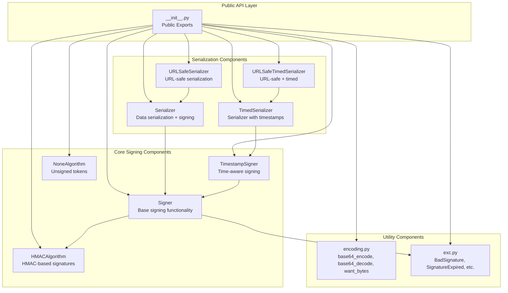

**Sources**: [src/itsdangerous/__init__.py:1-18]()

## Component Responsibilities

The following diagram illustrates the specific responsibilities and relationships between the main code entities:

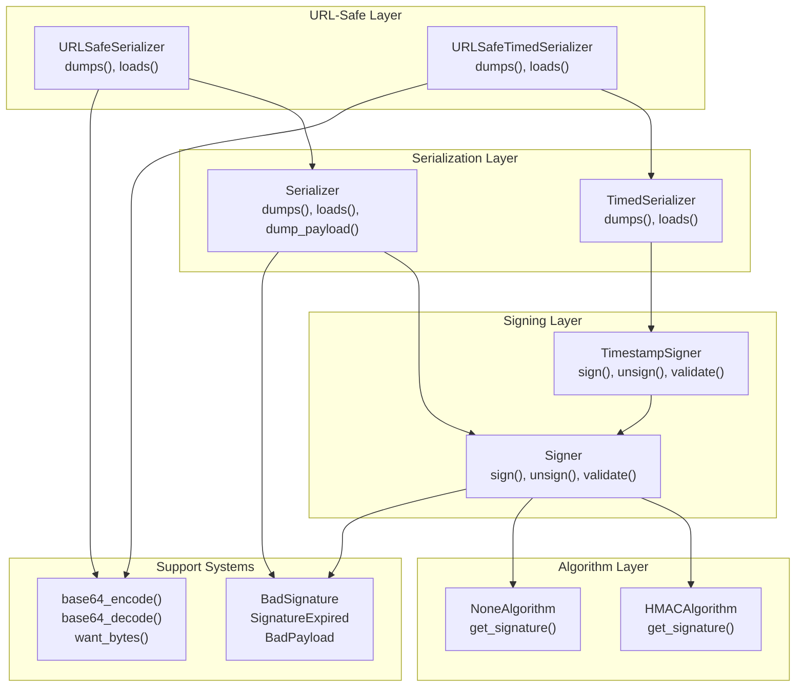

**Sources**: [src/itsdangerous/__init__.py:1-18]()

## Common Use Cases

The library addresses several practical security scenarios commonly encountered in web applications:

### Authentication Tokens
Sign user identifiers for URL-based operations without database storage:
- Unsubscribe links in newsletters
- Account activation links  
- Password reset tokens

### Stateless Sessions
Store session data in client-side cookies without server-side storage:
- User authentication state
- Shopping cart contents
- Form data persistence

### Secure Data Round-trips
Pass server-side state to clients and verify integrity on return:
- Multi-step form wizards
- API request signing
- Client-side caching with verification

**Sources**: [docs/index.rst:36-48](), [README.md:16-32]()

## Key Features

| Feature | Implementation | Benefit |
|---------|----------------|---------|
| **Multiple Algorithms** | `HMACAlgorithm`, `NoneAlgorithm` | Flexible security levels |
| **Key Rotation** | List of keys in `secret_key` parameter | Zero-downtime key updates |
| **Timestamp Validation** | `TimestampSigner`, `TimedSerializer` | Automatic expiration handling |
| **URL-safe Encoding** | `URLSafeSerializer` classes | Web-compatible tokens |
| **Type Safety** | Generic type annotations | Static analysis support |
| **Exception Hierarchy** | Specific exception classes | Precise error handling |

**Sources**: [CHANGES.rst:92-94](), [CHANGES.rst:21-24](), [CHANGES.rst:96-97]()

## Version Evolution

The library has evolved significantly from its initial release, with major architectural changes:

- **Version 2.x**: Modern Python packaging, type safety, key rotation support
- **Version 1.x**: Modular architecture, fallback algorithm support  
- **Version 0.x**: Initial implementation, basic signing and serialization

Current development focuses on maintaining backward compatibility while modernizing the codebase for contemporary Python versions and security practices.

**Sources**: [CHANGES.rst:1-98]()

---

# Page: Getting Started

# Getting Started

<details>
<summary>Relevant source files</summary>

The following files were used as context for generating this wiki page:

- [README.md](README.md)
- [docs/index.rst](docs/index.rst)

</details>


This document provides a practical introduction to using the itsdangerous library for cryptographically signing data. It covers installation, basic concepts, and essential usage patterns to get you up and running quickly.

For detailed information about specific components, see [Core Library](#2). For development environment setup, see [Development Environment](#3).

## Purpose and Scope

The itsdangerous library enables secure data transmission to untrusted environments by cryptographically signing data to detect tampering. This guide demonstrates the core classes and common patterns needed for basic usage.

## Installation

Install itsdangerous using pip:

```bash
pip install -U itsdangerous
```

Sources: [docs/index.rst:23-32]()

## Core Concepts

The library provides several key classes that work together to sign and verify data:

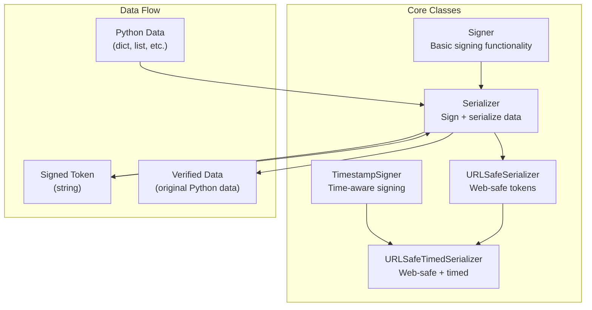

Sources: [README.md:16-32](), [docs/index.rst:10-21]()

## Basic Usage Examples

### Simple Data Signing

The most common pattern uses `URLSafeSerializer` to create web-safe signed tokens:

```python
from itsdangerous import URLSafeSerializer

# Create serializer with secret key and salt
auth_s = URLSafeSerializer("secret key", "auth")

# Sign data - converts Python objects to signed strings
token = auth_s.dumps({"id": 5, "name": "itsdangerous"})
# Result: eyJpZCI6NSwibmFtZSI6Iml0c2Rhbmdlcm91cyJ9.6YP6T0BaO67XP--9UzTrmurXSmg

# Verify and load data - converts signed strings back to Python objects
data = auth_s.loads(token)
print(data["name"])  # itsdangerous
```

### Class Hierarchy and Usage Patterns

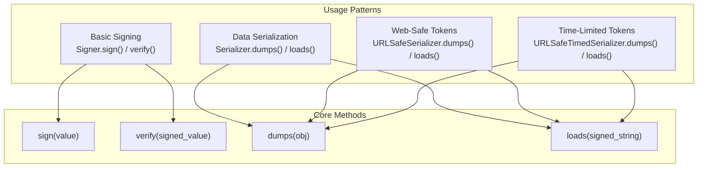

Sources: [README.md:21-32]()

## Common Use Cases

The library addresses several practical scenarios:

| Use Case | Recommended Class | Key Benefit |
|----------|------------------|-------------|
| User ID in unsubscribe links | `URLSafeSerializer` | No database storage needed |
| Session data in cookies | `URLSafeSerializer` | Stateless sessions |
| Account activation tokens | `URLSafeTimedSerializer` | Automatic expiration |
| Server-client state passing | `URLSafeSerializer` | Safe round-trip data |

### Time-Sensitive Tokens

For tokens that should expire, use time-aware components:

```python
from itsdangerous import URLSafeTimedSerializer

# Create timed serializer
timed_s = URLSafeTimedSerializer("secret key", "activation")

# Generate token (includes timestamp)
token = timed_s.dumps({"user_id": 123})

# Load with expiration check (expires after 3600 seconds)
try:
    data = timed_s.loads(token, max_age=3600)
except SignatureExpired:
    # Token has expired
    pass
```

Sources: [docs/index.rst:35-48]()

## Error Handling

The library provides specific exceptions for different failure modes:

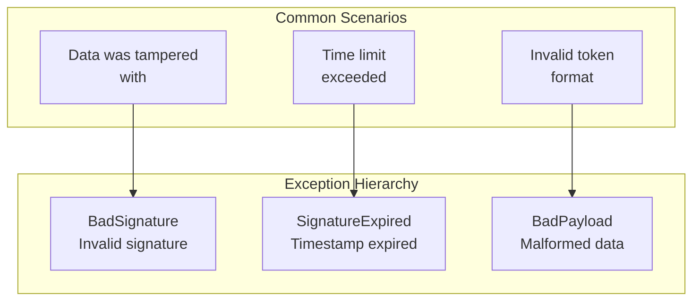

Sources: [README.md:1-14](), [docs/index.rst:53-63]()

## Key Components Reference

The following table maps common tasks to the appropriate classes:

| Task | Class | Module Location |
|------|-------|----------------|
| Basic signing only | `Signer` | `itsdangerous.Signer` |
| Sign Python objects | `Serializer` | `itsdangerous.Serializer` |
| Web-safe tokens | `URLSafeSerializer` | `itsdangerous.URLSafeSerializer` |
| Time-limited signing | `TimestampSigner` | `itsdangerous.TimestampSigner` |
| Web-safe + timed | `URLSafeTimedSerializer` | `itsdangerous.URLSafeTimedSerializer` |

## Next Steps

After mastering these basic patterns:

- For detailed component documentation, see [Core Library](#2)
- For signing-only functionality, see [Signing System](#2.1)  
- For advanced serialization, see [Serialization System](#2.2)
- For time-aware features, see [Time-Aware Components](#2.3)
- For web-safe tokens, see [URL-Safe Components](#2.4)
- For error handling patterns, see [Exception Handling](#2.6)

Sources: [docs/index.rst:53-63](), [README.md:16-32]()

---

# Page: Core Library

# Core Library

<details>
<summary>Relevant source files</summary>

The following files were used as context for generating this wiki page:

- [CHANGES.rst](CHANGES.rst)
- [src/itsdangerous/__init__.py](src/itsdangerous/__init__.py)
- [src/itsdangerous/serializer.py](src/itsdangerous/serializer.py)
- [src/itsdangerous/signer.py](src/itsdangerous/signer.py)
- [tests/test_itsdangerous/test_serializer.py](tests/test_itsdangerous/test_serializer.py)

</details>


This document covers the main `itsdangerous` library components and their architecture. It provides an overview of how the signing, serialization, encoding, and exception handling systems work together to provide secure data signing functionality.

For detailed information about specific subsystems, see: [Signing System](#2.1), [Serialization System](#2.2), [Time-Aware Components](#2.3), [URL-Safe Components](#2.4), [Utilities and Encoding](#2.5), and [Exception Handling](#2.6).

## Public API Overview

The core library exposes its main functionality through a clean public API defined in the package's `__init__.py` file. All primary classes and utilities are available for direct import:

| Component Category | Classes/Functions | Purpose |
|-------------------|------------------|---------|
| **Signing** | `Signer`, `HMACAlgorithm`, `NoneAlgorithm` | Core cryptographic signing functionality |
| **Serialization** | `Serializer` | Data serialization with signing |
| **Time-Aware** | `TimestampSigner`, `TimedSerializer` | Time-sensitive signing and serialization |
| **URL-Safe** | `URLSafeSerializer`, `URLSafeTimedSerializer` | Web-safe token generation |
| **Encoding** | `base64_encode`, `base64_decode`, `want_bytes` | Data encoding utilities |
| **Exceptions** | `BadSignature`, `BadPayload`, `BadTimeSignature`, `SignatureExpired`, `BadData`, `BadHeader` | Error handling |

**Sources:** [src/itsdangerous/__init__.py:1-18]()

## Core Library Architecture

The `itsdangerous` library follows a layered architecture where higher-level components build upon lower-level primitives:

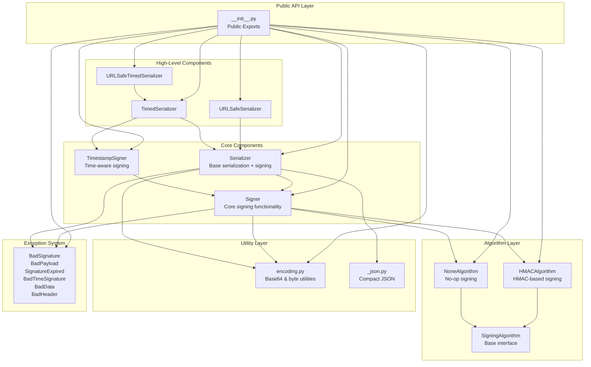

**Sources:** [src/itsdangerous/__init__.py:1-18](), [src/itsdangerous/serializer.py:10-11](), [src/itsdangerous/signer.py:15-29]()

## Component Relationships and Data Flow

The core library implements a clear data flow from raw data to signed tokens and back:

```mermaid
graph LR
    subgraph "Data Input"
        RAW_DATA["Raw Python Object<br/>(dict, list, str, etc.)"]
    end
    
    subgraph "Serialization Layer"
        JSON_DUMPS["serializer.dumps()<br/>(JSON by default)"]
        PAYLOAD["Serialized Payload<br/>(bytes)"]
    end
    
    subgraph "Signing Layer"
        KEY_DERIVATION["derive_key()<br/>salt + secret_key"]
        SIGNATURE_GEN["algorithm.get_signature()<br/>HMAC-SHA1 by default"]
        BASE64_ENCODE["base64_encode(signature)"]
    end
    
    subgraph "Output"
        SIGNED_VALUE["Signed Value<br/>payload.signature"]
    end
    
    subgraph "Verification Flow"
        SPLIT_VALUE["Split on separator"]
        VERIFY_SIG["verify_signature()"]
        JSON_LOADS["serializer.loads()"]
        VERIFIED_DATA["Verified Python Object"]
    end
    
    %% Forward flow
    RAW_DATA --> JSON_DUMPS
    JSON_DUMPS --> PAYLOAD
    PAYLOAD --> KEY_DERIVATION
    KEY_DERIVATION --> SIGNATURE_GEN
    SIGNATURE_GEN --> BASE64_ENCODE
    BASE64_ENCODE --> SIGNED_VALUE
    
    %% Reverse flow
    SIGNED_VALUE --> SPLIT_VALUE
    SPLIT_VALUE --> VERIFY_SIG
    VERIFY_SIG --> JSON_LOADS
    JSON_LOADS --> VERIFIED_DATA
```

**Sources:** [src/itsdangerous/serializer.py:271-276](), [src/itsdangerous/serializer.py:309-320](), [src/itsdangerous/signer.py:215-225](), [src/itsdangerous/signer.py:244-256]()

## Key Classes and Their Responsibilities

### Core Signing Classes

The signing system is built around the `Signer` class and its algorithm interface:

- **`Signer`**: Main signing class that securely signs bytes and verifies signatures
  - Supports multiple secret keys for key rotation
  - Configurable key derivation methods: `concat`, `django-concat`, `hmac`, `none`
  - Default separator: `.` between payload and signature
  - Base64-encodes signatures for safe transmission

- **`SigningAlgorithm`**: Abstract base for signature algorithms
- **`HMACAlgorithm`**: HMAC-based signing (default uses SHA1)
- **`NoneAlgorithm`**: No-op algorithm for testing/debugging

**Sources:** [src/itsdangerous/signer.py:76-174](), [src/itsdangerous/signer.py:15-29](), [src/itsdangerous/signer.py:31-38](), [src/itsdangerous/signer.py:48-65]()

### Serialization Classes

The serialization system combines data serialization with signing:

- **`Serializer`**: Generic serializer that wraps a `Signer` to enable serializing and signing arbitrary data
  - Default serializer: `json` module
  - Supports custom serializers via `serializer` parameter
  - Provides `dumps`/`loads` interface similar to `json`
  - Handles both text and binary serializers
  - Supports fallback signers for algorithm migration

**Sources:** [src/itsdangerous/serializer.py:40-90](), [src/itsdangerous/serializer.py:190-235]()

## Generic Type Support

The library provides comprehensive type safety through generic types:

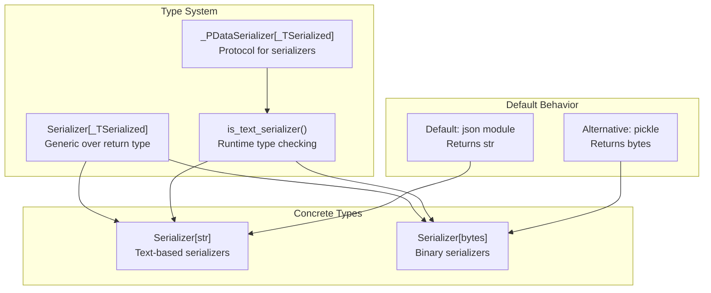

**Sources:** [src/itsdangerous/serializer.py:13-38](), [src/itsdangerous/serializer.py:107-188]()

## Key Rotation and Security Features

The library supports several advanced security features:

- **Key Rotation**: Accept a list of secret keys, using the newest for signing and all for verification
- **Fallback Signers**: Support algorithm migration by trying multiple signature verification methods
- **Salt Support**: Distinguish signatures in different contexts
- **Configurable Algorithms**: Support different digest methods (SHA1, SHA256, SHA512, etc.)

**Sources:** [src/itsdangerous/signer.py:67-74](), [src/itsdangerous/serializer.py:287-308](), [src/itsdangerous/signer.py:182-213]()

---

# Page: Signing System

# Signing System

<details>
<summary>Relevant source files</summary>

The following files were used as context for generating this wiki page:

- [CHANGES.rst](CHANGES.rst)
- [src/itsdangerous/__init__.py](src/itsdangerous/__init__.py)
- [src/itsdangerous/signer.py](src/itsdangerous/signer.py)
- [tests/test_itsdangerous/test_serializer.py](tests/test_itsdangerous/test_serializer.py)

</details>


## Purpose and Scope

The Signing System provides the core cryptographic functionality for securely signing and verifying data integrity in the itsdangerous library. It implements HMAC-based digital signatures with support for key rotation, multiple digest algorithms, and configurable key derivation methods.

This document covers the signing and verification mechanisms, key management, and cryptographic algorithms. For data serialization combined with signing, see [Serialization System](#2.2). For time-aware signing functionality, see [Time-Aware Components](#2.3).

## Core Architecture

The signing system is built around a modular architecture with pluggable algorithms and configurable key derivation:

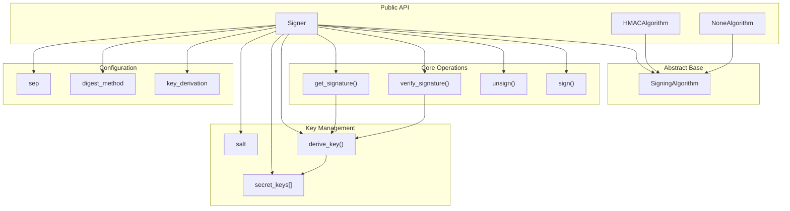

Sources: [src/itsdangerous/signer.py:1-267](), [src/itsdangerous/__init__.py:11-13]()

## Signing Process Flow

The signing and verification process follows a structured workflow with key derivation and base64 encoding:

```mermaid
graph TD
    subgraph "Signing Process"
        INPUT_SIGN["Input Value"]
        WANT_BYTES_SIGN["want_bytes()"]
        DERIVE_KEY_SIGN["derive_key()"]
        ALG_SIGN["algorithm.get_signature()"]
        B64_ENCODE["base64_encode()"]
        CONCAT_SIGN["value + sep + signature"]
        OUTPUT_SIGN["Signed Value"]
    end
    
    subgraph "Verification Process"
        INPUT_VERIFY["Signed Value"]
        SPLIT_VALUE["rsplit(sep, 1)"]
        B64_DECODE["base64_decode()"]
        VERIFY_LOOP["For each secret_key"]
        DERIVE_KEY_VERIFY["derive_key(secret_key)"]
        ALG_VERIFY["algorithm.verify_signature()"]
        COMPARE["hmac.compare_digest()"]
        OUTPUT_VERIFY["Original Value"]
    end
    
    INPUT_SIGN --> WANT_BYTES_SIGN
    WANT_BYTES_SIGN --> DERIVE_KEY_SIGN
    DERIVE_KEY_SIGN --> ALG_SIGN
    ALG_SIGN --> B64_ENCODE
    B64_ENCODE --> CONCAT_SIGN
    CONCAT_SIGN --> OUTPUT_SIGN
    
    INPUT_VERIFY --> SPLIT_VALUE
    SPLIT_VALUE --> B64_DECODE
    B64_DECODE --> VERIFY_LOOP
    VERIFY_LOOP --> DERIVE_KEY_VERIFY
    DERIVE_KEY_VERIFY --> ALG_VERIFY
    ALG_VERIFY --> COMPARE
    COMPARE --> OUTPUT_VERIFY
```

Sources: [src/itsdangerous/signer.py:215-226](), [src/itsdangerous/signer.py:227-242](), [src/itsdangerous/signer.py:244-256]()

## Key Components

### Signer Class

The `Signer` class is the primary interface for signing operations, handling key management, configuration, and orchestrating the signing process.

| Attribute | Type | Purpose |
|-----------|------|---------|
| `secret_keys` | `list[bytes]` | List of secret keys for key rotation support |
| `salt` | `bytes` | Additional entropy for key derivation |
| `sep` | `bytes` | Separator between value and signature |
| `key_derivation` | `str` | Key derivation method (`concat`, `django-concat`, `hmac`) |
| `digest_method` | `t.Any` | Hash function for HMAC operations |
| `algorithm` | `SigningAlgorithm` | Pluggable signing algorithm implementation |

Sources: [src/itsdangerous/signer.py:76-174]()

### SigningAlgorithm Hierarchy

The signing algorithms follow an abstract base class pattern with concrete implementations:

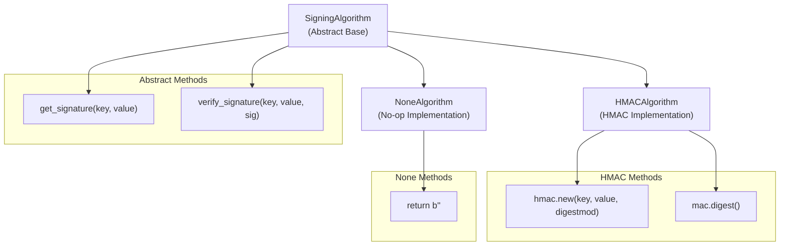

Sources: [src/itsdangerous/signer.py:15-29](), [src/itsdangerous/signer.py:31-38](), [src/itsdangerous/signer.py:48-65]()

## Key Derivation Methods

The `derive_key()` method supports multiple key derivation schemes to accommodate different security requirements:

| Method | Implementation | Use Case |
|--------|---------------|----------|
| `concat` | `digest_method(salt + secret_key).digest()` | Simple concatenation |
| `django-concat` | `digest_method(salt + b"signer" + secret_key).digest()` | Django compatibility (default) |
| `hmac` | `hmac.new(secret_key, salt, digestmod).digest()` | HMAC-based derivation |
| `none` | `secret_key` | No derivation (direct key usage) |

Sources: [src/itsdangerous/signer.py:182-213](), [src/itsdangerous/signer.py:127]()

## Signing Algorithms

### HMACAlgorithm

The default signing implementation uses HMAC with configurable digest methods:

- **Default digest**: SHA-1 via `_lazy_sha1()` function
- **FIPS compatibility**: Lazy loading prevents import-time failures
- **Digest methods**: Any `hashlib` compatible function

```python
# Example digest method configuration
digest_method = hashlib.sha256  # Override default SHA-1
algorithm = HMACAlgorithm(digest_method)
```

Sources: [src/itsdangerous/signer.py:48-65](), [src/itsdangerous/signer.py:40-46](), [src/itsdangerous/signer.py:54]()

### NoneAlgorithm

Provides a no-op signing algorithm for testing or scenarios where signing is disabled:

- Returns empty signature (`b""`)
- Always validates as correct
- Used for debugging or development environments

Sources: [src/itsdangerous/signer.py:31-38]()

## Key Rotation Support

The signing system supports key rotation through multiple secret keys, enabling secure key transitions:

### Key Management

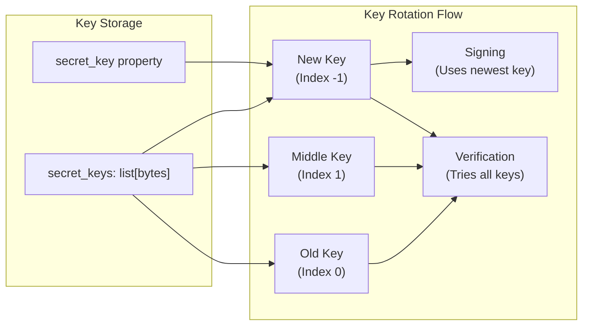

Sources: [src/itsdangerous/signer.py:67-74](), [src/itsdangerous/signer.py:139-143](), [src/itsdangerous/signer.py:175-180](), [src/itsdangerous/signer.py:236-241]()

### Key Rotation Workflow

1. **Signing**: Always uses the newest (last) key in `secret_keys`
2. **Verification**: Tries keys in reverse order (newest to oldest)
3. **Key Addition**: Append new keys to the list
4. **Key Removal**: Remove expired keys from the beginning of the list

Sources: [src/itsdangerous/signer.py:175-180](), [src/itsdangerous/signer.py:236-241]()

## Configuration Options

### Constructor Parameters

| Parameter | Type | Default | Purpose |
|-----------|------|---------|---------|
| `secret_key` | `str \| bytes \| Iterable` | Required | Secret key(s) for signing |
| `salt` | `str \| bytes \| None` | `b"itsdangerous.Signer"` | Key derivation salt |
| `sep` | `str \| bytes` | `b"."` | Value/signature separator |
| `key_derivation` | `str \| None` | `"django-concat"` | Key derivation method |
| `digest_method` | `t.Any \| None` | `_lazy_sha1` | Hash function |
| `algorithm` | `SigningAlgorithm \| None` | `HMACAlgorithm` | Signing algorithm |

### Validation Rules

- **Separator validation**: Cannot be part of base64 alphabet (`A-Za-z0-9-_=`)
- **Key format**: Converted to bytes via `want_bytes()`
- **Salt handling**: Defaults to class-specific salt if `None`

Sources: [src/itsdangerous/signer.py:129-174](), [src/itsdangerous/signer.py:146-151]()

## Error Handling

The signing system raises specific exceptions for different failure scenarios:

| Exception | Trigger | Payload Available |
|-----------|---------|-------------------|
| `BadSignature` | Invalid signature, missing separator | Yes |
| `ValueError` | Invalid separator character | No |
| `TypeError` | Unknown key derivation method | No |

Sources: [src/itsdangerous/signer.py:248-256](), [src/itsdangerous/signer.py:146-151](), [src/itsdangerous/signer.py:213]()

---

# Page: Serialization System

# Serialization System

<details>
<summary>Relevant source files</summary>

The following files were used as context for generating this wiki page:

- [src/itsdangerous/serializer.py](src/itsdangerous/serializer.py)
- [src/itsdangerous/signer.py](src/itsdangerous/signer.py)
- [tests/test_itsdangerous/test_serializer.py](tests/test_itsdangerous/test_serializer.py)

</details>


The Serialization System provides secure data serialization with cryptographic signing capabilities by combining data serialization (JSON, pickle, etc.) with the underlying signing infrastructure. This system enables applications to serialize complex data structures into signed strings that can be safely transmitted and verified.

For information about the core signing functionality without serialization, see [Signing System](#2.1). For time-aware serialization with expiration, see [Time-Aware Components](#2.3).

## System Architecture

The serialization system builds upon the signing system to provide a complete data serialization and verification pipeline:

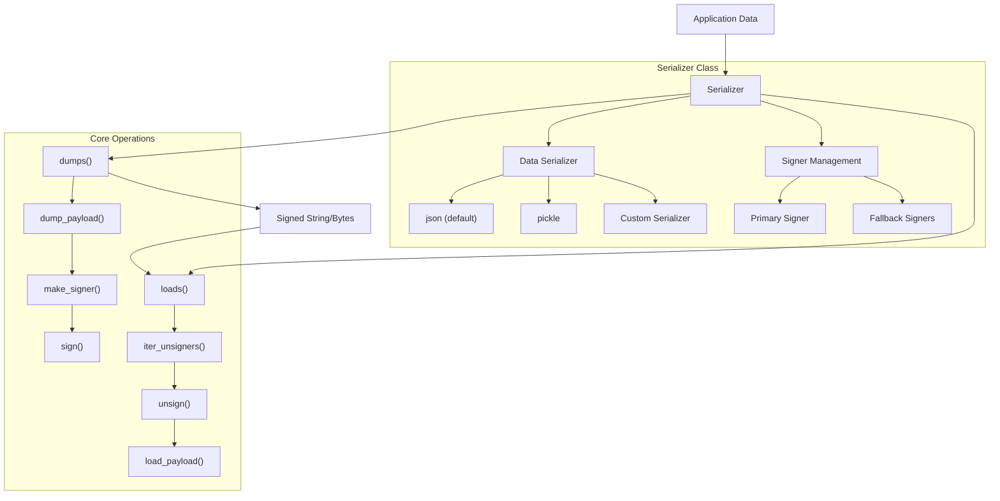

Sources: [src/itsdangerous/serializer.py:40-405]()

## Core Components

### Serializer Class

The `Serializer` class is the primary interface for the serialization system, wrapping a `Signer` to provide data serialization capabilities:

| Component | Purpose | Default Value |
|-----------|---------|---------------|
| `default_serializer` | Data serialization backend | `json` module |
| `default_signer` | Signing class | `Signer` |
| `default_fallback_signers` | Backward compatibility signers | `[]` (empty list) |

The class supports generic typing to indicate whether it produces text or binary output based on the underlying serializer.

Sources: [src/itsdangerous/serializer.py:92-104]()

### Data Serializer Protocol

The `_PDataSerializer` protocol defines the interface for pluggable serialization backends:

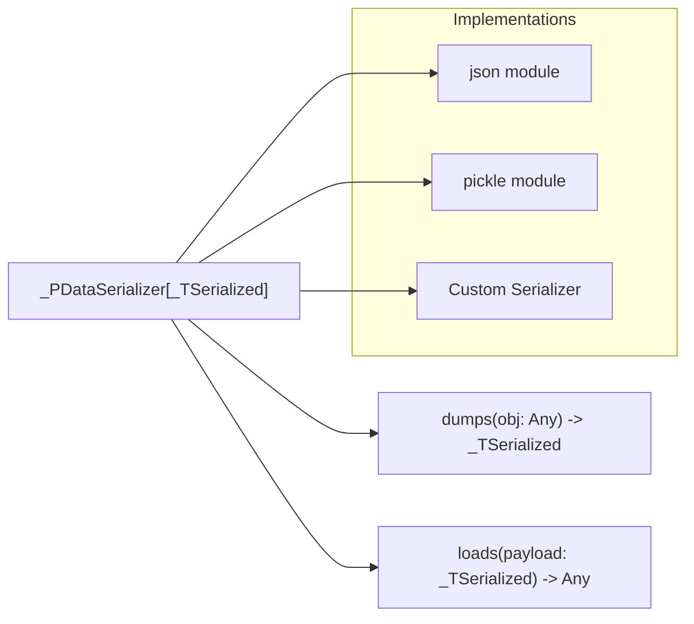

The `is_text_serializer()` function determines whether a serializer produces text (`str`) or binary (`bytes`) output, which affects encoding handling.

Sources: [src/itsdangerous/serializer.py:24-37]()

## Serialization Workflow

The serialization process involves multiple stages for both encoding and decoding:

```mermaid
graph TD
    subgraph "Serialization (dumps)"
        INPUT_DATA["Input Data"] --> DUMP_PAYLOAD["dump_payload()"]
        DUMP_PAYLOAD --> SERIALIZER_DUMPS["serializer.dumps()"]
        SERIALIZER_DUMPS --> WANT_BYTES["want_bytes()"]
        WANT_BYTES --> MAKE_SIGNER["make_signer()"]
        MAKE_SIGNER --> SIGNER_SIGN["signer.sign()"]
        SIGNER_SIGN --> TEXT_CHECK{"is_text_serializer?"}
        TEXT_CHECK -->|Yes| DECODE_UTF8["decode('utf-8')"]
        TEXT_CHECK -->|No| RETURN_BYTES["Return bytes"]
        DECODE_UTF8 --> SIGNED_STRING["Signed String"]
        RETURN_BYTES --> SIGNED_BYTES["Signed Bytes"]
    end
    
    subgraph "Deserialization (loads)"
        SIGNED_INPUT["Signed Input"] --> WANT_BYTES2["want_bytes()"]
        WANT_BYTES2 --> ITER_UNSIGNERS["iter_unsigners()"]
        ITER_UNSIGNERS --> SIGNER_UNSIGN["signer.unsign()"]
        SIGNER_UNSIGN --> LOAD_PAYLOAD["load_payload()"]
        LOAD_PAYLOAD --> TEXT_CHECK2{"is_text_serializer?"}
        TEXT_CHECK2 -->|Yes| DECODE_UTF8_2["decode('utf-8')"]
        TEXT_CHECK2 -->|No| DIRECT_LOADS["serializer.loads()"]
        DECODE_UTF8_2 --> SERIALIZER_LOADS["serializer.loads()"]
        DIRECT_LOADS --> OUTPUT_DATA["Output Data"]
        SERIALIZER_LOADS --> OUTPUT_DATA
    end
```

Sources: [src/itsdangerous/serializer.py:271-276](), [src/itsdangerous/serializer.py:309-320](), [src/itsdangerous/serializer.py:328-343]()

## Configuration and Customization

### Constructor Parameters

The `Serializer` constructor accepts multiple configuration options:

| Parameter | Type | Purpose |
|-----------|------|---------|
| `secret_key` | `str \| bytes \| Iterable` | Secret key(s) for signing |
| `salt` | `str \| bytes \| None` | Additional salt for key derivation |
| `serializer` | `_PDataSerializer \| None` | Data serialization backend |
| `serializer_kwargs` | `dict[str, Any] \| None` | Arguments for serializer methods |
| `signer` | `type[Signer] \| None` | Signer class to use |
| `signer_kwargs` | `dict[str, Any] \| None` | Arguments for signer constructor |
| `fallback_signers` | `list \| None` | Legacy signer configurations |

Sources: [src/itsdangerous/serializer.py:190-234]()

### Key Rotation Support

The serialization system supports key rotation through the `secret_keys` list property:

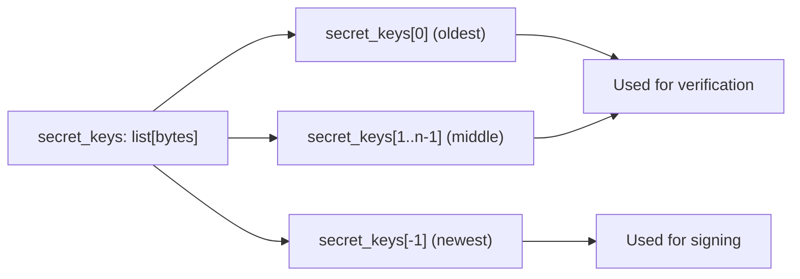

The newest key is used for signing operations, while all keys are tried during verification for backward compatibility.

Sources: [src/itsdangerous/serializer.py:203-208](), [src/itsdangerous/serializer.py:236-241]()

## Signer Management

### Primary and Fallback Signers

The serialization system manages multiple signers for compatibility and security:

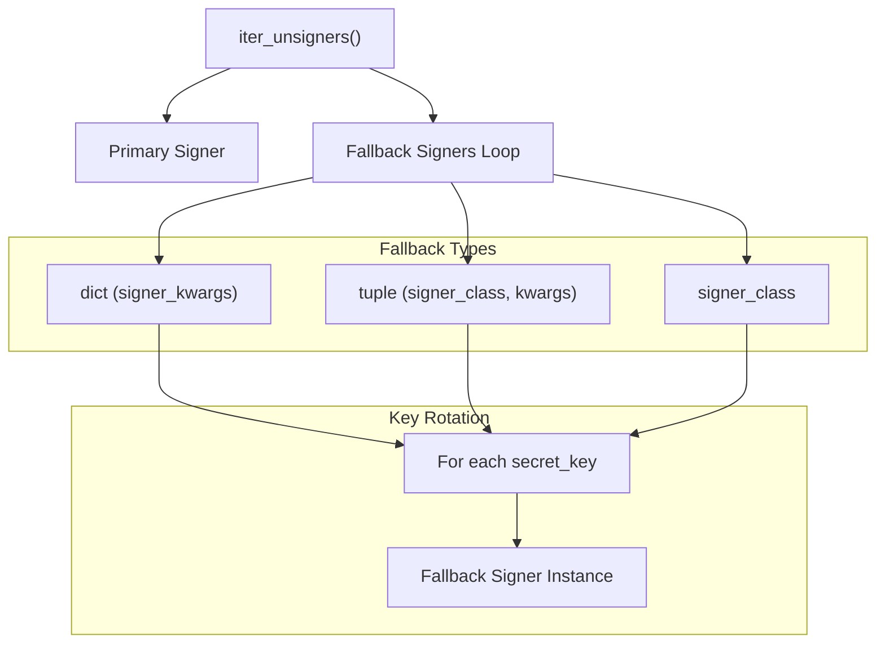

Sources: [src/itsdangerous/serializer.py:287-307]()

## Error Handling

The serialization system defines specific exception handling for different failure scenarios:

| Exception | Trigger | Payload Available |
|-----------|---------|------------------|
| `BadSignature` | Signature verification fails | Yes (unsigned data) |
| `BadPayload` | Deserialization fails | No |

### Unsafe Loading

The `loads_unsafe()` method provides debugging capabilities by returning both signature validity and payload:

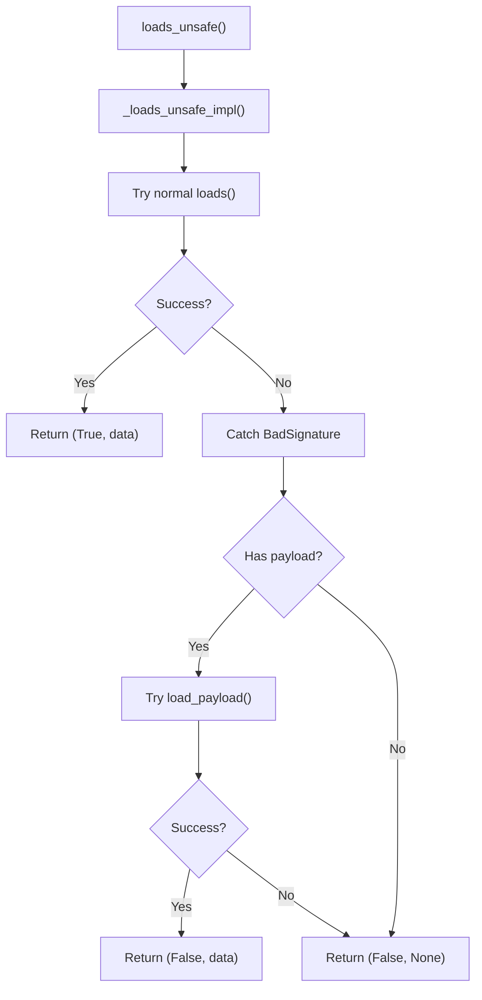

Sources: [src/itsdangerous/serializer.py:349-404]()

## File I/O Operations

The serialization system provides file-based operations that delegate to the string-based methods:

| Method | Purpose | Delegates To |
|--------|---------|--------------|
| `dump()` | Write signed data to file | `dumps()` |
| `load()` | Read signed data from file | `loads()` |
| `load_unsafe()` | Read with signature bypass | `loads_unsafe()` |

Sources: [src/itsdangerous/serializer.py:322-326](), [src/itsdangerous/serializer.py:345-347](), [src/itsdangerous/serializer.py:397-404]()

---

# Page: Time-Aware Components

# Time-Aware Components

<details>
<summary>Relevant source files</summary>

The following files were used as context for generating this wiki page:

- [src/itsdangerous/timed.py](src/itsdangerous/timed.py)
- [tests/test_itsdangerous/test_encoding.py](tests/test_itsdangerous/test_encoding.py)
- [tests/test_itsdangerous/test_signer.py](tests/test_itsdangerous/test_signer.py)
- [tests/test_itsdangerous/test_timed.py](tests/test_itsdangerous/test_timed.py)

</details>


This document covers the time-aware signing and serialization components of the itsdangerous library. These components extend the basic signing functionality to include timestamp information, enabling signature expiration and age validation. For general signing functionality without time constraints, see [Signing System](#2.1). For URL-safe variants of time-aware components, see [URL-Safe Components](#2.4).

## Architecture Overview

The time-aware components consist of two primary classes that extend their base counterparts with timestamp functionality:

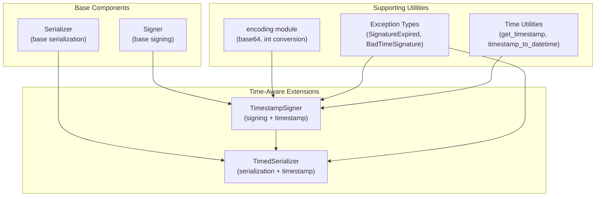

Sources: [src/itsdangerous/timed.py:22-27](), [src/itsdangerous/timed.py:170-175]()

## TimestampSigner Class

The `TimestampSigner` class extends the base `Signer` with timestamp embedding and validation capabilities:

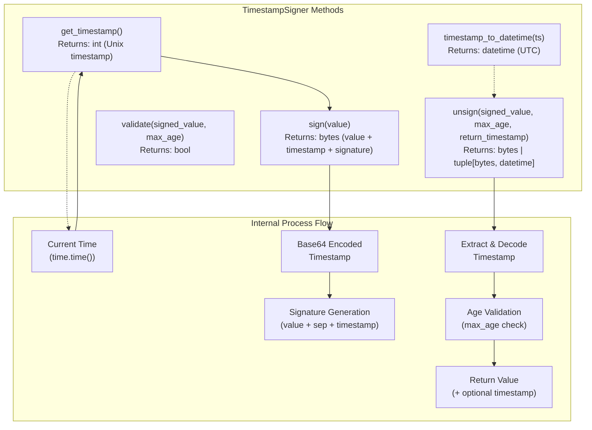

Sources: [src/itsdangerous/timed.py:29-33](), [src/itsdangerous/timed.py:35-43](), [src/itsdangerous/timed.py:45-51](), [src/itsdangerous/timed.py:72-158]()

### Timestamp Encoding Process

The signing process embeds timestamps using a specific format:

| Component | Description | Encoding |
|-----------|-------------|----------|
| Original Value | Input data to sign | Raw bytes |
| Separator | Component delimiter | Configurable (default: `.`) |
| Timestamp | Unix timestamp | Base64 encoded integer |
| Signature | HMAC signature | Covers value + separator + timestamp |

The final signed format: `value.timestamp.signature`

Sources: [src/itsdangerous/timed.py:45-51]()

### Age Validation Logic

The `unsign` method implements comprehensive age validation:

```mermaid
graph TD
    signed_input["Signed Value Input"] --> base_unsign["Base Signer Validation"]
    base_unsign --> sig_valid{Valid Signature?}
    
    sig_valid -->|No| sig_error["BadSignature Error<br/>(store for later)"]
    sig_valid -->|Yes| extract_timestamp["Extract Timestamp"]
    
    sig_error --> extract_timestamp
    extract_timestamp --> has_timestamp{Timestamp Present?}
    
    has_timestamp -->|No| missing_error["BadTimeSignature<br/>'timestamp missing'"]
    has_timestamp -->|Yes| decode_timestamp["Decode Base64<br/>Timestamp"]
    
    decode_timestamp --> valid_timestamp{Valid Timestamp?}
    valid_timestamp -->|No| malformed_error["BadTimeSignature<br/>'Malformed timestamp'"]
    valid_timestamp -->|Yes| check_sig_error{Original Sig Error?}
    
    check_sig_error -->|Yes| bad_time_sig["BadTimeSignature<br/>(with date_signed)"]
    check_sig_error -->|No| age_check["Age Validation"]
    
    age_check --> max_age_check{max_age specified?}
    max_age_check -->|No| return_value["Return Value"]
    max_age_check -->|Yes| calculate_age["age = current_time - timestamp"]
    
    calculate_age --> too_old{age > max_age?}
    too_old -->|Yes| expired_error["SignatureExpired"]
    too_old -->|No| future_check{age < 0?}
    
    future_check -->|Yes| future_error["SignatureExpired<br/>(future signature)"]
    future_check -->|No| return_value
```

Sources: [src/itsdangerous/timed.py:88-158]()

## TimedSerializer Class

The `TimedSerializer` extends the base `Serializer` to use `TimestampSigner` and provides time-aware deserialization:

```mermaid
graph TB
    subgraph "TimedSerializer Configuration"
        default_signer["default_signer = TimestampSigner"]
        iter_unsigners["iter_unsigners()<br/>Returns: Iterator[TimestampSigner]"]
    end
    
    subgraph "Deserialization Methods"
        loads["loads(s, max_age, return_timestamp, salt)<br/>Returns: Any | tuple[Any, datetime]"]
        loads_unsafe["loads_unsafe(s, max_age, salt)<br/>Returns: tuple[bool, Any]"]
    end
    
    subgraph "Multiple Signer Support"
        signer_iteration["Iterate Through<br/>Available Signers"]
        signature_attempt["Attempt Unsign<br/>with TimestampSigner"]
        payload_loading["Load Payload<br/>(deserialize data)"]
    end
    
    default_signer --> iter_unsigners
    iter_unsigners --> loads
    loads --> signer_iteration
    signer_iteration --> signature_attempt
    signature_attempt --> payload_loading
    
    loads_unsafe --> signer_iteration
```

Sources: [src/itsdangerous/timed.py:175](), [src/itsdangerous/timed.py:177-180](), [src/itsdangerous/timed.py:185-220]()

### Multiple Signer Handling

The `loads` method implements fallback logic for multiple signers:

| Step | Action | Exception Handling |
|------|--------|-------------------|
| 1 | Try each signer from `iter_unsigners()` | Continue to next signer |
| 2 | Call `signer.unsign()` with parameters | Handle `BadSignature` |
| 3 | Load payload if signature valid | Stop on `SignatureExpired` |
| 4 | Return result or continue iteration | Raise last exception if all fail |

Sources: [src/itsdangerous/timed.py:202-220]()

## Exception Handling

Time-aware components introduce specific exception types for temporal validation failures:

```mermaid
graph TD
    subgraph "Exception Hierarchy"
        BadSignature["BadSignature<br/>(base exception)"]
        BadTimeSignature["BadTimeSignature<br/>(timestamp issues)"]
        SignatureExpired["SignatureExpired<br/>(age validation)"]
    end
    
    subgraph "Exception Scenarios"
        missing_ts["Missing Timestamp<br/>→ BadTimeSignature"]
        malformed_ts["Malformed Timestamp<br/>→ BadTimeSignature"]  
        invalid_sig_with_ts["Invalid Signature + Timestamp<br/>→ BadTimeSignature"]
        too_old["Signature Too Old<br/>→ SignatureExpired"]
        future_sig["Future Signature<br/>→ SignatureExpired"]
    end
    
    BadSignature --> BadTimeSignature
    BadSignature --> SignatureExpired
    
    missing_ts -.-> BadTimeSignature
    malformed_ts -.-> BadTimeSignature
    invalid_sig_with_ts -.-> BadTimeSignature
    too_old -.-> SignatureExpired
    future_sig -.-> SignatureExpired
```

Sources: [src/itsdangerous/timed.py:14-16](), [src/itsdangerous/timed.py:106](), [src/itsdangerous/timed.py:126-128](), [src/itsdangerous/timed.py:142-153]()

### Exception Attributes

Each time-aware exception provides additional context:

| Exception | Attributes | Purpose |
|-----------|------------|---------|
| `BadTimeSignature` | `payload`, `date_signed` | Contains original data and timestamp when available |
| `SignatureExpired` | `payload`, `date_signed` | Contains original data and signing timestamp |

Sources: [src/itsdangerous/timed.py:130](), [src/itsdangerous/timed.py:142-153]()

## Timezone Handling

The library enforces UTC timezone awareness for all datetime operations:

```mermaid
graph LR
    unix_timestamp["Unix Timestamp<br/>(int)"] --> timestamp_to_datetime["timestamp_to_datetime()"]
    timestamp_to_datetime --> utc_datetime["UTC Datetime<br/>(timezone-aware)"]
    
    utc_datetime --> exception_handling["Exception Context<br/>(date_signed attribute)"]
    utc_datetime --> return_timestamp["Return Value<br/>(when requested)"]
```

The `timestamp_to_datetime` method ensures all returned datetime objects are timezone-aware in UTC, addressing historical issues with naive datetime objects.

Sources: [src/itsdangerous/timed.py:35-43]()

## Integration with Encoding Utilities

Time-aware components rely heavily on encoding utilities for timestamp handling:

| Function | Source Module | Purpose |
|----------|---------------|---------|
| `want_bytes()` | `encoding` | Normalize input to bytes |
| `int_to_bytes()` | `encoding` | Convert timestamp to bytes |
| `bytes_to_int()` | `encoding` | Convert bytes back to timestamp |
| `base64_encode()` | `encoding` | Encode timestamp for embedding |
| `base64_decode()` | `encoding` | Decode embedded timestamp |

Sources: [src/itsdangerous/timed.py:9-13](), [src/itsdangerous/timed.py:48](), [src/itsdangerous/timed.py:113]()

---

# Page: URL-Safe Components

# URL-Safe Components

<details>
<summary>Relevant source files</summary>

The following files were used as context for generating this wiki page:

- [README.md](README.md)
- [src/itsdangerous/encoding.py](src/itsdangerous/encoding.py)
- [src/itsdangerous/url_safe.py](src/itsdangerous/url_safe.py)

</details>


This document covers the URL-safe serialization components in itsdangerous, which enable the creation of cryptographically signed tokens that can be safely transmitted through URLs and web applications. These components combine data serialization, compression, and base64 encoding to produce compact, URL-safe tokens.

For information about basic serialization without URL safety considerations, see [Serialization System](#2.2). For time-aware URL-safe components, this page covers both standard and timed variants.

## Architecture Overview

The URL-safe components are built on a mixin pattern that extends the base serialization functionality with URL-safe encoding and optional compression capabilities.

```mermaid
graph TD
    subgraph "URL-Safe Component Architecture"
        URLSafeSerializerMixin["URLSafeSerializerMixin"]
        URLSafeSerializer["URLSafeSerializer"]
        URLSafeTimedSerializer["URLSafeTimedSerializer"]
        
        subgraph "Base Components"
            Serializer["Serializer"]
            TimedSerializer["TimedSerializer"]
        end
        
        subgraph "Encoding Layer"
            base64_encode["base64_encode"]
            base64_decode["base64_decode"]
            zlib_compress["zlib.compress"]
            zlib_decompress["zlib.decompress"]
        end
        
        subgraph "JSON Layer"
            CompactJSON["_CompactJSON"]
        end
    end
    
    URLSafeSerializerMixin --> base64_encode
    URLSafeSerializerMixin --> base64_decode
    URLSafeSerializerMixin --> zlib_compress
    URLSafeSerializerMixin --> zlib_decompress
    URLSafeSerializerMixin --> CompactJSON
    
    URLSafeSerializer --> URLSafeSerializerMixin
    URLSafeSerializer --> Serializer
    
    URLSafeTimedSerializer --> URLSafeSerializerMixin
    URLSafeTimedSerializer --> TimedSerializer
```

Sources: [src/itsdangerous/url_safe.py:1-84](), [src/itsdangerous/encoding.py:20-38]()

## Core Components

### URLSafeSerializerMixin

The `URLSafeSerializerMixin` class provides the core URL-safe functionality through two primary methods:

| Method | Purpose | Line Reference |
|--------|---------|----------------|
| `dump_payload` | Serializes, optionally compresses, and base64-encodes data | [src/itsdangerous/url_safe.py:55-69]() |
| `load_payload` | Base64-decodes, optionally decompresses, and deserializes data | [src/itsdangerous/url_safe.py:23-53]() |

The mixin uses `_CompactJSON` as its default serializer to minimize payload size before encoding.

### URLSafeSerializer

The `URLSafeSerializer` combines `URLSafeSerializerMixin` with the base `Serializer` class to provide URL-safe serialization without time-based features.

### URLSafeTimedSerializer  

The `URLSafeTimedSerializer` combines `URLSafeSerializerMixin` with `TimedSerializer` to provide URL-safe serialization with timestamp verification capabilities.

Sources: [src/itsdangerous/url_safe.py:72-83]()

## Data Processing Flow

The URL-safe components implement a multi-stage data transformation process:

```mermaid
flowchart TD
    subgraph "Serialization (dump_payload)"
        Input["Python Object"]
        Serialize["JSON Serialization"]
        Compress["Zlib Compression"]
        CompressCheck{"len(compressed) < len(json) - 1"}
        AddPrefix["Add '.' Prefix"]
        Base64Encode["Base64 URL-Safe Encode"]
        Output["URL-Safe Token"]
        
        Input --> Serialize
        Serialize --> Compress
        Compress --> CompressCheck
        CompressCheck -->|Yes| AddPrefix
        CompressCheck -->|No| Base64Encode
        AddPrefix --> Base64Encode
        Base64Encode --> Output
    end
    
    subgraph "Deserialization (load_payload)"
        TokenInput["URL-Safe Token"]
        CheckPrefix{"Starts with '.'?"}
        RemovePrefix["Remove '.' Prefix"]
        Base64Decode["Base64 Decode"]
        Decompress["Zlib Decompress"]
        Deserialize["JSON Deserialize"]
        ObjectOutput["Python Object"]
        
        TokenInput --> CheckPrefix
        CheckPrefix -->|Yes| RemovePrefix
        CheckPrefix -->|No| Base64Decode
        RemovePrefix --> Base64Decode
        Base64Decode --> Decompress
        Base64Decode --> Deserialize
        Decompress --> Deserialize
        Deserialize --> ObjectOutput
    end
```

Sources: [src/itsdangerous/url_safe.py:55-69](), [src/itsdangerous/url_safe.py:23-53]()

## Compression Strategy

The URL-safe components implement intelligent compression that only applies zlib compression when it reduces the payload size:

| Condition | Action | Marker |
|-----------|--------|---------|
| `len(compressed) < len(json) - 1` | Use compressed data | Prefix with `.` |
| `len(compressed) >= len(json) - 1` | Use original data | No prefix |

This strategy ensures that compression only occurs when beneficial, preventing size increases for small or incompressible data.

Sources: [src/itsdangerous/url_safe.py:57-68]()

## Base64 Encoding Implementation

The URL-safe encoding uses URL-safe base64 encoding with padding removal:

```mermaid
graph LR
    subgraph "Encoding Process"
        Data["Raw Bytes"]
        URLSafeB64["base64.urlsafe_b64encode"]
        StripPadding["Remove '=' padding"]
        SafeToken["URL-Safe Token"]
        
        Data --> URLSafeB64
        URLSafeB64 --> StripPadding
        StripPadding --> SafeToken
    end
    
    subgraph "Decoding Process"
        TokenInput["URL-Safe Token"]
        AddPadding["Add padding as needed"]
        URLSafeB64Decode["base64.urlsafe_b64decode"]
        DecodedData["Raw Bytes"]
        
        TokenInput --> AddPadding
        AddPadding --> URLSafeB64Decode
        URLSafeB64Decode --> DecodedData
    end
```

The encoding produces tokens containing only characters from the URL-safe alphabet: `A-Z`, `a-z`, `0-9`, `-`, `_`, and `.`.

Sources: [src/itsdangerous/encoding.py:20-38]()

## Error Handling

The URL-safe components provide specific error handling for common failure modes:

| Error Condition | Exception | Source |
|----------------|-----------|---------|
| Invalid base64 data | `BadPayload` with base64 decode context | [src/itsdangerous/url_safe.py:39-42]() |
| Zlib decompression failure | `BadPayload` with decompression context | [src/itsdangerous/url_safe.py:47-51]() |
| Invalid base64 encoding | `BadData` from encoding layer | [src/itsdangerous/encoding.py:38]() |

## Usage Patterns

The URL-safe components are commonly used for:

- Web session tokens that need to be passed in URLs
- API authentication tokens
- Temporary access tokens for email verification
- Any signed data that must be URL-safe

Example usage pattern from the project documentation:
```python
auth_s = URLSafeSerializer("secret key", "auth")
token = auth_s.dumps({"id": 5, "name": "itsdangerous"})
data = auth_s.loads(token)
```

Sources: [README.md:22-31](), [src/itsdangerous/url_safe.py:72-83]()

---

# Page: Utilities and Encoding

# Utilities and Encoding

<details>
<summary>Relevant source files</summary>

The following files were used as context for generating this wiki page:

- [src/itsdangerous/_json.py](src/itsdangerous/_json.py)
- [src/itsdangerous/encoding.py](src/itsdangerous/encoding.py)
- [src/itsdangerous/url_safe.py](src/itsdangerous/url_safe.py)

</details>


This page documents the utility functions and encoding mechanisms that support the core itsdangerous library functionality. These utilities provide the foundation for data transformation, byte manipulation, and encoding operations used throughout the signing and serialization systems.

The utilities covered here include base64 encoding/decoding, byte conversion functions, and compact JSON serialization. For information about how these utilities integrate with the serialization system, see [Serialization System](#2.2). For URL-safe serialization components that extensively use these utilities, see [URL-Safe Components](#2.4).

## Encoding Module Overview

The `encoding.py` module provides essential byte manipulation and base64 encoding functions used throughout the library. These functions ensure data can be safely transmitted in URL-safe formats while maintaining proper byte handling across different input types.

```mermaid
graph TD
    INPUT_DATA["Input Data<br/>(str/bytes/int)"]
    
    subgraph "encoding.py Functions"
        WANT_BYTES["want_bytes()<br/>String to Bytes"]
        BASE64_ENCODE["base64_encode()<br/>URL-Safe Base64 Encode"]
        BASE64_DECODE["base64_decode()<br/>URL-Safe Base64 Decode"]
        INT_TO_BYTES["int_to_bytes()<br/>Integer to Bytes"]
        BYTES_TO_INT["bytes_to_int()<br/>Bytes to Integer"]
    end
    
    OUTPUT_DATA["Output Data<br/>(bytes/int)"]
    
    INPUT_DATA --> WANT_BYTES
    INPUT_DATA --> BASE64_ENCODE
    INPUT_DATA --> BASE64_DECODE
    INPUT_DATA --> INT_TO_BYTES
    INPUT_DATA --> BYTES_TO_INT
    
    WANT_BYTES --> OUTPUT_DATA
    BASE64_ENCODE --> OUTPUT_DATA
    BASE64_DECODE --> OUTPUT_DATA
    INT_TO_BYTES --> OUTPUT_DATA
    BYTES_TO_INT --> OUTPUT_DATA
```

**Sources:** [src/itsdangerous/encoding.py:1-55]()

### Byte Conversion Functions

The `want_bytes()` function provides consistent byte conversion handling across the library:

| Function | Input Types | Output | Purpose |
|----------|-------------|---------|---------|
| `want_bytes()` | `str \| bytes` | `bytes` | Converts strings to bytes with specified encoding |

The function accepts encoding and error handling parameters, defaulting to UTF-8 encoding with strict error handling. This ensures consistent byte representation across different input sources.

**Sources:** [src/itsdangerous/encoding.py:11-17]()

### Base64 Encoding Functions

The library provides URL-safe base64 encoding and decoding functions that remove padding and handle error cases:

| Function | Input | Output | Key Features |
|----------|-------|---------|--------------|
| `base64_encode()` | `str \| bytes` | `bytes` | URL-safe, strips padding |
| `base64_decode()` | `str \| bytes` | `bytes` | Adds padding, handles errors |

The `base64_encode()` function uses `base64.urlsafe_b64encode()` and strips trailing padding characters. The `base64_decode()` function automatically adds required padding and raises `BadData` exceptions for invalid input.

**Sources:** [src/itsdangerous/encoding.py:20-38]()

### Integer Conversion Functions

The module provides efficient integer-to-bytes conversion using struct packing:

```mermaid
graph LR
    INT_INPUT["Integer Input"]
    STRUCT_PACK["_int64_struct.pack()<br/>Big-endian Q format"]
    LSTRIP["lstrip(b'\\x00')<br/>Remove leading zeros"]
    BYTES_OUTPUT["Bytes Output"]
    
    INT_INPUT --> STRUCT_PACK
    STRUCT_PACK --> LSTRIP
    LSTRIP --> BYTES_OUTPUT
    
    BYTES_INPUT["Bytes Input"]
    RJUST["rjust(8, b'\\x00')<br/>Pad to 8 bytes"]
    STRUCT_UNPACK["_int64_struct.unpack()<br/>Extract integer"]
    INT_OUTPUT["Integer Output"]
    
    BYTES_INPUT --> RJUST
    RJUST --> STRUCT_UNPACK
    STRUCT_UNPACK --> INT_OUTPUT
```

The conversion uses a pre-compiled `struct.Struct(">Q")` for efficient big-endian unsigned 64-bit integer packing and unpacking.

**Sources:** [src/itsdangerous/encoding.py:44-54]()

## JSON Utilities

The `_json.py` module provides the `_CompactJSON` class, which wraps the standard JSON module to produce compact output suitable for signed data:

```mermaid
graph TD
    PYTHON_OBJ["Python Object"]
    JSON_STR["JSON String/Bytes"]
    
    subgraph "_CompactJSON Class"
        DUMPS["dumps()<br/>Compact Serialization"]
        LOADS["loads()<br/>Deserialization"]
    end
    
    DEFAULT_OPTS["Default Options:<br/>ensure_ascii=False<br/>separators=(',', ':')"]
    
    PYTHON_OBJ --> DUMPS
    DUMPS --> DEFAULT_OPTS
    DEFAULT_OPTS --> JSON_STR
    
    JSON_STR --> LOADS
    LOADS --> PYTHON_OBJ
```

The `_CompactJSON` class serves as the default serializer for URL-safe components, producing minimal JSON without unnecessary whitespace.

**Sources:** [src/itsdangerous/_json.py:1-19]()

### Compact JSON Features

| Method | Parameters | Key Settings | Purpose |
|--------|------------|--------------|---------|
| `dumps()` | `obj, **kwargs` | `ensure_ascii=False`, `separators=(',', ':')` | Minimal JSON output |
| `loads()` | `payload` | Standard JSON loading | Parse JSON strings/bytes |

The compact serialization removes spaces after separators and allows non-ASCII characters, reducing payload size for signed data.

**Sources:** [src/itsdangerous/_json.py:7-18]()

## Integration with URL-Safe Components

The encoding utilities integrate closely with the URL-safe serialization system through the `URLSafeSerializerMixin`:

```mermaid
graph TD
    PAYLOAD_OBJ["Python Object"]
    
    subgraph "URLSafeSerializerMixin.dump_payload()"
        COMPACT_JSON["_CompactJSON.dumps()<br/>Serialize to JSON"]
        ZLIB_COMPRESS["zlib.compress()<br/>Optional Compression"]
        BASE64_ENC["base64_encode()<br/>URL-Safe Encoding"]
        DOT_PREFIX["Add '.' prefix<br/>if compressed"]
    end
    
    URL_SAFE_STR["URL-Safe String"]
    
    PAYLOAD_OBJ --> COMPACT_JSON
    COMPACT_JSON --> ZLIB_COMPRESS
    ZLIB_COMPRESS --> BASE64_ENC
    BASE64_ENC --> DOT_PREFIX
    DOT_PREFIX --> URL_SAFE_STR
    
    subgraph "URLSafeSerializerMixin.load_payload()"
        CHECK_PREFIX["Check '.' prefix<br/>for compression"]
        BASE64_DEC["base64_decode()<br/>Decode from Base64"]
        ZLIB_DECOMP["zlib.decompress()<br/>Decompress if needed"]
        JSON_PARSE["JSON parsing<br/>via parent class"]
    end
    
    URL_SAFE_STR --> CHECK_PREFIX
    CHECK_PREFIX --> BASE64_DEC
    BASE64_DEC --> ZLIB_DECOMP
    ZLIB_DECOMP --> JSON_PARSE
    JSON_PARSE --> PAYLOAD_OBJ
```

The integration demonstrates how encoding utilities enable the URL-safe serialization workflow, with compression detection based on payload size optimization.

**Sources:** [src/itsdangerous/url_safe.py:23-69](), [src/itsdangerous/encoding.py:20-38]()

## Data Transformation Pipeline

The utilities work together to create a complete data transformation pipeline:

```mermaid
flowchart LR
    subgraph "Input Processing"
        RAW_DATA["Raw Data<br/>(various types)"]
        want_bytes["want_bytes()"]
        BYTES_DATA["Bytes Data"]
    end
    
    subgraph "Serialization Layer"
        _CompactJSON["_CompactJSON"]
        JSON_BYTES["JSON Bytes"]
    end
    
    subgraph "Compression Layer"
        zlib_compress["zlib.compress()"]
        COMPRESSED["Compressed Data"]
    end
    
    subgraph "Encoding Layer"
        base64_encode["base64_encode()"]
        URL_SAFE["URL-Safe Output"]
    end
    
    subgraph "Integer Conversion"
        int_to_bytes["int_to_bytes()"]
        INT_BYTES["Integer as Bytes"]
    end
    
    RAW_DATA --> want_bytes
    want_bytes --> BYTES_DATA
    BYTES_DATA --> _CompactJSON
    _CompactJSON --> JSON_BYTES
    JSON_BYTES --> zlib_compress
    zlib_compress --> COMPRESSED
    COMPRESSED --> base64_encode
    base64_encode --> URL_SAFE
    
    RAW_DATA --> int_to_bytes
    int_to_bytes --> INT_BYTES
    INT_BYTES --> base64_encode
```

This pipeline shows how different utility functions can be combined to transform various input types into URL-safe, compact representations suitable for signing and transmission.

**Sources:** [src/itsdangerous/encoding.py:1-55](), [src/itsdangerous/_json.py:1-19](), [src/itsdangerous/url_safe.py:55-69]()

---

# Page: Exception Handling

# Exception Handling

<details>
<summary>Relevant source files</summary>

The following files were used as context for generating this wiki page:

- [CHANGES.rst](CHANGES.rst)
- [src/itsdangerous/__init__.py](src/itsdangerous/__init__.py)
- [src/itsdangerous/timed.py](src/itsdangerous/timed.py)

</details>


This document covers the complete exception handling system in the itsdangerous library, including all exception types, their relationships, attributes, and usage patterns throughout the codebase. The exception system provides detailed error information for signature validation failures, data corruption, and time-based signature expiration scenarios.

For information about the core signing and serialization components that raise these exceptions, see [Signing System](#2.1) and [Serialization System](#2.2).

## Exception Hierarchy

The itsdangerous library defines a structured hierarchy of exceptions that provide specific information about different types of failures that can occur during data signing and validation operations.

```mermaid
graph TD
    Exception["Exception<br/>(Python Built-in)"]
    
    BadData["BadData<br/>Base exception class"]
    BadSignature["BadSignature<br/>Signature validation failed"]
    BadPayload["BadPayload<br/>Payload processing failed"]
    BadHeader["BadHeader<br/>Header processing failed"]
    BadTimeSignature["BadTimeSignature<br/>Time-based signature failed"]
    SignatureExpired["SignatureExpired<br/>Signature age exceeded"]
    
    Exception --> BadData
    BadData --> BadSignature
    BadData --> BadPayload
    BadData --> BadHeader
    BadSignature --> BadTimeSignature
    BadTimeSignature --> SignatureExpired
    
    BadData -.-> |"Contains payload<br/>and error details"| AttributeBox["Exception Attributes:<br/>• payload<br/>• date_signed<br/>• original_exception"]
```

Sources: [src/itsdangerous/__init__.py:4-9](), [src/itsdangerous/timed.py:14-16]()

## Core Exception Types

| Exception Type | Purpose | Key Attributes | Usage Context |
|----------------|---------|----------------|---------------|
| `BadData` | Base class for all data-related exceptions | `payload` | Foundation for all library exceptions |
| `BadSignature` | Signature validation or creation failed | `payload` | Invalid signatures during unsigning |
| `BadPayload` | Payload data is corrupted or invalid | `payload` | Data deserialization failures |
| `BadHeader` | Header information is malformed | `payload` | JWS header processing errors |
| `BadTimeSignature` | Time-based signature validation failed | `payload`, `date_signed` | Timestamp signature issues |
| `SignatureExpired` | Signature age exceeds maximum allowed | `payload`, `date_signed` | Time-based expiration |

Sources: [src/itsdangerous/__init__.py:4-9](), [CHANGES.rst:158-160]()

## Exception Flow in Signing Operations

The following diagram shows how exceptions flow through the typical signing and unsigning operations across different components:

```mermaid
flowchart TD
    Start["Application Code"]
    
    subgraph "Serializer Layer"
        SerDumps["Serializer.dumps()"]
        SerLoads["Serializer.loads()"]
        LoadPayload["load_payload()"]
    end
    
    subgraph "Signer Layer"
        SignerSign["Signer.sign()"]
        SignerUnsign["Signer.unsign()"]
        TimedUnsign["TimestampSigner.unsign()"]
    end
    
    subgraph "Exception Types"
        BadSig["BadSignature<br/>Invalid signature"]
        BadTime["BadTimeSignature<br/>Timestamp issues"]
        SigExpired["SignatureExpired<br/>Age > max_age"]
        BadPay["BadPayload<br/>Deserialization failed"]
    end
    
    Start --> SerDumps
    Start --> SerLoads
    
    SerDumps --> SignerSign
    SerLoads --> SignerUnsign
    SerLoads --> TimedUnsign
    SerLoads --> LoadPayload
    
    SignerUnsign --> BadSig
    TimedUnsign --> BadTime
    TimedUnsign --> SigExpired
    LoadPayload --> BadPay
    
    BadTime -.-> |"Inherits from"| BadSig
    SigExpired -.-> |"Inherits from"| BadTime
```

Sources: [src/itsdangerous/timed.py:88-94](), [src/itsdangerous/timed.py:119-130](), [src/itsdangerous/timed.py:142-153]()

## Time-Based Exception Handling

The `TimestampSigner` and `TimedSerializer` classes implement sophisticated exception handling for time-sensitive signatures:

### Exception Scenarios in Timestamp Validation

```mermaid
flowchart TD
    UnsignCall["TimestampSigner.unsign()"]
    
    CheckSig{"Signature Valid?"}
    CheckTimestamp{"Timestamp Present?"}
    CheckAge{"Age Valid?"}
    
    ParseTimestamp["Parse timestamp"]
    ValidateAge["Validate max_age"]
    
    BadSigEx["BadSignature<br/>payload=original_data"]
    BadTimeEx["BadTimeSignature<br/>payload=value<br/>date_signed=datetime"]
    SigExpiredEx["SignatureExpired<br/>payload=value<br/>date_signed=datetime"]
    
    Success["Return unsigned value"]
    
    UnsignCall --> CheckSig
    
    CheckSig -->|No| BadSigEx
    CheckSig -->|Yes| CheckTimestamp
    
    CheckTimestamp -->|No| BadTimeEx
    CheckTimestamp -->|Yes| ParseTimestamp
    
    ParseTimestamp --> CheckAge
    CheckAge -->|"age > max_age"| SigExpiredEx
    CheckAge -->|"age < 0"| SigExpiredEx
    CheckAge -->|Valid| Success
    
    BadSigEx -.-> |"Enhanced with<br/>timestamp if available"| BadTimeEx
```

Sources: [src/itsdangerous/timed.py:88-158]()

## Exception Attributes and Data Preservation

The exception system preserves important data even when validation fails, allowing applications to inspect the problematic data:

### BadTimeSignature Attribute Handling

[src/itsdangerous/timed.py:119-130]() shows how `BadTimeSignature` preserves both the payload and timestamp information:

```python
# When signature fails but timestamp is available
if ts_int is not None:
    try:
        ts_dt = self.timestamp_to_datetime(ts_int)
    except (ValueError, OSError, OverflowError) as exc:
        raise BadTimeSignature(
            "Malformed timestamp", payload=value
        ) from exc

raise BadTimeSignature(str(sig_error), payload=value, date_signed=ts_dt)
```

### SignatureExpired Age Reporting

[src/itsdangerous/timed.py:142-153]() demonstrates detailed age reporting in expiration scenarios:

```python
if age > max_age:
    raise SignatureExpired(
        f"Signature age {age} > {max_age} seconds",
        payload=value,
        date_signed=self.timestamp_to_datetime(ts_int),
    )
```

Sources: [src/itsdangerous/timed.py:119-130](), [src/itsdangerous/timed.py:142-153]()

## Error Handling Patterns

### Multi-Signer Exception Handling

The `TimedSerializer.loads()` method demonstrates proper exception handling when multiple signers are attempted:

```mermaid
graph TD
    LoadsCall["TimedSerializer.loads()"]
    IterSigners["Iterate through signers"]
    TryUnsign["Try signer.unsign()"]
    
    CheckExpired{"SignatureExpired?"}
    CheckBadSig{"BadSignature?"}
    
    StoreException["Store as last_exception"]
    NextSigner["Try next signer"]
    RaiseExpired["Raise SignatureExpired<br/>(Don't try other signers)"]
    RaiseLast["Raise last_exception"]
    
    Success["Return payload"]
    
    LoadsCall --> IterSigners
    IterSigners --> TryUnsign
    
    TryUnsign --> Success
    TryUnsign --> CheckExpired
    TryUnsign --> CheckBadSig
    
    CheckExpired -->|Yes| RaiseExpired
    CheckBadSig -->|Yes| StoreException
    
    StoreException --> NextSigner
    NextSigner --> TryUnsign
    NextSigner --> RaiseLast
```

Sources: [src/itsdangerous/timed.py:202-220]()

### Exception Propagation Strategy

[src/itsdangerous/timed.py:213-220]() shows the specific exception handling strategy:

- `SignatureExpired`: Immediate propagation (don't try other signers)
- `BadSignature`: Store and continue trying other signers
- Final fallback: Raise the last `BadSignature` encountered

## Historical Exception Evolution

The exception system has evolved significantly over the library's history:

| Version | Change | Impact |
|---------|--------|--------|
| 0.14 | Added attributes to exceptions | Enabled data inspection on failure |
| 0.15 | Refactored exceptions for individual cases | More specific error handling |
| 0.24 | Added `BadHeader` exception | Replaced `BadPayload` for header errors |
| 2.0 | Enhanced timestamp error handling | Better datetime handling and overflow protection |

Sources: [CHANGES.rst:158-160](), [CHANGES.rst:237-241](), [CHANGES.rst:253-254]()

## Exception Usage Best Practices

### Catching Specific Exception Types

Applications should catch the most specific exception type relevant to their use case:

- Catch `SignatureExpired` for time-sensitive operations
- Catch `BadTimeSignature` for timestamp-related issues  
- Catch `BadSignature` for general signature validation
- Catch `BadData` as a catch-all for any library exception

### Accessing Exception Data

All exceptions preserve the original payload in the `payload` attribute, while time-based exceptions also provide `date_signed` when available. This allows applications to log detailed error information or implement custom recovery logic.

Sources: [src/itsdangerous/timed.py:106](), [src/itsdangerous/timed.py:130](), [src/itsdangerous/timed.py:142-153]()

---

# Page: Development Environment

# Development Environment

<details>
<summary>Relevant source files</summary>

The following files were used as context for generating this wiki page:

- [.gitignore](.gitignore)
- [pyproject.toml](pyproject.toml)
- [uv.lock](uv.lock)

</details>


This document covers the development environment setup and tooling for the itsdangerous library. It explains how to configure your local development environment, the tools used for code quality and testing, and the workflows developers follow when contributing to the project.

For information about the CI/CD automation that runs these tools in GitHub Actions, see [CI/CD and Automation](#4). For details about the testing framework configuration, see [Testing Framework](#3.3).

## Development Environment Architecture

The itsdangerous development environment is built around modern Python tooling with a focus on code quality, type safety, and automated testing. The environment uses `uv` for fast package management and `tox` for managing multiple test environments.

```mermaid
graph TD
    subgraph "Core Configuration Files"
        PYPROJECT["pyproject.toml"]
        UV_LOCK["uv.lock"]
        GITIGNORE[".gitignore"]
    end
    
    subgraph "Package Management"
        UV["uv"]
        TOX["tox"]
    end
    
    subgraph "Code Quality Tools"
        RUFF["ruff"]
        MYPY["mypy"]
        PYRIGHT["pyright"]
        PRECOMMIT["pre-commit"]
    end
    
    subgraph "Testing Tools"
        PYTEST["pytest"]
        COVERAGE["coverage"]
        FREEZEGUN["freezegun"]
    end
    
    subgraph "Documentation Tools"
        SPHINX["sphinx"]
        PALLETS_THEMES["pallets-sphinx-themes"]
        SPHINX_AUTOBUILD["sphinx-autobuild"]
    end
    
    PYPROJECT --> UV
    PYPROJECT --> TOX
    UV_LOCK --> UV
    TOX --> PYTEST
    TOX --> MYPY
    TOX --> PYRIGHT
    TOX --> SPHINX
    PYPROJECT --> RUFF
    PYPROJECT --> MYPY
    PYPROJECT --> PYRIGHT
    PYPROJECT --> PRECOMMIT
    
    RUFF --> PRECOMMIT
    PYTEST --> COVERAGE
    SPHINX --> PALLETS_THEMES
    SPHINX --> SPHINX_AUTOBUILD
```

**Development Environment Component Overview**

Sources: [pyproject.toml:1-206]()

## Project Configuration

The development environment is primarily configured through `pyproject.toml`, which defines project metadata, dependencies, and tool configurations in a single file following modern Python packaging standards.

### Dependency Groups

The project organizes development dependencies into logical groups using PEP 735 dependency groups:

| Group | Purpose | Key Tools |
|-------|---------|-----------|
| `dev` | Core development tools | `ruff`, `tox`, `tox-uv` |
| `tests` | Testing framework | `pytest`, `freezegun` |
| `typing` | Type checking | `mypy`, `pyright` |
| `pre-commit` | Git hooks | `pre-commit`, `pre-commit-uv` |
| `docs` | Documentation | `sphinx`, `pallets-sphinx-themes` |
| `docs-auto` | Live documentation | `sphinx-autobuild` |

The `uv` package manager is configured to install the `dev`, `pre-commit`, `tests`, and `typing` groups by default, providing a complete development environment with a single command.

### Tool Configurations

Each development tool is configured within `pyproject.toml`:

- **pytest**: Configured to run tests from the `tests/` directory with error filtering
- **mypy**: Set to strict mode targeting Python 3.10+ with source checking in `src/`
- **pyright**: Configured for standard type checking mode
- **ruff**: Handles linting and formatting with auto-fix enabled
- **tox**: Defines test environments for multiple Python versions and development tasks

Sources: [pyproject.toml:25-54](), [pyproject.toml:75-76](), [pyproject.toml:78-206]()

## Development Tools Setup

The development environment setup follows a streamlined workflow using `uv` for package management and `tox` for environment orchestration.

```mermaid
graph LR
    subgraph "Initial Setup"
        CLONE["git clone"]
        UV_SYNC["uv sync"]
    end
    
    subgraph "Development Commands"
        TOX_PY["tox -e py3.13"]
        TOX_STYLE["tox -e style"]
        TOX_TYPING["tox -e typing"]
        TOX_DOCS["tox -e docs"]
    end
    
    subgraph "Pre-commit Integration"
        PRECOMMIT_INSTALL["pre-commit install"]
        PRECOMMIT_RUN["pre-commit run --all-files"]
    end
    
    CLONE --> UV_SYNC
    UV_SYNC --> TOX_PY
    UV_SYNC --> TOX_STYLE
    UV_SYNC --> TOX_TYPING
    UV_SYNC --> TOX_DOCS
    UV_SYNC --> PRECOMMIT_INSTALL
    PRECOMMIT_INSTALL --> PRECOMMIT_RUN
```

### Package Management with uv

The project uses `uv` as the primary package manager, providing fast dependency resolution and installation. The `uv.lock` file ensures reproducible builds across all development environments.

Key `uv` commands:
- `uv sync`: Install all dependencies including default groups
- `uv sync --group docs`: Install additional dependency groups
- `uv run pytest`: Run commands in the virtual environment
- `uv lock`: Update the lock file with new dependency versions

### Tox Environment Management

`tox` provides isolated environments for different development tasks, each with specific dependency groups and commands:

```mermaid
graph TD
    subgraph "Test Environments"
        PY313["tox -e py3.13"]
        PY312["tox -e py3.12"]
        PY311["tox -e py3.11"]
        PY310["tox -e py3.10"]
        PYPY["tox -e pypy311"]
    end
    
    subgraph "Quality Environments"
        STYLE["tox -e style"]
        TYPING["tox -e typing"]
    end
    
    subgraph "Documentation Environments"
        DOCS["tox -e docs"]
        DOCS_AUTO["tox -e docs-auto"]
    end
    
    subgraph "Update Environments"
        UPDATE_ACTIONS["tox -e update-actions"]
        UPDATE_PRECOMMIT["tox -e update-pre_commit"]
        UPDATE_REQUIREMENTS["tox -e update-requirements"]
    end
    
    PY313 --> PYTEST_COMMAND["pytest -v --tb=short"]
    STYLE --> PRECOMMIT_COMMAND["pre-commit run --all-files"]
    TYPING --> MYPY_COMMAND["mypy"]
    TYPING --> PYRIGHT_COMMAND["pyright"]
    DOCS --> SPHINX_BUILD["sphinx-build -E -W -b dirhtml"]
    DOCS_AUTO --> SPHINX_AUTOBUILD["sphinx-autobuild -W -b dirhtml"]
```

Sources: [pyproject.toml:138-206]()

## Development Workflows

### Code Quality Workflow

The development environment enforces code quality through multiple automated checks:

1. **Linting and Formatting**: `ruff` handles both linting and code formatting
2. **Type Checking**: Both `mypy` and `pyright` provide comprehensive type checking
3. **Pre-commit Hooks**: Automated checks run before each commit
4. **Test Coverage**: `pytest` with coverage reporting ensures code quality

### Pre-commit Hook Configuration

Pre-commit hooks automatically run quality checks before commits. The hooks are configured to use the same tools as the tox environments:

- `ruff` for linting and formatting
- Lock file updates through `uv-lock` hooks
- General file checks (trailing whitespace, file endings, etc.)

### Testing Workflow

The testing workflow supports multiple Python versions and provides comprehensive coverage:

- **Unit Tests**: Run via `pytest` with the `freezegun` library for time-based testing
- **Multi-Python Testing**: tox environments for Python 3.10-3.13 and PyPy3.11
- **Type Verification**: Both `mypy` and `pyright` ensure type correctness
- **Coverage Reporting**: Integrated coverage analysis with branch coverage enabled

### Documentation Workflow

Documentation development uses Sphinx with the Pallets theme:

- **Build Documentation**: `tox -e docs` builds static documentation
- **Live Development**: `tox -e docs-auto` provides auto-rebuilding documentation server
- **Theme Integration**: Uses `pallets-sphinx-themes` for consistent styling

Sources: [pyproject.toml:78-96](), [pyproject.toml:147-184]()

## Environment Standardization

The development environment includes several standardization files to ensure consistent development practices across contributors:

### Version Control Configuration

The `.gitignore` file excludes common development artifacts and build outputs:

- IDE directories (`.idea/`, `.vscode/`)
- Python cache files (`__pycache__/`)
- Build artifacts (`dist/`)
- Coverage reports (`.coverage*`, `htmlcov/`)
- Tool outputs (`.tox/`, `docs/_build/`)

### Build System Configuration

The project uses `flit_core` as the build backend with specific inclusion and exclusion rules:

- **Included in distribution**: Documentation (`docs/`), examples (`examples/`), tests (`tests/`), changelog (`CHANGES.rst`), and lock file (`uv.lock`)
- **Excluded from distribution**: Built documentation (`docs/_build/`)

This ensures that source distributions contain all necessary files for development and testing while excluding generated content.

Sources: [.gitignore:1-9](), [pyproject.toml:56-73]()

---

# Page: Project Configuration

# Project Configuration

<details>
<summary>Relevant source files</summary>

The following files were used as context for generating this wiki page:

- [.gitignore](.gitignore)
- [pyproject.toml](pyproject.toml)
- [uv.lock](uv.lock)

</details>


This document covers the configuration and structure of the itsdangerous project, focusing on the `pyproject.toml` file that defines project metadata, dependencies, build system, and development tool settings. For information about code quality tools and their usage, see [Code Quality Tools](#3.2). For testing configuration details, see [Testing Framework](#3.3).

## Project Structure Overview

The itsdangerous project uses modern Python packaging standards with `pyproject.toml` as the central configuration file. This file contains all project metadata, dependency specifications, build system configuration, and tool settings in a single standardized location.

```mermaid
graph TD
    subgraph "pyproject.toml Configuration Structure"
        PROJECT["[project]<br/>Project Metadata"]
        DEPS["[dependency-groups]<br/>Development Dependencies"]
        BUILD["[build-system]<br/>Build Configuration"]
        TOOLS["Tool Configurations"]
    end
    
    subgraph "Project Metadata Components"
        NAME["name = 'itsdangerous'"]
        VERSION["version = '2.3.0.dev'"]
        URLS["[project.urls]<br/>Documentation Links"]
        PYTHON["requires-python = '>=3.10'"]
    end
    
    subgraph "Development Dependencies"
        DEV_GROUP["dev = ['ruff', 'tox', 'tox-uv']"]
        TEST_GROUP["tests = ['freezegun', 'pytest']"]
        DOCS_GROUP["docs = ['pallets-sphinx-themes', 'sphinx']"]
        TYPING_GROUP["typing = ['mypy', 'pyright', 'pytest']"]
    end
    
    subgraph "Build System"
        FLIT["flit_core Build Backend"]
        MODULE["[tool.flit.module]<br/>name = 'itsdangerous'"]
        SDIST["[tool.flit.sdist]<br/>Include/Exclude Rules"]
    end
    
    PROJECT --> NAME
    PROJECT --> VERSION
    PROJECT --> URLS
    PROJECT --> PYTHON
    
    DEPS --> DEV_GROUP
    DEPS --> TEST_GROUP
    DEPS --> DOCS_GROUP
    DEPS --> TYPING_GROUP
    
    BUILD --> FLIT
    BUILD --> MODULE
    BUILD --> SDIST
```

*Sources: [pyproject.toml:1-206]()*

## Project Metadata Configuration

The project metadata section defines core information about the itsdangerous package, including its identity, licensing, and external links.

### Core Project Information

| Configuration Key | Value | Purpose |
|------------------|-------|---------|
| `name` | "itsdangerous" | Package name for PyPI |
| `version` | "2.3.0.dev" | Current development version |
| `description` | "Safely pass data to untrusted environments and back." | Brief package description |
| `readme` | "README.md" | Readme file location |
| `license` | "BSD-3-Clause" | SPDX license identifier |
| `requires-python` | ">=3.10" | Minimum Python version |

*Sources: [pyproject.toml:1-16]()*

### Project URLs and Links

The configuration defines several important project URLs that are displayed on PyPI and used by development tools:

```mermaid
graph LR
    subgraph "External Project Links"
        PYPI["PyPI Package Page"]
        DOCS["Documentation Site"]
        GITHUB["GitHub Repository"]
        DISCORD["Discord Chat"]
        DONATE["Donation Page"]
    end
    
    subgraph "URL Configuration"
        DOC_URL["Documentation = 'https://itsdangerous.palletsprojects.com/'"]
        SOURCE_URL["Source = 'https://github.com/pallets/itsdangerous/'"]
        CHANGES_URL["Changes = 'https://itsdangerous.palletsprojects.com/page/changes/'"]
        CHAT_URL["Chat = 'https://discord.gg/pallets'"]
        DONATE_URL["Donate = 'https://palletsprojects.com/donate'"]
    end
    
    DOC_URL --> DOCS
    SOURCE_URL --> GITHUB
    CHANGES_URL --> DOCS
    CHAT_URL --> DISCORD
    DONATE_URL --> DONATE
```

*Sources: [pyproject.toml:18-23]()*

## Dependency Management

The project uses dependency groups to organize different sets of dependencies for various development activities. This approach allows developers to install only the dependencies they need for specific tasks.

### Dependency Group Structure

```mermaid
graph TD
    subgraph "uv Default Groups"
        DEFAULT["default-groups = ['dev', 'pre-commit', 'tests', 'typing']"]
    end
    
    subgraph "Core Development Groups"
        DEV["dev<br/>['ruff', 'tox', 'tox-uv']"]
        PRECOMMIT["pre-commit<br/>['pre-commit', 'pre-commit-uv']"]
        TESTS["tests<br/>['freezegun', 'pytest']"]
        TYPING["typing<br/>['mypy', 'pyright', 'pytest']"]
    end
    
    subgraph "Documentation Groups"
        DOCS["docs<br/>['pallets-sphinx-themes', 'sphinx', 'sphinxcontrib-log-cabinet']"]
        DOCS_AUTO["docs-auto<br/>['sphinx-autobuild']"]
    end
    
    subgraph "Specialized Groups"
        GHA_UPDATE["gha-update<br/>['gha-update ; python_full_version >= \"3.12\"']"]
    end
    
    DEFAULT --> DEV
    DEFAULT --> PRECOMMIT
    DEFAULT --> TESTS
    DEFAULT --> TYPING
```

*Sources: [pyproject.toml:25-54](), [pyproject.toml:75-76]()*

### Dependency Group Purposes

| Group | Dependencies | Purpose |
|-------|-------------|---------|
| `dev` | ruff, tox, tox-uv | Core development tools for linting and testing |
| `pre-commit` | pre-commit, pre-commit-uv | Git hook management |
| `tests` | freezegun, pytest | Test execution and utilities |
| `typing` | mypy, pyright, pytest | Static type checking |
| `docs` | pallets-sphinx-themes, sphinx, sphinxcontrib-log-cabinet | Documentation building |
| `docs-auto` | sphinx-autobuild | Live documentation development |
| `gha-update` | gha-update | GitHub Actions maintenance |

*Sources: [pyproject.toml:25-54]()*

## Build System Configuration

The project uses `flit_core` as its build backend, which provides a simple way to build Python packages from `pyproject.toml` configuration.

### Build Backend Setup

The build system configuration specifies the build requirements and backend:

```mermaid
graph LR
    subgraph "Build System Components"
        REQUIRES["requires = ['flit_core<4']"]
        BACKEND["build-backend = 'flit_core.buildapi'"]
    end
    
    subgraph "Flit Configuration"
        MODULE_NAME["[tool.flit.module]<br/>name = 'itsdangerous'"]
        SDIST_CONFIG["[tool.flit.sdist]<br/>Include/Exclude Rules"]
    end
    
    subgraph "Source Distribution Content"
        INCLUDE["include = ['docs/', 'examples/', 'tests/', 'CHANGES.rst', 'uv.lock']"]
        EXCLUDE["exclude = ['docs/_build/']"]
    end
    
    REQUIRES --> BACKEND
    MODULE_NAME --> SDIST_CONFIG
    SDIST_CONFIG --> INCLUDE
    SDIST_CONFIG --> EXCLUDE
```

*Sources: [pyproject.toml:56-73]()*

The `flit` configuration ensures that source distributions include necessary files for documentation and testing while excluding build artifacts.

## Development Tool Configuration

The `pyproject.toml` file centralizes configuration for all development tools used in the project, providing consistent settings across different environments.

### Tool Configuration Overview

```mermaid
graph TD
    subgraph "Quality Assurance Tools"
        PYTEST_CONFIG["[tool.pytest.ini_options]<br/>testpaths, filterwarnings"]
        COVERAGE_CONFIG["[tool.coverage]<br/>run, paths, report"]
        MYPY_CONFIG["[tool.mypy]<br/>python_version, strict mode"]
        PYRIGHT_CONFIG["[tool.pyright]<br/>pythonVersion, typeCheckingMode"]
        RUFF_CONFIG["[tool.ruff]<br/>src, lint rules"]
    end
    
    subgraph "Development Workflow Tools"
        TOX_CONFIG["[tool.tox]<br/>env_list, environments"]
        UV_CONFIG["[tool.uv]<br/>default-groups"]
        GHA_UPDATE_CONFIG["[tool.gha-update]<br/>tag-only"]
    end
    
    subgraph "Testing Configuration"
        TEST_PATHS["testpaths = ['tests']"]
        FILTER_WARNINGS["filterwarnings = ['error']"]
        COVERAGE_BRANCH["branch = true"]
    end
    
    PYTEST_CONFIG --> TEST_PATHS
    PYTEST_CONFIG --> FILTER_WARNINGS
    COVERAGE_CONFIG --> COVERAGE_BRANCH
```

*Sources: [pyproject.toml:78-206]()*

### Key Tool Configurations

| Tool | Configuration Section | Key Settings |
|------|---------------------|--------------|
| `pytest` | `[tool.pytest.ini_options]` | Test paths, warning filters |
| `coverage` | `[tool.coverage.*]` | Branch coverage, source paths |
| `mypy` | `[tool.mypy]` | Python 3.10 target, strict mode |
| `pyright` | `[tool.pyright]` | Standard type checking mode |
| `ruff` | `[tool.ruff.*]` | Source paths, lint rules |
| `tox` | `[tool.tox.*]` | Environment matrix, commands |

*Sources: [pyproject.toml:78-206]()*

### Tox Environment Configuration

The project defines multiple tox environments for different testing and development tasks:

| Environment | Purpose | Dependencies |
|-------------|---------|-------------|
| `py3.13`, `py3.12`, `py3.11`, `py3.10` | Python version testing | tests group |
| `pypy311` | PyPy compatibility testing | tests group |
| `style` | Code style checking | pre-commit group |
| `typing` | Static type checking | typing group |
| `docs` | Documentation building | docs group |

*Sources: [pyproject.toml:138-206]()*

## Project Structure and Ignored Files

The project structure is defined implicitly through configuration and explicitly through `.gitignore` patterns.

### File Organization

```mermaid
graph TD
    subgraph "Repository Structure"
        SRC["src/<br/>Source code"]
        TESTS["tests/<br/>Test files"]
        DOCS["docs/<br/>Documentation"]
        EXAMPLES["examples/<br/>Usage examples"]
    end
    
    subgraph "Configuration Files"
        PYPROJECT["pyproject.toml<br/>Main configuration"]
        UV_LOCK["uv.lock<br/>Dependency lock"]
        GITIGNORE[".gitignore<br/>VCS exclusions"]
    end
    
    subgraph "Generated/Ignored Files"
        PYCACHE["__pycache__/<br/>Python bytecode"]
        DIST["dist/<br/>Build artifacts"]
        COVERAGE[".coverage*<br/>Coverage data"]
        TOX_DIR[".tox/<br/>Tox environments"]
        DOCS_BUILD["docs/_build/<br/>Built documentation"]
    end
```

*Sources: [pyproject.toml:64-70](), [.gitignore:1-9]()*

The `.gitignore` file excludes common development artifacts and build outputs to keep the repository clean.

*Sources: [pyproject.toml:1-206](), [.gitignore:1-9]()*

---

# Page: Code Quality Tools

# Code Quality Tools

<details>
<summary>Relevant source files</summary>

The following files were used as context for generating this wiki page:

- [.devcontainer/devcontainer.json](.devcontainer/devcontainer.json)
- [.editorconfig](.editorconfig)
- [.pre-commit-config.yaml](.pre-commit-config.yaml)

</details>


This document covers the code quality enforcement mechanisms used in the itsdangerous project, including pre-commit hooks, automated linting, code formatting, and development environment standardization. These tools ensure consistent code style, catch common errors, and maintain high code quality standards across all contributions.

For information about testing and coverage tools, see [Testing Framework](#3.3). For CI/CD automation of these quality checks, see [Testing Workflows](#4.1).

## Pre-commit Hook System

The itsdangerous project uses pre-commit hooks to automatically enforce code quality standards before commits are made. The configuration is centralized in `.pre-commit-config.yaml` and integrates multiple specialized tools.

### Hook Configuration Architecture

```mermaid
graph TD
    PRECOMMIT_CONFIG[".pre-commit-config.yaml"]
    
    subgraph "Ruff Repository"
        RUFF_REPO["astral-sh/ruff-pre-commit"]
        RUFF_LINT["ruff (id: ruff)"]
        RUFF_FORMAT["ruff-format (id: ruff-format)"]
    end
    
    subgraph "UV Repository" 
        UV_REPO["astral-sh/uv-pre-commit"]
        UV_LOCK["uv-lock (id: uv-lock)"]
    end
    
    subgraph "Pre-commit Hooks Repository"
        PRECOMMIT_REPO["pre-commit/pre-commit-hooks"]
        CHECK_MERGE["check-merge-conflict"]
        DEBUG_STATEMENTS["debug-statements"]
        BYTE_ORDER["fix-byte-order-marker"]
        TRAILING_WS["trailing-whitespace"]
        EOF_FIXER["end-of-file-fixer"]
    end
    
    PRECOMMIT_CONFIG --> RUFF_REPO
    PRECOMMIT_CONFIG --> UV_REPO
    PRECOMMIT_CONFIG --> PRECOMMIT_REPO
    
    RUFF_REPO --> RUFF_LINT
    RUFF_REPO --> RUFF_FORMAT
    UV_REPO --> UV_LOCK
    PRECOMMIT_REPO --> CHECK_MERGE
    PRECOMMIT_REPO --> DEBUG_STATEMENTS
    PRECOMMIT_REPO --> BYTE_ORDER
    PRECOMMIT_REPO --> TRAILING_WS
    PRECOMMIT_REPO --> EOF_FIXER
```

Sources: [.pre-commit-config.yaml:1-19]()

### Repository-Specific Hook Configuration

The pre-commit configuration defines three main repository sources with pinned revisions for reproducibility:

| Repository | Revision | Purpose |
|------------|----------|---------|
| `astral-sh/ruff-pre-commit` | `76e47323a83cd9795e4ff9a1de1c0d2eef610f17` | Python linting and formatting |
| `astral-sh/uv-pre-commit` | `648bdbfd6bb1a82f132ecc2c666e0d1b2e4b0d94` | Dependency lock file management |
| `pre-commit/pre-commit-hooks` | `cef0300fd0fc4d2a87a85fa2093c6b283ea36f4b` | General code quality checks |

Sources: [.pre-commit-config.yaml:2-3,7-8,11-12]()

### Active Hook Types

The configuration enables the following hooks:

**Ruff Hooks** ([.pre-commit-config.yaml:4-6]()):
- `ruff`: Performs linting checks for code quality issues
- `ruff-format`: Applies automatic code formatting

**UV Hooks** ([.pre-commit-config.yaml:9-10]()):
- `uv-lock`: Ensures dependency lock files are up to date

**General Hooks** ([.pre-commit-config.yaml:13-18]()):
- `check-merge-conflict`: Detects merge conflict markers
- `debug-statements`: Identifies leftover debug statements
- `fix-byte-order-marker`: Removes byte order markers
- `trailing-whitespace`: Removes trailing whitespace
- `end-of-file-fixer`: Ensures files end with newlines

Sources: [.pre-commit-config.yaml:4-18]()

## Code Formatting and Linting Standards

### Ruff Integration

The project uses Ruff as the primary tool for both linting and code formatting, replacing traditional tools like `flake8`, `black`, and `isort`. Ruff provides:

- Fast Python linting with extensive rule coverage
- Automatic code formatting compatible with Black
- Import sorting and organization
- Integration with pre-commit hooks

The `ruff` and `ruff-format` hooks are configured to run automatically on all Python files before commits.

Sources: [.pre-commit-config.yaml:2-6]()

### Dependency Management Quality

The `uv-lock` hook ensures that the `uv.lock` file remains synchronized with `pyproject.toml`, preventing dependency drift and ensuring reproducible builds across different environments.

Sources: [.pre-commit-config.yaml:7-10]()

## Editor Configuration Standards

### EditorConfig Specification

The project uses EditorConfig to maintain consistent coding styles across different editors and IDEs. The configuration is defined in `.editorconfig`.

```mermaid
graph LR
    EDITORCONFIG[".editorconfig"]
    
    subgraph "Global Settings"
        INDENT_STYLE["indent_style: space"]
        INDENT_SIZE["indent_size: 4"]
        FINAL_NEWLINE["insert_final_newline: true"]
        TRIM_WS["trim_trailing_whitespace: true"]
        LINE_END["end_of_line: lf"]
        CHARSET["charset: utf-8"]
        MAX_LINE["max_line_length: 88"]
    end
    
    subgraph "Web File Settings"
        WEB_FILES["*.{css,html,js,json,jsx,scss,ts,tsx,yaml,yml}"]
        WEB_INDENT["indent_size: 2"]
    end
    
    EDITORCONFIG --> INDENT_STYLE
    EDITORCONFIG --> INDENT_SIZE
    EDITORCONFIG --> FINAL_NEWLINE
    EDITORCONFIG --> TRIM_WS
    EDITORCONFIG --> LINE_END
    EDITORCONFIG --> CHARSET
    EDITORCONFIG --> MAX_LINE
    
    EDITORCONFIG --> WEB_FILES
    WEB_FILES --> WEB_INDENT
```

Sources: [.editorconfig:1-14]()

### Code Style Parameters

The EditorConfig establishes the following standards:

**Universal Settings** ([.editorconfig:3-10]()):
- Space-based indentation with 4 spaces
- Unix-style line endings (LF)
- UTF-8 character encoding
- 88 character maximum line length
- Automatic trailing whitespace removal
- Required final newline

**File-Type Specific Settings** ([.editorconfig:12-13]()):
- Web and configuration files use 2-space indentation
- Applies to: CSS, HTML, JavaScript, JSON, YAML, TypeScript, and related formats

Sources: [.editorconfig:1-14]()

## Development Environment Integration

### VS Code DevContainer Configuration

The project provides a development container configuration for consistent development environments, particularly optimized for Visual Studio Code.

**Container Specification** ([.devcontainer/devcontainer.json:2-3]()):
- Base image: `mcr.microsoft.com/devcontainers/python:3`
- Named environment: `pallets/itsdangerous`

**Python Configuration** ([.devcontainer/devcontainer.json:6-13]()):
- Default interpreter path: `${workspaceFolder}/.venv`
- Automatic virtual environment activation in terminal
- Development mode launch arguments: `["-X", "dev"]`

**Setup Automation** ([.devcontainer/devcontainer.json:16]()):
- Automated setup script: `.devcontainer/on-create-command.sh`

Sources: [.devcontainer/devcontainer.json:1-17]()

### Quality Tool Integration Workflow

```mermaid
graph TD
    DEV_START["Developer starts work"]
    
    subgraph "Local Development"
        EDITOR_CONFIG["EditorConfig applies styling"]
        PRECOMMIT_INSTALL["pre-commit install"]
        CODE_CHANGES["Developer makes changes"]
    end
    
    subgraph "Pre-commit Execution"
        COMMIT_ATTEMPT["git commit"]
        RUFF_LINT["ruff linting check"]
        RUFF_FORMAT["ruff formatting check"]
        UV_LOCK_CHECK["uv-lock validation"]
        GENERAL_CHECKS["General quality checks"]
    end
    
    subgraph "Quality Gates"
        CHECKS_PASS{"All checks pass?"}
        COMMIT_SUCCESS["Commit succeeds"]
        COMMIT_BLOCKED["Commit blocked"]
        AUTO_FIX["Auto-fixes applied"]
    end
    
    DEV_START --> EDITOR_CONFIG
    EDITOR_CONFIG --> PRECOMMIT_INSTALL
    PRECOMMIT_INSTALL --> CODE_CHANGES
    CODE_CHANGES --> COMMIT_ATTEMPT
    
    COMMIT_ATTEMPT --> RUFF_LINT
    RUFF_LINT --> RUFF_FORMAT
    RUFF_FORMAT --> UV_LOCK_CHECK
    UV_LOCK_CHECK --> GENERAL_CHECKS
    GENERAL_CHECKS --> CHECKS_PASS
    
    CHECKS_PASS -->|Yes| COMMIT_SUCCESS
    CHECKS_PASS -->|No| COMMIT_BLOCKED
    COMMIT_BLOCKED --> AUTO_FIX
    AUTO_FIX --> CODE_CHANGES
```

Sources: [.pre-commit-config.yaml:1-19](), [.editorconfig:1-14](), [.devcontainer/devcontainer.json:1-17]()

The code quality tools form an integrated system that enforces standards at multiple levels: editor configuration for immediate feedback, pre-commit hooks for commit-time validation, and development container configuration for environment consistency. This multi-layered approach ensures code quality is maintained throughout the development workflow.

---

# Page: Testing Framework

# Testing Framework

<details>
<summary>Relevant source files</summary>

The following files were used as context for generating this wiki page:

- [src/itsdangerous/signer.py](src/itsdangerous/signer.py)
- [tests/test_itsdangerous/test_encoding.py](tests/test_itsdangerous/test_encoding.py)
- [tests/test_itsdangerous/test_serializer.py](tests/test_itsdangerous/test_serializer.py)
- [tests/test_itsdangerous/test_signer.py](tests/test_itsdangerous/test_signer.py)
- [tests/test_itsdangerous/test_timed.py](tests/test_itsdangerous/test_timed.py)

</details>


This document covers the testing framework used in the itsdangerous library, including test organization, testing patterns, fixtures, and specialized testing techniques. The testing framework provides comprehensive coverage of all library components through pytest-based test suites.

For information about automated testing workflows and CI/CD integration, see [Testing Workflows](#4.1). For project configuration including test dependencies, see [Project Configuration](#3.1).

## Test Structure and Organization

The testing framework is organized around the core library components, with each major system having its own dedicated test module. The test suite provides comprehensive coverage of signing, serialization, time-aware components, and encoding utilities.

```mermaid
graph TD
    subgraph "Test Suite Structure"
        TEST_ROOT["tests/test_itsdangerous/"]
        
        subgraph "Core Component Tests"
            TEST_SIGNER["test_signer.py<br/>TestSigner class"]
            TEST_SERIALIZER["test_serializer.py<br/>TestSerializer class"]
            TEST_TIMED["test_timed.py<br/>TestTimestampSigner<br/>TestTimedSerializer"]
            TEST_ENCODING["test_encoding.py<br/>Encoding function tests"]
        end
        
        subgraph "Library Components"
            SIGNER_PY["signer.py<br/>Signer class"]
            SERIALIZER_PY["serializer.py<br/>Serializer class"]
            TIMED_PY["timed.py<br/>TimestampSigner<br/>TimedSerializer"]
            ENCODING_PY["encoding.py<br/>Encoding utilities"]
        end
    end
    
    TEST_ROOT --> TEST_SIGNER
    TEST_ROOT --> TEST_SERIALIZER
    TEST_ROOT --> TEST_TIMED
    TEST_ROOT --> TEST_ENCODING
    
    TEST_SIGNER --> SIGNER_PY
    TEST_SERIALIZER --> SERIALIZER_PY
    TEST_TIMED --> TIMED_PY
    TEST_ENCODING --> ENCODING_PY
    
    TEST_TIMED -.-> TEST_SIGNER
    TEST_TIMED -.-> TEST_SERIALIZER
    TEST_SERIALIZER -.-> TEST_SIGNER
```

**Sources:** [tests/test_itsdangerous/test_signer.py:1-110](), [tests/test_itsdangerous/test_serializer.py:1-197](), [tests/test_itsdangerous/test_timed.py:1-116](), [tests/test_itsdangerous/test_encoding.py:1-38]()

## Testing Framework Components

The testing framework is built on pytest and includes specialized utilities for testing cryptographic operations, time-sensitive functionality, and exception handling patterns.

### Core Testing Infrastructure

| Component | Purpose | Key Features |
|-----------|---------|--------------|
| **pytest** | Primary testing framework | Fixtures, parametrization, exception testing |
| **freezegun** | Time manipulation | Freeze time for timestamp testing |
| **Fixtures** | Test setup and data | Reusable test components and mock data |
| **Parametrization** | Multi-case testing | Test same logic with different inputs |

```mermaid
graph LR
    subgraph "Testing Infrastructure"
        PYTEST["pytest framework"]
        FREEZEGUN["freezegun library"]
        FIXTURES["Test fixtures"]
        PARAMS["Parametrized tests"]
    end
    
    subgraph "Test Execution Flow"
        SETUP["Test setup"]
        EXECUTE["Test execution"]
        TEARDOWN["Test teardown"]
        ASSERT["Assertions"]
    end
    
    PYTEST --> SETUP
    FIXTURES --> SETUP
    FREEZEGUN --> SETUP
    PARAMS --> EXECUTE
    EXECUTE --> ASSERT
    ASSERT --> TEARDOWN
```

**Sources:** [tests/test_itsdangerous/test_timed.py:6-7](), [tests/test_itsdangerous/test_serializer.py:11](), [tests/test_itsdangerous/test_signer.py:4]()

## Test Fixtures and Setup Patterns

The testing framework uses pytest fixtures extensively to provide consistent test data and configured instances of library components.

### Fixture Architecture

```mermaid
graph TD
    subgraph "Fixture Hierarchy"
        FACTORY_FIXTURES["Factory Fixtures<br/>signer_factory<br/>serializer_factory"]
        INSTANCE_FIXTURES["Instance Fixtures<br/>signer<br/>serializer"]
        DATA_FIXTURES["Data Fixtures<br/>value<br/>ts (timestamp)"]
        MIXIN_FIXTURES["Mixin Fixtures<br/>FreezeMixin.freeze<br/>FreezeMixin.ts"]
    end
    
    subgraph "Test Classes"
        TEST_SIGNER_CLASS["TestSigner"]
        TEST_SERIALIZER_CLASS["TestSerializer"] 
        TEST_TIMESTAMP_SIGNER["TestTimestampSigner"]
        TEST_TIMED_SERIALIZER["TestTimedSerializer"]
    end
    
    FACTORY_FIXTURES --> INSTANCE_FIXTURES
    INSTANCE_FIXTURES --> TEST_SIGNER_CLASS
    INSTANCE_FIXTURES --> TEST_SERIALIZER_CLASS
    DATA_FIXTURES --> TEST_SERIALIZER_CLASS
    MIXIN_FIXTURES --> TEST_TIMESTAMP_SIGNER
    MIXIN_FIXTURES --> TEST_TIMED_SERIALIZER
```

### Key Fixture Patterns

**Factory Fixtures** provide parameterized constructors for creating test instances:
- `signer_factory` [tests/test_itsdangerous/test_signer.py:20-21]()
- `serializer_factory` [tests/test_itsdangerous/test_serializer.py:36-38]()

**Instance Fixtures** create ready-to-use objects:
- `signer` [tests/test_itsdangerous/test_signer.py:23-25]()
- `serializer` [tests/test_itsdangerous/test_serializer.py:40-42]()

**Data Fixtures** provide consistent test data:
- `value` [tests/test_itsdangerous/test_serializer.py:44-46]()
- `ts` (timestamp) [tests/test_itsdangerous/test_timed.py:19-21]()

**Sources:** [tests/test_itsdangerous/test_signer.py:18-26](), [tests/test_itsdangerous/test_serializer.py:35-46](), [tests/test_itsdangerous/test_timed.py:18-26]()

## Core Test Suites

### TestSigner Class

The `TestSigner` class provides comprehensive testing of the base `Signer` functionality including signing, validation, and key derivation methods.

**Key Test Methods:**
- `test_signer` - Basic signing and validation [tests/test_itsdangerous/test_signer.py:27-32]()
- `test_broken_signature` - Invalid signature handling [tests/test_itsdangerous/test_signer.py:42-51]()
- `test_key_derivation` - Multiple key derivation methods [tests/test_itsdangerous/test_signer.py:67-72]()
- `test_algorithm` - Custom signing algorithms [tests/test_itsdangerous/test_signer.py:84-92]()

### TestSerializer Class

The `TestSerializer` class tests serialization combined with signing, including JSON serialization and pickle support through parametrization.

**Key Test Patterns:**
- **Parametrized serializers** [tests/test_itsdangerous/test_serializer.py:36-38]()
- **Value transformation tests** [tests/test_itsdangerous/test_serializer.py:54-69]()
- **Exception handling** [tests/test_itsdangerous/test_serializer.py:71-88]()
- **Unsafe loading** [tests/test_itsdangerous/test_serializer.py:90-110]()

### Timed Component Tests

Time-aware components use the `FreezeMixin` class to control time during testing, enabling deterministic testing of timestamp-based functionality.

**FreezeMixin Pattern:**
```python
class FreezeMixin:
    @pytest.fixture()
    def ts(self):
        return datetime(2011, 6, 24, 0, 9, 5, tzinfo=timezone.utc)
    
    @pytest.fixture(autouse=True) 
    def freeze(self, ts):
        with freeze_time(ts) as ft:
            yield ft
```

**Sources:** [tests/test_itsdangerous/test_signer.py:18-103](), [tests/test_itsdangerous/test_serializer.py:35-184](), [tests/test_itsdangerous/test_timed.py:18-27]()

## Specialized Testing Techniques

### Parametrized Testing

The framework uses extensive parametrization to test multiple scenarios with the same test logic:

**Value Parametrization** [tests/test_itsdangerous/test_serializer.py:48-52]():
- Tests serialization with `None`, `True`, `"str"`, `"text"`, `[1, 2, 3]`, `{"id": 42}`

**Transform Parametrization** [tests/test_itsdangerous/test_serializer.py:54-62]():
- Tests signature validation with string transformations
- Includes uppercase, concatenation, prefix modification, and character removal

**Key Derivation Parametrization** [tests/test_itsdangerous/test_signer.py:67-72]():
- Tests `"concat"`, `"django-concat"`, `"hmac"`, `"none"` derivation methods

### Exception Testing Patterns

The framework includes comprehensive exception testing with detailed assertion patterns:

**BadSignature Testing:**
```python
with pytest.raises(BadSignature) as exc_info:
    serializer.loads(changed)
    
payload = cast(bytes, exc_info.value.payload)
assert serializer.load_payload(payload) == value
```

**SignatureExpired Testing** [tests/test_itsdangerous/test_timed.py:40-43]():
```python
with pytest.raises(SignatureExpired) as exc_info:
    signer.unsign(signed, max_age=10)
    
assert exc_info.value.date_signed == ts
```

### Time Manipulation Testing

Timed components use `freezegun` to create deterministic time-based tests:

**Freeze Time Pattern** [tests/test_itsdangerous/test_timed.py:34-43]():
- Sign value at fixed timestamp
- Advance time with `freeze.tick()`
- Test expiration behavior at specific time intervals

**Sources:** [tests/test_itsdangerous/test_serializer.py:48-88](), [tests/test_itsdangerous/test_signer.py:67-72](), [tests/test_itsdangerous/test_timed.py:34-85]()

## Test Coverage Patterns

### Comprehensive Component Coverage

```mermaid
graph LR
    subgraph "Library Components"
        SIGNER["Signer"]
        SERIALIZER["Serializer"]
        TIMESTAMP_SIGNER["TimestampSigner"]
        TIMED_SERIALIZER["TimedSerializer"]
        ENCODING["Encoding Utils"]
    end
    
    subgraph "Test Coverage Areas"
        BASIC_OPS["Basic Operations"]
        ERROR_HANDLING["Error Handling"]
        EDGE_CASES["Edge Cases"]
        INTEGRATION["Integration"]
        PARAMETRIZED["Parametrized Scenarios"]
    end
    
    SIGNER --> BASIC_OPS
    SIGNER --> ERROR_HANDLING
    SERIALIZER --> PARAMETRIZED
    SERIALIZER --> INTEGRATION
    TIMESTAMP_SIGNER --> EDGE_CASES
    TIMED_SERIALIZER --> INTEGRATION
    ENCODING --> BASIC_OPS
```

### Test Method Distribution

| Test Suite | Methods | Focus Areas |
|------------|---------|-------------|
| **TestSigner** | 8 methods | Basic signing, key derivation, algorithms |
| **TestSerializer** | 12 methods | Serialization, exception handling, parametrization |
| **TestTimestampSigner** | 8 methods | Time-based signing, expiration, malformed timestamps |
| **TestTimedSerializer** | 3 methods | Timed serialization integration |
| **Encoding Tests** | 4 functions | Base64 encoding, integer conversion |

**Sources:** [tests/test_itsdangerous/test_signer.py:18-110](), [tests/test_itsdangerous/test_serializer.py:35-197](), [tests/test_itsdangerous/test_timed.py:29-116](), [tests/test_itsdangerous/test_encoding.py:11-37]()

---

# Page: Developer Tools

# Developer Tools

<details>
<summary>Relevant source files</summary>

The following files were used as context for generating this wiki page:

- [.devcontainer/devcontainer.json](.devcontainer/devcontainer.json)
- [.editorconfig](.editorconfig)
- [.gitignore](.gitignore)

</details>


This document covers the developer tools and environment standardization systems in the itsdangerous project. These tools ensure consistent development experiences across different environments and editors, including development containers, editor configuration, and version control setup. For project dependencies and build configuration, see [Project Configuration](#3.1). For code quality enforcement tools, see [Code Quality Tools](#3.2).

## Development Container System

The project provides a complete development container configuration for VS Code that standardizes the development environment across different machines and operating systems.

### Container Configuration

```mermaid
graph TD
    devcontainer_json["devcontainer.json<br/>Container Definition"] --> python_image["mcr.microsoft.com/devcontainers/python:3<br/>Base Python Container"]
    devcontainer_json --> vscode_settings["VS Code Settings<br/>Python Interpreter Config"]
    devcontainer_json --> oncreate_command["on-create-command.sh<br/>Environment Setup"]
    
    vscode_settings --> python_interpreter["${workspaceFolder}/.venv<br/>Local Virtual Environment"]
    vscode_settings --> terminal_activation["python.terminal.activateEnvInCurrentTerminal<br/>Auto-activate venv"]
    vscode_settings --> dev_args["Python Launch Args<br/>-X dev"]
    
    oncreate_command --> dependency_install["Dependency Installation"]
    oncreate_command --> environment_setup["Development Environment Setup"]
```

The development container is configured in [.devcontainer/devcontainer.json:1-17]() with the following key components:

| Component | Configuration | Purpose |
|-----------|---------------|---------|
| Base Image | `mcr.microsoft.com/devcontainers/python:3` | Official Microsoft Python development container |
| Python Path | `${workspaceFolder}/.venv` | Points VS Code to local virtual environment |
| Terminal Activation | `python.terminal.activateEnvInCurrentTerminal: true` | Automatically activates venv in terminals |
| Python Args | `["-X", "dev"]` | Enables Python development mode warnings |
| Setup Command | `.devcontainer/on-create-command.sh` | Runs environment initialization |

### VS Code Integration

The container specifically configures VS Code's Python extension with development-optimized settings:

- **Default Interpreter**: Automatically points to the project's virtual environment at `.venv`
- **Terminal Integration**: Ensures the virtual environment is activated in all new terminals
- **Development Mode**: Enables Python's development mode with additional warnings and checks

Sources: [.devcontainer/devcontainer.json:1-17]()

## Editor Configuration System

The project uses EditorConfig to enforce consistent coding standards across different editors and IDEs.

### Universal Editor Standards

```mermaid
graph TD
    editorconfig[".editorconfig<br/>Universal Config"] --> all_files["[*]<br/>All File Types"]
    editorconfig --> specific_files["[*.{css,html,js,json,jsx,scss,ts,tsx,yaml,yml}]<br/>Web/Config Files"]
    
    all_files --> indent_space["indent_style = space<br/>Space-based indentation"]
    all_files --> indent_4["indent_size = 4<br/>4-space indentation"]
    all_files --> final_newline["insert_final_newline = true<br/>Ensure final newline"]
    all_files --> trim_whitespace["trim_trailing_whitespace = true<br/>Remove trailing spaces"]
    all_files --> line_endings["end_of_line = lf<br/>Unix line endings"]
    all_files --> charset_utf8["charset = utf-8<br/>UTF-8 encoding"]
    all_files --> max_line["max_line_length = 88<br/>Black-compatible line length"]
    
    specific_files --> indent_2["indent_size = 2<br/>2-space for web files"]
```

The EditorConfig system in [.editorconfig:1-14]() establishes project-wide formatting rules:

### Core Formatting Rules

| Setting | Value | Scope | Rationale |
|---------|-------|-------|-----------|
| `indent_style` | `space` | All files | Consistent with Python PEP 8 |
| `indent_size` | `4` | Python files | Python standard |
| `indent_size` | `2` | Web/config files | Common convention for JSON, YAML |
| `max_line_length` | `88` | All files | Compatible with Black formatter |
| `end_of_line` | `lf` | All files | Unix-style line endings |
| `charset` | `utf-8` | All files | Unicode support |

### File Type Specialization

The configuration applies different indentation rules based on file type:
- **Python files**: 4-space indentation following PEP 8
- **Web/config files**: 2-space indentation for better readability in nested structures like JSON and YAML

Sources: [.editorconfig:1-14]()

## Version Control Configuration

The project maintains a comprehensive `.gitignore` configuration to exclude development artifacts and build outputs.

### Exclusion Categories

```mermaid
graph TD
    gitignore[".gitignore<br/>VCS Exclusions"] --> ide_files["IDE Files<br/>.idea/, .vscode/"]
    gitignore --> python_artifacts["Python Artifacts<br/>__pycache__/"]
    gitignore --> build_outputs["Build Outputs<br/>dist/"]
    gitignore --> coverage_data["Coverage Data<br/>.coverage*, htmlcov/"]
    gitignore --> test_environments["Test Environments<br/>.tox/"]
    gitignore --> docs_build["Documentation Build<br/>docs/_build/"]
    
    ide_files --> jetbrains["JetBrains IDEs<br/>PyCharm, IntelliJ"]
    ide_files --> vscode_workspace["VS Code Workspace<br/>Settings, extensions"]
    
    python_artifacts --> bytecode["Compiled Python<br/>*.pyc files"]
    python_artifacts --> cache_dirs["Cache Directories<br/>Per-module caches"]
    
    coverage_data --> coverage_files["Coverage Reports<br/>Machine-readable data"]
    coverage_data --> html_reports["HTML Coverage<br/>Visual reports"]
```

The `.gitignore` configuration in [.gitignore:1-9]() excludes several categories of files:

### Development Environment Artifacts

| Pattern | Purpose | Generated By |
|---------|---------|-------------|
| `.idea/` | JetBrains IDE settings | PyCharm, IntelliJ IDEA |
| `.vscode/` | VS Code workspace settings | Visual Studio Code |
| `__pycache__/` | Python bytecode cache | Python interpreter |
| `.tox/` | Test environment directories | tox testing tool |

### Build and Distribution Artifacts

| Pattern | Purpose | Generated By |
|---------|---------|-------------|
| `dist/` | Built packages | Build tools (pip, setuptools) |
| `docs/_build/` | Documentation build output | Sphinx |

### Testing and Coverage Artifacts

| Pattern | Purpose | Generated By |
|---------|---------|-------------|
| `.coverage*` | Coverage data files | coverage.py, pytest-cov |
| `htmlcov/` | HTML coverage reports | coverage.py html output |

Sources: [.gitignore:1-9]()

## Development Workflow Integration

The developer tools work together to create a standardized development experience across the entire project lifecycle.

### Tool Integration Flow

```mermaid
graph LR
    developer["Developer"] --> container_start["devcontainer.json<br/>Container Startup"]
    developer --> editor_open["Editor Opens<br/>Any IDE/Editor"]
    
    container_start --> vscode_config["VS Code Configuration<br/>Python interpreter setup"]
    container_start --> environment_setup["on-create-command.sh<br/>Environment initialization"]
    
    editor_open --> editorconfig_load[".editorconfig<br/>Format rules applied"]
    
    vscode_config --> dev_ready["Development Ready<br/>Configured environment"]
    environment_setup --> dev_ready
    editorconfig_load --> dev_ready
    
    dev_ready --> code_editing["Code Editing<br/>Consistent formatting"]
    dev_ready --> version_control["Git Operations<br/>Clean repository"]
    
    code_editing --> gitignore_filter[".gitignore<br/>Artifact filtering"]
    version_control --> gitignore_filter
```

The developer tools create an integrated workflow:

1. **Container Initialization**: The devcontainer automatically sets up the Python environment and VS Code configuration
2. **Editor Standardization**: EditorConfig ensures consistent formatting regardless of the editor used
3. **Clean Version Control**: `.gitignore` prevents development artifacts from polluting the repository
4. **Environment Consistency**: All tools work together to provide the same experience across different development setups

### Cross-Platform Compatibility

The configuration ensures consistent behavior across different operating systems:
- **Line Endings**: Enforced to LF (Unix-style) regardless of platform
- **Encoding**: UTF-8 specified explicitly for proper Unicode handling
- **Container Environment**: Provides identical Python setup regardless of host OS

Sources: [.devcontainer/devcontainer.json:1-17](), [.editorconfig:1-14](), [.gitignore:1-9]()

---

# Page: CI/CD and Automation

# CI/CD and Automation

<details>
<summary>Relevant source files</summary>

The following files were used as context for generating this wiki page:

- [.devcontainer/on-create-command.sh](.devcontainer/on-create-command.sh)
- [.github/workflows/lock.yaml](.github/workflows/lock.yaml)
- [.github/workflows/pre-commit.yaml](.github/workflows/pre-commit.yaml)
- [.github/workflows/publish.yaml](.github/workflows/publish.yaml)
- [.github/workflows/tests.yaml](.github/workflows/tests.yaml)
- [.readthedocs.yaml](.readthedocs.yaml)

</details>


This document covers the comprehensive automated processes that support the itsdangerous project, including continuous integration testing, release automation, code quality enforcement, and repository maintenance. The CI/CD system ensures code quality, automates testing across multiple environments, and streamlines the release process to PyPI and GitHub.

For information about the development environment setup and tooling, see [Development Environment](#3). For documentation build processes specifically, see [Documentation System](#5).

## Overview

The itsdangerous project employs a multi-faceted automation strategy built on GitHub Actions workflows. The system handles four primary areas: continuous testing across multiple Python versions and platforms, automated code quality enforcement, streamlined package publishing, and repository maintenance tasks.

### CI/CD Pipeline Architecture

```mermaid
flowchart TD
    subgraph "Trigger Events"
        PR["Pull Request"]
        PUSH["Push to main/stable"]
        TAG["Git Tag Push"]
        SCHEDULE["Daily Schedule"]
    end
    
    subgraph "Quality Gates"
        TESTS_WF["tests.yaml"]
        PRECOMMIT_WF["pre-commit.yaml"]
        TYPING["typing job"]
    end
    
    subgraph "Release Pipeline"
        PUBLISH_WF["publish.yaml"]
        BUILD["build job"]
        RELEASE["create-release job"]
        PYPI["publish-pypi job"]
    end
    
    subgraph "Maintenance"
        LOCK_WF["lock.yaml"]
        RTD_BUILD[".readthedocs.yaml"]
    end
    
    subgraph "External Services"
        GITHUB_RELEASES["GitHub Releases"]
        PYPI_REGISTRY["PyPI Registry"]
        RTD_SITE["Read the Docs"]
    end
    
    PR --> TESTS_WF
    PR --> PRECOMMIT_WF
    PUSH --> TESTS_WF
    PUSH --> PRECOMMIT_WF
    TAG --> PUBLISH_WF
    SCHEDULE --> LOCK_WF
    
    TESTS_WF --> TYPING
    PUBLISH_WF --> BUILD
    BUILD --> RELEASE
    BUILD --> PYPI
    
    RELEASE --> GITHUB_RELEASES
    PYPI --> PYPI_REGISTRY
    RTD_BUILD --> RTD_SITE
```

Sources: [.github/workflows/tests.yaml:1-50](), [.github/workflows/publish.yaml:1-48](), [.github/workflows/pre-commit.yaml:1-26](), [.github/workflows/lock.yaml:1-25](), [.readthedocs.yaml:1-11]()

## Workflow Orchestration

The CI/CD system is built around four primary GitHub Actions workflows, each serving distinct purposes in the development and release lifecycle.

### Core Workflow Components

| Workflow | Trigger | Purpose | Key Jobs |
|----------|---------|---------|----------|
| `tests.yaml` | PR, push to main/stable | Comprehensive testing | `tests`, `typing` |
| `pre-commit.yaml` | PR, push to main/stable | Code quality enforcement | `main` |
| `publish.yaml` | Git tag push | Package release | `build`, `create-release`, `publish-pypi` |
| `lock.yaml` | Daily schedule | Repository maintenance | `lock` |

### Test Matrix Strategy

The testing workflow implements a comprehensive matrix strategy to ensure compatibility across Python versions and operating systems:

```mermaid
graph TD
    subgraph "Test Matrix Jobs"
        PY313["Python 3.13 Ubuntu"]
        PY313_WIN["Python 3.13 Windows"]
        PY313_MAC["Python 3.13 macOS"]
        PY312["Python 3.12 Ubuntu"]
        PY311["Python 3.11 Ubuntu"]
        PY310["Python 3.10 Ubuntu"]
        PYPY["PyPy 3.11 Ubuntu"]
    end
    
    subgraph "Test Execution"
        UV_SETUP["astral-sh/setup-uv"]
        TOX_RUN["uv run --locked tox"]
        TEST_ENV["tox environment"]
    end
    
    subgraph "Type Checking"
        MYPY_CACHE["mypy cache"]
        TYPING_JOB["typing job"]
        MYPY_RUN["tox run -e typing"]
    end
    
    PY313 --> UV_SETUP
    PY313_WIN --> UV_SETUP
    PY313_MAC --> UV_SETUP
    PY312 --> UV_SETUP
    PY311 --> UV_SETUP
    PY310 --> UV_SETUP
    PYPY --> UV_SETUP
    
    UV_SETUP --> TOX_RUN
    TOX_RUN --> TEST_ENV
    
    TYPING_JOB --> MYPY_CACHE
    MYPY_CACHE --> MYPY_RUN
```

Sources: [.github/workflows/tests.yaml:12-32](), [.github/workflows/tests.yaml:33-49]()

## Tool Integration

The automation system integrates several key tools to provide comprehensive coverage of testing, quality assurance, and release management.

### Package Management with uv

All workflows utilize the `uv` package manager for dependency resolution and virtual environment management. The `astral-sh/setup-uv` action is consistently used across workflows with caching enabled:

- Cache configuration: `enable-cache: true`, `prune-cache: false`
- Locked dependency execution: `uv run --locked`
- Build operations: `uv build`

### Quality Enforcement Pipeline

The pre-commit workflow ensures code quality through automated checks:

```mermaid
flowchart LR
    subgraph "Pre-commit Execution"
        CHECKOUT["actions/checkout"]
        UV_SETUP["astral-sh/setup-uv"]
        PYTHON_SETUP["actions/setup-python"]
        CACHE["pre-commit cache"]
        PRECOMMIT_RUN["pre-commit run --all-files"]
        LITE_ACTION["pre-commit-ci/lite-action"]
    end
    
    CHECKOUT --> UV_SETUP
    UV_SETUP --> PYTHON_SETUP  
    PYTHON_SETUP --> CACHE
    CACHE --> PRECOMMIT_RUN
    PRECOMMIT_RUN --> LITE_ACTION
```

Sources: [.github/workflows/pre-commit.yaml:9-25]()

## Release Automation

The publishing workflow handles the complete release process from building packages to distributing them across multiple channels.

### Release Pipeline Stages

The `publish.yaml` workflow executes three coordinated jobs:

1. **Build Job**: Creates distribution packages using `uv build`
2. **Create Release Job**: Generates GitHub releases with artifacts
3. **Publish PyPI Job**: Uploads packages to PyPI using trusted publishing

### Artifact Management

The build process implements proper artifact handling:

- Source date epoch: `SOURCE_DATE_EPOCH=$(git log -1 --pretty=%ct)`
- Artifact upload: `actions/upload-artifact` with `./dist` path
- Cross-job artifact sharing: `actions/download-artifact`

### Trusted Publishing

PyPI publication uses OpenID Connect trusted publishing without API tokens:

- Environment: `publish` with URL tracking
- Permissions: `id-token: write`
- Action: `pypa/gh-action-pypi-publish` with `packages-dir: artifact/`

Sources: [.github/workflows/publish.yaml:6-21](), [.github/workflows/publish.yaml:22-34](), [.github/workflows/publish.yaml:35-47]()

## Repository Maintenance

Automated maintenance ensures repository hygiene through the `lock.yaml` workflow, which runs daily to manage inactive issues and pull requests.

### Issue Management Configuration

| Setting | Value | Purpose |
|---------|-------|---------|
| `issue-inactive-days` | 14 | Lock closed issues after 2 weeks |
| `pr-inactive-days` | 14 | Lock closed PRs after 2 weeks |
| `discussion-inactive-days` | 14 | Lock inactive discussions |

The workflow uses `dessant/lock-threads` action with appropriate permissions for issues, pull requests, and discussions.

Sources: [.github/workflows/lock.yaml:7-24]()

## Documentation Integration

The `.readthedocs.yaml` configuration integrates documentation building into the broader automation ecosystem:

- Build environment: Ubuntu 24.04 with Python 3.13
- Tool management: `asdf` for `uv` installation
- Build command: `uv run --group docs sphinx-build -W -b dirhtml docs $READTHEDOCS_OUTPUT/html`

This ensures documentation builds use the same dependency management approach as the main CI/CD pipeline.

Sources: [.readthedocs.yaml:1-11]()

## Development Environment Automation

The `.devcontainer/on-create-command.sh` script automates development environment setup:

- `uv` installation and PATH configuration
- Virtual environment creation: `uv sync`
- Pre-commit hook installation: `pre-commit install --install-hooks`

This script ensures consistent development environments across different setups while integrating with the same tools used in CI/CD.

Sources: [.devcontainer/on-create-command.sh:1-18]()

---

# Page: Testing Workflows

# Testing Workflows

<details>
<summary>Relevant source files</summary>

The following files were used as context for generating this wiki page:

- [.github/workflows/publish.yaml](.github/workflows/publish.yaml)
- [.github/workflows/tests.yaml](.github/workflows/tests.yaml)
- [.pre-commit-config.yaml](.pre-commit-config.yaml)

</details>


This document covers the automated testing workflows that ensure code quality and compatibility across multiple Python versions and operating systems in the itsdangerous project. The testing workflows are implemented as GitHub Actions that run on pull requests and pushes to main branches.

For information about the actual test suites and testing framework configuration, see [Testing Framework](#3.3). For pre-commit hooks and code quality enforcement, see [Code Quality Tools](#3.2). For automated publishing and release workflows, see [Release and Publishing](#4.2).

## Workflow Overview

The testing system consists of two primary GitHub Actions workflows that provide comprehensive validation of code changes. The main testing workflow validates functionality across multiple Python versions and operating systems, while the typing workflow ensures type safety compliance.

```mermaid
graph TD
    subgraph "Trigger Events"
        PR["Pull Request"]
        PUSH_MAIN["Push to main"]
        PUSH_STABLE["Push to stable"]
    end
    
    subgraph "Path Filtering"
        IGNORE_DOCS["Ignore docs/** changes"]
        IGNORE_README["Ignore README.md changes"]
    end
    
    subgraph "tests.yaml Workflow"
        TESTS_JOB["tests job"]
        TYPING_JOB["typing job"]
    end
    
    subgraph "Test Matrix Execution"
        PY313["Python 3.13 (Ubuntu)"]
        PY313_WIN["Python 3.13 (Windows)"]
        PY313_MAC["Python 3.13 (macOS)"]
        PY312["Python 3.12"]
        PY311["Python 3.11"]
        PY310["Python 3.10"]
        PYPY["PyPy 3.11"]
    end
    
    subgraph "Type Checking"
        MYPY_CACHE["mypy cache"]
        MYPY_RUN["mypy execution"]
    end
    
    subgraph "Tools and Dependencies"
        UV_SETUP["astral-sh/setup-uv"]
        PYTHON_SETUP["actions/setup-python"]
        TOX_RUN["uv run tox"]
    end
    
    PR --> IGNORE_DOCS
    PUSH_MAIN --> IGNORE_DOCS
    PUSH_STABLE --> IGNORE_DOCS
    IGNORE_DOCS --> TESTS_JOB
    IGNORE_README --> TESTS_JOB
    
    TESTS_JOB --> PY313
    TESTS_JOB --> PY313_WIN
    TESTS_JOB --> PY313_MAC
    TESTS_JOB --> PY312
    TESTS_JOB --> PY311
    TESTS_JOB --> PY310
    TESTS_JOB --> PYPY
    
    TESTS_JOB --> TYPING_JOB
    TYPING_JOB --> MYPY_CACHE
    TYPING_JOB --> MYPY_RUN
    
    PY313 --> UV_SETUP
    PY313 --> PYTHON_SETUP
    PY313 --> TOX_RUN
    
    TYPING_JOB --> UV_SETUP
    TYPING_JOB --> PYTHON_SETUP
    TYPING_JOB --> TOX_RUN
```

Sources: [.github/workflows/tests.yaml:1-50]()

## Test Matrix Configuration

The testing workflow implements a comprehensive matrix strategy to ensure compatibility across different Python versions and operating systems. The matrix is configured to test the most critical combinations while avoiding redundant test executions.

| Configuration | Python Version | Operating System | Tox Environment | Purpose |
|---------------|----------------|------------------|-----------------|---------|
| Default | 3.13 | ubuntu-latest | py3.13 | Latest Python on Linux |
| Windows | 3.13 | windows-latest | py3.13 | Windows compatibility |
| Mac | 3.13 | macos-latest | py3.13 | macOS compatibility |
| Standard | 3.12 | ubuntu-latest | py3.12 | Current stable Python |
| Standard | 3.11 | ubuntu-latest | py3.11 | Previous stable Python |
| Minimum | 3.10 | ubuntu-latest | py3.10 | Minimum supported version |
| PyPy | pypy-3.11 | ubuntu-latest | pypy311 | Alternative implementation |

The matrix uses the `fail-fast: false` strategy to ensure all combinations are tested even if some fail. Each matrix entry can specify custom names for better readability in the GitHub Actions interface.

Sources: [.github/workflows/tests.yaml:12-22]()

## Job Execution Details

### Tests Job Workflow

The `tests` job executes the following standardized steps for each matrix configuration:

```mermaid
graph LR
    subgraph "Checkout and Setup"
        CHECKOUT["actions/checkout@v4.2.2"]
        UV_SETUP["astral-sh/setup-uv@v6.1.0"]
        PY_SETUP["actions/setup-python@v5.6.0"]
    end
    
    subgraph "Cache Configuration"
        UV_CACHE["UV cache enabled"]
        CACHE_PRUNE["Cache prune disabled"]
    end
    
    subgraph "Test Execution"
        TOX_ENV["Determine tox environment"]
        UV_RUN["uv run --locked tox run -e {env}"]
    end
    
    subgraph "Environment Selection Logic"
        DEFAULT_ENV["matrix.tox || format('py{0}', matrix.python)"]
        PY_VERSION["Extract Python version"]
        TOX_TARGET["Target tox environment"]
    end
    
    CHECKOUT --> UV_SETUP
    UV_SETUP --> UV_CACHE
    UV_SETUP --> CACHE_PRUNE
    UV_SETUP --> PY_SETUP
    PY_SETUP --> TOX_ENV
    TOX_ENV --> DEFAULT_ENV
    DEFAULT_ENV --> PY_VERSION
    PY_VERSION --> TOX_TARGET
    TOX_TARGET --> UV_RUN
```

The workflow uses pinned action versions for security and reproducibility. The `uv` tool manages dependencies and virtual environments, while `tox` orchestrates the actual test execution.

Sources: [.github/workflows/tests.yaml:23-32]()

### Typing Job Workflow

The `typing` job provides static type checking using `mypy` with intelligent caching:

```mermaid
graph TD
    subgraph "Setup Phase"
        CHECKOUT_TYPING["actions/checkout@v4.2.2"]
        UV_SETUP_TYPING["astral-sh/setup-uv@v6.1.0"]
        PY_SETUP_TYPING["actions/setup-python@v5.6.0"]
    end
    
    subgraph "Python Version Resolution"
        PYPROJECT_VERSION["python-version-file: pyproject.toml"]
        DEFAULT_PYTHON["Read default Python from pyproject.toml"]
    end
    
    subgraph "Cache Management"
        MYPY_CACHE_KEY["mypy|hashFiles('pyproject.toml')"]
        CACHE_PATH["./.mypy_cache"]
        CACHE_ACTION["actions/cache@v4.2.3"]
    end
    
    subgraph "Type Checking Execution"
        TOX_TYPING["uv run --locked tox run -e typing"]
        MYPY_EXECUTION["Execute mypy type checking"]
    end
    
    CHECKOUT_TYPING --> UV_SETUP_TYPING
    UV_SETUP_TYPING --> PY_SETUP_TYPING
    PY_SETUP_TYPING --> PYPROJECT_VERSION
    PYPROJECT_VERSION --> DEFAULT_PYTHON
    DEFAULT_PYTHON --> CACHE_ACTION
    CACHE_ACTION --> MYPY_CACHE_KEY
    CACHE_ACTION --> CACHE_PATH
    CACHE_PATH --> TOX_TYPING
    TOX_TYPING --> MYPY_EXECUTION
```

The typing job uses a separate cache strategy based on the `pyproject.toml` hash to optimize `mypy` performance across runs. This approach significantly reduces execution time for type checking.

Sources: [.github/workflows/tests.yaml:33-49]()

## Integration with Development Environment

The testing workflows integrate closely with the project's development environment configuration and tooling ecosystem:

### Dependency Management Integration

- **UV Lock Files**: The workflow uses `uv run --locked` to ensure deterministic dependency resolution matching the committed `uv.lock` file
- **Tox Environments**: Each test matrix entry corresponds to specific `tox` environments defined in the project configuration
- **Python Version Management**: Python versions are sourced from `pyproject.toml` for consistency with local development

### Path-Based Optimization

The workflow implements intelligent path filtering to avoid unnecessary test executions:

```yaml
paths-ignore: ['docs/**', 'README.md']
```

This configuration prevents tests from running when only documentation changes are made, optimizing CI resource usage while maintaining code quality for functional changes.

### Pre-commit Hook Coordination

While this workflow focuses on comprehensive testing, it coordinates with the pre-commit system documented in [Code Quality Tools](#3.2). The pre-commit hooks provide fast feedback for basic code quality issues, while the full testing workflow provides comprehensive validation.

Sources: [.github/workflows/tests.yaml:3-7](), [.pre-commit-config.yaml:1-19]()

---

# Page: Release and Publishing

# Release and Publishing

<details>
<summary>Relevant source files</summary>

The following files were used as context for generating this wiki page:

- [.github/workflows/publish.yaml](.github/workflows/publish.yaml)
- [.github/workflows/tests.yaml](.github/workflows/tests.yaml)
- [pyproject.toml](pyproject.toml)
- [uv.lock](uv.lock)

</details>


This document covers the automated release and publishing system for the itsdangerous library. The system handles building distribution packages, creating GitHub releases, and publishing to PyPI when new version tags are pushed to the repository.

For information about the testing workflows that run before releases, see [Testing Workflows](#4.1). For repository maintenance automation, see [Repository Maintenance](#4.3).

## Release Trigger and Overview

The release process is triggered automatically when a git tag is pushed to the repository. The system uses GitHub Actions to coordinate three main activities: building distribution packages, creating GitHub releases, and publishing to PyPI.

```mermaid
graph TD
    TAG_PUSH["Git Tag Push"] --> PUBLISH_WORKFLOW["publish.yaml Workflow"]
    
    PUBLISH_WORKFLOW --> BUILD_JOB["build Job"]
    PUBLISH_WORKFLOW --> CREATE_RELEASE_JOB["create-release Job"]  
    PUBLISH_WORKFLOW --> PUBLISH_PYPI_JOB["publish-pypi Job"]
    
    BUILD_JOB --> UV_BUILD["uv build"]
    BUILD_JOB --> UPLOAD_ARTIFACT["Upload Artifacts"]
    
    CREATE_RELEASE_JOB --> DOWNLOAD_ARTIFACT["Download Artifacts"]
    CREATE_RELEASE_JOB --> GH_RELEASE["gh release create"]
    
    PUBLISH_PYPI_JOB --> DOWNLOAD_ARTIFACT2["Download Artifacts"]
    PUBLISH_PYPI_JOB --> PYPI_PUBLISH["PyPI Publish"]
    
    BUILD_JOB --> CREATE_RELEASE_JOB
    BUILD_JOB --> PUBLISH_PYPI_JOB
    
    UPLOAD_ARTIFACT --> DOWNLOAD_ARTIFACT
    UPLOAD_ARTIFACT --> DOWNLOAD_ARTIFACT2
```

**Release Pipeline Flow**

Sources: [.github/workflows/publish.yaml:1-48]()

## Build Process

The build job is responsible for creating the distribution packages using the `uv` package manager and the `flit_core` build backend. The build process includes setting reproducible build timestamps and uploading artifacts for downstream jobs.

### Build Configuration

The build system is configured through `pyproject.toml` using `flit_core` as the build backend:

| Configuration | Value | Purpose |
|---------------|-------|---------|
| Build Backend | `flit_core.buildapi` | Pure Python package builder |
| Module Name | `itsdangerous` | Package module to build |
| Source Date | Git commit timestamp | Reproducible builds |

### Build Job Steps

```mermaid
graph TD
    CHECKOUT["actions/checkout"] --> SETUP_UV["astral-sh/setup-uv"]
    SETUP_UV --> SETUP_PYTHON["actions/setup-python"]
    SETUP_PYTHON --> SET_SOURCE_DATE["Set SOURCE_DATE_EPOCH"]
    SET_SOURCE_DATE --> UV_BUILD["uv build"]
    UV_BUILD --> UPLOAD_ARTIFACTS["actions/upload-artifact"]
    
    SETUP_UV --> UV_CACHE["Enable UV Cache"]
    SETUP_PYTHON --> PYTHON_VERSION["Python from pyproject.toml"]
    SET_SOURCE_DATE --> GIT_TIMESTAMP["git log -1 --pretty=%ct"]
    UV_BUILD --> DIST_DIR["./dist Directory"]
    UPLOAD_ARTIFACTS --> ARTIFACT_PATH["./dist Artifacts"]
```

**Build Job Execution Flow**

The build process uses several key components:

- **UV Build Tool**: Handles package building with locked dependencies
- **Flit Core Backend**: Builds pure Python wheels and source distributions  
- **Reproducible Timestamps**: Uses git commit time for consistent builds
- **Artifact Storage**: Packages are stored for downstream jobs

Sources: [.github/workflows/publish.yaml:6-21](), [pyproject.toml:56-73]()

## GitHub Release Creation

The `create-release` job creates draft releases on GitHub with the built distribution artifacts attached. This provides a user-friendly interface for release notes and downloads.

### Release Creation Process

```mermaid
graph TD
    NEEDS_BUILD["Depends on build job"] --> DOWNLOAD_ARTIFACTS["actions/download-artifact"]
    DOWNLOAD_ARTIFACTS --> GH_RELEASE_CREATE["gh release create"]
    
    GH_RELEASE_CREATE --> DRAFT_FLAG["--draft flag"]
    GH_RELEASE_CREATE --> REPO_TARGET["--repo github.repository"]
    GH_RELEASE_CREATE --> TAG_NAME["github.ref_name"]
    GH_RELEASE_CREATE --> ATTACH_ARTIFACTS["artifact/*"]
    
    GITHUB_TOKEN["GH_TOKEN"] --> GH_RELEASE_CREATE
    CONTENTS_WRITE["contents: write permission"] --> GH_RELEASE_CREATE
```

**GitHub Release Creation Flow**

The release creation uses:

- **GitHub CLI (`gh`)**: Command-line tool for GitHub API operations
- **Draft Releases**: Allows manual review before publication
- **Artifact Attachment**: Distributes built packages through GitHub
- **Repository Permissions**: Requires `contents: write` for release creation

Sources: [.github/workflows/publish.yaml:22-34]()

## PyPI Publishing

The `publish-pypi` job handles publishing packages to the Python Package Index using PyPA's trusted publishing workflow. This provides secure, token-less publishing to PyPI.

### PyPI Publishing Configuration

```mermaid
graph TD
    NEEDS_BUILD["Depends on build job"] --> DOWNLOAD_ARTIFACTS["actions/download-artifact"]
    DOWNLOAD_ARTIFACTS --> PYPI_PUBLISH["pypa/gh-action-pypi-publish"]
    
    PUBLISH_ENVIRONMENT["Environment: publish"] --> PYPI_URL["https://pypi.org/project/itsdangerous/"]
    ID_TOKEN_WRITE["id-token: write permission"] --> TRUSTED_PUBLISHING["OIDC Trusted Publishing"]
    TRUSTED_PUBLISHING --> PYPI_PUBLISH
    
    PACKAGES_DIR["packages-dir: artifact/"] --> PYPI_PUBLISH
    PYPI_PUBLISH --> PYPI_RELEASE["PyPI Package Release"]
```

**PyPI Publishing Workflow**

The PyPI publishing system uses:

- **Trusted Publishing**: OIDC-based authentication without API tokens
- **Environment Protection**: GitHub environment named "publish" 
- **ID Token Permissions**: Required for OIDC authentication
- **Package Directory**: Artifacts downloaded from build job

### Security Model

| Security Feature | Implementation | Purpose |
|------------------|----------------|---------|
| Trusted Publishing | OIDC tokens | Eliminates API token management |
| Environment Protection | Named environment | Requires approval for sensitive operations |
| ID Token Permission | GitHub OIDC | Scoped authentication to PyPI |
| Tag-only Triggers | Git tag push | Prevents accidental releases |

Sources: [.github/workflows/publish.yaml:35-47]()

## Configuration Dependencies

The release system depends on several configuration files that define project metadata, build settings, and workflow behavior.

### Project Configuration Structure

```mermaid
graph TD
    PYPROJECT["pyproject.toml"] --> PROJECT_METADATA["Project Metadata"]
    PYPROJECT --> BUILD_SYSTEM["Build System Config"]
    PYPROJECT --> FLIT_CONFIG["Flit Configuration"]
    
    PROJECT_METADATA --> NAME["name: itsdangerous"]
    PROJECT_METADATA --> VERSION["version: 2.3.0.dev"]
    PROJECT_METADATA --> DESCRIPTION["Package description"]
    PROJECT_METADATA --> URLS["Project URLs"]
    
    BUILD_SYSTEM --> BACKEND["build-backend: flit_core.buildapi"]
    BUILD_SYSTEM --> REQUIRES["requires: flit_core<4"]
    
    FLIT_CONFIG --> MODULE_NAME["module name: itsdangerous"]
    FLIT_CONFIG --> SDIST_INCLUDE["Include: docs/, tests/, etc."]
    FLIT_CONFIG --> SDIST_EXCLUDE["Exclude: docs/_build/"]
    
    PUBLISH_WORKFLOW["publish.yaml"] --> PYPROJECT
    UV_BUILD["uv build command"] --> PYPROJECT
```

**Configuration Dependency Graph**

### Release Versioning

The version number in `pyproject.toml` follows semantic versioning with a development suffix:

- **Development Version**: `2.3.0.dev` (in main branch)
- **Release Version**: Set via git tag (e.g., `2.3.0`)
- **PyPI URL**: Dynamically generated using `github.ref_name`

### Build Artifacts

The build process creates artifacts that are included in both GitHub releases and PyPI distributions:

| Artifact Type | Generated By | Included Content |
|---------------|--------------|------------------|
| Source Distribution | `flit_core` | Source code, docs, tests, examples |
| Wheel | `flit_core` | Compiled Python package |
| Lock File | `uv.lock` | Dependency specifications |

Sources: [pyproject.toml:1-24](), [pyproject.toml:56-73](), [.github/workflows/publish.yaml:16-18]()

## Workflow Security and Permissions

The publish workflow implements several security measures to ensure safe and controlled releases.

### Permission Model

```mermaid
graph TD
    TAG_PUSH_EVENT["Git Tag Push Event"] --> GITHUB_CONTEXT["GitHub Context"]
    
    GITHUB_CONTEXT --> BUILD_JOB_PERMS["build job permissions"]
    GITHUB_CONTEXT --> RELEASE_JOB_PERMS["create-release job permissions"]  
    GITHUB_CONTEXT --> PYPI_JOB_PERMS["publish-pypi job permissions"]
    
    BUILD_JOB_PERMS --> DEFAULT_PERMS["Default: read repository"]
    RELEASE_JOB_PERMS --> CONTENTS_WRITE["contents: write"]
    PYPI_JOB_PERMS --> ID_TOKEN_WRITE["id-token: write"]
    
    CONTENTS_WRITE --> GITHUB_RELEASES["Can create GitHub releases"]
    ID_TOKEN_WRITE --> OIDC_TOKEN["Can request OIDC tokens"]
    OIDC_TOKEN --> PYPI_TRUSTED["PyPI trusted publishing"]
```

**Workflow Permission Structure**

### Environment Protection

The PyPI publishing job uses a protected environment that can include:

- **Approval Requirements**: Manual approval before publishing
- **Environment Secrets**: Secure storage of sensitive configuration
- **Branch Protection**: Restrict which branches can deploy
- **Environment URL**: Links to published package on PyPI

Sources: [.github/workflows/publish.yaml:25-26](), [.github/workflows/publish.yaml:37-42]()

---

# Page: Repository Maintenance

# Repository Maintenance

<details>
<summary>Relevant source files</summary>

The following files were used as context for generating this wiki page:

- [.devcontainer/devcontainer.json](.devcontainer/devcontainer.json)
- [.devcontainer/on-create-command.sh](.devcontainer/on-create-command.sh)
- [.editorconfig](.editorconfig)
- [.github/workflows/lock.yaml](.github/workflows/lock.yaml)
- [.github/workflows/pre-commit.yaml](.github/workflows/pre-commit.yaml)
- [.readthedocs.yaml](.readthedocs.yaml)

</details>


This document covers the automated systems and processes that maintain the health and hygiene of the itsdangerous repository. It focuses on workflow automation for issue management, code quality enforcement, and development environment standardization.

For information about testing workflows, see [Testing Workflows](#4.1). For release and publishing automation, see [Release and Publishing](#4.2).

## Purpose and Scope

Repository maintenance encompasses automated processes that keep the repository organized, enforce quality standards, and provide consistent development experiences. This includes:

- Automated issue and pull request lifecycle management
- Code quality enforcement through pre-commit hooks
- Development environment standardization
- Documentation build configuration

## Issue and Pull Request Lifecycle Management

The repository uses automated workflows to manage the lifecycle of issues and pull requests, preventing stale discussions from accumulating over time.

### Lock Workflow

The `lock.yaml` workflow automatically locks closed issues, pull requests, and discussions that have been inactive for 14 days. This automation helps maintain repository hygiene by preventing necroposting on resolved topics.

```mermaid
graph TD
    SCHEDULE["Daily Cron Schedule<br/>0 0 * * *"] --> LOCK_JOB["lock job<br/>ubuntu-latest"]
    
    LOCK_JOB --> DESSANT_ACTION["dessant/lock-threads@v5.0.1"]
    
    DESSANT_ACTION --> ISSUES["Lock Inactive Issues<br/>14 days threshold"]
    DESSANT_ACTION --> PRS["Lock Inactive PRs<br/>14 days threshold"] 
    DESSANT_ACTION --> DISCUSSIONS["Lock Inactive Discussions<br/>14 days threshold"]
    
    subgraph "Required Permissions"
        ISSUES_PERM["issues: write"]
        PR_PERM["pull-requests: write"]
        DISC_PERM["discussions: write"]
    end
    
    LOCK_JOB --> ISSUES_PERM
    LOCK_JOB --> PR_PERM
    LOCK_JOB --> DISC_PERM
```

The workflow configuration specifies:
- **Schedule**: Runs daily at midnight UTC via cron expression `0 0 * * *`
- **Concurrency**: Uses `group: lock` to prevent overlapping executions
- **Inactivity Threshold**: 14 days for all content types
- **Action**: `dessant/lock-threads@1bf7ec25051fe7c00bdd17e6a7cf3d7bfb7dc771`

Sources: [.github/workflows/lock.yaml:1-25]()

## Code Quality Maintenance

### Pre-commit Workflow Integration

The `pre-commit.yaml` workflow ensures code quality standards are maintained across all contributions. It integrates with the pre-commit framework to run automated checks on every pull request and push to main/stable branches.

```mermaid
graph LR
    subgraph "Trigger Events"
        PR_EVENT["pull_request"]
        PUSH_EVENT["push to main/stable"]
    end
    
    subgraph "Workflow Steps"
        CHECKOUT["actions/checkout@v4.2.2"]
        SETUP_UV["astral-sh/setup-uv@v6.1.0"]
        SETUP_PYTHON["actions/setup-python@v5.6.0"]
        CACHE["actions/cache@v4.2.3"]
        RUN_PRECOMMIT["uv run pre-commit"]
        LITE_ACTION["pre-commit-ci/lite-action@v1.1.0"]
    end
    
    subgraph "Quality Checks"
        RUFF["ruff linting"]
        UV_LOCK["uv lock validation"]
        GENERAL["general hooks"]
    end
    
    PR_EVENT --> CHECKOUT
    PUSH_EVENT --> CHECKOUT
    CHECKOUT --> SETUP_UV
    SETUP_UV --> SETUP_PYTHON
    SETUP_PYTHON --> CACHE
    CACHE --> RUN_PRECOMMIT
    RUN_PRECOMMIT --> RUFF
    RUN_PRECOMMIT --> UV_LOCK
    RUN_PRECOMMIT --> GENERAL
    RUN_PRECOMMIT --> LITE_ACTION
```

Key workflow features:
- **Python Version**: Reads from `pyproject.toml` for consistency
- **Cache Strategy**: Caches pre-commit environments using composite key of `pyproject.toml` and `.pre-commit-config.yaml`
- **UV Integration**: Uses `uv run --locked --group pre-commit` for dependency management
- **Failure Handling**: Shows diffs on failure with `--show-diff-on-failure --color=always`

Sources: [.github/workflows/pre-commit.yaml:1-26]()

## Development Environment Standardization

### Editor Configuration

The repository maintains consistent code style across different editors and IDEs through standardized configuration files.

| Configuration File | Purpose | Key Settings |
|-------------------|---------|-------------|
| `.editorconfig` | Cross-editor consistency | 4-space indents, LF line endings, UTF-8 charset |
| `.devcontainer/devcontainer.json` | VS Code container setup | Python interpreter path, terminal activation |
| `.devcontainer/on-create-command.sh` | Container initialization | uv installation, dependency sync, pre-commit setup |

### EditorConfig Standards

The `.editorconfig` file enforces:
- **Indentation**: 4 spaces for most files, 2 spaces for web formats
- **Line Endings**: LF (Unix-style) across all platforms
- **Character Encoding**: UTF-8
- **Line Length**: 88 characters maximum
- **Whitespace**: Trim trailing whitespace, ensure final newline

Sources: [.editorconfig:1-14]()

### Development Container Configuration

The devcontainer setup provides a standardized development environment:

```mermaid
graph TD
    DEVCONTAINER_JSON["devcontainer.json<br/>VS Code Configuration"] --> BASE_IMAGE["mcr.microsoft.com/devcontainers/python:3"]
    
    DEVCONTAINER_JSON --> VSCODE_SETTINGS["VS Code Settings<br/>Python interpreter path<br/>Terminal activation"]
    
    DEVCONTAINER_JSON --> ON_CREATE["on-create-command.sh"]
    
    ON_CREATE --> UV_INSTALL["Install uv package manager<br/>curl -LsSf https://astral.sh/uv/install.sh"]
    ON_CREATE --> UV_SYNC["uv sync<br/>Install dependencies"]
    ON_CREATE --> PRECOMMIT_INSTALL["pre-commit install --install-hooks"]
    
    subgraph "Environment Configuration"
        VENV_PATH["${workspaceFolder}/.venv"]
        PYTHON_FLAGS["-X dev"]
    end
    
    VSCODE_SETTINGS --> VENV_PATH
    VSCODE_SETTINGS --> PYTHON_FLAGS
```

Sources: [.devcontainer/devcontainer.json:1-17](), [.devcontainer/on-create-command.sh:1-18]()

## Documentation Maintenance

### Read the Docs Configuration

The `.readthedocs.yaml` file configures automated documentation builds, ensuring documentation stays current with code changes.

Configuration details:
- **Build Environment**: Ubuntu 24.04 with Python 3.13
- **Package Manager**: Uses `uv` via `asdf` version manager
- **Build Command**: `uv run --group docs sphinx-build -W -b dirhtml`
- **Output Format**: Directory-based HTML (`dirhtml`)
- **Warnings**: Treats warnings as errors (`-W` flag)

The build process:
1. Installs `uv` package manager via `asdf`
2. Sets `uv` as global version manager
3. Runs Sphinx build with documentation dependencies
4. Outputs to Read the Docs hosting directory

Sources: [.readthedocs.yaml:1-11]()

## Maintenance Workflow Summary

| Maintenance Area | Automation | Frequency | Key Files |
|-----------------|------------|-----------|-----------|
| Issue Lifecycle | `lock.yaml` workflow | Daily | `.github/workflows/lock.yaml` |
| Code Quality | `pre-commit.yaml` workflow | On PR/push | `.github/workflows/pre-commit.yaml` |
| Editor Standards | Static configuration | Always active | `.editorconfig` |
| Development Environment | Container setup | On environment creation | `.devcontainer/*` |
| Documentation | Read the Docs builds | On code changes | `.readthedocs.yaml` |

These automated maintenance systems work together to ensure the repository remains organized, maintains high code quality, and provides consistent development experiences for all contributors.

---

# Page: Documentation System

# Documentation System

<details>
<summary>Relevant source files</summary>

The following files were used as context for generating this wiki page:

- [docs/conf.py](docs/conf.py)
- [docs/index.rst](docs/index.rst)

</details>


## Purpose and Scope

The Documentation System encompasses all components responsible for generating, building, and maintaining the user-facing documentation for the itsdangerous library. This includes the Sphinx-based documentation build process, configuration management, content organization, and integration with external hosting services.

For detailed information about the build configuration and tooling, see [Documentation Build Configuration](#5.1). For specifics about content structure and organization, see [Documentation Content Structure](#5.2).

## Architecture Overview

The documentation system is built around Sphinx as the primary documentation generator, with structured content written in reStructuredText format and published through Read the Docs hosting.

### Documentation Build Pipeline

```mermaid
graph TD
    SOURCE_FILES["docs/*.rst"] --> SPHINX_BUILD["sphinx-build"]
    CONF_PY["docs/conf.py"] --> SPHINX_BUILD
    STATIC_FILES["docs/_static/"] --> SPHINX_BUILD
    
    SPHINX_BUILD --> HTML_OUTPUT["HTML Documentation"]
    SPHINX_BUILD --> DOCTREE_CACHE[".doctrees Cache"]
    
    HTML_OUTPUT --> RTD_HOSTING["Read the Docs"]
    
    subgraph "External Dependencies"
        PALLETS_THEMES["pallets-sphinx-themes"]
        AUTODOC_SOURCE["src/itsdangerous/"]
    end
    
    PALLETS_THEMES --> SPHINX_BUILD
    AUTODOC_SOURCE --> SPHINX_BUILD
    
    subgraph "Build Triggers"
        GIT_PUSH["Git Push"]
        RTD_WEBHOOK["RTD Webhook"]
    end
    
    GIT_PUSH --> RTD_WEBHOOK
    RTD_WEBHOOK --> SPHINX_BUILD
```

Sources: [docs/conf.py:1-56](), [docs/index.rst:1-64]()

### Content Structure and Navigation

```mermaid
graph TD
    INDEX_RST["docs/index.rst"] --> TOC["Table of Contents"]
    
    TOC --> CONCEPTS["concepts.rst"]
    TOC --> SERIALIZER["serializer.rst"] 
    TOC --> SIGNER["signer.rst"]
    TOC --> EXCEPTIONS["exceptions.rst"]
    TOC --> TIMED["timed.rst"]
    TOC --> URL_SAFE["url_safe.rst"]
    TOC --> ENCODING["encoding.rst"]
    TOC --> LICENSE["license.rst"]
    TOC --> CHANGES["changes.rst"]
    
    subgraph "Auto-Generated Content"
        AUTODOC_CLASSES["Class Documentation"]
        AUTODOC_FUNCTIONS["Function Documentation"]
        AUTODOC_MODULES["Module Documentation"]
    end
    
    SERIALIZER --> AUTODOC_CLASSES
    SIGNER --> AUTODOC_CLASSES
    EXCEPTIONS --> AUTODOC_CLASSES
    TIMED --> AUTODOC_CLASSES
    URL_SAFE --> AUTODOC_CLASSES
    ENCODING --> AUTODOC_FUNCTIONS
```

Sources: [docs/index.rst:53-63]()

## Core Components

### Sphinx Configuration System

The documentation build process is controlled by `conf.py`, which defines project metadata, extensions, and output formatting.

| Configuration Area | Key Settings | Purpose |
|-------------------|--------------|---------|
| Project Metadata | `project`, `copyright`, `author` | Basic project identification |
| Version Management | `get_version("itsdangerous")` | Dynamic version extraction from package |
| Extensions | `sphinx.ext.autodoc`, `pallets_sphinx_themes` | Core functionality and theming |
| HTML Theme | `html_theme = "flask"` | Pallets project consistent styling |
| External Links | `extlinks`, `project_links` | Issue tracker, PyPI, GitHub integration |

Sources: [docs/conf.py:4-45]()

### Content Generation Strategy

The documentation combines manually written guides with automatically generated API documentation:

- **Manual Content**: Conceptual explanations and usage examples in `.rst` files
- **Automatic Content**: Class and function documentation via `sphinx.ext.autodoc`
- **Cross-References**: Links between manual and auto-generated content using intersphinx

### Theme and Presentation Layer

The documentation uses the Flask theme from `pallets-sphinx-themes` to maintain consistency across Pallets projects:

```mermaid
graph LR
    PALLETS_THEMES["pallets-sphinx-themes"] --> FLASK_THEME["flask theme"]
    FLASK_THEME --> HTML_LAYOUT["HTML Layout"]
    
    subgraph "Visual Elements"
        LOGO["_static/itsdangerous-logo.svg"]
        FAVICON["_static/itsdangerous-icon.svg"] 
        NAME_IMAGE["_static/itsdangerous-name.svg"]
    end
    
    LOGO --> HTML_LAYOUT
    FAVICON --> HTML_LAYOUT
    NAME_IMAGE --> HTML_LAYOUT
    
    subgraph "Navigation Components"
        PROJECT_SIDEBAR["project.html"]
        LOCAL_TOC["localtoc.html"]
        SEARCH_BOX["searchbox.html"]
        ETHICAL_ADS["ethicalads.html"]
    end
    
    PROJECT_SIDEBAR --> HTML_LAYOUT
    LOCAL_TOC --> HTML_LAYOUT
    SEARCH_BOX --> HTML_LAYOUT
    ETHICAL_ADS --> HTML_LAYOUT
```

Sources: [docs/conf.py:35-55]()

## Integration Points

### Read the Docs Hosting

The documentation is automatically built and hosted on Read the Docs, triggered by repository changes. The build process uses the Sphinx configuration to generate HTML output that is served publicly.

### Package Integration

Documentation content is dynamically linked to the actual codebase through several mechanisms:

- **Version Extraction**: Uses `pallets_sphinx_themes.get_version()` to pull version from package metadata
- **API Documentation**: `sphinx.ext.autodoc` automatically generates documentation from docstrings in source code
- **Cross-References**: `intersphinx_mapping` enables linking to external Python documentation

### External Link Management

The documentation maintains consistent external references through centralized link configuration:

| Link Type | Configuration | Target |
|-----------|--------------|---------|
| Issues | `extlinks["issue"]` | GitHub Issues |
| Pull Requests | `extlinks["pr"]` | GitHub Pull Requests |
| Project Links | `html_context["project_links"]` | PyPI, Source, Chat, Donate |

Sources: [docs/conf.py:25-44]()

This architecture ensures the documentation stays synchronized with code changes while providing a consistent user experience across the Pallets project ecosystem.

---

# Page: Documentation Build Configuration

# Documentation Build Configuration

<details>
<summary>Relevant source files</summary>

The following files were used as context for generating this wiki page:

- [.devcontainer/on-create-command.sh](.devcontainer/on-create-command.sh)
- [.github/workflows/lock.yaml](.github/workflows/lock.yaml)
- [.github/workflows/pre-commit.yaml](.github/workflows/pre-commit.yaml)
- [.readthedocs.yaml](.readthedocs.yaml)
- [docs/conf.py](docs/conf.py)

</details>


This document covers the technical configuration and build process for the itsdangerous library documentation. It focuses on Sphinx configuration, Read the Docs integration, and the automated documentation build pipeline. For information about documentation content organization and structure, see [Documentation Content Structure](#5.2).

## Overview

The itsdangerous project uses Sphinx as its documentation generator with custom Pallets themes and extensions. Documentation builds are automated through Read the Docs integration and can be built locally using the `uv` package manager. The configuration supports multiple output formats and includes automated API documentation generation.

Sources: [docs/conf.py:1-56](), [.readthedocs.yaml:1-11]()

## Sphinx Configuration Architecture

The documentation build system centers around the `docs/conf.py` configuration file, which defines project metadata, extensions, themes, and build behavior.

```mermaid
graph TD
    subgraph "Sphinx Configuration"
        CONF_PY["docs/conf.py<br/>Main Config"]
        PROJECT_META["Project Metadata<br/>project, author, version"]
        EXTENSIONS["Extensions List<br/>autodoc, intersphinx, etc"]
        THEME_CONFIG["Theme Configuration<br/>flask theme, sidebars"]
        BUILD_OPTIONS["Build Options<br/>autodoc settings"]
    end
    
    subgraph "External Dependencies"
        PALLETS_THEMES["pallets_sphinx_themes<br/>Theme Package"]
        SPHINX_EXTENSIONS["Sphinx Extensions<br/>autodoc, extlinks"]
        LOG_CABINET["sphinxcontrib.log_cabinet<br/>Changelog Extension"]
        ITSDANGEROUS_PKG["itsdangerous<br/>Source Package"]
    end
    
    subgraph "Generated Documentation"
        HTML_OUTPUT["HTML Documentation"]
        API_DOCS["Auto-generated API Docs"]
        CROSS_REFS["Cross-references"]
    end
    
    CONF_PY --> PROJECT_META
    CONF_PY --> EXTENSIONS
    CONF_PY --> THEME_CONFIG
    CONF_PY --> BUILD_OPTIONS
    
    EXTENSIONS --> SPHINX_EXTENSIONS
    EXTENSIONS --> LOG_CABINET
    THEME_CONFIG --> PALLETS_THEMES
    
    PROJECT_META --> ITSDANGEROUS_PKG
    BUILD_OPTIONS --> API_DOCS
    EXTENSIONS --> CROSS_REFS
    
    CONF_PY --> HTML_OUTPUT
```

Sources: [docs/conf.py:4-56]()

## Project Metadata and Version Management

The documentation automatically retrieves project information from the installed `itsdangerous` package using the `pallets_sphinx_themes.get_version` function.

| Configuration | Value | Source |
|---------------|-------|---------|
| `project` | "ItsDangerous" | [docs/conf.py:6]() |
| `copyright` | "2011 Pallets" | [docs/conf.py:7]() |
| `author` | "Pallets" | [docs/conf.py:8]() |
| `release, version` | `get_version("itsdangerous")` | [docs/conf.py:9]() |

The version information is dynamically retrieved from the package metadata, ensuring documentation versions stay synchronized with releases.

Sources: [docs/conf.py:4-9]()

## Extensions and Automation

The documentation build includes several Sphinx extensions that provide automated documentation generation and enhanced functionality:

```mermaid
graph LR
    subgraph "Core Extensions"
        AUTODOC["sphinx.ext.autodoc<br/>API Documentation"]
        EXTLINKS["sphinx.ext.extlinks<br/>External Links"]
        INTERSPHINX["sphinx.ext.intersphinx<br/>Cross-project Links"]
    end
    
    subgraph "Pallets Extensions"
        LOG_CABINET["sphinxcontrib.log_cabinet<br/>Changelog Support"]
        PALLETS_THEMES["pallets_sphinx_themes<br/>Theme Integration"]
    end
    
    subgraph "Autodoc Configuration"
        AUTOCLASS_CONTENT["autoclass_content: both"]
        MEMBER_ORDER["autodoc_member_order: bysource"]
        TYPEHINTS["autodoc_typehints: description"]
        PRESERVE_DEFAULTS["autodoc_preserve_defaults: True"]
    end
    
    subgraph "External Links"
        ISSUE_LINKS["issue: GitHub Issues"]
        PR_LINKS["pr: GitHub PRs"]
        PYTHON_DOCS["python: Python Documentation"]
    end
    
    AUTODOC --> AUTOCLASS_CONTENT
    AUTODOC --> MEMBER_ORDER
    AUTODOC --> TYPEHINTS
    AUTODOC --> PRESERVE_DEFAULTS
    
    EXTLINKS --> ISSUE_LINKS
    EXTLINKS --> PR_LINKS
    
    INTERSPHINX --> PYTHON_DOCS
```

### Extension Configuration Details

**Autodoc Settings** ([docs/conf.py:21-24]()):
- `autoclass_content = "both"` - Includes both class and `__init__` docstrings
- `autodoc_member_order = "bysource"` - Preserves source code order in documentation
- `autodoc_typehints = "description"` - Shows type hints in parameter descriptions
- `autodoc_preserve_defaults = True` - Displays default parameter values

**External Links** ([docs/conf.py:25-28]()):
- `:issue:` role links to GitHub issues
- `:pr:` role links to GitHub pull requests

**Intersphinx Mapping** ([docs/conf.py:29-31]()):
- `python` - Links to official Python documentation

Sources: [docs/conf.py:14-31]()

## Theme and Visual Configuration

The documentation uses the "flask" theme from `pallets_sphinx_themes` with custom branding and navigation configuration.

### Theme Configuration

| Setting | Value | Purpose |
|---------|-------|---------|
| `html_theme` | "flask" | Pallets project styling |
| `html_theme_options` | `{"index_sidebar_logo": False}` | Disable logo on index |
| `html_favicon` | "_static/itsdangerous-icon.svg" | Browser icon |
| `html_logo` | "_static/itsdangerous-logo.svg" | Site logo |
| `html_title` | `f"{project} Documentation ({version})"` | Page title format |

### Navigation and Sidebar Structure

```mermaid
graph TD
    subgraph "Sidebar Configuration"
        INDEX_SIDEBAR["Index Page Sidebar"]
        DEFAULT_SIDEBAR["Default Page Sidebar"]
        SINGLEHTML_SIDEBAR["Single HTML Sidebar"]
    end
    
    subgraph "Sidebar Components"
        PROJECT_HTML["project.html<br/>Project Info"]
        LOCALTOC_HTML["localtoc.html<br/>Page TOC"]
        SEARCHBOX_HTML["searchbox.html<br/>Search Widget"]
        RELATIONS_HTML["relations.html<br/>Page Navigation"]
        ETHICALADS_HTML["ethicalads.html<br/>Advertising"]
    end
    
    subgraph "Project Links"
        DONATE["Donate Link"]
        PYPI["PyPI Releases"]
        SOURCE["Source Code"]
        ISSUES["Issue Tracker"]
        CHAT["Discord Chat"]
    end
    
    INDEX_SIDEBAR --> PROJECT_HTML
    INDEX_SIDEBAR --> LOCALTOC_HTML
    INDEX_SIDEBAR --> SEARCHBOX_HTML
    INDEX_SIDEBAR --> ETHICALADS_HTML
    
    DEFAULT_SIDEBAR --> LOCALTOC_HTML
    DEFAULT_SIDEBAR --> RELATIONS_HTML
    DEFAULT_SIDEBAR --> SEARCHBOX_HTML
    DEFAULT_SIDEBAR --> ETHICALADS_HTML
    
    PROJECT_HTML --> DONATE
    PROJECT_HTML --> PYPI
    PROJECT_HTML --> SOURCE
    PROJECT_HTML --> ISSUES
    PROJECT_HTML --> CHAT
```

Sources: [docs/conf.py:35-55]()

## Read the Docs Build Process

The documentation builds automatically on Read the Docs using a Ubuntu 24.04 environment with Python 3.13 and the `uv` package manager.

### Build Environment Configuration

The [.readthedocs.yaml:1-11]() file defines the build environment:

```mermaid
graph TB
    subgraph "Build Environment"
        UBUNTU["ubuntu-24.04<br/>Operating System"]
        PYTHON313["python: 3.13<br/>Python Version"]
        UV_TOOL["uv Package Manager"]
    end
    
    subgraph "Build Commands"
        ASDF_PLUGIN["asdf plugin add uv"]
        ASDF_INSTALL["asdf install uv latest"]
        ASDF_GLOBAL["asdf global uv latest"]
        UV_SPHINX["uv run --group docs<br/>sphinx-build -W -b dirhtml"]
    end
    
    subgraph "Build Outputs"
        DIRHTML["dirhtml Format"]
        RTD_OUTPUT["$READTHEDOCS_OUTPUT/html"]
        BUILD_WARNINGS["Warnings as Errors (-W)"]
    end
    
    UBUNTU --> PYTHON313
    PYTHON313 --> UV_TOOL
    
    UV_TOOL --> ASDF_PLUGIN
    ASDF_PLUGIN --> ASDF_INSTALL
    ASDF_INSTALL --> ASDF_GLOBAL
    ASDF_GLOBAL --> UV_SPHINX
    
    UV_SPHINX --> DIRHTML
    UV_SPHINX --> RTD_OUTPUT
    UV_SPHINX --> BUILD_WARNINGS
```

### Build Command Analysis

The documentation builds using this command sequence:
1. Install `uv` via `asdf` package manager
2. Run `uv run --group docs sphinx-build -W -b dirhtml docs $READTHEDOCS_OUTPUT/html`

**Command Parameters:**
- `--group docs` - Uses the `docs` dependency group from `pyproject.toml`
- `-W` - Treats warnings as errors for strict builds
- `-b dirhtml` - Generates directory-based HTML output
- `docs` - Source directory
- `$READTHEDOCS_OUTPUT/html` - Output directory

Sources: [.readthedocs.yaml:6-10]()

## Development and Local Builds

Documentation can be built locally using the same `uv` toolchain that Read the Docs uses, ensuring build consistency across environments.

### Local Build Dependencies

The documentation build dependencies are managed through `pyproject.toml` in the `docs` group, which includes:
- `sphinx` - Documentation generator
- `pallets-sphinx-themes` - Theme package
- `sphinxcontrib-log-cabinet` - Changelog extension

### Development Container Support

The [.devcontainer/on-create-command.sh:1-18]() script sets up the development environment with documentation build capabilities:

```mermaid
graph LR
    subgraph "Container Setup"
        UV_INSTALL["Install uv Package Manager"]
        UV_SYNC["uv sync<br/>Install Dependencies"]
        PRECOMMIT_INSTALL["pre-commit install<br/>Setup Git Hooks"]
    end
    
    subgraph "Documentation Capabilities"
        DOCS_GROUP["docs dependency group"]
        LOCAL_BUILD["Local sphinx-build"]
        LIVE_RELOAD["Development Server"]
    end
    
    UV_INSTALL --> UV_SYNC
    UV_SYNC --> PRECOMMIT_INSTALL
    UV_SYNC --> DOCS_GROUP
    DOCS_GROUP --> LOCAL_BUILD
    DOCS_GROUP --> LIVE_RELOAD
```

This ensures developers can build and preview documentation changes locally before committing.

Sources: [.devcontainer/on-create-command.sh:11-17]()

---

# Page: Documentation Content Structure

# Documentation Content Structure

<details>
<summary>Relevant source files</summary>

The following files were used as context for generating this wiki page:

- [docs/conf.py](docs/conf.py)
- [docs/index.rst](docs/index.rst)

</details>


This document describes the organization and structure of the user-facing documentation for the itsdangerous library. It covers how documentation content is organized, the logical flow between different sections, and how documentation topics map to code modules and classes.

For information about the Sphinx build configuration and documentation tooling, see [Documentation Build Configuration](#5.1).

## Documentation File Organization

The itsdangerous documentation is organized as a set of reStructuredText (`.rst`) files in the `docs/` directory, with a clear hierarchy and cross-reference structure.

```mermaid
graph TD
    subgraph "Documentation Files"
        INDEX["index.rst<br/>Main Landing Page"]
        CONCEPTS["concepts.rst<br/>Basic Concepts"]
        SERIALIZER["serializer.rst<br/>Serializer Classes"]
        SIGNER["signer.rst<br/>Signer Classes"]
        EXCEPTIONS["exceptions.rst<br/>Exception Reference"]
        TIMED["timed.rst<br/>Time-Aware Components"]
        URLSAFE["url_safe.rst<br/>URL-Safe Components"]
        ENCODING["encoding.rst<br/>Encoding Utilities"]
        LICENSE["license.rst<br/>License Information"]
        CHANGES["changes.rst<br/>Changelog"]
    end
    
    subgraph "Content Flow"
        INTRO["Introduction & Installation"]
        BASIC["Basic Usage"]
        ADVANCED["Advanced Features"]
        REFERENCE["API Reference"]
        META["Meta Information"]
    end
    
    INDEX --> INTRO
    INDEX --> CONCEPTS
    CONCEPTS --> BASIC
    SERIALIZER --> BASIC
    SIGNER --> BASIC
    TIMED --> ADVANCED
    URLSAFE --> ADVANCED
    ENCODING --> ADVANCED
    EXCEPTIONS --> REFERENCE
    LICENSE --> META
    CHANGES --> META
    
    INDEX --> SERIALIZER
    INDEX --> SIGNER
    INDEX --> EXCEPTIONS
    INDEX --> TIMED
    INDEX --> URLSAFE
    INDEX --> ENCODING
    INDEX --> LICENSE
    INDEX --> CHANGES
```

Sources: [docs/index.rst:53-63]()

## Content Hierarchy and User Journey

The documentation follows a progressive disclosure pattern, guiding users from basic concepts to advanced usage patterns and complete API reference.

```mermaid
graph TD
    subgraph "User Entry Points"
        LANDING["Landing Page<br/>index.rst"]
        INSTALL["Installation Guide"]
        EXAMPLES["Example Use Cases"]
    end
    
    subgraph "Core Concepts"
        CONCEPTS_DOC["concepts.rst<br/>What is signing?<br/>Security principles"]
    end
    
    subgraph "Basic Usage Patterns"
        SIGNER_DOC["signer.rst<br/>Signer class<br/>Basic signing"]
        SERIALIZER_DOC["serializer.rst<br/>Serializer class<br/>Data + signing"]
    end
    
    subgraph "Advanced Features"
        TIMED_DOC["timed.rst<br/>TimestampSigner<br/>TimedSerializer"]
        URLSAFE_DOC["url_safe.rst<br/>URLSafeSerializer<br/>Web tokens"]
        ENCODING_DOC["encoding.rst<br/>Base64 utilities<br/>Custom encoding"]
    end
    
    subgraph "Reference Material"
        EXCEPTIONS_DOC["exceptions.rst<br/>BadSignature<br/>SignatureExpired<br/>Error handling"]
        LICENSE_DOC["license.rst<br/>Legal information"]
        CHANGES_DOC["changes.rst<br/>Version history"]
    end
    
    LANDING --> INSTALL
    LANDING --> EXAMPLES
    LANDING --> CONCEPTS_DOC
    
    CONCEPTS_DOC --> SIGNER_DOC
    CONCEPTS_DOC --> SERIALIZER_DOC
    
    SIGNER_DOC --> TIMED_DOC
    SERIALIZER_DOC --> TIMED_DOC
    SERIALIZER_DOC --> URLSAFE_DOC
    
    URLSAFE_DOC --> ENCODING_DOC
    
    SIGNER_DOC --> EXCEPTIONS_DOC
    SERIALIZER_DOC --> EXCEPTIONS_DOC
    TIMED_DOC --> EXCEPTIONS_DOC
    URLSAFE_DOC --> EXCEPTIONS_DOC
```

Sources: [docs/index.rst:35-48](), [docs/index.rst:53-63]()

## Documentation-to-Code Module Mapping

The documentation structure directly mirrors the code organization, with each documentation file corresponding to specific Python modules and classes.

| Documentation File | Primary Code Modules | Key Classes/Functions |
|-------------------|---------------------|---------------------|
| `concepts.rst` | Overview concepts | General principles |
| `signer.rst` | `src/itsdangerous/signer.py` | `Signer`, `NoneAlgorithm` |
| `serializer.rst` | `src/itsdangerous/serializer.py` | `Serializer` |
| `timed.rst` | `src/itsdangerous/timed.py` | `TimestampSigner`, `TimedSerializer` |
| `url_safe.rst` | `src/itsdangerous/url_safe.py` | `URLSafeSerializer`, `URLSafeTimedSerializer` |
| `encoding.rst` | `src/itsdangerous/encoding.py` | `base64_encode`, `base64_decode` |
| `exceptions.rst` | Exception classes in all modules | `BadSignature`, `SignatureExpired`, `BadPayload` |

Sources: [docs/index.rst:53-63]()

## Documentation Content Architecture

The documentation employs a layered architecture that supports different user personas and use cases, from quick start to comprehensive reference.

```mermaid
graph TB
    subgraph "Content Layers"
        LANDING_LAYER["Landing Layer<br/>index.rst"]
        CONCEPT_LAYER["Conceptual Layer<br/>concepts.rst"]
        TUTORIAL_LAYER["Tutorial Layer<br/>signer.rst, serializer.rst"]
        FEATURE_LAYER["Feature Layer<br/>timed.rst, url_safe.rst, encoding.rst"]
        REFERENCE_LAYER["Reference Layer<br/>exceptions.rst"]
        META_LAYER["Meta Layer<br/>license.rst, changes.rst"]
    end
    
    subgraph "Code Modules"
        SIGNER_PY["signer.py<br/>Signer"]
        SERIALIZER_PY["serializer.py<br/>Serializer"]
        TIMED_PY["timed.py<br/>TimestampSigner<br/>TimedSerializer"]
        URLSAFE_PY["url_safe.py<br/>URLSafeSerializer<br/>URLSafeTimedSerializer"]
        ENCODING_PY["encoding.py<br/>base64_encode<br/>base64_decode"]
        EXCEPTIONS["Exception classes<br/>BadSignature<br/>SignatureExpired"]
    end
    
    LANDING_LAYER --> CONCEPT_LAYER
    CONCEPT_LAYER --> TUTORIAL_LAYER
    TUTORIAL_LAYER --> FEATURE_LAYER
    FEATURE_LAYER --> REFERENCE_LAYER
    
    TUTORIAL_LAYER --> SIGNER_PY
    TUTORIAL_LAYER --> SERIALIZER_PY
    FEATURE_LAYER --> TIMED_PY
    FEATURE_LAYER --> URLSAFE_PY
    FEATURE_LAYER --> ENCODING_PY
    REFERENCE_LAYER --> EXCEPTIONS
```

Sources: [docs/index.rst:1-64]()

## Navigation and Cross-Reference Structure

The documentation uses Sphinx's `toctree` structure to create a logical navigation hierarchy that matches the user's learning progression.

The main navigation structure defined in `index.rst` creates the following user flow:

1. **Entry**: Landing page with installation and use cases
2. **Foundation**: Core concepts and principles  
3. **Basic Usage**: `Signer` and `Serializer` classes
4. **Advanced Features**: Time-aware and URL-safe components
5. **Utilities**: Encoding helpers and customization
6. **Reference**: Exception handling and error cases
7. **Meta**: Legal and version information

```mermaid
graph LR
    subgraph "Sphinx toctree Structure"
        TOCTREE["toctree directive<br/>index.rst:53-63"]
        CONCEPTS_ENTRY["concepts"]
        SERIALIZER_ENTRY["serializer"]
        SIGNER_ENTRY["signer"]
        EXCEPTIONS_ENTRY["exceptions"]
        TIMED_ENTRY["timed"]
        URLSAFE_ENTRY["url_safe"]
        ENCODING_ENTRY["encoding"]
        LICENSE_ENTRY["license"]
        CHANGES_ENTRY["changes"]
    end
    
    TOCTREE --> CONCEPTS_ENTRY
    TOCTREE --> SERIALIZER_ENTRY
    TOCTREE --> SIGNER_ENTRY
    TOCTREE --> EXCEPTIONS_ENTRY
    TOCTREE --> TIMED_ENTRY
    TOCTREE --> URLSAFE_ENTRY
    TOCTREE --> ENCODING_ENTRY
    TOCTREE --> LICENSE_ENTRY
    TOCTREE --> CHANGES_ENTRY
```

Sources: [docs/index.rst:53-63]()

## Content Integration with Sphinx Features

The documentation leverages several Sphinx extensions and features configured in `conf.py` to enhance the user experience:

- **Autodoc**: Automatic API documentation generation from docstrings
- **Intersphinx**: Cross-references to Python standard library documentation  
- **External links**: Direct links to GitHub issues and pull requests
- **Custom theme**: Pallets Flask theme with project-specific branding

The configuration enables automatic extraction of API documentation from the source code, ensuring that the reference documentation stays synchronized with the actual implementation.

Sources: [docs/conf.py:14-31](), [docs/conf.py:35-55]()
