# Page: Overview

# Overview

<details>
<summary>Relevant source files</summary>

The following files were used as context for generating this wiki page:

- [.readthedocs.yaml](.readthedocs.yaml)
- [CHANGES.rst](CHANGES.rst)
- [README.md](README.md)
- [docs/_static/jinja-icon.svg](docs/_static/jinja-icon.svg)
- [docs/conf.py](docs/conf.py)
- [docs/faq.rst](docs/faq.rst)
- [docs/index.rst](docs/index.rst)
- [docs/intro.rst](docs/intro.rst)
- [src/jinja2/__init__.py](src/jinja2/__init__.py)

</details>


Jinja is a fast, expressive, and extensible templating engine written in pure Python. It allows developers to generate dynamic text-based outputs (HTML, XML, CSV, etc.) by separating document structure from application logic using a syntax similar to Python [src/jinja2/__init__.py:1-4]().

## Core Components and Architecture

The architecture of Jinja is centered around the `Environment` class, which manages configuration, template loading, and shared registries for filters and globals [src/jinja2/environment.py:75-101]().

### System Architecture Diagram

This diagram maps high-level concepts to the specific classes and modules that implement them in the Jinja codebase.

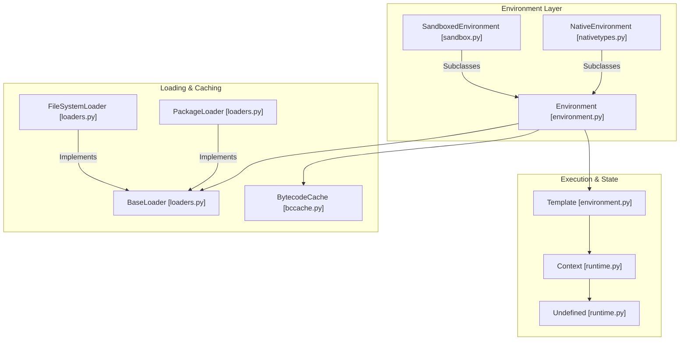

**Sources:**
- [src/jinja2/environment.py:75-101]() (Environment)
- [src/jinja2/loaders.py:12-25]() (BaseLoader)
- [src/jinja2/runtime.py:590-610]() (Context)
- [src/jinja2/bccache.py:44-55]() (BytecodeCache)

### Key Class Roles

| Class | File Path | Role |
| :--- | :--- | :--- |
| `Environment` | [src/jinja2/environment.py:75]() | Central configuration; stores `filters`, `tests`, and `globals`. |
| `Template` | [src/jinja2/environment.py:1146]() | The compiled representation of a template; provides `render()` and `generate()`. |
| `BaseLoader` | [src/jinja2/loaders.py:12]() | Abstract base for template loading logic. |
| `Context` | [src/jinja2/runtime.py:590]() | Holds the runtime variables and manages lookups during rendering. |
| `BytecodeCache` | [src/jinja2/bccache.py:44]() | Interface for persisting compiled template bytecode to avoid re-parsing. |

## Template Processing Pipeline

Jinja compiles templates into optimized Python code just-in-time [docs/intro.rst:18-19](). The data flow from raw string to rendered output involves several internal subsystems.

### Data Flow Diagram

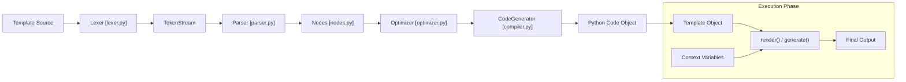

**Sources:**
- [src/jinja2/environment.py:644-670]() (compile function)
- [docs/faq.rst:19-22]() (compilation explanation)

1.  **Lexing**: The source is broken into tokens (strings, variables, blocks) [src/jinja2/lexer.py:700]().
2.  **Parsing**: Tokens are converted into an Abstract Syntax Tree (AST) composed of `Node` objects [src/jinja2/nodes.py:21]().
3.  **Optimization**: The AST is simplified where possible (e.g., constant folding).
4.  **Compilation**: The `CodeGenerator` transforms the AST into Python source code, which is then `compile()`'d into a Python code object [src/jinja2/compiler.py:82]().
5.  **Execution**: The code object is executed within a `Context`, producing the final string or stream [src/jinja2/runtime.py:590]().

## Basic Usage Patterns

### Standard Rendering
The typical workflow involves initializing an `Environment`, loading a `Template`, and calling `render()`.

```python
from jinja2 import Environment, FileSystemLoader

# Configure the environment
env = Environment(
    loader=FileSystemLoader("templates"),
    autoescape=True
)

# Load and render
template = env.get_template("index.html")
print(template.render(user="Pallets"))
```
**Sources:**
- [docs/intro.rst:38-42]()
- [src/jinja2/environment.py:917-940]() (`get_template` logic)

### Asynchronous Rendering
Jinja supports `asyncio` for environments where functions or filters return coroutines. This is enabled via the `enable_async` flag [CHANGES.rst:61]().

```python
env = Environment(enable_async=True)
template = env.from_string("Hello {{ user }}")
# Uses await for rendering
result = await template.render_async(user=fetch_user())
```
**Sources:**
- [src/jinja2/environment.py:1286-1300]() (`render_async`)
- [CHANGES.rst:40-44]() (async support updates)

## Key Features

*   **Sandboxing**: A `SandboxedEnvironment` restricts access to unsafe attributes and methods, allowing safe execution of untrusted templates [src/jinja2/sandbox.py:141]().
*   **Template Inheritance**: Uses `` and `` to promote reuse [README.md:33-35]().
*   **Autoescaping**: Integration with `MarkupSafe` to prevent XSS by automatically escaping HTML special characters [docs/intro.rst:50-51]().
*   **Extensibility**: Developers can add custom filters via `Environment.filters` or complex syntax via the `Extension` class [docs/intro.rst:22]().
*   **Native Types**: The `NativeEnvironment` can render templates to Python types (lists, dicts, ints) instead of just strings [src/jinja2/nativetypes.py:46]().

**Sources:**
- [docs/intro.rst:8-22]() (feature list)
- [docs/faq.rst:60-64]() (autoescaping rationale)

---

# Page: Core Architecture

# Core Architecture

<details>
<summary>Relevant source files</summary>

The following files were used as context for generating this wiki page:

- [CHANGES.rst](CHANGES.rst)
- [docs/api.rst](docs/api.rst)
- [docs/extensions.rst](docs/extensions.rst)
- [docs/templates.rst](docs/templates.rst)
- [src/jinja2/__init__.py](src/jinja2/__init__.py)
- [src/jinja2/environment.py](src/jinja2/environment.py)

</details>


This document describes the foundational architecture of Jinja2, a modern and designer-friendly templating engine for Python. It covers the core components, their relationships, and how they work together to process templates from source code to rendered output.

## Overview of Core Architecture

Jinja2's architecture is built around the central `Environment` class that manages the entire template processing lifecycle. The framework follows a multi-stage processing pipeline that transforms template source code into rendered output through lexing, parsing, compilation, and execution phases.

Title: Core Component Relationships
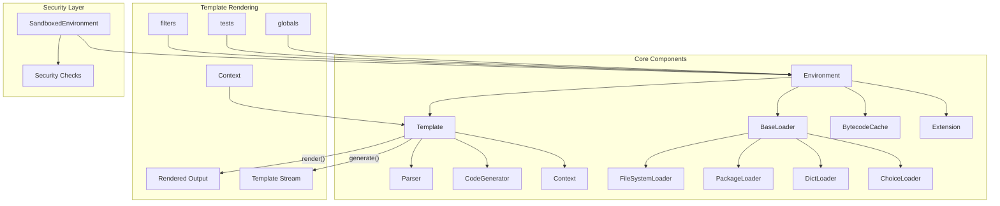

Sources: [src/jinja2/__init__.py:10-40](), [src/jinja2/environment.py:146-458]()

## Environment Class

The `Environment` class is the central configuration point for Jinja2. It manages all aspects of template loading, compilation, and rendering. Instances of this class store configuration, filters, tests, and global objects [src/jinja2/environment.py:146-152]().

Key responsibilities of the `Environment` class include:
1. **Template Loading**: Managing how templates are located via `loader` [src/jinja2/environment.py:207-208]().
2. **Compilation**: Converting template source to executable Python code via `compile()` [src/jinja2/environment.py:588-600]().
3. **Registry**: Maintaining `filters`, `tests`, and `globals` dictionaries [src/jinja2/environment.py:353-359]().
4. **Extension Integration**: Loading and managing extensions via `add_extension()` [src/jinja2/environment.py:453-458]().

For details, see [Environment Class](#2.1).

Sources: [src/jinja2/environment.py:146-458](), [docs/api.rst:16-27]()

## Template Processing Pipeline

Jinja2 processes templates through a multi-stage pipeline that converts template source code into rendered output:

Title: From Source to Rendered Output
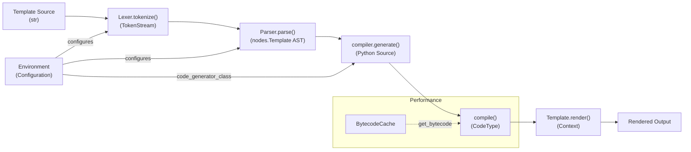

Let's examine the stages (detailed in [Template Processing Pipeline](#2.2)):

1.  **Lexing**: The `Lexer` breaks source text into tokens based on delimiters like `block_start_string` [src/jinja2/environment.py:155-156]().
2.  **Parsing**: The `Parser` transforms the `TokenStream` into an Abstract Syntax Tree (AST) using nodes defined in `nodes.py` [src/jinja2/parser.py:31-40]().
3.  **Compilation**: The `CodeGenerator` visits the AST and produces Python source code [src/jinja2/compiler.py:121-125]().
4.  **Execution**: The compiled code is executed within a `Context` to produce the final string [src/jinja2/runtime.py:145-150]().

Sources: [src/jinja2/lexer.py:1-40](), [src/jinja2/parser.py:1-40](), [src/jinja2/compiler.py:19-20](), [src/jinja2/environment.py:459-466]()

## Context and Template Classes

### Template Class
A `Template` object represents a compiled template. It is created by the environment and holds the `root_render_func` [src/jinja2/environment.py:1130-1135](). It provides high-level methods like `render()` and `generate()` [src/jinja2/environment.py:1285-1310]().

### Context Class
The `Context` class represents the runtime state of a template execution. It manages variable resolution across parent and local scopes [src/jinja2/runtime.py:145-160](). It also tracks template inheritance through `blocks` [src/jinja2/runtime.py:228-230]().

Title: Runtime Entity Relationships
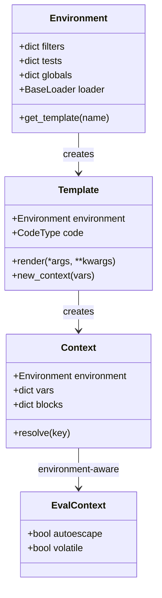

Sources: [src/jinja2/environment.py:1130-1310](), [src/jinja2/runtime.py:145-250]()

## Extension System

The extension system allows developers to add custom tags, filters, or preprocess template source. Extensions are added during `Environment` initialization [src/jinja2/environment.py:206-210]().

Common hooks include:
*   `preprocess`: Modifies source text before lexing.
*   `filter_stream`: Modifies the token stream before parsing.
*   `parse`: Extends the parser to handle custom tags.

For details, see [Extension System](#2.3).

Sources: [src/jinja2/ext.py:55-117](), [docs/extensions.rst:1-24]()

## Security Features

Jinja2 provides several layers of security:
1.  **SandboxedEnvironment**: Restricts attribute access and function calls to prevent execution of unsafe code [src/jinja2/sandbox.py:1-20]().
2.  **Autoescaping**: Uses `markupsafe` to automatically escape variables in HTML/XML contexts [src/jinja2/environment.py:16-17]().
3.  **Policies**: The `policies` dictionary on the environment allows fine-grained control over security-related behaviors like `ext.i18n.trimmed` [src/jinja2/defaults.py:27]().

Sources: [src/jinja2/sandbox.py:77-100](), [docs/api.rst:95-100]()

## Performance Optimization

Performance is managed through two primary mechanisms:
*   **LRUCache**: The `Environment` caches loaded `Template` objects in memory [src/jinja2/environment.py:83-93]().
*   **BytecodeCache**: Compiled Python bytecode can be persisted (e.g., `FileSystemBytecodeCache`) to avoid the overhead of parsing and code generation on subsequent loads [src/jinja2/bccache.py:1-20]().

Sources: [src/jinja2/environment.py:83-107](), [src/jinja2/bccache.py:195-210]()

---

# Page: Environment Class

# Environment Class

<details>
<summary>Relevant source files</summary>

The following files were used as context for generating this wiki page:

- [docs/api.rst](docs/api.rst)
- [docs/extensions.rst](docs/extensions.rst)
- [docs/templates.rst](docs/templates.rst)
- [src/jinja2/defaults.py](src/jinja2/defaults.py)
- [src/jinja2/environment.py](src/jinja2/environment.py)
- [tests/test_api.py](tests/test_api.py)
- [tests/test_security.py](tests/test_security.py)

</details>


The `Environment` class is the central component of the Jinja2 templating engine. It serves as the configuration hub and control center that manages template loading, compilation, rendering, and extensions. An `Environment` instance is the primary entry point for most Jinja2 operations [docs/api.rst:16-18]().

## Core Architecture

The `Environment` class serves as the central orchestrator for the entire templating system, managing registries and the lifecycle of template objects [src/jinja2/environment.py:146-152]().

### System Entity Map: Core Components
The following diagram maps high-level system components to their specific code entities within the `jinja2` package.

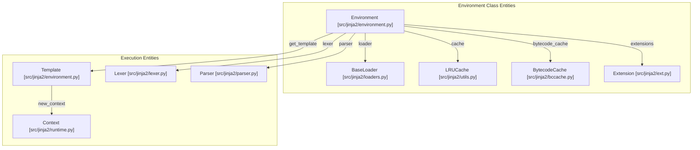

Sources: [src/jinja2/environment.py:146-457](), [src/jinja2/environment.py:834-866](), [src/jinja2/runtime.py:47-49]()

## Initialization and Configuration

Creating an `Environment` instance involves setting parameters that define the template syntax and runtime behavior. If a `Template` is created directly without an environment, a "shared" spontaneous environment is created automatically [src/jinja2/environment.py:70-80]().

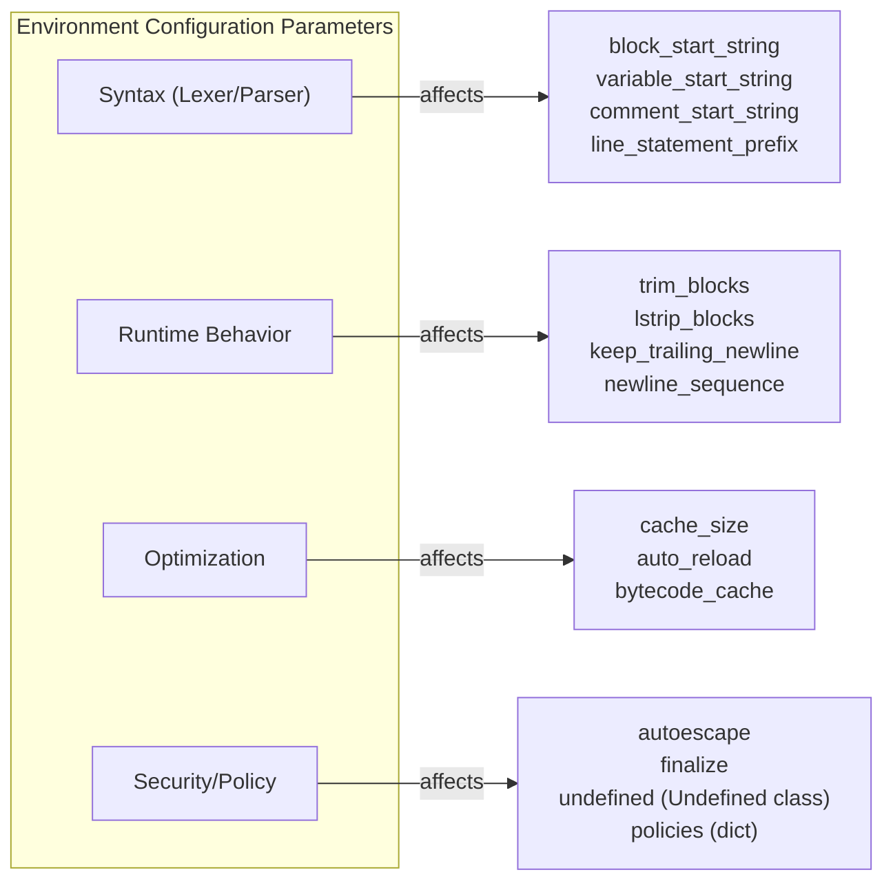

Sources: [src/jinja2/environment.py:155-266](), [src/jinja2/environment.py:296-371](), [src/jinja2/defaults.py:14-48]()

### Key Configuration Parameters

| Parameter | Default | Description |
|-----------|---------|-------------|
| `loader` | `None` | The `BaseLoader` used to find template source [src/jinja2/environment.py:298]() |
| `block_start_string` | `'{%'` | Marker for block start [src/jinja2/defaults.py:14]() |
| `variable_start_string` | `'{{'` | Marker for expression start [src/jinja2/defaults.py:16]() |
| `trim_blocks` | `False` | Removes first newline after a block [src/jinja2/defaults.py:22]() |
| `lstrip_blocks` | `False` | Strips leading whitespace before blocks [src/jinja2/defaults.py:23]() |
| `autoescape` | `False` | Boolean or callable to determine autoescaping [src/jinja2/environment.py:311]() |
| `cache_size` | `400` | Size of the `LRUCache`. 0 disables, -1 makes it infinite [src/jinja2/environment.py:314]() |
| `undefined` | `Undefined` | `Undefined` subclass for missing variables [src/jinja2/environment.py:317]() |
| `finalize` | `None` | Callable to process expression results before output [src/jinja2/environment.py:318]() |
| `enable_async` | `False` | Enables `render_async` and `generate_async` [src/jinja2/environment.py:319]() |

Sources: [src/jinja2/environment.py:296-371](), [src/jinja2/defaults.py:14-48]()

## Template Loading and Cache Management

The environment manages template retrieval and caching through its `loader` and an internal `cache` mapping [src/jinja2/environment.py:83-93]().

| Method | Description |
|--------|-------------|
| `get_template(name)` | Loads a template, utilizing the cache if available [src/jinja2/environment.py:917-943]() |
| `select_template(names)` | Iterates through a list of names, returning the first existing template [src/jinja2/environment.py:968-990]() |
| `from_string(source)` | Creates a `Template` from a string, bypassing the loader [src/jinja2/environment.py:868-879]() |
| `list_templates()` | Proxies to `loader.list_templates()` to see all available templates [src/jinja2/environment.py:1001-1007]() |

### Cache Implementation
The cache uses a `LRUCache` by default [src/jinja2/environment.py:93](). It keys templates by a tuple of `(weakref(loader), name)` to ensure that templates from different loaders do not collide [src/jinja2/environment.py:85]().

Sources: [src/jinja2/environment.py:83-108](), [src/jinja2/environment.py:917-1007]()

## Registries: Filters, Tests, and Globals

The `Environment` holds dictionaries that act as registries for template functionality.

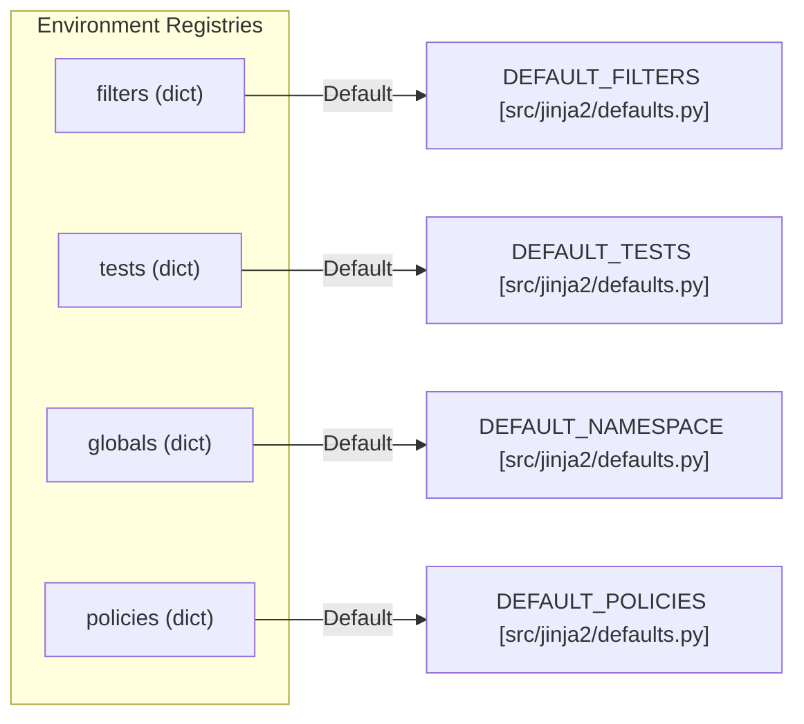

*   **Filters**: Mappings of filter names to Python callables [docs/api.rst:101-107]().
*   **Tests**: Mappings of test names to boolean callables [docs/api.rst:108-114]().
*   **Globals**: Variables available in every template context [docs/api.rst:115-119]().
*   **Policies**: Configuration for runtime behavior, such as `urlize.rel` or `json.dumps_function` [src/jinja2/defaults.py:39-48]().

Sources: [src/jinja2/environment.py:353-358](), [src/jinja2/defaults.py:3-8](), [src/jinja2/defaults.py:29-48]()

## Overlay Mechanism

The `overlay()` method creates a "child" environment. It copies the current environment but allows specific parameters to be overridden [src/jinja2/environment.py:388-392]().

*   The overlay shares the same `filters`, `tests`, and `globals` dictionaries unless explicitly replaced [src/jinja2/environment.py:441-443]().
*   It creates a fresh template cache via `copy_cache()` to avoid interfering with the parent's loading state [src/jinja2/environment.py:444]().

Sources: [src/jinja2/environment.py:388-457](), [src/jinja2/environment.py:96-107]()

## Extensions

Extensions are added during initialization or via `add_extension()`. They can modify the lexer, parser, or add tags [docs/extensions.rst:6-10]().

*   **Loading**: Extensions are instantiated and bound to the environment during the `load_extensions` helper call [src/jinja2/environment.py:109-124]().
*   **i18n**: The `i18n` extension adds methods like `install_gettext_translations` directly to the `Environment` instance when loaded [docs/extensions.rst:47-52]().

Sources: [src/jinja2/environment.py:109-124](), [src/jinja2/environment.py:372-377](), [docs/extensions.rst:11-23]()

## Compilation Pipeline Integration

The `Environment` manages the transition from source code to executable code objects.

1.  **Lexing**: Uses `get_lexer()` to create a `Lexer` based on environment delimiters [src/jinja2/environment.py:649-652]().
2.  **Parsing**: Uses the `Parser` class to generate an AST (`nodes.Template`) [src/jinja2/environment.py:659-663]().
3.  **Code Generation**: Uses `generate()` and the `code_generator_class` (default `CodeGenerator`) to produce Python source [src/jinja2/environment.py:773-775]().
4.  **Compilation**: Invokes the Python `compile()` builtin to create a `CodeType` object [src/jinja2/environment.py:785]().

Sources: [src/jinja2/environment.py:644-663](), [src/jinja2/environment.py:761-792](), [src/jinja2/compiler.py:19-20]()

---

# Page: Template Processing Pipeline

# Template Processing Pipeline

<details>
<summary>Relevant source files</summary>

The following files were used as context for generating this wiki page:

- [src/jinja2/compiler.py](src/jinja2/compiler.py)
- [src/jinja2/lexer.py](src/jinja2/lexer.py)
- [src/jinja2/nodes.py](src/jinja2/nodes.py)
- [src/jinja2/optimizer.py](src/jinja2/optimizer.py)
- [src/jinja2/parser.py](src/jinja2/parser.py)
- [src/jinja2/runtime.py](src/jinja2/runtime.py)
- [src/jinja2/visitor.py](src/jinja2/visitor.py)
- [tests/test_imports.py](tests/test_imports.py)
- [tests/test_inheritance.py](tests/test_inheritance.py)
- [tests/test_lexnparse.py](tests/test_lexnparse.py)
- [tests/test_tests.py](tests/test_tests.py)

</details>


This page explains the process by which Jinja2 transforms a raw template string into rendered output. Understanding this pipeline is essential for developing with and extending Jinja2.

## Overview

The template processing pipeline consists of several distinct stages that transform a template from raw text to rendered output:

Title: Jinja2 High-Level Pipeline
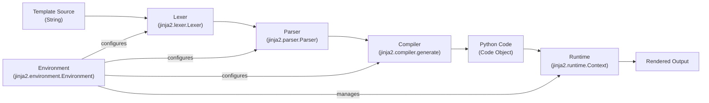

Sources: [src/jinja2/environment.py:146-371](), [src/jinja2/compiler.py:101-122](), [src/jinja2/lexer.py:1-5]()

## Stage 1: Lexing

The lexer breaks down the raw template string into a stream of tokens. The `Lexer` class uses regular expressions compiled via `compile_rules` to identify delimiters and content.

Title: Lexer Internal Flow
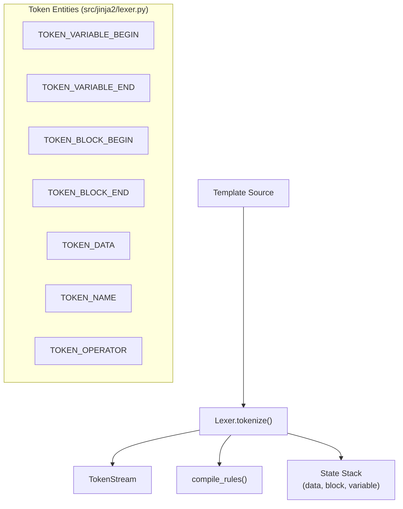

The lexer maintains a state stack (typically starting in `data` mode). When it encounters a delimiter like `{{`, it pushes the `variable` state to the stack and begins tokenizing expressions until the closing delimiter is found.

Sources: [src/jinja2/lexer.py:213-255](), [src/jinja2/lexer.py:62-112](), [tests/test_lexnparse.py:15-41]()

## Stage 2: Parsing

The `Parser` transforms the `TokenStream` into an Abstract Syntax Tree (AST). It uses a recursive descent approach, where specific methods like `parse_statement` or `parse_expression` handle different parts of the grammar.

Title: Parser to AST Mapping
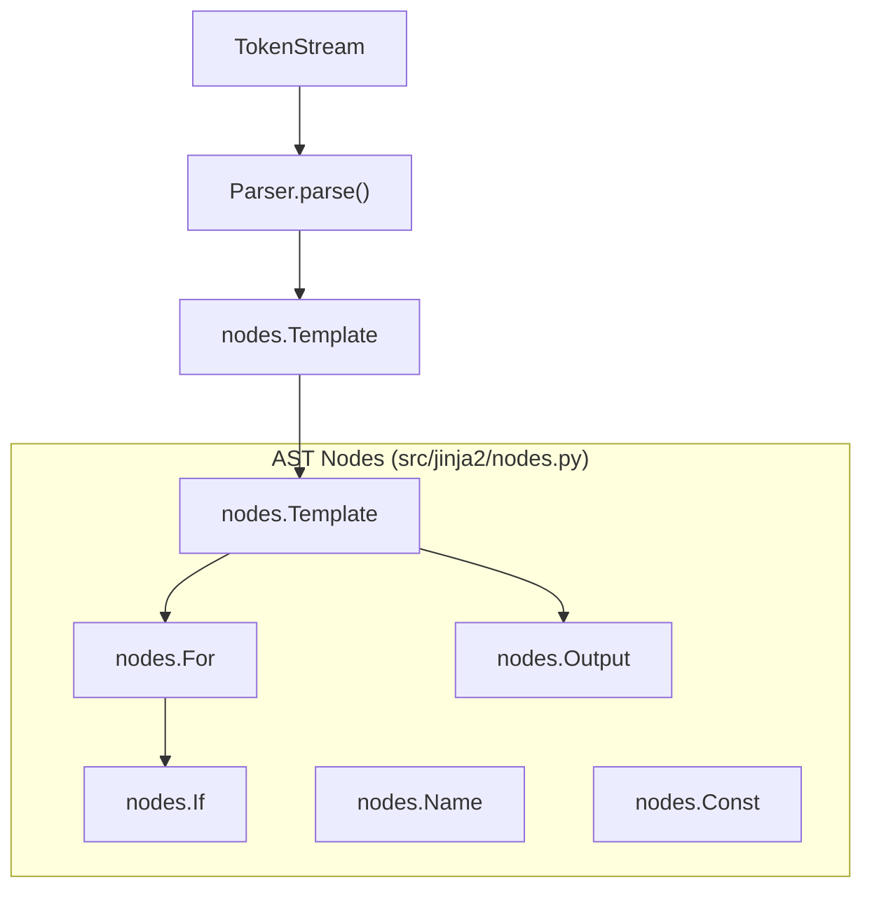

The parser is responsible for structural validation. For example, it ensures that every `` is eventually followed by an `` by tracking tags on a `_tag_stack`.

Sources: [src/jinja2/parser.py:48-129](), [src/jinja2/parser.py:163-191](), [src/jinja2/nodes.py:105-128]()

## Stage 3: Compilation

The compiler transforms the AST into Python source code. The entry point is `jinja2.compiler.generate`, which instantiates a `CodeGenerator`.

Title: Code Generation Pipeline
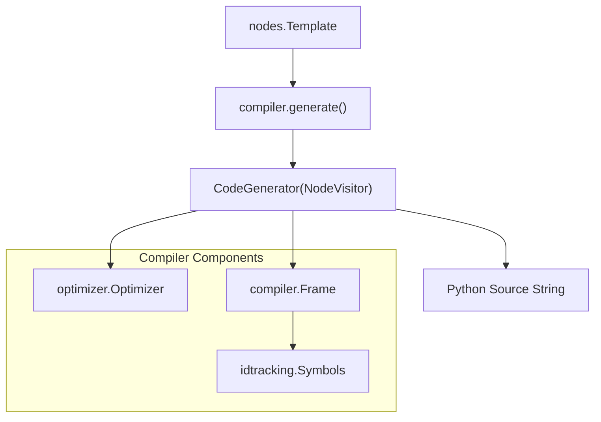

The `CodeGenerator` uses the `NodeVisitor` pattern to traverse the tree. For each node, it writes Python code to a stream. It uses `Frame` objects to track variable scoping and `Symbols` to manage identifier resolution (e.g., determining if a variable is a local, a global, or needs to be resolved from the context).

Sources: [src/jinja2/compiler.py:101-122](), [src/jinja2/compiler.py:163-216](), [src/jinja2/optimizer.py:20-24]()

## Stage 4: Runtime Execution

The final stage is the execution of the generated Python code. The code expects a `Context` object, which acts as the bridge between the template and the Python variables passed during rendering.

Title: Runtime Execution Context
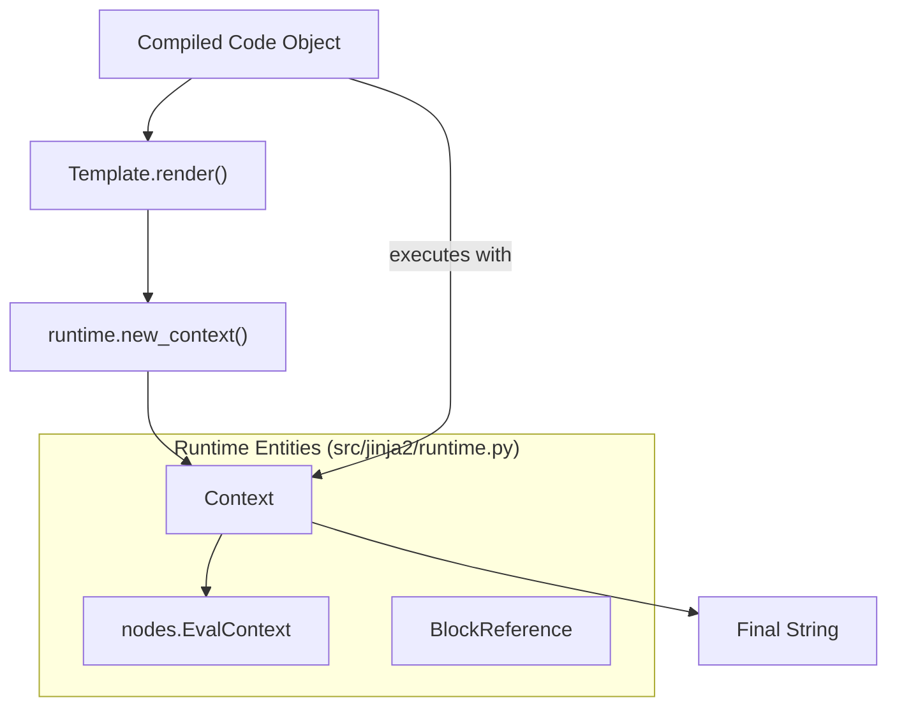

The `Context` is immutable for the user but allows the generated code to store local variables. It handles the `resolve` logic, which determines what happens when a template refers to a variable: it checks template locals, then globals, and finally returns an `Undefined` object if the variable is missing.

Sources: [src/jinja2/runtime.py:93-119](), [src/jinja2/runtime.py:145-184](), [src/jinja2/runtime.py:212-225]()

## Caching Mechanisms

To avoid the overhead of the pipeline, Jinja2 employs two levels of caching:

1.  **Template Cache**: Managed by the `Environment`, this stores the `Template` objects in memory (usually an `LRUCache`).
2.  **Bytecode Cache**: An optional persistent cache (like `FileSystemBytecodeCache`) that stores the compiled Python bytecode to disk or a database, skipping the Lexer, Parser, and Compiler stages on subsequent loads.

Sources: [src/jinja2/environment.py:95-108](), [src/jinja2/lexer.py:24-31]()

## Performance Considerations

*   **Constant Folding**: The `Optimizer` performs constant folding (e.g., turning `{{ 1 + 1 }}` into `{{ 2 }}`) during the compilation phase to reduce runtime calculations.
*   **Frame Optimization**: The compiler distinguishes between `rootlevel` and `function` scopes to optimize how variables are accessed.
*   **Streaming**: Templates generate code that `yields` strings, allowing for memory-efficient streaming of large templates via `Template.generate()`.

Sources: [src/jinja2/optimizer.py:27-48](), [src/jinja2/compiler.py:199-216](), [src/jinja2/runtime.py:77-86]()

---

# Page: Extension System

# Extension System

<details>
<summary>Relevant source files</summary>

The following files were used as context for generating this wiki page:

- [docs/api.rst](docs/api.rst)
- [docs/examples/cache_extension.py](docs/examples/cache_extension.py)
- [docs/examples/inline_gettext_extension.py](docs/examples/inline_gettext_extension.py)
- [docs/extensions.rst](docs/extensions.rst)
- [docs/integration.rst](docs/integration.rst)
- [docs/sandbox.rst](docs/sandbox.rst)
- [docs/switching.rst](docs/switching.rst)
- [docs/templates.rst](docs/templates.rst)
- [docs/tricks.rst](docs/tricks.rst)
- [src/jinja2/ext.py](src/jinja2/ext.py)
- [tests/test_core_tags.py](tests/test_core_tags.py)
- [tests/test_ext.py](tests/test_ext.py)
- [tests/test_regression.py](tests/test_regression.py)

</details>


The Extension System in Jinja2 allows developers to add custom functionality to the template engine at the parser level. Extensions can add new tags, filters, tests, or even modify how templates are processed. This document explains how the extension system works and how to create custom extensions.

## Overview

Jinja2's extension system provides a framework for adding functionality beyond what's included in the core template engine. Extensions can:

- Add new template tags (syntax)
- Preprocess template source code
- Filter the token stream during lexing
- Provide new globals, filters, and tests

### Template Processing and Extension Hooks

The following diagram maps the natural language concept of the "Processing Pipeline" to the specific code entities and methods defined in the extension system.

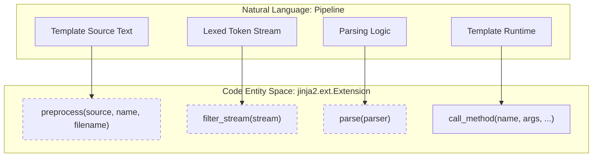

Sources: [src/jinja2/ext.py:99-160](), [docs/extensions.rst:6-9]()

## Extension Base Class

All extensions must inherit from the `jinja2.ext.Extension` base class [src/jinja2/ext.py:55-55]().

### Class Structure

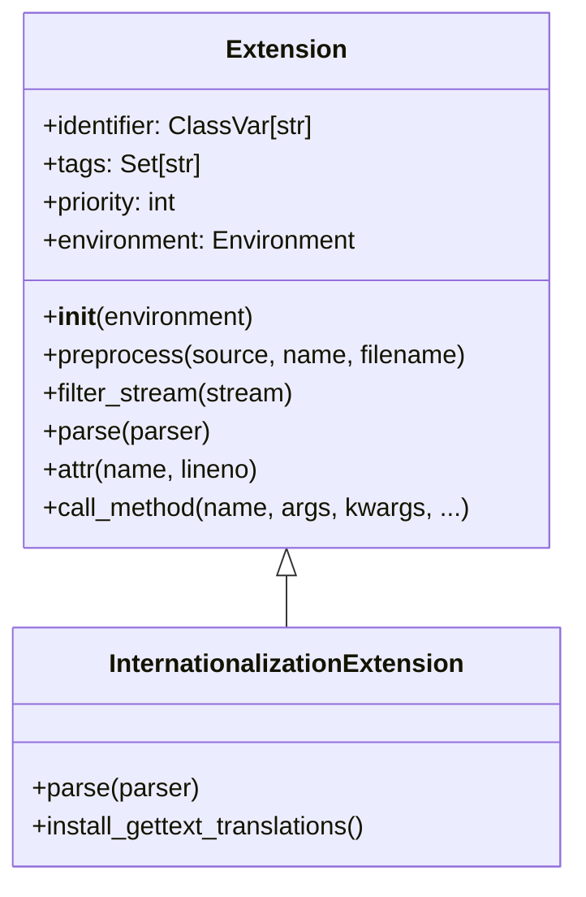

### Lifecycle Hooks

- **`preprocess`**: Called before lexing. It takes the source string and returns a modified source string [src/jinja2/ext.py:99-107]().
- **`filter_stream`**: Passed a `TokenStream` and must return an iterable of `Token` objects [src/jinja2/ext.py:108-116]().
- **`parse`**: Called if any of the `tags` defined in the extension match the current token in the parser stream. It must return one or more `nodes.Node` objects [src/jinja2/ext.py:118-124]().

Sources: [src/jinja2/ext.py:55-160](), [tests/test_ext.py:152-212]()

## Adding Extensions to Environment

Extensions are added during `Environment` initialization or via the `add_extension` method [docs/extensions.rst:11-23]().

| Method | Description |
| :--- | :--- |
| `Environment(extensions=[...])` | Load extensions during environment creation [docs/api.rst:82-86](). |
| `Environment.add_extension(ext)` | Dynamically add an extension to an existing environment [docs/api.rst:82-86](). |

Extensions are identified by their import name (e.g., `'jinja2.ext.i18n'`) or their class object [docs/extensions.rst:19-23]().

Sources: [docs/extensions.rst:11-23](), [src/jinja2/ext.py:76-78]()

## Built-in Extensions

### i18n Extension
**Import name:** `jinja2.ext.i18n` [docs/extensions.rst:31-31]().

The i18n extension adds support for `gettext` and `Babel` [docs/extensions.rst:33-35](). When enabled, it provides:
- The `trans` statement for translatable blocks [docs/extensions.rst:34-35]().
- New-style gettext support which handles autoescaping and formatting automatically [docs/extensions.rst:148-188]().
- Environment methods like `install_gettext_translations` and `extract_translations` [docs/extensions.rst:53-108]().

### Babel Integration
Jinja2 provides a Babel extractor entry point: `jinja2.ext.babel_extract` [docs/integration.rst:28-31](). It extracts messages from both `trans` tags and standard code expressions [docs/integration.rst:33-34]().

### Other Built-ins
- **`jinja2.ext.do`**: Adds the `do` tag to execute expressions without printing [docs/extensions.rst:205-206]().
- **`jinja2.ext.loopcontrols`**: Adds `break` and `continue` support to loops [docs/extensions.rst:214-215]().
- **`jinja2.ext.debug`**: Adds a `debug` tag to dump the current context [docs/extensions.rst:249-250]().

Sources: [docs/extensions.rst:26-260](), [src/jinja2/ext.py:45-51](), [docs/integration.rst:23-64]()

## Creating Custom Extensions

Custom extensions allow for deep integration with the Jinja2 parser.

### Data Flow in Custom Extensions

The following diagram illustrates how a custom extension interacts with the `Parser` and `nodes` system to generate executable code.

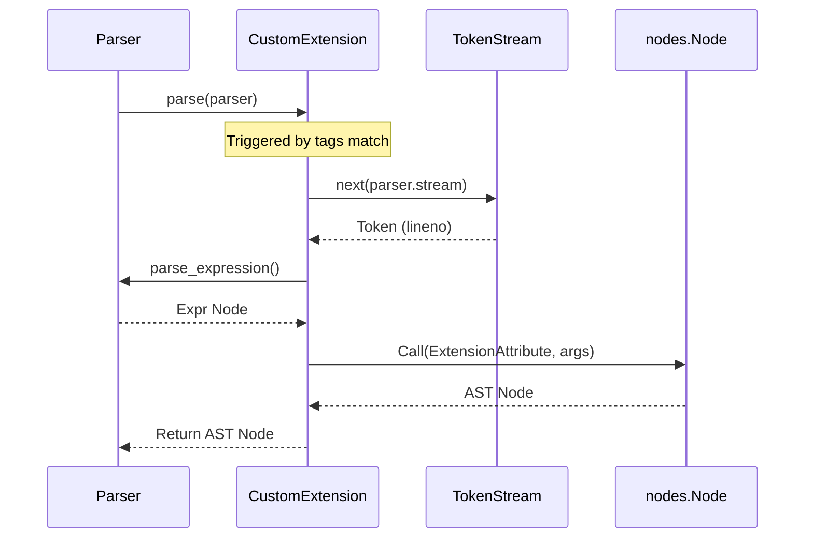

### Key Implementation Helpers
- **`self.attr(name)`**: Returns a `nodes.ExtensionAttribute` pointing to a property on the extension instance [src/jinja2/ext.py:126-134]().
- **`self.call_method(name, ...)`**: A shortcut that combines `attr()` with `nodes.Call` to invoke an extension method during template execution [src/jinja2/ext.py:136-160]().

### Priority and Ordering
The `priority` attribute (default `100`) determines the execution order of `preprocess` and `filter_stream`. Lower values indicate higher priority [src/jinja2/ext.py:82-87]().

Sources: [src/jinja2/ext.py:79-160](), [tests/test_ext.py:152-212](), [docs/examples/inline_gettext_extension.py:12-72]()

---

# Page: Template System

# Template System

<details>
<summary>Relevant source files</summary>

The following files were used as context for generating this wiki page:

- [docs/api.rst](docs/api.rst)
- [docs/extensions.rst](docs/extensions.rst)
- [docs/templates.rst](docs/templates.rst)
- [tests/test_imports.py](tests/test_imports.py)
- [tests/test_inheritance.py](tests/test_inheritance.py)
- [tests/test_lexnparse.py](tests/test_lexnparse.py)
- [tests/test_tests.py](tests/test_tests.py)

</details>


The Template System is the core component of Jinja2 that defines how templates are written, processed, and rendered. This page explains the template syntax, features, and usage patterns that template authors need to understand.

## Template Basics

A Jinja template is simply a text file that can generate any text-based format (HTML, XML, CSV, LaTeX, etc.). Templates contain three main types of elements:

1.  **Variables and expressions**: Values that get replaced when rendered (`{{ variable }}`) [docs/templates.rst:21-24]().
2.  **Statements**: Control structures that affect template logic (``) [docs/templates.rst:22-23]().
3.  **Comments**: Notes that aren't included in the output (`{# comment #}`) [docs/templates.rst:57-57]().

### Default Delimiters

| Syntax | Purpose | Example |
| :--- | :--- | :--- |
| `{{ ... }}` | Expressions (output) | `{{ username }}` |
| `` | Statements (logic) | `` |
| `{# ... #}` | Comments (ignored) | `{# TODO: refactor #}` |

The `Environment` can be configured to use different delimiters, such as `line_statement_prefix` for line-based logic [docs/templates.rst:48-62]().

Sources: [docs/templates.rst:13-62]()

## Template Processing Pipeline

When a template is rendered, it moves from source text to a executable Python code through several internal phases managed by the `Environment`.

Template Processing Flow:
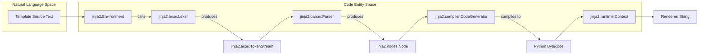

Sources: [docs/api.rst:16-56](), [tests/test_lexnparse.py:15-41](), [docs/api.rst:128-139]()

## Variables and Expressions

Variables are defined by the context dictionary passed to the template [docs/templates.rst:84-85]().

### Variable Access
Jinja provides two ways to access attributes or items, which behave similarly but have different lookup priorities:
*   **Dot Lookup**: `{{ foo.bar }}` first checks for an attribute, then an item [docs/templates.rst:113-121]().
*   **Subscript Lookup**: `{{ foo['bar'] }}` first checks for an item, then an attribute [docs/templates.rst:122-129]().

### Filters and Tests
*   **Filters**: Transform variables using the pipe (`|`) symbol. Multiple filters can be chained [docs/templates.rst:138-142]().
*   **Tests**: Evaluate a variable against a condition using the `is` keyword [docs/templates.rst:157-160]().

For details, see [Template Syntax](#3.1).

Sources: [docs/templates.rst:79-172]()

## Control Structures

Control structures direct the template's logic flow and appear within `` blocks.

### Loops and Conditionals
*   **For Loops**: Iterate over sequences. Inside a loop, a special `loop` object provides access to metadata like `loop.index` or `loop.first` [docs/templates.rst:689-764]().
*   **If Statements**: Provide conditional branching [docs/templates.rst:855-884]().

### Macros and Assignments
*   **Macros**: Reusable template functions defined with `` [docs/templates.rst:886-900]().
*   **Assignments**: Use `` to bind values to names or `` to create local scopes [docs/templates.rst:1028-1050]().

For details, see [Control Structures](#3.3).

Sources: [docs/templates.rst:689-1102]()

## Template Inheritance and Inclusion

Inheritance allows you to build a base "skeleton" and override specific `block` sections in child templates.

Inheritance Model:
```mermaid
classDiagram
    class "BaseTemplate" {
        +block_header()
        +block_content()
        +block_footer()
    }
    class "ChildTemplate" {
        +extends "BaseTemplate"
        +block_content()
    }
    class "Environment" {
        +get_template(name)
        +loaders
    }
    BaseTemplate <|-- ChildTemplate : 
    Environment --> BaseTemplate : loads
```

### Key Features
*   **Extends**: Child templates use `` to inherit from a parent [docs/templates.rst:380-385]().
*   **Blocks**: Defined in parents and overridden in children [docs/templates.rst:411-420]().
*   **Include**: Inserts the rendered contents of another template into the current one [docs/templates.rst:126-135]().
*   **Import**: Allows sharing macros between templates [tests/test_imports.py:27-47]().

For details, see [Template Inheritance and Inclusion](#3.2).

Sources: [docs/templates.rst:365-409](), [tests/test_inheritance.py:8-33](), [tests/test_imports.py:126-133]()

## Whitespace Control

By default, Jinja returns whitespace unchanged except for a single trailing newline [docs/templates.rst:194-197]().
*   **Manual Trimming**: Use a minus sign (`-`) in delimiters (e.g., `{%-`) to strip leading or trailing whitespace [docs/templates.rst:212-218]().
*   **Environment Settings**: `trim_blocks` and `lstrip_blocks` can be enabled globally to clean up the generated output [docs/templates.rst:199-204]().

Sources: [docs/templates.rst:191-283](), [tests/test_lexnparse.py:57-69]()

## Extensions

Jinja can be extended to add custom tags, filters, or internationalization support via the `jinja2.ext` module [docs/extensions.rst:6-9]().
*   **i18n**: Adds the `` block for translation [docs/extensions.rst:34-36]().
*   **Adding Extensions**: Use the `extensions` parameter in `Environment` or the `add_extension` method [docs/extensions.rst:14-23]().

Sources: [docs/extensions.rst:1-40]()

---

# Page: Template Syntax

# Template Syntax

<details>
<summary>Relevant source files</summary>

The following files were used as context for generating this wiki page:

- [docs/api.rst](docs/api.rst)
- [docs/extensions.rst](docs/extensions.rst)
- [docs/templates.rst](docs/templates.rst)
- [src/jinja2/constants.py](src/jinja2/constants.py)
- [src/jinja2/lexer.py](src/jinja2/lexer.py)
- [tests/test_imports.py](tests/test_imports.py)
- [tests/test_inheritance.py](tests/test_inheritance.py)
- [tests/test_lexnparse.py](tests/test_lexnparse.py)
- [tests/test_tests.py](tests/test_tests.py)

</details>


This page details the syntax for variables, expressions, statements, and comments in Jinja templates. It covers how the engine interprets different delimiters, manages whitespace, and handles data access.

## Basic Template Structure

A Jinja template is a text file containing **variables** and **expressions**, which are replaced with values during rendering, and **tags**, which control the logic of the template [docs/templates.rst:17-24]().

```html
<!DOCTYPE html>
<html lang="en">
<body>
    <ul id="navigation">
    
        <li><a href="{{ item.href }}">{{ item.caption }}</a></li>
    
    </ul>
    {{ a_variable }}
    {# a comment #}
</body>
</html>
```
Sources: [docs/templates.rst:29-46]()

## Template Delimiters

The `Lexer` in `src/jinja2/lexer.py` identifies specific sequences to separate template data from logic. While configurable via the `Environment`, the default delimiters are:

| Delimiter | Token Type (Internal) | Purpose |
|-----------|-----------------------|---------|
| `{{ ... }}` | `TOKEN_VARIABLE_BEGIN` / `END` | Expressions to print to output |
| `` | `TOKEN_BLOCK_BEGIN` / `END` | Statements (control structures) |
| `{# ... #}` | `TOKEN_COMMENT_BEGIN` / `END` | Comments (not rendered) |
| `` | `TOKEN_RAW_BEGIN` / `END` | Disables processing for a block |

Sources: [docs/templates.rst:52-58](), [src/jinja2/lexer.py:95-103]()

## Variables and Attribute Access

Variables are passed to templates via a context dictionary [docs/templates.rst:81-85](). Jinja provides two ways to access attributes or keys, implemented with specific fallback logic in the runtime.

### Data Access Implementation
The following diagram illustrates how the `dot` (`.`) and `subscript` (`[]`) operators are resolved into Python calls:

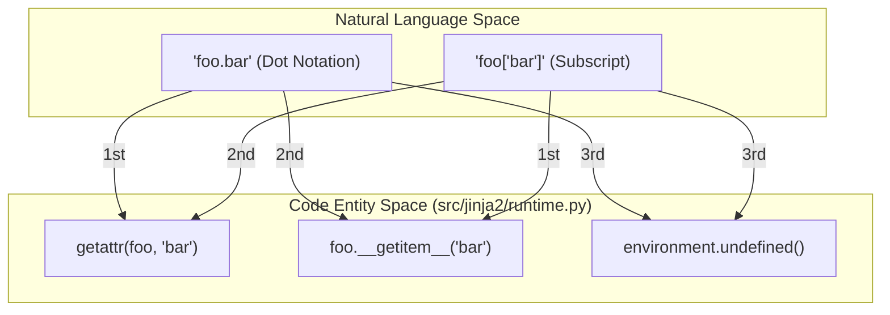

Sources: [docs/templates.rst:111-131](), [src/jinja2/lexer.py:114-141]()

## Filters and Tests

### Filters
Filters are separated by a pipe (`|`) and can be chained. They are essentially Python functions registered in `Environment.filters` [docs/api.rst:101-107]().
*   **Syntax:** `{{ name|striptags|title }}`
*   **Arguments:** `{{ listx|join(', ') }}` (mapped to `str.join(', ', listx)`)

Sources: [docs/templates.rst:133-150]()

### Tests
Tests use the `is` keyword to evaluate a condition against a variable. They are registered in `Environment.tests` [docs/api.rst:108-114]().
*   **Syntax:** ``
*   **With Arguments:** `` or ``

Sources: [docs/templates.rst:152-171](), [tests/test_tests.py:14-24]()

## Whitespace Control

Jinja provides granular control over whitespace through `Environment` settings and per-tag modifiers.

### Global Settings
*   `trim_blocks`: If `True`, the first newline after a block is removed [docs/templates.rst:199-201]().
*   `lstrip_blocks`: If `True`, leading whitespace (tabs/spaces) before a block is stripped [docs/templates.rst:200-203]().
*   `keep_trailing_newline`: Preserves a single trailing newline at the end of the file [tests/test_lexnparse.py:122-123]().

### Manual Modifiers
Adding a minus sign (`-`) to any delimiter strips whitespace in that direction.

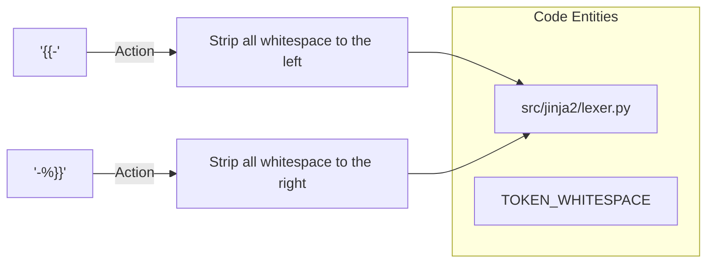

Sources: [docs/templates.rst:210-230](), [tests/test_lexnparse.py:50-68]()

## Line Statements

For cleaner templates (e.g., in Python-like scripts), Jinja supports line-based logic. This requires setting `line_statement_prefix` and `line_comment_prefix` in the `Environment` [docs/templates.rst:59-62]().

If `line_statement_prefix` is set to `#`:
```jinja
# for item in seq:
    <li>{{ item }}</li>
# endfor
```
Sources: [docs/templates.rst:314-335](), [src/jinja2/lexer.py:234-245]()

## Literals and Operators

The `Lexer` recognizes standard Python-style literals and operators:

*   **Strings:** `'Hello'`, `"World"` [src/jinja2/lexer.py:29-31]().
*   **Numbers:** Integers (`42`), Floats (`3.14`), Binary (`0b10`), Hex (`0xff`) [src/jinja2/lexer.py:32-60]().
*   **Math:** `+`, `-`, `/`, `//`, `%`, `**`, `*` [src/jinja2/lexer.py:114-121]().
*   **Comparison:** `==`, `!=`, `>`, `>=`, `<`, `<=` [src/jinja2/lexer.py:129-134]().
*   **Logic:** `and`, `or`, `not` (handled during parsing).

Sources: [src/jinja2/lexer.py:27-141](), [tests/test_lexnparse.py:104-113]()

---

# Page: Template Inheritance and Inclusion

# Template Inheritance and Inclusion

<details>
<summary>Relevant source files</summary>

The following files were used as context for generating this wiki page:

- [docs/api.rst](docs/api.rst)
- [docs/extensions.rst](docs/extensions.rst)
- [docs/templates.rst](docs/templates.rst)
- [examples/basic/inheritance.py](examples/basic/inheritance.py)
- [examples/basic/translate.py](examples/basic/translate.py)
- [tests/test_imports.py](tests/test_imports.py)
- [tests/test_inheritance.py](tests/test_inheritance.py)
- [tests/test_lexnparse.py](tests/test_lexnparse.py)
- [tests/test_tests.py](tests/test_tests.py)

</details>


Template inheritance and inclusion are core features in Jinja2 that enable template composition, code reuse, and maintainable layouts. This page documents how to use these powerful mechanisms to structure templates efficiently and reduce duplication.

For information about the general template syntax, see [Template Syntax](#3.1). For details about control structures like loops and conditionals, see [Control Structures](#3.3).

## Overview of Template Inheritance

Template inheritance allows you to build a base "skeleton" template containing common elements of your site while defining **blocks** that child templates can override. This promotes DRY (Don't Repeat Yourself) principles in your templates.

### Inheritance Architecture

The following diagram illustrates how the `Environment` handles the relationship between base and child templates during the rendering process.

```mermaid
graph TD
    subgraph "Jinja2 Inheritance Flow"
        BaseTemplate["Base Template (layout)"] -- "defines" --> Block1["Block 1"]
        BaseTemplate -- "defines" --> Block2["Block 2"]
        
        ChildTemplate["Child Template (level1)"] -- "extends" --> BaseTemplate
        ChildTemplate -- "overrides" --> Block1
        ChildTemplate -- "uses super()" --> Block2
        
        GrandchildTemplate["Grandchild Template (level2)"] -- "extends" --> ChildTemplate
        GrandchildTemplate -- "overrides" --> Block2
    end
    
    subgraph "Code Entities"
        TemplateClass["jinja2.Template"]
        EnvironmentClass["jinja2.Environment"]
        DictLoaderClass["jinja2.loaders.DictLoader"]
    end

    EnvironmentClass -->|get_template| TemplateClass
    TemplateClass -->|render| Output["Final String"]
```

Sources: [docs/templates.rst:365-405](), [tests/test_inheritance.py:8-34](), [docs/api.rst:16-56]()

## Base Template Structure

A base template defines the skeleton with placeholders (blocks) that can be filled by child templates. Blocks are defined using the `` tag.

```jinja
<!DOCTYPE html>
<html>
<head>
    
    <title> - My Website</title>
    
</head>
<body>
    <div id="content"></div>
    <div id="footer">
        
        &copy; Copyright 2023
        
    </div>
</body>
</html>
```

The `` tag tells the template engine that a child template may override these placeholders. Blocks can be nested, allowing for granular overrides [tests/test_inheritance.py:11-13]().

Sources: [docs/templates.rst:378-401](), [tests/test_inheritance.py:8-13]()

## Child Templates

A child template extends a base template using the `` directive and overrides specific blocks.

```jinja

Home Page

    <h1>Welcome</h1>
    <p>Welcome to my website.</p>

```

The `` tag must be the first tag in the template [docs/templates.rst:411-429](). If multiple `extends` tags are present, Jinja2 will raise an error or exhibit undefined behavior depending on configuration [tests/test_inheritance.py:46-56]().

Sources: [docs/templates.rst:411-429](), [tests/test_inheritance.py:15-17](), [tests/test_inheritance.py:84-101]()

## Using `super()`

The `super()` function allows you to render the content of the parent block within an overriding block. This is essential for "appending" or "prepending" content rather than replacing it entirely.

```jinja


    {{ super() }}
    <style type="text/css">
        .important { color: #336699; }
    </style>

```

Sources: [docs/templates.rst:465-475](), [tests/test_inheritance.py:109-124](), [examples/basic/inheritance.py:9-10]()

## Multi-level Inheritance

Templates can extend other templates that themselves extend other templates. When using multiple levels, `super()` refers to the immediate parent. To skip levels, you can use `super.super()` [docs/templates.rst:478-510]().

Sources: [docs/templates.rst:478-510](), [tests/test_inheritance.py:24-33]()

## Block Nesting and Scope

By default, blocks cannot access variables from outside their scope (like loop variables). To make external variables available, use the `scoped` modifier.

```jinja

    <li>{{ item }}</li>

```

Without `scoped`, the block `item` would not see the `item` variable from the `for` loop [tests/test_inheritance.py:181-194]().

Sources: [docs/templates.rst:528-551](), [tests/test_inheritance.py:181-235]()

## Required Blocks

Blocks can be marked as `required`, meaning they must be overridden at some point in the inheritance chain.

```jinja

```

Required blocks must be empty (or contain only comments). If a template is rendered and a required block has not been overridden, Jinja raises a `TemplateRuntimeError`.

Sources: [docs/templates.rst:554-591](), [tests/test_inheritance.py:237-342]()

## Dynamic Template Inheritance

Templates can dynamically choose which parent template to extend by passing a variable to the `extends` tag.

```jinja

```

The variable `layout_template` can be a string (template name) or a `Template` object itself [tests/test_inheritance.py:148-160]().

Sources: [docs/templates.rst:593-616](), [tests/test_inheritance.py:148-179]()

## Template Inclusion

Template inclusion allows you to insert the rendered output of one template into another.

### Basic Inclusion and Context Control

The `` tag renders a template and inserts its output. By default, included templates have access to the current context.

```jinja



```

- `with context`: Included template shares the current local variables (default).
- `without context`: Included template only sees global variables [tests/test_imports.py:126-132]().

Sources: [tests/test_imports.py:125-133](), [docs/templates.rst:1124-1160]()

### Advanced Inclusion Features

Jinja supports handling missing templates and dynamic lists:

| Feature | Syntax |
|---------|--------|
| **Ignore Missing** | `` |
| **Choice List** | `` |

If a list is provided, Jinja uses the first template found by the `Loader` [tests/test_imports.py:134-142]().

Sources: [tests/test_imports.py:134-171]()

## Template Imports

Imports allow you to use macros and variables defined in other templates without rendering the entire file content.

```mermaid
flowchart LR
    subgraph "Import Mechanisms"
        ImportTag[""] -->|creates| Namespace["m (Namespace)"]
        FromTag[""] -->|binds| FuncName["func (Local)"]
    end
    
    subgraph "Execution Logic"
        Namespace -->|access| MacroEntity["jinja2.nodes.Macro"]
        MacroEntity -->|call| RenderFunc["Execute Macro Body"]
    end
```

### Context and Exports

Imports are **not** rendered into the output. Instead, they execute the template and collect top-level definitions into a namespace object [tests/test_imports.py:79-93]().

- **Context**: By default, imports do **not** see the current context. Use `with context` to allow imported macros to access local variables [tests/test_imports.py:27-47]().
- **Privacy**: Definitions starting with an underscore are not exported to the namespace [tests/test_imports.py:83-91]().

Sources: [tests/test_imports.py:10-124](), [docs/templates.rst:1162-1240]()

## Key Comparisons

| Feature | `` | `` |
|---------|----------------|---------------|
| **Output** | Direct string insertion | None (Namespace only) |
| **Context** | Shared by default | Private by default |
| **Primary Use** | Layout fragments (headers/footers) | Reusable logic (Macros) |

Sources: [tests/test_imports.py:27-132]()

---

# Page: Control Structures

# Control Structures

<details>
<summary>Relevant source files</summary>

The following files were used as context for generating this wiki page:

- [docs/api.rst](docs/api.rst)
- [docs/extensions.rst](docs/extensions.rst)
- [docs/templates.rst](docs/templates.rst)
- [examples/basic/cycle.py](examples/basic/cycle.py)
- [examples/basic/test.py](examples/basic/test.py)
- [examples/basic/test_loop_filter.py](examples/basic/test_loop_filter.py)
- [src/jinja2/ext.py](src/jinja2/ext.py)
- [tests/test_core_tags.py](tests/test_core_tags.py)
- [tests/test_ext.py](tests/test_ext.py)
- [tests/test_regression.py](tests/test_regression.py)

</details>


Control structures in Jinja2 are the components that control the flow of template rendering. They include loops, conditionals, macros, and other blocks that allow you to add logic to your templates. This document covers the syntax and behavior of various control structures available in Jinja2.

For information about template syntax in general, see [Template Syntax](#3.1). For details about template inheritance, see [Template Inheritance and Inclusion](#3.2).

## Control Structures Overview

Jinja2 control structures appear inside `` blocks by default, though this can be configured via the `Environment`. They allow you to add programming logic to your templates while maintaining a clean separation between presentation and business logic.

### Logic Flow and Entity Mapping

The following diagram maps natural language control concepts to the specific Jinja2 code entities that implement them.

```mermaid
flowchart TD
    subgraph "Natural Language Concepts"
        Iter["Iteration"]
        Cond["Branching"]
        Reuse["Reusability"]
        Scope["Scoping"]
    end

    subgraph "Code Entity Space (jinja2.nodes)"
        ForNode["nodes.For"]
        IfNode["nodes.If"]
        MacroNode["nodes.Macro"]
        WithNode["nodes.With"]
        CallNode["nodes.CallBlock"]
    end

    subgraph "Runtime Space (jinja2.runtime)"
        LoopContext["runtime.LoopContext"]
        Context["runtime.Context"]
    end

    Iter --> ForNode
    Cond --> IfNode
    Reuse --> MacroNode
    Reuse --> CallNode
    Scope --> WithNode

    ForNode -.->|instantiates| LoopContext
    MacroNode -.->|executes in| Context
    WithNode -.->|modifies| Context
```

Sources: [src/jinja2/nodes.py:1-50](), [src/jinja2/runtime.py:1-30](), [docs/templates.rst:52-58]()

## For Loops

The `for` loop allows you to iterate over sequences (like lists, dictionaries, or any iterable object) in your templates.

### Basic Syntax and Scoping

```jinja

    {{ item }}

```

In Jinja2, the loop variable (e.g., `item`) does not leak into the outer scope after the loop finishes.

Sources: [docs/templates.rst:688-700](), [tests/test_regression.py:14-23]()

### Special Loop Variables

Inside `for` loops, you have access to a special `loop` object (an instance of `LoopContext` in the runtime).

| Variable | Description |
|----------|-------------|
| `loop.index` | Current iteration (1-indexed) |
| `loop.index0` | Current iteration (0-indexed) |
| `loop.revindex` | Number of iterations from the end (1-indexed) |
| `loop.revindex0` | Number of iterations from the end (0-indexed) |
| `loop.first` | True if first iteration |
| `loop.last` | True if last iteration |
| `loop.length` | Total number of items |
| `loop.cycle` | Helper function to cycle between values |
| `loop.previtem` | The item from the previous iteration |
| `loop.nextitem` | The item from the following iteration |
| `loop.changed(*val)` | True if the value has changed since the last iteration |

Sources: [docs/templates.rst:724-762](), [tests/test_core_tags.py:32-67](), [tests/test_core_tags.py:88-95]()

### Filtering and Else Blocks

Jinja2 supports inline filtering and an `else` block that executes if the sequence is empty or all items were filtered out.

```jinja

    <li>{{ user.username }}</li>

    <li>No active users found.</li>

```

Sources: [docs/templates.rst:776-797](), [examples/basic/test_loop_filter.py:6-8]()

### Recursive Loops

For dealing with recursive data structures (like nested navigation), use the `recursive` modifier. This makes the `loop` variable callable to trigger the next level of recursion.

```mermaid
graph TD
    subgraph "Recursive Execution"
        Entry["For Loop Start"] --> Item["Process Current Item"]
        Item --> Check{"Call loop()?"}
        Check -->|Yes| Recurse["Re-enter Loop with Children"]
        Recurse --> Item
        Check -->|No| Exit["End For"]
    end
```

Sources: [docs/templates.rst:803-818](), [tests/test_core_tags.py:111-126]()

## Conditional Statements

Conditional statements allow you to test for conditions and execute blocks accordingly.

### If/Elif/Else

```jinja

    <p>Welcome, Admin.</p>

    <p>Welcome, Staff.</p>

    <p>Welcome, User.</p>

```

Variables assigned inside an `if` block persist in the outer scope, unlike `for` loops.

Sources: [docs/templates.rst:855-881](), [tests/test_regression.py:158-162]()

## Macros

Macros are the template equivalent of Python functions. They allow you to define reusable fragments.

### Definition and Internal State

```jinja

    <input type="{{ type }}" name="{{ name }}" value="{{ value }}">

```

Macros have access to three special local variables:
1. `varargs`: Positional arguments beyond the defined ones.
2. `kwargs`: Keyword arguments beyond the defined ones.
3. `caller`: A reference to the block content if the macro was called via ``.

Sources: [docs/templates.rst:887-922](), [tests/test_core_tags.py:342-348]()

### Call Blocks

Call blocks allow you to pass a template fragment to a macro, which the macro can then render using the `caller()` variable.

```jinja

  <li>{{ caller() }}</li>



  This content is passed as 'caller' to the macro.

```

Sources: [docs/templates.rst:966-989](), [tests/test_regression.py:122-141]()

## Assignments and Scoping

### Set and Namespace

The `set` tag assigns values to variables. To update variables across nested scopes (like inside a loop), use `namespace`.

```jinja


    

Total: {{ ns.count }}
```

Sources: [docs/templates.rst:1030-1040](), [docs/templates.rst:1067-1077](), [tests/test_core_tags.py:496-527]()

### With Statement

The `with` statement explicitly creates a temporary scope. Variables defined within are discarded at ``.

Sources: [docs/templates.rst:581-603](), [tests/test_core_tags.py:581-603]()

## Specialized Blocks

### Raw Blocks

The `raw` block disables processing for everything inside it, which is useful for outputting Jinja syntax itself (e.g., in documentation or for client-side JS templates).

```jinja

  <ul>
  
      <li>{{ item }}</li>
  
  </ul>

```

Sources: [docs/templates.rst:606-621]()

### Filter Blocks

The `filter` block allows applying a filter to a whole section of template text.

```jinja

  This text will be converted to uppercase.

```

Sources: [docs/templates.rst:1014-1026]()

## Execution Architecture

When a template is rendered, control structures are translated from `nodes` into Python bytecode.

```mermaid
sequenceDiagram
    participant P as Parser
    participant C as CodeGenerator
    participant R as Runtime (Context)
    
    P->>P: Identify Tag (e.g., 'for')
    P->>C: Generate nodes.For
    C->>C: compile_to_python()
    C->>R: Execute generated function
    R->>R: Resolve variables via Context.resolve()
    R->>R: Manage loop state via LoopContext
```

Sources: [src/jinja2/environment.py:128-140](), [src/jinja2/runtime.py:15-18](), [docs/api.rst:128-140]()

---

# Page: Filters

# Filters

<details>
<summary>Relevant source files</summary>

The following files were used as context for generating this wiki page:

- [src/jinja2/filters.py](src/jinja2/filters.py)
- [tests/test_filters.py](tests/test_filters.py)

</details>


Filters in Jinja2 are functions that transform template data during rendering. They provide a way to modify variables before they are output and are a core part of Jinja2's template language. This page documents how filters work, what built-in filters are available, and how to create custom filters.

## Overview of Filters

Filters in Jinja2 are applied to variables using the pipe (`|`) symbol followed by the filter name. Filters can also accept arguments to customize their behavior.

```jinja
{{ name|capitalize }}
{{ list|join(', ') }}
{{ text|truncate(80, true, '...') }}
```

In the above examples, `capitalize`, `join`, and `truncate` are filters that transform the respective variables (`name`, `list`, and `text`).

Sources: [src/jinja2/filters.py:1-13](), [tests/test_filters.py:31-39]()

## Filter Architecture

### Filter System

Filters are registered in the Jinja2 `Environment` and invoked during template rendering. The filter system forms a key part of the expression evaluation process in Jinja2.

```mermaid
flowchart TD
    subgraph "Filter System"
        E["Environment"] --> |"registers"| FR["filters registry (dict)"]
        T["Template"] --> |"uses"| FR
        FR --> BF["Built-in Filters (do_*)"]
        FR --> CF["Custom Filters"]
        
        BF --> STR["String Filters\ne.g., do_upper, do_lower"]
        BF --> COL["Collection Filters\ne.g., do_join, do_dictsort"]
        BF --> NUM["Number Filters\ne.g., do_round, do_float"]
        BF --> HTML["HTML Filters\ne.g., do_escape, do_safe"]
    end
    
    subgraph "Filter Application"
        TP["Template Parser"] --> FE["Filter Expression Node"]
        FE --> FI["Filter Invocation (call_filter)"]
        FI --> |"transform"| OUT["Output"]
    end
```

Sources: [src/jinja2/environment.py:352-354](), [src/jinja2/filters.py:1-65](), [src/jinja2/compiler.py:538-582]()

### Filter Call Process

When a filter is called in a template, Jinja2 follows a specific process to resolve and apply the filter. The `Environment.call_filter` method handles the execution of filters during runtime.

```mermaid
sequenceDiagram
    participant T as Template Runtime
    participant E as Environment
    participant F as Filter Function (do_*)
    
    T->>E: call_filter(name, args, kwargs)
    alt Filter Found in env.filters
        E->>F: Execute filter function
        Note over F: Apply transformation
        F->>T: Return transformed value
    else Filter Not Found
        E->>T: Raise TemplateRuntimeError/UndefinedError
    end
```

Sources: [src/jinja2/environment.py:500-562](), [tests/test_filters.py:32-34]()

## Built-in Filters

Jinja2 comes with a rich set of built-in filters that cover various use cases. These filters are defined in `filters.py` and are usually prefixed with `do_` in the Python source code.

| Category | Filters | Description |
|----------|---------|-------------|
| String Manipulation | `upper`, `lower`, `capitalize`, `title`, `trim`, `striptags`, `wordcount` | Transform string case, remove whitespace, etc. |
| HTML/URL Related | `escape`, `safe`, `urlize`, `urlencode`, `forceescape` | Handle HTML escaping and URL formatting |
| Collection | `join`, `sort`, `unique`, `min`, `max`, `map`, `select`, `reject`, `groupby` | Manipulate lists, dictionaries, and other iterables |
| Numeric | `int`, `float`, `round`, `abs`, `sum` | Convert and manipulate numbers |
| Default Values | `default` | Provide default values for undefined variables |
| Other | `pprint`, `truncate`, `filesizeformat`, `tojson` | Miscellaneous utilities |

For a comprehensive list and detailed usage examples, see [Built-in Filters](#4.1).

Sources: [src/jinja2/filters.py:140-884](), [tests/test_filters.py:36-884]()

## Filter Function Implementation

Filter functions in Jinja2 follow a specific pattern. They can be decorated with special decorators to receive additional context from the environment.

### Filter Context Types

```mermaid
classDiagram
    class FilterFunction {
        <<function>>
        +do_filter(value, *args)
    }
    
    class ContextFilter {
        <<function>>
        +@pass_context
        +do_filter(context, value, *args)
    }
    
    class EvalContextFilter {
        <<function>>
        +@pass_eval_context
        +do_filter(eval_ctx, value, *args)
    }
    
    class EnvironmentFilter {
        <<function>>
        +@pass_environment
        +do_filter(environment, value, *args)
    }
```

Sources: [src/jinja2/filters.py:176-178](), [src/jinja2/utils.py:38-83]()

### Filter Decorators

Jinja2 provides decorators in `jinja2.utils` that can be used to augment filter functions with additional context:

1. `@pass_context`: Passes the current `Context` as the first argument. [src/jinja2/utils.py:38-44]()
2. `@pass_eval_context`: Passes the `EvalContext` as the first argument. [src/jinja2/utils.py:65-71]()
3. `@pass_environment`: Passes the `Environment` as the first argument. [src/jinja2/utils.py:52-58]()

Example of a filter using `@pass_eval_context` to check autoescape status:

```python
@pass_eval_context
def do_replace(eval_ctx, s, old, new, count=None):
    if not eval_ctx.autoescape:
        return str(s).replace(str(old), str(new), count)
    # ...
```

Sources: [src/jinja2/filters.py:178-212]()

## Creating Custom Filters

Custom filters are Python functions registered in the `filters` dictionary of a Jinja2 `Environment`.

```python
def my_filter(value):
    return f"Modified: {value}"

env = Environment()
env.filters['my_custom'] = my_filter
```

For detailed instructions on creating and registering complex filters, including environment-aware behavior, see [Custom Filters](#4.2).

Sources: [src/jinja2/environment.py:352-354](), [src/jinja2/utils.py:38-55]()

## Advanced Filter Usage

### Filter Chaining
Multiple filters can be chained together, with each filter processing the result of the previous one. [tests/test_filters.py:418-420]()

### Filter Blocks
The `` tag allows applying filters to a whole block of template text. [tests/test_filters.py:414-416]()

### Asynchronous Filters
Jinja2 supports asynchronous filters via the `@async_variant` decorator, allowing filters to handle `AsyncIterable` objects when using an `AsyncEnvironment`. [src/jinja2/filters.py:17-20](), [src/jinja2/filters.py:637-644]()

```mermaid
flowchart LR
    subgraph "Execution Path"
        V["Variable/Block"] --> F1["Filter A"]
        F1 --> F2["Filter B"]
        F2 --> R["Rendered Output"]
    end
```

Sources: [src/jinja2/filters.py:17-20](), [tests/test_filters.py:414-420]()

---

# Page: Built-in Filters

# Built-in Filters

<details>
<summary>Relevant source files</summary>

The following files were used as context for generating this wiki page:

- [examples/basic/test_filter_and_linestatements.py](examples/basic/test_filter_and_linestatements.py)
- [src/jinja2/filters.py](src/jinja2/filters.py)
- [tests/test_filters.py](tests/test_filters.py)

</details>


This page documents the built-in filters provided by Jinja2. Filters in Jinja2 transform variable values and can be applied using the pipe (`|`) symbol syntax. For information on creating your own custom filters, see [Custom Filters](4.2).

## Overview of Filters in Jinja2

Filters in Jinja2 are Python functions that modify template variables. They are applied to variables using the pipe symbol (`|`) and can take optional arguments. Filters can be chained, allowing multiple transformations to be applied in sequence. In the underlying implementation, filters are stored in the `Environment.filters` dictionary [src/jinja2/filters.py:1-30]().

### Filter System Architecture

The following diagram illustrates how the `Environment` manages built-in filters and how they are accessed during template execution.

```mermaid
flowchart TD
    subgraph "Filter System Architecture"
        Environment["Environment"] -->|owns| FilterRegistry["filters: dict[str, Callable]"]
        Template["Template.render()"] -->|looks up| FilterRegistry
        FilterRegistry --> BuiltIn["src/jinja2/filters.py"]
        
        subgraph "Code Entities"
            BuiltIn --> do_capitalize["do_capitalize"]
            BuiltIn --> do_dictsort["do_dictsort"]
            BuiltIn --> do_items["do_items"]
            BuiltIn --> do_replace["do_replace"]
        end
    end
```

Sources: [src/jinja2/filters.py:1-30](), [tests/test_filters.py:31-35]()

## String Filters

String filters operate on string values, allowing for common text transformations. Many of these utilize `markupsafe.soft_str` to ensure compatibility with HTML-safe strings [src/jinja2/filters.py:15]().

| Filter | Implementation Function | Description |
|--------|-------------------------|-------------|
| `capitalize` | `do_capitalize` | Capitalizes the first character of a string [tests/test_filters.py:36-39]() |
| `center` | `do_center` | Centers a string within a field of specified width [tests/test_filters.py:40-42]() |
| `trim` | `do_trim` | Removes leading/trailing whitespace or specified characters [tests/test_filters.py:89-92]() |
| `lower` | `do_lower` | Converts string to lowercase [src/jinja2/filters.py:220-222]() |
| `upper` | `do_upper` | Converts string to uppercase [src/jinja2/filters.py:215-217]() |
| `replace` | `do_replace` | Replaces occurrences of a substring; context-aware for autoescaping [src/jinja2/filters.py:179-212]() |
| `striptags` | `do_striptags` | Strips HTML tags using a regular expression [tests/test_filters.py:94-101]() |
| `indent` | `do_indent` | Indents lines in a block of text [tests/test_filters.py:160-190]() |
| `urlize` | `do_urlize` | Converts URLs in text to clickable links [src/jinja2/filters.py:29]() |

Sources: [src/jinja2/filters.py:179-222](), [tests/test_filters.py:36-190]()

## List and Collection Filters

List filters manipulate sequences such as lists, tuples, or any iterable objects. Jinja2 provides utility functions like `make_attrgetter` to help filters like `sort` or `map` access nested attributes [src/jinja2/filters.py:58-83]().

| Filter | Description | Example |
|--------|-------------|---------|
| `first` | Returns the first item [tests/test_filters.py:138-141]() | `{{ seq\|first }}` |
| `last` | Returns the last item [tests/test_filters.py:240-243]() | `{{ seq\|last }}` |
| `length` | Returns sequence length [tests/test_filters.py:245-248]() | `{{ seq\|length }}` |
| `sort` | Sorts a sequence [tests/test_filters.py:485-514]() | `{{ seq\|sort }}` |
| `join` | Joins items with a string [tests/test_filters.py:226-234]() | `{{ seq\|join('|') }}` |
| `batch` | Batches items into sub-lists [tests/test_filters.py:65-71]() | `{{ seq\|batch(3) }}` |
| `slice` | Slices sequence into N lists [tests/test_filters.py:73-79]() | `{{ seq\|slice(3) }}` |
| `map` | Applies filter/attribute lookup to items [tests/test_filters.py:696-719]() | `{{ users\|map(attribute='name') }}` |
| `select` | Filters items based on a test [tests/test_filters.py:744-752]() | `{{ seq\|select('odd') }}` |
| `sum` | Sums a sequence of numbers [tests/test_filters.py:422-445]() | `{{ [1, 2, 3]\|sum }}` |

Sources: [src/jinja2/filters.py:58-124](), [tests/test_filters.py:65-752]()

## Number and Logic Filters

| Filter | Description | Example |
|--------|-------------|---------|
| `abs` | Absolute value [tests/test_filters.py:447-449]() | `{{ -42\|abs }}` |
| `float` | Convert to float [tests/test_filters.py:143-152]() | `{{ "42.5"\|float }}` |
| `int` | Convert to integer [tests/test_filters.py:192-225]() | `{{ "42"\|int }}` |
| `filesizeformat` | Human-readable file size [tests/test_filters.py:103-136]() | `{{ 1024\|filesizeformat }}` |
| `default` | Default value for Undefined [tests/test_filters.py:44-49]() | `{{ var\|default('none') }}` |

Sources: [tests/test_filters.py:44-225]()

## Encoding and HTML Filters

These filters handle data serialization and web safety. Filters like `do_forceescape` and `do_urlencode` interact directly with `markupsafe` and `urllib` [src/jinja2/filters.py:139-176]().

```mermaid
graph LR
    subgraph "Data Flow: Encoding Filters"
        Input["Raw Data"] --> do_urlencode["do_urlencode"]
        do_urlencode --> url_quote["utils.url_quote"]
        
        Input --> do_tojson["do_tojson"]
        do_tojson --> htmlsafe_json_dumps["utils.htmlsafe_json_dumps"]
        
        Input --> do_forceescape["do_forceescape"]
        do_forceescape --> markupsafe_escape["markupsafe.escape"]
    end
```

| Filter | Description |
|--------|-------------|
| `escape` / `e` | Escapes HTML [tests/test_filters.py:81-84]() |
| `forceescape` | Enforces double escaping if necessary [src/jinja2/filters.py:139-144]() |
| `urlencode` | URL-encodes strings or dicts [src/jinja2/filters.py:147-176]() |
| `tojson` | Safe JSON serialization [tests/test_filters.py:816-829]() |
| `xmlattr` | Converts dict to XML attributes [tests/test_filters.py:467-483]() |

Sources: [src/jinja2/filters.py:139-176](), [tests/test_filters.py:81-829]()

## Filter Pipeline Processing

Filters can be chained. The output of one filter is passed as the first argument to the next.

```jinja
{{ "  jinja  "|trim|upper|replace("J", "F") }}
```

1. `do_trim("  jinja  ")` -> `"jinja"`
2. `do_upper("jinja")` -> `"JINJA"`
3. `do_replace("JINJA", "J", "F")` -> `"FINJA"`

Sources: [src/jinja2/filters.py:179-216](), [tests/test_filters.py:414-420]()

## Auto-escaping and Context-Awareness

Jinja2 filters can be decorated to receive information about the current rendering state:
- `@pass_context`: Receives the `Context` object.
- `@pass_environment`: Receives the `Environment` object.
- `@pass_eval_context`: Receives the `EvalContext` (used for `autoescape` checks) [src/jinja2/filters.py:178-179]().

For example, `do_replace` checks `eval_ctx.autoescape` to decide whether to return a `Markup` object or a plain string [src/jinja2/filters.py:199-211]().

Sources: [src/jinja2/filters.py:24-26](), [src/jinja2/filters.py:178-212]()

---

# Page: Custom Filters

# Custom Filters

<details>
<summary>Relevant source files</summary>

The following files were used as context for generating this wiki page:

- [src/jinja2/filters.py](src/jinja2/filters.py)
- [src/jinja2/utils.py](src/jinja2/utils.py)
- [tests/test_filters.py](tests/test_filters.py)

</details>


Custom filters in Jinja2 allow you to transform template values during rendering. While Jinja2 includes many built-in filters (see [Built-in Filters](#4.1)), custom filters let you extend the functionality with your own transformations. This page explains how to create, register, and use custom filters in your Jinja2 environment.

## Filter Basics

Filters in Jinja2 are functions that transform values. In templates, they are applied using the pipe (`|`) operator:

```jinja
{{ value|my_filter }}
```

Custom filters are Python functions that take at least one argument (the value to be filtered) and return the transformed result. Internally, filters are stored in the `Environment.filters` dictionary [src/jinja2/environment.py:352-353]().

Sources:
- [src/jinja2/filters.py:1-7]()
- [src/jinja2/environment.py:352-356]()

## Creating Custom Filters

### Basic Filter Structure

A custom filter is simply a Python function that takes one or more arguments:

```python
def my_filter(value):
    # Transform the value
    return transformed_value
```

The first parameter receives the input value being filtered. Additional parameters can be declared to receive filter arguments used in templates.

### Filter Arguments

Filters can take additional arguments when invoked in templates:

```jinja
{{ value|my_filter(arg1, arg2) }}
```

To handle these arguments, add parameters to your filter function:

```python
def my_filter(value, arg1, arg2):
    # Transform value using arg1 and arg2
    return transformed_value
```

Sources:
- [tests/test_filters.py:32-34]()
- [src/jinja2/environment.py:500-552]()

## Filter Decorators

Jinja2 provides special decorators in `jinja2.utils` to pass contextual information to your filters. These decorators mark the function by setting a `jinja_pass_arg` attribute [src/jinja2/utils.py:51-82]().

### @pass_environment

The `@pass_environment` decorator passes the `Environment` instance as the first argument. This is useful if the filter needs to access environment configuration or call other environment methods like `getitem` [src/jinja2/filters.py:58-83]().

```python
from jinja2.utils import pass_environment

@pass_environment
def my_filter(environment, value):
    # Use environment features
    return transformed_value
```

### @pass_eval_context

The `@pass_eval_context` decorator passes the `EvalContext` [src/jinja2/nodes.py:35-35](), which contains information about the current autoescape state [src/jinja2/filters.py:178-181]().

```python
from jinja2.utils import pass_eval_context

@pass_eval_context
def do_replace(eval_ctx, s, old, new, count=None):
    if not eval_ctx.autoescape:
        return str(s).replace(str(old), str(new), count)
    # ... handle Markup-safe replacement
```

### @pass_context

The `@pass_context` decorator passes the complete `Context` [src/jinja2/runtime.py:36-36](), allowing the filter to access template variables or the `parent` context [src/jinja2/utils.py:38-52]().

Sources:
- [src/jinja2/utils.py:38-97]()
- [src/jinja2/filters.py:178-211]()

## Filter Architecture

The following diagram illustrates how filters are integrated into the `Environment` and the rendering process.

### Filter Registry and Execution

```mermaid
flowchart TD
    subgraph "Environment Registry"
        Env["Environment"] -->|"filters (dict)"| FilterRegistry["Filter Registry"]
    end

    subgraph "Code Entity Space"
        FilterRegistry -->|"contains"| BuiltIn["src/jinja2/filters.py"]
        FilterRegistry -->|"contains"| Custom["User-defined Functions"]
        
        PassArg["jinja2.utils._PassArg"] -->|"marks"| Custom
        PassArg -->|"marks"| BuiltIn
    end

    subgraph "Execution Flow"
        CallFilter["Environment.call_filter"] -->|"checks"| PassArg
        PassArg -->|"injects Context/Env"| Execute["Execute Function"]
    end
```

Sources:
- [src/jinja2/environment.py:352-353]()
- [src/jinja2/utils.py:85-97]()
- [src/jinja2/environment.py:500-552]()

## Registering Custom Filters

### At Environment Creation Time

You can register filters by passing a dictionary to the `Environment` constructor [src/jinja2/environment.py:352-356]().

```python
from jinja2 import Environment

def my_filter(value):
    return value.upper()

env = Environment(filters={'my_filter': my_filter})
```

### After Environment Creation

You can add filters directly to the `filters` dictionary of an existing environment:

```python
env.filters['my_filter'] = my_filter
```

### Filter Resolution and Compilation

During compilation, filters are looked up and integrated into the generated Python code. At runtime, the `Environment.call_filter` method is responsible for invoking the filter with the correct context [src/jinja2/environment.py:500-502]().

```mermaid
sequenceDiagram
    participant Template as "Template Runtime"
    participant Env as "Environment"
    participant Utils as "jinja2.utils._PassArg"
    participant Filter as "Filter Function"
    
    Template->>Env: call_filter("my_filter", value)
    Env->>Utils: from_obj(filter_func)
    Note right of Utils: Determine if @pass_context etc. is used
    Utils-->>Env: return _PassArg type
    Env->>Filter: Call with (context/env, value)
    Filter-->>Env: Return transformed value
    Env-->>Template: Return result
```

Sources:
- [src/jinja2/environment.py:352-356]()
- [src/jinja2/environment.py:500-552]()
- [src/jinja2/utils.py:91-96]()

## Advanced Filter Techniques

### Handling Markup and Autoescaping

When working with HTML content, filters should respect the autoescape setting provided by the `EvalContext`. Jinja2 integrates with `markupsafe.Markup` to handle safe strings [src/jinja2/filters.py:13-15]().

```python
from markupsafe import Markup, escape

@pass_eval_context
def my_html_filter(eval_ctx, value):
    if eval_ctx.autoescape:
        return Markup(f"<b>{escape(value)}</b>")
    return f"<b>{value}</b>"
```

### Handling Undefined Values

Filters can react to `Undefined` objects. The `is_undefined` utility helps check if a value is an instance of `Undefined` [src/jinja2/utils.py:104-119]().

```python
from jinja2.utils import is_undefined

def default_filter(value, default_value=''):
    if is_undefined(value):
        return default_value
    return value
```

### Async Filters

Jinja2 supports asynchronous filters. These are marked using the `@async_variant` decorator, which allows a filter to have both a synchronous and an asynchronous implementation [src/jinja2/async_utils.py:17-17]().

```python
from jinja2.async_utils import async_variant

@async_variant(lambda: do_async_filter)
def do_sync_filter(value):
    return value

async def do_async_filter(value):
    return await some_async_op(value)
```

Sources:
- [src/jinja2/filters.py:178-211]()
- [src/jinja2/utils.py:104-119]()
- [src/jinja2/async_utils.py:17-20]()

## Error Handling in Filters

If a filter is called that does not exist in the `Environment.filters` registry, Jinja2 raises a `TemplateRuntimeError` [src/jinja2/environment.py:517-528](). Filters themselves can raise `FilterArgumentError` if the arguments provided in the template are invalid [src/jinja2/filters.py:21-21]().

```mermaid
flowchart TD
    Template["Template Execution"] -->|"{{ value|my_filter }}"| EnvCall["Environment.call_filter"]
    EnvCall --> FilterLookup{"'my_filter' in env.filters?"}
    
    FilterLookup -->|"No"| RaiseError["Raise TemplateRuntimeError"]
    FilterLookup -->|"Yes"| ExecuteFilter["Execute Filter Function"]
    
    ExecuteFilter --> FilterResult{"Execution Success?"}
    FilterResult -->|"Yes"| ReturnValue["Return result"]
    FilterResult -->|"No"| HandleException["Propagate Exception"]
```

Sources:
- [src/jinja2/environment.py:517-528]()
- [src/jinja2/filters.py:21-21]()

## Summary

Custom filters are registered in the `Environment.filters` dictionary and are invoked via `Environment.call_filter`. By using decorators like `@pass_environment` or `@pass_eval_context`, filters gain access to the engine's internal state, enabling complex transformations that respect template-specific configurations like autoescaping.

Sources:
- [src/jinja2/environment.py:352-353]()
- [src/jinja2/utils.py:38-83]()

---

# Page: Template Loaders

# Template Loaders

<details>
<summary>Relevant source files</summary>

The following files were used as context for generating this wiki page:

- [src/jinja2/loaders.py](src/jinja2/loaders.py)
- [tests/res/package.zip](tests/res/package.zip)
- [tests/test_loader.py](tests/test_loader.py)

</details>


Template loaders are a core component of Jinja2's architecture that handle retrieving template source code from various storage locations. They abstract away the details of where and how templates are stored, enabling Jinja2 to work with templates from different sources such as filesystems, Python packages, dictionaries, or custom sources.

For information about using templates in the Jinja2 environment, see [Core Architecture](#2) and [Template System](#3).

## Overview of the Loader System

Template loaders serve as the bridge between the Jinja2 template engine and the storage backend where template files reside. All loaders inherit from the `BaseLoader` class, which defines the core interface that specific loader implementations must provide.

```mermaid
graph TD
    subgraph "Template Loading System"
        Environment["Environment (jinja2.environment)"] -->|uses| Loader["BaseLoader (jinja2.loaders)"]
        Loader -->|retrieves| Source["Template Source (str)"]
        Source -->|compiled into| Template["Template (jinja2.environment)"]
        
        Loader -->|abstracts| Storage["Storage Backend"]
        Storage -->|can be| FS["FileSystemLoader"]
        Storage -->|can be| Package["PackageLoader"]
        Storage -->|can be| Dict["DictLoader"]
        Storage -->|can be| Custom["Custom Subclass"]
    end
```

Sources: [src/jinja2/loaders.py:42-149]()

When the Jinja2 environment needs to render a template, it asks the configured loader to retrieve the template source code via `load()`. The loader then returns the source code, along with metadata such as the filename and a function to check if the template has been updated.

## The BaseLoader Interface

All template loaders in Jinja2 inherit from the `BaseLoader` class [src/jinja2/loaders.py:42-67](), which defines the interface that loaders must implement.

```mermaid
classDiagram
    class BaseLoader {
        +has_source_access: bool
        +get_source(environment, template) tuple
        +list_templates() list
        +load(environment, name, globals) Template
    }
    
    FileSystemLoader --|> BaseLoader
    PackageLoader --|> BaseLoader
    DictLoader --|> BaseLoader
    FunctionLoader --|> BaseLoader
    PrefixLoader --|> BaseLoader
    ChoiceLoader --|> BaseLoader
    ModuleLoader --|> BaseLoader
    
    class FileSystemLoader {
        +searchpath: list
        +encoding: str
        +followlinks: bool
    }
    
    class PackageLoader {
        +package_name: str
        +package_path: str
    }
    
    class DictLoader {
        +mapping: dict
    }
```

Sources: [src/jinja2/loaders.py:42-149](), [src/jinja2/loaders.py:152-690]()

### Key Methods

The `BaseLoader` class defines three main methods:

1. **`get_source(environment, template)`**: Retrieves the template source code, filename, and an update checking function [src/jinja2/loaders.py:75-99]().
   - Returns a tuple: `(source, filename, uptodate_func)`.
   - The `uptodate_func` is called to check if the template has changed when auto-reloading is enabled.

2. **`list_templates()`**: Returns a list of all available templates (optional) [src/jinja2/loaders.py:101-105]().
   - Not all loaders can enumerate their templates; default behavior is to raise a `TypeError`.

3. **`load(environment, name, globals)`**: The primary entry point for loading a template [src/jinja2/loaders.py:107-149]().
   - Handles template lookup and compilation.
   - Integrates with the `BytecodeCache` if `environment.bytecode_cache` is configured [src/jinja2/loaders.py:130-133]().

## Built-in Loader Implementations

Jinja2 includes several built-in loader implementations for common use cases. For detailed documentation on each, see **[Built-in Loaders](#5.1)**.

- **`FileSystemLoader`**: Loads templates from one or more directories on the file system [src/jinja2/loaders.py:152-243]().
- **`PackageLoader`**: Loads templates from a specified directory within a Python package using `importlib.resources` [src/jinja2/loaders.py:270-430]().
- **`DictLoader`**: Loads templates from a Python dictionary; useful for testing [src/jinja2/loaders.py:433-454]().
- **`FunctionLoader`**: Allows for dynamic template loading through a user-provided function [src/jinja2/loaders.py:457-499]().
- **`PrefixLoader`**: Organizes templates into namespaces (e.g., `app1/index.html`), delegating to different loaders based on the prefix [src/jinja2/loaders.py:502-562]().
- **`ChoiceLoader`**: Tries multiple loaders in sequence until one succeeds [src/jinja2/loaders.py:565-610]().
- **`ModuleLoader`**: Loads precompiled templates from Python modules for maximum performance [src/jinja2/loaders.py:617-690]().

## Template Loading Process

The `load()` method in `BaseLoader` coordinates the retrieval and compilation of templates.

```mermaid
sequenceDiagram
    participant Env as "Environment"
    participant Loader as "BaseLoader.load()"
    participant BCC as "BytecodeCache"
    participant Comp as "Environment.compile()"
    
    Env->>Loader: load(name)
    Loader->>Loader: get_source(name)
    
    alt BCC Configured
        Loader->>BCC: get_bucket(env, name, ...)
        alt Cache Hit
            BCC-->>Loader: return bucket.code
        else Cache Miss
            Loader->>Comp: compile(source)
            Comp-->>Loader: return code
            Loader->>BCC: set_bucket(bucket)
        end
    else No BCC
        Loader->>Comp: compile(source)
        Comp-->>Loader: return code
    end
    
    Loader-->>Env: return Template(code)
```

Sources: [src/jinja2/loaders.py:107-149]()

## Template Security Considerations

When working with template loaders, security is an important consideration, especially when templates come from untrusted sources.

### Path Traversal Protection
The `split_template_path()` function is used by filesystem-based loaders to protect against path traversal attacks. It splits template paths into segments and raises `TemplateNotFound` if it detects `..` or platform-specific separators [src/jinja2/loaders.py:25-39]().

## Creating Custom Loaders

To create a custom loader, you must subclass `BaseLoader` and override the `get_source` method. This allows Jinja2 to load templates from databases, remote APIs, or encrypted files.

For instructions and examples, see **[Custom Loaders](#5.2)**.

Sources: [src/jinja2/loaders.py:42-67]()

## Integration with Environment

The loader is configured when initializing the `Environment` [tests/test_loader.py:23](). The environment manages a template cache, but the loader provides the `uptodate` callback to verify if those cached templates are still valid [tests/test_loader.py:68-76]().

Sources: [src/jinja2/loaders.py:94](), [tests/test_loader.py:65-96]()

---

# Page: Built-in Loaders

# Built-in Loaders

<details>
<summary>Relevant source files</summary>

The following files were used as context for generating this wiki page:

- [src/jinja2/bccache.py](src/jinja2/bccache.py)
- [src/jinja2/loaders.py](src/jinja2/loaders.py)
- [tests/res/package.zip](tests/res/package.zip)
- [tests/test_bytecode_cache.py](tests/test_bytecode_cache.py)
- [tests/test_loader.py](tests/test_loader.py)

</details>


This page documents the built-in template loader classes in Jinja2 and explains how they're used to load templates from various sources. For information about creating custom loaders, see [Custom Loaders](#5.2).

## Introduction to Template Loaders

Template loaders are responsible for finding and loading template source code from various locations (filesystem, Python packages, dictionaries, etc.). Jinja2's `Environment` class uses loaders to retrieve templates when the `get_template()` method is called. [src/jinja2/loaders.py:42-46]()

```mermaid
flowchart TD
    subgraph "Template Loading Process"
        Environment["Environment.get_template(name)"] -->|"calls"| LoaderLoad["BaseLoader.load(env, name)"]
        LoaderLoad -->|"calls"| LoaderGetSource["ConcreteLoader.get_source(env, name)"]
        LoaderGetSource -->|"returns"| SourceData["(source, filename, uptodate)"]
        LoaderLoad -->|"check"| BCC["BytecodeCache.get_bucket"]
        LoaderLoad -->|"compile if needed"| Compile["Environment.compile(source)"]
        Compile -->|"return"| Template["Template Object"]
    end
```

Sources: [src/jinja2/loaders.py:108-149]()

All loaders in Jinja2 inherit from the `BaseLoader` class, which defines the interface that loaders must implement:

```mermaid
classDiagram
    class BaseLoader {
        +has_source_access: bool
        +get_source(environment, template): Tuple[str, str, Callable]
        +list_templates(): List[str]
        +load(environment, name, globals): Template
    }
    
    BaseLoader <|-- FileSystemLoader
    BaseLoader <|-- PackageLoader
    BaseLoader <|-- DictLoader
    BaseLoader <|-- FunctionLoader
    BaseLoader <|-- PrefixLoader
    BaseLoader <|-- ChoiceLoader
    BaseLoader <|-- ModuleLoader
    
    note for BaseLoader "Abstract base class for all loaders.\nDefines core loading logic in load()."
```

Sources: [src/jinja2/loaders.py:42-149]()

## Built-in Loader Classes

### FileSystemLoader

`FileSystemLoader` loads templates from the file system. It's the most common loader for applications storing templates on disk. It supports multiple search paths and performs security checks via `split_template_path` to prevent directory traversal attacks (e.g., using `..` in paths). [src/jinja2/loaders.py:25-39](), [src/jinja2/loaders.py:152-177]()

```python
from jinja2 import Environment, FileSystemLoader

# Single directory
env = Environment(loader=FileSystemLoader("templates"))

# Multiple directories (searches in order)
env = Environment(loader=FileSystemLoader([
    "/override/templates", 
    "/default/templates"
]))
```

Key parameters:
- `searchpath`: Path or list of paths to the template directories. [src/jinja2/loaders.py:187-190]()
- `encoding`: The encoding used to read template files (default: 'utf-8'). [src/jinja2/loaders.py:191]()
- `followlinks`: Whether to follow symbolic links. [src/jinja2/loaders.py:192]()

Sources: [src/jinja2/loaders.py:152-243](), [tests/test_loader.py:119-198]()

### PackageLoader

`PackageLoader` loads templates from inside a Python package using `importlib.resources` (or `pkg_resources` in older versions). This is ideal for libraries that ship templates with their code. [src/jinja2/loaders.py:270-295]()

```python
from jinja2 import Environment, PackageLoader

# Load templates from the 'templates' directory within 'mypackage'
env = Environment(loader=PackageLoader("mypackage", "templates"))
```

The loader automatically identifies the package location and can load from regular directories, zip files, or eggs. [src/jinja2/loaders.py:302-315]()

Sources: [src/jinja2/loaders.py:270-430](), [tests/test_loader.py:322-400]()

### DictLoader

`DictLoader` loads templates from a Python dictionary. It is primarily used for testing or small applications where templates are defined in code. [src/jinja2/loaders.py:433-438]()

```python
from jinja2 import Environment, DictLoader

templates = {
    'index.html': '<html>{{ content }}</html>',
}

env = Environment(loader=DictLoader(templates))
```

The `uptodate` function for `DictLoader` returns `False` if the dictionary content changes, forcing a reload. [src/jinja2/loaders.py:450-451]()

Sources: [src/jinja2/loaders.py:433-454](), [tests/test_loader.py:22-26]()

### FunctionLoader

`FunctionLoader` provides a way to load templates via a callback function. This is the most flexible loader for custom backends like databases. [src/jinja2/loaders.py:457-463]()

```python
def my_load_func(name):
    if name == 'index.html':
        return 'Source code...', 'index.html', lambda: True
    return None

loader = FunctionLoader(my_load_func)
```

Sources: [src/jinja2/loaders.py:457-500](), [tests/test_loader.py:51-55]()

### PrefixLoader

`PrefixLoader` routes template requests to different loaders based on a prefix. [src/jinja2/loaders.py:502-510]()

```python
loader = PrefixLoader({
    'app1': PackageLoader('myapp1'),
    'app2': PackageLoader('myapp2')
})
# env.get_template('app1/index.html') -> loads from myapp1
```

Sources: [src/jinja2/loaders.py:502-562](), [tests/test_loader.py:57-63]()

### ChoiceLoader

`ChoiceLoader` wraps a list of loaders and tries them in order. The first loader that doesn't raise `TemplateNotFound` wins. [src/jinja2/loaders.py:565-573]()

```python
loader = ChoiceLoader([
    FileSystemLoader('/custom/path'),
    PackageLoader('myapp')
])
```

Sources: [src/jinja2/loaders.py:565-610](), [tests/test_loader.py:43-49]()

### ModuleLoader

`ModuleLoader` loads templates that have been precompiled into Python modules via `Environment.compile_templates`. It is the only loader where `has_source_access` is `False`. [src/jinja2/loaders.py:617-628]()

Sources: [src/jinja2/loaders.py:617-690](), [tests/test_loader.py:201-319]()

## Loading Lifecycle and Bytecode Cache

The `BaseLoader.load` method manages the lifecycle of template loading, including integration with the `BytecodeCache`. [src/jinja2/loaders.py:108-120]()

```mermaid
flowchart LR
    subgraph "BaseLoader.load Logic"
        Start["load(name)"] --> GetSrc["get_source(name)"]
        GetSrc --> BCC_Check{BCC Configured?}
        BCC_Check -- Yes --> GetBucket["bcc.get_bucket(env, name, filename, source)"]
        GetBucket --> HasCode{Code in Bucket?}
        HasCode -- No --> Compile["env.compile(source)"]
        Compile --> SetBucket["bcc.set_bucket(bucket)"]
        SetBucket --> Final["Template.from_code(...)"]
        HasCode -- Yes --> Final
        BCC_Check -- No --> Compile
    end
```

### Bytecode Cache Integration
If an `Environment` has a `bytecode_cache` (e.g., `FileSystemBytecodeCache` or `MemcachedBytecodeCache`), the loader attempts to retrieve pre-compiled bytecode to skip the expensive parsing and compilation steps. [src/jinja2/loaders.py:130-133]()

1.  **Checksumming**: The `BytecodeCache` uses a checksum of the template source to ensure the cached bytecode is still valid for the current source string. [src/jinja2/bccache.py:159-161]()
2.  **Buckets**: Data is transferred via `Bucket` objects which encapsulate the bytecode and metadata. [src/jinja2/bccache.py:44-51]()

Sources: [src/jinja2/loaders.py:108-149](), [src/jinja2/bccache.py:101-183](), [tests/test_bytecode_cache.py:16-21]()

## Summary Table

| Loader | Source | Best Use Case |
| :--- | :--- | :--- |
| `FileSystemLoader` | Disk directories | Standard web applications. |
| `PackageLoader` | Python packages | Redistributable libraries. |
| `DictLoader` | Python `dict` | Unit tests/Internal tools. |
| `FunctionLoader` | Callback function | Database or API backends. |
| `PrefixLoader` | Dict of loaders | Multi-app environments. |
| `ChoiceLoader` | List of loaders | Overriding default templates. |
| `ModuleLoader` | Compiled modules | High-performance production. |

Sources: [src/jinja2/loaders.py:42-690]()

---

# Page: Custom Loaders

# Custom Loaders

<details>
<summary>Relevant source files</summary>

The following files were used as context for generating this wiki page:

- [docs/api.rst](docs/api.rst)
- [docs/extensions.rst](docs/extensions.rst)
- [docs/templates.rst](docs/templates.rst)
- [src/jinja2/loaders.py](src/jinja2/loaders.py)
- [tests/res/package.zip](tests/res/package.zip)
- [tests/test_loader.py](tests/test_loader.py)

</details>


## Purpose and Overview

This document explains how to create custom template loaders for Jinja2. Custom loaders allow you to retrieve templates from non-standard locations or sources such as databases, remote APIs, or specialized file structures. For information about the built-in loaders that come with Jinja2, see [Built-in Loaders](#5.1).

Template loaders serve as the bridge between the Jinja2 environment and template sources. When you need to load templates from a source not covered by the built-in loaders, creating a custom loader is the solution.

Sources: [src/jinja2/loaders.py:1-3]()

## Understanding the Loader Architecture

### Loader's Role in Jinja2

Template loaders are responsible for retrieving template source code from various locations. The Jinja2 environment uses loaders when `get_template()` is called to find and load templates [docs/api.rst:50-55]().

### Loader Relationship to Environment

```mermaid
graph TD
    subgraph "Jinja2_Core_Components"
        Environment["Environment"] --> |"uses"| BaseLoader["BaseLoader"]
        BaseLoader --> |"provides"| TemplateSource["Template Source"]
        Environment --> |"compiles"| Template["Template"]
    end
    
    subgraph "Custom_Loader_Implementation"
        BaseLoader --> |"extended by"| CustomLoader["Your Custom Loader"]
        CustomLoader --> |"implements"| get_source["get_source()"]
        CustomLoader --> |"optionally implements"| list_templates["list_templates()"]
    end
    
    subgraph "Template_Loading_Pipeline"
        get_template["Environment.get_template()"] --> |"calls"| load["BaseLoader.load()"]
        load --> |"calls"| get_source
        get_source --> |"returns (source, filename, uptodate)"| load
        load --> |"creates"| Template
    end
```

Template Loading Process Diagram

Sources: [src/jinja2/loaders.py:42-67](), [src/jinja2/loaders.py:75-99](), [src/jinja2/loaders.py:107-149](), [docs/api.rst:50-55]()

## Creating a Custom Loader

### BaseLoader Class

All custom loaders must inherit from the `BaseLoader` class [src/jinja2/loaders.py:42-46](), which provides the interface that Jinja2 expects:

```mermaid
classDiagram
    class BaseLoader {
        +has_source_access: bool
        +get_source(environment, template)
        +list_templates()
        +load(environment, name, globals)
    }
    
    class YourCustomLoader {
        +__init__(your_params)
        +get_source(environment, template)
        +list_templates()
    }
    
    BaseLoader <|-- YourCustomLoader
```

BaseLoader Class Hierarchy

Sources: [src/jinja2/loaders.py:42-67](), [src/jinja2/loaders.py:75-106]()

### Required Methods to Implement

1.  **`get_source(environment, template)`** [src/jinja2/loaders.py:75-77](): This method must be implemented. It receives the `Environment` and the template name. It must return a tuple: `(source, filename, uptodate)` [src/jinja2/loaders.py:78-82]().
2.  **`list_templates()`** [src/jinja2/loaders.py:101-105](): Optional. If not implemented, it raises a `TypeError` [src/jinja2/loaders.py:105-105]().
3.  **`has_source_access`** [src/jinja2/loaders.py:73-73](): A flag (default `True`) indicating if the loader can provide source access. If `False`, `get_source` will raise a `RuntimeError` [src/jinja2/loaders.py:95-98]().

Sources: [src/jinja2/loaders.py:75-105]()

### The `load()` Method

The `BaseLoader.load` method [src/jinja2/loaders.py:108-113]() handles the orchestration of:
1.  Fetching source via `get_source` [src/jinja2/loaders.py:126-126]().
2.  Checking the `bytecode_cache` [src/jinja2/loaders.py:130-134]().
3.  Compiling source to code if not cached [src/jinja2/loaders.py:137-139]().
4.  Updating the bytecode cache [src/jinja2/loaders.py:143-146]().

Subclasses should generally **not** override this method [src/jinja2/loaders.py:114-118]().

Sources: [src/jinja2/loaders.py:107-149]()

## Implementing a Custom Loader

### Basic Example

A loader that looks up templates on the file system:

```python
from jinja2 import BaseLoader, TemplateNotFound
from os.path import join, exists, getmtime

class MyLoader(BaseLoader):
    def __init__(self, path):
        self.path = path

    def get_source(self, environment, template):
        path = join(self.path, template)
        if not exists(path):
            raise TemplateNotFound(template)
        mtime = getmtime(path)
        with open(path) as f:
            source = f.read()
        return source, path, lambda: mtime == getmtime(path)
```

Sources: [src/jinja2/loaders.py:49-66]()

### The Return Values Explained

*   **`source`**: The template source as a string [src/jinja2/loaders.py:83-84]().
*   **`filename`**: The path on the filesystem, or `None` if not applicable. Used for tracebacks [src/jinja2/loaders.py:84-87]().
*   **`uptodate`**: A callback (no arguments) returning `True` if the template is fresh, or `False` if it requires reloading [src/jinja2/loaders.py:89-93]().

Sources: [src/jinja2/loaders.py:78-93]()

## Path Security and `split_template_path`

When implementing loaders that touch the filesystem, use `split_template_path` [src/jinja2/loaders.py:25-25]() to prevent path traversal attacks. It splits the path by `/` and raises `TemplateNotFound` if it detects `..` or platform-specific separators like `\` on Windows [src/jinja2/loaders.py:30-36]().

```python
from jinja2.loaders import split_template_path

def get_source(self, environment, template):
    pieces = split_template_path(template)
    # pieces is now a list of safe directory/file names
```

Sources: [src/jinja2/loaders.py:25-39](), [tests/test_loader.py:113-117]()

## Advanced Considerations

### Caching Behavior

Jinja2 uses the `uptodate` callback to manage its internal cache. If `auto_reload` is enabled in the `Environment`, this function is checked whenever a template is requested [src/jinja2/loaders.py:89-92]().

```mermaid
flowchart TD
    get_template["Environment.get_template()"] --> in_cache{"In Cache?"}
    in_cache -- "Yes" --> check_up["uptodate() callback"]
    check_up -- "True" --> return_cached["Return Cached Template"]
    check_up -- "False" --> reload["Call get_source() & Recompile"]
    in_cache -- "No" --> reload
    reload --> return_new["Return New Template"]
```

Template Caching Workflow

Sources: [src/jinja2/loaders.py:107-149](), [tests/test_loader.py:65-78]()

### Bytecode Cache Integration

Custom loaders automatically support bytecode caching. The `load` method interacts with `environment.bytecode_cache` using the `source`, `name`, and `filename` as keys [src/jinja2/loaders.py:130-134]().

Sources: [src/jinja2/loaders.py:130-146]()

## Testing Custom Loaders

The Jinja2 test suite demonstrates several patterns for testing loaders, including verifying `TemplateNotFound` exceptions and ensuring the `uptodate` logic triggers reloads correctly [tests/test_loader.py:65-78]().

Sources: [tests/test_loader.py:21-116]()

---

# Page: Security Features

# Security Features

<details>
<summary>Relevant source files</summary>

The following files were used as context for generating this wiki page:

- [docs/integration.rst](docs/integration.rst)
- [docs/sandbox.rst](docs/sandbox.rst)
- [docs/switching.rst](docs/switching.rst)
- [docs/tricks.rst](docs/tricks.rst)
- [src/jinja2/sandbox.py](src/jinja2/sandbox.py)
- [tests/test_api.py](tests/test_api.py)
- [tests/test_security.py](tests/test_security.py)

</details>


This page provides a high-level overview of the security features in Jinja2, including sandboxing for untrusted templates and autoescaping to prevent Cross-Site Scripting (XSS).

## Security Overview

Jinja2 provides built-in mechanisms to mitigate risks associated with template injection and malicious data. These features are designed to handle two distinct threat models:
1. **Untrusted Data**: Handled by **Autoescaping**, which ensures that data rendered into a template cannot break out of HTML/XML tags.
2. **Untrusted Templates**: Handled by the **Sandboxed Environment**, which restricts the Python-level operations a template author can perform.

### Security Architecture Mapping

The following diagram maps security concepts to the specific classes and functions implemented in the Jinja2 codebase.

```mermaid
flowchart TD
    subgraph "Untrusted Template Logic"
        A["SandboxedEnvironment"] --> B["is_safe_attribute()"]
        A --> C["is_safe_callable()"]
        A --> D["intercepted_binops"]
        E["ImmutableSandboxedEnvironment"] --> F["modifies_known_mutable()"]
    end
    
    subgraph "Untrusted Data Handling"
        G["Environment(autoescape=...)"] --> H["select_autoescape()"]
        G --> I["MarkupSafe Integration"]
        J["EvalContext"] --> K["autoescape attribute"]
        L["safe filter"] --> M["Markup class"]
    end

    N["SecurityError"] -.-> A
    O["TemplateSyntaxError"] -.-> A
```

Sources:
- [src/jinja2/sandbox.py:177-186]()
- [src/jinja2/sandbox.py:655-666]()
- [tests/test_api.py:135-144]()

## Sandboxed Environment

The sandboxed environment is used to render templates that come from untrusted sources (e.g., user-provided templates in a CMS). Unlike the standard `Environment`, the `SandboxedEnvironment` [src/jinja2/sandbox.py:177-188]() restricts access to private attributes and dangerous methods.

### Key Restrictions
- **Attribute Access**: Prevents access to internal Python attributes (e.g., `__class__`, `__globals__`) [src/jinja2/sandbox.py:115-150]().
- **Mutable Operations**: The `ImmutableSandboxedEnvironment` prevents templates from calling mutating methods like `.append()` on lists or `.update()` on dicts [src/jinja2/sandbox.py:152-174]().
- **Resource Limits**: Includes protections like `MAX_RANGE` to prevent CPU exhaustion via `range()` [src/jinja2/sandbox.py:25-25](), [src/jinja2/sandbox.py:87-99]().
- **Operator Interception**: Allows the environment to override or disable Python operators like `**` (power) to prevent heavy computations [src/jinja2/sandbox.py:211-224]().

For detailed implementation details and configuration options, see [Sandboxed Environment](#6.1).

Sources:
- [src/jinja2/sandbox.py:1-188]()
- [docs/sandbox.rst:1-112]()
- [tests/test_security.py:37-77]()

## Autoescaping

Autoescaping is the primary defense against XSS. When enabled, Jinja2 automatically converts characters like `<` and `&` into HTML-safe entities [tests/test_api.py:135-151]().

### Mechanisms
- **Environment Configuration**: Set via the `autoescape` parameter in the `Environment` constructor [tests/test_api.py:141-144]().
- **MarkupSafe Integration**: Jinja2 uses the `markupsafe.Markup` class to distinguish between "safe" HTML and "unsafe" plain text [src/jinja2/sandbox.py:14-15]().
- **Manual Overrides**: The `|safe` filter allows developers to explicitly mark a string as trusted [tests/test_security.py:143-145]().
- **Context Awareness**: The `EvalContext` allows filters to check if autoescaping is currently active [tests/test_api.py:64-72]().

For information on configuring autoescape policies and using the `Markup` class, see [Autoescaping](#6.2).

Sources:
- [tests/test_api.py:135-151]()
- [tests/test_security.py:78-95]()
- [src/jinja2/sandbox.py:14-15]()

## Security Component Relationships

This diagram illustrates how the `Environment` interacts with security-specific entities during the lifecycle of a template.

```mermaid
graph LR
    subgraph "Input Space"
        T["Template Source"]
        D["User Data"]
    end

    subgraph "Core Engine"
        ENV["Environment / SandboxedEnvironment"]
        EC["EvalContext"]
    end

    subgraph "Security Enforcement"
        MS["MarkupSafe / Markup"]
        SA["is_safe_attribute"]
        OP["Operator Interceptor"]
    end

    T --> ENV
    D --> ENV
    ENV --> EC
    EC --> MS
    ENV -- "Checks" --> SA
    ENV -- "Wraps" --> OP
    MS --> OUT["Escaped Output"]
```

Sources:
- [src/jinja2/sandbox.py:177-224]()
- [tests/test_api.py:64-72]()
- [tests/test_security.py:101-129]()

## Best Practices

1.  **Always use `select_autoescape`**: Do not enable autoescaping globally if you render non-HTML files (like LaTeX or Emails). Use the utility to target specific extensions [tests/test_api.py:136-144]().
2.  **Catch Security Errors**: When using the sandbox, always wrap `.render()` in a try-except block for `SecurityError` [tests/test_security.py:40-42]().
3.  **Prefer Immutable Environments**: Use `ImmutableSandboxedEnvironment` by default to prevent side effects in your Python objects [src/jinja2/sandbox.py:655-666]().
4.  **Mark Unsafe**: Use the `@unsafe` decorator on Python methods that should never be accessible to any template [src/jinja2/sandbox.py:102-112]().

Sources:
- [docs/sandbox.rst:27-54]()
- [tests/test_security.py:14-25]()

---

# Page: Sandboxed Environment

# Sandboxed Environment

<details>
<summary>Relevant source files</summary>

The following files were used as context for generating this wiki page:

- [docs/integration.rst](docs/integration.rst)
- [docs/sandbox.rst](docs/sandbox.rst)
- [docs/switching.rst](docs/switching.rst)
- [docs/tricks.rst](docs/tricks.rst)
- [src/jinja2/sandbox.py](src/jinja2/sandbox.py)
- [tests/test_api.py](tests/test_api.py)
- [tests/test_security.py](tests/test_security.py)

</details>


The Sandboxed Environment in Jinja2 provides a secure execution layer for rendering untrusted templates. It intercepts potentially dangerous operations—such as attribute access, method calls, and operator execution—to prevent templates from escaping the template logic and interacting with the underlying Python system.

## Overview

The `SandboxedEnvironment` class extends the standard `Environment` to enable sandboxing at the compiler and runtime levels. When `sandboxed` is set to `True`, the compiler generates code that wraps attribute access and function calls in security checks.

```mermaid
graph TD
    subgraph "Class Hierarchy"
        E["Environment (src/jinja2/environment.py)"] --> SE["SandboxedEnvironment (src/jinja2/sandbox.py)"]
        SE --> ISE["ImmutableSandboxedEnvironment (src/jinja2/sandbox.py)"]
    end
    
    subgraph "Security Controls"
        SE --> |"intercepts"| IA["is_internal_attribute()"]
        SE --> |"limits"| SR["safe_range()"]
        SE --> |"evaluates"| ISA["is_safe_attribute()"]
        SE --> |"evaluates"| ISC["is_safe_callable()"]
        ISE --> |"intercepts"| MKM["modifies_known_mutable()"]
    end

    subgraph "Data Flow"
        UT["Untrusted Template"] --> |"parsed by"| SE
        SE --> |"generates"| BC["Sandboxed Bytecode"]
        BC --> |"calls"| R["Runtime Security Checks"]
    end
```

Sources: [src/jinja2/sandbox.py:177-188](), [src/jinja2/sandbox.py:355-356](), [src/jinja2/sandbox.py:115-150]()

## Key Security Features

### Attribute and Method Access Control
The sandbox prevents access to "internal" Python attributes. By default, any attribute starting with an underscore (`_`) is considered private and blocked. Additionally, specific dangerous attributes on functions, generators, and coroutines are blacklisted.

| Category | Blocked Attributes |
| :--- | :--- |
| **Internal/Private** | Any name starting with `__` or `_` |
| **Functions** | `func_code`, `func_globals`, `func_defaults`, etc. |
| **Generators** | `gi_frame`, `gi_code` |
| **Coroutines** | `cr_frame`, `cr_code` |
| **Types** | `mro` |

The method `is_safe_attribute` [src/jinja2/sandbox.py:307-321]() is called at runtime to validate every attribute access. If it returns `False`, a `SecurityError` is raised.

Sources: [src/jinja2/sandbox.py:27-41](), [src/jinja2/sandbox.py:115-150](), [src/jinja2/sandbox.py:307-321]()

### Range Limitation
To prevent Denial of Service (DoS) attacks via memory exhaustion (e.g., ``), the sandbox replaces the default `range` with `safe_range`. This function enforces a `MAX_RANGE` limit (default 100,000).

Sources: [src/jinja2/sandbox.py:25-25](), [src/jinja2/sandbox.py:87-99](), [tests/test_api.py:152-160]()

### Immutable Sandboxed Environment
The `ImmutableSandboxedEnvironment` further restricts templates by prohibiting the mutation of built-in Python collections. It uses `modifies_known_mutable` to check if a method call on a `list`, `dict`, `set`, or `deque` would alter its contents.

```python
# These raise SecurityError in ImmutableSandboxedEnvironment
{{ [].append(1) }}
{{ {}.clear() }}
{{ [1].pop() }}
```

Sources: [src/jinja2/sandbox.py:152-174](), [src/jinja2/sandbox.py:355-367](), [tests/test_security.py:58-63]()

## Marking Methods as Unsafe

The `@unsafe` decorator allows developers to explicitly mark specific methods or functions as forbidden within the sandbox, even if they don't meet the standard "internal attribute" criteria.

```python
from jinja2.sandbox import unsafe

class UserProfile:
    def get_bio(self):
        return "Public bio"

    @unsafe
    def delete_account(self):
        # This method cannot be called from a sandboxed template
        pass
```

The `is_safe_callable` check [src/jinja2/sandbox.py:323-339]() inspects the `unsafe_callable` attribute set by this decorator.

Sources: [src/jinja2/sandbox.py:102-112](), [src/jinja2/sandbox.py:323-339](), [tests/test_security.py:14-23]()

## Format String Injection Prevention

Jinja2's sandbox prevents exploitation of Python's string formatting (`str.format` and `str.format_map`). In standard Python, these can be used to traverse objects (e.g., `"{0.__class__}"`). The `SandboxedEnvironment` intercepts these calls and ensures that any attribute access within the format string adheres to the sandbox's security policies.

```mermaid
sequenceDiagram
    participant T as Template
    participant F as Formatter (Sandboxed)
    participant S as Security Check
    
    T->>F: "a{0.__class__}b".format(obj)
    F->>S: is_safe_attribute(obj, "__class__")
    S-->>F: False (Security Violation)
    F-->>T: "ab" (Access omitted or Error raised)
```

Sources: [src/jinja2/sandbox.py:393-446](), [tests/test_security.py:131-156]()

## Operator Intercepting

By default, operators like `+` or `**` are executed as native Python operations for performance. However, the sandbox can be configured to intercept these via `intercepted_binops` and `intercepted_unops`.

When an operator is intercepted, the compiler generates a call to `call_binop` [src/jinja2/sandbox.py:251-275]() or `call_unop` [src/jinja2/sandbox.py:277-293]().

```python
class PowerRestrictedEnv(SandboxedEnvironment):
    # Intercept the power operator
    intercepted_binops = frozenset(["**"])

    def call_binop(self, context, operator, left, right):
        if operator == "**" and right > 10:
            raise SecurityError("Power exponent too high!")
        return super().call_binop(context, operator, left, right)
```

Sources: [src/jinja2/sandbox.py:193-222](), [src/jinja2/sandbox.py:251-293](), [tests/test_security.py:101-127]()

## Technical Implementation Detail

The sandbox works by overriding the `getattr` and `getitem` logic during template execution. Instead of standard Python access, it uses `SandboxedEnvironment.getattr` and `SandboxedEnvironment.getitem`.

```python
def getattr(self, obj: t.Any, attribute: str) -> t.Any:
    if self.is_safe_attribute(obj, attribute):
        return getattr(obj, attribute)
    return self.unsafe_undefined(obj, attribute)
```

If an access is deemed unsafe, it returns an `unsafe_undefined` object, which typically raises a `SecurityError` when used.

Sources: [src/jinja2/sandbox.py:341-353](), [src/jinja2/sandbox.py:183-186]()

---

# Page: Autoescaping

# Autoescaping

<details>
<summary>Relevant source files</summary>

The following files were used as context for generating this wiki page:

- [CHANGES.rst](CHANGES.rst)
- [docs/api.rst](docs/api.rst)
- [docs/extensions.rst](docs/extensions.rst)
- [docs/templates.rst](docs/templates.rst)
- [src/jinja2/__init__.py](src/jinja2/__init__.py)
- [src/jinja2/utils.py](src/jinja2/utils.py)

</details>


Autoescaping is a security feature in Jinja2 that automatically escapes potentially dangerous characters in template output to prevent Cross-Site Scripting (XSS) attacks. This document explains how autoescaping works, how to configure it, and the underlying technical implementation involving `MarkupSafe` and the `EvalContext`.

## Overview

When generating HTML from templates, variables containing characters like `<`, `>`, or `&` can alter the resulting HTML structure. Jinja2 provides two mechanisms for handling this:

1.  **Manual Escaping**: Explicitly applying the `|e` (escape) filter to every variable.
2.  **Automatic Escaping**: Configuring the environment to escape all variables by default unless they are explicitly marked as "safe".

By default, Jinja2 does not enable autoescaping because it is a general-purpose engine used for various text formats (CSV, LaTeX, etc.) where HTML escaping would be inappropriate [docs/templates.rst:619-638]().

Sources: [docs/templates.rst:619-638](), [docs/api.rst:69-72]()

## Configuring Autoescaping

Autoescaping is configured at the `Environment` level. The `autoescape` parameter can be a boolean or a callable that takes a template name and returns a boolean.

### The `select_autoescape` Utility

The recommended way to configure autoescaping is using the `select_autoescape` utility [src/jinja2/utils.py:40](). It enables autoescaping based on file extensions.

```python
from jinja2 import Environment, PackageLoader, select_autoescape

env = Environment(
    loader=PackageLoader("yourapp"),
    autoescape=select_autoescape(
        enabled_extensions=('html', 'htm', 'xml'),
        default_for_string=True,
    )
)
```

### Configuration Logic Flow

The following diagram shows how the `Environment` determines if a template should use autoescaping during the loading process.

**Autoescape Selection Logic**
```mermaid
graph TD
    A["Environment(autoescape=...)"] --> B{"Is callable?"}
    B -- "Yes" --> C["Call with template_name"]
    B -- "No" --> D["Use boolean value"]
    C --> E["Result: True/False"]
    D --> E
    E --> F["Store in EvalContext.autoescape"]
```
Sources: [docs/api.rst:33-37](), [src/jinja2/utils.py:40](), [src/jinja2/environment.py:113-180]()

## Working with Autoescaping in Templates

### Marking Values as Safe
When autoescaping is active, Jinja2 will escape all strings. To prevent this, data must be wrapped in a `Markup` object or passed through the `safe` filter.

1.  **In Python**: Use `markupsafe.Markup` [CHANGES.rst:134-134]().
2.  **In Templates**: Use the `|safe` filter [docs/templates.rst:639-650]().

### The `autoescape` Block
Templates can override the environment's default behavior for specific sections using the `autoescape` block [docs/api.rst:259-260]().

```jinja

    {{ user_input }} {# This will be escaped #}

```

Sources: [docs/templates.rst:639-676](), [docs/api.rst:259-260]()

## Technical Implementation

### MarkupSafe Integration
Jinja2 relies heavily on the `markupsafe` library [src/jinja2/utils.py:14](). `MarkupSafe` provides the `Markup` class, which is a string subclass that carries a "safe" flag. When a `Markup` object is concatenated with a normal string, the string is automatically escaped.

**Data Flow: Variable to Output**
```mermaid
graph TD
    VAR["Variable Value"] --> EVAL{"Autoescape Enabled?"}
    EVAL -- "Yes" --> MARKUP{"Is Markup object?"}
    MARKUP -- "Yes" --> OUT["Raw Output"]
    MARKUP -- "No" --> ESC["markupsafe.escape()"]
    EVAL -- "No" --> OUT
    ESC --> OUT
```
Sources: [CHANGES.rst:134-134](), [src/jinja2/utils.py:14](), [docs/templates.rst:661-669]()

### EvalContext and pass_eval_context
The `EvalContext` is a runtime object that carries the `autoescape` state. This allows filters to change their behavior based on whether autoescaping is currently active [src/jinja2/utils.py:55-69]().

To create a filter that respects the current autoescaping state, use the `@pass_eval_context` decorator (which replaced the legacy `evalcontextfilter`) [CHANGES.rst:130-131]().

```python
from jinja2 import pass_eval_context
from markupsafe import Markup, escape

@pass_eval_context
def my_filter(eval_ctx, value):
    result = do_something(value)
    if eval_ctx.autoescape:
        return Markup(escape(result))
    return result
```

Sources: [src/jinja2/utils.py:55-69](), [CHANGES.rst:130-131]()

### The Finalize Hook
The `Environment.finalize` hook can be used to process the result of an expression before it is rendered. If autoescaping is enabled, Jinja2 ensures that the `finalize` function does not accidentally strip the "safe" status from `Markup` objects.

Sources: [docs/api.rst:130-131](), [src/jinja2/environment.py:113-180]()

## Security Considerations

### Filter Security
Certain filters, like `xmlattr`, have internal security logic to prevent attribute injection. For example, `xmlattr` disallows keys containing spaces or characters like `/`, `>`, or `=` [CHANGES.rst:82-86]().

### Best Practices
1.  **Explicit Configuration**: Always explicitly set the `autoescape` parameter in the `Environment` [docs/api.rst:69-72]().
2.  **Use Extensions**: Use standard extensions like `.html` or `.xml` to allow `select_autoescape` to work effectively [docs/templates.rst:65-72]().
3.  **Avoid Manual String Concatenation**: Prefer using `Markup` objects or Jinja2's internal `concat` mechanism to avoid losing safety flags [src/jinja2/utils.py:35-35]().

Sources: [CHANGES.rst:82-86](), [docs/api.rst:69-72](), [docs/templates.rst:65-72]()

---

# Page: Advanced Features

# Advanced Features

<details>
<summary>Relevant source files</summary>

The following files were used as context for generating this wiki page:

- [src/jinja2/async_utils.py](src/jinja2/async_utils.py)
- [src/jinja2/nativetypes.py](src/jinja2/nativetypes.py)
- [tests/test_async.py](tests/test_async.py)
- [tests/test_async_filters.py](tests/test_async_filters.py)
- [tests/test_nativetypes.py](tests/test_nativetypes.py)

</details>


This page documents the advanced features of Jinja2 that extend its capabilities beyond basic template rendering. We'll focus on two significant features: asynchronous rendering support and native Python type rendering. These features enable more sophisticated integration with modern Python applications, especially those using asynchronous programming models or requiring non-string template outputs.

## Asynchronous Support

Jinja2 provides comprehensive support for asynchronous template rendering, which is particularly valuable for web applications built with asynchronous frameworks like aiohttp, FastAPI, or Starlette.

### Enabling Async Support

To use Jinja2's asynchronous features, you must create an `Environment` with the `enable_async` flag set to `True`.

```python
from jinja2 import Environment

env = Environment(enable_async=True)
```

When async support is enabled, Jinja2 compiles templates to handle `await` for function calls and attribute access where necessary.

Sources: [tests/test_async.py:112-122](), [src/jinja2/async_utils.py:15-29]()

### Implementation Details

The following diagram illustrates how the asynchronous pipeline handles coroutines and async iterators.

**Async Execution Flow**
```mermaid
flowchart TD
    "Template.render_async()" --> "root_render_func()"
    "root_render_func()" --> "auto_await()"
    "auto_await()" -->|"isawaitable"| "await coroutine"
    "root_render_func()" --> "auto_aiter()"
    "auto_aiter()" -->|"hasattr(__aiter__)"| "AsyncIterator"
    
    subgraph "src/jinja2/async_utils.py"
        "auto_await()"
        "auto_aiter()"
    end
    
    subgraph "src/jinja2/environment.py"
        "Template.render_async()"
    end
```

Enabling async support has several implications:
1. The engine uses `auto_await` [src/jinja2/async_utils.py:62-70]() to handle both synchronous values and awaitables.
2. It uses `auto_aiter` [src/jinja2/async_utils.py:87-93]() to support iterating over both standard and asynchronous iterables.
3. Methods like `render_async()` [tests/test_async.py:19-20]() and `generate_async()` [tests/test_async.py:85-88]() become the primary interfaces for non-blocking execution.

For details, see [Asynchronous Support](#7.1).

Sources: [src/jinja2/async_utils.py:62-93](), [tests/test_async.py:14-23]()

## Native Python Types

Jinja2's native types feature allows rendering templates to native Python data types (like `list`, `dict`, `int`, or `bool`) instead of strings. This is useful for generating configuration or data structures directly from templates.

### NativeEnvironment

The native types feature is implemented through the `NativeEnvironment` class [src/jinja2/nativetypes.py:88-92]().

**Native Type Recovery Pipeline**
```mermaid
flowchart LR
    "NativeTemplate.render()" --> "root_render_func()"
    "root_render_func()" --> "native_concat()"
    "native_concat()" --> "ast.parse(mode='eval')"
    "ast.parse(mode='eval')" --> "ast.literal_eval()"
    "ast.literal_eval()" --> "Native Python Type"

    subgraph "src/jinja2/nativetypes.py"
        "NativeTemplate"
        "native_concat()"
    end
```

To use this feature, use `NativeEnvironment` instead of the standard `Environment`:

```python
from jinja2.nativetypes import NativeEnvironment

env = NativeEnvironment()
template = env.from_string("{{ [1, 2, 3] }}")
result = template.render()  # Returns actual list: [1, 2, 3]
```

Sources: [src/jinja2/nativetypes.py:88-113](), [tests/test_nativetypes.py:6-13]()

### How It Works

1. **`NativeCodeGenerator`**: Subclasses the standard `CodeGenerator` but avoids wrapping output nodes in `str()` [src/jinja2/nativetypes.py:50-53]().
2. **`native_concat`**: An utility that takes the collection of rendered chunks. If there is a single result, it returns it directly. If there are multiple chunks, it joins them and attempts to recover the type using `ast.literal_eval` [src/jinja2/nativetypes.py:16-47]().
3. **Type Recovery**: It supports primitives like `int`, `float`, `bool`, and containers like `list`, `dict`, and `tuple` [tests/test_nativetypes.py:38-50]().

For details, see [Native Python Types](#7.2).

Sources: [src/jinja2/nativetypes.py:16-47](), [src/jinja2/nativetypes.py:50-53](), [tests/test_nativetypes.py:38-50]()

## Combining Advanced Features

Jinja2 allows combining these features. For instance, you can use a `NativeEnvironment` with `enable_async=True` [tests/test_nativetypes.py:17-18]().

```python
from jinja2.nativetypes import NativeEnvironment

env = NativeEnvironment(enable_async=True)
t = env.from_string("{{ async_func() }}")
# This will await the coroutine and then return the native type
result = await t.render_async(async_func=some_coroutine)
```

The `NativeTemplate.render_async` method handles the async iteration of chunks before passing them to `native_concat` [src/jinja2/nativetypes.py:114-127]().

Sources: [src/jinja2/nativetypes.py:114-127](), [tests/test_nativetypes.py:130-139]()

## Summary

These advanced features significantly expand Jinja2's scope:
- **Asynchronous Support**: Essential for modern async Python stacks (FastAPI, etc.), allowing templates to non-blockingly await I/O [tests/test_async.py:26-39]().
- **Native Python Types**: Transforms Jinja2 from a text engine into a powerful data structure generator [src/jinja2/nativetypes.py:88-92]().

Together, they allow for high-performance, data-driven templating in complex Python environments.

---

# Page: Asynchronous Support

# Asynchronous Support

<details>
<summary>Relevant source files</summary>

The following files were used as context for generating this wiki page:

- [docs/api.rst](docs/api.rst)
- [docs/extensions.rst](docs/extensions.rst)
- [docs/templates.rst](docs/templates.rst)
- [src/jinja2/async_utils.py](src/jinja2/async_utils.py)
- [src/jinja2/nativetypes.py](src/jinja2/nativetypes.py)
- [tests/test_async.py](tests/test_async.py)
- [tests/test_async_filters.py](tests/test_async_filters.py)
- [tests/test_nativetypes.py](tests/test_nativetypes.py)

</details>


This page documents Jinja2's asynchronous rendering capabilities, which allow templates to be rendered using Python's `asyncio` features. These features are particularly useful when working with asynchronous web frameworks like FastAPI, Quart, or aiohttp, or when template rendering needs to happen concurrently with other I/O operations.

## Overview of Asynchronous Support

Jinja2 provides robust support for asynchronous template rendering. When enabled, the engine can await coroutines, iterate over asynchronous iterators, and handle asynchronous template inheritance.

### Async Feature Map

The following diagram maps high-level asynchronous features to the specific code entities and flags that implement them.

**Async Feature to Code Entity Mapping**
```mermaid
flowchart LR
    subgraph "User Interface"
        A["enable_async flag"] -- "Configures" --> B["Environment"]
        C["render_async()"] -- "Triggers" --> D["root_render_func"]
        E["generate_async()"] -- "Triggers" --> D
    end

    subgraph "Internal Execution"
        B -- "Uses" --> F["NativeCodeGenerator"]
        D -- "Awaits" --> G["auto_await()"]
        D -- "Iterates" --> H["auto_aiter()"]
    end

    subgraph "Data Handling"
        G -- "Handles" --> I["Coroutines"]
        H -- "Handles" --> J["AsyncIterators"]
    end
    
    style A stroke-dasharray: 5 5
```
Sources: [src/jinja2/environment.py:161-163](), [src/jinja2/async_utils.py:62-70](), [src/jinja2/async_utils.py:87-93]()

## Enabling Asynchronous Mode

To use asynchronous features, the `Environment` must be initialized with `enable_async=True`. This flag changes how the code generator produces Python code for the template, inserting `await` keywords where necessary.

```python
from jinja2 import Environment
env = Environment(enable_async=True)
```

Sources: [tests/test_async.py:112-124](), [src/jinja2/environment.py:161-163]()

## Asynchronous Rendering Methods

Templates in an async-enabled environment provide specific methods for rendering.

| Method | Return Type | Description |
| :--- | :--- | :--- |
| `render_async(*args, **kwargs)` | `Coroutine` | Returns an awaitable that resolves to the full rendered string. |
| `generate_async(*args, **kwargs)` | `AsyncIterator` | Returns an async generator yielding template fragments (streaming). |

### Data Flow: Async Rendering Pipeline

This diagram shows the flow of data from a template source through the asynchronous execution pipeline.

**Async Execution Data Flow**
```mermaid
sequenceDiagram
    participant App as "Application Code"
    participant Template as "Template Instance"
    participant Runtime as "Runtime (root_render_func)"
    participant Utils as "async_utils"

    App->>Template: await render_async(ctx)
    Template->>Runtime: execute compiled bytecode
    activate Runtime
    Runtime->>Utils: auto_await(maybe_coro)
    Utils-->>Runtime: resolved value
    Runtime->>Utils: auto_aiter(maybe_async_iterable)
    Utils-->>Runtime: async_iterator
    Runtime-->>Template: yield fragments
    deactivate Runtime
    Template-->>App: final string
```
Sources: [src/jinja2/async_utils.py:62-70](), [src/jinja2/async_utils.py:87-93](), [src/jinja2/nativetypes.py:114-127]()

## Awaiting Coroutines and Async Iteration

When `enable_async` is `True`, Jinja2 automatically handles asynchronous objects passed into the context.

### Automatic Awaiting
If a variable in the template context is a coroutine or an awaitable, Jinja2 will automatically await it before using it in an expression or filter.
Sources: [tests/test_async.py:26-39](), [src/jinja2/async_utils.py:62-70]()

### Async For Loops
Templates can iterate over async iterators using the standard `` syntax. Jinja2 uses `auto_aiter` to wrap the object, ensuring it can handle both synchronous and asynchronous iterables.
Sources: [tests/test_async.py:91-99](), [src/jinja2/async_utils.py:87-93]()

## Async Filters

Filters can be defined as `async def` functions. Jinja2 also provides a decorator `async_variant` to provide both sync and async versions of a filter, choosing the appropriate one based on the environment's `is_async` state.

### Implementation of Async Variants
The `async_variant` utility allows a single filter name to point to a wrapper that dispatches to either a synchronous or asynchronous implementation.

```python
from jinja2.async_utils import async_variant

def sync_filter(value):
    return value.upper()

@async_variant(sync_filter)
async def async_filter(value):
    return await some_async_op(value)
```
Sources: [src/jinja2/async_utils.py:15-56]()

### Built-in Async Filters
Standard filters like `groupby`, `join`, `map`, `select`, and `sum` have been updated to support async iterables when running in an async environment.
Sources: [tests/test_async_filters.py:46-55](), [tests/test_async_filters.py:164-167](), [tests/test_async_filters.py:205-208]()

## Asynchronous Support with Native Types

The `NativeEnvironment` supports asynchronous rendering through `NativeTemplate.render_async`. Unlike standard environments that return strings, this returns native Python types (e.g., `list`, `dict`, `int`) asynchronously.

### Implementation in NativeTemplate
The `render_async` method in `NativeTemplate` collects fragments from the async generator and passes them to `native_concat`.

```python
# src/jinja2/nativetypes.py:114-127
async def render_async(self, *args: t.Any, **kwargs: t.Any) -> t.Any:
    if not self.environment.is_async:
        raise RuntimeError("The environment was not created with async mode enabled.")
    ctx = self.new_context(dict(*args, **kwargs))
    try:
        return self.environment_class.concat(
            [n async for n in self.root_render_func(ctx)]
        )
    except Exception:
        return self.environment.handle_exception()
```
Sources: [src/jinja2/nativetypes.py:114-127](), [src/jinja2/nativetypes.py:16-47]()

## Utilities

### auto_aiter
The `auto_aiter` function ensures compatibility by converting synchronous iterators into asynchronous ones if necessary, using the `_IteratorToAsyncIterator` wrapper.
Sources: [src/jinja2/async_utils.py:73-85](), [src/jinja2/async_utils.py:87-93]()

### auto_await
The `auto_await` function checks if a value is awaitable using `inspect.isawaitable`. It includes an optimization for common primitive types (`int`, `str`, etc.) to avoid unnecessary checks.
Sources: [src/jinja2/async_utils.py:59-70]()

## Performance and Compatibility
* **Sync Compatibility**: Templates compiled with `enable_async=True` can still be rendered using the synchronous `.render()` method. Jinja2 will internally manage the event loop or block as needed to resolve coroutines.
* **Overhead**: Async support introduces a small overhead in the generated Python code to check for awaitables and handle async iteration.

Sources: [tests/test_async.py:42-52]()

---

# Page: Native Python Types

# Native Python Types

<details>
<summary>Relevant source files</summary>

The following files were used as context for generating this wiki page:

- [docs/nativetypes.rst](docs/nativetypes.rst)
- [src/jinja2/compiler.py](src/jinja2/compiler.py)
- [src/jinja2/nativetypes.py](src/jinja2/nativetypes.py)
- [tests/test_async.py](tests/test_async.py)
- [tests/test_async_filters.py](tests/test_async_filters.py)
- [tests/test_nativetypes.py](tests/test_nativetypes.py)

</details>


This page documents the `NativeEnvironment` and `NativeTemplate` classes in Jinja2, which enable rendering templates to native Python data types (like integers, booleans, lists) instead of strings. For information about asynchronous rendering with native types, see [Asynchronous Support](7.1).

## Overview

In standard Jinja2, all template rendering results in string output. The `NativeEnvironment` class extends functionality to allow templates to render directly to Python native data types, making it easier to integrate template rendering with Python code that expects typed data.

```mermaid
flowchart LR
    subgraph "Standard Jinja2"
        E["Environment"] --> T["Template"]
        T --> |"render()"| S["String Output"]
    end
    
    subgraph "Native Types Jinja2"
        NE["NativeEnvironment"] --> NT["NativeTemplate"]
        NT --> |"render()"| PO["Python Objects\n(int, bool, list, etc.)"]
    end
```

Sources: [src/jinja2/nativetypes.py:88-131]()

## Architecture

The `NativeEnvironment` implementation consists of three main components that work together to provide native Python type rendering:

```mermaid
classDiagram
    class Environment {
        code_generator_class
        template_class
        concat()
    }
    
    class Template {
        environment_class
        render()
        render_async()
    }
    
    class CodeGenerator {
        _default_finalize()
        _output_const_repr()
    }
    
    class NativeEnvironment {
        code_generator_class = NativeCodeGenerator
        concat = native_concat
    }
    
    class NativeTemplate {
        environment_class = NativeEnvironment
        render()
        render_async()
    }
    
    class NativeCodeGenerator {
        _default_finalize()
        _output_const_repr()
    }
    
    Environment <|-- NativeEnvironment
    Template <|-- NativeTemplate
    CodeGenerator <|-- NativeCodeGenerator
    
    NativeEnvironment --> NativeCodeGenerator : uses
    NativeEnvironment --> NativeTemplate : creates
    NativeTemplate --> NativeEnvironment : references
```

Sources: [src/jinja2/nativetypes.py:16-131]()

### Key Components

1.  **NativeEnvironment**: Extends the standard `Environment` class [src/jinja2/nativetypes.py:88-93](). It sets `code_generator_class` to `NativeCodeGenerator` and `concat` to `native_concat`.
2.  **NativeTemplate**: A template subclass [src/jinja2/nativetypes.py:95-128]() specifically for native type rendering, which overrides the `render` and `render_async` methods to use the environment's `concat` method.
3.  **NativeCodeGenerator**: A code generator [src/jinja2/nativetypes.py:50-87]() that inherits from `CodeGenerator`. It modifies how output nodes are handled by not wrapping them in `str()` calls and providing a neutral `_default_finalize` [src/jinja2/nativetypes.py:55-57]().
4.  **native_concat**: The core utility function [src/jinja2/nativetypes.py:16-47]() that processes rendered values and attempts to recover types using `ast.literal_eval`.

Sources: [src/jinja2/nativetypes.py:16-131]()

## How It Works

The core of the native types system is the `native_concat` function, which processes the output of template rendering:

```mermaid
flowchart TD
    A["Template Rendered Values"] --> B["Iterate through values"]
    B --> C{"Single value?"}
    
    C -->|"Yes"| D["Return as is\n(if not string)"]
    C -->|"No"| E["Join values as string"]
    
    D --> G{"Is string?"}
    G -->|"Yes"| F
    G -->|"No"| H["Return value as is"]
    
    E --> F["Try ast.literal_eval()"]
    
    F -->|"Success"| I["Return Python object"]
    F -->|"Fail"| J["Return string"]
```

When a template is rendered with `NativeEnvironment`:

1.  Template expressions are evaluated. Unlike the standard generator, `NativeCodeGenerator` does not force string conversion during generation [src/jinja2/nativetypes.py:50-53]().
2.  The `native_concat` function examines the rendered values.
3.  If there's a single value and it's not a string, it's returned directly [src/jinja2/nativetypes.py:30-33]().
4.  If there are multiple values, they are joined into a single string [src/jinja2/nativetypes.py:37]().
5.  The resulting string is passed to `ast.parse(raw, mode="eval")` and then `ast.literal_eval()` to try converting it to a Python object [src/jinja2/nativetypes.py:40-45]().
6.  If parsing succeeds, the Python object is returned; otherwise, the raw string is returned [src/jinja2/nativetypes.py:46-47]().

Sources: [src/jinja2/nativetypes.py:16-47]()

## Usage Examples

### Basic Usage

To use the native types functionality, create a `NativeEnvironment` or a `NativeTemplate` directly:

```python
from jinja2.nativetypes import NativeEnvironment

env = NativeEnvironment()
template = env.from_string('{{ value }}')
result = template.render(value=True)  # Returns Python boolean True
```

Sources: [tests/test_nativetypes.py:11-13](), [tests/test_nativetypes.py:164-166]()

## Type Handling

The `NativeEnvironment` handles various types differently than the standard Jinja2 environment:

| Type | Standard Jinja2 | NativeEnvironment |
|------|----------------|-------------------|
| Boolean | String "True"/"False" | Python `True`/`False` |
| Integer | String "42" | Python `42` |
| Float | String "3.14" | Python `3.14` |
| List | String representation | Python list |
| Dictionary | String representation | Python dict |
| None | String "None" | Python `None` |

Sources: [tests/test_nativetypes.py:38-42](), [tests/test_nativetypes.py:81-95]()

### Examples of Type Preservation

```mermaid
flowchart LR
    subgraph "Template Examples"
        T1["{{ value|int }}"] --> |"value='3'"| I1["3 (int)"]
        T2["{{ a + b }}"] --> |"a=[1,2], b=[3,4]"| I2["[1,2,3,4] (list)"]
        T3["{{ 1 == 1 }}"] --> I3["True (bool)"]
        T4["{{ None is none }}"] --> I4["True (bool)"]
    end
```

Sources: [tests/test_nativetypes.py:38-49](), [tests/test_nativetypes.py:81-95]()

## Special Behaviors

### Complex Expressions

The system can handle complex nested expressions and macro returns:

```python
# Macro returning list, indexing into it
template = env.from_string("{{- [1,2] -}}{{- x()[1] -}}")
result = template.render()  # Returns integer 2
```

Sources: [tests/test_nativetypes.py:175-179]()

### Numeric Expressions and Parsing

The system avoids intermediate evaluation for numeric expressions to preserve precision and formatting before the final `literal_eval` call:

```python
template = env.from_string("0.000{{ a }}")
result = template.render(a=7)  # Returns float 0.0007
```

Sources: [tests/test_nativetypes.py:155-161]()

## Loop Handling

When using loops in templates, the output type depends on the content:

1.  If loop outputs result in a string that looks like a literal (e.g., "1234"), `literal_eval` will convert it.
2.  For mixed types or text, it remains a string.

```python
# Loop with integers
template = env.from_string("{{ x }}")
result = template.render(value=[1, 2, 3, 4])  # Returns integer 1234
```

Sources: [tests/test_nativetypes.py:59-77]()

## Asynchronous Support

`NativeTemplate` supports asynchronous rendering via `render_async()`. It collects the nodes from the async generator and passes them to `concat` [src/jinja2/nativetypes.py:114-127]().

```python
async def async_render():
    env = NativeEnvironment(enable_async=True)
    template = env.from_string("{{ value }}")
    result = await template.render_async(value=[1, 2, 3])
    # Returns list [1, 2, 3]
```

Sources: [src/jinja2/nativetypes.py:114-127](), [tests/test_nativetypes.py:130-139]()

## Under the Hood: Implementation Details

The implementation of native type rendering involves several key mechanisms:

1.  **NativeCodeGenerator**: Inherits from `CodeGenerator` [src/jinja2/nativetypes.py:50](). It overrides `_output_child_pre` and `_output_child_post` to avoid writing `str()` calls into the generated Python source [src/jinja2/nativetypes.py:75-87]().
2.  **Type Safety**: The generator uses `has_safe_repr` [src/jinja2/compiler.py:125-139]() to ensure that constants can be safely represented in the generated code [src/jinja2/nativetypes.py:67-68]().
3.  **AST Recovery**: `native_concat` uses `ast.parse(raw, mode="eval")` before `literal_eval` to ensure that leading whitespace in strings (which `literal_eval` might strip in newer Python versions) is handled according to Jinja's expectations [src/jinja2/nativetypes.py:40-45]().

Sources: [src/jinja2/nativetypes.py:50-87](), [src/jinja2/compiler.py:125-139]()

## Limitations

1.  **literal_eval Restrictions**: Only strings that represent valid Python literals (strings, numbers, tuples, lists, dicts, booleans, and None) can be converted back to types.
2.  **Concatenation Side Effects**: If a template contains `{{ 1 }}{{ 2 }}`, the result is the integer `12`, not a list or a mathematical sum.
3.  **Performance**: The overhead of `ast.parse` and `ast.literal_eval` on every render can be higher than simple string concatenation.

Sources: [src/jinja2/nativetypes.py:16-47]()

---

# Page: Development and Testing

# Development and Testing

<details>
<summary>Relevant source files</summary>

The following files were used as context for generating this wiki page:

- [.github/workflows/publish.yaml](.github/workflows/publish.yaml)
- [.github/workflows/tests.yaml](.github/workflows/tests.yaml)
- [.pre-commit-config.yaml](.pre-commit-config.yaml)
- [pyproject.toml](pyproject.toml)
- [uv.lock](uv.lock)

</details>


This page provides comprehensive documentation on the development environment, testing infrastructure, and contribution workflow for the Jinja2 templating engine. It covers how to set up a development environment, run tests, ensure code quality, and understand the continuous integration and release processes.

For information on setting up a specific development environment, see [Setting Up Development Environment](#8.1). For detailed testing procedures, see [Testing Infrastructure](#8.2). For information about the release process, see [Release Process](#8.3).

## Overview of Development Infrastructure

Jinja2 uses a modern Python development stack centered around `uv` for package management and `tox` for environment orchestration. The infrastructure ensures code quality through automated linting, strict type checking, and a comprehensive CI matrix.

### Development to Code Mapping
The following diagram maps high-level development concepts to the specific tools and configurations used in the Jinja2 codebase.

```mermaid
flowchart TB
    subgraph "Development Tools & Configs"
        uv["uv (Package Manager)"]
        tox["tox (Orchestrator)"]
        pre_commit["pre-commit (Hooks)"]
        ruff["ruff (Lint/Format)"]
        mypy["mypy (Type Check)"]
        pytest["pytest (Test Runner)"]
    end

    subgraph "Code Entities"
        pyproject["pyproject.toml"]
        lock["uv.lock"]
        pre_config[".pre-commit-config.yaml"]
        test_dir["tests/"]
    end

    uv --- lock
    pyproject --- tox
    pyproject --- ruff
    pyproject --- mypy
    pyproject --- pytest
    pre_config --- ruff
    pytest --- test_dir
```
Sources: [pyproject.toml:1-153](), [uv.lock:1-10](), [.pre-commit-config.yaml:1-18]()

## Setting Up a Development Environment

The project has transitioned to using `uv` for high-performance dependency management and environment isolation.

### Core Tooling
- **uv**: Used for fast dependency resolution and locking [pyproject.toml:83-85]().
- **tox-uv**: Integrates `uv` with `tox` to provide fast, reproducible test environments [pyproject.toml:32-37]().
- **pre-commit**: Manages git hooks for automated code quality checks before commits are finalized [.pre-commit-config.yaml:1-18]().

For detailed installation steps and environment configuration, see [Setting Up Development Environment](#8.1).

Sources: [pyproject.toml:32-37](), [pyproject.toml:83-85](), [.pre-commit-config.yaml:1-18]()

## Testing Infrastructure

Jinja2 maintains a robust test suite that is executed across a wide matrix of Python versions and operating systems.

### CI Execution Flow
The following diagram illustrates how a code change moves through the automated testing infrastructure.

```mermaid
sequenceDiagram
    participant Dev as Developer
    participant PC as pre-commit
    participant GHA as GitHub Actions
    participant Tox as tox-uv
    participant PT as pytest

    Dev->>PC: git commit
    PC->>PC: ruff check/format
    Dev->>GHA: git push
    GHA->>Tox: uv run --locked tox run
    Tox->>PT: pytest -v --tb=short
    PT->>PT: Run tests in tests/
    PT-->>Dev: Results/Coverage
```
Sources: [.github/workflows/tests.yaml:32-32](), [pyproject.toml:163-166](), [.pre-commit-config.yaml:1-18]()

### Key Infrastructure Components
- **Test Matrix**: Supports Python 3.10 through 3.13, including PyPy 3.11, across Linux, Windows, and macOS [.github/workflows/tests.yaml:14-22]().
- **Type Checking**: Strict `mypy` and `pyright` configurations ensure type safety across the `src` directory [pyproject.toml:106-116]().
- **Tox Environments**: Pre-defined environments for `style`, `typing`, `docs`, and version-specific testing [pyproject.toml:146-153]().

For more information on running tests and the CI configuration, see [Testing Infrastructure](#8.2).

Sources: [.github/workflows/tests.yaml:14-22](), [pyproject.toml:106-116](), [pyproject.toml:146-153]()

## Release Process

The release process is fully automated via GitHub Actions, emphasizing security and reproducibility.

### Release Pipeline Highlights
- **Reproducible Builds**: Uses `SOURCE_DATE_EPOCH` derived from the last git commit timestamp to ensure deterministic build outputs [.github/workflows/publish.yaml:17-17]().
- **Build Backend**: Utilizes `flit_core` for building standards-compliant source distributions and wheels [pyproject.toml:64-66]().
- **Secure Publishing**: Uses OIDC Trusted Publishers for PyPI, eliminating the need for long-lived secrets [.github/workflows/publish.yaml:41-45]().

For the step-by-step guide on performing a release, see [Release Process](#8.3).

Sources: [.github/workflows/publish.yaml:17-17](), [.github/workflows/publish.yaml:41-45](), [pyproject.toml:64-66]()

## Summary of Configuration Files

| File | Purpose |
|------|---------|
| `pyproject.toml` | Central configuration for `uv`, `tox`, `pytest`, `mypy`, `ruff`, and project metadata [pyproject.toml:1-212](). |
| `uv.lock` | Deterministic lockfile for all development and test dependencies [uv.lock:1-10](). |
| `.pre-commit-config.yaml` | Configuration for git hooks including `ruff` and `uv-lock` check [.pre-commit-config.yaml:1-18](). |
| `.github/workflows/tests.yaml` | CI workflow definition for automated testing and type checking [.github/workflows/tests.yaml:1-49](). |
| `.github/workflows/publish.yaml` | CD workflow for building and publishing releases to PyPI [.github/workflows/publish.yaml:1-48](). |

Sources: [pyproject.toml:1-212](), [uv.lock:1-10](), [.pre-commit-config.yaml:1-18](), [.github/workflows/tests.yaml:1-49](), [.github/workflows/publish.yaml:1-48]()

---

# Page: Setting Up Development Environment

# Setting Up Development Environment

<details>
<summary>Relevant source files</summary>

The following files were used as context for generating this wiki page:

- [.devcontainer/devcontainer.json](.devcontainer/devcontainer.json)
- [.devcontainer/on-create-command.sh](.devcontainer/on-create-command.sh)
- [.editorconfig](.editorconfig)
- [.github/workflows/lock.yaml](.github/workflows/lock.yaml)
- [.github/workflows/pre-commit.yaml](.github/workflows/pre-commit.yaml)
- [.github/workflows/publish.yaml](.github/workflows/publish.yaml)
- [.github/workflows/tests.yaml](.github/workflows/tests.yaml)
- [.gitignore](.gitignore)
- [.pre-commit-config.yaml](.pre-commit-config.yaml)
- [pyproject.toml](pyproject.toml)
- [uv.lock](uv.lock)

</details>


This document provides instructions for setting up a local development environment for Jinja2. It covers the transition to modern Python tooling including `uv`, `tox`, and `pre-commit`, along with editor configurations and containerized development options. For information about running tests specifically, see [Testing Infrastructure](#8.2).

## Prerequisites

The Jinja2 project has transitioned to using `uv` for lightning-fast package and environment management.

- **Python**: Version 3.10 or newer is required for development [pyproject.toml:19-19]().
- **uv**: The recommended tool for managing dependencies and running the project [pyproject.toml:83-84]().
- **Git**: For version control.

## Environment Setup Process

The following diagram illustrates the modern setup workflow using `uv` and `tox`.

### Development Setup Workflow
```mermaid
graph TD
    subgraph "Local Setup"
        A["Clone Repository"] --> B["Install uv"]
        B --> C["uv sync"]
        C --> D["Install pre-commit"]
    end
    
    subgraph "Entity Mapping"
        C -- "Uses" --> U["uv.lock"]
        C -- "Groups" --> G["dependency-groups"]
        D -- "Config" --> P[".pre-commit-config.yaml"]
    end

    subgraph "Verification"
        D --> E["uv run tox run -e style"]
        E --> F["uv run tox run -e py313"]
    end
```
Sources: [pyproject.toml:32-62](), [uv.lock:1-9](), [.pre-commit-config.yaml:1-19]()

### Quick Start with uv

Jinja2 uses `uv` to manage its development environment. To set up the environment:

1.  **Clone the Repository**:
    ```bash
    git clone https://github.com/pallets/jinja.git
    cd jinja
    ```
2.  **Synchronize Dependencies**:
    The `uv sync` command creates a virtual environment in `.venv` and installs all default dependency groups (`dev`, `pre-commit`, `tests`, `typing`) [pyproject.toml:83-84]().
    ```bash
    uv sync
    ```
3.  **Install Pre-commit Hooks**:
    ```bash
    uv run pre-commit install --install-hooks
    ```
    Sources: [pyproject.toml:49-52](), [.pre-commit-config.yaml:1-19]()

## Development Tools and Configuration

Jinja2 utilizes a suite of tools to maintain code quality, managed primarily through `tox` and `pre-commit`.

### Tooling Architecture
```mermaid
graph LR
    subgraph "Quality Control"
        R["ruff"] -- "Lint/Format" --> SRC["src/jinja2"]
        M["mypy"] -- "Type Check" --> SRC
        PC["pre-commit"] -- "Git Hooks" --> R
    end

    subgraph "Task Runner"
        T["tox"] -- "Manages" --> V["uv-venv-lock-runner"]
        V -- "Executes" --> R
        V -- "Executes" --> M
        V -- "Executes" --> PY["pytest"]
    end

    subgraph "Editor Config"
        EC[".editorconfig"]
        DC[".devcontainer"]
    end
```
Sources: [pyproject.toml:118-140](), [pyproject.toml:155-166](), [.pre-commit-config.yaml:1-19]()

### Tox Environments
The `tox` configuration uses `uv-venv-lock-runner` for faster environment creation [pyproject.toml:157-157]().

| Environment | Purpose | Dependency Groups |
| :--- | :--- | :--- |
| `style` | Runs all `pre-commit` hooks on all files [pyproject.toml:168-172]() | `pre-commit` |
| `typing` | Runs `mypy` static type checking [pyproject.toml:174-179]() | `typing` |
| `docs` | Builds documentation using `sphinx-build` [pyproject.toml:181-184]() | `docs` |
| `docs-auto` | Live-rebuilding docs server [pyproject.toml:186-189]() | `docs`, `docs-auto` |
| `py310` to `py313` | Run `pytest` on specific Python versions [pyproject.toml:148-148]() | `tests` |

### Ruff (Linter & Formatter)
Jinja2 uses `ruff` for both linting and formatting. It is configured to follow `isort` rules with `force-single-line = true` [pyproject.toml:138-138](). The linter selects rules for `flake8-bugbear` (B), `pycodestyle` (E, W), `pyflakes` (F), and `pyupgrade` (UP) [pyproject.toml:125-132]().

### Editor Configuration
- **EditorConfig**: Ensures consistent indentation (4 spaces for Python, 2 spaces for YAML/HTML) and line endings (LF) across different editors [ .editorconfig:1-14]().
- **DevContainer**: A pre-configured development environment for VS Code or GitHub Codespaces is available in `.devcontainer/`. It uses `mcr.microsoft.com/devcontainers/python:3` and automatically runs `.devcontainer/on-create-command.sh` to install `uv`, sync dependencies, and install pre-commit hooks [ .devcontainer/devcontainer.json:1-17](), [ .devcontainer/on-create-command.sh:1-18]().

## CI/CD Integration

The local setup mirrors the GitHub Actions workflows to ensure parity between development and CI.

- **Tests**: Triggered on pull requests and pushes to `main`/`stable`. Runs a matrix across Linux, Windows, and macOS for Python 3.10 through 3.13 and PyPy 3.11 [ .github/workflows/tests.yaml:1-22]().
- **Pre-commit**: A dedicated workflow runs the same `pre-commit` hooks defined in the local configuration [ .github/workflows/pre-commit.yaml:1-23]().
- **Publishing**: Uses `uv build` and `pypa/gh-action-pypi-publish`. It sets `SOURCE_DATE_EPOCH` from the latest git commit timestamp to ensure reproducible builds [ .github/workflows/publish.yaml:1-18]().

## Common Development Tasks

### Running Style and Type Checks
```bash
# Run linting and formatting via tox
uv run tox run -e style

# Run type checking
uv run tox run -e typing
```
Sources: [pyproject.toml:168-179]()

### Updating Dependency Pins
The project uses `uv.lock` to ensure reproducible environments. To update pins:
```bash
# Update uv.lock
uv run tox run -e update-requirements

# Update pre-commit hook versions
uv run tox run -e update-pre_commit
```
Sources: [pyproject.toml:198-212]()

### Building Documentation Locally
To view documentation changes in real-time:
```bash
uv run tox run -e docs-auto
```
This starts a local server and watches the `src` and `docs` directories for changes [pyproject.toml:189-189]().

Sources: [pyproject.toml](), [.pre-commit-config.yaml](), [.devcontainer/on-create-command.sh](), [.github/workflows/publish.yaml]()

---

# Page: Testing Infrastructure

# Testing Infrastructure

<details>
<summary>Relevant source files</summary>

The following files were used as context for generating this wiki page:

- [.github/workflows/publish.yaml](.github/workflows/publish.yaml)
- [.github/workflows/tests.yaml](.github/workflows/tests.yaml)
- [.pre-commit-config.yaml](.pre-commit-config.yaml)
- [tests/conftest.py](tests/conftest.py)
- [tests/test_compile.py](tests/test_compile.py)
- [tests/test_debug.py](tests/test_debug.py)
- [tests/test_idtracking.py](tests/test_idtracking.py)
- [tests/test_nodes.py](tests/test_nodes.py)
- [tests/test_pickle.py](tests/test_pickle.py)
- [tests/test_runtime.py](tests/test_runtime.py)
- [tests/test_utils.py](tests/test_utils.py)

</details>


## Purpose and Scope

This document describes the testing infrastructure for the Jinja2 templating engine. It covers the organization of the test suite, the use of `pytest` fixtures, continuous integration via GitHub Actions, and the static analysis tools used to maintain code quality. The infrastructure is designed to ensure compatibility across Python versions 3.10 through 3.13, PyPy, and multiple operating systems.

## Testing Architecture

Jinja2 utilizes `pytest` as its primary test runner, managed through `tox` and `uv` for environment isolation and dependency management.

```mermaid
flowchart TD
    subgraph "Local Execution"
        UV["uv run"] --> TOX["tox"]
        TOX --> PYTEST["pytest"]
        TOX --> MYPY["mypy (typing)"]
        TOX --> RUFF["ruff (lint/format)"]
    end
    
    subgraph "Test Suite Organization"
        PYTEST --> CONF["tests/conftest.py\n(Shared Fixtures)"]
        PYTEST --> UNIT["tests/test_*.py\n(Unit & Integration)"]
        PYTEST --> RES["tests/res/templates\n(Resource Files)"]
    end

    subgraph "CI Pipeline (GitHub Actions)"
        GA["tests.yaml"] --> MATRIX["Matrix: OS x Python"]
        MATRIX --> RUN["uv run tox run -e ..."]
    end
```

Sources: [.github/workflows/tests.yaml:32](), [tests/conftest.py:1-9](), [.pre-commit-config.yaml:1-10]()

## Test Suite Organization

The test suite is located in the `tests/` directory and is categorized by component.

### Shared Fixtures (`conftest.py`)
The `tests/conftest.py` file defines common fixtures used across the suite, particularly for testing different [Template Loaders](5.-Template-Loaders).

| Fixture Name | Role | Implementation |
|--------------|------|----------------|
| `env` | Returns a default `Environment` | [tests/conftest.py:20-23]() |
| `dict_loader` | `DictLoader` with sample data | [tests/conftest.py:26-29]() |
| `package_loader`| `PackageLoader` from `tests/res` | [tests/conftest.py:32-35]() |
| `filesystem_loader`| `FileSystemLoader` from `tests/res/templates` | [tests/conftest.py:38-43]() |
| `run_async_fn` | Parametrized runner for `asyncio` and `trio` | [tests/conftest.py:15-17]() |

### Resource Files
Templates used for integration testing (e.g., testing syntax errors or loader behavior) are stored in `tests/res/templates`. For instance, `test_debug.py` uses these files to verify traceback accuracy.
Sources: [tests/test_debug.py:14-17](), [tests/conftest.py:41-43]()

## Continuous Integration (CI)

Jinja2 uses GitHub Actions to execute the test suite against a matrix of environments.

### CI Matrix Configuration
The workflow at `.github/workflows/tests.yaml` defines a comprehensive matrix:
- **Python Versions**: 3.10, 3.11, 3.12, 3.13, and PyPy 3.11. [ .github/workflows/tests.yaml:16-22 ]()
- **Operating Systems**: Linux (`ubuntu-latest`), Windows (`windows-latest`), and macOS (`macos-latest`). [ .github/workflows/tests.yaml:11-18 ]()

```mermaid
graph TD
    subgraph "CI Matrix (GitHub Actions)"
        L313["Linux / Py3.13"]
        W313["Windows / Py3.13"]
        M313["macOS / Py3.13"]
        L310["Linux / Py3.10"]
        PP["Linux / PyPy 3.11"]
    end
    
    L313 --> UV_RUN["uv run tox run -e py313"]
    PP --> UV_PYPY["uv run tox run -e pypy3.11"]
```

Sources: [.github/workflows/tests.yaml:14-22](), [.github/workflows/tests.yaml:32]()

## Static Analysis and Linting

### Type Checking
Type safety is enforced using `mypy`. The CI pipeline includes a dedicated `typing` job that runs `tox -e typing`. To optimize performance, the MyPy cache is persisted across CI runs.
Sources: [.github/workflows/tests.yaml:33-49]()

### Linting and Formatting
Jinja2 uses `ruff` for both linting and code formatting. These checks are integrated into the workflow via `pre-commit` hooks.

| Tool | Hook ID | Purpose |
|------|---------|---------|
| `ruff` | `ruff` | Identifies logical errors and code smells |
| `ruff` | `ruff-format` | Enforces a consistent code style |
| `uv` | `uv-lock` | Ensures the `uv.lock` file is up to date |

Sources: [.pre-commit-config.yaml:1-10]()

## Testing Implementation Details

### Debug and Traceback Testing
A critical part of the Jinja2 test suite is ensuring that Python tracebacks correctly point to the line in the template source rather than the generated Python code. The `TestDebug` class in `tests/test_debug.py` uses regular expressions to verify the contents of `format_exception` outputs.
Sources: [tests/test_debug.py:19-29](), [tests/test_debug.py:30-46]()

### Utility and Cache Testing
Low-level utilities like the `LRUCache` and `urlize` are tested for edge cases, including pickling support and memory management.

```mermaid
flowchart LR
    subgraph "Utility Verification"
        LRU["LRUCache"] -- "test_pickleable" --> PICKLE["pickle.dumps/loads"]
        LRU -- "test_simple" --> ORDER["Verify Eviction Order"]
        MISS["missing"] -- "test_pickle_missing" --> SING["Singleton Check"]
    end
```

Sources: [tests/test_utils.py:19-50](), [tests/test_utils.py:197-201]()

### Deterministic Compilation
Tests in `tests/test_compile.py` ensure that the code generation process is deterministic. This is verified by compiling templates to a temporary directory and checking that filter and variable assignments appear in a predictable order in the resulting Python source.
Sources: [tests/test_compile.py:11-21](), [tests/test_compile.py:34-48]()

## Running Tests

### Using `uv` and `tox`
The recommended way to run tests is using `uv` to invoke `tox`:

```bash
# Run all tests in the current Python environment
uv run tox

# Run only type checking
uv run tox -e typing

# Run tests for a specific Python version
uv run tox -e py312
```

Sources: [.github/workflows/tests.yaml:32](), [.github/workflows/tests.yaml:49]()

---

# Page: Release Process

# Release Process

<details>
<summary>Relevant source files</summary>

The following files were used as context for generating this wiki page:

- [.github/workflows/publish.yaml](.github/workflows/publish.yaml)
- [.github/workflows/tests.yaml](.github/workflows/tests.yaml)
- [.pre-commit-config.yaml](.pre-commit-config.yaml)
- [pyproject.toml](pyproject.toml)
- [uv.lock](uv.lock)

</details>


This document describes the process of releasing new versions of Jinja2 to PyPI and GitHub. It covers the preparation steps, automated build and publishing workflow using `uv`, and secure distribution via OIDC. For information about setting up a development environment, see [8.1 Setting Up Development Environment](), and for testing infrastructure details, see [8.2 Testing Infrastructure]().

## Overview

Jinja2 follows a structured release process that ensures code quality, proper versioning, and secure distribution. The process is centered around the `uv` tool for environment management and building, combined with GitHub Actions for CI/CD.

### Release Workflow Architecture

The following diagram maps the natural language release phases to the specific GitHub Action jobs and tools used in the codebase.

```mermaid
flowchart TD
    subgraph "Preparation Phase (Local)"
        A["Update CHANGES.rst"] --> B["uv lock --update"]
        B --> C["git tag *"]
    end
    
    subgraph "Automated Build Phase (.github/workflows/publish.yaml)"
        C -- "push tag" --> D["job: build"]
        D --> E["uv build"]
        E --> F["upload-artifact: dist/"]
    end
    
    subgraph "Release & Publication Phase"
        F --> G["job: create-release"]
        G --> H["gh release create --draft"]
        F --> I["job: publish-pypi"]
        I --> J["pypa/gh-action-pypi-publish"]
    end
```

Sources: [.github/workflows/publish.yaml:1-48](), [pyproject.toml:1-85](), [.pre-commit-config.yaml:7-10]()

## Preparation Steps

Before initiating a release, the following technical requirements must be met:

1.  **Dependency Synchronization**: Ensure `uv.lock` is up to date with the latest dependencies defined in `pyproject.toml` [pyproject.toml:32-62](). This is enforced via `uv-lock` in pre-commit hooks [.pre-commit-config.yaml:7-10]().
2.  **Changelog Maintenance**: Update `CHANGES.rst` (included in the sdist via `tool.flit.sdist.include`) [pyproject.toml:71-78]().
3.  **Version Update**: The version string in `pyproject.toml` [pyproject.toml:3-3]() must be updated to the target release version.
4.  **Tagging**: A Git tag matching the version must be created and pushed to trigger the `publish` workflow [.github/workflows/publish.yaml:2-4]().

Sources: [pyproject.toml:3-3](), [pyproject.toml:71-78](), [.pre-commit-config.yaml:7-10](), [.github/workflows/publish.yaml:2-4]()

## Automated Build and Release Workflow

The automated process is defined in `.github/workflows/publish.yaml`. It is triggered exclusively by pushing a tag.

### Build Job and Reproducibility

The `build` job ensures that the artifacts (sdist and wheel) are built in a consistent environment.

| Step | Implementation | Purpose |
| :--- | :--- | :--- |
| **Environment Setup** | `astral-sh/setup-uv` | Installs the `uv` tool for building [.github/workflows/publish.yaml:10-13]() |
| **Reproducibility** | `SOURCE_DATE_EPOCH` | Sets build timestamp to the last commit time for deterministic builds [.github/workflows/publish.yaml:17-17]() |
| **Package Build** | `uv build` | Invokes `flit_core` backend to generate artifacts [.github/workflows/publish.yaml:18-18]() |
| **Artifact Storage** | `actions/upload-artifact` | Saves `./dist` for downstream jobs [.github/workflows/publish.yaml:19-21]() |

The build backend is configured as `flit_core.buildapi` in the project metadata [pyproject.toml:64-66]().

Sources: [.github/workflows/publish.yaml:6-21](), [pyproject.toml:64-66]()

### GitHub Release Creation

The `create-release` job automates the creation of a draft release on GitHub.

*   **Permissions**: Requires `contents: write` to create release objects [.github/workflows/publish.yaml:25-26]().
*   **Command**: Uses the GitHub CLI (`gh release create`) to create a draft release including all files from the `artifact/` directory [.github/workflows/publish.yaml:30-32]().
*   **Draft Status**: Releases are created as `--draft` to allow for final manual verification of the changelog and assets [.github/workflows/publish.yaml:31-31]().

Sources: [.github/workflows/publish.yaml:22-34]()

### PyPI Publication via OIDC

Jinja2 uses modern OIDC (OpenID Connect) Trusted Publishers for secure delivery to PyPI, eliminating the need for long-lived API tokens.

```mermaid
sequenceDiagram
    participant GHA as GitHub Actions (publish-pypi job)
    participant OIDC as OIDC Provider
    participant PyPI as PyPI (Trusted Publisher)

    GHA->>OIDC: Request ID Token (permissions: id-token: write)
    OIDC-->>GHA: Return JWT
    GHA->>PyPI: Exchange JWT for ephemeral API Token
    PyPI-->>GHA: Return API Token
    GHA->>PyPI: Upload artifacts (pypa/gh-action-pypi-publish)
```

*   **Environment**: The job runs in the `publish` environment [.github/workflows/publish.yaml:37-38]().
*   **Permissions**: Specifically requires `id-token: write` for the OIDC handshake [.github/workflows/publish.yaml:41-42]().
*   **Action**: Uses `pypa/gh-action-pypi-publish` to handle the upload from the `artifact/` directory [.github/workflows/publish.yaml:45-47]().

Sources: [.github/workflows/publish.yaml:35-48]()

## Testing Matrix

Release integrity is verified by the `tests.yaml` workflow, which runs on every push (including tags).

| Platform | Python Versions | Implementation |
| :--- | :--- | :--- |
| **Linux** | 3.10, 3.11, 3.12, 3.13 | `tox run -e py3x` via `uv` [.github/workflows/tests.yaml:32-32]() |
| **Windows** | 3.13 | `windows-latest` runner [.github/workflows/tests.yaml:17-17]() |
| **macOS** | 3.13 | `macos-latest` runner [.github/workflows/tests.yaml:18-18]() |
| **PyPy** | pypy-3.11 | `tox run -e pypy3.11` [.github/workflows/tests.yaml:22-22]() |
| **Static Analysis** | 3.10 (base) | `tox run -e typing` (mypy) [.github/workflows/tests.yaml:49-49]() |

Sources: [.github/workflows/tests.yaml:9-50](), [pyproject.toml:146-153]()

## Release Checklist

1.  **Validation**: Verify `uv run tox` passes for all local environments [pyproject.toml:146-153]().
2.  **Documentation**: Ensure `docs/` are updated; the `docs` tox environment is used for verification [pyproject.toml:181-184]().
3.  **Tagging**: Execute `git tag -s <version>` and `git push origin <version>`.
4.  **Verification**: 
    *   Monitor the `Publish` workflow in GitHub Actions.
    *   Check the `create-release` job output for the draft URL.
5.  **Finalization**:
    *   Review the draft release on GitHub.
    *   Once the `publish-pypi` job completes, verify the version on [PyPI](https://pypi.org/project/Jinja2/).
    *   Publish the GitHub release to make it public.

Sources: [.github/workflows/publish.yaml:1-48](), [pyproject.toml:181-184]()

---

# Page: Glossary

# Glossary

<details>
<summary>Relevant source files</summary>

The following files were used as context for generating this wiki page:

- [CHANGES.rst](CHANGES.rst)
- [docs/api.rst](docs/api.rst)
- [docs/extensions.rst](docs/extensions.rst)
- [docs/templates.rst](docs/templates.rst)
- [src/jinja2/__init__.py](src/jinja2/__init__.py)
- [src/jinja2/bccache.py](src/jinja2/bccache.py)
- [src/jinja2/compiler.py](src/jinja2/compiler.py)
- [src/jinja2/debug.py](src/jinja2/debug.py)
- [src/jinja2/environment.py](src/jinja2/environment.py)
- [src/jinja2/exceptions.py](src/jinja2/exceptions.py)
- [src/jinja2/idtracking.py](src/jinja2/idtracking.py)
- [src/jinja2/lexer.py](src/jinja2/lexer.py)
- [src/jinja2/loaders.py](src/jinja2/loaders.py)
- [src/jinja2/meta.py](src/jinja2/meta.py)
- [src/jinja2/nodes.py](src/jinja2/nodes.py)
- [src/jinja2/runtime.py](src/jinja2/runtime.py)
- [src/jinja2/sandbox.py](src/jinja2/sandbox.py)
- [src/jinja2/utils.py](src/jinja2/utils.py)
- [tests/res/package.zip](tests/res/package.zip)
- [tests/test_loader.py](tests/test_loader.py)

</details>


This glossary defines codebase-specific terms, jargon, and abbreviations used within the Jinja2 project. It is intended for onboarding engineers to bridge the gap between high-level templating concepts and their specific implementations in the Python source code.

## Core Concepts

### Environment
The central registry for configuration, shared variables, filters, tests, and globals. It acts as the primary factory for loading templates and manages the lifecycle of the template cache and extension system.
*   **Implementation:** `Environment` in [src/jinja2/environment.py:145-145]().
*   **Key Attributes:**
    *   `filters`: Dict of registered filter functions [src/jinja2/api.rst:101-107]().
    *   `tests`: Dict of registered test functions [src/jinja2/api.rst:108-114]().
    *   `globals`: Variables available to all templates [src/jinja2/api.rst:115-120]().
    *   `bytecode_cache`: Optional cache for compiled templates [src/jinja2/environment.py:307-307]().

### Context
A read-only (for users) object that holds the variables for a specific template execution. It manages the resolution of names by looking through template-specific variables, globals, and parent scopes.
*   **Implementation:** `Context` in [src/jinja2/runtime.py:145-145]().
*   **Key Method:** `resolve(key)` which returns the value or an `Undefined` object [src/jinja2/runtime.py:212-220]().

### EvalContext
A lightweight object used to carry state during the evaluation and compilation phases, specifically for features like autoescaping and volatile vs. constant optimizations.
*   **Implementation:** `EvalContext` in [src/jinja2/nodes.py:24-24]().

---

## Processing Pipeline

The following diagram maps the natural language phases of template processing to the specific classes and functions in the Jinja2 codebase.

### Template Lifecycle Diagram
```mermaid
graph TD
    subgraph "Natural Language Space"
        Source["Template Source Text"]
        Tokens["Token Stream"]
        AST["Abstract Syntax Tree"]
        Bytecode["Python Bytecode"]
        Render["Final Output"]
    end

    subgraph "Code Entity Space"
        Lexer["lexer.py: Lexer.tokenize()"]
        Parser["parser.py: Parser.parse()"]
        Compiler["compiler.py: generate()"]
        CodeGenerator["compiler.py: CodeGenerator"]
        TemplateObj["environment.py: Template"]
    end

    Source --> Lexer
    Lexer --> Tokens
    Tokens --> Parser
    Parser --> AST
    AST --> Compiler
    Compiler --> CodeGenerator
    CodeGenerator --> Bytecode
    Bytecode --> TemplateObj
    TemplateObj --> Render
```
**Sources:** [src/jinja2/lexer.py:1-5](), [src/jinja2/compiler.py:101-123](), [src/jinja2/environment.py:13-14]().

---

## Technical Jargon

### Undefined
A special object used to represent variables that do not exist in the `Context`. Unlike Python's `AttributeError` or `KeyError`, Jinja allows these to exist and behave according to a specific policy (e.g., printing as an empty string or raising an error on iteration).
*   **Base Class:** `Undefined` [src/jinja2/runtime.py:445-445]().
*   **Variants:** 
    *   `StrictUndefined`: Raises an error for any operation [src/jinja2/runtime.py:537-537]().
    *   `DebugUndefined`: Returns the name of the missing variable when printed [src/jinja2/runtime.py:521-521]().

### Bytecode Cache (bccache)
A persistence layer that stores compiled Python code objects. This prevents Jinja from having to re-parse and re-compile templates on every application restart.
*   **Base Class:** `BytecodeCache` [src/jinja2/bccache.py:151-151]().
*   **Implementation Example:** `FileSystemBytecodeCache` [src/jinja2/bccache.py:277-277]().

### Loader
An abstraction for finding and reading template source code from various locations (file system, Python packages, dictionaries).
*   **Base Class:** `BaseLoader` [src/jinja2/loaders.py:42-42]().
*   **Common Loaders:** `FileSystemLoader` [src/jinja2/loaders.py:152-152](), `PackageLoader` [src/jinja2/loaders.py:244-244]().

---

## Runtime Entities

The relationship between the environment, the template, and the runtime context is critical for understanding data flow.

### Runtime Interaction Diagram
```mermaid
graph LR
    subgraph "Runtime Entities"
        Env["Environment"]
        Tmpl["Template"]
        Ctx["Context"]
        Loader["BaseLoader"]
    end

    subgraph "Functions & Calls"
        GetTmpl["Environment.get_template()"]
        Load["BaseLoader.load()"]
        Render["Template.render()"]
        NewCtx["runtime.new_context()"]
    end

    Env -- "calls" --> GetTmpl
    GetTmpl -- "triggers" --> Load
    Loader -- "returns" --> Tmpl
    Tmpl -- "calls" --> Render
    Render -- "initializes" --> NewCtx
    NewCtx -- "creates" --> Ctx
    Ctx -- "references" --> Env
```
**Sources:** [src/jinja2/environment.py:928-935](), [src/jinja2/loaders.py:107-119](), [src/jinja2/runtime.py:93-101]().

---

## Implementation Details

### Overlay
A mechanism to create a new `Environment` that inherits configuration from an existing one but allows specific overrides (e.g., different filters or globals).
*   **Function:** `Environment.overlay()` [src/jinja2/environment.py:821-821]().

### Internal Code
A set of Python code objects that are marked as being "internal" to Jinja. This is used by the debugger to clean up tracebacks so that template designers don't see Jinja's internal implementation details in error reports.
*   **Pointer:** `internal_code` in [src/jinja2/utils.py:33-33]().
*   **Decorator:** `@internalcode` in [src/jinja2/utils.py:98-98]().

### Pass Arguments
Decorators used to tell the Jinja runtime to inject specific objects into a filter or function call.
*   `@pass_context`: Injects the `Context` [src/jinja2/utils.py:38-52]().
*   `@pass_eval_context`: Injects the `EvalContext` [src/jinja2/utils.py:55-69]().
*   `@pass_environment`: Injects the `Environment` [src/jinja2/utils.py:72-82]().

### Finalize
A callable that is applied to the result of an expression before it is output to the template. Often used to convert `None` to an empty string or to apply global formatting.
*   **Configuration:** `Environment.finalize` [src/jinja2/environment.py:277-277]().

---
**Sources:**
*   [src/jinja2/environment.py:145-145]()
*   [src/jinja2/environment.py:277-277]()
*   [src/jinja2/environment.py:307-307]()
*   [src/jinja2/environment.py:821-821]()
*   [src/jinja2/environment.py:928-935]()
*   [src/jinja2/runtime.py:93-101]()
*   [src/jinja2/runtime.py:145-145]()
*   [src/jinja2/runtime.py:212-220]()
*   [src/jinja2/runtime.py:445-445]()
*   [src/jinja2/runtime.py:521-521]()
*   [src/jinja2/runtime.py:537-537]()
*   [src/jinja2/nodes.py:24-24]()
*   [src/jinja2/utils.py:33-33]()
*   [src/jinja2/utils.py:38-52]()
*   [src/jinja2/utils.py:55-69]()
*   [src/jinja2/utils.py:72-82]()
*   [src/jinja2/utils.py:98-98]()
*   [src/jinja2/loaders.py:42-42]()
*   [src/jinja2/loaders.py:107-119]()
*   [src/jinja2/loaders.py:152-152]()
*   [src/jinja2/loaders.py:244-244]()
*   [src/jinja2/bccache.py:151-151]()
*   [src/jinja2/bccache.py:277-277]()
*   [src/jinja2/compiler.py:101-123]()
*   [src/jinja2/api.rst:101-120]()
