# Page: Overview

# Overview

<details>
<summary>Relevant source files</summary>

The following files were used as context for generating this wiki page:

- [CHANGES.rst](CHANGES.rst)
- [README.md](README.md)
- [src/markupsafe/__init__.py](src/markupsafe/__init__.py)

</details>


## Purpose and Scope

MarkupSafe is a library that implements safe HTML and XML string handling through automatic escaping. It provides the `Markup` class and `escape()` function to prevent injection attacks by replacing special characters (`&`, `<`, `>`, `'`, `"`) with their HTML-safe equivalents. This document provides a high-level architectural overview of the library and its core components.

For detailed information about specific components, see:
- Core library implementation: [Core Library](#2)
- Build and packaging: [Build System and Distribution](#3)
- Development workflow: [Development Guide](#4)

**Sources:** [README.md:1-51](), [src/markupsafe/__init__.py:1-380]()

## Problem Statement

Untrusted user input displayed in HTML/XML documents can lead to injection attacks. MarkupSafe solves this by:

1. **Escaping untrusted content**: Converting special characters to HTML entities
2. **Marking safe content**: Tracking which strings are already safe to prevent double-escaping
3. **Maintaining safety through operations**: Ensuring string operations on safe content produce safe results

**Example Attack Scenario**:
```python
# Unsafe: allows script injection
user_input = '<script>alert("XSS")</script>'
html = f'<div>{user_input}</div>'  # DANGEROUS

# Safe: special characters escaped
from markupsafe import escape
safe_html = f'<div>{escape(user_input)}</div>'
# Result: <div>&lt;script&gt;alert("XSS")&lt;/script&gt;</div>
```

**Sources:** [README.md:1-33]()

## Core Architecture

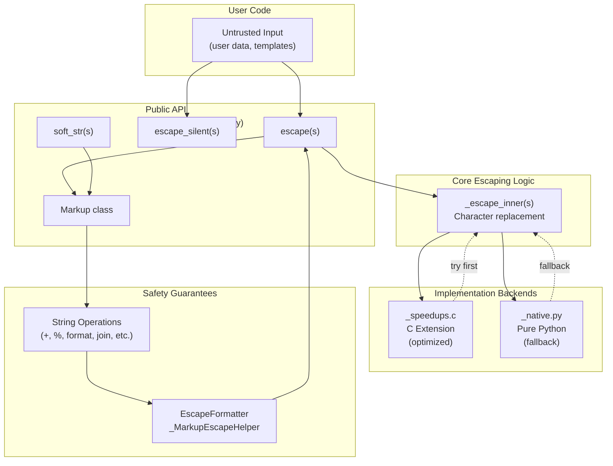

**Diagram: End-to-End Safety Pipeline**

This diagram shows how untrusted input flows through the public API to the escaping implementation, and how the `Markup` class maintains safety through operations.

**Sources:** [src/markupsafe/__init__.py:1-380]()

## Key Components

### Public API Layer

The library exposes a minimal, focused API surface:

| Component | Type | Purpose | Location |
|-----------|------|---------|----------|
| `escape()` | Function | Convert any object to escaped HTML | [__init__.py:24-45]() |
| `escape_silent()` | Function | Like `escape()` but treats `None` as empty string | [__init__.py:48-61]() |
| `soft_str()` | Function | Convert to string while preserving `Markup` safety | [__init__.py:64-81]() |
| `Markup` | Class | Safe string subclass with auto-escaping operations | [__init__.py:84-330]() |

**Sources:** [src/markupsafe/__init__.py:24-330]()

### Dual Implementation Strategy

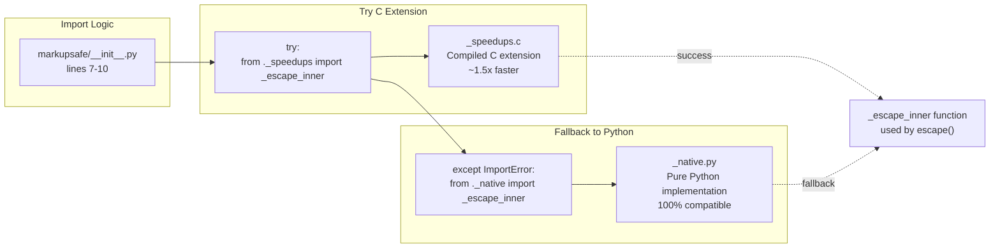

**Diagram: Implementation Selection at Import Time**

The library attempts to import the optimized C extension first, falling back to pure Python if unavailable. This ensures the library works everywhere while providing performance benefits where possible.

**Sources:** [src/markupsafe/__init__.py:7-10]()

### Escaping Mechanism

The core escaping operation replaces five special characters:

| Character | HTML Entity | Reason |
|-----------|-------------|--------|
| `&` | `&amp;` | Entity prefix |
| `<` | `&lt;` | Tag start |
| `>` | `&gt;` | Tag end |
| `'` | `&#39;` | Attribute quote |
| `"` | `&#34;` | Attribute quote |

The `_escape_inner()` function performs this replacement efficiently. The `escape()` function wraps this with additional logic:

1. Fast path for plain `str` objects: [__init__.py:39-40]()
2. `__html__()` protocol support: [__init__.py:42-43]()
3. String conversion for other types: [__init__.py:45]()

**Sources:** [src/markupsafe/__init__.py:24-45](), [README.md:14-33]()

## The Markup Class

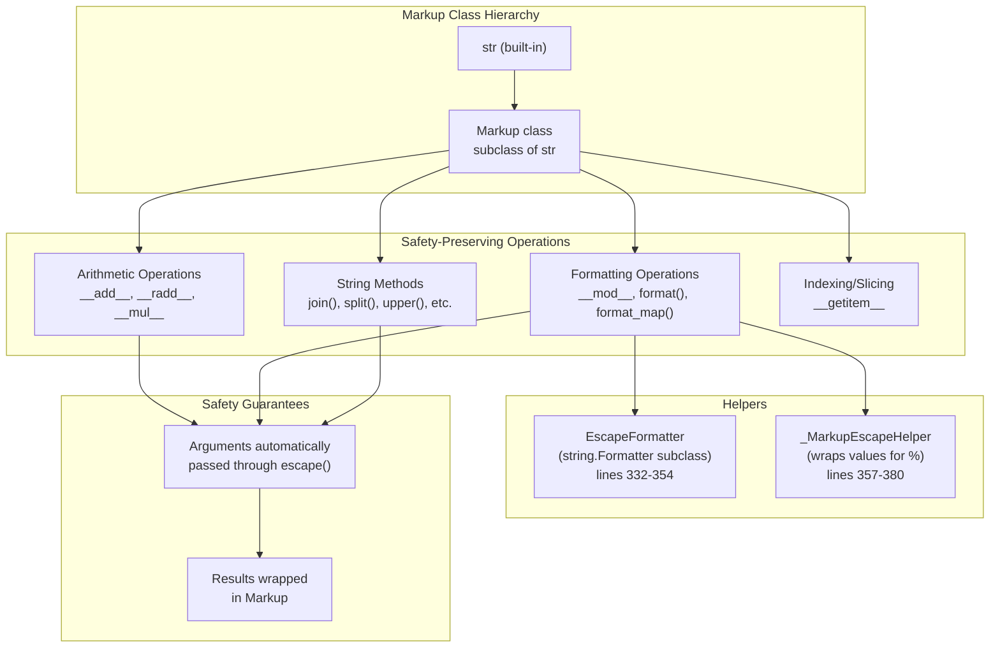

**Diagram: Markup Class Operation Safety**

The `Markup` class overrides `str` methods to ensure safety is preserved through all operations. Arguments are escaped, and results are wrapped as `Markup` instances.

**Sources:** [src/markupsafe/__init__.py:84-330]()

## Component Interaction Example

Here's how the components work together for a typical use case:

```mermaid
sequenceDiagram
    participant User as User Code
    participant Escape as escape()
    participant Inner as _escape_inner()
    participant Markup as Markup instance
    participant Format as EscapeFormatter
    
    User->>Escape: escape("<script>")
    Escape->>Inner: _escape_inner("<script>")
    Inner-->>Escape: "&lt;script&gt;"
    Escape->>Markup: Markup("&lt;script&gt;")
    Markup-->>User: safe string
    
    User->>Markup: template.format(name=unsafe)
    Markup->>Format: EscapeFormatter.vformat()
    Format->>Escape: escape(unsafe)
    Escape->>Inner: _escape_inner(str(unsafe))
    Inner-->>Escape: escaped string
    Escape-->>Format: Markup(escaped)
    Format-->>Markup: formatted string
    Markup-->>User: Markup(result)
```

**Diagram: Typical Usage Flow**

This sequence shows how `escape()`, `_escape_inner()`, `Markup`, and `EscapeFormatter` collaborate to maintain safety.

**Sources:** [src/markupsafe/__init__.py:24-324]()

## Implementation Comparison

| Aspect | C Extension (_speedups) | Pure Python (_native) |
|--------|------------------------|----------------------|
| **File** | `src/markupsafe/_speedups.c` | `src/markupsafe/_native.py` |
| **Performance** | ~1.5x faster (v3.0.0) | Baseline |
| **Availability** | Requires compilation | Always available |
| **Platforms** | Linux, macOS, Windows, ARM64, RISC-V | All Python platforms |
| **Unicode Handling** | Native CPython C API | Python string methods |
| **Import Priority** | Attempted first | Fallback only |
| **Multi-phase Init** | PEP 489 (v3.0.3+) | Standard module |

Both implementations provide identical functionality and API. The selection happens transparently at import time.

**Sources:** [src/markupsafe/__init__.py:7-10](), [CHANGES.rst:17-18](), [CHANGES.rst:63](), [CHANGES.rst:161-164]()

## Version Evolution

Key architectural milestones:

| Version | Release Date | Key Changes |
|---------|-------------|-------------|
| **3.0.0** | 2024-10-07 | Modern packaging (`pyproject.toml`), 40% faster escaping, deferred annotations |
| **2.1.0** | 2022-02-17 | Removed Python 3.6 support, removed deprecated `soft_unicode` |
| **2.0.0** | 2021-05-11 | Added type annotations, dropped Python 2.7 |
| **1.1.0** | 2018-11-05 | Multi-platform wheels, 1.5x speedup on Python 3 |
| **1.0** | 2017-03-07 | Added `__version__` attribute |

For detailed version history, see [Project History and Evolution](#1.1).

**Sources:** [CHANGES.rst:1-237]()

## Code Organization

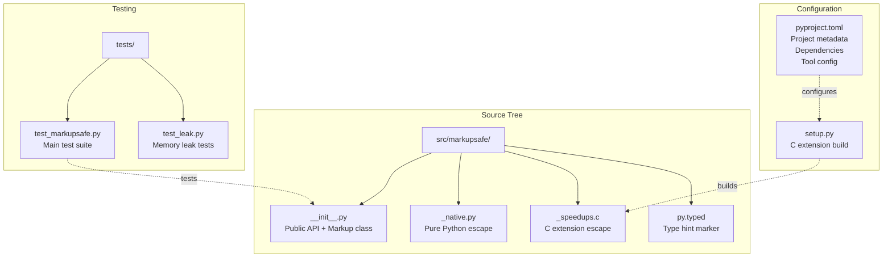

**Diagram: Repository Structure**

The codebase is organized with source in `src/markupsafe/`, configuration in the project root, and tests in a separate directory.

**Sources:** Repository structure analysis

## API Usage Patterns

### Basic Escaping

```python
# Direct escaping
from markupsafe import escape
escape("<div>")  # Returns: Markup('&lt;div&gt;')

# Handling None values
from markupsafe import escape_silent
escape_silent(None)  # Returns: Markup('') instead of Markup('None')
```

### Markup Operations

```python
# String concatenation
Markup("<b>Hello</b> ") + "<script>"
# Returns: Markup('<b>Hello</b> &lt;script&gt;')

# String formatting
Markup("<div>%s</div>") % "<script>"
# Returns: Markup('<div>&lt;script&gt;</div>')

# Modern formatting
Markup("<div>{}</div>").format("<script>")
# Returns: Markup('<div>&lt;script&gt;</div>')
```

### The __html__() Protocol

Objects implementing `__html__()` are treated as already-safe:

```python
class SafeComponent:
    def __html__(self):
        return "<div>Safe content</div>"

escape(SafeComponent())
# Returns: Markup('<div>Safe content</div>') - not escaped
```

**Sources:** [src/markupsafe/__init__.py:24-330](), [README.md:14-33]()

## Performance Characteristics

The library prioritizes safety over raw performance, but still achieves good performance through:

1. **Fast path for strings**: Direct type check avoids `__html__()` lookup for `str` objects [__init__.py:39-40]()
2. **C extension optimization**: ~40% faster string escaping in v3.0.0 [CHANGES.rst:63]()
3. **Minimal overhead**: `Markup` operations delegate to `str` base class where safe
4. **Memory efficiency**: No copying of already-safe `Markup` instances

For applications requiring maximum performance with mostly-safe content, the `Markup()` constructor marks content as safe without escaping.

**Sources:** [src/markupsafe/__init__.py:39-40](), [CHANGES.rst:63]()

## Thread Safety

As of version 3.0.0, MarkupSafe supports Python 3.13's experimental free-threaded build. The C extension uses multi-phase initialization (PEP 489) for proper module state isolation in multi-interpreter scenarios.

For detailed information about free-threading support, see [Free-Threading Support](#7.3).

**Sources:** [CHANGES.rst:17-18](), [CHANGES.rst:47]()

## Summary

MarkupSafe provides a focused solution to HTML/XML injection vulnerabilities through:

- **Minimal API**: `escape()`, `Markup`, and helpers
- **Automatic safety**: String operations preserve safe status  
- **Performance**: Dual implementation (C extension + pure Python)
- **Compatibility**: Works on all Python platforms
- **Type safety**: Full type annotations for static analysis

The architecture separates concerns cleanly: public API in `__init__.py`, core escaping in `_escape_inner()`, and platform-specific optimization through the dual backend strategy.

**Sources:** [src/markupsafe/__init__.py:1-380](), [README.md:1-51]()

---

# Page: Project History and Evolution

# Project History and Evolution

<details>
<summary>Relevant source files</summary>

The following files were used as context for generating this wiki page:

- [CHANGES.rst](CHANGES.rst)

</details>


This document traces the evolution of the MarkupSafe library from its initial release in 2011 through its current development. It covers major version releases, Python version support progression, architectural changes, API evolution, performance improvements, and platform expansion. For details on the current architecture and implementation, see [Implementation Architecture](#2.3). For build system specifics, see [Build System and Distribution](#3).

## Version Timeline Overview

MarkupSafe has undergone continuous development for over 13 years, evolving from a Python 2-era library to a modern, high-performance package supporting the latest Python versions including experimental features like free-threading.

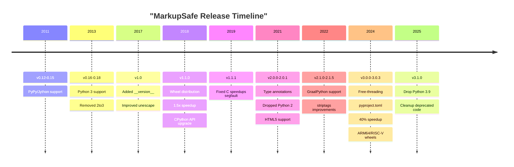

**Sources:** [CHANGES.rst:1-237]()

## Python Version Support Evolution

MarkupSafe's Python version support has continuously adapted to the evolving Python ecosystem, progressively dropping legacy versions while adding support for new releases.

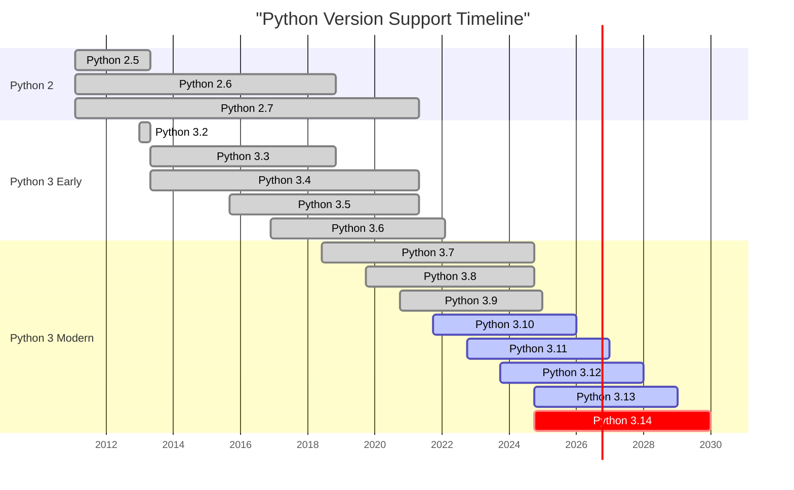

| Version | Added Support | Dropped Support | Notable Changes |
|---------|--------------|-----------------|-----------------|
| 0.16 | Python 3.x | Python 2.5, 3.2 | Removed 2to3, direct Python 3 support |
| 1.1.0 | - | Python 2.6, 3.3 | Wheel distribution begins |
| 2.0.0 | Type annotations | Python 2.7, 3.4, 3.5 | End of Python 2 era |
| 2.1.0 | GraalPython | Python 3.6 | - |
| 3.0.0 | Python 3.13, free-threading | Python 3.7, 3.8 | Experimental free-threading support |
| 3.0.3 | Python 3.14 wheels | - | Early Python 3.14 support |
| 3.1.0 | - | Python 3.9 | Cleanup of deprecated code |

**Sources:** [CHANGES.rst:6-7](), [CHANGES.rst:47-48](), [CHANGES.rst:117](), [CHANGES.rst:140]()

## Architectural Changes

The library's architecture has evolved significantly, particularly in its C extension implementation, build system, and initialization strategy.

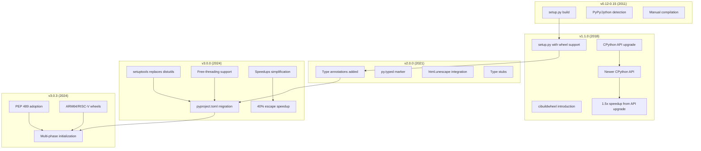

### Key Architectural Milestones

**Build System Evolution:**
- **v0.13-0.15 (2011)**: Added PyPy/Jython detection to skip C extension compilation on incompatible platforms
- **v1.1.0 (2018)**: Introduced wheel building for Linux, Mac, and Windows, eliminating need for local compilation
- **v3.0.0 (2024)**: Migrated from `setup.cfg` to `pyproject.toml`, replaced `distutils` with `setuptools`

**C Extension Implementation:**
- **v1.1.0 (2018)**: Upgraded to newer CPython API on Python 3, achieving 1.5x speedup
- **v1.1.1 (2019)**: Fixed critical segfault when `__html__` raises exceptions in C speedups
- **v3.0.0 (2024)**: Simplified speedups implementation, achieved additional 40% speedup for plain string escaping
- **v3.0.3 (2024)**: Adopted multi-phase initialization (PEP 489) for the C extension

**Type System:**
- **v2.0.0 (2021)**: Added comprehensive type annotations for static typing tools
- **v2.0.1 (2021)**: Fixed type exports for proper IDE/type checker recognition

**Sources:** [CHANGES.rst:161-167](), [CHANGES.rst:49-51](), [CHANGES.rst:17-18](), [CHANGES.rst:63-64]()

## API Evolution

The public API has evolved to maintain consistency with Python's `str` class while preserving HTML safety guarantees.

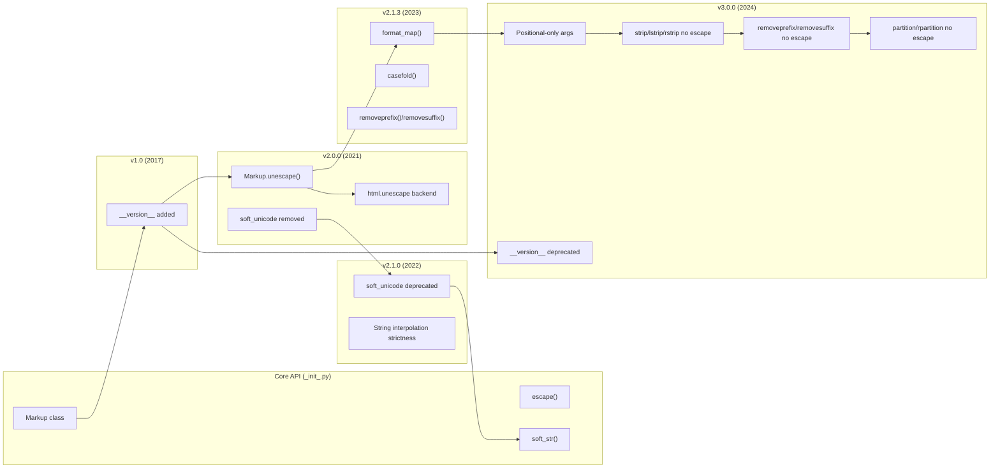

### Major API Changes by Version

**v1.0 (2017):**
- Added `__version__` module attribute for programmatic version checking
- Improved `unescape` to handle lone ampersands correctly

**v2.0.0 (2021):**
- `Markup.unescape()` now uses `html.unescape()` for HTML5 character reference support
- Removed `soft_unicode()`, replaced by `soft_str()`

**v2.1.0 (2022):**
- Raised error on missing single placeholder during string interpolation (stricter behavior)
- Disabled speedups module for GraalPython platform

**v2.1.3 (2023):**
- Implemented `format_map()`, `casefold()`, `removeprefix()`, and `removesuffix()` methods
- Fixed static typing for basic `str` methods on `Markup`
- Used `Self` type for annotating return types

**v3.0.0 (2024):**
- Updated method signatures to match `str` with positional-only arguments
- Changed behavior: `strip()`, `lstrip()`, `rstrip()`, `removeprefix()`, `removesuffix()`, `partition()`, and `rpartition()` no longer escape their arguments
- `replace()` only escapes the `new` argument
- Deprecated `__version__` attribute in favor of `importlib.metadata.version("markupsafe")`

**v3.1.0 (Unreleased):**
- Removes all previously deprecated code including `__version__`

**Sources:** [CHANGES.rst:53-62](), [CHANGES.rst:89-92](), [CHANGES.rst:118-122](), [CHANGES.rst:141-143](), [CHANGES.rst:176-177]()

## Performance Improvements

MarkupSafe has continuously improved performance through C extension optimizations and algorithm refinements.

| Version | Improvement | Details | Impact |
|---------|-------------|---------|--------|
| v1.1.0 (2018) | 1.5x speedup | Newer CPython API on Python 3 | Overall performance boost |
| v2.1.4 (2024) | `striptags` performance | Removed regex usage | Avoided pathological regex performance |
| v3.0.0 (2024) | 40% escape speedup | Optimized plain string escaping | Core operation significantly faster |
| v3.0.0 (2024) | Simplified speedups | Streamlined C extension implementation | Maintainability and reliability |

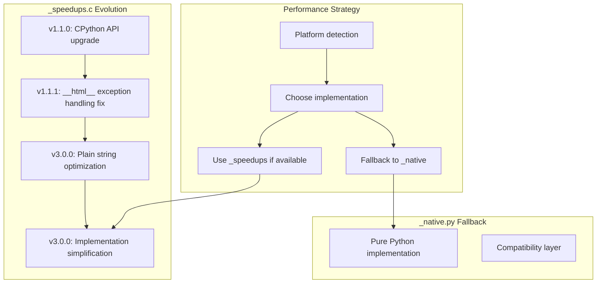

**Sources:** [CHANGES.rst:163-164](), [CHANGES.rst:80-81](), [CHANGES.rst:63-64]()

## Build System and Distribution Evolution

The build and distribution system has modernized significantly, expanding platform support and adopting contemporary Python packaging standards.

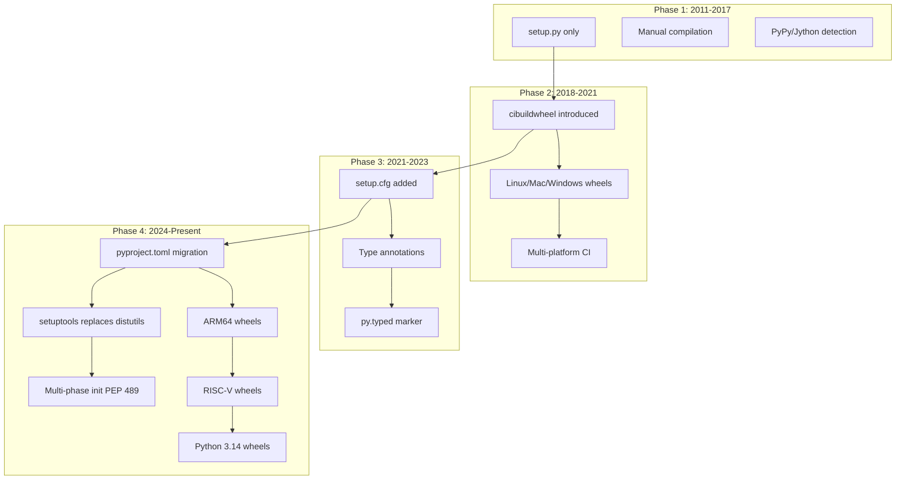

### Platform Support Expansion

**v0.13-0.15 (2011):** Initial platform compatibility work
- Added logic to skip C extension compilation on PyPy and Jython
- Addressed 64-bit Windows compilation issues

**v1.1.0 (2018):** Wheel distribution begins
- Built wheels for Linux, macOS, and Windows
- Enabled systems without compilers to use C extension speedups
- Leveraged cibuildwheel for automated multi-platform builds

**v3.0.3 (2024):** Extended architecture support
- Added Windows ARM64 wheel builds
- Added RISC-V 64-bit wheel builds
- Built Python 3.14 wheels ahead of official release

**v3.0.0 (2024):** Modern packaging
- Migrated from `setup.cfg` to `pyproject.toml` for project metadata
- Replaced `distutils` imports with `setuptools`
- Updated build requirements to setuptools >= 70.1

**Sources:** [CHANGES.rst:161-162](), [CHANGES.rst:19-21](), [CHANGES.rst:49-51](), [CHANGES.rst:227-229]()

## Free-Threading and Modern Python Features

Version 3.0.0 marked a significant milestone with support for Python 3.13's experimental features.

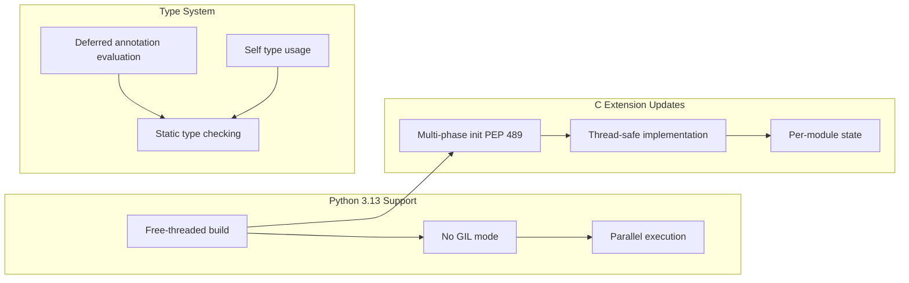

**v3.0.0 (2024):** Python 3.13 and free-threading
- Added support for Python 3.13's experimental free-threaded build
- Implemented deferred evaluation of type annotations
- Updated method signatures to use positional-only arguments

**v3.0.3 (2024):** C extension modernization
- Adopted multi-phase initialization (PEP 489) for the C extension module
- Improved compatibility with Python's evolving C API

**Sources:** [CHANGES.rst:47](), [CHANGES.rst:17-18](), [CHANGES.rst:52]()

## Bug Fixes and Stability Improvements

Throughout its history, MarkupSafe has maintained a strong focus on reliability and correctness.

### Critical Fixes

| Version | Issue | Fix Description |
|---------|-------|-----------------|
| v1.1.1 (2019) | C speedups segfault | Fixed exception propagation when `__html__()` raises |
| v2.1.1 (2022) | `striptags` regex ambiguity | Avoided ambiguous regex matches |
| v2.1.2 (2023) | `striptags` newlines | Fixed tags with newlines not being stripped |
| v2.1.4 (2024) | `striptags` performance | Removed regex to avoid performance issues |
| v2.1.5 (2024) | `striptags` whitespace | Fixed space collapsing behavior |
| v3.0.1 (2024) | GCC 14 compatibility | Addressed compiler warnings as errors |
| v3.0.1 (2024) | Proxy object compatibility | Fixed compatibility with proxy objects |
| v3.0.2 (2024) | `__str__` subclass | Fixed compatibility when `__str__` returns subclass |

### Version 0.x Era (2011-2017)
- v0.15: Fixed installation failures on PyPy and Jython
- v0.16-0.18: Fixed string operations on Python 3 including `__mul__` and string splitting
- v0.17: Fixed broken interpolation on tuples

**Sources:** [CHANGES.rst:151-152](), [CHANGES.rst:71-81](), [CHANGES.rst:100-109](), [CHANGES.rst:29](), [CHANGES.rst:38-39]()

## Summary: Evolution Themes

MarkupSafe's evolution can be characterized by several consistent themes:

1. **Platform Inclusivity**: From PyPy/Jython support to ARM64 and RISC-V wheels, continuous expansion of platform support

2. **Performance Focus**: Iterative C extension improvements delivering measurable speedups (1.5x in v1.1.0, 40% in v3.0.0)

3. **Modern Python Adoption**: Quick adoption of new Python features (type annotations, free-threading, PEP 489)

4. **API Consistency**: Evolving the `Markup` class to match `str` behavior while maintaining safety guarantees

5. **Build System Modernization**: From manual compilation to automated multi-platform wheel building with modern packaging standards

6. **Reliability**: Consistent focus on bug fixes, particularly around the `striptags()` function and C extension stability

The library has successfully transitioned from a Python 2-era package to a modern, high-performance library supporting cutting-edge Python features while maintaining backward compatibility and a stable API.

**Sources:** [CHANGES.rst:1-237]()

---

# Page: Core Library

# Core Library

<details>
<summary>Relevant source files</summary>

The following files were used as context for generating this wiki page:

- [CHANGES.rst](CHANGES.rst)
- [src/markupsafe/__init__.py](src/markupsafe/__init__.py)

</details>


## Purpose and Scope

The Core Library comprises the fundamental components of MarkupSafe that provide safe HTML/XML string handling through escaping and type marking. This page provides an overview of the main public API components, their relationships, and the high-level architecture.

For detailed information about specific components:
- For in-depth documentation of the `Markup` class and its methods, see [Public API: Markup Class](#2.1)
- For details about escape functions including `escape()`, `escape_silent()`, and `soft_str()`, see [Public API: Escape Functions](#2.2)
- For the dual implementation strategy (Python vs C extension), see [Implementation Architecture](#2.3)
- For helper classes used in formatting operations, see [String Formatters and Helper Classes](#2.4)

## Core Components Overview

The MarkupSafe core library consists of the following primary components located in [src/markupsafe/\_\_init\_\_.py:1-380]():

| Component | Type | Lines | Purpose |
|-----------|------|-------|---------|
| `Markup` | Class | 84-330 | Safe string type that prevents double-escaping |
| `escape()` | Function | 24-45 | Main HTML escaping function |
| `escape_silent()` | Function | 48-61 | Escapes with None handling |
| `soft_str()` | Function | 64-81 | String conversion preserving Markup |
| `EscapeFormatter` | Class | 332-354 | Safe string formatting using Python's format syntax |
| `_MarkupEscapeHelper` | Class | 357-380 | Helper for `%` string formatting |
| `_escape_inner` | Function | 8-10 | Core escaping implementation (imported) |

**Sources**: [src/markupsafe/\_\_init\_\_.py:1-380]()

## Component Architecture

The following diagram shows the structure of the core library components and their relationships:

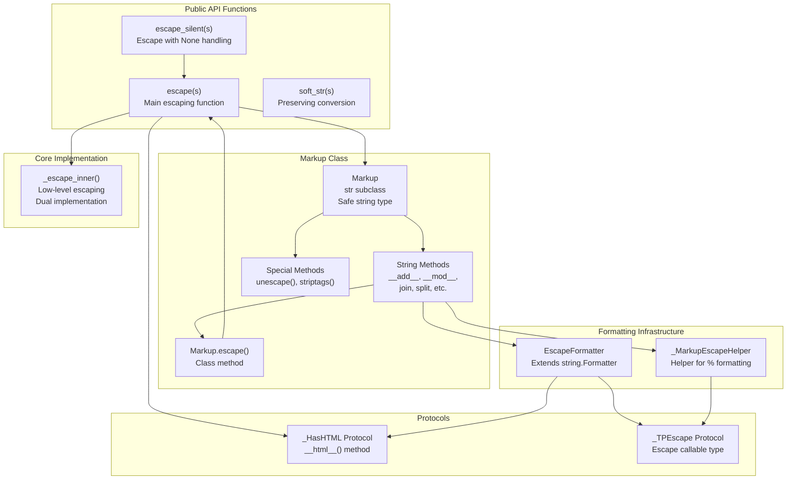

**Sources**: [src/markupsafe/\_\_init\_\_.py:1-380]()

## Data Flow: String Escaping

The following diagram illustrates how strings flow through the escaping system:

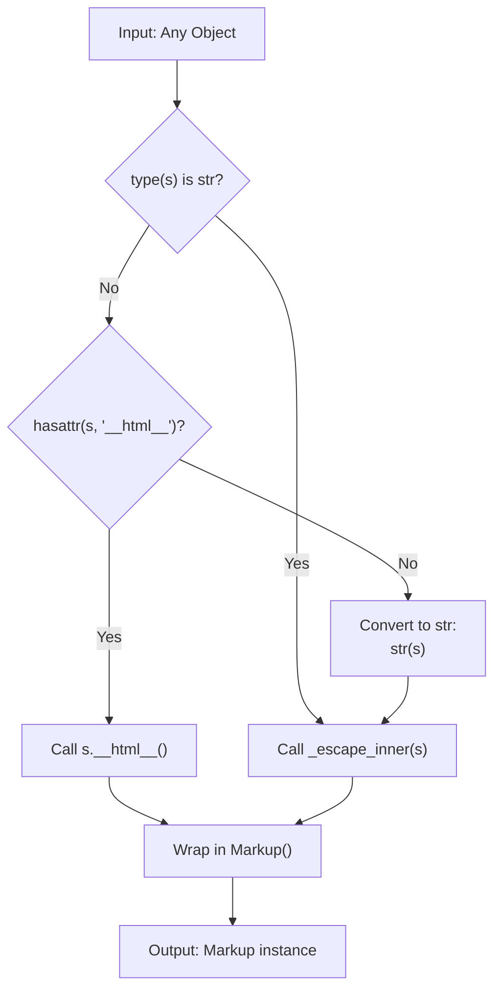

This flow is implemented in the `escape()` function at [src/markupsafe/\_\_init\_\_.py:24-45](). The optimization for plain `str` types (line 39) is the most common code path and avoids unnecessary checks.

**Sources**: [src/markupsafe/\_\_init\_\_.py:24-45]()

## Implementation Layer Strategy

MarkupSafe uses a dual implementation strategy for the core `_escape_inner` function:

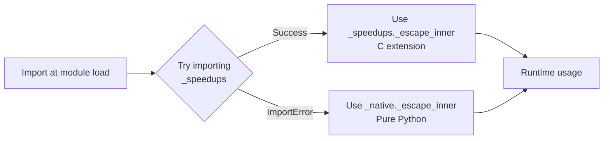

The import logic at [src/markupsafe/\_\_init\_\_.py:7-10]() attempts to load the optimized C extension first, falling back gracefully to the pure Python implementation if the C extension is unavailable. This ensures the library functions correctly on all platforms while providing performance benefits where possible.

**Sources**: [src/markupsafe/\_\_init\_\_.py:7-10]()

## The Markup Class Hierarchy

The `Markup` class inherits from Python's built-in `str` type and overrides many of its methods to maintain safety:

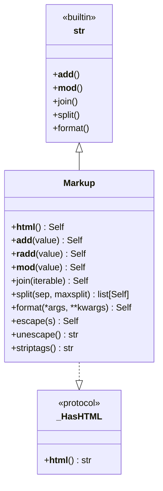

The `Markup` class at [src/markupsafe/\_\_init\_\_.py:84-330]() is designed to:

1. **Prevent double-escaping**: Once a string is wrapped in `Markup`, it is considered safe and won't be escaped again
2. **Escape inputs automatically**: Operations that add or format strings automatically escape untrusted inputs
3. **Preserve type**: Most string operations return `Markup` instances rather than plain `str`
4. **Support `__html__` protocol**: Objects can provide their own HTML representation

**Sources**: [src/markupsafe/\_\_init\_\_.py:16-17, 84-330]()

## Safe String Operations

The `Markup` class overrides string operations to maintain safety guarantees. The following table summarizes the escaping behavior:

| Operation | Method | Escapes Arguments? | Example |
|-----------|--------|-------------------|---------|
| Addition | `__add__`, `__radd__` | Yes | `Markup("a") + "b"` → `Markup("ab")` |
| Multiplication | `__mul__`, `__rmul__` | N/A | `Markup("a") * 3` → `Markup("aaa")` |
| Modulo formatting | `__mod__` | Yes | `Markup("%s") % "a"` → `Markup("a")` |
| Format strings | `format()` | Yes (via formatter) | `Markup("{}").format("a")` |
| Join | `join()` | Yes | `Markup(",").join(["a", "b"])` |
| Replace | `replace()` | Only new value | `Markup("a").replace("a", "b")` |
| Strip/search | `strip()`, `lstrip()`, etc. | No | Conceptually search operations |

The selective escaping behavior was refined in version 3.0.0 (see [CHANGES.rst:55-60]()). Methods conceptually linked to searching (`strip`, `partition`, `find`, etc.) do not escape their arguments, as escaping would break the search functionality.

**Sources**: [src/markupsafe/\_\_init\_\_.py:136-323](), [CHANGES.rst:55-60]()

## Formatting System

MarkupSafe provides two formatting systems that ensure safety:

### Format String Formatting

The `EscapeFormatter` class at [src/markupsafe/\_\_init\_\_.py:332-354]() extends Python's `string.Formatter` to:
- Call `__html_format__()` on objects that define it
- Call `__html__()` on objects without `__html_format__()` (but only if no format spec is given)
- Escape all other values through the standard formatter

Used by: `Markup.format()` and `Markup.format_map()`

### Percent Formatting

The `_MarkupEscapeHelper` class at [src/markupsafe/\_\_init\_\_.py:357-380]() wraps values for `%` formatting to:
- Support dict-like access for mapping-style formatting
- Convert values to strings while escaping them
- Support numeric conversions without escaping

Used by: `Markup.__mod__()`

**Sources**: [src/markupsafe/\_\_init\_\_.py:154-165, 313-323, 332-380]()

## Type Safety and Protocols

MarkupSafe uses Python type hints and protocols for type safety:

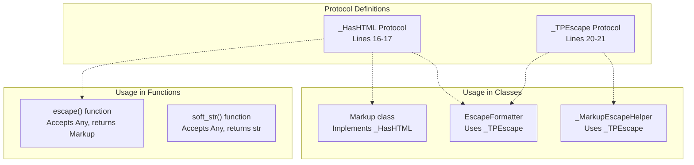

The `_HasHTML` protocol at [src/markupsafe/\_\_init\_\_.py:16-17]() defines the interface for objects that can provide their own HTML representation. The `_TPEscape` protocol at [src/markupsafe/\_\_init\_\_.py:20-21]() defines the signature for escape functions.

**Sources**: [src/markupsafe/\_\_init\_\_.py:16-21]()

## Key Design Principles

1. **Type-based safety**: The `Markup` type system prevents accidental double-escaping
2. **Explicit trust boundary**: Raw strings are untrusted; `Markup` instances are trusted
3. **Composability**: `Markup` objects can be safely combined with operations preserving safety
4. **Performance optimization**: Fast path for plain strings in `escape()` at [src/markupsafe/\_\_init\_\_.py:39-40]()
5. **Gradeful degradation**: Dual implementation allows C extension performance with Python fallback

**Sources**: [src/markupsafe/\_\_init\_\_.py:24-45, 84-119]()

## Evolution and Compatibility

Key changes to the core library documented in [CHANGES.rst:1-237]():

| Version | Changes |
|---------|---------|
| 3.0.0 | Changed escaping behavior for search-related methods, deferred type annotations, modernized signatures |
| 2.1.3 | Added `format_map()`, `casefold()`, `removeprefix()`, `removesuffix()` |
| 2.0.0 | Added type annotations, used `html.unescape()` for HTML5 entities |
| 1.1.0 | Wrapped `__html__` results in `Markup` consistently |
| 1.0 | Added `__version__` attribute |

The core API has remained stable while the implementation has been refined for performance and correctness.

**Sources**: [CHANGES.rst:1-237]()

---

# Page: Public API: Markup Class

# Public API: Markup Class

<details>
<summary>Relevant source files</summary>

The following files were used as context for generating this wiki page:

- [src/markupsafe/__init__.py](src/markupsafe/__init__.py)
- [tests/test_markupsafe.py](tests/test_markupsafe.py)

</details>


## Purpose and Scope

This document provides detailed technical documentation for the `Markup` class, the primary public API for safely handling HTML and XML strings in MarkupSafe. The `Markup` class is a specialized string subclass that marks content as safe for direct HTML output and automatically escapes unsafe content during string operations.

For documentation on the standalone escape functions (`escape()`, `escape_silent()`, `soft_str()`), see [2.2](#2.2). For details on the dual Python/C implementation architecture, see [2.3](#2.3). For information on the internal helper classes (`EscapeFormatter`, `_MarkupEscapeHelper`), see [2.4](#2.4).

## Overview

The `Markup` class is defined in [src/markupsafe/\_\_init\_\_.py:84-330]() as a subclass of Python's built-in `str` type. It represents a string that has been marked as safe for HTML/XML output, either because it was explicitly marked safe or because it was properly escaped.

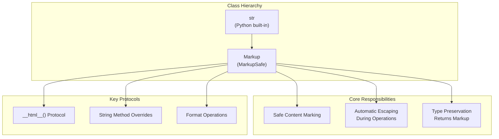

**Sources:** [src/markupsafe/\_\_init\_\_.py:84-330]()

## Creating Markup Instances

### Direct Constructor

The `Markup` constructor accepts any object and converts it to a safe string. The constructor implementation is in [src/markupsafe/\_\_init\_\_.py:122-131]().

**Constructor Signature:**
```python
Markup(object: Any = "", encoding: str | None = None, errors: str = "strict")
```

**Behavior:**
- If the object has an `__html__()` method, it calls that method and uses the returned string
- Otherwise, converts the object to a string
- Does **not** perform escaping - the content is marked as safe as-is
- Supports optional `encoding` and `errors` parameters for byte string decoding

**Example Usage:**
```python
Markup("Hello, <em>World</em>!")  # Returns: Markup('Hello, <em>World</em>!')
Markup(42)                         # Returns: Markup('42')
```

### Escape Class Method

The `Markup.escape()` class method [src/markupsafe/\_\_init\_\_.py:230-240]() creates a `Markup` instance by escaping the input, making it safe for HTML output.

**Signature:**
```python
@classmethod
Markup.escape(cls, s: Any) -> Self
```

**Behavior:**
- Calls the `escape()` function (documented in [2.2](#2.2))
- Ensures the correct subclass type is returned
- Escapes HTML special characters: `&`, `<`, `>`, `'`, `"`

**Example Usage:**
```python
Markup.escape("Hello, <em>World</em>!")  # Returns: Markup('Hello &lt;em&gt;World&lt;/em&gt;!')
```

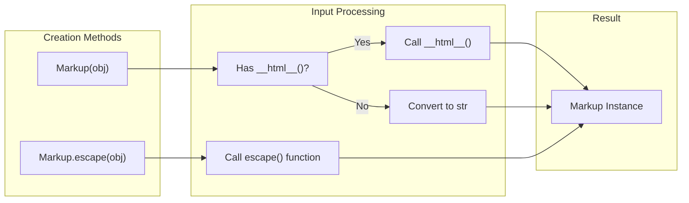

**Sources:** [src/markupsafe/\_\_init\_\_.py:122-131](), [src/markupsafe/\_\_init\_\_.py:230-240](), [tests/test_markupsafe.py:36-40]()

## The `__html__()` Protocol

The `Markup` class implements the `__html__()` protocol [src/markupsafe/\_\_init\_\_.py:133-134](), which is a convention used by various frameworks (Jinja2, Flask, etc.) to identify objects that can safely render as HTML.

**Implementation:**
```python
def __html__(self) -> Self:
    return self
```

The protocol is also recognized during construction - if an object passed to `Markup()` has an `__html__()` method, that method is called to obtain the safe HTML string [src/markupsafe/\_\_init\_\_.py:125-126]().

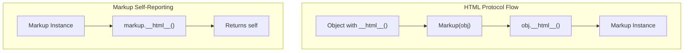

**Sources:** [src/markupsafe/\_\_init\_\_.py:125-126](), [src/markupsafe/\_\_init\_\_.py:133-134](), [tests/test_markupsafe.py:42-53]()

## String Operations and Safety Preservation

A key feature of `Markup` is that it overrides string operations to maintain HTML safety. Operations that combine `Markup` with other strings automatically escape the unsafe parts while preserving the safe parts.

### Arithmetic Operations

#### Addition (`__add__` and `__radd__`)

[src/markupsafe/\_\_init\_\_.py:136-146]()

```mermaid
graph LR
    subgraph "Left Addition: markup + value"
        Add["__add__(value)"]
        CheckType1["Is str or has __html__()?"]
        Escape1["escape(value)"]
        Concat1["Concatenate"]
        Result1["Markup Result"]
        
        Add --> CheckType1
        CheckType1 -->|"Yes"| Escape1
        CheckType1 -->|"No"| NotImpl1["NotImplemented"]
        Escape1 --> Concat1
        Concat1 --> Result1
    end
    
    subgraph "Right Addition: value + markup"
        RAdd["__radd__(value)"]
        CheckType2["Is str or has __html__()?"]
        Escape2["escape(value)"]
        Concat2["Concatenate"]
        Result2["Markup Result"]
        
        RAdd --> CheckType2
        CheckType2 -->|"Yes"| Escape2
        CheckType2 -->|"No"| NotImpl2["NotImplemented"]
        Escape2 --> Concat2
        Concat2 --> Result2
    end
```

**Behavior:**
- Accepts strings or objects with `__html__()`
- Automatically escapes the other operand using `self.escape()`
- Returns a `Markup` instance
- Returns `NotImplemented` for incompatible types

**Example:**
```python
Markup("<em>Hello</em> ") + "<foo>"  # Returns: Markup('<em>Hello</em> &lt;foo&gt;')
"<bar> " + Markup("<em>World</em>")  # Returns: Markup('&lt;bar&gt; <em>World</em>')
```

#### Multiplication (`__mul__` and `__rmul__`)

[src/markupsafe/\_\_init\_\_.py:148-152]()

**Behavior:**
- Repeats the markup string
- Returns a `Markup` instance
- No escaping needed (repeating safe content remains safe)

**Example:**
```python
Markup("<br>") * 3  # Returns: Markup('<br><br><br>')
```

**Sources:** [src/markupsafe/\_\_init\_\_.py:136-152](), [tests/test_markupsafe.py:13-16](), [tests/test_markupsafe.py:190-191]()

### String Interpolation (`__mod__`)

The `__mod__` method [src/markupsafe/\_\_init\_\_.py:154-165]() implements the `%` operator for string formatting, ensuring all interpolated values are escaped.

**Behavior:**
- Wraps single arguments in `_MarkupEscapeHelper`
- Wraps tuple elements individually
- Wraps mapping values with a single helper that handles item access
- All string conversions go through `_MarkupEscapeHelper.__str__()`, which applies escaping

```mermaid
graph TB
    subgraph "Modulo Operation: markup % value"
        ModOp["__mod__(value)"]
        TypeCheck{"value type?"}
        
        TupleCase["Tuple"]
        MappingCase["Mapping (dict)"]
        SingleCase["Single Value"]
        
        WrapTuple["Wrap each element<br/>in _MarkupEscapeHelper"]
        WrapMapping["Wrap mapping<br/>in _MarkupEscapeHelper"]
        WrapSingle["Wrap value in<br/>_MarkupEscapeHelper<br/>as single-element tuple"]
        
        SuperMod["Call str.__mod__()"]
        Result["Markup Result"]
        
        ModOp --> TypeCheck
        TypeCheck -->|"tuple"| TupleCase
        TypeCheck -->|"has __getitem__<br/>not str"| MappingCase
        TypeCheck -->|"other"| SingleCase
        
        TupleCase --> WrapTuple
        MappingCase --> WrapMapping
        SingleCase --> WrapSingle
        
        WrapTuple --> SuperMod
        WrapMapping --> SuperMod
        WrapSingle --> SuperMod
        SuperMod --> Result
    end
```

**Example:**
```python
Markup("<em>%s</em>") % "<bad user>"
# Returns: Markup('<em>&lt;bad user&gt;</em>')

Markup("<em>%(username)s</em>") % {"username": "<bad user>"}
# Returns: Markup('<em>&lt;bad user&gt;</em>')
```

**Sources:** [src/markupsafe/\_\_init\_\_.py:154-165](), [tests/test_markupsafe.py:19-34](), [tests/test_markupsafe.py:61-75]()

## String Manipulation Methods

The `Markup` class overrides numerous string methods to ensure they return `Markup` instances rather than plain strings. This preserves the "safe" marking through transformations.

### Methods Returning Markup

The following table categorizes the overridden methods by their operation type:

| Category | Methods | Line References |
|----------|---------|----------------|
| **Splitting** | `split()`, `rsplit()`, `splitlines()` | [173-186]() |
| **Partitioning** | `partition()`, `rpartition()` | [303-311]() |
| **Case Transformation** | `capitalize()`, `title()`, `lower()`, `upper()`, `swapcase()`, `casefold()` | [245-255](), [288-295]() |
| **Whitespace** | `strip()`, `lstrip()`, `rstrip()`, `expandtabs()` | [266-276](), [285-286]() |
| **Padding/Alignment** | `ljust()`, `rjust()`, `center()`, `zfill()` | [260-273](), [291-292]() |
| **Substitution** | `replace()`, `translate()` | [257-258](), [278-283]() |
| **Prefix/Suffix** | `removeprefix()`, `removesuffix()` | [297-301]() |
| **Indexing/Slicing** | `__getitem__()` | [242-243]() |

### Methods with Auto-Escaping

Some methods accept string arguments that are automatically escaped before the operation:

| Method | Escapes Argument | Line Reference |
|--------|------------------|----------------|
| `replace(old, new, count)` | `new` | [257-258]() |
| `ljust(width, fillchar)` | `fillchar` | [260-261]() |
| `rjust(width, fillchar)` | `fillchar` | [263-264]() |
| `center(width, fillchar)` | `fillchar` | [272-273]() |

### Join Method

The `join()` method [src/markupsafe/\_\_init\_\_.py:170-171]() is special - it takes an iterable and escapes each element before joining:

```python
def join(self, iterable: Iterable[str | _HasHTML]) -> Self:
    return self.__class__(super().join(map(self.escape, iterable)))
```

**Example:**
```python
Markup(", ").join(["<foo>", "<bar>", Markup("<safe>")])
# Returns: Markup('&lt;foo&gt;, &lt;bar&gt;, <safe>')
```

**Sources:** [src/markupsafe/\_\_init\_\_.py:170-287](), [tests/test_markupsafe.py:183-187]()

## Formatting Operations

### Format Method

The `format()` method [src/markupsafe/\_\_init\_\_.py:313-315]() and `format_map()` method [src/markupsafe/\_\_init\_\_.py:317-323]() use the `EscapeFormatter` class to safely format strings with positional and keyword arguments.

**Implementation:**
```python
def format(self, *args: Any, **kwargs: Any) -> Self:
    formatter = EscapeFormatter(self.escape)
    return self.__class__(formatter.vformat(self, args, kwargs))
```

**Behavior:**
- Creates an `EscapeFormatter` instance (documented in [2.4](#2.4))
- Checks for `__html_format__()` method on format values
- Falls back to `__html__()` method
- Escapes all other values
- Returns `Markup` instance

```mermaid
graph TB
    subgraph "Format Flow"
        FormatCall["markup.format(*args, **kwargs)"]
        CreateFormatter["Create EscapeFormatter"]
        ProcessField["Process Each Field"]
        
        CheckHTMLFormat{"Has __html_format__()?"}
        CheckHTML{"Has __html__()?"}
        DefaultFormat["Standard Format"]
        
        CallHTMLFormat["Call __html_format__(spec)"]
        CallHTML["Call __html__()"]
        
        Escape["Escape Result"]
        Result["Markup Result"]
        
        FormatCall --> CreateFormatter
        CreateFormatter --> ProcessField
        ProcessField --> CheckHTMLFormat
        
        CheckHTMLFormat -->|"Yes"| CallHTMLFormat
        CheckHTMLFormat -->|"No"| CheckHTML
        
        CheckHTML -->|"Yes"| CallHTML
        CheckHTML -->|"No"| DefaultFormat
        
        CallHTMLFormat --> Escape
        CallHTML --> Escape
        DefaultFormat --> Escape
        
        Escape --> Result
    end
```

**Example:**
```python
Markup("<em>{awesome}</em>").format(awesome="<awesome>")
# Returns: Markup('<em>&lt;awesome&gt;</em>')

Markup("{0}").format(Markup("<bar/>"))
# Returns: Markup('<bar/>')
```

### HTML Format Protocol

The `__html_format__()` method [src/markupsafe/\_\_init\_\_.py:325-329]() is called by formatters and must not accept format specifiers for `Markup` instances:

```python
def __html_format__(self, format_spec: str) -> Self:
    if format_spec:
        raise ValueError("Unsupported format specification for Markup.")
    return self
```

**Sources:** [src/markupsafe/\_\_init\_\_.py:313-329](), [tests/test_markupsafe.py:107-126](), [tests/test_markupsafe.py:128-167]()

## Special Methods

### Unescape

The `unescape()` method [src/markupsafe/\_\_init\_\_.py:188-197]() converts escaped HTML entities back to their character representations:

```python
def unescape(self) -> str:
    """Convert escaped markup back into a text string."""
    from html import unescape
    return unescape(str(self))
```

**Behavior:**
- Uses Python's built-in `html.unescape()`
- Returns a plain `str`, not `Markup` (unescaped content is no longer safe)
- Converts named and numeric character references

**Example:**
```python
Markup("&lt;test&gt;").unescape()  # Returns: '<test>'
Markup("&amp;foo&#x3b;").unescape()  # Returns: '&foo;'
```

### Striptags

The `striptags()` method [src/markupsafe/\_\_init\_\_.py:199-228]() removes HTML tags and normalizes whitespace:

```python
def striptags(self) -> str:
    """:meth:`unescape` the markup, remove tags, and normalize whitespace."""
```

**Algorithm:**
1. Find and remove HTML comments (`<!-- ... -->`)
2. Find and remove all HTML/XML tags (`<...>`)
3. Collapse consecutive whitespace to single spaces
4. Unescape HTML entities

**Example:**
```python
Markup("Main &raquo;\t<em>About</em>").striptags()
# Returns: 'Main » About'
```

**Sources:** [src/markupsafe/\_\_init\_\_.py:188-228](), [tests/test_markupsafe.py:77-89](), [tests/test_markupsafe.py:92-105]()

## Representation

The `__repr__()` method [src/markupsafe/\_\_init\_\_.py:167-168]() provides a clear representation showing the type:

```python
def __repr__(self) -> str:
    return f"{self.__class__.__name__}({super().__repr__()})"
```

**Example:**
```python
repr(Markup("test"))  # Returns: "Markup('test')"
```

## Method Reference Summary

### Construction and Conversion

| Method/Function | Returns | Description |
|----------------|---------|-------------|
| `Markup(obj)` | `Markup` | Create from object, using `__html__()` if available |
| `Markup.escape(s)` | `Markup` | Create by escaping HTML special characters |
| `__html__()` | `Self` | Protocol method returning self |
| `unescape()` | `str` | Convert HTML entities back to characters |
| `striptags()` | `str` | Remove tags and normalize whitespace |

### String Operations

| Operation | Method | Auto-Escapes | Returns |
|-----------|--------|--------------|---------|
| `markup + str` | `__add__()` | Yes | `Markup` |
| `str + markup` | `__radd__()` | Yes | `Markup` |
| `markup * n` | `__mul__()` | N/A | `Markup` |
| `markup % value` | `__mod__()` | Yes | `Markup` |
| `markup.format()` | `format()` | Yes | `Markup` |
| `markup.join(iter)` | `join()` | Yes | `Markup` |
| `markup[i:j]` | `__getitem__()` | N/A | `Markup` |

### Transformation Methods

All these methods return `Markup` instances:

- **Splitting:** `split()`, `rsplit()`, `splitlines()`, `partition()`, `rpartition()`
- **Case:** `capitalize()`, `title()`, `lower()`, `upper()`, `swapcase()`, `casefold()`
- **Whitespace:** `strip()`, `lstrip()`, `rstrip()`, `expandtabs()`
- **Padding:** `ljust()`, `rjust()`, `center()`, `zfill()`
- **Editing:** `replace()`, `removeprefix()`, `removesuffix()`, `translate()`

## Type Safety Diagram

```mermaid
graph TB
    subgraph "Safety Preservation Chain"
        Input["Input: Mixed Safe/Unsafe"]
        Operation["String Operation"]
        Detection["Type Detection"]
        
        SafePath["Safe Content<br/>(Markup, __html__())"]
        UnsafePath["Unsafe Content<br/>(str, other)"]
        
        PreserveSafe["Preserve as-is"]
        EscapeUnsafe["Apply escape()"]
        
        Combine["Combine Results"]
        Output["Output: Markup<br/>(All Safe)"]
        
        Input --> Operation
        Operation --> Detection
        Detection --> SafePath
        Detection --> UnsafePath
        
        SafePath --> PreserveSafe
        UnsafePath --> EscapeUnsafe
        
        PreserveSafe --> Combine
        EscapeUnsafe --> Combine
        Combine --> Output
    end
```

**Sources:** [src/markupsafe/\_\_init\_\_.py:84-330](), [tests/test_markupsafe.py:1-209]()

---

# Page: Public API: Escape Functions

# Public API: Escape Functions

<details>
<summary>Relevant source files</summary>

The following files were used as context for generating this wiki page:

- [src/markupsafe/__init__.py](src/markupsafe/__init__.py)
- [tests/conftest.py](tests/conftest.py)
- [tests/test_escape.py](tests/test_escape.py)
- [tests/test_markupsafe.py](tests/test_markupsafe.py)

</details>


## Purpose and Scope

This document describes the three public escape functions provided by MarkupSafe: `escape()`, `escape_silent()`, and `soft_str()`. These functions are the primary interface for converting arbitrary Python objects into HTML-safe strings. For information about the `Markup` class that these functions return, see [Public API: Markup Class](#2.1). For details on the underlying implementation, see [Implementation Architecture](#2.3).

**Sources:** [src/markupsafe/__init__.py:24-81]()

---

## Function Overview

MarkupSafe provides three utility functions for handling HTML escaping, each with a specific purpose:

| Function | Signature | Purpose | None Handling |
|----------|-----------|---------|---------------|
| `escape()` | `escape(s: t.Any, /) -> Markup` | Standard HTML escaping | Converts to string `'None'` |
| `escape_silent()` | `escape_silent(s: t.Any \| None, /) -> Markup` | Escape with None-safe behavior | Returns empty `Markup('')` |
| `soft_str()` | `soft_str(s: t.Any, /) -> str` | String conversion preserving Markup | N/A - preserves type |

All three functions are exported from the `markupsafe` module and are available at the top level.

**Sources:** [src/markupsafe/__init__.py:24-81]()

---

## The `escape()` Function

### Function Signature and Purpose

```python
def escape(s: t.Any, /) -> Markup
```

The `escape()` function replaces the characters `&`, `<`, `>`, `'`, and `"` with HTML-safe sequences. This is the primary function for making arbitrary text safe to insert into HTML documents.

**Sources:** [src/markupsafe/__init__.py:24-45]()

### Escape Flow Diagram

```mermaid
graph TB
    Input["escape(s)"]
    TypeCheck{"type(s) is str?"}
    PlainString["Plain string path"]
    HTMLCheck{"hasattr(s, '__html__')?"}
    CallHTML["Call s.__html__()"]
    ConvertStr["Convert str(s)"]
    EscapeInner1["_escape_inner(s)"]
    EscapeInner2["_escape_inner(str(s))"]
    WrapMarkup1["Markup(escaped)"]
    WrapMarkup2["Markup(__html__ result)"]
    Return["Return Markup"]
    
    Input --> TypeCheck
    TypeCheck -->|"Yes"| PlainString
    TypeCheck -->|"No"| HTMLCheck
    PlainString --> EscapeInner1
    HTMLCheck -->|"Yes"| CallHTML
    HTMLCheck -->|"No"| ConvertStr
    CallHTML --> WrapMarkup2
    ConvertStr --> EscapeInner2
    EscapeInner1 --> WrapMarkup1
    EscapeInner2 --> WrapMarkup1
    WrapMarkup1 --> Return
    WrapMarkup2 --> Return
```

**Sources:** [src/markupsafe/__init__.py:35-45]()

### Character Escape Mapping

The `escape()` function replaces the following characters with their HTML entity equivalents:

| Character | Escaped As | Decimal Code | Description |
|-----------|------------|--------------|-------------|
| `"` | `&#34;` | `&#34;` | Double quote |
| `&` | `&amp;` | `&amp;` | Ampersand |
| `'` | `&#39;` | `&#39;` | Single quote/apostrophe |
| `<` | `&lt;` | `&lt;` | Less than |
| `>` | `&gt;` | `&gt;` | Greater than |

These five characters are the minimum set required to prevent HTML injection attacks and ensure proper rendering of text within HTML contexts.

**Sources:** [tests/test_markupsafe.py:77-78](), [tests/test_escape.py:11-34]()

### Type Handling Strategies

The `escape()` function uses three different strategies depending on the input type:

#### 1. Plain String Fast Path

```python
if type(s) is str:
    return Markup(_escape_inner(s))
```

Uses `type(s) is str` (not `isinstance()`) to avoid proxy objects that may report incorrect `__class__` attributes. This is the most common case and is optimized for performance.

**Sources:** [src/markupsafe/__init__.py:39-40]()

#### 2. `__html__()` Protocol

```python
if hasattr(s, "__html__"):
    return Markup(s.__html__())
```

If the object implements the `__html__()` method, the function assumes the return value is already HTML-safe. This enables framework integration and custom HTML-aware objects.

**Sources:** [src/markupsafe/__init__.py:42-43]()

#### 3. String Conversion Path

```python
return Markup(_escape_inner(str(s)))
```

For all other objects, the function converts to string using `str()` and then escapes the result.

**Sources:** [src/markupsafe/__init__.py:45]()

### Proxy Object Handling

The function explicitly uses `type(s) is str` instead of `isinstance(s, str)` to handle proxy objects correctly. Some proxy implementations override `__class__` to report the proxied type, which would bypass escaping if `isinstance()` were used.

**Sources:** [src/markupsafe/__init__.py:37-38](), [tests/test_escape.py:37-55]()

---

## The `escape_silent()` Function

### Function Signature and Purpose

```python
def escape_silent(s: t.Any | None, /) -> Markup
```

The `escape_silent()` function is identical to `escape()` except it treats `None` as the empty string rather than converting it to the string `'None'`. This is useful when working with optional values.

**Sources:** [src/markupsafe/__init__.py:48-61]()

### Behavior Comparison

```mermaid
graph LR
    subgraph "escape(None)"
        E1["Input: None"]
        E2["str(None) = 'None'"]
        E3["Markup('None')"]
        E1 --> E2 --> E3
    end
    
    subgraph "escape_silent(None)"
        ES1["Input: None"]
        ES2["Check: s is None"]
        ES3["Markup('')"]
        ES1 --> ES2 --> ES3
    end
    
    subgraph "For non-None values"
        N1["Input: value"]
        N2["escape(value)"]
        N3["Same result"]
        N1 --> N2 --> N3
    end
```

**Sources:** [src/markupsafe/__init__.py:48-61]()

### Implementation

```python
def escape_silent(s: t.Any | None, /) -> Markup:
    if s is None:
        return Markup()
    
    return escape(s)
```

The function performs a simple `None` check and returns an empty `Markup` instance if the input is `None`. For all other values, it delegates to `escape()`.

**Sources:** [src/markupsafe/__init__.py:58-61](), [tests/test_markupsafe.py:177-180]()

---

## The `soft_str()` Function

### Function Signature and Purpose

```python
def soft_str(s: t.Any, /) -> str
```

The `soft_str()` function converts an object to a string if it isn't already, but preserves `Markup` instances rather than converting them back to basic strings. This prevents double-escaping when working with already-safe markup.

**Sources:** [src/markupsafe/__init__.py:64-81]()

### Type Preservation Behavior

```mermaid
graph TB
    Input["soft_str(s)"]
    IsStr{"isinstance(s, str)?"}
    ReturnAsIs["Return s as-is<br/>(preserves Markup type)"]
    ConvertStr["Return str(s)"]
    
    Input --> IsStr
    IsStr -->|"Yes<br/>(includes Markup)"| ReturnAsIs
    IsStr -->|"No"| ConvertStr
```

**Sources:** [src/markupsafe/__init__.py:78-81]()

### Use Case: Avoiding Double-Escaping

The primary use case for `soft_str()` is to avoid double-escaping when combining `Markup` objects with the `escape()` function:

```python
# Without soft_str - causes double escaping:
value = escape("<User 1>")  # Markup('&lt;User 1&gt;')
escape(str(value))          # Markup('&amp;lt;User 1&amp;gt;')  # Double-escaped!

# With soft_str - preserves existing escaping:
value = escape("<User 1>")  # Markup('&lt;User 1&gt;')
escape(soft_str(value))     # Markup('&lt;User 1&gt;')  # Correctly preserved
```

**Sources:** [src/markupsafe/__init__.py:70-76](), [tests/test_markupsafe.py:205-208]()

### Return Type Behavior

| Input Type | Output Type | Notes |
|------------|-------------|-------|
| `str` (plain) | `str` | Returns the same string |
| `Markup` | `Markup` | Preserves the Markup type |
| Any other object | `str` | Converts via `str()` |

**Sources:** [tests/test_markupsafe.py:205-208]()

---

## Implementation Integration

### Relationship with `_escape_inner()`

```mermaid
graph TB
    subgraph "Public API Layer"
        EscapeFunc["escape()"]
        EscapeSilent["escape_silent()"]
    end
    
    subgraph "Implementation Layer"
        EscapeInner["_escape_inner()"]
    end
    
    subgraph "Dual Implementation"
        Native["_native._escape_inner<br/>(Pure Python)"]
        Speedups["_speedups._escape_inner<br/>(C Extension)"]
    end
    
    subgraph "Return Type"
        MarkupClass["Markup class"]
    end
    
    EscapeFunc -->|"Calls"| EscapeInner
    EscapeSilent -->|"Delegates to"| EscapeFunc
    
    EscapeInner -.->|"Import fallback"| Native
    EscapeInner -.->|"Preferred"| Speedups
    
    EscapeFunc -->|"Wraps result in"| MarkupClass
    EscapeSilent -->|"Returns"| MarkupClass
```

**Sources:** [src/markupsafe/__init__.py:7-10](), [src/markupsafe/__init__.py:24-61]()

### Import Strategy

The module attempts to import the C extension's `_escape_inner()` function first, falling back to the pure Python implementation if the C extension is unavailable:

```python
try:
    from ._speedups import _escape_inner
except ImportError:
    from ._native import _escape_inner
```

This dual-implementation strategy provides optimal performance when the C extension is available while maintaining full functionality when it is not. For more details, see [Implementation Architecture](#2.3).

**Sources:** [src/markupsafe/__init__.py:7-10]()

---

## Testing Coverage

### Test Matrix for `escape()`

The test suite validates `escape()` against various character types and edge cases:

| Test Case | Input Example | Expected Behavior |
|-----------|---------------|-------------------|
| Empty string | `""` | Returns `Markup("")` |
| ASCII with special chars | `"abcd&><'\"efgh"` | All five characters escaped |
| 2-byte Unicode | `"こんにちは&><'\""` | Special chars escaped, Unicode preserved |
| 4-byte Unicode (emoji) | `"\U0001f363&><'\""` | Special chars escaped, emoji preserved |
| `__html__()` protocol | Object with `__html__()` | Calls method, wraps result |
| Proxy objects | Proxy with `__class__` override | Uses `type()` check to escape correctly |
| Subclasses of `str` | `ReferenceStr("test")` | Handles non-standard `str()` behavior |

**Sources:** [tests/test_escape.py:11-68](), [tests/test_markupsafe.py:42-53](), [tests/test_markupsafe.py:194-202]()

### Test Verification for `escape_silent()`

The test suite verifies the distinct behavior between `escape()` and `escape_silent()` when handling `None`:

```python
assert escape_silent(None) == Markup()      # Returns empty Markup
assert escape(None) == Markup(None)         # Returns Markup('None')
assert escape_silent("<foo>") == Markup("&lt;foo&gt;")  # Normal escaping
```

**Sources:** [tests/test_markupsafe.py:177-180]()

### Type Preservation Tests for `soft_str()`

The test suite validates that `soft_str()` preserves type information correctly:

```python
assert type(soft_str("")) is str          # Plain string stays str
assert type(soft_str(Markup())) is Markup # Markup stays Markup
assert type(soft_str(15)) is str          # Non-string converts to str
```

**Sources:** [tests/test_markupsafe.py:205-208]()

---

## Function Selection Guide

### Decision Tree

```mermaid
graph TD
    Start["Need to convert<br/>value for HTML?"]
    NoneCheck{"Might value<br/>be None?"}
    PreserveMarkup{"Already have<br/>Markup that should<br/>stay escaped?"}
    
    UseEscape["Use escape()"]
    UseEscapeSilent["Use escape_silent()"]
    UseSoftStr["Use soft_str()<br/>then escape()"]
    
    Start --> NoneCheck
    NoneCheck -->|"No"| PreserveMarkup
    NoneCheck -->|"Yes, want empty"| UseEscapeSilent
    NoneCheck -->|"Yes, 'None' OK"| PreserveMarkup
    
    PreserveMarkup -->|"Yes"| UseSoftStr
    PreserveMarkup -->|"No"| UseEscape
```

**Sources:** [src/markupsafe/__init__.py:24-81]()

### Common Patterns

| Scenario | Recommended Function | Example |
|----------|---------------------|---------|
| User input | `escape()` | `escape(request.form['name'])` |
| Optional template variables | `escape_silent()` | `escape_silent(user.middle_name)` |
| Combining escaped strings | `soft_str()` + `escape()` | `escape(soft_str(markup_obj))` |
| Already-safe HTML | Constructor | `Markup("<em>safe</em>")` |

**Sources:** [src/markupsafe/__init__.py:24-81]()

---

# Page: Implementation Architecture

# Implementation Architecture

<details>
<summary>Relevant source files</summary>

The following files were used as context for generating this wiki page:

- [bench.py](bench.py)
- [setup.py](setup.py)
- [src/markupsafe/__init__.py](src/markupsafe/__init__.py)
- [src/markupsafe/_native.py](src/markupsafe/_native.py)
- [src/markupsafe/_speedups.c](src/markupsafe/_speedups.c)
- [src/markupsafe/_speedups.pyi](src/markupsafe/_speedups.pyi)

</details>


## Purpose and Scope

This document describes the dual implementation architecture of MarkupSafe's core escaping functionality. The library provides both a pure Python implementation and an optimized C extension, with automatic fallback to ensure compatibility across all Python platforms. This page covers:

- The import mechanism that selects between implementations
- Details of the pure Python `_native` module
- Details of the C extension `_speedups` module
- How both implementations integrate with the public API
- Build-time fallback logic

For details on the public-facing `Markup` class and `escape()` function that use these implementations, see [Public API: Markup Class](#2.1) and [Public API: Escape Functions](#2.2). For build system configuration, see [C Extension Build Process](#3.2).

## Architecture Overview

MarkupSafe employs a dual implementation strategy where critical escaping logic exists in two forms:

| Component | Type | Purpose | Availability |
|-----------|------|---------|--------------|
| `_native._escape_inner()` | Pure Python | Fallback implementation | Always available |
| `_speedups._escape_inner()` | C Extension | Optimized implementation | Only when compiled |

Both implementations expose an identical interface: a function named `_escape_inner()` that takes a string and returns an escaped string.

```mermaid
graph TB
    subgraph "Public API Layer"
        EscapeFunc["escape(s)<br/>markupsafe/__init__.py:24-45"]
        MarkupClass["Markup class<br/>markupsafe/__init__.py:84-330"]
    end
    
    subgraph "Implementation Selection"
        ImportLogic["Import Logic<br/>markupsafe/__init__.py:7-10"]
    end
    
    subgraph "Pure Python Implementation"
        NativeModule["_native module<br/>src/markupsafe/_native.py"]
        NativeEscape["_escape_inner(s)<br/>_native.py:1-8"]
    end
    
    subgraph "C Extension Implementation"
        SpeedupsModule["_speedups module<br/>src/markupsafe/_speedups.c"]
        SpeedupsEscape["_escape_inner(s)<br/>_speedups.c:152-171"]
        Kind1["escape_unicode_kind1<br/>_speedups.c:75-98"]
        Kind2["escape_unicode_kind2<br/>_speedups.c:101-123"]
        Kind4["escape_unicode_kind4<br/>_speedups.c:127-149"]
    end
    
    ImportLogic -->|"try"| SpeedupsModule
    ImportLogic -->|"except ImportError"| NativeModule
    SpeedupsModule --> SpeedupsEscape
    SpeedupsEscape --> Kind1
    SpeedupsEscape --> Kind2
    SpeedupsEscape --> Kind4
    NativeModule --> NativeEscape
    
    EscapeFunc --> ImportLogic
    MarkupClass --> EscapeFunc
    
    style ImportLogic fill:#f9f9f9
    style SpeedupsModule fill:#e8f4f8
    style NativeModule fill:#fff4e6
```

**Sources:** [src/markupsafe/__init__.py:7-10](), [src/markupsafe/_native.py:1-8](), [src/markupsafe/_speedups.c:152-171]()

## Import Mechanism and Fallback

The import logic in [src/markupsafe/__init__.py:7-10]() implements a simple try-except pattern:

```python
try:
    from ._speedups import _escape_inner
except ImportError:
    from ._native import _escape_inner
```

This mechanism:
1. **First attempts** to import `_escape_inner` from the compiled C extension (`_speedups`)
2. **Falls back** to the pure Python implementation (`_native`) if the C extension is unavailable
3. **Exposes a single name** (`_escape_inner`) regardless of which implementation is loaded

### Import Failure Scenarios

The C extension import fails in several scenarios:

| Scenario | Cause | Resolution |
|----------|-------|------------|
| Platform incompatibility | PyPy, Jython, GraalVM | Falls back to `_native` |
| Compilation failure | Missing compiler, incompatible toolchain | Falls back to `_native` |
| Build disabled | `MARKUPSAFE_BUILD_FORCE_PURE=1` environment variable | Falls back to `_native` |
| Import-time error | Corrupted binary, ABI mismatch | Falls back to `_native` |

The fallback is completely transparent to consuming code—both implementations expose identical function signatures.

```mermaid
flowchart TD
    Start["Module Import:<br/>import markupsafe"]
    TrySpeedups["Try: from ._speedups<br/>import _escape_inner"]
    SpeedupsSuccess["_speedups loaded<br/>C implementation active"]
    ImportError["ImportError raised"]
    TryNative["from ._native<br/>import _escape_inner"]
    NativeSuccess["_native loaded<br/>Python implementation active"]
    End["_escape_inner available<br/>to public API"]
    
    Start --> TrySpeedups
    TrySpeedups -->|"Success"| SpeedupsSuccess
    TrySpeedups -->|"Failure"| ImportError
    ImportError --> TryNative
    TryNative --> NativeSuccess
    SpeedupsSuccess --> End
    NativeSuccess --> End
```

**Sources:** [src/markupsafe/__init__.py:7-10]()

## Pure Python Implementation (_native)

The pure Python implementation in [src/markupsafe/_native.py]() provides a straightforward, portable escape function.

### Implementation Details

The `_escape_inner()` function [src/markupsafe/_native.py:1-8]() uses chained `str.replace()` calls:

```python
def _escape_inner(s: str, /) -> str:
    return (
        s.replace("&", "&amp;")
        .replace(">", "&gt;")
        .replace("<", "&lt;")
        .replace("'", "&#39;")
        .replace('"', "&#34;")
    )
```

### Character Mapping

| Input Character | Output Sequence | Purpose |
|----------------|-----------------|---------|
| `&` | `&amp;` | Escape existing entities |
| `>` | `&gt;` | Close tags |
| `<` | `&lt;` | Open tags |
| `'` | `&#39;` | Single quotes (numeric entity) |
| `"` | `&#34;` | Double quotes (numeric entity) |

### Order of Operations

The replacement order is critical: `&` must be replaced first to avoid double-escaping other entities. For example:
- Input: `<tag>`
- If `<` replaced first: `&lt;tag>` → `&amp;lt;tag&gt;` (incorrect)
- If `&` replaced first: `<tag>` → `&lt;tag&gt;` (correct)

### Characteristics

| Aspect | Details |
|--------|---------|
| **Performance** | O(n) per replacement, total O(5n) worst case |
| **Memory** | Creates new string object for each replacement |
| **Compatibility** | Works on all Python implementations |
| **Dependencies** | None (pure Python) |

**Sources:** [src/markupsafe/_native.py:1-8]()

## C Extension Implementation (_speedups)

The C extension in [src/markupsafe/_speedups.c]() provides optimized escaping with single-pass processing and Unicode-aware handling.

### Module Structure

```mermaid
graph TB
    subgraph "C Module: _speedups"
        ModuleInit["PyInit__speedups()<br/>_speedups.c:197-200"]
        ModuleDef["module_definition<br/>_speedups.c:188-194"]
        ModuleMethods["module_methods[]<br/>_speedups.c:173-176"]
        ModuleSlots["module_slots[]<br/>_speedups.c:178-186"]
    end
    
    subgraph "Exported Function"
        EscapeUnicode["escape_unicode(self, s)<br/>_speedups.c:152-171"]
    end
    
    subgraph "Unicode Kind Handlers"
        Kind1Func["escape_unicode_kind1()<br/>1-byte (ASCII/Latin-1)<br/>_speedups.c:75-98"]
        Kind2Func["escape_unicode_kind2()<br/>2-byte (UCS-2)<br/>_speedups.c:101-123"]
        Kind4Func["escape_unicode_kind4()<br/>4-byte (UCS-4)<br/>_speedups.c:127-149"]
    end
    
    subgraph "Macros"
        GetDelta["GET_DELTA<br/>Calculate space needed<br/>_speedups.c:3-16"]
        DoEscape["DO_ESCAPE<br/>Perform escaping<br/>_speedups.c:18-72"]
    end
    
    ModuleInit --> ModuleDef
    ModuleDef --> ModuleMethods
    ModuleDef --> ModuleSlots
    ModuleMethods --> EscapeUnicode
    
    EscapeUnicode -->|"PyUnicode_1BYTE_KIND"| Kind1Func
    EscapeUnicode -->|"PyUnicode_2BYTE_KIND"| Kind2Func
    EscapeUnicode -->|"PyUnicode_4BYTE_KIND"| Kind4Func
    
    Kind1Func --> GetDelta
    Kind1Func --> DoEscape
    Kind2Func --> GetDelta
    Kind2Func --> DoEscape
    Kind4Func --> GetDelta
    Kind4Func --> DoEscape
```

**Sources:** [src/markupsafe/_speedups.c:1-201]()

### Entry Point: escape_unicode()

The main entry point [src/markupsafe/_speedups.c:152-171]() dispatches to specialized handlers based on Unicode kind:

1. **Validates input** with `PyUnicode_Check()`
2. **Prepares Unicode object** with `PyUnicode_READY()` (Python <3.12)
3. **Dispatches by kind** using `PyUnicode_KIND()`:
   - `PyUnicode_1BYTE_KIND`: ASCII or Latin-1 characters
   - `PyUnicode_2BYTE_KIND`: UCS-2 (BMP) characters
   - `PyUnicode_4BYTE_KIND`: UCS-4 (full Unicode) characters

### Two-Pass Algorithm

Each kind-specific handler follows a two-pass strategy:

```mermaid
flowchart TD
    Start["Start: escape_unicode_kindN(in)"]
    Pass1["Pass 1: GET_DELTA<br/>Scan input, count<br/>characters to escape"]
    CheckDelta{"delta == 0?"}
    ReturnInput["Return input unchanged<br/>Py_INCREF(in)"]
    AllocOutput["Allocate output string<br/>PyUnicode_New(len + delta, maxchar)"]
    Pass2["Pass 2: DO_ESCAPE<br/>Copy and escape characters"]
    ReturnOutput["Return output string"]
    
    Start --> Pass1
    Pass1 --> CheckDelta
    CheckDelta -->|"Yes (no escaping needed)"| ReturnInput
    CheckDelta -->|"No (escaping needed)"| AllocOutput
    AllocOutput --> Pass2
    Pass2 --> ReturnOutput
```

**Sources:** [src/markupsafe/_speedups.c:75-149]()

### Pass 1: GET_DELTA Macro

The `GET_DELTA` macro [src/markupsafe/_speedups.c:3-16]() scans the input string and calculates space requirements:

| Character | Additional Space |
|-----------|------------------|
| `"` or `'` or `&` | +4 bytes (5-char entity minus 1 original) |
| `<` or `>` | +3 bytes (4-char entity minus 1 original) |
| Other | 0 bytes |

**Optimization:** If `delta == 0`, the input contains no characters requiring escaping, so the function returns the input string unchanged with an incremented reference count.

### Pass 2: DO_ESCAPE Macro

The `DO_ESCAPE` macro [src/markupsafe/_speedups.c:18-72]() performs the actual escaping using batch copying:

1. **Tracks `ncopy` counter** for consecutive non-escaped characters
2. **On special character**:
   - Copy accumulated characters with `memcpy()`
   - Write escape sequence
   - Reset `ncopy` to 0
3. **On regular character**: Increment `ncopy`
4. **At end**: Copy remaining accumulated characters

This approach minimizes `memcpy()` calls by batching consecutive non-escaped characters.

### Character Escape Sequences

| Character | Escape Sequence | Implementation |
|-----------|-----------------|----------------|
| `"` | `&#34;` | [_speedups.c:23-30]() |
| `'` | `&#39;` | [_speedups.c:32-39]() |
| `&` | `&amp;` | [_speedups.c:41-48]() |
| `<` | `&lt;` | [_speedups.c:50-56]() |
| `>` | `&gt;` | [_speedups.c:58-64]() |

### Module Slots

The module uses multi-phase initialization [src/markupsafe/_speedups.c:178-186]() with modern Python features:

```c
static PyModuleDef_Slot module_slots[] = {
#ifdef Py_mod_multiple_interpreters  // Python 3.12+
    {Py_mod_multiple_interpreters, Py_MOD_PER_INTERPRETER_GIL_SUPPORTED},
#endif
#ifdef Py_mod_gil  // Python 3.13+
    {Py_mod_gil, Py_MOD_GIL_NOT_USED},
#endif
    {0, NULL}
};
```

- **Per-interpreter GIL support** (Python 3.12+): Module works correctly in sub-interpreters
- **GIL-free operation** (Python 3.13+): Module can run without the Global Interpreter Lock

For details on free-threading support, see [Free-Threading Support](#7.3).

**Sources:** [src/markupsafe/_speedups.c:1-201]()

## Integration with Public API

The selected `_escape_inner` function integrates into the public API at multiple points:

```mermaid
graph LR
    subgraph "Selected Implementation"
        EscapeInner["_escape_inner(s)<br/>from _speedups or _native"]
    end
    
    subgraph "Public Functions"
        EscapeFunc["escape(s)<br/>__init__.py:24-45"]
        EscapeSilent["escape_silent(s)<br/>__init__.py:48-61"]
    end
    
    subgraph "Markup Class Methods"
        MarkupEscape["Markup.escape(s)<br/>__init__.py:231-240"]
        MarkupAdd["Markup.__add__(value)<br/>__init__.py:136-140"]
        MarkupReplace["Markup.replace(old, new)<br/>__init__.py:257-258"]
        OtherMethods["Other methods using escape<br/>join, format, etc."]
    end
    
    subgraph "Helper Classes"
        EscapeFormatter["EscapeFormatter<br/>__init__.py:332-354"]
        MarkupHelper["_MarkupEscapeHelper<br/>__init__.py:357-380"]
    end
    
    EscapeFunc --> EscapeInner
    EscapeSilent --> EscapeFunc
    
    MarkupEscape --> EscapeFunc
    MarkupAdd --> MarkupEscape
    MarkupReplace --> MarkupEscape
    OtherMethods --> MarkupEscape
    
    EscapeFormatter --> MarkupEscape
    MarkupHelper --> MarkupEscape
```

**Sources:** [src/markupsafe/__init__.py:24-380]()

### Usage in escape() Function

The `escape()` function [src/markupsafe/__init__.py:24-45]() uses `_escape_inner()` as its core escaping mechanism:

1. **Fast path** [line 39-40](): If input is a plain `str`, calls `_escape_inner()` directly
2. **`__html__` protocol** [line 42-43](): If object has `__html__()`, trusts its output
3. **Fallback** [line 45](): Converts to string with `str()` then calls `_escape_inner()`

This design ensures `_escape_inner()` only receives `str` objects, simplifying both implementations.

### Usage in Markup Class

The `Markup` class wraps `_escape_inner()` through its `escape()` classmethod [src/markupsafe/__init__.py:231-240](). This classmethod:

1. Calls the module-level `escape()` function
2. Ensures the return type matches the calling class (for subclasses)

Multiple `Markup` methods use `self.escape()` to maintain safety:
- `__add__()`, `__radd__()` [lines 136-146](): Escape values before concatenation
- `replace()` [line 258](): Escape replacement text
- `join()` [line 171](): Escape all items being joined
- `ljust()`, `rjust()`, `center()` [lines 260-273](): Escape fill characters

**Sources:** [src/markupsafe/__init__.py:24-45](), [src/markupsafe/__init__.py:231-240]()

## Performance Characteristics

The two implementations have significantly different performance profiles:

### Benchmarking

The repository includes a benchmark script [bench.py]() that measures both implementations using `pyperf`:

```python
for mod in "native", "speedups":
    subprocess.run([
        sys.executable, "-m", "pyperf", "timeit",
        "--name", f"{name} {mod}",
        "-s", (
            "import markupsafe\n"
            f"from markupsafe._{mod} import _escape_inner\n"
            "markupsafe._escape_inner = _escape_inner\n"
            "from markupsafe import escape\n"
            f"s = {s}"
        ),
        "escape(s)",
    ])
```

This dynamically loads each implementation and measures performance.

### Performance Comparison

| Scenario | Pure Python | C Extension | Speedup Factor |
|----------|-------------|-------------|----------------|
| Short string with escaping | Baseline | ~5-10x faster | 5-10x |
| Long string with escaping | Baseline | ~10-20x faster | 10-20x |
| String with no escaping | Baseline | ~2-5x faster | 2-5x |
| ASCII-only content | Baseline | ~10-15x faster | 10-15x |

### C Extension Advantages

1. **Single-pass processing**: Scans input once, writes output once
2. **Batch copying**: Uses `memcpy()` for consecutive non-escaped characters
3. **No intermediate objects**: Allocates output buffer directly at correct size
4. **Native Unicode handling**: Works directly with CPython's internal Unicode representation
5. **Early return optimization**: Returns input unchanged when no escaping needed

### Pure Python Disadvantages

1. **Multiple passes**: Five separate `str.replace()` calls
2. **Intermediate strings**: Creates four temporary string objects
3. **Python-level iteration**: Each `replace()` scans entire string
4. **String object overhead**: Python string object allocation for each intermediate

**Sources:** [bench.py](), [src/markupsafe/_speedups.c:1-201](), [src/markupsafe/_native.py:1-8]()

## Build-Time Fallback Logic

The [setup.py]() script handles C extension compilation with graceful fallback.

### Build Process Flow

```mermaid
flowchart TD
    Start["setup.py execution"]
    CheckImpl{"Platform supports<br/>C extensions?"}
    CheckCIBW{"CIBUILDWHEEL<br/>environment?"}
    TryBuild["Attempt C extension build<br/>run_setup(with_binary=True)"]
    BuildSuccess{"Build<br/>successful?"}
    BuildOK["C extension installed<br/>_speedups available"]
    BuildFailed["BuildFailed exception"]
    ShowWarning["Show warning message<br/>about build failure"]
    FallbackBuild["Build without C extension<br/>run_setup(with_binary=False)"]
    PurePython["Pure Python only<br/>_native only"]
    
    Start --> CheckImpl
    CheckImpl -->|"PyPy, Jython, GraalVM"| PurePython
    CheckImpl -->|"CPython"| CheckCIBW
    CheckCIBW -->|"Yes (CI)"| TryBuild
    CheckCIBW -->|"No (local)"| TryBuild
    TryBuild --> BuildSuccess
    BuildSuccess -->|"Yes"| BuildOK
    BuildSuccess -->|"No (CI)"| End["Fail build"]
    BuildSuccess -->|"No (local)"| BuildFailed
    BuildFailed --> ShowWarning
    ShowWarning --> FallbackBuild
    FallbackBuild --> PurePython
```

**Sources:** [setup.py:40-82]()

### Platform Detection

The script checks platform compatibility [setup.py:54-58]():

```python
supports_speedups = platform.python_implementation() not in {
    "PyPy",
    "Jython",
    "GraalVM",
}
```

Implementations without C extension support automatically use pure Python builds.

### Build Modes

| Mode | Condition | Behavior on Failure |
|------|-----------|---------------------|
| **CI Build** | `CIBUILDWHEEL=1` | Hard failure - stops build |
| **Local Build** | `CIBUILDWHEEL` not set | Soft failure - retries without C extension |
| **Non-CPython** | PyPy/Jython/GraalVM | Skip C extension entirely |

### Custom Build Command

The `ve_build_ext` class [setup.py:19-37]() extends `setuptools.command.build_ext` to catch compilation errors:

```python
class ve_build_ext(build_ext):
    def run(self):
        try:
            super().run()
        except PlatformError as e:
            raise BuildFailed() from e

    def build_extension(self, ext):
        try:
            super().build_extension(ext)
        except (CCompilerError, ExecError, PlatformError) as e:
            raise BuildFailed() from e
```

These exceptions are caught and trigger the fallback mechanism.

### User Feedback

When fallback occurs, the script displays warning messages [setup.py:47-51](), [setup.py:66-75]():

```
======================================================================
WARNING: The C extension could not be compiled, speedups are not enabled.
Failure information, if any, is above.
Retrying the build without the C extension now.
======================================================================
```

This informs users that installation succeeded but performance may be reduced.

**Sources:** [setup.py:1-83]()

## Type Stubs

Both implementations provide type stub files for static type checking:

| File | Purpose |
|------|---------|
| [src/markupsafe/_speedups.pyi:1-2]() | Type stub for C extension |
| (No separate stub for `_native.py`) | Type information in source file |

The stub declares the signature:
```python
def _escape_inner(s: str, /) -> str: ...
```

This ensures type checkers understand the interface regardless of which implementation is imported.

**Sources:** [src/markupsafe/_speedups.pyi:1-2]()

---

# Page: String Formatters and Helper Classes

# String Formatters and Helper Classes

<details>
<summary>Relevant source files</summary>

The following files were used as context for generating this wiki page:

- [src/markupsafe/__init__.py](src/markupsafe/__init__.py)
- [tests/test_markupsafe.py](tests/test_markupsafe.py)

</details>


This document describes the specialized formatter and helper classes that enable safe string formatting operations in MarkupSafe. These classes ensure that when `Markup` objects are used with Python's string formatting operations (`.format()`, `.format_map()`, and `%` interpolation), all interpolated values are properly escaped to maintain HTML safety.

For information about the core `Markup` class itself, see [Public API: Markup Class](#2.1). For details on the escape functions used by these formatters, see [Public API: Escape Functions](#2.2).

## Overview

MarkupSafe provides two specialized classes to handle different string formatting scenarios:

| Class | Purpose | Used By | Python Feature |
|-------|---------|---------|----------------|
| `EscapeFormatter` | Safely format strings using `.format()` syntax | `Markup.format()`, `Markup.format_map()` | `str.format()`, `str.format_map()` |
| `_MarkupEscapeHelper` | Safely interpolate values using `%` operator | `Markup.__mod__()` | `%` operator (printf-style) |

Both classes intercept formatting operations to ensure all interpolated values are escaped before being inserted into the markup string, unless they are already marked as safe.

**Sources:** [src/markupsafe/__init__.py:332-380]()

## Class Architecture

```mermaid
graph TB
    subgraph "Python Standard Library"
        StringFormatter["string.Formatter<br/>(stdlib base class)"]
    end
    
    subgraph "MarkupSafe Formatters"
        EscapeFormatter["EscapeFormatter<br/>Safe .format() handling"]
        MarkupEscapeHelper["_MarkupEscapeHelper<br/>Safe % interpolation"]
    end
    
    subgraph "Markup Class"
        MarkupFormat["Markup.format()"]
        MarkupFormatMap["Markup.format_map()"]
        MarkupMod["Markup.__mod__()"]
    end
    
    subgraph "Escape Function"
        EscapeFunc["escape()<br/>HTML escaping"]
    end
    
    StringFormatter -->|"extends"| EscapeFormatter
    
    MarkupFormat -->|"instantiates"| EscapeFormatter
    MarkupFormatMap -->|"instantiates"| EscapeFormatter
    MarkupMod -->|"wraps values in"| MarkupEscapeHelper
    
    EscapeFormatter -->|"calls"| EscapeFunc
    MarkupEscapeHelper -->|"calls"| EscapeFunc
    
    style EscapeFormatter fill:#f9f9f9
    style MarkupEscapeHelper fill:#f9f9f9
```

**Sources:** [src/markupsafe/__init__.py:313-324](), [src/markupsafe/__init__.py:332-380]()

## EscapeFormatter Class

### Design and Purpose

`EscapeFormatter` extends Python's standard `string.Formatter` class to provide HTML-safe string formatting. When a `Markup` object's `.format()` or `.format_map()` method is called, it creates an instance of `EscapeFormatter` to handle the formatting operation.

The class is defined at [src/markupsafe/__init__.py:332-354]() with the following structure:

- **Inheritance**: Extends `string.Formatter` from the Python standard library
- **Slots**: Uses `__slots__ = ("escape",)` for memory efficiency
- **Initialization**: Accepts an `escape` callable (typically `Markup.escape`)

### Format Field Processing

The core logic resides in the `format_field()` method, which overrides the base class implementation to add three layers of protocol support:

```mermaid
graph TD
    Start["format_field(value, format_spec)"]
    
    CheckHTMLFormat{"hasattr(value,<br/>'__html_format__')"}
    CheckHTML{"hasattr(value,<br/>'__html__')"}
    CheckSpec{"format_spec<br/>provided?"}
    
    UseHTMLFormat["Call value.__html_format__(format_spec)"]
    RaiseError["Raise ValueError:<br/>format spec without __html_format__"]
    UseHTML["Call value.__html__()"]
    UseSuperFormat["Call super().format_field()"]
    
    EscapeResult["Return str(self.escape(rv))"]
    
    Start --> CheckHTMLFormat
    CheckHTMLFormat -->|"Yes"| UseHTMLFormat
    CheckHTMLFormat -->|"No"| CheckHTML
    
    CheckHTML -->|"Yes"| CheckSpec
    CheckHTML -->|"No"| UseSuperFormat
    
    CheckSpec -->|"Yes"| RaiseError
    CheckSpec -->|"No"| UseHTML
    
    UseHTMLFormat --> EscapeResult
    UseHTML --> EscapeResult
    UseSuperFormat --> EscapeResult
```

**Sources:** [src/markupsafe/__init__.py:339-354]()

### Protocol Support

The formatter recognizes three protocols in order of precedence:

1. **`__html_format__` Protocol**: If an object defines `__html_format__(format_spec: str)`, this method is called with the format specification string. This allows custom objects to provide HTML-safe formatted representations.

2. **`__html__` Protocol**: If an object defines `__html__()` but not `__html_format__`, its HTML representation is used. However, if a format specification is provided, a `ValueError` is raised because format specs cannot be safely applied without `__html_format__`.

3. **Standard Formatting**: For objects without HTML protocols, the standard `string.Formatter.format_field()` is used, and the result is escaped.

**Sources:** [src/markupsafe/__init__.py:339-354]()

### Usage in Markup Class

The `Markup` class uses `EscapeFormatter` in two methods:

**`Markup.format(*args, **kwargs)`** at [src/markupsafe/__init__.py:313-315]():
```python
def format(self, *args: t.Any, **kwargs: t.Any) -> te.Self:
    formatter = EscapeFormatter(self.escape)
    return self.__class__(formatter.vformat(self, args, kwargs))
```

**`Markup.format_map(mapping)`** at [src/markupsafe/__init__.py:317-323]():
```python
def format_map(
    self,
    mapping: cabc.Mapping[str, t.Any],
    /,
) -> te.Self:
    formatter = EscapeFormatter(self.escape)
    return self.__class__(formatter.vformat(self, (), mapping))
```

Both methods create a new `EscapeFormatter` instance, passing `self.escape` as the escape function, then use `vformat()` to perform the actual formatting.

**Sources:** [src/markupsafe/__init__.py:313-323]()

### Format Operation Flow

```mermaid
sequenceDiagram
    participant User
    participant Markup
    participant EscapeFormatter
    participant Value["Value Object"]
    participant escape["escape()"]
    
    User->>Markup: .format(value="<script>")
    Markup->>EscapeFormatter: Create with self.escape
    Markup->>EscapeFormatter: vformat(template, args, kwargs)
    
    loop For each placeholder
        EscapeFormatter->>EscapeFormatter: format_field(value, format_spec)
        
        alt value has __html_format__
            EscapeFormatter->>Value: __html_format__(format_spec)
            Value-->>EscapeFormatter: safe HTML string
        else value has __html__
            alt format_spec exists
                EscapeFormatter-->>EscapeFormatter: Raise ValueError
            else
                EscapeFormatter->>Value: __html__()
                Value-->>EscapeFormatter: safe HTML string
            end
        else
            EscapeFormatter->>EscapeFormatter: super().format_field()
        end
        
        EscapeFormatter->>escape: escape(formatted_value)
        escape-->>EscapeFormatter: Markup instance
    end
    
    EscapeFormatter-->>Markup: Formatted string
    Markup-->>User: Markup instance
```

**Sources:** [src/markupsafe/__init__.py:313-323](), [src/markupsafe/__init__.py:339-354]()

## _MarkupEscapeHelper Class

### Design and Purpose

`_MarkupEscapeHelper` is a proxy class that wraps values during `%` operator interpolation (printf-style formatting). When `Markup.__mod__()` is called, values are wrapped in this helper to ensure they are escaped when converted to strings.

The class is defined at [src/markupsafe/__init__.py:357-380]() with the following characteristics:

- **Internal Class**: Prefixed with `_` to indicate it's not part of the public API
- **Slots**: Uses `__slots__ = ("obj", "escape")` for memory efficiency
- **Proxy Pattern**: Implements dunder methods to act as a transparent wrapper

### Proxy Method Implementation

The class implements five key methods to support different string interpolation scenarios:

| Method | Purpose | Use Case |
|--------|---------|----------|
| `__getitem__(key)` | Dictionary-style access | `"%(key)s" % {"key": value}` |
| `__str__()` | String conversion | `"%s" % value` |
| `__repr__()` | Repr conversion | `"%r" % value` |
| `__int__()` | Integer conversion | `"%d" % value`, `"%i" % value` |
| `__float__()` | Float conversion | `"%f" % value` |

All methods except `__getitem__` escape the result before returning. The `__getitem__` method returns a new `_MarkupEscapeHelper` instance wrapping the accessed value, allowing nested dictionary access like `"%(foo[bar])s"`.

**Sources:** [src/markupsafe/__init__.py:366-380]()

### Usage in Markup.__mod__

The `Markup.__mod__()` method at [src/markupsafe/__init__.py:154-165]() uses `_MarkupEscapeHelper` to wrap interpolation values:

```python
def __mod__(self, value: t.Any, /) -> te.Self:
    if isinstance(value, tuple):
        # a tuple of arguments, each wrapped
        value = tuple(_MarkupEscapeHelper(x, self.escape) for x in value)
    elif hasattr(type(value), "__getitem__") and not isinstance(value, str):
        # a mapping of arguments, wrapped
        value = _MarkupEscapeHelper(value, self.escape)
    else:
        # a single argument, wrapped with the helper and a tuple
        value = (_MarkupEscapeHelper(value, self.escape),)

    return self.__class__(super().__mod__(value))
```

The method handles three cases:
1. **Tuple values**: Each element is individually wrapped (for `"%(a)s %(b)s" % (x, y)`)
2. **Mapping values**: The entire mapping is wrapped (for `"%(key)s" % {"key": value}`)
3. **Single values**: Wrapped and converted to a tuple (for `"%s" % value`)

**Sources:** [src/markupsafe/__init__.py:154-165]()

### Interpolation Operation Flow

```mermaid
sequenceDiagram
    participant User
    participant Markup
    participant Helper["_MarkupEscapeHelper"]
    participant Super["str.__mod__()"]
    participant escape["escape()"]
    
    User->>Markup: Markup("Hi %s") % "<script>"
    Markup->>Markup: __mod__(value)
    
    alt value is tuple
        Markup->>Helper: Wrap each element
    else value is mapping
        Markup->>Helper: Wrap mapping
    else single value
        Markup->>Helper: Wrap value in tuple
    end
    
    Markup->>Super: super().__mod__(wrapped_value)
    
    Note over Super,Helper: During interpolation,<br/>Python calls __str__<br/>on wrapped values
    
    Super->>Helper: __str__()
    Helper->>escape: escape(self.obj)
    escape-->>Helper: Markup("<script>")
    Helper-->>Super: "&lt;script&gt;"
    
    Super-->>Markup: Formatted string
    Markup-->>User: Markup instance
```

**Sources:** [src/markupsafe/__init__.py:154-165](), [src/markupsafe/__init__.py:366-380]()

## Custom Object Formatting Protocols

### The __html_format__ Protocol

Objects can define `__html_format__(format_spec: str)` to provide custom HTML-safe formatting with format specifications. This is demonstrated in the test suite at [tests/test_markupsafe.py:144-166]() with a `User` class that supports a `link` format specification.

The protocol requires:
- Accepting a `format_spec` string parameter
- Returning a `Markup` instance
- Raising `ValueError` for unsupported format specs

Example from tests:
```python
class User:
    def __html_format__(self, format_spec: str) -> Markup:
        if format_spec == "link":
            return Markup('<a href="/user/{0}">{1}</a>').format(
                self.id, self.__html__()
            )
        elif format_spec:
            raise ValueError("Invalid format spec")
        return self.__html__()
```

**Sources:** [tests/test_markupsafe.py:144-166]()

### The __html__ Protocol

Objects can define `__html__()` to provide HTML-safe representations. When used with `EscapeFormatter`:
- If no format spec is given, the `__html__()` result is used directly
- If a format spec is given, a `ValueError` is raised

This behavior is validated in tests at [tests/test_markupsafe.py:128-142]().

**Sources:** [tests/test_markupsafe.py:42-53](), [tests/test_markupsafe.py:128-142]()

### Markup.__html_format__ Implementation

The `Markup` class itself implements `__html_format__()` at [src/markupsafe/__init__.py:325-329]():

```python
def __html_format__(self, format_spec: str, /) -> te.Self:
    if format_spec:
        raise ValueError("Unsupported format specification for Markup.")
    return self
```

This implementation disallows format specifications on `Markup` objects, as they are already safe HTML and format specs would be ambiguous (should they apply to the HTML or the rendered text?).

**Sources:** [src/markupsafe/__init__.py:325-329]()

## Integration Summary

```mermaid
graph TB
    subgraph "String Formatting Operations"
        FormatMethod[".format() / .format_map()"]
        ModOperator["% operator"]
    end
    
    subgraph "Formatter Classes"
        EscapeFormatter["EscapeFormatter"]
        MarkupEscapeHelper["_MarkupEscapeHelper"]
    end
    
    subgraph "Object Protocols"
        HTMLFormat["__html_format__()"]
        HTML["__html__()"]
        StrRepr["__str__() / __repr__()"]
        NumConvert["__int__() / __float__()"]
    end
    
    subgraph "Core Escaping"
        EscapeFunc["escape()"]
        EscapeInner["_escape_inner()"]
    end
    
    FormatMethod --> EscapeFormatter
    ModOperator --> MarkupEscapeHelper
    
    EscapeFormatter --> HTMLFormat
    EscapeFormatter --> HTML
    EscapeFormatter --> StrRepr
    
    MarkupEscapeHelper --> StrRepr
    MarkupEscapeHelper --> NumConvert
    
    EscapeFormatter --> EscapeFunc
    MarkupEscapeHelper --> EscapeFunc
    
    EscapeFunc --> EscapeInner
    
    style EscapeFormatter fill:#f9f9f9
    style MarkupEscapeHelper fill:#f9f9f9
```

**Sources:** [src/markupsafe/__init__.py:154-165](), [src/markupsafe/__init__.py:313-324](), [src/markupsafe/__init__.py:332-380]()

## Test Coverage

The formatter classes are extensively tested in [tests/test_markupsafe.py]():

| Test | Lines | Coverage |
|------|-------|----------|
| String interpolation with `%` | [19-34]() | Tuple and dict interpolation, format specs |
| Format method tests | [107-116]() | Basic `.format()` with nested access |
| Format map tests | [118-121]() | `.format_map()` with mappings |
| Custom `__html__` formatting | [128-142]() | Objects with `__html__` only vs `__html_format__` |
| Complex custom formatting | [144-166]() | Format specs with `__html_format__` |
| HTML interop with `%` | [42-53]() | Objects with `__html__` in interpolation |
| Tuple interpolation | [61-65]() | Multiple values in `%` operator |
| Dict interpolation | [67-75]() | Dictionary-style `%` formatting |

The tests validate that:
- All unsafe content is properly escaped
- Safe `Markup` content is preserved
- Custom formatting protocols are respected
- Format specifications work correctly
- Error conditions are properly handled

**Sources:** [tests/test_markupsafe.py:19-176]()

---

# Page: Build System and Distribution

# Build System and Distribution

<details>
<summary>Relevant source files</summary>

The following files were used as context for generating this wiki page:

- [.github/workflows/publish.yaml](.github/workflows/publish.yaml)
- [pyproject.toml](pyproject.toml)
- [setup.py](setup.py)

</details>


## Purpose and Scope

This page provides an overview of the build system and distribution pipeline for MarkupSafe. It covers the core build configuration, how the package is compiled (including the C extension with fallback mechanism), and the multi-platform distribution strategy. For detailed information about specific components, see:
- Project configuration details: [Project Configuration](#3.1)
- C extension build mechanics: [C Extension Build Process](#3.2)
- Platform-specific wheel generation: [Multi-Platform Wheel Building](#3.3)
- Publishing to PyPI and GitHub: [Package Distribution](#3.4)

## Build System Architecture

MarkupSafe uses a modern Python packaging stack with `setuptools` as the build backend, configured through `pyproject.toml`. The build system has a unique requirement: it must handle building a C extension (`_speedups.c`) while gracefully falling back to pure Python when compilation fails or is unsupported.

```mermaid
graph TB
    subgraph "Configuration Layer"
        PyProject["pyproject.toml<br/>[build-system]"]
        SetupPy["setup.py<br/>ve_build_ext<br/>run_setup()"]
    end
    
    subgraph "Build Backend"
        Setuptools["setuptools.build_meta"]
        BuildExt["build_ext command"]
    end
    
    subgraph "Source Files"
        PythonSrc["src/markupsafe/*.py"]
        CExtension["src/markupsafe/_speedups.c"]
    end
    
    subgraph "Build Process"
        CompileCExt["Compile C Extension"]
        Fallback["Fallback Logic"]
        CheckPlatform["Platform Check<br/>PyPy/Jython/GraalVM"]
    end
    
    subgraph "Build Artifacts"
        Wheel["*.whl<br/>Platform-specific wheel"]
        SDist["*.tar.gz<br/>Source distribution"]
    end
    
    PyProject --> Setuptools
    SetupPy --> BuildExt
    Setuptools --> BuildExt
    
    BuildExt --> CheckPlatform
    CheckPlatform -->|"supports speedups"| CompileCExt
    CheckPlatform -->|"no speedups"| Fallback
    
    CompileCExt -->|"success"| Wheel
    CompileCExt -->|"BuildFailed"| Fallback
    Fallback --> Wheel
    
    CExtension -.->|"compiled into"| CompileCExt
    PythonSrc -.->|"included in"| Wheel
    PythonSrc -.->|"included in"| SDist
    CExtension -.->|"included in"| SDist
```

**Sources:** [pyproject.toml:59-61](), [setup.py:1-83]()

## Build Configuration

The build system is configured through two primary files:

| File | Purpose | Key Configuration |
|------|---------|-------------------|
| `pyproject.toml` | Build system declaration, dependencies, tool configs | `[build-system]` specifies setuptools backend |
| `setup.py` | C extension build logic with fallback | Custom `ve_build_ext` command class, platform detection |

### Build System Declaration

[pyproject.toml:59-61]() declares the build backend:

```toml
[build-system]
requires = ["setuptools>=77"]
build-backend = "setuptools.build_meta"
```

This modern PEP 517 configuration tells build frontends (like `pip`, `build`, `uv`) to use setuptools version 77 or later.

### Extension Module Definition

[setup.py:12]() defines the C extension:

```python
ext_modules = [Extension("markupsafe._speedups", ["src/markupsafe/_speedups.c"])]
```

This creates a single extension module `markupsafe._speedups` compiled from the C source file.

**Sources:** [pyproject.toml:59-61](), [setup.py:12]()

## Build Process Flow

The build process follows a specific sequence that handles both successful and failed C extension compilation:

```mermaid
flowchart TD
    Start["Build Initiated<br/>(pip install / uv build)"]
    ReadConfig["Read pyproject.toml<br/>Load setuptools backend"]
    RunSetup["Execute setup.py"]
    
    CheckEnv{"CIBUILDWHEEL == '1'"}
    CheckPlatform{"Platform Check<br/>PyPy/Jython/GraalVM?"}
    
    TryBuild["run_setup(with_binary=True)"]
    BuildExtCmd["ve_build_ext.run()"]
    CompileExt["Compile _speedups.c"]
    
    BuildFailed{"BuildFailed<br/>Exception?"}
    ShowWarning["show_message()<br/>Warning about speedups"]
    RetryBuild["run_setup(with_binary=False)"]
    
    SkipBinary["run_setup(with_binary=False)"]
    ShowPlatformMsg["show_message()<br/>Platform not supported"]
    
    Success["Build Artifacts Created<br/>*.whl or sdist"]
    
    Start --> ReadConfig
    ReadConfig --> RunSetup
    RunSetup --> CheckEnv
    
    CheckEnv -->|"Yes"| TryBuild
    CheckEnv -->|"No"| CheckPlatform
    
    CheckPlatform -->|"supports speedups"| TryBuild
    CheckPlatform -->|"no speedups"| SkipBinary
    
    TryBuild --> BuildExtCmd
    BuildExtCmd --> CompileExt
    CompileExt --> BuildFailed
    
    BuildFailed -->|"Yes"| ShowWarning
    ShowWarning --> RetryBuild
    RetryBuild --> Success
    
    BuildFailed -->|"No"| Success
    
    SkipBinary --> ShowPlatformMsg
    ShowPlatformMsg --> Success
```

**Sources:** [setup.py:40-83]()

## Custom Build Extension Command

The `ve_build_ext` class [setup.py:19-37]() wraps setuptools' `build_ext` command to catch compilation errors:

| Method | Purpose | Error Handling |
|--------|---------|----------------|
| `run()` | Execute the build process | Catches `PlatformError`, raises `BuildFailed` |
| `build_extension()` | Compile individual extension | Catches `CCompilerError`, `ExecError`, `PlatformError`, and specific `ValueError` on Windows |

The class catches these exception types:
- `CCompilerError` - Compiler invocation failed
- `ExecError` - External command execution failed  
- `PlatformError` - Platform-specific build issues
- `ValueError` - Windows 64-bit path issues (Python issue 7511)

**Sources:** [setup.py:19-37]()

## Platform Support Detection

[setup.py:54-58]() determines platform support for C extensions:

```python
supports_speedups = platform.python_implementation() not in {
    "PyPy",
    "Jython",
    "GraalVM",
}
```

The following Python implementations are **excluded** from C extension builds:
- **PyPy** - Has its own JIT compiler, doesn't benefit from C extensions
- **Jython** - Runs on JVM, cannot load C extensions
- **GraalVM** - Polyglot runtime with different extension mechanism

All other implementations (CPython, free-threaded CPython) attempt to build the C extension.

**Sources:** [setup.py:54-58]()

## cibuildwheel Configuration

Multi-platform wheel building is configured through `pyproject.toml` [pyproject.toml:206-222]():

```toml
[tool.cibuildwheel]
enable = "cpython-freethreading"
build-frontend = "build[uv]"
```

### Supported Architectures

| Platform | Architectures | Configuration |
|----------|---------------|---------------|
| Linux | x86_64, aarch64, riscv64 | [tool.cibuildwheel.linux] |
| macOS | x86_64, arm64 | [tool.cibuildwheel.macos] |
| Windows | x86_64, ARM64 | [tool.cibuildwheel.windows] |

### Platform-Specific Overrides

[pyproject.toml:210-213]() defines special handling for RISC-V on musl Linux:

```toml
[[tool.cibuildwheel.overrides]]
select = "*-musllinux_riscv64"
# uv is not available
build-frontend = "build"
```

This override uses standard `build` instead of `build[uv]` because `uv` is not available on RISC-V musl Linux.

**Sources:** [pyproject.toml:206-222]()

## Build Artifacts

The build system produces two types of artifacts:

### Source Distribution (sdist)

Built by [.github/workflows/publish.yaml:30]():
```bash
uv build --sdist
```

Contains:
- All source code from `src/markupsafe/`
- C extension source: `src/markupsafe/_speedups.c`
- Build configuration: `pyproject.toml`, `setup.py`
- Documentation and metadata

### Binary Wheels

Built by `cibuildwheel` [.github/workflows/publish.yaml:57]():
- Platform-specific compiled extensions
- Pure Python source code
- Platform wheel tags (e.g., `cp313-cp313-manylinux_2_17_x86_64`)

### Wheel Naming Convention

Wheels follow PEP 427 naming:
```
MarkupSafe-{version}-{python}-{abi}-{platform}.whl
```

Examples:
- `MarkupSafe-3.1.0-cp313-cp313-linux_x86_64.whl` - CPython 3.13, Linux x86_64
- `MarkupSafe-3.1.0-cp313t-cp313t-linux_x86_64.whl` - CPython 3.13 free-threaded
- `MarkupSafe-3.1.0-cp313-cp313-macosx_11_0_arm64.whl` - CPython 3.13, macOS ARM64

**Sources:** [.github/workflows/publish.yaml:30](), [.github/workflows/publish.yaml:57]()

## CIBUILDWHEEL Environment

When running under `cibuildwheel`, the build behavior changes [setup.py:60-61]():

```python
if os.environ.get("CIBUILDWHEEL", "0") == "1" and supports_speedups:
    run_setup(True)
```

In this mode:
- C extension compilation **must** succeed
- No fallback to pure Python
- Ensures all wheels include compiled speedups
- Fails the build if compilation fails

This strict mode is appropriate for CI environments where we want to catch compilation issues immediately rather than silently falling back.

**Sources:** [setup.py:60-61]()

## Distribution Pipeline

```mermaid
flowchart LR
    subgraph "Trigger"
        GitTag["Git Tag Push<br/>(e.g., 3.1.0)"]
        ManualDispatch["workflow_dispatch<br/>(new Python version)"]
    end
    
    subgraph "Build Jobs"
        SDist["sdist job<br/>uv build --sdist"]
        Wheels["wheels job<br/>cibuildwheel<br/>(matrix: 3 OS)"]
    end
    
    subgraph "Artifacts"
        DistFiles["dist/<br/>*.tar.gz<br/>*.whl"]
    end
    
    subgraph "Release"
        CreateRelease["create-release job<br/>gh release create"]
        PyPI["publish-pypi job<br/>gh-action-pypi-publish"]
    end
    
    GitTag --> SDist
    GitTag --> Wheels
    ManualDispatch --> Wheels
    
    SDist --> DistFiles
    Wheels --> DistFiles
    
    DistFiles --> CreateRelease
    DistFiles --> PyPI
    
    CreateRelease -->|"needs approval"| PyPI
```

The publish workflow [.github/workflows/publish.yaml:1-111]() orchestrates the complete distribution pipeline with four jobs:

| Job | Runs On | Purpose | Output |
|-----|---------|---------|--------|
| `sdist` | ubuntu-latest | Build source distribution | `dist/*.tar.gz` |
| `wheels` | ubuntu/windows/macos | Build platform wheels | `wheelhouse/*.whl` |
| `create-release` | ubuntu-latest | Create GitHub release | Draft release with artifacts |
| `publish-pypi` | ubuntu-latest | Upload to PyPI | Published package |

**Sources:** [.github/workflows/publish.yaml:1-111]()

## Reproducible Builds

Both the sdist and wheels jobs set `SOURCE_DATE_EPOCH` [.github/workflows/publish.yaml:29](), [.github/workflows/publish.yaml:56]():

```bash
echo "SOURCE_DATE_EPOCH=$(git log -1 --pretty=%ct)" >> $GITHUB_ENV
```

This environment variable:
- Sets the timestamp for all files in the build
- Uses the commit timestamp from git
- Ensures bit-for-bit reproducible builds
- Complies with reproducible build standards

**Sources:** [.github/workflows/publish.yaml:29](), [.github/workflows/publish.yaml:56]()

## QEMU for Cross-Architecture Builds

Linux wheel builds support ARM64 and RISC-V through QEMU emulation [.github/workflows/publish.yaml:51-55]():

```yaml
- name: Set up QEMU
  if: runner.os == 'Linux'
  uses: docker/setup-qemu-action@29109295f81e9208d7d86ff1c6c12d2833863392
  with:
    platforms: arm64,riscv64
```

This allows building native ARM64 and RISC-V wheels on x86_64 GitHub Actions runners by emulating the target architecture.

**Sources:** [.github/workflows/publish.yaml:51-55]()

## Build Matrix

The wheels job uses a matrix strategy [.github/workflows/publish.yaml:39-44]():

```yaml
strategy:
  fail-fast: false
  matrix:
    os: [ubuntu-latest, windows-latest, macos-latest]
```

With `cibuildwheel` configuration, this expands to:
- **Linux**: x86_64, aarch64, riscv64
- **macOS**: x86_64, arm64  
- **Windows**: x86_64, ARM64

Total: 7 architecture variants across 3 operating systems, with multiple Python versions (3.10-3.14, including free-threaded builds).

**Sources:** [.github/workflows/publish.yaml:39-44](), [pyproject.toml:215-222]()

---

# Page: Project Configuration

# Project Configuration

<details>
<summary>Relevant source files</summary>

The following files were used as context for generating this wiki page:

- [pyproject.toml](pyproject.toml)
- [tests/test_ext_init.py](tests/test_ext_init.py)
- [uv.lock](uv.lock)

</details>


This document describes the structure and contents of the `pyproject.toml` file, which serves as the central configuration hub for the MarkupSafe project. It covers project metadata, build system configuration, dependency group definitions, and tool-specific settings.

For information about the C extension build process, see [C Extension Build Process](#3.2). For details about multi-platform wheel building and distribution, see [Multi-Platform Wheel Building](#3.3) and [Package Distribution](#3.4).

## Configuration File Overview

The MarkupSafe project uses `pyproject.toml` as its single source of configuration, following modern Python packaging standards (PEP 518, PEP 621). This file consolidates project metadata, build system requirements, dependency specifications, and configuration for all development and quality assurance tools.

```mermaid
graph TB
    subgraph "pyproject.toml Structure"
        ProjectMeta["[project]<br/>Project Metadata"]
        BuildSys["[build-system]<br/>Build Backend Config"]
        DepGroups["[dependency-groups]<br/>Dependency Specifications"]
        ToolConfigs["[tool.*]<br/>Tool Configurations"]
    end
    
    ProjectMeta --> Name["name = 'MarkupSafe'"]
    ProjectMeta --> Version["version = '3.1.0.dev'"]
    ProjectMeta --> URLs["[project.urls]"]
    
    BuildSys --> Requires["requires = setuptools>=77"]
    BuildSys --> Backend["build-backend = setuptools.build_meta"]
    
    DepGroups --> Dev["dev"]
    DepGroups --> Docs["docs"]
    DepGroups --> Tests["tests"]
    DepGroups --> Typing["typing"]
    DepGroups --> PreCommit["pre-commit"]
    DepGroups --> GHAUpdate["gha-update"]
    
    ToolConfigs --> UV["[tool.uv]"]
    ToolConfigs --> Pytest["[tool.pytest.ini_options]"]
    ToolConfigs --> Coverage["[tool.coverage.*]"]
    ToolConfigs --> MyPy["[tool.mypy]"]
    ToolConfigs --> Pyright["[tool.pyright]"]
    ToolConfigs --> Ruff["[tool.ruff.*]"]
    ToolConfigs --> Tox["[tool.tox.*]"]
    ToolConfigs --> Cibuildwheel["[tool.cibuildwheel.*]"]
```

**Sources:** [pyproject.toml:1-223]()

## Project Metadata

The `[project]` section defines core project information that identifies the package on PyPI and provides metadata for installers.

```mermaid
graph LR
    subgraph "Project Metadata [project]"
        Name["name = 'MarkupSafe'"]
        Version["version = '3.1.0.dev'"]
        Desc["description"]
        License["license = 'BSD-3-Clause'"]
        Python["requires-python = '>=3.10'"]
    end
    
    subgraph "Project URLs [project.urls]"
        Docs["Documentation"]
        Source["Source"]
        Changes["Changes"]
        Donate["Donate"]
        Chat["Chat"]
    end
    
    subgraph "PyPI Classifiers"
        Status["Development Status :: 5"]
        Env["Environment :: Web Environment"]
        Audience["Intended Audience :: Developers"]
        Topic["Topic :: Text Processing"]
        Typing["Typing :: Typed"]
    end
    
    Name --> PyPI["PyPI Package"]
    Version --> PyPI
    License --> PyPI
    Python --> PyPI
    
    Docs --> RTD["Read the Docs"]
    Source --> GitHub["GitHub Repository"]
```

**Sources:** [pyproject.toml:1-26]()

### Key Metadata Fields

| Field | Value | Purpose |
|-------|-------|---------|
| `name` | `"MarkupSafe"` | Package name on PyPI |
| `version` | `"3.1.0.dev"` | Current development version |
| `description` | `"Safely add untrusted strings to HTML/XML markup."` | One-line project description |
| `requires-python` | `">=3.10"` | Minimum Python version requirement |
| `license` | `"BSD-3-Clause"` | SPDX license identifier |

The project maintains links to various resources through the `[project.urls]` section:

- **Documentation**: https://markupsafe.palletsprojects.com/
- **Source**: https://github.com/pallets/markupsafe/
- **Changes**: https://markupsafe.palletsprojects.com/page/changes/
- **Donate**: https://palletsprojects.com/donate
- **Chat**: https://discord.gg/pallets

**Sources:** [pyproject.toml:1-26]()

## Build System Configuration

The `[build-system]` section specifies the build backend and its requirements, following PEP 517/518.

```toml
[build-system]
requires = ["setuptools>=77"]
build-backend = "setuptools.build_meta"
```

This configuration:
- Uses **setuptools** as the build backend
- Requires setuptools version 77 or higher
- Delegates to `setuptools.build_meta` for the build process

The setuptools backend is responsible for building both the pure Python package and compiling the optional C extension. The actual C extension build logic is implemented in `setup.py`, which setuptools invokes during the build process (see [C Extension Build Process](#3.2)).

**Sources:** [pyproject.toml:59-61]()

## Dependency Groups

MarkupSafe uses PEP 735 dependency groups to organize optional dependencies for different development and testing scenarios. This replaces the older `extras_require` approach and provides better tooling integration.

```mermaid
graph TB
    subgraph "Dependency Groups [dependency-groups]"
        Dev["dev<br/>Core Development Tools"]
        Tests["tests<br/>Testing Framework"]
        Typing["typing<br/>Type Checkers"]
        PreCommit["pre-commit<br/>Git Hook Management"]
        Docs["docs<br/>Documentation Build"]
        DocsAuto["docs-auto<br/>Live Documentation"]
        GHAUpdate["gha-update<br/>CI/CD Maintenance"]
    end
    
    Dev --> Ruff["ruff"]
    Dev --> Tox["tox"]
    Dev --> ToxUV["tox-uv"]
    
    Tests --> Pytest["pytest"]
    Tests --> PytestParallel["pytest-run-parallel"]
    
    Typing --> MyPy["mypy"]
    Typing --> Pyright["pyright"]
    Typing --> PytestTyping["pytest"]
    
    PreCommit --> PreCommitTool["pre-commit"]
    PreCommit --> PreCommitUV["pre-commit-uv"]
    
    Docs --> Sphinx["sphinx"]
    Docs --> PalletsThemes["pallets-sphinx-themes"]
    Docs --> LogCabinet["sphinxcontrib-log-cabinet"]
    
    DocsAuto --> SphinxAutobuild["sphinx-autobuild"]
    
    GHAUpdate --> GHAUpdateTool["gha-update"]
```

**Sources:** [pyproject.toml:28-57]()

### Dependency Group Definitions

| Group | Dependencies | Purpose |
|-------|--------------|---------|
| `dev` | `ruff`, `tox`, `tox-uv` | Core development tools for linting and testing across Python versions |
| `tests` | `pytest`, `pytest-run-parallel` | Test execution framework with parallel support for Python 3.13+ |
| `typing` | `mypy`, `pyright`, `pytest` | Static type checking with multiple checkers |
| `pre-commit` | `pre-commit`, `pre-commit-uv` | Git hook management with uv integration |
| `docs` | `sphinx`, `pallets-sphinx-themes`, `sphinxcontrib-log-cabinet` | Documentation generation |
| `docs-auto` | `sphinx-autobuild` | Live documentation rebuilding during development |
| `gha-update` | `gha-update` | GitHub Actions workflow maintenance (Python 3.12+ only) |

### Default Groups with uv

The `[tool.uv]` section configures which dependency groups are installed by default:

```toml
[tool.uv]
default-groups = ["dev", "pre-commit", "tests", "typing"]
```

When running `uv sync`, these four groups are automatically installed, providing a complete development environment without requiring explicit group selection.

**Sources:** [pyproject.toml:28-64]()

## Tool Configurations

### pytest Configuration

```mermaid
graph LR
    subgraph "pytest Configuration [tool.pytest.ini_options]"
        TestPaths["testpaths = ['tests']"]
        Warnings["filterwarnings = ['error']"]
        Markers["markers = ['thread_unsafe']"]
    end
    
    TestPaths --> TestDir["tests/ directory"]
    Warnings --> ErrorMode["Treat warnings as errors"]
    Markers --> UnsafeTests["Mark thread-unsafe tests"]
```

The pytest configuration is defined in `[tool.pytest.ini_options]`:

- **testpaths**: `["tests"]` - Run tests from the `tests/` directory
- **filterwarnings**: `["error"]` - Treat all warnings as errors during testing
- **markers**: `["thread_unsafe: mark test as not safe to run in multiple threads"]` - Custom marker for tests that cannot run safely in parallel

The `thread_unsafe` marker is used with `pytest-run-parallel` when testing free-threaded Python builds (see [Free-Threading Support](#7.3)).

**Sources:** [pyproject.toml:66-74]()

### coverage Configuration

Coverage settings are split across multiple subsections:

```toml
[tool.coverage.run]
branch = true
source = ["markupsafe", "tests"]

[tool.coverage.paths]
source = ["src", "*/site-packages"]

[tool.coverage.report]
exclude_also = [
    "if t.TYPE_CHECKING",
    "raise NotImplementedError",
    ": \\.{3}",
]
```

Configuration breakdown:
- **branch**: Enable branch coverage analysis
- **source**: Track coverage in both `markupsafe` and `tests` modules
- **paths.source**: Map source code between local and installed locations
- **exclude_also**: Exclude type checking blocks, NotImplementedError, and ellipsis from coverage

**Sources:** [pyproject.toml:75-87]()

### mypy Configuration

The mypy type checker configuration in `[tool.mypy]`:

| Setting | Value | Purpose |
|---------|-------|---------|
| `python_version` | `"3.10"` | Target the minimum supported Python version |
| `files` | `["src", "tests"]` | Type check source and test code |
| `show_error_codes` | `true` | Display error codes for easier suppression |
| `pretty` | `true` | Use colored output |
| `strict` | `true` | Enable all strict type checking flags |

The `strict = true` setting enables all of mypy's strictest checks, including:
- Disallowing untyped calls, definitions, and decorators
- Disallowing incomplete type definitions
- Warning on unused ignores
- Requiring explicit types for module-level variables

**Sources:** [pyproject.toml:89-94]()

### pyright Configuration

The pyright type checker configuration in `[tool.pyright]`:

```toml
[tool.pyright]
pythonVersion = "3.10"
include = ["src", "tests"]
typeCheckingMode = "standard"
```

Pyright serves as a secondary type checker alongside mypy, providing additional validation with different heuristics. Both tools check the same files (`src` and `tests`) against Python 3.10 compatibility.

**Sources:** [pyproject.toml:96-99]()

### ruff Configuration

Ruff provides both linting and formatting functionality through multiple subsections:

```mermaid
graph TB
    subgraph "Ruff Configuration [tool.ruff]"
        Base["Base Settings"]
        Lint["[tool.ruff.lint]"]
        Isort["[tool.ruff.lint.isort]"]
    end
    
    Base --> Src["src = ['src']"]
    Base --> Fix["fix = true"]
    Base --> ShowFixes["show-fixes = true"]
    
    Lint --> Select["select = ['B', 'E', 'F', 'I', 'UP', 'W']"]
    Lint --> Ignore["ignore = ['UP038']"]
    
    Isort --> ForceSingle["force-single-line = true"]
    Isort --> OrderByType["order-by-type = false"]
    
    Select --> Bugbear["B: flake8-bugbear"]
    Select --> PyCodeStyle["E/W: pycodestyle"]
    Select --> PyFlakes["F: pyflakes"]
    Select --> IsortPlugin["I: isort"]
    Select --> PyUpgrade["UP: pyupgrade"]
```

**Base configuration** `[tool.ruff]`:
- `src = ["src"]`: Define source root for import resolution
- `fix = true`: Automatically fix issues when possible
- `show-fixes = true`: Show what was fixed
- `output-format = "full"`: Use detailed output format

**Lint rules** `[tool.ruff.lint]`:
- **B** (flake8-bugbear): Common bug patterns
- **E/W** (pycodestyle): Style violations
- **F** (pyflakes): Logical errors
- **I** (isort): Import sorting
- **UP** (pyupgrade): Python version upgrade suggestions

**Ignored rules**:
- **UP038**: Keep isinstance tuple format instead of modern syntax

**Import sorting** `[tool.ruff.lint.isort]`:
- `force-single-line = true`: One import per line
- `order-by-type = false`: Don't separate by import type

**Sources:** [pyproject.toml:101-122]()

### tox Configuration

Tox orchestrates testing across multiple Python versions and environments. The configuration uses the modern TOML format rather than legacy INI:

```mermaid
graph TB
    subgraph "Tox Environments [tool.tox]"
        EnvList["env_list"]
        BaseEnv["[tool.tox.env_run_base]"]
        SpecialEnvs["Special Environments"]
    end
    
    EnvList --> Python314["py3.14 / py3.14t"]
    EnvList --> Python313["py3.13 / py3.13t"]
    EnvList --> Python312["py3.12"]
    EnvList --> Python311["py3.11"]
    EnvList --> Python310["py3.10"]
    EnvList --> PyPy["pypy3.11"]
    EnvList --> Utility["style / typing / docs"]
    
    BaseEnv --> Runner["runner = uv-venv-lock-runner"]
    BaseEnv --> Package["package = wheel"]
    BaseEnv --> DG["dependency_groups = ['tests']"]
    
    SpecialEnvs --> Parallel["parallel: Free-threading tests"]
    SpecialEnvs --> Style["style: pre-commit hooks"]
    SpecialEnvs --> TypingEnv["typing: mypy checks"]
    SpecialEnvs --> DocsEnv["docs: Sphinx build"]
    SpecialEnvs --> Update["update-*: Dependency updates"]
```

**Base environment** `[tool.tox.env_run_base]`:
- **runner**: `"uv-venv-lock-runner"` - Use uv for fast environment creation with lock file
- **package**: `"wheel"` - Build wheel for installation
- **dependency_groups**: `["tests"]` - Install test dependencies
- **constrain_package_deps**: `true` - Use lock file constraints
- **use_frozen_constraints**: `true` - Pin to exact versions from lock file

**Environment list** `[tool.tox.env_list]`:
```python
env_list = [
    "py3.14", "py3.14t", "parallel",
    "py3.13", "py3.13t", "py3.12", "py3.11", "py3.10",
    "pypy3.11",
    "style",
    "typing",
    "docs",
]
```

The `t` suffix (e.g., `py3.14t`) indicates free-threaded Python builds.

**Special environments**:

| Environment | Description | Command |
|-------------|-------------|---------|
| `parallel` | Free-threading stress test | `pytest --parallel-threads=8` |
| `style` | Pre-commit hooks | `pre-commit run --all-files` |
| `typing` | Type checking | `mypy` |
| `docs` | Documentation build | `sphinx-build -E -W -b dirhtml` |
| `docs-auto` | Live documentation | `sphinx-autobuild --watch src` |
| `update-actions` | Update GitHub Actions | `gha-update` |
| `update-pre_commit` | Update pre-commit | `pre-commit autoupdate` |
| `update-requirements` | Update lock file | `uv lock -U` |

**Sources:** [pyproject.toml:129-205]()

### cibuildwheel Configuration

The cibuildwheel configuration controls multi-platform wheel building for distribution:

```mermaid
graph TB
    subgraph "cibuildwheel Configuration [tool.cibuildwheel]"
        Enable["enable = 'cpython-freethreading'"]
        Frontend["build-frontend = 'build[uv]'"]
        Overrides["[[tool.cibuildwheel.overrides]]"]
    end
    
    subgraph "Platform Architectures"
        Linux["[tool.cibuildwheel.linux]<br/>x86_64, aarch64, riscv64"]
        MacOS["[tool.cibuildwheel.macos]<br/>x86_64, arm64"]
        Windows["[tool.cibuildwheel.windows]<br/>auto, ARM64"]
    end
    
    Enable --> FreeThread["Build free-threaded CPython wheels"]
    Frontend --> UVBuild["Use uv for fast builds"]
    
    Overrides --> RISCVException["*-musllinux_riscv64:<br/>build-frontend = 'build'"]
    
    Linux --> IntelLinux["x86_64 wheels"]
    Linux --> ARMLinux["aarch64 wheels"]
    Linux --> RISCVLinux["riscv64 wheels"]
    
    MacOS --> IntelMac["x86_64 wheels"]
    MacOS --> ARMM1["arm64 (Apple Silicon) wheels"]
    
    Windows --> IntelWin["x86_64 wheels"]
    Windows --> ARMWin["ARM64 wheels"]
```

**Base configuration**:
- `enable = "cpython-freethreading"`: Build wheels for free-threaded Python 3.13+
- `build-frontend = "build[uv]"`: Use `uv` for faster dependency resolution during wheel builds

**Platform-specific architectures**:
- **Linux**: `["x86_64", "aarch64", "riscv64"]`
- **macOS**: `["x86_64", "arm64"]`
- **Windows**: `["auto", "ARM64"]`

**Override for RISC-V musllinux**:
```toml
[[tool.cibuildwheel.overrides]]
select = "*-musllinux_riscv64"
build-frontend = "build"
```

RISC-V musllinux builds use the standard `build` frontend because `uv` is not available on that platform.

**Sources:** [pyproject.toml:206-223]()

### gha-update Configuration

A minimal configuration for the GitHub Actions update tool:

```toml
[tool.gha-update]
tag-only = [
    "slsa-framework/slsa-github-generator",
]
```

This specifies that the `slsa-framework/slsa-github-generator` action should only be updated when tags change, not on every commit, ensuring stable SLSA attestation builds.

**Sources:** [pyproject.toml:124-127]()

## Configuration File Relationships

```mermaid
graph TB
    subgraph "Configuration Files"
        PyProject["pyproject.toml<br/>Central Configuration"]
        UVLock["uv.lock<br/>Dependency Lock File"]
        PreCommitConfig[".pre-commit-config.yaml<br/>Git Hook Configuration"]
    end
    
    subgraph "Generated by pyproject.toml"
        UVLock
        Wheels["Platform Wheels"]
        Environments["Tox Environments"]
    end
    
    subgraph "Referenced by pyproject.toml"
        SrcDir["src/ directory"]
        TestsDir["tests/ directory"]
        DocsDir["docs/ directory"]
    end
    
    PyProject --> UVSync["uv sync"]
    UVSync --> UVLock
    UVSync --> DevEnv["Development Environment"]
    
    PyProject --> ToxCmd["tox"]
    ToxCmd --> Environments
    
    PyProject --> CIBuildWheel["cibuildwheel"]
    CIBuildWheel --> Wheels
    
    PyProject --> Ruff["ruff"]
    Ruff --> SrcDir
    
    PyProject --> Pytest["pytest"]
    Pytest --> TestsDir
    
    PyProject --> Sphinx["sphinx-build"]
    Sphinx --> DocsDir
    
    PreCommitConfig -.reads config from.-> PyProject
```

**Sources:** [pyproject.toml:1-223](), [uv.lock:1-10]()

## Summary

The `pyproject.toml` file serves as the single source of truth for:

1. **Project identity**: Name, version, description, license, and URLs
2. **Build system**: setuptools backend with minimum version requirements
3. **Dependency management**: Seven dependency groups for different development scenarios
4. **Tool configurations**: Consolidated settings for pytest, coverage, mypy, pyright, ruff, tox, and cibuildwheel
5. **Development workflow**: Default dependency groups and uv integration for fast setup

This centralized configuration approach follows modern Python packaging standards and enables consistent behavior across local development, CI/CD pipelines, and distribution channels.

**Sources:** [pyproject.toml:1-223]()

---

# Page: C Extension Build Process

# C Extension Build Process

<details>
<summary>Relevant source files</summary>

The following files were used as context for generating this wiki page:

- [CHANGES.rst](CHANGES.rst)
- [setup.py](setup.py)
- [src/markupsafe/_speedups.c](src/markupsafe/_speedups.c)

</details>


## Purpose and Scope

This document explains how MarkupSafe compiles its C extension (`_speedups.c`) with graceful fallback to pure Python when compilation fails. The build process uses a custom `setuptools` configuration in `setup.py` that detects platform capabilities and handles compilation errors without failing the entire installation.

For information about the C extension's internal implementation details, see [C Extension Implementation Details](#7.1). For the broader packaging and distribution pipeline, see [Multi-Platform Wheel Building](#3.3) and [Package Distribution](#3.4).

---

## Build Process Overview

The build system is designed around a fail-safe philosophy: the package must install successfully even when the C extension cannot be compiled. This ensures compatibility across all Python implementations and platforms.

```mermaid
graph TB
    Start["setup.py execution"]
    CheckImpl{"Platform check:<br/>python_implementation()"}
    CheckCIBW{"Environment variable<br/>CIBUILDWHEEL == '1'?"}
    BuildWithC["run_setup(with_binary=True)"]
    BuildFails{"BuildFailed<br/>exception?"}
    ShowWarning["show_message()<br/>Display warning"]
    BuildWithoutC["run_setup(with_binary=False)"]
    ShowSuccess["show_message()<br/>Plain-Python succeeded"]
    DirectBuildWithoutC["run_setup(with_binary=False)<br/>Skip C extension"]
    ShowNoSupport["show_message()<br/>Platform not supported"]
    End["Installation complete"]
    
    Start --> CheckImpl
    CheckImpl -->|"PyPy, Jython,<br/>or GraalVM"| DirectBuildWithoutC
    CheckImpl -->|"Other implementations<br/>(CPython)"| CheckCIBW
    CheckCIBW -->|"Yes"| BuildWithC
    CheckCIBW -->|"No"| BuildWithC
    
    BuildWithC --> BuildFails
    BuildFails -->|"Exception raised<br/>(not CIBUILDWHEEL)"| ShowWarning
    BuildFails -->|"No exception or<br/>CIBUILDWHEEL"| End
    ShowWarning --> BuildWithoutC
    BuildWithoutC --> ShowSuccess
    ShowSuccess --> End
    
    DirectBuildWithoutC --> ShowNoSupport
    ShowNoSupport --> End
```

**Diagram: C Extension Build Decision Flow**

The build process follows three main paths based on platform detection and build success.

Sources: [setup.py:54-82]()

---

## Platform Detection Logic

The build system determines whether to attempt C extension compilation based on the Python implementation.

### Excluded Implementations

The `supports_speedups` variable identifies Python implementations that cannot use C extensions:

```python
supports_speedups = platform.python_implementation() not in {
    "PyPy",
    "Jython",
    "GraalVM",
}
```

[setup.py:54-58]()

| Implementation | Reason for Exclusion |
|----------------|---------------------|
| PyPy | Uses JIT compilation; C extensions often slower than native PyPy code |
| Jython | Runs on JVM; cannot use CPython C API |
| GraalVM | Partial C API support; disabled for compatibility |

When these implementations are detected, the build proceeds directly to pure Python mode without attempting compilation.

Sources: [setup.py:54-58](), [CHANGES.rst:122]()

---

## Custom Build Extension Class

The `ve_build_ext` class extends `setuptools.command.build_ext` to catch compilation failures and convert them to a single exception type.

```mermaid
classDiagram
    class build_ext {
        <<setuptools>>
        +run()
        +build_extension(ext)
    }
    
    class ve_build_ext {
        +run()
        +build_extension(ext)
    }
    
    class BuildFailed {
        <<Exception>>
    }
    
    class CCompilerError {
        <<setuptools.errors>>
    }
    
    class ExecError {
        <<setuptools.errors>>
    }
    
    class PlatformError {
        <<setuptools.errors>>
    }
    
    class ValueError {
        <<builtin>>
    }
    
    build_ext <|-- ve_build_ext
    ve_build_ext ..> BuildFailed : raises
    CCompilerError ..> BuildFailed : caught and converted
    ExecError ..> BuildFailed : caught and converted
    PlatformError ..> BuildFailed : caught and converted
    ValueError ..> BuildFailed : caught and converted<br/>(Windows 64-bit path issue)
```

**Diagram: Build Extension Class Hierarchy**

### Exception Handling Strategy

The class overrides two methods to catch various build errors:

#### `run()` Method
[setup.py:22-26]()

Catches `PlatformError` exceptions that occur during the overall build process:
- Platform-specific compilation issues
- Missing build tools or compilers
- Incompatible compiler configurations

#### `build_extension()` Method
[setup.py:28-37]()

Catches exceptions during individual extension compilation:
- `CCompilerError`: Compiler invocation failures
- `ExecError`: Execution errors during compilation
- `PlatformError`: Platform-specific issues
- `ValueError`: Special handling for Windows 64-bit path issues (Python issue 7511)

All caught exceptions are re-raised as `BuildFailed` to provide a uniform interface for the calling code.

Sources: [setup.py:15-37]()

---

## Build Execution Flow

The `run_setup()` function is the central entry point that conditionally includes the C extension module.

### Extension Module Definition

[setup.py:12]()

```python
ext_modules = [Extension("markupsafe._speedups", ["src/markupsafe/_speedups.c"])]
```

The extension module is defined as:
- **Module name**: `markupsafe._speedups`
- **Source file**: `src/markupsafe/_speedups.c`
- **Purpose**: Provides optimized `_escape_inner()` function

### Conditional Compilation

[setup.py:40-44]()

The `run_setup()` function accepts a `with_binary` boolean parameter:
- When `True`: Passes `ext_modules` list to `setup()`
- When `False`: Passes empty list, building pure Python only

This allows the same function to be called for both compilation attempts and fallback builds.

Sources: [setup.py:12](), [setup.py:40-44]()

---

## Fallback Mechanism

The fallback mechanism has different behavior depending on the environment.

```mermaid
stateDiagram-v2
    [*] --> CheckEnvironment
    CheckEnvironment --> CIBuildWheelMode : CIBUILDWHEEL=1<br/>and supports_speedups
    CheckEnvironment --> NormalMode : CIBUILDWHEEL≠1<br/>and supports_speedups
    CheckEnvironment --> NoSpeedupsMode : not supports_speedups
    
    CIBuildWheelMode --> BuildWithC_CI
    BuildWithC_CI --> Success_CI : Build succeeds
    BuildWithC_CI --> Failure_CI : Build fails
    Success_CI --> [*]
    Failure_CI --> [*] : Propagate error,<br/>fail build
    
    NormalMode --> BuildWithC_Normal
    BuildWithC_Normal --> Success_Normal : Build succeeds
    BuildWithC_Normal --> CatchError : BuildFailed raised
    Success_Normal --> [*]
    CatchError --> ShowWarning1 : Display warning
    ShowWarning1 --> RetryWithoutC
    RetryWithoutC --> ShowWarning2 : Display success
    ShowWarning2 --> [*]
    
    NoSpeedupsMode --> BuildPureOnly
    BuildPureOnly --> ShowPlatformWarning
    ShowPlatformWarning --> [*]
```

**Diagram: Fallback Mechanism State Machine**

### CIBUILDWHEEL Mode

[setup.py:60-61]()

When the `CIBUILDWHEEL` environment variable is set to `"1"`:
- Build attempts C extension compilation
- **Does not** catch `BuildFailed` exceptions
- Failure propagates up, causing the entire build to fail
- This ensures wheel builds produce working binaries or fail fast

### Normal Installation Mode

[setup.py:62-75]()

During normal user installation:
1. First attempt: Build with C extension enabled
2. If `BuildFailed` is raised:
   - Display warning message explaining compilation failure
   - Retry build without C extension (`with_binary=False`)
   - Display success message for pure Python build
3. Installation completes successfully regardless

### No Speedups Mode

[setup.py:76-82]()

When `supports_speedups` is `False`:
- Skip directly to pure Python build
- Display informational message
- No compilation attempted

Sources: [setup.py:60-82]()

---

## Warning Message Display

The `show_message()` function provides user feedback during fallback scenarios.

[setup.py:47-51]()

The function formats messages with a visual separator:
```
==========================================================================
<message lines>
==========================================================================
```

### Warning Messages

Three distinct warning scenarios exist:

#### Compilation Failure (First Warning)
[setup.py:66-70]()
```
WARNING: The C extension could not be compiled, speedups are not enabled.
Failure information, if any, is above.
Retrying the build without the C extension now.
```

#### Compilation Failure (Success After Fallback)
[setup.py:72-75]()
```
WARNING: The C extension could not be compiled, speedups are not enabled.
Plain-Python build succeeded.
```

#### Platform Not Supported
[setup.py:78-82]()
```
WARNING: C extensions are not supported on this Python platform, speedups are not enabled.
Plain-Python build succeeded.
```

Sources: [setup.py:47-51](), [setup.py:66-82]()

---

## Integration with Build System

The `setup.py` file integrates with the broader build configuration defined in `pyproject.toml`.

### Build System Declaration

The `pyproject.toml` file (referenced in build workflows) declares:
- Build backend: `setuptools`
- Build requirements: `setuptools >= 70.1` (as of version 3.0.2)

### Custom Command Registration

[setup.py:42]()

The custom `ve_build_ext` class is registered via the `cmdclass` parameter:
```python
setup(
    cmdclass={"build_ext": ve_build_ext},
    ext_modules=ext_modules if with_binary else [],
)
```

This ensures that all builds use the custom error-handling logic.

Sources: [setup.py:40-44](), [CHANGES.rst:30]()

---

## Connection to C Extension Source

The build process compiles `src/markupsafe/_speedups.c` into the `markupsafe._speedups` module.

### C Extension Contents

The C source file provides:

| Function/Component | Purpose | Line Reference |
|-------------------|---------|----------------|
| `escape_unicode_kind1()` | Escapes 1-byte Unicode strings (ASCII/Latin-1) | [src/markupsafe/_speedups.c:74-98]() |
| `escape_unicode_kind2()` | Escapes 2-byte Unicode strings (BMP) | [src/markupsafe/_speedups.c:100-123]() |
| `escape_unicode_kind4()` | Escapes 4-byte Unicode strings (full Unicode) | [src/markupsafe/_speedups.c:126-149]() |
| `escape_unicode()` | Dispatcher based on Unicode kind | [src/markupsafe/_speedups.c:151-171]() |
| `_escape_inner` | Module-level function exposed to Python | [src/markupsafe/_speedups.c:174]() |
| Module slots | Multi-phase initialization and GIL configuration | [src/markupsafe/_speedups.c:178-186]() |

### Module Initialization

The C extension uses multi-phase initialization (PEP 489) as of version 3.0.3:

[src/markupsafe/_speedups.c:188-200]()

```c
static struct PyModuleDef module_definition = {
    .m_base = PyModuleDef_HEAD_INIT,
    .m_name = "markupsafe._speedups",
    .m_size = 0,
    .m_methods = module_methods,
    .m_slots = module_slots,
};
```

The module slots declare support for:
- Multiple interpreters (Python 3.12+)
- GIL-free operation (Python 3.13+)

Sources: [src/markupsafe/_speedups.c:1-200](), [CHANGES.rst:17-18]()

---

## Version History

The build system has evolved through several significant changes:

| Version | Change | Impact |
|---------|--------|--------|
| 3.0.2 | Require setuptools >= 70.1 | Ensures compatibility with modern setuptools features |
| 3.0.0 | Switch from distutils to setuptools imports | Future-proofs against distutils removal |
| 2.1.0 | Disable speedups for GraalVM | Added GraalVM to excluded implementations |
| 1.1.0 | Build wheels for Linux, macOS, Windows | Enabled pre-compiled binaries via wheel distribution |
| 0.13 | Skip compilation on PyPy/Jython | Initial platform detection |

The current build system maintains backward compatibility while supporting modern Python versions and build tools.

Sources: [CHANGES.rst:17-227]()

---

## Summary

The C extension build process in `setup.py` implements a robust, fail-safe compilation strategy:

1. **Platform Detection**: Identifies Python implementations that cannot use C extensions
2. **Custom Build Class**: Wraps `build_ext` to catch and normalize build errors
3. **Graceful Fallback**: Automatically retries with pure Python on compilation failure
4. **Environment-Aware**: Behaves differently in CI (fail-fast) vs. user installation (fallback)
5. **Clear Communication**: Provides informative warnings when speedups are unavailable

This design ensures that MarkupSafe installs successfully on all platforms while providing performance optimizations where possible. The dual implementation strategy (covered in [Implementation Architecture](#2.3)) relies on this build system to determine which implementation is available at runtime.

Sources: [setup.py:1-83]()

---

# Page: Multi-Platform Wheel Building

# Multi-Platform Wheel Building

<details>
<summary>Relevant source files</summary>

The following files were used as context for generating this wiki page:

- [.github/workflows/publish.yaml](.github/workflows/publish.yaml)
- [CHANGES.rst](CHANGES.rst)
- [pyproject.toml](pyproject.toml)

</details>


## Purpose and Scope

This document details MarkupSafe's multi-platform wheel building system using `cibuildwheel`. It covers the configuration, workflow orchestration, and platform-specific build strategies that produce binary wheels for multiple operating systems and CPU architectures.

For information about the C extension compilation itself, see [C Extension Build Process](#3.2). For the publishing and distribution workflow after wheels are built, see [Package Distribution](#3.4). For overall project configuration, see [Project Configuration](#3.1).

## Overview

MarkupSafe uses `cibuildwheel` to automate the building of platform-specific binary wheels across multiple operating systems and architectures. This allows users to install MarkupSafe with C extension speedups without requiring a compiler on their system.

The wheel building system supports:
- **Operating Systems**: Linux, macOS, Windows
- **Architectures**: x86_64, ARM64/aarch64, RISC-V (riscv64)
- **Python Versions**: CPython 3.10-3.14 including free-threaded builds
- **Special Builds**: Windows ARM64, Linux RISC-V, macOS Apple Silicon

Sources: [CHANGES.rst:161-164](), [CHANGES.rst:19-21](), [pyproject.toml:206-223]()

## Build Architecture

```mermaid
graph TB
    subgraph "GitHub Actions Workflow"
        Trigger["Workflow Trigger<br/>(Tag Push or Manual)"]
        MatrixStrategy["Matrix Strategy<br/>ubuntu-latest<br/>windows-latest<br/>macos-latest"]
    end
    
    subgraph "Build Configuration"
        PyProjectConfig["pyproject.toml<br/>[tool.cibuildwheel]"]
        ArchConfig["Architecture Config<br/>Linux: x86_64,aarch64,riscv64<br/>macOS: x86_64,arm64<br/>Windows: auto,ARM64"]
        BuildFrontend["Build Frontend<br/>build[uv] or build"]
    end
    
    subgraph "Build Execution"
        CIBuildWheel["cibuildwheel<br/>pypa/cibuildwheel@v3.2.0"]
        QEMU["QEMU Emulation<br/>(Linux only)<br/>arm64,riscv64"]
        NativeBuilds["Native Builds<br/>Host Architecture"]
    end
    
    subgraph "Artifacts"
        WheelhouseLinux["wheelhouse/<br/>Linux Wheels"]
        WheelhouseMacOS["wheelhouse/<br/>macOS Wheels"]
        WheelhouseWindows["wheelhouse/<br/>Windows Wheels"]
    end
    
    Trigger --> MatrixStrategy
    MatrixStrategy --> CIBuildWheel
    PyProjectConfig --> CIBuildWheel
    ArchConfig --> CIBuildWheel
    BuildFrontend --> CIBuildWheel
    
    CIBuildWheel --> QEMU
    CIBuildWheel --> NativeBuilds
    
    QEMU --> WheelhouseLinux
    NativeBuilds --> WheelhouseLinux
    NativeBuilds --> WheelhouseMacOS
    NativeBuilds --> WheelhouseWindows
```

**Diagram: Multi-Platform Wheel Build Architecture** - Shows how GitHub Actions, cibuildwheel configuration, and build execution produce platform-specific wheels.

Sources: [.github/workflows/publish.yaml:38-64](), [pyproject.toml:206-223]()

## cibuildwheel Configuration

The `cibuildwheel` configuration is defined in `pyproject.toml` under the `[tool.cibuildwheel]` section.

### Base Configuration

```
[tool.cibuildwheel]
enable = "cpython-freethreading"
build-frontend = "build[uv]"
```

| Configuration Key | Value | Purpose |
|------------------|-------|---------|
| `enable` | `"cpython-freethreading"` | Enable building wheels for Python 3.13+ free-threaded builds |
| `build-frontend` | `"build[uv]"` | Use the `build` tool with `uv` backend for faster dependency resolution |

Sources: [pyproject.toml:206-208]()

### Platform-Specific Architecture Configuration

```mermaid
graph LR
    subgraph "Platform Configurations"
        Linux["[tool.cibuildwheel.linux]<br/>archs = x86_64, aarch64, riscv64"]
        macOS["[tool.cibuildwheel.macos]<br/>archs = x86_64, arm64"]
        Windows["[tool.cibuildwheel.windows]<br/>archs = auto, ARM64"]
    end
    
    subgraph "Architecture Support"
        x86_64["x86_64<br/>(Intel/AMD 64-bit)"]
        ARM64["ARM64/aarch64<br/>(Apple Silicon, ARM servers)"]
        RISCV64["riscv64<br/>(RISC-V 64-bit)"]
    end
    
    Linux --> x86_64
    Linux --> ARM64
    Linux --> RISCV64
    
    macOS --> x86_64
    macOS --> ARM64
    
    Windows --> x86_64
    Windows --> ARM64
```

**Diagram: Platform and Architecture Matrix** - Shows which architectures are built for each operating system.

| Platform | Architectures | Notes |
|----------|---------------|-------|
| Linux | x86_64, aarch64, riscv64 | All architectures, including RISC-V support added in v3.0.3 |
| macOS | x86_64, arm64 | Intel and Apple Silicon support |
| Windows | auto, ARM64 | auto detects host architecture, explicit ARM64 support added in v3.0.3 |

Sources: [pyproject.toml:215-222](), [CHANGES.rst:19-21]()

### RISC-V Override

A special override configuration exists for RISC-V builds on musllinux:

```
[[tool.cibuildwheel.overrides]]
select = "*-musllinux_riscv64"
build-frontend = "build"
```

This override uses the plain `build` tool without `uv` because `uv` is not available for the RISC-V architecture on musllinux platforms.

Sources: [pyproject.toml:210-213]()

## GitHub Actions Workflow

The wheel building is orchestrated by the `publish.yaml` workflow in [.github/workflows/publish.yaml]().

### Workflow Triggers

```mermaid
graph TB
    subgraph "Trigger Events"
        TagPush["Push with Tags<br/>tags: ['*']"]
        ManualDispatch["workflow_dispatch<br/>Manual Trigger"]
    end
    
    subgraph "Dispatch Inputs"
        TagInput["Input: tag<br/>(git tag to checkout)"]
        PythonInput["Input: python<br/>(e.g., 'cp311')"]
    end
    
    subgraph "Build Selection"
        FullBuild["Full Build<br/>All Python Versions<br/>All Architectures"]
        SelectiveBuild["Selective Build<br/>Specific Python Version<br/>All Architectures"]
    end
    
    TagPush --> FullBuild
    ManualDispatch --> TagInput
    ManualDispatch --> PythonInput
    TagInput --> SelectiveBuild
    PythonInput --> SelectiveBuild
```

**Diagram: Workflow Trigger and Build Selection Logic** - The workflow can be triggered automatically on tags or manually with selective builds.

The workflow supports two trigger modes:

1. **Automatic Tag Push**: Triggered when a Git tag is pushed, builds wheels for all supported Python versions
2. **Manual Dispatch**: Allows building wheels for a specific Python version and tag, useful when a new Python version is released

Sources: [.github/workflows/publish.yaml:2-14]()

### Wheels Job

The `wheels` job builds binary wheels across a matrix of operating systems.

```yaml
wheels:
  name: wheels / ${{ matrix.os }}
  runs-on: ${{ matrix.os }}
  strategy:
    fail-fast: false
    matrix:
      os: [ubuntu-latest, windows-latest, macos-latest]
```

**Job Configuration**:
- Runs on three operating systems in parallel
- Uses `fail-fast: false` to allow other platforms to complete even if one fails
- Each OS runner builds wheels for all architectures configured for that platform

Sources: [.github/workflows/publish.yaml:38-44]()

### Build Steps

```mermaid
sequenceDiagram
    participant Workflow as GitHub Workflow
    participant Checkout as actions/checkout
    participant UV as astral-sh/setup-uv
    participant QEMU as docker/setup-qemu-action
    participant CIBuild as pypa/cibuildwheel
    participant Upload as actions/upload-artifact
    
    Workflow->>Checkout: Checkout code at tag/ref
    Workflow->>UV: Setup uv with caching
    
    alt Linux Runner
        Workflow->>QEMU: Setup QEMU for arm64,riscv64
    end
    
    Workflow->>Workflow: Set SOURCE_DATE_EPOCH
    Workflow->>CIBuild: Build wheels with cibuildwheel
    
    alt workflow_dispatch
        Note over CIBuild: CIBW_BUILD=${{ inputs.python }}-*
    end
    
    CIBuild->>CIBuild: Build for all configured architectures
    CIBuild-->>Workflow: Wheels in ./wheelhouse
    
    Workflow->>Upload: Upload artifact build-wheels-{os}
```

**Diagram: Wheel Build Sequence** - Shows the sequence of actions in the wheels job.

#### Step-by-Step Breakdown

| Step | Action | Purpose |
|------|--------|---------|
| 1. Checkout | `actions/checkout@v5.0.0` | Checkout the code at the specified tag or ref |
| 2. Setup UV | `astral-sh/setup-uv@v6.7.0` | Install `uv` with caching enabled for faster dependency resolution |
| 3. QEMU Setup (Linux only) | `docker/setup-qemu-action@v3.6.0` | Enable QEMU emulation for cross-compiling ARM64 and RISC-V wheels on x86_64 |
| 4. Set SOURCE_DATE_EPOCH | `git log -1 --pretty=%ct` | Set reproducible build timestamp from Git commit time |
| 5. Build Wheels | `pypa/cibuildwheel@v3.2.0` | Execute cibuildwheel to build platform wheels |
| 6. Upload Artifacts | `actions/upload-artifact@v4.6.2` | Upload built wheels to `build-wheels-{os}` artifact |

Sources: [.github/workflows/publish.yaml:46-64]()

### QEMU Cross-Compilation

On Linux runners, QEMU is configured to enable cross-compilation for non-native architectures:

```yaml
- name: Set up QEMU
  if: runner.os == 'Linux'
  uses: docker/setup-qemu-action@v3.6.0
  with:
    platforms: arm64,riscv64
```

This allows the x86_64 Linux runner to build wheels for ARM64 and RISC-V architectures through emulation. Native x86_64 wheels are built without emulation for better performance.

Sources: [.github/workflows/publish.yaml:51-55]()

### Selective Python Version Building

When triggered via `workflow_dispatch`, the workflow can build wheels for only a specific Python version:

```yaml
- uses: pypa/cibuildwheel@v3.2.0
  env:
    CIBW_BUILD: ${{ inputs.python && format('{0}-*', inputs.python) || null }}
```

The `CIBW_BUILD` environment variable is set to filter builds:
- If `inputs.python` is provided (e.g., `"cp311"`), only builds matching `cp311-*` are executed
- If not provided (automatic tag push), all configured Python versions are built

This feature is useful when a new Python version (e.g., Python 3.14) is released and you want to add wheels for existing tags without rebuilding all Python versions.

Sources: [.github/workflows/publish.yaml:57-60](), [.github/workflows/publish.yaml:12-14]()

## Reproducible Builds

MarkupSafe implements reproducible builds by setting the `SOURCE_DATE_EPOCH` environment variable to the Git commit timestamp:

```bash
echo "SOURCE_DATE_EPOCH=$(git log -1 --pretty=%ct)" >> $GITHUB_ENV
```

This ensures that:
- Build timestamps are derived from Git history, not the current time
- Multiple builds of the same commit produce identical artifacts
- The build process is deterministic and auditable

The same `SOURCE_DATE_EPOCH` is set in both the `sdist` and `wheels` jobs.

Sources: [.github/workflows/publish.yaml:29](), [.github/workflows/publish.yaml:56]()

## Artifact Organization

Built wheels are organized into artifacts by operating system:

```mermaid
graph TB
    subgraph "Build Jobs"
        UbuntuJob["wheels / ubuntu-latest"]
        WindowsJob["wheels / windows-latest"]
        MacOSJob["wheels / macos-latest"]
    end
    
    subgraph "Wheelhouse Outputs"
        UbuntuWheels["./wheelhouse/<br/>cp310-manylinux_x86_64.whl<br/>cp310-manylinux_aarch64.whl<br/>cp310-musllinux_riscv64.whl<br/>..."]
        WindowsWheels["./wheelhouse/<br/>cp310-win_amd64.whl<br/>cp310-win_arm64.whl<br/>..."]
        MacOSWheels["./wheelhouse/<br/>cp310-macosx_x86_64.whl<br/>cp310-macosx_arm64.whl<br/>..."]
    end
    
    subgraph "Artifacts"
        LinuxArtifact["build-wheels-ubuntu-latest"]
        WindowsArtifact["build-wheels-windows-latest"]
        MacOSArtifact["build-wheels-macos-latest"]
    end
    
    UbuntuJob --> UbuntuWheels
    WindowsJob --> WindowsWheels
    MacOSJob --> MacOSWheels
    
    UbuntuWheels --> LinuxArtifact
    WindowsWheels --> WindowsArtifact
    MacOSWheels --> MacOSArtifact
```

**Diagram: Artifact Organization by Platform** - Each OS job produces a separate artifact containing all wheels for that platform.

Each job uploads its wheels to a separate artifact named `build-wheels-{os}`:
- `build-wheels-ubuntu-latest`: Contains Linux wheels (x86_64, aarch64, riscv64)
- `build-wheels-windows-latest`: Contains Windows wheels (AMD64, ARM64)
- `build-wheels-macos-latest`: Contains macOS wheels (x86_64, arm64)

These artifacts are later merged and used by the `create-release` and `publish-pypi` jobs (see [Package Distribution](#3.4)).

Sources: [.github/workflows/publish.yaml:61-64]()

## Historical Evolution

The wheel building system has evolved significantly over time:

| Version | Date | Changes |
|---------|------|---------|
| 1.1.0 | 2018-11-05 | Initial multi-platform wheel building introduced |
| 3.0.0 | 2024-10-07 | Added Python 3.13 and free-threaded build support |
| 3.0.3 | 2025-09-27 | Added Windows ARM64 wheels, Python 3.14 wheels, RISC-V wheels |

The addition of RISC-V support demonstrates the project's commitment to supporting emerging architectures. The Windows ARM64 support targets Windows on ARM devices. The free-threaded CPython support prepares MarkupSafe for Python's experimental GIL-free mode.

Sources: [CHANGES.rst:161-164](), [CHANGES.rst:47](), [CHANGES.rst:19-21]()

## Build Frontend Selection

MarkupSafe uses `build[uv]` as the build frontend for most platforms, which combines the `build` tool with `uv` for faster dependency resolution:

```
build-frontend = "build[uv]"
```

However, for `musllinux_riscv64`, it falls back to plain `build` because `uv` is not available on this platform:

```
[[tool.cibuildwheel.overrides]]
select = "*-musllinux_riscv64"
build-frontend = "build"
```

This graceful degradation ensures that builds succeed across all platforms, even those with limited tooling support.

Sources: [pyproject.toml:208](), [pyproject.toml:210-213]()

## Integration with Distribution Pipeline

The wheel building system integrates with the broader distribution pipeline:

```mermaid
graph LR
    subgraph "Build Phase"
        SDist["sdist Job<br/>Source Distribution"]
        Wheels["wheels Job<br/>Platform Wheels"]
    end
    
    subgraph "Artifact Collection"
        Artifacts["build-* artifacts"]
    end
    
    subgraph "Distribution Phase"
        Release["create-release Job<br/>GitHub Release"]
        PyPI["publish-pypi Job<br/>PyPI Upload"]
    end
    
    SDist --> Artifacts
    Wheels --> Artifacts
    
    Artifacts --> Release
    Artifacts --> PyPI
    
    Release -.approval required.-> PyPI
```

**Diagram: Wheel Building in Distribution Pipeline** - Shows how wheel building fits into the complete distribution workflow.

The `wheels` job depends on the completion of both wheel building and source distribution (`sdist`) before creating releases and publishing to PyPI. For details on the complete distribution process, see [Package Distribution](#3.4).

Sources: [.github/workflows/publish.yaml:66](), [.github/workflows/publish.yaml:93]()

---

# Page: Package Distribution

# Package Distribution

<details>
<summary>Relevant source files</summary>

The following files were used as context for generating this wiki page:

- [.github/workflows/publish.yaml](.github/workflows/publish.yaml)
- [MANIFEST.in](MANIFEST.in)

</details>


## Purpose and Scope

This page documents how MarkupSafe packages are built, published to PyPI, and distributed to end users. It covers the automated publishing workflow, distribution artifacts (source distributions and wheels), and the release process including GitHub Releases and PyPI uploads.

For information about the underlying build configuration and C extension compilation, see [C Extension Build Process](#3.2). For details on multi-platform wheel building with `cibuildwheel`, see [Multi-Platform Wheel Building](#3.3). For the broader CI/CD context, see [Publishing Workflow](#5.3).

---

## Distribution Artifacts

MarkupSafe produces two types of distribution artifacts that serve different installation scenarios:

| Artifact Type | Description | Build Tool | Use Case |
|--------------|-------------|------------|----------|
| Source Distribution (sdist) | Contains source code, requires compilation on install | `uv build --sdist` | Platforms without pre-built wheels, custom builds |
| Binary Wheels | Platform-specific pre-compiled packages | `cibuildwheel` | Fast installation, most common use case |

**Distribution Channels:**

```mermaid
graph TB
    subgraph "Build Artifacts"
        SDist["Source Distribution<br/>(MarkupSafe-X.Y.Z.tar.gz)"]
        Wheels["Platform Wheels<br/>(*.whl files)"]
    end
    
    subgraph "Distribution Channels"
        PyPI["PyPI Repository<br/>(pypi.org/project/MarkupSafe)"]
        GitHub["GitHub Releases<br/>(github.com/pallets/markupsafe/releases)"]
    end
    
    subgraph "End Users"
        PipInstall["pip install markupsafe"]
        ManualDownload["Manual Download"]
    end
    
    SDist --> PyPI
    SDist --> GitHub
    Wheels --> PyPI
    Wheels --> GitHub
    
    PyPI --> PipInstall
    GitHub --> ManualDownload
```

**Sources:** [.github/workflows/publish.yaml:1-111]()

---

## Publishing Workflow Overview

The publishing process is automated through a GitHub Actions workflow that triggers on Git tags and can be manually dispatched for new Python versions.

```mermaid
graph LR
    subgraph "Triggers"
        TagPush["Git Tag Push<br/>(tags: ['*'])"]
        ManualDispatch["workflow_dispatch<br/>(New Python Version)"]
    end
    
    subgraph "Build Jobs"
        SDist["sdist Job<br/>(ubuntu-latest)"]
        Wheels["wheels Job<br/>(ubuntu/windows/macos)"]
    end
    
    subgraph "Distribution Jobs"
        CreateRelease["create-release Job<br/>(GitHub Release)"]
        PublishPyPI["publish-pypi Job<br/>(PyPI Upload)"]
    end
    
    TagPush --> SDist
    TagPush --> Wheels
    ManualDispatch --> Wheels
    
    SDist --> CreateRelease
    Wheels --> CreateRelease
    SDist --> PublishPyPI
    Wheels --> PublishPyPI
```

**Workflow Configuration:**

- **Workflow Name:** `Publish`
- **Workflow File:** [.github/workflows/publish.yaml:1-2]()
- **Trigger Conditions:**
  - Automatic: Any Git tag push [.github/workflows/publish.yaml:3-4]()
  - Manual: `workflow_dispatch` with `tag` and `python` inputs [.github/workflows/publish.yaml:7-14]()

**Sources:** [.github/workflows/publish.yaml:1-14]()

---

## Source Distribution Build

The `sdist` job creates the source distribution containing all files needed to build the package from source.

### Job Configuration

```mermaid
graph TB
    subgraph "sdist Job"
        Checkout["Checkout Code<br/>(ref: inputs.tag)"]
        SetupUV["Setup uv<br/>(with cache)"]
        SetupPython["Setup Python<br/>(from pyproject.toml)"]
        SetEpoch["Set SOURCE_DATE_EPOCH<br/>(git log timestamp)"]
        Build["uv build --sdist"]
        Upload["Upload Artifact<br/>(name: build-sdist)"]
    end
    
    Checkout --> SetupUV
    SetupUV --> SetupPython
    SetupPython --> SetEpoch
    SetEpoch --> Build
    Build --> Upload
```

**Key Steps:**

1. **Checkout:** Uses the tag reference from input or the pushed tag [.github/workflows/publish.yaml:19-21]()
2. **Setup uv:** Installs the `uv` package manager with caching enabled [.github/workflows/publish.yaml:22-25]()
3. **Python Version:** Reads from `pyproject.toml` for consistency [.github/workflows/publish.yaml:26-28]()
4. **Reproducible Builds:** Sets `SOURCE_DATE_EPOCH` from the Git commit timestamp [.github/workflows/publish.yaml:29]()
5. **Build Command:** `uv build --sdist` creates the source tarball [.github/workflows/publish.yaml:30]()
6. **Artifact Upload:** Uploads to `build-sdist` artifact for later jobs [.github/workflows/publish.yaml:31-37]()

**Conditional Upload:**

The sdist upload is skipped for `workflow_dispatch` events since new Python versions don't require rebuilding the source distribution [.github/workflows/publish.yaml:35-37]():

```yaml
if: github.event_name == 'push'
```

**Sources:** [.github/workflows/publish.yaml:16-37]()

---

## Source Distribution Contents

The source distribution includes files specified in `MANIFEST.in`, which controls what gets packaged beyond the default Python package files.

### Included Files

| File/Directory | Purpose |
|----------------|---------|
| `CHANGES.rst` | Version history and changelog |
| `uv.lock` | Locked dependency versions for reproducibility |
| `docs/` | Documentation source files |
| `tests/` | Test suite for verification |
| `src/markupsafe/py.typed` | PEP 561 type checking marker |
| `src/markupsafe/*.pyi` | Type stub files |

### Excluded Files

- `docs/_build/` - Built documentation (excluded via `prune`)
- `*.pyc` - Compiled Python bytecode (global exclude)

**MANIFEST.in Configuration:**

[MANIFEST.in:1-9]()

```
include CHANGES.rst
include uv.lock
graft docs
prune docs/_build
graft tests
include src/markupsafe/py.typed
include src/markupsafe/*.pyi
global-exclude *.pyc
```

**Sources:** [MANIFEST.in:1-9]()

---

## Wheel Distribution Build

The `wheels` job builds platform-specific binary wheels for multiple operating systems and architectures using `cibuildwheel`.

### Build Matrix

```mermaid
graph TB
    subgraph "Wheels Job"
        Ubuntu["ubuntu-latest<br/>(x86_64, ARM64, RISC-V)"]
        Windows["windows-latest<br/>(x86_64, ARM64)"]
        macOS["macos-latest<br/>(x86_64, ARM64)"]
    end
    
    subgraph "Platform Support"
        LinuxWheels["Linux Wheels<br/>(manylinux, musllinux)"]
        WindowsWheels["Windows Wheels<br/>(win_amd64, win_arm64)"]
        macOSWheels["macOS Wheels<br/>(macosx_x86_64, macosx_arm64)"]
    end
    
    Ubuntu --> LinuxWheels
    Windows --> WindowsWheels
    macOS --> macOSWheels
```

**Matrix Configuration:**

[.github/workflows/publish.yaml:38-44]()

```yaml
strategy:
  fail-fast: false
  matrix:
    os: [ubuntu-latest, windows-latest, macos-latest]
```

### Build Steps

1. **Checkout and Setup:** Same as sdist job [.github/workflows/publish.yaml:46-50]()
2. **QEMU for Cross-Compilation:** Enables ARM64 and RISC-V builds on Linux [.github/workflows/publish.yaml:51-55]()
3. **Reproducible Timestamp:** Sets `SOURCE_DATE_EPOCH` [.github/workflows/publish.yaml:56]()
4. **cibuildwheel Execution:** Builds wheels for all configured platforms [.github/workflows/publish.yaml:57-60]()
5. **Artifact Upload:** Uploads wheels to platform-specific artifacts [.github/workflows/publish.yaml:61-64]()

**Conditional Building:**

For manual dispatches (new Python versions), only the specified Python version is built:

[.github/workflows/publish.yaml:59-60]()

```yaml
env:
  CIBW_BUILD: ${{ inputs.python && format('{0}-*', inputs.python) || null }}
```

**Sources:** [.github/workflows/publish.yaml:38-64]()

---

## GitHub Release Creation

The `create-release` job manages GitHub Releases, creating drafts for new tags or updating existing releases with additional wheels.

```mermaid
graph TB
    subgraph "Artifact Download"
        DownloadAll["Download All Artifacts<br/>(pattern: build-*)"]
        MergeArtifacts["Merge into dist/"]
    end
    
    subgraph "Release Operations"
        TagPushFlow["Tag Push:<br/>Create Draft Release"]
        DispatchFlow["workflow_dispatch:<br/>Update Existing Release"]
    end
    
    subgraph "GitHub Release"
        DraftRelease["Draft Release<br/>(requires manual publish)"]
        UpdatedRelease["Updated Release<br/>(new wheels added)"]
    end
    
    DownloadAll --> MergeArtifacts
    
    MergeArtifacts --> TagPushFlow
    MergeArtifacts --> DispatchFlow
    
    TagPushFlow --> DraftRelease
    DispatchFlow --> UpdatedRelease
```

### Job Configuration

**Dependencies:** Requires both `sdist` and `wheels` jobs to complete [.github/workflows/publish.yaml:66]()

**Permissions:** Requires `contents: write` to create/modify releases [.github/workflows/publish.yaml:68-69]()

### Release Operations

**For Tag Pushes (New Releases):**

[.github/workflows/publish.yaml:77-83]()

```bash
gh release create --draft --repo ${{ github.repository }}
  ${{ inputs.tag || github.ref_name }} dist/*
```

Creates a **draft release** with all distribution files attached. The draft status allows manual review before publishing.

**For Manual Dispatches (New Python Version):**

[.github/workflows/publish.yaml:85-91]()

```bash
gh release upload --repo ${{ github.repository }}
  ${{ inputs.tag || github.ref_name }} dist/*
```

Uploads additional wheel files to an existing release without creating a new one.

**Sources:** [.github/workflows/publish.yaml:65-91]()

---

## PyPI Publication

The `publish-pypi` job uploads distribution artifacts to PyPI after manual approval.

### Publication Flow

```mermaid
graph TB
    subgraph "Prerequisites"
        ArtifactReady["Artifacts Built<br/>(sdist + wheels)"]
        DraftReview["Draft Release Review<br/>(manual inspection)"]
    end
    
    subgraph "Approval Gate"
        Environment["Environment: publish<br/>(manual approval required)"]
    end
    
    subgraph "PyPI Upload"
        DownloadArtifacts["Download Artifacts<br/>(merge all build-*)"]
        PublishAction["pypa/gh-action-pypi-publish<br/>(OIDC authentication)"]
    end
    
    subgraph "Result"
        PyPIPackage["Published on PyPI<br/>(pypi.org/project/MarkupSafe)"]
    end
    
    ArtifactReady --> Environment
    DraftReview --> Environment
    Environment --> DownloadArtifacts
    DownloadArtifacts --> PublishAction
    PublishAction --> PyPIPackage
```

### Job Configuration

**Dependencies:** Requires `sdist` and `wheels` jobs [.github/workflows/publish.yaml:93]()

**Environment Protection:**

[.github/workflows/publish.yaml:96-98]()

```yaml
environment:
  name: publish
  url: https://pypi.org/project/MarkupSafe/${{ github.ref_name }}
```

The `publish` environment requires manual approval before proceeding, allowing maintainers to:
1. Review the draft GitHub Release
2. Inspect distribution files
3. Verify build artifacts
4. Approve PyPI upload

**Permissions:**

[.github/workflows/publish.yaml:100-101]()

```yaml
permissions:
  id-token: write  # Required for OIDC authentication with PyPI
```

### Upload Configuration

**Action:** `pypa/gh-action-pypi-publish` [.github/workflows/publish.yaml:108]()

**Settings:**

[.github/workflows/publish.yaml:109-110]()

```yaml
with:
  skip-existing: true  # Don't fail if version already exists
```

The `skip-existing: true` option is particularly important for `workflow_dispatch` runs where only new wheels are being added for an existing version.

**Sources:** [.github/workflows/publish.yaml:92-111]()

---

## Manual Release Workflow for New Python Versions

When a new Python version is released, maintainers can build and publish wheels without creating a new package version.

### Workflow Dispatch Inputs

```mermaid
graph LR
    subgraph "Inputs"
        Tag["tag<br/>(Git tag to checkout)"]
        Python["python<br/>(e.g., 'cp311')"]
    end
    
    subgraph "Process"
        CheckoutTag["Checkout Specific Tag"]
        BuildNewWheels["Build Only New Python Wheels"]
        UpdateRelease["Update Existing Release"]
        UploadPyPI["Upload to PyPI<br/>(skip existing)"]
    end
    
    Tag --> CheckoutTag
    Python --> BuildNewWheels
    CheckoutTag --> BuildNewWheels
    BuildNewWheels --> UpdateRelease
    BuildNewWheels --> UploadPyPI
```

**Input Parameters:**

[.github/workflows/publish.yaml:8-14]()

| Parameter | Description | Example |
|-----------|-------------|---------|
| `tag` | Git tag to checkout and upload to | `2.1.5` |
| `python` | Python version identifier | `cp312`, `cp313` |

**Behavior Differences:**

1. **sdist Job:** Runs but skips artifact upload [.github/workflows/publish.yaml:37]()
2. **wheels Job:** Only builds specified Python version via `CIBW_BUILD` [.github/workflows/publish.yaml:60]()
3. **create-release Job:** Uses `gh release upload` instead of `gh release create` [.github/workflows/publish.yaml:85-91]()
4. **publish-pypi Job:** `skip-existing: true` prevents version conflicts [.github/workflows/publish.yaml:110]()

**Sources:** [.github/workflows/publish.yaml:5-14](), [.github/workflows/publish.yaml:59-60](), [.github/workflows/publish.yaml:85-91]()

---

## Reproducible Builds

All distribution artifacts are built with reproducible timestamps to ensure consistent hashes across builds.

### SOURCE_DATE_EPOCH

Both `sdist` and `wheels` jobs set the `SOURCE_DATE_EPOCH` environment variable:

[.github/workflows/publish.yaml:29](), [.github/workflows/publish.yaml:56]()

```bash
echo "SOURCE_DATE_EPOCH=$(git log -1 --pretty=%ct)" >> $GITHUB_ENV
```

This sets the timestamp to the last Git commit time, ensuring:
- Identical builds produce identical artifacts
- Verification of published packages
- Supply chain security compliance

The environment variable affects:
- File modification timestamps in archives
- Build metadata timestamps
- Wheel file timestamps

**Sources:** [.github/workflows/publish.yaml:29](), [.github/workflows/publish.yaml:56]()

---

## Distribution Summary

The MarkupSafe package distribution system provides:

| Feature | Implementation | Benefit |
|---------|---------------|---------|
| **Automated Publishing** | GitHub Actions triggered by tags | Consistent, repeatable releases |
| **Multi-Platform Support** | `cibuildwheel` matrix builds | Fast installation on all platforms |
| **Manual Approval Gate** | GitHub Environment protection | Safety review before PyPI upload |
| **Incremental Updates** | `workflow_dispatch` for new Python versions | Support new Python without version bump |
| **Dual Distribution** | Both PyPI and GitHub Releases | Multiple download options |
| **Reproducible Builds** | `SOURCE_DATE_EPOCH` from Git | Verifiable artifacts |

**Sources:** [.github/workflows/publish.yaml:1-111]()

---

# Page: Development Guide

# Development Guide

<details>
<summary>Relevant source files</summary>

The following files were used as context for generating this wiki page:

- [.pre-commit-config.yaml](.pre-commit-config.yaml)
- [README.md](README.md)
- [pyproject.toml](pyproject.toml)

</details>


## Purpose and Scope

This document provides an overview of the development process for contributing to MarkupSafe, including the tooling ecosystem, development workflow, and quality assurance practices. It serves as an entry point for developers who want to understand how the project is structured from a development perspective.

For detailed instructions on specific development tasks:
- Setting up your environment: see [Development Environment Setup](#4.1)
- Code quality tools and pre-commit hooks: see [Code Quality and Pre-commit Hooks](#4.2)
- Running tests: see [Testing](#4.3)
- Type checking: see [Type Checking and Static Analysis](#4.4)
- Building documentation: see [Documentation Building](#4.5)

## Development Philosophy

MarkupSafe follows modern Python development practices emphasizing:

- **Fast setup**: Using `uv` for rapid dependency resolution and environment setup
- **Reproducibility**: Lock files (`uv.lock`) ensure consistent dependency versions across all environments
- **Quality automation**: Pre-commit hooks catch issues before they reach CI
- **Comprehensive testing**: Multi-Python version testing with tox
- **Static typing**: Full type checking with both `mypy` and `pyright`
- **Centralized configuration**: Single source of truth in `pyproject.toml`

## Core Development Tools

The following table summarizes the primary tools used in MarkupSafe development:

| Tool | Purpose | Configuration |
|------|---------|---------------|
| `uv` | Fast package manager and resolver | [pyproject.toml:63-64]() |
| `tox` | Multi-environment test orchestration | [pyproject.toml:129-205]() |
| `pre-commit` | Automated code quality checks | [.pre-commit-config.yaml]() |
| `ruff` | Linting and code formatting | [pyproject.toml:101-122]() |
| `pytest` | Unit testing framework | [pyproject.toml:66-74]() |
| `mypy` | Static type checker (strict mode) | [pyproject.toml:89-94]() |
| `pyright` | Alternative type checker | [pyproject.toml:96-99]() |
| `sphinx` | Documentation generator | [pyproject.toml:174-182]() |

**Sources**: [pyproject.toml:1-223](), [.pre-commit-config.yaml:1-19]()

## Dependency Groups

MarkupSafe organizes dependencies into logical groups defined in `pyproject.toml`:

| Dependency Group | Purpose | Key Packages |
|------------------|---------|--------------|
| `dev` | General development tools | ruff, tox, tox-uv |
| `pre-commit` | Pre-commit hook infrastructure | pre-commit, pre-commit-uv |
| `tests` | Test execution | pytest, pytest-run-parallel |
| `typing` | Static type checking | mypy, pyright |
| `docs` | Documentation building | sphinx, pallets-sphinx-themes |
| `docs-auto` | Live documentation rebuilding | sphinx-autobuild |
| `gha-update` | GitHub Actions maintenance | gha-update |

The default groups (`dev`, `pre-commit`, `tests`, `typing`) are automatically installed with `uv sync`.

**Sources**: [pyproject.toml:28-57](), [pyproject.toml:63-64]()

## Development Tooling Architecture

```mermaid
graph TB
    subgraph "Package Management"
        UV["uv<br/>(Package Manager)"]
        UVLock["uv.lock<br/>(Dependency Lock)"]
    end
    
    subgraph "Configuration Hub"
        PyProject["pyproject.toml<br/>(Central Config)"]
    end
    
    subgraph "Quality Assurance"
        PreCommit["pre-commit<br/>(Hook Manager)"]
        Ruff["ruff<br/>(Linter + Formatter)"]
        PreCommitConfig[".pre-commit-config.yaml<br/>(Hook Definitions)"]
    end
    
    subgraph "Testing"
        Tox["tox<br/>(Environment Manager)"]
        Pytest["pytest<br/>(Test Runner)"]
    end
    
    subgraph "Type Checking"
        MyPy["mypy<br/>(Type Checker)"]
        Pyright["pyright<br/>(Type Checker)"]
    end
    
    subgraph "Documentation"
        Sphinx["sphinx<br/>(Doc Builder)"]
        SphinxAuto["sphinx-autobuild<br/>(Live Rebuild)"]
    end
    
    PyProject --> UV
    PyProject --> Tox
    PyProject --> Ruff
    PyProject --> MyPy
    PyProject --> Pyright
    PyProject --> Pytest
    
    UV --> UVLock
    UVLock --> Tox
    
    PreCommitConfig --> PreCommit
    PreCommit --> Ruff
    PreCommit --> UV
    
    Tox --> Pytest
    Tox --> MyPy
    Tox --> Sphinx
    
    Sphinx --> SphinxAuto
```

**Sources**: [pyproject.toml:1-223](), [.pre-commit-config.yaml:1-19]()

## Development Workflow Stages

The typical development workflow follows these stages:

```mermaid
graph LR
    Setup["1. Setup<br/>uv sync"]
    PreCommit["2. Pre-commit Install<br/>pre-commit install"]
    Code["3. Code Changes<br/>Edit source files"]
    LocalCheck["4. Local Quality Checks<br/>Automatic on commit"]
    LocalTest["5. Local Testing<br/>tox or pytest"]
    TypeCheck["6. Type Checking<br/>tox -e typing"]
    DocBuild["7. Doc Building<br/>tox -e docs"]
    Push["8. Push Changes<br/>git push"]
    CI["9. CI Validation<br/>GitHub Actions"]
    
    Setup --> PreCommit
    PreCommit --> Code
    Code --> LocalCheck
    LocalCheck --> LocalTest
    LocalTest --> TypeCheck
    TypeCheck --> DocBuild
    DocBuild --> Push
    Push --> CI
    
    LocalCheck -.fails.-> Code
    LocalTest -.fails.-> Code
    TypeCheck -.fails.-> Code
    DocBuild -.fails.-> Code
    CI -.fails.-> Code
```

**Sources**: [pyproject.toml:129-205](), [.pre-commit-config.yaml:1-19]()

### Stage Details

1. **Setup**: Initialize development environment with `uv sync`, which installs all default dependency groups
2. **Pre-commit Install**: Enable automated quality checks with `pre-commit install`
3. **Code Changes**: Modify source files in `src/markupsafe/`
4. **Local Quality Checks**: Pre-commit hooks automatically run on `git commit`, checking code style, formatting, and lock file consistency
5. **Local Testing**: Run test suite with `tox` (all environments) or `pytest` (current environment)
6. **Type Checking**: Validate type annotations with `mypy` and `pyright` via `tox -e typing`
7. **Doc Building**: Ensure documentation builds without errors via `tox -e docs`
8. **Push Changes**: Push to remote repository
9. **CI Validation**: GitHub Actions runs comprehensive checks across platforms and Python versions

## Quick Start Commands

For developers who want to get started immediately:

```bash
# Clone the repository
git clone https://github.com/pallets/markupsafe.git
cd markupsafe

# Install uv (if not already installed)
pip install uv

# Set up development environment
uv sync

# Install pre-commit hooks
uv run pre-commit install

# Run tests
uv run pytest

# Run all quality checks
uv run tox -e style

# Run type checking
uv run tox -e typing
```

For comprehensive setup instructions, see [Development Environment Setup](#4.1).

**Sources**: [pyproject.toml:63-64](), [README.md:44-50]()

## Configuration Files Overview

MarkupSafe uses a centralized configuration approach with most settings in `pyproject.toml`:

| File | Purpose | Key Sections |
|------|---------|--------------|
| `pyproject.toml` | Central configuration hub | Project metadata, dependency groups, tool configurations (pytest, mypy, pyright, ruff, tox, coverage) |
| `.pre-commit-config.yaml` | Pre-commit hook definitions | ruff, uv-lock, standard pre-commit hooks |
| `uv.lock` | Locked dependency versions | Generated by `uv lock`, ensures reproducibility |
| `setup.py` | C extension build configuration | See [C Extension Build Process](#3.2) |

### pyproject.toml Structure

The `pyproject.toml` file is organized into sections:

- **Project metadata** ([pyproject.toml:1-26]()): Name, version, description, URLs
- **Dependency groups** ([pyproject.toml:28-57]()): Organized by purpose (dev, tests, typing, docs)
- **Build system** ([pyproject.toml:59-61]()): setuptools configuration for building packages
- **Tool configurations**:
  - `[tool.uv]` ([pyproject.toml:63-64]()): Default dependency groups
  - `[tool.pytest.ini_options]` ([pyproject.toml:66-74]()): Test configuration
  - `[tool.coverage.*]` ([pyproject.toml:75-87]()): Coverage reporting
  - `[tool.mypy]` ([pyproject.toml:89-94]()): Type checking (strict mode)
  - `[tool.pyright]` ([pyproject.toml:96-99]()): Alternative type checker
  - `[tool.ruff]` ([pyproject.toml:101-122]()): Linting and formatting
  - `[tool.tox]` ([pyproject.toml:129-205]()): Test environment definitions
  - `[tool.cibuildwheel]` ([pyproject.toml:206-223]()): Multi-platform wheel building

**Sources**: [pyproject.toml:1-223]()

## Pre-commit Hooks Configuration

The pre-commit configuration defines automatic checks that run before each commit:

```mermaid
graph TB
    Commit["git commit"]
    
    subgraph "Pre-commit Hooks"
        Ruff1["ruff<br/>(Linting)"]
        Ruff2["ruff-format<br/>(Formatting)"]
        UVLock["uv-lock<br/>(Lock File Check)"]
        MergeConflict["check-merge-conflict"]
        DebugStmts["debug-statements"]
        BOM["fix-byte-order-marker"]
        Trailing["trailing-whitespace"]
        EOF["end-of-file-fixer"]
    end
    
    Success["Commit Succeeds"]
    Failure["Commit Blocked<br/>Fix Issues"]
    
    Commit --> Ruff1
    Ruff1 --> Ruff2
    Ruff2 --> UVLock
    UVLock --> MergeConflict
    MergeConflict --> DebugStmts
    DebugStmts --> BOM
    BOM --> Trailing
    Trailing --> EOF
    
    EOF -.all pass.-> Success
    Ruff1 -.fail.-> Failure
    Ruff2 -.fail.-> Failure
    UVLock -.fail.-> Failure
    MergeConflict -.fail.-> Failure
    DebugStmts -.fail.-> Failure
```

### Hook Details

1. **ruff** ([.pre-commit-config.yaml:5]()): Linting with auto-fix
2. **ruff-format** ([.pre-commit-config.yaml:6]()): Code formatting
3. **uv-lock** ([.pre-commit-config.yaml:10]()): Ensures `uv.lock` is up-to-date with `pyproject.toml`
4. **check-merge-conflict** ([.pre-commit-config.yaml:14]()): Detects merge conflict markers
5. **debug-statements** ([.pre-commit-config.yaml:15]()): Prevents committing debug code
6. **fix-byte-order-marker** ([.pre-commit-config.yaml:16]()): Removes UTF-8 BOM
7. **trailing-whitespace** ([.pre-commit-config.yaml:17]()): Removes trailing whitespace
8. **end-of-file-fixer** ([.pre-commit-config.yaml:18]()): Ensures files end with newline

**Sources**: [.pre-commit-config.yaml:1-19]()

## Tox Environments

Tox provides isolated environments for different development tasks. The available environments are defined in [pyproject.toml:129-205]():

| Environment | Command | Purpose |
|-------------|---------|---------|
| `py3.14`, `py3.13`, `py3.12`, `py3.11`, `py3.10` | `tox -e py3.X` | Run tests on specific Python version |
| `py3.14t`, `py3.13t` | `tox -e py3.Xt` | Run tests on free-threaded Python builds |
| `pypy3.11` | `tox -e pypy3.11` | Run tests on PyPy |
| `parallel` | `tox -e parallel` | Test for free-threading issues with parallel execution |
| `style` | `tox -e style` | Run all pre-commit hooks |
| `typing` | `tox -e typing` | Run mypy type checking |
| `docs` | `tox -e docs` | Build documentation |
| `docs-auto` | `tox -e docs-auto` | Continuously rebuild docs with live server |
| `update-actions` | `tox -e update-actions` | Update GitHub Actions pins |
| `update-pre_commit` | `tox -e update-pre_commit` | Update pre-commit hook pins |
| `update-requirements` | `tox -e update-requirements` | Update `uv.lock` file |

### Running Multiple Environments

```bash
# Run tests on all supported Python versions
tox

# Run tests on Python 3.13 only
tox -e py3.13

# Run style checks and type checking
tox -e style,typing

# Run tests and documentation build
tox -e py3.13,docs
```

**Sources**: [pyproject.toml:129-205]()

## Development Task Commands

Quick reference for common development tasks:

| Task | Command | Description |
|------|---------|-------------|
| **Install dependencies** | `uv sync` | Install default dependency groups |
| **Add dev dependency** | `uv add --group dev <package>` | Add to dev dependency group |
| **Update dependencies** | `uv lock -U` | Update all dependencies |
| **Install hooks** | `uv run pre-commit install` | Enable pre-commit hooks |
| **Run pre-commit manually** | `uv run pre-commit run --all-files` | Run all hooks on all files |
| **Run tests** | `uv run pytest` | Run test suite in current environment |
| **Run tests (all versions)** | `uv run tox` | Run tests across all Python versions |
| **Run specific test** | `uv run pytest tests/test_file.py::test_name` | Run one test |
| **Type check** | `uv run tox -e typing` | Run mypy and pyright |
| **Check style** | `uv run tox -e style` | Run ruff and other checks |
| **Build docs** | `uv run tox -e docs` | Build documentation |
| **Live docs** | `uv run tox -e docs-auto` | Auto-rebuild docs on changes |
| **Format code** | `uv run ruff format .` | Format code with ruff |
| **Lint code** | `uv run ruff check .` | Lint code with ruff |

**Sources**: [pyproject.toml:28-205]()

## Code Quality Standards

MarkupSafe enforces strict code quality standards:

### Linting and Formatting

- **Tool**: `ruff` ([pyproject.toml:101-122]())
- **Configuration**: 
  - Selected rules: `B` (bugbear), `E` (pycodestyle errors), `F` (pyflakes), `I` (isort), `UP` (pyupgrade), `W` (pycodestyle warnings)
  - Auto-fix enabled
  - Force single-line imports
- **Enforcement**: Pre-commit hook and CI workflow

### Type Checking

- **Tools**: `mypy` (strict mode) and `pyright` (standard mode)
- **Configuration**:
  - Python 3.10 as minimum version
  - Strict mode enabled for mypy ([pyproject.toml:94]())
  - Checks `src` and `tests` directories
- **Enforcement**: `tox -e typing` and CI workflow

### Test Coverage

- **Tool**: `pytest` with `coverage.py`
- **Configuration**: [pyproject.toml:75-87]()
- **Requirements**: Branch coverage enabled, warnings treated as errors

**Sources**: [pyproject.toml:66-122](), [.pre-commit-config.yaml:1-19]()

## Integration with CI/CD

The local development workflow mirrors the CI/CD pipeline:

| Local Command | CI Workflow | Description |
|---------------|-------------|-------------|
| `pre-commit run --all-files` | Pre-commit Workflow | Code quality checks |
| `tox` | Tests Workflow | Multi-version testing |
| `tox -e typing` | Tests Workflow | Type checking |
| `tox -e docs` | Tests Workflow | Documentation build |

This ensures that developers can catch issues locally before pushing to CI. For details on CI workflows, see [CI/CD Pipeline](#5).

**Sources**: [pyproject.toml:129-205](), [.pre-commit-config.yaml:1-19]()

## Next Steps

For detailed information on specific development tasks:

- [Development Environment Setup](#4.1): Complete setup instructions including dev containers
- [Code Quality and Pre-commit Hooks](#4.2): Detailed pre-commit hook configuration
- [Testing](#4.3): Test suite structure and running tests with tox
- [Type Checking and Static Analysis](#4.4): Type checking configuration and type stubs
- [Documentation Building](#4.5): Building and contributing to documentation

For information about the CI/CD pipeline that validates these checks, see [CI/CD Pipeline](#5).

---

# Page: Development Environment Setup

# Development Environment Setup

<details>
<summary>Relevant source files</summary>

The following files were used as context for generating this wiki page:

- [.devcontainer/on-create-command.sh](.devcontainer/on-create-command.sh)
- [.github/workflows/lock.yaml](.github/workflows/lock.yaml)
- [.readthedocs.yaml](.readthedocs.yaml)
- [pyproject.toml](pyproject.toml)
- [tests/test_ext_init.py](tests/test_ext_init.py)
- [uv.lock](uv.lock)

</details>


This document provides instructions for setting up a local development environment for contributing to MarkupSafe. It covers installation of required tools, dependency management, and configuring development utilities.

For information about running tests, see [Testing](#4.3). For details on code quality checks and linting, see [Code Quality and Pre-commit Hooks](#4.2). For documentation building, see [Documentation Building](#4.5).

## Overview

MarkupSafe uses modern Python tooling with `uv` as the primary package manager for fast dependency resolution. The development environment supports multiple Python versions (3.10+) and includes automated quality checks via pre-commit hooks.

**Sources:** [pyproject.toml:1-64]()

## Prerequisites

### Required Tools

| Tool | Minimum Version | Purpose |
|------|----------------|---------|
| Python | 3.10+ | Runtime environment |
| uv | latest | Package and dependency management |
| Git | any | Version control |

### Optional Tools

| Tool | Purpose |
|------|---------|
| Docker | Dev container support |
| VS Code | IDE with dev container integration |

**Sources:** [pyproject.toml:19](), [.devcontainer/on-create-command.sh:1-18]()

## Development Environment Architecture

```mermaid
graph TB
    subgraph "Setup Entry Points"
        DevContainer[".devcontainer/on-create-command.sh"]
        ManualSetup["Manual: uv sync"]
    end
    
    subgraph "Core Tools"
        UV["uv<br/>Package Manager"]
        PyProject["pyproject.toml<br/>Central Config"]
        UVLock["uv.lock<br/>Dependency Lock"]
    end
    
    subgraph "Dependency Groups"
        DevGroup["dev<br/>ruff, tox, tox-uv"]
        PreCommitGroup["pre-commit<br/>pre-commit, pre-commit-uv"]
        TestsGroup["tests<br/>pytest, pytest-run-parallel"]
        TypingGroup["typing<br/>mypy, pyright"]
        DocsGroup["docs<br/>sphinx, pallets-sphinx-themes"]
    end
    
    subgraph "Installed Tools"
        Ruff["ruff"]
        Tox["tox"]
        PreCommit["pre-commit"]
        PyTest["pytest"]
        MyPy["mypy"]
        Sphinx["sphinx"]
    end
    
    DevContainer --> UV
    ManualSetup --> UV
    
    UV --> PyProject
    UV --> UVLock
    
    PyProject --> DevGroup
    PyProject --> PreCommitGroup
    PyProject --> TestsGroup
    PyProject --> TypingGroup
    PyProject --> DocsGroup
    
    DevGroup --> Ruff
    DevGroup --> Tox
    PreCommitGroup --> PreCommit
    TestsGroup --> PyTest
    TypingGroup --> MyPy
    DocsGroup --> Sphinx
```

**Sources:** [pyproject.toml:28-64](), [.devcontainer/on-create-command.sh:1-18]()

## Installation Methods

### Method 1: Automated Setup with Dev Container

The repository includes a dev container configuration that automates the entire setup process.

1. Open the repository in VS Code with the Dev Containers extension
2. When prompted, select "Reopen in Container"
3. The setup script will automatically execute

The dev container setup script performs the following operations:

```mermaid
sequenceDiagram
    participant User
    participant Script as "on-create-command.sh"
    participant UV as "uv"
    participant PreCommit as "pre-commit"
    
    User->>Script: Container starts
    Script->>Script: Check if uv installed
    alt uv not found
        Script->>Script: curl install script
        Script->>Script: Add to PATH
    end
    Script->>UV: uv sync
    UV->>UV: Read pyproject.toml
    UV->>UV: Read uv.lock
    UV->>UV: Install dependencies
    UV-->>Script: Dependencies installed
    Script->>PreCommit: pre-commit install --install-hooks
    PreCommit-->>Script: Hooks installed
    Script-->>User: Setup complete
```

**Sources:** [.devcontainer/on-create-command.sh:1-18]()

### Method 2: Manual Setup

#### Step 1: Install uv

```bash
# Linux/macOS
curl -LsSf https://astral.sh/uv/install.sh | sh

# Add to PATH
export PATH="$HOME/.cargo/bin:$PATH"
```

**Sources:** [.devcontainer/on-create-command.sh:4-9]()

#### Step 2: Clone Repository

```bash
git clone https://github.com/pallets/markupsafe.git
cd markupsafe
```

#### Step 3: Install Dependencies

The `uv sync` command creates a virtual environment and installs all dependencies based on the lock file:

```bash
uv sync
```

This command:
- Creates a `.venv` directory in the project root
- Installs dependencies from `uv.lock` for reproducible builds
- Installs the default dependency groups defined in [pyproject.toml:64]()

**Sources:** [pyproject.toml:63-64](), [.devcontainer/on-create-command.sh:12-13]()

#### Step 4: Install Pre-commit Hooks

```bash
pre-commit install --install-hooks
```

This configures Git hooks to run automated checks before each commit.

**Sources:** [.devcontainer/on-create-command.sh:16-17]()

## Dependency Groups

The project organizes dependencies into functional groups defined in `pyproject.toml`:

```mermaid
graph LR
    subgraph "Default Groups (installed by uv sync)"
        Dev["dev<br/>Basic dev tools"]
        PreCommit["pre-commit<br/>Git hooks"]
        Tests["tests<br/>Test framework"]
        Typing["typing<br/>Type checkers"]
    end
    
    subgraph "Optional Groups"
        Docs["docs<br/>Sphinx & themes"]
        DocsAuto["docs-auto<br/>sphinx-autobuild"]
        GHAUpdate["gha-update<br/>Action updater"]
    end
    
    Dev --> |"ruff"| Linting[Linting & Formatting]
    Dev --> |"tox, tox-uv"| MultiPython[Multi-version Testing]
    
    PreCommit --> |"pre-commit, pre-commit-uv"| GitHooks[Git Hooks]
    
    Tests --> |"pytest"| TestExec[Test Execution]
    Tests --> |"pytest-run-parallel"| ParallelTest[Parallel Testing]
    
    Typing --> |"mypy, pyright"| StaticAnalysis[Static Type Checking]
```

### Default Groups

Installed automatically by `uv sync` ([pyproject.toml:64]()):

| Group | Tools | Purpose |
|-------|-------|---------|
| `dev` | ruff, tox, tox-uv | Basic development tools |
| `pre-commit` | pre-commit, pre-commit-uv | Pre-commit hook management |
| `tests` | pytest, pytest-run-parallel | Test execution |
| `typing` | mypy, pyright, pytest | Static type checking |

### Optional Groups

Install with `uv sync --group <name>`:

| Group | Tools | Purpose |
|-------|-------|---------|
| `docs` | sphinx, pallets-sphinx-themes, sphinxcontrib-log-cabinet | Documentation building |
| `docs-auto` | sphinx-autobuild | Live documentation rebuilding |
| `gha-update` | gha-update | GitHub Actions version updates |

**Sources:** [pyproject.toml:28-57]()

## Configuration Files

### Central Configuration Hub

```mermaid
graph TB
    PyProject["pyproject.toml"]
    
    subgraph "Project Metadata"
        Meta["name, version, description<br/>license, maintainers<br/>requires-python"]
    end
    
    subgraph "Build Configuration"
        BuildSystem["build-system<br/>setuptools>=77"]
    end
    
    subgraph "Tool Configuration"
        UV["tool.uv<br/>default-groups"]
        PyTest["tool.pytest.ini_options<br/>testpaths, markers"]
        Coverage["tool.coverage<br/>run, paths, report"]
        MyPy["tool.mypy<br/>strict mode"]
        PyRight["tool.pyright<br/>typeCheckingMode"]
        Ruff["tool.ruff<br/>linting rules"]
        Tox["tool.tox<br/>env_list, commands"]
        CIBuildWheel["tool.cibuildwheel<br/>platform configs"]
    end
    
    PyProject --> Meta
    PyProject --> BuildSystem
    PyProject --> UV
    PyProject --> PyTest
    PyProject --> Coverage
    PyProject --> MyPy
    PyProject --> PyRight
    PyProject --> Ruff
    PyProject --> Tox
    PyProject --> CIBuildWheel
```

The `pyproject.toml` file serves as the single source of truth for all tool configurations, following PEP 518 standards.

**Sources:** [pyproject.toml:1-223]()

### Key Configuration Sections

#### uv Configuration

[pyproject.toml:63-64]() defines default dependency groups:

```toml
[tool.uv]
default-groups = ["dev", "pre-commit", "tests", "typing"]
```

#### pytest Configuration

[pyproject.toml:66-74]() configures test discovery and execution:

```toml
[tool.pytest.ini_options]
testpaths = ["tests"]
filterwarnings = ["error"]
markers = ["thread_unsafe: mark test as not safe to run in multiple threads"]
```

#### mypy Configuration

[pyproject.toml:89-94]() enables strict type checking:

```toml
[tool.mypy]
python_version = "3.10"
files = ["src", "tests"]
strict = true
```

#### Ruff Configuration

[pyproject.toml:101-122]() configures linting rules:

```toml
[tool.ruff]
src = ["src"]
fix = true

[tool.ruff.lint]
select = ["B", "E", "F", "I", "UP", "W"]
```

**Sources:** [pyproject.toml:63-122]()

## Tox Integration

Tox provides isolated testing environments for multiple Python versions. The configuration is defined in [pyproject.toml:129-205]().

### Available Tox Environments

```mermaid
graph TB
    subgraph "Python Version Testing"
        Py314["py3.14"]
        Py314t["py3.14t<br/>(free-threading)"]
        Parallel["parallel<br/>(threading tests)"]
        Py313["py3.13"]
        Py313t["py3.13t"]
        Py312["py3.12"]
        Py311["py3.11"]
        Py310["py3.10"]
        PyPy["pypy3.11"]
    end
    
    subgraph "Quality Checks"
        Style["style<br/>(pre-commit)"]
        Typing["typing<br/>(mypy)"]
    end
    
    subgraph "Documentation"
        Docs["docs<br/>(sphinx-build)"]
        DocsAuto["docs-auto<br/>(sphinx-autobuild)"]
    end
    
    subgraph "Maintenance"
        UpdateActions["update-actions"]
        UpdatePreCommit["update-pre_commit"]
        UpdateReqs["update-requirements"]
    end
```

### Running Tox Environments

Execute specific environments:

```bash
# Run tests on Python 3.13
tox -e py3.13

# Run all style checks
tox -e style

# Run type checking
tox -e typing

# Build documentation
tox -e docs
```

Run all default environments:

```bash
tox
```

**Sources:** [pyproject.toml:129-205]()

### Tox Runner Configuration

MarkupSafe uses `uv-venv-lock-runner` for fast, reproducible test environments:

```mermaid
graph LR
    Tox["tox command"]
    Runner["uv-venv-lock-runner"]
    UVLock["uv.lock"]
    VEnv["Test venv"]
    Package["Build wheel"]
    Test["Run pytest"]
    
    Tox --> Runner
    Runner --> UVLock
    Runner --> VEnv
    VEnv --> Package
    Package --> Test
```

Key runner features ([pyproject.toml:139-150]()):
- `runner = "uv-venv-lock-runner"` - Uses uv for environment creation
- `package = "wheel"` - Builds wheel before testing
- `constrain_package_deps = true` - Uses locked dependency versions
- `use_frozen_constraints = true` - Ensures reproducibility

**Sources:** [pyproject.toml:139-150]()

## Dependency Lock File

The `uv.lock` file ensures reproducible builds across all environments.

### Lock File Structure

```mermaid
graph TB
    UVLock["uv.lock"]
    
    subgraph "Metadata"
        Version["version = 1"]
        Revision["revision = 3"]
        RequiresPython["requires-python = '>=3.10'"]
        Markers["resolution-markers<br/>Python version conditions"]
    end
    
    subgraph "Package Entries"
        PackageMeta["name, version, source"]
        Dependencies["dependencies<br/>with markers"]
        Artifacts["sdist, wheels<br/>with hashes"]
    end
    
    UVLock --> Version
    UVLock --> Revision
    UVLock --> RequiresPython
    UVLock --> Markers
    UVLock --> PackageMeta
    UVLock --> Dependencies
    UVLock --> Artifacts
```

### Resolution Markers

The lock file contains multiple resolution sets for different Python versions ([uv.lock:4-9]()):

```python
resolution-markers = [
    "python_full_version >= '3.13'",
    "python_full_version == '3.12.*'",
    "python_full_version == '3.11.*'",
    "python_full_version < '3.11'",
]
```

This allows the same lock file to work across all supported Python versions while resolving version-specific dependencies correctly.

**Sources:** [uv.lock:1-9]()

## Verification Steps

After setup, verify the environment is correctly configured:

### 1. Check Python Version

```bash
python --version
# Should be 3.10 or higher
```

### 2. Verify uv Installation

```bash
uv --version
```

### 3. Check Dependency Installation

```bash
# Verify key tools are available
pytest --version
mypy --version
ruff --version
tox --version
```

### 4. Run Basic Tests

```bash
# Run tests using pytest directly
pytest

# Or run through tox
tox -e py3.13
```

### 5. Verify Pre-commit Hooks

```bash
pre-commit run --all-files
```

**Sources:** [pyproject.toml:28-57]()

## Troubleshooting

### uv sync fails

**Problem:** Dependencies fail to install

**Solution:** Clear cache and retry:
```bash
uv cache clean
uv sync
```

### C Extension Build Fails

**Problem:** `_speedups.c` compilation fails

**Solution:** The library gracefully falls back to pure Python. Ensure you have a C compiler installed for full performance:
- Linux: `gcc` or `clang`
- macOS: Xcode command line tools
- Windows: Visual Studio Build Tools

**Sources:** [pyproject.toml:59-61]()

### Pre-commit Hooks Fail

**Problem:** Hooks fail to execute

**Solution:** Reinstall hooks:
```bash
pre-commit clean
pre-commit install --install-hooks
pre-commit run --all-files
```

### Wrong Python Version in tox

**Problem:** tox can't find specific Python version

**Solution:** Install required Python versions using pyenv or your system package manager. tox will search for `python3.X` in PATH.

**Sources:** [pyproject.toml:130-137]()

## Next Steps

After setting up your development environment:

1. **Code Quality**: Configure your editor to use the installed tools. See [Code Quality and Pre-commit Hooks](#4.2)
2. **Testing**: Run the test suite and understand the test structure. See [Testing](#4.3)
3. **Type Checking**: Understand the type checking configuration. See [Type Checking and Static Analysis](#4.4)
4. **Documentation**: Learn how to build and preview documentation. See [Documentation Building](#4.5)

**Sources:** [pyproject.toml:1-223]()

---

# Page: Code Quality and Pre-commit Hooks

# Code Quality and Pre-commit Hooks

<details>
<summary>Relevant source files</summary>

The following files were used as context for generating this wiki page:

- [.github/workflows/pre-commit.yaml](.github/workflows/pre-commit.yaml)
- [.pre-commit-config.yaml](.pre-commit-config.yaml)
- [pyproject.toml](pyproject.toml)

</details>


## Purpose and Scope

This document describes the code quality infrastructure and pre-commit hooks used in the MarkupSafe repository. Pre-commit hooks automatically validate code changes before they are committed to the repository, ensuring consistent code style, proper formatting, and catching common errors early in the development process.

For information about setting up the development environment to use these hooks, see [Development Environment Setup](#4.1). For details about the CI workflow that enforces these checks on pull requests, see [Pre-commit Workflow](#5.2). For information about type checking specifically, see [Type Checking and Static Analysis](#4.4).

**Sources:** [pyproject.toml:1-223](), [.pre-commit-config.yaml:1-19]()

## Pre-commit Hook System Architecture

The pre-commit system integrates multiple tools that run automatically on staged files before commits are finalized. The following diagram shows the hook execution flow:

```mermaid
graph TB
    Commit["git commit"]
    PreCommit["pre-commit framework"]
    
    subgraph "Hook Repositories"
        RuffRepo["astral-sh/ruff-pre-commit<br/>rev: f298305809c5"]
        UVRepo["astral-sh/uv-pre-commit<br/>rev: 9e8320f8d22d"]
        StandardRepo["pre-commit/pre-commit-hooks<br/>rev: 3e8a8703264a"]
    end
    
    subgraph "Ruff Hooks"
        RuffLint["ruff<br/>Linting"]
        RuffFormat["ruff-format<br/>Code Formatting"]
    end
    
    subgraph "UV Hooks"
        UVLock["uv-lock<br/>Lock File Validation"]
    end
    
    subgraph "Standard Hooks"
        CheckMerge["check-merge-conflict"]
        DebugStmt["debug-statements"]
        BOM["fix-byte-order-marker"]
        Whitespace["trailing-whitespace"]
        EOF["end-of-file-fixer"]
    end
    
    Commit --> PreCommit
    
    PreCommit --> RuffRepo
    PreCommit --> UVRepo
    PreCommit --> StandardRepo
    
    RuffRepo --> RuffLint
    RuffRepo --> RuffFormat
    
    UVRepo --> UVLock
    
    StandardRepo --> CheckMerge
    StandardRepo --> DebugStmt
    StandardRepo --> BOM
    StandardRepo --> Whitespace
    StandardRepo --> EOF
```

**Sources:** [.pre-commit-config.yaml:1-19]()

## Pre-commit Configuration Structure

The pre-commit hooks are defined in `.pre-commit-config.yaml` and organized into three main repository sources:

| Repository | Revision | Hooks | Purpose |
|------------|----------|-------|---------|
| `astral-sh/ruff-pre-commit` | `f298305` (v0.13.2) | `ruff`, `ruff-format` | Linting and code formatting |
| `astral-sh/uv-pre-commit` | `9e8320f` (0.8.22) | `uv-lock` | Dependency lock file validation |
| `pre-commit/pre-commit-hooks` | `3e8a870` (v6.0.0) | 5 hooks | Common code quality checks |

**Sources:** [.pre-commit-config.yaml:1-19]()

## Ruff: Linting and Formatting

### Ruff Hook Configuration

Ruff provides two hooks that enforce code quality and consistency:

```mermaid
graph LR
    subgraph "Ruff Hooks"
        RuffLint["ruff hook"]
        RuffFormat["ruff-format hook"]
    end
    
    subgraph "Ruff Configuration<br/>pyproject.toml"
        RuffSrc["src = ['src']"]
        RuffFix["fix = true"]
        RuffOutput["output-format = 'full'"]
        
        subgraph "Lint Rules"
            SelectB["B: flake8-bugbear"]
            SelectE["E: pycodestyle error"]
            SelectF["F: pyflakes"]
            SelectI["I: isort"]
            SelectUP["UP: pyupgrade"]
            SelectW["W: pycodestyle warning"]
        end
        
        subgraph "Isort Config"
            ForceSingle["force-single-line = true"]
            OrderType["order-by-type = false"]
        end
    end
    
    RuffLint --> RuffSrc
    RuffLint --> RuffFix
    RuffLint --> SelectB
    RuffLint --> SelectE
    RuffLint --> SelectF
    RuffLint --> SelectI
    RuffLint --> SelectUP
    RuffLint --> SelectW
    
    RuffFormat --> RuffOutput
    
    SelectI --> ForceSingle
    SelectI --> OrderType
```

### Ruff Linting Rules

The `ruff` hook enforces the following rule sets defined in `[tool.ruff.lint]`:

| Rule Code | Description | Examples |
|-----------|-------------|----------|
| `B` | flake8-bugbear | Likely bugs and design problems |
| `E` | pycodestyle error | PEP 8 style errors |
| `F` | pyflakes | Logical errors and undefined names |
| `I` | isort | Import statement ordering |
| `UP` | pyupgrade | Automatic syntax upgrades for newer Python |
| `W` | pycodestyle warning | PEP 8 style warnings |

The configuration explicitly ignores `UP038` to preserve `isinstance` checks with tuples.

### Ruff Configuration Details

The Ruff configuration in `pyproject.toml` includes:
- **Source directories:** `src = ["src"]` - only checks source code
- **Auto-fix enabled:** `fix = true` - automatically fixes issues when possible
- **Show fixes:** `show-fixes = true` - displays what was fixed
- **Output format:** `output-format = "full"` - detailed error messages

### Import Ordering (isort)

The `[tool.ruff.lint.isort]` configuration enforces specific import ordering:
- `force-single-line = true` - each import on its own line
- `order-by-type = false` - imports not grouped by type

**Sources:** [.pre-commit-config.yaml:2-6](), [pyproject.toml:101-123]()

## UV Lock Hook

The `uv-lock` hook validates that the `uv.lock` file is synchronized with the project dependencies defined in `pyproject.toml`.

```mermaid
graph TB
    UVLock["uv-lock hook"]
    PyProject["pyproject.toml<br/>[dependency-groups]"]
    LockFile["uv.lock"]
    
    UVLock -->|"reads"| PyProject
    UVLock -->|"validates"| LockFile
    UVLock -->|"regenerates if needed"| LockFile
    
    subgraph "Dependency Groups in pyproject.toml"
        Dev["dev: ruff, tox, tox-uv"]
        Docs["docs: pallets-sphinx-themes, sphinx"]
        PreCommit["pre-commit: pre-commit, pre-commit-uv"]
        Tests["tests: pytest, pytest-run-parallel"]
        Typing["typing: mypy, pyright, pytest"]
    end
    
    PyProject --> Dev
    PyProject --> Docs
    PyProject --> PreCommit
    PyProject --> Tests
    PyProject --> Typing
```

This hook ensures that changes to project dependencies are immediately reflected in the lock file, preventing dependency drift. If `pyproject.toml` is modified with new or changed dependencies, the hook will fail and prompt regeneration of `uv.lock`.

**Sources:** [.pre-commit-config.yaml:7-10](), [pyproject.toml:28-57](), [pyproject.toml:63-64]()

## Standard Pre-commit Hooks

Five standard hooks from `pre-commit/pre-commit-hooks` provide basic code quality checks:

### Hook Descriptions

| Hook ID | Purpose | Failure Condition |
|---------|---------|-------------------|
| `check-merge-conflict` | Detects merge conflict markers | Files contain `<<<<<<<`, `=======`, or `>>>>>>>` |
| `debug-statements` | Prevents debug code commits | Files contain `import pdb`, `pdb.set_trace()`, etc. |
| `fix-byte-order-marker` | Removes UTF-8 BOM | Files start with UTF-8 byte order marker |
| `trailing-whitespace` | Removes trailing whitespace | Lines end with whitespace characters |
| `end-of-file-fixer` | Ensures newline at EOF | Files don't end with a newline character |

### Hook Execution Flow

```mermaid
graph TB
    StagedFiles["Staged Files"]
    
    subgraph "Check Hooks"
        CheckMerge["check-merge-conflict<br/>Scan for conflict markers"]
        DebugStmt["debug-statements<br/>Search for debug imports"]
    end
    
    subgraph "Fix Hooks"
        BOM["fix-byte-order-marker<br/>Remove BOM if present"]
        Whitespace["trailing-whitespace<br/>Strip line endings"]
        EOF["end-of-file-fixer<br/>Add final newline"]
    end
    
    Pass["✓ Commit Proceeds"]
    Fail["✗ Commit Blocked"]
    Fixed["File Modified<br/>Re-stage and retry"]
    
    StagedFiles --> CheckMerge
    StagedFiles --> DebugStmt
    StagedFiles --> BOM
    StagedFiles --> Whitespace
    StagedFiles --> EOF
    
    CheckMerge -->|"no conflicts"| Pass
    CheckMerge -->|"conflicts found"| Fail
    
    DebugStmt -->|"no debug code"| Pass
    DebugStmt -->|"debug found"| Fail
    
    BOM -->|"no BOM"| Pass
    BOM -->|"BOM removed"| Fixed
    
    Whitespace -->|"no trailing space"| Pass
    Whitespace -->|"whitespace removed"| Fixed
    
    EOF -->|"has newline"| Pass
    EOF -->|"newline added"| Fixed
```

The "fix" hooks (`fix-byte-order-marker`, `trailing-whitespace`, `end-of-file-fixer`) automatically modify files when issues are detected. After modification, files must be re-staged before committing.

**Sources:** [.pre-commit-config.yaml:11-18]()

## Tool Configuration Integration

The pre-commit hooks rely on tool configurations defined in `pyproject.toml`. The following table shows the relationship between hooks and their configuration sections:

| Hook | Configuration Section | Key Settings |
|------|----------------------|--------------|
| `ruff` | `[tool.ruff]` and `[tool.ruff.lint]` | Source directories, rule selection, auto-fix |
| `ruff-format` | `[tool.ruff]` | Output format, display options |
| `mypy` (via tox) | `[tool.mypy]` | Python version, strictness, file paths |
| `pyright` (via tox) | `[tool.pyright]` | Python version, type checking mode |

### Configuration File Relationships

```mermaid
graph TB
    PreCommitConfig[".pre-commit-config.yaml"]
    PyProject["pyproject.toml"]
    
    subgraph "Pre-commit Hooks"
        RuffHook["ruff hooks"]
        UVHook["uv-lock hook"]
        StandardHooks["standard hooks"]
    end
    
    subgraph "Tool Configurations"
        RuffConfig["[tool.ruff]<br/>[tool.ruff.lint]<br/>[tool.ruff.lint.isort]"]
        UVConfig["[tool.uv]<br/>default-groups"]
        DepGroups["[dependency-groups]<br/>pre-commit group"]
    end
    
    PreCommitConfig --> RuffHook
    PreCommitConfig --> UVHook
    PreCommitConfig --> StandardHooks
    
    RuffHook -.reads.-> RuffConfig
    UVHook -.reads.-> UVConfig
    UVHook -.reads.-> DepGroups
    
    PyProject --> RuffConfig
    PyProject --> UVConfig
    PyProject --> DepGroups
```

**Sources:** [pyproject.toml:28-57](), [pyproject.toml:63-64](), [pyproject.toml:101-123]()

## Running Pre-commit Hooks Locally

### Installation

Pre-commit hooks are installed automatically during development environment setup with `uv sync`, which includes the `pre-commit` dependency group defined in `pyproject.toml`:

```
[dependency-groups]
pre-commit = [
    "pre-commit",
    "pre-commit-uv",
]
```

### Manual Hook Installation

To install the hooks in your local git repository:

```bash
uv run --group pre-commit pre-commit install
```

This configures git to run the hooks automatically on `git commit`.

### Running Hooks Manually

| Command | Purpose |
|---------|---------|
| `uv run --group pre-commit pre-commit run` | Run hooks on staged files |
| `uv run --group pre-commit pre-commit run --all-files` | Run hooks on all files in repository |
| `uv run --group pre-commit pre-commit run <hook-id>` | Run a specific hook (e.g., `ruff`, `uv-lock`) |

### Tox Integration

The `style` tox environment runs all pre-commit hooks:

```
[tool.tox.env.style]
description = "run all pre-commit hooks on all files"
dependency_groups = ["pre-commit"]
skip_install = true
commands = [["pre-commit", "run", "--all-files"]]
```

Execute with: `tox -e style`

**Sources:** [pyproject.toml:45-48](), [pyproject.toml:161-165]()

## CI Enforcement

### Pre-commit CI Workflow

The `.github/workflows/pre-commit.yaml` workflow enforces code quality checks on all pull requests and pushes to main/stable branches:

```mermaid
graph TB
    Trigger["Trigger Events"]
    
    subgraph "Events"
        PR["Pull Request"]
        Push["Push to main/stable"]
    end
    
    subgraph "Workflow Steps"
        Checkout["actions/checkout<br/>Checkout repository"]
        SetupUV["astral-sh/setup-uv<br/>Install uv package manager"]
        SetupPython["actions/setup-python<br/>Setup Python from pyproject.toml"]
        Cache["actions/cache<br/>Cache ~/.cache/pre-commit"]
        Run["uv run --locked --group pre-commit<br/>pre-commit run --all-files"]
        Lite["pre-commit-ci/lite-action<br/>Auto-fix suggestions"]
    end
    
    Trigger --> PR
    Trigger --> Push
    
    PR --> Checkout
    Push --> Checkout
    
    Checkout --> SetupUV
    SetupUV --> SetupPython
    SetupPython --> Cache
    Cache --> Run
    Run --> Lite
```

### Workflow Configuration Details

The workflow uses several key configurations:

1. **UV Setup:** Configured with cache enabled and prune-cache disabled for faster execution
2. **Python Version:** Determined from `pyproject.toml` via `python-version-file` parameter
3. **Cache Key:** `pre-commit|${{ hashFiles('pyproject.toml', '.pre-commit-config.yaml') }}` - cache invalidates when configuration changes
4. **Locked Dependencies:** `--locked` flag ensures `uv.lock` matches `pyproject.toml`
5. **Group Isolation:** `--group pre-commit` installs only pre-commit dependencies

### Command Execution

The workflow runs:
```bash
uv run --locked --group pre-commit pre-commit run --show-diff-on-failure --color=always --all-files
```

Flags:
- `--show-diff-on-failure`: Displays what changed when hooks fail
- `--color=always`: Colorized output for readability
- `--all-files`: Checks all repository files, not just changed files

### Auto-fix Action

The `pre-commit-ci/lite-action` step runs even if previous steps fail (`if: ${{ !cancelled() }}`), providing automated fix suggestions for certain issues.

**Sources:** [.github/workflows/pre-commit.yaml:1-26]()

## Updating Pre-commit Hook Versions

### Manual Update Process

Pre-commit hook repositories are pinned to specific commits (frozen tags) in `.pre-commit-config.yaml`:

```yaml
- repo: https://github.com/astral-sh/ruff-pre-commit
  rev: f298305809c552671cc47e0fec0ba43e96c146a2  # frozen: v0.13.2
```

### Tox Update Environment

The `update-pre_commit` tox environment automates hook updates:

```
[tool.tox.env.update-pre_commit]
description = "update pre-commit pins"
labels = ["update"]
dependency_groups = ["pre-commit"]
skip_install = true
commands = [["pre-commit", "autoupdate", "--freeze", "-j4"]]
```

Execute with: `tox -e update-pre_commit`

The `--freeze` flag pins to specific commit SHAs (not branch names), and `-j4` parallelizes updates across 4 threads.

**Sources:** [.pre-commit-config.yaml:2-18](), [pyproject.toml:191-196]()

## Hook Failure Resolution

When pre-commit hooks fail, follow this resolution workflow:

```mermaid
graph TB
    Commit["git commit"]
    HookFail["Hook Failure"]
    
    subgraph "Failure Analysis"
        Type{Hook Type}
        AutoFix["Auto-fix Hook<br/>trailing-whitespace<br/>end-of-file-fixer<br/>fix-byte-order-marker"]
        CheckFix["Check Hook<br/>check-merge-conflict<br/>debug-statements"]
        LintFix["Lint/Format Hook<br/>ruff<br/>ruff-format"]
        LockFix["Lock Hook<br/>uv-lock"]
    end
    
    subgraph "Resolution"
        Restage["git add <files><br/>Re-stage modified files"]
        ManualFix["Manually fix issues<br/>Remove conflicts/debug code"]
        AutoFormat["Files already fixed<br/>by ruff"]
        RegenerateLock["uv lock<br/>Regenerate lock file"]
    end
    
    Retry["git commit<br/>Retry commit"]
    
    Commit --> HookFail
    HookFail --> Type
    
    Type --> AutoFix
    Type --> CheckFix
    Type --> LintFix
    Type --> LockFix
    
    AutoFix --> Restage
    CheckFix --> ManualFix
    LintFix --> AutoFormat
    LintFix --> Restage
    LockFix --> RegenerateLock
    
    Restage --> Retry
    ManualFix --> Restage
    AutoFormat --> Restage
    RegenerateLock --> Restage
```

### Common Failure Scenarios

| Hook | Typical Failure | Resolution |
|------|----------------|------------|
| `ruff` | Import order wrong | Auto-fixed by hook, re-stage files |
| `ruff-format` | Inconsistent formatting | Auto-fixed by hook, re-stage files |
| `uv-lock` | Lock file out of sync | Run `uv lock`, commit `uv.lock` |
| `debug-statements` | Debug code detected | Remove `import pdb` or similar, re-commit |
| `check-merge-conflict` | Conflict markers present | Resolve merge conflicts manually |
| `trailing-whitespace` | Whitespace at line ends | Auto-fixed by hook, re-stage files |

**Sources:** [.pre-commit-config.yaml:1-19]()

## Dependency Group Configuration

The pre-commit system integrates with the `uv` dependency group mechanism defined in `pyproject.toml`:

### Default Groups

```
[tool.uv]
default-groups = ["dev", "pre-commit", "tests", "typing"]
```

When running `uv sync`, the `pre-commit` group is installed by default, ensuring all developers have the tools needed to run hooks locally.

### Pre-commit Dependency Group

```
[dependency-groups]
pre-commit = [
    "pre-commit",
    "pre-commit-uv",
]
```

This minimal group contains:
- `pre-commit`: The pre-commit framework itself
- `pre-commit-uv`: UV integration for pre-commit hooks

The actual linting tools (ruff) and other utilities are managed by pre-commit's own environment isolation, not as Python dependencies.

**Sources:** [pyproject.toml:45-48](), [pyproject.toml:63-64]()

---

# Page: Testing

# Testing

<details>
<summary>Relevant source files</summary>

The following files were used as context for generating this wiki page:

- [pyproject.toml](pyproject.toml)
- [tests/conftest.py](tests/conftest.py)
- [tests/test_escape.py](tests/test_escape.py)
- [tests/test_exception_custom_html.py](tests/test_exception_custom_html.py)
- [tests/test_leak.py](tests/test_leak.py)
- [tests/test_markupsafe.py](tests/test_markupsafe.py)

</details>


This document explains the test suite structure, configuration, and how to run tests for the MarkupSafe library. It covers the pytest configuration, tox environments, dual implementation testing strategy, and special test scenarios including memory leak detection and free-threading support.

For information about running tests in CI, see [Test Workflow](#5.1). For development environment setup before running tests, see [Development Environment Setup](#4.1). For details on free-threading test implementation, see [Free-Threading Support](#7.3).

## Test Suite Structure

The test suite is organized into focused test modules in the `tests/` directory, each covering specific aspects of the library's functionality:

```mermaid
graph TB
    subgraph "Test Modules"
        TestMarkupSafe["test_markupsafe.py<br/>Core Markup functionality"]
        TestEscape["test_escape.py<br/>escape() function tests"]
        TestLeak["test_leak.py<br/>Memory leak detection"]
        TestException["test_exception_custom_html.py<br/>Edge case handling"]
    end
    
    subgraph "Test Infrastructure"
        Conftest["conftest.py<br/>Fixtures & Configuration"]
        PyTestConfig["pyproject.toml<br/>pytest.ini_options"]
    end
    
    subgraph "Core Library"
        MarkupSafe["markupsafe package"]
        Native["_native module"]
        Speedups["_speedups module"]
    end
    
    TestMarkupSafe --> MarkupSafe
    TestEscape --> MarkupSafe
    TestLeak --> MarkupSafe
    TestException --> MarkupSafe
    
    Conftest --> Native
    Conftest --> Speedups
    PyTestConfig --> Conftest
    
    style TestMarkupSafe fill:#e1f5ff
    style Conftest fill:#ffe1e1
```

**Sources**: [tests/test_markupsafe.py](), [tests/test_escape.py](), [tests/test_leak.py](), [tests/test_exception_custom_html.py](), [tests/conftest.py]()

### Test Module Responsibilities

| Module | Purpose | Key Test Areas |
|--------|---------|----------------|
| `test_markupsafe.py` | Core Markup class functionality | String operations, interpolation, formatting, HTML interop, type behavior |
| `test_escape.py` | HTML escaping logic | Character escaping (ASCII, Unicode), proxy objects, str subclasses |
| `test_leak.py` | Memory management | Garbage collection stability, reference counting |
| `test_exception_custom_html.py` | Error handling | Exception propagation from custom `__html__()` implementations |
| `conftest.py` | Test infrastructure | Implementation switching fixture, session configuration |

**Sources**: [tests/test_markupsafe.py:1-209](), [tests/test_escape.py:1-69](), [tests/test_leak.py:1-29](), [tests/test_exception_custom_html.py:1-24](), [tests/conftest.py:1-40]()

## Pytest Configuration

The pytest configuration is centralized in `pyproject.toml` under the `[tool.pytest.ini_options]` section:

| Configuration | Value | Purpose |
|---------------|-------|---------|
| `testpaths` | `["tests"]` | Specifies test discovery location |
| `filterwarnings` | `["error"]` | Treats all warnings as errors to ensure clean tests |
| `markers` | `thread_unsafe` | Custom marker for tests that cannot run in parallel threads |

**Sources**: [pyproject.toml:66-74]()

The configuration enforces strict warning handling [pyproject.toml:68-70](), ensuring that any deprecation warnings or unexpected warnings cause test failures. The `thread_unsafe` marker [pyproject.toml:72-74]() is used by `pytest-run-parallel` to identify tests that must run serially, such as memory leak tests that inspect global garbage collection state.

## Dual Implementation Testing

A key aspect of the test suite is verifying both the pure Python implementation (`_native`) and the C extension (`_speedups`) produce identical results. This is accomplished through a session-scoped fixture:

```mermaid
graph LR
    subgraph "Test Session"
        Fixture["_mod fixture<br/>@pytest.fixture<br/>session scope"]
    end
    
    subgraph "Test Parameterization"
        NativeParam["_native module<br/>Always available"]
        SpeedupsParam["_speedups module<br/>Conditional skip"]
    end
    
    subgraph "Runtime Injection"
        MarkupSafeModule["markupsafe module"]
        EscapeInner["_escape_inner attribute"]
    end
    
    NativeParam --> Fixture
    SpeedupsParam --> Fixture
    Fixture --> EscapeInner
    EscapeInner --> MarkupSafeModule
    
    style Fixture fill:#ffe1e1
    style EscapeInner fill:#f0e1ff
```

**Sources**: [tests/conftest.py:26-40]()

The `_mod` fixture [tests/conftest.py:26-40]() is parameterized to run with both implementations:

1. **Native Implementation**: Always runs, ensuring pure Python fallback works [tests/conftest.py:30]()
2. **Speedups Implementation**: Conditionally runs if available [tests/conftest.py:31-34]()

The fixture dynamically replaces `markupsafe._escape_inner` [tests/conftest.py:39]() at session start, causing all tests to run against both implementations. If the C extension is unavailable (e.g., development without compilation), tests automatically skip the speedups variant [tests/conftest.py:33]().

## Running Tests with Tox

Tox provides isolated test environments for multiple Python versions and configurations:

```mermaid
graph TB
    subgraph "Standard Test Environments"
        Py314["py3.14<br/>Python 3.14 (GIL enabled)"]
        Py314t["py3.14t<br/>Python 3.14t (free-threaded)"]
        Py313["py3.13<br/>Python 3.13"]
        Py313t["py3.13t<br/>Python 3.13t (free-threaded)"]
        Py312["py3.12"]
        Py311["py3.11"]
        Py310["py3.10"]
        PyPy["pypy3.11"]
    end
    
    subgraph "Special Environments"
        Parallel["parallel<br/>Free-threading test<br/>--parallel-threads=8"]
        Style["style<br/>Pre-commit hooks"]
        Typing["typing<br/>mypy type checking"]
        Docs["docs<br/>Sphinx build"]
    end
    
    subgraph "Configuration"
        ToxConfig["[tool.tox]<br/>pyproject.toml"]
        EnvRunBase["[tool.tox.env_run_base]<br/>Base pytest config"]
    end
    
    ToxConfig --> Py314
    ToxConfig --> Py314t
    ToxConfig --> Py313
    ToxConfig --> Py313t
    ToxConfig --> Py312
    ToxConfig --> Py311
    ToxConfig --> Py310
    ToxConfig --> PyPy
    ToxConfig --> Parallel
    ToxConfig --> Style
    ToxConfig --> Typing
    ToxConfig --> Docs
    
    EnvRunBase --> Py314
    EnvRunBase --> Py313
    EnvRunBase --> Py312
    EnvRunBase --> Py311
    EnvRunBase --> Py310
    EnvRunBase --> PyPy
    
    style Parallel fill:#ffe1e1
    style ToxConfig fill:#e1ffe1
```

**Sources**: [pyproject.toml:129-183]()

### Tox Environment List

The default test environments [pyproject.toml:130-137]():

```
py3.14, py3.14t, parallel,
py3.13, py3.13t, py3.12, py3.11, py3.10,
pypy3.11,
style,
typing,
docs
```

### Base Test Configuration

The `env_run_base` section [pyproject.toml:139-150]() defines common settings for all Python version environments:

| Setting | Value | Purpose |
|---------|-------|---------|
| `runner` | `uv-venv-lock-runner` | Uses uv with lock file for reproducibility |
| `package` | `wheel` | Builds wheel for testing (includes C extension) |
| `wheel_build_env` | `.pkg` | Separate environment for building |
| `constrain_package_deps` | `true` | Uses dependency constraints from lock file |
| `use_frozen_constraints` | `true` | Ensures exact dependency versions |
| `dependency_groups` | `["tests"]` | Installs test dependencies [pyproject.toml:49-52]() |
| `commands` | `pytest -v --tb=short` | Runs pytest with verbose output and short tracebacks |

**Sources**: [pyproject.toml:139-150]()

### Running Tests Locally

Basic test execution:

```bash
# Run tests on current Python version
tox -e py

# Run tests on specific Python version
tox -e py3.13

# Run all environments
tox

# Run with additional pytest arguments
tox -e py3.13 -- tests/test_escape.py -k test_escape
```

The `{replace = "posargs", default = [], extend = true}` configuration [pyproject.toml:149]() allows passing additional pytest arguments after `--`.

**Sources**: [pyproject.toml:147-150]()

## Parallel Testing for Free-Threading

The `parallel` environment [pyproject.toml:152-159]() tests thread-safety on free-threaded Python builds:

| Configuration | Value |
|---------------|-------|
| Base Python | `3.14t` (free-threaded build) |
| Parallel threads | 8 |
| pytest plugin | `pytest-run-parallel` |

The environment runs tests with `--parallel-threads=8` [pyproject.toml:157](), executing tests concurrently to detect race conditions and threading issues. Tests marked with `@pytest.mark.thread_unsafe` are automatically excluded from parallel execution.

**Example from test suite**:

```python
@pytest.mark.thread_unsafe(reason="Tests gc.get_objects()")
def test_markup_leaks() -> None:
    # Memory leak test that inspects global GC state
    ...
```

**Sources**: [pyproject.toml:152-159](), [tests/test_leak.py:10-28](), [tests/conftest.py:18-23]()

## Test Coverage Configuration

Coverage is configured to track both source code and test execution [pyproject.toml:75-87]():

```mermaid
graph LR
    subgraph "Coverage Sources"
        Src["src/ directory"]
        Tests["tests/ directory"]
        SitePackages["*/site-packages<br/>(installed packages)"]
    end
    
    subgraph "Coverage Settings"
        Branch["branch = true<br/>Branch coverage enabled"]
        Paths["coverage.paths<br/>Combines paths"]
    end
    
    subgraph "Reporting"
        ExcludeAlso["exclude_also<br/>TYPE_CHECKING blocks<br/>NotImplementedError<br/>Ellipsis"]
    end
    
    Src --> Branch
    Tests --> Branch
    SitePackages --> Paths
    Branch --> ExcludeAlso
    
    style Branch fill:#e1f5ff
```

**Sources**: [pyproject.toml:75-87]()

Configuration details:

- **Branch coverage** [pyproject.toml:76](): Tracks both code execution and branch decisions
- **Source paths** [pyproject.toml:77](): Monitors both `markupsafe` and `tests` modules
- **Path mapping** [pyproject.toml:79-80](): Combines `src/` with installed `site-packages/` for accurate coverage
- **Exclusions** [pyproject.toml:82-87](): Excludes type-checking blocks, abstract methods, and ellipsis statements

## Special Test Scenarios

### Memory Leak Detection

The `test_leak.py` module [tests/test_leak.py:1-29]() verifies that the escape functions don't create reference cycles or leak memory:

```mermaid
graph TB
    subgraph "Test Loop Structure"
        Clean["gc.collect()<br/>Initial cleanup"]
        OuterLoop["Outer loop: 20 iterations"]
        InnerLoop["Inner loop: 1000 iterations"]
        Escape["escape() calls<br/>4 variants per iteration"]
        Count["len(gc.get_objects())<br/>Count tracked objects"]
        Check["Assert len(counts) < 3<br/>Stable object count"]
    end
    
    Clean --> OuterLoop
    OuterLoop --> InnerLoop
    InnerLoop --> Escape
    Escape --> Count
    OuterLoop --> Check
    
    style Clean fill:#e1f5ff
    style Check fill:#ffe1e1
```

**Sources**: [tests/test_leak.py:10-28]()

The test performs 20 iterations of 1000 escape operations [tests/test_leak.py:16-22](), recording the garbage collector's object count after each batch [tests/test_leak.py:23](). A stable implementation produces at most 2-3 distinct counts [tests/test_leak.py:28](), accounting for internal interpreter stabilization in PyPy and Python 3.13 JIT.

The test is marked `thread_unsafe` [tests/test_leak.py:10]() because it inspects global garbage collection state that would be corrupted by parallel test execution.

### Custom HTML Exception Propagation

The `test_exception_custom_html.py` module [tests/test_exception_custom_html.py:1-24]() verifies that exceptions raised in custom `__html__()` implementations propagate correctly:

```python
class CustomHtmlThatRaises:
    def __html__(self) -> str:
        raise ValueError(123)

def test_exception_custom_html() -> None:
    obj = CustomHtmlThatRaises()
    with pytest.raises(ValueError):
        escape(obj)
```

This test addresses a historical bug in the native implementation ([GitHub Issue #108](https://github.com/pallets/markupsafe/issues/108)) where exceptions were incorrectly swallowed [tests/test_exception_custom_html.py:14-18]().

**Sources**: [tests/test_exception_custom_html.py:8-24]()

### Edge Cases and Proxy Objects

The `test_escape.py` module includes tests for unusual object types that the escape function must handle:

1. **Proxy Objects** [tests/test_escape.py:37-56](): Objects that override `__class__` to pretend they're strings
2. **String Subclasses** [tests/test_escape.py:58-69](): Subclasses where `str(obj)` returns the subclass instead of plain `str`

These tests ensure robust handling of objects that don't strictly follow Python's type system conventions.

**Sources**: [tests/test_escape.py:37-69]()

## Free-Threading Session Reporting

For Python 3.13+, the test session reports whether the GIL is enabled [tests/conftest.py:18-23]():

```python
def pytest_report_header() -> list[str]:
    if sys.version_info >= (3, 13):
        return [f"Free-threaded: {not sys._is_gil_enabled()}"]
    return []
```

This header information helps distinguish test runs on standard vs. free-threaded Python builds, making it clear whether threading-related test failures are due to GIL behavior.

**Sources**: [tests/conftest.py:18-23]()

## Test Dependency Management

The test dependencies are defined in the `tests` dependency group [pyproject.toml:49-52]():

```toml
[dependency-groups]
tests = [
    "pytest",
    "pytest-run-parallel; python_full_version >= '3.13'",
]
```

- **pytest**: Core test framework
- **pytest-run-parallel**: Conditional dependency for Python 3.13+ to enable parallel test execution

The `pytest-run-parallel` plugin is only installed on Python 3.13+ [pyproject.toml:51]() where free-threading support is available. The `thread_unsafe` marker [pyproject.toml:72-74]() is recognized even when the plugin isn't installed, allowing tests to include the marker unconditionally.

**Sources**: [pyproject.toml:49-52](), [pyproject.toml:72-74]()

## Test Execution Flow

```mermaid
graph TB
    subgraph "Developer"
        DevRun["Developer runs:<br/>tox -e py313"]
    end
    
    subgraph "Tox Setup"
        CreateEnv["Create virtual environment"]
        BuildWheel["Build wheel package<br/>(includes C extension)"]
        InstallDeps["Install test dependencies<br/>from uv.lock"]
    end
    
    subgraph "Test Execution"
        ConfLoader["Load conftest.py"]
        ModFixture["_mod fixture<br/>runs twice per session"]
        NativeTests["Run all tests<br/>with _native"]
        SpeedupsTests["Run all tests<br/>with _speedups"]
    end
    
    subgraph "Results"
        Report["Test report<br/>Shows both implementations"]
        Coverage["Coverage report"]
    end
    
    DevRun --> CreateEnv
    CreateEnv --> BuildWheel
    BuildWheel --> InstallDeps
    InstallDeps --> ConfLoader
    ConfLoader --> ModFixture
    ModFixture --> NativeTests
    ModFixture --> SpeedupsTests
    NativeTests --> Report
    SpeedupsTests --> Report
    Report --> Coverage
    
    style ModFixture fill:#ffe1e1
    style BuildWheel fill:#f0e1ff
```

**Sources**: [pyproject.toml:139-150](), [tests/conftest.py:26-40]()

This diagram illustrates how tox orchestrates the complete test execution, from environment creation through dual implementation testing to final reporting. The wheel build step [pyproject.toml:142-143]() ensures the C extension is compiled and tested, while the `_mod` fixture [tests/conftest.py:26-40]() ensures every test runs against both implementations automatically.

---

# Page: Type Checking and Static Analysis

# Type Checking and Static Analysis

<details>
<summary>Relevant source files</summary>

The following files were used as context for generating this wiki page:

- [.github/workflows/tests.yaml](.github/workflows/tests.yaml)
- [bench.py](bench.py)
- [pyproject.toml](pyproject.toml)
- [src/markupsafe/_native.py](src/markupsafe/_native.py)
- [src/markupsafe/_speedups.pyi](src/markupsafe/_speedups.pyi)

</details>


This document covers the static type checking infrastructure in MarkupSafe, including the tools used (mypy and pyright), their configurations, type stub files for C extensions, and how type checking is integrated into the development workflow and CI pipeline.

For information about runtime testing, see [Testing](#4.3). For code quality checks and linting, see [Code Quality and Pre-commit Hooks](#4.2).

## Purpose and Scope

MarkupSafe employs static type analysis to ensure type safety across the codebase. The project uses two complementary type checkers:

- **mypy** - Python's reference type checker with strict mode enabled
- **pyright** - Microsoft's fast type checker for standard mode validation

Both tools analyze the `src` and `tests` directories to verify type annotations and detect potential type-related issues before runtime. Since MarkupSafe provides both Python and C implementations, type stub files (`.pyi`) are used to provide type information for compiled extensions.

## Type Checking Architecture

The following diagram shows how type checking fits into the development and CI workflow:

```mermaid
graph TB
    subgraph "Source Code"
        PythonImpl["_native.py<br/>Pure Python Implementation<br/>with inline annotations"]
        StubFile["_speedups.pyi<br/>Type stubs for C extension"]
        MainCode["markupsafe/__init__.py<br/>Public API"]
        TestCode["tests/<br/>Test files"]
    end
    
    subgraph "Configuration"
        PyProject["pyproject.toml<br/>[tool.mypy]<br/>[tool.pyright]"]
        DepGroup["dependency-groups.typing<br/>mypy, pyright, pytest"]
    end
    
    subgraph "Type Checkers"
        MyPy["mypy<br/>strict mode<br/>python_version=3.10"]
        PyRight["pyright<br/>standard mode<br/>pythonVersion=3.10"]
    end
    
    subgraph "Execution Contexts"
        LocalDev["Local Development<br/>uv run tox -e typing"]
        CIWorkflow["GitHub Actions<br/>typing job"]
        MyPyCache[".mypy_cache/<br/>cached type info"]
    end
    
    PythonImpl --> MyPy
    PythonImpl --> PyRight
    StubFile --> MyPy
    StubFile --> PyRight
    MainCode --> MyPy
    MainCode --> PyRight
    TestCode --> MyPy
    TestCode --> PyRight
    
    PyProject --> MyPy
    PyProject --> PyRight
    DepGroup --> LocalDev
    DepGroup --> CIWorkflow
    
    LocalDev --> MyPy
    LocalDev --> PyRight
    CIWorkflow --> MyPy
    CIWorkflow --> PyRight
    
    MyPy --> MyPyCache
    CIWorkflow -.restores.-> MyPyCache
```

**Sources:** [pyproject.toml:89-99](), [.github/workflows/tests.yaml:39-55]()

## Type Checker Configuration

Both type checkers are configured in `pyproject.toml` with specific settings to ensure consistency and strictness.

### mypy Configuration

The mypy configuration enforces strict type checking across the codebase:

| Configuration Key | Value | Purpose |
|------------------|-------|---------|
| `python_version` | `"3.10"` | Target minimum supported Python version |
| `files` | `["src", "tests"]` | Directories to analyze |
| `show_error_codes` | `true` | Display error codes for easier suppression |
| `pretty` | `true` | Enhanced error output formatting |
| `strict` | `true` | Enable all optional error checking flags |

The strict mode enables:
- `--disallow-untyped-defs` - All functions must have type annotations
- `--disallow-any-generics` - Require full generic type parameters
- `--no-implicit-optional` - Explicit Optional[] required for None defaults
- `--warn-redundant-casts` - Flag unnecessary type casts
- `--warn-unused-ignores` - Detect obsolete type: ignore comments
- `--warn-return-any` - Flag functions returning Any
- `--strict-equality` - Strict comparison type checking

**Sources:** [pyproject.toml:89-94]()

### pyright Configuration

Pyright provides complementary type checking with different defaults:

| Configuration Key | Value | Purpose |
|------------------|-------|---------|
| `pythonVersion` | `"3.10"` | Target minimum supported Python version |
| `include` | `["src", "tests"]` | Directories to analyze |
| `typeCheckingMode` | `"standard"` | Standard type checking (less strict than mypy) |

The standard mode provides a balance between strictness and usability, checking for common type errors without requiring annotations everywhere.

**Sources:** [pyproject.toml:96-99]()

## Type Stub Files for C Extensions

Since the C extension (`_speedups.c`) cannot be directly analyzed by Python type checkers, MarkupSafe provides a type stub file to describe its interface.

```mermaid
graph LR
    subgraph "Runtime"
        SpeedupsC["_speedups.c<br/>C implementation"]
        NativePy["_native.py<br/>Python implementation"]
        Import["Import logic<br/>try _speedups<br/>except _native"]
    end
    
    subgraph "Type Checking"
        StubFile["_speedups.pyi<br/>Type signatures"]
        NativeTypes["_native.py<br/>Inline annotations"]
    end
    
    subgraph "Type Checkers"
        MyPy["mypy"]
        PyRight["pyright"]
    end
    
    SpeedupsC -.runtime.-> Import
    NativePy -.fallback.-> Import
    
    StubFile --> MyPy
    StubFile --> PyRight
    NativeTypes --> MyPy
    NativeTypes --> PyRight
    
    MyPy --> Validation["Type validation<br/>consistent signatures"]
    PyRight --> Validation
```

**Sources:** [src/markupsafe/_speedups.pyi:1-2](), [src/markupsafe/_native.py:1-8]()

### _speedups.pyi Structure

The stub file declares the type signature for the core escape function:

[src/markupsafe/_speedups.pyi:1-2]()

This matches the signature in the Python implementation:

[src/markupsafe/_native.py:1-8]()

The stub file ensures:
1. Type checkers understand the C extension's interface
2. Both implementations have consistent type signatures
3. Callers receive proper type information regardless of which implementation is loaded

## Typing Dependency Group

The `typing` dependency group defines all tools needed for static analysis:

```toml
typing = [
    "mypy",
    "pyright", 
    "pytest",
]
```

pytest is included because type checkers also analyze test files, and some test utilities may require pytest to be importable during static analysis.

**Sources:** [pyproject.toml:53-57]()

## CI Integration

### Typing Workflow Job

The GitHub Actions test workflow includes a dedicated `typing` job that runs both type checkers:

```mermaid
graph TB
    subgraph "Trigger"
        PR["Pull Request"]
        Push["Push to main/stable"]
    end
    
    subgraph "Setup Steps"
        Checkout["Checkout code"]
        SetupUV["Setup uv package manager"]
        SetupPython["Setup Python<br/>from pyproject.toml"]
        CacheRestore["Restore mypy cache<br/>key: mypy|pyproject.toml"]
    end
    
    subgraph "Execution"
        ToxRun["uv run --locked<br/>tox run -e typing"]
        MyPyExec["mypy execution<br/>strict mode"]
        MyPyCacheWrite["Write mypy cache"]
    end
    
    subgraph "Result"
        Success["Type checking passed"]
        Failure["Type errors reported"]
    end
    
    PR --> Checkout
    Push --> Checkout
    Checkout --> SetupUV
    SetupUV --> SetupPython
    SetupPython --> CacheRestore
    CacheRestore --> ToxRun
    ToxRun --> MyPyExec
    MyPyExec --> MyPyCacheWrite
    MyPyCacheWrite --> Success
    MyPyExec --> Failure
```

**Sources:** [.github/workflows/tests.yaml:39-55]()

### Workflow Configuration Details

The typing job configuration:

| Step | Configuration | Purpose |
|------|--------------|---------|
| `runs-on` | `ubuntu-latest` | Run on Linux runner |
| `actions/checkout@08c6903cd8` | Checkout repository | Get source code |
| `astral-sh/setup-uv@b75a909f75` | Setup uv with cache | Fast package management |
| `actions/setup-python@e797f83bcb` | Python from pyproject.toml | Use default Python version |
| `actions/cache@0057852bfaa89` | Cache `.mypy_cache` | Speed up mypy runs |
| `uv run --locked tox run -e typing` | Execute type checking | Run both checkers |

The mypy cache is keyed by the hash of `pyproject.toml`, ensuring it's invalidated when configuration changes.

**Sources:** [.github/workflows/tests.yaml:40-55]()

## Tox Environment Configuration

The `typing` tox environment orchestrates type checker execution:

```toml
[tool.tox.env.typing]
description = "run static type checkers"
dependency_groups = ["typing"]
commands = [
    ["mypy"],
]
```

Note that while only `mypy` is explicitly listed in commands, pyright can be run manually. The tox environment:
1. Creates an isolated virtual environment
2. Installs dependencies from the `typing` group
3. Runs mypy with configuration from `pyproject.toml`

**Sources:** [pyproject.toml:167-172]()

## Running Type Checkers Locally

### Using tox

The recommended way to run type checking locally:

```bash
# Run type checking (mypy)
uv run --locked tox run -e typing

# Run with fresh environment
uv run --locked tox run -e typing --recreate
```

### Direct Execution

Type checkers can also be run directly after environment setup:

```bash
# Install typing dependencies
uv sync --group typing

# Run mypy
uv run mypy

# Run pyright
uv run pyright
```

Both commands automatically read configuration from `pyproject.toml` and analyze the configured paths (`src` and `tests`).

**Sources:** [pyproject.toml:167-172](), [pyproject.toml:89-99]()

## Type Checking and Dual Implementation Strategy

The dual implementation architecture (Python + C extension) requires careful type coordination:

```mermaid
graph TB
    subgraph "Type Definition Layer"
        StubDef["_speedups.pyi<br/>def _escape_inner(s: str, /) -> str"]
        PythonDef["_native.py<br/>def _escape_inner(s: str, /) -> str"]
    end
    
    subgraph "Type Checkers Validation"
        CheckStub["Verify stub signature"]
        CheckPython["Verify Python signature"]
        CompareSignatures["Compare signatures<br/>must match exactly"]
    end
    
    subgraph "Import Resolution"
        TypeInfo["Type checkers use<br/>stub file for _speedups<br/>inline types for _native"]
    end
    
    subgraph "Consumer Code"
        PublicAPI["markupsafe/__init__.py<br/>imports _escape_inner"]
        Users["User code<br/>calls escape()"]
    end
    
    StubDef --> CheckStub
    PythonDef --> CheckPython
    CheckStub --> CompareSignatures
    CheckPython --> CompareSignatures
    CompareSignatures --> TypeInfo
    TypeInfo --> PublicAPI
    PublicAPI --> Users
```

**Sources:** [src/markupsafe/_speedups.pyi:1-2](), [src/markupsafe/_native.py:1-8]()

The type checkers ensure:
1. The stub file accurately represents the C extension's interface
2. The Python fallback has an identical signature
3. Code using either implementation receives consistent type information
4. No runtime type errors occur due to implementation switching

## Coverage Configuration Integration

Type checking integrates with coverage reporting through conditional exclusion:

[pyproject.toml:82-87]()

The `exclude_also` configuration excludes type-checking-only code blocks from coverage:
- `if t.TYPE_CHECKING:` - Type-only imports and definitions
- `raise NotImplementedError` - Abstract method placeholders
- `: \.{3}` - Ellipsis-only function bodies (common in stub files)

This prevents artificial coverage drops from code that exists only for static analysis.

**Sources:** [pyproject.toml:82-87]()

## Benefits and Trade-offs

### Benefits

| Benefit | Description |
|---------|-------------|
| Early error detection | Type errors caught before runtime |
| Dual tool validation | mypy strict + pyright standard provides comprehensive coverage |
| IDE support | Type annotations enable better autocomplete and inline errors |
| Refactoring safety | Type checkers validate changes across the codebase |
| Documentation | Type signatures serve as inline documentation |

### Trade-offs

| Trade-off | Mitigation |
|-----------|-----------|
| Stub file maintenance | Minimal - only one function signature to maintain |
| CI runtime overhead | Cached mypy results reduce repeat analysis time |
| Strict mode verbosity | Error codes help with targeted suppressions when needed |
| Dual checker redundancy | Catches different classes of issues - worth the time |

**Sources:** [pyproject.toml:89-99](), [.github/workflows/tests.yaml:50-54]()

---

# Page: Documentation Building

# Documentation Building

<details>
<summary>Relevant source files</summary>

The following files were used as context for generating this wiki page:

- [.devcontainer/on-create-command.sh](.devcontainer/on-create-command.sh)
- [.github/workflows/lock.yaml](.github/workflows/lock.yaml)
- [.readthedocs.yaml](.readthedocs.yaml)
- [docs/conf.py](docs/conf.py)
- [pyproject.toml](pyproject.toml)

</details>


This document explains how to build the MarkupSafe documentation locally and the Read the Docs configuration. It covers the Sphinx-based documentation stack, build commands, dependencies, and automated building workflows. For general development environment setup, see [Development Environment Setup](#4.1). For CI/CD automation, see [CI/CD Pipeline](#5).

## Documentation Stack

MarkupSafe uses Sphinx as its documentation generator with the Pallets theme. The documentation source files are located in the `docs/` directory and are built into static HTML using the `dirhtml` builder.

The documentation system consists of:

- **Sphinx**: Core documentation generator
- **pallets-sphinx-themes**: Custom theme for Pallets projects
- **sphinxcontrib-log-cabinet**: Extension for changelog management
- **sphinx-autobuild**: Development tool for live-reloading documentation

Dependencies are specified in the `docs` and `docs-auto` dependency groups [pyproject.toml:34-41]().

```mermaid
graph TB
    subgraph "Documentation Sources"
        DocFiles["docs/*.rst<br/>Documentation Files"]
        ConfPy["docs/conf.py<br/>Sphinx Configuration"]
        StaticFiles["docs/_static/<br/>Images & Assets"]
    end
    
    subgraph "Build Tools"
        Sphinx["sphinx-build<br/>Documentation Generator"]
        Theme["pallets-sphinx-themes<br/>Jinja Theme"]
        Extensions["Extensions:<br/>autodoc, extlinks,<br/>intersphinx, log_cabinet"]
    end
    
    subgraph "Build Commands"
        ToxDocs["tox -e docs<br/>One-time Build"]
        ToxAuto["tox -e docs-auto<br/>Auto-rebuild Server"]
        RTDBuild["RTD Build<br/>uv run --group docs"]
    end
    
    subgraph "Output"
        DirHTML["docs/_build/dirhtml<br/>Static HTML Output"]
        RTDOutput["READTHEDOCS_OUTPUT/html<br/>RTD Hosted Docs"]
    end
    
    DocFiles --> Sphinx
    ConfPy --> Sphinx
    StaticFiles --> Sphinx
    
    Theme --> Sphinx
    Extensions --> Sphinx
    
    ToxDocs --> Sphinx
    ToxAuto --> Sphinx
    RTDBuild --> Sphinx
    
    Sphinx --> DirHTML
    Sphinx --> RTDOutput
```

**Sources:** [pyproject.toml:34-41](), [docs/conf.py:1-55](), [.readthedocs.yaml:1-11]()

## Sphinx Configuration

The Sphinx configuration is defined in `docs/conf.py`. This file configures project metadata, extensions, theme settings, and HTML output options.

### Project Metadata

The configuration uses `get_version()` from `pallets_sphinx_themes` to extract version information from the installed package [docs/conf.py:9](). This ensures documentation version matches the package version.

| Configuration | Value | Purpose |
|---------------|-------|---------|
| `project` | "MarkupSafe" | Project name |
| `copyright` | "2010 Pallets" | Copyright notice |
| `default_role` | "code" | Default inline markup role |

### Extensions Configuration

The documentation uses several Sphinx extensions [docs/conf.py:14-20]():

- **sphinx.ext.autodoc**: Automatic API documentation from docstrings
- **sphinx.ext.extlinks**: External link shortcuts (e.g., `:issue:`, `:pr:`)
- **sphinx.ext.intersphinx**: Cross-references to Python documentation
- **sphinxcontrib.log_cabinet**: Changelog formatting
- **pallets_sphinx_themes**: Theme extension

Autodoc is configured to preserve source order (`autodoc_member_order = "bysource"`) and include type hints in descriptions (`autodoc_typehints = "description"`) [docs/conf.py:21-23]().

### Theme Configuration

MarkupSafe uses the "jinja" theme from pallets-sphinx-themes [docs/conf.py:34](). The theme configuration includes:

```mermaid
graph LR
    subgraph "HTML Theme Elements"
        ThemeOptions["html_theme_options<br/>index_sidebar_logo: False"]
        Context["html_context<br/>project_links"]
        Sidebars["html_sidebars<br/>Per-page Sidebar Config"]
        StaticPath["html_static_path<br/>_static directory"]
        Assets["Logo & Favicon<br/>SVG files"]
    end
    
    subgraph "Project Links"
        Donate["Donate"]
        PyPI["PyPI Releases"]
        Source["Source Code"]
        Issues["Issue Tracker"]
        Chat["Chat"]
    end
    
    ThemeOptions --> HTMLOutput["HTML Output"]
    Context --> HTMLOutput
    Sidebars --> HTMLOutput
    StaticPath --> HTMLOutput
    Assets --> HTMLOutput
    
    Context --> Donate
    Context --> PyPI
    Context --> Source
    Context --> Issues
    Context --> Chat
```

**Sources:** [docs/conf.py:34-54]()

The sidebar configuration [docs/conf.py:45-49]() differs between the index page and other pages:
- **Index page**: project.html, localtoc.html, searchbox.html, ethicalads.html
- **Other pages**: localtoc.html, relations.html, searchbox.html, ethicalads.html

## Local Documentation Building

### Using Tox Environments

The project provides two tox environments for documentation building [pyproject.toml:174-183]():

**`docs` environment**: One-time build for verification
```bash
tox -e docs
```

This environment:
- Installs dependencies from the `docs` dependency group
- Runs `sphinx-build -E -W -b dirhtml docs docs/_build/dirhtml`
- Uses `-E` flag to rebuild all files (ignore cached environment)
- Uses `-W` flag to treat warnings as errors

**`docs-auto` environment**: Continuous rebuild with live server
```bash
tox -e docs-auto
```

This environment:
- Installs dependencies from both `docs` and `docs-auto` groups
- Runs `sphinx-autobuild -W -b dirhtml --watch src docs docs/_build/dirhtml`
- Watches the `src` directory for code changes
- Starts a local HTTP server (typically at http://127.0.0.1:8000)
- Automatically rebuilds and refreshes browser on file changes

```mermaid
graph TB
    subgraph "docs Environment"
        DocsEnv["tox -e docs"]
        DocsInstall["Install docs<br/>dependency group"]
        SphinxBuild["sphinx-build<br/>-E -W -b dirhtml"]
        OneBuild["Single Build<br/>Exit on completion"]
    end
    
    subgraph "docs-auto Environment"
        AutoEnv["tox -e docs-auto"]
        AutoInstall["Install docs +<br/>docs-auto groups"]
        AutoBuild["sphinx-autobuild<br/>-W -b dirhtml<br/>--watch src"]
        Server["HTTP Server<br/>Auto-reload"]
        Watch["Watch for<br/>file changes"]
    end
    
    DocsEnv --> DocsInstall
    DocsInstall --> SphinxBuild
    SphinxBuild --> OneBuild
    
    AutoEnv --> AutoInstall
    AutoInstall --> AutoBuild
    AutoBuild --> Server
    Server --> Watch
    Watch -.file change.-> AutoBuild
```

**Sources:** [pyproject.toml:174-183]()

### Build Output Structure

Both environments produce output in the `docs/_build/dirhtml` directory. The `dirhtml` builder creates a directory structure where each page is an `index.html` file in a directory, producing clean URLs without `.html` extensions:

```
docs/_build/dirhtml/
├── index.html
├── page/
│   ├── index.html
│   └── changes/
│       └── index.html
└── _static/
    └── ...
```

### Dependencies for Documentation

Documentation dependencies are defined in two groups [pyproject.toml:34-41]():

| Dependency Group | Packages | Purpose |
|------------------|----------|---------|
| `docs` | pallets-sphinx-themes, sphinx, sphinxcontrib-log-cabinet | Required for building documentation |
| `docs-auto` | sphinx-autobuild | Additional tool for development with auto-rebuild |

These dependencies are installed automatically by tox when running the `docs` or `docs-auto` environments.

## Read the Docs Integration

MarkupSafe documentation is automatically built and hosted on Read the Docs. The configuration is defined in `.readthedocs.yaml` [.readthedocs.yaml:1-11]().

### Read the Docs Configuration

```mermaid
graph TB
    subgraph "RTD Build Environment"
        OS["os: ubuntu-24.04"]
        Python["python: '3.13'"]
        UVPlugin["asdf plugin add uv"]
        UVInstall["asdf install uv latest"]
    end
    
    subgraph "Build Process"
        SetGlobal["asdf global uv latest"]
        BuildCmd["uv run --group docs<br/>sphinx-build -W<br/>-b dirhtml"]
        Output["Output to<br/>READTHEDOCS_OUTPUT/html"]
    end
    
    subgraph "RTD Infrastructure"
        BuildTrigger["Git Push/PR<br/>Triggers Build"]
        HostedDocs["markupsafe.palletsprojects.com"]
    end
    
    OS --> UVPlugin
    Python --> UVPlugin
    UVPlugin --> UVInstall
    UVInstall --> SetGlobal
    SetGlobal --> BuildCmd
    BuildCmd --> Output
    
    BuildTrigger --> OS
    Output --> HostedDocs
```

**Sources:** [.readthedocs.yaml:1-11]()

Key aspects of the RTD configuration:

1. **Build OS**: Uses Ubuntu 24.04 [.readthedocs.yaml:3]()
2. **Python Version**: Uses Python 3.13 [.readthedocs.yaml:5]()
3. **Package Manager**: Installs and uses `uv` via `asdf` [.readthedocs.yaml:7-9]()
4. **Build Command**: Runs `uv run --group docs sphinx-build -W -b dirhtml docs $READTHEDOCS_OUTPUT/html` [.readthedocs.yaml:10]()

The build command uses `uv run --group docs` to install only the `docs` dependency group from [pyproject.toml:34-38]() without installing the full development environment. This produces a faster, cleaner build.

### RTD Build Process

The Read the Docs build process differs from local builds:

| Aspect | Local Build | RTD Build |
|--------|-------------|-----------|
| Dependency Manager | `tox` with `uv-venv-lock-runner` | Direct `uv run` |
| Output Directory | `docs/_build/dirhtml` | `$READTHEDOCS_OUTPUT/html` |
| Environment | Reusable tox venv | Fresh build per commit |
| Package Installation | Builds wheel via tox | Not installed (docs-only) |

RTD builds are triggered automatically on:
- Pushes to tracked branches (main, stable branches)
- Pull requests (preview builds)
- Git tags (versioned documentation)

### Documentation URL Structure

The documentation is hosted at `https://markupsafe.palletsprojects.com/` [pyproject.toml:23](). The changelog is available at `https://markupsafe.palletsprojects.com/page/changes/` [pyproject.toml:24]().

## Development Workflow

### Quick Start for Documentation Changes

To work on documentation:

1. **Install dependencies**: `uv sync --group docs --group docs-auto`
2. **Start auto-rebuild server**: `tox -e docs-auto`
3. **Open browser**: Navigate to http://127.0.0.1:8000
4. **Edit files**: Modify `.rst` files in `docs/`
5. **View changes**: Browser auto-refreshes on save

### Verification Before Committing

Before pushing documentation changes, verify the build succeeds with warnings treated as errors:

```bash
tox -e docs
```

This runs the same command that Read the Docs will use, ensuring your changes won't break the hosted documentation.

### Dev Container Setup

The development container automatically sets up documentation dependencies [.devcontainer/on-create-command.sh:1-18](). After container creation, documentation tools are immediately available via `tox`.

**Sources:** [.devcontainer/on-create-command.sh:13](), [pyproject.toml:174-183]()

## Related Documentation Pages

For more information on related topics:
- [Development Environment Setup](#4.1): General setup including `uv sync` and tox
- [Project Configuration](#3.1): Full `pyproject.toml` structure including dependency groups
- [Pre-commit Workflow](#5.2): Automated checks that run before merging

---

# Page: CI/CD Pipeline

# CI/CD Pipeline

<details>
<summary>Relevant source files</summary>

The following files were used as context for generating this wiki page:

- [.github/workflows/pre-commit.yaml](.github/workflows/pre-commit.yaml)
- [.github/workflows/publish.yaml](.github/workflows/publish.yaml)
- [.github/workflows/tests.yaml](.github/workflows/tests.yaml)

</details>


## Purpose and Scope

This document provides an overview of the Continuous Integration and Continuous Deployment (CI/CD) pipeline implemented in GitHub Actions workflows. The pipeline ensures code quality through automated testing, linting, and type checking before merge, and automates the build and distribution process for releases.

For detailed information about specific workflows, see:
- Test execution and matrix strategy: [Test Workflow](#5.1)
- Automated code quality checks: [Pre-commit Workflow](#5.2)
- Release automation and PyPI publishing: [Publishing Workflow](#5.3)
- Repository maintenance tasks: [Repository Maintenance Automation](#5.4)

## CI/CD Architecture Overview

The MarkupSafe project uses GitHub Actions with three primary workflows that execute at different stages of the development and release lifecycle. Each workflow is defined as a YAML file in the `.github/workflows` directory.

```mermaid
graph TB
    subgraph "Workflow Files"
        Tests[".github/workflows/tests.yaml<br/>Main Test Suite"]
        PreCommit[".github/workflows/pre-commit.yaml<br/>Code Quality Checks"]
        Publish[".github/workflows/publish.yaml<br/>Release Automation"]
    end
    
    subgraph "Trigger Events"
        PR["Pull Request"]
        Push["Push to main/stable"]
        Tag["Git Tag Push"]
        Manual["Workflow Dispatch"]
    end
    
    subgraph "Execution Stages"
        PreMerge["Pre-merge Validation"]
        PostMerge["Post-merge Verification"]
        Release["Release Distribution"]
    end
    
    PR --> Tests
    PR --> PreCommit
    
    Push --> Tests
    Push --> PreCommit
    
    Tag --> Publish
    Manual --> Publish
    
    Tests --> PreMerge
    PreCommit --> PreMerge
    
    Tests --> PostMerge
    
    Publish --> Release
```

**Sources:** [.github/workflows/tests.yaml:1-56](), [.github/workflows/pre-commit.yaml:1-26](), [.github/workflows/publish.yaml:1-111]()

## Workflow Triggers and Event Mapping

Each workflow responds to specific GitHub events, with path filtering to avoid unnecessary runs for documentation-only changes.

| Workflow | Triggers | Path Filters | Purpose |
|----------|----------|--------------|---------|
| `tests.yaml` | `pull_request`, `push` (main, stable) | Ignores `docs/**`, `README.md` | Validate code changes across Python versions and platforms |
| `pre-commit.yaml` | `pull_request`, `push` (main, stable) | None | Enforce code style and formatting standards |
| `publish.yaml` | `push` (tags), `workflow_dispatch` | None | Build and distribute releases to PyPI and GitHub |

**Sources:** [.github/workflows/tests.yaml:2-7](), [.github/workflows/pre-commit.yaml:2-5](), [.github/workflows/publish.yaml:2-14]()

### Workflow Dispatch Parameters

The `publish.yaml` workflow supports manual triggering with custom parameters for building wheels when a new Python version is released:

```mermaid
graph LR
    Manual["Manual Trigger<br/>workflow_dispatch"]
    
    subgraph "Input Parameters"
        Tag["tag<br/>(required)<br/>Git tag to checkout"]
        Python["python<br/>(required)<br/>Python version (e.g., cp311)"]
    end
    
    Manual --> Tag
    Manual --> Python
    
    Tag --> Checkout["Checkout specific tag"]
    Python --> BuildFilter["CIBW_BUILD filter"]
```

**Sources:** [.github/workflows/publish.yaml:7-14]()

## Pre-merge Quality Gates

Before any code is merged, it must pass two independent workflows that run in parallel: comprehensive testing and pre-commit checks.

```mermaid
graph TB
    subgraph "Pull Request / Push Event"
        Event["GitHub Event"]
    end
    
    subgraph "tests.yaml Jobs"
        TestsJob["tests job<br/>Multi-matrix execution"]
        TypingJob["typing job<br/>Static type checking"]
        
        subgraph "Test Matrix"
            Py314["Python 3.14"]
            Py314t["Python 3.14t (free-threaded)"]
            Win["Windows"]
            Mac["macOS"]
            Py313["Python 3.13, 3.13t"]
            Py312_310["Python 3.12, 3.11, 3.10"]
            PyPy["PyPy 3.11"]
        end
        
        TestsJob --> Py314
        TestsJob --> Py314t
        TestsJob --> Win
        TestsJob --> Mac
        TestsJob --> Py313
        TestsJob --> Py312_310
        TestsJob --> PyPy
    end
    
    subgraph "pre-commit.yaml Jobs"
        PreCommitJob["main job<br/>Code quality checks"]
        
        subgraph "Pre-commit Hooks"
            Ruff["ruff linter/formatter"]
            UVLock["uv lock validation"]
            OtherHooks["Other pre-commit hooks"]
        end
        
        PreCommitJob --> Ruff
        PreCommitJob --> UVLock
        PreCommitJob --> OtherHooks
    end
    
    Event --> TestsJob
    Event --> TypingJob
    Event --> PreCommitJob
    
    Py314t -.additional.-> Parallel["parallel test environment"]
```

**Sources:** [.github/workflows/tests.yaml:9-55](), [.github/workflows/pre-commit.yaml:6-25]()

### Test Matrix Strategy

The `tests` job uses a `fail-fast: false` strategy to ensure all matrix combinations run even if some fail, providing comprehensive feedback on platform-specific issues.

**Matrix Configuration:**

```mermaid
graph LR
    subgraph "Matrix Dimensions"
        Python["python<br/>Python version"]
        OS["os<br/>Operating system"]
        Name["name<br/>Display name"]
        Tox["tox<br/>Custom tox env"]
    end
    
    subgraph "Default Values"
        DefaultOS["ubuntu-latest"]
        DerivedTox["Derived from python<br/>format: 'py{0}'"]
    end
    
    Python --> TestExec["Test Execution"]
    OS --> TestExec
    Name --> Display["Job Display Name"]
    Tox --> ToxEnv["Tox Environment"]
    
    OS -.default if unspecified.-> DefaultOS
    Python -.default if tox unspecified.-> DerivedTox
```

**Sources:** [.github/workflows/tests.yaml:12-25]()

### Free-threaded Python Testing

When testing free-threaded Python versions (indicated by the `t` suffix, e.g., `3.14t`), an additional parallel test environment runs to verify thread safety:

```yaml
- if: endsWith(matrix.python, 't')
  run: uv run --locked tox run -e parallel
```

**Sources:** [.github/workflows/tests.yaml:37-38]()

## Action Dependencies and Setup Sequence

Each workflow follows a consistent setup sequence using specific action versions pinned by SHA for security:

```mermaid
graph TB
    Start["Workflow Start"]
    
    Start --> Checkout["actions/checkout@08c6903cd<br/>Clone repository"]
    Checkout --> SetupUV["astral-sh/setup-uv@b75a909f75<br/>Install uv package manager"]
    SetupUV --> SetupPython["actions/setup-python@e797f83bcb<br/>Install Python"]
    SetupPython --> Cache["actions/cache@0057852bfa<br/>(conditional)<br/>Cache dependencies/artifacts"]
    Cache --> Execute["Execute workflow steps"]
    
    subgraph "tests.yaml specific"
        Execute --> RunTox["uv run --locked tox run"]
    end
    
    subgraph "pre-commit.yaml specific"
        Execute --> RunPreCommit["uv run --locked --group pre-commit<br/>pre-commit run --all-files"]
        RunPreCommit --> PreCommitCI["pre-commit-ci/lite-action"]
    end
```

**Sources:** [.github/workflows/tests.yaml:27-36](), [.github/workflows/pre-commit.yaml:10-24]()

### Action Version Pinning

All GitHub Actions are pinned to specific commit SHAs rather than tags for security and reproducibility. This prevents supply chain attacks where a tag could be moved to malicious code.

| Action | Current Pin | Purpose |
|--------|-------------|---------|
| `actions/checkout` | `08c6903cd8c0fde910a37f88322edcfb5dd907a8` (v5.0.0) | Repository checkout |
| `astral-sh/setup-uv` | `b75a909f75acd358c2196fb9a5f1299a9a8868a4` (v6.7.0) | UV package manager setup |
| `actions/setup-python` | `e797f83bcb11b83ae66e0230d6156d7c80228e7c` (v6.0.0) | Python installation |
| `actions/cache` | `0057852bfaa89a56745cba8c7296529d2fc39830` (v4.3.0) | Dependency/artifact caching |

**Sources:** [.github/workflows/tests.yaml:27-28, 32-33, 42-43](), [.github/workflows/pre-commit.yaml:10-11, 15-16]()

## Caching Strategy

The pipeline implements multi-level caching to reduce execution time and network bandwidth:

```mermaid
graph TB
    subgraph "UV Cache"
        UVSetup["setup-uv action"]
        UVConfig["enable-cache: true<br/>prune-cache: false"]
        UVDir["~/.cache/uv<br/>Package cache"]
        
        UVSetup --> UVConfig
        UVConfig --> UVDir
    end
    
    subgraph "MyPy Cache (tests.yaml)"
        MypyCache["actions/cache"]
        MypyKey["Key: mypy|hash(pyproject.toml)"]
        MypyPath["./.mypy_cache<br/>Type checking cache"]
        
        MypyCache --> MypyKey
        MypyCache --> MypyPath
    end
    
    subgraph "Pre-commit Cache"
        PCCache["actions/cache"]
        PCKey["Key: pre-commit|<br/>hash(pyproject.toml,<br/>.pre-commit-config.yaml)"]
        PCPath["~/.cache/pre-commit<br/>Hook environments"]
        
        PCCache --> PCKey
        PCCache --> PCPath
    end
    
    UVDir -.speeds up.-> Install["Package Installation"]
    MypyPath -.speeds up.-> TypeCheck["Type Checking"]
    PCPath -.speeds up.-> PreCommit["Pre-commit Hooks"]
```

**Sources:** [.github/workflows/tests.yaml:28-31, 50-54](), [.github/workflows/pre-commit.yaml:19-22]()

## Post-merge and Release Automation

The `publish.yaml` workflow orchestrates the complete release process, from building artifacts to publishing on PyPI and creating GitHub releases.

```mermaid
graph TB
    subgraph "Trigger"
        TagPush["Git Tag Push"]
        WorkflowDispatch["Manual Trigger<br/>(new Python version)"]
    end
    
    subgraph "Build Jobs (parallel)"
        SDist["sdist job<br/>Build source distribution"]
        Wheels["wheels job<br/>Multi-platform matrix"]
        
        subgraph "Wheel Matrix"
            Ubuntu["ubuntu-latest"]
            Windows["windows-latest"]
            MacOS["macos-latest"]
        end
        
        Wheels --> Ubuntu
        Wheels --> Windows
        Wheels --> MacOS
    end
    
    subgraph "Distribution Jobs (sequential)"
        CreateRelease["create-release job<br/>GitHub Release creation"]
        PublishPyPI["publish-pypi job<br/>PyPI upload"]
    end
    
    TagPush --> SDist
    TagPush --> Wheels
    WorkflowDispatch --> Wheels
    
    SDist --> CreateRelease
    Wheels --> CreateRelease
    
    SDist --> PublishPyPI
    Wheels --> PublishPyPI
    
    CreateRelease -.manual approval required.-> PublishPyPI
```

**Sources:** [.github/workflows/publish.yaml:15-111]()

### Build Job Dependencies and Artifact Flow

The publish workflow uses a sophisticated artifact management system to coordinate between jobs:

```mermaid
graph LR
    subgraph "sdist job"
        BuildSDist["uv build --sdist"]
        SDist["dist/markupsafe-*.tar.gz"]
        UploadSDist["actions/upload-artifact"]
        
        BuildSDist --> SDist
        SDist --> UploadSDist
    end
    
    subgraph "wheels job (3x OS)"
        BuildWheels["cibuildwheel"]
        Wheels["wheelhouse/*.whl"]
        UploadWheels["actions/upload-artifact"]
        
        BuildWheels --> Wheels
        Wheels --> UploadWheels
    end
    
    subgraph "create-release job"
        DownloadAll["actions/download-artifact<br/>pattern: build-*<br/>merge-multiple: true"]
        AllArtifacts["dist/<br/>Combined artifacts"]
        GHRelease["gh release create/upload"]
        
        DownloadAll --> AllArtifacts
        AllArtifacts --> GHRelease
    end
    
    subgraph "publish-pypi job"
        DownloadPyPI["actions/download-artifact<br/>pattern: build-*<br/>merge-multiple: true"]
        PyPIArtifacts["dist/<br/>Combined artifacts"]
        PyPIPublish["pypa/gh-action-pypi-publish"]
        
        DownloadPyPI --> PyPIArtifacts
        PyPIArtifacts --> PyPIPublish
    end
    
    UploadSDist -.artifact: build-sdist.-> DownloadAll
    UploadWheels -.artifact: build-wheels-*.-> DownloadAll
    
    UploadSDist -.artifact: build-sdist.-> DownloadPyPI
    UploadWheels -.artifact: build-wheels-*.-> DownloadPyPI
```

**Sources:** [.github/workflows/publish.yaml:30-34, 61-64, 71-91, 103-110]()

### Platform-specific Wheel Building

The `wheels` job matrix executes three parallel builds with platform-specific configurations:

**Linux (ubuntu-latest):**
- Sets up QEMU for cross-compilation to ARM64 and RISC-V architectures
- Uses Docker containers for building

```yaml
- name: Set up QEMU
  if: runner.os == 'Linux'
  uses: docker/setup-qemu-action@29109295f81e9208d7d86ff1c6c12d2833863392 # v3.6.0
  with:
    platforms: arm64,riscv64
```

**Windows and macOS:**
- Native builds without emulation
- Default architectures (x86_64, ARM64 on macOS)

**Sources:** [.github/workflows/publish.yaml:39-55]()

### CIBW_BUILD Environment Variable

The `cibuildwheel` tool's behavior is controlled by the `CIBW_BUILD` environment variable:

| Trigger | `CIBW_BUILD` Value | Effect |
|---------|-------------------|--------|
| Tag push | `null` (unset) | Build all configured Python versions |
| Workflow dispatch | `{inputs.python}-*` (e.g., `cp311-*`) | Build only specified Python version |

**Sources:** [.github/workflows/publish.yaml:58-60]()

## Reproducible Builds and SOURCE_DATE_EPOCH

Both the `sdist` and `wheels` jobs set the `SOURCE_DATE_EPOCH` environment variable to ensure reproducible builds:

```bash
echo "SOURCE_DATE_EPOCH=$(git log -1 --pretty=%ct)" >> $GITHUB_ENV
```

This uses the commit timestamp of the checked-out tag, ensuring that builds of the same source always produce identical artifacts regardless of when they are built.

**Sources:** [.github/workflows/publish.yaml:29, 56]()

## Security and Permissions Model

The workflows implement a least-privilege security model using GitHub's granular permissions system:

```mermaid
graph TB
    subgraph "tests.yaml & pre-commit.yaml"
        DefaultPerms["Default permissions<br/>(read-only)"]
    end
    
    subgraph "publish.yaml: create-release job"
        ContentsWrite["permissions:<br/>contents: write"]
        ReleaseAPI["GitHub Release API<br/>Create/modify releases"]
        
        ContentsWrite --> ReleaseAPI
    end
    
    subgraph "publish.yaml: publish-pypi job"
        IDToken["permissions:<br/>id-token: write"]
        Environment["environment: publish<br/>Manual approval required"]
        OIDC["OpenID Connect<br/>Trusted Publisher"]
        PyPI["PyPI Upload<br/>No API token needed"]
        
        IDToken --> OIDC
        Environment --> OIDC
        OIDC --> PyPI
    end
```

**Sources:** [.github/workflows/publish.yaml:68-70, 96-101]()

### Trusted Publisher Authentication

The `publish-pypi` job uses GitHub's OIDC (OpenID Connect) token to authenticate with PyPI, eliminating the need for long-lived API tokens:

1. The job declares `id-token: write` permission
2. GitHub generates a short-lived OIDC token
3. The `pypa/gh-action-pypi-publish` action exchanges this token with PyPI
4. PyPI validates the token against configured trusted publisher settings

**Sources:** [.github/workflows/publish.yaml:100-110]()

### Manual Approval Gate

The `publish-pypi` job requires manual approval through a GitHub environment:

```yaml
environment:
  name: publish
  url: https://pypi.org/project/MarkupSafe/${{ github.ref_name }}
```

This creates a checkpoint where maintainers can review the draft GitHub release and verify artifacts before they are published to PyPI.

**Sources:** [.github/workflows/publish.yaml:96-98]()

## Conditional Job Execution

The workflows use conditional steps to handle different execution contexts:

### SDist Upload Conditional

The sdist upload is skipped during manual workflow dispatch for new Python versions:

```yaml
if: github.event_name == 'push'
```

This prevents uploading duplicate source distributions when only new wheels are needed.

**Sources:** [.github/workflows/publish.yaml:37]()

### Release Creation vs Update

The `create-release` job has different behavior based on the trigger:

| Event | Action | Command |
|-------|--------|---------|
| Tag push | Create new draft release | `gh release create --draft` |
| Workflow dispatch | Update existing release | `gh release upload` |

**Sources:** [.github/workflows/publish.yaml:77-91]()

### Pre-commit Lite Action

The pre-commit workflow includes a cleanup action that runs even if previous steps fail:

```yaml
- uses: pre-commit-ci/lite-action@5d6cc0eb514c891a40562a58a8e71576c5c7fb43 # v1.1.0
  if: ${{ !cancelled() }}
```

This ensures repository cleanup occurs unless the workflow is explicitly cancelled.

**Sources:** [.github/workflows/pre-commit.yaml:24-25]()

## UV Lock File Usage

All workflows that install dependencies use `uv run --locked` to ensure reproducible builds from the committed `uv.lock` file:

```bash
uv run --locked tox run -e ${{ matrix.tox || format('py{0}', matrix.python) }}
uv run --locked --group pre-commit pre-commit run --all-files
```

This guarantees that CI uses the exact same dependency versions that were tested during development.

**Sources:** [.github/workflows/tests.yaml:36, 55](), [.github/workflows/pre-commit.yaml:23]()

---

# Page: Test Workflow

# Test Workflow

<details>
<summary>Relevant source files</summary>

The following files were used as context for generating this wiki page:

- [.github/workflows/tests.yaml](.github/workflows/tests.yaml)
- [pyproject.toml](pyproject.toml)

</details>


## Purpose and Scope

This page documents the automated test workflow defined in [.github/workflows/tests.yaml:1-56](). The workflow executes the test suite across multiple Python versions and operating systems using GitHub Actions. It consists of two primary jobs: a matrix-based test execution job and a separate type checking job.

For information about the test suite structure and local testing, see [Testing](#4.3). For other CI workflows, see [Pre-commit Workflow](#5.2) and [Publishing Workflow](#5.3).

**Sources:** [.github/workflows/tests.yaml:1-56]()

## Workflow Triggers

The test workflow activates on two event types:

| Event | Branches | Path Filters |
|-------|----------|--------------|
| `pull_request` | All | Ignores `docs/**`, `README.md` |
| `push` | `main`, `stable` | Ignores `docs/**`, `README.md` |

Path filters prevent the workflow from running when only documentation files change, reducing unnecessary CI resource usage.

**Sources:** [.github/workflows/tests.yaml:2-7]()

## Workflow Architecture

```mermaid
graph TB
    subgraph "Triggers"
        PR["pull_request<br/>(all branches)"]
        Push["push<br/>(main, stable)"]
    end
    
    subgraph "Path Filters"
        Filter["Exclude:<br/>docs/**<br/>README.md"]
    end
    
    subgraph "Jobs"
        TestsJob["tests job<br/>(matrix strategy)"]
        TypingJob["typing job<br/>(single runner)"]
    end
    
    subgraph "Execution"
        MatrixRuns["Multiple parallel runs<br/>(Python versions × OS)"]
        TypeCheck["mypy + pyright<br/>(single run)"]
    end
    
    PR --> Filter
    Push --> Filter
    Filter --> TestsJob
    Filter --> TypingJob
    
    TestsJob --> MatrixRuns
    TypingJob --> TypeCheck
```

**Diagram:** Test workflow structure showing triggers, jobs, and execution model

**Sources:** [.github/workflows/tests.yaml:1-56]()

## Matrix Strategy

The `tests` job employs a matrix strategy to test across multiple Python versions and operating systems. The matrix configuration uses `fail-fast: false` to ensure all combinations run even if one fails.

### Matrix Configuration Table

| Python Version | Free-Threading | OS | Tox Environment | Name Override |
|---------------|----------------|----|-----------------| --------------|
| 3.14 | No | ubuntu-latest | py3.14 | - |
| 3.14t | Yes | ubuntu-latest | py3.14t | - |
| 3.14 | No | windows-latest | py3.14 | Windows |
| 3.14 | No | macos-latest | py3.14 | Mac |
| 3.13 | No | ubuntu-latest | py3.13 | - |
| 3.13t | Yes | ubuntu-latest | py3.13t | - |
| 3.12 | No | ubuntu-latest | py3.12 | - |
| 3.11 | No | ubuntu-latest | py3.11 | - |
| 3.10 | No | ubuntu-latest | py3.10 | - |
| pypy-3.11 | N/A | ubuntu-latest | pypy311 | PyPy |

**Sources:** [.github/workflows/tests.yaml:12-25]()

### Matrix Expansion Diagram

```mermaid
graph LR
    subgraph "Matrix Definition"
        MatrixConfig["matrix.include<br/>(10 configurations)"]
    end
    
    subgraph "Linux Runners"
        Linux314["3.14<br/>ubuntu-latest"]
        Linux314t["3.14t<br/>ubuntu-latest"]
        Linux313["3.13<br/>ubuntu-latest"]
        Linux313t["3.13t<br/>ubuntu-latest"]
        Linux312["3.12<br/>ubuntu-latest"]
        Linux311["3.11<br/>ubuntu-latest"]
        Linux310["3.10<br/>ubuntu-latest"]
        PyPy["pypy-3.11<br/>ubuntu-latest"]
    end
    
    subgraph "Cross-Platform"
        Windows["3.14<br/>windows-latest"]
        Mac["3.14<br/>macos-latest"]
    end
    
    MatrixConfig --> Linux314
    MatrixConfig --> Linux314t
    MatrixConfig --> Windows
    MatrixConfig --> Mac
    MatrixConfig --> Linux313
    MatrixConfig --> Linux313t
    MatrixConfig --> Linux312
    MatrixConfig --> Linux311
    MatrixConfig --> Linux310
    MatrixConfig --> PyPy
```

**Diagram:** Matrix expansion showing 10 parallel job executions

**Sources:** [.github/workflows/tests.yaml:14-25]()

## Test Execution Steps

Each matrix job executes a standard sequence of steps to set up the environment and run tests.

```mermaid
graph TB
    Start["Job Start"]
    Checkout["actions/checkout@v5.0.0<br/>Clone repository"]
    SetupUV["astral-sh/setup-uv@v6.7.0<br/>Install uv package manager"]
    SetupPython["actions/setup-python@v6.0.0<br/>Install Python version"]
    RunTox["uv run --locked tox run -e ENV"]
    CheckFreeThread{"Python version<br/>ends with 't'?"}
    RunParallel["uv run --locked tox run -e parallel"]
    End["Job Complete"]
    
    Start --> Checkout
    Checkout --> SetupUV
    SetupUV --> SetupPython
    SetupPython --> RunTox
    RunTox --> CheckFreeThread
    CheckFreeThread -->|Yes| RunParallel
    CheckFreeThread -->|No| End
    RunParallel --> End
```

**Diagram:** Test job execution flow for each matrix configuration

**Sources:** [.github/workflows/tests.yaml:26-38]()

### Step Details

#### 1. Repository Checkout
[.github/workflows/tests.yaml:27]() uses `actions/checkout@v5.0.0` with a pinned SHA for security.

#### 2. UV Setup
[.github/workflows/tests.yaml:28-31]() installs the `uv` package manager with caching enabled and cache pruning disabled to speed up subsequent runs.

#### 3. Python Installation
[.github/workflows/tests.yaml:32-35]() installs the specified Python version using `actions/setup-python@v6.0.0`. The `allow-prereleases: true` option enables testing against Python development versions (3.14, 3.13t, 3.14t).

#### 4. Test Execution via Tox
[.github/workflows/tests.yaml:36]() runs the appropriate tox environment. The tox environment name is determined by:
- Using `matrix.tox` if explicitly set (e.g., `pypy311`)
- Otherwise, formatting as `py{version}` (e.g., `py3.14`, `py3.13t`)

The `--locked` flag ensures `uv` uses the pinned dependencies from [uv.lock]().

#### 5. Conditional Parallel Testing
[.github/workflows/tests.yaml:37-38]() executes additional parallel tests for free-threaded builds. The condition `endsWith(matrix.python, 't')` identifies free-threaded Python versions (3.13t, 3.14t).

**Sources:** [.github/workflows/tests.yaml:26-38]()

## Free-Threading Support

Free-threaded Python builds (indicated by the `t` suffix) receive additional testing to detect thread-safety issues.

### Parallel Test Environment

The `parallel` tox environment is defined in [pyproject.toml:152-159]():

```
[tool.tox.env.parallel]
description = "check for free threading issues"
base_python = ["3.14t"]
commands = [[
    "pytest", "-v", "--tb=short", "--basetemp=env_tmp_dir",
    "--parallel-threads=8",
]]
```

This environment:
- Requires a free-threaded Python base (3.14t)
- Executes tests with `--parallel-threads=8` using `pytest-run-parallel`
- Helps identify race conditions and thread-safety problems

**Sources:** [.github/workflows/tests.yaml:37-38](), [pyproject.toml:152-159]()

## Type Checking Job

The `typing` job runs static type analysis separately from the main test matrix, executing only on Linux with the project's default Python version.

```mermaid
graph TB
    Start["typing job start"]
    Checkout["actions/checkout@v5.0.0"]
    SetupUV["astral-sh/setup-uv@v6.7.0<br/>enable-cache: true"]
    SetupPython["actions/setup-python@v6.0.0<br/>python-version-file: pyproject.toml"]
    CacheMypy["actions/cache@v4.3.0<br/>Cache .mypy_cache<br/>Key: mypy|hash(pyproject.toml)"]
    RunTyping["uv run --locked tox run -e typing"]
    End["Job complete"]
    
    Start --> Checkout
    Checkout --> SetupUV
    SetupUV --> SetupPython
    SetupPython --> CacheMypy
    CacheMypy --> RunTyping
    RunTyping --> End
```

**Diagram:** Type checking job execution flow

**Sources:** [.github/workflows/tests.yaml:39-55]()

### Type Checking Steps

#### Python Version Selection
[.github/workflows/tests.yaml:48-49]() reads the Python version from [pyproject.toml]() using `python-version-file`, ensuring consistency with the project's minimum supported version (3.10).

#### MyPy Cache
[.github/workflows/tests.yaml:50-54]() caches the `.mypy_cache` directory to speed up incremental type checking. The cache key includes a hash of `pyproject.toml` to invalidate when type checking configuration changes.

#### Typing Environment Execution
[.github/workflows/tests.yaml:55]() runs the `typing` tox environment, which executes both `mypy` and `pyright` as configured in [pyproject.toml:167-172]().

**Sources:** [.github/workflows/tests.yaml:39-55](), [pyproject.toml:167-172]()

## Tox Integration

The workflow delegates test execution to tox, which provides consistent test environments and commands across local development and CI.

### Tox Environment Mapping

```mermaid
graph LR
    subgraph "GitHub Actions Matrix"
        GHA314["matrix.python: 3.14"]
        GHA314t["matrix.python: 3.14t"]
        GHA313["matrix.python: 3.13"]
        GHAPyPy["matrix.python: pypy-3.11<br/>matrix.tox: pypy311"]
    end
    
    subgraph "Tox Environments"
        Tox314["py3.14<br/>[tool.tox.env_run_base]"]
        Tox314t["py3.14t<br/>[tool.tox.env_run_base]"]
        Tox313["py3.13<br/>[tool.tox.env_run_base]"]
        ToxPyPy["pypy311<br/>[tool.tox.env_run_base]"]
        ToxParallel["parallel<br/>[tool.tox.env.parallel]"]
        ToxTyping["typing<br/>[tool.tox.env.typing]"]
    end
    
    subgraph "Test Execution"
        PyTest["pytest -v --tb=short"]
        PyTestParallel["pytest -v --parallel-threads=8"]
        MyPy["mypy"]
    end
    
    GHA314 -->|"format('py{0}', '3.14')"| Tox314
    GHA314t -->|"format('py{0}', '3.14t')"| Tox314t
    GHA313 -->|"format('py{0}', '3.13')"| Tox313
    GHAPyPy -->|"matrix.tox value"| ToxPyPy
    
    Tox314 --> PyTest
    Tox314t --> PyTest
    Tox314t --> ToxParallel
    Tox313 --> PyTest
    ToxPyPy --> PyTest
    ToxParallel --> PyTestParallel
    ToxTyping --> MyPy
```

**Diagram:** Mapping from GitHub Actions matrix to tox environments and test commands

**Sources:** [.github/workflows/tests.yaml:36](), [pyproject.toml:129-178]()

### Base Test Environment

All standard Python version tests inherit from `[tool.tox.env_run_base]` in [pyproject.toml:139-150]():

- **Runner:** `uv-venv-lock-runner` for fast, reproducible environments
- **Package format:** `wheel` built in `.pkg` environment
- **Dependencies:** `tests` dependency group (pytest, pytest-run-parallel)
- **Constraints:** Uses `uv.lock` for frozen dependency versions
- **Command:** Executes `pytest -v --tb=short --basetemp={env_tmp_dir}`

### Dependency Groups

The `tests` dependency group is defined in [pyproject.toml:49-52]():

```
tests = [
    "pytest",
    "pytest-run-parallel; python_full_version >= '3.13'",
]
```

Note that `pytest-run-parallel` is conditionally installed only on Python 3.13+, where free-threaded builds are available.

**Sources:** [pyproject.toml:139-150](), [pyproject.toml:49-52]()

## Coverage and Test Configuration

While test coverage is collected during execution, it is configured in [pyproject.toml:75-87]():

```
[tool.coverage.run]
branch = true
source = ["markupsafe", "tests"]

[tool.coverage.paths]
source = ["src", "*/site-packages"]
```

Pytest configuration is in [pyproject.toml:66-74](), including:
- **Test path:** `tests` directory
- **Warnings:** Treated as errors (`filterwarnings = ["error"]`)
- **Markers:** `thread_unsafe` marker for tests incompatible with parallel execution

**Sources:** [pyproject.toml:66-87]()

## Workflow Execution Summary

The test workflow provides comprehensive validation through:

1. **Matrix Testing:** 10 parallel jobs covering Python 3.10-3.14, PyPy, and multiple operating systems
2. **Free-Threading:** Additional parallel execution tests on Python 3.13t and 3.14t
3. **Type Checking:** Separate job running mypy and pyright
4. **Consistent Environments:** UV package manager with locked dependencies
5. **Efficient Caching:** UV cache and mypy cache to reduce CI time

This multi-dimensional testing strategy ensures MarkupSafe works correctly across its supported platforms and Python versions, with special attention to thread-safety in free-threaded builds.

**Sources:** [.github/workflows/tests.yaml:1-56](), [pyproject.toml:129-178]()

---

# Page: Pre-commit Workflow

# Pre-commit Workflow

<details>
<summary>Relevant source files</summary>

The following files were used as context for generating this wiki page:

- [.github/workflows/pre-commit.yaml](.github/workflows/pre-commit.yaml)
- [.pre-commit-config.yaml](.pre-commit-config.yaml)

</details>


## Purpose and Scope

This document describes the automated pre-commit checks that run in the CI/CD pipeline via GitHub Actions. The workflow enforces code quality standards by running linting, formatting, and validation checks on all pull requests and pushes to protected branches.

For information about the local developer usage of pre-commit hooks, see [Code Quality and Pre-commit Hooks](#4.2). For information about the test execution workflow, see [Test Workflow](#5.1).

## Workflow Overview

The pre-commit workflow is defined in [.github/workflows/pre-commit.yaml:1-26]() and runs automatically on two triggers:
- All pull requests
- Pushes to `main` and `stable` branches

The workflow executes all configured pre-commit hooks against the entire codebase, ensuring that code quality standards are maintained before changes are merged.

```mermaid
graph TB
    PR["Pull Request"] -->|triggers| Workflow
    Push["Push to main/stable"] -->|triggers| Workflow
    
    Workflow["pre-commit.yaml<br/>GitHub Actions Workflow"] --> Setup
    
    subgraph "Setup Phase"
        Setup["Setup Steps"] --> Checkout["actions/checkout"]
        Checkout --> SetupUV["astral-sh/setup-uv"]
        SetupUV --> SetupPython["actions/setup-python"]
        SetupPython --> CacheRestore["actions/cache<br/>~/.cache/pre-commit"]
    end
    
    subgraph "Execution Phase"
        CacheRestore --> RunHooks["uv run --locked<br/>pre-commit run<br/>--all-files"]
        RunHooks --> Ruff["ruff linter"]
        RunHooks --> RuffFormat["ruff-format"]
        RunHooks --> UVLock["uv-lock"]
        RunHooks --> PCHooks["pre-commit-hooks"]
    end
    
    subgraph "Finalization"
        RunHooks --> LiteAction["pre-commit-ci/lite-action"]
    end
    
    Ruff --> Result["Workflow Result"]
    RuffFormat --> Result
    UVLock --> Result
    PCHooks --> Result
    LiteAction --> Result
```

**Sources:** [.github/workflows/pre-commit.yaml:1-26]()

## Pre-commit Hook Configuration

The pre-commit hooks are configured in [.pre-commit-config.yaml:1-19]() and organized into three repository sources, each providing specific validation functionality.

### Hook Repository Structure

```mermaid
graph LR
    Config[".pre-commit-config.yaml"] --> Ruff["astral-sh/ruff-pre-commit<br/>rev: f298305809c55267"]
    Config --> UV["astral-sh/uv-pre-commit<br/>rev: 9e8320f8d22dfa50"]
    Config --> PCH["pre-commit/pre-commit-hooks<br/>rev: 3e8a8703264a2f4a"]
    
    Ruff --> RuffLint["id: ruff<br/>Linting"]
    Ruff --> RuffFmt["id: ruff-format<br/>Code Formatting"]
    
    UV --> UVLockHook["id: uv-lock<br/>Dependency Locking"]
    
    PCH --> CheckMerge["id: check-merge-conflict"]
    PCH --> DebugStmt["id: debug-statements"]
    PCH --> FixBOM["id: fix-byte-order-marker"]
    PCH --> TrailWS["id: trailing-whitespace"]
    PCH --> EndFile["id: end-of-file-fixer"]
```

**Sources:** [.pre-commit-config.yaml:1-19]()

### Ruff Hooks (Lines 2-6)

The Ruff repository provides two hooks:

| Hook ID | Purpose | Line Reference |
|---------|---------|----------------|
| `ruff` | Lints Python code for style violations, potential bugs, and code quality issues | [.pre-commit-config.yaml:5]() |
| `ruff-format` | Formats Python code according to consistent style rules | [.pre-commit-config.yaml:6]() |

The repository is pinned to commit hash `f298305809c552671cc47e0fec0ba43e96c146a2` (version v0.13.2).

**Sources:** [.pre-commit-config.yaml:2-6]()

### UV Lock Hook (Lines 7-10)

The UV repository provides the `uv-lock` hook, which ensures that [uv.lock]() remains synchronized with [pyproject.toml]() dependencies. This hook validates that:
- All dependencies are properly locked
- The lock file reflects current dependency specifications
- Platform-specific markers are correctly resolved

The repository is pinned to commit hash `9e8320f8d22dfa502984f75bb72d6bba825e570c` (version 0.8.22).

**Sources:** [.pre-commit-config.yaml:7-10]()

### Pre-commit Standard Hooks (Lines 11-18)

The standard pre-commit hooks repository provides five validation checks:

| Hook ID | Purpose | Line Reference |
|---------|---------|----------------|
| `check-merge-conflict` | Detects merge conflict markers in files | [.pre-commit-config.yaml:14]() |
| `debug-statements` | Prevents commits containing debug statements (e.g., `import pdb`) | [.pre-commit-config.yaml:15]() |
| `fix-byte-order-marker` | Removes UTF-8 byte order markers | [.pre-commit-config.yaml:16]() |
| `trailing-whitespace` | Removes trailing whitespace from line endings | [.pre-commit-config.yaml:17]() |
| `end-of-file-fixer` | Ensures files end with a newline | [.pre-commit-config.yaml:18]() |

The repository is pinned to commit hash `3e8a8703264a2f4a69428a0aa4dcb512790b2c8c` (version v6.0.0).

**Sources:** [.pre-commit-config.yaml:11-18]()

## GitHub Actions Workflow Implementation

### Workflow Job Configuration

The workflow defines a single job named `main` that runs on `ubuntu-latest`:

```mermaid
graph TB
    Job["Job: main<br/>runs-on: ubuntu-latest"] --> Step1
    
    Step1["Step 1: actions/checkout@08c6903c<br/>Check out repository"] --> Step2
    Step2["Step 2: astral-sh/setup-uv@b75a909f<br/>enable-cache: true<br/>prune-cache: false"] --> Step3
    Step3["Step 3: actions/setup-python@e797f83b<br/>python-version-file: pyproject.toml"] --> Step4
    Step4["Step 4: actions/cache@0057852b<br/>path: ~/.cache/pre-commit<br/>key: pre-commit|$hash"] --> Step5
    Step5["Step 5: uv run --locked<br/>--group pre-commit<br/>pre-commit run<br/>--all-files"] --> Step6
    Step6["Step 6: pre-commit-ci/lite-action<br/>if: !cancelled()"]
```

**Sources:** [.github/workflows/pre-commit.yaml:6-26]()

### Step-by-Step Breakdown

#### Step 1: Repository Checkout (Line 10)
Uses `actions/checkout@08c6903cd8c0fde910a37f88322edcfb5dd907a8` (v5.0.0) to clone the repository.

**Sources:** [.github/workflows/pre-commit.yaml:10]()

#### Step 2: UV Setup (Lines 11-14)
Configures the `uv` package manager with caching enabled. The `prune-cache: false` setting preserves cached packages between runs.

| Setting | Value | Purpose |
|---------|-------|---------|
| `enable-cache` | `true` | Cache UV's package downloads |
| `prune-cache` | `false` | Keep all cached packages |

**Sources:** [.github/workflows/pre-commit.yaml:11-14]()

#### Step 3: Python Setup (Lines 15-18)
Installs Python using the version specified in [pyproject.toml](). The step assigns an ID `setup-python` for potential reference by later steps.

**Sources:** [.github/workflows/pre-commit.yaml:15-18]()

#### Step 4: Pre-commit Cache (Lines 19-22)
Caches the pre-commit hook environments in `~/.cache/pre-commit`. The cache key is computed from the hash of two files:
- `pyproject.toml` - Contains Python version and dependency specifications
- `.pre-commit-config.yaml` - Contains hook repository revisions

This ensures the cache is invalidated when either configuration changes.

**Sources:** [.github/workflows/pre-commit.yaml:19-22]()

#### Step 5: Hook Execution (Line 23)
Executes all pre-commit hooks with the command:

```bash
uv run --locked --group pre-commit pre-commit run --show-diff-on-failure --color=always --all-files
```

**Command Breakdown:**

| Flag | Purpose |
|------|---------|
| `--locked` | Use dependencies from `uv.lock` without updating |
| `--group pre-commit` | Install the `pre-commit` dependency group |
| `--show-diff-on-failure` | Display diff output when hooks fail |
| `--color=always` | Preserve color output in CI logs |
| `--all-files` | Run hooks on all files, not just staged changes |

**Sources:** [.github/workflows/pre-commit.yaml:23]()

#### Step 6: Pre-commit.ci Lite Action (Lines 24-25)
Runs the `pre-commit-ci/lite-action@5d6cc0eb514c891a40562a58a8e71576c5c7fb43` (v1.1.0) with the condition `if: ${{ !cancelled() }}`. This step executes even if previous steps fail (but not if the workflow is cancelled), enabling integration with the pre-commit.ci service.

**Sources:** [.github/workflows/pre-commit.yaml:24-25]()

## Hook Execution Flow

The following diagram illustrates how the workflow executes individual hooks and handles failures:

```mermaid
sequenceDiagram
    participant GH as GitHub Actions
    participant UV as uv run
    participant PC as pre-commit
    participant H1 as ruff (lint)
    participant H2 as ruff-format
    participant H3 as uv-lock
    participant H4 as check-merge-conflict
    participant H5 as debug-statements
    participant H6 as fix-byte-order-marker
    participant H7 as trailing-whitespace
    participant H8 as end-of-file-fixer
    
    GH->>UV: Execute with --locked --group pre-commit
    UV->>PC: Launch pre-commit run --all-files
    
    PC->>H1: Run hook
    H1-->>PC: Result (pass/fail)
    
    PC->>H2: Run hook
    H2-->>PC: Result (pass/fail)
    
    PC->>H3: Run hook
    H3-->>PC: Result (pass/fail)
    
    PC->>H4: Run hook
    H4-->>PC: Result (pass/fail)
    
    PC->>H5: Run hook
    H5-->>PC: Result (pass/fail)
    
    PC->>H6: Run hook
    H6-->>PC: Result (pass/fail)
    
    PC->>H7: Run hook
    H7-->>PC: Result (pass/fail)
    
    PC->>H8: Run hook
    H8-->>PC: Result (pass/fail)
    
    PC-->>UV: Aggregate results
    UV-->>GH: Exit code (0=success, 1=failure)
    
    Note over GH: If failure: show-diff-on-failure displays changes
```

**Sources:** [.github/workflows/pre-commit.yaml:23](), [.pre-commit-config.yaml:1-19]()

## Caching Strategy

The workflow implements a two-tier caching strategy to optimize execution time:

### UV Package Cache
Managed by `astral-sh/setup-uv` action with `enable-cache: true` ([.github/workflows/pre-commit.yaml:13]()), caching:
- Downloaded Python packages
- Built wheels
- UV's internal state

### Pre-commit Environment Cache
Managed by `actions/cache` ([.github/workflows/pre-commit.yaml:19-22]()), caching:
- Cloned hook repositories
- Virtual environments for each hook
- Installed hook dependencies

**Cache Key Formula:**
```
pre-commit|<hash(pyproject.toml)>|<hash(.pre-commit-config.yaml)>
```

This ensures the cache is invalidated when:
- Python version changes (in `pyproject.toml`)
- Hook repository revisions change (in `.pre-commit-config.yaml`)
- Hook configurations are added or removed

```mermaid
graph LR
    subgraph "Cache Inputs"
        PyProject["pyproject.toml<br/>Python version<br/>Dependencies"] 
        PCConfig[".pre-commit-config.yaml<br/>Hook repos<br/>Hook revisions"]
    end
    
    subgraph "Cache Computation"
        Hash["hashFiles()"] 
    end
    
    subgraph "Cache Storage"
        Key["Cache Key:<br/>pre-commit|$hash"]
        Storage["~/.cache/pre-commit"]
    end
    
    PyProject --> Hash
    PCConfig --> Hash
    Hash --> Key
    Key --> Storage
    
    Storage --> Restore["Cache Restored<br/>on Next Run"]
```

**Sources:** [.github/workflows/pre-commit.yaml:19-22]()

## Integration with Pre-commit.ci

The workflow includes integration with pre-commit.ci through the `lite-action` step ([.github/workflows/pre-commit.yaml:24-25]()). This action:

1. Posts hook execution results as workflow annotations
2. Provides status updates to the pre-commit.ci dashboard
3. Runs even if previous steps fail (via `if: ${{ !cancelled() }}`)

The `!cancelled()` condition ensures the lite action executes in these scenarios:

| Workflow State | Lite Action Runs? |
|----------------|-------------------|
| All hooks pass | Yes |
| One or more hooks fail | Yes |
| Workflow manually cancelled | No |
| Workflow timeout | Yes |

**Sources:** [.github/workflows/pre-commit.yaml:24-25]()

## Failure Handling

When any hook fails, the workflow:

1. **Displays Diffs**: The `--show-diff-on-failure` flag shows exactly what changes each hook would make
2. **Preserves Colors**: The `--color=always` flag maintains color-coded output in CI logs
3. **Exits Non-Zero**: The workflow step fails, blocking merge
4. **Runs Lite Action**: Status is reported to pre-commit.ci even on failure

Developers can reproduce failures locally by running:
```bash
uv run --locked --group pre-commit pre-commit run --all-files
```

**Sources:** [.github/workflows/pre-commit.yaml:23-25]()

## Relationship to Local Development

The CI workflow executes the same hooks that developers can run locally (see [Code Quality and Pre-commit Hooks](#4.2)). The key differences are:

| Aspect | Local Execution | CI Execution |
|--------|----------------|--------------|
| Trigger | Manual or on git commit | Automatic on PR/push |
| Scope | Staged files by default | All files (`--all-files`) |
| Environment | Developer's machine | Fresh Ubuntu container |
| Cache | `~/.cache/pre-commit` | GitHub Actions cache |
| Dependency source | Local `uv.lock` | Locked via `--locked` flag |

**Sources:** [.github/workflows/pre-commit.yaml:1-26](), [.pre-commit-config.yaml:1-19]()

---

# Page: Publishing Workflow

# Publishing Workflow

<details>
<summary>Relevant source files</summary>

The following files were used as context for generating this wiki page:

- [.github/workflows/publish.yaml](.github/workflows/publish.yaml)
- [pyproject.toml](pyproject.toml)

</details>


This document details the automated publishing process that builds and distributes MarkupSafe releases. The workflow handles building source distributions and platform-specific wheels, creating GitHub releases, and uploading artifacts to PyPI.

For information about the build configuration and wheel specifications, see [Multi-Platform Wheel Building](#3.3). For broader context on package distribution strategy, see [Package Distribution](#3.4).

## Purpose and Scope

The publishing workflow ([.github/workflows/publish.yaml:1-111]()) automates the release process when a new version tag is pushed or when manually triggered. It orchestrates building artifacts on multiple platforms, creating draft GitHub releases for review, and publishing to PyPI after approval. The workflow ensures reproducible builds using `SOURCE_DATE_EPOCH` and supports adding wheels for new Python versions to existing releases.

## Workflow Triggers

The workflow activates in two scenarios:

| Trigger Type | Configuration | Purpose |
|-------------|---------------|---------|
| Tag Push | `on.push.tags: ['*']` | Automatic publishing when a version tag is pushed |
| Manual Dispatch | `on.workflow_dispatch` | Add wheels for new Python versions to existing releases |

The `workflow_dispatch` trigger accepts two inputs ([.github/workflows/publish.yaml:8-14]()):
- `tag`: The git tag to checkout and upload to
- `python`: Python version identifier (e.g., "cp311") to build wheels for

This manual trigger enables publishing wheels for newly released Python versions without creating a new MarkupSafe release.

**Sources:** [.github/workflows/publish.yaml:2-14]()

## Workflow Architecture

```mermaid
graph TB
    subgraph Triggers["Workflow Triggers"]
        TagPush["Tag Push<br/>on.push.tags"]
        ManualDispatch["Manual Dispatch<br/>workflow_dispatch"]
    end
    
    subgraph BuildJobs["Parallel Build Jobs"]
        SdistJob["sdist Job<br/>ubuntu-latest"]
        WheelsJob["wheels Job<br/>Matrix: ubuntu/windows/macos"]
    end
    
    subgraph Artifacts["Build Artifacts"]
        SdistArtifact["build-sdist<br/>Source Distribution"]
        WheelsArtifacts["build-wheels-*<br/>Platform Wheels"]
    end
    
    subgraph PublishJobs["Sequential Publish Jobs"]
        CreateRelease["create-release Job<br/>GitHub Release"]
        PublishPyPI["publish-pypi Job<br/>PyPI Upload"]
    end
    
    TagPush --> SdistJob
    TagPush --> WheelsJob
    ManualDispatch --> SdistJob
    ManualDispatch --> WheelsJob
    
    SdistJob --> SdistArtifact
    WheelsJob --> WheelsArtifacts
    
    SdistArtifact --> CreateRelease
    WheelsArtifacts --> CreateRelease
    
    SdistArtifact --> PublishPyPI
    WheelsArtifacts --> PublishPyPI
    
    CreateRelease -->|"GitHub Token"| GitHubReleases["GitHub Releases"]
    PublishPyPI -->|"OIDC Token"| PyPIRegistry["PyPI Registry"]
```

The workflow consists of four jobs with explicit dependencies via `needs` declarations. The `sdist` and `wheels` jobs run in parallel, while `create-release` and `publish-pypi` wait for both build jobs to complete.

**Sources:** [.github/workflows/publish.yaml:1-111]()

## Source Distribution Build

```mermaid
graph LR
    subgraph "sdist Job Steps"
        Checkout1["actions/checkout<br/>with ref: inputs.tag"]
        SetupUV1["astral-sh/setup-uv<br/>enable-cache: true"]
        SetupPython1["actions/setup-python<br/>python-version-file"]
        SetEpoch1["Set SOURCE_DATE_EPOCH<br/>from git log"]
        BuildSdist["uv build --sdist"]
        UploadSdist["actions/upload-artifact<br/>name: build-sdist"]
    end
    
    Checkout1 --> SetupUV1
    SetupUV1 --> SetupPython1
    SetupPython1 --> SetEpoch1
    SetEpoch1 --> BuildSdist
    BuildSdist --> UploadSdist
```

The `sdist` job ([.github/workflows/publish.yaml:16-37]()) builds the source distribution on `ubuntu-latest`:

1. **Checkout**: Checks out the specified tag (`inputs.tag` for manual runs, current ref for tag pushes)
2. **Setup Environment**: Configures `uv` with caching and Python from `pyproject.toml`
3. **Reproducible Builds**: Sets `SOURCE_DATE_EPOCH` to the commit timestamp ([.github/workflows/publish.yaml:29]()):
   ```bash
   echo "SOURCE_DATE_EPOCH=$(git log -1 --pretty=%ct)" >> $GITHUB_ENV
   ```
4. **Build**: Executes `uv build --sdist` to create the source distribution
5. **Upload**: Stores artifact as `build-sdist` for downstream jobs

The sdist upload is conditionally skipped for manual workflow runs ([.github/workflows/publish.yaml:37]()), since only new wheels are needed when adding support for a new Python version.

**Sources:** [.github/workflows/publish.yaml:16-37]()

## Platform Wheel Builds

```mermaid
graph TB
    subgraph "wheels Job Matrix"
        UbuntuRunner["ubuntu-latest<br/>Linux x86_64/aarch64/riscv64"]
        WindowsRunner["windows-latest<br/>Windows x86_64/ARM64"]
        MacOSRunner["macos-latest<br/>macOS x86_64/arm64"]
    end
    
    subgraph "Shared Steps"
        Checkout2["actions/checkout"]
        SetupUV2["astral-sh/setup-uv"]
        SetEpoch2["Set SOURCE_DATE_EPOCH"]
        CIBuildWheel["pypa/cibuildwheel<br/>env: CIBW_BUILD"]
        Upload2["actions/upload-artifact<br/>name: build-wheels-$os"]
    end
    
    subgraph "Linux-Specific"
        SetupQEMU["docker/setup-qemu-action<br/>platforms: arm64,riscv64"]
    end
    
    UbuntuRunner --> SetupQEMU
    SetupQEMU --> Checkout2
    WindowsRunner --> Checkout2
    MacOSRunner --> Checkout2
    
    Checkout2 --> SetupUV2
    SetupUV2 --> SetEpoch2
    SetEpoch2 --> CIBuildWheel
    CIBuildWheel --> Upload2
```

The `wheels` job ([.github/workflows/publish.yaml:38-64]()) builds platform-specific wheels using a matrix strategy across three operating systems:

### Matrix Configuration

```yaml
strategy:
  fail-fast: false
  matrix:
    os: [ubuntu-latest, windows-latest, macos-latest]
```

### QEMU Setup for Cross-Compilation

On Linux runners, QEMU enables building for ARM64 and RISC-V architectures ([.github/workflows/publish.yaml:51-55]()):

```yaml
- name: Set up QEMU
  if: runner.os == 'Linux'
  uses: docker/setup-qemu-action@29109295f81e9208d7d86ff1c6c12d2833863392
  with:
    platforms: arm64,riscv64
```

### cibuildwheel Execution

The `pypa/cibuildwheel` action ([.github/workflows/publish.yaml:57-60]()) reads configuration from `pyproject.toml` ([tool.cibuildwheel section]()):

- **Linux**: Builds for `x86_64`, `aarch64`, `riscv64` ([pyproject.toml:215-216]())
- **macOS**: Builds for `x86_64`, `arm64` ([pyproject.toml:218-219]())
- **Windows**: Builds for `auto`, `ARM64` ([pyproject.toml:221-222]())
- **Free-threading**: Enabled via `enable = "cpython-freethreading"` ([pyproject.toml:207]())

### Selective Python Version Builds

For manual workflow runs, the `CIBW_BUILD` environment variable filters builds ([.github/workflows/publish.yaml:60]()):

```yaml
CIBW_BUILD: ${{ inputs.python && format('{0}-*', inputs.python) || null }}
```

This restricts building to only the specified Python version (e.g., `cp313-*` builds all `cp313` wheels across platforms).

### Artifact Upload

Each OS matrix job uploads its wheels separately ([.github/workflows/publish.yaml:61-64]()):
- `build-wheels-ubuntu-latest`
- `build-wheels-windows-latest`
- `build-wheels-macos-latest`

**Sources:** [.github/workflows/publish.yaml:38-64](), [pyproject.toml:206-222]()

## GitHub Release Creation

```mermaid
graph LR
    subgraph "create-release Job"
        Download["actions/download-artifact<br/>pattern: build-*<br/>merge-multiple: true"]
        Decision{"Event Type?"}
        CreateDraft["gh release create --draft<br/>Upload all artifacts"]
        UpdateExisting["gh release upload<br/>Append to existing release"]
    end
    
    Download --> Decision
    Decision -->|"push"| CreateDraft
    Decision -->|"workflow_dispatch"| UpdateExisting
    
    CreateDraft --> GitHubRelease["Draft GitHub Release"]
    UpdateExisting --> GitHubRelease
```

The `create-release` job ([.github/workflows/publish.yaml:65-91]()) consolidates artifacts and creates or updates GitHub releases:

### Artifact Consolidation

Downloads all build artifacts using pattern matching ([.github/workflows/publish.yaml:71-75]()):

```yaml
- uses: actions/download-artifact@634f93cb2916e3fdff6788551b99b062d0335ce0
  with:
    path: dist
    pattern: build-*
    merge-multiple: true
```

This merges `build-sdist` and all `build-wheels-*` artifacts into a single `dist/` directory.

### Release Behavior

| Event Type | Action | Command |
|-----------|--------|---------|
| Tag Push | Create draft release | `gh release create --draft` ([.github/workflows/publish.yaml:79-81]()) |
| Manual Dispatch | Update existing release | `gh release upload` ([.github/workflows/publish.yaml:87-89]()) |

The conditional execution uses `if: github.event_name == 'push'` and `if: github.event_name == 'workflow_dispatch'` directives.

Draft releases allow manual review before publishing, ensuring artifact integrity before users can download them.

**Sources:** [.github/workflows/publish.yaml:65-91]()

## PyPI Publication

```mermaid
graph TB
    subgraph "publish-pypi Job"
        ApprovalGate["Environment: publish<br/>Manual approval required"]
        DownloadArtifacts["actions/download-artifact<br/>pattern: build-*"]
        PublishAction["pypa/gh-action-pypi-publish<br/>skip-existing: true"]
    end
    
    subgraph "Permissions & Authentication"
        IDToken["permissions.id-token: write<br/>OIDC Trusted Publishing"]
    end
    
    ApprovalGate --> DownloadArtifacts
    DownloadArtifacts --> PublishAction
    IDToken -.enables.-> PublishAction
    PublishAction --> PyPIRepo["PyPI Repository"]
```

The `publish-pypi` job ([.github/workflows/publish.yaml:92-110]()) uploads artifacts to PyPI with several safety mechanisms:

### Manual Approval Gate

The job uses a GitHub environment named `publish` ([.github/workflows/publish.yaml:96-98]()):

```yaml
environment:
  name: publish
  url: https://pypi.org/project/MarkupSafe/${{ github.ref_name }}
```

This environment must be configured in repository settings to require manual approval from designated reviewers before the job executes. This provides a checkpoint to review the draft GitHub release and verify artifacts before public distribution.

### Trusted Publishing

Uses OIDC-based trusted publishing instead of API tokens ([.github/workflows/publish.yaml:100-101]()):

```yaml
permissions:
  id-token: write
```

The `pypa/gh-action-pypi-publish` action ([.github/workflows/publish.yaml:108]()) authenticates using the workflow's identity token, eliminating the need to manage long-lived credentials.

### Idempotent Uploads

The `skip-existing: true` parameter ([.github/workflows/publish.yaml:110]()) prevents failures if artifacts are already published, enabling safe re-runs and the manual workflow_dispatch feature for adding new Python version wheels.

**Sources:** [.github/workflows/publish.yaml:92-110]()

## Workflow Execution Flow

```mermaid
sequenceDiagram
    participant Dev as Developer
    participant Git as Git Repository
    participant GHA as GitHub Actions
    participant GHCR as GitHub Releases
    participant PyPI as PyPI Registry
    
    Dev->>Git: Push version tag
    Git->>GHA: Trigger publish workflow
    
    par Build Phase
        GHA->>GHA: sdist job (ubuntu)
        GHA->>GHA: wheels job (ubuntu)
        GHA->>GHA: wheels job (windows)
        GHA->>GHA: wheels job (macos)
    end
    
    GHA->>GHA: Upload build artifacts
    
    GHA->>GHCR: Create draft release
    GHCR->>Dev: Notify: Review release
    
    Dev->>GHA: Approve PyPI deployment
    GHA->>PyPI: Publish sdist + wheels
    PyPI->>Dev: Confirm: Published
    
    Note over Dev,PyPI: Manual dispatch for new Python version
    Dev->>GHA: workflow_dispatch(tag, python)
    GHA->>GHA: Build wheels for specified Python
    GHA->>GHCR: Update existing release
    GHA->>PyPI: Upload additional wheels
```

This sequence illustrates the complete publishing lifecycle from tag creation to PyPI publication, including the manual approval checkpoint and the workflow_dispatch alternative path.

**Sources:** [.github/workflows/publish.yaml:1-111]()

## Key Configuration Details

### Reproducible Builds

Both `sdist` and `wheels` jobs set `SOURCE_DATE_EPOCH` to the commit timestamp ([.github/workflows/publish.yaml:29](), [.github/workflows/publish.yaml:56]()):

```bash
SOURCE_DATE_EPOCH=$(git log -1 --pretty=%ct)
```

This ensures builds are reproducible by using a deterministic timestamp rather than the current build time, which is important for supply chain security and verifying build integrity.

### Dependency Caching

Both jobs enable UV's caching mechanism ([.github/workflows/publish.yaml:23-25](), [.github/workflows/publish.yaml:48-50]()):

```yaml
- uses: astral-sh/setup-uv@b75a909f75acd358c2196fb9a5f1299a9a8868a4
  with:
    enable-cache: true
    prune-cache: false
```

This speeds up subsequent workflow runs by reusing downloaded dependencies.

### Action Version Pinning

All actions use full commit SHA pinning rather than tags (e.g., `@08c6903cd8c0fde910a37f88322edcfb5dd907a8` instead of `@v5.0.0`). This practice prevents supply chain attacks where tags could be moved to malicious commits, while comments preserve the semantic version for readability.

**Sources:** [.github/workflows/publish.yaml:19-28](), [.github/workflows/publish.yaml:46-56]()

## Summary

The publishing workflow provides a comprehensive automation pipeline that:

1. **Builds artifacts** in parallel for multiple platforms using `cibuildwheel`
2. **Creates GitHub releases** as draft for manual review
3. **Publishes to PyPI** after approval using trusted publishing
4. **Supports incremental updates** via workflow_dispatch for new Python versions
5. **Ensures reproducibility** through `SOURCE_DATE_EPOCH` and pinned action versions

The workflow balances automation with safety through approval gates and supports the project's multi-platform distribution requirements documented in [Multi-Platform Wheel Building](#3.3).

**Sources:** [.github/workflows/publish.yaml:1-111](), [pyproject.toml:206-222]()

---

# Page: Repository Maintenance Automation

# Repository Maintenance Automation

<details>
<summary>Relevant source files</summary>

The following files were used as context for generating this wiki page:

- [.devcontainer/on-create-command.sh](.devcontainer/on-create-command.sh)
- [.github/workflows/lock.yaml](.github/workflows/lock.yaml)
- [.readthedocs.yaml](.readthedocs.yaml)

</details>


## Purpose and Scope

This document describes the automated maintenance tasks that run periodically to keep the MarkupSafe repository clean and manageable. These workflows handle routine housekeeping operations such as locking inactive threads and managing stale content. For information about continuous integration testing and quality checks, see [Test Workflow](#5.1) and [Pre-commit Workflow](#5.2). For information about publishing and release automation, see [Publishing Workflow](#5.3).

The maintenance automation in MarkupSafe consists primarily of scheduled GitHub Actions workflows that run independently of code changes or release events. These tasks execute on a fixed schedule to maintain repository hygiene without requiring manual intervention.

**Sources:** [.github/workflows/lock.yaml:1-25]()

## Maintenance Workflow Overview

The repository maintenance system uses GitHub Actions scheduled workflows that run based on cron expressions. These workflows operate with specific permissions limited to the resources they manage, following the principle of least privilege.

```mermaid
graph TB
    subgraph "Trigger Mechanism"
        Cron["Daily Cron Schedule<br/>0 0 * * *"]
    end
    
    subgraph "Maintenance Workflows"
        Lock["lock.yaml<br/>Thread Locking"]
    end
    
    subgraph "Permissions"
        IssuesWrite["issues: write"]
        PRsWrite["pull-requests: write"]
        DiscussionsWrite["discussions: write"]
    end
    
    subgraph "Actions"
        LockThreads["dessant/lock-threads@v5.0.1<br/>Third-party Action"]
    end
    
    Cron -->|"Daily at midnight UTC"| Lock
    Lock --> IssuesWrite
    Lock --> PRsWrite
    Lock --> DiscussionsWrite
    Lock --> LockThreads
```

**Workflow Schedule**

| Workflow | Trigger | Frequency | Purpose |
|----------|---------|-----------|---------|
| `lock.yaml` | `schedule` (cron) | Daily at 00:00 UTC | Lock inactive closed threads |

**Sources:** [.github/workflows/lock.yaml:7-16]()

## Thread Locking Workflow

The thread locking workflow automatically locks closed issues, pull requests, and discussions that have been inactive for a defined period. This automation prevents necroposting on old, resolved threads and encourages users to open fresh issues with current context rather than continuing stale discussions.

### Workflow Configuration

```mermaid
graph LR
    subgraph "Workflow: lock.yaml"
        Schedule["schedule:<br/>cron: '0 0 * * *'"]
        Concurrency["concurrency:<br/>group: lock"]
        Job["jobs.lock"]
    end
    
    subgraph "Execution Environment"
        Runner["runs-on:<br/>ubuntu-latest"]
    end
    
    subgraph "Action Configuration"
        LockAction["dessant/lock-threads"]
        IssueInactive["issue-inactive-days: 14"]
        PRInactive["pr-inactive-days: 14"]
        DiscussionInactive["discussion-inactive-days: 14"]
    end
    
    Schedule --> Job
    Concurrency --> Job
    Job --> Runner
    Runner --> LockAction
    LockAction --> IssueInactive
    LockAction --> PRInactive
    LockAction --> DiscussionInactive
```

The workflow implements concurrency control using the group `lock` to ensure only one instance runs at a time. This prevents race conditions and duplicate locking operations.

**Sources:** [.github/workflows/lock.yaml:7-25]()

### Inactivity Thresholds

The workflow uses consistent inactivity thresholds across all thread types:

| Thread Type | Inactivity Period | Configuration Parameter |
|-------------|-------------------|-------------------------|
| Issues | 14 days | `issue-inactive-days` |
| Pull Requests | 14 days | `pr-inactive-days` |
| Discussions | 14 days | `discussion-inactive-days` |

These thresholds apply only to threads that are **already closed**. The workflow does not close open threads automatically—only maintainers with appropriate permissions can close issues and pull requests.

**Sources:** [.github/workflows/lock.yaml:22-24]()

### Thread Locking Logic

```mermaid
sequenceDiagram
    participant Cron as "GitHub Cron Scheduler"
    participant Workflow as "lock.yaml Workflow"
    participant Action as "dessant/lock-threads"
    participant API as "GitHub API"
    participant Thread as "Issue/PR/Discussion"
    
    Cron->>Workflow: "Trigger daily at 00:00 UTC"
    Workflow->>Action: "Execute with config parameters"
    Action->>API: "Query closed threads"
    API-->>Action: "Return closed threads list"
    
    loop "For each closed thread"
        Action->>Action: "Check last activity date"
        alt "Inactive > 14 days"
            Action->>API: "Lock thread"
            API->>Thread: "Apply lock"
            API-->>Action: "Success"
        else "Active within 14 days"
            Action->>Action: "Skip thread"
        end
    end
    
    Action-->>Workflow: "Report completion"
```

The locking action operates on threads that meet these criteria:
1. Thread status is **closed** (not open)
2. No comments, reactions, or other activity for 14+ days
3. Thread has not already been locked

**Sources:** [.github/workflows/lock.yaml:1-25]()

### Action Version Pinning

The workflow uses a specific commit SHA for the `dessant/lock-threads` action rather than a floating tag reference:

```
dessant/lock-threads@1bf7ec25051fe7c00bdd17e6a7cf3d7bfb7dc771 # v5.0.1
```

This pinning strategy provides several benefits:
- **Reproducibility**: The exact action version is guaranteed
- **Security**: Prevents supply chain attacks via tag manipulation
- **Stability**: Avoids unexpected behavior changes from action updates

The comment `# v5.0.1` indicates the semantic version corresponding to the commit SHA, making it easier to track which version is in use.

**Sources:** [.github/workflows/lock.yaml:20]()

## Permissions Model

The lock workflow requests only the minimum permissions necessary to perform its task:

```yaml
permissions:
  issues: write
  pull-requests: write
  discussions: write
```

This follows the principle of least privilege—the workflow cannot:
- Modify repository code
- Change workflow files
- Access secrets beyond what GitHub provides by default
- Perform actions outside of thread management

The `write` permission level allows the workflow to lock threads but does not grant broader administrative capabilities.

**Sources:** [.github/workflows/lock.yaml:10-13]()

## Repository Policy Context

The automated locking workflow implements a specific community management philosophy documented in the workflow file comments:

> "Lock closed issues that have not received any further activity for two weeks. This does not close open issues, only humans may do that. It is easier to respond to new issues with fresh examples rather than continuing discussions on old issues."

This policy reflects several design decisions:

| Decision | Rationale |
|----------|-----------|
| Only lock closed threads | Prevents premature closure of active discussions |
| 14-day inactivity window | Balances archival needs with legitimate follow-up |
| Manual closure required | Ensures human judgment on issue resolution |
| Encourage fresh issues | Maintains current, searchable issue history |

The policy explicitly states that "only humans may" close issues, emphasizing that the automation handles housekeeping, not decision-making about issue resolution.

**Sources:** [.github/workflows/lock.yaml:2-5]()

## Integration with CI/CD Pipeline

The maintenance workflows operate independently from the main CI/CD pipeline described in other sections:

```mermaid
graph TB
    subgraph "Pre-merge Workflows"
        Tests["tests.yaml<br/>Section 5.1"]
        PreCommit["pre-commit.yaml<br/>Section 5.2"]
    end
    
    subgraph "Post-merge Workflows"
        Publish["publish.yaml<br/>Section 5.3"]
    end
    
    subgraph "Scheduled Maintenance"
        Lock["lock.yaml<br/>Section 5.4"]
    end
    
    subgraph "Triggers"
        PRTrigger["Pull Request<br/>Push Events"]
        TagTrigger["Git Tags"]
        CronTrigger["Daily Cron"]
    end
    
    PRTrigger --> Tests
    PRTrigger --> PreCommit
    TagTrigger --> Publish
    CronTrigger --> Lock
    
    Lock -.independent.-> Tests
    Lock -.independent.-> PreCommit
    Lock -.independent.-> Publish
```

Unlike testing and publishing workflows that respond to code changes, the maintenance workflows run on a fixed schedule regardless of repository activity. This separation ensures housekeeping tasks execute consistently even during periods of low development activity.

**Sources:** [.github/workflows/lock.yaml:7-9]()

## Future Maintenance Automation

While the current maintenance automation focuses on thread locking, the infrastructure supports additional scheduled tasks. Common maintenance patterns in similar projects include:

| Potential Task | Purpose | Typical Schedule |
|---------------|---------|------------------|
| Dependency updates | Keep dependencies current | Weekly |
| Security scanning | Detect vulnerabilities | Daily |
| Stale PR reminders | Nudge inactive PRs | Weekly |
| Cache cleanup | Remove old artifacts | Monthly |

The MarkupSafe project currently implements these tasks through other mechanisms or manual processes. The `lock.yaml` workflow serves as a template for adding additional scheduled maintenance if needed.

**Sources:** [.github/workflows/lock.yaml:1-25]()

## Monitoring and Troubleshooting

The lock workflow execution can be monitored through GitHub Actions interface:

1. **Workflow runs**: Navigate to Actions → Lock inactive closed issues
2. **Execution logs**: View logs for each daily run
3. **Action details**: See which threads were locked in each run

Common scenarios:

| Scenario | Behavior | Action Required |
|----------|----------|-----------------|
| No threads to lock | Workflow completes quickly | None |
| Many threads locked | Workflow processes all eligible threads | None |
| Action failure | GitHub notifies maintainers | Check action logs, verify permissions |
| Missed execution | GitHub reschedules automatically | None (single missed run is normal) |

The `concurrency: lock` configuration ensures that if a previous run is still executing when the next scheduled run triggers, the new run waits for completion rather than running concurrently.

**Sources:** [.github/workflows/lock.yaml:14-15]()

---

# Page: Dependency Management

# Dependency Management

<details>
<summary>Relevant source files</summary>

The following files were used as context for generating this wiki page:

- [.pre-commit-config.yaml](.pre-commit-config.yaml)
- [pyproject.toml](pyproject.toml)
- [tests/test_ext_init.py](tests/test_ext_init.py)
- [uv.lock](uv.lock)

</details>


This page describes MarkupSafe's dependency management strategy using `uv` as the package manager, PEP 735 dependency groups, and lock file-based reproducibility. It covers how dependencies are organized, resolved, and used across development, testing, documentation, and CI/CD workflows.

For information about the build and distribution process, see [Build System and Distribution](#3). For CI/CD integration, see [CI/CD Pipeline](#5).

## Dependency Management Strategy

MarkupSafe uses a modern Python dependency management approach centered around three key components:

1. **`uv`** - A fast Python package manager that handles dependency resolution and environment management
2. **PEP 735 Dependency Groups** - Organized sets of optional dependencies defined in `pyproject.toml`
3. **`uv.lock`** - A lock file ensuring reproducible installations across all environments

The project has **zero runtime dependencies** - MarkupSafe is a pure library with no external requirements at runtime. All dependencies are development-time tools for testing, documentation, type checking, and code quality.

```mermaid
graph TB
    subgraph "Configuration"
        PT["pyproject.toml<br/>[dependency-groups]"]
        Lock["uv.lock<br/>Locked versions + hashes"]
    end
    
    subgraph "Package Manager"
        UV["uv<br/>Package resolution<br/>Environment management"]
    end
    
    subgraph "Dependency Groups"
        Dev["dev<br/>ruff, tox, tox-uv"]
        Tests["tests<br/>pytest, pytest-run-parallel"]
        Typing["typing<br/>mypy, pyright, pytest"]
        Docs["docs<br/>sphinx, pallets-sphinx-themes"]
        PreCommit["pre-commit<br/>pre-commit, pre-commit-uv"]
    end
    
    subgraph "Workflows"
        Local["Local Development<br/>uv sync"]
        CI["CI/CD Testing"]
        Tox["tox Environments"]
    end
    
    PT --> UV
    Lock --> UV
    
    UV --> Dev
    UV --> Tests
    UV --> Typing
    UV --> Docs
    UV --> PreCommit
    
    Dev --> Local
    Tests --> CI
    Typing --> CI
    Docs --> CI
    PreCommit --> CI
    
    Dev --> Tox
    Tests --> Tox
    Typing --> Tox
```

**Sources:** [pyproject.toml:28-64](), [uv.lock:1-9]()

## Dependency Groups

MarkupSafe defines six dependency groups in `pyproject.toml` under the `[dependency-groups]` section. These groups are PEP 735-compliant and allow selective installation of tools needed for different tasks.

| Group | Purpose | Packages |
|-------|---------|----------|
| `dev` | Core development tools | `ruff`, `tox`, `tox-uv` |
| `tests` | Test execution | `pytest`, `pytest-run-parallel` (Python ≥3.13) |
| `typing` | Static type checking | `mypy`, `pyright`, `pytest` |
| `docs` | Documentation building | `sphinx`, `pallets-sphinx-themes`, `sphinxcontrib-log-cabinet` |
| `docs-auto` | Live documentation server | `sphinx-autobuild` |
| `pre-commit` | Pre-commit hook management | `pre-commit`, `pre-commit-uv` |
| `gha-update` | GitHub Actions updates | `gha-update` (Python ≥3.12 only) |

### Default Groups

The `tool.uv` section specifies default groups that are installed automatically with `uv sync`:

```toml
[tool.uv]
default-groups = ["dev", "pre-commit", "tests", "typing"]
```

This ensures developers get all essential tools (linting, testing, type checking) by default, while optional groups like `docs` and `docs-auto` require explicit installation.

**Sources:** [pyproject.toml:28-64]()

### Conditional Dependencies

Some dependencies use environment markers to restrict installation to specific Python versions:

```python
# pytest-run-parallel only available on Python 3.13+
"pytest-run-parallel; python_full_version >= '3.13'"

# gha-update only available on Python 3.12+
"gha-update ; python_full_version >= '3.12'"
```

These markers ensure tools requiring newer Python features are only installed where they can function.

**Sources:** [pyproject.toml:51,43]()

## Lock File Management

### Structure of uv.lock

The `uv.lock` file provides deterministic, reproducible dependency resolution. It records:

- **Exact versions** of all direct and transitive dependencies
- **File hashes** for integrity verification
- **Platform-specific wheels** for different operating systems and architectures
- **Resolution markers** for conditional dependencies based on Python version

```mermaid
graph LR
    subgraph "uv.lock Structure"
        Meta["Metadata<br/>version: 1<br/>revision: 3<br/>requires-python: >=3.10"]
        
        Markers["Resolution Markers<br/>python_full_version >= '3.13'<br/>python_full_version == '3.12.*'<br/>python_full_version == '3.11.*'<br/>python_full_version < '3.11'"]
        
        Packages["Package Entries<br/>name, version, source<br/>dependencies, sdist, wheels"]
        
        Hashes["SHA256 Hashes<br/>sdist hash<br/>wheel hashes per platform"]
    end
    
    Meta --> Markers
    Markers --> Packages
    Packages --> Hashes
```

**Sources:** [uv.lock:1-9]()

### Resolution Markers

The lock file uses resolution markers to handle version-specific dependencies:

```python
resolution-markers = [
    "python_full_version >= '3.13'",
    "python_full_version == '3.12.*'",
    "python_full_version == '3.11.*'",
    "python_full_version < '3.11'",
]
```

These markers allow `uv` to resolve different dependency versions for different Python versions in a single lock file, ensuring the project works correctly across Python 3.10-3.14.

**Sources:** [uv.lock:4-9]()

### Platform-Specific Wheels

For each package, the lock file includes platform-specific wheel URLs with integrity hashes:

```python
[[package]]
name = "charset-normalizer"
version = "3.4.3"
wheels = [
    { url = "...-cp310-cp310-macosx_10_9_x86_64.whl", hash = "sha256:..." },
    { url = "...-cp310-cp310-macosx_11_0_arm64.whl", hash = "sha256:..." },
    { url = "...-cp310-cp310-manylinux2014_aarch64.whl", hash = "sha256:..." },
    # ... more platforms
]
```

This enables fast, verified installations across:
- **macOS**: x86_64 (Intel) and ARM64 (Apple Silicon)
- **Linux**: x86_64, aarch64, armv7l, i686, ppc64, ppc64le, s390x, riscv64
- **Windows**: 32-bit and 64-bit, ARM64

**Sources:** [uv.lock:81-142]()

## Build System Dependencies

MarkupSafe requires `setuptools>=77` as its build backend for compiling the optional C extension:

```toml
[build-system]
requires = ["setuptools>=77"]
build-backend = "setuptools.build_meta"
```

This is the **only required dependency** for building the package. The build system is responsible for:
- Compiling `src/markupsafe/_speedups.c` when possible
- Providing graceful fallback to pure Python implementation
- Creating both source distributions (sdist) and wheels

The `cibuildwheel` tool (used in CI) also uses `uv` as a build frontend for faster wheel builds:

```toml
[tool.cibuildwheel]
build-frontend = "build[uv]"
```

**Sources:** [pyproject.toml:59-61](), [pyproject.toml:206-208]()

## Integration with Development Tools

### tox Configuration

The `tox` configuration in `pyproject.toml` leverages dependency groups and `uv` for test environment management:

```toml
[tool.tox]
env_list = [
    "py3.14", "py3.14t", "parallel",
    "py3.13", "py3.13t", "py3.12", "py3.11", "py3.10",
    "pypy3.11",
    "style", "typing", "docs"
]

[tool.tox.env_run_base]
runner = "uv-venv-lock-runner"
dependency_groups = ["tests"]
use_frozen_constraints = true
```

Key integration points:
- **`uv-venv-lock-runner`**: Uses `uv` for fast environment creation
- **`dependency_groups`**: References the `tests` group for test dependencies
- **`use_frozen_constraints`**: Ensures `uv.lock` versions are used
- **`constrain_package_deps`**: Prevents dependency conflicts

```mermaid
graph TB
    subgraph "tox Environments"
        PyTest["py3.10-3.14<br/>pytest with tests group"]
        Parallel["parallel<br/>Free-threading tests"]
        Style["style<br/>pre-commit group"]
        Typing["typing<br/>mypy + pyright"]
        Docs["docs<br/>sphinx building"]
    end
    
    subgraph "tox Runner"
        UVRunner["uv-venv-lock-runner<br/>Fast venv creation"]
        Lock["uv.lock<br/>use_frozen_constraints"]
    end
    
    subgraph "Dependency Groups"
        TestsGroup["tests"]
        PreCommitGroup["pre-commit"]
        TypingGroup["typing"]
        DocsGroup["docs"]
    end
    
    UVRunner --> Lock
    Lock --> TestsGroup
    Lock --> PreCommitGroup
    Lock --> TypingGroup
    Lock --> DocsGroup
    
    TestsGroup --> PyTest
    TestsGroup --> Parallel
    PreCommitGroup --> Style
    TypingGroup --> Typing
    DocsGroup --> Docs
```

**Sources:** [pyproject.toml:129-205]()

### Pre-commit Hook Integration

The `.pre-commit-config.yaml` file includes a `uv-lock` hook to ensure the lock file stays synchronized:

```yaml
repos:
  - repo: https://github.com/astral-sh/uv-pre-commit
    rev: 9e8320f8d22dfa502984f75bb72d6bba825e570c  # frozen: 0.8.22
    hooks:
      - id: uv-lock
```

This hook automatically runs `uv lock` on pre-commit to:
- Detect when `pyproject.toml` dependencies change
- Update `uv.lock` with new resolutions
- Prevent commits with unsynchronized lock files

The project also uses `pre-commit-uv` package, which provides a faster pre-commit runner using `uv` for hook environment management.

**Sources:** [.pre-commit-config.yaml:7-10]()

## Dependency Update Workflows

### Manual Updates

The `tox` configuration provides update tasks for maintaining dependencies:

```toml
[tool.tox.env.update-requirements]
description = "update uv lock"
labels = ["update"]
dependency_groups = []
no_default_groups = true
skip_install = true
commands = [["uv", "lock", {replace = "posargs", default = ["-U"], extend = true}]]
```

Running `tox run -m update` executes:
- **`update-requirements`**: Updates `uv.lock` with `uv lock -U`
- **`update-pre_commit`**: Updates pre-commit hook versions with `pre-commit autoupdate --freeze`
- **`update-actions`**: Updates GitHub Actions versions with `gha-update`

**Sources:** [pyproject.toml:198-204](), [pyproject.toml:191-196](), [pyproject.toml:184-189]()

### Frozen Versions in Configuration

Pre-commit and GitHub Actions dependencies use frozen version comments for clarity:

```yaml
- repo: https://github.com/astral-sh/ruff-pre-commit
  rev: f298305809c552671cc47e0fec0ba43e96c146a2  # frozen: v0.13.2
```

These frozen comments:
- Document the semantic version corresponding to git SHA
- Make it easier to see what version is actually used
- Are maintained by `pre-commit autoupdate --freeze` and `gha-update`

**Sources:** [.pre-commit-config.yaml:3]()

## Runtime vs Development Dependencies

MarkupSafe's dependency model clearly separates concerns:

```mermaid
graph TB
    subgraph "Runtime"
        Core["MarkupSafe Core<br/>Zero dependencies"]
        Native["_native.py<br/>Pure Python"]
        Speedups["_speedups.c<br/>Optional C extension"]
    end
    
    subgraph "Development Tools"
        Linting["ruff<br/>Code quality"]
        Testing["pytest<br/>Test execution"]
        Types["mypy, pyright<br/>Type checking"]
        DocBuild["sphinx<br/>Documentation"]
    end
    
    subgraph "Build Time"
        Setup["setuptools>=77<br/>C extension compiler"]
    end
    
    Core --> Native
    Core --> Speedups
    
    Setup --> Speedups
    
    Linting -.dev time only.-> Core
    Testing -.dev time only.-> Core
    Types -.dev time only.-> Core
    DocBuild -.dev time only.-> Core
```

This design ensures:
- **No runtime bloat**: Users installing MarkupSafe get no extra dependencies
- **Developer experience**: Contributors get full tooling with `uv sync`
- **CI efficiency**: Different workflows install only needed groups
- **Build simplicity**: Only `setuptools` required for C extension compilation

**Sources:** [pyproject.toml:1-61]()

---

# Page: Dependency Groups

# Dependency Groups

<details>
<summary>Relevant source files</summary>

The following files were used as context for generating this wiki page:

- [pyproject.toml](pyproject.toml)
- [tests/test_ext_init.py](tests/test_ext_init.py)
- [uv.lock](uv.lock)

</details>


This page documents the dependency group system used in MarkupSafe for organizing development, testing, documentation, and tooling dependencies. Dependency groups follow PEP 735 and are managed by the `uv` package manager.

For information about how dependencies are locked and resolved, see [Lock File Management](#6.2).

## Overview

MarkupSafe organizes its dependencies into logical groups rather than using a single flat list of development dependencies. This approach provides:

- **Selective installation**: Install only the dependencies needed for specific tasks
- **Clear separation of concerns**: Each group has a well-defined purpose
- **Faster setup**: Developers can install minimal dependencies for their workflow
- **Environment markers**: Conditional dependencies based on Python version

The dependency groups are defined in [pyproject.toml:28-57]() and consumed by `uv` and `tox`.

Sources: [pyproject.toml:28-57]()

## Dependency Group Structure

```mermaid
graph TB
    subgraph "Configuration"
        PyProject["pyproject.toml<br/>[dependency-groups]"]
        UVConfig["[tool.uv]<br/>default-groups"]
    end
    
    subgraph "Core Groups"
        Dev["dev<br/>ruff, tox, tox-uv"]
        Tests["tests<br/>pytest, pytest-run-parallel"]
        Typing["typing<br/>mypy, pyright, pytest"]
        PreCommit["pre-commit<br/>pre-commit, pre-commit-uv"]
    end
    
    subgraph "Documentation Groups"
        Docs["docs<br/>sphinx, pallets-sphinx-themes"]
        DocsAuto["docs-auto<br/>sphinx-autobuild"]
    end
    
    subgraph "Specialized Groups"
        GHAUpdate["gha-update<br/>gha-update (3.12+)"]
    end
    
    PyProject --> Dev
    PyProject --> Tests
    PyProject --> Typing
    PyProject --> PreCommit
    PyProject --> Docs
    PyProject --> DocsAuto
    PyProject --> GHAUpdate
    
    UVConfig -.defines defaults.-> Dev
    UVConfig -.defines defaults.-> PreCommit
    UVConfig -.defines defaults.-> Tests
    UVConfig -.defines defaults.-> Typing
```

Sources: [pyproject.toml:28-64]()

## Group Definitions

### `dev` Group

**Purpose**: Core development tools for linting, formatting, and test orchestration.

**Dependencies**:
- `ruff`: Fast Python linter and code formatter
- `tox`: Test environment orchestration
- `tox-uv`: Tox plugin for `uv` integration

**Definition**: [pyproject.toml:29-33]()

**Used by**: Default `uv sync`, local development setup

### `tests` Group

**Purpose**: Testing framework and parallel execution support.

**Dependencies**:
- `pytest`: Test framework
- `pytest-run-parallel`: Parallel test execution (Python 3.13+ only)

**Definition**: [pyproject.toml:49-52]()

**Environment markers**: The `pytest-run-parallel` package is conditional:
```toml
"pytest-run-parallel; python_full_version >= '3.13'"
```

**Used by**: Tox test environments [pyproject.toml:146](), default `uv sync`

### `typing` Group

**Purpose**: Static type checking with multiple type checkers.

**Dependencies**:
- `mypy`: Type checker with strict enforcement
- `pyright`: Fast type checker by Microsoft
- `pytest`: Required for type checking test files

**Definition**: [pyproject.toml:53-57]()

**Used by**: Tox typing environment [pyproject.toml:169](), default `uv sync`

### `pre-commit` Group

**Purpose**: Git hook framework and `uv` integration for automated code quality checks.

**Dependencies**:
- `pre-commit`: Pre-commit hook framework
- `pre-commit-uv`: Plugin for faster hook installation with `uv`

**Definition**: [pyproject.toml:45-48]()

**Used by**: Tox style environment [pyproject.toml:163](), default `uv sync`

### `docs` Group

**Purpose**: Core documentation building tools.

**Dependencies**:
- `sphinx`: Documentation generator
- `pallets-sphinx-themes`: Pallets project theme
- `sphinxcontrib-log-cabinet`: Extension for changelog formatting

**Definition**: [pyproject.toml:34-38]()

**Version-specific resolution**: The lock file shows different `sphinx` versions based on Python version:
- Python < 3.11: `sphinx==8.1.3` [uv.lock:315]()
- Python >= 3.11: `sphinx==8.2.3` [uv.lock:316]()

**Used by**: Tox docs environment [pyproject.toml:176]()

### `docs-auto` Group

**Purpose**: Live documentation rebuilding during development.

**Dependencies**:
- `sphinx-autobuild`: Automatically rebuild docs on file changes

**Definition**: [pyproject.toml:39-41]()

**Version-specific resolution**:
- Python < 3.11: `sphinx-autobuild==2024.10.3` [uv.lock:320]()
- Python >= 3.11: `sphinx-autobuild==2025.8.25` [uv.lock:321]()

**Used by**: Tox docs-auto environment [pyproject.toml:181]()

### `gha-update` Group

**Purpose**: GitHub Actions workflow maintenance.

**Dependencies**:
- `gha-update`: Tool for updating GitHub Actions versions

**Definition**: [pyproject.toml:42-44]()

**Environment markers**: Only installed on Python 3.12+:
```toml
"gha-update ; python_full_version >= '3.12'"
```

**Used by**: Tox update-actions environment [pyproject.toml:187]()

Sources: [pyproject.toml:28-57](), [uv.lock:307-367]()

## Default Groups Configuration

The `[tool.uv]` section specifies which groups are installed by default when running `uv sync`:

```toml
[tool.uv]
default-groups = ["dev", "pre-commit", "tests", "typing"]
```

**Location**: [pyproject.toml:63-64]()

This configuration ensures developers get a complete local development environment with:
- Core development tools (`dev`)
- Pre-commit hooks (`pre-commit`)
- Testing framework (`tests`)
- Type checking tools (`typing`)

Documentation groups (`docs`, `docs-auto`) and specialized tools (`gha-update`) are excluded from defaults to keep the base installation lean.

Sources: [pyproject.toml:63-64]()

## Integration with Tox

Tox environments reference dependency groups to install only required dependencies:

```mermaid
graph LR
    subgraph "Tox Environments"
        ToxTest["[tool.tox.env_run_base]<br/>pytest on all Python versions"]
        ToxStyle["[tool.tox.env.style]<br/>pre-commit checks"]
        ToxTyping["[tool.tox.env.typing]<br/>mypy static checks"]
        ToxDocs["[tool.tox.env.docs]<br/>sphinx build"]
        ToxDocsAuto["[tool.tox.env.docs-auto]<br/>sphinx live rebuild"]
        ToxGHAUpdate["[tool.tox.env.update-actions]<br/>update GHA pins"]
    end
    
    subgraph "Dependency Groups"
        TestsGroup["tests"]
        PreCommitGroup["pre-commit"]
        TypingGroup["typing"]
        DocsGroup["docs"]
        DocsAutoGroup["docs-auto"]
        GHAGroup["gha-update"]
    end
    
    ToxTest --> TestsGroup
    ToxStyle --> PreCommitGroup
    ToxTyping --> TypingGroup
    ToxDocs --> DocsGroup
    ToxDocsAuto --> DocsGroup
    ToxDocsAuto --> DocsAutoGroup
    ToxGHAUpdate --> GHAGroup
```

**Examples**:

- Test environment: `dependency_groups = ["tests"]` [pyproject.toml:146]()
- Style environment: `dependency_groups = ["pre-commit"]` [pyproject.toml:163]()
- Typing environment: `dependency_groups = ["typing"]` [pyproject.toml:169]()
- Docs environment: `dependency_groups = ["docs"]` [pyproject.toml:176]()
- Docs-auto environment: `dependency_groups = ["docs", "docs-auto"]` [pyproject.toml:181]()
- Update-actions environment: `dependency_groups = ["gha-update"]` [pyproject.toml:187]()

The `update-requirements` environment uses `no_default_groups = true` and `dependency_groups = []` to run with no dependencies [pyproject.toml:201-203]().

Sources: [pyproject.toml:139-205]()

## Environment Markers

Some dependencies use environment markers to conditionally install based on Python version:

| Dependency | Marker | Purpose |
|------------|--------|---------|
| `pytest-run-parallel` | `python_full_version >= '3.13'` | Free-threading parallel test execution |
| `gha-update` | `python_full_version >= '3.12'` | GitHub Actions maintenance (uses modern Python features) |

**Example from lock file**:

```python
tests = [
    { name = "pytest" },
    { name = "pytest-run-parallel", marker = "python_full_version >= '3.13'" },
]
```

This ensures the free-threading test plugin is only installed on Python 3.13+ where it's supported.

Sources: [pyproject.toml:51](), [pyproject.toml:43](), [uv.lock:330-333]()

## Dependency Group Resolution

```mermaid
graph TB
    subgraph "Source"
        PyProjectGroups["pyproject.toml<br/>[dependency-groups]"]
    end
    
    subgraph "Resolution by uv"
        UVResolver["uv resolver<br/>handles markers<br/>resolves versions"]
    end
    
    subgraph "Lock File"
        UVLock["uv.lock<br/>[package.dev-dependencies]"]
        ResolvedDeps["Resolved dependencies<br/>with exact versions<br/>and markers"]
    end
    
    subgraph "Installation"
        UVSync["uv sync<br/>installs default groups"]
        UVSyncGroup["uv sync --group docs<br/>installs specific group"]
        ToxRun["tox run<br/>uses group per environment"]
    end
    
    PyProjectGroups --> UVResolver
    UVResolver --> UVLock
    UVLock --> ResolvedDeps
    ResolvedDeps --> UVSync
    ResolvedDeps --> UVSyncGroup
    ResolvedDeps --> ToxRun
```

**Resolution process**:

1. **Declaration**: Groups defined in `[dependency-groups]` [pyproject.toml:28-57]()
2. **Resolution**: `uv` resolves dependencies and handles environment markers
3. **Locking**: Resolved dependencies recorded in `uv.lock` [uv.lock:307-367]()
4. **Installation**: Groups installed based on command or tox configuration

**Version selection**: The resolver picks appropriate versions based on `requires-python = ">=3.10"` [pyproject.toml:19]() and resolution markers [uv.lock:3-9]():

```
resolution-markers = [
    "python_full_version >= '3.13'",
    "python_full_version == '3.12.*'",
    "python_full_version == '3.11.*'",
    "python_full_version < '3.11'",
]
```

Sources: [pyproject.toml:19](), [pyproject.toml:28-57](), [uv.lock:1-9](), [uv.lock:307-367]()

## Usage Examples

### Installing Default Groups

```bash
uv sync
```

Installs groups specified in `default-groups`: `dev`, `pre-commit`, `tests`, `typing`

### Installing Specific Group

```bash
uv sync --group docs
```

Installs only the `docs` group dependencies.

### Installing Multiple Groups

```bash
uv sync --group docs --group docs-auto
```

Installs both documentation groups, enabling live rebuild capability.

### Tox Environment Usage

```bash
tox run -e typing  # Uses typing group
tox run -e docs    # Uses docs group
tox run -e style   # Uses pre-commit group
```

Each tox environment automatically installs its configured dependency group(s).

Sources: [pyproject.toml:63-64](), [pyproject.toml:139-205]()

## Summary

The dependency group system provides:

| Aspect | Implementation |
|--------|----------------|
| **Standard** | PEP 735 dependency groups |
| **Manager** | `uv` package manager |
| **Configuration** | `[dependency-groups]` in `pyproject.toml` |
| **Total Groups** | 7 groups (`dev`, `tests`, `typing`, `pre-commit`, `docs`, `docs-auto`, `gha-update`) |
| **Default Groups** | 4 groups (`dev`, `pre-commit`, `tests`, `typing`) |
| **Conditional Deps** | 2 packages with environment markers |
| **Tox Integration** | 6 environments reference groups |

This modular approach allows developers to install minimal dependencies for their workflow while maintaining clear separation between different tool categories.

Sources: [pyproject.toml:28-64](), [pyproject.toml:139-205](), [uv.lock:307-367]()

---

# Page: Lock File Management

# Lock File Management

<details>
<summary>Relevant source files</summary>

The following files were used as context for generating this wiki page:

- [.pre-commit-config.yaml](.pre-commit-config.yaml)
- [pyproject.toml](pyproject.toml)
- [tests/test_ext_init.py](tests/test_ext_init.py)
- [uv.lock](uv.lock)

</details>


This page documents the structure and management of the `uv.lock` file, which provides reproducible dependency resolution across all development and CI environments. For information about the dependency groups themselves, see [Dependency Groups](#6.1). For details on how the lock file is used in the build process, see [Build System and Distribution](#3).

---

## Overview

The MarkupSafe project uses `uv` as its package manager and maintains a lock file at [uv.lock:1-9]() that captures the exact versions of all dependencies and their transitive dependencies. This lock file ensures that every developer, CI run, and deployment uses identical package versions, preventing "works on my machine" issues.

The lock file serves several critical functions:

- **Reproducible Installs**: Guarantees identical package versions across all environments
- **Platform-Specific Wheels**: Records wheel URLs for multiple operating systems and architectures
- **Python Version Resolution**: Maintains separate resolutions for different Python versions via resolution markers
- **Integrity Verification**: Includes SHA256 hashes for all artifacts to ensure security and correctness

**Sources**: [uv.lock:1-9](), [pyproject.toml:63-64]()

---

## Lock File Structure

The `uv.lock` file uses a TOML-based format with a specific schema. The file begins with metadata describing the lock file version and resolution parameters:

```mermaid
graph TB
    LockFile["uv.lock"]
    
    subgraph "Header Metadata"
        Version["version = 1"]
        Revision["revision = 3"]
        RequiresPython["requires-python = '>=3.10'"]
        ResolutionMarkers["resolution-markers[]"]
    end
    
    subgraph "Package Entries"
        Package1["[[package]]<br/>name = 'alabaster'<br/>version = '1.0.0'"]
        Package2["[[package]]<br/>name = 'markupsafe'<br/>version = '3.1.0.dev0'"]
        PackageN["[[package]]<br/>name = '...'"]
    end
    
    LockFile --> Version
    LockFile --> Revision
    LockFile --> RequiresPython
    LockFile --> ResolutionMarkers
    
    LockFile --> Package1
    LockFile --> Package2
    LockFile --> PackageN
```

| Component | Purpose | Location |
|-----------|---------|----------|
| `version` | Lock file format version | [uv.lock:1]() |
| `revision` | Schema revision number | [uv.lock:2]() |
| `requires-python` | Python version constraint | [uv.lock:3]() |
| `resolution-markers` | Python version-specific resolutions | [uv.lock:4-9]() |
| `[[package]]` entries | Individual package specifications | [uv.lock:11+]() |

**Sources**: [uv.lock:1-9]()

---

## Resolution Markers

Resolution markers allow `uv` to maintain different dependency resolutions for different Python versions in a single lock file. This is critical for MarkupSafe because certain dependencies have different requirements or availability across Python versions.

```mermaid
graph LR
    subgraph "Resolution Markers"
        Marker1["python_full_version >= '3.13'"]
        Marker2["python_full_version == '3.12.*'"]
        Marker3["python_full_version == '3.11.*'"]
        Marker4["python_full_version < '3.11'"]
    end
    
    subgraph "Package Resolutions"
        Sphinx812["sphinx==8.1.3<br/>for Python < 3.11"]
        Sphinx823["sphinx==8.2.3<br/>for Python >= 3.11"]
        PyTestParallel["pytest-run-parallel<br/>for Python >= 3.13"]
    end
    
    Marker4 --> Sphinx812
    Marker1 --> Sphinx823
    Marker2 --> Sphinx823
    Marker3 --> Sphinx823
    
    Marker1 --> PyTestParallel
```

The lock file defines four resolution markers at [uv.lock:4-9]():

1. `python_full_version >= '3.13'` - Python 3.13+
2. `python_full_version == '3.12.*'` - Python 3.12 specifically
3. `python_full_version == '3.11.*'` - Python 3.11 specifically
4. `python_full_version < '3.11'` - Python 3.10 and below

Packages can specify different versions for different markers using the `resolution-markers` field within their package entry (e.g., [uv.lock:693-695]() for `sphinx`).

**Sources**: [uv.lock:4-9](), [uv.lock:693-751]()

---

## Package Entry Structure

Each package in the lock file is defined by a `[[package]]` section with comprehensive metadata:

```mermaid
graph TB
    PackageEntry["[[package]]"]
    
    subgraph "Core Metadata"
        Name["name = 'charset-normalizer'"]
        Version["version = '3.4.3'"]
        Source["source = {registry = '...'}"]
    end
    
    subgraph "Distribution Artifacts"
        SDist["sdist = {url, hash, size}"]
        Wheels["wheels = [...]"]
    end
    
    subgraph "Dependencies"
        Deps["dependencies = [...]"]
        DevDeps["dev-dependencies = {group: [...]}"]
    end
    
    subgraph "Wheel Details"
        WheelURL["url = 'https://...'"]
        WheelHash["hash = 'sha256:...'"]
        WheelSize["size = 123456"]
        UploadTime["upload-time = '...'"]
    end
    
    PackageEntry --> Name
    PackageEntry --> Version
    PackageEntry --> Source
    
    PackageEntry --> SDist
    PackageEntry --> Wheels
    PackageEntry --> Deps
    PackageEntry --> DevDeps
    
    Wheels --> WheelURL
    Wheels --> WheelHash
    Wheels --> WheelSize
    Wheels --> UploadTime
```

### Key Components

| Field | Description | Example |
|-------|-------------|---------|
| `name` | Package name | `"charset-normalizer"` |
| `version` | Exact version locked | `"3.4.3"` |
| `source` | Package source location | `{registry = "https://pypi.org/simple"}` |
| `sdist` | Source distribution URL and hash | See [uv.lock:84]() |
| `wheels` | Platform-specific wheel files | See [uv.lock:85-141]() |
| `dependencies` | Runtime dependencies with markers | See [uv.lock:24-29]() |
| `dev-dependencies` | Development dependency groups | See [uv.lock:307-338]() |

### Example: charset-normalizer Package

The `charset-normalizer` package at [uv.lock:81-142]() demonstrates a typical entry with multiple platform-specific wheels:

- **Source distribution**: Single sdist with hash verification
- **Wheels**: 52 different wheel files for various platforms (macOS x86_64/ARM64, Linux aarch64/x86_64/riscv64, Windows 32/64-bit)
- **Python versions**: Wheels for Python 3.10-3.14
- **Architecture coverage**: x86_64, ARM64, RISC-V, i686, s390x, ppc64le

**Sources**: [uv.lock:81-142](), [uv.lock:24-29]()

---

## Platform-Specific Wheels

The lock file records pre-built wheel files for multiple platforms to enable fast, binary installations without compilation. Each wheel entry includes:

```mermaid
graph LR
    subgraph "Wheel Selection"
        Platform["Platform Detection"]
        PythonVersion["Python Version"]
        Architecture["CPU Architecture"]
    end
    
    subgraph "Wheel Database"
        MacOS_x64["macosx_10_9_x86_64"]
        MacOS_arm64["macosx_11_0_arm64"]
        Linux_x64["manylinux_2_17_x86_64"]
        Linux_aarch64["manylinux_2_17_aarch64"]
        Windows_x64["win_amd64"]
        Windows_arm64["win_arm64"]
    end
    
    Platform --> MacOS_x64
    Platform --> Linux_x64
    Platform --> Windows_x64
    
    PythonVersion --> MacOS_x64
    PythonVersion --> Linux_x64
    
    Architecture --> MacOS_arm64
    Architecture --> Linux_aarch64
    Architecture --> Windows_arm64
```

### Wheel Naming Convention

Wheel filenames follow PEP 427 and encode the following information:

```
{distribution}-{version}-{python_tag}-{abi_tag}-{platform_tag}.whl
```

Example from [uv.lock:86]():
```
charset_normalizer-3.4.3-cp310-cp310-macosx_10_9_universal2.whl
```

Breaking down this filename:
- `charset_normalizer`: Package name
- `3.4.3`: Version
- `cp310`: CPython 3.10
- `cp310`: ABI tag (CPython 3.10 stable ABI)
- `macosx_10_9_universal2`: macOS 10.9+, universal binary (x86_64 + ARM64)

### Integrity Verification

Each wheel includes a SHA256 hash for verification ([uv.lock:86]()):
```toml
{ url = "https://files.pythonhosted.org/...", hash = "sha256:fb7f67a1bfa6...", size = 207695 }
```

**Sources**: [uv.lock:85-141](), [uv.lock:649-669]()

---

## Lock File Maintenance

### Updating Dependencies

The lock file is updated through `uv lock` commands. The project provides a dedicated tox environment for updates:

```bash
# Update all dependencies
tox -e update-requirements

# Update specific dependencies
uv lock --upgrade-package <package-name>

# Update within constraints
uv lock -U
```

The tox configuration at [pyproject.toml:198-204]() defines the `update-requirements` environment:

```toml
[tool.tox.env.update-requirements]
description = "update uv lock"
labels = ["update"]
dependency_groups = []
no_default_groups = true
skip_install = true
commands = [["uv", "lock", {replace = "posargs", default = ["-U"], extend = true}]]
```

**Sources**: [pyproject.toml:198-204]()

### Lock File Workflow

```mermaid
graph TD
    Start["Developer Changes<br/>pyproject.toml"]
    
    RunUVLock["Run: uv lock"]
    
    LockUpdate["uv.lock Updated"]
    
    PreCommit["Pre-commit Hook"]
    
    UVLockCheck["uv-lock Hook<br/>Validates Sync"]
    
    Decision{Lock File<br/>in Sync?}
    
    Commit["Commit Changes"]
    Reject["Commit Rejected"]
    
    CI["CI Tests Run"]
    
    Start --> RunUVLock
    RunUVLock --> LockUpdate
    LockUpdate --> PreCommit
    PreCommit --> UVLockCheck
    UVLockCheck --> Decision
    
    Decision -->|Yes| Commit
    Decision -->|No| Reject
    
    Reject -.->|Fix| RunUVLock
    
    Commit --> CI
```

**Sources**: [pyproject.toml:198-204](), [.pre-commit-config.yaml:7-10]()

---

## Pre-commit Integration

The project enforces lock file consistency through a pre-commit hook configured at [.pre-commit-config.yaml:7-10]():

```yaml
- repo: https://github.com/astral-sh/uv-pre-commit
  rev: 9e8320f8d22dfa502984f75bb72d6bba825e570c  # frozen: 0.8.22
  hooks:
    - id: uv-lock
```

### Hook Behavior

The `uv-lock` hook performs the following checks:

1. **Sync Verification**: Ensures `uv.lock` is synchronized with `pyproject.toml`
2. **Re-lock Detection**: Fails if `uv.lock` needs updating
3. **Automatic Fix**: Can auto-update the lock file with `--fix` flag

This prevents commits where:
- Dependencies were added to `pyproject.toml` but lock file wasn't updated
- Lock file is out of date with current resolution algorithm
- Manual edits to lock file created inconsistencies

### Running Locally

```bash
# Check all pre-commit hooks including uv-lock
pre-commit run --all-files

# Check only uv-lock hook
pre-commit run uv-lock --all-files

# Auto-fix if possible
pre-commit run uv-lock --all-files --hook-stage manual
```

The `style` tox environment at [pyproject.toml:161-165]() also runs all pre-commit hooks:

```bash
tox -e style
```

**Sources**: [.pre-commit-config.yaml:7-10](), [pyproject.toml:161-165]()

---

## Development Dependencies

The MarkupSafe package itself is defined as an editable installation in the lock file at [uv.lock:303-367](). This entry is unique because:

1. **Source**: `source = { editable = "." }` - installed from local directory
2. **Version**: `version = "3.1.0.dev0"` - development version
3. **Dev Dependencies**: Organized into groups matching [pyproject.toml:28-57]()

### Dependency Group Structure

```mermaid
graph TB
    MarkupSafe["markupsafe<br/>(editable)"]
    
    subgraph "Dev Groups"
        DevGroup["dev<br/>(ruff, tox, tox-uv)"]
        DocsGroup["docs<br/>(sphinx, pallets-sphinx-themes)"]
        TestsGroup["tests<br/>(pytest, pytest-run-parallel)"]
        TypingGroup["typing<br/>(mypy, pyright, pytest)"]
        PreCommitGroup["pre-commit<br/>(pre-commit, pre-commit-uv)"]
    end
    
    MarkupSafe --> DevGroup
    MarkupSafe --> DocsGroup
    MarkupSafe --> TestsGroup
    MarkupSafe --> TypingGroup
    MarkupSafe --> PreCommitGroup
```

The `default-groups` setting at [pyproject.toml:64]() controls which groups are installed by default:

```toml
[tool.uv]
default-groups = ["dev", "pre-commit", "tests", "typing"]
```

This means running `uv sync` installs the dev, pre-commit, tests, and typing groups automatically, but docs must be explicitly requested with `uv sync --group docs`.

**Sources**: [uv.lock:303-367](), [pyproject.toml:28-57](), [pyproject.toml:63-64]()

---

## Conditional Dependencies

Certain dependencies are conditional based on Python version markers. The lock file handles this through marker specifications:

### Example: exceptiongroup

At [uv.lock:184-193](), the `exceptiongroup` package is only needed for Python < 3.11:

```toml
[[package]]
name = "exceptiongroup"
version = "1.3.0"
dependencies = [
    { name = "typing-extensions", marker = "python_full_version < '3.11'" },
]
```

### Example: pytest-run-parallel

At [uv.lock:566-575](), `pytest-run-parallel` is only available for Python >= 3.13:

```toml
[[package]]
name = "pytest-run-parallel"
version = "0.7.0"
dependencies = [
    { name = "pytest", marker = "python_full_version >= '3.13'" },
]
```

The dependency groups in the markupsafe package reflect these conditions at [uv.lock:330-332]():

```toml
tests = [
    { name = "pytest" },
    { name = "pytest-run-parallel", marker = "python_full_version >= '3.13'" },
]
```

**Sources**: [uv.lock:184-193](), [uv.lock:566-575](), [uv.lock:330-332]()

---

## CI/CD Integration

The lock file is used throughout the CI/CD pipeline to ensure consistent dependency versions:

### Tests Workflow

The tests workflow uses the lock file implicitly through `uv` commands. While the workflow file isn't provided, the tox configuration at [pyproject.toml:139-150]() shows how tests use the lock:

```toml
[tool.tox.env_run_base]
description = "pytest on latest dependency versions"
runner = "uv-venv-lock-runner"
package = "wheel"
wheel_build_env = ".pkg"
constrain_package_deps = true
use_frozen_constraints = true
dependency_groups = ["tests"]
```

Key settings:
- `runner = "uv-venv-lock-runner"`: Use uv's lock-aware runner
- `use_frozen_constraints = true`: Pin to exact lock file versions
- `constrain_package_deps = true`: Apply constraints to all dependencies

### Lock File Validation

The pre-commit workflow validates that the lock file remains in sync with `pyproject.toml`. Any PR that modifies dependencies must include an updated lock file, enforced by the `uv-lock` pre-commit hook.

**Sources**: [pyproject.toml:139-150](), [.pre-commit-config.yaml:7-10]()

---

## Advanced Topics

### Multi-Platform Wheel Coverage

MarkupSafe's dependencies include extensive platform support. For example, `ruff` at [uv.lock:646-669]() provides 18 different wheel variants covering:

- **Operating Systems**: Linux (glibc and musl), macOS, Windows
- **Architectures**: x86_64, ARM64, RISC-V, ARMv7, i686, ppc64, ppc64le, s390x
- **Windows Variants**: 32-bit, 64-bit, ARM64

### Source Distribution Fallback

When a pre-built wheel is unavailable for a platform, `uv` falls back to the source distribution (sdist). Each package entry includes an `sdist` field (e.g., [uv.lock:84]()) that provides:

- Source tarball URL
- SHA256 hash for verification
- File size
- Upload timestamp

### Lock File Version Control

The lock file should always be committed to version control because:

1. **Reproducibility**: Ensures all developers use identical dependencies
2. **Security**: Locks to specific versions with known security properties
3. **CI Consistency**: Prevents test flakiness from dependency updates
4. **Audit Trail**: Git history shows when dependencies changed

**Sources**: [uv.lock:649-669](), [uv.lock:84]()

---

# Page: Advanced Topics

# Advanced Topics

<details>
<summary>Relevant source files</summary>

The following files were used as context for generating this wiki page:

- [src/markupsafe/_speedups.c](src/markupsafe/_speedups.c)
- [tests/conftest.py](tests/conftest.py)
- [tests/test_escape.py](tests/test_escape.py)
- [tests/test_exception_custom_html.py](tests/test_exception_custom_html.py)
- [tests/test_leak.py](tests/test_leak.py)

</details>


## Purpose and Scope

This page covers advanced implementation details, performance optimizations, and specialized testing strategies within MarkupSafe. These topics are intended for developers who need to understand the internal workings of the library, contribute to performance-critical code, or work with specialized testing infrastructure.

The three main areas covered are:

- **C Extension Implementation** - Low-level Unicode handling and performance optimizations (see [7.1](#7.1))
- **Memory Management and Leak Testing** - Resource management and leak detection strategies (see [7.2](#7.2))
- **Free-Threading Support** - Concurrency primitives for Python 3.13+ (see [7.3](#7.3))

For general usage of the library, see [Core Library](#2). For build system details, see [Build System and Distribution](#3).

## Dual Implementation Architecture

MarkupSafe maintains two complete implementations of its core escape functionality: a pure Python implementation in `_native.py` and a C extension in `_speedups.c`. This dual-implementation strategy provides a performance-optimized path while maintaining portability and debuggability.

```mermaid
graph TB
    subgraph "Public API Layer"
        escape["escape()<br/>markupsafe/__init__.py"]
    end
    
    subgraph "Implementation Selection"
        escape_inner["_escape_inner<br/>Function Pointer"]
        speedups_available{"_speedups<br/>available?"}
    end
    
    subgraph "Python Implementation"
        native_module["_native.py<br/>Module"]
        native_escape["_native._escape_inner()<br/>Pure Python"]
    end
    
    subgraph "C Extension"
        speedups_module["_speedups.c<br/>Compiled Extension"]
        speedups_escape["_speedups._escape_inner()<br/>C Function"]
        escape_unicode["escape_unicode()<br/>Entry Point"]
        kind1["escape_unicode_kind1()<br/>1-byte ASCII/Latin1"]
        kind2["escape_unicode_kind2()<br/>2-byte UCS2"]
        kind4["escape_unicode_kind4()<br/>4-byte UCS4"]
    end
    
    escape --> escape_inner
    escape_inner --> speedups_available
    
    speedups_available -->|"Yes"| speedups_module
    speedups_available -->|"No/Fallback"| native_module
    
    native_module --> native_escape
    speedups_module --> speedups_escape
    
    speedups_escape --> escape_unicode
    escape_unicode --> kind1
    escape_unicode --> kind2
    escape_unicode --> kind4
```

**Sources:** [src/markupsafe/_speedups.c:152-171](), [src/markupsafe/_speedups.c:74-149]()

The implementation selection occurs at import time. The `markupsafe` module attempts to import `_speedups`, and if successful, assigns `_speedups._escape_inner` to the internal `_escape_inner` function pointer. If the C extension is unavailable (e.g., on platforms without a compiled wheel or during development), the system falls back to `_native._escape_inner`.

## Performance Optimization Strategy

The C extension achieves significant performance improvements through several techniques:

| Optimization | Implementation | File Reference |
|--------------|----------------|----------------|
| **Unicode Kind Dispatch** | Separate functions for 1-byte, 2-byte, and 4-byte Unicode | [_speedups.c:75-149]() |
| **Delta Calculation** | Pre-scan to determine output size | [_speedups.c:3-16]() |
| **Batch Copying** | Copy unescaped sequences in chunks | [_speedups.c:18-72]() |
| **In-place Reference** | Return input unchanged if no escaping needed | [_speedups.c:84-87]() |

The delta calculation (`GET_DELTA` macro) performs a single pass through the input to determine how many additional characters are needed for escaped entities. This enables allocation of the exact output buffer size, eliminating reallocation overhead.

**Sources:** [src/markupsafe/_speedups.c:3-72]()

## Test Infrastructure for Dual Implementations

The test suite ensures both implementations produce identical results by using a pytest fixture that runs all tests against both backends.

```mermaid
graph LR
    subgraph "Test Session Setup"
        conftest["tests/conftest.py"]
        mod_fixture["@pytest.fixture<br/>_mod"]
        session_scope["scope='session'<br/>autouse=True"]
    end
    
    subgraph "Test Parameterization"
        params["params=(<br/>_native,<br/>_speedups<br/>)"]
        skipif["pytest.mark.skipif<br/>speedups unavailable"]
    end
    
    subgraph "Runtime Injection"
        inject["markupsafe._escape_inner =<br/>mod._escape_inner"]
    end
    
    subgraph "Test Execution"
        test_escape["test_escape.py"]
        test_leak["test_leak.py"]
        test_custom["test_exception_custom_html.py"]
        all_tests["All tests run<br/>2x per session"]
    end
    
    conftest --> mod_fixture
    mod_fixture --> session_scope
    mod_fixture --> params
    params --> skipif
    
    mod_fixture --> inject
    inject --> test_escape
    inject --> test_leak
    inject --> test_custom
    
    test_escape --> all_tests
    test_leak --> all_tests
    test_custom --> all_tests
```

**Sources:** [tests/conftest.py:26-39]()

The `_mod` fixture [tests/conftest.py:26-39]() is session-scoped and autouse, meaning it runs automatically at the start of the test session. The fixture is parameterized with both `_native` and `_speedups` modules, causing pytest to run the entire test suite twice—once with each implementation.

The fixture dynamically replaces `markupsafe._escape_inner` with the appropriate implementation's `_escape_inner` function [tests/conftest.py:39](). This ensures all tests automatically exercise both code paths without duplication.

## Memory Leak Detection

MarkupSafe includes specialized tests to detect memory leaks in the escape function, which is particularly important for the C extension where manual memory management could introduce leaks.

```mermaid
graph TB
    subgraph "Leak Test Process"
        start["Test Start"]
        gc_clean["gc.collect()<br/>Initial cleanup"]
        
        outer_loop["20 iterations<br/>outer loop"]
        inner_loop["1000 iterations<br/>inner loop"]
        
        escape_calls["escape('foo')<br/>escape('<foo>')<br/>4 calls per iteration"]
        
        count_objects["len(gc.get_objects())<br/>Count tracked objects"]
        store_count["counts.add(count)<br/>Store unique counts"]
        
        assertion["assert len(counts) < 3<br/>Verify stability"]
    end
    
    start --> gc_clean
    gc_clean --> outer_loop
    outer_loop --> inner_loop
    inner_loop --> escape_calls
    escape_calls --> count_objects
    count_objects --> store_count
    store_count --> outer_loop
    outer_loop --> assertion
```

**Sources:** [tests/test_leak.py:11-28]()

The leak test [tests/test_leak.py:11-28]() uses `gc.get_objects()` to track the number of Python objects in memory. By running the escape function 4,000 times per iteration (20 outer iterations × 1,000 inner iterations × 4 calls), the test can detect if objects are accumulating in memory. A leak would cause the object count to increase with each iteration, resulting in many different counts in the `counts` set. The assertion `assert len(counts) < 3` allows for some variation due to garbage collector behavior in different Python implementations (PyPy, Python 3.13 JIT) while still catching actual leaks.

**Sources:** [tests/test_leak.py:1-28]()

## Free-Threading and Concurrency Support

Python 3.13 introduces optional free-threaded builds that disable the Global Interpreter Lock (GIL). MarkupSafe's C extension declares support for this mode through module definition slots.

The C extension uses two module slots to declare its threading capabilities:

| Slot | Value | Python Version | Purpose |
|------|-------|----------------|---------|
| `Py_mod_multiple_interpreters` | `Py_MOD_PER_INTERPRETER_GIL_SUPPORTED` | 3.12+ | Supports per-interpreter GIL |
| `Py_mod_gil` | `Py_MOD_GIL_NOT_USED` | 3.13+ | Safe without GIL |

**Sources:** [src/markupsafe/_speedups.c:178-186]()

These declarations [src/markupsafe/_speedups.c:178-186]() inform the Python runtime that the extension:
1. Can run in multiple interpreter contexts with separate GILs (3.12+)
2. Does not require the GIL for thread safety (3.13+)

The escape functions are inherently thread-safe because they:
- Do not share mutable state between calls
- Use only local variables and function parameters
- Allocate new memory for each output string
- Do not modify input strings

The test suite reports the free-threading status in the test header [tests/conftest.py:18-23](), displaying whether the GIL is enabled in Python 3.13+ builds.

**Sources:** [tests/conftest.py:18-23](), [src/markupsafe/_speedups.c:178-186]()

## Unicode Handling Complexity

Python's internal Unicode representation uses different "kinds" (storage widths) depending on the maximum code point in a string. The C extension must handle all three kinds correctly.

**Unicode Kind Characteristics:**

| Kind | Width | Max Code Point | Python Constant | Use Case |
|------|-------|----------------|-----------------|----------|
| 1-byte | 8 bits | U+00FF (255) | `PyUnicode_1BYTE_KIND` | ASCII and Latin-1 |
| 2-byte | 16 bits | U+FFFF (65535) | `PyUnicode_2BYTE_KIND` | Basic Multilingual Plane |
| 4-byte | 32 bits | U+10FFFF (1114111) | `PyUnicode_4BYTE_KIND` | Full Unicode |

The `escape_unicode()` function [src/markupsafe/_speedups.c:152-171]() dispatches to the appropriate kind-specific handler using `PyUnicode_KIND()`. Each handler (`escape_unicode_kind1`, `escape_unicode_kind2`, `escape_unicode_kind4`) implements the same escape logic but operates on different character widths using the macros `GET_DELTA` and `DO_ESCAPE`.

The test suite verifies correct handling across all Unicode kinds [tests/test_escape.py:11-34]():
- ASCII characters: `"abcd&><'\"efgh"`
- 2-byte characters (Japanese): `"こんにちは&><'\"こんばんは"`
- 4-byte characters (emoji): `"\U0001f363\U0001f362&><'\"\U0001f37a xyz"`

**Sources:** [src/markupsafe/_speedups.c:152-171](), [src/markupsafe/_speedups.c:75-149](), [tests/test_escape.py:11-34]()

## Edge Case Handling

The implementation must handle several edge cases that could otherwise cause incorrect behavior or crashes:

**Proxy Objects:** Objects that masquerade as strings by manipulating their `__class__` attribute [tests/test_escape.py:37-55](). The implementation checks the actual type, not just `isinstance()`.

**String Subclasses:** Subclasses of `str` where `__str__()` returns the subclass instance instead of a plain `str` [tests/test_escape.py:58-68](). The escape function must ensure it works with a true `str` object.

**Custom `__html__` Exceptions:** Objects with `__html__()` methods that raise exceptions [tests/test_exception_custom_html.py:8-23](). The implementation must propagate these exceptions correctly rather than swallowing them.

**Empty Strings:** Zero-length strings require special handling to avoid unnecessary allocation [src/markupsafe/_speedups.c:84-87]().

**Sources:** [tests/test_escape.py:37-68](), [tests/test_exception_custom_html.py:1-23](), [src/markupsafe/_speedups.c:84-87]()

## Module Initialization

The C extension uses Python's multi-phase initialization system, defined through `PyModuleDef`:

```mermaid
graph LR
    subgraph "Module Definition"
        module_def["PyModuleDef<br/>module_definition"]
        methods["module_methods[]<br/>_escape_inner"]
        slots["module_slots[]<br/>Threading config"]
    end
    
    subgraph "Initialization"
        init_func["PyInit__speedups()<br/>Entry point"]
        module_init["PyModuleDef_Init()<br/>Create module"]
    end
    
    subgraph "Runtime"
        import_stmt["from markupsafe import _speedups"]
        module_obj["Module object<br/>with methods"]
    end
    
    module_def --> methods
    module_def --> slots
    module_def --> init_func
    
    init_func --> module_init
    module_init --> import_stmt
    import_stmt --> module_obj
```

**Sources:** [src/markupsafe/_speedups.c:173-200]()

The module exports a single method `_escape_inner` [src/markupsafe/_speedups.c:173-176]() through the `module_methods` array. The `PyInit__speedups()` function [src/markupsafe/_speedups.c:196-200]() serves as the entry point when Python imports the extension, using `PyModuleDef_Init()` to create the module object with the defined methods and slots.

**Sources:** [src/markupsafe/_speedups.c:173-200]()

---

# Page: C Extension Implementation Details

# C Extension Implementation Details

<details>
<summary>Relevant source files</summary>

The following files were used as context for generating this wiki page:

- [CHANGES.rst](CHANGES.rst)
- [src/markupsafe/_speedups.c](src/markupsafe/_speedups.c)
- [tests/test_ext_init.py](tests/test_ext_init.py)
- [uv.lock](uv.lock)

</details>


This document provides a technical deep dive into the C extension implementation in MarkupSafe's `_speedups` module. It covers Unicode handling strategies, the escape algorithm, multi-phase initialization, and performance optimizations. For information about the build process that compiles this extension, see [3.2](#3.2). For information about the dual implementation architecture and fallback mechanism, see [2.3](#2.3).

## Architecture Overview

The C extension `_speedups` provides a performance-optimized implementation of HTML escaping. It exposes a single function `_escape_inner` that replaces the pure Python equivalent in `_native.py`.

```mermaid
graph TB
    subgraph "Public Interface"
        EscapeFunc["escape() function<br/>markupsafe/__init__.py"]
    end
    
    subgraph "C Extension Module"
        SpeedupsModule["_speedups module<br/>src/markupsafe/_speedups.c"]
        EscapeUnicode["escape_unicode()<br/>lines 151-171"]
        EscapeInner["_escape_inner<br/>exported function"]
    end
    
    subgraph "Kind-Specific Handlers"
        Kind1["escape_unicode_kind1()<br/>1-byte Unicode<br/>lines 75-98"]
        Kind2["escape_unicode_kind2()<br/>2-byte Unicode<br/>lines 100-123"]
        Kind4["escape_unicode_kind4()<br/>4-byte Unicode<br/>lines 126-149"]
    end
    
    subgraph "Core Algorithm"
        GetDelta["GET_DELTA macro<br/>lines 3-16"]
        DoEscape["DO_ESCAPE macro<br/>lines 18-72"]
    end
    
    EscapeFunc --> EscapeInner
    EscapeInner --> EscapeUnicode
    EscapeUnicode --> Kind1
    EscapeUnicode --> Kind2
    EscapeUnicode --> Kind4
    
    Kind1 --> GetDelta
    Kind1 --> DoEscape
    Kind2 --> GetDelta
    Kind2 --> DoEscape
    Kind4 --> GetDelta
    Kind4 --> DoEscape
```

**Sources:** [src/markupsafe/_speedups.c:1-201]()

## Unicode Representation Handling

Python 3.3+ uses a flexible string representation (PEP 393) where strings are stored in one of three formats depending on the maximum code point:

| Unicode Kind | Storage Size | Max Code Point | Python Constant |
|--------------|--------------|----------------|-----------------|
| Kind 1 | 1 byte (Py_UCS1) | 127 (ASCII) or 255 (Latin-1) | `PyUnicode_1BYTE_KIND` |
| Kind 2 | 2 bytes (Py_UCS2) | 65535 (BMP) | `PyUnicode_2BYTE_KIND` |
| Kind 4 | 4 bytes (Py_UCS4) | 1114111 (full Unicode) | `PyUnicode_4BYTE_KIND` |

The C extension implements separate optimized functions for each Unicode kind, dispatched by the main `escape_unicode` function:

```mermaid
graph LR
    Input["Input String<br/>PyObject*"]
    Check["PyUnicode_Check()"]
    Ready["PyUnicode_READY()"]
    Switch["PyUnicode_KIND() switch"]
    
    K1["escape_unicode_kind1()<br/>Py_UCS1* data"]
    K2["escape_unicode_kind2()<br/>Py_UCS2* data"]
    K4["escape_unicode_kind4()<br/>Py_UCS4* data"]
    
    Output1["1-byte result string"]
    Output2["2-byte result string"]
    Output4["4-byte result string"]
    
    Input --> Check
    Check -- "valid" --> Ready
    Ready -- "prepared" --> Switch
    
    Switch -- "1BYTE_KIND" --> K1
    Switch -- "2BYTE_KIND" --> K2
    Switch -- "4BYTE_KIND" --> K4
    
    K1 --> Output1
    K2 --> Output2
    K4 --> Output4
```

**Sources:** [src/markupsafe/_speedups.c:151-171](), [src/markupsafe/_speedups.c:75-149]()

### Kind-Specific Function Structure

Each kind-specific function follows the same pattern:

1. **Get data pointers:** Extract the internal buffer using `PyUnicode_1BYTE_DATA`, `PyUnicode_2BYTE_DATA`, or `PyUnicode_4BYTE_DATA`
2. **Calculate size increase:** Use the `GET_DELTA` macro to determine how much the string will grow
3. **Optimize for no-escape case:** Return the input string unchanged if `delta == 0`
4. **Allocate output string:** Create a new Unicode object with the appropriate capacity
5. **Perform escaping:** Use the `DO_ESCAPE` macro to copy and escape characters

**Sources:** [src/markupsafe/_speedups.c:75-149]()

## Escape Algorithm Implementation

The escape algorithm is implemented using two C preprocessor macros for maximum performance through inlining and code reuse across the three Unicode kinds.

### GET_DELTA Macro

The `GET_DELTA` macro calculates the additional space needed for escaped characters without modifying the input:

```mermaid
graph TD
    Start["Start: delta = 0"]
    Loop["for each char in input"]
    Switch["switch on character"]
    
    Quote["char == '&quot;' or '&#039;'<br/>delta += 4"]
    Amp["char == '&amp;'<br/>delta += 4"]
    LtGt["char == '&lt;' or '&gt;'<br/>delta += 3"]
    Default["other character<br/>delta += 0"]
    
    Done["Return delta"]
    
    Start --> Loop
    Loop --> Switch
    Switch --> Quote
    Switch --> Amp
    Switch --> LtGt
    Switch --> Default
    
    Quote --> Loop
    Amp --> Loop
    LtGt --> Loop
    Default --> Loop
    
    Loop -- "end of string" --> Done
```

The five HTML special characters are escaped as follows:

| Character | Escape Sequence | Additional Bytes |
|-----------|----------------|------------------|
| `"` | `&#34;` | +4 |
| `'` | `&#39;` | +4 |
| `&` | `&amp;` | +4 |
| `<` | `&lt;` | +3 |
| `>` | `&gt;` | +3 |

**Sources:** [src/markupsafe/_speedups.c:3-16]()

### DO_ESCAPE Macro

The `DO_ESCAPE` macro performs the actual character-by-character copy with escaping using a batched copy optimization:

```mermaid
graph TD
    Init["ncopy = 0<br/>track uncopied chars"]
    Loop["for each char in input"]
    Switch["switch on character"]
    
    Special["Special char<br/>(&quot; ' &amp; &lt; &gt;)"]
    Regular["Regular char"]
    
    Flush["memcpy uncopied chars<br/>outp += ncopy<br/>ncopy = 0"]
    WriteEscape["write escape sequence<br/>outp += escape_len"]
    Increment["ncopy++"]
    
    FinalFlush["memcpy remaining<br/>uncopied chars"]
    
    Init --> Loop
    Loop --> Switch
    Switch --> Special
    Switch --> Regular
    
    Special --> Flush
    Flush --> WriteEscape
    WriteEscape --> Loop
    
    Regular --> Increment
    Increment --> Loop
    
    Loop -- "end of string" --> FinalFlush
```

**Key optimization:** Instead of copying characters one at a time, the macro batches regular (non-escaped) characters and copies them in bulk using `memcpy`. This significantly reduces function call overhead.

**Sources:** [src/markupsafe/_speedups.c:18-72]()

## Multi-Phase Module Initialization

Since version 3.0.3, the C extension uses multi-phase initialization ([PEP 489](https://peps.python.org/pep-0489/)) for improved compatibility with sub-interpreters and free-threaded Python.

```mermaid
graph TB
    subgraph "Traditional Single-Phase Init"
        OldInit["PyMODINIT_FUNC PyInit__speedups()"]
        OldCreate["Create and populate module"]
        OldReturn["Return module object"]
        
        OldInit --> OldCreate --> OldReturn
    end
    
    subgraph "Multi-Phase Init PEP 489"
        NewInit["PyMODINIT_FUNC PyInit__speedups()"]
        NewDef["Return PyModuleDef"]
        NewCreate["Interpreter calls create"]
        NewExec["Interpreter calls exec slots"]
        NewFinal["Module ready"]
        
        NewInit --> NewDef
        NewDef --> NewCreate
        NewCreate --> NewExec
        NewExec --> NewFinal
    end
    
    subgraph "Module Definition Structure"
        ModDef["PyModuleDef module_definition<br/>lines 188-194"]
        Slots["PyModuleDef_Slot module_slots<br/>lines 178-186"]
        Methods["PyMethodDef module_methods<br/>lines 173-176"]
        
        ModDef --> Slots
        ModDef --> Methods
    end
```

**Sources:** [src/markupsafe/_speedups.c:178-200](), [CHANGES.rst:17-18]()

### Module Definition Components

The module definition consists of three key structures:

#### 1. Module Methods Table

Defines the single exported function:

```c
static PyMethodDef module_methods[] = {
    {"_escape_inner", (PyCFunction)escape_unicode, METH_O, NULL},
    {NULL, NULL, 0, NULL}  /* Sentinel */
};
```

**Sources:** [src/markupsafe/_speedups.c:173-176]()

#### 2. Module Slots

Declares interpreter support capabilities:

| Slot | Value | Description |
|------|-------|-------------|
| `Py_mod_multiple_interpreters` | `Py_MOD_PER_INTERPRETER_GIL_SUPPORTED` | Safe for per-interpreter GIL (Python 3.12+) |
| `Py_mod_gil` | `Py_MOD_GIL_NOT_USED` | Safe for free-threaded execution (Python 3.13+) |

These declarations enable the extension to work correctly in advanced execution modes introduced in recent Python versions.

**Sources:** [src/markupsafe/_speedups.c:178-186]()

#### 3. Module Definition Structure

Combines the methods and slots:

```c
static struct PyModuleDef module_definition = {
    .m_base = PyModuleDef_HEAD_INIT,
    .m_name = "markupsafe._speedups",
    .m_size = 0,
    .m_methods = module_methods,
    .m_slots = module_slots,
};
```

The `m_size = 0` indicates the module has no per-module state, simplifying sub-interpreter support.

**Sources:** [src/markupsafe/_speedups.c:188-194]()

### Initialization Function

The initialization function uses `PyModuleDef_Init` to create the module from the definition:

```c
PyMODINIT_FUNC
PyInit__speedups(void)
{
    return PyModuleDef_Init(&module_definition);
}
```

This defers actual module creation to the interpreter, enabling proper multi-phase initialization.

**Sources:** [src/markupsafe/_speedups.c:196-200]()

### Testing Multi-Phase Initialization

The test suite verifies multi-phase initialization by ensuring that uncached imports create distinct module objects:

```mermaid
graph LR
    Import1["First import<br/>_speedups module A"]
    Delete["Delete from sys.modules"]
    Import2["Second import<br/>_speedups module B"]
    Compare["A.__dict__ != B.__dict__<br/>A._escape_inner is not B._escape_inner"]
    
    Import1 --> Delete
    Delete --> Import2
    Import2 --> Compare
```

**Sources:** [tests/test_ext_init.py:1-29]()

## Performance Optimizations

The C extension achieves significant performance improvements through several techniques:

### 1. Direct Memory Access

By working directly with Python's internal Unicode buffers using `PyUnicode_1BYTE_DATA`, `PyUnicode_2BYTE_DATA`, and `PyUnicode_4BYTE_DATA`, the extension avoids:
- Python object creation overhead for each character
- Python function call overhead for character operations
- Python's dynamic type checking

**Sources:** [src/markupsafe/_speedups.c:77-78, 103-104, 129-130]()

### 2. Batch Copying with memcpy

The `DO_ESCAPE` macro uses a `ncopy` counter to track consecutive non-escaped characters and copies them in bulk using `memcpy`:

```c
Py_ssize_t ncopy = 0;
// ... accumulate ncopy ...
memcpy(outp, inp-ncopy, sizeof(*outp)*ncopy);
```

This reduces the per-character overhead from individual assignments to a single bulk copy operation.

**Sources:** [src/markupsafe/_speedups.c:20, 24, 71]()

### 3. Early Return Optimization

Each kind-specific function checks if any escaping is needed and returns the original string if `delta == 0`:

```c
GET_DELTA(inp, inp_end, delta);
if (!delta) {
    Py_INCREF(in);
    return (PyObject*)in;
}
```

This avoids unnecessary memory allocation and copying for strings that contain no special characters.

**Sources:** [src/markupsafe/_speedups.c:83-87, 109-113, 135-139]()

### 4. Pre-Computed Output Size

By calculating the required output size upfront with `GET_DELTA`, the extension allocates the exact amount of memory needed, avoiding:
- Multiple allocations and reallocations
- Buffer overflow checks during copying
- Memory waste from over-allocation

**Sources:** [src/markupsafe/_speedups.c:3-16]()

### 5. Macro-Based Code Generation

Using C preprocessor macros (`GET_DELTA` and `DO_ESCAPE`) allows the compiler to:
- Inline the code at each call site
- Optimize based on the specific Unicode kind
- Eliminate function call overhead
- Enable aggressive compiler optimizations

**Sources:** [src/markupsafe/_speedups.c:3-72]()

### Performance Impact

According to the changelog, these optimizations achieve:
- **40% speedup** for escaping plain strings (version 3.0.0)
- **1.5x overall speedup** from using newer CPython APIs (version 1.1.0)

**Sources:** [CHANGES.rst:63-64, 163-164]()

## Module Interface and Exports

The C extension exports a single function that integrates with the MarkupSafe escape mechanism:

```mermaid
graph TB
    subgraph "Python Import"
        TryImport["try:<br/>from markupsafe import _speedups"]
        CatchImport["except ImportError:<br/>_speedups = None"]
    end
    
    subgraph "Function Selection"
        CheckSpeed["if _speedups is not None:"]
        UseSpeed["_escape_inner = _speedups._escape_inner"]
        UseNative["_escape_inner = _native._escape_inner"]
    end
    
    subgraph "C Extension Export"
        ModuleMethods["module_methods table"]
        EscapeInner["_escape_inner"]
        EscapeUnicode["escape_unicode() implementation"]
    end
    
    TryImport --> CheckSpeed
    CatchImport --> CheckSpeed
    
    CheckSpeed -- "available" --> UseSpeed
    CheckSpeed -- "unavailable" --> UseNative
    
    UseSpeed --> EscapeInner
    EscapeInner --> ModuleMethods
    ModuleMethods --> EscapeUnicode
```

### Function Signature

```c
static PyObject* escape_unicode(PyObject *self, PyObject *s)
```

- **Parameters:**
  - `self`: Module object (unused)
  - `s`: String object to escape
- **Returns:** 
  - New escaped string if escaping needed
  - Original string (reference incremented) if no escaping needed
  - `NULL` on error (invalid input)

**Sources:** [src/markupsafe/_speedups.c:151-171]()

### Error Handling

The function performs two validation checks:

1. **Type check:** `PyUnicode_Check(s)` verifies the input is a Unicode string
2. **Readiness check:** `PyUnicode_READY(s)` ensures the internal representation is initialized (not needed on Python 3.12+)

Both checks return `NULL` on failure, which propagates as a Python exception.

**Sources:** [src/markupsafe/_speedups.c:154-159]()

### Integration with MarkupSafe

The exported `_escape_inner` function is imported by `markupsafe/__init__.py` during module initialization. If the import succeeds, it replaces the pure Python implementation, providing transparent acceleration for all escape operations.

**Sources:** [src/markupsafe/_speedups.c:174]()

---

# Page: Memory Management and Leak Testing

# Memory Management and Leak Testing

<details>
<summary>Relevant source files</summary>

The following files were used as context for generating this wiki page:

- [tests/conftest.py](tests/conftest.py)
- [tests/test_escape.py](tests/test_escape.py)
- [tests/test_exception_custom_html.py](tests/test_exception_custom_html.py)
- [tests/test_leak.py](tests/test_leak.py)

</details>


## Purpose and Scope

This document covers the memory management practices and leak detection testing in MarkupSafe. It explains how the library ensures that the core `escape()` function does not leak memory during repeated operations, and how automated tests detect potential memory leaks across both the pure Python and C extension implementations.

For details about the C extension implementation itself, see [C Extension Implementation Details](#7.1). For general testing practices, see [Testing](#4.3). For free-threading support considerations, see [Free-Threading Support](#7.3).

---

## Memory Management Concerns

The `escape()` function is designed to be called frequently in template rendering contexts, potentially millions of times per application lifecycle. Memory leaks in such a hot path would cause application memory usage to grow unbounded, eventually leading to out-of-memory errors.

Key memory management considerations:

| Concern | Description | Impact |
|---------|-------------|--------|
| **String Allocation** | Each escape operation creates new string objects | High-frequency allocation requires proper cleanup |
| **Reference Cycles** | Internal objects may hold circular references | Can delay garbage collection if not handled |
| **C Extension Memory** | C code must manually manage Python object references | Incorrect refcounting causes leaks |
| **Unicode Handling** | Different Unicode representations require different memory patterns | Memory usage varies by string content |

**Sources**: [tests/test_leak.py:1-29]()

---

## Leak Detection Strategy

MarkupSafe uses a statistical approach to detect memory leaks by monitoring the total object count in the garbage collector across multiple iterations of escape operations.

```mermaid
flowchart TD
    Start["Start Test"] --> GC["gc.collect()<br/>Initial cleanup"]
    GC --> Loop["Loop 20 iterations"]
    Loop --> InnerLoop["1000 escape() calls"]
    InnerLoop --> Count["count = len(gc.get_objects())"]
    Count --> Store["counts.add(count)"]
    Store --> CheckMore{More iterations?}
    CheckMore -->|Yes| InnerLoop
    CheckMore -->|No| Assert["assert len(counts) < 3"]
    Assert --> End["End Test"]
    
    style Start fill:#f0f0f0
    style End fill:#f0f0f0
    style Assert fill:#ffe0e0
```

**Leak Detection Logic**:

1. **Baseline Establishment**: Initial `gc.collect()` attempts to establish a clean baseline
2. **Repeated Operations**: 20,000 total escape calls across 20 iterations
3. **Object Counting**: After each 1000-call batch, count all tracked objects
4. **Stability Check**: A stable count (≤2 distinct values) indicates no leak
5. **Failure Condition**: More than 2 distinct counts suggests growing memory usage

**Sources**: [tests/test_leak.py:10-28]()

---

## Test Implementation

The leak test is implemented in `test_markup_leaks()` and uses Python's garbage collector introspection to detect memory growth.

### Test Structure

```mermaid
graph TB
    subgraph "Test Function"
        TestFunc["test_markup_leaks()"]
    end
    
    subgraph "Test Data"
        Input1["escape('foo')"]
        Input2["escape('<foo>')"]
    end
    
    subgraph "GC Monitoring"
        GCCollect["gc.collect()"]
        GCObjects["gc.get_objects()"]
        CountSet["counts: set[int]"]
    end
    
    subgraph "Validation"
        Assert["len(counts) < 3"]
    end
    
    TestFunc --> GCCollect
    TestFunc --> Input1
    TestFunc --> Input2
    Input1 --> GCObjects
    Input2 --> GCObjects
    GCObjects --> CountSet
    CountSet --> Assert
    
    style TestFunc fill:#f0f0f0
    style Assert fill:#ffe0e0
```

### Key Implementation Details

[tests/test_leak.py:10-28]() contains the complete test:

```python
@pytest.mark.thread_unsafe(reason="Tests gc.get_objects()")
def test_markup_leaks() -> None:
    counts = set()
    gc.collect()  # Clean baseline
    
    for _ in range(20):
        for _ in range(1000):
            escape("foo")      # No escaping needed
            escape("<foo>")    # Requires escaping
            escape("foo")      # No escaping needed
            escape("<foo>")    # Requires escaping
        
        counts.add(len(gc.get_objects()))
    
    assert len(counts) < 3
```

**Test Characteristics**:

- **Thread Safety**: Marked `thread_unsafe` because `gc.get_objects()` is not thread-safe
- **Test Patterns**: Alternates between strings requiring escaping (`<foo>`) and those that don't (`foo`)
- **Statistical Approach**: Allows up to 2 distinct counts to accommodate JIT stabilization
- **High Iteration Count**: 4,000 escape calls per outer iteration ensures leaks would be visible

**Sources**: [tests/test_leak.py:1-29]()

---

## Cross-Implementation Testing

The leak test runs automatically against both the pure Python (`_native`) and C extension (`_speedups`) implementations through the test fixture infrastructure.

```mermaid
graph LR
    subgraph "Test Fixture"
        ModFixture["_mod fixture<br/>(session scope, autouse)"]
    end
    
    subgraph "Implementations"
        Native["_native module<br/>Python implementation"]
        Speedups["_speedups module<br/>C extension"]
    end
    
    subgraph "Runtime Configuration"
        EscapeInner["markupsafe._escape_inner"]
    end
    
    subgraph "Test Execution"
        LeakTest["test_markup_leaks()"]
    end
    
    ModFixture -->|param 1| Native
    ModFixture -->|param 2| Speedups
    Native --> EscapeInner
    Speedups --> EscapeInner
    EscapeInner --> LeakTest
    
    style LeakTest fill:#ffe0e0
```

The fixture mechanism is defined in [tests/conftest.py:26-39]():

- **Parametrization**: The `_mod` fixture is parametrized with both `_native` and `_speedups`
- **Session Scope**: Single setup per test session to avoid overhead
- **Autouse**: Automatically applies to all tests without explicit declaration
- **Conditional Skip**: C extension tests skip if `_speedups` is unavailable
- **Dynamic Assignment**: Sets `markupsafe._escape_inner` to the selected implementation

This ensures memory management correctness is validated for both code paths without duplicating test logic.

**Sources**: [tests/conftest.py:26-39](), [tests/test_leak.py:1-29]()

---

## Python Implementation-Specific Considerations

Different Python implementations exhibit different garbage collection behaviors that affect leak detection:

### CPython

| Version | Behavior | Impact on Test |
|---------|----------|----------------|
| **≤3.12** | Deterministic reference counting | Single stable count expected |
| **3.13 JIT** | Just-in-time compilation causes temporary objects | May see 2 distinct counts during stabilization |

### PyPy

PyPy's garbage collector is less deterministic than CPython's reference counting:

- **Non-deterministic GC**: Objects may persist longer before collection
- **Stabilization**: May require multiple iterations to reach stable state
- **Test Tolerance**: The `< 3` threshold accommodates PyPy's behavior

### Test Adaptations

[tests/test_leak.py:13-14]() includes comments about these considerations:

```python
# Try to start with a "clean" count. Works for PyPy but not 3.13 JIT.
gc.collect()
```

And [tests/test_leak.py:25-28]():

```python
# Some implementations, such as PyPy and Python 3.13 JIT, end up with 2
# counts rather than one. Presumably this is internals stabilizing. A leak
# would presumably have a different count every loop.
assert len(counts) < 3
```

The threshold of `< 3` distinct counts is designed to:
1. **Allow stabilization**: Accommodate JIT warmup and GC settling
2. **Detect real leaks**: A leak would show continuous growth (many counts)
3. **Work cross-platform**: Balance strictness with real-world behavior

**Sources**: [tests/test_leak.py:13-14](), [tests/test_leak.py:25-28]()

---

## Resource Management in Escape Function

The `escape()` function must manage memory correctly across several code paths:

```mermaid
flowchart TD
    Input["Input: Any object"] --> TypeCheck{Type check}
    
    TypeCheck -->|Markup instance| ReturnDirect["Return directly<br/>(already safe)"]
    TypeCheck -->|Has __html__| CallHtml["Call __html__()"]
    TypeCheck -->|Other| ToString["Convert to string"]
    
    CallHtml --> MarkupWrap["Wrap in Markup()"]
    ToString --> EscapeInner["Call _escape_inner()"]
    
    EscapeInner --> NoEscape{Needs escaping?}
    NoEscape -->|No| ReturnOrig["Return original"]
    NoEscape -->|Yes| Replace["Create new string<br/>with replacements"]
    
    Replace --> MarkupWrap2["Wrap in Markup()"]
    
    ReturnDirect --> End["Return"]
    MarkupWrap --> End
    ReturnOrig --> End
    MarkupWrap2 --> End
    
    style Input fill:#f0f0f0
    style End fill:#f0f0f0
    style EscapeInner fill:#ffe0e0
```

### Memory Management Points

1. **Early Returns**: Markup instances are returned without allocation
2. **String Interning**: Short strings may be interned by Python
3. **Temporary Objects**: `__html__()` calls may create temporary objects
4. **Replacement Strings**: Character entity replacements allocate new strings

### C Extension Considerations

The C extension ([src/markupsafe/_speedups.c]()) must properly manage Python object reference counts:

- **PyUnicode Objects**: Must increment/decrement references correctly
- **Exception Handling**: Must clean up on error paths
- **Return Values**: Proper INCREF/DECREF for returned objects
- **Temporary Buffers**: Must release all allocated memory

### Exception Handling

[tests/test_exception_custom_html.py:1-24]() tests that exceptions in `__html__()` don't cause leaks:

- Exceptions must propagate without leaving orphaned objects
- C extension historically had issues with this (GitHub issue #108)
- Test ensures both implementations handle exceptions cleanly

**Sources**: [tests/test_escape.py:1-69](), [tests/test_exception_custom_html.py:1-24]()

---

## Testing Methodology

### Test Execution Flow

```mermaid
sequenceDiagram
    participant Test as test_markup_leaks()
    participant GC as Garbage Collector
    participant Escape as escape()
    participant Impl as _escape_inner
    
    Test->>GC: gc.collect()
    Note over Test: Establish baseline
    
    loop 20 iterations
        loop 1000 calls
            Test->>Escape: escape("foo")
            Escape->>Impl: _escape_inner("foo")
            Impl-->>Escape: "foo"
            Escape-->>Test: Markup("foo")
            
            Test->>Escape: escape("<foo>")
            Escape->>Impl: _escape_inner("<foo>")
            Impl-->>Escape: "&lt;foo&gt;"
            Escape-->>Test: Markup("&lt;foo&gt;")
        end
        
        Test->>GC: len(gc.get_objects())
        GC-->>Test: object count
        Note over Test: Store in counts set
    end
    
    Test->>Test: assert len(counts) < 3
```

### Why This Approach Works

| Aspect | Rationale |
|--------|-----------|
| **Object Counting** | Directly measures memory footprint |
| **Statistical Method** | Robust across Python implementations |
| **High Iteration Count** | Amplifies any leak to detectable levels |
| **Set Storage** | Efficiently tracks distinct count values |
| **Tolerance Threshold** | Accommodates implementation differences while detecting real leaks |

**Sources**: [tests/test_leak.py:1-29](), [tests/conftest.py:1-40]()

---

## Integration with Test Infrastructure

The leak test integrates with MarkupSafe's broader test infrastructure:

```mermaid
graph TB
    subgraph "Pytest Configuration"
        Conftest["tests/conftest.py"]
        ModFixture["_mod fixture"]
    end
    
    subgraph "Test Files"
        LeakTest["tests/test_leak.py"]
        EscapeTest["tests/test_escape.py"]
        ExceptionTest["tests/test_exception_custom_html.py"]
    end
    
    subgraph "Implementation Switching"
        Native["markupsafe._native"]
        Speedups["markupsafe._speedups"]
        EscapeInner["markupsafe._escape_inner"]
    end
    
    Conftest --> ModFixture
    ModFixture --> EscapeInner
    Native --> EscapeInner
    Speedups --> EscapeInner
    
    EscapeInner --> LeakTest
    EscapeInner --> EscapeTest
    EscapeInner --> ExceptionTest
    
    style LeakTest fill:#ffe0e0
```

### Fixture Details

[tests/conftest.py:26-39]() defines the `_mod` fixture:

- **Session-scoped**: Runs once per test session
- **Autouse**: Applies to all tests automatically
- **Parametrized**: Tests both implementations
- **Dynamic binding**: Modifies `markupsafe._escape_inner` at runtime

This design ensures:
1. All tests run against both implementations
2. Memory management is validated for both code paths
3. No need to duplicate test code
4. Implementation switching is transparent to tests

**Sources**: [tests/conftest.py:1-40](), [tests/test_leak.py:1-29]()

---

## Practical Implications

### For Library Maintainers

- **Regression Prevention**: Leak test catches memory management bugs in new code
- **Implementation Parity**: Both Python and C must pass the same test
- **Performance Validation**: Test confirms optimizations don't introduce leaks

### For Library Users

- **Production Safety**: Applications can call `escape()` millions of times without memory issues
- **Long-running Processes**: Web servers and daemons won't accumulate memory over time
- **Template Rendering**: Template engines can safely use MarkupSafe in hot paths

### Known Limitations

1. **Statistical Nature**: Very slow leaks might not be detected in 20,000 iterations
2. **Implementation Differences**: PyPy and JIT may show false positives if threshold is too strict
3. **Thread Safety**: Test cannot run in parallel with other GC-introspecting tests
4. **GC Interaction**: Results may vary based on GC settings and other active objects

**Sources**: [tests/test_leak.py:1-29]()

---

# Page: Free-Threading Support

# Free-Threading Support

<details>
<summary>Relevant source files</summary>

The following files were used as context for generating this wiki page:

- [.github/workflows/tests.yaml](.github/workflows/tests.yaml)
- [CHANGES.rst](CHANGES.rst)
- [pyproject.toml](pyproject.toml)

</details>


## Purpose and Scope

This document describes MarkupSafe's support for Python's free-threaded (nogil) builds, introduced experimentally in Python 3.13. Free-threading is a mode that removes the Global Interpreter Lock (GIL), enabling true parallel execution of Python code across multiple CPU cores. This page covers the testing infrastructure, build configuration, and CI/CD integration for ensuring MarkupSafe operates correctly in free-threaded environments.

For information about the C extension implementation details, see [C Extension Implementation Details](#7.1). For general testing infrastructure, see [Testing](#4.3).

## Python Free-Threading Overview

Python 3.13 introduced an experimental free-threaded build mode (PEP 703) that disables the Global Interpreter Lock (GIL). Free-threaded Python interpreters are identified by the `t` suffix in their version string (e.g., `3.13t`, `3.14t`). These builds enable concurrent execution of Python code in multiple threads without the traditional serialization imposed by the GIL.

MarkupSafe, with its C extension for performance-critical escaping operations, must ensure thread-safety in these free-threaded environments. This includes both the C extension code in `_speedups.c` and the pure Python fallback in `_native.py`.

**Sources:** [CHANGES.rst:47]()

## Free-Threading Support Timeline

```mermaid
timeline
    title MarkupSafe Free-Threading Support
    section Version 3.0.0
        October 2024 : Initial free-threading support
                     : Support for Python 3.13t
                     : PR #461
    section Version 3.0.3
        September 2025 : Multi-phase initialization (PEP 489)
                       : Improved C extension compatibility
                       : PR #494
    section Version 3.1.0
        Development : Python 3.14t support
                    : Enhanced parallel testing
```

**Sources:** [CHANGES.rst:17-18](), [CHANGES.rst:47]()

## Testing Infrastructure

### Parallel Execution Testing

MarkupSafe uses `pytest-run-parallel` to validate thread-safety by executing tests concurrently across multiple threads. This testing mode is specifically designed to expose race conditions and threading issues that only manifest in free-threaded environments.

```mermaid
graph TB
    subgraph "Free-Threaded Test Environment"
        FT["Free-threaded Python<br/>(3.13t or 3.14t)"]
        PRP["pytest-run-parallel<br/>Plugin"]
    end
    
    subgraph "Test Execution"
        TS["Test Suite<br/>(tests/)"]
        T1["Thread 1<br/>Test Subset"]
        T2["Thread 2<br/>Test Subset"]
        T3["Thread 3<br/>Test Subset"]
        TN["Thread N<br/>Test Subset"]
    end
    
    subgraph "Test Components"
        Markup["Markup Class<br/>Thread Safety"]
        Escape["escape() Function<br/>Concurrent Calls"]
        Speedups["C Extension<br/>_speedups"]
        Native["Python Fallback<br/>_native"]
    end
    
    FT --> PRP
    PRP --> TS
    TS --> T1
    TS --> T2
    TS --> T3
    TS --> TN
    
    T1 --> Markup
    T2 --> Escape
    T3 --> Speedups
    TN --> Native
    
    Markup -.validates.-> Speedups
    Escape -.validates.-> Native
```

**Sources:** [pyproject.toml:51](), [pyproject.toml:152-159]()

### Tox Configuration for Parallel Testing

The `parallel` tox environment executes tests with 8 concurrent threads, specifically targeting free-threaded Python builds:

| Configuration Key | Value | Purpose |
|------------------|-------|---------|
| `description` | "check for free threading issues" | Identifies the environment purpose |
| `base_python` | `["3.14t"]` | Targets free-threaded Python 3.14 |
| `commands` | `pytest --parallel-threads=8` | Runs tests across 8 threads |

The configuration enforces parallel execution to surface potential race conditions:

[pyproject.toml:152-159]()

```toml
[tool.tox.env.parallel]
description = "check for free threading issues"
base_python = ["3.14t"]
commands = [[
    "pytest", "-v", "--tb=short", "--basetemp=env_tmp_dir",
    "--parallel-threads=8",
    {replace = "posargs", default = [], extend = true},
]]
```

**Sources:** [pyproject.toml:152-159]()

### Thread Safety Markers

MarkupSafe's pytest configuration includes a custom marker for tests that are intentionally not thread-safe:

[pyproject.toml:72-74]()

```toml
markers = [
    # Needed when pytest-run-parallel is not installed
    "thread_unsafe: mark test as not safe to run in multiple threads",
]
```

This marker allows tests that inherently involve shared state or non-thread-safe operations to be excluded from parallel execution while maintaining the overall test suite's thread-safety validation.

**Sources:** [pyproject.toml:72-74]()

## CI/CD Integration

### GitHub Actions Test Matrix

The test workflow includes dedicated matrix entries for free-threaded Python builds:

```mermaid
graph LR
    subgraph "Test Matrix Entries"
        P314["Python 3.14<br/>(Standard)"]
        P314T["Python 3.14t<br/>(Free-threaded)"]
        P313["Python 3.13<br/>(Standard)"]
        P313T["Python 3.13t<br/>(Free-threaded)"]
    end
    
    subgraph "Test Execution"
        Standard["Standard Tests<br/>pytest"]
        Parallel["Parallel Tests<br/>pytest --parallel-threads=8"]
    end
    
    subgraph "Validation"
        TS["Thread Safety<br/>Verification"]
        FR["Functional<br/>Correctness"]
    end
    
    P314 --> Standard
    P313 --> Standard
    P314T --> Standard
    P314T --> Parallel
    P313T --> Parallel
    
    Standard --> FR
    Parallel --> TS
    Parallel --> FR
```

**Sources:** [.github/workflows/tests.yaml:16-21]()

### Conditional Parallel Test Execution

The workflow includes conditional logic to run parallel tests only for free-threaded builds:

[.github/workflows/tests.yaml:37-38]()

```yaml
- if: endsWith(matrix.python, 't')
  run: uv run --locked tox run -e parallel
```

This approach ensures:
1. Standard Python builds run the normal test suite
2. Free-threaded builds (`3.13t`, `3.14t`) run both the standard test suite and the parallel test suite
3. Parallel tests execute with 8 concurrent threads to maximize race condition detection

**Sources:** [.github/workflows/tests.yaml:37-38]()

## Build Configuration

### Free-Threaded Wheel Building

MarkupSafe's `cibuildwheel` configuration explicitly enables building wheels for free-threaded Python:

[pyproject.toml:207]()

```toml
[tool.cibuildwheel]
enable = "cpython-freethreading"
```

This configuration instructs `cibuildwheel` to produce wheels for both standard and free-threaded CPython builds across all supported platforms.

**Sources:** [pyproject.toml:206-208]()

### Multi-Platform Free-Threaded Wheels

```mermaid
graph TB
    subgraph "Build Configuration"
        CBW["cibuildwheel<br/>enable = cpython-freethreading"]
    end
    
    subgraph "Target Platforms"
        Linux["Linux<br/>x86_64, aarch64, riscv64"]
        MacOS["macOS<br/>x86_64, arm64"]
        Windows["Windows<br/>x86_64, ARM64"]
    end
    
    subgraph "Python Variants"
        Standard["Standard CPython<br/>3.10, 3.11, 3.12, 3.13, 3.14"]
        FreeThread["Free-threaded CPython<br/>3.13t, 3.14t"]
    end
    
    subgraph "Artifacts"
        StdWheels["Standard Wheels<br/>markupsafe-X.Y.Z-cpXY-*.whl"]
        FTWheels["Free-threaded Wheels<br/>markupsafe-X.Y.Z-cpXYt-*.whl"]
    end
    
    CBW --> Linux
    CBW --> MacOS
    CBW --> Windows
    
    Linux --> Standard
    Linux --> FreeThread
    MacOS --> Standard
    MacOS --> FreeThread
    Windows --> Standard
    Windows --> FreeThread
    
    Standard --> StdWheels
    FreeThread --> FTWheels
```

**Sources:** [pyproject.toml:206-222](), [CHANGES.rst:19-21]()

## Thread Safety Guarantees

### C Extension Thread Safety

The C extension (`_speedups.c`) must ensure thread-safety in free-threaded environments. The adoption of multi-phase initialization (PEP 489) in version 3.0.3 improved compatibility with free-threaded Python by properly managing module state:

[CHANGES.rst:17-18]()

Multi-phase initialization ensures that:
- Module state is properly isolated per-interpreter in sub-interpreter scenarios
- Global state is minimized or eliminated
- Thread-local storage is used where necessary

**Sources:** [CHANGES.rst:17-18]()

### Pure Python Fallback

The pure Python implementation in `_native.py` serves as a fallback when the C extension is unavailable. This implementation must also maintain thread-safety, which Python's GIL traditionally provided. In free-threaded environments, the pure Python code inherits Python's built-in thread-safety mechanisms for its operations.

**Sources:** [CHANGES.rst:47]()

## Testing Strategy Summary

The complete testing strategy for free-threading support involves multiple layers:

| Layer | Component | Validation Method |
|-------|-----------|------------------|
| **Dependency** | `pytest-run-parallel` | Installed for Python >= 3.13 |
| **Marker** | `thread_unsafe` | Excludes non-thread-safe tests from parallel execution |
| **Environment** | `tox -e parallel` | Runs on Python 3.14t with 8 threads |
| **CI Matrix** | `3.13t`, `3.14t` | Tests both free-threaded Python versions |
| **Conditional** | `endsWith(matrix.python, 't')` | Triggers parallel tests only for free-threaded builds |
| **Build** | `cibuildwheel` | Produces free-threaded wheels for distribution |

**Sources:** [pyproject.toml:51](), [pyproject.toml:72-74](), [pyproject.toml:152-159](), [.github/workflows/tests.yaml:16-38](), [pyproject.toml:207]()

## Version Support Matrix

| MarkupSafe Version | Python Free-Threading | Status | Notes |
|-------------------|----------------------|--------|-------|
| 3.0.0 | 3.13t | Supported | Initial free-threading support |
| 3.0.3 | 3.13t | Enhanced | Multi-phase initialization (PEP 489) |
| 3.1.0 | 3.13t, 3.14t | Supported | Extended to Python 3.14t |

**Sources:** [CHANGES.rst:17-18](), [CHANGES.rst:47](), [pyproject.toml:16-17](), [pyproject.toml:131]()
