# Page: Overview

# Overview

<details>
<summary>Relevant source files</summary>

The following files were used as context for generating this wiki page:

- [CHANGELOG.md](CHANGELOG.md)
- [README.cn.md](README.cn.md)
- [README.es.md](README.es.md)
- [README.md](README.md)
- [poetry.lock](poetry.lock)
- [pyproject.toml](pyproject.toml)
- [rich/__main__.py](rich/__main__.py)
- [tests/_card_render.py](tests/_card_render.py)

</details>


Rich is a Python library for rendering rich text and beautiful formatting in the terminal. It provides an API for adding color, style, tables, progress bars, markdown, syntax highlighting, tracebacks, and more to terminal output with minimal code.

**Key Characteristics:**

| Characteristic | Detail |
|---|---|
| Rendering protocol | `__rich_console__()` and `__rich_measure__()` on any object |
| Central coordinator | `Console` class in `rich/console.py` |
| Atomic output unit | `Segment` named tuple in `rich/segment.py` |
| Platform support | Linux, macOS, Windows |
| Python requirement | Python 3.9+ (Support for 3.8 dropped in v15.0.0) |

For getting started examples, see page [Getting Started](#1.1). For architectural details, see page [Architecture Overview](#1.2).

Sources: [README.md:30-32](), [pyproject.toml:6](), [CHANGELOG.md:12-12]()

## Installation

Install using `pip`:

```sh
python -m pip install rich
```

Test Rich output on your terminal:

```sh
python -m rich
```

**Dependencies:**
- `pygments` (≥2.13.0) - syntax highlighting
- `markdown-it-py` (≥2.2.0) - markdown parsing
- Optional: `ipywidgets` (≥7.5.1,<9) for Jupyter support

Sources: [README.md:47-58](), [pyproject.toml:29-37]()

## Core Capabilities

Rich addresses common terminal application needs:

| Capability | Implementation |
|-----------|----------------|
| Text styling | `Console.print()` with markup or `style` parameter |
| Structured data display | `rich.table.Table`, `rich.tree.Tree` |
| Progress tracking | `rich.progress.Progress`, `rich.progress.track()` |
| Enhanced tracebacks | `rich.traceback.Traceback`, `rich.traceback.install()` |
| Terminal adaptation | Automatic color system detection via `Console` |
| Live updates | `rich.live.Live`, `Console.status()` |
| Standard library integration | `rich.logging.RichHandler`, `rich.pretty.install()` |

The library abstracts ANSI escape codes and terminal control sequences, providing a high-level protocol-based API.

Sources: [README.md:30-34](), [README.md:136-246]()

## High-Level Architecture

### Component Layers

**System Architecture**

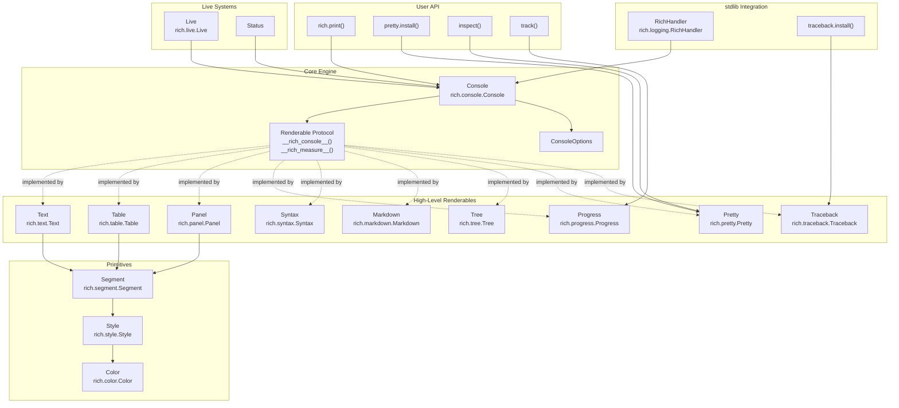
```mermaid
graph TB
    subgraph "User API"
        rich_print["rich.print()"]
        pretty_install["pretty.install()"]
        inspect_func["inspect()"]
        track_func["track()"]
    end
    
    subgraph "Core Engine"
        Console["Console<br/>rich.console.Console"]
        ConsoleOptions["ConsoleOptions"]
        RenderableProtocol["Renderable Protocol<br/>__rich_console__()<br/>__rich_measure__()"]
    end
    
    subgraph "High-Level Renderables"
        Text["Text<br/>rich.text.Text"]
        Table["Table<br/>rich.table.Table"]
        Panel["Panel<br/>rich.panel.Panel"]
        Progress["Progress<br/>rich.progress.Progress"]
        Syntax["Syntax<br/>rich.syntax.Syntax"]
        Markdown["Markdown<br/>rich.markdown.Markdown"]
        Tree["Tree<br/>rich.tree.Tree"]
        Pretty["Pretty<br/>rich.pretty.Pretty"]
        Traceback["Traceback<br/>rich.traceback.Traceback"]
    end
    
    subgraph "Primitives"
        Segment["Segment<br/>rich.segment.Segment"]
        Style["Style<br/>rich.style.Style"]
        Color["Color<br/>rich.color.Color"]
    end
    
    subgraph "Live Systems"
        Live["Live<br/>rich.live.Live"]
        Status["Status"]
    end
    
    subgraph "stdlib Integration"
        RichHandler["RichHandler<br/>rich.logging.RichHandler"]
        traceback_install["traceback.install()"]
    end
    
    rich_print --> Console
    pretty_install --> Pretty
    inspect_func --> Pretty
    track_func --> Progress
    
    Console --> RenderableProtocol
    Console --> ConsoleOptions
    
    RenderableProtocol -.->|implemented by| Text
    RenderableProtocol -.->|implemented by| Table
    RenderableProtocol -.->|implemented by| Panel
    RenderableProtocol -.->|implemented by| Progress
    RenderableProtocol -.->|implemented by| Syntax
    RenderableProtocol -.->|implemented by| Markdown
    RenderableProtocol -.->|implemented by| Tree
    RenderableProtocol -.->|implemented by| Pretty
    RenderableProtocol -.->|implemented by| Traceback
    
    Text --> Segment
    Table --> Segment
    Panel --> Segment
    
    Segment --> Style
    Style --> Color
    
    Live --> Console
    Status --> Console
    
    RichHandler --> Console
    traceback_install --> Traceback
```

The `Console` class is the central coordinator. All renderables implement the `Renderable` protocol with `__rich_console__()` and `__rich_measure__()` methods. Output is generated as `Segment` instances containing text, `Style`, and control codes.

Sources: [README.md:84-94](), [README.md:136-246]()

### Rendering Pipeline

**Rendering Flow (High to Low Level)**

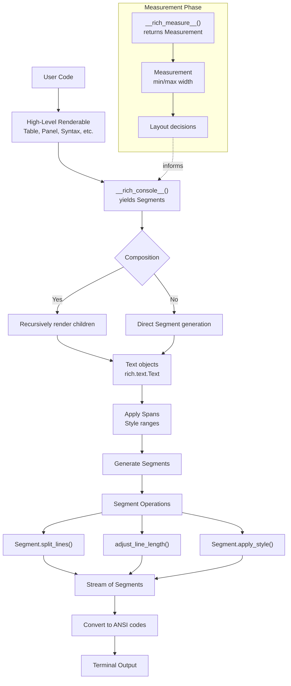
```mermaid
graph TB
    UserCode["User Code"] --> HighLevelRenderable["High-Level Renderable<br/>Table, Panel, Syntax, etc."]
    
    HighLevelRenderable --> rich_console_method["__rich_console__()<br/>yields Segments"]
    
    rich_console_method --> Composition{Composition}
    Composition -->|Yes| ChildRender["Recursively render children"]
    Composition -->|No| DirectRender["Direct Segment generation"]
    
    ChildRender --> TextObjects["Text objects<br/>rich.text.Text"]
    DirectRender --> TextObjects
    
    TextObjects --> Spans["Apply Spans<br/>Style ranges"]
    
    Spans --> SegmentGeneration["Generate Segments"]
    
    SegmentGeneration --> SegmentOps["Segment Operations"]
    SegmentOps --> split_lines["Segment.split_lines()"]
    SegmentOps --> adjust_line_length["adjust_line_length()"]
    SegmentOps --> apply_style["Segment.apply_style()"]
    
    split_lines --> SegmentStream["Stream of Segments"]
    adjust_line_length --> SegmentStream
    apply_style --> SegmentStream
    
    SegmentStream --> ANSIConversion["Convert to ANSI codes"]
    ANSIConversion --> TerminalOutput["Terminal Output"]
    
    subgraph "Measurement Phase"
        rich_measure_method["__rich_measure__()<br/>returns Measurement"]
        rich_measure_method --> MeasurementResult["Measurement<br/>min/max width"]
        MeasurementResult --> LayoutDecisions["Layout decisions"]
    end
    
    LayoutDecisions -.->|informs| rich_console_method
```

**Rendering Process:**

1. **Measurement Phase**: `__rich_measure__()` determines minimum and maximum widths.
2. **Rendering Phase**: `__rich_console__()` yields `Segment` instances with text and `Style`.
3. **Composition**: Complex renderables recursively render children (e.g., `Panel` contains another renderable).
4. **Text Generation**: Everything produces `Text` objects with styled `Span` ranges.
5. **Segment Operations**: Splitting, cropping, and style application via `Segment` methods.
6. **ANSI Conversion**: `Segment` instances converted to ANSI escape sequences for terminal.

Sources: [README.md:84-94](), [README.md:136-246]()

## Protocol and Type System

**Core Protocols**

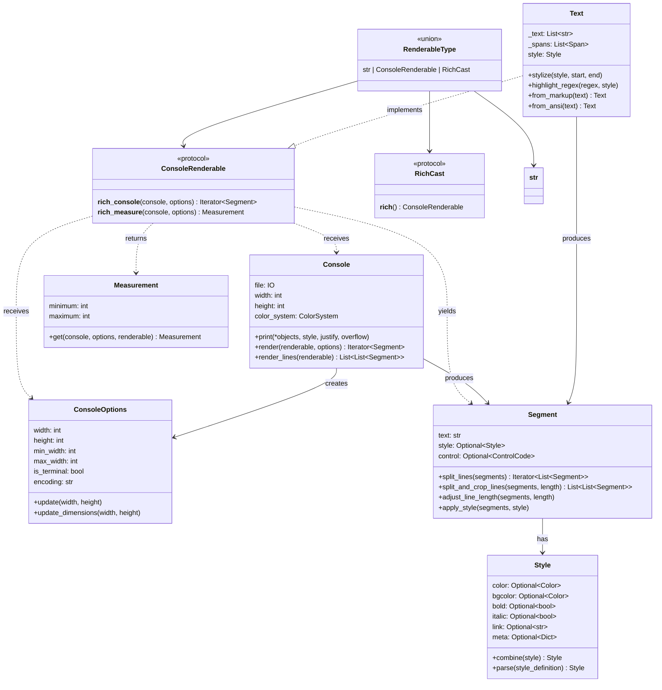
```mermaid
classDiagram
    class RenderableType {
        <<union>>
        str | ConsoleRenderable | RichCast
    }
    
    class ConsoleRenderable {
        <<protocol>>
        __rich_console__(console, options) Iterator~Segment~
        __rich_measure__(console, options) Measurement
    }
    
    class RichCast {
        <<protocol>>
        __rich__() ConsoleRenderable
    }
    
    class Console {
        file: IO
        width: int
        height: int
        color_system: ColorSystem
        +print(*objects, style, justify, overflow)
        +render(renderable, options) Iterator~Segment~
        +render_lines(renderable) List~List~Segment~~
    }
    
    class ConsoleOptions {
        width: int
        height: int
        min_width: int
        max_width: int
        is_terminal: bool
        encoding: str
        +update(width, height)
        +update_dimensions(width, height)
    }
    
    class Segment {
        text: str
        style: Optional~Style~
        control: Optional~ControlCode~
        +split_lines(segments) Iterator~List~Segment~~
        +split_and_crop_lines(segments, length) List~List~Segment~~
        +adjust_line_length(segments, length)
        +apply_style(segments, style)
    }
    
    class Style {
        color: Optional~Color~
        bgcolor: Optional~Color~
        bold: Optional~bool~
        italic: Optional~bool~
        link: Optional~str~
        meta: Optional~Dict~
        +combine(style) Style
        +parse(style_definition) Style
    }
    
    class Text {
        _text: List~str~
        _spans: List~Span~
        style: Style
        +stylize(style, start, end)
        +highlight_regex(regex, style)
        +from_markup(text) Text
        +from_ansi(text) Text
    }
    
    class Measurement {
        minimum: int
        maximum: int
        +get(console, options, renderable) Measurement
    }
    
    RenderableType --> ConsoleRenderable
    RenderableType --> RichCast
    RenderableType --> str
    
    ConsoleRenderable ..> Console : receives
    ConsoleRenderable ..> ConsoleOptions : receives
    ConsoleRenderable ..> Segment : yields
    ConsoleRenderable ..> Measurement : returns
    
    Console --> ConsoleOptions : creates
    Console --> Segment : produces
    
    Text ..|> ConsoleRenderable : implements
    Text --> Segment : produces
    
    Segment --> Style : has
```

**Key Protocols:**

- `ConsoleRenderable`: Objects with `__rich_console__()` and `__rich_measure__()` methods.
- `RichCast`: Objects with `__rich__()` that return a renderable.
- `RenderableType`: Union accepting `str`, `ConsoleRenderable`, or `RichCast`.

Any object implementing `ConsoleRenderable` can be printed by `Console`. The protocol receives `Console` and `ConsoleOptions` context, yields `Segment` instances, and returns `Measurement` for layout calculations.

Sources: [README.md:84-94](), [README.md:111-119]()

## Built-in Renderables

**Component Overview**

| Renderable | Purpose | Key Methods |
|-----------|---------|-------------|
| `Text` | Styled text with spans | `stylize()`, `highlight_regex()`, `from_markup()` |
| `Table` | Tabular data with borders | `add_column()`, `add_row()`, `add_section()` |
| `Panel` | Bordered content container | `Panel()` constructor with `renderable` |
| `Progress` | Multiple progress bars | `add_task()`, `update()`, `track()` |
| `Tree` | Hierarchical data display | `add()`, with guide lines |
| `Syntax` | Code with highlighting | Uses Pygments lexers, configurable themes |
| `Markdown` | Markdown rendering | Uses markdown-it-py parser |
| `Pretty` | Object pretty printing | `pprint()`, `@auto` decorator |
| `Traceback` | Enhanced stack traces | `install()`, syntax highlighting |
| `Layout` | Grid-based arrangement | `split_column()`, `split_row()` |
| `Columns` | Column-based layout | `Columns(renderables)` |

Sources: [README.md:136-246](), [CHANGELOG.md:88-88]()

### Console Subsystems

**Console Core Systems**


```mermaid
graph TB
    subgraph "Console Instance"
        ConsoleCore["Console<br/>rich.console.Console"]
        file["file: IO[str]"]
        color_system["color_system: ColorSystem"]
        theme["theme: Theme"]
    end
    
    subgraph "Rendering Methods"
        print_method["print()"]
        log_method["log()"]
        render_method["render()"]
        render_lines_method["render_lines()"]
        measure_method["measure()"]
    end
    
    subgraph "Capture & Export"
        capture_context["capture() context"]
        record_flag["record=True"]
        export_text["export_text()"]
        export_html["export_html()"]
        export_svg["export_svg()"]
    end
    
    subgraph "Special Modes"
        screen_context["screen() context"]
        pager_context["pager() context"]
        status_context["status() context"]
        Live["Live integration"]
    end
    
    subgraph "Detection"
        is_terminal["is_terminal: bool"]
        is_jupyter["is_jupyter: bool"]
        ColorSystemDetection["Auto-detect ColorSystem"]
        EnvVars["Environment Variables<br/>FORCE_COLOR, NO_COLOR, etc."]
    end
    
    ConsoleCore --> file
    ConsoleCore --> color_system
    ConsoleCore --> theme
    
    ConsoleCore --> print_method
    ConsoleCore --> log_method
    print_method --> render_method
    log_method --> print_method
    render_method --> render_lines_method
    render_method --> measure_method
    
    ConsoleCore --> capture_context
    ConsoleCore --> record_flag
    record_flag --> export_text
    record_flag --> export_html
    record_flag --> export_svg
    
    ConsoleCore --> screen_context
    ConsoleCore --> pager_context
    ConsoleCore --> status_context
    ConsoleCore --> Live
    
    ConsoleCore --> is_terminal
    ConsoleCore --> is_jupyter
    ConsoleCore --> ColorSystemDetection
    ColorSystemDetection --> EnvVars
```

The `Console` class manages output file handles, color system detection, themes, and special modes like alternate screens or status spinners.

Sources: [README.md:84-94](), [README.md:142-169]()

## Platform Compatibility

**Operating Systems:**
- Linux (full support)
- macOS (full support)  
- Windows (full support with Windows Terminal, 16-color mode in legacy terminal)

**Python Versions:**
- Python 3.9, 3.10, 3.11, 3.12, 3.13, 3.14 (Python 3.8 support dropped in v15.0.0)

**Environments:**
- Standard terminals (xterm, etc.)
- Windows Terminal (true color support)
- Windows Console (legacy, 16 colors)
- Jupyter notebooks (no configuration needed)

**Color Support:**
- True color (16 million colors) on modern terminals
- 256-color fallback
- 16-color fallback for legacy terminals
- Automatic downgrading based on terminal capabilities

Environment variables that influence behavior:

| Variable | Effect |
|---|---|
| `FORCE_COLOR` | Force color output on (non-empty value) |
| `NO_COLOR` | Disable all color output (non-empty value) |
| `TTY_COMPATIBLE` | Override auto-detection of TTY support |
| `TTY_INTERACTIVE` | Override auto-detection of interactive mode |
| `UNICODE_VERSION` | Override Unicode version for cell-width calculations |

Sources: [README.md:40-44](), [CHANGELOG.md:12-12](), [CHANGELOG.md:60-60](), [CHANGELOG.md:99-105](), [CHANGELOG.md:109-110]()

## Example Usage

Here's a simple example demonstrating Rich's basic capabilities:

```python
from rich.console import Console
from rich.table import Table

# Create a console instance
console = Console()

# Simple styled output
console.print("Hello [bold magenta]World[/bold magenta]!")

# Create a table
table = Table(show_header=True, header_style="bold blue")
table.add_column("Name", style="dim")
table.add_column("Value")
table.add_row("String", "hello world")
table.add_row("Number", "123")
table.add_row("Boolean", "True")

# Print the table
console.print(table)
```

For more examples and detailed information about specific features, see the respective feature pages in this wiki.

Sources: [README.md:61-68](), [README.md:196-218]()

## Conclusion

Rich provides a comprehensive solution for creating visually appealing and information-rich terminal applications in Python. By abstracting away the complexity of terminal formatting, it allows developers to focus on content rather than implementation details.

Sources: [README.md:30-32]()

---

# Page: Getting Started

# Getting Started

<details>
<summary>Relevant source files</summary>

The following files were used as context for generating this wiki page:

- [README.cn.md](README.cn.md)
- [README.es.md](README.es.md)
- [README.md](README.md)
- [docs/source/highlighting.rst](docs/source/highlighting.rst)
- [docs/source/introduction.rst](docs/source/introduction.rst)
- [docs/source/protocol.rst](docs/source/protocol.rst)
- [docs/source/syntax.rst](docs/source/syntax.rst)
- [examples/highlighter.py](examples/highlighter.py)
- [examples/rainbow.py](examples/rainbow.py)
- [rich/__main__.py](rich/__main__.py)
- [tests/_card_render.py](tests/_card_render.py)

</details>


This page covers how to install Rich and the primary entry points for using it: `rich.print()` as a drop-in replacement for Python's built-in `print`, `pretty.install()` for REPL enhancement, the `python -m rich` demo command, and basic `Console` instantiation. For a broader architectural overview of how these pieces fit together internally, see [Architecture Overview](). For the full `Console` API reference, see [Console]().

---

## Requirements and Installation

Rich requires **Python 3.8 or later** and runs on Linux, macOS, and Windows.

| Platform | Notes |
|---|---|
| Linux / macOS | Full color and emoji support [README.md:42-42]() |
| Windows (new Terminal) | Full truecolor and emoji support [README.md:42-42]() |
| Windows (classic `cmd.exe`) | Limited to 16 colors [README.md:42-42]() |
| Jupyter notebooks | Supported with no extra configuration [README.md:44-45]() |

**Install via pip:**

```sh
python -m pip install rich
```

**Install with Jupyter extras** (adds dependencies for enhanced notebook support):

```sh
pip install "rich[jupyter]"
```

Sources: [README.md:40-52](), [docs/source/introduction.rst:8-32]()

---

## Verifying the Installation

After installing, run the built-in demo to confirm Rich is working and to preview its capabilities:

```sh
python -m rich
```

This command executes the `__main__.py` entry point in the `rich` package [rich/__main__.py:209-226](). It renders a comprehensive "test card" created by `make_test_card()` [rich/__main__.py:39-206](), which showcases:
- **Colors**: 4-bit, 8-bit, and Truecolor support [rich/__main__.py:46-64]().
- **Styles**: Bold, dim, italic, underline, and more [rich/__main__.py:66-69]().
- **Text Alignment**: Left, center, right, and full justification [rich/__main__.py:71-88]().
- **Unicode**: Support for Asian languages and emoji [rich/__main__.py:97-106]().
- **Complex Renderables**: Tables, Syntax highlighting, Pretty printing, and Markdown [rich/__main__.py:108-200]().

Sources: [README.md:54-58](), [rich/__main__.py:1-206](), [docs/source/introduction.rst:33-39]()

---

## Quick Start: `rich.print()`

The fastest way to add Rich output to any script is to import `rich.print`. It has a signature intentionally similar to Python's built-in `print` and can be used as a drop-in replacement [docs/source/introduction.rst:43-46]().

```python
from rich import print

print("Hello, [bold magenta]World[/bold magenta]!", ":vampire:", locals())
```

This single import enables:
- **Console markup**: BBCode-style tags like `[bold magenta]...[/bold magenta]` [README.md:111-114]().
- **Emoji codes**: Names surrounded by colons like `:vampire:` [README.md:67-68]().
- **Pretty-printed Python objects**: Objects like `locals()` are automatically formatted and highlighted [docs/source/introduction.rst:51-69]().

If you want to avoid shadowing the built-in, import it under an alias:

```python
from rich import print as rprint
```

**Entry point flow for `rich.print()`:**

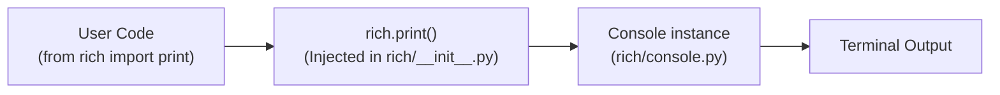
```mermaid
flowchart LR
    user["User Code\n(from rich import print)"]
    richprint["rich.print()\n(Injected in rich/__init__.py)"]
    console["Console instance\n(rich/console.py)"]
    terminal["Terminal Output"]

    user --> richprint
    richprint --> console
    console --> terminal
```

Sources: [README.md:60-70](), [docs/source/introduction.rst:40-76]()

---

## REPL Enhancement: `pretty.install()`

Rich can be installed into the Python REPL so that any evaluated expression is automatically pretty-printed with syntax highlighting [README.md:73-75]().

```python
>>> from rich import pretty
>>> pretty.install()
```

This modifies `sys.displayhook` to use Rich's formatting logic [docs/source/introduction.rst:81-84](). Once installed, any data structure — dicts, lists, or even Rich *renderables* — will be formatted for the terminal:

```python
>>> from rich.panel import Panel
>>> Panel.fit("[bold yellow]Hi, I'm a Panel", border_style="red")
```

### IPython Extension
For IPython users, Rich provides an extension that handles both pretty-printing and rich tracebacks [docs/source/introduction.rst:94-99]():

```python
In [1]: %load_ext rich
```

**How `pretty.install()` hooks into the session:**

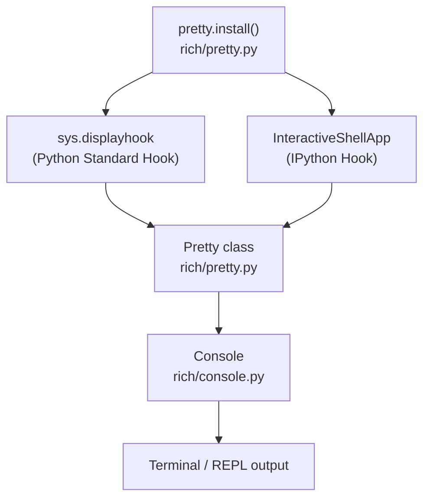
```mermaid
flowchart TD
    install["pretty.install()\nrich/pretty.py"]
    displayhook["sys.displayhook\n(Python Standard Hook)"]
    ipython["InteractiveShellApp\n(IPython Hook)"]
    prettyclass["Pretty class\nrich/pretty.py"]
    console["Console\nrich/console.py"]
    output["Terminal / REPL output"]

    install --> displayhook
    install --> ipython
    displayhook --> prettyclass
    ipython --> prettyclass
    prettyclass --> console
    console --> output
```

Sources: [README.md:72-81](), [docs/source/introduction.rst:78-102]()

---

## Using the `Console` Class

For granular control over terminal output, instantiate a `Console` object [README.md:83-91]().

```python
from rich.console import Console

console = Console()
```

The `Console` object provides a `print()` method that supports word-wrapping and styling [README.md:93-105]().

### Basic Styling and Markup
You can apply styles to the entire printed line or use inline markup:

```python
# Style the whole line
console.print("Hello World!", style="bold red")

# Use BBCode-style markup for specific words
console.print("Where there is a [bold cyan]Will[/bold cyan] there [u]is[/u] a [i]way[/i].")
```

### Protocol Support
Custom objects can define how they appear in a Rich console by implementing the `__rich__` or `__rich_console__` methods [docs/source/protocol.rst:7-31]().

**Relationship between entry points and `Console`:**

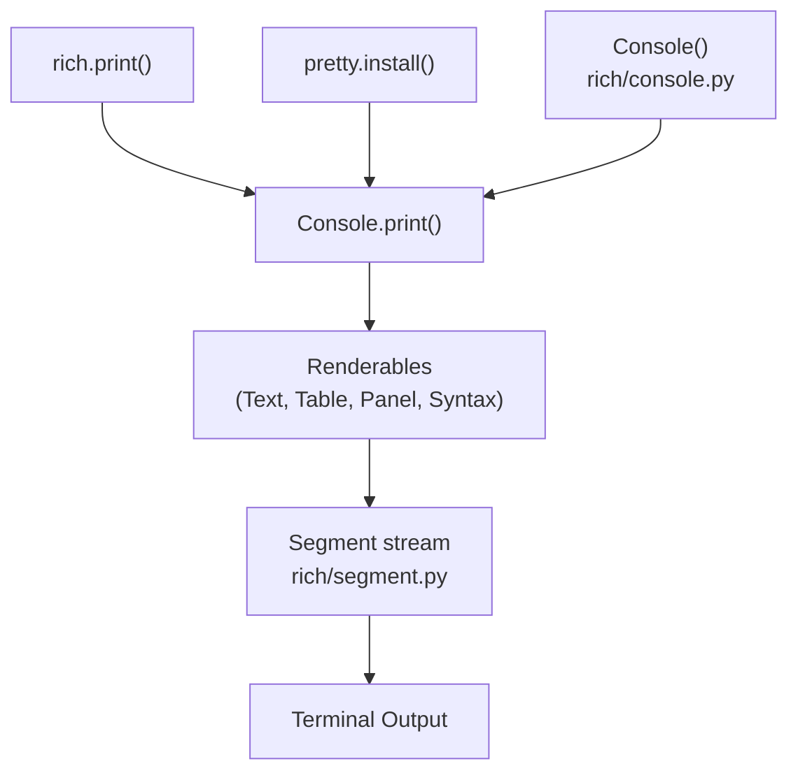
```mermaid
flowchart TD
    richprint["rich.print()"]
    prettyinstall["pretty.install()"]
    directconsole["Console()\nrich/console.py"]
    consoleprint["Console.print()"]
    renderables["Renderables\n(Text, Table, Panel, Syntax)"]
    segments["Segment stream\nrich/segment.py"]
    terminalout["Terminal Output"]

    richprint --> consoleprint
    prettyinstall --> consoleprint
    directconsole --> consoleprint
    consoleprint --> renderables
    renderables --> segments
    segments --> terminalout
```

Sources: [README.md:83-119](), [docs/source/protocol.rst:1-48]()

---

## Choosing the Right Entry Point

| Use Case | Recommended Entry Point |
|---|---|
| Quick script with styled output | `from rich import print` [docs/source/introduction.rst:43-45]() |
| Interactive REPL sessions | `from rich import pretty; pretty.install()` [README.md:77-78]() |
| IPython / Jupyter enhancement | `%load_ext rich` [docs/source/introduction.rst:99]() |
| Debugging objects | `from rich import inspect; inspect(obj)` [README.md:121-129]() |
| Complex CLI Layouts | `from rich.console import Console` [README.md:85-91]() |

Sources: [README.md:60-134](), [docs/source/introduction.rst:40-113]()

---

## Next Steps

- For how the `Console`, `Text`, `Segment`, and renderable subsystems fit together, see [Architecture Overview]().
- For the full `Console` class reference including all constructor parameters and methods, see [Console]().
- For syntax highlighting details, see [Syntax Highlighting]() or [docs/source/syntax.rst:1-57]().
- For the `pretty` module in depth, see [Pretty Printing and REPL]().

---

# Page: Architecture Overview

# Architecture Overview

<details>
<summary>Relevant source files</summary>

The following files were used as context for generating this wiki page:

- [CHANGELOG.md](CHANGELOG.md)
- [docs/source/console.rst](docs/source/console.rst)
- [poetry.lock](poetry.lock)
- [pyproject.toml](pyproject.toml)
- [rich/console.py](rich/console.py)
- [rich/errors.py](rich/errors.py)
- [rich/protocol.py](rich/protocol.py)
- [rich/region.py](rich/region.py)
- [rich/repr.py](rich/repr.py)
- [rich/segment.py](rich/segment.py)
- [tests/test_console.py](tests/test_console.py)
- [tests/test_repr.py](tests/test_repr.py)
- [tests/test_segment.py](tests/test_segment.py)
- [tests/test_style.py](tests/test_style.py)

</details>


This page describes how Rich's major subsystems fit together and how data flows from user code to terminal output. It covers the renderable protocol, the rendering pipeline, and the role of each core module.

---

## Major Subsystems

Rich is organized around five interlocking subsystems:

| Subsystem | Primary Module | Role |
|---|---|---|
| **Console** | `rich/console.py` | Entry point; drives the rendering pipeline, manages output |
| **Renderable Protocol** | `rich/console.py` | Contract that any object can implement to be printable |
| **Text & Markup** | `rich/text.py`, `rich/markup.py` | Styled text with spans; markup parsing |
| **Segments** | `rich/segment.py` | Atomic output units: `(text, style, control)` tuples |
| **Styles & Colors** | `rich/style.py`, `rich/color.py` | Immutable style descriptors rendered to ANSI escape codes |
| **Live** | `rich/live.py` | Auto-refreshing dynamic display built on top of Console |

---

## The Renderable Protocol

Any object Rich can display must satisfy one of two protocols, both defined in `rich/console.py`:

**`RichCast`** [rich/console.py:49]() — An object that implements `__rich__()`, returning another renderable or a string. This is resolved via `rich_cast` [rich/protocol.py:18-41]().

**`ConsoleRenderable`** [rich/console.py:113-114]() — An object that implements `__rich_console__(console, options)`, which yields `Segment` objects or further renderables.

The union type `RenderableType` [rich/console.py:273-274]() captures what `console.print()` accepts:

```python
RenderableType = Union[ConsoleRenderable, RichCast, str]
```

And `RenderResult` [rich/console.py:277]() is what `__rich_console__` returns:

```python
RenderResult = Iterable[Union[RenderableType, Segment]]
```

**Protocol resolution diagram:**

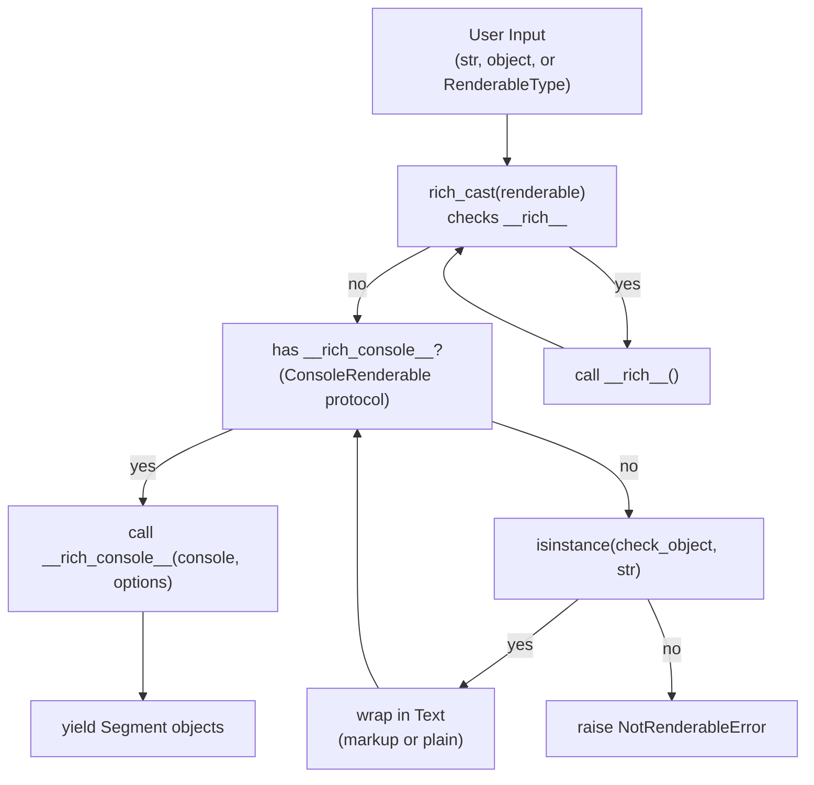
```mermaid
flowchart TD
    input["User Input\n(str, object, or RenderableType)"]
    richcast["rich_cast(renderable)\nchecks __rich__"]
    richconsole["has __rich_console__?\n(ConsoleRenderable protocol)"]
    isstr["isinstance(check_object, str)"]
    text["wrap in Text\n(markup or plain)"]
    castresult["call __rich__()"]
    renderresult["call __rich_console__(console, options)"]
    error["raise NotRenderableError"]
    segments["yield Segment objects"]

    input --> richcast
    richcast -->|"yes"| castresult
    castresult --> richcast
    richcast -->|"no"| richconsole
    richconsole -->|"yes"| renderresult
    renderresult --> segments
    richconsole -->|"no"| isstr
    isstr -->|"yes"| text
    text --> richconsole
    isstr -->|"no"| error
```

Sources: [rich/console.py:113-277](), [rich/protocol.py:9-41](), [rich/console.py:1073-1150]()

---

## Core Data Flow

The following diagram maps user code actions to the internal class methods that execute them.

**End-to-end rendering pipeline:**

```mermaid
flowchart LR
    usercode["Console.print(renderable)"]
    renderhooks["RenderHook.process_renderables()"]
    render["Console.render(renderable, options)"]
    renderlines["Console.render_lines()"]
    segment["Segment(text, style, control)"]
    style["Style._make_ansi_codes()"]
    buffer["ConsoleThreadLocals._buffer\n(List[Segment])"]
    checkbuffer["Console._check_buffer()"]
    renderfile["Console._render_buffer()"]
    filewrite["file.write(str)"]

    usercode --> renderhooks
    renderhooks --> render
    render -->|"recurse via RenderResult"| render
    render --> segment
    segment --> buffer
    render --> renderlines
    renderlines --> buffer
    buffer --> checkbuffer
    checkbuffer -->|"buffer_index == 0"| renderfile
    renderfile --> style
    style -->|"ANSI escape string"| filewrite
```

Sources: [rich/console.py:1073-1150](), [rich/console.py:1570-1640](), [rich/console.py:819-826](), [rich/console.py:542-547]()

---

## Key Data Structures

### `ConsoleOptions`

`ConsoleOptions` [rich/console.py:113-249]() is a dataclass passed to every `__rich_console__` call. It carries the rendering context: terminal dimensions, encoding, justify/overflow settings, and whether the target is a terminal.

| Field | Type | Purpose |
|---|---|---|
| `size` | `ConsoleDimensions` | Terminal width × height [rich/console.py:103-110]() |
| `max_width` / `min_width` | `int` | Constrains renderable width [rich/console.py:120-123]() |
| `is_terminal` | `bool` | Whether writing to a real terminal [rich/console.py:124-125]() |
| `encoding` | `str` | Target encoding (e.g. `"utf-8"`) [rich/console.py:126-127]() |
| `justify` | `JustifyMethod` | Override for text justification [rich/console.py:130-131]() |
| `markup` | `bool` | Whether markup is enabled [rich/console.py:138-139]() |

### `Segment`

`Segment` [rich/segment.py:61-99]() is a `NamedTuple` with three fields. It is the final intermediate form before ANSI strings are written to the file.

| Field | Type | Purpose |
|---|---|---|
| `text` | `str` | The literal text content [rich/segment.py:74]() |
| `style` | `Optional[Style]` | Visual style to apply [rich/segment.py:75]() |
| `control` | `Optional[Sequence[ControlCode]]` | Terminal control sequence [rich/segment.py:76]() |

A segment with a non-`None` `control` field has `cell_length == 0` [rich/segment.py:85-86]().

### `Style`

`Style` [rich/style.py:5-6]() is an immutable object holding color (foreground/background) and attribute bits (bold, italic, underline, etc.). It converts to ANSI codes via `_make_ansi_codes(color_system)` [rich/style.py:38-58]() and is combined with `+` to layer styles via `__add__` [rich/style.py:170-172]().

### `RenderHook`

`RenderHook` [rich/console.py:550-567]() is an abstract class with a single method `process_renderables(renderables)`. Hooks are pushed onto a stack in `Console._render_hooks` and called before rendering begins.

---

## Subsystem Map

The following diagram shows which source files implement each subsystem and how they depend on each other.

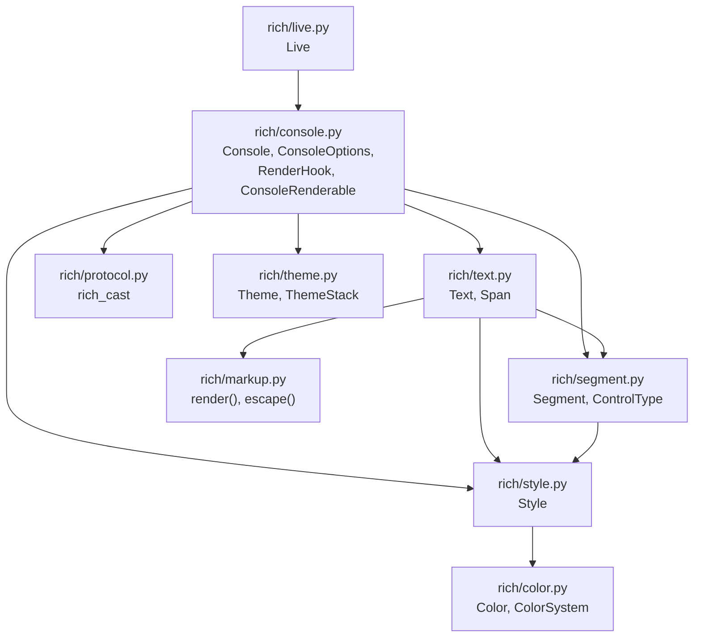
```mermaid
graph TD
    consolepy["rich/console.py\nConsole, ConsoleOptions,\nRenderHook, ConsoleRenderable"]
    textpy["rich/text.py\nText, Span"]
    segmentpy["rich/segment.py\nSegment, ControlType"]
    stylepy["rich/style.py\nStyle"]
    colorpy["rich/color.py\nColor, ColorSystem"]
    protocolpy["rich/protocol.py\nrich_cast"]
    livepy["rich/live.py\nLive"]
    markuppy["rich/markup.py\nrender(), escape()"]
    themepy["rich/theme.py\nTheme, ThemeStack"]

    consolepy --> segmentpy
    consolepy --> stylepy
    consolepy --> textpy
    consolepy --> themepy
    consolepy --> protocolpy
    textpy --> segmentpy
    textpy --> stylepy
    textpy --> markuppy
    stylepy --> colorpy
    segmentpy --> stylepy
    livepy --> consolepy
```

Sources: [rich/console.py:38-63](), [rich/segment.py:1-31](), [rich/style.py:1-11](), [rich/color.py:1-18]()

---

## The Live Display Subsystem

`Live` is built on top of `Console` and uses the `RenderHook` mechanism. When active, it:

1. Registers itself as a `RenderHook` via `Console.push_render_hook()` [rich/console.py:849-856]()
2. Intercepts any `console.print()` calls, moving them above the live display.
3. Runs a background `_RefreshThread` that periodically re-renders its renderable [rich/live.py:61]().

`Progress` and `Status` [rich/console.py:125-133]() are implemented using `Live` as their display engine.

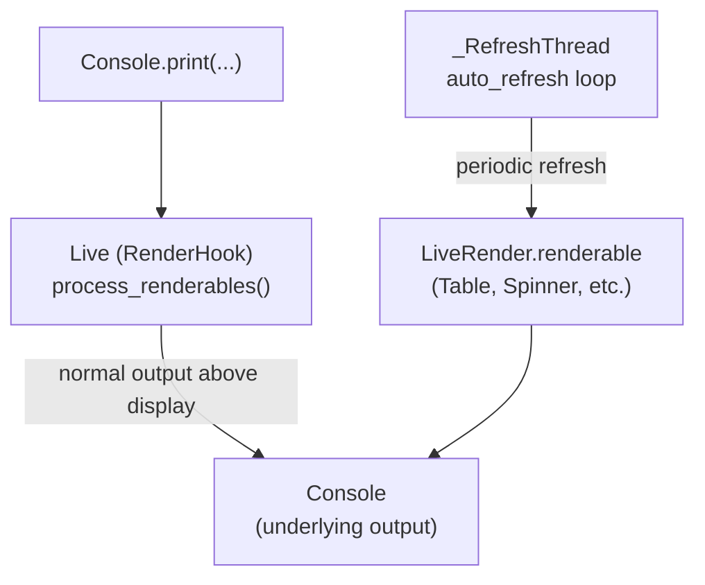
```mermaid
flowchart TD
    user["Console.print(...)"]
    livehook["Live (RenderHook)\nprocess_renderables()"]
    liverender["LiveRender.renderable\n(Table, Spinner, etc.)"]
    refreshthread["_RefreshThread\nauto_refresh loop"]
    console["Console\n(underlying output)"]

    user --> livehook
    livehook -->|"normal output above display"| console
    refreshthread -->|"periodic refresh"| liverender
    liverender --> console
```

Sources: [rich/console.py:828-861](), [rich/live.py:61](), [rich/console.py:61-62]()

---

## Thread Safety

`Console` uses a `threading.RLock` (`Console._lock`) [rich/console.py:720]() to protect buffer mutations. Buffer state itself (`_buffer`, `_buffer_index`, `_theme_stack`) is stored in `ConsoleThreadLocals` [rich/console.py:542-547](), a `threading.local` subclass, so each thread maintains its own buffer and theme stack.

Sources: [rich/console.py:542-547](), [rich/console.py:720](), [rich/console.py:776-793]()

---

## Summary of Entry Points

| User action | Method | Where it leads |
|---|---|---|
| `console.print(x)` | `Console.print()` [rich/console.py:1073]() | → `Console.render()` → segments → buffer → `_check_buffer()` |
| `console.log(x)` | `Console.log()` [rich/console.py:1257]() | Wraps content in a log table, then → `Console.print()` |
| `console.capture()` | `Console.capture()` [rich/console.py:828]() | Raises `_buffer_index`, collects segments, returns string |
| `console.status("...")` | `Console.status()` [rich/console.py:125-133]() | Creates `Status` which wraps `Live` |

Sources: [rich/console.py:1073-1257](), [rich/console.py:828-847]()

---

# Page: Core Rendering System

# Core Rendering System

<details>
<summary>Relevant source files</summary>

The following files were used as context for generating this wiki page:

- [docs/source/console.rst](docs/source/console.rst)
- [rich/color.py](rich/color.py)
- [rich/console.py](rich/console.py)
- [rich/segment.py](rich/segment.py)
- [rich/style.py](rich/style.py)
- [tests/test_color.py](tests/test_color.py)
- [tests/test_console.py](tests/test_console.py)
- [tests/test_segment.py](tests/test_segment.py)
- [tests/test_style.py](tests/test_style.py)

</details>


## Purpose and Scope

The Core Rendering System is the foundational infrastructure that powers all terminal output in Rich. It consists of four major components:

| Component | File | Purpose |
|-----------|------|---------|
| `Console` | [rich/console.py:587-758]() | Central coordinator; manages terminal output, buffering, and threading. |
| `ConsoleOptions` | [rich/console.py:113-250]() | Carries rendering context (width, encoding, etc.) through the pipeline. |
| `Segment` | [rich/segment.py:61-76]() | Atomic unit of styled text output. |
| `Style` / `Color` | [rich/style.py:40-206](), [rich/color.py:303-333]() | Visual attributes attached to segments. |

Detailed documentation for each component is in the child pages:

- **[Console](#2.1)** — Constructor parameters, color detection, and public methods like `print`, `log`, and `status`.
- **[Rendering Pipeline](#2.2)** — Protocol resolution (`__rich__`, `__rich_console__`), `render()` vs `render_lines()`, and buffering.
- **[Segments](#2.3)** — `Segment` operations, ANSI decoding, and Unicode cell-width measurement.
- **[Styles and Colors](#2.4)** — `Style` and `Color` classes, color systems, and ANSI rendering.

For information about specific renderables like Tables and Panels, see [Renderables](#4). For live updating displays, see [Live Updates](#5).

## System Architecture

**Data flow: user code → terminal output**

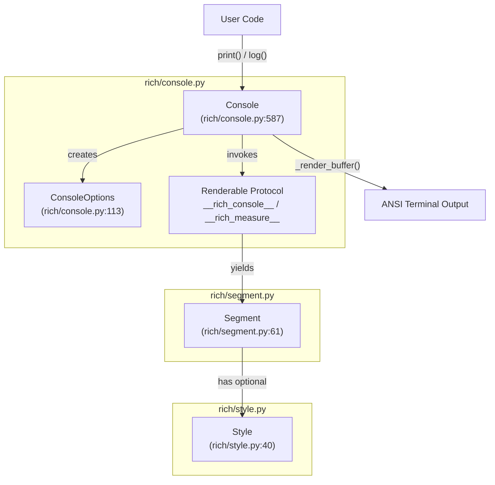
```mermaid
graph TB
    UserCode["User Code"]
    Console["Console\n(rich/console.py:587)"]
    ConsoleOptions["ConsoleOptions\n(rich/console.py:113)"]
    RenderProtocol["Renderable Protocol\n__rich_console__ / __rich_measure__"]
    Segment["Segment\n(rich/segment.py:61)"]
    Style["Style\n(rich/style.py:40)"]
    ANSIOutput["ANSI Terminal Output"]

    UserCode -->|"print() / log()"| Console
    Console -->|"creates"| ConsoleOptions
    Console -->|"invokes"| RenderProtocol
    RenderProtocol -->|"yields"| Segment
    Segment -->|"has optional"| Style
    Console -->|"_render_buffer()"| ANSIOutput

    subgraph "rich/console.py"
        Console
        ConsoleOptions
        RenderProtocol
    end

    subgraph "rich/segment.py"
        Segment
    end

    subgraph "rich/style.py"
        Style
    end
```

Sources: [rich/console.py:587-758](), [rich/console.py:113-250](), [rich/segment.py:61-79](), [rich/style.py:40-84]()

## Console: The Central Coordinator

The `Console` class is the primary interface for all Rich output. It manages terminal detection, color systems, output files, threading, and coordinates the entire rendering process. See [Console](#2.1) for full details.

### Key Configuration Parameters

[rich/console.py:587-758]()

| Parameter | Type | Purpose |
|-----------|------|---------|
| `color_system` | `str` | Color capability: `"auto"`, `"standard"`, `"256"`, `"truecolor"`, `"windows"`. |
| `force_terminal` | `Optional[bool]` | Override terminal detection. |
| `width` / `height` | `int` | Override terminal dimensions. |
| `file` | `IO[str]` | Output destination (defaults to `sys.stdout`). |
| `record` | `bool` | Enable recording for export to HTML/SVG/text. |
| `legacy_windows` | `bool` | Enable legacy Windows console mode. |
| `no_color` | `Optional[bool]` | Strip all color from output. |
| `style` | `StyleType` | Apply a global style to all output. |

**Console internal components:**

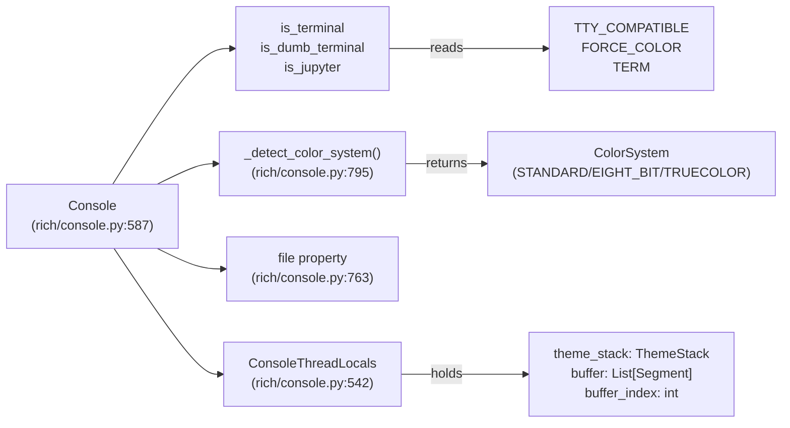
```mermaid
graph LR
    ConsoleInst["Console\n(rich/console.py:587)"]
    Detection["is_terminal\nis_dumb_terminal\nis_jupyter"]
    ColorSys["_detect_color_system()\n(rich/console.py:795)"]
    FileHandle["file property\n(rich/console.py:763)"]
    ThreadLocals["ConsoleThreadLocals\n(rich/console.py:542)"]

    ConsoleInst --> Detection
    ConsoleInst --> ColorSys
    ConsoleInst --> FileHandle
    ConsoleInst --> ThreadLocals

    Detection -->|"reads"| EnvVars["TTY_COMPATIBLE\nFORCE_COLOR\nTERM"]
    ColorSys -->|"returns"| ColorEnum["ColorSystem\n(STANDARD/EIGHT_BIT/TRUECOLOR)"]
    ThreadLocals -->|"holds"| PerThread["theme_stack: ThemeStack\nbuffer: List[Segment]\nbuffer_index: int"]
```

Sources: [rich/console.py:625-758](), [rich/console.py:795-817](), [rich/console.py:937-983](), [rich/console.py:542-548]()

### Core Rendering Methods

The Console provides a layered API for output:

**Console public API → internal rendering chain:**

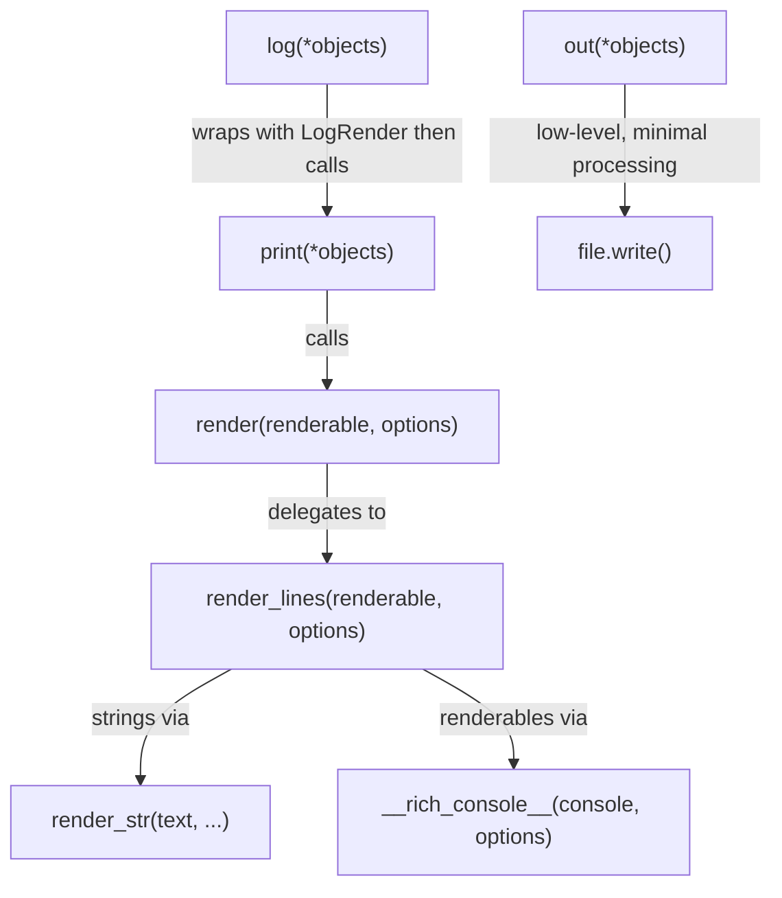
```mermaid
graph TB
    printm["print(*objects)"]
    logm["log(*objects)"]
    outm["out(*objects)"]
    renderm["render(renderable, options)"]
    render_linesm["render_lines(renderable, options)"]
    render_strm["render_str(text, ...)"]

    printm -->|"calls"| renderm
    logm -->|"wraps with LogRender then calls"| printm
    outm -->|"low-level, minimal processing"| DirectOutput["file.write()"]

    renderm -->|"delegates to"| render_linesm
    render_linesm -->|"strings via"| render_strm
    render_linesm -->|"renderables via"| Protocol["__rich_console__(console, options)"]
```

Sources: [rich/console.py:1124-1248](), [rich/console.py:1389-1506](), [rich/console.py:1657-1741]()

## ConsoleOptions: Rendering Context

`ConsoleOptions` is a dataclass that carries rendering configuration through the pipeline. Every `__rich_console__` method receives a `ConsoleOptions` instance.

[rich/console.py:113-250]()

### Structure

| Field | Type | Description |
|-------|------|-------------|
| `size` | `ConsoleDimensions` | Width and height of the console. |
| `legacy_windows` | `bool` | Whether to use legacy Windows mode. |
| `min_width` | `int` | Minimum width constraint. |
| `max_width` | `int` | Maximum width constraint. |
| `is_terminal` | `bool` | Whether output is to a terminal. |
| `encoding` | `str` | Character encoding (e.g., "utf-8"). |
| `max_height` | `int` | Height of container. |
| `justify` | `Optional[JustifyMethod]` | Text justification override. |
| `overflow` | `Optional[OverflowMethod]` | Overflow handling override. |
| `no_wrap` | `bool` | Disable text wrapping. |
| `highlight` | `Optional[bool]` | Enable syntax highlighting. |
| `markup` | `Optional[bool]` | Enable markup processing. |
| `height` | `Optional[int]` | Current height constraint. |

### Methods

- **`update()`** [[rich/console.py:157-192]()] - Returns a copy with modified values. Supports updating width, min_width, max_width, justify, overflow, no_wrap, highlight, markup, and height.
- **`update_width(width)`** [[rich/console.py:194-205]()] - Convenience method to update both `min_width` and `max_width`.
- **`update_height(height)`** [[rich/console.py:207-218]()] - Updates `height` and `max_height`.
- **`ascii_only` property** [[rich/console.py:143-145]()] - Returns `True` if encoding doesn't start with "utf".

Sources: [rich/console.py:113-250]()

## The Renderable Protocol

Any object can be rendered by implementing the `ConsoleRenderable` protocol. This protocol-based design enables Rich's extensibility. See [Rendering Pipeline](#2.2) for detailed mechanics.

**Renderable type hierarchy:**

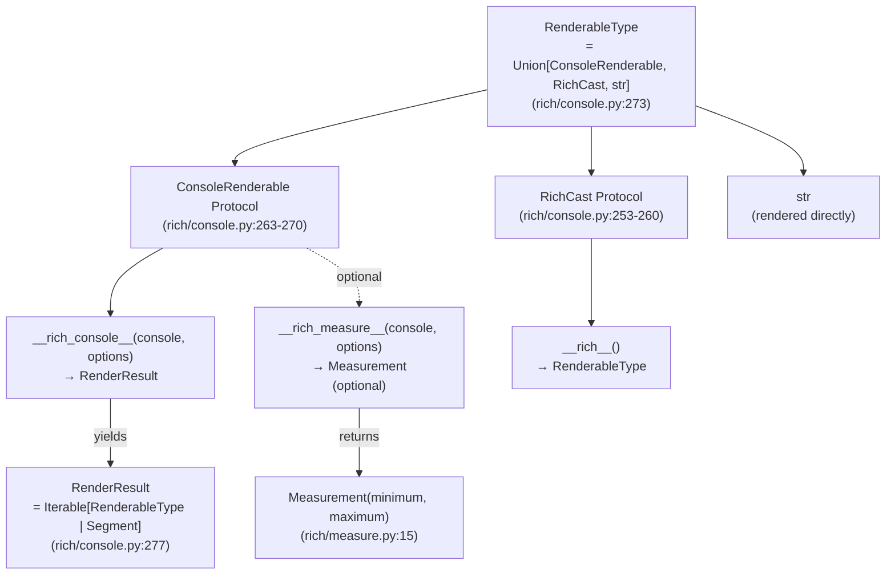
```mermaid
graph TB
    RenderableType["RenderableType\n= Union[ConsoleRenderable, RichCast, str]\n(rich/console.py:273)"]

    ConsoleRenderable["ConsoleRenderable Protocol\n(rich/console.py:263-270)"]
    RichCast["RichCast Protocol\n(rich/console.py:253-260)"]
    Str["str\n(rendered directly)"]

    richconsole["__rich_console__(console, options)\n→ RenderResult"]
    richmeasure["__rich_measure__(console, options)\n→ Measurement\n(optional)"]
    richmethod["__rich__()\n→ RenderableType"]

    RenderableType --> ConsoleRenderable
    RenderableType --> RichCast
    RenderableType --> Str

    ConsoleRenderable --> richconsole
    ConsoleRenderable -.->|"optional"| richmeasure
    RichCast --> richmethod

    richconsole -->|"yields"| RenderResult["RenderResult\n= Iterable[RenderableType | Segment]\n(rich/console.py:277)"]
    richmeasure -->|"returns"| Measurement["Measurement(minimum, maximum)\n(rich/measure.py:15)"]
```

Sources: [rich/console.py:252-278](), [rich/measure.py:15-40]()

### `__rich_console__` Method

The core rendering method. It receives a `Console` instance and `ConsoleOptions`, and yields either more `RenderableType` objects (for recursive rendering) or `Segment` instances (for final output).

[rich/console.py:263-270]()

### `__rich_measure__` Method

An optional method that returns the minimum and maximum width a renderable needs. Used by the layout system to calculate optimal widths.

Returns a `Measurement` namedtuple with:
- `minimum` — smallest width that can display the content.
- `maximum` — ideal width for the content.

[rich/measure.py:15-40]()

## Rendering Pipeline

See [Rendering Pipeline](#2.2) for full detail. Below is a high-level summary.

**`console.render()` resolution flow:**

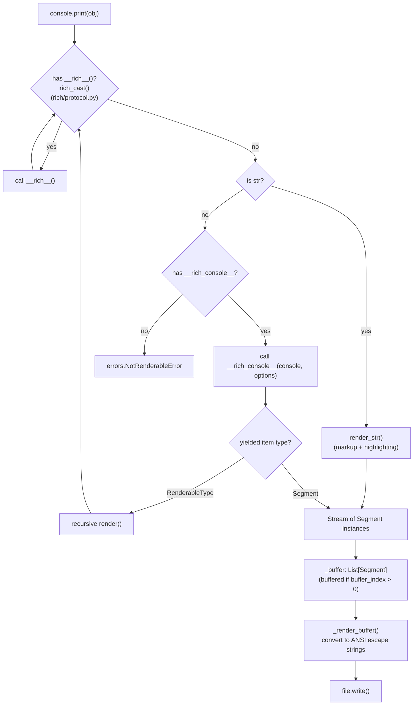
```mermaid
graph TB
    Input["console.print(obj)"]

    RichCastCheck{"has __rich__()?\nrich_cast()\n(rich/protocol.py)"}
    Cast["call __rich__()"]

    StringCheck{"is str?"}
    RenderStr["render_str()\n(markup + highlighting)"]

    ProtocolCheck{"has __rich_console__?"}
    InvokeProtocol["call __rich_console__(console, options)"]

    YieldCheck{"yielded item type?"}
    RecursiveRender["recursive render()"]

    Segments["Stream of Segment instances"]
    Buffer["_buffer: List[Segment]\n(buffered if buffer_index > 0)"]
    ANSI["_render_buffer()\nconvert to ANSI escape strings"]
    Output["file.write()"]

    Input --> RichCastCheck
    RichCastCheck -->|"yes"| Cast
    Cast --> RichCastCheck
    RichCastCheck -->|"no"| StringCheck

    StringCheck -->|"yes"| RenderStr
    StringCheck -->|"no"| ProtocolCheck

    RenderStr --> Segments
    ProtocolCheck -->|"yes"| InvokeProtocol
    ProtocolCheck -->|"no"| Error["errors.NotRenderableError"]

    InvokeProtocol --> YieldCheck
    YieldCheck -->|"RenderableType"| RecursiveRender
    YieldCheck -->|"Segment"| Segments
    RecursiveRender --> RichCastCheck

    Segments --> Buffer
    Buffer --> ANSI
    ANSI --> Output
```

Sources: [rich/console.py:1389-1457](), [rich/console.py:1509-1566](), [rich/protocol.py:8-25]()

### Rendering Process Steps

[rich/console.py:1389-1457]()

1. **Protocol resolution** — `rich_cast()` resolves `__rich__()` before further dispatch.
2. **Type dispatch** — distinguishes strings, `ConsoleRenderable`, and non-renderable objects.
3. **Recursive rendering** — objects may yield other renderables, forming a render tree.
4. **Segment collection** — leaf renderables yield `Segment` instances.
5. **Buffering** — segments accumulate in `_buffer` when `_buffer_index > 0` (capture/pager/context manager).
6. **ANSI conversion** — `_render_buffer()` serializes segments to ANSI escape strings.
7. **File write** — the result string is written to `Console.file`.

Sources: [rich/console.py:1389-1457](), [rich/console.py:819-826]()

## Segments: Atomic Rendering Units

`Segment` is the final output unit in Rich's rendering pipeline — a piece of text with an optional `Style` and optional control codes. See [Segments](#2.3) for full detail.

[rich/segment.py:61-76]()

```python
class Segment(NamedTuple):
    text: str
    style: Optional[Style] = None
    control: Optional[Sequence[ControlCode]] = None
```

### Key Properties and Methods

| Method / Property | Purpose |
|------------------|---------|
| `cell_length` | Terminal cell count (accounts for wide characters via `cell_len()`). |
| `is_control` | True if the `control` field is set. |
| `split_cells(cut)` | Split at a cell position; handles double-width characters. |
| `apply_style(segments, style)` | Prepend a style to an iterable of segments. |
| `split_lines(segments)` | Split on newlines into `Iterable[List[Segment]]`. |
| `split_and_crop_lines(segments, length)` | Split and crop each line to a specific `length`. |
| `adjust_line_length(line, length)` | Crop or pad a single line to an exact cell length. |
| `simplify(segments)` | Merge adjacent segments with identical style. |
| `strip_styles(segments)` | Remove all style objects from the segments. |
| `strip_links(segments)` | Remove only hyperlinks from styles. |
| `divide(segments, cuts)` | Split segment stream at specified cell positions. |

Sources: [rich/segment.py:79-699]()

**Segment operation data flow:**

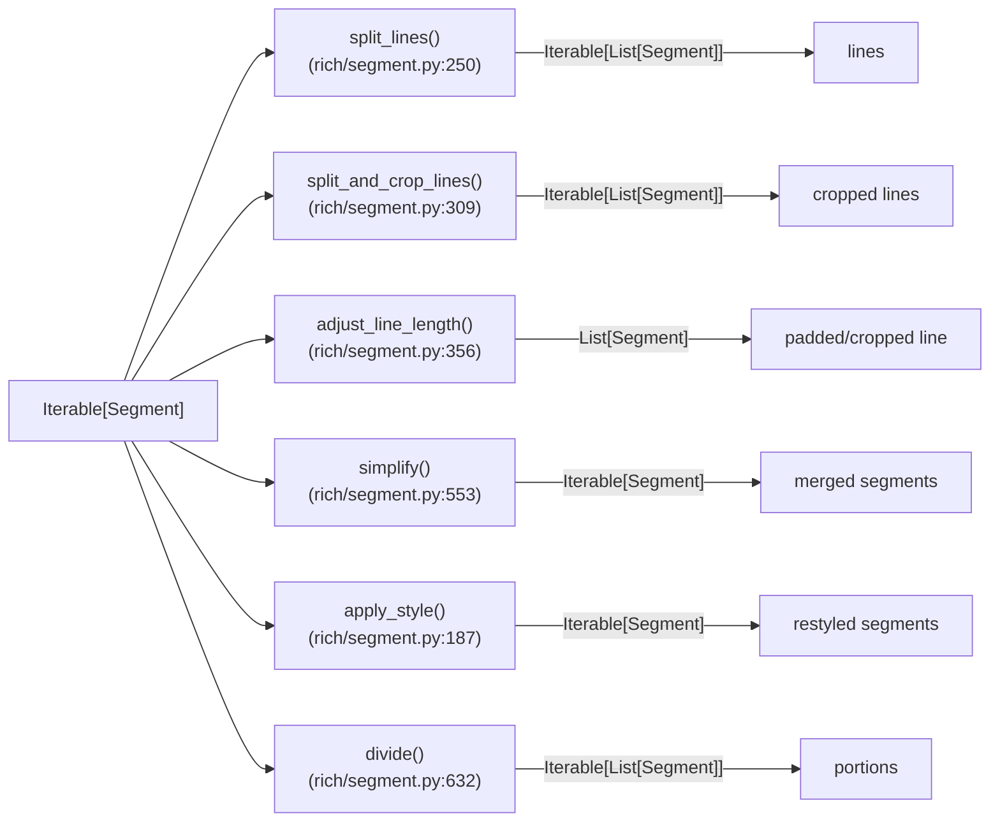
```mermaid
graph LR
    InputSegs["Iterable[Segment]"]

    SplitLines["split_lines()\n(rich/segment.py:250)"]
    SplitCrop["split_and_crop_lines()\n(rich/segment.py:309)"]
    AdjustLen["adjust_line_length()\n(rich/segment.py:356)"]
    Simplify["simplify()\n(rich/segment.py:553)"]
    ApplyStyle["apply_style()\n(rich/segment.py:187)"]
    Divide["divide()\n(rich/segment.py:632)"]

    InputSegs --> SplitLines
    InputSegs --> SplitCrop
    InputSegs --> AdjustLen
    InputSegs --> Simplify
    InputSegs --> ApplyStyle
    InputSegs --> Divide

    SplitLines -->|"Iterable[List[Segment]]"| LinesOut["lines"]
    SplitCrop -->|"Iterable[List[Segment]]"| CroppedOut["cropped lines"]
    AdjustLen -->|"List[Segment]"| AdjustedOut["padded/cropped line"]
    Simplify -->|"Iterable[Segment]"| SimplifiedOut["merged segments"]
    ApplyStyle -->|"Iterable[Segment]"| StyledOut["restyled segments"]
    Divide -->|"Iterable[List[Segment]]"| DividedOut["portions"]
```

Sources: [rich/segment.py:187-699]()

### Cell Length and Wide Characters

`cell_length` uses `cell_len()` from `rich/cells.py` to compute terminal width [[rich/segment.py:79-86]()]. `split_cells(cut)` correctly handles double-width characters (CJK, emoji): if a cut falls inside a 2-cell character, it replaces it with two spaces to preserve layout [[rich/segment.py:155-179]()].

### Control Codes

Segments with a non-`None` `control` field carry terminal control operations instead of printable text. The `ControlType` enum enumerates supported operations like `BELL`, `HOME`, `CLEAR`, and cursor movements [[rich/segment.py:32-51]()].

## Styles and Colors: Summary

`Style` and `Color` carry the visual attributes attached to every `Segment`. See [Styles and Colors](#2.4) for full detail.

**`Style`** [[rich/style.py:40-206]()] holds:
- Foreground and background `Color` objects.
- Boolean attribute flags (bold, italic, underline, etc.) encoded as bitfields.
- Optional hyperlink (`link`).
- Optional metadata dict (used for event handling).

Styles are parsed from strings like `"bold red on black"` via `Style.parse()` [[rich/style.py:493-557]()].

**`Color`** [[rich/color.py:303-568]()] supports four color types:

| ColorType | Example | Range |
|-----------|---------|-------|
| `DEFAULT` | `"default"` | Terminal default color. |
| `STANDARD` | `"red"`, `"bright_blue"` | 16 named ANSI colors. |
| `EIGHT_BIT` | `"color(200)"` | 256-color palette. |
| `TRUECOLOR` | `"#ff0000"`, `"rgb(255,0,0)"` | 16.7 million colors. |

Colors are automatically downgraded to the `ColorSystem` detected by the `Console` via `Color.downgrade()` [[rich/color.py:512-568]()].

Sources: [rich/style.py:40-206](), [rich/color.py:21-28](), [rich/color.py:303-568]()

## Thread Safety and Buffering

The `Console` is thread-safe through thread-local storage (`ConsoleThreadLocals`) and a reentrant lock (`threading.RLock`) [[rich/console.py:542-548](), [rich/console.py:720]()].

**Thread-Local State (`ConsoleThreadLocals`):**

| Field | Purpose |
|-------|---------|
| `theme_stack` | Per-thread `ThemeStack`. |
| `buffer` | `List[Segment]` — accumulated segments. |
| `buffer_index` | Nesting depth of buffer contexts. |

**Buffering:**
- `_enter_buffer()` / `_exit_buffer()` [[rich/console.py:819-826]()] increment/decrement `buffer_index`.
- When `buffer_index > 0`, segments accumulate in `_buffer` instead of being written immediately.
- Used by `capture()`, `pager()`, and the `Console` context manager.

Sources: [rich/console.py:542-548](), [rich/console.py:750-757](), [rich/console.py:819-826]()

---

# Page: Console

# Console

<details>
<summary>Relevant source files</summary>

The following files were used as context for generating this wiki page:

- [docs/source/console.rst](docs/source/console.rst)
- [docs/source/logging.rst](docs/source/logging.rst)
- [docs/source/traceback.rst](docs/source/traceback.rst)
- [rich/_log_render.py](rich/_log_render.py)
- [rich/console.py](rich/console.py)
- [rich/logging.py](rich/logging.py)
- [rich/pager.py](rich/pager.py)
- [tests/test_console.py](tests/test_console.py)
- [tests/test_logging.py](tests/test_logging.py)

</details>


This page covers the `Console` class in `rich/console.py`: its constructor parameters, terminal capability detection, color system selection, environment variables, thread safety, and all public methods.

---

## Overview

`Console` is the central class in Rich. Every rendering operation — printing text, drawing tables, showing progress bars — flows through a `Console` instance. It manages the output file handle, terminal capability state, style theme, thread lock, and output buffer. All other Rich renderables ultimately depend on a `Console` to convert themselves into terminal output via the render protocol.

**Diagram: Console and its dependencies**

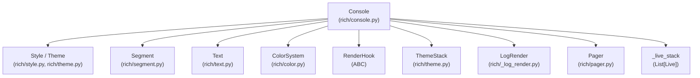
```mermaid
graph TD
    A["Console\n(rich/console.py)"] --> B["Style / Theme\n(rich/style.py, rich/theme.py)"]
    A --> C["Segment\n(rich/segment.py)"]
    A --> D["Text\n(rich/text.py)"]
    A --> E["ColorSystem\n(rich/color.py)"]
    A --> F["RenderHook\n(ABC)"]
    A --> G["ThemeStack\n(rich/theme.py)"]
    A --> H["LogRender\n(rich/_log_render.py)"]
    A --> I["Pager\n(rich/pager.py)"]
    A --> J["_live_stack\n(List[Live])"]
```

Sources: [rich/console.py:1-64](), [rich/console.py:612-624]()

---

## Constructor Parameters

`Console.__init__` accepts only keyword arguments. The constructor initializes terminal detection and sets up the internal state required for rendering [rich/console.py:625-658]().

### Parameter Reference

| Parameter | Type | Default | Purpose |
|---|---|---|---|
| `color_system` | `str \| None` | `"auto"` | Color system: `None`, `"auto"`, `"standard"`, `"256"`, `"truecolor"`, `"windows"` [rich/console.py:627]() |
| `force_terminal` | `bool \| None` | `None` | Override terminal detection; `None` = auto-detect [rich/console.py:628]() |
| `force_jupyter` | `bool \| None` | `None` | Override Jupyter detection; `None` = auto-detect [rich/console.py:629]() |
| `force_interactive` | `bool \| None` | `None` | Override interactive mode; `None` = auto-detect [rich/console.py:630]() |
| `soft_wrap` | `bool` | `False` | Default soft-wrap for `print()` [rich/console.py:631]() |
| `theme` | `Theme \| None` | `None` | Style theme; `None` uses `themes.DEFAULT` [rich/console.py:632]() |
| `stderr` | `bool` | `False` | Write to `sys.stderr` instead of `sys.stdout` [rich/console.py:633]() |
| `file` | `IO[str] \| None` | `None` | Explicit output file; overrides `stderr` [rich/console.py:634]() |
| `quiet` | `bool` | `False` | Suppress all output [rich/console.py:635]() |
| `width` | `int \| None` | `None` | Fixed width; auto-detected if `None` [rich/console.py:636]() |
| `height` | `int \| None` | `None` | Fixed height; auto-detected if `None` [rich/console.py:637]() |
| `style` | `StyleType \| None` | `None` | Global style applied to all output [rich/console.py:638]() |
| `no_color` | `bool \| None` | `None` | Disable color; `None` reads `NO_COLOR` env var [rich/console.py:639]() |
| `tab_size` | `int` | `8` | Spaces per tab character [rich/console.py:641]() |
| `record` | `bool` | `False` | Buffer output for later export [rich/console.py:642]() |
| `markup` | `bool` | `True` | Enable console markup by default [rich/console.py:643]() |
| `emoji` | `bool` | `True` | Enable emoji code substitution [rich/console.py:644]() |
| `emoji_variant` | `EmojiVariant \| None` | `None` | Force `"text"` or `"emoji"` variant [rich/console.py:645]() |
| `highlight` | `bool` | `True` | Enable automatic highlighting [rich/console.py:646]() |
| `log_time` | `bool` | `True` | Show timestamp in `log()` output [rich/console.py:647]() |
| `log_path` | `bool` | `True` | Show caller file/line in `log()` output [rich/console.py:648]() |
| `log_time_format` | `str \| Callable` | `"[%X]"` | Timestamp format for `log()` [rich/console.py:649]() |
| `highlighter` | `HighlighterType \| None` | `ReprHighlighter()` | Default auto-highlighter [rich/console.py:651]() |
| `legacy_windows` | `bool \| None` | `None` | Force legacy Windows mode; `None` = auto-detect [rich/console.py:652]() |
| `safe_box` | `bool` | `True` | Restrict box characters for legacy Windows [rich/console.py:653]() |

Sources: [rich/console.py:625-658](), [rich/console.py:587-623]()

---

## Terminal and Color Detection

### Color System Auto-Detection

When `color_system="auto"` (the default), `Console._detect_color_system()` is called [rich/console.py:795](). Detection logic prioritizes environment variables and terminal capability probes.

**Diagram: Color system detection flow**

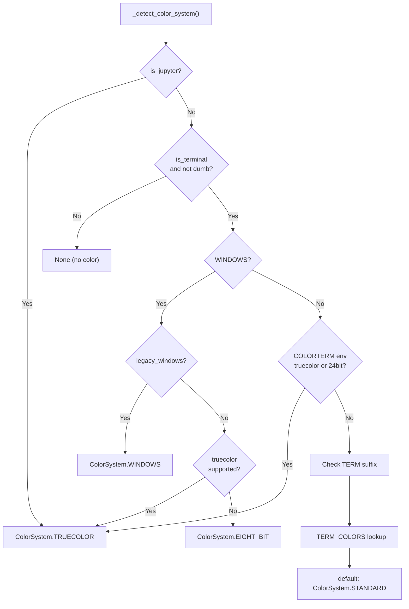
```mermaid
flowchart TD
    Start["_detect_color_system()"] --> Jup{"is_jupyter?"}
    Jup -- Yes --> TC["ColorSystem.TRUECOLOR"]
    Jup -- No --> Term{"is_terminal\nand not dumb?"}
    Term -- No --> NoneCS["None (no color)"]
    Term -- Yes --> Win{"WINDOWS?"}
    Win -- Yes --> LegWin{"legacy_windows?"}
    LegWin -- Yes --> WinCS["ColorSystem.WINDOWS"]
    LegWin -- No --> WinFeat{"truecolor\nsupported?"}
    WinFeat -- Yes --> TC
    WinFeat -- No --> EightBit["ColorSystem.EIGHT_BIT"]
    Win -- No --> CT{"COLORTERM env\ntruecolor or 24bit?"}
    CT -- Yes --> TC
    CT -- No --> TermEnv["Check TERM suffix"]
    TermEnv --> _TERM_COLORS["_TERM_COLORS lookup"]
    _TERM_COLORS --> Default["default: ColorSystem.STANDARD"]
```

Sources: [rich/console.py:795-817](), [rich/console.py:96-100]()

### Environment Variables

The `Console` class respects several standard and library-specific environment variables to control output behavior.

| Variable | Effect |
|---|---|
| `NO_COLOR` | Disables all color output if set [rich/console.py:734-738](). |
| `FORCE_COLOR` | Enables color regardless of terminal detection [rich/console.py:739-743](). |
| `TERM` | If set to `"dumb"`, color and complex terminal features are disabled [rich/console.py:801-804](). |
| `COLORTERM` | Set to `"truecolor"` or `"24bit"` to enable 24-bit color [rich/console.py:821-823](). |
| `COLUMNS` | Overrides auto-detected terminal width [rich/console.py:1162-1165](). |
| `LINES` | Overrides auto-detected terminal height [rich/console.py:1162-1165](). |

Sources: [rich/console.py:663-748](), [docs/source/console.rst:416-441]()

---

## Thread Safety

`Console` is designed to be thread-safe. It uses a `threading.RLock` to guard shared resources like the record buffer and render hooks [rich/console.py:720](). Per-thread state, such as the active theme stack and the print buffer, is stored in a `threading.local` object via the `ConsoleThreadLocals` class [rich/console.py:541-548]().

**Diagram: Console Threading Architecture**

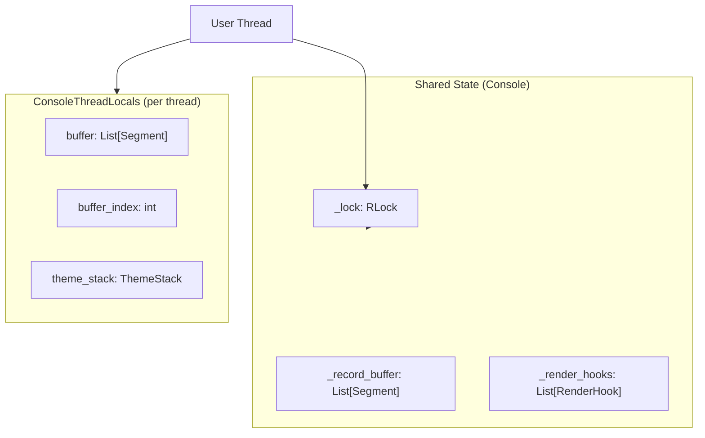
```mermaid
graph TD
    subgraph SharedState ["Shared State (Console)"]
        Lock["_lock: RLock"]
        RecBuf["_record_buffer: List[Segment]"]
        Hooks["_render_hooks: List[RenderHook]"]
    end
    subgraph ThreadLocal ["ConsoleThreadLocals (per thread)"]
        Buf["buffer: List[Segment]"]
        Idx["buffer_index: int"]
        Stack["theme_stack: ThemeStack"]
    end
    Thread["User Thread"] --> ThreadLocal
    Thread --> Lock
    Lock --> SharedState
```

Sources: [rich/console.py:541-548](), [rich/console.py:720-757]()

---

## Public Methods

### Output Methods

*   `print(*objects, ...)`: The primary method for writing to the terminal. It handles markup, highlighting, and rendering protocols [rich/console.py:1624-1748]().
*   `log(*objects, ...)`: Similar to `print`, but includes a timestamp and the file/line where it was called [rich/console.py:1750-1813](). It uses the `LogRender` helper class to format the output into a grid [rich/_log_render.py:14-86]().
*   `out(*objects, ...)`: A lower-level output method that skips markup and wrapping [rich/console.py:1604-1622]().
*   `print_json(json, ...)`: Pretty-prints and highlights a JSON string or object [rich/console.py:1815-1853]().

### UI Components

*   `rule(title, ...)`: Draws a horizontal line with an optional title [rich/console.py:1856-1895]().
*   `status(status, ...)`: Displays a temporary status message with a spinner [rich/console.py:1931-1971]().
*   `input(prompt, ...)`: Displays a prompt and reads user input, supporting password masking [rich/console.py:1897-1929]().

### Control and Utility

*   `bell()`: Rings the terminal bell [rich/console.py:1973-1978]().
*   `clear(home=True)`: Clears the terminal screen [rich/console.py:1980-1997]().
*   `capture()`: Context manager to capture console output as a string [rich/console.py:2024-2038]().
*   `pager(...)`: Context manager to display output in a system pager via the `Pager` and `SystemPager` classes [rich/console.py:2040-2075](), [rich/pager.py:5-25]().

Sources: [rich/console.py:1624-2118](), [rich/_log_render.py:14-86](), [rich/pager.py:5-25]()

---

## ConsoleOptions and Dimensions

`ConsoleOptions` is a dataclass passed to renderables via the `__rich_console__` protocol. It contains the current state of the console required for rendering (e.g., width, height, encoding) [rich/console.py:113-141]().

**Diagram: Console Configuration Objects**

```mermaid
classDiagram
    class Console {
        +size ConsoleDimensions
        +options ConsoleOptions
        +print(objects)
    }
    class ConsoleOptions {
        +size: ConsoleDimensions
        +min_width: int
        +max_width: int
        +is_terminal: bool
        +encoding: str
        +update() ConsoleOptions
    }
    class ConsoleDimensions {
        +width: int
        +height: int
    }
    Console --> ConsoleOptions
    ConsoleOptions --> ConsoleDimensions
```

Sources: [rich/console.py:103-110](), [rich/console.py:113-249]()

---

# Page: Rendering Pipeline

# Rendering Pipeline

<details>
<summary>Relevant source files</summary>

The following files were used as context for generating this wiki page:

- [docs/source/console.rst](docs/source/console.rst)
- [docs/source/highlighting.rst](docs/source/highlighting.rst)
- [docs/source/introduction.rst](docs/source/introduction.rst)
- [docs/source/protocol.rst](docs/source/protocol.rst)
- [docs/source/syntax.rst](docs/source/syntax.rst)
- [examples/highlighter.py](examples/highlighter.py)
- [examples/rainbow.py](examples/rainbow.py)
- [rich/console.py](rich/console.py)
- [rich/errors.py](rich/errors.py)
- [rich/protocol.py](rich/protocol.py)
- [rich/region.py](rich/region.py)
- [rich/repr.py](rich/repr.py)
- [rich/segment.py](rich/segment.py)
- [tests/test_console.py](tests/test_console.py)
- [tests/test_repr.py](tests/test_repr.py)
- [tests/test_segment.py](tests/test_segment.py)
- [tests/test_style.py](tests/test_style.py)

</details>


This page describes how Rich transforms user-supplied objects into terminal output — the complete journey from a call to `console.print()` down to ANSI escape sequences written to a file handle. It covers protocol resolution, `ConsoleOptions`, the `render()` and `render_lines()` methods, the output buffering system, and the `RenderHook` interception mechanism.

For documentation on the `Console` class itself (constructor, color detection, public API), see [Console](#2.1). For the `Segment` type that is the end product of rendering, see [Segments](#2.3). For the `Style` and `Color` types used within segments, see [Styles and Colors](#2.4).

---

## Overview

The rendering pipeline converts any Python object that satisfies the renderable protocol into a flat stream of `Segment` objects, then serializes those segments to ANSI-escaped strings and writes them to the console's output file.

**Pipeline stages diagram:**

```mermaid
flowchart TD
    A["User code\nconsole.print(obj)"] --> B["Protocol resolution\nrich_cast()  __rich__  __rich_console__"]
    B --> C["ConsoleOptions\n(width, height, encoding, justify ...)"]
    C --> D["Console.render()\nyields Segment objects"]
    D --> E["RenderHook.process_renderables()\n(optional interception)"]
    E --> F["_buffer\nList[Segment] per thread"]
    F --> G["_check_buffer()\n_render_buffer()"]
    G --> H["ANSI string\nwritten to console.file"]
```

Sources: [rich/console.py:49-52](), [rich/console.py:819-861](), [rich/protocol.py:18-41]()

---

## The Renderable Protocol

Rich defines two complementary protocols and one union type that together describe anything renderable.

### `RichCast` — the simple protocol

```python
class RichCast(Protocol):
    def __rich__(self) -> Union[ConsoleRenderable, RichCast, str]: ...
```

An object implementing `__rich__` delegates rendering to whatever it returns. The return value may itself be a `RichCast`, so resolution is recursive. The helper function `rich_cast` (defined in `rich/protocol.py`) keeps calling `__rich__()` until it reaches a non-`RichCast` value.

### `ConsoleRenderable` — the full protocol

```python
class ConsoleRenderable(Protocol):
    def __rich_console__(
        self, console: Console, options: ConsoleOptions
    ) -> RenderResult: ...
```

`__rich_console__` is passed the live `Console` and a `ConsoleOptions` snapshot. It returns `RenderResult`, which is an iterable of either nested renderables or raw `Segment` objects. This recursive design means a `Table` can yield `Panel` objects, which yield `Text` objects, which yield `Segment` objects, and it all resolves in one pass.

### Protocol resolution flow

```mermaid
flowchart TD
    Input["RenderableType\ninput object"] --> IsStr{"isinstance\nstr?"}
    IsStr -- "Yes" --> ToText["Convert to Text\n(markup + highlighter)"]
    IsStr -- "No" --> HasRich{"hasattr\n__rich__?"}
    HasRich -- "Yes" --> CallRich["rich_cast(obj)\ncalls __rich__ recursively"]
    CallRich --> Input
    HasRich -- "No" --> HasConsole{"hasattr\n__rich_console__?"}
    HasConsole -- "Yes" --> CallConsole["obj.__rich_console__\n(console, options)"]
    CallConsole --> Recurse["render() each\nyielded item recursively"]
    HasConsole -- "No" --> Error["raise NotRenderableError"]
    ToText --> Segments["yield Segment objects"]
    Recurse --> Segments
```

Sources: [rich/console.py:828-847](), [rich/protocol.py:18-41](), [rich/protocol.py:9-15]()

---

## ConsoleOptions

`ConsoleOptions` is a `@dataclass` passed to every `__rich_console__` method. It carries rendering constraints and terminal state from the console.

### Fields

| Field | Type | Description |
|---|---|---|
| `size` | `ConsoleDimensions` | Full terminal size (width × height) |
| `min_width` | `int` | Minimum width the renderable must fit within |
| `max_width` | `int` | Maximum width available |
| `max_height` | `int` | Maximum height of the enclosing container |
| `height` | `Optional[int]` | Fixed height constraint |
| `is_terminal` | `bool` | `True` when writing to an interactive terminal |
| `encoding` | `str` | File encoding, e.g. `"utf-8"` |
| `legacy_windows` | `bool` | Restricts box characters on old Windows consoles |
| `justify` | `Optional[JustifyMethod]` | Overrides text alignment |
| `overflow` | `Optional[OverflowMethod]` | Overrides overflow handling |
| `no_wrap` | `Optional[bool]` | Disables line-wrapping when `True` |

### Mutation methods

`ConsoleOptions` uses mutation methods that return a **copy** to maintain immutability for child renderables.

| Method | What it changes |
|---|---|
| `copy()` | Returns an identical copy [rich/console.py:147-155]() |
| `update(**kwargs)` | Sets any combination of fields [rich/console.py:157-192]() |
| `update_width(width)` | Sets both `min_width` and `max_width` [rich/console.py:194-205]() |
| `update_height(height)` | Sets both `height` and `max_height` [rich/console.py:207-218]() |
| `reset_height()` | Sets height to `None` for children [rich/console.py:220-227]() |

Sources: [rich/console.py:112-249]()

---

## `Console.render()`

`Console.render(renderable, options)` is the core recursive function. It resolves the renderable protocol and yields a flat stream of `Segment` objects.

The method logic:
1. Calls `rich_cast(renderable)` to resolve `__rich__` chains [rich/console.py:831]().
2. If the result is a `str`, it is processed via markup and highlighters [rich/console.py:833-841]().
3. If the result implements `__rich_console__`, it is called with `(self, options)` [rich/console.py:844]().
4. Yielded items are recursively passed back into `render()` [rich/console.py:845]().

```mermaid
sequenceDiagram
    participant C as "Console.render()"
    participant RC as "rich_cast()"
    participant RC2 as "__rich_console__()"
    participant S as "Segment stream"

    C->>RC: "rich_cast(renderable)"
    RC-->>C: "resolved object"
    C->>RC2: "obj.__rich_console__(console, options)"
    RC2-->>C: "RenderResult (iterable)"
    loop "for each yielded item"
        C->>C: "render(item, options) recursively"
    end
    C-->>S: "yield Segment objects"
```

Sources: [rich/console.py:828-847](), [rich/protocol.py:18-41]()

---

## `Console.render_lines()`

`render_lines()` is used when output must be a fixed-width grid of lines. It:

1. Calls `render()` to produce a raw `Segment` stream [rich/console.py:858]().
2. Passes the stream through `Segment.split_and_crop_lines()`, which splits on newlines and pads/crops lines to `max_width` [rich/console.py:859]().
3. Returns `List[List[Segment]]` — a list of lines, where each line is a list of `Segment` objects.

This is essential for components like `Panel` or `Layout` that require exact cell-level alignment.

Sources: [rich/console.py:849-861](), [rich/segment.py:309-354]()

---

## Output Buffering

The console maintains a **per-thread output buffer** to accumulate output before flushing.

### Buffer storage

The `ConsoleThreadLocals` class (inheriting from `threading.local`) manages thread-specific state.

```python
@dataclass
class ConsoleThreadLocals(threading.local):
    theme_stack: ThemeStack
    buffer: List[Segment] = field(default_factory=list)
    buffer_index: int = 0
```

`buffer_index` acts as a nesting counter. When it reaches `0`, the buffer is eligible to flush to the terminal.

| Operation | Effect |
|---|---|
| `_enter_buffer()` | Increments `_buffer_index` [rich/console.py:863-865]() |
| `_exit_buffer()` | Decrements `_buffer_index`, then calls `_check_buffer()` [rich/console.py:867-870]() |
| `_check_buffer()` | Flushes and writes if `_buffer_index == 0` [rich/console.py:872-874]() |

### Capture mode

`capture()` uses this mechanism to redirect output into an internal buffer which can then be retrieved as a string via `Capture.get()`.

Sources: [rich/console.py:542-547](), [rich/console.py:863-885]()

---

## The `RenderHook` Mechanism

`RenderHook` is an abstract base class that allows interception of renderables just before they are processed.

```python
class RenderHook(ABC):
    @abstractmethod
    def process_renderables(
        self, renderables: List[ConsoleRenderable]
    ) -> List[ConsoleRenderable]:
        ...
```

The `Console` maintains a `_render_hooks` stack. Every time `print()` is called, the list of objects is passed through all active hooks. This is primarily used by the `Live` display to intercept output and route it through its own refresh logic.

| Method | Effect |
|---|---|
| `push_render_hook(hook)` | Appends a hook to the stack [rich/console.py:750-752]() |
| `pop_render_hook()` | Removes the most recent hook [rich/console.py:754-756]() |

```mermaid
flowchart LR
    P["console.print(renderable)"] --> RL["_render_hooks stack"]
    RL --> H1["RenderHook 1\nprocess_renderables()"]
    H1 --> H2["RenderHook 2\nprocess_renderables()"]
    H2 --> R["Console.render()\nyields Segments"]
    R --> B["_buffer"]
```

Sources: [rich/console.py:750-756](), [rich/console.py:828-831]()

---

# Page: Segments

# Segments

<details>
<summary>Relevant source files</summary>

The following files were used as context for generating this wiki page:

- [rich/_emoji_codes.py](rich/_emoji_codes.py)
- [rich/_unicode_data/__init__.py](rich/_unicode_data/__init__.py)
- [rich/_unicode_data/_versions.py](rich/_unicode_data/_versions.py)
- [rich/ansi.py](rich/ansi.py)
- [rich/cells.py](rich/cells.py)
- [rich/segment.py](rich/segment.py)
- [tests/test_ansi.py](tests/test_ansi.py)
- [tests/test_cells.py](tests/test_cells.py)
- [tests/test_segment.py](tests/test_segment.py)
- [tests/test_style.py](tests/test_style.py)
- [tests/test_unicode_data.py](tests/test_unicode_data.py)
- [tools/make_emoji.py](tools/make_emoji.py)

</details>


This page documents the `Segment` NamedTuple — the atomic output unit of Rich's rendering pipeline — along with the cell-width measurement system and the bulk operations that transform collections of segments into fixed-width lines. For how segments are produced from renderables, see the [Rendering Pipeline](#2.2). For the `Style` objects that segments carry, see [Styles and Colors](#2.4).

---

## Role in the Rendering Pipeline

Every object rendered by Rich is ultimately converted into a stream of `Segment` instances before any bytes reach the terminal. A `Segment` pairs a string of text with an optional `Style` and an optional sequence of control codes. The `Console` collects these segments, resolves styles to ANSI escape codes, and writes the result.

**Segment position in data flow**

```mermaid
flowchart LR
    R["Renderable\n(__rich_console__)"] --> C["Console.render()"]
    C --> S["Stream of Segment"]
    S --> AL["adjust_line_length /\nsplit_and_crop_lines"]
    AL --> OUT["Terminal output\n(ANSI strings)"]
```

Sources: [rich/segment.py:61-77](), [rich/segment.py:310-354]()

---

## The `Segment` NamedTuple

Defined in [rich/segment.py:61-77](), `Segment` is a `NamedTuple` with three fields:

| Field | Type | Description |
|---|---|---|
| `text` | `str` | The printable (or control) text payload |
| `style` | `Optional[Style]` | Visual style to apply; `None` for unstyled |
| `control` | `Optional[Sequence[ControlCode]]` | Non-printable control codes; `None` for regular text |

Key properties and methods on a `Segment` instance:

| Member | Kind | Description |
|---|---|---|
| `cell_length` | property | Terminal cell width of `text`; `0` for control segments [rich/segment.py:78-86]() |
| `is_control` | property | `True` if `control` is not `None` [rich/segment.py:101-104]() |
| `split_cells(cut)` | method | Split at a cell column offset; handles wide chars [rich/segment.py:155-180]() |
| `__bool__` | method | `True` if `text` is non-empty [rich/segment.py:97-99]() |

### Control Segments

When `control` is set, the segment carries terminal control codes rather than visible text. The `ControlType` enum [rich/segment.py:32-50]() enumerates every supported code:

| ControlType | Value | Purpose |
|---|---|---|
| `BELL` | 1 | Terminal bell |
| `CARRIAGE_RETURN` | 2 | Move to column 0 |
| `HOME` | 3 | Move cursor to origin |
| `CLEAR` | 4 | Clear screen |
| `SHOW_CURSOR` / `HIDE_CURSOR` | 5, 6 | Cursor visibility |
| `ENABLE_ALT_SCREEN` / `DISABLE_ALT_SCREEN` | 7, 8 | Alternate screen buffer |
| `CURSOR_UP/DOWN/FORWARD/BACKWARD` | 9–12 | Relative cursor motion |
| `CURSOR_MOVE_TO_COLUMN` | 13 | Absolute column position |
| `CURSOR_MOVE_TO` | 14 | Absolute (row, col) position |
| `ERASE_IN_LINE` | 15 | Erase from cursor to end of line |
| `SET_WINDOW_TITLE` | 16 | Terminal window title |

A `ControlCode` is a union of tuples containing `ControlType` and optional parameters [rich/segment.py:53-57]().

**Segment type taxonomy**

```mermaid
classDiagram
    class Segment {
        +str text
        +Style style
        +Sequence~ControlCode~ control
        +int cell_length
        +bool is_control
        +split_cells(cut) Tuple
        +__bool__() bool
    }
    class ControlType {
        <<IntEnum>>
        BELL
        CARRIAGE_RETURN
        HOME
        CLEAR
        SHOW_CURSOR
        HIDE_CURSOR
        ENABLE_ALT_SCREEN
        DISABLE_ALT_SCREEN
        CURSOR_UP
        CURSOR_DOWN
        CURSOR_FORWARD
        CURSOR_BACKWARD
        CURSOR_MOVE_TO_COLUMN
        CURSOR_MOVE_TO
        ERASE_IN_LINE
        SET_WINDOW_TITLE
    }
    Segment --> ControlType : "control field uses"
    Segment --> Style : "style field"
```

Sources: [rich/segment.py:32-104]()

---

## Cell-Width Measurement

A terminal cell is one character column. ASCII characters occupy one cell; many CJK, emoji, and other Unicode characters occupy two. Some characters (combining marks, zero-width joiners) occupy zero cells.

The measurement machinery lives in [rich/cells.py]() and [rich/_unicode_data/]().

### Key functions in `rich/cells.py`

| Function | Signature | Description |
|---|---|---|
| `cell_len` | `(text, unicode_version="auto") -> int` | Cell length of a string; uses cache for strings shorter than 512 chars [rich/cells.py:98-110]() |
| `cached_cell_len` | `(text, unicode_version="auto") -> int` | Always-cached variant via `lru_cache` [rich/cells.py:81-95]() |
| `get_character_cell_size` | `(character, unicode_version="auto") -> int` | Cell width of a single character (0, 1, or 2) [rich/cells.py:47-78]() |
| `set_cell_size` | `(text, total, unicode_version="auto") -> str` | Crop or pad a string to exactly `total` cells [rich/cells.py:255-279]() |
| `split_text` | `(text, cell_position, unicode_version="auto") -> Tuple[str, str]` | Split a string at a cell offset; pads double-wide chars split in half [rich/cells.py:282-323]() |
| `split_graphemes` | `(text, unicode_version="auto") -> Tuple[List[CellSpan], int]` | Break a string into grapheme spans with per-grapheme cell lengths [rich/cells.py:161-252]() |
| `chop_cells` | `(text, width, unicode_version="auto") -> List[str]` | Divide text into lines of at most `width` cells [rich/cells.py:326-348]() |

`_is_single_cell_widths` [rich/cells.py:35]() is a fast `frozenset.issuperset` check that short-circuits measurement for common ASCII and Latin text defined in `_SINGLE_CELL_UNICODE_RANGES` [rich/cells.py:15-22]().

### Unicode Version Handling

Width tables are pre-computed per Unicode version and stored as `CellTable` NamedTuples [rich/cells.py:38-43](). The `load()` function [rich/_unicode_data/__init__.py:59-93]() selects the closest available version no higher than the requested one by performing a `bisect_left` on `VERSION_ORDER` [rich/_unicode_data/__init__.py:85-86](). The active version is controlled by the `UNICODE_VERSION` environment variable; `"auto"` reads that variable or falls back to `"latest"`.

Supported versions are listed in [rich/_unicode_data/_versions.py]() (currently 4.1.0 through 17.0.0).

**Cell-width measurement call chain**

```mermaid
flowchart TD
    SL["Segment.cell_length\n(property)"] --> CL["cell_len(text)"]
    CL --> FAST["_is_single_cell_widths(text)\n→ len(text)"]
    CL --> CACHE["cached_cell_len(text)\n(lru_cache, len < 512)"]
    CL --> FULL["_cell_len(text, version)"]
    FULL --> GCHAR["get_character_cell_size(char)\n(lru_cache 4096)"]
    GCHAR --> LOAD["load(unicode_version)\n→ CellTable.widths\nbinary search"]
```

Sources: [rich/cells.py:47-110](), [rich/_unicode_data/__init__.py:59-93](), [rich/segment.py:78-86]()

---

## Bulk Segment Operations

All bulk operations are classmethods on `Segment`. They operate on iterables or lists of `Segment` objects and are used heavily inside the rendering pipeline.

### `split_cells(cut)` — Split at a Cell Column

[rich/segment.py:155-180]()

Splits a single `Segment` into two at the given cell offset. If the cut falls in the middle of a 2-cell wide character (e.g., a CJK character or emoji), both halves are replaced with a space to preserve total width [rich/segment.py:140-149]().

Fast path: if all characters in `text` are single-cell, uses plain string slicing via `_is_single_cell_widths` [rich/segment.py:170-177](). Otherwise delegates to `_split_cells` (LRU-cached at 16,384 entries) [rich/segment.py:107-153]().

### `split_lines(segments)` — Segment Stream → Lines

[rich/segment.py:250-276]()

Splits a flat stream of segments on `\n` characters, yielding one `List[Segment]` per line. Does not include the newline segments in the output lists.

### `split_lines_terminator(segments)`

[rich/segment.py:279-307]()

Like `split_lines`, but each yielded item is `(List[Segment], bool)` where the boolean indicates whether the line was terminated by a newline.

### `split_and_crop_lines(segments, length, style, pad, include_new_lines)` — Core Layout Operation

[rich/segment.py:310-354]()

The workhorse of the rendering pipeline. Splits on newlines **and** enforces a fixed line width by calling `adjust_line_length` on each line. Returns an iterable of fixed-width `List[Segment]` rows — the format consumed by `Console._render_buffer` when writing to the terminal.

Parameters:

| Parameter | Default | Description |
|---|---|---|
| `length` | — | Target cell width |
| `style` | `None` | Style for padding spaces |
| `pad` | `True` | Pad short lines with spaces |
| `include_new_lines` | `True` | Append `Segment("\n")` to each cropped line |

### `adjust_line_length(line, length, style, pad)` — Crop or Pad One Line

[rich/segment.py:357-399]()

Adjusts a single `List[Segment]` to exactly `length` cells:

- **Too short + pad=True**: appends a space-padding segment with the given style [rich/segment.py:368-372]().
- **Too long**: iterates segments, including whole ones until adding the next would exceed `length`, then trims the last segment via `split_cells` [rich/segment.py:378-397]().
- **Exact**: returns a copy unchanged.

### `divide(segments, cuts)` — Column-Based Division

[rich/segment.py:633-699]()

Divides a segment stream into N groups based on a sorted list of cell positions `cuts`. Each cut is an absolute column offset. Segments that span a cut boundary are split. Yields `List[Segment]` per division, handling wide characters the same way `split_cells` does.

### `simplify(segments)` — Merge Adjacent Same-Style Segments

[rich/segment.py:554-578]()

Scans a segment stream and merges consecutive segments that have identical styles and are not control segments. Reduces segment count without changing visual output.

### `apply_style(segments, style, post_style)` — Wrap Styles

[rich/segment.py:187-225]()

Returns a new iterable where each segment's effective style is `style + segment.style + post_style`. Either or both wrapper styles may be `None`. Control segments pass through unchanged (their style is set to `None`).

### Style-Stripping Helpers

| Method | Description |
|---|---|
| `strip_styles(segments)` | Replace every style with `None` [rich/segment.py:581-591]() |
| `strip_links(segments)` | Remove hyperlinks but keep other style attributes [rich/segment.py:594-609]() |
| `remove_color(segments)` | Remove color components; keep bold/italic etc. [rich/segment.py:612-631]() |

### Geometry Helpers

| Method | Signature | Description |
|---|---|---|
| `get_line_length(line)` | `List[Segment] -> int` | Sum of cell lengths for a single row [rich/segment.py:401-410]() |
| `get_shape(lines)` | `List[List[Segment]] -> Tuple[int,int]` | `(max_width, height)` of a 2D grid [rich/segment.py:413-424]() |
| `set_shape(lines, width, height, style, new_lines)` | — | Crop/pad a grid to exact dimensions [rich/segment.py:427-470]() |
| `align_top(lines, width, height, style)` | — | Pad rows below to reach `height` [rich/segment.py:473-497]() |
| `align_bottom(lines, width, height, style)` | — | Pad rows above to reach `height` [rich/segment.py:500-524]() |
| `align_middle(lines, width, height, style)` | — | Distribute padding above and below [rich/segment.py:527-551]() |

---

## Operation Overview Diagram

```mermaid
flowchart LR
    subgraph "Stream operations"
        SL["split_lines()"]
        SLT["split_lines_terminator()"]
        SAC["split_and_crop_lines()"]
        DIV["divide()"]
        SIMP["simplify()"]
        APST["apply_style()"]
        FC["filter_control()"]
    end
    subgraph "Line operations"
        ALL["adjust_line_length()"]
        SC["split_cells()"]
    end
    subgraph "Geometry"
        GLL["get_line_length()"]
        GS["get_shape()"]
        SS["set_shape()"]
        AT["align_top/middle/bottom()"]
    end
    SAC --> ALL
    ALL --> SC
    DIV --> SC
    SL --> SLT
```

Sources: [rich/segment.py:155-699]()

---

## `Segments` and `SegmentLines` Renderables

Two lightweight wrapper classes let you feed raw segment data back into the rendering protocol.

### `Segments`

[rich/segment.py:702-724]()

Wraps an `Iterable[Segment]` and implements `__rich_console__`. When `new_lines=True`, emits a `Segment("\n")` after each segment.

### `SegmentLines`

[rich/segment.py:727-749]()

Wraps an `Iterable[List[Segment]]` (a list of rows) and implements `__rich_console__`. When `new_lines=True`, appends a newline segment after each row.

```mermaid
classDiagram
    class Segments {
        +List~Segment~ segments
        +bool new_lines
        +__rich_console__(console, options) RenderResult
    }
    class SegmentLines {
        +List~List~Segment~~ lines
        +bool new_lines
        +__rich_console__(console, options) RenderResult
    }
    Segments --> Segment : "yields"
    SegmentLines --> Segment : "yields rows of"
```

Sources: [rich/segment.py:702-749]()

---

## ANSI Decoding

`AnsiDecoder` in [rich/ansi.py:120-211]() performs the reverse operation: it converts strings containing ANSI escape codes back into `Text` objects with `Style` spans.

The decoder tokenizes the input with `_ansi_tokenize` [rich/ansi.py:28-56]() which uses the regex `re_ansi` [rich/ansi.py:10-17]() to identify plain text, SGR sequences (`\x1b[...m`), and OSC sequences. SGR codes are mapped to `Style` modifiers via `SGR_STYLE_MAP` [rich/ansi.py:59-117](), covering bold, italic, colors, and more.

The decoder maintains a running `self.style` [rich/ansi.py:124]() across calls, making it suitable for processing terminal output incrementally via `decode_line` [rich/ansi.py:138-211]().

```mermaid
flowchart TD
    INPUT["ANSI string"] --> TOK["_ansi_tokenize()\nre_ansi regex"]
    TOK --> PLAIN["plain text token\n→ text.append(plain, style)"]
    TOK --> SGR["SGR token (\\x1b[...m)\n→ update self.style\nvia SGR_STYLE_MAP"]
    TOK --> OSC["OSC token (\\x1b]8;...)\n→ update self.style.link"]
    PLAIN --> TEXT["Text object\n(with Span list)"]
```

Sources: [rich/ansi.py:10-211]()

---

## Segment Lifecycle Summary

```mermaid
sequenceDiagram
    participant U as "User code"
    participant C as "Console"
    participant R as "Renderable\n(__rich_console__)"
    participant S as "Segment stream"
    participant W as "Terminal write"

    U->>C: console.print(obj)
    C->>R: render(obj, options)
    R-->>S: yields Segment instances
    S->>S: split_and_crop_lines()\n(enforces terminal width)
    S->>S: simplify()\n(optional merge)
    S->>W: Style.render(text) per segment\n→ ANSI string bytes
```

Sources: [rich/segment.py:310-399](), [rich/segment.py:554-578]()

---

# Page: Styles and Colors

# Styles and Colors

<details>
<summary>Relevant source files</summary>

The following files were used as context for generating this wiki page:

- [docs/source/markup.rst](docs/source/markup.rst)
- [docs/source/style.rst](docs/source/style.rst)
- [rich/color.py](rich/color.py)
- [rich/default_styles.py](rich/default_styles.py)
- [rich/highlighter.py](rich/highlighter.py)
- [rich/markup.py](rich/markup.py)
- [rich/style.py](rich/style.py)
- [tests/test_color.py](tests/test_color.py)
- [tests/test_highlighter.py](tests/test_highlighter.py)
- [tests/test_markup.py](tests/test_markup.py)

</details>


This document covers the `Style` and `Color` classes, which are fundamental building blocks for terminal rendering in Rich. The `Style` class combines colors and text attributes into an immutable style object, while the `Color` class handles color representation and adaptation to different terminal capabilities.

## Overview

The styling system in Rich consists of two primary classes:

1.  **Style** - Combines foreground color, background color, and text attributes (bold, italic, etc.).
2.  **Color** - Represents terminal colors with support for multiple color systems.

These classes work together to produce ANSI escape sequences that style terminal output.

**Style and Color Architecture**

```mermaid
graph TB
    subgraph stylepymod ["rich/style.py"]
        StyleClass["Style"]
        StyleStackClass["StyleStack"]
        NullStyleNode["NULL_STYLE singleton"]
    end
    subgraph colorpymod ["rich/color.py"]
        ColorClass["Color NamedTuple"]
        ColorTypeEnum["ColorType IntEnum"]
        ColorSystemEnum["ColorSystem IntEnum"]
    end
    subgraph defstylespymod ["rich/default_styles.py"]
        DEFAULT_STYLESDict["DEFAULT_STYLES Dict"]
    end
    subgraph themepymod ["rich/theme.py"]
        ThemeClass["Theme"]
        ThemeStackClass["ThemeStack"]
    end
    subgraph outputgroup ["Output"]
        ANSIOut["ANSI escape codes"]
        CSSOut["CSS style string"]
        SegOut["Segment text+style"]
    end
    StyleClass --> ColorClass
    ColorClass --> ColorTypeEnum
    ColorClass --> ColorSystemEnum
    StyleClass -->|"_make_ansi_codes()"| ANSIOut
    StyleClass -->|"get_html_style()"| CSSOut
    ANSIOut --> SegOut
    DEFAULT_STYLESDict --> ThemeClass
    ThemeClass --> ThemeStackClass
    ThemeStackClass -.->|"get(name)"| StyleClass
    StyleStackClass -.->|"cumulates via __add__"| StyleClass
```

Sources: [rich/style.py:40-151](), [rich/style.py:761-793](), [rich/color.py:21-47](), [rich/color.py:303-314](), [rich/default_styles.py:5-171]()

## Style Class

The `Style` class is an immutable container for terminal styling attributes. It uses bitfield encoding for efficient storage and comparison of text attributes. Throughout the Rich API, the `StyleType` alias [rich/style.py:19]() (`Union[str, "Style"]`) is accepted wherever a style parameter is expected, allowing either a parsed string definition or a pre-constructed `Style` object interchangeably.

### Internal Structure

The `Style` class stores attributes using integer bitfields:

| Slot | Type | Description |
| :--- | :--- | :--- |
| `_color` | `Optional[Color]` | Foreground color |
| `_bgcolor` | `Optional[Color]` | Background color |
| `_attributes` | `int` | Bitfield of active attributes (bold=bit 0, dim=bit 1, etc.) |
| `_set_attributes` | `int` | Bitfield of which attributes are explicitly set |
| `_link` | `Optional[str]` | URL for hyperlinks |
| `_meta` | `Optional[bytes]` | Pickled metadata dictionary |
| `_hash` | `Optional[int]` | Cached hash value |
| `_null` | `bool` | Whether this is a null style (no attributes set) |

The dual bitfield approach (`_attributes` and `_set_attributes`) allows attributes to have three states: unset (`None`), explicitly on (`True`), or explicitly off (`False`).

**Style Attribute Bit Mapping**

```mermaid
graph LR
    subgraph "Attribute Bits [rich/style.py:90-104]"
        Bit0["Bit 0: bold (SGR 1)"]
        Bit1["Bit 1: dim (SGR 2)"]
        Bit2["Bit 2: italic (SGR 3)"]
        Bit3["Bit 3: underline (SGR 4)"]
        Bit4["Bit 4: blink (SGR 5)"]
        Bit5["Bit 5: blink2 (SGR 6)"]
        Bit6["Bit 6: reverse (SGR 7)"]
        Bit7["Bit 7: conceal (SGR 8)"]
        Bit8["Bit 8: strike (SGR 9)"]
        Bit9["Bit 9: underline2 (SGR 21)"]
        Bit10["Bit 10: frame (SGR 51)"]
        Bit11["Bit 11: encircle (SGR 52)"]
        Bit12["Bit 12: overline (SGR 53)"]
    end
```

Sources: [rich/style.py:75-87](), [rich/style.py:90-104](), [rich/style.py:158-205]()

### Style Attributes

The following attributes are supported, accessed via descriptor properties:

| Attribute | Bit | SGR Code | Common Support |
| :--- | :--- | :--- | :--- |
| `bold` | 0 | 1 | High |
| `dim` | 1 | 2 | High |
| `italic` | 2 | 3 | Medium |
| `underline` | 3 | 4 | High |
| `blink` | 4 | 5 | Low |
| `blink2` | 5 | 6 | Very Low |
| `reverse` | 6 | 7 | High |
| `conceal` | 7 | 8 | Low |
| `strike` | 8 | 9 | Medium |
| `underline2` | 9 | 21 | Low |
| `frame` | 10 | 51 | Very Low |
| `encircle` | 11 | 52 | Very Low |
| `overline` | 12 | 53 | Low |

Attributes are accessed via `_Bit` descriptors [rich/style.py:25-36]() that check the corresponding bit in `_set_attributes` to determine if the attribute is set, then check `_attributes` to get its value.

Sources: [rich/style.py:25-36](), [rich/style.py:90-104](), [rich/style.py:106-129]()

### Creating Styles

**Constructor Method**

The `Style.__init__()` constructor [rich/style.py:131-206]() accepts keyword arguments for each attribute:

```python
from rich.style import Style

style = Style(
    color="red",           # Foreground color
    bgcolor="white",       # Background color  
    bold=True,             # Bold text
    italic=True,           # Italic text
    link="https://...",    # Hyperlink URL
    meta={"key": "value"}  # Metadata dictionary
)
```

Colors can be specified as:
*   Color strings: `"red"`, `"#ff0000"`, `"rgb(255,0,0)"`
*   `Color` objects: `Color.parse("red")`

**Parse Method**

`Style.parse()` [rich/style.py:493-557]() creates a `Style` from a space-separated string definition:

```python
style = Style.parse("bold red on white")
style = Style.parse("not bold")  # Explicitly disable bold
style = Style.parse("link https://example.org")
```

The parser handles:
*   Color names: `"red"`, `"blue"`, etc.
*   Background colors: `"on white"`, `"on #ffffff"`
*   Attributes: `"bold"`, `"italic"`, `"underline"`
*   Negated attributes: `"not bold"`, `"not italic"`
*   Links: `"link URL"`
*   Shortcuts: `"b"` for bold, `"i"` for italic, `"u"` for underline

The parser is cached with `@lru_cache(maxsize=4096)` [rich/style.py:492]() for performance.

**Factory Methods**

*   `Style.null()` [rich/style.py:208-211]() - Returns the singleton `NULL_STYLE` (empty style).
*   `Style.from_color()` [rich/style.py:213-230]() - Creates a style with only colors.
*   `Style.from_meta()` [rich/style.py:232-251]() - Creates a style with only metadata.
*   `Style.on()` [rich/style.py:253-269]() - Creates a style with metadata for event handlers.

Sources: [rich/style.py:131-206](), [rich/style.py:493-557](), [rich/style.py:208-269]()

### Style Composition

Styles are combined using the `+` operator, which calls `Style._add()` [rich/style.py:729-751](). The composition follows these rules:

1.  **Color precedence**: The right operand's colors override the left operand's.
2.  **Attribute merging**: Attributes from both styles are combined.
3.  **Link precedence**: The right operand's link overrides the left operand's.
4.  **Meta merging**: Metadata dictionaries are merged.

**Style Addition Logic**

```mermaid
graph TB
    StyleA["Style A\ncolor=red\nbold=True"]
    StyleB["Style B\ncolor=None\nitalic=True"]
    Add["+ operator"]
    Result["Result\ncolor=red\nbold=True\nitalic=True"]
    
    StyleA --> Add
    StyleB --> Add
    Add --> Result
    
    subgraph "Composition Rules [rich/style.py:729-751]"
        Rule1["Right color overrides left"]
        Rule2["Attributes are merged via bitwise logic"]
        Rule3["Right link overrides left"]
        Rule4["Meta dicts are merged"]
    end
```

The `_add()` method uses bitwise operations to combine attributes efficiently:

```python
new_attributes = (left_attributes & ~right_set_attributes) | (right_attributes & right_set_attributes)
new_set_attributes = left_set_attributes | right_set_attributes
```

This ensures that explicitly set attributes in the right operand override any attributes from the left operand [rich/style.py:743-744]().

**Style Chaining Methods**

*   `Style.chain(*styles)` [rich/style.py:609-620]() - Combines multiple styles left-to-right.
*   `Style.combine(styles)` [rich/style.py:596-607]() - Same as chain but takes an iterable.

Sources: [rich/style.py:729-755](), [rich/style.py:596-620]()

### StyleStack

`StyleStack` [rich/style.py:761-793]() maintains a stack of cumulative `Style` objects, used when managing nested style scopes during rendering.

| Method/Property | Description |
| :--- | :--- |
| `__init__(default_style)` | Initialize stack with a base `Style`. |
| `current` | Property: the `Style` at the top of the stack. |
| `push(style)` | Appends `current + style` (cumulative via `__add__`). |
| `pop()` | Removes the top entry, returns new `current`. |

Each `push()` applies `Style.__add__()` [rich/style.py:785](), so `stack.current` always reflects the fully-composed style at the current nesting depth rather than just the incremental style.

Sources: [rich/style.py:761-793]()

### ANSI Code Generation

The `Style._make_ansi_codes()` method [rich/style.py:340-381]() generates ANSI SGR (Select Graphic Rendition) codes for terminal styling.

**ANSI Code Generation Process**

```mermaid
graph TB
    Style["Style object"]
    MakeANSI["_make_ansi_codes(color_system)"]
    CheckAttrs["Check _attributes bitfield"]
    GenAttrCodes["Generate attribute SGR codes"]
    CheckColor["Check _color"]
    DowngradeColor["_color.downgrade(color_system)"]
    GetColorCodes["Color.get_ansi_codes(foreground=True)"]
    CheckBgColor["Check _bgcolor"]
    DowngradeBgColor["_bgcolor.downgrade(color_system)"]
    GetBgColorCodes["Color.get_ansi_codes(foreground=False)"]
    JoinCodes["Join codes with ';'"]
    ANSIString["ANSI code string"]
    
    Style --> MakeANSI
    MakeANSI --> CheckAttrs
    CheckAttrs --> GenAttrCodes
    GenAttrCodes --> CheckColor
    CheckColor --> DowngradeColor
    DowngradeColor --> GetColorCodes
    GetColorCodes --> CheckBgColor
    CheckBgColor --> DowngradeBgColor
    DowngradeBgColor --> GetBgColorCodes
    GetBgColorCodes --> JoinCodes
    JoinCodes --> ANSIString
```

The method iterates through set attribute bits and maps them to SGR codes using `_style_map` [rich/style.py:90-104](). For example:
*   Bit 0 (bold) → SGR code "1"
*   Bit 1 (dim) → SGR code "2"
*   Bit 2 (italic) → SGR code "3"

Colors are downgraded to match the terminal's color system before generating codes [rich/style.py:355]().

Sources: [rich/style.py:340-381](), [rich/style.py:90-104]()

## Color System

The `Color` class handles color representation and conversion between different terminal color systems.

### Color Types

Rich supports four color types, defined in the `ColorType` enum [rich/color.py:36-47]():

| ColorType | Value | Description | Example |
| :--- | :--- | :--- | :--- |
| `DEFAULT` | 0 | Terminal default foreground/background | `"default"` |
| `STANDARD` | 1 | 16 ANSI colors (0-15) | `"red"`, `"bright_blue"` |
| `EIGHT_BIT` | 2 | 256 color palette (0-255) | `"color(100)"` |
| `TRUECOLOR` | 3 | 24-bit RGB (16.7M colors) | `"#ff0000"`, `"rgb(255,0,0)"` |
| `WINDOWS` | 4 | Windows console 16-color mode | Used internally |

### Color Structure

The `Color` class [rich/color.py:303-314]() is a `NamedTuple` with four fields:

| Field | Type | Description |
| :--- | :--- | :--- |
| `name` | `str` | Original color string (e.g., `"red"`, `"#ff0000"`). |
| `type` | `ColorType` | Color type enum value. |
| `number` | `Optional[int]` | Color number for STANDARD/EIGHT_BIT (0-255). |
| `triplet` | `Optional[ColorTriplet]` | RGB values for TRUECOLOR. |

**Color Class Structure**

```mermaid
graph TB
    subgraph "Color [rich/color.py:303-569]"
        ColorClass["Color (NamedTuple)"]
        Fields["name: str\ntype: ColorType\nnumber: Optional[int]\ntriplet: Optional[ColorTriplet]"]
        ColorClass --> Fields
    end
    
    subgraph "Methods"
        Parse["parse(color: str)"]
        GetTruecolor["get_truecolor()"]
        Downgrade["downgrade(system: ColorSystem)"]
        GetANSI["get_ansi_codes(foreground: bool)"]
    end
    
    subgraph "Factory Methods"
        FromRGB["from_rgb(r, g, b)"]
        FromTriplet["from_triplet(triplet)"]
        FromANSI["from_ansi(number)"]
        Default["default()"]
    end
    
    ColorClass --> Parse
    ColorClass --> GetTruecolor
    ColorClass --> Downgrade
    ColorClass --> GetANSI
    ColorClass --> FromRGB
    ColorClass --> FromTriplet
    ColorClass --> FromANSI
    ColorClass --> Default
```

Sources: [rich/color.py:303-314](), [rich/color.py:36-47]()

### Color Parsing

`Color.parse()` [rich/color.py:432-482]() parses color strings into `Color` objects. It uses a compiled regex `RE_COLOR` [rich/color.py:292-299]() and is cached with `@lru_cache(maxsize=1024)` [rich/color.py:431]().

**Named Colors**

Standard color names map to ANSI color numbers via `ANSI_COLOR_NAMES` [rich/color.py:49-285]():
*   `"red"` → `Color("red", STANDARD, 1)`
*   `"bright_red"` → `Color("bright_red", STANDARD, 9)`
*   `"yellow4"` → `Color("yellow4", EIGHT_BIT, 106)`

**Hex Colors**

Six-character hex codes:
*   `"#ff0000"` → `Color("#ff0000", TRUECOLOR, None, ColorTriplet(255, 0, 0))`

**RGB Colors**

RGB format with comma-separated values:
*   `"rgb(255,0,0)"` → `Color("rgb(255,0,0)", TRUECOLOR, None, ColorTriplet(255, 0, 0))`

**Color Numbers**

Explicit palette indices:
*   `"color(1)"` → `Color("color(1)", STANDARD, 1)`
*   `"color(100)"` → `Color("color(100)", EIGHT_BIT, 100)`

Sources: [rich/color.py:432-482](), [rich/color.py:49-285](), [rich/color.py:292-299]()

### Color Systems

The `ColorSystem` enum [rich/color.py:21-33]() defines terminal color capabilities:

| ColorSystem | Colors | Description |
| :--- | :--- | :--- |
| `STANDARD` | 16 | Basic ANSI colors. |
| `EIGHT_BIT` | 256 | Extended palette. |
| `TRUECOLOR` | 16.7M | Full RGB. |
| `WINDOWS` | 16 | Windows console mode. |

### Color Downgrading

`Color.downgrade()` [rich/color.py:512-568]() converts colors to a target color system with minimal visual loss.

**Downgrade Flow**

```mermaid
graph TB
    InputColor["Input Color"]
    CheckSystem["Check color.system vs target_system"]
    MatchSystem["Systems match?"]
    ReturnSame["Return same color"]
    
    TruecolorTo8bit["TRUECOLOR → EIGHT_BIT"]
    CheckSaturation["Check saturation < 0.15"]
    GrayscaleConversion["Convert to grayscale (232-255)"]
    RGBConversion["Map RGB to 6x6x6 cube (16-231)"]
    
    To16color["→ STANDARD (16)"]
    PaletteMatch["Match to nearest palette color"]
    
    ToWindows["→ WINDOWS"]
    WindowsPaletteMatch["Match to Windows palette"]
    
    InputColor --> CheckSystem
    CheckSystem --> MatchSystem
    MatchSystem -->|Yes| ReturnSame
    MatchSystem -->|No| TruecolorTo8bit
    
    TruecolorTo8bit --> CheckSaturation
    CheckSaturation -->|Yes| GrayscaleConversion
    CheckSaturation -->|No| RGBConversion
    
    TruecolorTo8bit --> To16color
    To16color --> PaletteMatch
    
    TruecolorTo8bit --> ToWindows
    ToWindows --> WindowsPaletteMatch
```

**Grayscale Detection** [rich/color.py:521-531]()

For TRUECOLOR → EIGHT_BIT, if saturation < 15%, the color is treated as grayscale:
*   Convert lightness to 0-25 scale.
*   Map to grayscale range (16, 232-255).

**RGB Quantization** [rich/color.py:533-541]()

For colored TRUECOLOR → EIGHT_BIT:
*   Quantize each RGB component to 6 levels (0-5).
*   Calculate color number: `16 + 36*red + 6*green + blue`.

Sources: [rich/color.py:512-568](), [rich/color.py:521-531](), [rich/color.py:533-541]()

### ANSI Codes for Colors

`Color.get_ansi_codes()` [rich/color.py:484-510]() returns ANSI SGR codes for the color. The codes are cached with `@lru_cache(maxsize=1024)` [rich/color.py:483]().

| ColorType | Foreground Codes | Background Codes | Example |
| :--- | :--- | :--- | :--- |
| `DEFAULT` | `("39",)` | `("49",)` | Default terminal color. |
| `STANDARD` (0-7) | `(str(30+n),)` | `(str(40+n),)` | `"31"` = red fg. |
| `STANDARD` (8-15) | `(str(82+n),)` | `(str(92+n),)` | `"91"` = bright red fg. |
| `EIGHT_BIT` | `("38", "5", str(n))` | `("48", "5", str(n))` | `"38;5;100"`. |
| `TRUECOLOR` | `("38", "2", r, g, b)` | `("48", "2", r, g, b)` | `"38;2;255;0;0"`. |

Sources: [rich/color.py:484-510]()

## HTML and CSS Output

`Style.get_html_style()` [rich/style.py:559-594]() converts a `Style` to a CSS inline style string. This method is used when exporting console output as HTML.

**Style-to-CSS property mapping:**

| Style Attribute | CSS Output |
| :--- | :--- |
| `color` | `color: #rrggbb; text-decoration-color: #rrggbb` |
| `bgcolor` | `background-color: #rrggbb` |
| `bold` | `font-weight: bold` |
| `italic` | `font-style: italic` |
| `underline` | `text-decoration: underline` |
| `strike` | `text-decoration: line-through` |
| `overline` | `text-decoration: overline` |
| `dim` | Blends foreground with background at 50% using `blend_rgb()` |
| `reverse` | Swaps `color` and `bgcolor` before output |

Sources: [rich/style.py:559-594]()

## Default Style Registry

`DEFAULT_STYLES` [rich/default_styles.py:5-171]() is a `Dict[str, Style]` defining all built-in named styles.

**Style namespace groups:**

| Namespace | Example Keys | Consumer |
| :--- | :--- | :--- |
| `repr.*` | `repr.str`, `repr.number` | `ReprHighlighter` |
| `json.*` | `json.str`, `json.key` | `JSON` renderable |
| `logging.*` | `logging.level.info` | `RichHandler` |
| `progress.*` | `progress.percentage` | `Progress` |
| `table.*` | `table.header` | `Table` |
| `markdown.*` | `markdown.h1` | `Markdown` |

Sources: [rich/default_styles.py:5-171]()

---

# Page: Text System

# Text System

<details>
<summary>Relevant source files</summary>

The following files were used as context for generating this wiki page:

- [docs/source/markup.rst](docs/source/markup.rst)
- [docs/source/style.rst](docs/source/style.rst)
- [rich/_wrap.py](rich/_wrap.py)
- [rich/containers.py](rich/containers.py)
- [rich/markup.py](rich/markup.py)
- [rich/text.py](rich/text.py)
- [tests/test_markup.py](tests/test_markup.py)
- [tests/test_text.py](tests/test_text.py)

</details>


This page gives an overview of how Rich represents, styles, and renders text internally. It covers the two main subsystems: the `Text`/`Span` model (the in-memory representation of styled text) and the markup parser (which converts BBCode-style markup strings into `Text` instances). For a detailed API reference of the `Text` class see [Text and Spans](#3.1). For the full markup syntax and theming system, see [Markup and Formatting](#3.2). For the `Style` and `Color` classes that are referenced throughout this page, see [Styles and Colors](#2.4).

---

## Role in the Rendering Pipeline

The `Text` class is the primary bridge between human-readable content and the `Segment` stream that the `Console` ultimately writes to the terminal. Most Rich renderables (tables, panels, markdown blocks, log records) produce `Text` objects internally, and `Text` itself implements `__rich_console__` so it participates in the standard rendering protocol described in [Rendering Pipeline](#2.2).

**Data flow from string to terminal:**

```mermaid
flowchart LR
    A["Plain string\nor markup string"] --> B["markup.render()\nor Text.from_markup()"]
    B --> C["Text\n(plain + _spans)"]
    C --> D["Text.wrap()\nText.divide()"]
    D --> E["Lines\n(List of Text)"]
    E --> F["Text.render()"]
    F --> G["Iterable[Segment]"]
    G --> H["Console output"]
```

Sources: [rich/text.py:689-705](), [rich/markup.py:106-231](), [rich/containers.py:66-110]()

---

## Core Data Structures

### `Span` — the atomic style region

`Span` is a `NamedTuple` defined in `rich/text.py` with three fields:

| Field | Type | Description |
|-------|------|-------------|
| `start` | `int` | Inclusive character offset into the plain text |
| `end` | `int` | Exclusive character offset |
| `style` | `str \| Style` | The style to apply over `[start, end)` |

A `Text` object is conceptually a plain string (`_text`) combined with a flat list of `Span` objects (`_spans`) [rich/text.py:157-164](). Spans can overlap freely; during rendering they are sorted and merged into a stack to produce combined `Style` objects per character run [rich/text.py:734-776]().

Sources: [rich/text.py:47-116](), [rich/text.py:157-164](), [rich/text.py:734-776]()

### `Text` — styled string container

`Text` lives in `rich/text.py` and inherits from `JupyterMixin`. Its internal storage uses a list of strings (`_text`) that behave as a rope — they are concatenated lazily via the `plain` property [rich/text.py:157-165](). This avoids repeated string copying on each `append()` call.

Key slots:

| Slot | Purpose |
|------|---------|
| `_text` | `List[str]` — rope of string segments [rich/text.py:157]() |
| `_spans` | `List[Span]` — all active style regions [rich/text.py:164]() |
| `_length` | `int` — cached total character count [rich/text.py:165]() |
| `style` | Base style applied to the whole object [rich/text.py:158]() |
| `justify` | `"left"`, `"center"`, `"right"`, `"full"`, or `None` [rich/text.py:159]() |
| `overflow` | `"crop"`, `"fold"`, `"ellipsis"`, or `None` [rich/text.py:160]() |
| `no_wrap` | `bool \| None` [rich/text.py:161]() |
| `end` | Terminator appended after render (default `"\n"`) [rich/text.py:162]() |
| `tab_size` | Spaces per tab character [rich/text.py:163]() |

Sources: [rich/text.py:118-165]()

---

## Subsystem Map

The diagram below maps the two main subsystems to the code entities that implement them.

```mermaid
flowchart TD
    subgraph "Text & Spans (rich/text.py)"
        Span["Span\n(NamedTuple)"]
        Text["Text\n(JupyterMixin)"]
        Lines["Lines\n(rich/containers.py)"]
        Text -- "produces via wrap()/divide()" --> Lines
        Text -- "contains list of" --> Span
    end

    subgraph "Markup Parser (rich/markup.py)"
        Tag["Tag\n(NamedTuple)"]
        parse["_parse(markup)"]
        render_fn["render(markup)"]
        escape_fn["escape(text)"]
        parse -- "yields" --> Tag
        render_fn -- "calls" --> parse
        render_fn -- "produces" --> Text
    end

    subgraph "Theme System (rich/theme.py)"
        Theme["Theme"]
        ThemeStack["ThemeStack"]
        Theme -- "stacked by" --> ThemeStack
    end

    render_fn --> Text
    Text -- "render() produces" --> Segment["Segment\n(rich/segment.py)"]
    ThemeStack -- "resolves named styles for" --> Text
```

Sources: [rich/text.py:1-50](), [rich/markup.py:1-50](), [rich/containers.py:66-110]()

---

## Constructing `Text` Instances

There are four class-method constructors in addition to the plain `__init__`:

| Constructor | Source | Description |
|---|---|---|
| `Text(plain, style=...)` | `__init__` | Direct construction from an unstyled string [rich/text.py:144-166]() |
| `Text.from_markup(markup)` | [rich/text.py:259-291]() | Parses markup tags; delegates to `markup.render()` |
| `Text.from_ansi(text)` | [rich/text.py:293-329]() | Parses ANSI escape codes; delegates to `AnsiDecoder` |
| `Text.styled(text, style)` | [rich/text.py:331-354]() | Wraps the whole string in a single span; base style left empty so padding is unstyled |
| `Text.assemble(*parts)` | [rich/text.py:356-400]() | Combines `str`, `Text`, or `(str, style)` tuples into one `Text` |

Sources: [rich/text.py:259-400]()

---

## Markup Parsing

The markup system in `rich/markup.py` converts BBCode-style tag strings into `Text`+`Span` trees.

**Parsing flow:**

```mermaid
sequenceDiagram
    participant Caller
    participant "markup.render()"
    participant "_parse()"
    participant "Text"

    Caller->>"markup.render()": markup string
    "markup.render()"->> "_parse()": markup string
    "_parse()"-->>"markup.render()": yields (position, plain_text, Tag)
    "markup.render()"->>"Text": text.append(plain_text)
    note over "markup.render()": maintains style_stack: List[Tuple[int, Tag]]
    "markup.render()"->>"Text": text.spans = sorted(spans)
    "markup.render()"-->>Caller: Text instance
```

Key rules enforced by the parser:
- Tags must begin with a letter, `#`, `/`, or `@` — strings like `[1]`, `[True]` are not treated as tags [rich/markup.py:12-15]().
- A closing tag `[/name]` must match an open `[name]` tag (raises `MarkupError` on mismatch) [rich/markup.py:165-169]().
- `[/]` closes the most recently opened tag implicitly [rich/markup.py:171-176]().
- Tags starting with `@` are treated as event metadata spans, not visual styles (used by the Textual framework) [rich/markup.py:178-204]().
- A backslash before a tag escapes it: `\[bold]` renders as literal `[bold]` [rich/markup.py:156-157]().

The `escape()` function in `rich/markup.py` safely escapes user content so it is not interpreted as markup tags [rich/markup.py:48-70]().

Sources: [rich/markup.py:12-231]()

---

## Applying Styles to `Text`

After construction, styles can be added to any character range:

| Method | Description |
|---|---|
| `stylize(style, start, end)` | Appends a `Span` covering `[start, end)` [rich/text.py:457-484]() |
| `stylize_before(style, start, end)` | Inserts a `Span` at index 0 (lower precedence) [rich/text.py:486-508]() |
| `apply_meta(meta_dict, start, end)` | Wraps meta dict in a `Style` and calls `stylize()` [rich/text.py:530-554]() |
| `highlight_regex(pattern, style)` | Applies a style to all regex matches; group names map to style names [rich/text.py:556-628]() |
| `highlight_words(words, style)` | Applies a style to each literal word occurrence [rich/text.py:630-660]() |

Both `start` and `end` support negative indexing, consistent with Python slices [rich/text.py:475-480]().

Sources: [rich/text.py:457-660]()

---

## Text Layout Operations

Before a `Text` object reaches the `Segment` stage it often goes through layout operations:

```mermaid
flowchart LR
    A["Text.wrap(console, width)"] --> B["_wrap.divide_line(plain, width)"]
    B --> C["List of break offsets"]
    C --> D["Text.divide(offsets)"]
    D --> E["Lines (List[Text])"]
    E --> F["Lines.justify(console, width, justify)"]
    F --> G["Justified Lines"]
```

| Method | File | Description |
|---|---|---|
| `wrap(console, width, ...)` | [rich/text.py:1050-1117]() | Splits text into `Lines`, respecting word boundaries and CJK double-width characters |
| `divide(offsets)` | [rich/text.py:1118-1170]() | Cuts text at exact character offsets; correctly splits `Span` objects that cross a cut point |
| `split(separator)` | [rich/text.py:1172-1220]() | Splits on a separator string; analogous to `str.split` but span-aware |
| `truncate(max_width, overflow)` | [rich/text.py:859-884]() | Clips or ellipsis-crops to a cell width |
| `expand_tabs(tab_size)` | [rich/text.py:817-857]() | Converts `\t` to spaces; adjusts all affected `Span` offsets |
| `align(align, width)` | [rich/text.py:944-962]() | Pads left/right to a target width |

Word-boundary logic is implemented in `rich/_wrap.py` by `divide_line()`, which accounts for Unicode cell width via `cell_len()` from `rich/cells.py` [rich/_wrap.py:26-78](). Justification and overflow logic is handled in `Lines.justify()` [rich/containers.py:111-168]().

Sources: [rich/text.py:817-1220](), [rich/_wrap.py:1-79](), [rich/containers.py:111-168]()

---

## Rendering `Text` to `Segment`s

`Text.__rich_console__` is the entry point when a `Console` renders a `Text` object [rich/text.py:689-705](). Internally it calls `Text.render()`.

**`Text.render()` algorithm:**

1. Collect all span open/close events as `(offset, is_closing, span_id)` tuples [rich/text.py:734-743]().
2. Sort events by offset (closes before opens at the same offset) [rich/text.py:745-746]().
3. Walk events left to right maintaining an active set (`stack`) of span IDs [rich/text.py:748-776]().
4. For each gap between events, combine all active styles with `Style.combine()` and yield a `Segment(text[offset:next_offset], combined_style)`.
5. Yield a final `Segment(end)` for the terminator [rich/text.py:704]().

A `style_cache` dict keyed on the sorted tuple of active style IDs avoids redundant `Style.combine()` calls for the same combination [rich/text.py:724-732]().

Sources: [rich/text.py:719-776]()

---

## Theme and Named Style Resolution

Named styles such as `"bold red"` or `"repr.number"` inside `Span` objects are resolved at render time. The `Console` holds a `ThemeStack` that maps names to `Style` objects [docs/source/style.rst:106-122](). This means that a `Text` object is independent of any specific theme and can be rendered on consoles with different themes.

| Class | Source | Role |
|---|---|---|
| `Theme` | [docs/source/style.rst:106-122]() | Holds a mapping of style names to style definitions |
| `Tag` | [rich/markup.py:20-40]() | Data structure for parsed markup tokens |

Sources: [docs/source/style.rst:106-157](), [rich/markup.py:20-40]()

---

## Summary of Key Code Entities

| Symbol | File | Role in Text System |
|---|---|---|
| `Span` | `rich/text.py` | NamedTuple marking a styled region `[start, end)` [rich/text.py:47]() |
| `Text` | `rich/text.py` | Styled string container; implements `__rich_console__` [rich/text.py:118]() |
| `Lines` | `rich/containers.py` | `List[Text]` with justify support; produced by `Text.wrap()` [rich/containers.py:66]() |
| `Tag` | `rich/markup.py` | NamedTuple representing one parsed markup tag [rich/markup.py:20]() |
| `_parse()` | `rich/markup.py` | Tokenises a markup string into `(pos, text, Tag)` tuples [rich/markup.py:73]() |
| `render()` | `rich/markup.py` | Converts a markup string to a `Text` instance [rich/markup.py:106]() |
| `escape()` | `rich/markup.py` | Escapes a plain string so it is safe to embed in markup [rich/markup.py:48]() |
| `divide_line()` | `rich/_wrap.py` | Computes line-break offsets for word wrapping [rich/_wrap.py:26]() |

---

# Page: Text and Spans

# Text and Spans

<details>
<summary>Relevant source files</summary>

The following files were used as context for generating this wiki page:

- [docs/source/markdown.rst](docs/source/markdown.rst)
- [docs/source/panel.rst](docs/source/panel.rst)
- [docs/source/progress.rst](docs/source/progress.rst)
- [docs/source/tables.rst](docs/source/tables.rst)
- [docs/source/text.rst](docs/source/text.rst)
- [rich/_wrap.py](rich/_wrap.py)
- [rich/containers.py](rich/containers.py)
- [rich/segment.py](rich/segment.py)
- [rich/text.py](rich/text.py)
- [tests/test_segment.py](tests/test_segment.py)
- [tests/test_style.py](tests/test_style.py)
- [tests/test_text.py](tests/test_text.py)

</details>


This page documents the `Text` class and its internal `Span`-based styling system. The `Text` class is Rich's foundational renderable for representing styled text with character-level precision. It maintains text content and style information separately, enabling efficient manipulation while preserving formatting.

For information about parsing markup tags or ANSI codes into Text objects, see [Markup and Formatting](3.2). For details on the Style and Color classes used by spans, see [Styles and Colors](2.4).

## Overview

The `Text` class uses a span-based architecture where plain text content is stored separately from styling information. Spans define ranges of characters (by start and end indices) that have specific styles applied. This design enables:

- **Efficient text manipulation**: Operations like splitting, wrapping, and cropping adjust both text and spans.
- **Style composition**: Multiple overlapping spans can apply different styles to the same text.
- **Character-level precision**: Styles can be applied to any character range, including single characters.
- **Memory efficiency**: Text is stored as a list of strings for efficient appending, while spans are only created where styling is needed.

Sources: [rich/text.py:118-165]()

## Text Class Structure

### Internal Components

```mermaid
graph TB
    Text["Text"]
    Text --> _text["_text: List[str]<br/>Character data"]
    Text --> _spans["_spans: List[Span]<br/>Style regions"]
    Text --> _length["_length: int<br/>Cached length"]
    Text --> style["style: StyleType<br/>Base style"]
    Text --> Properties["Properties"]
    
    Properties --> justify["justify: JustifyMethod"]
    Properties --> overflow["overflow: OverflowMethod"]
    Properties --> no_wrap["no_wrap: bool"]
    Properties --> end["end: str"]
    Properties --> tab_size["tab_size: int"]
    
    _text --> plain["plain property:<br/>Joins _text into single string"]
    _spans --> span_ops["Span operations:<br/>Binary search<br/>Splitting<br/>Moving"]
```

**Sources**: [rich/text.py:118-165]()

The `Text` class stores text as `_text: List[str]`, which is a list of string fragments [rich/text.py:133](). This allows efficient appending of text without creating new strings. The `plain` property joins these fragments into a single string when accessed [rich/text.py:402-406]().

The `_spans: List[Span]` maintains an ordered list of style regions [rich/text.py:140](). Each span marks a range in the text with a particular style. Spans can overlap, and their order determines style precedence during rendering.

Sources: [rich/text.py:132-165](), [rich/text.py:402-419]()

### Span Class

The `Span` is a `NamedTuple` representing a styled region within text [rich/text.py:47]():

| Field | Type | Description |
|-------|------|-------------|
| `start` | `int` | Start index (inclusive) |
| `end` | `int` | End index (exclusive) |
| `style` | `Union[str, Style]` | Style identifier or Style object |

```mermaid
graph LR
    Text["Text: 'Hello World'"]
    Span1["Span(0, 5, 'bold')"]
    Span2["Span(6, 11, 'italic')"]
    
    Text --> Span1
    Text --> Span2
    
    Span1 -.->|"applies to"| Range1["'Hello'<br/>chars 0-5"]
    Span2 -.->|"applies to"| Range2["'World'<br/>chars 6-11"]
```

**Sources**: [rich/text.py:47-56]()

#### Span Operations

Spans support several key operations for text manipulation:

| Method | Purpose | Returns |
|--------|---------|---------|
| `split(offset)` | Split span at offset | `Tuple[Span, Optional[Span]]` |
| `move(offset)` | Shift span indices by offset | `Span` |
| `right_crop(offset)` | Crop span at right boundary | `Span` |
| `extend(cells)` | Extend span end by cells | `Span` |

Sources: [rich/text.py:63-116]()

### Text Construction

```mermaid
graph TB
    Construction["Text Construction"]
    
    Construction --> init["__init__(text, style, ...)<br/>Basic constructor"]
    Construction --> from_markup["from_markup(text)<br/>Parse markup tags"]
    Construction --> from_ansi["from_ansi(text)<br/>Parse ANSI codes"]
    Construction --> styled["styled(text, style)<br/>Pre-styled text"]
    Construction --> assemble["assemble(*parts)<br/>Combine fragments"]
    
    init --> Text["Text Instance"]
    from_markup --> Text
    from_ansi --> Text
    styled --> Text
    assemble --> Text
    
    Text --> _text["_text: List[str]"]
    Text --> _spans["_spans: List[Span]"]
```

**Sources**: [rich/text.py:144-400]()

The `__init__` constructor sanitizes input by stripping control codes via `strip_control_codes` [rich/text.py:156](). The text is stored as a single-element list initially: `self._text = [sanitized_text]` [rich/text.py:157]().

Sources: [rich/text.py:144-165](), [rich/control.py:25]()

## Text Manipulation Methods

### Appending and Padding

```mermaid
graph TB
    Append["Text Manipulation"]
    
    Append --> append["append(text, style)<br/>Add text with optional style"]
    Append --> append_text["append_text(text)<br/>Add Text object"]
    Append --> pad_left["pad_left(count, character)<br/>Add padding at start"]
    Append --> pad_right["pad_right(count, character)<br/>Add padding at end"]
    Append --> extend_style["extend_style(spaces)<br/>Extend last style"]
    
    append --> adjusts["Adjusts _length<br/>Extends _text list<br/>Adds spans with offset"]
    append_text --> adjusts
    pad_left --> adjusts
    pad_right --> adjusts
    extend_style --> adjusts
```

**Sources**: [rich/text.py:860-1006]()

The `append` method adds text to the `_text` list and adjusts span offsets [rich/text.py:860-884](). When appending a `Text` object, it copies the text fragments and adds all spans with offsets adjusted for the current text length [rich/text.py:929-948]().

The `extend_style` method is special: it adds spaces that inherit the style of the last character [rich/text.py:572-592](). This is used by operations like tab expansion.

Sources: [rich/text.py:860-916](), [rich/text.py:572-592]()

### Cropping and Truncation

| Method | Purpose | Modifies Spans |
|--------|---------|----------------|
| `right_crop(count)` | Remove characters from the right end | Yes — crops or removes spans |
| `truncate(max_width, *, overflow, pad)` | Limit width with overflow handling | Yes |

**Diagram: `right_crop` effect on Text and Spans**

```mermaid
graph LR
    Original["Original Text\n'foobar'\nSpan(0,6,'red')"]
    Original -->|"right_crop(3)"| Cropped["Cropped Text\n'foo'\nSpan(0,3,'red')"]
```

Sources: [rich/text.py:1021-1035](), [rich/text.py:1037-1107]()

When `right_crop` reduces text length, it calls `_trim_spans()` internally to remove or shorten any spans that now extend beyond the new text bounds [rich/text.py:1034]().

Sources: [rich/text.py:886-898]()

### Splitting and Dividing

```mermaid
graph TB
    Split["split(separator, *, include_separator)<br/>Split by separator"]
    Divide["divide(offsets)<br/>Split at specific offsets"]
    
    Split --> Lines["List[Text]<br/>One Text per section"]
    Divide --> Lines
    
    Lines --> Adjust["Each line has:<br/>- Copied text fragment<br/>- Adjusted span offsets<br/>- Cropped span ranges"]
```

**Sources**: [rich/text.py:1109-1257]()

The `split` method finds separator occurrences and divides the text at those positions [rich/text.py:1109-1153](). The `divide` method splits at explicit character offsets [rich/text.py:1155-1257]().

Both methods handle spans carefully:
- Spans are copied to appropriate output `Text` objects.
- Span offsets are adjusted per-section.
- Spans that cross section boundaries are split or cropped at the boundary.

Sources: [rich/text.py:1109-1257]()

## Text Wrapping

The `wrap` method implements text wrapping with full Unicode and style awareness:

```mermaid
graph TB
    wrap["wrap(console, width, *, justify, overflow, tab_size, no_wrap)"]
    
    wrap --> expand_tabs["expand_tabs()<br/>Convert tabs to spaces"]
    expand_tabs --> divide_line["divide_line(text, width, fold)<br/>Word wrapping algorithm"]
    divide_line --> lines["Lines container<br/>List of Text objects"]
    
    lines --> justify_op["justify() operation<br/>Align text in lines"]
    justify_op --> wrapped["Wrapped Lines"]
    
    divide_line --> handles["Handles:<br/>- Word boundaries<br/>- CJK characters<br/>- Double-width chars<br/>- Overflow modes"]
```

**Sources**: [rich/text.py:1259-1311]()

The wrapping implementation:
1. Expands tabs to spaces if tabs are present [rich/text.py:1280]().
2. Calls `divide_line` from `_wrap.py` to split text at word boundaries [rich/text.py:1289]().
3. Uses cell width calculations (`cell_len`) for Unicode-aware wrapping [rich/_wrap.py:42]().
4. Preserves spans across line breaks with adjusted offsets [rich/text.py:1300-1301]().
5. Applies justification to resulting lines via the `Lines` container [rich/text.py:1308-1309]().

Sources: [rich/text.py:1259-1311](), [rich/_wrap.py:26](), [rich/containers.py:111]()

### Wrapping Algorithm Details

The `divide_line` function in `rich/_wrap.py` handles complex cases:

- **Word wrapping**: Breaks at whitespace when possible using `re_word` regex [rich/_wrap.py:9-23]().
- **CJK support**: Properly handles double-width characters via `cell_len` [rich/_wrap.py:45]().
- **Overflow modes**:
  - `fold`: Break words that exceed line width using `chop_cells` [rich/_wrap.py:59]().
  - `ellipsis`: Add "…" when truncating (handled in `Text.truncate`) [rich/text.py:1082]().
  - `crop`: Hard cut at boundary [rich/text.py:1078]().

Sources: [rich/_wrap.py:9-78](), [rich/text.py:1259-1311]()

## Rendering Pipeline

```mermaid
graph TB
    Text["Text object"]
    
    Text -->|"__rich_console__(console, options)"| Wrap["wrap() if needed"]
    Wrap --> AllLines["Joined lines"]
    AllLines --> render["render(console, end)"]
    
    render --> Process["Process spans:<br/>1. Build style stack<br/>2. Track enter/exit points<br/>3. Combine styles"]
    
    Process --> Segments["Yield Segments<br/>(text + combined style)"]
    
    style_map["style_map:<br/>Map span index to Style"]
    stack["stack: List[int]<br/>Active span indices"]
    
    Process -.->|uses| style_map
    Process -.->|maintains| stack
```

**Sources**: [rich/text.py:689-778]()

### Render Method Implementation

The `render` method at [rich/text.py:719-776]() converts `Text` to `Segment` objects:

1. Builds a `style_map` mapping each span's index to a resolved `Style` object [rich/text.py:726-731]().
2. Creates a sorted list of `(offset, leaving, style_id)` tuples covering all span entry and exit points [rich/text.py:736-746]().
3. Iterates this list, maintaining a `stack` of active span indices [rich/text.py:768-771]().
4. At each position change, combines all stacked styles via `Style.combine` (with result caching) and yields a `Segment` [rich/text.py:755-767]().

Sources: [rich/text.py:719-776]()

### Style Stacking and Combination

When multiple spans overlap, styles are combined using `Style.combine`:

```mermaid
graph LR
    Base["Base Style:<br/>style='none'"]
    Span1["Span(0, 10, 'bold')"]
    Span2["Span(5, 15, 'red')"]
    
    Base --> Stack["Style Stack<br/>at position 7"]
    Span1 --> Stack
    Span2 --> Stack
    
    Stack --> Combined["Combined Style:<br/>bold + red"]
```

**Sources**: [rich/text.py:736-778]()

Sources: [rich/text.py:720-778](), [rich/style.py:612]()

## Measurement Protocol

The `__rich_measure__` method calculates width requirements [rich/text.py:708-718]():

```mermaid
graph TB
    measure["__rich_measure__(console, options)"]
    
    measure --> split_lines["Split text by newlines"]
    split_lines --> max_line["Find maximum line width<br/>using cell_len()"]
    split_lines --> split_words["Split text by spaces"]
    split_words --> max_word["Find maximum word width"]
    
    max_word --> min["Minimum width:<br/>Longest word"]
    max_line --> max["Maximum width:<br/>Longest line"]
    
    min --> Measurement["Measurement(min, max)"]
    max --> Measurement
```

**Sources**: [rich/text.py:708-718]()

The measurement returns:
- **Minimum width**: The longest word (text can't wrap narrower without breaking words).
- **Maximum width**: The longest line (width when no wrapping occurs).

This information is used by layout algorithms to determine how to arrange renderables.

Sources: [rich/text.py:708-718]()

## Joining Text Objects

The `join` method combines multiple Text objects with a separator [rich/text.py:779-816]():

```mermaid
graph TB
    separator["Separator Text:<br/>' | '"]
    lines["Input lines:<br/>['foo', 'bar', 'baz']"]
    
    lines --> iter["Iterate with separator"]
    separator --> iter
    
    iter --> build["Build new Text:<br/>1. Extend _text lists<br/>2. Add base style span<br/>3. Copy spans with offsets<br/>4. Track total offset"]
    
    build --> result["Result:<br/>'foo | bar | baz'<br/>with combined spans"]
```

**Sources**: [rich/text.py:779-816]()

The implementation:
1. Iterates through input Text objects.
2. Inserts the separator between each (if separator has text) [rich/text.py:804]().
3. Extends the `_text` list from each input [rich/text.py:808]().
4. Copies spans with cumulative offset adjustment [rich/text.py:811-813]().
5. Adds base style spans for each input's style attribute [rich/text.py:797-802]().

Sources: [rich/text.py:779-816]()

## Tab Expansion

The `expand_tabs` method converts tab characters to spaces [rich/text.py:818-858]():

```mermaid
graph TB
    text["Text with tabs:<br/>'foo\tbar'"]
    
    text --> split_lines["Split by newlines"]
    split_lines --> process_line["For each line"]
    
    process_line --> has_tab{Contains tab?}
    has_tab -->|No| keep["Keep line as-is"]
    has_tab -->|Yes| split_tabs["Split by tabs"]
    
    split_tabs --> calc["Calculate tab positions:<br/>1. Track cell position<br/>2. Calc tab remainder<br/>3. Add spaces"]
    
    calc --> extend["Use extend_style()<br/>to preserve style"]
    
    keep --> result["Result Text"]
    extend --> result
```

**Sources**: [rich/text.py:818-858]()

Tab expansion respects:
- **Cell positions**: Uses `cell_len` for Unicode-aware positioning [rich/text.py:848]().
- **Tab size**: Configurable tab stops (default 8) [rich/text.py:832]().
- **Style preservation**: Extended spaces inherit preceding style via `extend_style` [rich/text.py:851]().
- **Span adjustments**: All spans are updated for the expanded text.

Sources: [rich/text.py:818-858](), [rich/text.py:572-592]()

## Text Slicing and Indexing

The `__getitem__` method supports slicing [rich/text.py:198-223]():

```python
text = Text("Hello World", style="bold")
char = text[0]        # Text("H") with bold style
section = text[0:5]   # Text("Hello") with bold style
```

```mermaid
graph LR
    text["Text[0:5]"]
    
    text --> int{Index type?}
    
    int -->|"int"| get_char["Return single char Text<br/>with all overlapping spans"]
    int -->|"slice with step=1"| divide_call["Call divide() with<br/>[start, stop] offsets"]
    int -->|"slice with step!=1"| error["TypeError:<br/>step!=1 not supported"]
    
    divide_call --> return["Return middle section"]
```

**Sources**: [rich/text.py:198-223]()

For integer indices, spans that overlap the position are included with adjusted offsets (0, 1) [rich/text.py:204-208](). For slices, the `divide` method is used to extract the section [rich/text.py:217-218]().

Sources: [rich/text.py:198-223]()

## Span Management

### Private Span Methods

| Method | Purpose |
|--------|---------|
| `_trim_spans()` | Remove or crop spans that extend beyond current text length |

`_trim_spans` is called automatically after any operation that reduces text length (e.g., setting `plain`, `right_crop`, `truncate`). It keeps spans whose `start < max_offset` and clips the `end` of partially overlapping spans to `max_offset`.

Sources: [rich/text.py:886-898]()

## Properties and Utilities

### Cell Length

The `cell_len` property returns the terminal cell width [rich/text.py:225-227]():

```python
text = Text("Hello")
assert text.cell_len == 5

text = Text("你好")  # Two Chinese characters
assert text.cell_len == 4  # Double-width characters
```

This uses `cell_len(text.plain)` from the cells module, which handles ASCII, CJK, and emoji width differences.

Sources: [rich/text.py:224-227](), [rich/cells.py:21]()

### Plain Text Property

The `plain` property getter and setter provide access to the raw text [rich/text.py:402-419]():

```mermaid
graph LR
    getter["plain getter"]
    setter["plain setter"]
    
    getter --> join["Join _text list:<br/>[''.join(self._text)]"]
    join --> return["Return single string"]
    
    setter --> sanitize["Strip control codes"]
    sanitize --> replace["Replace _text list"]
    replace --> trim["_trim_spans()<br/>if length decreased"]
```

**Sources**: [rich/text.py:402-419]()

Setting the `plain` property replaces the text and trims spans if the new text is shorter [rich/text.py:418]().

Sources: [rich/text.py:402-419]()

## Performance Considerations

### Text Storage as List

The `_text: List[str]` design enables efficient append operations [rich/text.py:133](). Instead of creating new strings, fragments are added to the list. The list is collapsed to a single string only when the `plain` property is accessed.

### Span Operations

Spans are stored as a simple list without spatial indexing. For most use cases (reasonable numbers of spans), linear search is sufficient. Operations like rendering sort spans once and iterate linearly.

### Style Caching

The render method caches style combinations in a dictionary to avoid recomputing the same style combination multiple times [rich/text.py:755-767]().

Sources: [rich/text.py:755-767]()

## Key Files Reference

- **[rich/text.py]()**: Main Text and Span implementation.
- **[rich/cells.py]()**: Cell width calculations for Unicode.
- **[rich/_wrap.py]()**: Text wrapping algorithm.
- **[rich/containers.py]()**: Lines container for wrapped text.
- **[tests/test_text.py]()**: Comprehensive test coverage.

---

# Page: Markup and Formatting

# Markup and Formatting

<details>
<summary>Relevant source files</summary>

The following files were used as context for generating this wiki page:

- [CONTRIBUTORS.md](CONTRIBUTORS.md)
- [docs/source/markup.rst](docs/source/markup.rst)
- [docs/source/style.rst](docs/source/style.rst)
- [rich/_emoji_replace.py](rich/_emoji_replace.py)
- [rich/emoji.py](rich/emoji.py)
- [rich/markup.py](rich/markup.py)
- [rich/theme.py](rich/theme.py)
- [tests/test_markup.py](tests/test_markup.py)

</details>


This page documents Rich's markup syntax and text formatting capabilities. It covers the BBCode-style console markup, the `Theme` system for named styles, and the internal mechanisms for rendering and escaping markup.

## Overview

Rich provides a high-level markup system to apply colors and styles to text. This system is centered around the `rich.markup` module and the `Theme` class, which allows for semantic styling and reusable color schemes.

| Component | Purpose | Code Entity |
|-----------|---------|-------------|
| **Markup Parser** | Converts strings with tags into `Text` objects | `markup.render()` [rich/markup.py:106-126]() |
| **Tag Definition** | NamedTuple representing a markup tag | `Tag` [rich/markup.py:20-41]() |
| **Escaping** | Prevents text from being interpreted as markup | `markup.escape()` [rich/markup.py:48-70]() |
| **Themes** | Manages a registry of named styles | `Theme` [rich/theme.py:7-75]() |
| **Theme Stack** | Manages a hierarchy of themes in a Console | `ThemeStack` [rich/theme.py:81-112]() |

**Sources:** [rich/markup.py:20-126](), [rich/theme.py:7-112]()

## Console Markup Syntax

Console markup uses a syntax inspired by BBCode. Styles are enclosed in square brackets and apply until closed or the string ends.

### Basic Syntax and Tags
- **Opening/Closing**: `[bold red]Alert![/bold red]` [docs/source/markup.rst:15-20]()
- **Implicit Close**: `[bold]Bold[/] Normal` (The `[/]` tag closes the most recent open tag) [docs/source/markup.rst:26-28]()
- **Links**: `[link=https://google.com]Search[/link]` [docs/source/markup.rst:46-48]()
- **Emoji**: `:warning:` becomes ⚠️ [rich/markup.py:127-132]()
- **Hex/RGB Colors**: `[#af00ff]Purple[/]` or `[rgb(175,0,255)]Purple[/]` [docs/source/style.rst:23-28]()

### Escaping Markup
To print literal square brackets that look like tags, use the `markup.escape()` function. It handles backslash escaping and ensures trailing backslashes do not break the markup logic.
- `\[bold]` renders as `[bold]` [rich/markup.py:61-66]()
- Double backslashes `\\` render as a literal single backslash before a tag [rich/markup.py:88-93]()

```python
from rich.markup import escape
from rich.console import Console

console = Console()
# Safe way to print user-provided strings
user_input = "[bold]This is not bold[/bold]"
console.print(f"User said: {escape(user_input)}")
```
**Sources:** [rich/markup.py:48-70](), [docs/source/markup.rst:53-79](), [rich/markup.py:88-93]()

## The Markup Rendering Pipeline

The `render()` function converts markup strings into `Text` instances. It utilizes a stateful stack to manage nested styles and metadata.

```mermaid
graph TD
    A["markup.render(markup_str)"] --> B["_parse(markup_str) Generator"]
    B --> C{Token Type?}
    C -- "plain_text" --> D["_emoji_replace(plain_text)"]
    D --> E["text.append()"]
    C -- "Tag (Opening)" --> F["Push (position, Tag) to style_stack"]
    C -- "Tag (Closing)" --> G["pop_style(name) or style_stack.pop()"]
    G --> H["Create Span(start, end, style)"]
    H --> I["spans.append(Span)"]
    E --> J["Return Text(spans=spans)"]
    I --> J
```
**Markup Rendering Flow**

### Implementation Details
- **Parsing**: The `_parse` function uses `RE_TAGS` [rich/markup.py:12-15]() to identify tags. It yields a 3-tuple of `(position, text, tag)` [rich/markup.py:73-104]().
- **Tag Structure**: The `Tag` class stores the `name` and optional `parameters` (the part after the `=` in a tag) [rich/markup.py:20-26]().
- **Style Normalization**: Style names are normalized via `Style.normalize()` before being processed [rich/markup.py:135-163]().
- **Event Handling**: Tags starting with `@` (e.g., `[@click]`) are parsed using `RE_HANDLER` [rich/markup.py:17]() and stored as metadata in the style's `meta` dictionary [rich/markup.py:178-220]().

**Sources:** [rich/markup.py:12-258]()

## Themes and Style Management

Rich uses a `Theme` system to allow users to define custom style names (e.g., "warning", "danger") instead of hardcoding colors.

### Theme and ThemeStack
The `Console` class maintains a `ThemeStack`. When a style name is encountered, Rich looks it up in the current theme.

```mermaid
classDiagram
    class Theme {
        +Dict[str, Style] styles
        +from_file(config_file)
        +read(path)
    }
    class ThemeStack {
        +List[Dict] _entries
        +push_theme(theme, inherit)
        +pop_theme()
        +get(style_name)
    }
    class DEFAULT_STYLES {
        <<Mapping>>
        +repr.number
        +logging.level.info
        +table.header
    }
    ThemeStack "1" --> "*" Theme : manages
    Theme "1" --> "1" DEFAULT_STYLES : inherits from
```
**Theme System Architecture**

### Key Classes and Logic
- **`Theme`**: Initialized with a mapping of names to `Style` objects. By default, it inherits from `DEFAULT_STYLES` [rich/theme.py:17-27]().
- **`ThemeStack`**: Allows for scoping styles. `push_theme` can optionally inherit from the existing top of the stack [rich/theme.py:92-104]().
- **Config Loading**: Themes can be loaded from `.ini` files using `configparser` via `Theme.from_file()` or `Theme.read()` [rich/theme.py:37-75]().
- **Default Styles**: Built-in styles define the look of standard renderables like the `Progress` bar, `Table` headers, and `Syntax` highlighting [rich/theme.py:3]().

**Sources:** [rich/theme.py:7-112](), [docs/source/style.rst:106-152]()

## Emoji Support

Rich supports emoji codes (e.g., `:thumbs_up:`) within markup. This is handled by the `_emoji_replace` utility.

### Emoji Replacement Logic
1. `markup.render()` calls `_emoji_replace()` if the `emoji` parameter is `True` [rich/markup.py:127-132]().
2. **Variants**: Emojis support "emoji" (color) and "text" (monochrome) variants. This is implemented by appending `\ufe0f` or `\ufe0e` to the base Unicode character [rich/emoji.py:23-24](), [rich/_emoji_replace.py:18-20]().
3. **Regex**: The `_emoji_replace` function uses a regex to find `:name-variant:` patterns [rich/_emoji_replace.py:12]().

**Sources:** [rich/emoji.py:20-51](), [rich/_emoji_replace.py:9-31](), [rich/markup.py:157-158]()

## Error Handling

Rich raises a `MarkupError` when it encounters syntax it cannot resolve.

- **Mismatched Tags**: Occurs when a closing tag does not match any open tag on the stack, e.g., `[bold]Hello[/red]` [rich/markup.py:164-169]().
- **Orphan Closing Tags**: Occurs when `[/]` is used but there are no open tags to close [rich/markup.py:170-176]().
- **Parameter Parsing**: Occurs if the parameters in a metadata tag (starting with `@`) contain syntax errors that `ast.literal_eval` cannot parse [rich/markup.py:191-198]().

**Sources:** [rich/markup.py:164-198](), [rich/errors.py:8]()

---

# Page: Renderables

# Renderables

<details>
<summary>Relevant source files</summary>

The following files were used as context for generating this wiki page:

- [docs/source/reference/status.rst](docs/source/reference/status.rst)
- [examples/status.py](examples/status.py)
- [rich/markdown.py](rich/markdown.py)
- [rich/padding.py](rich/padding.py)
- [rich/panel.py](rich/panel.py)
- [rich/rule.py](rich/rule.py)
- [rich/spinner.py](rich/spinner.py)
- [rich/status.py](rich/status.py)
- [rich/syntax.py](rich/syntax.py)
- [rich/table.py](rich/table.py)
- [tests/test_card.py](tests/test_card.py)
- [tests/test_emoji.py](tests/test_emoji.py)
- [tests/test_markdown.py](tests/test_markdown.py)
- [tests/test_markdown_no_hyperlinks.py](tests/test_markdown_no_hyperlinks.py)
- [tests/test_panel.py](tests/test_panel.py)
- [tests/test_rule.py](tests/test_rule.py)
- [tests/test_rule_in_table.py](tests/test_rule_in_table.py)
- [tests/test_spinner.py](tests/test_spinner.py)
- [tests/test_status.py](tests/test_status.py)
- [tests/test_syntax.py](tests/test_syntax.py)

</details>


Renderables are the core building blocks in Rich that can be rendered to the terminal. They form the foundation of Rich's display system, allowing for a consistent interface for rendering various types of content with rich formatting. This page explains the renderable protocol, built-in renderable types, and how to create your own custom renderables.

## Renderable Protocol

In Rich, a renderable is any object that implements the renderable protocol, which consists of two key methods:

1. `__rich_console__(console, options)` - A generator that yields `Segment` objects or other renderables for display [rich/markdown.py:76-79]().
2. `__rich_measure__(console, options)` - Calculates the minimum and maximum space required to display the renderable [rich/measure.py:79-122]().

### Code Entity Space to Natural Language Space

The following diagram maps internal class implementations to their conceptual roles in the rendering system.

```mermaid
classDiagram
    class "RenderableType" {
        <<interface>>
        __rich_console__(console, options) -> RenderResult
        __rich_measure__(console, options) -> Measurement
    }
    
    class "Text" {
        _spans: List[Span]
        style: Style
        justify: JustifyMethod
        __rich_console__()
        __rich_measure__()
    }
    
    class "Panel" {
        renderable: RenderableType
        box: Box
        title: Optional[TextType]
        __rich_console__()
        __rich_measure__()
    }
    
    class "Table" {
        columns: List[Column]
        rows: List[Row]
        box: Box
        __rich_console__()
        __rich_measure__()
    }
    
    class "Markdown" {
        elements: List[MarkdownElement]
        __rich_console__()
    }

    class "Syntax" {
        code: str
        lexer: Lexer
        theme: SyntaxTheme
        __rich_console__()
    }
    
    "RenderableType" <|-- "Text"
    "RenderableType" <|-- "Panel"
    "RenderableType" <|-- "Table"
    "RenderableType" <|-- "Markdown"
    "RenderableType" <|-- "Syntax"
    
    "Panel" o-- "RenderableType" : contains
    "Table" o-- "RenderableType" : contains
```

Sources:
- [rich/panel.py:17-38]()
- [rich/table.py:153-167]()
- [rich/markdown.py:25-79]()
- [rich/syntax.py:236-260]()
- [rich/measure.py:79-122]()

## Rendering Pipeline

The pipeline resolves high-level objects into atomic `Segment` objects for terminal output. Rich handles the complexity of determining widths and applying styles recursively through the renderable tree.

```mermaid
flowchart TD
    Input["Input Object"] --> CheckRich{"Has __rich__?"}
    CheckRich -->|Yes| CallRich["Call __rich__()"]
    CheckRich -->|No| IsStr{"Is string?"}
    CallRich --> E["Renderable"]
    IsStr -->|Yes| ToText["Convert to Text"]
    IsStr -->|No| CheckProtocol{"Implements\n__rich_console__?"}
    ToText --> E
    CheckProtocol -->|Yes| E
    CheckProtocol -->|No| Error["Error: Not Renderable"]
    
    E --> Measure["__rich_measure__(console, options)"]
    Measure --> Layout["Determine Layout/Width"]
    Layout --> ConsoleRender["__rich_console__(console, options)"]
    ConsoleRender --> Segments["Generate Segments"]
    Segments --> Output["Terminal Output"]
```

Sources:
- [rich/measure.py:79-122]()
- [rich/protocol.py:22-22]()
- [rich/console.py:15-35]()

## Built-in Renderables

Rich includes several built-in renderables designed for specific UI and data presentation tasks:

### Tables
The `Table` class displays data in rows and columns. It supports automatic width calculation, border styles via the `Box` class, and cell alignment [rich/table.py:153-167](). For details, see [Tables](#4.1).

### Panels and Containers
`Panel` draws a border around another renderable [rich/panel.py:17-38](), while `Padding` adds whitespace around content [rich/padding.py:19-31](). For details, see [Panels and Containers](#4.2).

### Progress Bars
The `Progress` class handles multi-task progress bars with customizable columns (e.g., ETA, percentage). It often uses `Spinner` for active tasks [rich/spinner.py:13-33](). For details, see [Progress Bars](#4.3).

### Syntax Highlighting
The `Syntax` class provides colorized code output using Pygments lexers and themes [rich/syntax.py:236-260](). For details, see [Syntax Highlighting](#4.4).

### Markdown
The `Markdown` renderable parses CommonMark and converts it into a hierarchy of `MarkdownElement` objects like `Paragraph`, `Heading`, and `CodeBlock` [rich/markdown.py:107-190](). For details, see [Markdown](#4.5).

### Trees and Layout
`Tree` displays hierarchical data, while `Layout` partitions the terminal screen. `Rule` draws horizontal lines with optional titles [rich/rule.py:12-31](). For details, see [Trees and Layout](#4.6).

## Creating Custom Renderables

You can create custom renderables by implementing the renderable protocol in your own classes.

### The `__rich_console__` method
This method is a generator that yields other renderables, strings, or `Segment` objects. For example, `Panel` uses this to yield the top border, then the content, then the bottom border [rich/panel.py:141-158]().

### The `__rich_measure__` method
This method calculates the minimum and maximum width. `Padding` calculates this by taking the inner renderable's measurement and adding the left/right padding values [rich/padding.py:125-135]().

## Composing Renderables

One of the key strengths of the renderable system is composition. You can nest renderables to create complex layouts. For example, a `Panel` can contain a `Table`, which in turn can contain `Text` or even another `Panel` [rich/panel.py:145-147]().

When renderables are nested:
1. The outer renderable calls the inner renderable's `__rich_measure__` to determine available space [rich/padding.py:86-91]().
2. The outer renderable updates `ConsoleOptions` (e.g., reducing `max_width` to account for borders or padding) before calling the inner `__rich_console__` [rich/padding.py:92-96]().
3. Styling and constraints propagate through the hierarchy via the `options` and `style` arguments in `console.render_lines` [rich/padding.py:97-99]().

Sources:
- [rich/panel.py:141-277]()
- [rich/padding.py:79-124]()
- [rich/markdown.py:192-216]()

---

# Page: Tables

# Tables

<details>
<summary>Relevant source files</summary>

The following files were used as context for generating this wiki page:

- [docs/source/markdown.rst](docs/source/markdown.rst)
- [docs/source/panel.rst](docs/source/panel.rst)
- [docs/source/progress.rst](docs/source/progress.rst)
- [docs/source/tables.rst](docs/source/tables.rst)
- [docs/source/text.rst](docs/source/text.rst)
- [examples/listdir.py](examples/listdir.py)
- [rich/_ratio.py](rich/_ratio.py)
- [rich/align.py](rich/align.py)
- [rich/box.py](rich/box.py)
- [rich/columns.py](rich/columns.py)
- [rich/constrain.py](rich/constrain.py)
- [rich/control.py](rich/control.py)
- [rich/live_render.py](rich/live_render.py)
- [rich/measure.py](rich/measure.py)
- [rich/padding.py](rich/padding.py)
- [rich/panel.py](rich/panel.py)
- [rich/table.py](rich/table.py)
- [tests/test_align.py](tests/test_align.py)
- [tests/test_columns.py](tests/test_columns.py)
- [tests/test_control.py](tests/test_control.py)
- [tests/test_panel.py](tests/test_panel.py)
- [tests/test_table.py](tests/test_table.py)

</details>


This page documents the `Table` class in `rich/table.py`, covering its constructor options, column configuration, row management, the `Table.grid()` factory, and the internal column width distribution algorithm. For layout containers like `Panel` or `Padding`, see [4.2. Panels and Containers](). For multi-column display of arbitrary renderables, see [4.6. Trees and Layout]().

---

## Overview

`Table` is a console renderable that draws tabular data with optional borders, headers, footers, and per-column styling. It participates in the standard Rich rendering pipeline via `__rich_console__` and `__rich_measure__`, meaning it can be printed, captured, or exported like any other renderable.

**Class hierarchy relevant to Tables:**

```mermaid
classDiagram
    class Table {
        +columns: List~Column~
        +rows: List~Row~
        +add_column()
        +add_row()
        +add_section()
        +grid()
        +__rich_console__()
        +__rich_measure__()
    }
    class Column {
        +header: RenderableType
        +footer: RenderableType
        +style: StyleType
        +justify: JustifyMethod
        +vertical: VerticalAlignMethod
        +overflow: OverflowMethod
        +width: Optional~int~
        +min_width: Optional~int~
        +max_width: Optional~int~
        +ratio: Optional~int~
        +no_wrap: bool
        +flexible: bool
        +cells: Iterable
    }
    class Row {
        +style: Optional~StyleType~
        +end_section: bool
    }
    class _Cell {
        +style: StyleType
        +renderable: RenderableType
        +vertical: VerticalAlignMethod
    }
    class JupyterMixin
    Table --> Column
    Table --> Row
    Table ..> _Cell
    Table --|> JupyterMixin
```

Sources: [rich/table.py:38-150](), [rich/table.py:153-154]()

---

## Class Summary

| Class | Role |
|-------|------|
| `Table` | Main renderable; holds columns, rows, and rendering options [rich/table.py:153-154]() |
| `Column` | Dataclass describing a single column's header, footer, styles, and sizing constraints [rich/table.py:38-39]() |
| `Row` | Dataclass holding per-row style and section-break flag [rich/table.py:131-132]() |
| `_Cell` | Internal `NamedTuple` combining a style, renderable, and vertical alignment for a single rendered cell [rich/table.py:142-143]() |

Sources: [rich/table.py:38-151]()

---

## Constructing a Table

The `Table.__init__` accepts column headers as positional arguments (either plain strings or `Column` instances) plus a wide set of keyword arguments.

```python
from rich.console import Console
from rich.table import Table

table = Table(title="Star Wars Movies")
table.add_column("Released", justify="right", style="cyan", no_wrap=True)
table.add_column("Title", style="magenta")
table.add_column("Box Office", justify="right", style="green")

table.add_row("Dec 20, 2019", "Star Wars: The Rise of Skywalker", "$952,110,690")
console = Console()
console.print(table)
```

You can also pass column headers directly in the constructor:

```python
table = Table("Released", "Title", "Box Office", title="Star Wars Movies")
```

Or pass `Column` instances for full per-column control:

```python
from rich.table import Column, Table
table = Table(
    "Released",
    "Title",
    Column(header="Box Office", justify="right"),
    title="Star Wars Movies"
)
```

Sources: [rich/table.py:188-251](), [docs/source/tables.rst:8-129]()

---

## Table Constructor Parameters

| Parameter | Type | Default | Description |
|-----------|------|---------|-------------|
| `title` | `TextType` | `None` | Text displayed above the table [rich/table.py:158]() |
| `caption` | `TextType` | `None` | Text displayed below the table [rich/table.py:159]() |
| `width` | `int` | `None` | Fixed width; disables auto-calculation [rich/table.py:160]() |
| `min_width` | `int` | `None` | Minimum width; table will not shrink below this [rich/table.py:161]() |
| `box` | `box.Box` | `box.HEAVY_HEAD` | Border style; `None` removes borders entirely [rich/table.py:162]() |
| `safe_box` | `bool` | `True` | Force ASCII-safe box characters on legacy terminals [rich/table.py:163]() |
| `padding` | `PaddingDimensions` | `(0, 1)` | Cell padding as CSS-style 1, 2, or 4-tuple [rich/table.py:164]() |
| `collapse_padding` | `bool` | `False` | Merge adjacent cell padding [rich/table.py:165]() |
| `pad_edge` | `bool` | `True` | Add padding to outer edge cells [rich/table.py:166]() |
| `expand` | `bool` | `False` | Expand table to fill available terminal width [rich/table.py:171]() |
| `show_header` | `bool` | `True` | Render header row [rich/table.py:167]() |
| `show_footer` | `bool` | `False` | Render footer row [rich/table.py:168]() |
| `show_edge` | `bool` | `True` | Draw outer border [rich/table.py:169]() |
| `show_lines` | `bool` | `False` | Draw lines between all rows [rich/table.py:170]() |
| `leading` | `int` | `0` | Blank lines between rows [rich/table.py:172]() |
| `style` | `StyleType` | `"none"` | Default style for the entire table [rich/table.py:173]() |
| `row_styles` | `Iterable[StyleType]` | `None` | Alternating row styles (zebra stripes) [rich/table.py:174]() |
| `header_style` | `StyleType` | `"table.header"` | Style applied to header row [rich/table.py:175]() |
| `footer_style` | `StyleType` | `"table.footer"` | Style applied to footer row [rich/table.py:176]() |
| `border_style` | `StyleType` | `None` | Style applied to border characters [rich/table.py:177]() |
| `title_style` | `StyleType` | `None` | Style for the title [rich/table.py:178]() |
| `caption_style` | `StyleType` | `None` | Style for the caption [rich/table.py:179]() |
| `title_justify` | `JustifyMethod` | `"center"` | Justification of title text [rich/table.py:180]() |
| `caption_justify` | `JustifyMethod` | `"center"` | Justification of caption text [rich/table.py:181]() |
| `highlight` | `bool` | `False` | Enable automatic syntax highlighting on cell strings [rich/table.py:182]() |

Sources: [rich/table.py:153-250]()

---

## `add_column()`

Adds a `Column` to the table. Must be called before `add_row()` unless new columns are added implicitly by `add_row()`.

```python
table.add_column(
    header="Name",
    footer="Total",
    header_style="bold cyan",
    footer_style="bold",
    style="magenta",
    justify="left",         # "left" | "center" | "right" | "full"
    vertical="top",         # "top" | "middle" | "bottom"
    overflow="ellipsis",    # "crop" | "fold" | "ellipsis"
    width=None,             # fixed character width
    min_width=None,
    max_width=None,
    ratio=None,             # flexible ratio (requires expand=True or width set)
    no_wrap=False,
    highlight=False,
)
```

### Column Parameters

| Parameter | Type | Default | Description |
|-----------|------|---------|-------------|
| `header` | `RenderableType` | `""` | Header cell content [rich/table.py:372]() |
| `footer` | `RenderableType` | `""` | Footer cell content [rich/table.py:373]() |
| `header_style` | `StyleType` | `None` | Overrides table `header_style` [rich/table.py:374]() |
| `footer_style` | `StyleType` | `None` | Overrides table `footer_style` [rich/table.py:375]() |
| `style` | `StyleType` | `None` | Applied to all cells in this column [rich/table.py:376]() |
| `justify` | `JustifyMethod` | `"left"` | Horizontal text alignment [rich/table.py:377]() |
| `vertical` | `VerticalAlignMethod` | `"top"` | Vertical cell alignment [rich/table.py:378]() |
| `overflow` | `OverflowMethod` | `"ellipsis"` | How to handle cell content overflow [rich/table.py:379]() |
| `width` | `int` | `None` | Fixed character width [rich/table.py:380]() |
| `min_width` | `int` | `None` | Lower bound for auto-sizing [rich/table.py:381]() |
| `max_width` | `int` | `None` | Upper bound for auto-sizing [rich/table.py:382]() |
| `ratio` | `int` | `None` | Proportional width share [rich/table.py:383]() |
| `no_wrap` | `bool` | `False` | Prevent text wrapping [rich/table.py:384]() |
| `highlight` | `bool` | `None` | Enable auto-highlighting [rich/table.py:385]() |

Sources: [rich/table.py:364-420]()

---

## `add_row()`

Appends a row to the table. Each positional argument maps to a column by index. Accepts any renderable or `None` (renders as an empty cell).

```python
table.add_row(
    "Dec 20, 2019",
    "Star Wars: The Rise of Skywalker",
    "$952,110,690",
    style="bold",       # Optional per-row style
    end_section=False,  # Draw a dividing line below this row
)
```

Key behaviors:
- If fewer renderables than columns are provided, missing cells are filled with `""` [rich/table.py:448-450]().
- If more renderables are provided than columns exist, new unnamed columns are created automatically [rich/table.py:443-446]().
- Non-renderable values raise `errors.NotRenderableError` [rich/table.py:463-467]().

Sources: [rich/table.py:422-467]()

---

## `add_section()`

Marks the most recently added row as the end of a section by setting `Row.end_section = True`. This causes a dividing line to be drawn after that row, equivalent to passing `end_section=True` to `add_row()`.

```python
table.add_row("row1")
table.add_row("row2")
table.add_section()   # draws a line after row2
table.add_row("row3")
```

Calling `add_section()` on an empty table is a no-op [rich/table.py:471]().

Sources: [rich/table.py:469-473]()

---

## `Table.grid()` Factory

A class method that creates a stripped-down `Table` with no box borders, headers, footers, or edge padding. Used as a layout tool for positioning content within the terminal.

```python
@classmethod
def grid(
    cls,
    *headers,
    padding=0,
    collapse_padding=True,
    pad_edge=False,
    expand=False,
) -> "Table":
```

Internally calls `Table.__init__` with:
- `box=None` [rich/table.py:277]()
- `show_header=False` [rich/table.py:278]()
- `show_footer=False` [rich/table.py:279]()
- `show_edge=False` [rich/table.py:280]()

**Example — aligning content left and right on one line:**

```python
from rich import print
from rich.table import Table

grid = Table.grid(expand=True)
grid.add_column()
grid.add_column(justify="right")
grid.add_row("Raising shields", "[bold magenta]COMPLETED [green]:heavy_check_mark:")
print(grid)
```

The `Columns` renderable in `rich/columns.py` uses `Table.grid()` internally to lay out its items [rich/columns.py:119]().

Sources: [rich/table.py:252-283](), [rich/columns.py:119]()

---

## Column Width Distribution

The method `_calculate_column_widths` in [rich/table.py:523-586]() determines how much horizontal space each column receives.

**Width calculation flow:**

```mermaid
flowchart TD
    A["__rich_console__ called"] --> B["_calculate_column_widths()"]
    B --> C["_measure_column() per column"]
    C --> D{"column.width set?"}
    D -- "Yes" --> E["Fixed width = column.width + padding"]
    D -- "No" --> F["Measure all cells via Measurement.get()"]
    F --> G["min = max(cell minimums)\nmax = max(cell maximums)"]
    G --> H["Clamp with min_width / max_width"]
    H --> I["Initial widths array"]
    E --> I
    I --> J{"table_width > max_width?"}
    J -- "Yes" --> K["_collapse_widths(): reduce wrappable columns\nfrom widest down"]
    K --> L{"Still over budget?"}
    L -- "Yes" --> M["ratio_reduce(): reduce all columns evenly"]
    M --> N["Re-measure columns at new widths"]
    J -- "No" --> O{"expand=True or\nmin_width constraint?"}
    N --> O
    O -- "Yes" --> P["ratio_distribute(): pad widths proportionally"]
    P --> Q["Final widths list"]
    O -- "No" --> Q
```

Sources: [rich/table.py:523-586](), [rich/table.py:588-625]()

### Flexible (Ratio) Columns

When `expand=True` and any column has `ratio` set, the algorithm first assigns widths to fixed columns, then distributes remaining space among flexible columns proportionally using `ratio_distribute` from `rich/_ratio.py` [rich/table.py:573-584]().

`Column.flexible` is a property that returns `True` when `ratio is not None` [rich/table.py:126-128]().

### Collapse Strategy

`_collapse_widths` [rich/table.py:588-625]() reduces columns that are wrappable (i.e., `column.width is None and not column.no_wrap`). It iteratively reduces the widest wrappable column until the table fits, leveling columns toward equal width before resorting to `ratio_reduce` for any remaining overflow.

Sources: [rich/table.py:523-625]()

---

## Rendering Pipeline

**How a `Table` produces `Segment` output:**

```mermaid
sequenceDiagram
    participant "Console.print()" as Console
    participant "Table.__rich_console__()" as TableConsole
    participant "_calculate_column_widths()" as CalcWidths
    participant "_render()" as Render
    participant "_get_cells()" as GetCells
    participant "console.render_lines()" as RenderLines

    Console ->> TableConsole: "render request"
    TableConsole ->> CalcWidths: "compute per-column widths"
    CalcWidths -->> TableConsole: "List[int] widths"
    TableConsole ->> Render: "widths"
    Render ->> GetCells: "per column"
    GetCells -->> Render: "_Cell (style, renderable, vertical)"
    Render ->> RenderLines: "render each cell"
    RenderLines -->> Render: "List[List[Segment]]"
    Render -->> Console: "yield Segments (box chars + cells)"
```

Sources: [rich/table.py:475-522](), [rich/table.py:755-940]()

### Box Characters

`Table._render` [rich/table.py:755-940]() selects box drawing characters from the `box.Box` instance. The segments correspond to header, body, and footer rows [rich/table.py:767-774]().

When `show_header=False`, the box is substituted via `box.get_plain_headed_box()` to remove the distinct header styling [rich/table.py:786-808]().

Sources: [rich/table.py:767-774](), [rich/table.py:786-808]()

### Vertical Alignment

Each cell's vertical alignment is resolved in `_render` [rich/table.py:848-877]() using `Segment.align_top`, `Segment.align_middle`, or `Segment.align_bottom`. Header cells are always `"bottom"`-aligned; footer cells are always `"top"`-aligned. Body cells use the column's `vertical` setting.

Sources: [rich/table.py:848-877]()

---

## Measurement Protocol

`Table.__rich_measure__` [rich/table.py:320-351]() implements the `__rich_measure__` protocol so that the console can query the table's minimum and maximum widths.

- **minimum width**: sum of each column's minimum measurement plus border overhead [rich/table.py:342-343]().
- **maximum width**: sum of each column's maximum measurement plus border overhead, clamped to `self.width` if set [rich/table.py:344-345]().

Sources: [rich/table.py:320-351]()

---

## Key Internal Helpers

| Method | Location | Purpose |
|--------|----------|---------|
| `_measure_column()` | [rich/table.py:716-753]() | Returns `Measurement(min, max)` for one column |
| `_get_cells()` | [rich/table.py:627-698]() | Yields `_Cell` instances for all rows in a column |
| `_get_padding_width()` | [rich/table.py:700-714]() | Returns total horizontal padding for a column slot |
| `_collapse_widths()` | [rich/table.py:588-625]() | Reduces column widths when content is wider than terminal |
| `_extra_width` | [rich/table.py:296-303]() | Property; characters consumed by box edges and dividers |
| `get_row_style()` | [rich/table.py:310-318]() | Combines alternating `row_styles` with per-row `Row.style` |

---

## Zebra Striping

Alternating row styles are configured with the `row_styles` constructor parameter. The style for a given row index is computed by `get_row_style` [rich/table.py:310-318]() using `index % len(row_styles)`.

```python
table = Table(row_styles=["dim", ""])
```

---

## Empty Table Behavior

A `Table` with no columns yields a single `Segment("\n")` when rendered [rich/table.py:478-480]().

Sources: [rich/table.py:475-480](), [docs/source/tables.rst:102-111]()

---

## Relationship to Other Renderables

```mermaid
flowchart LR
    subgraph "Uses Table internally"
        Columns["Columns\n(rich/columns.py)"]
        Progress["Progress\n(rich/progress.py)"]
    end
    subgraph "Table components"
        Table["Table\n(rich/table.py)"]
        Column["Column\n(dataclass)"]
        Row["Row\n(dataclass)"]
        Cell["_Cell\n(NamedTuple)"]
    end
    Columns -- "Table.grid()" --> Table
    Table --> Column
    Table --> Row
    Table --> Cell
```

Sources: [rich/columns.py:119](), [docs/source/progress.rst:170-189]()

---

# Page: Panels and Containers

# Panels and Containers

<details>
<summary>Relevant source files</summary>

The following files were used as context for generating this wiki page:

- [docs/source/columns.rst](docs/source/columns.rst)
- [docs/source/reference/columns.rst](docs/source/reference/columns.rst)
- [examples/columns.py](examples/columns.py)
- [examples/listdir.py](examples/listdir.py)
- [imgs/columns.png](imgs/columns.png)
- [rich/_ratio.py](rich/_ratio.py)
- [rich/align.py](rich/align.py)
- [rich/box.py](rich/box.py)
- [rich/columns.py](rich/columns.py)
- [rich/constrain.py](rich/constrain.py)
- [rich/control.py](rich/control.py)
- [rich/live_render.py](rich/live_render.py)
- [rich/measure.py](rich/measure.py)
- [rich/padding.py](rich/padding.py)
- [rich/panel.py](rich/panel.py)
- [rich/table.py](rich/table.py)
- [tests/test_align.py](tests/test_align.py)
- [tests/test_columns.py](tests/test_columns.py)
- [tests/test_containers.py](tests/test_containers.py)
- [tests/test_control.py](tests/test_control.py)
- [tests/test_panel.py](tests/test_panel.py)
- [tests/test_table.py](tests/test_table.py)
- [tools/profile_pretty.py](tools/profile_pretty.py)
- [tools/stress_test_pretty.py](tools/stress_test_pretty.py)

</details>


This page documents the layout and container renderables in Rich: `Panel`, `Padding`, `Align`, `Columns`, and the `Box` character system. These classes wrap other renderables to control spacing, borders, and multi-column layout. For information about `Table` — which also acts as a container with borders — see [Tables](#4.1). For `Tree` and `Layout`, see [Trees and Layout](#4.6).

---

## Overview

Rich's container renderables sit between your content and the terminal. Each one wraps a `RenderableType` and modifies how it is positioned or bordered in the output. They all implement `__rich_console__` and `__rich_measure__`, plugging into the standard rendering pipeline described in [Rendering Pipeline](#2.2).

**Container renderable diagram:**

```mermaid
graph TD
    UserContent["User content (str / renderable)"]
    Padding["Padding\nrich/padding.py"]
    Panel["Panel\nrich/panel.py"]
    Align["Align\nrich/align.py"]
    Columns["Columns\nrich/columns.py"]
    Box["Box\nrich/box.py"]
    Console["Console.__rich_console__"]

    UserContent --> Padding
    UserContent --> Panel
    UserContent --> Align
    UserContent --> Columns
    Panel -->|"uses"| Box
    Padding --> Console
    Panel --> Console
    Align --> Console
    Columns -->|"builds Table.grid"| Console
```

Sources: [rich/panel.py:17-38](), [rich/padding.py:19-31](), [rich/align.py:17-45](), [rich/columns.py:18-52](), [rich/box.py:10-25]()

---

## Box Character Sets

The `Box` class in `rich/box.py` defines the full set of Unicode characters used to draw borders. A `Box` instance is parsed from an 8-line string where each line provides four characters for a specific region of the border. [rich/box.py:27-60]()

### Box anatomy

```
┌─┬┐  top
│ ││  head
├─┼┤  head_row
│ ││  mid
├─┼┤  row
├─┼┤  foot_row
│ ││  foot
└─┴┘  bottom
```

Each character position is stored as an attribute on the `Box` instance. The constructor splits the 8-line string and assigns the characters to the following attribute groups: [rich/box.py:30-59]()

| Region     | Attributes (left, fill, divider, right)                                        |
|------------|--------------------------------------------------------------------------------|
| `top`      | `top_left`, `top`, `top_divider`, `top_right`                                  |
| `head`     | `head_left`, _(blank)_, `head_vertical`, `head_right`                          |
| `head_row` | `head_row_left`, `head_row_horizontal`, `head_row_cross`, `head_row_right`     |
| `mid`      | `mid_left`, _(blank)_, `mid_vertical`, `mid_right`                             |
| `row`      | `row_left`, `row_horizontal`, `row_cross`, `row_right`                         |
| `foot_row` | `foot_row_left`, `foot_row_horizontal`, `foot_row_cross`, `foot_row_right`     |
| `foot`     | `foot_left`, _(blank)_, `foot_vertical`, `foot_right`                          |
| `bottom`   | `bottom_left`, `bottom`, `bottom_divider`, `bottom_right`                      |

Sources: [rich/box.py:10-60]()

### Predefined Box constants

All of these are module-level constants in `rich/box.py`:

| Constant              | Style                    | ASCII? |
|-----------------------|--------------------------|--------|
| `ASCII`               | `+--+` style             | Yes    | [rich/box.py:186-196]() |
| `ASCII2`              | `+-++` style             | Yes    | [rich/box.py:198-208]() |
| `ASCII_DOUBLE_HEAD`   | `+=++` header            | Yes    | [rich/box.py:210-220]() |
| `SQUARE`              | `┌─┬┐` style             | No     | [rich/box.py:222-231]() |
| `SQUARE_DOUBLE_HEAD`  | `╞═╪╡` header            | No     | [rich/box.py:233-242]() |
| `MINIMAL`             | Thin, inner lines only   | No     | [rich/box.py:244-253]() |
| `MINIMAL_HEAVY_HEAD`  | `╺━┿╸` header            | No     | [rich/box.py:256-265]() |
| `MINIMAL_DOUBLE_HEAD` | `═╪` header              | No     | [rich/box.py:267-276]() |
| `ROUNDED`             | `╭─┬╮` (default Panel)  | No     | [rich/box.py:279-288]() |
| `HEAVY`               | `┏━┳┓` style             | No     | [rich/box.py:290-299]() |
| `DOUBLE`              | `╔═╦╗` style             | No     | [rich/box.py:312-321]() |

### Platform substitution

`Box.substitute()` is called at render time. If `options.legacy_windows` is true and `safe=True`, certain boxes are swapped via `LEGACY_WINDOWS_SUBSTITUTIONS`. If `options.ascii_only` is true, all non-ASCII boxes are replaced with `ASCII`. [rich/box.py:67-83]()

### Helper methods

| Method               | Returns                              | Source |
|----------------------|--------------------------------------|--------|
| `get_top(widths)`    | Top border string for given widths   | [rich/box.py:95-113]() |
| `get_row(widths, level, edge)` | Row divider string (`"head"`, `"row"`, `"foot"`, `"mid"`) | [rich/box.py:115-162]() |
| `get_bottom(widths)` | Bottom border string                 | [rich/box.py:164-182]() |

---

## Panel

`Panel` in `rich/panel.py` wraps a renderable with a border drawn using a `Box` style, with optional title and subtitle text embedded in the border lines. [rich/panel.py:17-38]()

### Constructor

```python
Panel(
    renderable,
    box=ROUNDED,
    *,
    title=None,
    title_align="center",
    subtitle=None,
    subtitle_align="center",
    safe_box=None,
    expand=True,
    style="none",
    border_style="none",
    width=None,
    height=None,
    padding=(0, 1),
    highlight=False,
)
```

[rich/panel.py:40-71]()

| Parameter        | Type                   | Default       | Description                                                      |
|------------------|------------------------|---------------|------------------------------------------------------------------|
| `renderable`     | `RenderableType`       | required      | Content to display inside the panel                             |
| `box`            | `Box`                  | `ROUNDED`     | Border character set                                             |
| `title`          | `str` or `Text`        | `None`        | Text embedded in the top border                                 |
| `title_align`    | `AlignMethod`          | `"center"`    | `"left"`, `"center"`, or `"right"`                             |
| `subtitle`       | `str` or `Text`        | `None`        | Text embedded in the bottom border                              |
| `subtitle_align` | `AlignMethod`          | `"center"`    | `"left"`, `"center"`, or `"right"`                             |
| `expand`         | `bool`                 | `True`        | Fill full console width vs. fit to content                      |
| `padding`        | `PaddingDimensions`    | `(0, 1)`      | Space between border and content                                |

### `Panel.fit()` class method

`Panel.fit()` is a convenience constructor that sets `expand=False`, making the panel shrink to its content width. [rich/panel.py:73-107]()

### Rendering logic

`Panel.__rich_console__` performs these steps:

1. Applies `Padding` around the renderable if `self.padding` has non-zero values. [rich/panel.py:144-147]()
2. Resolves the final `Box` via `box.substitute()` for platform safety. [rich/panel.py:157]()
3. Resolves styles by combining `self.style` and `self.border_style`. [rich/panel.py:148-149]()
4. Renders the content using `console.render_lines()`. [rich/panel.py:214]()
5. Emits the top border (with title if present), content lines (each wrapped in `mid_left`/`mid_right` segments), then the bottom border (with subtitle if present). [rich/panel.py:220-275]()

### Panel rendering flow

```mermaid
flowchart TD
    A["Panel.__rich_console__"]
    B["Apply Padding to renderable"]
    C["box.substitute() for platform"]
    D["Compute child_width\n(expand or measure)"]
    E["console.render_lines(renderable)"]
    F["Emit top border + title"]
    G["Emit content lines with mid_left/mid_right"]
    H["Emit bottom border + subtitle"]

    A --> B --> C --> D --> E --> F --> G --> H
```

Sources: [rich/panel.py:141-275]()

---

## Padding

`Padding` in `rich/padding.py` adds blank space around a renderable. It follows the CSS box model for specifying padding dimensions. [rich/padding.py:19-31]()

### Constructor

```python
Padding(renderable, pad=(0,0,0,0), *, style="none", expand=True)
```

[rich/padding.py:33-44]()

| Parameter    | Type                  | Default       | Description                                                                 |
|--------------|-----------------------|---------------|-----------------------------------------------------------------------------|
| `renderable` | `RenderableType`      | required      | Content to pad                                                              |
| `pad`        | `PaddingDimensions`   | `(0,0,0,0)`  | Space amounts (CSS style)                                                   |
| `style`      | `str` or `Style`      | `"none"`      | Style applied to the padding characters                                     |
| `expand`     | `bool`                | `True`        | If `True`, fills full available width                                       |

### `PaddingDimensions` format

The `pad` argument accepts any of these forms via `Padding.unpack()`: [rich/padding.py:61-74]()

| Form               | Meaning                                      |
|--------------------|----------------------------------------------|
| `int`              | All four sides equal                         |
| `(int,)`           | All four sides equal                         |
| `(top_bottom, lr)` | Top+bottom and left+right pairs              |
| `(top, right, bottom, left)` | All four sides specified separately |

### `Padding.indent()` class method

Shortcut that creates a `Padding` with `(0, 0, 0, level)` and `expand=False`. [rich/padding.py:46-58]()

---

## Align

`Align` in `rich/align.py` positions a renderable horizontally and/or vertically within the available space. [rich/align.py:17-45]()

### Constructor

```python
Align(
    renderable,
    align="left",
    style=None,
    *,
    vertical=None,
    pad=True,
    width=None,
    height=None,
)
```

[rich/align.py:47-72]()

| Parameter    | Type                          | Default  | Description                                                                  |
|--------------|-------------------------------|----------|------------------------------------------------------------------------------|
| `renderable` | `RenderableType`              | required | Content to align                                                             |
| `align`      | `AlignMethod`                 | `"left"` | Horizontal: `"left"`, `"center"`, or `"right"`                             |
| `vertical`   | `VerticalAlignMethod`         | `None`   | Vertical: `"top"`, `"middle"`, or `"bottom"`                               |
| `pad`        | `bool`                        | `True`   | Pad the right with spaces                                                    |

### Class method shortcuts

| Method          | Equivalent                      | Source |
|-----------------|---------------------------------|--------|
| `Align.left()`  | `Align(renderable, "left", …)`  | [rich/align.py:77-97]() |
| `Align.center()`| `Align(renderable, "center", …)`| [rich/align.py:99-119]() |
| `Align.right()` | `Align(renderable, "right", …)` | [rich/align.py:121-141]() |

### Rendering logic

`__rich_console__` measures the renderable width, renders it via `Constrain`, then:

- **Horizontal**: Computes `excess_space = options.max_width - width` and places padding segments accordingly. [rich/align.py:158-198]()
- **Vertical**: If `vertical` is set, prepends/appends blank lines based on the target height. [rich/align.py:212-233]()

---

## Columns

`Columns` in `rich/columns.py` displays a flat list of renderables arranged side-by-side in multiple columns. [rich/columns.py:18-52]()

### Constructor

```python
Columns(
    renderables=None,
    padding=(0, 1),
    *,
    width=None,
    expand=False,
    equal=False,
    column_first=False,
    right_to_left=False,
    align=None,
    title=None,
)
```

[rich/columns.py:31-52]()

### Rendering internals

`__rich_console__` determines the optimal column count by greedily reducing the count until the content fits the terminal width. [rich/columns.py:74-110]() It then constructs a `Table.grid()` and populates it with the renderables. [rich/columns.py:125-171]()

### Columns rendering flow

```mermaid
flowchart TD
    Start["Columns.__rich_console__"]
    Measure["Measure each renderable width"]
    ColCount["Determine column_count\n(auto or fixed width)"]
    Iter["iter_renderables(column_count)\nrow-first or column-first"]
    Equal["equal=True:\nwrap in Constrain"]
    AlignWrap["align set:\nwrap in Align"]
    Grid["Table.grid(padding=self.padding)"]
    AddRow["table.add_row(*row)"]
    Yield["yield table"]

    Start --> Measure --> ColCount --> Iter --> Equal --> AlignWrap --> Grid --> AddRow --> Yield
```

Sources: [rich/columns.py:62-171]()

---

## Constrain

`Constrain` in `rich/constrain.py` caps the maximum render width of a renderable. [rich/constrain.py:10-21]() It is used internally by `Align` and `Columns` to enforce width limits during nested rendering. [rich/constrain.py:26-37]()

---

## Interaction Between Components

```mermaid
graph LR
    Panel["Panel\nrich/panel.py"]
    Padding["Padding\nrich/padding.py"]
    Align["Align\nrich/align.py"]
    Columns["Columns\nrich/columns.py"]
    Constrain["Constrain\nrich/constrain.py"]
    Box["Box constants\nrich/box.py"]
    TableGrid["Table.grid()\nrich/table.py"]
    Measurement["Measurement.get()\nrich/measure.py"]
    Segment["Segment\nrich/segment.py"]

    Panel -->|"wraps content in"| Padding
    Panel -->|"uses"| Box
    Panel -->|"calls"| Measurement
    Panel -->|"emits"| Segment
    Align -->|"uses"| Constrain
    Align -->|"calls"| Measurement
    Align -->|"emits"| Segment
    Padding -->|"calls"| Measurement
    Padding -->|"emits"| Segment
    Columns -->|"builds"| TableGrid
    Columns -->|"wraps items in"| Constrain
    Columns -->|"wraps items in"| Align
    Columns -->|"calls"| Measurement
```

Sources: [rich/panel.py:141-158](), [rich/align.py:143-153](), [rich/columns.py:112-140](), [rich/padding.py:79-91](), [rich/constrain.py:26-37]()

---

# Page: Progress Bars

# Progress Bars

<details>
<summary>Relevant source files</summary>

The following files were used as context for generating this wiki page:

- [docs/source/markdown.rst](docs/source/markdown.rst)
- [docs/source/panel.rst](docs/source/panel.rst)
- [docs/source/progress.rst](docs/source/progress.rst)
- [docs/source/tables.rst](docs/source/tables.rst)
- [docs/source/text.rst](docs/source/text.rst)
- [rich/_palettes.py](rich/_palettes.py)
- [rich/_spinners.py](rich/_spinners.py)
- [rich/bar.py](rich/bar.py)
- [rich/file_proxy.py](rich/file_proxy.py)
- [rich/palette.py](rich/palette.py)
- [rich/progress.py](rich/progress.py)
- [rich/progress_bar.py](rich/progress_bar.py)
- [tests/test_bar.py](tests/test_bar.py)
- [tests/test_file_proxy.py](tests/test_file_proxy.py)
- [tests/test_log.py](tests/test_log.py)
- [tests/test_progress.py](tests/test_progress.py)

</details>


This page covers the progress display system in Rich: the `Progress` class, `Task` management, `ProgressColumn` types, the `track()` convenience function, and file progress via `wrap_file()` and `open()`. For the underlying live display mechanism that `Progress` uses internally, see [Live Display](#5.1). For the simpler single-task spinner variant, see [Status and Spinners](#5.2).

---

## System Overview

All progress bar functionality lives in `rich/progress.py`, with the low-level bar rendering delegated to `rich/progress_bar.py`.

| Component | Kind | Role |
|---|---|---|
| `Progress` | class | Orchestrates display; holds tasks; owns a `Live` instance |
| `Task` | `@dataclass` | Per-task state: completion counters, timing, extra fields |
| `TaskID` | `NewType(int)` | Opaque identifier returned by `add_task()` |
| `ProgressColumn` | abstract class | Base for column widgets that render one cell per task per row |
| `ProgressBar` | class | Low-level renderable that draws the `━` bar |
| `ProgressSample` | `NamedTuple` | `(timestamp, completed)` data point for speed estimation |
| `track()` | module function | One-liner progress for a single iterable |
| `wrap_file()` | module function | Wraps an open binary file with byte-advance tracking |
| `open()` | module function | Opens a file by path with progress tracking |

Sources: [rich/progress.py:54-56](), [rich/progress.py:926-933](), [rich/progress.py:935-937](), [rich/progress.py:507-509](), [rich/progress_bar.py:18-31]()

**High-level data flow:**

Title: Progress System Data Flow
```mermaid
flowchart TD
    UserCode["User code"] -->|"add_task / update / advance"| P["Progress (rich/progress.py)"]
    P -->|"owns"| Live["Live (rich/live.py)"]
    P -->|"owns list of"| Tasks["Task objects"]
    P -->|"owns list of"| Columns["ProgressColumn instances"]
    Tasks -->|"passed to"| Columns
    Columns -->|"render(task)"| Renderables["RenderableType per cell"]
    Columns -->|"BarColumn creates"| PBar["ProgressBar (rich/progress_bar.py)"]
    Live -->|"renders via"| Console["Console (rich/console.py)"]
```

Sources: [rich/progress.py:1061-1080](), [rich/progress_bar.py:1-32]()

---

## Progress Class

`Progress` extends `JupyterMixin` (enabling Jupyter notebook rendering) and manages a `Live` display internally. The cursor is hidden for the lifetime of the `Progress` context.

### Constructor Parameters

```python
Progress(
    *columns,                   # ProgressColumn instances or str format templates
    console=None,               # Optional Console; creates internal one if None
    auto_refresh=True,          # Refresh on a background thread
    refresh_per_second=10,      # Refresh rate when auto_refresh=True
    speed_estimate_period=30.0, # Seconds of history for speed calculation
    transient=False,            # Clear display when stopped
    redirect_stdout=True,       # Route built-in print() through the Console
    redirect_stderr=True,       # Route stderr through the Console
    get_time=None,              # Callable[[], float] for time (useful in tests)
    disable=False,              # Suppress all display and output
    expand=False,               # Expand bar table to full terminal width
)
```

If no columns are passed, `Progress.get_default_columns()` is used, which is equivalent to:

```python
Progress(
    TextColumn("[progress.description]{task.description}"),
    BarColumn(),
    TaskProgressColumn(),
    TimeRemainingColumn(),
)
```

Sources: [rich/progress.py:1061-1100](), [rich/progress.py:1202-1215](), [docs/source/progress.rst:136-143]()

### Context Manager Lifecycle

The recommended usage is as a context manager. `__enter__` calls `start()`; `__exit__` calls `stop()`. If not using a context manager, ensure `stop()` is called in a `finally` block.

Title: Progress Lifecycle Sequence
```mermaid
sequenceDiagram
    participant U as "User code"
    participant P as "Progress"
    participant L as "Live"
    U->>P: "__enter__() / start()"
    P->>L: "start()"
    loop "task work"
        U->>P: "add_task(description, total)"
        U->>P: "advance(task_id) or update(task_id, ...)"
        P->>L: "refresh() (auto or manual)"
    end
    U->>P: "__exit__() / stop()"
    P->>L: "stop()"
```

Sources: [rich/progress.py:1238-1253](), [docs/source/progress.rst:58-83]()

### Key Public Methods

| Method | Returns | Description |
|---|---|---|
| `add_task(description, *, start, total, completed, visible, **fields)` | `TaskID` | Registers a new task; `start=False` defers timing; `total=None` shows pulse |
| `update(task_id, *, total, completed, advance, description, visible, refresh, **fields)` | `None` | Updates state; `advance` adds to `completed`; extra `**fields` go into `task.fields` |
| `advance(task_id, advance=1)` | `None` | Adds `advance` to `task.completed` |
| `start_task(task_id)` | `None` | Records `start_time`; switches bar from pulse to determinate |
| `stop_task(task_id)` | `None` | Records `stop_time`; freezes elapsed timer |
| `remove_task(task_id)` | `None` | Removes task from display entirely |
| `reset(task_id, *, start, total, completed, visible, description, **fields)` | `None` | Resets progress samples and optionally updates task attributes |
| `refresh()` | `None` | Forces immediate re-render |
| `track(sequence, total, completed, description, update_period)` | `Iterable` | Yields from sequence while updating progress per item |
| `wrap_file(file, total, task_id, description)` | `BinaryIO` context | Wraps a file object; creates a new task if `task_id` not given |
| `open(file, mode, ...)` | context manager | Opens file by path with progress tracking |

Arbitrary keyword arguments to `update()` are stored in `task.fields`. Reference them in `TextColumn` format strings: `"{task.fields[filename]}"`.

Sources: [rich/progress.py:1270-1310](), [rich/progress.py:1371-1440](), [rich/progress.py:1450-1460](), [rich/progress.py:1511-1520](), [docs/source/progress.rst:86-95]()

### Printing While Progress is Active

`Progress` redirects `stdout`/`stderr` through its internal `Console` so that normal `print()` calls appear above the progress display. You can also write directly:

```python
with Progress() as progress:
    task = progress.add_task("working", total=10)
    for i in range(10):
        progress.console.print(f"Step {i}")
        progress.advance(task)
```

Set `redirect_stdout=False` or `redirect_stderr=False` to disable redirection.

Sources: [rich/progress.py:1082-1083](), [docs/source/progress.rst:192-216]()

---

## Task

`Task` is a `@dataclass` defined at [rich/progress.py:935-1059]() and should be treated as read-only outside of `Progress` methods.

### Fields

| Field | Type | Description |
|---|---|---|
| `id` | `TaskID` | Integer identifier |
| `description` | `str` | Label shown next to bar |
| `total` | `Optional[float]` | Total steps; `None` triggers pulse animation |
| `completed` | `float` | Steps completed |
| `visible` | `bool` | Whether to include in display |
| `fields` | `Dict[str, Any]` | Extra data from `update(**fields)` |
| `start_time` | `Optional[float]` | Timestamp when `start_task()` was called |
| `stop_time` | `Optional[float]` | Timestamp when `stop_task()` was called |
| `finished_time` | `Optional[float]` | Timestamp when `completed >= total` |

### Computed Properties

| Property | Type | Description |
|---|---|---|
| `started` | `bool` | `start_time is not None` |
| `finished` | `bool` | `finished_time is not None` |
| `elapsed` | `Optional[float]` | Seconds since start (or `stop_time - start_time` if stopped) |
| `remaining` | `Optional[float]` | `total - completed`, or `None` if no total |
| `percentage` | `float` | 0–100 (clamped); 0 if `total` is `None` or zero |
| `speed` | `Optional[float]` | Estimated steps/sec from `_progress` deque |
| `time_remaining` | `Optional[float]` | `ceil(remaining / speed)`, or `None` |

Speed is computed from a rolling `deque` of `ProgressSample(timestamp, completed)` named tuples.

Sources: [rich/progress.py:935-1059](), [rich/progress.py:926-933]()

---

## ProgressColumn

`ProgressColumn` ([rich/progress.py:507-546]()) is an ABC. Columns are called with a `Task` and return a `RenderableType`. The `max_refresh: Optional[float]` class attribute caps re-renders per second for that column type.

Title: ProgressColumn Hierarchy
```mermaid
classDiagram
    class ProgressColumn {
        +max_refresh: Optional_float
        +render(task) RenderableType
        +get_table_column() Column
    }
    class TextColumn {
        +text_format: str
        +markup: bool
        +highlighter: Optional_Highlighter
    }
    class TaskProgressColumn {
        +text_format_no_percentage: str
        +show_speed: bool
        +render_speed(speed) Text
    }
    class BarColumn {
        +bar_width: Optional_int
        +style: StyleType
        +complete_style: StyleType
        +finished_style: StyleType
        +pulse_style: StyleType
    }
    class SpinnerColumn {
        +spinner: Spinner
        +finished_text: TextType
        +set_spinner(name)
    }

    ProgressColumn <|-- TextColumn
    TextColumn <|-- TaskProgressColumn
    ProgressColumn <|-- BarColumn
    ProgressColumn <|-- SpinnerColumn
    ProgressColumn <|-- TimeRemainingColumn
    ProgressColumn <|-- TimeElapsedColumn
    ProgressColumn <|-- FileSizeColumn
    ProgressColumn <|-- TotalFileSizeColumn
    ProgressColumn <|-- DownloadColumn
    ProgressColumn <|-- TransferSpeedColumn
    ProgressColumn <|-- MofNCompleteColumn
    ProgressColumn <|-- RenderableColumn
```

Sources: [rich/progress.py:507-924]()

### Built-in Column Reference

| Class | What it renders | Key parameters |
|---|---|---|
| `TextColumn` | Format string evaluated against `task` | `text_format`, `style`, `justify`, `markup`, `highlighter` |
| `BarColumn` | `━` bar with sub-char precision | `bar_width` (default 40; `None` = expand), style params |
| `TaskProgressColumn` | Percentage, or speed when no total | `text_format`, `text_format_no_percentage`, `show_speed` |
| `TimeRemainingColumn` | ETA as `H:MM:SS` | `compact` (`MM:SS` only), `elapsed_when_finished` |
| `SpinnerColumn` | Animated spinner; finished text when done | `spinner_name`, `style`, `speed`, `finished_text` |
| `DownloadColumn` | `completed / total` in consistent units | `binary_units` (KiB vs kB) |

`BarColumn.render()` constructs a `ProgressBar` instance from `rich/progress_bar.py`. When `task.total is None`, a pulsing animation is rendered.

Sources: [rich/progress.py:646-924](), [rich/progress_bar.py:18-60]()

---

## track() Function

`track()` at [rich/progress.py:104-179]() is the simplest interface. It creates a `Progress` internally and yields items from the sequence, updating the bar per iteration.

```python
from rich.progress import track

for item in track(range(100), description="Processing..."):
    do_work(item)
```

The background `_TrackThread` ([rich/progress.py:64-101]()) periodically calls `advance()` so the display updates even during a long-running iteration body.

Sources: [rich/progress.py:64-179]()

---

## File Progress

### Module-level open()

`open()` at [rich/progress.py:421-504]() is a drop-in for the built-in `open()` that wraps the file with byte-tracking.

```python
import rich.progress

with rich.progress.open("large_file.bin", "rb") as f:
    data = f.read()
```

### Module-level wrap_file()

`wrap_file()` at [rich/progress.py:306-368]() wraps an already-open `BinaryIO` object.

```python
from rich.progress import wrap_file

with wrap_file(response, size) as f:
    data = f.read()
```

### _Reader Internals

Title: Reader Data Flow
```mermaid
flowchart LR
    UC["User code"] -->|"f.read(n)"| R["_Reader (rich/progress.py)"]
    R -->|"progress.advance(task, n)"| P["Progress"]
    R -->|"delegate read"| FH["underlying BinaryIO"]
```

`_Reader` ([rich/progress.py:182-283]()) implements `RawIOBase`. Every `read()` call advances the task by the number of bytes returned. `seek()` sets `completed` directly to the new position.

Sources: [rich/progress.py:182-283](), [rich/progress.py:421-504]()

---

## Rendering Architecture

`Progress` implements the renderable protocol via `__rich_console__`. It delegates to `get_renderables()`, which by default yields a single `Table` built by `make_tasks_table()`. Each visible `Task` becomes one row; each `ProgressColumn` provides one cell.

Title: Progress Render Pipeline
```mermaid
flowchart TD
    RPC["Progress.__rich_console__"] --> GR["get_renderables()"]
    GR --> MT["make_tasks_table(self.tasks)"]
    MT --> T["rich.table.Table (one row per visible Task)"]
    T --> CC["ProgressColumn.__call__(task)"]
    CC --> Render["ProgressColumn.render(task)"]
    Render --> BC["BarColumn → ProgressBar"]
    Render --> TC["TextColumn → Text"]
    Render --> SC["SpinnerColumn → Spinner"]
```

Sources: [rich/progress.py:1143-1180](), [rich/progress.py:1561-1600]()

---

## Style Names

Progress columns use named styles from the default theme.

| Style name | Used by |
|---|---|
| `bar.back` | Empty portion of `ProgressBar` |
| `bar.complete` | Filled portion (in-progress) |
| `bar.finished` | Filled portion (100% complete) |
| `bar.pulse` | Pulse animation foreground |
| `progress.description` | `TextColumn` for description |

Sources: [rich/progress.py:114-118](), [rich/progress_bar.py:39-42]()

---

# Page: Syntax Highlighting

# Syntax Highlighting

<details>
<summary>Relevant source files</summary>

The following files were used as context for generating this wiki page:

- [docs/source/highlighting.rst](docs/source/highlighting.rst)
- [docs/source/introduction.rst](docs/source/introduction.rst)
- [docs/source/protocol.rst](docs/source/protocol.rst)
- [docs/source/syntax.rst](docs/source/syntax.rst)
- [examples/highlighter.py](examples/highlighter.py)
- [examples/rainbow.py](examples/rainbow.py)
- [rich/syntax.py](rich/syntax.py)
- [tests/test_syntax.py](tests/test_syntax.py)

</details>


This page covers the `Syntax` renderable in Rich, which produces syntax-highlighted code blocks in the terminal. It documents the `Syntax` class, its constructor and class methods, the `SyntaxTheme` hierarchy (`PygmentsSyntaxTheme` and `ANSISyntaxTheme`), lexer selection, and the `stylize_range()` API.

For general text highlighting with regex patterns (e.g., `RegexHighlighter`), see [Themes and Customization](#7.2). For how the `Syntax` class is used inside tracebacks, see [Traceback Enhancement](#6.2).

---

## Overview

The `Syntax` class ([rich/syntax.py:240-314]()) wraps a string of source code and renders it as colored, terminal-compatible output by delegating tokenization to the [Pygments](https://pygments.org/) library. It supports:

- Over 500 languages via Pygments lexers
- Named Pygments color themes (e.g. `"monokai"`) as well as two built-in ANSI-safe themes
- Optional line numbers, line range restriction, line highlighting, word wrapping, and indent guides
- Arbitrary post-tokenization style ranges via `stylize_range()`

`Syntax` implements `__rich_console__` and `__rich_measure__`, making it a standard Rich renderable compatible with `Console.print()`, `Panel`, `Columns`, and other containers.

Sources: [rich/syntax.py:240-314](), [docs/source/syntax.rst:1-57]()

---

## Class Architecture

**Class hierarchy overview:**

```mermaid
classDiagram
    class SyntaxTheme {
        <<abstract>>
        +get_style_for_token(token_type) Style
        +get_background_style() Style
    }
    class PygmentsSyntaxTheme {
        -_pygments_style_class
        -_style_cache Dict
        -_background_color str
        +get_style_for_token(token_type) Style
        +get_background_style() Style
    }
    class ANSISyntaxTheme {
        -style_map Dict
        -_style_cache Dict
        +get_style_for_token(token_type) Style
        +get_background_style() Style
    }
    class Syntax {
        +code str
        +lexer Lexer|str
        +theme SyntaxTheme
        +line_numbers bool
        +line_range Tuple
        +highlight_lines Set
        +word_wrap bool
        +indent_guides bool
        +padding PaddingDimensions
        +from_path() Syntax
        +guess_lexer() str
        +get_theme() SyntaxTheme
        +highlight() Text
        +stylize_range() None
        +__rich_console__() RenderResult
        +__rich_measure__() Measurement
    }
    SyntaxTheme <|-- PygmentsSyntaxTheme
    SyntaxTheme <|-- ANSISyntaxTheme
    Syntax --> SyntaxTheme
```

Sources: [rich/syntax.py:127-210](), [rich/syntax.py:240-314]()

---

## The `Syntax` Class

### Constructor Parameters

[rich/syntax.py:276-313]()

| Parameter | Type | Default | Description |
|---|---|---|---|
| `code` | `str` | — | The source code to render |
| `lexer` | `Lexer \| str` | — | Pygments lexer instance or alias string (e.g. `"python"`) |
| `theme` | `str \| SyntaxTheme` | `"monokai"` | Pygments style name or a `SyntaxTheme` instance |
| `dedent` | `bool` | `False` | Strip common leading whitespace |
| `line_numbers` | `bool` | `False` | Show line number gutter |
| `start_line` | `int` | `1` | First line number shown |
| `line_range` | `Tuple[int\|None, int\|None]` | `None` | Restrict rendering to a line range; `None` is open-ended |
| `highlight_lines` | `Set[int]` | `None` | Line numbers to highlight with a pointer and bold number |
| `code_width` | `int \| None` | `None` | Fixed code column width; `None` uses available console width |
| `tab_size` | `int` | `4` | Spaces per tab stop |
| `word_wrap` | `bool` | `False` | Wrap long lines |
| `background_color` | `str \| None` | `None` | Override theme background (e.g. `"red"`, `"#282828"`) |
| `indent_guides` | `bool` | `False` | Render vertical indent guide lines |
| `padding` | `PaddingDimensions` | `0` | Padding around the block (top/right/bottom/left) |

The `padding` attribute is managed by the `PaddingProperty` descriptor ([rich/syntax.py:229-237]()) which unpacks values via `Padding.unpack()` ([rich/padding.py:53-75]()).

### The `lexer` Property

[rich/syntax.py:438-465]()

When a string is passed as `lexer`, it is resolved lazily via `get_lexer_by_name()` from Pygments. If the name is not found, the property returns `None` and `default_lexer` (the plain-text `"text"` lexer) is used as a fallback.

A Pygments `Lexer` instance may also be passed directly, which bypasses name lookup entirely.

Sources: [rich/syntax.py:276-313](), [rich/syntax.py:438-465]()

---

## Loading from a File

### `Syntax.from_path()`

[rich/syntax.py:316-377]()

A classmethod that reads the file at `path`, then calls `guess_lexer()` if no `lexer` argument is given. Accepts all the same keyword arguments as `__init__`.

```python
syntax = Syntax.from_path("my_script.py", line_numbers=True, theme="monokai")
```

### `Syntax.guess_lexer()`

[rich/syntax.py:379-419]()

A classmethod that returns the string alias of the best Pygments lexer for a given path and optional code string.

**Algorithm:**

```mermaid
flowchart TD
    A["Syntax.guess_lexer(path, code)"] --> B{"code supplied?"}
    B -->|"Yes"| C["guess_lexer_for_filename(path, code)"]
    C --> D{"lexer found?"}
    D -->|"No"| E["try extension via get_lexer_by_name(ext)"]
    B -->|"No"| E
    E --> F{"lexer found?"}
    F -->|"No"| G["return 'default'"]
    F -->|"Yes"| H["return lexer.aliases[0] or lexer.name"]
    D -->|"Yes"| H
```

When both path and code are available (e.g. an HTML file containing Django template syntax), `guess_lexer_for_filename` from Pygments can return a compound lexer such as `"html+django"`.

Sources: [rich/syntax.py:379-419](), [rich/syntax.py:316-377]()

---

## Themes

### `SyntaxTheme` ABC

[rich/syntax.py:127-139]()

The abstract base class that all themes implement. It exposes two methods:

- `get_style_for_token(token_type: TokenType) -> Style` — map a Pygments token tuple to a Rich `Style`
- `get_background_style() -> Style` — return the background `Style` for the code block

### `PygmentsSyntaxTheme`

[rich/syntax.py:141-181]()

Wraps any Pygments style class. Accepts a style name string or a `PygmentsStyle` subclass. Resolves styles from Pygments via `style_for_token()` and caches results in `_style_cache`. Falls back to `"default"` if the named theme is not installed.

The `get_background_style()` method returns `Style(bgcolor=background_color)` where `background_color` comes from the Pygments style class ([rich/syntax.py:154-155]()).

### `ANSISyntaxTheme`

[rich/syntax.py:183-210]()

Uses a plain `Dict[TokenType, Style]` mapping, where styles use only standard ANSI color names. This means the output respects the terminal's own color theme rather than embedding specific RGB values.

Two built-in maps are defined at module level:

| Name | Constant | Description |
|---|---|---|
| `"ansi_light"` | `ANSI_LIGHT` | Standard color variants suited for light terminals ([rich/syntax.py:65-92]()) |
| `"ansi_dark"` | `ANSI_DARK` | Bright color variants suited for dark terminals ([rich/syntax.py:94-121]()) |

These are registered in `RICH_SYNTAX_THEMES` ([rich/syntax.py:123]()) and selected by `get_theme()` before falling through to `PygmentsSyntaxTheme`.

Style lookup walks the token hierarchy from most-specific to least-specific (e.g. `Comment.Preproc` → `Comment` → `Token`) until a match is found ([rich/syntax.py:192-208]()).

### `Syntax.get_theme()`

[rich/syntax.py:264-274]()

A classmethod that normalizes a `str | SyntaxTheme` value into a `SyntaxTheme` instance. If the string matches a key in `RICH_SYNTAX_THEMES`, an `ANSISyntaxTheme` is returned; otherwise a `PygmentsSyntaxTheme` is returned.

**Theme resolution flow:**

```mermaid
flowchart LR
    A["Syntax.get_theme(name)"] --> B{"isinstance SyntaxTheme?"}
    B -->|"Yes"| C["return as-is"]
    B -->|"No"| D{"name in RICH_SYNTAX_THEMES?"}
    D -->|"Yes: ansi_dark or ansi_light"| E["ANSISyntaxTheme(ANSI_DARK or ANSI_LIGHT)"]
    D -->|"No"| F["PygmentsSyntaxTheme(name)"]
```

Sources: [rich/syntax.py:123](), [rich/syntax.py:141-210](), [rich/syntax.py:264-274]()

---

## Rendering Pipeline

The `Syntax` object follows the standard Rich renderable protocol. When passed to `console.print()`, the console calls `__rich_console__()`.

**Rendering flow:**

```mermaid
flowchart TD
    A["Syntax.__rich_console__(console, options)"] --> B["Syntax._get_syntax(console, options)"]
    B --> C["Syntax._process_code(code)"]
    C --> D["Syntax.highlight(processed_code, line_range)"]
    D --> E["lexer.get_tokens(code)"]
    E --> F["SyntaxTheme.get_style_for_token(token_type)"]
    F --> G["Text.append_tokens()"]
    G --> H{"_stylized_ranges?"}
    H -->|"Yes"| I["Syntax._apply_stylized_ranges(text)"]
    H -->|"No"| J["split and render lines"]
    I --> J
    J --> K{"line_numbers?"}
    K -->|"Yes"| L["yield number gutter + Segment lines"]
    K -->|"No"| M["yield Segment lines"]
```

The `_process_code()` method ([rich/syntax.py:820-840]()) ensures the code string always ends with a newline and optionally applies `textwrap.dedent()`.

The `highlight()` method ([rich/syntax.py:467-550]()) returns a `Text` object with per-token spans. When a `line_range` is given, it uses an optimized path that only stylizes the visible lines to reduce the number of `Span` objects.

When `line_numbers=True`, the gutter renders a `line_pointer` character (`"❱ "` on modern terminals, `"> "` on legacy Windows) next to highlighted lines ([rich/syntax.py:588-601]()).

Sources: [rich/syntax.py:640-785](), [rich/syntax.py:467-550](), [rich/syntax.py:820-840]()

---

## Custom Style Ranges — `stylize_range()`

[rich/syntax.py:552-571]()

Adds a `_SyntaxHighlightRange` entry to the internal `_stylized_ranges` list. These are applied on top of tokenization during `highlight()`.

**Signature:**

```python
stylize_range(
    style: StyleType,
    start: SyntaxPosition,  # (line_number, column_index)
    end: SyntaxPosition,    # (line_number, column_index)
    style_before: bool = False,
)
```

- `SyntaxPosition` is `Tuple[int, int]` — line numbers are **1-based**, column indexes are **0-based**.
- `style_before=True` inserts the style under existing token styles; `False` (default) applies it on top.

Internally, `_apply_stylized_ranges()` ([rich/syntax.py:787-818]()) maps `SyntaxPosition` values to flat character offsets in the `Text` object by pre-computing newline positions.

### `_SyntaxHighlightRange` NamedTuple

[rich/syntax.py:216-226]()

| Field | Type | Description |
|---|---|---|
| `style` | `StyleType` | The style to apply |
| `start` | `SyntaxPosition` | `(line, col)` start of range |
| `end` | `SyntaxPosition` | `(line, col)` end of range |
| `style_before` | `bool` | Apply before existing styles |

Sources: [rich/syntax.py:216-226](), [rich/syntax.py:552-571](), [rich/syntax.py:787-818]()

---

## Line Numbers

[rich/syntax.py:588-620](), [rich/syntax.py:765-785]()

When `line_numbers=True`, a gutter column is prepended to each line. The width of the gutter is computed by `_numbers_column_width` based on the total number of lines in `code`.

- Lines in `highlight_lines` receive a `"❱ "` prefix (or `"> "` on legacy Windows) in red and a bold, bright line number ([rich/syntax.py:588-601]()).
- Other lines receive `"  "` padding and a dim number style ([rich/syntax.py:614-617]()).

On 256-color or truecolor terminals, the number color is computed by blending the background and foreground colors via `blend_rgb()` ([rich/syntax.py:573-586]()).

Sources: [rich/syntax.py:573-620](), [rich/syntax.py:765-785]()

---

## Indent Guides

When `indent_guides=True`, `Syntax` calls `Text.with_indent_guides()` on the highlighted text before rendering ([rich/syntax.py:714-726]()). The guide style is constructed by combining the base theme style, the `Comment` token style, and `Style(dim=True)`. Indent guides are suppressed automatically when `options.ascii_only` is set (e.g., on terminals that do not support Unicode box-drawing characters) ([rich/syntax.py:685-688]()).

Sources: [rich/syntax.py:714-726](), [rich/syntax.py:685-688]()

---

## CLI Usage

`rich/syntax.py` includes a `__main__` block so the class can be used directly from the command line:

```bash
python -m rich.syntax syntax.py
python -m rich.syntax -h
```

This prints the file with auto-detected lexer, line numbers, and the default `"monokai"` theme.

Sources: [docs/source/syntax.rst:47-57]()

---

## Component Relationships

```mermaid
flowchart LR
    Console["Console.print()"] --> Syntax["Syntax.__rich_console__()"]
    Syntax --> SyntaxTheme["SyntaxTheme.get_style_for_token()"]
    SyntaxTheme --> PygmentsSyntaxTheme["PygmentsSyntaxTheme\n(Pygments styles)"]
    SyntaxTheme --> ANSISyntaxTheme["ANSISyntaxTheme\n(ANSI_LIGHT / ANSI_DARK)"]
    Syntax --> Lexer["pygments.lexers.get_lexer_by_name()"]
    Syntax --> Text["Text.append_tokens()"]
    Text --> Segments["Segment stream"]
    Segments --> Console
    Syntax --> stylize_range["Syntax.stylize_range()\n_SyntaxHighlightRange"]
```

Sources: [rich/syntax.py:240-785](), [rich/syntax.py:25-27]()

---

# Page: Markdown

# Markdown

<details>
<summary>Relevant source files</summary>

The following files were used as context for generating this wiki page:

- [rich/markdown.py](rich/markdown.py)
- [tests/test_card.py](tests/test_card.py)
- [tests/test_emoji.py](tests/test_emoji.py)
- [tests/test_markdown.py](tests/test_markdown.py)
- [tests/test_markdown_no_hyperlinks.py](tests/test_markdown_no_hyperlinks.py)

</details>


This page documents the `Markdown` renderable in Rich, covering how Markdown text is parsed, how the element hierarchy is structured, and how rendering state is managed through `MarkdownContext` and `StyleStack`. For general information about the rendering pipeline that executes `__rich_console__`, see [Rendering Pipeline](#2.2). For the `Syntax` class used inside code blocks, see [Syntax Highlighting](#4.4).

---

## Overview

`Markdown` ([rich/markdown.py:512-694]()) is a Rich renderable that takes a Markdown string, parses it with `markdown-it-py`, and renders each structural element to the terminal using styled `Text`, `Syntax`, `Rule`, and `Table` objects.

**Usage:**

```python
from rich.console import Console
from rich.markdown import Markdown

console = Console()
md = Markdown("# Hello\n\nThis is **bold** and *italic*.")
console.print(md)
```

From the command line:

```
python -m rich.markdown README.md
```

Sources: [rich/markdown.py:512-694]()

---

## Parsing: markdown-it-py Integration

The `Markdown.__init__` method ([rich/markdown.py:548-566]()) instantiates a `MarkdownIt` parser with the `strikethrough` and `table` extensions enabled:

```python
parser = MarkdownIt().enable("strikethrough").enable("table")
self.parsed = parser.parse(markup)
```

The result, `self.parsed`, is a flat list of `Token` objects. The `_flatten_tokens` method ([rich/markdown.py:568-576]()) recursively yields from `token.children` for most tokens, while treating `fence` (fenced code blocks) and `img` tokens as atomic — they are yielded directly rather than expanded.

**Token nesting conventions** used in `__rich_console__`:

| `token.nesting` value | Meaning |
|---|---|
| `1` | Opening tag (e.g. `paragraph_open`) |
| `-1` | Closing tag (e.g. `paragraph_close`) |
| `0` | Self-closing tag (e.g. `text`, `fence`, `image`) |

Sources: [rich/markdown.py:548-600]()

---

## The MarkdownElement Hierarchy

The `MarkdownElement` class ([rich/markdown.py:25-80]()) serves as the base for all components in the Markdown document tree. It defines a lifecycle for processing tokens and rendering to the console.

**MarkdownElement class hierarchy diagram:**

```mermaid
classDiagram
    class MarkdownElement {
        +new_line: ClassVar[bool]
        +create(markdown, token) MarkdownElement
        +on_enter(context) None
        +on_text(context, text) None
        +on_leave(context) None
        +on_child_close(context, child) bool
        +__rich_console__(console, options) RenderResult
    }
    class UnknownElement
    class TextElement {
        +style_name: str
        +text: Text
        +style: Style
    }
    class Paragraph {
        +justify: JustifyMethod
        +style_name = "markdown.paragraph"
    }
    class Heading {
        +tag: str
        +LEVEL_ALIGN: dict
        +style_name = "markdown.{tag}"
    }
    class CodeBlock {
        +lexer_name: str
        +theme: str
        +style_name = "markdown.code_block"
    }
    class BlockQuote {
        +elements: Renderables
        +style_name = "markdown.block_quote"
    }
    class ListItem {
        +elements: Renderables
        +style_name = "markdown.item"
    }
    class Link {
        +text: Text
        +href: str
    }
    class ImageItem {
        +destination: str
        +hyperlinks: bool
        +new_line = False
    }
    class HorizontalRule {
        +new_line = False
    }
    class TableElement {
        +header: TableHeaderElement
        +body: TableBodyElement
    }
    class TableHeaderElement {
        +row: TableRowElement
    }
    class TableBodyElement {
        +rows: list[TableRowElement]
    }
    class TableRowElement {
        +cells: list[TableDataElement]
    }
    class TableDataElement {
        +content: Text
        +justify: JustifyMethod
    }
    class ListElement {
        +items: list[ListItem]
        +list_type: str
        +list_start: int
    }

    MarkdownElement <|-- UnknownElement
    MarkdownElement <|-- TextElement
    MarkdownElement <|-- HorizontalRule
    MarkdownElement <|-- TableElement
    MarkdownElement <|-- TableHeaderElement
    MarkdownElement <|-- TableBodyElement
    MarkdownElement <|-- TableRowElement
    MarkdownElement <|-- TableDataElement
    MarkdownElement <|-- ListElement
    TextElement <|-- Paragraph
    TextElement <|-- Heading
    TextElement <|-- CodeBlock
    TextElement <|-- BlockQuote
    TextElement <|-- ListItem
    TextElement <|-- Link
    TextElement <|-- ImageItem
```

Sources: [rich/markdown.py:25-462]()

---

## Token-to-Element Mapping

The `Markdown.elements` class variable ([rich/markdown.py:527-544]()) maps `markdown-it` token type strings to `MarkdownElement` subclasses:

| Token type | MarkdownElement class |
|---|---|
| `paragraph_open` | `Paragraph` |
| `heading_open` | `Heading` |
| `fence` | `CodeBlock` |
| `code_block` | `CodeBlock` |
| `blockquote_open` | `BlockQuote` |
| `hr` | `HorizontalRule` |
| `bullet_list_open` | `ListElement` |
| `ordered_list_open` | `ListElement` |
| `list_item_open` | `ListItem` |
| `image` | `ImageItem` |
| `table_open` | `TableElement` |
| `tbody_open` | `TableBodyElement` |
| `thead_open` | `TableHeaderElement` |
| `tr_open` | `TableRowElement` |
| `td_open` | `TableDataElement` |
| `th_open` | `TableDataElement` |

The `Markdown.inlines` set ([rich/markdown.py:546]()) lists inline style tag names that are handled via style stack pushes rather than element instantiation: `{"em", "strong", "code", "s"}`.

Sources: [rich/markdown.py:527-546]()

---

## MarkdownContext and StyleStack

`MarkdownContext` ([rich/markdown.py:464-509]()) is the central state object passed to every element callback. It holds the cumulative rendering state as the parser walks the token tree.

**Key components of MarkdownContext:**
- `console`: The active `Console` instance.
- `options`: Current `ConsoleOptions`.
- `style_stack`: A `StyleStack` ([rich/style.py]()) tracking the cumulative style.
- `stack`: A `Stack` ([rich/_stack.py]()) of `MarkdownElement` instances representing the current nesting.
- `_syntax`: An optional `Syntax` highlighter for inline code.

**Key methods on `MarkdownContext`:**

| Method | Effect |
|---|---|
| `current_style` (property) | Returns `style_stack.current`, the product of all pushed styles [rich/markdown.py:485-487]() |
| `enter_style(style_name)` | Looks up style from console, pushes onto `style_stack`, returns new current style [rich/markdown.py:500-505]() |
| `leave_style()` | Pops from `style_stack`, returns popped style [rich/markdown.py:507-509]() |
| `on_text(text, node_type)` | Routes text to `stack.top.on_text()`; if `node_type` is `fence` or `code_inline` and `_syntax` is set, highlights it first [rich/markdown.py:489-498]() |

Sources: [rich/markdown.py:464-509](), [rich/style.py:1-20](), [rich/_stack.py:1-14]()

---

## Rendering Pipeline

The rendering process converts the flat token stream into a nested element structure, which is then rendered to `Segment` objects.

**Markdown rendering data flow:**

```mermaid
flowchart TD
    A["Markdown.__rich_console__()"] --> B["_flatten_tokens()"]
    B --> C["Token loop"]
    C --> D{"token type?"}
    D --> E["text / hardbreak / softbreak"]
    D --> F["link_open / link_close"]
    D --> G["inline style tag (em, strong, code, s)"]
    D --> H["block element token"]
    E --> I["MarkdownContext.on_text()"]
    F --> J["Style.push/pop or Link element"]
    G --> K["context.enter_style / leave_style"]
    H --> L["elements[token.type].create()"]
    L --> M["stack.push(element)"]
    M --> N["element.on_enter(context)"]
    N --> O{"nesting == -1 (closing)?"}
    O --> P["stack.pop()"]
    P --> Q["context.stack.top.on_child_close()"]
    Q --> R{"should_render?"}
    R --> S["console.render(element, options)"]
    S --> T["element.__rich_console__()"]
    T --> U["Yield Segments"]
```

The loop in `__rich_console__` ([rich/markdown.py:578-695]()) processes each flattened token:

1. **Inline text tokens** (`text`, `hardbreak`, `softbreak`) are dispatched to `context.on_text()`, which calls `stack.top.on_text()` ([rich/markdown.py:612-616]()).
2. **Link tokens** (`link_open`, `link_close`) either push/pop a link style (if `hyperlinks=True`) or manage a `Link` element manually ([rich/markdown.py:645-673]()).
3. **Inline style tokens** (`em`, `strong`, `code`, `s`) trigger `context.enter_style()` / `context.leave_style()` to push named styles like `"markdown.em"`, `"markdown.strong"`, etc. ([rich/markdown.py:633-643]()).
4. **Block tokens** are mapped to element classes via `self.elements`, instantiated with `element_class.create(self, token)`, and pushed onto the context stack ([rich/markdown.py:596-608]()).
5. On a **closing token**, the element is popped and `context.stack.top.on_child_close(context, element)` is called. If `on_child_close` returns `True`, the element is rendered via `console.render(element, context.options)`. If it returns `False`, the parent takes ownership of the child (used by `BlockQuote`, `ListElement`, `TableElement`, etc.) ([rich/markdown.py:675-689]()).
6. `element.new_line` controls whether a blank line `Segment` is emitted between consecutive rendered elements ([rich/markdown.py:690-694]()).

Sources: [rich/markdown.py:578-695]()

---

## Element Rendering Details

### Paragraph
`Paragraph` ([rich/markdown.py:107-124]()) renders its accumulated `Text` object with the `justify` value from `Markdown.justify` (defaulting to `"left"`). Style name: `"markdown.paragraph"`.

### Heading
`Heading` ([rich/markdown.py:133-164]()) uses the token `tag` field (`h1`–`h6`) to pick a style name (`"markdown.h1"` through `"markdown.h6"`) and a justification from `LEVEL_ALIGN`:

| Heading level | Default justification |
|---|---|
| `h1` | `center` |
| `h2`–`h6` | `left` |

### CodeBlock
`CodeBlock` ([rich/markdown.py:167-189]()) extracts the language identifier from `token.info` (e.g. ` ```python` → `"python"`). It renders using a `Syntax` object with `word_wrap=True` and `padding=1`. The Pygments theme is taken from `Markdown.code_theme`.

### BlockQuote
`BlockQuote` ([rich/markdown.py:192-215]()) overrides `on_child_close` to collect child elements rather than render them inline. In `__rich_console__`, it calls `console.render_lines()` on the collected `Renderables` at `max_width - 4`, then prefixes each line with a `"▌ "` segment styled with `"markdown.block_quote"`.

### HorizontalRule
`HorizontalRule` ([rich/markdown.py:218-228]()) yields a `Rule` object styled with `"markdown.hr"` and `characters="-"`, then an empty `Text`. It sets `new_line = False`.

### Lists
`ListElement` ([rich/markdown.py:339-368]()) handles both bullet (`bullet_list_open`) and ordered (`ordered_list_open`) lists. It collects `ListItem` children via `on_child_close`.

`ListItem` ([rich/markdown.py:371-410]()) supports nested renderables. Two render methods exist:
- `render_bullet`: Prefixes each line with `" • "` styled as `"markdown.item.bullet"`.
- `render_number`: Prefixes each line with a right-justified number styled as `"markdown.item.number"`.

### Tables
Table rendering uses a tree of helper elements:

```mermaid
flowchart LR
    TE["TableElement"] --> TH["TableHeaderElement"]
    TE --> TB["TableBodyElement"]
    TH --> TR1["TableRowElement (header row)"]
    TB --> TR2["TableRowElement (body rows)"]
    TR1 --> TD1["TableDataElement (cells)"]
    TR2 --> TD2["TableDataElement (cells)"]
```

`TableElement.__rich_console__` ([rich/markdown.py:247-269]()) assembles a `Table` with `box=box.SIMPLE`, `pad_edge=False`, and `style="markdown.table.border"`. Header columns are added from `TableHeaderElement.row.cells`, with content styled by `"markdown.table.header"`.

### Images
`ImageItem` ([rich/markdown.py:424-461]()) renders a placeholder: a `🌆` emoji followed by the alt-text. If `hyperlinks=True`, the image destination URL is attached as a terminal hyperlink.

Sources: [rich/markdown.py:107-461]()

---

## Markdown Constructor Parameters

`Markdown.__init__` ([rich/markdown.py:548-566]()):

| Parameter | Type | Default | Description |
|---|---|---|---|
| `markup` | `str` | required | The Markdown source string |
| `code_theme` | `str` | `"monokai"` | Pygments theme for fenced code blocks |
| `justify` | `JustifyMethod \| None` | `None` | Paragraph justification (`"left"`, `"center"`, `"right"`, `"full"`) |
| `style` | `str \| Style` | `"none"` | Base style applied to all rendered output |
| `hyperlinks` | `bool` | `True` | If `True`, links render as terminal hyperlinks |
| `inline_code_lexer` | `str \| None` | `None` | Pygments lexer name for inline code highlighting |
| `inline_code_theme` | `str \| None` | `None` | Pygments theme for inline code |

Sources: [rich/markdown.py:512-566]()

---

## Style Names

The following named styles are looked up from the console's theme system during rendering. They can be overridden via a custom `Theme`.

| Style name | Used by |
|---|---|
| `markdown.paragraph` | `Paragraph` [rich/markdown.py:110]() |
| `markdown.h1` through `markdown.h6` | `Heading` [rich/markdown.py:155]() |
| `markdown.code_block` | `CodeBlock` [rich/markdown.py:170]() |
| `markdown.block_quote` | `BlockQuote` [rich/markdown.py:195]() |
| `markdown.hr` | `HorizontalRule` [rich/markdown.py:226]() |
| `markdown.item` | `ListItem` [rich/markdown.py:372]() |
| `markdown.item.bullet` | `ListItem.render_bullet` [rich/markdown.py:387]() |
| `markdown.item.number` | `ListItem.render_number` [rich/markdown.py:401]() |
| `markdown.table.border` | `TableElement` [rich/markdown.py:252]() |
| `markdown.table.header` | `TableElement` [rich/markdown.py:257]() |
| `markdown.em` | Inline `em` tag [rich/markdown.py:634]() |
| `markdown.strong` | Inline `strong` tag [rich/markdown.py:636]() |
| `markdown.code` | Inline `code` tag [rich/markdown.py:638]() |
| `markdown.s` | Inline strikethrough (`s`) tag [rich/markdown.py:640]() |

Sources: [rich/markdown.py:94-643]()

---

## Command-Line Usage

`rich/markdown.py` can be run as a module ([rich/markdown.py:698-793]()):

```
python -m rich.markdown PATH
```

Supported flags include `-c` (force color), `-t` (code theme), `-i` (inline code lexer), `-y` (hyperlinks), `-w` (width), and `-j` (justify).

Sources: [rich/markdown.py:698-793]()

---

# Page: Trees and Layout

# Trees and Layout

<details>
<summary>Relevant source files</summary>

The following files were used as context for generating this wiki page:

- [CODE_OF_CONDUCT.md](CODE_OF_CONDUCT.md)
- [docs/source/columns.rst](docs/source/columns.rst)
- [docs/source/layout.rst](docs/source/layout.rst)
- [docs/source/reference/columns.rst](docs/source/reference/columns.rst)
- [docs/source/reference/status.rst](docs/source/reference/status.rst)
- [examples/columns.py](examples/columns.py)
- [examples/fullscreen.py](examples/fullscreen.py)
- [examples/layout.py](examples/layout.py)
- [examples/status.py](examples/status.py)
- [examples/tree.py](examples/tree.py)
- [imgs/columns.png](imgs/columns.png)
- [rich/layout.py](rich/layout.py)
- [rich/rule.py](rich/rule.py)
- [rich/spinner.py](rich/spinner.py)
- [rich/status.py](rich/status.py)
- [rich/tree.py](rich/tree.py)
- [tests/test_containers.py](tests/test_containers.py)
- [tests/test_layout.py](tests/test_layout.py)
- [tests/test_ratio.py](tests/test_ratio.py)
- [tests/test_rule.py](tests/test_rule.py)
- [tests/test_rule_in_table.py](tests/test_rule_in_table.py)
- [tests/test_spinner.py](tests/test_spinner.py)
- [tests/test_status.py](tests/test_status.py)
- [tools/profile_pretty.py](tools/profile_pretty.py)
- [tools/stress_test_pretty.py](tools/stress_test_pretty.py)

</details>


The `rich.tree` and `rich.layout` modules provide high-level renderables for organizing data hierarchically and dividing terminal real estate into sophisticated, responsive regions. These components are essential for building full-screen terminal applications (TUIs) and visualizing complex data structures.

## Tree Rendering

The `Tree` class allows for the rendering of hierarchical data with customizable guide lines and styles. It uses a recursive structure where each node is itself a `Tree` instance.

### Tree Structure and Attributes

```mermaid
graph TD
    subgraph "Tree Structure (rich.tree.Tree)"
        Root["Tree (Root Node)"] --> Child1["Tree (Child Node)"]
        Root --> Child2["Tree (Child Node)"]
        Child2 --> GrandChild["Tree (Grandchild Node)"]
    end

    subgraph "Key Data Members"
        Root --- label["label: RenderableType"]
        Root --- guide_style["guide_style: StyleType"]
        Root --- expanded["expanded: bool"]
        Root --- children["children: List[Tree]"]
    end
```

### Tree Implementation Details
The `Tree` renderable implements the `__rich_console__` protocol by using a stack-based approach to traverse the hierarchy and generate `Segment` objects for guide lines [rich/tree.py:86-89]().

- **Guide Lines**: Rich supports multiple guide styles including `ASCII_GUIDES` and `TREE_GUIDES` (rounded, bold, or double lines). The specific guide used depends on `options.ascii_only` and `options.legacy_windows` [rich/tree.py:30-35](), [rich/tree.py:101-108]().
- **Dynamic Styling**: Styles and guide styles can be inherited or overridden at any node level using the `add()` method [rich/tree.py:55-84]().
- **Visibility**: The `hide_root` attribute allows rendering only the children of the root node [rich/tree.py:53]().
- **Measurement**: `__rich_measure__` calculates the minimum and maximum width required by traversing the tree and accounting for indentation levels [rich/tree.py:176-215]().

Sources: [rich/tree.py:14-53](), [rich/tree.py:86-174](), [rich/tree.py:176-215]()

---

## Layout System

The `Layout` class is a powerful tool for dividing the terminal screen into rectangular regions. It supports fixed sizes, minimum sizes, and proportional ratios.

### Layout Core Entities
The layout system relies on `Splitter` strategies to divide a `Region` (x, y, width, height) among child layouts.

```mermaid
classDiagram
    class Layout {
        +str name
        +int size
        +int ratio
        +RenderableType renderable
        +Splitter splitter
        +split_column(*layouts)
        +split_row(*layouts)
        +update(renderable)
        +get(name)
    }
    class Splitter {
        <<abstract>>
        +divide(children, region)
    }
    class RowSplitter {
        +divide(children, region) 
    }
    class ColumnSplitter {
        +divide(children, region)
    }
    Layout *-- Layout : _children
    Layout o-- Splitter : splitter
    Splitter <|-- RowSplitter
    Splitter <|-- ColumnSplitter
```

### Splitters and Ratios
- **RowSplitter**: Divides the width of a region among children (horizontal arrangement) [rich/layout.py:101-118]().
- **ColumnSplitter**: Divides the height of a region among children (vertical arrangement) [rich/layout.py:121-138]().
- **Ratio Resolution**: When multiple children have `ratio` values, Rich uses `ratio_resolve` from `rich._ratio` to distribute remaining space after accounting for fixed `size` and `minimum_size` constraints [rich/layout.py:17](), [rich/layout.py:113](), [rich/layout.py:133]().

### Named Access and Placeholders
Layouts can be identified by a `name` string. You can access nested layouts using square bracket notation (e.g., `layout["sidebar"]`), which calls `get()` to perform a recursive search [rich/layout.py:198-220](). If no renderable is provided, a `_Placeholder` is displayed showing the layout's dimensions and name [rich/layout.py:51-78]().

### Layout Example
```python
from rich.layout import Layout

layout = Layout()
layout.split_column(
    Layout(name="header", size=3),
    Layout(name="body")
)
layout["body"].split_row(
    Layout(name="sidebar", ratio=1),
    Layout(name="main", ratio=3)
)
```
Sources: [rich/layout.py:142-175](), [docs/source/layout.rst:21-37](), [rich/layout.py:80-139]()

---

## Rule (Horizontal Rules)

The `Rule` class renders a horizontal line, optionally containing a title. It is often used to separate sections within a `Layout` or `Table`.

- **Alignment**: The title can be aligned to the "left", "center" (default), or "right" [rich/rule.py:30]().
- **Characters**: The line character defaults to "─" but can be any string with a cell width of at least 1 [rich/rule.py:27](), [rich/rule.py:32-35](). If the terminal is in ASCII-only mode, it falls back to "-" [rich/rule.py:54-58]().
- **Implementation**: The `Rule` calculates the available width and uses `set_cell_size` to ensure the resulting `Text` object exactly fits the console width [rich/rule.py:102-108]().

Sources: [rich/rule.py:12-44](), [rich/rule.py:49-103]()

---

## Columns (Multi-column Layout)

The `Columns` class takes a collection of renderables and arranges them into multiple columns that fit the width of the terminal.

- **Equal Widths**: By default, `Columns` makes all columns equal to the width of the widest renderable.
- **Expansion**: The `expand` parameter allows columns to stretch to fill the available horizontal space.
- **Padding**: Controls the space between columns [examples/columns.py:28]().

### Columns Data Flow
```mermaid
flowchart LR
    Items["List[RenderableType]"] --> ColumnsClass["rich.columns.Columns"]
    ColumnsClass --> Measure["Measurement.get(max_width)"]
    Measure --> Calculate["Calculate column count for ConsoleOptions.max_width"]
    Calculate --> Render["Render items into internal Table grid"]
```

Sources: [examples/columns.py:15-28](), [rich/columns.py:1-20]() (implied by module usage)

---

## Integration with Live Display

Layouts are frequently used with the `Live` class to create interactive dashboards. The `Layout.refresh_screen` method can be used to update specific regions of the layout without re-rendering the entire screen by using terminal escape codes to position the cursor [tests/test_layout.py:93-96]().

### Summary Table: Layout Components

| Class | Purpose | Key Parameters |
| :--- | :--- | :--- |
| `Tree` | Hierarchical visualization | `label`, `guide_style`, `hide_root`, `expanded` |
| `Layout` | Screen partitioning | `name`, `size`, `ratio`, `minimum_size`, `visible` |
| `Rule` | Horizontal separators | `title`, `characters`, `align`, `style` |
| `Columns` | Responsive flow layout | `renderables`, `padding`, `expand`, `equal` |

Sources: [rich/tree.py:37-53](), [rich/layout.py:156-172](), [rich/rule.py:23-31]()

---

# Page: Live Updates

# Live Updates

<details>
<summary>Relevant source files</summary>

The following files were used as context for generating this wiki page:

- [docs/source/live.rst](docs/source/live.rst)
- [docs/source/reference/status.rst](docs/source/reference/status.rst)
- [examples/status.py](examples/status.py)
- [examples/table_movie.py](examples/table_movie.py)
- [rich/live.py](rich/live.py)
- [rich/rule.py](rich/rule.py)
- [rich/spinner.py](rich/spinner.py)
- [rich/status.py](rich/status.py)
- [tests/test_live.py](tests/test_live.py)
- [tests/test_rule.py](tests/test_rule.py)
- [tests/test_rule_in_table.py](tests/test_rule_in_table.py)
- [tests/test_spinner.py](tests/test_spinner.py)
- [tests/test_status.py](tests/test_status.py)

</details>


This document covers Rich's live update system, which enables dynamic, auto-updating terminal displays. Live updates allow you to continuously refresh content in the terminal without scrolling, creating animated progress bars, status indicators, dashboards, and other interactive terminal interfaces.

The live update system consists of two main components:
- **Live Display** ([Live Display](#5.1)): The `Live` class for creating custom auto-updating displays of any renderable content.
- **Status and Spinners** ([Status and Spinners](#5.2)): Simple spinner animations using the `Status` class and `Spinner` renderable.

For information about progress bars, which are built on the live update system, see Progress Bars ([Progress Bars](#4.3)).

---

## System Overview

The live update system provides a mechanism to continuously update a region of the terminal without scrolling the screen. This is achieved through cursor positioning, ANSI control codes, and optional I/O redirection.

**Live update diagram — key classes and their relationships:**

```mermaid
graph TB
    subgraph "rich/live.py"
        Live["Live"]
        RefreshThread["_RefreshThread"]
    end

    subgraph "rich/live_render.py"
        LiveRender["LiveRender"]
    end

    subgraph "rich/status.py"
        Status["Status"]
    end

    subgraph "rich/spinner.py"
        Spinner["Spinner"]
    end

    subgraph "rich/console.py"
        Console["Console"]
        RenderHook["RenderHook"]
    end

    subgraph "rich/file_proxy.py"
        FileProxy["FileProxy"]
    end

    UserApp["User Application"] -->|"context manager"| Live
    UserApp -->|"context manager"| Status
    Status -->|"wraps"| Live
    Status -->|"uses"| Spinner
    Live -->|"implements"| RenderHook
    Live -->|"uses"| LiveRender
    Live -->|"registers with"| Console
    Live -->|"spawns"| RefreshThread
    RefreshThread -->|"calls refresh()"| Live
    Live -->|"redirects stdout/stderr via"| FileProxy
    FileProxy -->|"routes through"| Console
```

Sources: [rich/live.py:1-96](), [rich/status.py:11-42](), [rich/spinner.py:13-33](), [docs/source/live.rst:1-163]()

---

## Live Class Architecture

The `Live` class is the central component for creating auto-updating displays. It manages the lifecycle of a live display, handles refresh timing, redirects I/O, and coordinates with the `Console`.

### Core Components

| Component | Location | Purpose |
|-----------|----------|---------|
| `Live` | [rich/live.py:41]() | Main live display class with context manager support. |
| `_RefreshThread` | [rich/live.py:22]() | Daemon thread that calls `refresh()` at regular intervals. |
| `LiveRender` | [rich/live_render.py:13]() | Handles cursor positioning and vertical overflow. |
| `RenderHook` | [rich/console.py:9]() | Protocol for intercepting and modifying renderables. |
| `FileProxy` | [rich/file_proxy.py:11]() | Wraps stdout/stderr to redirect output above live display. |

**`Live` class method map:**

```mermaid
graph TB
    subgraph "Lifecycle"
        Init["__init__() :57"]
        Enter["__enter__() :183"]
        Start["start() :111"]
        Stop["stop() :145"]
        Exit["__exit__() :187"]
    end

    subgraph "Update"
        Update["update() :230"]
        Refresh["refresh() :244"]
        GetRenderable["get_renderable() :103"]
        ProcessRenderables["process_renderables() :278"]
    end

    subgraph "I/O Redirect"
        EnableIO["_enable_redirect_io() :195"]
        DisableIO["_disable_redirect_io() :205"]
    end

    Enter --> Start
    Exit --> Stop
    Start --> EnableIO
    Stop --> DisableIO
    Update --> Refresh
    Refresh --> GetRenderable
    Refresh --> ProcessRenderables
```

Sources: [rich/live.py:41-298]()

---

## Threading and Auto-Refresh

The `Live` class supports automatic refreshing through a daemon thread that updates the display at a specified rate.

### Refresh Thread Implementation

The `_RefreshThread` class [rich/live.py:22-39]() is a simple daemon thread that:
1. Runs in a loop at the specified refresh rate (`refresh_per_second`) [rich/live.py:35]().
2. Acquires the Live instance's lock (`_lock`) [rich/live.py:36]().
3. Calls `refresh()` to update the display [rich/live.py:38]().
4. Terminates when signaled via an `Event` object [rich/live.py:31-32]().

**Auto-refresh lifecycle sequence:**

```mermaid
sequenceDiagram
    participant User
    participant Live as "Live (rich/live.py)"
    participant RefreshThread as "_RefreshThread"
    participant Console as "Console"

    User->>Live: "__enter__()"
    Live->>Live: "start()"
    Live->>Console: "set_live(self)"
    Live->>Console: "push_render_hook(self)"

    alt "auto_refresh=True"
        Live->>RefreshThread: "__init__(refresh_per_second)"
        Live->>RefreshThread: "start() [daemon=True]"
        loop "Every 1/refresh_per_second seconds"
            RefreshThread->>Live: "acquire _lock"
            RefreshThread->>Live: "refresh()"
            Live->>Console: "print(Control())"
            RefreshThread->>Live: "release _lock"
        end
    end

    User->>Live: "update(new_renderable)"
    Live->>Live: "acquire _lock, set _renderable"

    User->>Live: "__exit__()"
    Live->>RefreshThread: "stop() [set Event]"
    Live->>Console: "pop_render_hook()"
    Live->>Console: "clear_live()"
```

**Key Parameters:**
- `auto_refresh` (bool): Enable/disable automatic refreshing [rich/live.py:84]().
- `refresh_per_second` (float): Refresh rate, defaults to 4 [rich/live.py:49](), [rich/live.py:89]().

**Thread Safety:** All updates to `_renderable` and calls to `refresh()` are protected by an `RLock` [rich/live.py:82]() to prevent race conditions between user code and the refresh thread.

For details, see [Live Display](#5.1).

Sources: [rich/live.py:22-39](), [rich/live.py:82-89](), [rich/live.py:141-143]()

---

## Rendering and Cursor Control

Live displays work by rendering the current content, saving the cursor position, and on the next update, restoring the cursor and clearing previous content before rendering new content.

### Render Hook Integration

`Live` implements the `RenderHook` protocol [rich/live.py:41](), allowing it to intercept renderables before they're printed to the console. The `process_renderables()` method [rich/live.py:278-297]() modifies the list of renderables to include cursor control sequences.

**Render pipeline comparison:**

```mermaid
graph LR
    subgraph "Without Live"
        Print1["Console.print()"]
        Render1["render renderables"]
        Output1["terminal output"]
        Print1 --> Render1 --> Output1
    end

    subgraph "With Live Active"
        Print2["Console.print()"]
        Hook["Live.process_renderables()"]
        AddControl["position_cursor() Control"]
        AddLive["LiveRender renderable"]
        Render2["render all"]
        Output2["terminal output"]
        Print2 --> Hook
        Hook --> AddControl
        AddControl --> AddLive
        AddLive --> Render2
        Render2 --> Output2
    end
```

### Cursor Positioning

The `LiveRender` class [rich/live_render.py:13]() handles cursor positioning:
- **Standard mode**: Uses ANSI escape codes to move the cursor up and clear lines.
- **Alternate screen**: Uses `Console.set_alt_screen(True)` which typically resets cursor behavior for full-screen apps [rich/live.py:127]().

Sources: [rich/live.py:41](), [rich/live.py:278-297](), [rich/live_render.py:13]()

---

## Display Modes and Features

### Vertical Overflow Handling

When content is too tall for the terminal, `Live` supports three overflow modes [rich/live.py:68]():

| Mode | Behavior | Use Case |
|------|----------|----------|
| `"ellipsis"` | Show "..." on last line when overflowing (default) | User should know content is truncated |
| `"crop"` | Truncate at terminal height | Silent truncation acceptable |
| `"visible"` | Allow content to exceed height (no clearing) | Final render or when scrolling is acceptable |

On exit, overflow is set to `"visible"` [rich/live.py:161]() to allow the final frame to display completely. Test coverage for these modes is in [tests/test_live.py:69-113]().

### Transient Mode

When `transient=True` [rich/live.py:65]():
- The live display is completely cleared on exit.
- No output remains in the terminal history for that session.
- `screen=True` forces `transient=True` [rich/live.py:86]().

### Alternate Screen Mode

Setting `screen=True` [rich/live.py:62]() enables the terminal's alternate screen buffer:
- Full screen display independent of scrollback history [docs/source/live.rst:75]().
- Original screen content is restored on exit [docs/source/live.rst:75]().

Sources: [rich/live.py:62-91](), [rich/live.py:161](), [docs/source/live.rst:72-84](), [tests/test_live.py:54-66]()

---

## I/O Redirection

To prevent `print()` or `sys.stdout.write()` from disrupting the live display, `Live` redirects stdout and stderr through a `FileProxy` [rich/live.py:11]().

**I/O redirection flow:**

```mermaid
graph TB
    subgraph "Without Live"
        UserCode1["print()"]
        Stdout1["sys.stdout"]
        Terminal1["Terminal"]
        UserCode1 --> Stdout1 --> Terminal1
    end

    subgraph "With Live (redirect_stdout=True)"
        UserCode2["print()"]
        FP["FileProxy (rich/file_proxy.py)"]
        CB["Console buffer"]
        LP["Live.process_renderables()"]
        Out["output above live display"]
        UserCode2 --> FP
        FP --> CB
        CB --> LP
        LP --> Out
    end
```

Redirection is active by default [rich/live.py:51-52]() but can be disabled via `redirect_stdout` or `redirect_stderr` parameters [rich/live.py:77-78]().

Sources: [rich/live.py:11](), [rich/live.py:51-52](), [rich/live.py:77-78](), [rich/live.py:195-212]()

---

## Nested Live Instances

Rich supports nesting `Live` instances. If a `Live` instance is created within an existing `Live` context, the inner content is displayed below the outer content [docs/source/live.rst:152]().

| Detail | Code Reference |
|--------|---------------|
| Stack management via `Console.set_live` | [rich/live.py:122]() |
| Inner instances flagged with `_nested=True` | [rich/live.py:123]() |
| Nested `refresh()` delegates to outer instance | [rich/live.py:248-251]() |

Sources: [rich/live.py:122-124](), [rich/live.py:248-251](), [docs/source/live.rst:149-155]()

---

## Status and Spinners

The `Status` class provides a simplified interface for live updates, specifically for displaying a spinner animation alongside a message.

- **`Status`**: A context manager that wraps a `Live` instance and a `Spinner` [rich/status.py:36-42]().
- **`Spinner`**: A renderable that cycles through frames of an animation based on the current time [rich/spinner.py:61-93]().

For details, see [Status and Spinners](#5.2).

Sources: [rich/status.py:11-42](), [rich/spinner.py:13-93]()

---

## Summary

The Live Updates system provides:
- **Auto-updating displays** through the `Live` class with configurable refresh rates.
- **Thread-safe updates** using locks and daemon threads.
- **Cursor control** for in-place terminal updates.
- **Multiple display modes** including transient and alternate screen.
- **I/O redirection** to prevent disruption of live displays.
- **Status indicators** via the `Status` and `Spinner` classes.

For detailed information on specific components, see:
- [Live Display](#5.1)
- [Status and Spinners](#5.2)

Sources: [rich/live.py:1-294](), [rich/status.py:1-108](), [docs/source/live.rst:1-163]()

---

# Page: Live Display

# Live Display

<details>
<summary>Relevant source files</summary>

The following files were used as context for generating this wiki page:

- [docs/source/live.rst](docs/source/live.rst)
- [examples/table_movie.py](examples/table_movie.py)
- [rich/_ratio.py](rich/_ratio.py)
- [rich/_spinners.py](rich/_spinners.py)
- [rich/align.py](rich/align.py)
- [rich/box.py](rich/box.py)
- [rich/control.py](rich/control.py)
- [rich/file_proxy.py](rich/file_proxy.py)
- [rich/live.py](rich/live.py)
- [rich/live_render.py](rich/live_render.py)
- [tests/test_align.py](tests/test_align.py)
- [tests/test_control.py](tests/test_control.py)
- [tests/test_file_proxy.py](tests/test_file_proxy.py)
- [tests/test_live.py](tests/test_live.py)

</details>


This page documents the `Live` class in `rich/live.py`, which provides auto-refreshing, in-place terminal output. It covers the context manager lifecycle, the background refresh thread, cursor management via `LiveRender`, stdout/stderr redirection via `FileProxy`, screen mode, vertical overflow handling, and nesting behavior.

For the higher-level `Status` spinner built on top of `Live`, see [Status and Spinners](#5.2). For the `Progress` bar system, which also uses `Live` internally, see [Progress Bars](#4.3).

---

## Overview

`Live` renders a single renderable (or a dynamically supplied one) in a fixed region of the terminal. Each refresh erases the previous render using cursor control sequences and redraws it in place, giving the appearance of animation. The class is the foundation for `Progress`, `Status`, and any custom live display.

**Live System Data Flow:**

```mermaid
graph TD
    UserCode["User Code"] -- "Live.update()" --> LiveRenderable["Live._renderable"]
    RefreshThread["_RefreshThread"] -- "Live.refresh()" --> LiveRenderable
    LiveRenderable -- "Live.get_renderable()" --> LiveRenderObj["LiveRender (__rich_console__)"]
    LiveRenderObj -- "RenderHook chain" --> Console["Console"]
    Console -- "Segment list" --> Terminal["Terminal output"]
```

Sources: [rich/live.py:1-96](), [rich/live_render.py:1-117]()

---

## Class Hierarchy and Relationships

**Class hierarchy and component relationships:**

```mermaid
classDiagram
    class Live {
        +renderable RenderableType
        +console Console
        +auto_refresh bool
        +refresh_per_second float
        +transient bool
        +vertical_overflow VerticalOverflowMethod
        +start(refresh)
        +stop()
        +update(renderable, refresh)
        +refresh()
        +get_renderable() RenderableType
        +process_renderables(renderables)
    }
    class RenderHook {
        <<interface>>
        +process_renderables(renderables)
    }
    class JupyterMixin {
        <<mixin>>
    }
    class _RefreshThread {
        +live Live
        +refresh_per_second float
        +done Event
        +run()
        +stop()
    }
    class LiveRender {
        +renderable RenderableType
        +vertical_overflow VerticalOverflowMethod
        +last_render_height int
        +set_renderable(renderable)
        +position_cursor() Control
        +restore_cursor() Control
    }
    class FileProxy {
        +write(text)
        +flush()
        +fileno()
    }
    class Console {
        +push_render_hook(hook)
        +pop_render_hook()
        +set_live(live)
        +clear_live()
    }

    Live --|> RenderHook
    Live --|> JupyterMixin
    Live "1" *-- "0..1" _RefreshThread : owns
    Live "1" *-- "1" LiveRender : owns
    Live "1" --> "1" Console : uses
    Live ..> FileProxy : creates for redirect
    _RefreshThread --> Live : calls refresh()
```

Sources: [rich/live.py:41-97](), [rich/live_render.py:13-30](), [rich/file_proxy.py:11-55]()

---

## Constructor Parameters

| Parameter | Type | Default | Description |
|---|---|---|---|
| `renderable` | `RenderableType` | `None` | Initial renderable to display [rich/live.py:59]() |
| `console` | `Console` | global console | Console to render into [rich/live.py:61]() |
| `screen` | `bool` | `False` | Enable alternate screen mode [rich/live.py:62]() |
| `auto_refresh` | `bool` | `True` | Start background refresh thread [rich/live.py:63]() |
| `refresh_per_second` | `float` | `4` | Refresh rate when `auto_refresh=True` [rich/live.py:64]() |
| `transient` | `bool` | `False` | Clear display on exit [rich/live.py:65]() |
| `redirect_stdout` | `bool` | `True` | Redirect `sys.stdout` through `FileProxy` [rich/live.py:66]() |
| `redirect_stderr` | `bool` | `True` | Redirect `sys.stderr` through `FileProxy` [rich/live.py:67]() |
| `vertical_overflow` | `VerticalOverflowMethod` | `"ellipsis"` | How to handle content taller than terminal [rich/live.py:68]() |
| `get_renderable` | `Callable[[], RenderableType]` | `None` | Callable alternative to a fixed renderable [rich/live.py:69]() |

When `screen=True`, `transient` is forced to `True` regardless of the argument provided [rich/live.py:86]().

Sources: [rich/live.py:57-96]()

---

## Context Manager Lifecycle

`Live` is designed to be used as a context manager. `__enter__` calls `start()` and `__exit__` calls `stop()`.

**Lifecycle of a Live session:**

```mermaid
sequenceDiagram
    participant UserCode as "User Code"
    participant Live as "Live"
    participant Console as "Console"
    participant RefreshThread as "_RefreshThread"
    participant LiveRender as "LiveRender"

    UserCode->>Live: "__enter__() / start()"
    Live->>Console: "set_live(self)"
    Live->>Console: "set_alt_screen(True) [if screen=True]"
    Live->>Console: "show_cursor(False)"
    Live->>Live: "_enable_redirect_io()"
    Live->>Console: "push_render_hook(self)"
    Live->>RefreshThread: "start() [if auto_refresh=True]"

    loop "Every 1/refresh_per_second seconds"
        RefreshThread->>Live: "refresh()"
        Live->>LiveRender: "set_renderable(renderable)"
        Live->>Console: "print(Control())"
        Console->>Live: "process_renderables(renderables)"
        Live->>LiveRender: "position_cursor() + __rich_console__"
    end

    UserCode->>Live: "update(new_renderable)"
    Live->>Live: "_renderable = new_renderable"

    UserCode->>Live: "__exit__() / stop()"
    Live->>RefreshThread: "stop()"
    Live->>Live: "vertical_overflow = 'visible'"
    Live->>Live: "refresh() [final]"
    Live->>Live: "_disable_redirect_io()"
    Live->>Console: "pop_render_hook()"
    Live->>Console: "show_cursor(True)"
    Live->>Console: "set_alt_screen(False) [if screen was True]"
```

Sources: [rich/live.py:111-181]()

### `start()`

[rich/live.py:111-143]()

1. Calls `console.set_live(self)` to register the instance [rich/live.py:122](). If another `Live` is active, `_nested` is set to `True` and the instance defers to the outer one [rich/live.py:123-124]().
2. Optionally enables the alternate screen buffer (`console.set_alt_screen(True)`) [rich/live.py:127]().
3. Hides the cursor (`console.show_cursor(False)`) [rich/live.py:128]().
4. Calls `_enable_redirect_io()` to wrap `sys.stdout` and `sys.stderr` [rich/live.py:129]().
5. Pushes itself as a `RenderHook` via `console.push_render_hook(self)` [rich/live.py:130]().
6. If `auto_refresh=True`, creates and starts a `_RefreshThread` [rich/live.py:141-143]().

### `stop()`

[rich/live.py:145-181]()

1. Stops the `_RefreshThread` if running [rich/live.py:157-159]().
2. Temporarily sets `vertical_overflow = "visible"` so the final frame renders in full [rich/live.py:161]().
3. Performs a final `refresh()` (unless in alternate screen or Jupyter) [rich/live.py:165]().
4. Calls `_disable_redirect_io()` to restore `sys.stdout` and `sys.stderr` [rich/live.py:167]().
5. Pops the render hook (`console.pop_render_hook()`) [rich/live.py:168]().
6. Advances by one line if something was rendered (to position the cursor below the last output) [rich/live.py:174]().
7. Restores cursor visibility [rich/live.py:175]().
8. If `transient=True`, calls `console.control(self._live_render.restore_cursor())` to erase the output [rich/live.py:178-179]().

---

## Auto-Refresh: `_RefreshThread`

[rich/live.py:22-38]()

When `auto_refresh=True` (the default), a `_RefreshThread` is started. It is a daemon thread that sleeps for `1 / refresh_per_second` seconds between each call to `live.refresh()`. It uses a `threading.Event` (`done`) to stop cleanly on `stop()`.

The thread holds `live._lock` (an `RLock`) while calling `refresh()` to prevent concurrent modification of the renderable [rich/live.py:36]().

```python
# Simplified loop inside _RefreshThread.run() [rich/live.py:35-38]
while not self.done.wait(1 / self.refresh_per_second):
    with self.live._lock:
        if not self.done.is_set():
            self.live.refresh()
```

When `auto_refresh=False`, you must call `live.refresh()` manually, or pass `refresh=True` to `live.update()`.

Sources: [rich/live.py:22-38](), [rich/live.py:84-96]()

---

## Rendering Pipeline Integration

`Live` implements the `RenderHook` interface defined in `rich/console.py`. Specifically, it implements `process_renderables()`.

**How `Live` integrates into the Console render pipeline:**

```mermaid
flowchart TD
    A["Console.print(something)"] --> B["Console._render_buffer()"]
    B --> C["RenderHook chain: process_renderables()"]
    C --> D["Live.process_renderables(renderables)"]
    D --> E{"console.is_interactive?"}
    E -- "Yes" --> F["prepend: LiveRender.position_cursor()"]
    F --> G["append: LiveRender (current display)"]
    E -- "No (stopped, not transient)" --> H["append: LiveRender (final output)"]
    G --> I["Console writes Segments to terminal"]
    H --> I
```

The key method is `process_renderables()` [rich/live.py:278-297](). When the console is interactive, it:

1. **Prepends** a `Control` that moves the cursor back to the top of the live display area (`LiveRender.position_cursor()`) [rich/live.py:287]().
2. **Appends** the `LiveRender` object itself, which redraws the current renderable [rich/live.py:288]().

This means any `console.print()` call that happens while `Live` is active will scroll the live display down, print above it, and then redraw it below the printed content.

Sources: [rich/live.py:278-297](), [rich/live_render.py:51-70]()

---

## `LiveRender`: Cursor Management

[rich/live_render.py:13-117]()

`LiveRender` is the renderable object that `Live` uses to track and repaint the live area. It stores the shape (width and height in characters) of the most recently rendered output in `_shape` [rich/live_render.py:30]().

### Key Methods

| Method | Returns | Description |
|---|---|---|
| `set_renderable(renderable)` | `None` | Replace the stored renderable [rich/live_render.py:43-49]() |
| `position_cursor()` | `Control` | ANSI codes to move cursor to top-left of live area [rich/live_render.py:51-70]() |
| `restore_cursor()` | `Control` | ANSI codes to erase live area and restore cursor position [rich/live_render.py:72-84]() |
| `last_render_height` | `int` | Number of lines in the last rendered output [rich/live_render.py:33-41]() |

**Cursor positioning sequence** (for a 3-line render):
The `position_cursor()` method [rich/live_render.py:51-70]() issues a sequence of `ControlType.CARRIAGE_RETURN`, `ControlType.ERASE_IN_LINE` (mode 2), and repeated `ControlType.CURSOR_UP` / `ERASE_IN_LINE` pairs based on the `_shape`.

Sources: [rich/live_render.py:51-84]()

---

## Vertical Overflow

When the renderable is taller than the terminal, `LiveRender.__rich_console__` [rich/live_render.py:86-116]() applies one of three strategies, set via the `vertical_overflow` parameter:

| Value | Behavior |
|---|---|
| `"ellipsis"` | Show `terminal_height - 1` lines, then a centered `...` row (default) [rich/live_render.py:99-109]() |
| `"crop"` | Show only the first `terminal_height` lines; rest is hidden [rich/live_render.py:96-98]() |
| `"visible"` | Render all lines; the display cannot be cleanly erased in this mode [rich/live_render.py:110-116]() |

When `stop()` is called, `vertical_overflow` is temporarily set to `"visible"` so the final frame always renders completely [rich/live.py:161]().

Sources: [rich/live_render.py:94-109](), [rich/live.py:161]()

---

## Transient vs. Persistent Display

| Mode | On exit behavior |
|---|---|
| `transient=False` (default) | Last rendered frame remains in the terminal; cursor moves to the line below it |
| `transient=True` | `LiveRender.restore_cursor()` is called, erasing all lines of the display [rich/live.py:178-179]() |
| `screen=True` | Forces `transient=True`; alternate screen buffer is restored, original terminal view returns [rich/live.py:86]() |

Sources: [rich/live.py:86](), [rich/live.py:178-179]()

---

## Screen Mode

When `screen=True`, `Live` activates the terminal's alternate screen buffer via `console.set_alt_screen(True)` [rich/live.py:127](), which emits `\x1b[?1049h`. On `stop()`, it emits `\x1b[?1049l` via `console.set_alt_screen(False)` [rich/live.py:177]() to return to the primary screen.

In screen mode:
- `process_renderables()` prepends `Control.home()` (`\x1b[H`) instead of the line-by-line cursor reposition [rich/live.py:286]().
- The renderable is wrapped in a `Screen` object [rich/live.py:228]() to fill the entire terminal area.
- `transient` is always `True` [rich/live.py:86]().

Sources: [rich/live.py:75-76](), [rich/live.py:126-128](), [rich/live.py:176-179](), [rich/live.py:228]()

---

## stdout/stderr Redirection

[rich/live.py:195-212]()

When the console is a terminal or Jupyter notebook, `Live` replaces `sys.stdout` and `sys.stderr` with `FileProxy` instances on `start()` [rich/live.py:129]() and restores them on `stop()` [rich/live.py:167]().

`FileProxy` [rich/file_proxy.py:11-55]() extends `io.TextIOBase` and buffers writes until a newline is encountered, then routes each complete line through `console.print()`. This ensures that ordinary `print()` statements do not corrupt the live display — they become properly formatted console output that scrolls the display upward.

**Redirection flow:**

```mermaid
flowchart LR
    A["print('hello')"] --> B["sys.stdout.write('hello\\n')"]
    B --> C["FileProxy.write('hello\\n')"]
    C --> D["AnsiDecoder.decode_line(line)"]
    D --> E["Console.print(Text)"]
    E --> F["Live.process_renderables()"]
    F --> G["Terminal: 'hello' above live display"]
```

Redirection only happens if `sys.stdout` is not already a `FileProxy` [rich/live.py:199](). To disable, pass `redirect_stdout=False` or `redirect_stderr=False` to the constructor.

Sources: [rich/live.py:195-212](), [rich/file_proxy.py:28-48]()

---

## Nesting `Live` Instances

Multiple `Live` instances can be active simultaneously. When an inner `Live` is started while an outer one is already running [rich/live.py:122-124]():

- `console.set_live(self)` returns `False`, and `_nested = True` is set.
- The outer `Live` is responsible for rendering the combined output. Its `renderable` property [rich/live.py:214-228]() detects that it is the first entry in `console._live_stack` and wraps all stacked `Live` renderables in a `Group`.
- The inner `Live.refresh()` delegates upward: it calls `self.console._live_stack[0].refresh()` [rich/live.py:248-251]().

Sources: [rich/live.py:122-124](), [rich/live.py:214-228](), [rich/live.py:248-251]()

---

## Updating the Display

| Method | Signature | Description |
|---|---|---|
| `update()` | `update(renderable, *, refresh=False)` | Replace the current renderable. Pass `refresh=True` to force an immediate repaint [rich/live.py:230-244](). |
| `refresh()` | `refresh()` | Repaints the live area immediately by printing a no-op `Control()` to trigger `process_renderables()` [rich/live.py:246-276](). |

Strings passed to `update()` are automatically converted to `Text` via `console.render_str()` [rich/live.py:237-238]().

The `get_renderable` constructor parameter accepts a callable [rich/live.py:69](). If provided, `get_renderable()` is called on every refresh instead of using the stored `_renderable` [rich/live.py:103-110]().

Sources: [rich/live.py:230-276](), [rich/live.py:103-110]()

---

## Summary of Key Files

| File | Key Symbol | Role |
|---|---|---|
| `rich/live.py` | `Live` | Main class; context manager, refresh loop, render hook [rich/live.py:41]() |
| `rich/live.py` | `_RefreshThread` | Background thread for auto-refresh [rich/live.py:22]() |
| `rich/live_render.py` | `LiveRender` | Tracks render area shape; generates cursor movement codes [rich/live_render.py:13]() |
| `rich/live_render.py` | `VerticalOverflowMethod` | Literal type: `"crop"`, `"ellipsis"`, `"visible"` [rich/live_render.py:10]() |
| `rich/file_proxy.py` | `FileProxy` | Wraps `sys.stdout`/`sys.stderr`; routes writes through `Console` [rich/file_proxy.py:11]() |
| `rich/control.py` | `Control` | Emits ANSI control sequences (cursor movement, screen modes) [rich/control.py:48]() |

Sources: [rich/live.py:1-96](), [rich/live_render.py:1-117](), [rich/file_proxy.py:11-55](), [rich/control.py:48-170]()

---

# Page: Status and Spinners

# Status and Spinners

<details>
<summary>Relevant source files</summary>

The following files were used as context for generating this wiki page:

- [docs/source/reference/status.rst](docs/source/reference/status.rst)
- [examples/status.py](examples/status.py)
- [rich/_spinners.py](rich/_spinners.py)
- [rich/file_proxy.py](rich/file_proxy.py)
- [rich/rule.py](rich/rule.py)
- [rich/spinner.py](rich/spinner.py)
- [rich/status.py](rich/status.py)
- [tests/test_file_proxy.py](tests/test_file_proxy.py)
- [tests/test_rule.py](tests/test_rule.py)
- [tests/test_rule_in_table.py](tests/test_rule_in_table.py)
- [tests/test_spinner.py](tests/test_spinner.py)
- [tests/test_status.py](tests/test_status.py)

</details>


This page documents the `Status` and `Spinner` classes in Rich, which together produce animated spinner indicators in the terminal. `Status` is a high-level context manager that displays a spinner alongside a status message. `Spinner` is the lower-level renderable that implements the frame-based animation.

For the underlying auto-refresh mechanism that drives these components, see the [Live Display](5.1) page. For general progress reporting with bars and tasks, see [Progress Bars](4.3).

---

## Overview

`Status` and `Spinner` sit in the Live display subsystem. `Status` wraps a `Live` instance and a `Spinner` instance into a single, easy-to-use interface for "working on something…" type indicators.

**Component relationships:**

Title: Status and Spinner Component Relationships
```mermaid
flowchart TD
    User["User code"] --> Status["Status\n(rich/status.py)"]
    Status --> Live["Live\n(rich/live.py)"]
    Status --> Spinner["Spinner\n(rich/spinner.py)"]
    Spinner --> SPINNERS["SPINNERS registry\n(rich/_spinners.py)"]
    Live --> Console["Console\n(rich/console.py)"]
    Spinner -->|"render(time)"| Text["Text / Table\n(frame output)"]
```

Sources: [rich/status.py:11-42](), [rich/spinner.py:13-48](), [rich/live.py:1-40]()

---

## The SPINNERS Registry

The `SPINNERS` dictionary in `rich/_spinners.py` is the data source for all available spinner animations. Each entry maps a string name to a dictionary with two keys:

| Key | Type | Description |
|-----|------|-------------|
| `frames` | `List[str]` | Ordered list of Unicode strings, one per animation frame [rich/_spinners.py:25]() |
| `interval` | `float` | Milliseconds between frames at `speed=1.0` [rich/_spinners.py:24]() |

`Spinner.__init__` looks up the name in this registry and raises `KeyError` if the name is not found [rich/spinner.py:34-37]().

To view all available spinners interactively, Rich provides a demonstration mode in the `spinner` module [rich/spinner.py:117-133]().

---

## The Spinner Class

**File:** `rich/spinner.py`  
**Class:** `Spinner` [rich/spinner.py:13]()

`Spinner` is a renderable that animates by selecting a frame from its `frames` list based on elapsed time.

### Constructor Parameters

| Parameter | Type | Default | Description |
|-----------|------|---------|-------------|
| `name` | `str` | required | Key into `SPINNERS` registry |
| `text` | `RenderableType` | `""` | Content displayed to the right of the spinner frame |
| `style` | `StyleType` | `None` | Style applied to the spinner frame characters |
| `speed` | `float` | `1.0` | Multiplier on animation speed |

Sources: [rich/spinner.py:26-33]()

### Frame Animation Logic

The core of animation is in `Spinner.render(time)` [rich/spinner.py:61-93]():

```python
frame_no = ((time - self.start_time) * self.speed) / (self.interval / 1000.0) + self.frame_no_offset
frame = Text(self.frames[int(frame_no) % len(self.frames)], style=self.style or "")
```

- `time` is a float in seconds (sourced from `Console.get_time()` via `__rich_console__` [rich/spinner.py:53]()).
- `start_time` is set on the first call to `render()` [rich/spinner.py:70-71]().
- `interval` is in milliseconds, so dividing by `1000.0` converts to seconds per frame [rich/spinner.py:74]().
- `frame_no_offset` enables smooth speed transitions without a jump in the displayed frame [rich/spinner.py:75]().

**Frame selection diagram:**

Title: Spinner Frame Selection Logic
```mermaid
flowchart LR
    T["time (seconds)"] --> CALC["((time - start_time) * speed)\n/ (interval / 1000.0)\n+ frame_no_offset"]
    CALC --> FNO["frame_no (float)"]
    FNO --> MOD["int(frame_no) % len(frames)"]
    MOD --> FRAME["frames[index]  →  Text(frame, style=style)"]
```

Sources: [rich/spinner.py:73-78]()

### Text Rendering Strategy

How `render()` combines the spinner frame with `text` [rich/spinner.py:86-93]():

| `text` value | Output renderable |
|---|---|
| Empty / falsy | Frame `Text` only |
| `str` or `Text` | `Text.assemble(frame, " ", self.text)` |
| Any other renderable | `Table.grid(padding=1)` with frame in column 0, text in column 1 |

### Updating a Running Spinner

`Spinner.update()` [rich/spinner.py:95-115]() accepts `text`, `style`, and `speed`. Speed changes are applied indirectly: the new speed is stored in `_update_speed` and applied on the next `render()` call, which also recalculates `frame_no_offset` and `start_time` so the animation does not jump [rich/spinner.py:80-84]().

### Renderable Protocol Methods

| Method | Behavior |
|--------|----------|
| `__rich_console__` | Calls `self.render(console.get_time())` and yields the result [rich/spinner.py:50-53]() |
| `__rich_measure__` | Calls `self.render(0)` to measure width at time zero [rich/spinner.py:55-59]() |

---

## The Status Class

**File:** `rich/status.py`  
**Class:** `Status` [rich/status.py:11]()

`Status` is a thin wrapper around `Live` and `Spinner` that manages a transient, auto-refreshing spinner display.

### Constructor Parameters

| Parameter | Type | Default | Description |
|-----------|------|---------|-------------|
| `status` | `RenderableType` | required | The status message to display |
| `console` | `Console` | `None` | Console instance; uses global console if `None` |
| `spinner` | `str` | `"dots"` | Name of the spinner animation |
| `spinner_style` | `StyleType` | `"status.spinner"` | Style applied to spinner frames |
| `speed` | `float` | `1.0` | Speed multiplier for spinner |
| `refresh_per_second` | `float` | `12.5` | Live display refresh rate |

Sources: [rich/status.py:23-32]()

`Status.__init__` always passes `transient=True` to `Live`, so the spinner disappears when the context exits [rich/status.py:41]().

### Internal Structure

Title: Status and Spinner Entity Relationships
```mermaid
classDiagram
    class Status {
        +status: RenderableType
        +spinner_style: StyleType
        +speed: float
        +_spinner: Spinner
        +_live: Live
        +renderable: Spinner
        +console: Console
        +update(status, spinner, spinner_style, speed)
        +start()
        +stop()
        +__enter__()
        +__exit__()
        +__rich__()
    }
    class Live {
        +transient: True
        +refresh_per_second: float
        +start()
        +stop()
        +update(renderable, refresh)
    }
    class Spinner {
        +frames: List[str]
        +interval: float
        +render(time) RenderableType
        +update(text, style, speed)
    }
    Status --> Live : "_live"
    Status --> Spinner : "_spinner"
```

Sources: [rich/status.py:33-42](), [rich/spinner.py:34-48]()

### Lifecycle as a Context Manager

```mermaid
sequenceDiagram
    participant User
    participant Status
    participant Live
    participant Spinner
    User->>Status: "__enter__() / start()"
    Status->>Live: "start()"
    Live-->>Status: "(refresh thread running)"
    User->>Status: "update(status=..., spinner=...)"
    Status->>Spinner: "update(text, style, speed)"
    Note over Status,Spinner: "If spinner name changes: new Spinner instance"
    Status->>Live: "update(renderable, refresh=True)"
    User->>Status: "__exit__() / stop()"
    Status->>Live: "stop()"
    Note over Live: "transient=True: display is erased"
```

Sources: [rich/status.py:85-107]()

### The update() Method

`Status.update()` handles two cases [rich/status.py:53-83]():

1. **Spinner name changed** — a new `Spinner` object is created with the current `status`, `spinner_style`, and `speed`, then passed to `Live.update()` with `refresh=True` [rich/status.py:76-79]().
2. **Spinner name unchanged** — `Spinner.update()` is called with the new `text`, `style`, and `speed` values directly [rich/status.py:81-83]().

| `update()` parameter | Effect |
|---|---|
| `status` | Updates status message text on the spinner [rich/status.py:69-70]() |
| `spinner` | Replaces `_spinner` with a new `Spinner` instance [rich/status.py:76-78]() |
| `spinner_style` | Changes frame styling [rich/status.py:71-72]() |
| `speed` | Changes animation speed [rich/status.py:73-74]() |

### Accessing the Console

The `console` property on `Status` delegates directly to `self._live.console` [rich/status.py:48-51](). This is the console that should be used for any `print` or `log` calls while the status indicator is running, so that output appears above the spinner [rich/status.py:117-123]().

---

## Relationship to Live Display

`Status` sets `transient=True` when constructing its internal `Live` [rich/status.py:41](), which means:

- The spinner line is erased from the terminal when `stop()` is called.
- No persistent output remains after the `with` block.

The `refresh_per_second=12.5` default [rich/status.py:31]() is chosen to make spinner animations appear smooth.

For cases where persistent output is needed, or for more complex multi-component displays, use `Live` directly rather than `Status`. See [Live Display](5.1).

---

## Summary of Key Symbols

| Symbol | File | Role |
|--------|------|------|
| `SPINNERS` | `rich/_spinners.py` | Registry of all named spinner animations [rich/_spinners.py:22]() |
| `Spinner` | `rich/spinner.py` | Renderable; selects frame by time [rich/spinner.py:13]() |
| `Spinner.render(time)` | `rich/spinner.py` | Core frame selection calculation [rich/spinner.py:61]() |
| `Spinner.update()` | `rich/spinner.py` | Mutates text/style/speed of a running spinner [rich/spinner.py:95]() |
| `Status` | `rich/status.py` | High-level context manager wrapping `Live` + `Spinner` [rich/status.py:11]() |
| `Status.update()` | `rich/status.py` | Updates status message, spinner name, style, or speed [rich/status.py:53]() |
| `Status._live` | `rich/status.py` | Internal `Live(transient=True)` instance [rich/status.py:37]() |
| `Status._spinner` | `rich/status.py` | Internal `Spinner` instance used as the live renderable [rich/status.py:36]() |
| `FileProxy` | `rich/file_proxy.py` | Wraps file writes to redirect to console during Live/Status [rich/file_proxy.py:11]() |

Sources: [rich/spinner.py:1-115](), [rich/status.py:1-107](), [rich/file_proxy.py:11-48]()

---

# Page: Python Standard Library Integration

# Python Standard Library Integration

<details>
<summary>Relevant source files</summary>

The following files were used as context for generating this wiki page:

- [docs/source/logging.rst](docs/source/logging.rst)
- [docs/source/traceback.rst](docs/source/traceback.rst)
- [rich/_log_render.py](rich/_log_render.py)
- [rich/logging.py](rich/logging.py)
- [rich/pretty.py](rich/pretty.py)
- [rich/traceback.py](rich/traceback.py)
- [tests/render.py](tests/render.py)
- [tests/test_logging.py](tests/test_logging.py)
- [tests/test_pretty.py](tests/test_pretty.py)
- [tests/test_traceback.py](tests/test_traceback.py)

</details>


This page provides an overview of Rich's integrations with Python's standard library. It covers five subsystems: structured logging output, enhanced tracebacks, pretty-printed object display, runtime object inspection, and interactive prompts. Each subsystem is documented in detail in its own child page; this page explains the shared patterns, entry points, and how the subsystems relate to one another.

This page does **not** cover the core rendering pipeline, markup syntax, or built-in renderables. For those topics, see the [Core Rendering System](#2) and [Renderables](#4) pages.

---

## Scope of Integrations

Rich hooks into several Python standard library mechanisms:

| Standard Library Hook | Rich Module | Primary Class / Function |
|---|---|---|
| `logging.Handler` | `rich/logging.py` | `RichHandler` |
| `sys.excepthook` | `rich/traceback.py` | `install()`, `Traceback` |
| `sys.displayhook` | `rich/pretty.py` | `install()`, `Pretty` |
| Object `__repr__` protocol | `rich/repr.py` | `auto`, `rich_repr` |
| Interactive input | `rich/prompt.py` | `Prompt`, `Confirm` |

In each case, Rich either subclasses or replaces a standard library hook, then routes output through a `Console` instance so that all of Rich's styling, markup, and export features remain available.

Sources: [rich/logging.py:24-24](), [rich/traceback.py:84-102](), [rich/pretty.py:171-180](), [rich/logging.py:98-98]()

---

## Architecture Overview

**Module relationship diagram**

```mermaid
graph TD
    subgraph "Standard_Library"
        L["logging.Handler"]
        SE["sys.excepthook"]
        DH["sys.displayhook"]
        SI["builtins.input"]
    end

    subgraph "Rich_Integration_Modules"
        RH["RichHandler\nrich/logging.py"]
        TB["Traceback/install\nrich/traceback.py"]
        PP["Pretty/install\nrich/pretty.py"]
        PR["Prompt\nrich/prompt.py"]
        INS["Inspect\nrich/inspect.py"]
    end

    subgraph "Rich_Core"
        CON["Console\nrich/console.py"]
        LR["LogRender\nrich/_log_render.py"]
        SYN["Syntax\nrich/syntax.py"]
        PRR["pretty_repr\nrich/pretty.py"]
    end

    L --> RH
    SE --> TB
    DH --> PP
    SI --> PR

    RH --> CON
    RH --> LR
    RH --> TB
    TB --> CON
    TB --> SYN
    PP --> CON
    PP --> PRR
    PR --> CON
    INS --> CON
```

Sources: [rich/logging.py:98-107](), [rich/traceback.py:131-164](), [rich/pretty.py:195-215](), [rich/_log_render.py:14-42]()

---

## Logging Integration

`RichHandler` in [rich/logging.py:24-121]() is a subclass of `logging.Handler`. It replaces the plain-text log output with a structured table rendered through a `Console`.

The handler delegates layout to `LogRender` ([rich/_log_render.py:14-86]()), which builds a `Table.grid()` with up to four columns:

| Column | Controlled By | Default |
|---|---|---|
| Time | `show_time` | `True` |
| Level | `show_level` | `True` |
| Message | always present | — |
| File path / line | `show_path` | `True` |

When `rich_tracebacks=True` is set, exception records are rendered by `Traceback.from_exception()` instead of the standard formatter, integrating Pygments-highlighted code frames directly into the log output [rich/logging.py:142-156]().

Per-message overrides are supported via the `extra` dict on log calls (e.g. `extra={"markup": True}` or `extra={"highlighter": None}`) [rich/logging.py:159-163]().

For full details, see [Logging Integration](#6.1).

Sources: [rich/logging.py:24-121](), [rich/_log_render.py:14-86](), [docs/source/logging.rst:1-71]()

---

## Traceback Enhancement

`rich/traceback.py` provides two entry points:

- **`install()`** ([rich/traceback.py:84-165]()) — replaces `sys.excepthook` (and IPython's `_showtraceback`) with a callable that renders `Traceback` for every uncaught exception.
- **`Traceback`** — a Console renderable that can be constructed directly from exception info via `Traceback.from_exception()`.

**Data model for extracted exception info**

```mermaid
classDiagram
    class Trace {
        +stacks: List~Stack~
    }
    class Stack {
        +exc_type: str
        +exc_value: str
        +is_cause: bool
        +frames: List~Frame~
        +syntax_error: _SyntaxError
    }
    class Frame {
        +filename: str
        +lineno: int
        +name: str
        +locals: Dict~str_Node~
    }
    class _SyntaxError {
        +offset: int
        +filename: str
        +line: str
        +lineno: int
        +msg: str
    }
    Trace "1" --> "*" Stack
    Stack "1" --> "*" Frame
    Stack "1" --> "0..1" _SyntaxError
```

`Traceback` integrates with `rich.pretty` to render local variable values as structured pretty-printed trees when `show_locals=True` [rich/traceback.py:92-93](). The `suppress` parameter accepts a list of modules or directory paths; frames from those paths are shown with file/line info only, without source code [rich/traceback.py:100-100]().

For full details, see [Traceback Enhancement](#6.2).

Sources: [rich/traceback.py:84-165](), [docs/source/traceback.rst:1-98](), [tests/test_traceback.py:63-68]()

---

## Pretty Printing and REPL

`rich/pretty.py` provides pretty-printing of arbitrary Python objects. The key public API is:

| Symbol | Kind | Purpose |
|---|---|---|
| `Pretty` | class | Renderable wrapper around any object |
| `pretty_repr()` | function | Returns a formatted `str` repr |
| `pprint()` | function | Prints directly to a `Console` |
| `install()` | function | Replaces `sys.displayhook` for REPL use |

The `Pretty` class implements rendering by calling internal traversal logic and passing the result through `ReprHighlighter` [rich/pretty.py:44-47](). Width-aware line breaking is controlled by an internal `Node` tree representation.

`install()` ([rich/pretty.py:171-250]()) replaces `sys.displayhook` with a wrapper that uses Rich to print non-`None` values. It also handles IPython integration by detecting the environment and potentially using `_ipy_display_hook` [rich/pretty.py:113-158]().

**Object traversal and rendering pipeline**

```mermaid
flowchart LR
    OBJ["Any_Python_object"] --> T["Internal_Traversal\nrich/pretty.py"]
    T -->|"builds"| N["Node_tree\nrich/pretty.py"]
    N -->|"Rendering"| S["str_pretty_repr"]
    S --> TXT["Text\nrich/text.py"]
    TXT --> HL["ReprHighlighter\nrich/highlighter.py"]
    HL --> CON["Console_output"]
```

The `__rich_repr__` protocol lets any class provide structured field data that Rich uses instead of the default `repr()` call.

For full details, see [Pretty Printing and REPL](#6.3).

Sources: [rich/pretty.py:14-28](), [rich/pretty.py:171-250](), [tests/test_pretty.py:47-54]()

---

## Object Inspection

`rich.inspect()` displays an object's attributes, methods, and docstrings in a formatted table, with per-attribute type annotations and values rendered through the `Pretty` system.

Parameters control which members are shown:

| Parameter | Controls |
|---|---|
| `methods` | Instance methods |
| `docs` | Docstrings |
| `private` | `_`-prefixed members |
| `dunder` | `__`-prefixed members |
| `all` | All of the above |
| `value` | The object's own repr at the top |
| `sort` | Alphabetical ordering |

For full details, see [Inspecting Objects](#6.4).

---

## Prompts

`rich.prompt` provides `PromptBase` and concrete subclasses `Prompt`, `IntPrompt`, `FloatPrompt`, and `Confirm`. These render styled prompts through a `Console` and handle validation, retrying on invalid input.

The `ask()` class method is a one-shot shortcut:

```python
from rich.prompt import Prompt, Confirm
name = Prompt.ask("Enter your name")
is_ok = Confirm.ask("Continue?")
```

For full details, see [Prompts](#6.5).

---

## Shared Patterns

All five subsystems follow the same conventions:

1. **Console injection** — every integration accepts an optional `Console` argument. If none is provided, `get_console()` is used [rich/logging.py:98-98]().

2. **`install()` pattern** — both `rich.traceback` and `rich.pretty` expose an `install()` function that replaces a `sys`-level hook and returns the previous hook so it can be restored [rich/traceback.py:84-102](), [rich/pretty.py:171-180]().

3. **`Traceback` reuse** — `RichHandler` in `rich/logging.py` delegates exception rendering to `Traceback.from_exception()` rather than re-implementing it [rich/logging.py:152-156]().

Sources: [rich/logging.py:98-98](), [rich/traceback.py:102-102](), [rich/pretty.py:250-250](), [rich/logging.py:152-164]()

---

# Page: Logging Integration

# Logging Integration

<details>
<summary>Relevant source files</summary>

The following files were used as context for generating this wiki page:

- [docs/source/logging.rst](docs/source/logging.rst)
- [docs/source/traceback.rst](docs/source/traceback.rst)
- [rich/_log_render.py](rich/_log_render.py)
- [rich/logging.py](rich/logging.py)
- [tests/test_logging.py](tests/test_logging.py)

</details>


`RichHandler` integrates Rich's rendering pipeline with Python's standard `logging` module. Log output is formatted as a structured table with color-coded levels, syntax-highlighted messages, optional clickable source paths, and Rich-formatted tracebacks.

## Overview

`RichHandler` (defined in [rich/logging.py:24-240]()) subclasses `logging.Handler` and delegates layout to `LogRender` (defined in [rich/_log_render.py:14-87]()). The rendered output is a `Table` grid printed to a `Console` instance.

**Component relationships:**

```mermaid
flowchart TD
    subgraph "Python Standard Library"
        A["logging.Handler"]
        Z["logging.LogRecord"]
    end

    subgraph "Rich Logging Subsystem"
        B["RichHandler (rich/logging.py)"]
        C["LogRender (rich/_log_render.py)"]
        D["ReprHighlighter (rich/highlighter.py)"]
    end

    subgraph "Rich Core Rendering"
        E["Traceback (rich/traceback.py)"]
        F["Table (rich/table.py)"]
        G["Console (rich/console.py)"]
    end

    A --> B
    B -- "uses" --> C
    B -- "uses" --> D
    B -- "calls" --> E
    C -- "constructs" --> F
    B -- "prints to" --> G
    Z -- "input to" --> B
```

Sources: [rich/logging.py:24-107](), [rich/_log_render.py:14-19]()

## Basic Usage

Pass a `RichHandler` instance to `logging.basicConfig()`:

```python
import logging
from rich.logging import RichHandler

FORMAT = "%(message)s"
logging.basicConfig(
    level="NOTSET",
    format=FORMAT,
    datefmt="[%X]",
    handlers=[RichHandler()]
)

log = logging.getLogger("rich")
log.info("Server starting...")
```

By default, the handler uses the global `Console` instance via `get_console()` [rich/logging.py:98](). You can supply your own `Console` to control output destination, width, and color system [rich/logging.py:74]().

Sources: [rich/logging.py:98](), [docs/source/logging.rst:8-17]()

## Message Flow and Rendering

**`emit()` call sequence:**

```mermaid
sequenceDiagram
    participant App as "Application"
    participant Logger as "logging.Logger"
    participant RH as "RichHandler.emit()"
    participant RM as "RichHandler.render_message()"
    participant R as "RichHandler.render()"
    participant LR as "LogRender.__call__()"
    participant Con as "Console.print()"

    App->>Logger: "log.info(msg)"
    Logger->>RH: "emit(LogRecord)"
    RH->>RH: "self.format(record)"
    RH->>RM: "render_message(record, message)"
    Note over RM: "Text.from_markup() or Text()\nHighlighter applied\nKeyword highlighting"
    RM-->>RH: "ConsoleRenderable (Text)"
    RH->>R: "render(record, traceback, message_renderable)"
    R->>LR: "LogRender(console, renderables, ...)"
    Note over LR: "Table.grid() assembled\ntime / level / message / path columns"
    LR-->>R: "Table"
    R-->>RH: "ConsoleRenderable"
    RH->>Con: "console.print(log_renderable)"
```

Sources: [rich/logging.py:138-180](), [rich/logging.py:182-205](), [rich/_log_render.py:32-86]()

## RichHandler Constructor Parameters

`RichHandler.__init__()` [rich/logging.py:71-96]() accepts parameters to control both the layout and the rendering of exceptions.

### Display Columns

| Parameter | Type | Default | Description |
|-----------|------|---------|-------------|
| `show_time` | `bool` | `True` | Render a time column [rich/logging.py:76]() |
| `omit_repeated_times` | `bool` | `True` | Blank time cell when it repeats the previous row's time [rich/logging.py:77]() |
| `show_level` | `bool` | `True` | Render a level column [rich/logging.py:78]() |
| `show_path` | `bool` | `True` | Render a source file/line column [rich/logging.py:79]() |
| `enable_link_path` | `bool` | `True` | Make the path a clickable `file://` terminal hyperlink [rich/logging.py:80]() |
| `log_time_format` | `str` or `FormatTimeCallable` | `"[%x %X]"` | `strftime` format string, or a callable `(datetime) -> Text` [rich/logging.py:94]() |

### Message Styling

| Parameter | Type | Default | Description |
|-----------|------|---------|-------------|
| `markup` | `bool` | `False` | Parse Rich console markup in log messages [rich/logging.py:82]() |
| `highlighter` | `Highlighter` or `None` | `None` (uses `ReprHighlighter`) | Highlighter applied to message text [rich/logging.py:81]() |
| `keywords` | `List[str]` or `None` | `None` (uses `KEYWORDS`) | Words highlighted with the `logging.keyword` style [rich/logging.py:95]() |

### Rich Tracebacks

| Parameter | Type | Default | Description |
|-----------|------|---------|-------------|
| `rich_tracebacks` | `bool` | `False` | Use `Traceback.from_exception()` for exception rendering [rich/logging.py:83]() |
| `tracebacks_width` | `int` or `None` | `None` | Traceback render width [rich/logging.py:84]() |
| `tracebacks_code_width` | `int` or `None` | `88` | Max width of code in traceback panels [rich/logging.py:85]() |
| `tracebacks_extra_lines` | `int` | `3` | Extra context lines shown around the error line [rich/logging.py:86]() |
| `tracebacks_theme` | `str` or `None` | `None` | Pygments theme override for code [rich/logging.py:87]() |
| `tracebacks_word_wrap` | `bool` | `True` | Word-wrap long traceback lines [rich/logging.py:88]() |
| `tracebacks_show_locals` | `bool` | `False` | Show local variable values per frame [rich/logging.py:89]() |
| `tracebacks_suppress` | `Iterable` | `()` | Modules/paths to exclude from tracebacks [rich/logging.py:90]() |
| `tracebacks_max_frames` | `int` | `100` | Maximum frames to render [rich/logging.py:91]() |

Sources: [rich/logging.py:71-121]()

## LogRender Table Structure

`LogRender` (in [rich/_log_render.py:14]()) is instantiated by `RichHandler.__init__()` and stored as `self._log_render` [rich/logging.py:100](). When called, it produces a `Table.grid()` with up to four columns:

```mermaid
flowchart LR
    A["Table.grid(padding=(0,1))"] --> B["col: style=log.time\n(if show_time)"]
    A --> C["col: style=log.level, width=level_width\n(if show_level)"]
    A --> D["col: ratio=1, style=log.message, overflow=fold\n(always present)"]
    A --> E["col: style=log.path\n(if show_path and path)"]
```

| Column | Style key | Condition | Content |
|--------|-----------|-----------|---------|
| Time | `log.time` | `show_time=True` | Formatted `datetime` [rich/_log_render.py:48-49]() |
| Level | `log.level` | `show_level=True` | Level name, left-justified [rich/_log_render.py:50-51]() |
| Message | `log.message` | Always | `Renderables` wrapping the message and optional `Traceback` [rich/_log_render.py:52]() |
| Path | `log.path` | `show_path=True` | Filename + `:lineno` [rich/_log_render.py:53-54]() |

Sources: [rich/_log_render.py:46-86](), [rich/logging.py:100-107]()

## Advanced Features

### Rich Tracebacks
When `rich_tracebacks=True`, `emit()` calls `Traceback.from_exception()` [rich/logging.py:152-166](). The resulting `Traceback` renderable is passed to `render()` [rich/logging.py:173](). If a formatter is attached, `RichHandler` manually formats the message without the standard exception text to avoid duplication [rich/logging.py:134-166]().

### Markup and Highlighting
`markup=False` by default. It can be enabled globally on the handler or per-message via the `extra` argument:
`log.error("[bold]Alert[/]", extra={"markup": True})` [docs/source/logging.rst:21]().
`RichHandler.render_message` checks for this extra attribute [rich/logging.py:192]().

### Keywords
`RichHandler.KEYWORDS` contains default HTTP methods like `"GET"`, `"POST"`, etc. [rich/logging.py:59-68](). These are highlighted using the `logging.keyword` style if found in the log message [rich/logging.py:199-203]().

### Suppressing Framework Frames
The `tracebacks_suppress` parameter [rich/logging.py:90]() allows hiding internal framework code in log tracebacks. Suppressed frames show only the file and line number, without the source code context [docs/source/logging.rst:72]().

### Limiting Traceback Depth
`tracebacks_max_frames` (default `100`) prevents massive output from recursion errors by showing only the start and end of the stack [rich/logging.py:91](), [docs/source/traceback.rst:74-77]().

Sources: [rich/logging.py:138-205](), [docs/source/logging.rst:19-72](), [docs/source/traceback.rst:74-77]()

## Internal Architecture

**Key methods:**

| Method | Signature | Role |
|--------|-----------|------|
| `emit()` | `(record: LogRecord) -> None` | Entry point; handles formatting and exception extraction [rich/logging.py:138]() |
| `render_message()` | `(record, message) -> ConsoleRenderable` | Applies markup/highlighter to message text [rich/logging.py:182]() |
| `render()` | `(*, record, traceback, message_renderable) -> ConsoleRenderable` | Orchestrates the `LogRender` call [rich/logging.py:207]() |
| `get_level_text()` | `(record: LogRecord) -> Text` | Returns styled level name [rich/logging.py:123]() |

Sources: [rich/logging.py:123-239](), [rich/_log_render.py:14-86]()

---

# Page: Traceback Enhancement

# Traceback Enhancement

<details>
<summary>Relevant source files</summary>

The following files were used as context for generating this wiki page:

- [docs/source/logging.rst](docs/source/logging.rst)
- [docs/source/traceback.rst](docs/source/traceback.rst)
- [rich/_log_render.py](rich/_log_render.py)
- [rich/logging.py](rich/logging.py)
- [rich/traceback.py](rich/traceback.py)
- [tests/render.py](tests/render.py)
- [tests/test_logging.py](tests/test_logging.py)
- [tests/test_traceback.py](tests/test_traceback.py)

</details>


This page documents `rich.traceback`: the `Traceback` renderable class, the `install()` exception hook, and the internal data structures (`Trace`, `Stack`, `Frame`) used to capture and display Python exceptions with syntax highlighting and local variable display.

For integration with Python's `logging` module (which uses `Traceback` internally when `rich_tracebacks=True`), see [Logging Integration](#6.1). For the `Syntax` renderable that renders highlighted code inside tracebacks, see [Syntax Highlighting](#4.4).

---

## Overview

`rich/traceback.py` provides a drop-in replacement for Python's default traceback printer. It walks the exception chain, extracts per-frame metadata into a structured data model, and renders the result as a Rich `Panel` with syntax-highlighted source code, optional local variable display, and fine-grained error position highlighting on Python 3.11+.

**Data flow diagram:**

Title: Exception Capture and Rendering Pipeline
```mermaid
flowchart TD
    A["Exception raised"] --> B["sys.excepthook called"]
    B --> C["install() excepthook closure"]
    C --> D["Traceback.from_exception()"]
    D --> E["Traceback.extract()"]
    E --> F["walk_tb() iterates frames"]
    F --> G["Frame dataclass per frame"]
    G --> H["Stack dataclass per exception"]
    H --> I["Trace dataclass"]
    I --> J["Traceback.__init__()"]
    J --> K["console.print(Traceback)"]
    K --> L["Traceback.__rich_console__()"]
    L --> M["_render_stack()"]
    M --> N["Syntax renderable"]
    M --> O["render_scope() for locals"]
```

Sources: [rich/traceback.py:84-164](), [rich/traceback.py:352-430](), [rich/traceback.py:626-726]()

---

## Data Structures

The extraction process populates three nested dataclasses before any rendering occurs.

**Structure diagram:**

Title: Traceback Data Model
```mermaid
classDiagram
    class Trace {
        +List~Stack~ stacks
    }
    class Stack {
        +str exc_type
        +str exc_value
        +bool is_cause
        +bool is_group
        +List~Frame~ frames
        +Optional~_SyntaxError~ syntax_error
        +List~str~ notes
        +List~Trace~ exceptions
    }
    class Frame {
        +str filename
        +int lineno
        +str name
        +str line
        +Optional~Dict~ locals
        +Optional~Tuple~ last_instruction
    }
    class _SyntaxError {
        +int offset
        +str filename
        +str line
        +int lineno
        +str msg
        +List~str~ notes
    }
    Trace "1" --> "1..*" Stack
    Stack "1" --> "0..*" Frame
    Stack "1" --> "0..1" _SyntaxError
    Stack "1" --> "0..*" Trace : "is_group=True"
```

Sources: [rich/traceback.py:222-260]()

| Field | Type | Notes |
|---|---|---|
| `Frame.filename` | `str` | Absolute path; resolved from `_IMPORT_CWD` if relative [rich/traceback.py:530-532]() |
| `Frame.lineno` | `int` | Line number at point of call [rich/traceback.py:533-533]() |
| `Frame.locals` | `Optional[Dict[str, pretty.Node]]` | `None` unless `show_locals=True` [rich/traceback.py:579-592]() |
| `Frame.last_instruction` | `Optional[Tuple[Tuple[int,int], Tuple[int,int]]]` | Python 3.11+ only; `((start_line, start_col), (end_line, end_col))` [rich/traceback.py:543-567]() |
| `Stack.is_cause` | `bool` | `True` for `raise X from Y`; `False` for implicit chaining [rich/traceback.py:476-489]() |
| `Stack.is_group` | `bool` | `True` when exception is `ExceptionGroup` (3.11+) [rich/traceback.py:448-448]() |
| `Stack.exceptions` | `List[Trace]` | Populated for `ExceptionGroup` sub-exceptions [rich/traceback.py:452-454]() |

---

## The `Traceback` Class

`Traceback` in [rich/traceback.py:262-350]() is a Console renderable (implements `__rich_console__`). It holds a `Trace` object and all display configuration.

### Construction

Three construction paths exist:

| Method | Use case |
|---|---|
| `Traceback(trace=None)` | Must be called inside an `except` block; reads `sys.exc_info()` [rich/traceback.py:328-335]() |
| `Traceback.from_exception(exc_type, exc_value, traceback, ...)` | Use when you have an explicit exception tuple [rich/traceback.py:352-430]() |
| `Traceback.extract(exc_type, exc_value, traceback, ...)` | Produces only the `Trace` data without rendering config [rich/traceback.py:432-624]() |

`from_exception()` is the most commonly used path — it calls `extract()` then wraps the result in a `Traceback` instance [rich/traceback.py:428-430]().

### Constructor Parameters

| Parameter | Default | Description |
|---|---|---|
| `width` | `100` | Overall panel width in characters [rich/traceback.py:298-298]() |
| `code_width` | `88` | Width of the code block inside the panel [rich/traceback.py:299-299]() |
| `extra_lines` | `3` | Lines of context shown above and below the error line [rich/traceback.py:300-300]() |
| `theme` | `None` | Pygments theme name or `SyntaxTheme` instance [rich/traceback.py:301-301]() |
| `word_wrap` | `False` | Enable word wrapping in code display [rich/traceback.py:302-302]() |
| `show_locals` | `False` | Display local variable values per frame [rich/traceback.py:303-303]() |
| `locals_max_length` | `10` | Container truncation threshold [rich/traceback.py:304-304]() |
| `locals_max_string` | `80` | String truncation threshold [rich/traceback.py:305-305]() |
| `locals_max_depth` | `None` | Nested structure depth cap [rich/traceback.py:306-306]() |
| `locals_hide_dunder` | `True` | Hide `__dunder__` locals [rich/traceback.py:307-307]() |
| `locals_hide_sunder` | `False` | Hide `_sunder` locals [rich/traceback.py:308-308]() |
| `indent_guides` | `True` | Show indent guides in code and locals [rich/traceback.py:310-310]() |
| `suppress` | `()` | Modules or path strings to suppress [rich/traceback.py:311-311]() |
| `max_frames` | `100` | Maximum frames to show; `0` = unlimited [rich/traceback.py:312-312]() |

Sources: [rich/traceback.py:295-350]()

---

## The `install()` Function

`install()` in [rich/traceback.py:84-218]() replaces `sys.excepthook` with a closure that calls `Traceback.from_exception()` and prints to `stderr`.

```python
# Minimal usage
from rich.traceback import install
install()

# With options
install(show_locals=True, suppress=[click], max_frames=50)
```

It accepts all the same configuration parameters as `Traceback.__init__()`. It returns the previous `sys.excepthook` so it can be restored [rich/traceback.py:128-130]().

**IPython support:** When running inside IPython, `install()` detects this via `get_ipython()` and patches `ip._showtraceback` and `ip.showtraceback` instead of `sys.excepthook`, preserving IPython features like the debugger [rich/traceback.py:166-218]().

Sources: [rich/traceback.py:84-218]()

---

## Extraction: `Traceback.extract()`

`extract()` in [rich/traceback.py:432-624]() walks the exception chain and populates the `Trace → Stack → Frame` hierarchy.

**Extraction flow diagram:**

Title: Traceback Extraction Logic
```mermaid
flowchart TD
    A["Traceback.extract()"] --> B["Create Stack for current exception"]
    B --> C{" isinstance ExceptionGroup?"}
    C -->|"Yes, Python 3.11+"| D["Recurse extract() for each sub-exception"]
    C -->|"No"| E{" isinstance SyntaxError?"}
    D --> E
    E -->|"Yes"| F["Populate Stack.syntax_error = _SyntaxError(...)"]
    E -->|"No"| G["walk_tb() for each frame_summary"]
    G --> H{" _rich_traceback_omit in locals?"}
    H -->|"True"| I["Skip this frame"]
    H -->|"False"| J["Build Frame object"]
    J --> K{" show_locals=True?"}
    K -->|"Yes"| L["pretty.traverse() each local value"]
    K -->|"No"| M["Frame.locals = None"]
    L --> N["Append Frame to Stack.frames"]
    M --> N
    N --> O{" _rich_traceback_guard in locals?"}
    O -->|"True"| P["Clear all previous frames in Stack"]
    O -->|"No"| Q["Continue"]
    P --> Q
    Q --> R{" Python 3.11+?"}
    R -->|"Yes"| S["Populate Frame.last_instruction via co_positions()"]
    R -->|"No"| T["Frame.last_instruction = None"]
    S --> U["Check __cause__ / __context__"]
    T --> U
    U -->|"Chain exists"| V["Loop with cause exception"]
    U -->|"No chain"| W["Return Trace(stacks=stacks)"]
```

Sources: [rich/traceback.py:432-624]()

### Frame Filtering via Local Variables

Two special local variable names control frame visibility during extraction:

| Local variable | Effect |
|---|---|
| `_rich_traceback_omit = True` | The frame is skipped entirely and not added to `Stack.frames` [rich/traceback.py:572-575]() |
| `_rich_traceback_guard = True` | All frames accumulated so far in this `Stack` are cleared [rich/traceback.py:594-597]() |

Sources: [rich/traceback.py:572-597]()

---

## Rendering

`Traceback.__rich_console__()` [rich/traceback.py:626-726]() is called by the Console rendering pipeline. It builds a custom `Theme` derived from the active syntax theme and calls `_render_stack()` for each `Stack` in `self.trace.stacks` (in reverse order, root cause first).

**Rendering component diagram:**

Title: Traceback Component Rendering
```mermaid
flowchart TD
    A["Traceback.__rich_console__()"] --> B["Build traceback_theme from syntax colors"]
    B --> C["Loop: reversed(self.trace.stacks)"]
    C --> D["render_stack(stack, last)"]
    D --> E{" stack.frames non-empty?"}
    E -->|"Yes"| F["Panel wrapping _render_stack()"]
    E -->|"No"| G["Skip panel"]
    F --> H{" stack.syntax_error?"}
    G --> H
    H -->|"Yes"| I["_render_syntax_error()"]
    H -->|"No"| J["Render exc_type: exc_value text"]
    I --> J
    J --> K["Render stack.notes as NOTE lines"]
    K --> L{" stack.is_group?"}
    L -->|"Yes"| M["Render each sub-exception in Panel"]
    L -->|"No"| N["Render chaining message if not last"]
```

### `_render_stack()`

`_render_stack()` [rich/traceback.py:767-895]() iterates `Stack.frames` and for each frame:

1. Shows the file path, line number, and function name using `PathHighlighter` [rich/traceback.py:811-829]().
2. Reads source via `linecache.getlines()` [rich/traceback.py:838-842]().
3. Detects the lexer using `_guess_lexer()` [rich/traceback.py:751-765](), which checks `LEXERS` for `.py`, `.pxd`, `.pyx`, `.pxi` then falls back to Pygments' `guess_lexer_for_filename`.
4. Instantiates a `Syntax` object with `line_range=(lineno - extra_lines, lineno + extra_lines)` and `highlight_lines={lineno}` [rich/traceback.py:850-860]().
5. On Python 3.11+, applies `syntax.stylize_range("traceback.error_range", ...)` using `Frame.last_instruction` positions [rich/traceback.py:862-884]().
6. If `show_locals=True`, renders the `Frame.locals` via `render_scope()` in a side-by-side `Columns` layout [rich/traceback.py:885-895]().

**Frame suppression via `suppress`:** If the frame's filename starts with any path in `self.suppress`, the source code block is omitted; only the file/line/function header is shown [rich/traceback.py:808-832]().

**Frame truncation via `max_frames`:** When `len(stack.frames) > max_frames`, the middle portion is replaced with a `... N frames hidden ...` message, keeping the first `max_frames // 2` and last `max_frames // 2` frames [rich/traceback.py:784-803]().

Sources: [rich/traceback.py:767-895]()

---

## Python 3.11+ Fine-Grained Error Positions

On Python 3.11+, `co_positions()` on a code object returns per-instruction source position tuples. `extract()` uses this to populate `Frame.last_instruction` [rich/traceback.py:543-567]():

```python
instruction_index = frame_summary.f_lasti // 2
instruction_position = next(islice(frame_summary.f_code.co_positions(), instruction_index, instruction_index + 1))
# yields (start_line, end_line, start_column, end_column)
```

This allows the renderer to underline the exact sub-expression that caused the error using the `traceback.error_range` style. The helper `_iter_syntax_lines()` [rich/traceback.py:56-81]() breaks multi-line ranges into per-line `(line, col1, col2)` tuples for `Syntax.stylize_range()`.

Sources: [rich/traceback.py:56-81](), [rich/traceback.py:543-567](), [rich/traceback.py:862-884]()

---

## Suppressing Frames

The `suppress` parameter accepts module objects or path strings. During `__init__`, each entry is converted to an absolute directory path [rich/traceback.py:339-349]():

- If a `ModuleType` is passed, `os.path.dirname(module.__file__)` is used [rich/traceback.py:341-342]().
- If a `str` is passed, it is used directly after `os.path.normpath(os.path.abspath(...))` [rich/traceback.py:345-346]().

At render time, a frame is considered suppressed if `frame.filename.startswith(path)` for any path in `self.suppress` [rich/traceback.py:808-810]().

Sources: [rich/traceback.py:339-350](), [rich/traceback.py:808-832]()

---

## Exception Chaining and `ExceptionGroup`

`extract()` follows Python's exception chain automatically:

| Chain type | Trigger | `Stack.is_cause` |
|---|---|---|
| Explicit (`raise B from A`) | `exc.__cause__ is not None` | `True` [rich/traceback.py:476-479]() |
| Implicit (`raise B` inside except A) | `exc.__context__` with `__suppress_context__=False` | `False` [rich/traceback.py:483-489]() |

For `ExceptionGroup` (Python 3.11+), the `Stack.is_group` flag is set and each sub-exception is recursively extracted into `Stack.exceptions` (a list of `Trace` objects) [rich/traceback.py:448-454](). These are rendered as nested `Panel` instances [rich/traceback.py:700-713]().

Sources: [rich/traceback.py:432-624](), [rich/traceback.py:700-713]()

---

## Locale Variable Display

When `show_locals=True`, each `Frame.locals` dictionary is populated during extraction by calling `pretty.traverse(value, ...)` for every local variable [rich/traceback.py:579-592]():

- Functions and classes are excluded via `inspect.isfunction` and `inspect.isclass` [rich/traceback.py:581-581]().
- `locals_hide_dunder` / `locals_hide_sunder` filter `__dunder__` and `_sunder` names [rich/traceback.py:583-585]().
- The result is a `Dict[str, pretty.Node]` rendered via `render_scope()` [rich/traceback.py:885-895]().

Sources: [rich/traceback.py:524-592](), [rich/traceback.py:885-895]()

---

## Style Names

The traceback renderer applies styles from the active theme [rich/traceback.py:633-659]():

| Style name | Applied to |
|---|---|
| `traceback.title` | Panel title text |
| `traceback.border` | Panel border |
| `traceback.border.syntax_error` | Syntax error panel border |
| `traceback.exc_type` | Exception type name |
| `traceback.error` | Error message and "frames hidden" text |
| `traceback.error_range` | Sub-expression highlight (Python 3.11+) |
| `traceback.note` | `[NOTE]` prefix on exception notes |
| `traceback.group.border` | `ExceptionGroup` sub-exception panel border |

Sources: [rich/traceback.py:626-726]()

---

# Page: Pretty Printing and REPL

# Pretty Printing and REPL

<details>
<summary>Relevant source files</summary>

The following files were used as context for generating this wiki page:

- [docs/source/pretty.rst](docs/source/pretty.rst)
- [examples/repr.py](examples/repr.py)
- [rich/errors.py](rich/errors.py)
- [rich/pretty.py](rich/pretty.py)
- [rich/protocol.py](rich/protocol.py)
- [rich/region.py](rich/region.py)
- [rich/repr.py](rich/repr.py)
- [tests/test_pretty.py](tests/test_pretty.py)
- [tests/test_repr.py](tests/test_repr.py)

</details>


## Purpose and Scope

This document covers Rich's pretty printing system and REPL (Read-Eval-Print Loop) integration. The pretty printing system provides automatic formatting of Python objects with syntax highlighting, indentation guides, and intelligent line wrapping. The REPL integration allows these features to be enabled globally in Python's interactive interpreter.

For information about inspecting objects at runtime, see [Inspecting Objects](#6.4). For traceback rendering, see [Traceback Enhancement](#6.2).

## Overview

Rich's pretty printing system consists of three main components:

1. **REPL Integration** - The `install()` function replaces Python's `sys.displayhook` (or IPython formatters) to automatically pretty print all REPL output.
2. **Pretty Renderable** - The `Pretty` class wraps any object and renders it with formatting when printed.
3. **Representation Protocol** - The `__rich_repr__` protocol and decorators allow custom objects to define their pretty representation.

The system supports standard Python containers (lists, dicts, tuples, sets), dataclasses, namedtuples, attrs objects, and any object implementing the `__rich_repr__` protocol.

Sources: [rich/pretty.py:1-28](), [rich/pretty.py:171-194](), [rich/repr.py:1-20]()

## Component Architecture

```mermaid
graph TB
    subgraph "User API"
        install["install()"]
        pprint["pprint()"]
        Pretty["Pretty class"]
        auto["@auto decorator"]
        rich_repr["@rich_repr decorator"]
    end
    
    subgraph "Core Functions"
        pretty_repr["pretty_repr()"]
        traverse["traverse()"]
        is_expandable["_is_expandable()"]
    end
    
    subgraph "Data Structures"
        Node["Node class"]
        Line["_Line class"]
    end
    
    subgraph "Integration"
        displayhook["sys.displayhook"]
        ipy_hook["IPython formatters"]
        ipy_display_hook["_ipy_display_hook()"]
    end
    
    subgraph "Protocols"
        rich_repr_protocol["__rich_repr__()"]
        rich_console["__rich_console__()"]
    end
    
    install --> displayhook
    install --> ipy_hook
    ipy_hook --> ipy_display_hook
    
    pprint --> Pretty
    Pretty --> pretty_repr
    pretty_repr --> traverse
    traverse --> Node
    traverse --> is_expandable
    Node --> Line
    
    auto --> rich_repr_protocol
    rich_repr --> rich_repr_protocol
    
    Pretty --> rich_console
```

Sources: [rich/pretty.py:171-251](), [rich/pretty.py:408-559](), [rich/pretty.py:948-1013](), [rich/repr.py:36-122]()

## REPL Integration with install()

### Basic Installation

The `install()` function enables automatic pretty printing in Python's REPL by replacing `sys.displayhook` or integrating with IPython's display system.

**Function signature:**
```python
def install(
    console: Optional["Console"] = None,
    overflow: "OverflowMethod" = "ignore",
    crop: bool = False,
    indent_guides: bool = False,
    max_length: Optional[int] = None,
    max_string: Optional[int] = None,
    max_depth: Optional[int] = None,
    expand_all: bool = False,
) -> None
```

Sources: [rich/pretty.py:171-194]()

### Installation Flow

```mermaid
flowchart TB
    Start["install() called"]
    GetIPython{"IPython<br/>available?"}
    ReplaceDisplayhook["Replace sys.displayhook<br/>with display_hook()"]
    CreateFormatter["Create RichFormatter<br/>class"]
    ReplaceIPyFormatter["Replace IPython's<br/>text/plain formatter"]
    End["Pretty printing<br/>enabled"]
    
    Start --> GetIPython
    GetIPython -->|No| ReplaceDisplayhook
    GetIPython -->|Yes| CreateFormatter
    ReplaceDisplayhook --> End
    CreateFormatter --> ReplaceIPyFormatter
    ReplaceIPyFormatter --> End
    
    subgraph "Standard Python"
        ReplaceDisplayhook
    end
    
    subgraph "IPython/Jupyter"
        CreateFormatter
        ReplaceIPyFormatter
    end
```

Sources: [rich/pretty.py:195-251]()

### Standard Python Implementation

For standard Python REPL, `install()` replaces `sys.displayhook`:

| Step | Action | Code Reference |
|------|--------|----------------|
| 1 | Create display hook function | [rich/pretty.py:200-221]() |
| 2 | Check if value is `None` | [rich/pretty.py:202]() |
| 3 | Clear `builtins._` | [rich/pretty.py:204]() |
| 4 | Print value (wrapped in `Pretty` if needed) | [rich/pretty.py:205-220]() |
| 5 | Set `builtins._` to value | [rich/pretty.py:221]() |
| 6 | Assign to `sys.displayhook` | [rich/pretty.py:226]() |

Sources: [rich/pretty.py:200-226]()

### IPython Integration

For IPython/Jupyter environments, `install()` uses a `RichFormatter` class that extends IPython's `BaseFormatter`. It implements a `__call__` method that is invoked for each REPL output and delegates to `_ipy_display_hook()` for actual formatting.

Sources: [rich/pretty.py:230-250]()

### IPython Display Hook Details

The `_ipy_display_hook()` function handles special IPython rendering:

| Check | Action | Code Reference |
|-------|--------|----------------|
| Is `JupyterRenderable`? | Return `None` (let Jupyter handle it) | [rich/pretty.py:128-129]() |
| Is `None`? | Return `None` | [rich/pretty.py:128-129]() |
| Is `ConsoleRenderable`? | Add newline before output | [rich/pretty.py:135-136]() |
| Otherwise | Wrap in `Pretty` and print | [rich/pretty.py:137-155]() |

Sources: [rich/pretty.py:113-158]()

## The Pretty Renderable

### Pretty Class Overview

The `Pretty` class is a `JupyterMixin` that wraps any Python object and provides rich formatting when rendered.

Sources: [rich/pretty.py:253-302]()

### Pretty Configuration Options

| Parameter | Type | Default | Description |
|-----------|------|---------|-------------|
| `_object` | `Any` | required | Object to pretty print |
| `highlighter` | `HighlighterType` | `ReprHighlighter()` | Syntax highlighter for output |
| `indent_size` | `int` | `4` | Spaces per indent level |
| `justify` | `JustifyMethod` | `None` | Text justification |
| `overflow` | `OverflowMethod` | `None` | How to handle overflow |
| `no_wrap` | `bool` | `False` | Disable word wrapping |
| `indent_guides` | `bool` | `False` | Show vertical indent guides |
| `max_length` | `int` | `None` | Max container items before abbreviation |
| `max_string` | `int` | `None` | Max string length before truncation |
| `max_depth` | `int` | `None` | Max nesting depth before abbreviation |
| `expand_all` | `bool` | `False` | Force all containers to expand |
| `margin` | `int` | `0` | Margin to subtract from width |
| `insert_line` | `bool` | `False` | Insert blank line for multiline output |

Sources: [rich/pretty.py:273-302]()

### Rendering Pipeline

```mermaid
flowchart TD
    RichConsole["__rich_console__()"]
    GenerateRepr["pretty_repr()"]
    FromANSI["Text.from_ansi()"]
    Highlight["highlighter()"]
    IndentGuides{"indent_guides<br/>enabled?"}
    AddGuides["with_indent_guides()"]
    InsertLine{"insert_line<br/>and multiline?"}
    AddBlankLine["yield ''"]
    YieldText["yield Text"]
    
    RichConsole --> GenerateRepr
    GenerateRepr --> FromANSI
    FromANSI --> Highlight
    Highlight --> IndentGuides
    IndentGuides -->|Yes| AddGuides
    IndentGuides -->|No| InsertLine
    AddGuides --> InsertLine
    InsertLine -->|Yes| AddBlankLine
    InsertLine -->|No| YieldText
    AddBlankLine --> YieldText
```

Sources: [rich/pretty.py:304-337]()

## Pretty Printing Functions

### pprint() Function

Convenience function for printing pretty representations directly.

Sources: [rich/pretty.py:948-975]()

### pretty_repr() Function

Generates a formatted string representation by calling `traverse()` to build a `Node` tree and then calling `Node.render()`.

Sources: [rich/pretty.py:978-1013]()

## Representation Tree System

### Node and Line Structure

The `Node` class represents a node in the repr tree, while `_Line` represents a line of output that can be expanded into multiple lines if it exceeds the available width.

```mermaid
classDiagram
    class Node {
        +str key_repr
        +str value_repr
        +str open_brace
        +str close_brace
        +str empty
        +bool last
        +bool is_tuple
        +bool is_namedtuple
        +List[Node] children
        +str key_separator
        +str separator
        +iter_tokens() Iterable[str]
        +check_length(start_length, max_length) bool
        +render(max_width, indent_size, expand_all) str
    }
    
    class _Line {
        +_Line parent
        +bool is_root
        +Node node
        +str text
        +str suffix
        +str whitespace
        +bool expanded
        +bool last
        +expandable() bool
        +check_length(max_length) bool
        +expand(indent_size) Iterable[_Line]
    }
    
    Node "1" -- "*" Node : children
    _Line "1" -- "1" Node : node
```

Sources: [rich/pretty.py:408-491](), [rich/pretty.py:493-559]()

### traverse() Function

The `traverse()` function builds a `Node` tree from an object using depth-first traversal with cycle detection. It handles special types like dataclasses, namedtuples, and objects implementing the `__rich_repr__` protocol.

Sources: [rich/pretty.py:580-945]()

## Custom Object Representation

### The __rich_repr__ Protocol

Objects can implement `__rich_repr__()` to customize their pretty representation. This method should return an iterable of tuples specifying positional or keyword arguments.

Sources: [rich/pretty.py:656-713](), [rich/repr.py:18-19]()

### @auto and @rich_repr Decorators

The `@auto` (aliased as `@rich_repr`) decorator automatically generates `__repr__` and optionally `__rich_repr__` for a class.

```python
@auto
class Foo:
    def __init__(self, x: int, y: str = "default"):
        self.x = x
        self.y = y
```

If `__rich_repr__` is not present, the decorator generates one by inspecting the `__init__` signature.

Sources: [rich/repr.py:36-122]()

### Angular Style

The `angular` parameter in the decorator or the `.angular` attribute on the `__rich_repr__` method toggles the angular bracket style of representation (e.g., `<MyClass x=1>`).

Sources: [rich/repr.py:47](), [rich/repr.py:62-65](), [rich/repr.py:95-96]()

## Supported Types

Rich provides special handling for various types to ensure they are pretty-printed accurately:

| Type | Handling Logic | Code Reference |
|------|----------------|----------------|
| Dataclasses | Uses `dataclasses.fields` | [rich/pretty.py:763-793]() |
| Namedtuples | Checks for `_fields` and default repr | [rich/pretty.py:795-818]() |
| Attrs | Uses `attr.fields` | [rich/pretty.py:714-762]() |
| Standard Containers | Mapping in `_BRACES` | [rich/pretty.py:357-393]() |

Sources: [rich/pretty.py:357-393](), [rich/pretty.py:714-818]()

## Cycle Detection

Rich handles recursive references by tracking object IDs in a `visited_ids` set during traversal. If an object is encountered that is already in the set, a placeholder `...` is rendered.

Sources: [rich/pretty.py:617-628](), [rich/pretty.py:665-670](), [rich/pretty.py:715-720](), [rich/pretty.py:769-771]()

## Error Handling

Rich catches exceptions during the rendering process to prevent crashes:
- **Repr Errors**: Caught in `_traverse` and rendered as `<repr-error '...'>`. [rich/pretty.py:611-615]()
- **Decorator Errors**: `ReprError` is raised if `__rich_repr__` generation fails. [rich/repr.py:84-87]()
- **Safe Type Checks**: `_safe_isinstance` prevents errors with types that have broken `__class__` logic. [rich/pretty.py:161-168]()

Sources: [rich/pretty.py:161-168](), [rich/pretty.py:611-615](), [rich/repr.py:84-87]()

---

# Page: Inspecting Objects

# Inspecting Objects

<details>
<summary>Relevant source files</summary>

The following files were used as context for generating this wiki page:

- [rich/__init__.py](rich/__init__.py)
- [rich/_inspect.py](rich/_inspect.py)
- [rich/json.py](rich/json.py)
- [tests/test_inspect.py](tests/test_inspect.py)
- [tests/test_json.py](tests/test_json.py)

</details>


Rich provides an object inspection tool that lets you examine Python objects—attributes, methods, docstrings, and values—in a structured, highlighted panel. The main entry point is `inspect()` in `rich/__init__.py`, backed by the `Inspect` renderable in `rich/_inspect.py`.

For pretty printing objects without detailed inspection, see page 6.3.

## Overview

The inspection flow starts with a call to `rich.inspect()`, which constructs an `Inspect` instance and passes it to a `Console` for rendering. The `Inspect` class implements `__rich__()`, returning a `Panel.fit()` wrapping a `Group` of generated renderables.

**Data flow through inspect**

```mermaid
graph TD
    A["rich.inspect(obj, **options)"] --> B["Inspect.__init__(obj, **options)"]
    B --> C["Console.print(Inspect)"]
    C --> D["Inspect.__rich__()"]
    D --> E["Panel.fit(Group(*_render()))"]
    E --> F["_render() yields:"]
    F --> G["_get_signature() → Text"]
    F --> H["_get_formatted_doc() → Text"]
    F --> I["Panel(Pretty(obj)) if value=True"]
    F --> J["Table.grid of attributes"]
```

Sources: [rich/__init__.py:120-174](), [rich/_inspect.py:21-81]()

## The `inspect()` Function

`rich.inspect()` [rich/__init__.py:120-174]() is the public entry point. It creates an `Inspect` instance and calls `_console.print(_inspect)`.

**Special behavior:** When you call `inspect(inspect)` (passing the function itself as `obj`), it automatically enables `help=True`, `methods=True`, and `docs=True` so that the function self-documents its own options [rich/__init__.py:159-172]().

### Parameters

| Parameter | Type | Default | Description |
|-----------|------|---------|-------------|
| `obj` | `Any` | required | The Python object to inspect |
| `console` | `Console` | `None` | Console to use; falls back to global console |
| `title` | `str` | `None` | Custom panel title; defaults to object's type string |
| `help` | `bool` | `False` | Show full docstring instead of only the first paragraph |
| `methods` | `bool` | `False` | Include callable attributes in the output |
| `docs` | `bool` | `True` | Render docstrings |
| `private` | `bool` | `False` | Include single-underscore attributes |
| `dunder` | `bool` | `False` | Include double-underscore attributes |
| `sort` | `bool` | `True` | Sort attributes (non-callables first, then alphabetical ignoring underscores) |
| `all` | `bool` | `False` | Equivalent to setting `methods`, `private`, and `dunder` all to `True` |
| `value` | `bool` | `True` | Show a pretty-printed representation of the object's value |

Sources: [rich/__init__.py:120-154]()

## The `Inspect` Renderable

`Inspect` [rich/_inspect.py:21-238]() is the core class. It extends `JupyterMixin` and implements `__rich__()`.

**How `Inspect.__init__` resolves options** [rich/_inspect.py:37-62]():

- If `all=True`, then `methods`, `private`, and `dunder` are all set to `True`.
- If `dunder=True`, then `private` is also set to `True` (dunders imply private visibility).
- If `help=True`, then `docs` is also set to `True`.
- The title defaults to `_make_title(obj)`: uses `str(obj)` for classes, callables, and modules; uses `str(type(obj))` for all other values [rich/_inspect.py:64-72]().

**`__rich__()` output structure** [rich/_inspect.py:74-81]():

```mermaid
graph LR
    A["Inspect.__rich__()"] --> B["Panel.fit()"]
    B --> C["Group(*_render())"]
    C --> D["Signature Text (if callable)"]
    C --> E["Doc Text (if docs=True)"]
    C --> F["Panel(Pretty(obj)) (if value=True and not class/callable/module)"]
    C --> G["Table.grid of attribute rows"]
```

Sources: [rich/_inspect.py:74-81](), [rich/_inspect.py:125-216]()

### Attribute Rendering (`_render`)

The `_render()` method [rich/_inspect.py:125-216]() iterates over `dir(obj)`, filters based on options, and builds a `Table.grid`:

1. **Key filtering**: Excludes dunders unless `self.dunder`, excludes single-underscore keys unless `self.private` [rich/_inspect.py:142-146]().
2. **Attribute access**: Uses `safe_getattr()` which catches all exceptions and returns `(error, None)` on failure [rich/_inspect.py:132-137]().
3. **Sorting**: When `self.sort` is `True`, applies `sort_items` key: `(callable(value), key.strip("_").lower())` [rich/_inspect.py:128-130](). This puts non-callables before callables, then sorts alphabetically ignoring leading/trailing underscores.
4. **Callables**: Skipped unless `self.methods=True`; shown with `_get_signature()` and optional doc text appended [rich/_inspect.py:191-204]().
5. **Non-callables**: Shown with `Pretty(value, highlighter=highlighter)` [rich/_inspect.py:207]().
6. **Errors**: Attributes that raised an exception during access are shown with the error repr and `inspect.error` style [rich/_inspect.py:185-189]().
7. **Hidden count**: If items were filtered out, a message like `"N attribute(s) not shown. Run inspect(inspect) for options."` is yielded instead of the table [rich/_inspect.py:211-216]().

Sources: [rich/_inspect.py:125-216]()

### Signature Formatting (`_get_signature`)

`_get_signature(name, obj)` [rich/_inspect.py:82-123]():

- Calls `inspect.signature(obj)`. On `ValueError`, falls back to `"(...)"`. On `TypeError`, returns `None` (attribute shown as a value instead) [rich/_inspect.py:84-89]().
- Tries `inspect.getfile(obj)` and, if successful, adds a `link file://...` hyperlink to the callable name [rich/_inspect.py:91-100]().
- Prefixes with `"class"`, `"async def"`, or `"def"` depending on whether the object is a class, coroutine function, or standard function [rich/_inspect.py:110-115]().
- Returns an assembled `Text` with `inspect.callable`, `inspect.def`, `inspect.async_def`, or `inspect.class` styles [rich/_inspect.py:117-121]().

Sources: [rich/_inspect.py:82-123]()

### Docstring Formatting (`_get_formatted_doc`)

`_get_formatted_doc(object_)` [rich/_inspect.py:218-237]():

1. Calls `inspect.getdoc(object_)` (handles inheritance).
2. Cleans indentation with `inspect.cleandoc()`.
3. If `self.help` is `False`, takes only the first paragraph via `_first_paragraph()` (splits on `"\n\n"`) [rich/_inspect.py:15-18]().
4. Passes through `escape_control_codes()` to sanitize special characters (e.g., `\r`, `\v`, `\a`) [rich/_inspect.py:236]().

Sources: [rich/_inspect.py:15-18](), [rich/_inspect.py:218-237]()

## MRO Utilities

`rich/_inspect.py` exports three utility functions used by other parts of Rich (particularly by the `Traceback` system) to perform type-checking against fully-qualified class names without importing those classes at runtime.

**MRO utility function signatures**

```mermaid
graph TD
    A["get_object_types_mro(obj)"] --> B["Returns tuple[type, ...]"]
    B --> C["obj.__mro__ if obj is a class"]
    B --> D["type(obj).__mro__ if obj is an instance"]
    E["get_object_types_mro_as_strings(obj)"] --> F["Returns list of 'module.qualname' strings"]
    F --> G["calls get_object_types_mro()"]
    H["is_object_one_of_types(obj, names)"] --> I["Returns bool"]
    I --> J["calls get_object_types_mro_as_strings()"]
    J --> K["Checks if any name is in the MRO list"]
```

| Function | Returns | Description |
|----------|---------|-------------|
| `get_object_types_mro(obj)` | `tuple[type, ...]` | Returns the MRO of `obj`'s class. If `obj` itself has `__mro__` (i.e., is a class), uses it directly [rich/_inspect.py:240-246](). |
| `get_object_types_mro_as_strings(obj)` | `list[str]` | Returns each MRO entry as `"module.qualname"`, e.g. `["json.decoder.JSONDecoder", "builtins.object"]` [rich/_inspect.py:249-261](). |
| `is_object_one_of_types(obj, names)` | `bool` | Returns `True` if any fully-qualified name in `names` appears in the object's MRO string list [rich/_inspect.py:264-272](). |

Sources: [rich/_inspect.py:240-272](), [tests/test_inspect.py:458-516]()

## The `JSON` Renderable

`rich/json.py` provides the `JSON` class, a separate renderable for pretty-printing JSON with syntax highlighting. It is also exposed via `rich.print_json()` [rich/__init__.py:77-117]() and `Console.print_json()`.

### Construction

| Method | Input | Description |
|--------|-------|-------------|
| `JSON(json_str, ...)` | A JSON-encoded `str` | Parses with `json.loads`, reformats with `json.dumps`, then highlights [rich/json.py:37-49](). |
| `JSON.from_data(data, ...)` | Any JSON-serializable Python object | Skips the `loads` step; goes directly to `json.dumps` [rich/json.py:85-96](). |

Both accept the same optional parameters:

| Parameter | Default | Description |
|-----------|---------|-------------|
| `indent` | `2` | Number of spaces to indent |
| `highlight` | `True` | Apply `JSONHighlighter`; set to `False` for plain output |
| `skip_keys` | `False` | Skip dict keys that aren't basic types |
| `ensure_ascii` | `False` | Escape all non-ASCII characters |
| `check_circular` | `True` | Detect circular references |
| `allow_nan` | `True` | Allow `NaN`/`Infinity` values |
| `default` | `None` | Callable for non-serializable values |
| `sort_keys` | `False` | Sort dictionary keys |

`JSON.__rich__()` [rich/json.py:101-102]() simply returns `self.text`, a `Text` object with `no_wrap=True` and `overflow=None`, processed by `JSONHighlighter` (or `NullHighlighter` when `highlight=False`) [rich/json.py:48-51]().

**`JSON` class structure**

```mermaid
classDiagram
    class JSON {
        +text: Text
        +__init__(json: str, indent, highlight, ...)
        +from_data(data, indent, highlight, ...) JSON
        +__rich__() Text
    }
    class JSONHighlighter {
        +__call__(text) Text
    }
    class NullHighlighter {
        +__call__(text) Text
    }
    JSON --> JSONHighlighter : "uses when highlight=True"
    JSON --> NullHighlighter : "uses when highlight=False"
    JSON --> Text : "stores as self.text"
```

The module also ships a CLI entry point: `python -m rich.json <path>` prints a file, or `-` reads from stdin [rich/json.py:105-139]().

Sources: [rich/json.py:9-103](), [rich/__init__.py:77-117]()

## Component Relationships

**Class-level view of the inspect subsystem**

```mermaid
classDiagram
    class inspect_function["inspect() function"] {
        +inspect(obj, console, title, help, methods, docs, private, dunder, sort, all, value)
    }
    class Inspect {
        +obj: Any
        +highlighter: ReprHighlighter
        +__rich__() Panel
        -_make_title(obj) Text
        -_render() Iterable
        -_get_signature(name, obj) Text
        -_get_formatted_doc(object_) str
    }
    class get_object_types_mro {
        +get_object_types_mro(obj) tuple
    }
    class get_object_types_mro_as_strings {
        +get_object_types_mro_as_strings(obj) list
    }
    class is_object_one_of_types {
        +is_object_one_of_types(obj, names) bool
    }
    class Pretty {
        +__rich_console__(console, options)
    }
    class Panel {
        +fit(renderable, title, border_style, padding)
    }
    class Table {
        +grid(padding, expand) Table
        +add_column(justify)
        +add_row(...)
    }
    class ReprHighlighter {
        +__call__(text) Text
    }
    inspect_function --> Inspect : "creates"
    Inspect --> Panel : "Panel.fit() in __rich__()"
    Inspect --> Pretty : "Pretty(obj) for value display"
    Inspect --> Table : "Table.grid() for attributes"
    Inspect --> ReprHighlighter : "highlights values"
    get_object_types_mro_as_strings --> get_object_types_mro : "calls"
    is_object_one_of_types --> get_object_types_mro_as_strings : "calls"
```

Sources: [rich/_inspect.py:1-272](), [rich/__init__.py:120-174]()

## Usage Tips

| Goal | Option to set |
|------|--------------|
| See methods with signatures | `methods=True` |
| See everything | `all=True` |
| See full docstrings | `help=True` |
| See `_private` attributes | `private=True` |
| See `__dunder__` attributes | `dunder=True` |
| Hide the pretty-printed value | `value=False` |
| Custom panel heading | `title="My Title"` |
| Use a specific Console | `console=my_console` |

Calling `inspect(inspect)` is the built-in self-help mechanism: the function detects this case and enables `help`, `methods`, and `docs` automatically [rich/__init__.py:158-172]().

## Style Keys Used

The `Inspect` renderable uses the following style keys, which can be themed:

| Style Key | Applied To |
|-----------|-----------|
| `scope.border` | The outer `Panel.fit()` border [rich/_inspect.py:78]() |
| `inspect.callable` | Callable name in signature [rich/_inspect.py:98]() |
| `inspect.def` | `def` keyword prefix [rich/_inspect.py:118]() |
| `inspect.async_def` | `async def` keyword prefix [rich/_inspect.py:118]() |
| `inspect.class` | `class` keyword prefix [rich/_inspect.py:118]() |
| `inspect.attr` | Normal attribute names [rich/_inspect.py:181]() |
| `inspect.attr.dunder` | Dunder attribute names [rich/_inspect.py:180]() |
| `inspect.equals` | The ` =` separator [rich/_inspect.py:183]() |
| `inspect.help` | Docstring text [rich/_inspect.py:165]() |
| `inspect.doc` | Inline doc appended to method signatures [rich/_inspect.py:204]() |
| `inspect.error` | Attribute keys that raised an error [rich/_inspect.py:187]() |
| `inspect.value.border` | Border of the nested value `Panel` [rich/_inspect.py:173]() |

Sources: [rich/_inspect.py:78-204]()

---

# Page: Prompts

# Prompts

<details>
<summary>Relevant source files</summary>

The following files were used as context for generating this wiki page:

- [docs/source/prompt.rst](docs/source/prompt.rst)
- [rich/jupyter.py](rich/jupyter.py)
- [rich/prompt.py](rich/prompt.py)
- [tests/test_prompt.py](tests/test_prompt.py)

</details>


This page documents the prompt subsystem located in [rich/prompt.py](), which provides interactive user input with validation, type coercion, default values, choices, and password masking. For general console input via `console.input()`, see [Console](#2.1). For the markup and styling system that controls how prompt text is rendered, see [Markup and Formatting](#3.2).

---

## Overview

The `rich.prompt` module provides a class hierarchy for asking users for typed input in a terminal loop. The loop repeats until the user supplies a valid response, printing an error message for each invalid attempt. All prompt classes ultimately call `Console.input()` to read from the terminal.

**Class hierarchy:**

Title: Prompt Class Hierarchy
```mermaid
classDiagram
    class PromptBase {
        +response_type: type
        +validate_error_message: str
        +illegal_choice_message: str
        +prompt_suffix: str
        +choices: Optional[List[str]]
        +ask(cls, prompt, **kwargs) Any
        +make_prompt(default) Text
        +get_input(console, prompt, password, stream) str
        +check_choice(value) bool
        +process_response(value) PromptType
        +on_validate_error(value, error) None
        +pre_prompt() None
        +__call__(default, stream) Any
    }
    class Prompt {
        +response_type = str
    }
    class IntPrompt {
        +response_type = int
        +validate_error_message = "...valid integer number"
    }
    class FloatPrompt {
        +response_type = float
        +validate_error_message = "...valid number"
    }
    class Confirm {
        +response_type = bool
        +choices = ["y", "n"]
        +render_default(default) Text
        +process_response(value) bool
    }
    PromptBase <|-- Prompt
    PromptBase <|-- IntPrompt
    PromptBase <|-- FloatPrompt
    PromptBase <|-- Confirm
```

Sources: [rich/prompt.py:30-363]()

---

## Built-in Prompt Classes

| Class | Module | Return Type | Description |
|---|---|---|---|
| `PromptBase` | `rich.prompt` | `PromptType` (generic) | Abstract base; extend this for custom prompts [rich/prompt.py:30]() |
| `Prompt` | `rich.prompt` | `str` | Standard string prompt [rich/prompt.py:304]() |
| `IntPrompt` | `rich.prompt` | `int` | Integer prompt; rejects non-numeric input [rich/prompt.py:314]() |
| `FloatPrompt` | `rich.prompt` | `float` | Float prompt; rejects non-numeric input [rich/prompt.py:327]() |
| `Confirm` | `rich.prompt` | `bool` | Yes/no prompt; accepts `y` or `n` only [rich/prompt.py:340]() |

Sources: [rich/prompt.py:304-363]()

---

## The `ask()` Shortcut

Every prompt class exposes a classmethod `ask()` that constructs the prompt, runs the loop, and returns the result in a single call. This is the most common usage pattern.

```python
name = Prompt.ask("Enter your name")
count = IntPrompt.ask("How many items", default=1)
temp = FloatPrompt.ask("Enter temperature")
confirmed = Confirm.ask("Continue?", default=True)
```

`ask()` accepts the same parameters as `__init__()` plus a `default` and `stream` argument. Internally it instantiates the class and calls `__call__()` [rich/prompt.py:140-149]().

Sources: [rich/prompt.py:111-149]()

---

## Constructor Parameters

All parameters apply to `PromptBase.__init__()` and are forwarded from `ask()`.

| Parameter | Type | Default | Description |
|---|---|---|---|
| `prompt` | `str` or `Text` | `""` | Prompt text; markup is parsed if a plain string [rich/prompt.py:66-70]() |
| `console` | `Console` or `None` | `None` | Console to use; falls back to the global console [rich/prompt.py:65]() |
| `password` | `bool` | `False` | Masks input characters (passed to `console.input()`) [rich/prompt.py:71]() |
| `choices` | `List[str]` or `None` | `None` | Restricts valid responses to these values [rich/prompt.py:72-73]() |
| `case_sensitive` | `bool` | `True` | Whether choice matching is case-sensitive [rich/prompt.py:74]() |
| `show_default` | `bool` | `True` | Appends default value to displayed prompt [rich/prompt.py:75]() |
| `show_choices` | `bool` | `True` | Appends choices list to displayed prompt [rich/prompt.py:76]() |

Sources: [rich/prompt.py:54-76]()

---

## Prompt Loop Flow

Title: Code Entity Execution Flow in PromptBase
```mermaid
flowchart TD
    A["PromptBase.__call__(default, stream)"] --> B["PromptBase.pre_prompt()"]
    B --> C["PromptBase.make_prompt(default)"]
    C --> D["PromptBase.get_input(console, prompt, password, stream)"]
    D --> E{"value == \"\" and default set?"}
    E -->|"Yes"| F["return default"]
    E -->|"No"| G["PromptBase.process_response(value)"]
    G --> H{"InvalidResponse raised?"}
    H -->|"Yes"| I["PromptBase.on_validate_error(value, error)"]
    I --> B
    H -->|"No"| J["return return_value"]
```

The loop is implemented in `PromptBase.__call__()` [rich/prompt.py:280-301](). Key steps:

1. **`pre_prompt()`** — No-op hook; override in subclasses to print something before the prompt appears [rich/prompt.py:277-278]().
2. **`make_prompt(default)`** — Assembles the displayable `Text` object, appending choices and default in styled form [rich/prompt.py:162-191]().
3. **`get_input(...)`** — Delegates to `console.input(prompt, password=password, stream=stream)` [rich/prompt.py:211-211]().
4. **Empty input with default** — If the user presses Enter without typing and a default is set, that default is returned immediately without calling `process_response()` [rich/prompt.py:286-287]().
5. **`process_response(value)`** — Strips, converts (using `response_type`), and validates the string against the choices list [rich/prompt.py:227-256]().
6. **`InvalidResponse`** — If raised, `on_validate_error()` prints the error and the loop restarts [rich/prompt.py:295-298]().

Sources: [rich/prompt.py:162-301]()

---

## Prompt Display Composition

Title: Text Composition in PromptBase.make_prompt
```mermaid
flowchart LR
    PT["prompt text\n(style: prompt)"] --> SEP1[" "]
    SEP1 --> CH["[foo/bar]\n(style: prompt.choices)"]
    CH --> SEP2[" "]
    SEP2 --> DEF["(baz)\n(style: prompt.default)"]
    DEF --> SUF["prompt_suffix\n(\": \")"]
```

The resulting prompt for `Prompt.ask("what is your name", choices=["foo","bar"], default="baz")` looks like:

```
what is your name [foo/bar] (baz): 
```

The `make_prompt()` method [rich/prompt.py:162-191]() builds this as a single `Text` object with multiple spans, each carrying a named style.

Sources: [rich/prompt.py:162-191]()

---

## Validation and `InvalidResponse`

Title: Prompt Exception Entities
```mermaid
classDiagram
    class PromptError {
    }
    class InvalidResponse {
        +message: TextType
        +__rich__() TextType
    }
    PromptError <|-- InvalidResponse
```

`InvalidResponse` [rich/prompt.py:15-29]() is the primary validation signal. Raise it inside a custom `process_response()` override with a message that will be printed to the console.

`PromptBase.process_response()` raises `InvalidResponse` in two situations:
1. The raw string cannot be cast to `response_type` (e.g., typing `"foo"` into an `IntPrompt`) [rich/prompt.py:236-237]().
2. The value is not in the `choices` list (when choices are defined) [rich/prompt.py:254-255]().

The `on_validate_error()` method [rich/prompt.py:258-265]() prints the error using `self.console.print(error)`, which triggers `InvalidResponse.__rich__()` to return the styled message text [rich/prompt.py:26-27]().

Sources: [rich/prompt.py:15-29](), [rich/prompt.py:227-265]()

---

## Choices Validation

When `choices` is provided, `check_choice()` [rich/prompt.py:213-225]() validates the user's input against the list.

- **Case-sensitive** (default): exact string membership check [rich/prompt.py:213-225]().
- **Case-insensitive** (`case_sensitive=False`): lowercased comparison; the *original* choice string (not the user's input) is returned [rich/prompt.py:220-225]().

```python
# Case-sensitive (default)
Prompt.ask("Pick one", choices=["Apple", "Banana"])

# Case-insensitive: "apple" or "APPLE" both return "Apple"
Prompt.ask("Pick one", choices=["Apple", "Banana"], case_sensitive=False)
```

Sources: [rich/prompt.py:213-256](), [tests/test_prompt.py:24-39]()

---

## Default Values

- Pass `default=<value>` to `ask()` or `__call__()` [rich/prompt.py:122]().
- The sentinel for "no default" is `...` (Ellipsis). A default of `...` means the prompt is required [rich/prompt.py:181]().
- If the user presses Enter with no input and a default is set, the default is returned directly — `process_response()` is **not** called on it [rich/prompt.py:286-287]().
- `show_default=True` (the default) causes `render_default()` to append the default value in parentheses using the `prompt.default` style [rich/prompt.py:160-160]().
- `Confirm` overrides `render_default()` [rich/prompt.py:353-356]() to display `(y)` or `(n)` instead of `True`/`False`.

Sources: [rich/prompt.py:151-191](), [rich/prompt.py:280-301](), [rich/prompt.py:353-356]()

---

## Password Masking

Setting `password=True` passes the flag directly to `console.input()`, which uses Python's `getpass` mechanism to mask the typed characters [rich/prompt.py:211-211](). The prompt text is still displayed normally.

```python
secret = Prompt.ask("Enter password", password=True)
```

Sources: [rich/prompt.py:54-76](), [rich/prompt.py:194-211]()

---

## `Confirm` in Detail

`Confirm` [rich/prompt.py:340-363]() is a specialised subclass with fixed choices `["y", "n"]`. Its `process_response()` is overridden to:

1. Strip and lowercase the input [rich/prompt.py:359-359]().
2. Raise `InvalidResponse` if the value is not exactly `"y"` or `"n"` [rich/prompt.py:361-362]().
3. Return `True` if the value equals `choices[0]` (`"y"`), otherwise `False` [rich/prompt.py:363-363]().

The displayed prompt looks like: `Continue? [y/n] (y): ` when `default=True`.

Sources: [rich/prompt.py:340-363](), [tests/test_prompt.py:73-126]()

---

## Style Names

The prompt system uses named styles from the Rich theme. These can be overridden in a custom `Theme`.

| Style Name | Applied To |
|---|---|
| `prompt` | The main prompt text [rich/prompt.py:67-67]() |
| `prompt.choices` | The `[choice1/choice2]` choices display [rich/prompt.py:178-178]() |
| `prompt.default` | The `(default_value)` display [rich/prompt.py:160-160]() |
| `prompt.invalid` | Type validation error messages [rich/prompt.py:46-46]() |
| `prompt.invalid.choice` | Invalid choice error messages [rich/prompt.py:48-48]() |

Sources: [rich/prompt.py:44-50](), [rich/prompt.py:162-191]()

---

## Customization via Subclassing

`PromptBase` is designed to be subclassed. Key points for extension:

| Attribute / Method | Purpose |
|---|---|
| `response_type` | Set to the target Python type; used by `process_response()` for conversion [rich/prompt.py:44-44]() |
| `validate_error_message` | Override the message shown on type conversion failure [rich/prompt.py:46-46]() |
| `illegal_choice_message` | Override the message shown on invalid choice [rich/prompt.py:47-49]() |
| `prompt_suffix` | Override the trailing string appended to the prompt (default `": "`) [rich/prompt.py:50-50]() |
| `process_response()` | Override to add custom validation; raise `InvalidResponse` on failure [rich/prompt.py:227-256]() |
| `render_default()` | Override to change how the default value is displayed [rich/prompt.py:151-160]() |
| `pre_prompt()` | Override to print anything before each prompt attempt [rich/prompt.py:277-278]() |
| `on_validate_error()` | Override to customise error handling [rich/prompt.py:258-265]() |

Sources: [rich/prompt.py:30-52](), [rich/prompt.py:227-268]()

---

## Stream Override

All prompt classes and `ask()` accept a `stream` keyword argument of type `TextIO`. When provided, input is read from this stream rather than the terminal. This is used in tests to simulate user input without interactive terminal access.

```python
import io
answer = Prompt.ask("Name?", stream=io.StringIO("Alice\n"))
```

Sources: [rich/prompt.py:111-149](), [tests/test_prompt.py:7-21]()

---

## Running the Demo

The module can be run directly to exercise all prompt types interactively:

```bash
python -m rich.prompt
```

Sources: [docs/source/prompt.rst:38-40]()

---

# Page: Advanced Topics

# Advanced Topics

<details>
<summary>Relevant source files</summary>

The following files were used as context for generating this wiki page:

- [docs/images/svg_export.svg](docs/images/svg_export.svg)
- [rich/_export_format.py](rich/_export_format.py)
- [rich/_ratio.py](rich/_ratio.py)
- [rich/_win32_console.py](rich/_win32_console.py)
- [rich/_windows.py](rich/_windows.py)
- [rich/_windows_renderer.py](rich/_windows_renderer.py)
- [rich/align.py](rich/align.py)
- [rich/box.py](rich/box.py)
- [rich/control.py](rich/control.py)
- [rich/live_render.py](rich/live_render.py)
- [rich/terminal_theme.py](rich/terminal_theme.py)
- [tests/test_align.py](tests/test_align.py)
- [tests/test_control.py](tests/test_control.py)
- [tests/test_jupyter.py](tests/test_jupyter.py)
- [tests/test_win32_console.py](tests/test_win32_console.py)
- [tests/test_windows_renderer.py](tests/test_windows_renderer.py)

</details>


This section covers advanced Rich features that extend beyond basic rendering and require deeper understanding of Rich's architecture. These topics are relevant for building custom renderables with complex layout requirements, integrating Rich across different platforms, and capturing output for external use.

For detailed information, see the child pages:

- **[Measurement and Layout](#7.1)** — The `Measurement` system and ratio-based column width calculation.
- **[Themes and Customization](#7.2)** — `Theme`, `ThemeStack`, `DEFAULT_STYLES`, and `RegexHighlighter`.
- **[Platform Support](#7.3)** — Legacy Windows console, Jupyter notebook rendering, and Unicode cell-width handling.
- **[Export and Capture](#7.4)** — `record=True`, `capture()`, `export_text/html/svg`, and format templates.

## Advanced Features Overview

**Advanced features landscape — key modules and code entities**

```mermaid
flowchart TD
    subgraph "7.1 Measurement and Layout"
        M["rich/measure.py"]
        MT["Measurement NamedTuple"]
        MR["measure_renderables()"]
        C["Constrain"]
        R["ratio_resolve / ratio_distribute"]
        M --> MT & MR
        C["rich/constrain.py"]
        RAT["rich/_ratio.py"]
        R --> RAT
    end

    subgraph "7.2 Themes and Customization"
        TH["rich/theme.py"]
        THC["Theme"]
        THS["ThemeStack"]
        DS["rich/default_styles.py"]
        RH["rich/highlighter.py → RegexHighlighter"]
        TH --> THC & THS
    end

    subgraph "7.3 Platform Support"
        WF["rich/_windows.py → WindowsConsoleFeatures"]
        LW["rich/_win32_console.py → LegacyWindowsTerm"]
        WR["rich/_windows_renderer.py"]
        JM["rich/jupyter.py → JupyterMixin"]
        CELL["rich/cells.py → cell_len"]
    end

    subgraph "7.4 Export and Capture"
        CON["rich/console.py → Console"]
        CAP["capture() context manager"]
        EXP["export_text / export_html / export_svg"]
        FMT["rich/_export_format.py"]
        TT["rich/terminal_theme.py → TerminalTheme"]
        CON --> CAP & EXP
        EXP --> FMT & TT
    end
```

Sources: [rich/measure.py:14-26](), [rich/theme.py:16-18](), [rich/_windows.py:5-13](), [rich/_win32_console.py:25-30](), [rich/jupyter.py:1-20](), [rich/_export_format.py:1-20](), [rich/terminal_theme.py:9-30]()

## Measurement and Layout

Rich uses a `Measurement` NamedTuple to calculate the minimum and maximum width that a renderable requires. This feeds into column width distribution for `Table`, `Columns`, and `Layout`.

Key entities:

| Symbol | Role |
|--------|------|
| `Measurement` | NamedTuple with `minimum` and `maximum` int fields [rich/measure.py:14-26]() |
| `Measurement.get()` | Method that queries a renderable's `__rich_measure__` [rich/measure.py:72-121]() |
| `measure_renderables()` | Aggregates measurements across a list of renderables [rich/measure.py:136-155]() |
| `ratio_resolve()` | Divides total space to satisfy size, ratio, and minimum_size constraints [rich/_ratio.py:14-72]() |
| `ratio_distribute()` | Distributes an integer total into parts based on ratios [rich/_ratio.py:107-140]() |

See page **7.1** for full documentation on layout utilities.

Sources: [rich/measure.py:14-26](), [rich/_ratio.py:14-140](), [rich/align.py:4-7]()

## Themes and Customization

Rich's style system is theme-based. Each `Console` instance holds a `ThemeStack` that resolves named styles at render time. This allows for global customization of how code, logs, and progress bars appear.

Key entities:

| Symbol | Location | Role |
|--------|----------|------|
| `Theme` | `rich/theme.py` | Maps style names to `Style` objects [rich/theme.py:16-18]() |
| `ThemeStack` | `rich/theme.py` | Stack of `Theme` objects; top theme takes precedence [rich/theme.py:130-132]() |
| `RegexHighlighter` | `rich/highlighter.py` | Base class for pattern-based highlighters [rich/highlighter.py:48-50]() |

See page **7.2** for full documentation on theming.

Sources: [rich/theme.py:16-140](), [rich/highlighter.py:48-100]()

## Platform Support

Rich handles rendering differences across Windows legacy consoles, modern terminals, and Jupyter notebooks.

**Platform detection and rendering dispatch**

```mermaid
flowchart TD
    subgraph "Console Init — rich/console.py"
        Init["Console()"] --> DetectJupyter["_is_jupyter()"]
        Init --> DetectLegacyWindows["detect_legacy_windows()"]
        DetectLegacyWindows --> WCF["get_windows_console_features()"]
        WCF --> CheckVT{"WindowsConsoleFeatures.vt?"}
        CheckVT -- "False" --> LegacyPath["legacy_windows=True"]
        CheckVT -- "True" --> ModernPath["Use ANSI sequences"]
    end

    subgraph "Legacy Rendering — rich/_win32_console.py"
        LegacyPath --> LWT["LegacyWindowsTerm"]
        LWT --> Win32API["Win32 API: SetConsoleTextAttribute"]
        Win32API --> Screen["Physical Terminal"]
    end
```

Sources: [rich/_windows.py:5-61](), [rich/_win32_console.py:196-218](), [rich/console.py:511-528]()

### Windows and Jupyter
- **Windows**: `get_windows_console_features()` returns a `WindowsConsoleFeatures` dataclass with `.vt` (Virtual Terminal processing) and `.truecolor` fields [rich/_windows.py:5-13](). If VT is unsupported, `LegacyWindowsTerm` wraps Win32 API calls [rich/_win32_console.py:78-220]().
- **Jupyter**: Renderables can inherit from `JupyterMixin` to provide specialized notebook display [rich/jupyter.py:1-20]().

See page **7.3** for full documentation.

Sources: [rich/_windows.py:40-61](), [rich/_win32_console.py:78-116](), [rich/align.py:17-18]()

## Export and Capture

When `record=True` is set on the `Console`, Rich accumulates rendered `Segment` objects for later export to text, HTML, or SVG.

**Export and capture code path**

```mermaid
flowchart LR
    subgraph "rich/console.py"
        RC["Console(record=True)"] --> RB["_record_buffer"]
        RB --> ET["export_text()"]
        RB --> EH["export_html()"]
        RB --> ES["export_svg()"]
        CAP["capture()"] --> BC["begin_capture()"]
    end

    subgraph "Templates — rich/_export_format.py"
        EH --> HTMLFMT["CONSOLE_HTML_FORMAT"]
        ES --> SVGFMT["CONSOLE_SVG_FORMAT"]
    end
```

Sources: [rich/_export_format.py:1-73](), [rich/terminal_theme.py:9-30](), [rich/console.py:1680-1800]()

### Capture and Export
- `Console.capture()`: A context manager that diverts output to an internal buffer.
- `export_html()`: Uses the `CONSOLE_HTML_FORMAT` template [rich/_export_format.py:1-18]().
- `export_svg()`: Uses `CONSOLE_SVG_FORMAT` [rich/_export_format.py:20-73]() and accepts a `TerminalTheme` like `MONOKAI` or `NIGHT_OWLISH` [rich/terminal_theme.py:57-128]().

See page **7.4** for full documentation.

Sources: [rich/_export_format.py:1-73](), [rich/terminal_theme.py:32-153]()

---

# Page: Measurement and Layout

# Measurement and Layout

<details>
<summary>Relevant source files</summary>

The following files were used as context for generating this wiki page:

- [examples/listdir.py](examples/listdir.py)
- [imgs/repl.png](imgs/repl.png)
- [rich/_ratio.py](rich/_ratio.py)
- [rich/align.py](rich/align.py)
- [rich/box.py](rich/box.py)
- [rich/columns.py](rich/columns.py)
- [rich/constrain.py](rich/constrain.py)
- [rich/control.py](rich/control.py)
- [rich/live_render.py](rich/live_render.py)
- [rich/measure.py](rich/measure.py)
- [tests/test_align.py](tests/test_align.py)
- [tests/test_columns.py](tests/test_columns.py)
- [tests/test_control.py](tests/test_control.py)
- [tests/test_measure.py](tests/test_measure.py)
- [tests/test_table.py](tests/test_table.py)

</details>


This page documents Rich's width measurement system ([rich/measure.py](), [rich/constrain.py]()) and the ratio-based space distribution utilities ([rich/_ratio.py]()) used when computing column and panel sizes. The `Layout` class itself (splitting, splitters, the `Region` type) is documented in [Trees and Layout](#4.6). For the rendering pipeline that consumes these measurements, see [Rendering Pipeline](#2.2).

---

## Purpose

Before Rich renders a renderable to the terminal, it often needs to know how wide that renderable wants to be. The measurement system answers two questions:

- **Minimum width** – the smallest number of terminal columns the object can fit into without being cut off.
- **Maximum width** – the ideal number of columns the object would use if space were unlimited.

These two values drive decisions in tables (column sizing), `Columns` (how many columns fit per row), `Align` (centering math), and `Layout` (how to divide a region between children).

---

## The `Measurement` NamedTuple

**File:** [rich/measure.py:11-122]()

`Measurement` is a two-field `NamedTuple` defined at the module level:

```python
class Measurement(NamedTuple):
    minimum: int
    maximum: int
```

| Field | Type | Meaning |
|-------|------|---------|
| `minimum` | `int` | Smallest usable width in terminal cells [rich/measure.py:14-15]() |
| `maximum` | `int` | Maximum number of cells required to render [rich/measure.py:16-17]() |

### Instance Methods

| Method | Signature | Description |
|--------|-----------|-------------|
| `span` | `@property → int` | Difference between `maximum` and `minimum` [rich/measure.py:19-22]() |
| `normalize()` | `→ Measurement` | Ensures `0 ≤ minimum ≤ maximum` [rich/measure.py:24-32]() |
| `with_maximum(width)` | `→ Measurement` | Returns a copy where both fields are `≤ width` [rich/measure.py:34-44]() |
| `with_minimum(width)` | `→ Measurement` | Returns a copy where both fields are `≥ max(0, width)` [rich/measure.py:47-57]() |
| `clamp(min_width, max_width)` | `→ Measurement` | Clamps measurement within specified range [rich/measure.py:59-76]() |

### `Measurement.get()` – the primary entry point

[rich/measure.py:78-122]()

```python
Measurement.get(console, options, renderable) → Measurement
```

This classmethod is the standard way to measure any renderable. Its logic:

1. Returns `Measurement(0, 0)` immediately if `options.max_width < 1` [rich/measure.py:96-97]().
2. Converts plain strings to `Text` objects via `console.render_str` [rich/measure.py:98-101]().
3. Calls `rich_cast` to resolve `__rich__` objects [rich/measure.py:102]().
4. If the object exposes `__rich_measure__`, calls it and applies `normalize().with_maximum(max_width)` [rich/measure.py:107-112]().
5. If the object only exposes `__rich_console__` (no `__rich_measure__`), returns `Measurement(0, max_width)` [rich/measure.py:117]().
6. Raises `errors.NotRenderableError` if the object is not renderable [rich/measure.py:119-122]().

Sources: [rich/measure.py:11-122]()

---

## The `__rich_measure__` Protocol

Any class can opt into precise width reporting by implementing:

```python
def __rich_measure__(self, console: Console, options: ConsoleOptions) -> Measurement:
    ...
```

Without this method, Rich conservatively assumes the object can fill any available width (`Measurement(0, max_width)`). With it, layout containers can make tighter decisions.

**Examples of `__rich_measure__` in the codebase:**

| Class | File | Behaviour |
|-------|------|-----------|
| `Align` | [rich/align.py:235-239]() | Delegates to `Measurement.get` on the wrapped renderable |
| `Constrain` | [rich/constrain.py:31-37]() | Calls `Measurement.get` after updating `options` with `self.width` |

**Diagram: Measurement.get Resolution Chain**

```mermaid
flowchart TD
    caller["Caller (e.g. Columns.__rich_console__)"]
    get["Measurement.get(console, options, renderable)"]
    cast["rich_cast(renderable)"]
    check_measure{"has __rich_measure__?"}
    call_measure["renderable.__rich_measure__(console, options)"]
    normalize[".normalize().with_maximum(max_width)"]
    fallback["return Measurement(0, max_width)"]
    result["Measurement(minimum, maximum)"]

    caller --> get
    get --> cast
    cast --> check_measure
    check_measure -- "yes" --> call_measure
    call_measure --> normalize
    normalize --> result
    check_measure -- "no" --> fallback
    fallback --> result
```

Sources: [rich/measure.py:78-122](), [rich/constrain.py:31-37](), [rich/align.py:235-239]()

---

## `measure_renderables()`

[rich/measure.py:125-151]()

```python
measure_renderables(console, options, renderables) → Measurement
```

Measures a sequence of renderables and returns a combined `Measurement`:

- `minimum` = the largest `minimum` across all renderables (the widest minimum requirement) [rich/measure.py:148]().
- `maximum` = the largest `maximum` across all renderables (the widest preferred width) [rich/measure.py:149]().

Used by `Columns` to determine how wide each column in a row needs to be. Returns `Measurement(0, 0)` for an empty sequence [rich/measure.py:141-142]().

Sources: [rich/measure.py:125-151]()

---

## `Constrain`

[rich/constrain.py:10-37]()

`Constrain` is a renderable wrapper that limits the width of another renderable. It is used internally by `Align` and `Columns`.

- `__rich_console__`: renders the inner object with `options.max_width` set to `min(self.width, options.max_width)` [rich/constrain.py:22-30]().
- `__rich_measure__`: calls `Measurement.get` after narrowing `options` to `self.width` [rich/constrain.py:31-37]().

Sources: [rich/constrain.py:10-37]()

---

## Ratio Distribution Utilities

These functions in [rich/_ratio.py]() convert abstract ratio/size constraints into concrete integer column or row widths.

**Diagram: Ratio Utilities and Their Callers**

```mermaid
flowchart LR
    ratio_resolve["ratio_resolve(total, edges)"]
    ratio_reduce["ratio_reduce(total, ratios, maximums, values)"]
    ratio_distribute["ratio_distribute(total, ratios, minimums)"]

    RowSplitter["RowSplitter.divide()"]
    ColumnSplitter["ColumnSplitter.divide()"]
    Table["Table (column width logic)"]

    RowSplitter --> ratio_resolve
    ColumnSplitter --> ratio_resolve
    Table --> ratio_reduce
    Table --> ratio_distribute
```

Sources: [rich/_ratio.py:14-141]()

### `ratio_resolve`

[rich/_ratio.py:14-72]()

Divides `total` space among `edges`, where each `Edge` (defined by a Protocol) has `size`, `ratio`, and `minimum_size` [rich/_ratio.py:6-12]().

**Algorithm:**
1. Collect sizes for fixed-size edges [rich/_ratio.py:31]().
2. Identify flexible edges and calculate remaining space [rich/_ratio.py:38-44]().
3. Calculate a `portion` using `fractions.Fraction` based on remaining space and sum of ratios [rich/_ratio.py:52-54]().
4. If an edge would be smaller than its `minimum_size`, lock it to minimum and restart the calculation [rich/_ratio.py:57-61]().
5. Distribute space and compensate for rounding errors using `divmod` [rich/_ratio.py:66-70]().

### `ratio_reduce`

[rich/_ratio.py:75-104]()

Reduces a list of `values` by distributing a total reduction proportionally across slots. Slots with a `maximum` of 0 are excluded [rich/_ratio.py:89](). Used by `Table` to shrink column widths when space is constrained.

### `ratio_distribute`

[rich/_ratio.py:107-140]()

Distributes `total` into slots according to `ratios`. The result is guaranteed to sum exactly to `total` [rich/_ratio.py:118](). Uses `math.ceil` to handle fractional allocation [rich/_ratio.py:134]().

---

## Measurement in Practice: `Columns` Width Algorithm

`Columns.__rich_console__` [rich/columns.py:62-171]() demonstrates measurement usage:

1. It measures every renderable's `maximum` width [rich/columns.py:79-82]().
2. If `equal=True`, it sets all widths to the max width found [rich/columns.py:83-84]().
3. It iterates to find the highest `column_count` that fits within `options.max_width` [rich/columns.py:128-142]().
4. It yields a `Table.grid` with calculated columns [rich/columns.py:119-171]().

**Diagram: Columns Layout Process**

```mermaid
flowchart TD
    start["Columns.__rich_console__"]
    measure["Measurement.get(renderable).maximum"]
    calc_cols["Find column_count that fits max_width"]
    grid["Create Table.grid"]
    add_rows["table.add_row(*renderables)"]
    yield["yield table"]

    start --> measure
    measure --> calc_cols
    calc_cols --> grid
    grid --> add_rows
    add_rows --> yield
```

Sources: [rich/columns.py:62-171](), [rich/measure.py:78-122]()

---

## Summary of Key Symbols

| Symbol | Location | Role |
|--------|----------|------|
| `Measurement` | [rich/measure.py:11]() | NamedTuple holding `(minimum, maximum)` width bounds |
| `Measurement.get` | [rich/measure.py:78]() | Standard method to measure any renderable |
| `measure_renderables` | [rich/measure.py:125]() | Aggregates measurements across a sequence |
| `Constrain` | [rich/constrain.py:10]() | Renderable wrapper that caps rendering width |
| `ratio_resolve` | [rich/_ratio.py:14]() | Divides space by size/ratio/minimum constraints |
| `ratio_reduce` | [rich/_ratio.py:75]() | Proportionally reduces values to fit a total |
| `ratio_distribute` | [rich/_ratio.py:107]() | Proportionally distributes a total across ratios |
| `Edge` | [rich/_ratio.py:6]() | Protocol for objects with `size`, `ratio`, and `minimum_size` |

Sources: [rich/measure.py:11-151](), [rich/_ratio.py:6-140](), [rich/constrain.py:10-37]()

---

# Page: Themes and Customization

# Themes and Customization

<details>
<summary>Relevant source files</summary>

The following files were used as context for generating this wiki page:

- [CONTRIBUTORS.md](CONTRIBUTORS.md)
- [docs/source/highlighting.rst](docs/source/highlighting.rst)
- [docs/source/introduction.rst](docs/source/introduction.rst)
- [docs/source/protocol.rst](docs/source/protocol.rst)
- [docs/source/syntax.rst](docs/source/syntax.rst)
- [examples/highlighter.py](examples/highlighter.py)
- [examples/rainbow.py](examples/rainbow.py)
- [rich/default_styles.py](rich/default_styles.py)
- [rich/highlighter.py](rich/highlighter.py)
- [rich/theme.py](rich/theme.py)
- [tests/test_highlighter.py](tests/test_highlighter.py)

</details>


Rich provides a comprehensive theme system for customizing the appearance of console output, along with a high-level highlighter system for automated text styling. This page documents the `Theme` class, `ThemeStack`, default style mappings, and the creation of custom highlighters.

## Theme System

The `Theme` class is a container for style information used by the `Console`. It allows you to define named styles that can be referenced throughout your application using console markup tags.

### Theme Architecture

```mermaid
graph TD
    subgraph "Style Registry"
        DS["DEFAULT_STYLES (dict)"]
    end

    subgraph "Theme Management"
        T["Theme Class"]
        TS["ThemeStack Class"]
    end

    subgraph "Console Integration"
        C["Console Instance"]
    end

    DS -- "copy/inherit" --> T
    T -- "styles mapping" --> TS
    TS -- "get(style_name)" --> C
    
    C -- "push_theme()" --> TS
    C -- "pop_theme()" --> TS
```

**Diagram: Theme and Style Data Flow**

Sources: [rich/theme.py:7-13](), [rich/theme.py:81-86](), [rich/default_styles.py:5-161]()

### Creating and Loading Themes

Themes can be initialized from a mapping of style names to `Style` objects (or style strings), or loaded from external configuration files.

| Method | Description |
|--------|-------------|
| `Theme(styles, inherit=True)` | Constructor. If `inherit` is `True`, it merges custom styles with `DEFAULT_STYLES`. [rich/theme.py:17-20]() |
| `Theme.from_file(config_file)` | Loads a theme from an open text-mode file using `configparser`. [rich/theme.py:38-57]() |
| `Theme.read(path)` | Reads a theme from a file path. [rich/theme.py:59-74]() |
| `Theme.config` | Property that returns the theme's styles as an INI-formatted string. [rich/theme.py:29-35]() |

Sources: [rich/theme.py:17-74]()

### ThemeStack

The `ThemeStack` manages a stack of themes for a `Console` instance, allowing for temporary style overrides.

- **`push_theme(theme, inherit=True)`**: Pushes a new theme onto the stack. If `inherit` is `True`, the new top-of-stack is a merge of the previous top and the new theme. [rich/theme.py:92-104]()
- **`pop_theme()`**: Removes the top-most theme. It raises `ThemeStackError` if an attempt is made to pop the base theme. [rich/theme.py:106-111]()

Sources: [rich/theme.py:81-111]()

## Default Styles

Rich defines a wide array of default styles in `rich.default_styles.DEFAULT_STYLES`. These are used by built-in renderables and highlighters.

### Common Namespace Maps

| Namespace | Styles Included |
|-----------|-----------------|
| `repr.*` | `repr.str`, `repr.number`, `repr.bool_true`, `repr.bool_false`, `repr.none`, `repr.url`, `repr.uuid`, `repr.path`, `repr.filename` [rich/default_styles.py:64-90]() |
| `json.*` | `json.brace`, `json.bool_true`, `json.bool_false`, `json.null`, `json.number`, `json.str`, `json.key` [rich/default_styles.py:93-99]() |
| `logging.*`| `logging.keyword`, `logging.level.debug`, `logging.level.info`, `logging.level.warning`, `logging.level.error`, `logging.level.critical` [rich/default_styles.py:53-59]() |
| `traceback.*`| `traceback.error`, `traceback.border`, `traceback.text`, `traceback.title`, `traceback.exc_type`, `traceback.offset` [rich/default_styles.py:115-125]() |
| `progress.*`| `progress.description`, `progress.filesize`, `progress.download`, `progress.elapsed`, `progress.percentage`, `progress.remaining` [rich/default_styles.py:130-137]() |
| `markdown.*`| `markdown.paragraph`, `markdown.em`, `markdown.strong`, `markdown.code`, `markdown.h1` through `markdown.h6` [rich/default_styles.py:142-161]() |

Sources: [rich/default_styles.py:5-161]()

## Highlighters

Highlighters automatically apply styles to text based on patterns. All highlighters inherit from the `Highlighter` abstract base class.

### Highlighter Hierarchy

```mermaid
classDiagram
    class Highlighter {
        <<Abstract>>
        +__call__(text) Text
        +highlight(text)* void
    }
    class NullHighlighter {
        +highlight(text) void
    }
    class RegexHighlighter {
        +highlights: List[str]
        +base_style: str
        +highlight(text) void
    }
    class ReprHighlighter {
        +base_style: "repr."
    }
    class JSONHighlighter {
        +base_style: "json."
    }
    class ISO8601Highlighter {
        +base_style: "iso8601."
    }

    Highlighter <|-- NullHighlighter
    Highlighter <|-- RegexHighlighter
    RegexHighlighter <|-- ReprHighlighter
    RegexHighlighter <|-- JSONHighlighter
    RegexHighlighter <|-- ISO8601Highlighter
```

**Diagram: Highlighter Class Hierarchy**

Sources: [rich/highlighter.py:17-183]()

### RegexHighlighter

`RegexHighlighter` is the most common base for custom highlighters. It iterates through a list of regular expressions and applies styles based on named capture groups.

- **`base_style`**: A prefix added to the name of any capture group to determine the final style name. [rich/highlighter.py:65]()
- **`highlights`**: A list of regex strings. If a regex contains a named group like `(?P<email>...)`, and `base_style` is `user.`, Rich looks for the style `user.email` in the theme. [rich/highlighter.py:64](), [docs/source/highlighting.rst:13-33]()

### Custom Highlighter Creation

To create a custom highlighter, you can either subclass `RegexHighlighter` for pattern-based styling or `Highlighter` for procedural styling.

#### Example: Regex-based Highlighter
```python
class EmailHighlighter(RegexHighlighter):
    base_style = "example."
    highlights = [r"(?P<email>[\w-]+@([\w-]+\.)+[\w-]+)"]

theme = Theme({"example.email": "bold magenta"})
console = Console(highlighter=EmailHighlighter(), theme=theme)
```
Sources: [docs/source/highlighting.rst:15-30](), [examples/highlighter.py:10-18]()

#### Example: Procedural Highlighter
```python
class RainbowHighlighter(Highlighter):
    def highlight(self, text: Text) -> None:
        for index in range(len(text)):
            text.stylize(f"color({randint(16, 255)})", index, index + 1)
```
Sources: [rich/highlighter.py:41-48](), [examples/rainbow.py:13-17](), [docs/source/highlighting.rst:53-56]()

### Built-in Highlighters

1.  **`ReprHighlighter`**: Used by `Console` by default. It highlights strings, numbers, booleans, URIs, and more using the `repr.` namespace. [rich/highlighter.py:80-103]()
2.  **`JSONHighlighter`**: Specifically handles JSON data, including complex logic to distinguish between JSON keys and values by scanning for the `:` character after a string match. [rich/highlighter.py:106-142]()
3.  **`ISO8601Highlighter`**: Highlights date and time strings following the ISO8601 standard, including calendar dates, week dates, and time zone designators. [rich/highlighter.py:143-183]()

Sources: [rich/highlighter.py:80-183](), [docs/source/highlighting.rst:62-69]()

---

# Page: Platform Support

# Platform Support

<details>
<summary>Relevant source files</summary>

The following files were used as context for generating this wiki page:

- [docs/source/prompt.rst](docs/source/prompt.rst)
- [rich/_unicode_data/__init__.py](rich/_unicode_data/__init__.py)
- [rich/_unicode_data/_versions.py](rich/_unicode_data/_versions.py)
- [rich/_win32_console.py](rich/_win32_console.py)
- [rich/_windows.py](rich/_windows.py)
- [rich/_windows_renderer.py](rich/_windows_renderer.py)
- [rich/cells.py](rich/cells.py)
- [rich/jupyter.py](rich/jupyter.py)
- [rich/prompt.py](rich/prompt.py)
- [tests/test_cells.py](tests/test_cells.py)
- [tests/test_jupyter.py](tests/test_jupyter.py)
- [tests/test_prompt.py](tests/test_prompt.py)
- [tests/test_unicode_data.py](tests/test_unicode_data.py)
- [tests/test_win32_console.py](tests/test_win32_console.py)
- [tests/test_windows_renderer.py](tests/test_windows_renderer.py)

</details>


This page documents Rich's platform detection and adaptation mechanisms. Rich automatically detects the environment it's running in and adapts its output to provide consistent functionality across all platforms.

## Overview

Rich's platform support spans three major areas:

| Area | Key Files | Purpose |
|------|-----------|---------|
| Windows Legacy Console | `rich/_win32_console.py`, `rich/_windows.py`, `rich/_windows_renderer.py` | Direct Win32 API calls for terminals without VT processing |
| Jupyter Rendering | `rich/jupyter.py` | HTML-based rendering in Jupyter/IPython environments |
| Unicode Cell Widths | `rich/cells.py`, `rich/_unicode_data/` | Accurate terminal width measurement for all Unicode text |

Rich detects and adapts to:
- **Terminal type**: Standard terminals, legacy Windows consoles, dumb terminals.
- **Jupyter notebooks**: IPython/Jupyter environments including Google Colab and Databricks.
- **Interactive mode**: Whether animations and live displays should be enabled.
- **Color capabilities**: Standard (16), 8-bit (256), and truecolor (24-bit) color systems.

Detection happens automatically during `Console` initialization and can be overridden via constructor arguments or environment variables.

**Console Initialization Platform Detection Flow**

```mermaid
flowchart TD
    init["Console.__init__()"] --> checkJupyter["Check if Jupyter"]
    checkJupyter --> isJupyter{"is_jupyter?"}

    isJupyter -- "Yes" --> jupyterSetup["Set width/height from\nJUPYTER_COLUMNS/JUPYTER_LINES\nDefault: 115x100\nColorSystem: TRUECOLOR"]
    isJupyter -- "No" --> checkTerminal["Check is_terminal"]

    checkTerminal --> isTerminal{"is_terminal?"}
    isTerminal -- "No" --> noColor["ColorSystem: None"]
    isTerminal -- "Yes" --> checkDumb["Check TERM env var"]

    checkDumb --> isDumb{"TERM=dumb?"}
    isDumb -- "Yes" --> noColor
    isDumb -- "No" --> checkPlatform["Check Platform"]

    checkPlatform --> isWindows{"Windows?"}
    isWindows -- "Yes" --> checkLegacy["detect_legacy_windows()"]
    checkLegacy --> isLegacy{"Legacy Windows?"}
    isLegacy -- "Yes" --> windowsColor["ColorSystem: WINDOWS"]
    isLegacy -- "No" --> checkVT["get_windows_console_features()"]

    checkVT --> hasVT{"VT enabled?"}
    hasVT -- "Yes" --> checkTruecolor{"Truecolor?"}
    checkTruecolor -- "Yes" --> truecolor["ColorSystem: TRUECOLOR"]
    checkTruecolor -- "No" --> eightBit["ColorSystem: EIGHT_BIT"]

    isWindows -- "No" --> checkEnv["Check COLORTERM/TERM env"]
    checkEnv --> hasTruecolorEnv{"COLORTERM=truecolor\nor 24bit?"}
    hasTruecolorEnv -- "Yes" --> truecolor
    hasTruecolorEnv -- "No" --> standard["ColorSystem: STANDARD/EIGHT_BIT"]

    jupyterSetup --> done["Initialization Complete"]
    windowsColor --> done
    eightBit --> done
    truecolor --> done
    standard --> done
    noColor --> done
```

The `force_terminal`, `force_jupyter`, and `force_interactive` constructor arguments allow explicit overrides of auto-detection.

## Jupyter Integration

Rich detects Jupyter notebooks and similar IPython environments (including Google Colab and Databricks) to provide HTML-based output instead of ANSI escape sequences.

### Detection

Jupyter detection checks for the presence of `get_ipython` in the global namespace. The detected shell class name determines whether Rich switches to Jupyter mode:

- `ZMQInteractiveShell` → Jupyter notebook or qtconsole.
- `google.colab` in the class path → Google Colab.
- `DATABRICKS_RUNTIME_VERSION` environment variable → Databricks.
- `TerminalInteractiveShell` → plain IPython terminal (not Jupyter).

### Jupyter-Specific Behavior

When running in Jupyter, `Console` uses:

| Feature | Terminal | Jupyter |
|---------|----------|---------|
| Default Width | Auto-detect or 80 | 115 (or `JUPYTER_COLUMNS` env var) |
| Default Height | Auto-detect or 25 | 100 (or `JUPYTER_LINES` env var) |
| Color System | Auto-detect | `TRUECOLOR` |
| Progress Bars | Live ANSI updates | Static HTML snapshots |
| Legacy Windows | Possible | Never |

### Jupyter Rendering Classes

`rich/jupyter.py` provides the infrastructure for rendering Rich output in Jupyter environments.

**Class hierarchy and relationships**

```mermaid
classDiagram
    class JupyterRenderable {
        +html: str
        +text: str
        +_repr_mimebundle_(include, exclude) dict
    }
    class JupyterMixin {
        +_repr_mimebundle_(include, exclude) dict
    }
    note for JupyterMixin "Mixin for Rich renderables.\nInheriting classes gain Jupyter display support."
    note for JupyterRenderable "Created by display() to wrap\nan already-rendered HTML string."
```
Sources: [rich/jupyter.py:18-56]()

#### `JupyterMixin`

Add `JupyterMixin` as a base class to any Rich renderable to make it directly displayable in Jupyter without a `Console`. It implements `_repr_mimebundle_`, which Jupyter calls when displaying an object.

[rich/jupyter.py:36-56]()

When `_repr_mimebundle_` is called, `JupyterMixin`:
1. Gets the global `Console` via `get_console()`. [rich/jupyter.py:47]()
2. Renders `self` through `console.render()` to produce `Segment` objects. [rich/jupyter.py:48]()
3. Converts segments to HTML via `_render_segments()`. [rich/jupyter.py:49]()
4. Returns a dict with both `text/plain` and `text/html` MIME types. [rich/jupyter.py:51]()

#### `JupyterRenderable`

A lightweight wrapper holding pre-rendered HTML and plain text. Returned by `display()` and passed to `IPython.display.display()`.

[rich/jupyter.py:18-34]()

#### `_render_segments()`

Converts an iterable of `Segment` objects to an HTML string. Control segments are skipped. [rich/jupyter.py:68-69]() Text styles are converted to CSS using `style.get_html_style(theme)` against the `DEFAULT_TERMINAL_THEME`. [rich/jupyter.py:72]()

The output is wrapped in a `<pre>` block with a hardcoded font stack including Menlo, DejaVu Sans Mono, and Consolas. [rich/jupyter.py:13-15]()

#### `display()`

Renders a buffer of `Segment` objects to Jupyter by creating a `JupyterRenderable` and calling `IPython.display.display()`. [rich/jupyter.py:84-91]() If IPython is not installed, the call is silently ignored. [rich/jupyter.py:92-95]()

**Jupyter rendering data flow**

```mermaid
sequenceDiagram
    participant Jupyter as "Jupyter / IPython"
    participant Mixin as "JupyterMixin._repr_mimebundle_"
    participant Console as "Console.render()"
    participant Segments as "Segment list"
    participant Renderer as "_render_segments()"
    participant Result as "dict{text/html, text/plain}"

    Jupyter->>Mixin: "_repr_mimebundle_()"
    Mixin->>Console: "render(self, options)"
    Console->>Segments: "yield Segment objects"
    Segments->>Renderer: "_render_segments(segments)"
    Renderer->>Result: "HTML string"
    Mixin->>Result: "assemble MIME bundle"
    Result->>Jupyter: "{text/html: ..., text/plain: ...}"
```
Sources: [rich/jupyter.py:36-96]()

## Windows Support

Rich detects the capabilities of Windows terminals to determine the appropriate rendering approach:

1. **Virtual Terminal (VT) Processing**: Modern Windows terminals support ANSI escape sequences through VT processing (`ENABLE_VIRTUAL_TERMINAL_PROCESSING` flag). [rich/_win32_console.py:24]()
2. **TrueColor Support**: Windows 10 build 15063 and later support 24-bit color. [rich/_windows.py:57-59]()

### `WindowsConsoleFeatures` and `get_windows_console_features()`

`rich/_windows.py` defines the `WindowsConsoleFeatures` dataclass and the `get_windows_console_features()` function.

```mermaid
classDiagram
    class WindowsConsoleFeatures {
        +vt: bool
        +truecolor: bool
    }
    class get_windows_console_features {
        <<function>>
        "Calls GetStdHandle() + GetConsoleMode()\nChecks ENABLE_VIRTUAL_TERMINAL_PROCESSING\nChecks sys.getwindowsversion() for truecolor"
    }
    get_windows_console_features --> WindowsConsoleFeatures : "returns"
```

`get_windows_console_features()` calls `GetStdHandle()` and `GetConsoleMode()` from `rich/_win32_console.py`. [rich/_windows.py:46-48]() If `GetConsoleMode` raises `LegacyWindowsError`, both `vt` and `truecolor` are set to `False`. [rich/_windows.py:50-54]() TrueColor is only enabled when VT is active and the Windows build is ≥ 15063. [rich/_windows.py:55-60]()

If the Windows DLLs cannot be loaded (e.g., on non-Windows platforms), the module provides a fallback `get_windows_console_features()` that always returns `WindowsConsoleFeatures(vt=False, truecolor=False)`. [rich/_windows.py:34-36]()

## Legacy Windows Console Support

For Windows terminals that do not support VT processing, Rich provides an alternative rendering path using direct Win32 API calls via `LegacyWindowsTerm` and `legacy_windows_render()`.

**Legacy Windows rendering architecture**

```mermaid
graph TD
    ConsoleClass["Console"] --> legacyrender["legacy_windows_render()\nrich/_windows_renderer.py"]
    legacyrender --> LegacyWindowsTerm["LegacyWindowsTerm\nrich/_win32_console.py"]
    LegacyWindowsTerm --> Win32["Win32 Console API\n(kernel32.dll)"]

    subgraph "LegacyWindowsTerm methods"
        write_text["write_text()"]
        write_styled["write_styled()"]
        move_cursor_to["move_cursor_to()"]
        erase_line["erase_line()"]
        erase_end_of_line["erase_end_of_line()"]
        erase_start_of_line["erase_start_of_line()"]
        hide_cursor["hide_cursor()"]
        show_cursor["show_cursor()"]
        set_title["set_title()"]
    end

    LegacyWindowsTerm --> write_text
    LegacyWindowsTerm --> write_styled
    LegacyWindowsTerm --> move_cursor_to
    LegacyWindowsTerm --> erase_line
    LegacyWindowsTerm --> erase_end_of_line
    LegacyWindowsTerm --> erase_start_of_line
    LegacyWindowsTerm --> hide_cursor
    LegacyWindowsTerm --> show_cursor
    LegacyWindowsTerm --> set_title
```
Sources: [rich/_win32_console.py:331-572](), [rich/_windows_renderer.py:7-57]()

### `LegacyWindowsTerm`

Defined in `rich/_win32_console.py`. Only importable on Windows (`sys.platform == "win32"`). It wraps the Win32 Console API via `ctypes`. [rich/_win32_console.py:11-14]()

On construction, it calls `GetStdHandle(STDOUT)` and `GetConsoleScreenBufferInfo()` to record the default text attributes (used to reset styling after each styled write). [rich/_win32_console.py:363-373]()

Key methods:

| Method | Win32 API Used |
|--------|---------------|
| `write_text(text)` | `file.write()` + `flush()` [rich/_win32_console.py:382-386]() |
| `write_styled(text, style)` | `SetConsoleTextAttribute()` + `write_text()` [rich/_win32_console.py:388-410]() |
| `move_cursor_to(coords)` | `SetConsoleCursorPosition()` [rich/_win32_console.py:440-442]() |
| `erase_line()` | `FillConsoleOutputCharacter()` + `FillConsoleOutputAttribute()` [rich/_win32_console.py:483-497]() |
| `erase_end_of_line()` | `FillConsoleOutputCharacter()` + `FillConsoleOutputAttribute()` [rich/_win32_console.py:452-466]() |
| `erase_start_of_line()` | `FillConsoleOutputCharacter()` + `FillConsoleOutputAttribute()` [rich/_win32_console.py:468-481]() |
| `hide_cursor()` | `SetConsoleCursorInfo()` [rich/_win32_console.py:511-515]() |
| `show_cursor()` | `SetConsoleCursorInfo()` [rich/_win32_console.py:517-521]() |
| `set_title(title)` | `SetConsoleTitleW()` [rich/_win32_console.py:523-527]() |

### Win32 API Wrappers

`rich/_win32_console.py` exposes thin `ctypes` wrappers around the following Win32 functions. All wrappers are only available when `sys.platform == "win32"`:

| Python wrapper | Win32 function |
|---------------|----------------|
| `GetStdHandle()` | `kernel32.GetStdHandle` [rich/_win32_console.py:71-87]() |
| `GetConsoleMode()` | `kernel32.GetConsoleMode` [rich/_win32_console.py:90-114]() |
| `GetConsoleScreenBufferInfo()` | `kernel32.GetConsoleScreenBufferInfo` [rich/_win32_console.py:220-237]() |
| `SetConsoleTextAttribute()` | `kernel32.SetConsoleTextAttribute` [rich/_win32_console.py:196-217]() |
| `SetConsoleCursorPosition()` | `kernel32.SetConsoleCursorPosition` [rich/_win32_console.py:240-258]() |
| `GetConsoleCursorInfo()` | `kernel32.GetConsoleCursorInfo` [rich/_win32_console.py:261-280]() |
| `SetConsoleCursorInfo()` | `kernel32.SetConsoleCursorInfo` [rich/_win32_console.py:283-301]() |
| `FillConsoleOutputCharacter()` | `kernel32.FillConsoleOutputCharacterW` [rich/_win32_console.py:117-155]() |
| `FillConsoleOutputAttribute()` | `kernel32.FillConsoleOutputAttribute` [rich/_win32_console.py:158-193]() |
| `SetConsoleTitle()` | `kernel32.SetConsoleTitleW` [rich/_win32_console.py:304-328]() |

### ANSI to Windows Color Mapping

Rich maps ANSI colors to Windows Console colors using a specific mapping table inside `LegacyWindowsTerm`. [rich/_win32_console.py:343-360]()

## Windows Rendering Pipeline

`legacy_windows_render()` in `rich/_windows_renderer.py` iterates over a buffer of `Segment` objects and dispatches to `LegacyWindowsTerm`.

```mermaid
sequenceDiagram
    participant Console as "Console"
    participant Renderer as "legacy_windows_render()\n_windows_renderer.py"
    participant LegacyTerm as "LegacyWindowsTerm\n_win32_console.py"
    participant Win32 as "Win32 API"

    Console->>Renderer: "buffer: Iterable[Segment]"

    loop "for text, style, control in buffer"
        alt "no control codes"
            alt "style is set"
                Renderer->>LegacyTerm: "write_styled(text, style)"
            else "no style"
                Renderer->>LegacyTerm: "write_text(text)"
            end
        else "control codes present"
            Renderer->>LegacyTerm: "dispatch cursor/erase/title call"
        end
        LegacyTerm->>Win32: "ctypes call"
    end
```
Sources: [rich/_windows_renderer.py:7-57]()

### Control Code Handling

The `legacy_windows_render()` function maps Rich's `ControlType` enum values to `LegacyWindowsTerm` methods. [rich/_windows_renderer.py:22-56]()

## Unicode and Cell Widths

Terminal output requires accurate calculation of character widths in "cells". Rich provides a sophisticated system to handle Unicode variations across different terminal versions.

### Cell Measurement

`rich/cells.py` provides functions for measuring the visual length of strings:
- `cell_len(text)`: Returns the total number of cells occupied by a string. It uses a cache for strings shorter than 512 characters. [rich/cells.py:98-110]()
- `get_character_cell_size(character)`: Returns the width (0, 1, or 2) of a single character by performing a binary search on the Unicode width table. [rich/cells.py:47-78]()
- `split_graphemes(text)`: Divides text into spans representing single graphemes, correctly handling Zero Width Joiners (ZWJ) and Variation Selectors. [rich/cells.py:161-236]()

### Unicode Version Handling

Unicode data is versioned to match terminal capabilities. `rich/_unicode_data/__init__.py` handles loading specific versioned tables.

- `load(unicode_version="auto")`: Loads the `CellTable` for a specific version. "auto" checks the `UNICODE_VERSION` environment variable or defaults to the latest version. [rich/_unicode_data/__init__.py:59-93]()
- `VERSION_ORDER`: A sorted list of available Unicode versions (e.g., 4.1.0, 5.0.0, etc.). [rich/_unicode_data/__init__.py:20-27]()

**Unicode Data Flow**

```mermaid
graph LR
    User["cell_len()"] --> Load["load_cell_table()"]
    Load --> Env{"UNICODE_VERSION?"}
    Env -- "Set" --> Specific["Load specific version"]
    Env -- "Not Set" --> Latest["Load latest version"]
    Specific --> Table["CellTable (NamedTuple)"]
    Latest --> Table
    Table --> Calc["_cell_len() logic"]
```
Sources: [rich/cells.py:135-158](), [rich/_unicode_data/__init__.py:59-93]()

### Windows Coordinates System

Rich handles the difference between the zero-based coordinates used by the Windows Console API and the one-based coordinates used in ANSI escape sequences.

```mermaid
classDiagram
    class WindowsCoordinates {
        row: int
        col: int
        from_param(value) COORD
    }
    class COORD {
        X: int
        Y: int
    }
    
    WindowsCoordinates --> COORD : converts to
```

The `WindowsCoordinates` class encapsulates the row and column position in the console, and provides a conversion method to the Win32 API's `COORD` structure. [rich/_win32_console.py:33-54]()

Sources:
- [rich/cells.py:47-158]()
- [rich/jupyter.py:13-95]()
- [rich/_windows.py:6-61]()
- [rich/_win32_console.py:33-572]()
- [rich/_windows_renderer.py:7-57]()
- [rich/_unicode_data/__init__.py:20-93]()

---

# Page: Export and Capture

# Export and Capture

<details>
<summary>Relevant source files</summary>

The following files were used as context for generating this wiki page:

- [docs/images/svg_export.svg](docs/images/svg_export.svg)
- [docs/source/console.rst](docs/source/console.rst)
- [examples/export.py](examples/export.py)
- [rich/_export_format.py](rich/_export_format.py)
- [rich/console.py](rich/console.py)
- [rich/terminal_theme.py](rich/terminal_theme.py)
- [tests/test_console.py](tests/test_console.py)

</details>


This page documents Rich's capability to capture console output and export it in various formats. These features enable saving, testing, and sharing terminal output by recording what gets printed to the console and converting it to text, HTML, or SVG formats.

For information about the `Console` class itself, see [Console](2.1). For rendering pipeline details, see [Rendering Pipeline](2.2).

## Overview

Rich provides two related but distinct mechanisms for preserving console output:

- **Recording**: Continuously saves all console output when `record=True` is set in the `Console` constructor, enabling later export to files via `save_html`, `save_svg`, or `save_text`.
- **Capture**: Temporarily intercepts output within a context manager, returning it as a string via the `capture()` method.

Both mechanisms preserve the complete rendering state including styles, colors, and formatting, which can then be exported to plain text (styles removed), HTML (with CSS), or SVG (as vector graphics).

**Sources:** [rich/console.py:606-679](), [docs/source/console.rst:4-13]()

## Recording Architecture

The following diagram illustrates the data flow from rendering to the recording buffer and finally to export methods.

Title: Console Recording Data Flow
```mermaid
graph TB
    ConsoleInit["Console(record=True)"]
    RecordBuffer["_record_buffer: List[Segment]"]
    RecordLock["_record_buffer_lock: RLock"]
    
    Print["console.print()"]
    Log["console.log()"]
    Output["Other output methods"]
    
    RenderSegments["Rendered Segments"]
    
    ExportText["export_text()"]
    ExportHTML["export_html()"]
    ExportSVG["export_svg()"]
    
    SaveText["save_text(path)"]
    SaveHTML["save_html(path)"]
    SaveSVG["save_svg(path)"]
    
    ConsoleInit --> RecordBuffer
    ConsoleInit --> RecordLock
    
    Print --> RenderSegments
    Log --> RenderSegments
    Output --> RenderSegments
    
    RenderSegments -->|"Thread-safe append"| RecordBuffer
    
    RecordBuffer --> ExportText
    RecordBuffer --> ExportHTML
    RecordBuffer --> ExportSVG
    
    ExportText --> SaveText
    ExportHTML --> SaveHTML
    ExportSVG --> SaveSVG
```

When recording is enabled, the `Console` maintains a thread-safe buffer of all rendered `Segment` objects. Each call to `print()`, `log()`, or other output methods appends segments to this buffer, which can later be processed for export.

**Sources:** [rich/console.py:750-754](), [rich/console.py:1002-1015]()

## Console Recording

### Enabling Recording

Recording is activated via the `record` parameter in the `Console` constructor:

```python
from rich.console import Console

console = Console(record=True)
console.print("[bold blue]Hello[/bold blue] World")
# Output is saved to internal buffer
```

The `record` parameter initializes the `_record_buffer` list at [rich/console.py:754](), which stores all rendered segments. Access to this buffer is protected by `_record_buffer_lock` for thread safety [rich/console.py:750]().

### Recording Process

| Stage | Component | Description |
|-------|-----------|-------------|
| **Initialization** | `Console.__init__` | Sets `self.record = True` [rich/console.py:754]() |
| **Rendering** | Various output methods | Convert renderables to `Segment` objects [rich/console.py:1680-1700]() |
| **Storage** | `_record_buffer` | Thread-safe append of segments [rich/console.py:1002-1015]() |
| **Export** | Export methods | Process buffer into desired format [rich/console.py:1017-1130]() |

All console output methods check the `record` flag and append rendered segments to the buffer when enabled.

**Sources:** [rich/console.py:750-754](), [rich/console.py:1002-1015]()

## Capture Context Manager

### Capture Class

The `Capture` class provides a context manager for temporarily intercepting console output:

Title: Capture Context Lifecycle
```mermaid
graph LR
    Enter["Capture.__enter__()"]
    CaptureBegin["Console.begin_capture()"]
    BufferMode["Buffering mode"]
    Print["Console.print()"]
    Exit["Capture.__exit__()"]
    EndCapture["Console.end_capture()"]
    Result["Capture.get()"]
    
    Enter --> CaptureBegin
    CaptureBegin --> BufferMode
    BufferMode --> Print
    Print -->|"Output stored"| BufferMode
    Exit --> EndCapture
    EndCapture -->|"Returns string"| Result
```

The `Capture` class is defined at [rich/console.py:316-347]() with these key methods:

- `__enter__()`: Calls `console.begin_capture()` to start buffering [rich/console.py:328-330]()
- `__exit__()`: Calls `console.end_capture()` and stores the resulting string [rich/console.py:332-334]()
- `get()`: Returns the captured output as a string [rich/console.py:336-347]()

**Sources:** [rich/console.py:316-347]()

### Usage Pattern

```python
from rich.console import Console

console = Console()
with console.capture() as capture:
    console.print("[bold red]Hello[/] World")
str_output = capture.get()
# str_output == "Hello World\n" (styles removed)
```

The `console.capture()` method returns a `Capture` instance [rich/console.py:828-838](). Output within the context is buffered rather than written to the terminal, then retrieved via `get()`. Attempting to call `get()` before exiting the context raises `CaptureError` [rich/console.py:343-345]().

**Sources:** [rich/console.py:316-347](), [rich/console.py:828-838](), [tests/test_console.py:377-383]()

### Internal Mechanism

The capture mechanism uses the console's thread-local buffer system:

Title: Capture Internal Buffering Logic
```mermaid
graph TB
    BufferIndex["_buffer_index: int"]
    ThreadBuffer["_buffer: List[Segment]"]
    
    BeginCapture["begin_capture()"]
    IncrementIndex["_buffer_index += 1"]
    
    Print["print() / log()"]
    CheckIndex["Check _buffer_index"]
    AppendBuffer["Append to _buffer"]
    WriteTerminal["Write to terminal"]
    
    EndCapture["end_capture()"]
    DecrementIndex["_buffer_index -= 1"]
    RenderBuffer["Render _buffer to string"]
    ClearBuffer["Clear _buffer"]
    
    BeginCapture --> IncrementIndex
    IncrementIndex --> BufferIndex
    
    Print --> CheckIndex
    CheckIndex -->|"index > 0"| AppendBuffer
    CheckIndex -->|"index == 0"| WriteTerminal
    AppendBuffer --> ThreadBuffer
    
    EndCapture --> RenderBuffer
    RenderBuffer --> DecrementIndex
    DecrementIndex --> ClearBuffer
    ThreadBuffer --> RenderBuffer
```

- `begin_capture()` increments `_buffer_index` [rich/console.py:819-821]()
- When `_buffer_index > 0`, output goes to `_buffer` instead of the terminal [rich/console.py:1002-1015]()
- `end_capture()` renders the buffer to a string using `_render_buffer()`, clears it, and decrements the index [rich/console.py:823-826]()

**Sources:** [rich/console.py:819-826](), [rich/console.py:1002-1015]()

## Export to Text

### export_text Method

The `export_text()` method converts recorded output to plain text by stripping all ANSI styles:

```python
console = Console(record=True, width=100)
console.print("[bold]foo[/bold]")
text = console.export_text()
# text == "foo\n"
```

The method processes the `_record_buffer` segments, extracting only the text content while discarding style information via `Segment.strip_styles()` [rich/console.py:1017-1033]().

**Sources:** [rich/console.py:1017-1033](), [tests/test_console.py:505-510]()

### save_text Method

The `save_text()` method writes exported text directly to a file [rich/console.py:1035-1049](). It is a convenience wrapper around `export_text()`.

**Sources:** [rich/console.py:1035-1049](), [tests/test_console.py:569-576]()

## Export to HTML

### HTML Export Structure

The HTML export process involves processing segments from the record buffer and applying CSS styles derived from Rich's internal `Style` objects.

Title: HTML Export Pipeline
```mermaid
graph TB
    RecordBuffer["_record_buffer<br/>Segment list"]
    HTMLTemplate["CONSOLE_HTML_FORMAT<br/>Template"]
    
    ProcessSegments["Process segments"]
    GenerateCSS["Generate CSS classes"]
    EscapeHTML["HTML escape text"]
    BuildMarkup["Build HTML markup"]
    
    InlineParam["inline_styles parameter"]
    
    InlineCSS["Inline styles in spans"]
    ClassCSS["CSS classes in <style>"]
    
    FinalHTML["Complete HTML document"]
    
    RecordBuffer --> ProcessSegments
    ProcessSegments --> GenerateCSS
    ProcessSegments --> EscapeHTML
    
    GenerateCSS --> InlineParam
    InlineParam -->|"True"| InlineCSS
    InlineParam -->|"False"| ClassCSS
    
    InlineCSS --> BuildMarkup
    ClassCSS --> BuildMarkup
    EscapeHTML --> BuildMarkup
    
    HTMLTemplate --> BuildMarkup
    BuildMarkup --> FinalHTML
```

The template used is defined in `CONSOLE_HTML_FORMAT` [rich/_export_format.py:1-18]().

**Sources:** [rich/console.py:1051-1090](), [rich/_export_format.py:1-18]()

### export_html Method

The `export_html()` method generates a complete HTML document [rich/console.py:1051-1090]().

**Parameters:**
- `theme`: A `TerminalTheme` for color mapping.
- `clear`: Whether to clear the buffer after export.
- `code_format`: The HTML template to use.
- `inline_styles`: If `True`, styles are applied directly to elements rather than using CSS classes [rich/console.py:1062]().

**Sources:** [rich/console.py:1051-1090](), [tests/test_console.py:513-519]()

### save_html Method

Writes the HTML export directly to a file with UTF-8 encoding [rich/console.py:1092-1107]().

**Sources:** [rich/console.py:1092-1107](), [tests/test_console.py:579-589]()

## Export to SVG

### SVG Export Architecture

SVG export creates a vector graphic representation of the console output. It uses a specific template `CONSOLE_SVG_FORMAT` [rich/_export_format.py:20-73]() which includes font references for "Fira Code".

Title: SVG Export Component Interaction
```mermaid
graph TB
    RecordBuffer["_record_buffer"]
    SVGTemplate["CONSOLE_SVG_FORMAT"]
    
    TerminalTheme["TerminalTheme"]
    ThemeParam["theme parameter"]
    
    ProcessSegments["Process segments<br/>to lines"]
    
    GenerateSVG["Generate SVG elements"]
    TextElements["text elements"]
    RectElements["rect for backgrounds"]
    StyleDefs["style definitions"]
    
    UniqueID["unique_id parameter"]
    
    CompleteSVG["Complete SVG document"]
    
    RecordBuffer --> ProcessSegments
    ProcessSegments --> GenerateSVG
    
    ThemeParam --> TerminalTheme
    TerminalTheme --> GenerateSVG
    
    GenerateSVG --> TextElements
    GenerateSVG --> RectElements
    GenerateSVG --> StyleDefs
    
    SVGTemplate --> CompleteSVG
    TextElements --> CompleteSVG
    RectElements --> CompleteSVG
    StyleDefs --> CompleteSVG
    UniqueID --> CompleteSVG
```

**Sources:** [rich/console.py:1109-1163](), [rich/_export_format.py:20-73]()

### export_svg Method

The `export_svg()` method generates the SVG markup [rich/console.py:1109-1163](). It utilizes `TerminalTheme` to map ANSI colors to RGB for the SVG output.

**Parameters:**
- `title`: Title for the SVG window.
- `theme`: `TerminalTheme` instance (defaults to `SVG_EXPORT_THEME`) [rich/console.py:1115]().
- `unique_id`: Prefix for CSS classes to avoid collisions when multiple SVGs are on one page.

**Sources:** [rich/console.py:1109-1163](), [rich/terminal_theme.py:130-153]()

### Terminal Themes

Rich provides several built-in themes for SVG and HTML export in `rich.terminal_theme`:
- `DEFAULT_TERMINAL_THEME`: High contrast light theme [rich/terminal_theme.py:32-55]().
- `MONOKAI`: Classic dark theme [rich/terminal_theme.py:57-80]().
- `SVG_EXPORT_THEME`: The default theme for SVG exports [rich/terminal_theme.py:130-153]().

**Sources:** [rich/terminal_theme.py:9-153]()

### save_svg Method

Writes the SVG export to a file [rich/console.py:1165-1184]().

**Sources:** [rich/console.py:1165-1184](), [tests/test_console.py:557-566]()

## Record and Capture Interaction

### Concurrent Usage

Recording and Capture are independent. When `record=True`, every segment rendered is added to `_record_buffer` [rich/console.py:1008](). When a capture is active (`_buffer_index > 0`), segments are *also* added to the thread-local `_buffer` [rich/console.py:1004]().

**Sources:** [rich/console.py:1002-1015]()

### Thread Safety

- **Recording**: Uses `self._record_buffer_lock` (an `RLock`) to protect the global `_record_buffer` [rich/console.py:750](), [rich/console.py:1007]().
- **Capture**: Uses `self._thread_locals`, making the capture buffer unique per thread [rich/console.py:542-548](), [rich/console.py:777]().

**Sources:** [rich/console.py:542-548](), [rich/console.py:750](), [rich/console.py:1002-1015]()

---

# Page: Development

# Development

<details>
<summary>Relevant source files</summary>

The following files were used as context for generating this wiki page:

- [.github/workflows/pythonpackage.yml](.github/workflows/pythonpackage.yml)
- [.readthedocs.yml](.readthedocs.yml)
- [CONTRIBUTING.md](CONTRIBUTING.md)
- [CONTRIBUTORS.md](CONTRIBUTORS.md)
- [Makefile](Makefile)
- [rich/theme.py](rich/theme.py)
- [tox.ini](tox.ini)

</details>


This page provides an overview of the development setup, tooling, and quality infrastructure for the Rich project. It covers the tools required to build, test, and format the codebase, along with the CI/CD pipeline configuration.

For the step-by-step contribution workflow (forking, branching, pull request process), see [Contributing Guide](#8.1). For detailed documentation of the test suite, coverage configuration, and GitHub Actions matrix, see [Testing and CI/CD](#8.2).

---

## Repository Layout

The repository is organized as follows:

| Path | Purpose |
|---|---|
| `rich/` | Main library source code |
| `tests/` | pytest test suite |
| `docs/` | Sphinx documentation source |
| `Makefile` | Developer task shortcuts |
| `tox.ini` | Tox multi-environment runner |
| `.github/workflows/pythonpackage.yml` | GitHub Actions CI definition |
| `CONTRIBUTING.md` | Contribution guidelines |
| `CONTRIBUTORS.md` | List of project contributors |

Sources: [Makefile:1-16](), [tox.ini:1-52](), [CONTRIBUTING.md:1-150](), [CONTRIBUTORS.md:1-104]()

---

## Tooling Overview

**Diagram: Developer Toolchain**

```mermaid
flowchart TD
    dev["Developer Workstation"]
    poetry["poetry\n(dependency manager)"]
    make["Makefile\n(task runner)"]
    tox["tox\n(multi-env runner)"]

    dev --> poetry
    dev --> make
    dev --> tox

    make --> black_check["make format-check\nblack --check ."]
    make --> black_fmt["make format\nblack ."]
    make --> mypy_check["make typecheck\nmypy -p rich"]
    make --> pytest_run["make test\npytest tests/"]
    make --> sphinx["make docs\nsphinx-build"]

    tox --> envs["py38, py39, py310, py311,\npy312, py313, lint, docs"]
```

Sources: [Makefile:1-16](), [tox.ini:1-52](), [CONTRIBUTING.md:11-34]()

---

## Package Management: Poetry

Rich uses [Poetry](https://python-poetry.org/) for dependency management and packaging [CONTRIBUTING.md:13-15](). The standard setup sequence involves installing Poetry and then installing project dependencies:

```bash
poetry install        # Install all dependencies into a virtualenv
poetry shell          # Activate the virtualenv
```

The CI pipeline mirrors this by running `poetry install` as its first step before any checks to ensure the environment matches the developer setup [.github/workflows/pythonpackage.yml:31-33]().

Sources: [CONTRIBUTING.md:11-34](), [.github/workflows/pythonpackage.yml:25-33]()

---

## Makefile Targets

The `Makefile` provides short aliases for the most common developer tasks to ensure consistency across different environments:

| Target | Command | Purpose |
|---|---|---|
| `make test` | `TERM=unknown pytest --cov-report term-missing --cov=rich tests/ -vv` | Run tests with coverage |
| `make test-no-cov` | `TERM=unknown pytest tests/ -vv` | Run tests without coverage |
| `make format-check` | `black --check .` | Verify formatting without modifying files |
| `make format` | `black .` | Reformat all source files |
| `make typecheck` | `mypy -p rich --no-incremental` | Run mypy on the `rich` package |
| `make typecheck-report` | `mypy -p rich --html-report mypy_report` | Generate HTML type-check report |
| `make docs` | `cd docs; make html` | Build Sphinx HTML documentation |

Sources: [Makefile:1-16]()

---

## Code Quality Tools

**Diagram: Code Quality Pipeline (file → tool → artifact)**

```mermaid
flowchart LR
    src["rich/*.py\ntests/*.py"]

    src --> black["black\ncode formatter"]
    src --> mypy["mypy\nstatic type checker"]
    src --> pytest["pytest\ntest runner"]

    black --> fmt_result["formatted .py files\nor diff report"]
    mypy --> type_result["type errors\nor success"]
    pytest --> cov_result["coverage.xml\ncoverage report"]
```

### black
The project enforces formatting with `black`. `make format-check` is used in CI to validate that the code follows the standard; `make format` is used locally to apply these changes automatically [Makefile:5-8]().

Sources: [Makefile:5-8](), [CONTRIBUTING.md:89-96]()

### mypy
Type annotations are required throughout the codebase [CONTRIBUTING.md:74-75](). The mypy invocation checks the entire `rich` package using `mypy -p rich --no-incremental`. The `--no-incremental` flag ensures a clean analysis in CI environments [Makefile:9-10]().

Sources: [Makefile:9-10](), [CONTRIBUTING.md:72-88]()

### pytest
Unit tests are executed via `pytest` [CONTRIBUTING.md:54-64](). In CI, coverage is tracked and reported using `pytest-cov`, generating a `coverage.xml` for external reporting [.github/workflows/pythonpackage.yml:42-45]().

Sources: [Makefile:1-4](), [.github/workflows/pythonpackage.yml:42-45]()

---

## Tox Environments

`tox.ini` defines multi-environment testing to ensure compatibility across supported Python versions. The `envlist` covers Python 3.8 through 3.13 plus dedicated `lint` and `docs` environments [tox.ini:3-6]().

| Environment | Description | Key Commands |
|---|---|---|
| `py{38..313}` | Unit tests per Python version | `poetry install`, then `pytest --cov=rich tests/` |
| `lint` | Formatting and type checks | `make format-check`, `make typecheck` |
| `docs` | Sphinx documentation build | `sphinx-build -M html source build` |

The `TERM`, `CI`, `GITHUB_*`, and `PYTEST_*` environment variables are explicitly passed through (`passenv`) to ensure consistent behavior in CI environments [tox.ini:14-20]().

Sources: [tox.ini:1-52]()

---

## Continuous Integration (GitHub Actions)

CI is triggered on every pull request to ensure code quality before merging [.github/workflows/pythonpackage.yml:3]().

**Diagram: CI Job Matrix**

```mermaid
flowchart TD
    PR["Pull Request trigger"]
    PR --> matrix["Strategy matrix\nfail-fast: false"]

    matrix --> os["OS dimension\nwindows-latest\nubuntu-latest\nmacos-latest"]
    matrix --> pyver["Python dimension\n3.9, 3.10, 3.11,\n3.12, 3.13, 3.14"]

    os --> exclude["Exclude:\nwindows-latest + 3.13"]

    matrix --> steps["Job steps"]
    steps --> s1["actions/checkout@v4"]
    steps --> s2["actions/setup-python@v5"]
    steps --> s3["snok/install-poetry@v1.3.4"]
    steps --> s4["poetry install"]
    steps --> s5["make format-check"]
    steps --> s6["make typecheck"]
    steps --> s7["pytest tests --cov=./rich"]
    steps --> s8["codecov/codecov-action@v4"]
```

### Matrix Details

| Dimension | Values |
|---|---|
| `os` | `windows-latest`, `ubuntu-latest`, `macos-latest` |
| `python-version` | `3.9`, `3.10`, `3.11`, `3.12`, `3.13`, `3.14` |
| Excluded combination | `windows-latest` + `3.13` |

The `allow-prereleases: true` flag on the Python setup action enables testing against `3.14` pre-release builds [.github/workflows/pythonpackage.yml:24]().

Sources: [.github/workflows/pythonpackage.yml:1-53]()

---

## Coding Standards Summary

| Standard | Tool | Enforcement |
|---|---|---|
| Code formatting | `black` | CI `make format-check` |
| Static typing | `mypy -p rich` | CI `make typecheck` |
| Docstrings | Manual review | PR code review |
| Variable naming | No abbreviations | PR code review |
| Consistency | Manual review | PR code review |

Sources: [CONTRIBUTING.md:35-51](), [Makefile:1-16]()

---

## Documentation Build

Documentation source lives in the `docs/` directory. Building the documentation locally requires installing specific requirements and using the provided `Makefile` target [CONTRIBUTING.md:97-114]():

```bash
cd docs
pip install -r requirements.txt
cd ..
make docs
```

This generates static HTML at `docs/build/html` [CONTRIBUTING.md:114](). Read the Docs configuration is also provided to automate this process for the hosted documentation [.readthedocs.yml:1-24]().

Sources: [CONTRIBUTING.md:97-114](), [Makefile:13-16](), [.readthedocs.yml:1-24]()

---

# Page: Contributing Guide

# Contributing Guide

<details>
<summary>Relevant source files</summary>

The following files were used as context for generating this wiki page:

- [.github/workflows/pythonpackage.yml](.github/workflows/pythonpackage.yml)
- [.pre-commit-config.yaml](.pre-commit-config.yaml)
- [.readthedocs.yml](.readthedocs.yml)
- [CONTRIBUTING.md](CONTRIBUTING.md)
- [CONTRIBUTORS.md](CONTRIBUTORS.md)
- [Makefile](Makefile)
- [examples/downloader.py](examples/downloader.py)
- [examples/exception.py](examples/exception.py)
- [rich/filesize.py](rich/filesize.py)
- [rich/theme.py](rich/theme.py)
- [tests/test_filesize.py](tests/test_filesize.py)
- [tox.ini](tox.ini)

</details>


This document provides instructions for setting up a development environment and contributing code to Rich. It covers environment setup with Poetry, code quality requirements (testing, type checking, formatting), and the pull request process. For detailed information about the CI/CD infrastructure and testing framework, see page 8.2.

> **Note on AI usage:** If you plan to use AI tools during development, review the project's `AI_POLICY.md` before starting. It is referenced at the top of [CONTRIBUTING.md:9]().

---

## Development Workflow Overview

The Rich project follows a standard fork-and-pull-request workflow with automated quality checks enforced through CI/CD.

### Natural Language to Code Entity Mapping: Workflow
| System Concept | Code Entity / Command |
| :--- | :--- |
| **Dependency Manager** | `poetry` [CONTRIBUTING.md:13-15]() |
| **Test Runner** | `pytest` [Makefile:2]() |
| **Linter/Formatter** | `black` [Makefile:6-8]() |
| **Type Checker** | `mypy` [Makefile:9-12]() |
| **Local CI Runner** | `tox` [tox.ini:1-7]() |

Terminal-based interaction with the project often utilizes the `Makefile` to trigger these tools in a consistent environment, such as setting `TERM=unknown` to ensure deterministic test output [Makefile:2]().

```mermaid
flowchart TD
    Fork["Fork Repository"]
    Clone["Clone Fork Locally"]
    Poetry["Setup Poetry Environment"]
    Install["poetry install"]
    Develop["Write Code"]
    
    subgraph "Quality Checks"
        Test["make test<br/>(pytest)"]
        Type["make typecheck<br/>(mypy)"]
        Format["make format-check<br/>(black)"]
    end
    
    PreCommit["Pre-commit Hooks<br/>(optional but recommended)"]
    Commit["git commit"]
    Push["Push to Fork"]
    PR["Create Pull Request"]
    
    subgraph "GitHub Actions CI"
        Matrix["Matrix Build<br/>Python 3.9-3.14<br/>Windows/Ubuntu/macOS"]
        CITest["pytest --cov"]
        CIType["mypy -p rich"]
        CIFormat["black --check"]
        Coverage["codecov upload"]
    end
    
    Review["Code Review"]
    Merge["Merge to master"]
    
    Fork --> Clone
    Clone --> Poetry
    Poetry --> Install
    Install --> Develop
    Develop --> Test
    Test --> Type
    Type --> Format
    Format --> PreCommit
    PreCommit --> Commit
    Commit --> Push
    Push --> PR
    
    PR --> Matrix
    Matrix --> CITest
    Matrix --> CIType
    Matrix --> CIFormat
    CITest --> Coverage
    Coverage --> Review
    CIFormat --> Review
    CIType --> Review
    
    Review --> Merge
```

**Sources:** [CONTRIBUTING.md:1-155](), [.github/workflows/pythonpackage.yml:1-54](), [Makefile:1-16]()

---

## Prerequisites and Environment Setup

### Required Tools

| Tool | Purpose | Installation |
|------|---------|--------------|
| **Poetry** | Dependency management and packaging | [Official installation guide](https://python-poetry.org/docs/#installation) |
| **Python 3.9+** | Runtime (3.9-3.14 supported in CI) | [python.org](https://www.python.org/) |
| **Git** | Version control | Pre-installed on most systems |
| **make** | Build automation (optional) | Pre-installed on Unix; use direct commands on Windows |

**Sources:** [CONTRIBUTING.md:11-15](), [.github/workflows/pythonpackage.yml:12]()

### Fork and Clone

1. **Fork the repository**: Create your personal copy of [Textualize/rich](https://github.com/Textualize/rich) on GitHub [CONTRIBUTING.md:17-18]().
2. **Clone your fork**:
   ```bash
   git clone https://github.com/YOUR_USERNAME/rich.git
   cd rich
   ```

**Sources:** [CONTRIBUTING.md:15-21]()

### Poetry Virtual Environment

Poetry creates an isolated virtual environment for the project:

```bash
# Create/enter virtual environment
poetry shell

# Install all dependencies (including dev dependencies)
poetry install
```

The `poetry shell` command creates a new virtual environment on first run and activates it. All subsequent commands assume you're inside the Poetry virtual environment [CONTRIBUTING.md:31-34](). The CI environment uses `poetry install` directly after setting up the environment [.github/workflows/pythonpackage.yml:32]().

**Sources:** [CONTRIBUTING.md:21-34](), [.github/workflows/pythonpackage.yml:25-32]()

---

## Code Quality Requirements

Rich enforces three code quality requirements that must pass before merging:

```mermaid
flowchart LR
    subgraph "Quality Gates"
        direction TB
        T["pytest<br/>Unit Tests + Coverage"]
        M["mypy<br/>Type Checking"]
        B["black<br/>Code Formatting"]
    end
    
    Code["Code Changes"] --> T
    Code --> M
    Code --> B
    
    T --> Pass{All Pass?}
    M --> Pass
    B --> Pass
    
    Pass -->|Yes| PR["Ready for PR"]
    Pass -->|No| Fix["Fix Issues"]
    Fix --> Code
    
    style Pass fill:#fff,stroke:#333,stroke-width:2px
```

**Sources:** [CONTRIBUTING.md:44-50](), [.github/workflows/pythonpackage.yml:34-45]()

### Running Tests

Tests are executed using `pytest` with coverage reporting:

```bash
# Using make
make test

# Direct command (if make unavailable)
pytest --cov-report term-missing --cov=rich tests/ -vv
```

The coverage report identifies untested code lines [CONTRIBUTING.md:68-71](). New code should include tests and not break existing tests [CONTRIBUTING.md:66](). For example, utility functions like `filesize.decimal` [rich/filesize.py:52-88]() are validated via `tests/test_filesize.py` [tests/test_filesize.py:4-15]().

**Test Command Details:**
- `TERM=unknown` in [Makefile:2]() ensures consistent terminal behavior across environments.
- `--cov=rich` measures code coverage for the `rich` package [Makefile:2]().
- `--cov-report term-missing` shows which lines lack coverage [Makefile:2]().

**Sources:** [CONTRIBUTING.md:52-71](), [Makefile:1-4](), [.github/workflows/pythonpackage.yml:42-45](), [tests/test_filesize.py:1-21]()

### Type Checking

Rich uses type annotations throughout and validates them with `mypy`:

```bash
# Using make
make typecheck

# Direct command
mypy -p rich --no-incremental
```

**Type Checking Requirements:**
- Add type annotations for all new code [CONTRIBUTING.md:87]().
- Ensure type checking succeeds before creating a pull request [CONTRIBUTING.md:87]().
- The [Makefile:11-12]() also provides `make typecheck-report` to generate an HTML report using `mypy --html-report`.

**Sources:** [CONTRIBUTING.md:72-88](), [Makefile:9-12](), [.github/workflows/pythonpackage.yml:38-41]()

### Code Formatting

Rich uses `black` for automatic code formatting [CONTRIBUTING.md:91]():

```bash
# Check formatting (don't modify files)
make format-check

# Format and write to files
make format
```

CI runs `black --check .` via `make format-check` to verify formatting without modification [.github/workflows/pythonpackage.yml:37](). The project also uses `isort` and `pycln` via pre-commit to manage imports [.pre-commit-config.yaml:27-44]().

**Sources:** [CONTRIBUTING.md:89-96](), [Makefile:5-8](), [.github/workflows/pythonpackage.yml:34-37](), [.pre-commit-config.yaml:1-44]()

---

## Development Tools and Configuration

### Makefile Targets

The [Makefile:1-16]() provides convenient commands for common tasks:

| Target | Command | Purpose |
|--------|---------|---------|
| `make test` | `pytest --cov-report term-missing --cov=rich tests/ -vv` | Run tests with coverage |
| `make test-no-cov` | `pytest tests/ -vv` | Run tests without coverage |
| `make format-check` | `black --check .` | Verify formatting |
| `make format` | `black .` | Apply formatting |
| `make typecheck` | `mypy -p rich --no-incremental` | Type check |
| `make typecheck-report` | `mypy -p rich --html-report mypy_report` | Generate HTML type report |
| `make docs` | `cd docs; make html` | Build documentation |

**Sources:** [Makefile:1-16]()

### Pre-commit Hooks

The repository includes pre-commit hooks that automatically run checks like `check-ast`, `end-of-file-fixer`, and `trailing-whitespace` on each commit [CONTRIBUTING.md:127-131](), [.pre-commit-config.yaml:5-19]().

```bash
# Install hooks for this repository
pre-commit install
```

**Sources:** [CONTRIBUTING.md:127-131](), [.pre-commit-config.yaml:1-44]()

### Tox Configuration

For testing across multiple Python versions locally, Rich includes [tox.ini:1-52]() configuration:

```bash
# Run tests on all Python versions
tox

# Run linting checks
tox -e lint
```

**Tox Environments:**

| Environment | Description |
|-------------|-------------|
| `py{38,39,310,311,312,313}` | Test across Python 3.8–3.13 [tox.ini:6]() |
| `lint` | Run `make format-check` and `make typecheck` [tox.ini:28-37]() |
| `docs` | Build Sphinx documentation [tox.ini:45-52]() |

**Sources:** [tox.ini:1-52]()

---

## CI/CD Pipeline

GitHub Actions runs automated checks on every pull request [.github/workflows/pythonpackage.yml:3]():

### Code Entity Space: CI Matrix
| Entity | Configuration |
| :--- | :--- |
| **OS Matrix** | `[windows-latest, ubuntu-latest, macos-latest]` [.github/workflows/pythonpackage.yml:11]() |
| **Python Matrix** | `["3.9", "3.10", "3.11", "3.12", "3.13", "3.14"]` [.github/workflows/pythonpackage.yml:12]() |
| **Poetry Version** | `1.3.1` [.github/workflows/pythonpackage.yml:29]() |
| **Coverage Tool** | `codecov/codecov-action@v4` [.github/workflows/pythonpackage.yml:47]() |

```mermaid
graph TB
    PR["Pull Request Opened"]
    
    subgraph "Matrix Strategy"
        M1["Python 3.9<br/>Windows/Ubuntu/macOS"]
        M2["Python 3.10<br/>Windows/Ubuntu/macOS"]
        M3["Python 3.11<br/>Windows/Ubuntu/macOS"]
        M4["Python 3.12<br/>Windows/Ubuntu/macOS"]
        M5["Python 3.13<br/>Ubuntu/macOS only"]
        M6["Python 3.14<br/>Windows/Ubuntu/macOS"]
    end
    
    PR --> M1
    PR --> M2
    PR --> M3
    PR --> M4
    PR --> M5
    PR --> M6
    
    subgraph "Checks for Each Environment"
        Poetry["Install Poetry 1.3.1<br/>poetry install"]
        Black["black --check<br/>Format verification"]
        Mypy["mypy -p rich<br/>Type checking"]
        Pytest["pytest --cov=./rich<br/>Tests + Coverage"]
        Codecov["Upload to codecov"]
    end
    
    M1 --> Poetry
    M2 --> Poetry
    M3 --> Poetry
    M4 --> Poetry
    M5 --> Poetry
    M6 --> Poetry
    
    Poetry --> Black
    Black --> Mypy
    Mypy --> Pytest
    Pytest --> Codecov
    
    Codecov --> Status["Status Check"]
    Status -->|All Pass| Approve["Ready for Review"]
    Status -->|Any Fail| Fix["Fix Required"]
```

**Matrix Details:**
- Tests run on **3 operating systems**: Windows, Ubuntu, macOS [.github/workflows/pythonpackage.yml:11]().
- Tests run on **6 Python versions**: 3.9 through 3.14 [.github/workflows/pythonpackage.yml:12]().
- Windows excludes Python 3.13 due to known issues [.github/workflows/pythonpackage.yml:14]().

**Sources:** [.github/workflows/pythonpackage.yml:1-54]()

---

## Documentation

### Building Documentation

Rich uses Sphinx for documentation, located in the `docs/` directory [CONTRIBUTING.md:100](). The build process is configured in `.readthedocs.yml` [.readthedocs.yml:1-24]().

```bash
# Install documentation dependencies
cd docs
pip install -r requirements.txt

# Build documentation (from project root)
make docs
```

This generates static HTML at `docs/build/html` [CONTRIBUTING.md:114]().

**Sources:** [CONTRIBUTING.md:97-114](), [Makefile:13-15](), [tox.ini:45-52](), [.readthedocs.yml:1-24]()

---

## Pull Request Process

### Before Submitting

Complete these steps before creating a pull request:

1. **Run all quality checks** (`make test`, `make typecheck`, `make format-check`) [CONTRIBUTING.md:44-50]().
2. **Update CHANGELOG.md**: Add a brief description of your changes [CONTRIBUTING.md:118-119]().
3. **Add your name to CONTRIBUTORS.md**: If this is your first contribution [CONTRIBUTING.md:121-124]().
4. **Update Themes**: If modifying default styles, check the `Theme` class [rich/theme.py:7-75]() and the `ThemeStack` [rich/theme.py:81-112]().

**Sources:** [CONTRIBUTING.md:116-125](), [CONTRIBUTORS.md:1-104](), [rich/theme.py:1-117]()

### Creating the Pull Request

Once happy with your changes, follow the GitHub guide to create a pull request from your fork [CONTRIBUTING.md:132-135]().

**Pull Request Checklist:**
- Include a clear description of changes [CONTRIBUTING.md:135-136]().
- Link to relevant issues or discussions [CONTRIBUTING.md:136]().
- Ensure all CI checks pass. If stuck on a failure, leave a note in the PR [CONTRIBUTING.md:138-139]().

**Sources:** [CONTRIBUTING.md:132-144]()

### Code Review and Merging

- Someone will review your code after CI checks pass [CONTRIBUTING.md:146-147]().
- Discussion and iterations are common to find the best solution [CONTRIBUTING.md:147-148]().
- Once approved, it is merged into `master` [CONTRIBUTING.md:151]().
- Changes become available in the next release [CONTRIBUTING.md:152]().

**Sources:** [CONTRIBUTING.md:146-155]()

---

# Page: Testing and CI/CD

# Testing and CI/CD

<details>
<summary>Relevant source files</summary>

The following files were used as context for generating this wiki page:

- [.github/workflows/codeql.yml](.github/workflows/codeql.yml)
- [.github/workflows/codespell.yml](.github/workflows/codespell.yml)
- [.github/workflows/newissue.yml](.github/workflows/newissue.yml)
- [.github/workflows/pythonpackage.yml](.github/workflows/pythonpackage.yml)
- [.github/workflows/readmechanged.yml](.github/workflows/readmechanged.yml)
- [.pre-commit-config.yaml](.pre-commit-config.yaml)
- [.readthedocs.yml](.readthedocs.yml)
- [CONTRIBUTING.md](CONTRIBUTING.md)
- [Makefile](Makefile)
- [benchmarks/benchmarks.py](benchmarks/benchmarks.py)
- [benchmarks/results/benchmarks.json](benchmarks/results/benchmarks.json)
- [benchmarks/snippets.py](benchmarks/snippets.py)
- [examples/downloader.py](examples/downloader.py)
- [examples/exception.py](examples/exception.py)
- [rich/filesize.py](rich/filesize.py)
- [tests/test_filesize.py](tests/test_filesize.py)
- [tox.ini](tox.ini)

</details>


This page describes the test suite structure, quality tooling, and continuous integration setup for the Rich project. It covers how to run tests locally, what checks are enforced before commits and in pull requests, and how the GitHub Actions pipeline is structured.

For information on setting up the development environment and submitting pull requests, see [Contributing Guide](#8.1).

---

## Test Suite Structure

All tests live in the `tests/` directory at the repository root. Each test file maps roughly to one module in the `rich/` package. Tests are written using `pytest` and generally follow the pattern of constructing a `Console` instance writing to a `StringIO` buffer and asserting on the captured output.

**Example layout:**

| Test file | Module under test |
|---|---|
| `tests/test_filesize.py` | `rich/filesize.py` |
| `tests/test_protocol.py` | `rich/protocol.py` |
| `tests/test_console.py` | `rich/console.py` |
| `tests/test_text.py` | `rich/text.py` |
| `tests/test_table.py` | `rich/table.py` |
| `tests/test_progress.py` | `rich/progress.py` |

A representative test for the `decimal` function in `rich/filesize.py` [rich/filesize.py:52-88]() verifies string representations of file sizes:

```python
# from tests/test_filesize.py
def test_traditional():
    assert filesize.decimal(0) == "0 bytes"
    assert filesize.decimal(1) == "1 byte"
    assert filesize.decimal(1000) == "1.0 kB"
```

Sources: [tests/test_filesize.py:1-21](), [rich/filesize.py:1-89]()

---

## Local Development Commands

The `Makefile` defines the primary developer-facing commands. All commands assume the Poetry virtual environment is active.

**Makefile targets:**

| Target | Command executed | Purpose |
|---|---|---|
| `make test` | `TERM=unknown pytest --cov-report term-missing --cov=rich tests/ -vv` | Run full test suite with coverage |
| `make test-no-cov` | `TERM=unknown pytest tests/ -vv` | Run tests without coverage instrumentation |
| `make format-check` | `black --check .` | Verify formatting without modifying files |
| `make format` | `black .` | Apply Black formatting in-place |
| `make typecheck` | `mypy -p rich --no-incremental` | Run mypy on the entire `rich` package |
| `make typecheck-report` | `mypy -p rich --html-report mypy_report` | Generate an HTML type-checking report |
| `make docs` | `cd docs; make html` | Build Sphinx documentation |

Setting `TERM=unknown` in the test commands [Makefile:2-4]() forces Rich to use a dumb terminal mode, ensuring deterministic output regardless of the developer's terminal capabilities.

Sources: [Makefile:1-16]()

---

## GitHub Actions CI Pipeline

The CI workflow is defined in [.github/workflows/pythonpackage.yml:1-54](). It triggers on every pull request.

**CI Pipeline Overview**

```mermaid
flowchart TD
    PR["Pull Request opened"] --> Trigger["GitHub Actions trigger"]
    Trigger --> Matrix["Build matrix\n(OS × Python version)"]
    Matrix --> Checkout["actions/checkout@v4"]
    Checkout --> SetupPy["actions/setup-python@v5"]
    SetupPy --> InstallPoetry["snok/install-poetry@v1.3.4"]
    InstallPoetry --> InstallDeps["poetry install"]
    InstallDeps --> FormatCheck["make format-check\n(black --check)"]
    FormatCheck --> Typecheck["make typecheck\n(mypy -p rich)"]
    Typecheck --> Pytest["pytest tests -v\n--cov=./rich\n--cov-report=xml"]
    Pytest --> Codecov["codecov/codecov-action@v4\nUpload coverage.xml"]
```

Sources: [.github/workflows/pythonpackage.yml:1-54]()

### Build Matrix

The pipeline runs across a full cross-product of operating systems and Python versions, with one explicit exclusion [github/workflows/pythonpackage.yml:10-14]():

| | Python 3.9 | 3.10 | 3.11 | 3.12 | 3.13 | 3.14 |
|---|---|---|---|---|---|---|
| `ubuntu-latest` | ✓ | ✓ | ✓ | ✓ | ✓ | ✓ |
| `macos-latest` | ✓ | ✓ | ✓ | ✓ | ✓ | ✓ |
| `windows-latest` | ✓ | ✓ | ✓ | ✓ | ✗ | ✓ |

The `fail-fast: false` setting [github/workflows/pythonpackage.yml:9]() ensures that a failure in one matrix cell does not cancel the remaining jobs. Python 3.14 is supported as a pre-release version via `allow-prereleases: true` [github/workflows/pythonpackage.yml:24]().

Sources: [.github/workflows/pythonpackage.yml:6-14]()

### CI Steps in Detail

```mermaid
flowchart LR
    subgraph "Setup"
        A["actions/checkout@v4"]
        B["actions/setup-python@v5\nallow-prereleases: true"]
        C["snok/install-poetry@v1.3.4\nversion: 1.3.1\nvirtualenvs-in-project: true"]
        D["poetry install"]
    end
    subgraph "Quality Gates"
        E["black --check .\n(format-check)"]
        F["mypy -p rich --no-incremental\n(typecheck)"]
        G["pytest tests -v\n--cov=./rich\n--cov-report=xml:./coverage.xml\n--cov-report term-missing"]
    end
    subgraph "Reporting"
        H["codecov/codecov-action@v4\nfile: ./coverage.xml\nflags: unittests"]
    end
    A --> B --> C --> D --> E --> F --> G --> H
```

Sources: [.github/workflows/pythonpackage.yml:18-53]()

---

## Code Coverage

Coverage is measured using `pytest-cov`. The flags used in CI [github/workflows/pythonpackage.yml:45]() are:

- `--cov=./rich` — measures coverage of the `rich/` package only
- `--cov-report=xml:./coverage.xml` — writes an XML report consumed by Codecov
- `--cov-report term-missing` — prints uncovered line numbers to the terminal

The resulting `coverage.xml` file is uploaded to Codecov via `codecov/codecov-action@v4` [github/workflows/pythonpackage.yml:47-53](), identified with:
- `name: rich`
- `flags: unittests`
- `env_vars: OS,PYTHON` (allows Codecov to segment results by matrix cell)

Sources: [.github/workflows/pythonpackage.yml:42-53]()

---

## Type Checking

Rich uses type annotations throughout the codebase. `mypy` is the type checker.

The `make typecheck` target runs [Makefile:10]():

```
mypy -p rich --no-incremental
```

The `--no-incremental` flag disables mypy's cache, ensuring a clean check on every run. All new code is expected to include type annotations, and the CI pipeline will fail if mypy reports errors [CONTRIBUTING.md:87]().

Sources: [Makefile:9-12](), [CONTRIBUTING.md:73-87]()

---

## Code Formatting

Rich uses [Black](https://github.com/psf/black) as its sole code formatter.

- `make format-check` — validates formatting without writing changes (`black --check .`) [Makefile:5-6]()
- `make format` — applies formatting in-place (`black .`) [Makefile:7-8]()

The CI pipeline runs `make format-check` and will fail the build if any file is not properly formatted [github/workflows/pythonpackage.yml:34-37]().

Sources: [Makefile:5-8](), [CONTRIBUTING.md:89-96]()

---

## Pre-commit Hooks

The repository provides a `.pre-commit-config.yaml` that runs several checks automatically at `git commit` time. Installing them is strongly recommended [CONTRIBUTING.md:127-130]().

**Hook inventory:**

```mermaid
flowchart TD
    subgraph "pre-commit-hooks v4.4.0"
        H1["check-ast"]
        H2["check-builtin-literals"]
        H3["check-case-conflict"]
        H4["check-merge-conflict"]
        H5["check-json / check-toml / check-yaml"]
        H6["end-of-file-fixer"]
        H7["mixed-line-ending"]
        H8["trailing-whitespace"]
    end
    subgraph "pygrep-hooks v1.10.0"
        P1["python-no-log-warn"]
        P2["python-use-type-annotations"]
        P3["rst-directive-colons"]
        P4["rst-inline-touching-normal"]
    end
    subgraph "pycln v2.2.2"
        C1["pycln --all\n(remove unused imports)"]
    end
    subgraph "black-pre-commit-mirror 23.11.0"
        B1["black\n(exclude: benchmarks/)"]
    end
    subgraph "isort 5.12.0"
        I1["isort --profile black\n(language_version: 3.11)"]
    end
```

The `benchmarks/` directory is excluded globally [pre-commit-config.yaml:3]() and from the `black` hook [pre-commit-config.yaml:36]().

Sources: [.pre-commit-config.yaml:1-44]()

---

## Tox Configuration

The `tox.ini` defines isolated test environments for multi-version testing and linting.

**Tox environment map:**

| Environment | Description | Key commands |
|---|---|---|
| `py38` to `py313` | Unit tests per Python version | `poetry install` → `pytest --cov-report term-missing --cov=rich tests/` |
| `lint` | Format and type checks | `make format-check` → `make typecheck` |
| `docs` | Documentation build | `sphinx-build -M html source build` |

The `[testenv]` configuration passes through environment variables like `CI`, `GITHUB_*`, and `TERM` [tox.ini:14-20]() to maintain isolation while allowing CI-specific behavior.

```mermaid
flowchart LR
    subgraph "tox envlist"
        L["lint\nformat-check + typecheck"]
        D["docs\nsphinx-build"]
        P38["py38\npytest + coverage"]
        P39["py39\npytest + coverage"]
        P310["py310\npytest + coverage"]
        P311["py311\npytest + coverage"]
        P312["py312\npytest + coverage"]
        P313["py313\npytest + coverage"]
    end
    Makefile["Makefile\nformat-check / typecheck"] --> L
    SphinxBuild["sphinx-build\n(docs/requirements.txt)"] --> D
    Poetry["poetry install"] --> P38 & P39 & P310 & P311 & P312 & P313
```

Sources: [tox.ini:1-52]()

---

## Quality Gate Summary

| Check | Tool | Local command | Pre-commit | CI (GitHub Actions) | Tox |
|---|---|---|---|---|---|
| Unit tests | `pytest` | `make test` | — | ✓ | ✓ |
| Code coverage | `pytest-cov` | `make test` | — | ✓ | ✓ |
| Formatting | `black` | `make format-check` | ✓ | ✓ | ✓ (lint env) |
| Import sorting | `isort` | — | ✓ | — | — |
| Unused imports | `pycln` | — | ✓ | — | — |
| Type checking | `mypy` | `make typecheck` | — | ✓ | ✓ (lint env) |
| AST / file hygiene | pre-commit-hooks | — | ✓ | — | — |
| Coverage upload | Codecov | — | — | ✓ | — |

Sources: [.github/workflows/pythonpackage.yml:1-54](), [Makefile:1-16](), [.pre-commit-config.yaml:1-44](), [tox.ini:1-52](), [CONTRIBUTING.md:44-96]()

---

# Page: API Reference

# API Reference

<details>
<summary>Relevant source files</summary>

The following files were used as context for generating this wiki page:

- [docs/requirements.txt](docs/requirements.txt)
- [docs/source/conf.py](docs/source/conf.py)
- [docs/source/console.rst](docs/source/console.rst)
- [docs/source/index.rst](docs/source/index.rst)
- [docs/source/reference.rst](docs/source/reference.rst)
- [rich/_wrap.py](rich/_wrap.py)
- [rich/console.py](rich/console.py)
- [rich/containers.py](rich/containers.py)
- [rich/padding.py](rich/padding.py)
- [rich/panel.py](rich/panel.py)
- [rich/table.py](rich/table.py)
- [rich/text.py](rich/text.py)
- [tests/test_console.py](tests/test_console.py)
- [tests/test_panel.py](tests/test_panel.py)
- [tests/test_text.py](tests/test_text.py)

</details>


This page provides a high-level overview and index of the Rich API reference, listing all public modules and classes. Rich is organized into functional subsystems centered around the `Console` class, which acts as the primary coordinator for rendering content to the terminal.

For detailed documentation of specific API categories, see the sub-pages:

- [Console API](#9.1) — Complete API reference for the `Console` class including all constructor parameters and public methods.
- [Text API](#9.2) — Complete API reference for the `Text` class, `Span`, and related text manipulation utilities.
- [Table API](#9.3) — Complete API reference for the `Table` class and `Column` configuration options.
- [Progress API](#9.4) — Complete API reference for the `Progress` class, `Task`, `ProgressColumn` subclasses, `track()`, `wrap_file()`, and `open()`.
- [Style and Color API](#9.5) — Complete API reference for the `Style`, `Color`, and `Segment` classes including all construction and combination methods.
- [Other APIs](#9.6) — API reference for `Traceback`, `Pretty`, `Logging`, `Markdown`, `Syntax`, `Spinner`, `Markup`, and other utility modules.

## Main Entry Points

Rich provides several top-level entry points for different use cases, mapping natural language actions to code entities:

**Action to Code Mapping**
| Action | Code Entity | Source |
| :--- | :--- | :--- |
| Quick styled output | `rich.print()` | [rich/__init__.py:1-50]() |
| Render JSON | `rich.console.Console.print_json()` | [rich/console.py:73-93]() |
| Inspect objects | `rich.inspect()` | [rich/reference.rst:24]() |
| Track iterations | `rich.progress.track()` | [rich/reference.rst:25]() |
| Global Log Hook | `rich.logging.RichHandler` | [rich/reference.rst:18]() |

### Top-Level Architecture
The following diagram bridges user-facing functions to the core engine.

```mermaid
graph TB
    subgraph "Natural Language Actions"
        Action_Print["'I want to print styled text'"]
        Action_Inspect["'I want to see object internals'"]
        Action_Progress["'I want to show a progress bar'"]
    end

    subgraph "Code Entity Space (rich.*)"
        PrintFunc["rich.print()"]
        InspectFunc["rich.inspect()"]
        TrackFunc["rich.progress.track()"]
        
        ConsoleClass["rich.console.Console"]
        ProgressClass["rich.progress.Progress"]
    end
    
    Action_Print --> PrintFunc
    Action_Inspect --> InspectFunc
    Action_Progress --> TrackFunc
    
    PrintFunc -. calls .-> ConsoleClass
    InspectFunc -. uses .-> ConsoleClass
    TrackFunc -. manages .-> ProgressClass
```
Sources: [rich/console.py:45-55](), [rich/progress.py:1-20](), [rich/reference.rst:1-42]()

## Core API Classes

The following table summarizes Rich's primary classes by functional area:

| Category | Class | Module | Primary Purpose |
| :--- | :--- | :--- | :--- |
| **Core** | `Console` | `rich.console` | Central rendering coordinator [rich/console.py:112]() |
| **Text** | `Text` | `rich.text` | Styled text with span-based formatting [rich/text.py:118]() |
| **Styling** | `Style` | `rich.style` | Visual attributes (color, bold, etc.) [rich/style.py:1-50]() |
| **Primitives**| `Segment` | `rich.segment` | Atomic rendering unit (text + style) [rich/console.py:52]() |
| **Layout** | `Table` | `rich.table` | Tabular data with borders and styling [rich/table.py:153]() |
| **Layout** | `Panel` | `rich.panel` | Bordered content container [rich/panel.py:17]() |
| **Layout** | `Padding` | `rich.padding` | Space around content [rich/padding.py:19]() |
| **Progress** | `Progress` | `rich.progress` | Multi-task progress bar display [rich/reference.rst:26]() |
| **Live** | `Live` | `rich.live` | Auto-refreshing dynamic display [rich/reference.rst:17]() |
| **Syntax** | `Syntax` | `rich.syntax` | Code syntax highlighting [rich/reference.rst:35]() |
| **Markdown** | `Markdown` | `rich.markdown` | Markdown rendering [rich/reference.rst:19]() |
| **Errors** | `Traceback` | `rich.traceback` | Enhanced exception display [rich/reference.rst:39]() |

Sources: [rich/console.py:112-141](), [rich/text.py:118-166](), [rich/table.py:153-166](), [rich/panel.py:17-57](), [rich/padding.py:19-45](), [rich/reference.rst:1-42]()

## Renderable Protocol

All Rich components that can be displayed implement the rendering protocol. This allows the `Console` to treat disparate objects (like `Table`, `Syntax`, or `Markdown`) uniformly via `__rich_console__` and `__rich_measure__`.

```mermaid
graph TB
    subgraph "Protocol Interface"
        RichConsole["__rich_console__(console, options)"]
        RichMeasure["__rich_measure__(console, options)"]
    end
    
    subgraph "Standard Renderables"
        TextEntity["rich.text.Text"]
        TableEntity["rich.table.Table"]
        PanelEntity["rich.panel.Panel"]
        PaddingEntity["rich.padding.Padding"]
    end
    
    RichConsole -. implemented by .-> TextEntity
    RichConsole -. implemented by .-> TableEntity
    RichConsole -. implemented by .-> PanelEntity
    RichConsole -. implemented by .-> PaddingEntity
    
    RichMeasure -. implemented by .-> TextEntity
    RichMeasure -. implemented by .-> TableEntity
    RichMeasure -. implemented by .-> PanelEntity
    RichMeasure -. implemented by .-> PaddingEntity
```
Sources: [rich/text.py:118-120](), [rich/table.py:153-155](), [rich/panel.py:141-143](), [rich/padding.py:79-81](), [rich/containers.py:40-48]()

## API Organization by Module

Rich is modular, with specialized logic contained in dedicated files.

| Module | Key Code Entities | Role |
| :--- | :--- | :--- |
| `rich.console` | `Console`, `ConsoleOptions`, `ConsoleDimensions` | Orchestration and output [rich/console.py:103-141]() |
| `rich.text` | `Text`, `Span` | Text manipulation and spans [rich/text.py:47-166]() |
| `rich.table` | `Table`, `Column`, `Row` | Tabular data structures [rich/table.py:39-166]() |
| `rich.panel` | `Panel` | Content framing and borders [rich/panel.py:17-107]() |
| `rich.padding` | `Padding` | CSS-style layout padding [rich/padding.py:19-58]() |
| `rich.containers` | `Renderables`, `Lines` | Collection rendering [rich/containers.py:30-110]() |

Sources: [rich/console.py](), [rich/text.py](), [rich/table.py](), [rich/panel.py](), [rich/padding.py](), [rich/containers.py]()

---

For detailed method signatures, parameters, and return types, see the child pages linked at the top of this reference.

---

# Page: Console API

# Console API

<details>
<summary>Relevant source files</summary>

The following files were used as context for generating this wiki page:

- [docs/source/console.rst](docs/source/console.rst)
- [rich/console.py](rich/console.py)
- [tests/test_console.py](tests/test_console.py)

</details>


This page is a complete API reference for the `Console` class defined in [rich/console.py](). It covers the constructor, all public properties, methods, and the associated context manager and helper classes (`Capture`, `PagerContext`, `ScreenContext`, `ThemeContext`).

For a conceptual overview of how `Console` fits into the rendering pipeline, see [Architecture Overview](#1.2) and [Rendering Pipeline](#2.2). For information about `Style` and `Color` types referenced here, see [Styles and Colors](#2.4). For export functionality (HTML, SVG, text), see [Export and Capture](#7.4).

---

## Class Overview

**File:** [rich/console.py:587-622]()

`Console` is the central class in Rich. All rendering, styling, and output goes through an instance of this class. It manages:

- Terminal capability detection (color system, width, height, interactive mode)
- Thread-safe buffered output
- Markup and highlight processing
- Theme stack management
- Live display lifecycle
- Output recording and export

**Type aliases defined in the module:**

| Alias | Definition |
|---|---|
| `RenderableType` | `Union[ConsoleRenderable, RichCast, str]` |
| `RenderResult` | `Iterable[Union[RenderableType, Segment]]` |
| `JustifyMethod` | `Literal["default", "left", "center", "right", "full"]` |
| `OverflowMethod` | `Literal["fold", "crop", "ellipsis", "ignore"]` |
| `HighlighterType` | `Callable[[Union[str, Text]], Text]` |

Sources: [rich/console.py:68-71](), [rich/console.py:73-77]()

---

## Constructor

[rich/console.py:625-758]()

```python
Console(
    *,
    color_system="auto",
    force_terminal=None,
    force_jupyter=None,
    force_interactive=None,
    soft_wrap=False,
    theme=None,
    stderr=False,
    file=None,
    quiet=False,
    width=None,
    height=None,
    style=None,
    no_color=None,
    tab_size=8,
    record=False,
    markup=True,
    emoji=True,
    emoji_variant=None,
    highlight=True,
    log_time=True,
    log_path=True,
    log_time_format="[%X]",
    highlighter=ReprHighlighter(),
    legacy_windows=None,
    safe_box=True,
    get_datetime=None,
    get_time=None,
)
```

All parameters are keyword-only.

### Output Target Parameters

| Parameter | Type | Default | Description |
|---|---|---|---|
| `file` | `IO[str]` | `None` | File object to write to. Falls back to `sys.stderr` if `stderr=True`, else `sys.stdout`. |
| `stderr` | `bool` | `False` | Write to `sys.stderr` instead of `sys.stdout` when `file` is not set. |
| `quiet` | `bool` | `False` | Suppress all output. |

### Terminal Capability Parameters

| Parameter | Type | Default | Description |
|---|---|---|---|
| `color_system` | `str \| None` | `"auto"` | One of `"auto"`, `"standard"`, `"256"`, `"truecolor"`, `"windows"`, or `None` to disable color. |
| `force_terminal` | `bool \| None` | `None` | Override terminal detection. `True` enables ANSI codes even to non-terminals. |
| `force_jupyter` | `bool \| None` | `None` | Override Jupyter environment detection. |
| `force_interactive` | `bool \| None` | `None` | Override interactive mode detection (affects animations). |
| `no_color` | `bool \| None` | `None` | Disable color output. Falls back to the `NO_COLOR` environment variable. |
| `legacy_windows` | `bool \| None` | `None` | Enable legacy Windows terminal mode. Auto-detected if `None`. |
| `safe_box` | `bool` | `True` | Restrict box characters to those renderable on legacy Windows. |
| `width` | `int \| None` | `None` | Fixed console width in characters. Auto-detected if `None`. |
| `height` | `int \| None` | `None` | Fixed console height in lines. Auto-detected if `None`. |

### Rendering Behavior Parameters

| Parameter | Type | Default | Description |
|---|---|---|---|
| `markup` | `bool` | `True` | Enable Rich markup parsing globally. |
| `emoji` | `bool` | `True` | Enable emoji code replacement globally. |
| `emoji_variant` | `str \| None` | `None` | Emoji variant: `"text"` or `"emoji"`. |
| `highlight` | `bool` | `True` | Enable automatic syntax highlighting on output. |
| `highlighter` | `HighlighterType` | `ReprHighlighter()` | Default highlighter applied to strings. |
| `soft_wrap` | `bool` | `False` | Disable word-wrapping and cropping by default in `print()`. |
| `tab_size` | `int` | `8` | Number of spaces used to replace tab characters. |
| `style` | `StyleType \| None` | `None` | Style applied to all output. |
| `theme` | `Theme \| None` | `None` | Custom `Theme` instance. Uses built-in default if `None`. |

### Logging Parameters

| Parameter | Type | Default | Description |
|---|---|---|---|
| `log_time` | `bool` | `True` | Show timestamp column in `log()` output. |
| `log_path` | `bool` | `True` | Show caller file/line column in `log()` output. |
| `log_time_format` | `str \| Callable` | `"[%X]"` | `strftime` format string or callable returning a `Text` object. |
| `get_datetime` | `Callable[[], datetime]` | `None` | Override datetime source for `log()`. Defaults to `datetime.now`. |
| `get_time` | `Callable[[], float]` | `None` | Override time source. Defaults to `time.monotonic`. |

### Recording Parameter

| Parameter | Type | Default | Description |
|---|---|---|---|
| `record` | `bool` | `False` | Enable recording of all output. Required before calling `export_text()`, `export_html()`, `export_svg()`. |

Sources: [rich/console.py:625-758]()

---

## Environment Variables

`Console` reads several environment variables during initialization and property evaluation.

| Variable | Effect |
|---|---|
| `NO_COLOR` | Disables all color output when set to any non-empty value. |
| `FORCE_COLOR` | Forces `is_terminal` to `True` when set and non-empty, enabling color. |
| `TERM` | Set to `"dumb"` or `"unknown"` to disable color and cursor movement. |
| `COLORTERM` | Set to `"truecolor"` or `"24bit"` to select the truecolor system. |
| `COLUMNS` | Default console width if `width` constructor arg is not set. |
| `LINES` | Default console height if `height` constructor arg is not set. |
| `JUPYTER_COLUMNS` | Console width in Jupyter environments. |
| `JUPYTER_LINES` | Console height in Jupyter environments. |
| `TTY_COMPATIBLE` | `"1"` forces `is_terminal=True`; `"0"` forces `is_terminal=False`. |
| `TTY_INTERACTIVE` | `"1"` forces `is_interactive=True`; `"0"` forces `is_interactive=False`. |

Sources: [rich/console.py:795-818](), [docs/source/console.rst:416-438]()

---

## Properties

### Terminal State Properties

| Property | Type | Description |
|---|---|---|
| `is_terminal` | `bool` | `True` if writing to a TTY-capable device. Respects `force_terminal`, `FORCE_COLOR`, `TTY_COMPATIBLE`. |
| `is_dumb_terminal` | `bool` | `True` if `TERM` is `"dumb"` or `"unknown"`. |
| `is_jupyter` | `bool` | `True` if running inside a Jupyter notebook or Colab. |
| `is_interactive` | `bool` | `True` if running in interactive mode (enables animations). |
| `is_alt_screen` | `bool` | `True` if the alternate screen is currently active. |
| `color_system` | `str \| None` | Active color system name: `"standard"`, `"256"`, `"truecolor"`, `"windows"`, or `None`. |
| `encoding` | `str` | Encoding of the output file, e.g. `"utf-8"`. |
| `legacy_windows` | `bool` | `True` if legacy Windows console mode is active. |

Sources: [rich/console.py:914-994]()

### Size Properties

| Property | Type | Settable | Description |
|---|---|---|---|
| `size` | `ConsoleDimensions` | Yes (tuple) | Named tuple `(width, height)`. Auto-detected from terminal or env vars. |
| `width` | `int` | Yes | Width in character cells. |
| `height` | `int` | Yes | Height in lines. |

`ConsoleDimensions` is a `NamedTuple` with fields `width: int` and `height: int`.

Sources: [rich/console.py:103-110](), [rich/console.py:1010-1096]()

### Other Public Attributes

| Attribute | Type | Description |
|---|---|---|
| `file` | `IO[str]` | The output file (property, also settable). |
| `options` | `ConsoleOptions` | Default `ConsoleOptions` derived from the current terminal state. |
| `highlighter` | `HighlighterType` | Active default highlighter instance. |
| `style` | `StyleType \| None` | Global style applied to all output. |
| `soft_wrap` | `bool` | Global soft-wrap default for `print()`. |
| `tab_size` | `int` | Tab character expansion width. |
| `record` | `bool` | Whether output recording is active. |
| `quiet` | `bool` | Suppress all output when `True`. |
| `no_color` | `bool` | Whether color is disabled. |

Sources: [rich/console.py:678-757]()

---

## Core Output Methods

### `print()`

[rich/console.py:1648-1760]()

```python
Console.print(*objects, sep=" ", end="\n", style=None, justify=None,
              overflow=None, no_wrap=None, emoji=None, markup=None,
              highlight=None, width=None, height=None, crop=True,
              soft_wrap=None, new_line_start=False)
```

The primary output method. Renders any number of objects to the console.

| Parameter | Type | Default | Description |
|---|---|---|---|
| `*objects` | `Any` | — | Objects to render. Strings are parsed for markup/emoji. |
| `sep` | `str` | `" "` | Separator between objects. |
| `end` | `str` | `"\n"` | String appended after all objects. |
| `style` | `StyleType` | `None` | Style applied to all output. |
| `justify` | `JustifyMethod` | `None` | Text justification: `"default"`, `"left"`, `"center"`, `"right"`, `"full"`. |
| `overflow` | `OverflowMethod` | `None` | Overflow handling: `"fold"`, `"crop"`, `"ellipsis"`, `"ignore"`. |
| `no_wrap` | `bool` | `None` | Disable word wrap. |
| `emoji` | `bool` | `None` | Override emoji setting for this call. |
| `markup` | `bool` | `None` | Override markup setting for this call. |
| `highlight` | `bool` | `None` | Override highlight setting for this call. |
| `width` | `int` | `None` | Override render width. |
| `height` | `int` | `None` | Override render height. |
| `crop` | `bool` | `True` | Crop output to terminal width. |
| `soft_wrap` | `bool` | `None` | Soft-wrap mode (disables `no_wrap`, `overflow`, `crop`). |
| `new_line_start` | `bool` | `False` | Prepend a newline if output is multi-line. |

### `log()`

[rich/console.py:1762-1830]()

```python
Console.log(*objects, sep=" ", end="\n", style=None, justify=None,
            emoji=None, markup=None, highlight=None, log_locals=False,
            _stack_offset=1)
```

Same as `print()`, but prepends a timestamp and appends caller file/line information (controlled by `log_time` and `log_path` constructor args).

| Extra Parameter | Type | Default | Description |
|---|---|---|---|
| `log_locals` | `bool` | `False` | Display a table of local variables at the call site. |
| `_stack_offset` | `int` | `1` | Frames to look back for caller info. Internal use. |

### `out()`

[rich/console.py:1616-1646]()

```python
Console.out(*objects, sep=" ", end="\n", style=None, highlight=None)
```

Low-level output. Joins objects with `str()`, does not apply markup, emoji, or word-wrap. Passes output through `print()` with `markup=False`, `emoji=False`, `no_wrap=True`, `overflow="ignore"`, `crop=False`.

### `print_json()`

[rich/console.py:1831-1870]()

```python
Console.print_json(json=None, *, data=None, indent=2, highlight=True,
                   skip_keys=False, ensure_ascii=False,
                   check_circular=True, allow_nan=True,
                   default=None, sort_keys=False)
```

Pretty-prints JSON. Pass either a JSON string via `json`, or a Python object via `data` (which will be serialized).

### `rule()`

[rich/console.py:1585-1604]()

```python
Console.rule(title="", *, characters="─", style="rule.line", align="center")
```

Draws a horizontal line across the terminal with an optional centered title.

| Parameter | Type | Default | Description |
|---|---|---|---|
| `title` | `TextType` | `""` | Text displayed over the rule. |
| `characters` | `str` | `"─"` | Character(s) forming the line. |
| `style` | `StyleType` | `"rule.line"` | Style of the line. |
| `align` | `AlignMethod` | `"center"` | Title alignment: `"left"`, `"center"`, `"right"`. |

### `input()`

[rich/console.py:1872-1910]()

```python
Console.input(prompt="", *, markup=False, emoji=False, password=False,
              stream=None)
```

Display a prompt and read user input. Uses `getpass` if `password=True`. Renders the prompt via `print()`.

### `line()`

[rich/console.py:1142-1150]()

```python
Console.line(count=1)
```

Write one or more blank lines.

### `bell()`

[rich/console.py:1098-1100]()

```python
Console.bell()
```

Emit a terminal bell character (`\x07`), if the terminal supports it.

### `clear()`

[rich/console.py:1152-1161]()

```python
Console.clear(home=True)
```

Clear the terminal screen. If `home=True` (default), also move the cursor to the top-left.

Sources: [rich/console.py:1098-1161](), [rich/console.py:1585-1910]()

---

## Rendering Methods

### `render()`

[rich/console.py:1300-1349]()

```python
Console.render(renderable, options=None) -> Iterable[Segment]
```

Low-level method that converts any renderable to an iterable of `Segment` objects. Resolves `__rich__` and `__rich_console__` protocols. Used internally by `print()` and `log()`.

### `render_lines()`

[rich/console.py:1351-1413]()

```python
Console.render_lines(renderable, options=None, *, style=None,
                     pad=True, new_lines=False) -> List[List[Segment]]
```

Render a renderable and return a list of lines, where each line is a list of `Segment` objects. Used by `Panel`, `Table`, and other container renderables.

| Parameter | Type | Default | Description |
|---|---|---|---|
| `style` | `Style` | `None` | Optional style applied to all segments. |
| `pad` | `bool` | `True` | Pad lines shorter than render width with spaces. |
| `new_lines` | `bool` | `False` | Include `"\n"` segments at end of each line. |

### `render_str()`

[rich/console.py:1415-1474]()

```python
Console.render_str(text, *, style="", justify=None, overflow=None,
                   emoji=None, markup=None, highlight=None,
                   highlighter=None) -> Text
```

Convert a raw string to a `Text` instance, applying markup, emoji, and highlighting as configured. Called internally whenever a string is passed to `print()`.

### `measure()`

[rich/console.py:1283-1298]()

```python
Console.measure(renderable, *, options=None) -> Measurement
```

Return a `Measurement` named tuple `(minimum, maximum)` describing how many characters wide the renderable needs to be. See [Measurement and Layout](#7.1).

### `control()`

[rich/console.py:1606-1614]()

```python
Console.control(*control)
```

Write non-printing `Control` objects directly to the output buffer (cursor movement, screen control, etc.). Ignored on dumb terminals.

### `get_style()`

[rich/console.py:1476-1504]()

```python
Console.get_style(name, *, default=None) -> Style
```

Resolve a style by name from the theme stack, or parse a style definition string. Raises `MissingStyle` if the name cannot be resolved and no `default` is provided.

Sources: [rich/console.py:1283-1504]()

---

## Context Managers

### `capture()`

[rich/console.py:1102-1117]()

```python
with console.capture() as capture:
    console.print("Hello")
text = capture.get()
```

Returns a `Capture` context manager. While active, all output is buffered instead of written to the terminal. Call `capture.get()` after the `with` block to retrieve the captured string. Raises `CaptureError` if `get()` is called before the context exits.

### `pager()`

[rich/console.py:1119-1140]()

```python
with console.pager(styles=True):
    console.print(make_test_card())
```

Returns a `PagerContext`. Content printed within the block is passed to the system pager (e.g., `less`). The pager command is sourced from `MANPAGER` then `PAGER` environment variables.

| Parameter | Type | Default | Description |
|---|---|---|---|
| `pager` | `Pager` | `None` | Custom `Pager` instance. Defaults to `SystemPager`. |
| `styles` | `bool` | `False` | Preserve ANSI styles when sending to pager. |
| `links` | `bool` | `False` | Preserve hyperlinks when sending to pager. |

### `screen()`

[rich/console.py:1269-1281]()

```python
with console.screen(hide_cursor=True) as screen:
    screen.update(Panel("Hello"))
```

Returns a `ScreenContext` that enables the terminal alternate screen on entry and restores the normal screen on exit. The `screen.update(*renderables, style=None)` method replaces the displayed content.

| Parameter | Type | Default | Description |
|---|---|---|---|
| `hide_cursor` | `bool` | `True` | Hide the cursor while in alternate screen. |
| `style` | `StyleType` | `None` | Background style for the screen. |

### `status()`

[rich/console.py:1163-1194]()

```python
with console.status("Working...") as status:
    status.update("Still working...")
    do_work()
```

Returns a `Status` context manager that renders a spinner animation and status message. Does not block other output.

| Parameter | Type | Default | Description |
|---|---|---|---|
| `status` | `RenderableType` | — | Status message. |
| `spinner` | `str` | `"dots"` | Spinner animation name. See `python -m rich.spinner`. |
| `spinner_style` | `StyleType` | `"status.spinner"` | Style of the spinner. |
| `speed` | `float` | `1.0` | Spinner speed multiplier. |
| `refresh_per_second` | `float` | `12.5` | Refresh rate. |

### `use_theme()`

[rich/console.py:902-912]()

```python
with console.use_theme(my_theme):
    console.print("[custom.style]Hello")
```

Returns a `ThemeContext` that pushes a `Theme` onto the style stack for the duration of the block, then restores the previous theme on exit.

Sources: [rich/console.py:1102-1194](), [rich/console.py:902-912](), [rich/console.py:349-367]()

---

## Export and Recording Methods

These methods require `record=True` on the constructor.

| Method | Description |
|---|---|
| `export_text(clear=True)` | Return all recorded output as plain text (ANSI stripped). |
| `export_html(theme=None, clear=True, code_format=..., inline_styles=False)` | Return recorded output as an HTML document string. |
| `export_svg(title="Rich", theme=None, unique_id=None, clear=True)` | Return recorded output as an SVG document string. |
| `save_text(path, clear=True)` | Write `export_text()` result to a file. |
| `save_html(path, theme=None, clear=True, inline_styles=False)` | Write `export_html()` result to a file. |
| `save_svg(path, title="Rich", theme=None, unique_id=None, clear=True)` | Write `export_svg()` result to a file. |

The `clear` parameter (default `True`) discards the recording buffer after export.

Sources: [rich/console.py:1920-2050]() (approx.), [docs/source/console.rst:249-284]()

---

## Theme and Render Hook Management

| Method | Description |
|---|---|
| `push_theme(theme, *, inherit=True)` | Push a `Theme` onto the thread-local theme stack. |
| `pop_theme()` | Pop the top `Theme` from the stack. |
| `push_render_hook(hook)` | Register a `RenderHook` that receives renderables before output. |
| `pop_render_hook()` | Remove the most-recently-added `RenderHook`. |

`RenderHook` is an abstract class. Subclasses must implement `process_renderables(renderables) -> List[ConsoleRenderable]`.

Sources: [rich/console.py:550-566](), [rich/console.py:887-912](), [rich/console.py:849-861]()

---

## Terminal Control Methods

| Method | Returns | Description |
|---|---|---|
| `show_cursor(show=True)` | `bool` | Show or hide the cursor. Returns `True` if control code was emitted. |
| `set_alt_screen(enable=True)` | `bool` | Enable or disable alternate screen mode directly. |
| `set_window_title(title)` | `bool` | Set the terminal window title. Returns `True` if code was emitted. |
| `update_screen(renderable, *, region=None, options=None)` | `None` | Render content to the alternate screen (raises `NoAltScreen` if not active). |
| `update_screen_lines(lines, *, region=None)` | `None` | Write pre-rendered lines to the alternate screen. |
| `begin_capture()` | `None` | Begin capturing mode (lower-level alternative to `capture()`). |
| `end_capture()` | `str` | End capturing mode and return captured string. |

Sources: [rich/console.py:1196-1267](), [rich/console.py:872-885]()

---

## Data Flow Diagram

The following diagram shows how a call to `Console.print()` flows through the rendering system.

**`Console.print()` Data Flow**

```mermaid
flowchart TD
    A["console.print(*objects)"] --> B["_collect_renderables()"]
    B --> C{"object type?"}
    C -->|"str"| D["render_str() → Text"]
    C -->|"Text"| E["Text instance"]
    C -->|"ConsoleRenderable"| F["renderable.__rich_console__()"]
    C -->|"other"| G["Pretty(obj)"]
    D --> H["RenderHook.process_renderables()"]
    E --> H
    F --> H
    G --> H
    H --> I["render() → Iterable[Segment]"]
    I --> J["Segment.split_and_crop_lines()"]
    J --> K["_check_buffer()"]
    K --> L["file.write()"]
    K --> M["_record_buffer (if record=True)"]
```

Sources: [rich/console.py:1648-1760](), [rich/console.py:1506-1583](), [rich/console.py:1300-1349]()

---

## Class and Protocol Relationships

**Console-related types in `rich/console.py`**

```mermaid
classDiagram
    class Console {
        +print()
        +log()
        +out()
        +rule()
        +input()
        +capture() Capture
        +pager() PagerContext
        +screen() ScreenContext
        +status() Status
        +use_theme() ThemeContext
        +render() Iterable~Segment~
        +render_lines() List~List~Segment~~
        +export_text() str
        +export_html() str
        +export_svg() str
    }
    class ConsoleOptions {
        +size ConsoleDimensions
        +min_width int
        +max_width int
        +is_terminal bool
        +encoding str
        +justify JustifyMethod
        +overflow OverflowMethod
        +update() ConsoleOptions
        +update_width() ConsoleOptions
        +update_height() ConsoleOptions
    }
    class ConsoleRenderable {
        <<Protocol>>
        +__rich_console__(console, options) RenderResult
    }
    class RichCast {
        <<Protocol>>
        +__rich__() RenderableType
    }
    class RenderHook {
        <<ABC>>
        +process_renderables(renderables) List
    }
    class Capture {
        +get() str
    }
    class ThemeContext {
        +__enter__()
        +__exit__()
    }
    class PagerContext {
        +__enter__()
        +__exit__()
    }
    class ScreenContext {
        +update(*renderables)
    }
    class ConsoleDimensions {
        +width int
        +height int
    }
    Console --> ConsoleOptions : "creates via .options"
    Console --> Capture : "returns from .capture()"
    Console --> ThemeContext : "returns from .use_theme()"
    Console --> PagerContext : "returns from .pager()"
    Console --> ScreenContext : "returns from .screen()"
    ConsoleOptions --> ConsoleDimensions : "contains"
    Console --> RenderHook : "stack in _render_hooks"
    ConsoleRenderable --> Console : "receives in __rich_console__"
    ConsoleRenderable --> ConsoleOptions : "receives in __rich_console__"
```

Sources: [rich/console.py:103-270](), [rich/console.py:316-453](), [rich/console.py:550-566]()

---

## `ConsoleOptions` Reference

`ConsoleOptions` is a `@dataclass` passed to every `__rich_console__` method. It describes the space available for rendering.

[rich/console.py:113-249]()

| Field | Type | Description |
|---|---|---|
| `size` | `ConsoleDimensions` | Full terminal dimensions. |
| `min_width` | `int` | Minimum width the renderable may use. |
| `max_width` | `int` | Maximum width the renderable may use. |
| `max_height` | `int` | Maximum height in lines. |
| `height` | `int \| None` | Explicit height constraint, or `None` for unconstrained. |
| `is_terminal` | `bool` | Whether the target is a terminal. |
| `legacy_windows` | `bool` | Legacy Windows mode flag. |
| `encoding` | `str` | Output encoding string. |
| `justify` | `JustifyMethod \| None` | Justify override. |
| `overflow` | `OverflowMethod \| None` | Overflow override. |
| `no_wrap` | `bool \| None` | Disable wrap override. |
| `highlight` | `bool \| None` | Highlight override. |
| `markup` | `bool \| None` | Markup override. |

**Mutation methods** (all return a copy, never modify in place):

| Method | Description |
|---|---|
| `copy()` | Return a shallow copy. [rich/console.py:147-155]() |
| `update(**kwargs)` | Return a copy with specified fields changed. [rich/console.py:157-192]() |
| `update_width(width)` | Set both `min_width` and `max_width`. [rich/console.py:194-205]() |
| `update_height(height)` | Set both `height` and `max_height`. [rich/console.py:207-218]() |
| `reset_height()` | Return a copy with `height=None`. [rich/console.py:220-227]() |

**Computed property:**

- `ascii_only -> bool`: `True` if encoding does not start with `"utf"`. [rich/console.py:142-145]()

Sources: [rich/console.py:113-249]()

---

## `Group` and `group` Decorator

**`Group`** [rich/console.py:456-487]() — A renderable container that wraps multiple renderables and yields them in sequence. When `fit=True` (default), measurement reflects the content width; when `fit=False`, it fills available space.

**`group` decorator** [rich/console.py:489-508]() — Converts a generator function that yields renderables into a function that returns a `Group`.

```python
@group()
def render_things():
    yield Text("line one")
    yield Text("line two")

console.print(render_things())
```

Sources: [rich/console.py:456-508]()

---

## Color System Detection

**Color system auto-detection logic (`_detect_color_system`)**

```mermaid
flowchart TD
    A["_detect_color_system()"] --> B{"is_jupyter?"}
    B -->|"Yes"| C["TRUECOLOR"]
    B -->|"No"| D{"is_terminal?"}
    D -->|"No"| E["None (no color)"]
    D -->|"Yes"| F{"is_dumb_terminal?"}
    F -->|"Yes"| E
    F -->|"No"| G{"WINDOWS platform?"}
    G -->|"Yes"| H{"legacy_windows?"}
    H -->|"Yes"| I["ColorSystem.WINDOWS"]
    H -->|"No"| J{"windows truecolor support?"}
    J -->|"Yes"| C
    J -->|"No"| K["ColorSystem.EIGHT_BIT"]
    G -->|"No"| L{"COLORTERM env?"}
    L -->|"truecolor or 24bit"| C
    L -->|"other"| M{"TERM suffix?"}
    M -->|"kitty or 256color"| K
    M -->|"16color"| N["ColorSystem.STANDARD"]
    M -->|"other"| N
```

Sources: [rich/console.py:795-818]()

---

## Thread Safety

`Console` uses a `threading.RLock` (`self._lock`) to protect output and recording operations. The buffer system is thread-local via `ConsoleThreadLocals(threading.local)`, which holds a per-thread `buffer`, `buffer_index`, and `theme_stack`.

This means:
- Multiple threads can render independently into their own buffers.
- The lock is acquired when flushing to the file or accessing the recording buffer.
- `render_lines()` acquires `self._lock` for its duration.

Sources: [rich/console.py:541-547](), [rich/console.py:1375-1376]()

---

## Related Pages

- [Rendering Pipeline](#2.2) — How `render()` and `render_lines()` process renderables end-to-end.
- [Segments](#2.3) — The `Segment` type produced by `render()`.
- [Styles and Colors](#2.4) — `Style`, `Color`, and `ColorSystem` types.
- [Themes and Customization](#7.2) — `Theme`, `ThemeStack`, and default style names.
- [Export and Capture](#7.4) — Details of `export_html()`, `export_svg()`, and recording.
- [Live Display](#5.1) — How `Live` integrates with `Console` via `set_live()` / `clear_live()`.
- [Status and Spinners](#5.2) — The `Status` object returned by `console.status()`.

---

# Page: Text API

# Text API

<details>
<summary>Relevant source files</summary>

The following files were used as context for generating this wiki page:

- [docs/source/reference/emoji.rst](docs/source/reference/emoji.rst)
- [docs/source/reference/highlighter.rst](docs/source/reference/highlighter.rst)
- [docs/source/reference/text.rst](docs/source/reference/text.rst)
- [rich/_wrap.py](rich/_wrap.py)
- [rich/containers.py](rich/containers.py)
- [rich/text.py](rich/text.py)
- [tests/test_text.py](tests/test_text.py)

</details>


This page is the complete API reference for the `Text` class, `Span` NamedTuple, `Lines` container, and the `TextType` / `GetStyleCallable` type aliases defined in [rich/text.py](). It covers construction, mutation, highlighting, splitting, wrapping, and rendering.

For a conceptual explanation of how `Text` and `Span` fit into the rendering pipeline, see [Text and Spans](#3.1). For markup syntax and how `Text.from_markup` parses tags, see [Markup and Formatting](#3.2). For the `Style` and `Color` types referenced throughout this page, see [Styles and Colors](#2.4).

---

## Module-level types

Defined at the top of [rich/text.py:41-44]():

| Name | Type | Description |
|---|---|---|
| `TextType` | `Union[str, Text]` | Accepts either a plain string or a `Text` instance [rich/text.py:41-42]() |
| `GetStyleCallable` | `Callable[[str], Optional[StyleType]]` | A callable that maps matched text to a style [rich/text.py:44]() |
| `DEFAULT_JUSTIFY` | `"default"` | Fallback justify mode [rich/text.py:35]() |
| `DEFAULT_OVERFLOW` | `"fold"` | Fallback overflow mode [rich/text.py:36]() |

**Sources:** [rich/text.py:35-44]()

---

## `Span`

**Source:** [rich/text.py:47-115]()

`Span` is a `NamedTuple` that marks a styled region inside a `Text` object. It records which character range carries which style.

```python
Span(start: int, end: int, style: Union[str, Style])
```

### Fields

| Field | Type | Description |
|---|---|---|
| `start` | `int` | Inclusive start index into the parent text [rich/text.py:50-51]() |
| `end` | `int` | Exclusive end index into the parent text [rich/text.py:52-53]() |
| `style` | `Union[str, Style]` | The style associated with the span [rich/text.py:54-55]() |

`bool(span)` returns `True` only when `end > start` [rich/text.py:60-61]().

### Methods

| Method | Signature | Returns | Description |
|---|---|---|---|
| `split` | `(offset: int)` | `Tuple[Span, Optional[Span]]` | Split into two spans at `offset`. Returns `(self, None)` if `offset` is outside the span [rich/text.py:63-74](). |
| `move` | `(offset: int)` | `Span` | Shift both `start` and `end` by `offset` [rich/text.py:76-86](). |
| `right_crop` | `(offset: int)` | `Span` | Clip `end` to `min(end, offset)` [rich/text.py:88-100](). |
| `extend` | `(cells: int)` | `Span` | Extend `end` by `cells` [rich/text.py:102-115](). |

**Sources:** [rich/text.py:63-115]()

---

## `Text`

**Source:** [rich/text.py:118-1338]()

`Text` holds a styled string. Internally, it stores the raw string as a list of string fragments (`_text`) and a list of `Span` objects (`_spans`) [rich/text.py:132-142](). The list-of-strings structure avoids repeated string concatenation during `append` operations; it is collapsed to a single string lazily when `.plain` is accessed [rich/text.py:402-414]().

`Text` implements `JupyterMixin` so it renders correctly in Jupyter notebooks [rich/text.py:118](), and implements `__rich_console__` and `__rich_measure__` for the Rich rendering protocol [rich/text.py:689-717]().

### Internal structure

**Diagram: Text internal data model**

```mermaid
classDiagram
    class Text {
        "_text: List[str]"
        "_spans: List[Span]"
        "_length: int"
        "style: Union[str, Style]"
        "justify: Optional[JustifyMethod]"
        "overflow: Optional[OverflowMethod]"
        "no_wrap: Optional[bool]"
        "end: str"
        "tab_size: Optional[int]"
    }
    class Span {
        "start: int"
        "end: int"
        "style: Union[str, Style]"
    }
    Text "1" --> "0..*" Span : "_spans"
```

**Sources:** [rich/text.py:132-165]()

---

### Constructor

[rich/text.py:144-165]()

```python
Text(
    text: str = "",
    style: Union[str, Style] = "",
    *,
    justify: Optional[JustifyMethod] = None,
    overflow: Optional[OverflowMethod] = None,
    no_wrap: Optional[bool] = None,
    end: str = "\n",
    tab_size: Optional[int] = None,
    spans: Optional[List[Span]] = None,
)
```

| Parameter | Default | Description |
|---|---|---|
| `text` | `""` | Initial plain text. Control codes are stripped automatically via `strip_control_codes` [rich/text.py:156](). |
| `style` | `""` | Base style applied to the whole text. Used for padding when justified [rich/text.py:158](). |
| `justify` | `None` | `"left"`, `"center"`, `"right"`, `"full"`, or `"default"` [rich/text.py:159](). |
| `overflow` | `None` | `"fold"`, `"crop"`, `"ellipsis"`, or `"ignore"` [rich/text.py:160](). |
| `no_wrap` | `None` | Disable wrapping if `True` [rich/text.py:161](). |
| `end` | `"\n"` | Appended to output after rendering [rich/text.py:162](). |
| `tab_size` | `None` | Spaces per tab; `None` defers to `console.tab_size` [rich/text.py:163](). |
| `spans` | `None` | Pre-existing list of `Span` objects [rich/text.py:164](). |

---

### Class methods (constructors)

**Diagram: Text construction paths**

```mermaid
flowchart TD
    A["plain str"] -->|"Text()"| T["Text instance"]
    B["markup str"] -->|"Text.from_markup()"| T
    C["ANSI escape str"] -->|"Text.from_ansi()"| T
    D["str + StyleType"] -->|"Text.styled()"| T
    E["parts: str or (str, style) tuples"] -->|"Text.assemble()"| T
```

**Sources:** [rich/text.py:259-400]()

#### `Text.from_markup`

[rich/text.py:259-291]()

Parses Rich console markup (BBCode-style tags) by calling `markup.render()`. Emoji codes (`:smile:`) are resolved when `emoji=True` [rich/text.py:284-285]().

#### `Text.from_ansi`

[rich/text.py:293-329]()

Decodes ANSI escape codes using `AnsiDecoder`, converting them to `Span` objects [rich/text.py:321-325](). Multi-line input is joined with a newline separator.

#### `Text.styled`

[rich/text.py:331-354]()

Creates a `Text` instance where the style is added as a `Span` (not as `Text.style`). This means the style is **not** used to pad the text when justifying [rich/text.py:353]().

#### `Text.assemble`

[rich/text.py:356-400]()

Builds a `Text` by appending each part in sequence. Each part can be a plain `str`, a `Text` instance, or a `(str, style)` tuple [rich/text.py:382-390](). Optional `meta` dict is applied to the whole result via `apply_meta` [rich/text.py:397-399]().

---

### Properties

| Property | Type | Description |
|---|---|---|
| `plain` | `str` | Get/set the raw text. Setting it strips control codes and trims out-of-bounds spans [rich/text.py:402-427](). |
| `spans` | `List[Span]` | Get/set a copy of the span list [rich/text.py:440-455](). |
| `cell_len` | `int` | Number of terminal cells the text occupies (accounts for wide Unicode characters) [rich/text.py:224-227](). |
| `markup` | `str` | Reconstruct console markup string representing this `Text` with all spans encoded as tags [rich/text.py:230-257](). |

---

### Dunder methods

| Method | Description |
|---|---|
| `__len__` | Returns character count (`_length`) [rich/text.py:167-168]() |
| `__bool__` | `True` if non-empty [rich/text.py:170-171]() |
| `__str__` | Returns `.plain` [rich/text.py:173-174]() |
| `__repr__` | Debug representation [rich/text.py:176-177]() |
| `__add__` | Concatenates `Text + str` or `Text + Text` via `.copy()` + `.append()` [rich/text.py:179-184]() |
| `__eq__` | Compares `.plain` and `._spans` [rich/text.py:186-189]() |
| `__contains__` | `str in text` or `Text in text` checks via `.plain` [rich/text.py:191-196]() |
| `__getitem__` | Integer or slice indexing; slices use `.divide()`; step != 1 raises `TypeError` [rich/text.py:198-223]() |
| `__rich_console__` | Rendering protocol: wraps, justifies, and yields `Segment` objects [rich/text.py:689-708]() |
| `__rich_measure__` | Returns `Measurement(min_width, max_width)` [rich/text.py:710-717]() |

---

### Copying

| Method | Signature | Description |
|---|---|---|
| `copy` | `() -> Text` | Full copy: same text, style, spans, and metadata [rich/text.py:430-438]() |
| `blank_copy` | `(plain: str = "") -> Text` | New instance with same metadata but empty text and no spans [rich/text.py:440-455]() |

---

### Styling methods

**Diagram: Styling method flow**

```mermaid
flowchart LR
    A["stylize(style, start, end)"] --> S["_spans.append(Span)"]
    B["stylize_before(style, start, end)"] --> SI["_spans.insert(0, Span)"]
    C["apply_meta(meta, start, end)"] --> D["Style.from_meta(meta)"] --> S
    E["on(meta, **handlers)"] --> F["Style.from_meta(...)"] --> S
```

**Sources:** [rich/text.py:457-541]()

#### `stylize`

[rich/text.py:457-481]()

Appends a new `Span` to `_spans` [rich/text.py:479](). Negative indices are supported [rich/text.py:469-472](). No-op if `style` is falsy or the range is invalid.

#### `stylize_before`

[rich/text.py:483-507]()

Same signature as `stylize` but inserts the span at position 0 [rich/text.py:505]() so it is applied before any existing spans.

#### `apply_meta`

[rich/text.py:509-521]()

Converts a dict to a `Style` using `Style.from_meta` and calls `stylize` [rich/text.py:520]().

#### `on`

[rich/text.py:523-541]()

Convenience method for attaching event handler metadata (used by the Textual project). Keyword arguments are prefixed with `@` before being passed to `apply_meta` [rich/text.py:539](). Returns `self` for chaining.

---

### Appending content

| Method | Signature | Returns | Notes |
|---|---|---|---|
| `append` | `(text: Union[Text, str], style=None)` | `Text` | General-purpose append. Raises `ValueError` if `style` is set when appending a `Text` [rich/text.py:964-1011](). |
| `append_text` | `(text: Text)` | `Text` | Faster `Text`-only variant [rich/text.py:1013-1025](). |
| `append_tokens` | `(tokens: Iterable[Tuple[str, Optional[StyleType]]])` | `Text` | Batch-append `(content, style)` pairs [rich/text.py:1027-1052](). |

**Sources:** [rich/text.py:964-1052]()

---

### Highlighting

#### `highlight_regex`

[rich/text.py:593-631]()

Applies styles to all regex matches. Named capture groups in the pattern are automatically turned into style names (optionally prefixed with `style_prefix`) [rich/text.py:616-626](). Returns the number of matches found.

#### `highlight_words`

[rich/text.py:633-660]()

Highlights exact word occurrences using `re.escape` [rich/text.py:654](). Returns match count.

---

### Splitting and dividing

**Diagram: split and divide**

```mermaid
flowchart TD
    T["Text instance"] -->|"split(separator)"| L1["Lines (Text per segment)"]
    T -->|"divide(offsets)"| L2["Lines (Text slices at offsets)"]
    T -->|"fit(width)"| L3["Lines (fixed-width lines)"]
    T -->|"wrap(console, width)"| L4["Lines (word-wrapped lines)"]
```

**Sources:** [rich/text.py:1062-1267]()

#### `wrap`

[rich/text.py:1201-1250]()

Word-wraps the text to `width` terminal cells. Tabs are expanded first [rich/text.py:1218](). Calls `divide_line` from [rich/_wrap.py:26-78]() to find break positions [rich/text.py:1228]().

---

### Rendering

#### `render`

[rich/text.py:719-776]()

Converts the `Text` and its `Span` list into a sequence of `Segment` objects. Builds a sorted event list of span open/close positions [rich/text.py:734-738](), then walks through them, combining the active style stack at each boundary using `Style.combine` [rich/text.py:764]().

**Diagram: Rendering pipeline for Text**

```mermaid
sequenceDiagram
    participant Caller
    participant Text
    participant Console
    participant Segment

    Caller->>Text: "__rich_console__(console, options)"
    Text->>Text: "wrap(console, max_width)"
    Text->>Text: "join(lines)"
    Text->>Text: "render(console, end)"
    loop "for each span boundary"
        Text->>Console: "get_style(span.style)"
        Console-->>Text: "Style"
        Text->>Segment: "Segment(text_slice, combined_style)"
    end
    Text-->>Caller: "Iterable[Segment]"
```

**Sources:** [rich/text.py:689-776]()

---

## `Lines`

**Source:** [rich/containers.py:66-167]()

`Lines` is a list-like container of `Text` instances, returned by `Text.split`, `Text.divide`, `Text.wrap`, and `Text.fit`.

### Methods

| Method | Signature | Description |
|---|---|---|
| `justify` | `(console, width, justify, overflow)` | Apply justification in-place to all lines [rich/containers.py:111-167]() |
| `__rich_console__` | — | Yields lines for the rendering pipeline [rich/containers.py:96-100]() |

`Lines.justify` handles `"left"`, `"center"`, `"right"`, and `"full"` alignment modes. Full justification distributes extra spaces between words on all lines except the last [rich/containers.py:143-167]().

**Sources:** [rich/containers.py:66-167]()

---

# Page: Table API

# Table API

<details>
<summary>Relevant source files</summary>

The following files were used as context for generating this wiki page:

- [examples/listdir.py](examples/listdir.py)
- [rich/columns.py](rich/columns.py)
- [rich/constrain.py](rich/constrain.py)
- [rich/measure.py](rich/measure.py)
- [rich/padding.py](rich/padding.py)
- [rich/panel.py](rich/panel.py)
- [rich/table.py](rich/table.py)
- [tests/test_columns.py](tests/test_columns.py)
- [tests/test_panel.py](tests/test_panel.py)
- [tests/test_table.py](tests/test_table.py)

</details>


This page is the complete API reference for `rich.table.Table` and its associated types. It covers the `Table` class constructor, all public methods, the `Column` dataclass, the `Row` dataclass, and the internal `_Cell` type. For information about box drawing styles, see [Styles and Colors](#2.4).

---

## Module Overview

All primary types are defined in [rich/table.py]().

**Class and type diagram:**

```mermaid
classDiagram
    class Table {
        +columns: List~Column~
        +rows: List~Row~
        +title: Optional~TextType~
        +caption: Optional~TextType~
        +width: Optional~int~
        +min_width: Optional~int~
        +box: Optional~Box~
        +padding: Tuple~int,int,int,int~
        +row_count: int
        +expand: bool
        +grid() Table
        +add_column()
        +add_row()
        +add_section()
        +get_row_style() StyleType
        +__rich_console__()
        +__rich_measure__()
    }
    class Column {
        +header: RenderableType
        +footer: RenderableType
        +header_style: StyleType
        +footer_style: StyleType
        +style: StyleType
        +justify: JustifyMethod
        +vertical: VerticalAlignMethod
        +overflow: OverflowMethod
        +width: Optional~int~
        +min_width: Optional~int~
        +max_width: Optional~int~
        +ratio: Optional~int~
        +no_wrap: bool
        +highlight: bool
        +cells: Iterable
        +flexible: bool
        +copy() Column
    }
    class Row {
        +style: Optional~StyleType~
        +end_section: bool
    }
    class _Cell {
        +style: StyleType
        +renderable: RenderableType
        +vertical: VerticalAlignMethod
    }
    Table "1" --> "0..*" Column : "columns"
    Table "1" --> "0..*" Row : "rows"
    Column ..> _Cell : "yields via _get_cells()"
```

Sources: [rich/table.py:38-150]()

---

## `Table` Class

**File:** [rich/table.py:153-]()

`Table` is the main renderable. It implements `JupyterMixin`, `__rich_console__`, and `__rich_measure__`.

### Constructor

```python
Table(*headers, title, caption, width, min_width, box, safe_box, padding,
      collapse_padding, pad_edge, expand, show_header, show_footer,
      show_edge, show_lines, leading, style, row_styles, header_style,
      footer_style, border_style, title_style, caption_style,
      title_justify, caption_justify, highlight)
```

[rich/table.py:188-251]()

| Parameter | Type | Default | Description |
|---|---|---|---|
| `*headers` | `Union[Column, str]` | — | Column headers passed positionally. Strings produce a default `Column`; `Column` instances are used directly. |
| `title` | `Optional[TextType]` | `None` | Text rendered above the table. |
| `caption` | `Optional[TextType]` | `None` | Text rendered below the table. |
| `width` | `Optional[int]` | `None` | Fixed total width in characters. Setting this implies `expand=True`. |
| `min_width` | `Optional[int]` | `None` | Minimum total width. |
| `box` | `Optional[box.Box]` | `box.HEAVY_HEAD` | Box drawing style. `None` removes all box characters. |
| `safe_box` | `Optional[bool]` | `None` | If `True`, replaces box characters unsafe on Windows legacy terminals. |
| `padding` | `PaddingDimensions` | `(0, 1)` | Cell padding (CSS-style: 1, 2, or 4 ints). |
| `collapse_padding` | `bool` | `False` | Merge adjacent padding between cells. |
| `pad_edge` | `bool` | `True` | Apply padding to leftmost and rightmost columns. |
| `expand` | `bool` | `False` | Stretch table to fill available width. |
| `show_header` | `bool` | `True` | Render the header row. |
| `show_footer` | `bool` | `False` | Render the footer row. |
| `show_edge` | `bool` | `True` | Render the outer border. |
| `show_lines` | `bool` | `False` | Draw horizontal lines between every data row. |
| `leading` | `int` | `0` | Blank lines between rows. Takes precedence over `show_lines`. |
| `style` | `StyleType` | `"none"` | Default style applied to the entire table. |
| `row_styles` | `Optional[Iterable[StyleType]]` | `None` | Alternating row styles applied in order. |
| `header_style` | `Optional[StyleType]` | `"table.header"` | Style for the header row. |
| `footer_style` | `Optional[StyleType]` | `"table.footer"` | Style for the footer row. |
| `border_style` | `Optional[StyleType]` | `None` | Style applied to box-drawing characters. |
| `title_style` | `Optional[StyleType]` | `None` | Style for the title text. Falls back to `"table.title"`. |
| `caption_style` | `Optional[StyleType]` | `None` | Style for the caption text. Falls back to `"table.caption"`. |
| `title_justify` | `JustifyMethod` | `"center"` | Justification for the title. |
| `caption_justify` | `JustifyMethod` | `"center"` | Justification for the caption. |
| `highlight` | `bool` | `False` | Apply the console highlighter to string cell contents. |

Sources: [rich/table.py:153-251]()

---

### Class Method: `grid()`

[rich/table.py:252-283]()

```python
Table.grid(*headers, padding=0, collapse_padding=True,
           pad_edge=False, expand=False) -> Table
```

Factory that returns a `Table` pre-configured with no box, no header, no footer, and no edge — suitable for simple grid layouts. Internally sets `box=None`, `show_header=False`, `show_footer=False`, `show_edge=False`.

| Parameter | Type | Default |
|---|---|---|
| `*headers` | `Union[Column, str]` | — |
| `padding` | `PaddingDimensions` | `0` |
| `collapse_padding` | `bool` | `True` |
| `pad_edge` | `bool` | `False` |
| `expand` | `bool` | `False` |

Sources: [rich/table.py:252-283]()

---

### Properties

| Property | Type | Description |
|---|---|---|
| `expand` | `bool` | `True` if `_expand` is `True` or `width` is not `None`. Setting this sets `_expand`. [rich/table.py:285-296]() |
| `padding` | `Tuple[int, int, int, int]` | Unpacked 4-tuple `(top, right, bottom, left)`. Setter accepts any `PaddingDimensions`. [rich/table.py:298-308]() |
| `row_count` | `int` | Number of data rows (excludes header and footer). [rich/table.py:353-362]() |

Sources: [rich/table.py:285-308](), [rich/table.py:353-362]()

---

### `add_column()`

[rich/table.py:364-420]()

```python
Table.add_column(header="", footer="", *, header_style=None,
                 highlight=None, footer_style=None, style=None,
                 justify="left", vertical="top", overflow="ellipsis",
                 width=None, min_width=None, max_width=None,
                 ratio=None, no_wrap=False)
```

Appends a new `Column` to `self.columns`.

| Parameter | Type | Default | Description |
|---|---|---|---|
| `header` | `RenderableType` | `""` | Header cell content. |
| `footer` | `RenderableType` | `""` | Footer cell content. |
| `header_style` | `Optional[StyleType]` | `None` | Style for the header cell. `None` inherits from the table. |
| `highlight` | `Optional[bool]` | `None` | Apply highlighter to cell strings. `None` inherits `Table.highlight`. |
| `footer_style` | `Optional[StyleType]` | `None` | Style for the footer cell. |
| `style` | `Optional[StyleType]` | `None` | Style for all data cells in the column. |
| `justify` | `JustifyMethod` | `"left"` | `"left"`, `"center"`, `"right"`, or `"full"`. |
| `vertical` | `VerticalAlignMethod` | `"top"` | `"top"`, `"middle"`, or `"bottom"`. |
| `overflow` | `OverflowMethod` | `"ellipsis"` | `"crop"`, `"fold"`, or `"ellipsis"`. |
| `width` | `Optional[int]` | `None` | Fixed character width. `None` means auto-fit. |
| `min_width` | `Optional[int]` | `None` | Minimum character width. |
| `max_width` | `Optional[int]` | `None` | Maximum character width. |
| `ratio` | `Optional[int]` | `None` | Flex ratio for width distribution (requires `expand=True` or a fixed `width`). |
| `no_wrap` | `bool` | `False` | Prevent text wrapping in this column. |

Sources: [rich/table.py:364-420]()

---

### `add_row()`

[rich/table.py:422-467]()

```python
Table.add_row(*renderables, style=None, end_section=False)
```

Appends a `Row` and distributes cell content to `Column._cells`.

| Parameter | Type | Default | Description |
|---|---|---|---|
| `*renderables` | `Optional[RenderableType]` | — | One value per column. `None` produces an empty cell. Extra values beyond the column count create new auto-columns. |
| `style` | `Optional[StyleType]` | `None` | Style applied to the entire row. |
| `end_section` | `bool` | `False` | Draw a section separator line after this row. |

**Raises:** `errors.NotRenderableError` if a cell value is not renderable and not `None`.

If fewer renderables are supplied than columns, missing cells are filled with `""`. If more renderables are supplied than columns, new `Column` objects are created automatically (with `highlight=self.highlight`).

Sources: [rich/table.py:422-467]()

---

### `add_section()`

[rich/table.py:469-473]()

```python
Table.add_section()
```

Sets `end_section=True` on the last row, causing a separator line to be drawn after it. Has no effect if there are no rows yet.

Sources: [rich/table.py:469-473]()

---

### `get_row_style()`

[rich/table.py:310-318]()

```python
Table.get_row_style(console: Console, index: int) -> StyleType
```

Combines the cycling `row_styles` entry (by `index % len(row_styles)`) with the per-row `Row.style`. Returns the combined `Style`.

Sources: [rich/table.py:310-318]()

---

### Rendering Protocol Methods

**`__rich_console__(console, options)`** — [rich/table.py:475-521]()

Implements the Rich renderable protocol. Yields `Segment` objects. The method:
1. Calculates column widths via `_calculate_column_widths()`.
2. Renders the title annotation if present.
3. Delegates body rendering to `_render()`.
4. Renders the caption annotation if present.

**`__rich_measure__(console, options)`** — [rich/table.py:320-351]()

Implements the Rich measurement protocol. Returns a `Measurement(minimum, maximum)` based on the sum of column measurements plus border overhead, then clamped to `self.min_width`.

Sources: [rich/table.py:320-351](), [rich/table.py:475-521]()

---

### Internal Methods

These are not part of the public API but are documented for completeness.

| Method | Description |
|---|---|
| `_calculate_column_widths(console, options)` | Returns a `List[int]` of pixel widths per column including padding. Handles `expand`, `ratio` columns, over-width collapse, and `min_width` enforcement. [rich/table.py:523-586]() |
| `_collapse_widths(widths, wrapable, max_width)` | Class method. Iteratively reduces the widest wrappable columns until the total fits within `max_width`. [rich/table.py:588-625]() |
| `_get_cells(console, column_index, column)` | Generator yielding `_Cell` tuples for all cells in a column (header, data, footer), with padding applied. [rich/table.py:627-698]() |
| `_get_padding_width(column_index)` | Returns the horizontal padding width for a column, accounting for `collapse_padding` and `pad_edge`. [rich/table.py:700-714]() |
| `_measure_column(console, options, column)` | Returns a `Measurement` for a column by measuring all its cells. For fixed-width columns returns `Measurement(width, width)`. [rich/table.py:716-753]() |
| `_render(console, options, widths)` | Core rendering generator. Iterates row cells, aligns them vertically, and interleaves box segments. [rich/table.py:755-]() |

Sources: [rich/table.py:523-753]()

---

## `Column` Dataclass

**File:** [rich/table.py:38-128]()

`Column` is a `@dataclass` that describes a single column. It is both constructed directly and returned by `add_column()`.

### Fields

| Field | Type | Default | Description |
|---|---|---|---|
| `header` | `RenderableType` | `""` | Header cell content. |
| `footer` | `RenderableType` | `""` | Footer cell content. |
| `header_style` | `StyleType` | `""` | Style applied to the header cell. |
| `footer_style` | `StyleType` | `""` | Style applied to the footer cell. |
| `style` | `StyleType` | `""` | Style applied to all data cells. |
| `justify` | `JustifyMethod` | `"left"` | Horizontal text alignment. |
| `vertical` | `VerticalAlignMethod` | `"top"` | Vertical alignment. |
| `overflow` | `OverflowMethod` | `"ellipsis"` | Overflow handling. |
| `width` | `Optional[int]` | `None` | Fixed width in characters. |
| `min_width` | `Optional[int]` | `None` | Minimum width in characters. |
| `max_width` | `Optional[int]` | `None` | Maximum width in characters. |
| `ratio` | `Optional[int]` | `None` | Flex ratio (used with `expand`). |
| `no_wrap` | `bool` | `False` | Disable text wrapping. |
| `highlight` | `bool` | `False` | Apply highlighter to string cells. |
| `_index` | `int` | `0` | Position within `Table.columns` (set by `Table`). |
| `_cells` | `List[RenderableType]` | `[]` | Internal list of cell renderables (not set by user). |

### Properties and Methods

| Name | Description |
|---|---|
| `cells` | Property. Yields all data cell renderables from `_cells` (excludes header and footer). [rich/table.py:121-124]() |
| `flexible` | Property. Returns `True` if `ratio` is not `None`. [rich/table.py:126-129]() |
| `copy()` | Returns a shallow copy with `_cells` reset to `[]`. [rich/table.py:116-119]() |

Sources: [rich/table.py:38-128]()

---

## `Row` Dataclass

**File:** [rich/table.py:131-139]()

`Row` is a `@dataclass` storing per-row metadata. It is created by `add_row()` and stored in `Table.rows`.

| Field | Type | Default | Description |
|---|---|---|---|
| `style` | `Optional[StyleType]` | `None` | Style to apply to this row. Combined with cycling `row_styles`. |
| `end_section` | `bool` | `False` | If `True`, draw a section separator after this row. |

Sources: [rich/table.py:131-139]()

---

## `_Cell` NamedTuple

**File:** [rich/table.py:142-150]()

An internal type used during rendering. Not part of the public API.

| Field | Type | Description |
|---|---|---|
| `style` | `StyleType` | Resolved style for the cell. |
| `renderable` | `RenderableType` | Cell content (possibly wrapped in `Padding`). |
| `vertical` | `VerticalAlignMethod` | Vertical alignment for this specific cell. |

Sources: [rich/table.py:142-150]()

---

## Rendering Pipeline

The following diagram traces how a `Table` moves through the rendering system to produce terminal output.

**Table rendering data flow:**

```mermaid
flowchart TD
    user["User calls console.print(table)"]
    measure["table.__rich_measure__(console, options)"]
    console_method["table.__rich_console__(console, options)"]
    calc["Table._calculate_column_widths()"]
    measure_col["Table._measure_column() per Column"]
    get_cells["Table._get_cells() per Column"]
    ratio["ratio_distribute() / ratio_reduce()"]
    render["Table._render()"]
    segments["Segment stream"]
    terminal["Terminal output"]

    user --> console_method
    user --> measure
    measure --> measure_col
    measure_col --> get_cells
    console_method --> calc
    calc --> measure_col
    calc --> ratio
    console_method --> render
    render --> get_cells
    render --> segments
    segments --> terminal
```

Sources: [rich/table.py:320-586](), [rich/table.py:755-]()

---

## Column Width Algorithm

Understanding how widths are distributed is important when using `ratio`, `width`, `min_width`, and `max_width` together.

**Column width resolution:**

```mermaid
flowchart TD
    start["_calculate_column_widths()"]
    measure_all["Measure all columns via _measure_column()"]
    check_expand{"expand == True and ratio columns exist?"}
    ratio_dist["ratio_distribute() for flexible columns"]
    check_over{"total > max_width?"}
    collapse["_collapse_widths() — shrink wrappable columns"]
    last_resort["ratio_reduce() — reduce all columns evenly"]
    check_under{"total < max_width and expand or min_width?"}
    pad["ratio_distribute() — pad widths to fill"]
    done["Return List[int] of widths"]

    start --> measure_all
    measure_all --> check_expand
    check_expand -- "Yes" --> ratio_dist
    check_expand -- "No" --> check_over
    ratio_dist --> check_over
    check_over -- "Yes" --> collapse
    collapse --> last_resort
    last_resort --> check_under
    check_over -- "No" --> check_under
    check_under -- "Yes" --> pad
    check_under -- "No" --> done
    pad --> done
```

- Columns with a fixed `width` are never collapsed.
- Columns with `no_wrap=True` are not eligible for collapsing.
- `ratio` columns only participate in width distribution when `expand` is `True` or a fixed `width` is set on the `Table`.

Sources: [rich/table.py:523-586](), [rich/table.py:588-625]()

---

## Style Precedence

Styles are combined additively at render time. The effective style for a data cell is:

```
table.style
  + table.border_style          (for box characters)
  + table.row_styles[i % n]     (cycling, for data rows)
  + Row.style                   (per-row override)
  + Column.style                (per-column base)
```

For header cells:

```
table.header_style + Column.header_style
```

For footer cells:

```
table.footer_style + Column.footer_style
```

Sources: [rich/table.py:667-698](), [rich/table.py:755-820]()

---

## Related Types

| Type | Module | Role |
|---|---|---|
| `box.Box` | `rich/box.py` | Box-drawing character set used for borders. |
| `PaddingDimensions` | `rich/padding.py` | Union of `int`, `Tuple[int]`, `Tuple[int,int]`, `Tuple[int,int,int,int]`. [rich/padding.py:16]() |
| `Padding` | `rich/padding.py` | Wraps a renderable with space on each side; used internally in `_get_cells()`. [rich/padding.py:19]() |
| `Measurement` | `rich/measure.py` | `NamedTuple(minimum, maximum)` returned by `__rich_measure__`. [rich/measure.py:11-17]() |
| `JustifyMethod` | `rich/console.py` | Literal `"left"`, `"center"`, `"right"`, `"full"`. |
| `VerticalAlignMethod` | `rich/align.py` | Literal `"top"`, `"middle"`, `"bottom"`. [rich/align.py:18]() |
| `OverflowMethod` | `rich/console.py` | Literal `"crop"`, `"fold"`, `"ellipsis"`. |
| `StyleType` | `rich/style.py` | `Union[str, Style]`. [rich/style.py:24]() |
| `TextType` | `rich/text.py` | `Union[str, Text]`. [rich/text.py:25]() |

Sources: [rich/table.py:1-35](), [rich/padding.py:16](), [rich/measure.py:11-17]()

---

## Error Conditions

| Exception | Raised by | Condition |
|---|---|---|
| `errors.NotRenderableError` | `Table.add_row()` | A cell value is neither `None`, a `str`, nor an object implementing the Rich renderable protocol. [rich/table.py:463-466]() |

Sources: [rich/table.py:463-466]()

---

# Page: Progress API

# Progress API

<details>
<summary>Relevant source files</summary>

The following files were used as context for generating this wiki page:

- [rich/_palettes.py](rich/_palettes.py)
- [rich/bar.py](rich/bar.py)
- [rich/palette.py](rich/palette.py)
- [rich/progress.py](rich/progress.py)
- [rich/progress_bar.py](rich/progress_bar.py)
- [tests/test_bar.py](tests/test_bar.py)
- [tests/test_log.py](tests/test_log.py)
- [tests/test_progress.py](tests/test_progress.py)

</details>


This page is the API reference for `rich.progress` — covering the `Progress` class, `Task` dataclass, all `ProgressColumn` subclasses, and the module-level convenience functions `track()`, `wrap_file()`, and `open()`. It also documents `ProgressBar` from `rich.progress_bar`, which is the low-level rendering primitive used by `BarColumn`.

For conceptual usage and examples, see [Progress Bars](#4.3). For the `Live` display system that `Progress` builds on, see [Live Display](#5.1).

---

## Module-level Types

[rich/progress.py:54-58]()

| Symbol | Definition | Description |
|--------|-----------|-------------|
| `TaskID` | `NewType("TaskID", int)` | Opaque integer identifier for a task |
| `ProgressType` | `TypeVar("ProgressType")` | Generic type variable for sequence elements |
| `GetTimeCallable` | `Callable[[], float]` | A zero-arg callable returning the current time as a float |

---

## Class Hierarchy

**Class hierarchy of Progress API types:**

```mermaid
classDiagram
    class "JupyterMixin" {
    }
    class "Progress" {
        +columns
        +tasks
        +task_ids
        +finished
        +live
        +add_task()
        +remove_task()
        +update()
        +advance()
        +reset()
        +start_task()
        +stop_task()
        +refresh()
        +track()
        +wrap_file()
        +open()
        +start()
        +stop()
        +get_default_columns()
    }
    class "Task" {
        +id
        +description
        +total
        +completed
        +visible
        +fields
        +start_time
        +stop_time
        +finished_time
        +finished_speed
        +started
        +finished
        +elapsed
        +remaining
        +percentage
        +speed
        +time_remaining
    }
    class "ProgressSample" {
        +timestamp
        +completed
    }
    class "ProgressColumn" {
        +max_refresh
        +render()
        +get_table_column()
    }
    class "ProgressBar" {
        +total
        +completed
        +pulse
        +update()
    }
    "JupyterMixin" <|-- "Progress"
    "JupyterMixin" <|-- "ProgressBar"
    "ProgressColumn" <|-- "TextColumn"
    "ProgressColumn" <|-- "BarColumn"
    "ProgressColumn" <|-- "SpinnerColumn"
    "ProgressColumn" <|-- "RenderableColumn"
    "ProgressColumn" <|-- "TimeElapsedColumn"
    "ProgressColumn" <|-- "TimeRemainingColumn"
    "ProgressColumn" <|-- "TaskProgressColumn"
    "ProgressColumn" <|-- "FileSizeColumn"
    "ProgressColumn" <|-- "TotalFileSizeColumn"
    "ProgressColumn" <|-- "DownloadColumn"
    "ProgressColumn" <|-- "TransferSpeedColumn"
    "ProgressColumn" <|-- "MofNCompleteColumn"
    "TextColumn" <|-- "TaskProgressColumn"
    "Progress" --> "Task"
    "Task" --> "ProgressSample"
    "BarColumn" --> "ProgressBar"
```

Sources: [rich/progress.py:507-924](), [rich/progress.py:935-1061](), [rich/progress_bar.py:18-207]()

---

## `Progress` Class

[rich/progress.py:1061-1087]()

`Progress` is the main class. It wraps a `Live` display and manages a collection of `Task` objects, rendering them as a table of progress bars and columns.

### Constructor

```
Progress(
    *columns,
    console=None,
    auto_refresh=True,
    refresh_per_second=10,
    speed_estimate_period=30.0,
    transient=False,
    redirect_stdout=True,
    redirect_stderr=True,
    get_time=None,
    disable=False,
    expand=False,
)
```

| Parameter | Type | Default | Description |
|-----------|------|---------|-------------|
| `*columns` | `ProgressColumn \| str` | (default set) | Column objects or literal strings to display. If none provided, uses `get_default_columns()` |
| `console` | `Optional[Console]` | `None` | Console to render to. Creates an internal one if `None` |
| `auto_refresh` | `bool` | `True` | If `True`, a background thread refreshes the display at `refresh_per_second` |
| `refresh_per_second` | `float` | `10` | Number of refreshes per second when `auto_refresh=True` |
| `speed_estimate_period` | `float` | `30.0` | Duration in seconds used for the rolling speed estimate window |
| `transient` | `bool` | `False` | If `True`, clears the progress display when stopped |
| `redirect_stdout` | `bool` | `True` | Redirect `sys.stdout` through the Live display while active |
| `redirect_stderr` | `bool` | `True` | Redirect `sys.stderr` through the Live display while active |
| `get_time` | `Optional[GetTimeCallable]` | `None` | Callable returning current time. Defaults to `monotonic` |
| `disable` | `bool` | `False` | If `True`, suppresses all display and does not start `Live` |
| `expand` | `bool` | `False` | Expand the progress table to fill terminal width |

### Context Manager

`Progress` implements `__enter__` / `__exit__`. Entering calls `start()`, exiting calls `stop()`. Both `start()` and `stop()` are safe to call multiple times.

```python
with Progress() as progress:
    task = progress.add_task("Working...", total=100)
    progress.advance(task, 10)
```

### Class Method

**`Progress.get_default_columns()`** → `Tuple[ProgressColumn, ...]`

Returns the default column set: `TextColumn`, `BarColumn`, `TaskProgressColumn`, `TimeRemainingColumn`.

[rich/progress.py:1061-1090]()

### Task Management Methods

| Method | Signature | Returns | Description |
|--------|-----------|---------|-------------|
| `add_task` | `(description, start=True, total=100.0, completed=0, visible=True, **fields)` | `TaskID` | Creates and registers a new task |
| `remove_task` | `(task_id)` | `None` | Removes a task from the display |
| `update` | `(task_id, *, total=..., completed=..., advance=..., description=..., visible=..., refresh=False, **fields)` | `None` | Updates one or more fields of a task |
| `advance` | `(task_id, advance=1)` | `None` | Increments `completed` by `advance` |
| `reset` | `(task_id, *, start=True, total=..., completed=0, visible=True, description=..., **fields)` | `None` | Resets a task's progress and clears speed samples |
| `start_task` | `(task_id)` | `None` | Marks a task as started (sets `start_time`) |
| `stop_task` | `(task_id)` | `None` | Marks a task as stopped (sets `stop_time`) |

#### `add_task` Parameters

| Parameter | Type | Default | Description |
|-----------|------|---------|-------------|
| `description` | `str` | — | Text label shown next to the bar |
| `start` | `bool` | `True` | Whether to start timing immediately |
| `total` | `Optional[float]` | `100.0` | Total steps. Set to `None` for an indeterminate (pulsing) bar |
| `completed` | `int` | `0` | Initial completed count |
| `visible` | `bool` | `True` | Whether to show in the display |
| `**fields` | `Any` | — | Arbitrary extra fields stored in `task.fields`, accessible in `TextColumn` format strings |

#### `update` Parameters

Any combination of the following keyword arguments may be passed:

| Keyword | Description |
|---------|-------------|
| `total` | New total value |
| `completed` | Set completed to an absolute value |
| `advance` | Add to the current completed value |
| `description` | Change the description text |
| `visible` | Show or hide the task |
| `refresh` | Force an immediate display refresh if `True` |
| `**fields` | Update arbitrary fields in `task.fields` |

### Display Control Methods

| Method | Description |
|--------|-------------|
| `refresh()` | Force an immediate re-render |
| `start()` | Start the `Live` display and background refresh thread |
| `stop()` | Stop the `Live` display; finalizes the output |

### Iteration Helper Methods

**`Progress.track(sequence, total=None, completed=0, description="Working...", update_period=0.1)`** → `Iterable`

Wraps an iterable, advancing the task for each item yielded. Uses `_TrackThread` internally to throttle updates. `Progress` must already be started (used inside a `with Progress()` block). [rich/progress.py:1218-1234]()

**`Progress.wrap_file(file, total, *, task_id=None, description="Reading...")`** → `_Reader`

Returns a `_Reader` wrapping a `BinaryIO` object that advances a task by the number of bytes read. If `task_id` is not provided, a new task is created. [rich/progress.py:1255-1282]()

**`Progress.open(file, mode="r", *, total=None, description="Reading...", ...)`**

Opens a file path and wraps it in a `_Reader`. Automatically uses `os.stat` to determine `total` for paths if not specified. Supports modes `"r"`, `"rt"`, and `"rb"`. [rich/progress.py:1284-1335]()

### Properties

| Property | Type | Description |
|----------|------|-------------|
| `task_ids` | `List[TaskID]` | IDs of all non-removed tasks |
| `tasks` | `List[Task]` | All task objects (including hidden ones) |
| `finished` | `bool` | `True` when all tasks are complete |
| `live` | `Live` | The underlying `Live` instance |

Sources: [rich/progress.py:1061-1400](), [tests/test_progress.py:168-210]()

---

## `Task` Dataclass

[rich/progress.py:935-1058]()

`Task` stores all state for a single progress item. Instances are created by `Progress.add_task()` and should be treated as read-only outside of `Progress`.

### Fields

| Field | Type | Description |
|-------|------|-------------|
| `id` | `TaskID` | Unique identifier |
| `description` | `str` | Label string |
| `total` | `Optional[float]` | Total steps; `None` means indeterminate |
| `completed` | `float` | Steps completed so far |
| `visible` | `bool` | Display visibility flag |
| `fields` | `Dict[str, Any]` | Custom fields from `update(**fields)` |
| `start_time` | `Optional[float]` | Monotonic time when task was started |
| `stop_time` | `Optional[float]` | Monotonic time when task was stopped |
| `finished_time` | `Optional[float]` | Time the task was marked finished |
| `finished_speed` | `Optional[float]` | Captured speed at finish time |

### Computed Properties

| Property | Type | Description |
|----------|------|-------------|
| `started` | `bool` | `True` if `start_time` is set |
| `finished` | `bool` | `True` if `finished_time` is set |
| `elapsed` | `Optional[float]` | Seconds since start; stops updating after `stop_time` |
| `remaining` | `Optional[float]` | `total - completed`, or `None` if `total` is `None` |
| `percentage` | `float` | 0–100 percentage; returns `0.0` if `total` is `None` or zero |
| `speed` | `Optional[float]` | Rolling average steps/sec computed from `_progress` samples |
| `time_remaining` | `Optional[float]` | Estimated seconds to completion, or `None` if unknown |

The `_progress` deque stores up to 1000 `ProgressSample` entries for the speed estimate. [rich/progress.py:939-940]()

### `ProgressSample` NamedTuple

[rich/progress.py:926-932]()

```
ProgressSample(timestamp: float, completed: float)
```

Captures a timestamped snapshot of `completed` for the rolling speed calculation.

Sources: [rich/progress.py:926-1058](), [tests/test_progress.py:411-486]()

---

## `ProgressColumn` — Base Class and Subclasses

[rich/progress.py:507-924]()

`ProgressColumn` is an abstract base class. Each column is called with a `Task` and returns a renderable. Columns are assembled into a `Table` row by `Progress`.

**`ProgressColumn` base class:**

| Attribute / Method | Description |
|--------------------|-------------|
| `max_refresh` | `Optional[float]` — If set, limits re-rendering to at most once per this many seconds. `None` means always re-render |
| `get_table_column()` | Returns the `Column` config used to build the internal table |
| `render(task)` | Abstract. Must return a `RenderableType` |
| `__call__(task)` | Handles the cache check against `max_refresh`, then delegates to `render()` |

**Data flow through a column:**

```mermaid
sequenceDiagram
    participant "Progress.__rich_console__" as P
    participant "ProgressColumn.__call__" as CC
    participant "ProgressColumn.render" as R
    participant "RenderableCache" as Cache

    P->>CC: "column(task)"
    CC->>Cache: "check timestamp"
    alt "cache fresh (max_refresh)"
        Cache-->>CC: "cached renderable"
    else "cache stale or no max_refresh"
        CC->>R: "render(task)"
        R-->>CC: "renderable"
        CC->>Cache: "store(timestamp, renderable)"
    end
    CC-->>P: "renderable"
```

Sources: [rich/progress.py:507-543]()

### Built-in Column Subclasses

**Column rendering and data access map:**

```mermaid
flowchart LR
    subgraph "Task fields accessed"
        TDesc["task.description"]
        TPerc["task.percentage"]
        TComp["task.completed"]
        TTotal["task.total"]
        TSpeed["task.speed / task.finished_speed"]
        TElapsed["task.elapsed / task.finished_time"]
        TRemain["task.time_remaining"]
        TStarted["task.started / task.finished"]
        TGetTime["task._get_time()"]
    end
    subgraph "ProgressColumn subclasses"
        TC["TextColumn"]
        BC["BarColumn"]
        SC["SpinnerColumn"]
        RC["RenderableColumn"]
        TEC["TimeElapsedColumn"]
        TRC["TimeRemainingColumn"]
        TPC["TaskProgressColumn"]
        FSC["FileSizeColumn"]
        TFSC["TotalFileSizeColumn"]
        DC["DownloadColumn"]
        TSC["TransferSpeedColumn"]
        MNC["MofNCompleteColumn"]
    end
    TC --> TDesc
    BC --> TComp
    BC --> TTotal
    BC --> TStarted
    BC --> TGetTime
    SC --> TStarted
    SC --> TGetTime
    TEC --> TElapsed
    TRC --> TRemain
    TRC --> TTotal
    TPC --> TPerc
    TPC --> TTotal
    TPC --> TSpeed
    FSC --> TComp
    TFSC --> TTotal
    DC --> TComp
    DC --> TTotal
    TSC --> TSpeed
    MNC --> TComp
    MNC --> TTotal
```

Sources: [rich/progress.py:549-924]()

---

#### `TextColumn`

[rich/progress.py:616-643]()

Renders a formatted string using Python's `str.format()` with `task` as the variable. Optionally parses markup.

| Parameter | Type | Default | Description |
|-----------|------|---------|-------------|
| `text_format` | `str` | — | Format string, e.g. `"{task.description}"` |
| `style` | `StyleType` | `"none"` | Text style |
| `justify` | `JustifyMethod` | `"left"` | Text alignment |
| `markup` | `bool` | `True` | Parse Rich markup in the result |
| `highlighter` | `Optional[Highlighter]` | `None` | Highlighter applied after formatting |
| `table_column` | `Optional[Column]` | `Column(no_wrap=True)` | Column configuration |

---

#### `BarColumn`

[rich/progress.py:646-685]()

Renders the visual progress bar by producing a `ProgressBar` renderable.

| Parameter | Type | Default | Description |
|-----------|------|---------|-------------|
| `bar_width` | `Optional[int]` | `40` | Fixed width in chars; `None` for full terminal width |
| `style` | `StyleType` | `"bar.back"` | Background (unfilled) style |
| `complete_style` | `StyleType` | `"bar.complete"` | Filled portion style |
| `finished_style` | `StyleType` | `"bar.finished"` | Style when task is at 100% |
| `pulse_style` | `StyleType` | `"bar.pulse"` | Pulsing animation style (indeterminate tasks) |
| `table_column` | `Optional[Column]` | `None` | Column configuration |

When `task.started` is `False`, the bar pulses regardless of `completed`.

---

#### `SpinnerColumn`

[rich/progress.py:566-613]()

Shows a spinner animation while the task is running; shows `finished_text` when done.

| Parameter | Type | Default | Description |
|-----------|------|---------|-------------|
| `spinner_name` | `str` | `"dots"` | Name of the spinner (see `python -m rich.spinner`) |
| `style` | `Optional[StyleType]` | `"progress.spinner"` | Spinner style |
| `speed` | `float` | `1.0` | Speed multiplier |
| `finished_text` | `TextType` | `" "` | Text displayed when task is finished |

**`set_spinner(spinner_name, spinner_style, speed)`** — Replaces the spinner at runtime.

---

#### `TaskProgressColumn`

[rich/progress.py:700-769]()

Subclass of `TextColumn`. Shows percentage by default; shows speed instead when `total` is `None` and `show_speed=True`.

| Parameter | Type | Default | Description |
|-----------|------|---------|-------------|
| `text_format` | `str` | `"[progress.percentage]{task.percentage:>3.0f}%"` | Format when total is known |
| `text_format_no_percentage` | `str` | `""` | Format when total is `None` |
| `show_speed` | `bool` | `False` | Show iterations/sec when total is unknown |

**`TaskProgressColumn.render_speed(speed)`** (classmethod) — Formats `speed` as `"N.N it/s"` with SI suffixes (×10³, ×10⁶, etc.). [rich/progress.py:732-748]()

---

#### `TimeElapsedColumn`

[rich/progress.py:688-697]()

Renders elapsed time as `H:MM:SS`. Shows `"-:--:--"` before the task starts. Uses `task.finished_time` when finished.

Style: `"progress.elapsed"`

---

#### `TimeRemainingColumn`

[rich/progress.py:772-817]()

Renders estimated time remaining. Updates at most twice per second (`max_refresh = 0.5`) to prevent jitter.

| Parameter | Type | Default | Description |
|-----------|------|---------|-------------|
| `compact` | `bool` | `False` | Show `MM:SS` instead of `H:MM:SS` when under 1 hour |
| `elapsed_when_finished` | `bool` | `False` | Show elapsed time (not 0) once the task finishes |

Shows `"-:--:--"` (or `"--:--"` in compact mode) when estimate is unavailable. Returns empty string if `total` is `None`.

---

#### `FileSizeColumn`

[rich/progress.py:820-826]()

Renders `task.completed` as a human-readable byte size using decimal units (e.g., `"1.5 MB"`).  
Style: `"progress.filesize"`

---

#### `TotalFileSizeColumn`

[rich/progress.py:829-835]()

Renders `task.total` as a human-readable byte size.  
Style: `"progress.filesize.total"`

---

#### `DownloadColumn`

[rich/progress.py:865-911]()

Renders `completed/total` in the same unit, e.g. `"0.5/2.3 GB"`. Chooses the unit based on `total` (or `completed` if `total` is `None`).

| Parameter | Type | Default | Description |
|-----------|------|---------|-------------|
| `binary_units` | `bool` | `False` | Use KiB/MiB/GiB (1024-based) instead of kB/MB/GB (1000-based) |

---

#### `TransferSpeedColumn`

[rich/progress.py:914-923]()

Renders download speed as `"N.N MB/s"` using decimal units. Uses `task.finished_speed` if task is done, otherwise `task.speed`. Shows `"?"` if speed is unavailable.  
Style: `"progress.data.speed"`

---

#### `MofNCompleteColumn`

[rich/progress.py:838-862]()

Renders `completed/total` as integers, e.g. `"  10/1000"`. Space-pads the completed count to keep stable width as numbers grow.

| Parameter | Type | Default | Description |
|-----------|------|---------|-------------|
| `separator` | `str` | `"/"` | String between completed and total values |

---

#### `RenderableColumn`

[rich/progress.py:549-563]()

Inserts a fixed arbitrary renderable into the column, independent of task state.

| Parameter | Type | Default | Description |
|-----------|------|---------|-------------|
| `renderable` | `RenderableType` | `""` | Any renderable to display |

---

## Module-Level Functions

### `track()`

[rich/progress.py:104-179]()

```
track(
    sequence,
    description="Working...",
    total=None,
    completed=0,
    auto_refresh=True,
    console=None,
    transient=False,
    get_time=None,
    refresh_per_second=10,
    style="bar.back",
    complete_style="bar.complete",
    finished_style="bar.finished",
    pulse_style="bar.pulse",
    update_period=0.1,
    disable=False,
    show_speed=True,
) -> Iterable[ProgressType]
```

Convenience wrapper that creates a `Progress` with `TextColumn`, `BarColumn`, `TaskProgressColumn`, and `TimeRemainingColumn`, then yields from `Progress.track()`. The `with` block is managed internally.

`total` defaults to `len(sequence)` via `operator.length_hint`. Pass an explicit `total` for generators with known length.

---

### `wrap_file()`

[rich/progress.py:306-368]()

```
wrap_file(
    file: BinaryIO,
    total: int,
    *,
    description="Reading...",
    ...style args...,
    disable=False,
) -> ContextManager[BinaryIO]
```

Returns a context manager that wraps an already-open binary file handle in a `_Reader`. The `Progress` display starts on context entry and stops on exit. Uses `TextColumn`, `BarColumn`, `DownloadColumn`, and `TimeRemainingColumn`.

---

### `open()`

[rich/progress.py:371-504]()

```
open(
    file: Union[str, PathLike, bytes],
    mode: Literal["r", "rt", "rb"] = "r",
    buffering=-1,
    encoding=None,
    errors=None,
    newline=None,
    *,
    total=None,
    description="Reading...",
    ...style args...,
    disable=False,
) -> ContextManager[BinaryIO | TextIO]
```

Opens a file by path (or bytes path), wraps it in a `_Reader`, and returns a context manager. When `mode="rb"`, returns `ContextManager[BinaryIO]`. When `mode="r"` or `mode="rt"`, returns `ContextManager[TextIO]`. If `total` is `None`, uses `os.stat(file).st_size`. [rich/progress.py:465-470]()

---

## `ProgressBar` Widget

[rich/progress_bar.py:18-207]()

`ProgressBar` is the low-level renderable used by `BarColumn`. It implements `__rich_console__` directly. It is a `JupyterMixin`.

### Constructor

| Parameter | Type | Default | Description |
|-----------|------|---------|-------------|
| `total` | `Optional[float]` | `100.0` | Total steps; `None` triggers pulse mode |
| `completed` | `float` | `0` | Steps completed |
| `width` | `Optional[int]` | `None` | Fixed width; `None` for full available width |
| `pulse` | `bool` | `False` | Force pulse animation regardless of completion |
| `style` | `StyleType` | `"bar.back"` | Background style |
| `complete_style` | `StyleType` | `"bar.complete"` | Fill style |
| `finished_style` | `StyleType` | `"bar.finished"` | Style at 100% |
| `pulse_style` | `StyleType` | `"bar.pulse"` | Pulse animation style |
| `animation_time` | `Optional[float]` | `None` | Explicit animation timestamp; uses `monotonic()` if `None` |

### Methods

**`update(completed, total=None)`** — Updates internal `completed` and optionally `total`. [rich/progress_bar.py:116-124]()

**`percentage_completed`** (property) — Returns the percentage as a float (0–100), or `None` if `total` is `None`. [rich/progress_bar.py:61-67]()

### Rendering Behaviour

- When `pulse=True` or `total is None`: renders an animated wave using `_render_pulse()`, cycling through 20 color-blended segments (`PULSE_SIZE`). [rich/progress_bar.py:15-154]()
- Otherwise: renders filled blocks using `━` characters (or `-` on ASCII/legacy Windows), with half-block precision characters `╸`/`╺` for sub-character positioning. [rich/progress_bar.py:170-195]()
- When `completed >= total`: uses `finished_style` for the entire bar. [rich/progress_bar.py:181-184]()

Sources: [rich/progress_bar.py:18-207](), [tests/test_bar.py:1-98]()

---

## Internal Helpers

**`_TrackThread`** [rich/progress.py:64-101]() — A daemon thread used by `Progress.track()`. It periodically calls `progress.advance()` based on items read from an external counter (`self.completed`). Stops via an `Event` and is used as a context manager.

**`_Reader`** [rich/progress.py:182-282]() — A `RawIOBase` / `BinaryIO` proxy that calls `progress.advance()` on every `read()`, `readline()`, `readlines()`, `readinto()`, and `__next__()`. Calls `progress.update(completed=pos)` on `seek()`. Used by `wrap_file()` and `open()`.

**`_ReadContext`** [rich/progress.py:285-303]() — A `ContextManager` that calls `progress.start()` on enter and `progress.stop()` on exit, coordinated with a `_Reader`.

Sources: [rich/progress.py:64-368]()

---

# Page: Style and Color API

# Style and Color API

<details>
<summary>Relevant source files</summary>

The following files were used as context for generating this wiki page:

- [rich/color.py](rich/color.py)
- [rich/segment.py](rich/segment.py)
- [rich/style.py](rich/style.py)
- [tests/test_color.py](tests/test_color.py)
- [tests/test_segment.py](tests/test_segment.py)
- [tests/test_style.py](tests/test_style.py)

</details>


This page is the complete API reference for the `Style`, `Color`, and `Segment` classes, along with their supporting types. These are the lowest-level building blocks in Rich's rendering pipeline.

- For how styles interact with themes and named style lookups, see [Themes and Customization](#7.2).
- For how `Segment` objects are produced during rendering, see [Rendering Pipeline](#2.2) and [Segments](#2.3).
- For a conceptual overview of the style and color subsystem, see [Styles and Colors](#2.4).

---

## Module Map

**Diagram: Module and class relationships**

```mermaid
graph TD
    style_py["rich/style.py"]
    color_py["rich/color.py"]
    segment_py["rich/segment.py"]
    default_styles_py["rich/default_styles.py"]
    color_triplet_py["rich/color_triplet.py"]

    style_py -->|"imports"| color_py
    segment_py -->|"imports"| style_py
    default_styles_py -->|"imports"| style_py

    Style["Style (class)"] --> style_py
    StyleStack["StyleStack (class)"] --> style_py
    NULL_STYLE["NULL_STYLE (sentinel)"] --> style_py
    StyleType["StyleType (TypeAlias)"] --> style_py

    Color["Color (NamedTuple)"] --> color_py
    ColorSystem["ColorSystem (IntEnum)"] --> color_py
    ColorType_["ColorType (IntEnum)"] --> color_py
    ColorParseError["ColorParseError (Exception)"] --> color_py
    ColorTriplet["ColorTriplet (NamedTuple)"] --> color_triplet_py

    Segment["Segment (NamedTuple)"] --> segment_py
    Segments["Segments (class)"] --> segment_py
    SegmentLines["SegmentLines (class)"] --> segment_py
    ControlType["ControlType (IntEnum)"] --> segment_py
```

Sources: [rich/style.py:1-20](), [rich/color.py:1-20](), [rich/segment.py:1-32]()

---

## `Style` class

Defined in [rich/style.py:40-755]()

A `Style` encodes all visual attributes that can be applied to terminal text: foreground color, background color, text decorations, a hyperlink URL, and arbitrary metadata. Instances are immutable and hashable; combination always produces a new object.

The type alias `StyleType = Union[str, Style]` ([rich/style.py:19]()) is used throughout Rich's API wherever a string style definition or a `Style` object is accepted.

### Constructor

```python
Style(
    *,
    color=None, bgcolor=None,
    bold=None, dim=None, italic=None, underline=None,
    blink=None, blink2=None, reverse=None, conceal=None,
    strike=None, underline2=None, frame=None, encircle=None,
    overline=None,
    link=None, meta=None
)
```

All parameters are keyword-only. Boolean attributes accept `True`, `False`, or `None` (meaning "not set / inherit"). Attributes are internally stored as bitmasks for efficiency ([rich/style.py:160-197]()).

| Parameter | Type | Effect |
|---|---|---|
| `color` | `Color \| str \| None` | Foreground text color |
| `bgcolor` | `Color \| str \| None` | Background color |
| `bold` | `bool \| None` | Bold text |
| `dim` | `bool \| None` | Dim / faint text |
| `italic` | `bool \| None` | Italic text |
| `underline` | `bool \| None` | Single underline |
| `underline2` | `bool \| None` | Double underline |
| `blink` | `bool \| None` | Slow blink |
| `blink2` | `bool \| None` | Fast blink |
| `reverse` | `bool \| None` | Swap fore/background |
| `conceal` | `bool \| None` | Hidden / concealed |
| `strike` | `bool \| None` | Strikethrough |
| `frame` | `bool \| None` | Framed |
| `encircle` | `bool \| None` | Encircled |
| `overline` | `bool \| None` | Overline |
| `link` | `str \| None` | OSC 8 hyperlink URL |
| `meta` | `dict \| None` | Arbitrary metadata (serialized via `pickle.dumps`) |

Sources: [rich/style.py:131-206]()

### Class methods

**`Style.null() → Style`**  
Returns the module-level `NULL_STYLE` singleton — a style with no attributes set. More efficient than `Style()` because no new object is created. [rich/style.py:208-211]()

**`Style.parse(style_definition: str) → Style`**  
Parses a style definition string. Results are `lru_cache`-cached (maxsize 4096). Raises `errors.StyleSyntaxError` on invalid input. [rich/style.py:492-557]()

Style definition grammar:

```
style      ::= token*
token      ::= color_name
             | "on" color_name
             | attribute
             | "not" attribute
             | "link" url
             | "none"
attribute  ::= "bold" | "b" | "dim" | "d" | "italic" | "i" | "underline" | "u"
             | "blink" | "blink2" | "reverse" | "r" | "conceal" | "c"
             | "strike" | "s" | "underline2" | "uu" | "frame"
             | "encircle" | "overline" | "o"
```

**`Style.normalize(style: str) → str`**  
Parses and re-serializes a style string to a canonical form. Useful for equality comparison of style strings. [rich/style.py:383-398]()

**`Style.from_color(color=None, bgcolor=None) → Style`**  
Creates a style with only color fields set (no attribute bitmask overhead). [rich/style.py:213-230]()

**`Style.from_meta(meta: dict) → Style`**  
Creates a style carrying only metadata. [rich/style.py:232-251]()

**`Style.on(meta=None, **handlers) → Style`**  
Creates a style with metadata. Keyword arguments are stored as `@key` entries (e.g. `Style.on(click=handler)` stores `{"@click": handler}`). [rich/style.py:253-269]()

**`Style.combine(styles: Iterable[Style]) → Style`**  
Combines an iterable of styles left-to-right. [rich/style.py:596-607]()

**`Style.chain(*styles: Style) → Style`**  
Combines positional style arguments left-to-right. [rich/style.py:609-620]()

**`Style.pick_first(*values: Optional[StyleType]) → StyleType`**  
Returns the first non-`None` value from the arguments. Raises `ValueError` if all are `None`. [rich/style.py:400-406]()

Sources: [rich/style.py:208-620]()

### Properties

| Property | Type | Description |
|---|---|---|
| `color` | `Optional[Color]` | Foreground color, or `None` |
| `bgcolor` | `Optional[Color]` | Background color, or `None` |
| `link` | `Optional[str]` | Hyperlink URL, or `None` |
| `link_id` | `str` | Unique ID string used in OSC 8 escape codes [rich/style.py:201-203]() |
| `transparent_background` | `bool` | `True` if `bgcolor` is `None` or the default color |
| `background_style` | `Style` | A new `Style` with only the background color |
| `meta` | `Dict[str, Any]` | Deserialized metadata dict (read-only) [rich/style.py:483-490]() |
| `without_color` | `Style` | Copy of this style with `color` and `bgcolor` set to `None` |

Boolean text attributes (`bold`, `dim`, `italic`, etc.) are each descriptor properties returning `True`, `False`, or `None`. Implemented via the internal `_Bit` descriptor class. [rich/style.py:25-37](), [rich/style.py:271-283]()

Sources: [rich/style.py:443-490]()

### Instance methods

**`copy() → Style`**  
Returns a copy of the style. Returns `NULL_STYLE` if the style is null. [rich/style.py:622-642]()

**`clear_meta_and_links() → Style`**  
Returns a copy with `link` and `meta` stripped. Result is `lru_cache`-cached. [rich/style.py:644-665]()

**`update_link(link=None) → Style`**  
Returns a copy with a different link URL. [rich/style.py:667-688]()

**`render(text="", *, color_system=ColorSystem.TRUECOLOR, legacy_windows=False) → str`**  
Wraps `text` with the ANSI escape sequences for this style. Returns plain `text` if `color_system` is `None` or `text` is empty. Adds OSC 8 hyperlink sequences when `link` is set (unless `legacy_windows=True`). [rich/style.py:690-714]()

**`get_html_style(theme=None) → str`**  
Returns a CSS rule string suitable for use in `style=""` attributes. Accepts an optional `TerminalTheme` for color translation. Result is `lru_cache`-cached. [rich/style.py:559-594]()

**`test(text=None) → None`**  
Writes styled text directly to `sys.stdout`. For testing only. [rich/style.py:716-726]()

### Operators and dunder methods

| Method | Behaviour |
|---|---|
| `__add__(other)` | Combines two styles; the right-hand style overrides left where attributes are set |
| `__bool__()` | `False` if the style has no colors, attributes, link, or meta [rich/style.py:205-206]() |
| `__str__()` | Regenerates the style definition string (e.g. `"bold red on black"`) |
| `__eq__` / `__ne__` | Identity by hash of internal fields |
| `__hash__()` | Hash over `_color`, `_bgcolor`, `_attributes`, `_set_attributes`, `_link`, `_meta` |

When combining two styles with `+`, the right-hand style wins for any attribute it explicitly sets. Attributes that are unset (`None`) in the right style are inherited from the left. [rich/style.py:729-755]()

**Diagram: Style combination semantics**

```mermaid
flowchart LR
    Left["left Style\n(base)"]
    Right["right Style\n(override)"]
    Result["Result Style"]

    Left -->|"unset in Right → keep"| Result
    Right -->|"set in Right → override"| Result
    Right -->|"color overrides left.color"| Result
    Right -->|"bgcolor overrides left.bgcolor"| Result
    Right -->|"link overrides left.link"| Result
```

Sources: [rich/style.py:729-755]()

### `StyleStack`

Defined in [rich/style.py:761-792]()

A push-down stack of accumulated `Style` objects. Used internally during markup rendering.

| Member | Description |
|---|---|
| `__init__(default_style)` | Initialize with a base style |
| `.current` | Property — the style at the top of the stack |
| `.push(style)` | Push `current + style` onto the stack |
| `.pop()` | Pop the top style and return the new `current` |

### `NULL_STYLE`

Module-level sentinel defined at [rich/style.py:804]() as `Style()`. All null-style paths return this singleton to avoid allocation.

---

## `Color` class

Defined in [rich/color.py:303-568]()

`Color` is an immutable `NamedTuple`. It represents a single terminal color in one of four storage types, and knows how to emit ANSI escape code sequences and downgrade itself to a lesser color system.

### Fields

| Field | Type | Description |
|---|---|---|
| `name` | `str` | Human-readable name (the string passed to `parse`, or the hex value) |
| `type` | `ColorType` | Storage type of this color |
| `number` | `Optional[int]` | ANSI color number (0–255), or `None` for truecolor/default |
| `triplet` | `Optional[ColorTriplet]` | RGB triplet, or `None` for non-truecolor |

### `ColorType` enum

Defined in [rich/color.py:36-47]()

| Value | Integer | Meaning |
|---|---|---|
| `DEFAULT` | 0 | Terminal default color |
| `STANDARD` | 1 | One of 16 named ANSI colors (0–15) |
| `EIGHT_BIT` | 2 | 256-color palette (0–255) |
| `TRUECOLOR` | 3 | 24-bit RGB |
| `WINDOWS` | 4 | Windows legacy console colors |

### `ColorSystem` enum

Defined in [rich/color.py:21-34]()

| Value | Integer | Meaning |
|---|---|---|
| `STANDARD` | 1 | 16-color ANSI |
| `EIGHT_BIT` | 2 | 256-color |
| `TRUECOLOR` | 3 | 24-bit RGB |
| `WINDOWS` | 4 | Windows legacy |

### Class methods

**`Color.parse(color: str) → Color`**  
Parses a color string. `lru_cache`-cached (maxsize 1024). Accepts hex (`#ffffff`), `color(n)`, `rgb(r,g,b)`, or named colors ([rich/color.py:431-482]()).

**`Color.from_ansi(number: int) → Color`**  
Creates a `Color` from an 8-bit ANSI number (0–255). [rich/color.py:380-394]()

**`Color.from_triplet(triplet: ColorTriplet) → Color`**  
Creates a truecolor `Color` from a `ColorTriplet`. [rich/color.py:396-406]()

**`Color.from_rgb(red, green, blue) → Color`**  
Creates a truecolor `Color` from three float components (0–255). [rich/color.py:408-420]()

**`Color.default() → Color`**  
Returns a `Color` instance with `type=ColorType.DEFAULT`. [rich/color.py:422-429]()

### Instance methods

**`get_ansi_codes(foreground=True) → Tuple[str, ...]`**  
Returns ANSI SGR parameter strings for this color. [rich/color.py:484-510]()

**`downgrade(system: ColorSystem) → Color`**  
Converts this color to a representation compatible with a lower `ColorSystem`. [rich/color.py:512-568]()

Sources: [rich/color.py:303-568]()

---

## `Segment` class

Defined in [rich/segment.py:61-699]()

`Segment` is a `NamedTuple` representing the atomic unit of output. It pairs a text string with an optional `Style` and an optional sequence of control codes.

### Fields

| Field | Type | Description |
|---|---|---|
| `text` | `str` | The text content |
| `style` | `Optional[Style]` | Visual style to apply |
| `control` | `Optional[Sequence[ControlCode]]` | Non-printable control sequences |

### Properties

| Property | Type | Description |
|---|---|---|
| `cell_length` | `int` | Number of terminal cells occupied by `text` (0 for control segments) [rich/segment.py:79-86]() |
| `is_control` | `bool` | `True` if `control` is not `None` [rich/segment.py:102-104]() |

### `ControlType` enum

Defined in [rich/segment.py:32-50]()

| Name | Value | Description |
|---|---|---|
| `BELL` | 1 | Terminal bell |
| `HOME` | 3 | Cursor to home |
| `CLEAR` | 4 | Clear screen |
| `SHOW_CURSOR` | 5 | Make cursor visible |
| `HIDE_CURSOR` | 6 | Hide cursor |
| `CURSOR_MOVE_TO` | 14 | Absolute cursor positioning |

### Class methods

**`Segment.line() → Segment`**  
Returns `Segment("\n")`. [rich/segment.py:182-184]()

**`Segment.apply_style(segments, style=None, post_style=None) → Iterable[Segment]`**  
Applies a base style and/or a post-style around each segment's existing style. [rich/segment.py:187-225]()

**`Segment.simplify(segments) → Iterable[Segment]`**  
Merges adjacent segments that share the same `Style` into a single segment. [rich/segment.py:553-578]()

**`Segment.divide(segments, cuts) → Iterable[List[Segment]]`**  
Divides a sequence of segments at a series of absolute cell positions. [rich/segment.py:632-699]()

### Instance methods

**`split_cells(cut: int) → Tuple[Segment, Segment]`**  
Splits a single `Segment` at a given cell column. When the cut falls in the middle of a double-width character, that character is replaced with two spaces to preserve width. [rich/segment.py:155-179]()

Sources: [rich/segment.py:61-699]()

---

## Data flow diagram

**Diagram: From Style/Color to terminal output**

```mermaid
flowchart TD
    UserCode["User code\n(Console.print, Text.stylize, etc.)"]
    StyleParse["Style.parse(str)\nor Style(bold=True, color='red')"]
    ColorParse["Color.parse(str)\ne.g. 'red', '#ff0000'"]
    StyleObj["Style object\n(_color, _bgcolor, _attributes bitmask)"]
    ColorObj["Color object\n(name, type, number, triplet)"]
    Downgrade["Color.downgrade(ColorSystem)\nfor target terminal"]
    ANSICodes["Color.get_ansi_codes()\n→ tuple of SGR strings"]
    Render["Style.render(text)\n→ \\x1b[...m text \\x1b[0m"]
    Segment_["Segment(text, style, control)"]
    Terminal["Terminal output"]

    UserCode --> StyleParse
    StyleParse --> StyleObj
    ColorParse --> ColorObj
    ColorObj --> StyleObj
    StyleObj --> Segment_
    Segment_ --> Downgrade
    Downgrade --> ANSICodes
    ANSICodes --> Render
    Render --> Terminal
```

Sources: [rich/style.py:690-714](), [rich/color.py:484-510](), [rich/segment.py:61-104]()

---

## Quick reference: color string formats

| Format | Example | `ColorType` | Notes |
|---|---|---|---|
| Named ANSI (0–7) | `"red"`, `"black"` | `STANDARD` | 16 standard colors |
| Named ANSI (8–15) | `"bright_red"` | `STANDARD` | Bright variants |
| Named 256 | `"deep_sky_blue1"` | `EIGHT_BIT` | xterm palette names [rich/color.py:49-285]() |
| `color(N)` | `"color(200)"` | `STANDARD` or `EIGHT_BIT` | N in 0–255 |
| Hex | `"#ff0000"` | `TRUECOLOR` | 6-digit hex |
| RGB function | `"rgb(255,0,128)"` | `TRUECOLOR` | Comma-separated integers |
| `"default"` | `"default"` | `DEFAULT` | Terminal default color |

Sources: [rich/color.py:431-482]()

---

# Page: Other APIs

# 9.6 Other APIs

<details>
<summary>Relevant source files</summary>

The following files were used as context for generating this wiki page:

- [docs/source/markup.rst](docs/source/markup.rst)
- [docs/source/reference/status.rst](docs/source/reference/status.rst)
- [docs/source/style.rst](docs/source/style.rst)
- [examples/status.py](examples/status.py)
- [rich/__init__.py](rich/__init__.py)
- [rich/_inspect.py](rich/_inspect.py)
- [rich/json.py](rich/json.py)
- [rich/markdown.py](rich/markdown.py)
- [rich/markup.py](rich/markup.py)
- [rich/pretty.py](rich/pretty.py)
- [rich/rule.py](rich/rule.py)
- [rich/spinner.py](rich/spinner.py)
- [rich/status.py](rich/status.py)
- [rich/syntax.py](rich/syntax.py)
- [rich/traceback.py](rich/traceback.py)
- [tests/render.py](tests/render.py)
- [tests/test_card.py](tests/test_card.py)
- [tests/test_emoji.py](tests/test_emoji.py)
- [tests/test_inspect.py](tests/test_inspect.py)
- [tests/test_json.py](tests/test_json.py)
- [tests/test_markdown.py](tests/test_markdown.py)
- [tests/test_markdown_no_hyperlinks.py](tests/test_markdown_no_hyperlinks.py)
- [tests/test_markup.py](tests/test_markup.py)
- [tests/test_pretty.py](tests/test_pretty.py)
- [tests/test_rule.py](tests/test_rule.py)
- [tests/test_rule_in_table.py](tests/test_rule_in_table.py)
- [tests/test_spinner.py](tests/test_spinner.py)
- [tests/test_status.py](tests/test_status.py)
- [tests/test_syntax.py](tests/test_syntax.py)
- [tests/test_traceback.py](tests/test_traceback.py)

</details>


This document covers specialized APIs in the Rich library that provide advanced functionality beyond core rendering. While Rich's primary focus is on terminal output through the `Console` class, these modules provide high-level abstractions for common development tasks like pretty printing, logging, and error handling.

## Markdown Rendering API

The Markdown API parses and renders Markdown text using `markdown-it-py`. It maps Markdown tokens to a hierarchy of `MarkdownElement` objects which are themselves Rich renderables.

### Markdown Class Hierarchy

```mermaid
classDiagram
    class Markdown {
        +MarkdownIt parser
        +MarkdownContext context
        +Renderables elements
        +__rich_console__()
    }
    class MarkdownElement {
        <<abstract>>
        +on_enter(context)
        +on_text(context, text)
        +on_leave(context)
        +on_child_close(context, child)
    }
    class TextElement {
        +Text text
        +style_name: str
    }
    class Paragraph {
        +JustifyMethod justify
    }
    class Heading {
        +str tag
    }
    class CodeBlock {
        +str lexer_name
        +str theme
    }
    class TableElement {
        +TableHeaderElement header
        +TableBodyElement body
    }

    Markdown *-- MarkdownElement
    MarkdownElement <|-- TextElement
    MarkdownElement <|-- TableElement
    MarkdownElement <|-- BlockQuote
    TextElement <|-- Paragraph
    TextElement <|-- Heading
    TextElement <|-- CodeBlock
```

### Key Implementation Details
- **Parser**: The `Markdown` class initializes a `MarkdownIt` instance with specific plugins (like `front_matter` or `tasklists`) to generate a list of tokens [rich/markdown.py:596-609]().
- **Element Factory**: The `Markdown.elements` class attribute maps Markdown-it token types to `MarkdownElement` subclasses [rich/markdown.py:503-534]().
- **Context Management**: `MarkdownContext` maintains a `StyleStack` and a stack of `MarkdownElement` instances to handle the recursive nature of Markdown nesting [rich/markdown.py:449-480]().
- **Syntax Integration**: The `CodeBlock` element utilizes the `Syntax` class to provide highlighting for fenced code blocks [rich/markdown.py:186-189]().

Sources: [rich/markdown.py:25-80](), [rich/markdown.py:596-680]()

## Traceback API

The Traceback API provides enhanced exception rendering. It extracts data from Python's traceback objects and formats them into a `Table` inside a `Panel`.

### Traceback Processing Flow

```mermaid
graph TD
    subgraph "Code Entities"
        TracebackClass["Traceback (Class)"]
        TraceData["Trace (NamedTuple)"]
        StackData["Stack (NamedTuple)"]
        FrameData["Frame (NamedTuple)"]
    end

    subgraph "Execution Flow"
        Excepthook["excepthook()"] -- "calls" --> FromExc["Traceback.from_exception()"]
        FromExc -- "extracts" --> TraceData
        TraceData -- "contains" --> StackData
        StackData -- "contains" --> FrameData
        TracebackClass -- "__rich_console__" --> Render["Panel + Table + Syntax"]
    end

    subgraph "System Integration"
        Install["install()"] -- "patches" --> SysHook["sys.excepthook"]
    end
```

### Key Features
- **Automatic Hooking**: `install()` replaces `sys.excepthook` to automatically render uncaught exceptions with Rich formatting [rich/traceback.py:84-130]().
- **Local Variables**: When `show_locals` is True, the API captures local variables using `inspect` and renders them via `rich.scope.render_scope` [rich/traceback.py:536-545]().
- **Syntax Highlighting**: Code snippets are rendered via the `Syntax` class, providing context around the error line [rich/traceback.py:455-465]().
- **Suppression**: Allows suppressing frames from specific modules or paths to reduce noise from library internals [rich/traceback.py:100-101]().

Sources: [rich/traceback.py:84-164](), [rich/traceback.py:322-388](), [rich/traceback.py:410-480]()

## Syntax Highlighting API

The `Syntax` class provides a wrapper around the Pygments library, converting Pygments tokens into Rich `Style` and `Text` objects.

### Syntax Themes
Rich supports two types of themes:
1. **PygmentsSyntaxTheme**: Delegates style lookups to a standard Pygments style class [rich/syntax.py:141-152]().
2. **ANSISyntaxTheme**: Uses a fixed mapping of tokens to Rich `Style` objects, which is useful for maintaining terminal color consistency (e.g., `ansi_light`, `ansi_dark`) [rich/syntax.py:183-191]().

### Features
- **Lexer Guessing**: The `guess_lexer` method and `from_path` factory can automatically determine the language based on file extension or content [rich/syntax.py:276-296]().
- **Line Highlighting**: Supports `highlight_lines` to visually emphasize specific lines of code [rich/syntax.py:328-330]().
- **Range Stylization**: The `stylize_range` method allows applying custom Rich styles to specific character ranges within the code [rich/syntax.py:388-403]().

Sources: [rich/syntax.py:127-226](), [rich/syntax.py:228-350]()

## Logging API

The `RichHandler` class is a subclass of `logging.Handler` that formats log records into a Rich `Table`.

### Log Processing Pipeline

```mermaid
graph LR
    LogRecord["logging.LogRecord"] --> RH_Emit["RichHandler.emit()"]
    RH_Emit --> LogRender["LogRender.render_split()"]
    LogRender --> Table["rich.table.Table"]
    
    subgraph "RichHandler Columns"
        Time["Time (Console.get_datetime)"]
        Level["Level (Style Mapping)"]
        Message["Message (Highlighter)"]
        Path["Path (Traceback link)"]
    end
    
    Table --> Time
    Table --> Level
    Table --> Message
    Table --> Path
```

### Implementation
- **LogRender**: An internal class (`LogRender`) used by `RichHandler` to manage the layout of the log line, including time, level, and file path [rich/logging.py:24-96]().
- **Console Markup**: If `markup=True`, log messages are parsed as Rich console markup [rich/logging.py:170-172]().
- **Traceback Integration**: If `rich_tracebacks=True`, the handler uses the `Traceback` class to render exception info in the logs [rich/logging.py:142-156]().

Sources: [rich/logging.py:24-96](), [rich/logging.py:138-190]()

## Pretty Printing API

The `Pretty` class and `pprint` function provide sophisticated object inspection and formatting.

### Key Components
- **Pretty Class**: A renderable that converts Python objects into a tree structure of `Node` objects for layout calculation [rich/pretty.py:613-625]().
- **REPL Installation**: `install()` replaces `sys.displayhook` to provide automatic pretty printing in the interactive Python interpreter [rich/pretty.py:171-224]().
- **Protocol Support**: Supports the `__rich_repr__` protocol for custom object representations [rich/pretty.py:30-31]().
- **Circular Reference Detection**: Automatically detects and handles recursive data structures using a `set` of object IDs to prevent infinite loops [rich/pretty.py:656-665]().

Sources: [rich/pretty.py:171-230](), [rich/pretty.py:613-710]()

## Utility Modules

### JSON API
The `JSON` class in `rich.json` provides a way to pretty-print JSON strings or data. It handles indentation and uses a `Lexer` for syntax highlighting [rich/json.py:11-30]().

### Spinner API
The `Spinner` class provides terminal animations. It uses a registry of predefined animation frames (e.g., "dots", "clock") and updates based on the current time during the render cycle [rich/spinner.py:14-38]().

### Markup API
The `rich.markup` module provides the `render` function which parses BBCode-like tags (e.g., `[bold red]`) and converts them into `Text` objects with associated `Span` objects [rich/markup.py:106-126](). It supports escaping via `escape()` [rich/markup.py:48-70]().

### Inspect API
The `Inspect` class (and `rich.inspect()` function) provides detailed inspection of any Python object, including its value, methods, and documentation [rich/_inspect.py:31-50]().

Sources: [rich/json.py:11-30](), [rich/spinner.py:14-38](), [rich/markup.py:48-126](), [rich/_inspect.py:31-50]()

---

# Page: Glossary

# Glossary

<details>
<summary>Relevant source files</summary>

The following files were used as context for generating this wiki page:

- [docs/source/console.rst](docs/source/console.rst)
- [docs/source/live.rst](docs/source/live.rst)
- [examples/table_movie.py](examples/table_movie.py)
- [rich/_unicode_data/__init__.py](rich/_unicode_data/__init__.py)
- [rich/_unicode_data/_versions.py](rich/_unicode_data/_versions.py)
- [rich/_wrap.py](rich/_wrap.py)
- [rich/bar.py](rich/bar.py)
- [rich/cells.py](rich/cells.py)
- [rich/color.py](rich/color.py)
- [rich/console.py](rich/console.py)
- [rich/containers.py](rich/containers.py)
- [rich/errors.py](rich/errors.py)
- [rich/live.py](rich/live.py)
- [rich/markdown.py](rich/markdown.py)
- [rich/progress.py](rich/progress.py)
- [rich/protocol.py](rich/protocol.py)
- [rich/region.py](rich/region.py)
- [rich/repr.py](rich/repr.py)
- [rich/segment.py](rich/segment.py)
- [rich/style.py](rich/style.py)
- [rich/text.py](rich/text.py)
- [tests/test_card.py](tests/test_card.py)
- [tests/test_cells.py](tests/test_cells.py)
- [tests/test_color.py](tests/test_color.py)
- [tests/test_console.py](tests/test_console.py)
- [tests/test_emoji.py](tests/test_emoji.py)
- [tests/test_live.py](tests/test_live.py)
- [tests/test_log.py](tests/test_log.py)
- [tests/test_markdown.py](tests/test_markdown.py)
- [tests/test_markdown_no_hyperlinks.py](tests/test_markdown_no_hyperlinks.py)
- [tests/test_progress.py](tests/test_progress.py)
- [tests/test_repr.py](tests/test_repr.py)
- [tests/test_segment.py](tests/test_segment.py)
- [tests/test_style.py](tests/test_style.py)
- [tests/test_text.py](tests/test_text.py)
- [tests/test_unicode_data.py](tests/test_unicode_data.py)

</details>


This page provides technical definitions and implementation details for core concepts, data structures, and jargon used throughout the Rich codebase.

## Core Rendering Entities

### Segment
The atomic unit of output in Rich. A `Segment` is a `NamedTuple` consisting of a piece of text, an optional `Style`, and optional control codes.
*   **Implementation**: Defined as `Segment(text, style, control)` in [rich/segment.py:61-76]().
*   **Data Flow**: `Console` methods (like `print`) resolve renderables into a stream of `Segment` objects. These are eventually converted into ANSI strings for terminal output [rich/segment.py:62-63]().
*   **Key Method**: `split_cells(cut)` divides a segment at a specific visual column, handling double-width characters by replacing them with spaces if the cut falls in the middle [rich/segment.py:155-179]().

### Style
A class representing terminal text styling, including foreground/background colors and attributes (bold, italic, etc.).
*   **Implementation**: Attributes are stored as bitfields (`_attributes` and `_set_attributes`) for efficiency [rich/style.py:177-197]().
*   **Behavior**: Styles can be combined using the `+` operator, where the right-hand style overrides the left [rich/style.py:539-565]().
*   **Links**: Styles support OSC 8 hyperlinks via the `link` attribute [rich/style.py:149]().

### Span
A metadata object representing a styled region within a `Text` object.
*   **Implementation**: `Span(start, end, style)` in [rich/text.py:47-55]().
*   **Usage**: Unlike `Segment`, which contains the text, a `Span` only stores indices relative to a parent string [rich/text.py:50-53]().

### ConsoleOptions
A dataclass passed to `__rich_console__` methods containing the current rendering context.
*   **Fields**: Includes `size` (width/height), `legacy_windows` flag, `max_width`, `encoding`, and overrides for `justify` or `overflow` [rich/console.py:113-141]().
*   **Evolution**: It provides an `update()` method to create modified copies for nested rendering (e.g., reducing width for a panel's content) [rich/console.py:157-192]().

### Measurement
A `NamedTuple` representing the minimum and maximum number of cells required to render an object.
*   **Implementation**: `Measurement(minimum, maximum)` in [rich/measure.py:11-15]().
*   **Usage**: Used by layout engines (like `Table` or `Columns`) to calculate optimal dimensions [rich/measure.py:19-21]().

---
**Sources:** [rich/segment.py](), [rich/style.py](), [rich/text.py](), [rich/console.py](), [rich/measure.py]()

## System Architecture & Protocols

### Renderable
Any object that Rich can display. An object becomes a renderable by implementing the **Renderable Protocol**:
1.  `__rich_console__`: A method that yields `Segment` objects or other renderables [rich/console.py:49-52]().
2.  `__rich__`: A method that returns another renderable [rich/protocol.py:12-16]().

### RichCast
A utility function (`rich_cast`) that converts an arbitrary object into a renderable. It checks for the presence of `__rich__` and handles basic types like strings [rich/protocol.py:19-35]().

### JupyterMixin
A mixin class that enables Rich objects to be rendered automatically in Jupyter notebooks using the `_repr_mimebundle_` protocol [rich/jupyter.py:18-25]().

### ThemeStack
A data structure managed by the `Console` to handle nested style themes. It allows pushing and popping `Theme` instances to change the interpretation of style names (e.g., "warning") within specific scopes [rich/theme.py:84-88]().

### Rendering Pipeline Logic
Title: Rendering Data Flow
```mermaid
graph TD
    UserCode["User Code (console.print)"] --> Protocol["Protocol Resolution (rich_cast)"]
    Protocol --> Console["Console.render"]
    Console --> Options["ConsoleOptions (context)"]
    Options --> RichConsole["__rich_console__ (Generator)"]
    RichConsole --> Segments["Segment Stream"]
    Segments --> Buffer["Console._buffer"]
    Buffer --> Encoder["ANSI/Legacy Encoder"]
    Encoder --> Output["sys.stdout / File"]
```
**Sources:** [rich/console.py](), [rich/protocol.py](), [rich/jupyter.py](), [rich/theme.py]()

## Domain Specific Terms

### CellLength
The visual width of a string in terminal "cells". This is distinct from the number of characters or bytes.
*   **Implementation**: `cell_len(text)` uses Unicode tables to identify double-width (CJK) characters and zero-width joiners [rich/cells.py:98-158]().
*   **Unicode Version**: Rich supports different Unicode versions (defaulting to "auto") to ensure consistent width calculation across environments [rich/cells.py:47-56]().

### ColorSystem
An enumeration of supported color depths: `STANDARD` (8 colors), `EIGHT_BIT` (256 colors), `TRUECOLOR` (16.7m colors), or `WINDOWS` (Legacy) [rich/color.py:48-55]().

### ControlType
An enumeration of non-printable ANSI sequences such as `CURSOR_UP`, `CLEAR`, or `SET_WINDOW_TITLE` [rich/segment.py:32-51](). These are encapsulated in `Segment` objects when `control` is not `None`.

### JustifyMethod & OverflowMethod
*   **Justify**: `left`, `center`, `right`, or `full` [rich/console.py:69]().
*   **Overflow**: `fold` (wrap), `crop` (truncate), `ellipsis` (truncate with ...), or `ignore` [rich/console.py:70]().

### Transient
A property of `Live` or `Progress` displays. If `transient=True`, the rendered content is cleared from the terminal screen upon exit [rich/live.py:86](), [rich/progress.py:132]().

### Pulse
An animation effect for `ProgressBar` or `ProgressColumn` where a highlight moves across the bar, used when the total progress is unknown [rich/progress_bar.py:32-35]().

---
**Sources:** [rich/cells.py](), [rich/color.py](), [rich/segment.py](), [rich/console.py](), [rich/live.py](), [rich/progress.py]()

## Component Specific Terms

| Term | Context | Definition | Code Pointer |
| :--- | :--- | :--- | :--- |
| **TaskID** | `Progress` | A unique integer identifying a specific task in a progress display. | [rich/progress.py:54]() |
| **ProgressSample** | `Progress` | A snapshot of progress (completed value and time) used to calculate ETA and speed. | [rich/progress.py:350]() |
| **LiveRender** | `Live` | An internal class that manages the positioning and re-rendering of content in a live display. | [rich/live_render.py:14]() |
| **MarkdownContext** | `Markdown` | A container for state (styles, options) during the Markdown-to-Renderable conversion. | [rich/markdown.py:112]() |
| **FileProxy** | `Console` | A wrapper around a file object that allows `print()` to use Rich styling while appearing as a standard file. | [rich/file_proxy.py:13]() |
| **Highlighter** | `Text` | A base class (e.g., `RegexHighlighter`) that automatically applies `Span` objects to `Text` based on patterns. | [rich/highlighter.py:16]() |
| **Box** | `Table/Panel` | A definition of characters used to draw borders (e.g., `HEAVY`, `ROUNDED`). | [rich/box.py:15]() |

### Progress System Internal Structure
Title: Progress Task and Threading
```mermaid
graph LR
    Progress["Progress Class"] -- "manages" --> Tasks["Dict[TaskID, Task]"]
    Progress -- "starts" --> Live["Live Display"]
    Tasks -- "contains" --> Samples["Deque[ProgressSample]"]
    Samples -- "calculates" --> Speed["Speed / ETA"]
    _TrackThread["_TrackThread"] -- "calls" --> ProgressUpdate["Progress.advance()"]
```
**Sources:** [rich/progress.py](), [rich/live_render.py](), [rich/markdown.py](), [rich/file_proxy.py](), [rich/highlighter.py](), [rich/box.py]()
