# Page: Overview

# Overview

<details>
<summary>Relevant source files</summary>

The following files were used as context for generating this wiki page:

- [.meta/.tqdm.1.md](.meta/.tqdm.1.md)
- [LICENCE](LICENCE)
- [README.rst](README.rst)
- [examples/async_coroutines.py](examples/async_coroutines.py)
- [examples/paper.bib](examples/paper.bib)
- [examples/paper.md](examples/paper.md)
- [tqdm/__init__.py](tqdm/__init__.py)
- [tqdm/__main__.py](tqdm/__main__.py)
- [tqdm/auto.py](tqdm/auto.py)
- [tqdm/autonotebook.py](tqdm/autonotebook.py)

</details>


`tqdm` is a fast, extensible progress bar library for Python that allows for easy tracking of loops and iterative operations. The name derives from the Arabic word *taqaddum* (تقدّم) meaning "progress," and is also an abbreviation for "I love you so much" in Spanish (*te quiero demasiado*) [README.rst:12-13]().

This document provides a high-level overview of `tqdm`'s architecture, usage patterns, and integration capabilities.

## Core Functionality

`tqdm` wraps iterables with a smart progress meter that displays completion percentage, elapsed time, iteration speed, and estimated remaining time [README.rst:15-24](). With minimal overhead (about 60ns per iteration), it efficiently tracks progress while imposing negligible performance impact [README.rst:44-45]().

**Key Features:**

- **Low Overhead**: Significantly faster than alternatives like `ProgressBar` [README.rst:44-48]().
- **Zero Dependencies**: Requires only standard Python and support for `\r` and `\n` [README.rst:58-60]().
- **Smart Algorithms**: Predicts remaining time and skips unnecessary display refreshes to maintain performance [README.rst:50-52]().
- **Cross-Platform**: Works on Linux, Windows, Mac, and in environments like Jupyter notebooks [README.rst:54-56]().

Sources: [README.rst:12-60](), [examples/paper.md:35-58]()

## Architecture

The library is designed with a core logic layer that is extended by environment-specific subclasses. It utilizes a `TMonitor` background thread to handle refresh logic when iteration rates are low [tqdm/__init__.py:1]().

### System Architecture Diagram

This diagram maps the logical components to the primary code entities.

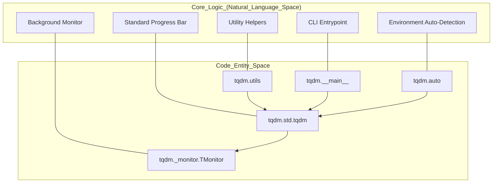

Sources: [tqdm/__init__.py:1-17](), [README.rst:44-60](), [tqdm/__main__.py:1-3](), [tqdm/auto.py:1-40]()

### Core Components

1.  **`tqdm.std.tqdm`**: The primary implementation handling iteration logic, timing, and formatting [tqdm/__init__.py:6-8]().
2.  **`tqdm._monitor.TMonitor`**: A background thread that ensures progress bars refresh even during slow iterations [tqdm/__init__.py:1]().
3.  **`tqdm.utils`**: Provides terminal detection, string measurement, and IO wrapping to support cross-platform compatibility.
4.  **`tqdm.auto`**: A convenience module that automatically selects the appropriate implementation (Notebook vs. Standard) based on the execution environment [tqdm/auto.py:1-31]().

The library exports these core components through its top-level `__init__.py` for easy access [tqdm/__init__.py:1-17]().

## Usage Patterns

### Logic to Code Mapping

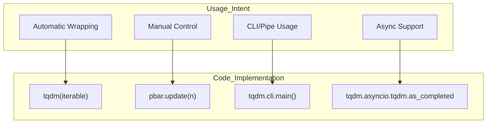

Sources: [README.rst:157-227](), [tqdm/__main__.py:1-3](), [examples/paper.md:77-121](), [examples/async_coroutines.py:30-32]()

### 1. Iterable-based Usage
The most common pattern is wrapping an existing iterable. `trange(n)` is provided as an optimized shortcut for `tqdm(range(n))` [README.rst:15-27]().

```python
from tqdm import tqdm, trange
for i in tqdm(range(10000)):
    pass
```

Sources: [README.rst:157-186](), [examples/paper.md:82-88]()

### 2. Manual Control
For non-iterable tasks, `tqdm` can be used manually with a `with` statement to ensure proper cleanup via `close()` [README.rst:196-220]().

```python
with tqdm(total=100) as pbar:
    pbar.update(10)
```

Sources: [README.rst:196-220]()

### 3. CLI Usage
`tqdm` can be executed as a module to monitor data flowing through shell pipes. This is handled by `tqdm.cli.main` [tqdm/__main__.py:1-3](), [README.rst:222-227]().

```sh
$ cat large_file.txt | tqdm --bytes | wc -l
```

Sources: [README.rst:32-42](), [.meta/.tqdm.1.md:15-34](), [tqdm/__main__.py:1-3]()

## Integration Capabilities

`tqdm` includes specialized modules for different environments and libraries:

- **Notebooks**: `tqdm.notebook` provides IPyWidgets-based bars for Jupyter [tqdm/__init__.py:20-28](). `tqdm.autonotebook` handles the logic of switching between standard and notebook modes [tqdm/autonotebook.py:1-38]().
- **GUI**: `tqdm.gui` and `tqdm.tk` for graphical interfaces [tqdm/__init__.py:4-5]().
- **Asyncio**: `tqdm.asyncio` provides wrappers for asynchronous iterables and coroutines like `as_completed` [examples/async_coroutines.py:4-32]().
- **Pandas**: `tqdm_pandas` enables progress bars for pandas operations like `progress_apply` [tqdm/__init__.py:2]().

Sources: [tqdm/__init__.py:1-17](), [examples/paper.md:98-105](), [tqdm/auto.py:23-30](), [tqdm/autonotebook.py:13-37]()

## Summary
The `tqdm` library is a highly modular tool designed for minimal friction. Its architecture separates the core progress calculation (`tqdm.std`) from the environment-specific rendering and the background synchronization (`TMonitor`), allowing it to remain performant across CLI, GUI, and Notebook environments.

Sources: [README.rst:1-60](), [tqdm/__init__.py:1-17](), [examples/paper.md:35-68]()

---

# Page: Core Components

# Core Components

<details>
<summary>Relevant source files</summary>

The following files were used as context for generating this wiki page:

- [tests/tests_synchronisation.py](tests/tests_synchronisation.py)
- [tests/tests_utils.py](tests/tests_utils.py)
- [tqdm/_monitor.py](tqdm/_monitor.py)
- [tqdm/std.py](tqdm/std.py)
- [tqdm/utils.py](tqdm/utils.py)

</details>


This page describes the central components of the tqdm library that implement the core progress bar functionality. These components form the foundation upon which all specialized implementations and integrations are built. For specialized implementations like notebook and GUI variants, see [Specialized Implementations](#3), and for external integrations like Pandas and Keras, see [Extensions and Integrations](#4).

## Overview of Core Components

The tqdm library consists of three main core components that work together to provide a flexible, efficient progress bar system:

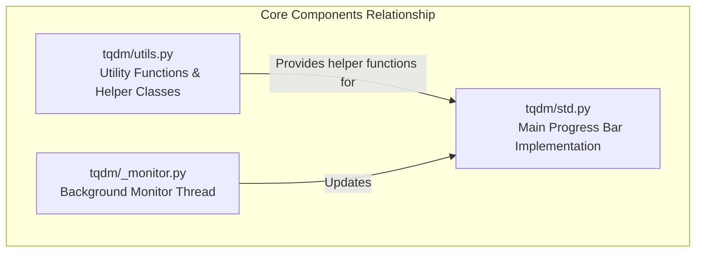

Sources: [tqdm/std.py:1-23](), [tqdm/utils.py:1-13](), [tqdm/_monitor.py:1-6]()

These core components handle the fundamental functionality that makes `tqdm` work across different environments and use cases:

1.  **Standard Progress Bar (tqdm.std)**: The main implementation of the progress bar with all configuration options. For details, see [Standard Progress Bar](#2.1).
2.  **Utilities and Helpers (tqdm.utils)**: Support functions and classes for string formatting, terminal manipulation, and environment variable wrapping. For details, see [Utilities and Helpers](#2.2).
3.  **Monitor Thread (tqdm._monitor)**: Background thread that refreshes progress bars at specified intervals to ensure responsiveness. For details, see [Monitor Thread](#2.3).

## Component Architecture

The following diagram illustrates how the core components are implemented and their key classes:

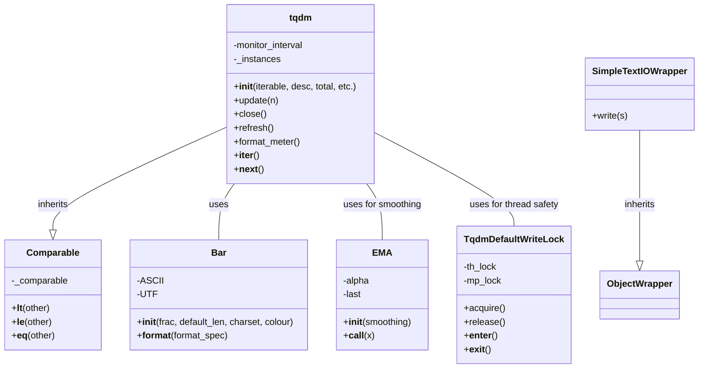

Sources: [tqdm/std.py:129-210](), [tqdm/std.py:211-243](), [tqdm/std.py:74-128](), [tqdm/utils.py:100-120](), [tqdm/utils.py:146-165]()

## Standard Progress Bar Implementation

The main implementation is provided by the `tqdm` class in the `tqdm/std.py` module. This class is responsible for creating and managing progress bar state, tracking iteration progress, and estimating completion time using Exponential Moving Averages (`EMA`).

| Method/Attribute | Purpose |
|------------------|---------|
| `__init__` | Initializes the progress bar with various configuration options [tqdm/std.py:355-635]() |
| `update(n=1)` | Advances the progress bar by `n` units [tqdm/std.py:1225-1264]() |
| `close()` | Closes the progress bar and cleans up resources [tqdm/std.py:1266-1307]() |
| `refresh()` | Manually refreshes the display [tqdm/std.py:1335-1354]() |
| `format_meter()` | Formats the progress bar string for display [tqdm/std.py:438-543]() |
| `_instances` | WeakSet tracking all active progress bar instances [tqdm/std.py:344-344]() |

For details, see [Standard Progress Bar](#2.1).

Sources: [tqdm/std.py:17-19](), [tqdm/std.py:211-243](), [tqdm/std.py:355-1354]()

### Bar Formatting System

The progress bar's appearance is controlled by a sophisticated formatting system that handles different terminals and character sets. The `Bar` class handles rendering the actual visual segments, supporting ASCII, UTF, and custom color codes.

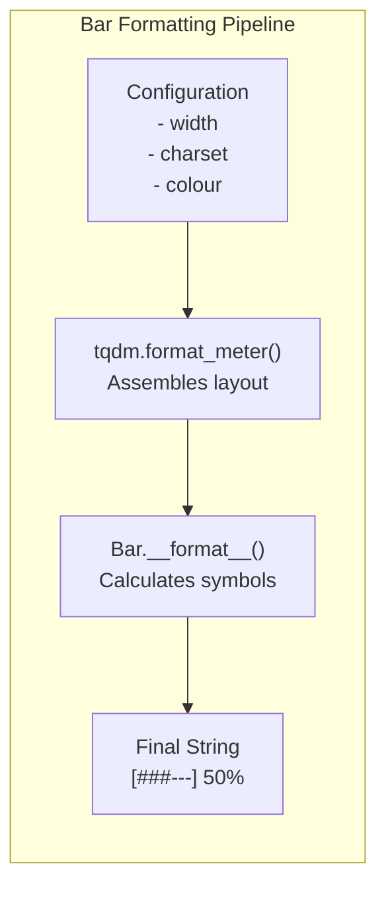

Sources: [tqdm/std.py:129-209](), [tqdm/std.py:183-209](), [tqdm/std.py:438-543]()

## Utility Functions and Classes

The `tqdm/utils.py` module provides cross-platform compatibility and I/O wrappers. It includes terminal detection logic and helpers like `envwrap` for configuration via environment variables.

Key utility components include:
*   **I/O Wrappers**: `SimpleTextIOWrapper`, `CallbackIOWrapper`, and `DisableOnWriteError` for safe terminal output and reporting lengths back to callbacks [tqdm/utils.py:146-235]().
*   **Environment Wrapping**: `envwrap` decorator allows users to override `tqdm` parameters globally using environment variables like `TQDM_MININTERVAL` [tqdm/utils.py:34-76]().
*   **Platform Detection**: Constants like `IS_WIN` and `IS_NIX` drive conditional logic for terminal colors and locking [tqdm/utils.py:15-17]().

For details, see [Utilities and Helpers](#2.2).

Sources: [tqdm/utils.py:14-33](), [tqdm/utils.py:34-76](), [tqdm/utils.py:166-208]()

## Thread Safety and Multiprocessing

The `TqdmDefaultWriteLock` class provides a unified interface for synchronization across threads and processes. It manages both a threading `RLock` (`th_lock`) and a multiprocessing `RLock` (`mp_lock`) to prevent garbled output when multiple bars or processes write to the same stream.

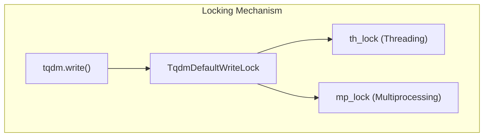

Sources: [tqdm/std.py:74-128](), [tqdm/std.py:86-98]()

## Monitor Thread

The `TMonitor` class in `tqdm/_monitor.py` runs a background daemon thread. It monitors active `tqdm` instances and forces a `refresh()` if iterations are taking too long, preventing the display from appearing frozen during long-running tasks by resetting `miniters` to 1.

Key features:
*   **Automatic Adjustment**: Readjusts `miniters` if iterations exceed `maxinterval` [tqdm/_monitor.py:85-91]().
*   **Lifecycle Management**: Registered with `atexit` to ensure clean shutdown without deadlocks [tqdm/_monitor.py:39-48]().
*   **Synchronization**: Uses the global lock from the `tqdm` class via `get_lock()` to safely iterate over `_instances` [tqdm/_monitor.py:75-78]().

For details, see [Monitor Thread](#2.3).

Sources: [tqdm/_monitor.py:16-41](), [tqdm/_monitor.py:75-93]()

## Integration Points

The core components provide several integration points for extending `tqdm` functionality. The `tqdm` class maintains a registry of instances and provides hooks for external libraries to tap into the progress reporting cycle.

For details on how these are used in specialized environments, see [Specialized Implementations](#3).

Sources: [tqdm/std.py:19-23](), [tqdm/std.py:344-350]()

---

# Page: Standard Progress Bar

# Standard Progress Bar

<details>
<summary>Relevant source files</summary>

The following files were used as context for generating this wiki page:

- [examples/include_no_requirements.py](examples/include_no_requirements.py)
- [examples/pandas_progress_apply.py](examples/pandas_progress_apply.py)
- [tests/tests_tqdm.py](tests/tests_tqdm.py)
- [tqdm/_tqdm_pandas.py](tqdm/_tqdm_pandas.py)
- [tqdm/std.py](tqdm/std.py)

</details>


The Standard Progress Bar is the core implementation of `tqdm`'s progress bar functionality. It provides a versatile, efficient way to track and display progress of iterations in the terminal. This page documents the internal workings, features, and customization options of the standard progress bar implementation, which serves as the foundation for all other specialized `tqdm` variants.

## Overview and Architecture

The standard progress bar is implemented primarily in the `tqdm.std` module and provides both automatic iteration tracking and manual update capabilities. It is designed to be efficient, customizable, and thread/process-safe.

### Core Entity Mapping

The following diagram maps the logical components of the progress bar to the specific classes and functions defined in the codebase.

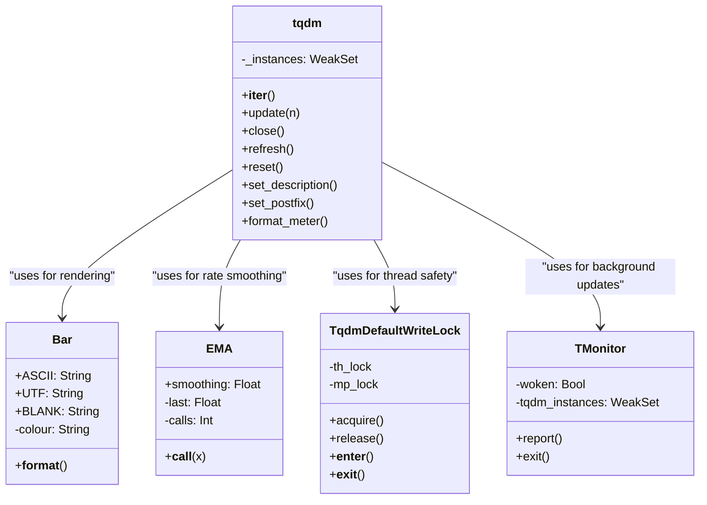

Sources: [tqdm/std.py:245-298](), [tqdm/std.py:131-211](), [tqdm/std.py:214-242](), [tqdm/std.py:76-128](), [tqdm/std.py:19-19]().

## Core Components

### The `tqdm` Class
The `tqdm` class is the main implementation that manages the entire progress bar. It provides iteration wrapping, updating, and display formatting features. It inherits from `Comparable` to support comparison operations [tqdm/std.py:245-245]().

Key responsibilities:
- **Iteration Tracking**: Automatically updates progress when wrapping an iterable via `__iter__` [tqdm/std.py:917-949]().
- **Manual Updates**: Allows explicit progress increments via `update(n)` [tqdm/std.py:879-915]().
- **State Management**: Tracks elapsed time, remaining iterations, and smoothing via `EMA` [tqdm/std.py:214-242]().
- **Instance Management**: Maintains a `WeakSet` of all active instances in `tqdm._instances` for global management and monitoring [tqdm/std.py:254-254]().

### Bar Rendering (`Bar` Class)
The `Bar` class is responsible for rendering the actual progress bar visual element. It supports ASCII, UTF-8, and blank character sets [tqdm/std.py:142-144]().

- **Color Support**: Supports HEX codes (e.g., `#00ff00`) and standard terminal colors (RED, GREEN, etc.) [tqdm/std.py:145-149](). It uses ANSI escape codes for rendering [tqdm/std.py:145-149]().
- **Formatting**: Implements `__format__` to handle width specifications and character set overrides (e.g., `a` for ascii, `u` for unicode, `b` for blank) [tqdm/std.py:183-209]().

### Rate Smoothing (`EMA` Class)
The `EMA` (Exponential Moving Average) class provides smoothing for rate calculations to prevent wild fluctuations in the displayed speed [tqdm/std.py:214-242](). It tracks the number of calls to adjust smoothing during the initial "warm-up" phase [tqdm/std.py:234-237]().

Sources: [tqdm/std.py:245-949](), [tqdm/std.py:131-212](), [tqdm/std.py:214-242]().

## Formatting Pipeline

The progress bar's display is constructed through `format_meter`, which handles the layout and data calculation.

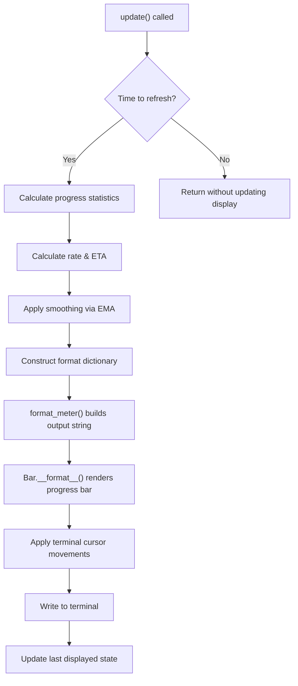

The `format_meter` method constructs the progress bar text with these components:
- **Left section (`l_bar`)**: Description and percentage [tqdm/std.py:596-596]().
- **Middle section (`bar`)**: The visual bar rendered by the `Bar` class [tqdm/std.py:603-603]().
- **Right section (`r_bar`)**: Counts, timing, and rate information [tqdm/std.py:598-598]().

Sources: [tqdm/std.py:465-661]().

## Parameters and Customization

| Parameter | Description | Default |
|-----------|-------------|---------|
| `desc` | Prefix for the progress bar | `None` |
| `total` | Total expected iterations | `None` |
| `leave` | Keep progress bar after completion | `True` |
| `file` | Output destination | `sys.stderr` |
| `ncols` | Width of the entire output message | `None` (auto) |
| `mininterval` | Minimum update interval (seconds) | `0.1` |
| `maxinterval` | Maximum update interval (seconds) | `10.0` |
| `miniters` | Minimum update interval (iterations) | `None` |
| `ascii` | Use ASCII characters instead of Unicode | `None` |
| `disable` | Disable the entire progress bar | `False` |
| `unit` | Unit for iterations | `'it'` |
| `unit_scale` | Scale units by powers of 1000 | `False` |
| `dynamic_ncols` | Adjust width to terminal | `False` |
| `smoothing` | EMA smoothing factor (0-1) | `0.3` |
| `bar_format` | Custom formatting template | `None` |
| `initial` | Initial counter value | `0` |
| `position` | Position for multiple bars | `None` |
| `colour` | Bar color (name or hex) | `None` |

Sources: [tqdm/std.py:246-359]().

## Concurrency Model

`tqdm` uses a multi-layered locking mechanism to ensure thread and process safety, primarily managed by `TqdmDefaultWriteLock` [tqdm/std.py:74-128]().

- **Thread Safety**: Uses a global `threading.RLock` named `th_lock` [tqdm/std.py:86-86]().
- **Process Safety**: Uses a `multiprocessing.RLock` named `mp_lock` which is created only when needed to avoid issues with `spawn()`/`forkserver()` [tqdm/std.py:115-122]().
- **Acquisition**: When `acquire()` is called, it acquires all available locks in order and releases them in inverse order [tqdm/std.py:100-106]().

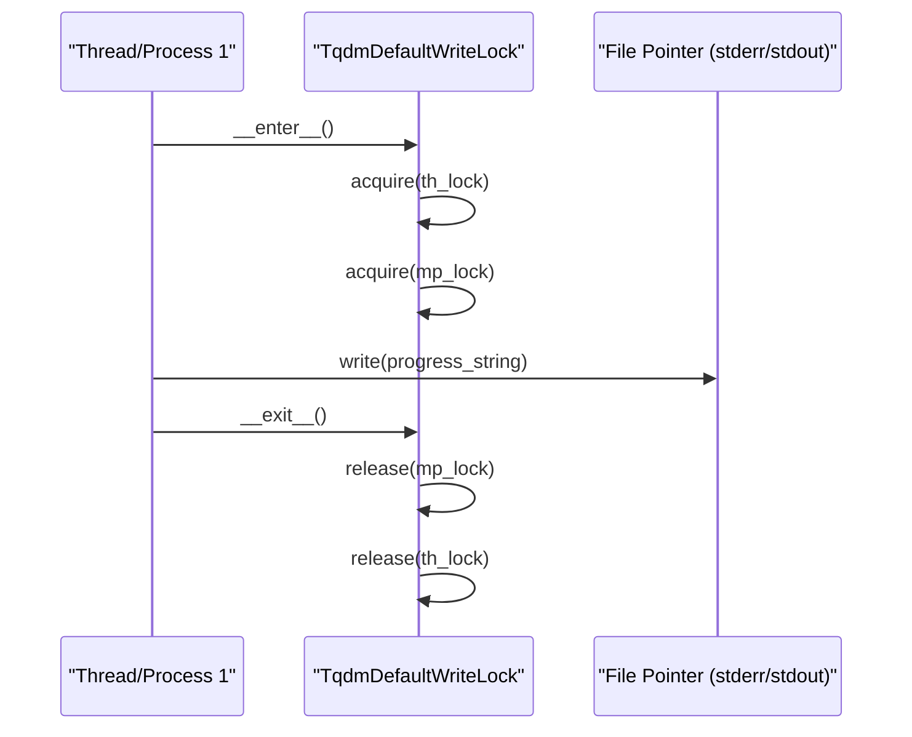

Sources: [tqdm/std.py:74-128](), [tqdm/std.py:100-113]().

## Pandas Integration

`tqdm` provides specific integration for `pandas` DataFrames and Series, allowing users to track progress of expensive operations like `apply` or `map`.

- **Registration**: Calling `tqdm.pandas(**kwargs)` registers the progress bar with pandas [tqdm/std.py:770-845]().
- **Functionality**: It adds `progress_apply` to `DataFrame`, `Series`, and `GroupBy` objects [tqdm/std.py:829-843]().
- **Internal Adapter**: The logic is handled by `tqdm.pandas()` which wraps the standard pandas `apply` methods with a `tqdm` instance [tqdm/std.py:829-843]().
- **Legacy Support**: The `tqdm_pandas` function in `tqdm/_tqdm_pandas.py` provides backward compatibility but issues a `TqdmDeprecationWarning` recommending the use of `tqdm.pandas()` [tqdm/_tqdm_pandas.py:7-24]().

Sources: [tqdm/std.py:770-845](), [tqdm/_tqdm_pandas.py:7-24](), [examples/pandas_progress_apply.py:8-16]().

---

# Page: Utilities and Helpers

# Utilities and Helpers

<details>
<summary>Relevant source files</summary>

The following files were used as context for generating this wiki page:

- [tests/tests_utils.py](tests/tests_utils.py)
- [tqdm/_main.py](tqdm/_main.py)
- [tqdm/_tqdm_gui.py](tqdm/_tqdm_gui.py)
- [tqdm/_tqdm_notebook.py](tqdm/_tqdm_notebook.py)
- [tqdm/_utils.py](tqdm/_utils.py)
- [tqdm/utils.py](tqdm/utils.py)

</details>


This document describes the utility functions and helpers in the `tqdm` library that support the core progress bar functionality. These utilities handle tasks such as terminal detection, environment variable configuration, string measurement, and I/O wrapping.

## Overview

The `tqdm.utils` module provides the foundational infrastructure for the library, ensuring cross-platform compatibility and robust terminal interaction. It contains helpers for OS detection, Unicode handling, and specialized I/O wrappers that allow `tqdm` to intercept data streams for progress tracking.

### Utility Architecture

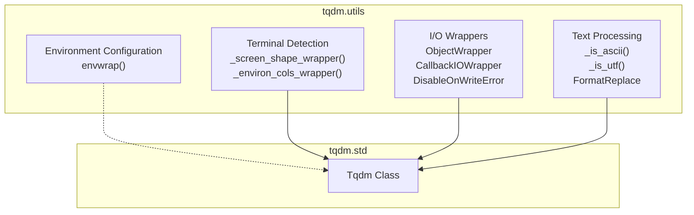

Sources: [tqdm/utils.py:1-12]()

## Environment Configuration

The `envwrap` function allows `tqdm` to be configured via environment variables. It can automatically convert environment strings to the types expected by function signatures (e.g., converting a string "42" to an integer if the function parameter is typed as `int`).

- **Prefixing**: It looks for variables prefixed with the application name (e.g., `TQDM_`) [tqdm/utils.py:44-50]().
- **Type Inference**: It uses function annotations or default value types to cast environment strings [tqdm/utils.py:57-74](). If type hints are present (e.g., `Union[int, float]`), it attempts to cast the string using each type in the union until success [tqdm/utils.py:60-67]().
- **Implementation**: It utilizes `functools.partial` or `functools.partialmethod` to return a wrapped version of the function with overrides applied [tqdm/utils.py:51-75]().
- **External Dependency**: If the standalone `envwrap` package is installed, `tqdm` will attempt to use it to provide additional features like config file support [tqdm/utils.py:79-82]().

Sources: [tqdm/utils.py:34-82](), [tests/tests_utils.py:10-68]()

## I/O and Stream Wrappers

`tqdm` uses several wrapper classes to intercept or protect I/O operations. These classes inherit from `ObjectWrapper`, which uses `__getattr__` and `__setattr__` to proxy calls to an underlying wrapped object while maintaining its own attributes via `wrapper_getattr` and `wrapper_setattr` [tqdm/utils.py:121-144]().

### Key I/O Classes

| Class | Purpose | Implementation Detail |
| :--- | :--- | :--- |
| `CallbackIOWrapper` | Reports lengths of data read/written to a callback. | Wraps `read` or `write` methods [tqdm/utils.py:209-224](). |
| `DisableOnWriteError` | Disables a `tqdm` instance if the output stream fails. | Catches `OSError` (specifically `errno 5`) or `ValueError` (closed stream) and sets `miniters` to `inf` [tqdm/utils.py:166-204](). |
| `SimpleTextIOWrapper` | Encodes strings before writing to a binary stream. | Overrides `write` to call `s.encode(encoding)` [tqdm/utils.py:146-161](). |

### I/O Wrapper Data Flow

The following diagram illustrates how `CallbackIOWrapper` bridges standard Python I/O calls to the `tqdm` update mechanism.

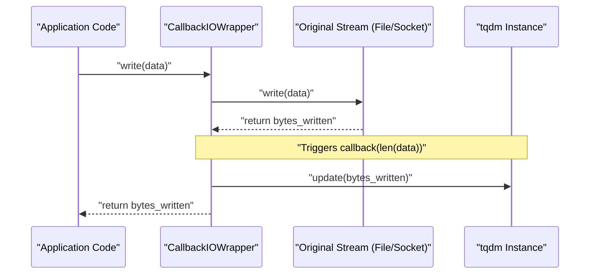

Sources: [tqdm/utils.py:121-224]()

## Terminal and OS Detection

The library maintains internal flags and functions to handle terminal differences across platforms.

- **OS Flags**: `IS_WIN` (Windows/Cygwin) and `IS_NIX` (Linux/Darwin/BSD/AIX) are used to toggle platform-specific logic [tqdm/utils.py:15-17]().
- **Colorama Integration**: On Windows, `colorama` is initialized to handle ANSI escape sequences [tqdm/utils.py:20-32]().
- **Screen Dimensions**: `_screen_shape_wrapper` attempts multiple strategies to find terminal width, including platform-specific calls (`_screen_shape_windows`, `_screen_shape_linux`) and generic fallbacks like `tput` or environment variables [tqdm/_utils.py:4-7]().
- **ANSI Support**: `RE_ANSI` is used to identify and strip escape codes when calculating the visual length of a string [tqdm/utils.py:18]().

Sources: [tqdm/utils.py:14-32](), [tqdm/_utils.py:4-7]()

## Text and Formatting Helpers

- **`FormatReplace`**: A helper for `f-string` formatting. It implements `__format__` to return a fixed replacement string regardless of the format specifier (e.g., `f"{obj:5d}"` returns the replacement string) [tqdm/utils.py:85-98]().
- **`Comparable`**: A mixin that implements all rich comparison operators (`__lt__`, `__le__`, `__eq__`, `__ne__`, `__gt__`, `__ge__`) based on a single `_comparable` attribute provided by the child class [tqdm/utils.py:100-119]().
- **Unicode Support**: Uses `east_asian_width` to account for double-width characters in CJK environments when calculating visual display length [tqdm/utils.py:10]().

Sources: [tqdm/utils.py:85-119]()

## Deprecation and Migration

As of version 4.x, the internal `tqdm._utils`, `tqdm._tqdm_notebook`, `tqdm._tqdm_gui`, and `tqdm._main` modules are deprecated. All utility logic has been consolidated into `tqdm.utils`, CLI logic into `tqdm.cli`, and specific UI logic into their respective submodules. The `_utils.py`, `_main.py`, `_tqdm_notebook.py`, and `_tqdm_gui.py` files remain as compatibility layers that re-export symbols but issue a `TqdmDeprecationWarning` upon import [tqdm/_utils.py:1-11](), [tqdm/_main.py:1-9](), [tqdm/_tqdm_notebook.py:1-9](), [tqdm/_tqdm_gui.py:1-9]().

### Module Mapping

| Old Path (Deprecated) | New Path |
| :--- | :--- |
| `tqdm._utils.Comparable` | `tqdm.utils.Comparable` |
| `tqdm._utils.IS_WIN` | `tqdm.utils.IS_WIN` |
| `tqdm._utils._screen_shape_wrapper` | `tqdm.utils._screen_shape_wrapper` |
| `tqdm._main.*` | `tqdm.cli.*` |
| `tqdm._tqdm_notebook.*` | `tqdm.notebook.*` |
| `tqdm._tqdm_gui.*` | `tqdm.gui.*` |

Sources: [tqdm/_utils.py:4-11](), [tqdm/_main.py:1-9](), [tqdm/_tqdm_notebook.py:1-9](), [tqdm/_tqdm_gui.py:1-9]()

---

# Page: Monitor Thread

# Monitor Thread

<details>
<summary>Relevant source files</summary>

The following files were used as context for generating this wiki page:

- [.prospector.yml](.prospector.yml)
- [tests/tests_rlock.py](tests/tests_rlock.py)
- [tests/tests_synchronisation.py](tests/tests_synchronisation.py)
- [tqdm/_monitor.py](tqdm/_monitor.py)

</details>


The Monitor Thread is a core component of the `tqdm` library that ensures progress bars update responsively, even during slow operations. It runs as a background daemon thread, automatically monitoring all `tqdm` instances and adjusting their update parameters when necessary.

## Purpose and Function

The `TMonitor` thread serves as an automatic supervisor for `tqdm` progress bars. It periodically checks all active progress bar instances and ensures they refresh at least once per `maxinterval` seconds, regardless of iteration speed. This provides a safeguard against progress bars becoming unresponsive during slow or stalled operations [tqdm/_monitor.py:16-20]().

The thread automatically:
1. Monitors all active `tqdm` instances [tqdm/_monitor.py:78-79]().
2. Detects when a progress bar hasn't refreshed within its `maxinterval` [tqdm/_monitor.py:85-87]().
3. Forces an update by adjusting internal parameters [tqdm/_monitor.py:91-93]().
4. Continues monitoring until program termination [tqdm/_monitor.py:64-72]().

Sources: [tqdm/_monitor.py:16-28](), [tqdm/_monitor.py:62-102]()

## Implementation Architecture

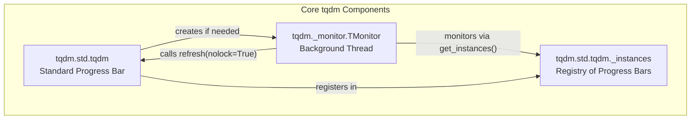

**Diagram: TMonitor in tqdm Architecture**

Sources: [tqdm/_monitor.py:16-40](), [tqdm/_monitor.py:56-60]()

## Thread Lifecycle

The Monitor Thread is implemented as the `TMonitor` class, which inherits from Python's `threading.Thread` [tqdm/_monitor.py:16](). It operates as a daemon thread, meaning it will automatically terminate when the main program exits [tqdm/_monitor.py:33](). The thread is typically managed by the `tqdm` class and continues running for the life of the program.

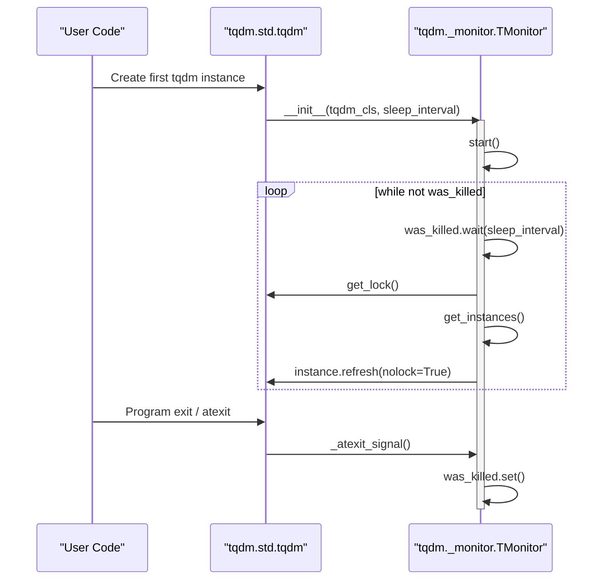

**Diagram: TMonitor Lifecycle**

Sources: [tqdm/_monitor.py:31-40](), [tqdm/_monitor.py:42-49](), [tqdm/_monitor.py:62-102]()

## Key Components

### TMonitor Class

The `TMonitor` class is the central implementation of the monitoring thread [tqdm/_monitor.py:16](). It requires two parameters during initialization:
- `tqdm_cls`: The `tqdm` class to monitor (e.g., `tqdm.std.tqdm`) [tqdm/_monitor.py:35]().
- `sleep_interval`: Time to sleep between monitoring checks [tqdm/_monitor.py:36]().

### TqdmSynchronisationWarning

The module defines a warning class used for alerting about potential synchronization issues, such as when the instances set changes size during iteration [tqdm/_monitor.py:9-13]().

Sources: [tqdm/_monitor.py:9-13](), [tqdm/_monitor.py:31-40](), [tqdm/_monitor.py:96-99]()

## Monitoring Process

The monitoring process involves several steps performed in a continuous loop within the `run()` method [tqdm/_monitor.py:62-102]():

1. **Sleep**: The thread waits for `sleep_interval` using `was_killed.wait()` [tqdm/_monitor.py:69]().
2. **Lock Acquisition**: It acquires the global `tqdm` lock via `self.tqdm_cls.get_lock()` [tqdm/_monitor.py:75]().
3. **Instance Retrieval**: It calls `get_instances()` which returns a copy of `_instances` that have already started (checked via `hasattr(i, 'start_t')`) [tqdm/_monitor.py:56-60]().
4. **Condition Check**: For each instance, it evaluates if:
   - `instance.miniters > 1` [tqdm/_monitor.py:86]().
   - The time elapsed since `last_print_t` is greater than or equal to `instance.maxinterval` [tqdm/_monitor.py:87]().
5. **Adjustment**: If conditions are met, it sets `instance.miniters = 1` and calls `instance.refresh(nolock=True)` [tqdm/_monitor.py:91-93]().

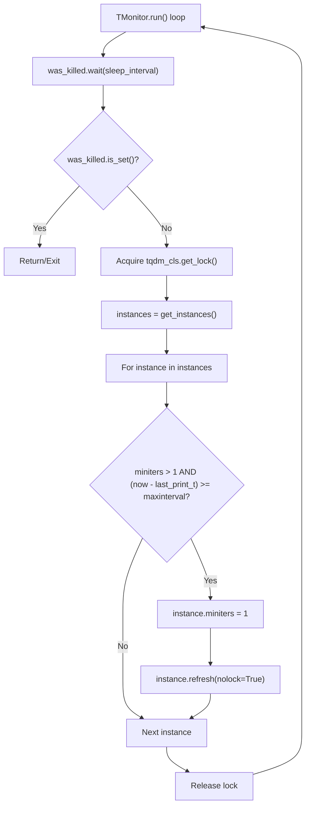

**Diagram: TMonitor Decision Process**

Sources: [tqdm/_monitor.py:56-60](), [tqdm/_monitor.py:62-102]()

## Thread Management

### Initialization and Startup

The monitor thread initializes its base `Thread` class with the name `"tqdm_monitor"` [tqdm/_monitor.py:32](). It uses a `threading.Event` named `was_killed` to manage shutdown [tqdm/_monitor.py:38](). An `atexit` hook is registered to trigger the shutdown signal when the interpreter exits [tqdm/_monitor.py:39]().

### Graceful Shutdown

Two methods facilitate shutdown:
- `_atexit_signal()`: Sets `was_killed` without joining, avoiding deadlocks at exit [tqdm/_monitor.py:42-49]().
- `exit()`: Sets `was_killed` and performs a `join()` if called from a different thread [tqdm/_monitor.py:50-54]().

Sources: [tqdm/_monitor.py:31-40](), [tqdm/_monitor.py:42-54]()

## Technical Details

### Thread Synchronization

The monitor thread uses several mechanisms to ensure safety:
1. **Locking**: Uses `self.tqdm_cls.get_lock()` to synchronize access to the shared `_instances` set [tqdm/_monitor.py:75]().
2. **Instance Copying**: `get_instances()` works on `self.tqdm_cls._instances.copy()` to prevent `RuntimeError` during iteration [tqdm/_monitor.py:58]().
3. **No-Lock Refresh**: When forcing an update, it calls `refresh(nolock=True)` because it already holds the class lock [tqdm/_monitor.py:93]().

### Configuration Parameters

While `TMonitor` is internal, its behavior is influenced by `tqdm` parameters:

| Parameter | tqdm Attribute | TMonitor Logic |
|-----------|----------------|----------------|
| `maxinterval` | `instance.maxinterval` | Threshold to trigger a forced refresh [tqdm/_monitor.py:87](). |
| `miniters` | `instance.miniters` | Overridden to `1` to bypass iteration counting [tqdm/_monitor.py:91](). |
| `monitor_interval` | `sleep_interval` | Frequency of monitor wake-ups (default 10s) [tests/tests_synchronisation.py:62](). |

Sources: [tqdm/_monitor.py:85-93](), [tests/tests_synchronisation.py:115-121]()

---

# Page: Specialized Implementations

# Specialized Implementations

<details>
<summary>Relevant source files</summary>

The following files were used as context for generating this wiki page:

- [examples/async_coroutines.py](examples/async_coroutines.py)
- [tqdm/auto.py](tqdm/auto.py)
- [tqdm/autonotebook.py](tqdm/autonotebook.py)
- [tqdm/cli.py](tqdm/cli.py)
- [tqdm/completion.sh](tqdm/completion.sh)
- [tqdm/gui.py](tqdm/gui.py)
- [tqdm/notebook.py](tqdm/notebook.py)
- [tqdm/tk.py](tqdm/tk.py)
- [tqdm/tqdm.1](tqdm/tqdm.1)

</details>


## Purpose and Scope

This page documents the various environment-specific implementations of `tqdm` beyond the standard console progress bar. These specialized adapters enable `tqdm`'s progress bar functionality in different environments such as Jupyter notebooks, graphical user interfaces (GUIs), and command-line pipes, while maintaining a consistent API.

For detailed technical specifications of each variant, see the following child pages:
- [Notebook Integration](#3.1) — Covers `tqdm.notebook` and `ipywidgets` rendering.
- [GUI Implementations](#3.2) — Covers Matplotlib (`tqdm.gui`), Tkinter (`tqdm.tk`), and `tqdm.asyncio`.
- [Command Line Interface](#3.3) — Covers the `tqdm` CLI, argument parsing, and pipe monitoring.

## Architectural Overview

All specialized implementations in `tqdm` inherit from the standard `tqdm` class defined in `tqdm/std.py` [tqdm/notebook.py:17](), [tqdm/gui.py:16](), [tqdm/tk.py:16](). They override specific methods—primarily `__init__`, `display`, and `close`—to adapt the progress bar to different environments.

### Inheritance Structure

```mermaid
classDiagram
    class "tqdm.std.tqdm" {
        +__init__()
        +update()
        +close()
        +display()
        +reset()
    }
    
    class "tqdm.notebook.tqdm_notebook" {
        +__init__()
        +display()
        +close()
        +reset()
        -container: "TqdmHBox"
    }
    
    class "tqdm.gui.tqdm_gui" {
        +__init__()
        +display()
        +close()
        -fig: "Figure"
    }
    
    class "tqdm.tk.tqdm_tk" {
        +__init__()
        +display()
        +close()
        +cancel()
        -_tk_window: "Toplevel"
    }

    class "tqdm.asyncio.tqdm" {
        +__init__()
        +__anext__()
        +gather()
        +as_completed()
    }
    
    "tqdm.std.tqdm" <|-- "tqdm.notebook.tqdm_notebook"
    "tqdm.std.tqdm" <|-- "tqdm.gui.tqdm_gui"
    "tqdm.std.tqdm" <|-- "tqdm.tk.tqdm_tk"
    "tqdm.std.tqdm" <|-- "tqdm.asyncio.tqdm"
```

Sources: [tqdm/notebook.py:92](), [tqdm/gui.py:24](), [tqdm/tk.py:22](), [tqdm/auto.py:23-30]()

## Environment-Specific Variants

### Jupyter Notebook Integration
The notebook implementation (`tqdm_notebook`) uses `ipywidgets` to render a graphical bar within Jupyter cells [tqdm/notebook.py:22-55](). It manages a `TqdmHBox` container [tqdm/notebook.py:71-71]() which holds `HTML` labels and a `FloatProgress` widget (aliased as `IProgress`) [tqdm/notebook.py:120-124](). It supports dynamic color changes via the `colour` property [tqdm/notebook.py:194-202](). The `tqdm.autonotebook` module provides automatic detection to switch between console and notebook modes [tqdm/autonotebook.py:13-37]().
For details, see [Notebook Integration](#3.1).

### GUI Implementations (Matplotlib & Tkinter)
`tqdm` provides two primary GUI wrappers:
- **Matplotlib (`tqdm_gui`)**: Renders progress as a real-time plot showing both instantaneous (`cur`) and estimated (`est`) rates [tqdm/gui.py:127-133](). It uses `plt.pause` to handle event loop updates [tqdm/gui.py:169-169]().
- **Tkinter (`tqdm_tk`)**: Opens a native OS window containing a `ttk.Progressbar` [tqdm/tk.py:88-89](). It includes a unique `cancel_callback` feature for UI-driven interruption [tqdm/tk.py:153-160]() and handles its own event dispatching if a mainloop is not detected [tqdm/tk.py:178-186]().
For details, see [GUI Implementations](#3.2).

### Asynchronous Support
The `tqdm.asyncio` implementation provides an `async-await` compatible wrapper [examples/async_coroutines.py:4](). It allows for asynchronous iteration via `async for` loops and provides utility wrappers like `tqdm.as_completed` for monitoring multiple concurrent coroutines [examples/async_coroutines.py:19-32]().
For details, see [GUI Implementations](#3.2) (Asynchronous section).

### Command Line Interface (CLI)
The `tqdm` CLI allows monitoring of shell pipes (e.g., `cat file | tqdm | ...`) [tqdm/cli.py:2-3](). It utilizes a `posix_pipe` function to efficiently handle binary buffers and delimiters [tqdm/cli.py:55-65](). The CLI supports a wide range of parameters mapped from the core `tqdm` class via `RE_OPTS` parsing [tqdm/cli.py:182-199](). It also includes shell completion support [tqdm/completion.sh:1-19]() and a manual page [tqdm/tqdm.1:1-30]().
For details, see [Command Line Interface](#3.3).

## Implementation Comparison

| Implementation | File | Primary Dependency | Output Type |
| :--- | :--- | :--- | :--- |
| `tqdm_notebook` | `tqdm/notebook.py` | `ipywidgets` | Jupyter Widget |
| `tqdm_gui` | `tqdm/gui.py` | `matplotlib` | Plot Window |
| `tqdm_tk` | `tqdm/tk.py` | `tkinter` | Native Window |
| `tqdm` (async) | `tqdm/auto.py` | `asyncio` | Console (Async) |
| `main` (CLI) | `tqdm/cli.py` | `sys.stdin` | Console (Pipe) |

Sources: [tqdm/notebook.py:1-47](), [tqdm/gui.py:1-31](), [tqdm/tk.py:1-12](), [tqdm/cli.py:1-13](), [tqdm/auto.py:23-30]()

## Integration Flow

The following diagram bridges the high-level environment types to the specific code entities responsible for handling them.

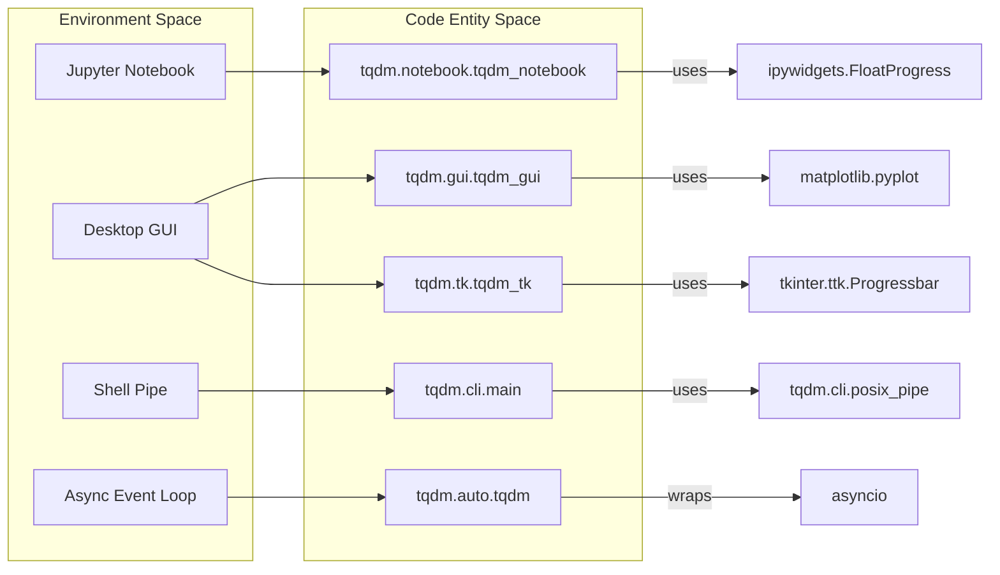

Sources: [tqdm/notebook.py:46-47](), [tqdm/gui.py:30-31](), [tqdm/tk.py:11-12](), [tqdm/cli.py:55](), [tqdm/auto.py:23-30]()

---

# Page: Notebook Integration

# Notebook Integration

<details>
<summary>Relevant source files</summary>

The following files were used as context for generating this wiki page:

- [DEMO.ipynb](DEMO.ipynb)
- [examples/async_coroutines.py](examples/async_coroutines.py)
- [examples/tqdm_requests.py](examples/tqdm_requests.py)
- [examples/tqdm_wget.py](examples/tqdm_wget.py)
- [tests/tests_notebook.py](tests/tests_notebook.py)
- [tests_notebook.ipynb](tests_notebook.ipynb)
- [tqdm/auto.py](tqdm/auto.py)
- [tqdm/autonotebook.py](tqdm/autonotebook.py)
- [tqdm/notebook.py](tqdm/notebook.py)

</details>


## Purpose and Overview

This document explains how `tqdm` integrates with Jupyter and IPython notebooks, providing an interactive widget-based progress bar for iterative operations. The notebook integration allows users to display real-time progress using the `ipywidgets` ecosystem rather than standard console output.

The notebook integration module provides specialized components that adapt `tqdm`'s core progress tracking functionality to work seamlessly within the Jupyter notebook environment, replacing text-based progress bars with interactive widgets.

Sources: [tqdm/notebook.py:1-9]()

## Architecture

The notebook integration is implemented as a specialized extension of the core `tqdm` implementation. It maintains the same API and behavior as the standard `tqdm` but replaces the output method with Jupyter widget rendering.

### Code Entity Mapping: Notebook Implementation

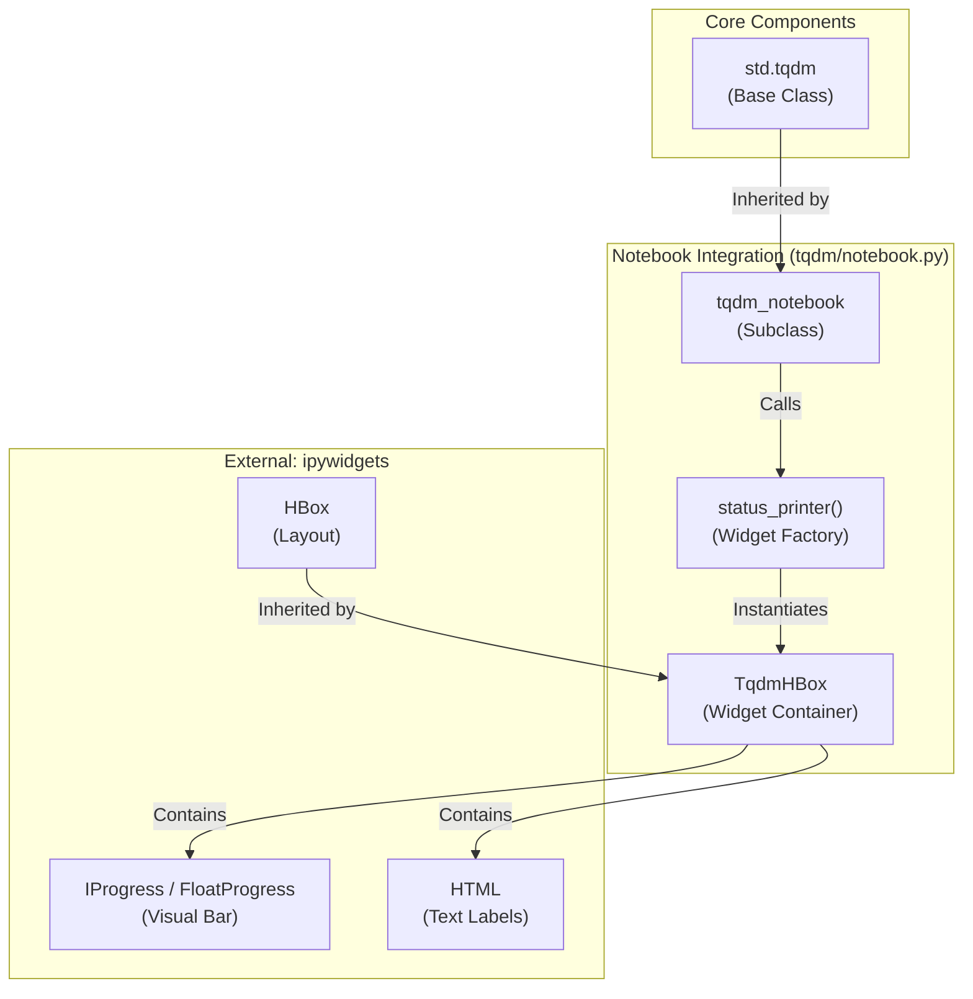

The notebook integration relies on the `ipywidgets` package. It includes version detection code to support different versions of IPython (4.x, 3.x, and 2.x) and their corresponding widget implementations.

Sources: [tqdm/notebook.py:16-56](), [tqdm/notebook.py:92-92](), [tqdm/notebook.py:71-71]()

## Widget Components

The `tqdm` notebook integration constructs a composite widget consisting of several components:

| Component | Purpose | Implementation |
|-----------|---------|----------------|
| `ltext` | Left-side text (description) | `ipywidgets.HTML` |
| `pbar` | Progress bar visual element | `ipywidgets.FloatProgress` (aliased as `IProgress`) |
| `rtext` | Right-side text (stats) | `ipywidgets.HTML` |
| `TqdmHBox` | Container for all components | Subclass of `HBox` with custom `_repr_pretty_` |

The `TqdmHBox` class extends the standard Jupyter `HBox` widget with methods for pretty-printing in notebook cells, allowing for custom string representation of the progress bar even when not actively updating.

Sources: [tqdm/notebook.py:69-90](), [tqdm/notebook.py:112-124]()

## Automatic Environment Detection

To simplify usage across different environments (terminal vs. notebook), `tqdm` provides an auto-detection mechanism in `tqdm/autonotebook.py` and `tqdm/auto.py`.

### Code Entity Mapping: Auto-Detection Logic

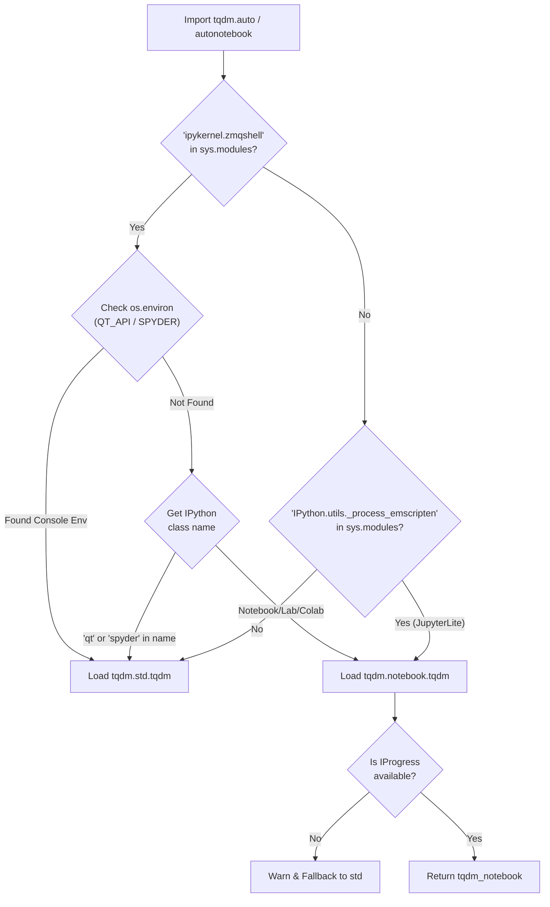

Sources: [tqdm/autonotebook.py:13-37](), [tqdm/auto.py:19-30]()

## Initialization and Display Process

The notebook integration has a special initialization and display process that differs from the standard `tqdm`. The `display()` method handles the rendering logic, including HTML escaping and space padding fixes.

### Data Flow: Update and Display

1.  **Initialization**: `__init__` calls `status_printer` to build the `TqdmHBox` container [tqdm/notebook.py:204-246]().
2.  **Display**: The `display()` method updates `pbar.value` and the `HTML.value` for `ltext` and `rtext` [tqdm/notebook.py:141-181]().
3.  **Formatting**: Spaces are replaced with `\u2007` (figure space) to fix HTML padding issues [tqdm/notebook.py:162-162]().
4.  **Closing**: Upon `close()`, the bar style is updated to `success` (green) or `danger` (red) if an error occurred [tqdm/notebook.py:272-284]().

Sources: [tqdm/notebook.py:141-193](), [tqdm/notebook.py:204-246](), [tqdm/notebook.py:272-284]()

## Special Features

### Bar Styles and Colors
The notebook integration supports visual state changes via `bar_style`:
*   **Success**: Set to `'success'` (green) upon successful completion [tqdm/notebook.py:276-276]().
*   **Danger**: Set to `'danger'` (red) if an exception is detected during the loop [tqdm/notebook.py:254-268]().
*   **Info**: Used when `total` is `None`, creating a static "information" bar [tqdm/notebook.py:113-116]().

Color customization is handled via a property setter that maps to the underlying widget's `bar_color` style attribute [tqdm/notebook.py:195-203]().

### Delayed Display
The `delay` parameter prevents the widget from being displayed immediately. The `display()` method checks `self.delay` and only calls the IPython `display()` function after the time threshold has passed [tqdm/notebook.py:190-192]().

## Version Compatibility

The module detects the available implementations at runtime and adapts accordingly to support legacy IPython environments.

| IPython Version | Widget Module | Classes Used |
|-----------------|---------------|-------------|
| IPython 4.x+ | `ipywidgets` | `HTML`, `FloatProgress`, `HBox` |
| IPython 3.x | `IPython.html.widgets` | `HTML`, `FloatProgress`, `HBox` |
| IPython 2.x | `IPython.html.widgets` | `HTML`, `FloatProgressWidget`, `ContainerWidget` |

Sources: [tqdm/notebook.py:19-57]()

## Error Handling and Edge Cases

*   **Widget not available**: If `ipywidgets` is missing, `tqdm` raises an `ImportError` with a helpful installation message [tqdm/notebook.py:109-110]().
*   **HTML Escaping**: All message content is escaped using `html.escape` before being assigned to the widget's value to prevent rendering issues with special characters like `&` or `<` [tqdm/notebook.py:165-167]().
*   **MRO Handling**: In `tqdm/auto.py`, if both notebook and asyncio support are needed, a dynamic class is created inheriting from both `notebook_tqdm` and `asyncio_tqdm` [tqdm/auto.py:26-28]().

Sources: [tqdm/notebook.py:66-68](), [tqdm/notebook.py:165-167](), [tqdm/auto.py:26-28]()

---

# Page: GUI Implementations

# GUI Implementations

<details>
<summary>Relevant source files</summary>

The following files were used as context for generating this wiki page:

- [tests/tests_asyncio.py](tests/tests_asyncio.py)
- [tests/tests_gui.py](tests/tests_gui.py)
- [tests/tests_tk.py](tests/tests_tk.py)
- [tests/tests_version.py](tests/tests_version.py)
- [tqdm/asyncio.py](tqdm/asyncio.py)
- [tqdm/gui.py](tqdm/gui.py)
- [tqdm/tk.py](tqdm/tk.py)

</details>


This page documents the graphical user interface implementations of the `tqdm` library. These implementations provide alternatives to the standard console-based progress bars, allowing for visual and interactive displays of progress in different environments.

## Overview

`tqdm` offers several distinct GUI and asynchronous implementations:

1.  **Matplotlib GUI** (`tqdm/gui.py`): A graphical progress display using Matplotlib plots to visualize processing rates [tqdm/gui.py:1-8]().
2.  **Tkinter GUI** (`tqdm/tk.py`): A native GUI window using standard Tkinter widgets [tqdm/tk.py:1-8]().
3.  **Asyncio Support** (`tqdm/asyncio.py`): An asynchronous-friendly version that supports `async for` loops and coroutine wrapping [tqdm/asyncio.py:1-9]().
4.  **Jupyter Notebook Widget** (`tqdm/notebook.py`): A specialized widget-based display for Jupyter/IPython notebooks.

All implementations extend the base `std_tqdm` class [tqdm/gui.py:16](), [tqdm/tk.py:16](), [tqdm/asyncio.py:13](), maintaining a consistent API while providing different visual representations.

### GUI Implementation Architecture

The diagram below maps the relationship between core classes and their specialized GUI/Async variants.

Title: "tqdm GUI Class Hierarchy"
```mermaid
graph TD
    subgraph "Core_Component"
        [std_tqdm]
    end
    
    subgraph "Specialized_Implementations"
        [tqdm_gui]
        [tqdm_tk]
        [tqdm_asyncio]
    end
    
    [std_tqdm] -- "Inherited_by" --> [tqdm_gui]
    [std_tqdm] -- "Inherited_by" --> [tqdm_tk]
    [std_tqdm] -- "Inherited_by" --> [tqdm_asyncio]

    style [std_tqdm] stroke-dasharray: 5 5
```

Sources: [tqdm/gui.py:24](), [tqdm/tk.py:22](), [tqdm/asyncio.py:19]()

---

## Matplotlib GUI Implementation

The Matplotlib GUI implementation (`tqdm_gui`) provides a real-time plot of progress, displaying both instantaneous and average processing rates [tqdm/gui.py:24-25]().

### Implementation Details

The class initializes a Matplotlib figure with two primary lines: `line1` (blue) for the current rate and `line2` (black) for the estimated/overall rate [tqdm/gui.py:60-61]().

Title: "tqdm_gui Data Processing and Rendering"
```mermaid
graph TD
    subgraph "tqdm_gui_Data_Flow"
        [display_call] --> [calc_rates]
        [calc_rates] --> [update_data]
        [update_data] --> [render_gui]
    end

    subgraph "Code_Entities"
        [line1]
        [line2]
        [hspan]
        [ax]
    end

    [render_gui] --> [line1]
    [render_gui] --> [line2]
    [render_gui] --> [hspan]
    [render_gui] --> [ax]
```

Sources: [tqdm/gui.py:110-169]()

- **Initialization**: Sets `mpl.rcParams['toolbar']` to 'None' to keep the UI clean [tqdm/gui.py:46](). It enables interactive mode via `plt.ion()` [tqdm/gui.py:85]().
- **Display Logic**: The `display()` method calculates the instantaneous rate (`y`) and overall rate (`z`) [tqdm/gui.py:127-129](). It updates the plot data and adjusts axis limits if the rates exceed current bounds [tqdm/gui.py:143-147]().
- **Formatting**: It strips the standard text `{bar}` from the message and instead renders a `plt.axhspan` as a visual bar [tqdm/gui.py:69](), [tqdm/gui.py:163-167]().
- **Cleanup**: The `close()` method restores the original toolbar settings and returns Matplotlib to its previous interactive state [tqdm/gui.py:98-101](). If `leave` is `False`, it closes the figure [tqdm/gui.py:105]().

Sources: [tqdm/gui.py:24-170]()

---

## Tkinter GUI Implementation

The Tkinter implementation (`tqdm_tk`) creates a native window using `tkinter.ttk.Progressbar` [tqdm/tk.py:22-29]().

### Features and Behavior
- **Window Management**: If no `tk_parent` is provided, it attempts to use `tkinter._default_root` or creates a new `tkinter.Tk()` instance [tqdm/tk.py:61-72]().
- **Interactivity**: It includes a helper `_tk_dispatching_helper()` to determine if the Tkinter mainloop is already running [tqdm/tk.py:178-187](). If not, it manually calls `self._tk_window.update()` during `display()` to keep the UI responsive [tqdm/tk.py:140-141]().
- **Cancel Support**: Accepts a `cancel_callback` function that is triggered when the window is closed or a "Cancel" button is clicked [tqdm/tk.py:153-160]().
- **Indeterminate Mode**: If the `total` is unknown, the progress bar is configured with `mode="indeterminate"` [tqdm/tk.py:93]().

### Entity Mapping

| Code Entity | Role | File:Line |
|:---|:---|:---|
| `_tk_window` | The top-level window (Toplevel or Tk) | [tqdm/tk.py:68-72]() |
| `_tk_pbar` | The `ttk.Progressbar` widget | [tqdm/tk.py:88-89]() |
| `_tk_n_var` | `DoubleVar` tracking the current iteration count `n` | [tqdm/tk.py:81]() |
| `_tk_text_var` | `StringVar` tracking the formatted progress string | [tqdm/tk.py:82]() |

Sources: [tqdm/tk.py:33-100]()

---

## Asyncio Support

The `tqdm_asyncio` class provides an asynchronous-friendly wrapper, allowing `tqdm` to be used with `async for` loops and `asyncio` primitives [tqdm/asyncio.py:19-22]().

### Key Methods
- **`__anext__`**: Handles asynchronous iteration. It awaits the underlying iterator if it is awaitable via `iterable_next`, updates the progress bar via `update()`, and handles `StopIteration` by raising `StopAsyncIteration` [tqdm/asyncio.py:43-57]().
- **`as_completed`**: A class method wrapper for `asyncio.as_completed`. It yields results as they finish while updating the bar [tqdm/asyncio.py:62-73]().
- **`gather`**: A class method wrapper for `asyncio.gather`. It uses `wrap_awaitable` to track completion and updates the bar as each task finishes [tqdm/asyncio.py:75-91]().

Title: "tqdm_asyncio Iteration Sequence"
```mermaid
sequenceDiagram
    participant User
    participant TA as "tqdm_asyncio"
    participant Loop as "asyncio loop"

    User->>TA: "async for i in tqdm_asyncio(aiterable)"
    TA->>Loop: "await self.iterable_next()"
    Loop-->>TA: "result"
    TA->>TA: "self.update()"
    TA-->>User: "result"
```

Sources: [tqdm/asyncio.py:43-91]()

---

## Comparison of Implementations

| Feature | Matplotlib (`gui.py`) | Tkinter (`tk.py`) | Asyncio (`asyncio.py`) |
| :--- | :--- | :--- | :--- |
| **Primary Class** | `tqdm_gui` [tqdm/gui.py:24]() | `tqdm_tk` [tqdm/tk.py:22]() | `tqdm_asyncio` [tqdm/asyncio.py:19]() |
| **UI Backend** | Matplotlib [tqdm/gui.py:30-31]() | Tkinter [tqdm/tk.py:11-12]() | Console (inherited) |
| **Visual Style** | Line Graphs [tqdm/gui.py:60-61]() | OS-Native Bar [tqdm/tk.py:88-89]() | Text-based |
| **Async Support** | Synchronous | Synchronous | Native `async for` [tqdm/asyncio.py:43]() |
| **Experimental** | Yes [tqdm/gui.py:40]() | Yes [tqdm/tk.py:74]() | No |

## Implementation Considerations

### Resource Management
- **Matplotlib**: Uses `plt.pause(1e-9)` to force UI updates without blocking the main execution thread for long periods [tqdm/gui.py:169]().
- **Tkinter**: Uses `wm_attributes("-topmost", 1)` briefly during initialization to ensure the progress window is visible to the user [tqdm/tk.py:79-80](). It uses `after('idle', self._tk_window.destroy)` during closure to ensure safe widget destruction [tqdm/tk.py:111]().
- **Asyncio**: Automatically handles `close()` on `StopIteration` or exceptions during asynchronous iteration [tqdm/asyncio.py:51-56]().

Sources: [tqdm/gui.py:169](), [tqdm/tk.py:79-80](), [tqdm/tk.py:111](), [tqdm/asyncio.py:51-56]()

---

# Page: Command Line Interface

# Command Line Interface

<details>
<summary>Relevant source files</summary>

The following files were used as context for generating this wiki page:

- [tests/tests_main.py](tests/tests_main.py)
- [tests/tests_perf.py](tests/tests_perf.py)
- [tqdm/cli.py](tqdm/cli.py)
- [tqdm/completion.sh](tqdm/completion.sh)
- [tqdm/tqdm.1](tqdm/tqdm.1)

</details>


The `tqdm` Command Line Interface (CLI) provides a way to add progress bars to command-line operations through pipes. This allows for easy visualization of progress for tasks like file processing, data transformation, or any operation where data passes through `stdin` and `stdout`. Unlike the Python API, the CLI requires no programming knowledge and can be used directly from your terminal.

## 1. Overview

The `tqdm` CLI functions as a standard Unix filter, reading from `stdin` and writing to `stdout` while displaying a progress bar on `stderr`. This design follows the Unix philosophy of composable tools, allowing `tqdm` to be inserted into any pipeline.

### CLI Data Flow
```mermaid
flowchart LR
    subgraph "CLI_Pipeline [tqdm/cli.py]"
        stdin["stdin (sys.stdin.buffer)"] --> tqdm_cli["main()"]
        tqdm_cli --> stdout["stdout (sys.stdout.buffer)"]
        tqdm_cli -.-> stderr["stderr (sys.stderr)"]
    end
```

Sources: [tqdm/cli.py:1-6](), [tqdm/cli.py:156-164](), [tqdm/cli.py:294-310]()

## 2. Basic Usage

The `tqdm` CLI can be invoked through the `tqdm` command after installation, or via `python -m tqdm` if accessing directly through the Python module.

### 2.1 Simple Pipe Examples

```bash
# Count lines in Python files
cat *.py | tqdm | wc -l

# Find all Python files with progress bar
find . -name "*.py" | tqdm | wc -l

# Count lines of code with additional information
find . -name '*.py' -exec wc -l {} \; \
  | tqdm --total 432 --unit files --desc counting \
  | awk '{ sum += $1 }; END { print sum }'
```

Sources: [tqdm/tqdm.1:11-30]()

### 2.2 Input Processing Flow

The CLI supports different modes of counting progress based on how the input stream is consumed.

```mermaid
flowchart LR
    subgraph "Input_Processing [tqdm/cli.py]"
        input["Input Stream"] --> read["read(buf_size)"]
        read --> process["Process Chunk"]
        process --> count["callback(n)"]
        count --> output["write()"]
    end
    
    subgraph "Processing_Modes"
        line_mode["Line Mode (default)"]
        byte_mode["Byte Mode (--bytes)"]
        update_mode["Update Mode (--update)"]
    end
    
    process --> line_mode
    process --> byte_mode
    process --> update_mode
```

Sources: [tqdm/cli.py:55-110](), [tqdm/cli.py:292-324]()

## 3. Command Line Options

The CLI supports most of the options available in the Python API plus some additional CLI-specific options. It uses a custom parser to map CLI flags to `tqdm` constructor arguments.

### 3.1 Core Options

These options map directly to the `tqdm` class parameters defined in `tqdm/std.py`.

| Option | Type | Description |
|--------|------|-------------|
| `--desc` | str | Prefix for the progressbar [tqdm/tqdm.1:39-41]() |
| `--total` | int/float | Expected number of iterations [tqdm/tqdm.1:43-50]() |
| `--leave` | bool | Keep progressbar after completion [tqdm/tqdm.1:52-57]() |
| `--ncols` | int | Width of the entire output message [tqdm/tqdm.1:59-67]() |
| `--ascii` | bool/str | Use ASCII characters instead of Unicode [tqdm/tqdm.1:90-93]() |
| `--unit` | str | Unit for iteration counts (default: 'it') [tqdm/tqdm.1:100-103]() |
| `--unit-scale` | bool/num | Scale units by powers (k, M, G, etc.) [tqdm/tqdm.1:105-112]() |
| `--dynamic-ncols` | bool | Adjust to terminal width changes [tqdm/tqdm.1:114-117]() |
| `--position` | int | Vertical position of the bar [tqdm/tqdm.1:147-151]() |

Sources: [tqdm/tqdm.1:31-186]()

### 3.2 CLI-Specific Options

These options control the behavior of the CLI wrapper and the `posix_pipe` data transfer.

| Option | Type | Description |
|--------|------|-------------|
| `--delim` | chr | Delimiter character (default: '\n') [tqdm/cli.py:126-128]() |
| `--buf-size` | int | Buffer size in bytes for reading stdin [tqdm/cli.py:129-131]() |
| `--bytes` | bool | Count bytes instead of lines [tqdm/cli.py:132-134]() |
| `--tee` | bool | Pass stdin to both stderr and stdout [tqdm/cli.py:135-136]() |
| `--update` | bool | Treat input as update increments [tqdm/cli.py:137-140]() |
| `--update-to` | bool | Treat input as absolute positions [tqdm/cli.py:141-144]() |
| `--null` | bool | Discard all input (no stdout) [tqdm/cli.py:145-146]() |
| `--manpath` | str | Install man pages to specified directory [tqdm/cli.py:147-148]() |
| `--comppath` | str | Install shell completion to directory [tqdm/cli.py:149-150]() |
| `--log` | str | Set logging level (DEBUG, INFO, etc.) [tqdm/cli.py:151-152]() |

Sources: [tqdm/cli.py:121-153](), [tqdm/tqdm.1:187-216]()

## 4. Implementation Details

The CLI implementation processes arguments and handles data flow through several key components in `tqdm/cli.py`.

### CLI Architecture Diagram
```mermaid
flowchart TD
    subgraph "CLI_Architecture [tqdm/cli.py]"
        main["main()"] --> parse["RE_OPTS.findall(docstring)"]
        parse --> cast["cast(val, type)"]
        cast --> setup["Tqdm instance setup"]
        setup --> choose["Execution Mode Selection"]
        
        choose --> bytes_mode["Bytes Mode (--bytes)"]
        choose --> newline["Newline Delimited (default)"]
        choose --> custom_delim["Custom Delimiter (--delim)"]
        
        bytes_mode --> posix_pipe["posix_pipe(delim=None)"]
        newline --> for_loop["Standard 'for line in sys.stdin'"]
        custom_delim --> posix_pipe["posix_pipe(delim=...)"]
        
        posix_pipe --> callback["t.update(n)"]
        for_loop --> tqdm_iter["tqdm(sys.stdin)"]
    end
```

Sources: [tqdm/cli.py:156-324]()

### 4.1 Argument Processing and Casting

The CLI parses arguments using regex (`RE_OPTS`) against the `tqdm` docstring rather than `argparse`. The `cast()` function converts string arguments to their expected types (bool, int, float, chr, str).

- `cast(val, typ)` handles multi-type definitions (e.g., "int or float") [tqdm/cli.py:17-52]().
- `RE_OPTS` extracts option names and types from the documentation [tqdm/cli.py:113]().
- `RE_SHLEX` is used to split the input `argv` [tqdm/cli.py:115]().

### 4.2 Data Pipe Handling (`posix_pipe`)

The `posix_pipe` function is the core engine for high-performance data transfer in the CLI. It operates on binary streams (`fin`, `fout`) to avoid encoding overhead.

### posix_pipe Internal Logic
```mermaid
flowchart LR
    subgraph "posix_pipe_Logic [tqdm/cli.py:55-110]"
        read["fin.read(buf_size)"] --> find["tmp.find(delim)"]
        find --> write["fout.write(buf + tmp)"]
        write --> callback["callback(len(tmp) or 1)"]
        callback --> read
    end
```

- If `delim` is `None`, it updates progress by the number of bytes read [tqdm/cli.py:68-79]().
- If `delim` is provided, it buffers data until the delimiter is found, then updates the bar [tqdm/cli.py:81-110]().

### 4.3 Legacy Support

The module `tqdm/_main.py` provides a compatibility layer, warning users to migrate to `tqdm.cli`.

Sources: [tqdm/_main.py:1-9]()

## 5. Integration with Shell Environment

### 5.1 Man Pages

The `tqdm.1` file provides standard Unix documentation. It can be installed via the CLI using `--manpath`.

Sources: [tqdm/tqdm.1:1-241](), [tqdm/cli.py:249-275]()

### 5.2 Shell Completion

Tab completion for `bash` is implemented in `tqdm/completion.sh`. It provides context-aware suggestions for flags and logging levels.

### Shell Integration Flow
```mermaid
flowchart TB
    subgraph "Shell_Integration [tqdm/completion.sh]"
        complete["complete -F _tqdm tqdm"] --> logic["_tqdm() function"]
        logic --> compgen["compgen -W '--flags'"]
        logic --> log_levels["compgen -W 'INFO DEBUG...'"]
    end
```

Sources: [tqdm/completion.sh:1-19](), [tqdm/cli.py:249-275]()

## 6. Advanced Usage Patterns

### 6.1 Tee Mode

The `--tee` mode allows for monitoring progress while passing the original input unchanged to `stdout`.

```bash
# Download with progress and save to file
curl https://example.com/large-file | tqdm --bytes --tee > file.dat
```

Sources: [tqdm/cli.py:135-136](), [tqdm/cli.py:277-286]()

### 6.2 Update Modes

The update modes allow for custom progress tracking by feeding numbers to `tqdm`.

- `--update`: Treats input as increments for `t.update(n)` [tqdm/cli.py:137-140]().
- `--update_to`: Treats input as absolute values for `t.n = n` [tqdm/cli.py:141-144]().

### 6.3 Custom Delimiters

For processing record-based data that doesn't use newlines as separators:

```bash
# Process null-terminated records
find . -print0 | tqdm --delim '\0' | xargs -0 process_file
```

Sources: [tqdm/cli.py:126-128](), [tqdm/cli.py:242-248]()

---

# Page: Extensions and Integrations

# Extensions and Integrations

<details>
<summary>Relevant source files</summary>

The following files were used as context for generating this wiki page:

- [examples/include_no_requirements.py](examples/include_no_requirements.py)
- [examples/pandas_progress_apply.py](examples/pandas_progress_apply.py)
- [tests/tests_asyncio.py](tests/tests_asyncio.py)
- [tests/tests_concurrent.py](tests/tests_concurrent.py)
- [tests/tests_keras.py](tests/tests_keras.py)
- [tests/tests_version.py](tests/tests_version.py)
- [tqdm/_tqdm_pandas.py](tqdm/_tqdm_pandas.py)
- [tqdm/asyncio.py](tqdm/asyncio.py)
- [tqdm/contrib/__init__.py](tqdm/contrib/__init__.py)
- [tqdm/contrib/concurrent.py](tqdm/contrib/concurrent.py)
- [tqdm/contrib/discord.py](tqdm/contrib/discord.py)
- [tqdm/contrib/slack.py](tqdm/contrib/slack.py)
- [tqdm/contrib/telegram.py](tqdm/contrib/telegram.py)
- [tqdm/contrib/utils_worker.py](tqdm/contrib/utils_worker.py)
- [tqdm/dask.py](tqdm/dask.py)
- [tqdm/keras.py](tqdm/keras.py)

</details>


This document provides an overview of `tqdm`'s integrations with other libraries and frameworks. `tqdm` is designed to be extensible and can be integrated with various popular libraries to provide progress tracking capabilities in different environments and use cases.

## 1. Integration Overview

`tqdm` offers several official integrations with popular libraries and frameworks, often located in the `tqdm.contrib` package or as standalone modules like `tqdm.keras` and `tqdm.asyncio`.

Title: Integration Architecture and Code Entities
```mermaid
flowchart TD
    tqdm["tqdm.std.tqdm
    (Core Implementation)"]
    
    pandas["tqdm.pandas()
    (tqdm/_tqdm_pandas.py)"]
    
    keras["TqdmCallback
    (tqdm/keras.py)"]
    
    asyncio["tqdm_asyncio
    (tqdm/asyncio.py)"]
    
    contrib["tqdm.contrib
    (tqdm/contrib/__init__.py)"]
    
    messaging["Messaging Modules
    (Slack, Discord, Telegram)"]
    
    concurrent["Concurrent Maps
    (tqdm/contrib/concurrent.py)"]
    
    tqdm --> pandas
    tqdm --> keras
    tqdm --> asyncio
    tqdm --> contrib
    contrib --> messaging
    contrib --> concurrent
```

Sources: [tqdm/keras.py:17-123](), [tqdm/contrib/__init__.py:1-91](), [tqdm/contrib/discord.py:96-146](), [tqdm/contrib/slack.py:59-110](), [tqdm/contrib/telegram.py:91-143]()

## 2. Pandas Integration

`tqdm` provides native integration with `pandas`, enabling progress monitoring for DataFrame and Series operations. For details, see [Pandas Integration](#4.1).

### Usage

The pandas integration allows for displaying progress on DataFrame operations through methods like `.progress_apply()`, `.progress_map()`, and GroupBy support after calling `tqdm.pandas()` [examples/pandas_progress_apply.py:10-16]().

Title: Pandas Integration Flow
```mermaid
sequenceDiagram
    participant User
    participant pandas as "pandas.core.groupby.DataFrameGroupBy"
    participant tqdm as "tqdm.pandas()"
    participant Progress as "Progress Bar"
    
    User->>tqdm: Register tqdm with pandas
    tqdm->>pandas: Register progress_apply methods
    User->>pandas: df.groupby(...).progress_apply(func)
    loop For each group/row
        pandas->>Progress: Update progress
        pandas->>pandas: Apply function
    end
    pandas->>User: Return results
```

The legacy `tqdm_pandas` function in `tqdm/_tqdm_pandas.py` is deprecated in favor of the class-method approach `tqdm.pandas()` [tqdm/_tqdm_pandas.py:7-24]().

Sources: [tqdm/_tqdm_pandas.py:7-24](), [examples/pandas_progress_apply.py:1-29]()

## 3. Keras Integration

`tqdm` provides a callback for monitoring Keras training progress through the `TqdmCallback` class. This works with both standalone Keras and TensorFlow's Keras implementation [tqdm/keras.py:6-12](). For details, see [Keras Integration](#4.2).

### TqdmCallback

The `TqdmCallback` class ([tqdm/keras.py:17-123]()) displays progress bars for both epochs and batches during model training.

Title: Keras TqdmCallback Entity Map
```mermaid
classDiagram
    class Callback {
        <<External>>
    }
    class TqdmCallback {
        +epoch_bar: tqdm
        +batch_bar: tqdm
        +verbose: int
        +__init__(epochs, data_size, batch_size, verbose, tqdm_class, **tqdm_kwargs)
        +on_train_begin()
        +on_epoch_begin()
        +on_epoch_end()
        +on_batch_end()
        +on_train_end()
        +display()
    }
    
    Callback <|-- TqdmCallback
```

Key features:
- **Verbosity Levels**: Supports level 0 (epoch only), 1 (transient batch bar), and 2 (persistent batch bar) ([tqdm/keras.py:33-44](), [tqdm/keras.py:62-95]()).
- **Auto-Detection**: Automatically detects epoch and sample counts from model parameters via `on_train_begin` and `on_epoch_begin` ([tqdm/keras.py:68-81]()).
- **Notebook Support**: Includes a `display()` method to render IPyWidget containers in Jupyter environments ([tqdm/keras.py:102-112]()).

Sources: [tqdm/keras.py:17-123](), [tests/tests_keras.py:7-91]()

## 4. Asynchronous Support

`tqdm` provides support for asynchronous programming through the `tqdm.asyncio` module. This enables progress tracking for async iterators, async generators, and concurrent coroutines. For details, see [Asynchronous Support](#4.3).

### Key Components

The `tqdm.asyncio` module provides `tqdm_asyncio` (subclassing `std_tqdm`), `tarange`, and wrappers for `as_completed` and `gather` ([tqdm/asyncio.py:16-100]()).

The `tqdm_asyncio` class implements `__aiter__` and `__anext__` to support `async for` loops while automatically calling `update()` on each iteration ([tqdm/asyncio.py:40-57]()). It also provides `gather` and `as_completed` class methods to wrap standard `asyncio` utilities ([tqdm/asyncio.py:61-91]()).

Sources: [tqdm/asyncio.py:1-100](), [tests/tests_asyncio.py:1-184]()

## 5. Messaging Platform Integration

`tqdm` offers extensions for sending progress updates to messaging platforms like Discord, Slack, and Telegram through the `tqdm.contrib` submodules. For details, see [Messaging Platform Integration](#4.4).

Title: Messaging Integration Architecture
```mermaid
flowchart TD
    tqdm_auto["tqdm.auto.tqdm"]
    
    subgraph "tqdm.contrib"
        disc["tqdm_discord
        (tqdm/contrib/discord.py)"]
        slack["tqdm_slack
        (tqdm/contrib/slack.py)"]
        tele["tqdm_telegram
        (tqdm/contrib/telegram.py)"]
    end
    
    subgraph "IO Workers"
        MonoWorker["MonoWorker
        (tqdm/contrib/utils_worker.py)"]
    end
    
    tqdm_auto -- inherits --> disc
    tqdm_auto -- inherits --> slack
    tqdm_auto -- inherits --> tele
    
    disc -- uses --> MonoWorker
    slack -- uses --> MonoWorker
    tele -- uses --> MonoWorker
```

These classes wrap the standard `display()` method to send formatted strings to their respective APIs via a non-blocking `MonoWorker` [tqdm/contrib/discord.py:26-31](). The `MonoWorker` ensures that updates are sent asynchronously and that creation rate limits are respected by skipping intermediate updates if the network is slower than the update frequency ([tqdm/contrib/discord.py:61-81](), [tqdm/contrib/slack.py:39-57](), [tqdm/contrib/telegram.py:58-78]()).

Sources: [tqdm/contrib/discord.py:26-155](), [tqdm/contrib/slack.py:26-119](), [tqdm/contrib/telegram.py:24-152]()

## 6. Other Extensions

The `tqdm.contrib` package provides thin wrappers around common functions and concurrent processing utilities. For details, see [Other Extensions](#4.5).

### Concurrent and Itertools Wrappers

| Function | Equivalent | Source Entity |
| :--- | :--- | :--- |
| `thread_map` | `ThreadPoolExecutor.map` | [tqdm/contrib/concurrent.py:167-191]() |
| `process_map` | `ProcessPoolExecutor.map` | [tqdm/contrib/concurrent.py:107-164]() |
| `interpreter_map` | `InterpreterPoolExecutor.map` | [tqdm/contrib/concurrent.py:194-200]() |
| `tenumerate` | `enumerate` | [tqdm/contrib/__init__.py:50-66]() |
| `tzip` | `zip` | [tqdm/contrib/__init__.py:69-79]() |
| `tmap` | `map` | [tqdm/contrib/__init__.py:82-91]() |

### Specialized Extensions

- **Concurrent Execution**: `thread_map` and `process_map` provide a simple way to add progress bars to parallel tasks using `concurrent.futures` [tqdm/contrib/concurrent.py:1-164]().
- **Logging Redirection**: `DummyTqdmFile` allows for wrapping IO streams to ensure `tqdm.write()` is used for output, preventing bar corruption [tqdm/contrib/__init__.py:16-41]().
- **Dask Integration**: Integration for monitoring Dask operations via `tqdm.dask`.

Sources: [tqdm/contrib/__init__.py:1-91](), [tqdm/contrib/concurrent.py:1-200](), [tests/tests_concurrent.py:8-111]()

---

# Page: Pandas Integration

# Pandas Integration

<details>
<summary>Relevant source files</summary>

The following files were used as context for generating this wiki page:

- [examples/include_no_requirements.py](examples/include_no_requirements.py)
- [examples/pandas_progress_apply.py](examples/pandas_progress_apply.py)
- [tests/tests_contrib.py](tests/tests_contrib.py)
- [tests/tests_pandas.py](tests/tests_pandas.py)
- [tqdm/_tqdm_pandas.py](tqdm/_tqdm_pandas.py)

</details>


## Purpose and Scope

This document covers `tqdm`'s integration with the `pandas` library, which allows for the addition of progress bars to common data manipulation operations. This integration is facilitated through the `tqdm.pandas()` registration mechanism, enabling progress tracking for `apply`, `map`, `groupby`, and window operations (rolling/expanding).

## Overview

The `pandas` integration provides a bridge between `tqdm`'s iteration tracking and `pandas` internal execution loops. By registering `tqdm` with `pandas`, users gain access to a suite of `progress_*` methods that mirror standard `pandas` APIs.

### System Architecture

The following diagram illustrates the relationship between `tqdm` core entities and `pandas` objects.

```mermaid
flowchart LR
    subgraph "tqdm Codebase"
        tqdm_std["tqdm.std.tqdm
        (Base Class)"]
        tqdm_pandas_mod["tqdm._tqdm_pandas
        (Adapter Module)"]
    end
    
    subgraph "Pandas Codebase"
        pd_df["pandas.core.frame.DataFrame"]
        pd_series["pandas.core.series.Series"]
        pd_groupby["pandas.core.groupby.DataFrameGroupBy"]
        pd_window["pandas.core.window.Rolling"]
    end
    
    tqdm_std -- "defines pandas()" --> tqdm_pandas_mod
    tqdm_pandas_mod -- "monkey-patches" --> pd_df
    tqdm_pandas_mod -- "monkey-patches" --> pd_series
    tqdm_pandas_mod -- "monkey-patches" --> pd_groupby
    tqdm_pandas_mod -- "monkey-patches" --> pd_window
```

Sources: [tqdm/_tqdm_pandas.py:7-11](), [examples/pandas_progress_apply.py:18-29]()

## Integration Mechanism

The integration is initialized via `tqdm.pandas()`. This function dynamically registers wrapper methods on `pandas` classes. These wrappers typically calculate the `total` number of iterations (e.g., number of groups or rows) and update a `tqdm` instance after each function call within the `pandas` operation.

### Data Flow for progress_apply

```mermaid
sequenceDiagram
    participant U as "User Code"
    participant P as "tqdm.pandas()"
    participant C as "pandas.core.frame.DataFrame"
    participant T as "tqdm instance"
    
    U->>P: tqdm.pandas(desc="Processing")
    Note over P: Registers progress_apply in DataFrame
    U->>C: df.progress_apply(my_func)
    C->>T: Initialize with total=len(df)
    loop For each row/group
        C->>U: Execute my_func(data)
        U-->>C: Return result
        C->>T: update(1)
    end
    T->>U: Display final bar
    C-->>U: Return result DataFrame
```

Sources: [tqdm/_tqdm_pandas.py:7-11](), [examples/pandas_progress_apply.py:18-27]()

## Usage and API

### Registration

The recommended way to enable the integration is calling the `pandas` method on the `tqdm` class or an instance.

```python
import pandas as pd
from tqdm.auto import tqdm

# Register with default settings
tqdm.pandas()

# Or register with specific tqdm arguments
tqdm.pandas(desc="My Progress", leave=True, ascii=True)
```

Sources: [tests/tests_pandas.py:14-17](), [examples/pandas_progress_apply.py:8-10]()

### Supported Methods

Once registered, the following methods become available on their respective `pandas` objects:

| Object | Method | Standard Equivalent |
| :--- | :--- | :--- |
| `DataFrame` | `progress_apply` | `apply` |
| `DataFrame` | `progress_map` (pd >= 2.1.0) | `map` |
| `DataFrame` | `progress_applymap` (pd < 2.1.0) | `applymap` |
| `Series` | `progress_apply` | `apply` |
| `Series` | `progress_map` | `map` |
| `GroupBy` | `progress_apply` | `apply` |
| `Rolling` | `progress_apply` | `apply` |
| `Expanding` | `progress_apply` | `apply` |

Sources: [tests/tests_pandas.py:24-36](), [tests/tests_pandas.py:47-59](), [tests/tests_pandas.py:71-91](), [tests/tests_pandas.py:114-128]()

### Advanced Configuration

The `tqdm.pandas()` method accepts all standard `tqdm` keyword arguments (e.g., `ncols`, `colour`, `mininterval`). These are stored and used whenever a `progress_*` method is invoked.

```python
# Setting a fixed total manually if pandas cannot infer it
tqdm.pandas(total=123)
series.progress_apply(lambda x: x + 10)
```

Sources: [tests/tests_pandas.py:17-21]()

## Implementation Details

The core logic resides in `tqdm/_tqdm_pandas.py`. It handles the dynamic attachment of methods to the `pandas` namespace.

### Deprecated `tqdm_pandas`

The standalone function `tqdm_pandas(tclass, **tqdm_kwargs)` defined in `tqdm/_tqdm_pandas.py` [tqdm/_tqdm_pandas.py:7-7]() is maintained for backward compatibility but triggers a `TqdmDeprecationWarning` [tqdm/_tqdm_pandas.py:16-18](). It internally redirects to the class-based `tqdm.pandas()` method.

*   If passed a class (e.g., `tqdm_pandas(tqdm)`), it calls `tclass.pandas(**tqdm_kwargs)` [tqdm/_tqdm_pandas.py:19-19]().
*   If passed an instance (e.g., `tqdm_pandas(tqdm())`), it extracts the class type and calls `type(tclass).pandas(deprecated_t=tclass)` [tqdm/_tqdm_pandas.py:24-24]().

### Internal Wrapper Logic

The integration wraps the user-provided function in a `wrapper` that increments the progress bar using `t.update(1)` for each call [examples/pandas_progress_apply.py:23-25](). The `total` is determined based on the size of the groups or the length of the axis [examples/pandas_progress_apply.py:22-22]().

## Technical Considerations

*   **Axis Support**: `DataFrame.progress_apply` correctly tracks progress across different axes (`axis=0`, `axis=1`, `'index'`, or `'columns'`). The progress bar reflects the number of iterations corresponding to the selected axis [tests/tests_pandas.py:98-105]().
*   **GroupBy Complexity**: For `GroupBy.progress_apply`, `tqdm` calculates the number of groups to set the `total` value of the progress bar [tests/tests_pandas.py:142-150]().
*   **Performance**: The overhead of `tqdm` is minimal compared to the execution time of most `pandas` functions, but for extremely fast element-wise operations, the overhead of the Python wrapper may be noticeable.
*   **Window Operations**: Rolling and Expanding operations are supported. The number of iterations is calculated as the total length minus the window size plus one [tests/tests_pandas.py:38-38]().
*   **Numpy Compatibility**: Tests demonstrate that `tqdm` functions like `tenumerate` also handle `numpy.ndarray` by falling back to `np.ndenumerate` [tests/tests_contrib.py:34-40]().

Sources: [tests/tests_pandas.py:114-128](), [tests/tests_pandas.py:166-180](), [tqdm/_tqdm_pandas.py:7-24](), [tests/tests_contrib.py:34-40]()

---

# Page: Keras Integration

# Keras Integration

<details>
<summary>Relevant source files</summary>

The following files were used as context for generating this wiki page:

- [tests/tests_keras.py](tests/tests_keras.py)
- [tqdm/dask.py](tqdm/dask.py)
- [tqdm/keras.py](tqdm/keras.py)

</details>


## Purpose and Scope

This document details the integration between `tqdm` and Keras, specifically focusing on the `TqdmCallback` class. This utility allows for real-time visualization of neural network training progress, providing customizable progress bars for epochs and batches that can display live metrics.

The integration is designed to be compatible with both standalone Keras and `tensorflow.keras` [tqdm/keras.py:6-12]().

## Overview

The `TqdmCallback` provides a highly configurable alternative to the standard Keras progress display. It manages two primary progress bars: an epoch-level bar and a batch-level bar, which update dynamically based on the training state.

### Code to Natural Language Mapping
The following diagram bridges the Keras training loop events to the internal `tqdm` entities managed by the callback.

```mermaid
graph TD
    subgraph "Code Entity Space: tqdm.keras"
        [TC] "TqdmCallback"
        [B2C] "bar2callback()"
        [EB] "epoch_bar (tqdm instance)"
        [BB] "batch_bar (tqdm instance)"
    end

    subgraph "Natural Language Space"
        [Train] "Model Training Loop"
        [Log] "Metrics & Logs"
    end

    [Train] -->|"calls hooks"| [TC]
    [TC] -->|"wraps bars"| [B2C]
    [B2C] -->|"updates"| [EB]
    [B2C] -->|"updates"| [BB]
    [Log] -->|"passed to"| [B2C]
    [B2C] -->|"set_postfix()"| [EB]
```

Sources: [tqdm/keras.py:17-31](), [tqdm/keras.py:54-66]()

## The TqdmCallback Class

The `TqdmCallback` class inherits from `keras.callbacks.Callback`. It acts as a bridge, translating Keras event hooks into `tqdm` update calls [tqdm/keras.py:17]().

### Class Structure
```mermaid
classDiagram
    class "keras.callbacks.Callback" {
        <<Keras Base>>
        +on_train_begin()
        +on_epoch_begin()
        +on_batch_end()
        +on_epoch_end()
    }
    
    class "TqdmCallback" {
        +tqdm_class: tqdm.auto.tqdm
        +epoch_bar: tqdm
        +batch_bar: tqdm
        +verbose: int
        +batches: int
        +bar2callback(bar, pop, delta)
        +display()
    }
    
    "keras.callbacks.Callback" <|-- "TqdmCallback"
```

Sources: [tqdm/keras.py:17-56](), [tqdm/keras.py:102-111]()

### Initialization and Configuration

The callback can be configured to use specific `tqdm` implementations (e.g., `tqdm.notebook` or `tqdm.gui`) and supports arbitrary `tqdm` keyword arguments via `functools.partial` [tqdm/keras.py:52-53]().

| Parameter | Type | Description |
| :--- | :--- | :--- |
| `epochs` | `int` | Total epochs. If `None`, attempts to auto-detect from Keras `params` [tqdm/keras.py:38,68-72](). |
| `data_size` | `int` | Number of training pairs for batch bar calculation [tqdm/keras.py:39,57-58](). |
| `batch_size` | `int` | Number of training pairs per batch for `unit_scale` adjustment [tqdm/keras.py:41,87-92](). |
| `verbose` | `int` | `0`: epoch; `1`: batch (transient); `2`: batch (persistent) [tqdm/keras.py:43-44,61-66](). |
| `tqdm_class` | `class` | The `tqdm` implementation to use (defaults to `tqdm.auto.tqdm`) [tqdm/keras.py:47-48,54](). |

Sources: [tqdm/keras.py:33-51](), [tqdm/keras.py:82-93]()

## Internal Logic and Data Flow

### The bar2callback Factory

The `bar2callback` static method is a factory that returns a closure. This closure is assigned to Keras hooks like `on_epoch_end` or `on_batch_end` [tqdm/keras.py:56,64]().

*   **Metric Handling**: It extracts logs from Keras, optionally removes specific keys via the `pop` parameter (e.g., removing 'batch' and 'size' to avoid clutter), and calls `bar.set_postfix(logs, refresh=False)` [tqdm/keras.py:23-28]().
*   **Progress Updating**: It determines the increment `n` using a `delta` lambda (defaulting to `1` or `logs.get('size', 1)`) and calls `bar.update(n)` [tqdm/keras.py:20-22,29]().

Sources: [tqdm/keras.py:19-31](), [tqdm/keras.py:64-66]()

### Lifecycle Hooks

The callback manages bar state across the training lifecycle:

1.  **`on_train_begin`**: Auto-detects total epochs from `self.params` (checking `epochs` and `nb_epoch`) if not provided during initialization [tqdm/keras.py:68-72]().
2.  **`on_epoch_begin`**: Synchronizes `epoch_bar.n` with the current epoch and resets the `batch_bar` with updated `unit_scale` and `total` samples [tqdm/keras.py:74-95]().
3.  **`on_train_end`**: Ensures both `batch_bar` and `epoch_bar` are properly closed to finalize the output [tqdm/keras.py:97-100]().

### Data Flow Sequence
```mermaid
sequenceDiagram
    participant K as "Keras Engine"
    participant TC as "TqdmCallback"
    participant EB as "epoch_bar"
    participant BB as "batch_bar"

    K->>TC: "on_train_begin()"
    TC->>EB: "reset(total=params['epochs'])"
    
    loop Epochs
        K->>TC: "on_epoch_begin()"
        TC->>BB: "reset(total=samples/batch_size)"
        
        loop Batches
            K->>TC: "on_batch_end(logs)"
            TC->>BB: "set_postfix(logs)"
            TC->>BB: "update(logs['size'])"
        end
        
        K->>TC: "on_epoch_end(logs)"
        TC->>EB: "set_postfix(logs)"
        TC->>EB: "update(1)"
    end
    
    K->>TC: "on_train_end()"
    TC->>BB: "close()"
    TC->>EB: "close()"
```

Sources: [tqdm/keras.py:68-100]()

## Advanced Features

### Notebook Integration

In Jupyter environments, the `display()` method can be called to explicitly render the progress bar containers in the output cell. It utilizes `tqdm.notebook.display` to handle IPyWidgets rendering for both `epoch_bar` and `batch_bar` [tqdm/keras.py:102-111]().

### Batch Hook Support

The class explicitly declares support for various Keras batch hooks to ensure compatibility with modern Keras/TensorFlow training, testing, and prediction loops:
*   `_implements_train_batch_hooks()` [tqdm/keras.py:113-115]()
*   `_implements_test_batch_hooks()` [tqdm/keras.py:117-119]()
*   `_implements_predict_batch_hooks()` [tqdm/keras.py:121-123]()

## Testing and Validation

The integration is verified in `tests/tests_keras.py` using a 1D autoencoder model [tests/tests_keras.py:18-20](). Coverage includes:
*   **Epoch-only progress**: Validating output when `verbose=0` [tests/tests_keras.py:26-43]().
*   **Full progress**: Validating both bars when `verbose=2` [tests/tests_keras.py:45-62]().
*   **Auto-detection**: Ensuring `tqdm` correctly infers epochs and batch counts from Keras `fit` parameters [tests/tests_keras.py:64-75]().
*   **Resume Training**: Verifying progress bar behavior when training starts from an `initial_epoch` greater than zero, ensuring the bar starts at the correct index [tests/tests_keras.py:77-91]().

Sources: [tests/tests_keras.py:1-91]()

---

# Page: Asynchronous Support

# Asynchronous Support

<details>
<summary>Relevant source files</summary>

The following files were used as context for generating this wiki page:

- [examples/coroutine_pipe.py](examples/coroutine_pipe.py)
- [tests/tests_asyncio.py](tests/tests_asyncio.py)
- [tests/tests_version.py](tests/tests_version.py)
- [tqdm/asyncio.py](tqdm/asyncio.py)

</details>


This page documents the asynchronous support capabilities in the `tqdm` library, which allow for the use of progress bars with Python's `asyncio` framework. It covers the core `asyncio` integration class, helper functions, and typical usage patterns.

For standard (non-asynchronous) progress bars, see [Standard Progress Bar](2.1).

## Overview

The `tqdm` library provides native asynchronous iteration support through the `tqdm.asyncio` module [tqdm/asyncio.py:1-103](). This functionality allows developers to track progress in asynchronous code using Python's `async`/`await` syntax while maintaining the familiar `tqdm` interface.

The `asyncio` integration offers:
- Progress tracking for async iterators and generators [tqdm/asyncio.py:43-57]()
- Wrappers for common `asyncio` functions (`as_completed` and `gather`) [tqdm/asyncio.py:61-91]()
- Seamless integration with `asyncio`'s event loop.

### Entity Map: Asynchronous Components

The following diagram maps natural language concepts to the specific code entities in `tqdm/asyncio.py`.

```mermaid
flowchart TD
    subgraph "Natural Language Space"
        Concept_AsyncBar["Async-compatible progress bar"]
        Concept_Range["Async range helper"]
        Concept_AsCompleted["Wrapper for asyncio.as_completed"]
        Concept_Gather["Wrapper for asyncio.gather"]
    end

    subgraph "Code Entity Space (tqdm/asyncio.py)"
        tqdm_asyncio["tqdm_asyncio (Class)"]
        tarange["tarange (Function)"]
        as_completed["tqdm_asyncio.as_completed (Method)"]
        gather["tqdm_asyncio.gather (Method)"]
    end

    Concept_AsyncBar --- tqdm_asyncio
    Concept_Range --- tarange
    Concept_AsCompleted --- as_completed
    Concept_Gather --- gather

    tqdm_asyncio --> as_completed
    tqdm_asyncio --> gather
    tarange --> tqdm_asyncio
```

Sources: [tqdm/asyncio.py:19-22](), [tqdm/asyncio.py:61-65](), [tqdm/asyncio.py:74-79](), [tqdm/asyncio.py:94-98]()

## Core Components

### tqdm_asyncio Class

The `tqdm_asyncio` class is the main component providing asynchronous support. It inherits from `std_tqdm` (`tqdm.std.tqdm`) [tqdm/asyncio.py:13-19]() and adds asynchronous iteration capabilities.

```mermaid
classDiagram
    class std_tqdm {
        +__init__(iterable, *args, **kwargs)
        +update(n=1)
        +close()
    }
    
    class tqdm_asyncio {
        +iterable_awaitable: bool
        +iterable_next: Callable
        +__init__(iterable, *args, **kwargs)
        +__aiter__()
        +__anext__()
        +send(*args, **kwargs)
        +as_completed(fs, loop, timeout, total, **tqdm_kwargs)$
        +gather(*fs, loop, timeout, total, **tqdm_kwargs)$
    }
    
    std_tqdm <|-- tqdm_asyncio
```

Key features of `tqdm_asyncio`:
1.  **Async Iteration Protocol**: Implements `__aiter__` and `__anext__` methods to support the `async for` syntax [tqdm/asyncio.py:40-57]().
2.  **Iterable Flexibility**: The `__init__` method detects if the iterable is an asynchronous iterator (has `__anext__`), a standard iterator (has `__next__`), or a standard iterable [tqdm/asyncio.py:23-39]().
3.  **Coroutine Communication**: Supports the `send()` method for communicating with underlying coroutines [tqdm/asyncio.py:58-59]().

Sources: [tqdm/asyncio.py:19-59]()

### Helper Functions and Class Methods

The module provides several helper functions and class methods for convenience:

| Function/Method | Description |
|-----------------|-------------|
| `tarange(*args, **kwargs)` | A shortcut for `tqdm_asyncio(range(*args), **kwargs)` [tqdm/asyncio.py:94-98]() |
| `tqdm_asyncio.as_completed(fs, ...)` | Wrapper for `asyncio.as_completed` that yields results while updating the progress bar [tqdm/asyncio.py:61-72]() |
| `tqdm_asyncio.gather(*fs, ...)` | Wrapper for `asyncio.gather` that returns results in order after completion, with progress tracking [tqdm/asyncio.py:74-91]() |
| `tqdm` | Alias for `tqdm_asyncio` [tqdm/asyncio.py:102]() |
| `trange` | Alias for `tarange` [tqdm/asyncio.py:103]() |

Sources: [tqdm/asyncio.py:61-103]()

## Usage Patterns

### Basic Asynchronous Iteration

The most fundamental use case is to wrap an asynchronous iterator with `tqdm_asyncio` and use the `async for` syntax:

```python
from tqdm.asyncio import tqdm

async def main():
    # Works with async generators or iterators
    async for item in tqdm(async_iterator):
        await process(item)
```

Sources: [tqdm/asyncio.py:6-9](), [tests/tests_asyncio.py:33-39]()

### Range-based Iteration

For simple counting loops, use the `trange` or `tarange` functions:

```python
from tqdm.asyncio import trange

async def main():
    async for i in trange(100):
        await process(i)
```

Sources: [tqdm/asyncio.py:94-98](), [tests/tests_asyncio.py:64-76]()

### Integration with asyncio Utilities

#### as_completed

The `as_completed` class method wraps `asyncio.as_completed`. It automatically sets `total` to the length of the input list `fs` if not provided [tqdm/asyncio.py:66-67]().

```python
from tqdm.asyncio import tqdm_asyncio
import asyncio

async def main():
    tasks = [asyncio.sleep(i) for i in range(5)]
    for task in tqdm_asyncio.as_completed(tasks):
        await task
```

Sources: [tqdm/asyncio.py:61-72](), [tests/tests_asyncio.py:106-121]()

#### gather

The `gather` class method provides a progress-aware version of `asyncio.gather`. It uses `as_completed` internally and sorts the results to preserve the original order [tqdm/asyncio.py:74-91](). It also supports `return_exceptions` to capture errors without stopping the progress bar [tqdm/asyncio.py:80-86]().

```python
from tqdm.asyncio import tqdm_asyncio

async def main():
    tasks = [some_coroutine(i) for i in range(10)]
    results = await tqdm_asyncio.gather(*tasks)
```

Sources: [tqdm/asyncio.py:74-91](), [tests/tests_asyncio.py:128-133](), [tests/tests_asyncio.py:143-151]()

## Implementation Details

### Data Flow: Iteration Handling

The `tqdm_asyncio` class intelligently handles different types of iterables during `__init__` and `__anext__`.

```mermaid
flowchart TD
    subgraph "tqdm_asyncio.__init__"
        init["Initialize"]
        check_anext{"Has __anext__?"}
        check_aiter{"Has __aiter__?"}
        check_next{"Has __next__?"}
        set_awaitable["iterable_awaitable = True"]
        set_sync["iterable_awaitable = False"]
    end

    subgraph "tqdm_asyncio.__anext__"
        call_anext["await self.iterable_next()"]
        call_next["self.iterable_next()"]
        update["self.update()"]
        catch_stop["catch StopIteration"]
        close_bar["self.close()"]
        raise_stop["raise StopAsyncIteration"]
    end

    init --> check_anext
    check_anext -- "Yes" --> set_awaitable
    check_anext -- "No" --> check_aiter
    check_aiter -- "Yes" --> set_awaitable
    check_aiter -- "No" --> check_next
    check_next -- "Yes" --> set_sync
    check_next -- "No" --> set_sync
    
    set_awaitable --> call_anext
    set_sync --> call_next
    call_anext --> update
    call_next --> update
    
    call_anext -.-> catch_stop
    call_next -.-> catch_stop
    catch_stop --> close_bar
    close_bar --> raise_stop
```

Sources: [tqdm/asyncio.py:23-39](), [tqdm/asyncio.py:43-57]()

### Compatibility and Error Handling

- **Python 3.10+ Compatibility**: The `as_completed` method checks `version_info` to decide whether to pass the `loop` parameter, as it was deprecated in newer Python versions [tqdm/asyncio.py:69-70]().
- **Exception Management**: The `__anext__` method ensures `self.close()` is called if a `StopIteration` or any other `BaseException` occurs during iteration [tqdm/asyncio.py:51-56]().
- **Coroutine Pipes**: `tqdm` can be used as a "pipe" in a chain of coroutines by using a `yield` loop and calling `pbar.update()` manually within the coroutine [examples/coroutine_pipe.py:19-42]().

Sources: [tqdm/asyncio.py:69-70](), [tqdm/asyncio.py:51-56](), [examples/coroutine_pipe.py:37-42]()

---

# Page: Messaging Platform Integration

# Messaging Platform Integration

<details>
<summary>Relevant source files</summary>

The following files were used as context for generating this wiki page:

- [tqdm/contrib/discord.py](tqdm/contrib/discord.py)
- [tqdm/contrib/slack.py](tqdm/contrib/slack.py)
- [tqdm/contrib/telegram.py](tqdm/contrib/telegram.py)

</details>


## Purpose and Scope

This document covers the integration capabilities of `tqdm` with popular messaging platforms including Telegram, Discord, and Slack via the `tqdm.contrib` modules. These integrations allow you to send progress updates to messaging platforms in real-time, enabling remote monitoring of long-running tasks. The integration works by displaying `tqdm` progress bars as messages that update in-place on the respective platforms.

## Architecture Overview

The messaging platform integrations follow a common architecture pattern, with specialized implementations for each platform. They leverage a background worker to ensure that network latency from API calls does not block the main execution thread.

### Integration Flow Diagram

The following diagram illustrates how updates flow from the user's loop through the `tqdm` classes and out to the external APIs.

```mermaid
flowchart TB
    subgraph "Application_Code"
        [user_code] --> [tqdm_msg]
    end

    subgraph "tqdm_Messaging_Integration"
        [tqdm_msg] -- "display()" --> [io_class]
        [io_class] -- "submit()" --> [mono_worker]
    end

    subgraph "External_Service"
        [mono_worker] -- "HTTP Request" --> [api]
        [api] -- "Update UI" --> [chat]
    end

    [user_code][["User code with a tqdm loop"]]
    [tqdm_msg][["tqdm_[platform] Class"]]
    [io_class][["[Platform]IO Class"]]
    [mono_worker][["MonoWorker (Background Thread)"]]
    [api][["Platform API (REST/SDK)"]]
    [chat][["Chat/Channel Display"]]
```

Sources: [tqdm/contrib/telegram.py:91-144](), [tqdm/contrib/discord.py:96-147](), [tqdm/contrib/slack.py:59-110]()

### Class Hierarchy

The integration relies on two main hierarchies: the `tqdm` UI classes (subclassing `tqdm.auto.tqdm`) and the IO classes (subclassing `MonoWorker`).

```mermaid
classDiagram
    class tqdm_auto {
        <<external>>
    }
    class MonoWorker {
        +submit(func, *args, **kwargs)
    }
    
    tqdm_auto <|-- tqdm_telegram
    tqdm_auto <|-- tqdm_discord
    tqdm_auto <|-- tqdm_slack
    
    MonoWorker <|-- TelegramIO
    MonoWorker <|-- DiscordIO
    MonoWorker <|-- SlackIO
    
    tqdm_telegram "1" *-- "1" TelegramIO : "self.tgio"
    tqdm_discord "1" *-- "1" DiscordIO : "self.dio"
    tqdm_slack "1" *-- "1" SlackIO : "self.sio"
    
    class TelegramIO {
        +API : "https://api.telegram.org/bot"
        +write(s)
        +delete()
        +message_id
    }
    
    class DiscordIO {
        +API : "https://discord.com/api/v10"
        +write(s)
        +delete()
        +message_id
    }
    
    class SlackIO {
        +client : "WebClient"
        +write(s)
        +message
    }
    
    class tqdm_telegram {
        +display()
        +clear()
        +close()
    }
    
    class tqdm_discord {
        +display()
        +clear()
        +close()
    }
    
    class tqdm_slack {
        +display()
        +clear()
    }
```

Sources: [tqdm/contrib/telegram.py:24-144](), [tqdm/contrib/discord.py:26-147](), [tqdm/contrib/slack.py:26-110](), [tqdm/contrib/utils_worker.py:20-20]()

## Common Features

All messaging platform integrations share these features:

- **Non-blocking updates**: Uses `MonoWorker` [tqdm/contrib/utils_worker.py:20-20]() to avoid slowing down the main process with network IO.
- **Environment variable configuration**: Supports `envwrap` for tokens and IDs [tqdm/contrib/telegram.py:107-107](), [tqdm/contrib/discord.py:110-110](), [tqdm/contrib/slack.py:71-71]().
- **Specialized formatting**: Renders progress bars into platform-specific code blocks or emoji formats.
- **In-place updates**: Creates a single message and uses the platform's "edit message" API to update progress [tqdm/contrib/telegram.py:58-77](), [tqdm/contrib/discord.py:61-81](), [tqdm/contrib/slack.py:39-56]().

### Core Components

#### MonoWorker
The base class used by all platform IO handlers to provide non-blocking operation through a thread pool. It ensures that only one worker thread is used for background tasks [tqdm/contrib/utils_worker.py:20-20]().

#### Platform-Specific IO Classes
These classes handle the communication with each platform's API:

| IO Class | Platform | File Path | Key Method |
|----------|----------|-----------|------------|
| `TelegramIO` | Telegram | [tqdm/contrib/telegram.py:24-89]() | `write(s)` calls `editMessageText` [tqdm/contrib/telegram.py:71-73]() |
| `DiscordIO` | Discord | [tqdm/contrib/discord.py:26-94]() | `write(s)` calls `PATCH` on message [tqdm/contrib/discord.py:73-77]() |
| `SlackIO` | Slack | [tqdm/contrib/slack.py:26-57]() | `write(s)` calls `chat_update` [tqdm/contrib/slack.py:51-52]() |

#### Platform-Specific tqdm Classes
Subclasses of `tqdm_auto` that override `display()`, `clear()`, and `close()` to redirect output to the messaging IO classes.

| tqdm Class | Platform | File Path | Alias |
|------------|----------|-----------|-------|
| `tqdm_telegram` | Telegram | [tqdm/contrib/telegram.py:91-144]() | `tqdm`, `trange` [tqdm/contrib/telegram.py:151-152]() |
| `tqdm_discord` | Discord | [tqdm/contrib/discord.py:96-147]() | `tqdm`, `trange` [tqdm/contrib/discord.py:154-155]() |
| `tqdm_slack` | Slack | [tqdm/contrib/slack.py:59-110]() | `tqdm`, `trange` [tqdm/contrib/slack.py:118-119]() |

## Platform-Specific Integration Details

### Telegram Integration

```mermaid
sequenceDiagram
    participant UC as "User Code"
    participant TT as "tqdm_telegram"
    participant TIO as "TelegramIO"
    participant TA as "Telegram API"
    
    UC->>TT: Initialize with token, chat_id
    TT->>TIO: Create TelegramIO(token, chat_id)
    TIO->>TA: POST /sendMessage (initializes message_id)
    TA->>TIO: Return message_id
    
    loop For each iteration
        UC->>TT: update()
        TT->>TT: display()
        TT->>TIO: write(formatted_bar)
        TIO->>TA: POST /editMessageText (non-blocking)
    end
    
    UC->>TT: close()
    alt if leave is False
        TT->>TIO: delete()
        TIO->>TA: POST /deleteMessage
    end
```

Key characteristics:
- Uses Telegram Bot API [tqdm/contrib/telegram.py:26-26]().
- Requires a token and `chat_id` [tqdm/contrib/telegram.py:108-118]().
- Messages are formatted with `MarkdownV2` [tqdm/contrib/telegram.py:45-45]().
- The `message_id` is fetched lazily via a property [tqdm/contrib/telegram.py:38-56]().

Sources: [tqdm/contrib/telegram.py:24-144]()

### Discord Integration

```mermaid
sequenceDiagram
    participant UC as "User Code"
    participant TD as "tqdm_discord"
    participant DIO as "DiscordIO"
    participant DA as "Discord API"
    
    UC->>TD: Initialize with token, channel_id
    TD->>DIO: Create DiscordIO(token, channel_id)
    DIO->>DA: POST /channels/{channel_id}/messages
    DA->>DIO: Return message_id
    
    loop For each iteration
        UC->>TD: update()
        TD->>TD: display()
        TD->>DIO: write(formatted_bar)
        DIO->>DA: PATCH /channels/{channel_id}/messages/{message_id}
    end
    
    UC->>TD: close()
    alt if leave is False
        TD->>DIO: delete()
        DIO->>DA: DELETE /channels/{channel_id}/messages/{message_id}
    end
```

Key characteristics:
- Uses Discord Bot API v10 [tqdm/contrib/discord.py:28-28]().
- Includes a custom User-Agent `UA` string [tqdm/contrib/discord.py:29-29]().
- Bars are formatted as code blocks using backticks [tqdm/contrib/discord.py:48-48]().
- `write(s)` uses `self.submit` to perform a `PATCH` request asynchronously [tqdm/contrib/discord.py:73-81]().

Sources: [tqdm/contrib/discord.py:26-147]()

### Slack Integration

```mermaid
sequenceDiagram
    participant UC as "User Code"
    participant TS as "tqdm_slack"
    participant SIO as "SlackIO"
    participant SA as "Slack API"
    
    UC->>TS: Initialize with token, channel
    TS->>SIO: Create SlackIO(token, channel)
    SIO->>SA: chat_postMessage
    SA->>SIO: Return message details (ts)
    
    loop For each iteration
        UC->>TS: update()
        TS->>TS: display()
        TS->>SIO: write(formatted_bar)
        SIO->>SA: chat_update (non-blocking)
    end
```

Key characteristics:
- Requires `slack_sdk.WebClient` [tqdm/contrib/slack.py:13-16]().
- Enforces a `mininterval` of at least 1.5 seconds to comply with Slack rate limits [tqdm/contrib/slack.py:89-89]().
- If `ascii` is `False`, it uses Slack emojis (e.g., `:large_blue_square:`) for the bar [tqdm/contrib/slack.py:101-102]().
- Uses the message timestamp (`ts`) to target updates [tqdm/contrib/slack.py:51-52]().

Sources: [tqdm/contrib/slack.py:13-110]()

## Usage Examples

### Basic Usage Pattern

All platform integrations follow the same usage pattern:

```python
# For Telegram
from tqdm.contrib.telegram import tqdm, trange
for i in trange(10, token='{token}', chat_id='{chat_id}'):
    pass

# For Discord
from tqdm.contrib.discord import tqdm, trange
for i in trange(10, token='{token}', channel_id='{channel_id}'):
    pass

# For Slack
from tqdm.contrib.slack import tqdm, trange
for i in trange(10, token='{token}', channel='{channel}'):
    pass
```

### Using Environment Variables

The `envwrap` decorator allows these classes to pull configuration from environment variables automatically [tqdm/contrib/telegram.py:107-107](), [tqdm/contrib/discord.py:110-110](), [tqdm/contrib/slack.py:71-71]().

| Platform | Token Variable | ID/Channel Variable |
|----------|----------------|---------------------|
| Telegram | `TQDM_TELEGRAM_TOKEN` | `TQDM_TELEGRAM_CHAT_ID` |
| Discord | `TQDM_DISCORD_TOKEN` | `TQDM_DISCORD_CHANNEL_ID` |
| Slack | `TQDM_SLACK_TOKEN` | `TQDM_SLACK_CHANNEL` |

Sources: [tqdm/contrib/telegram.py:112-115](), [tqdm/contrib/discord.py:115-118](), [tqdm/contrib/slack.py:76-79]()

## Implementation Notes

### Rate Limiting and Performance

These integrations involve API calls to external services that may impose rate limits:

- **Telegram**: If a 429 status code is received during message creation, a `TqdmWarning` is issued suggesting an increase in `mininterval` [tqdm/contrib/telegram.py:49-54]().
- **Discord**: Similarly warns on 429 errors during initialization [tqdm/contrib/discord.py:52-54]().
- **Slack**: The `tqdm_slack` class explicitly overrides `mininterval` to be at least 1.5s [tqdm/contrib/slack.py:89-89]().

### Custom Bar Formatting

Each implementation modifies `bar_format` in its `display()` method to ensure the progress bar looks correct in a messaging client:

- **Telegram**: Replaces `<bar/>` or `{bar}` with `{bar:10u}` (10 characters wide, unicode) [tqdm/contrib/telegram.py:127-130]().
- **Discord**: Replaces `<bar/>` or `{bar}` with `{bar:10u}` [tqdm/contrib/discord.py:130-133]().
- **Slack**: Wraps the bar in backticks and sets `ncols` to 336 for emoji-based bars [tqdm/contrib/slack.py:96-103]().

### Message Lifecycle

- **Creation**: Messages are created during `__init__` by the respective IO class [tqdm/contrib/telegram.py:28-35](), [tqdm/contrib/discord.py:31-38](), [tqdm/contrib/slack.py:28-37]().
- **Cleanup**: In `tqdm_telegram` and `tqdm_discord`, the `close()` method will call `delete()` on the IO object if the bar is not meant to "leave" the screen (i.e., `leave=False`) [tqdm/contrib/telegram.py:137-143](), [tqdm/contrib/discord.py:140-145]().

Sources: [tqdm/contrib/telegram.py:1-152](), [tqdm/contrib/discord.py:1-155](), [tqdm/contrib/slack.py:1-119]()

---

# Page: Other Extensions

# Other Extensions

<details>
<summary>Relevant source files</summary>

The following files were used as context for generating this wiki page:

- [tests/conftest.py](tests/conftest.py)
- [tests/tests_concurrent.py](tests/tests_concurrent.py)
- [tests/tests_contrib_logging.py](tests/tests_contrib_logging.py)
- [tests/tests_dask.py](tests/tests_dask.py)
- [tests/tests_itertools.py](tests/tests_itertools.py)
- [tests/tests_keras.py](tests/tests_keras.py)
- [tests/tests_rich.py](tests/tests_rich.py)
- [tqdm/contrib/__init__.py](tqdm/contrib/__init__.py)
- [tqdm/contrib/bells.py](tqdm/contrib/bells.py)
- [tqdm/contrib/concurrent.py](tqdm/contrib/concurrent.py)
- [tqdm/contrib/itertools.py](tqdm/contrib/itertools.py)
- [tqdm/contrib/logging.py](tqdm/contrib/logging.py)
- [tqdm/contrib/utils_worker.py](tqdm/contrib/utils_worker.py)
- [tqdm/dask.py](tqdm/dask.py)
- [tqdm/keras.py](tqdm/keras.py)
- [tqdm/rich.py](tqdm/rich.py)

</details>


This page documents additional extension modules in the `tqdm.contrib` package and specialized integrations like Keras, Rich, and Dask. These modules provide utility wrappers for concurrent processing, itertools, logging redirection, and "bells and whistles" enhancements beyond the core `tqdm` functionality.

## Overview of the contrib Package

The `tqdm.contrib` package contains thin wrappers around common Python functions and potentially unstable extensions [tqdm/contrib/__init__.py:1-5](). These modules enhance functionality while maintaining `tqdm`'s familiar interface.

```mermaid
graph TB
    subgraph "tqdm Library"
        core["tqdm.std.tqdm"]
        contrib["tqdm.contrib Package"]
        
        subgraph "Extensions"
            concurrent["tqdm.contrib.concurrent"]
            itertools["tqdm.contrib.itertools"]
            logging["tqdm.contrib.logging"]
            bells["tqdm.contrib.bells"]
        end

        subgraph "External Integrations"
            keras["tqdm.keras.TqdmCallback"]
            rich["tqdm.rich"]
            dask["tqdm.dask"]
        end
    end
    
    core --> contrib
    contrib --> concurrent
    contrib --> itertools
    contrib --> logging
    contrib --> bells
    core --> keras
    core --> rich
    core --> dask
```

**Diagram: Extended tqdm Ecosystem**

Sources: [tqdm/contrib/__init__.py:1-5](), [tqdm/contrib/concurrent.py:1-3](), [tqdm/contrib/itertools.py:1-3]()

## Concurrent Processing

The `tqdm.contrib.concurrent` module provides wrappers for `concurrent.futures` to simplify parallel processing with progress bars.

### Implementation Logic
The core logic is handled by `_executor_map` [tqdm/contrib/concurrent.py:107-164](). It manages the lifecycle of a `PoolExecutor` and shares a thread-safe lock with workers to prevent progress bar corruption by passing `tqdm_class.set_lock` as an initializer [tqdm/contrib/concurrent.py:148-151]().

The progress bar is updated via a monkey-patched `submit` method on the executor. The `patchsubmit` function wraps the original `ex.submit` and adds a `done_callback` to every future that triggers `pbar.update()` [tqdm/contrib/concurrent.py:158-162]().

For Python 3.14+, `interpreter_map` uses `InterpreterPoolExecutor` and a specialized `_InterpreterLock` backed by a cross-interpreter queue to manage synchronization [tqdm/contrib/concurrent.py:15-69](), [tqdm/contrib/concurrent.py:194-197]().

```mermaid
sequenceDiagram
    participant U as "User"
    participant M as "process_map / thread_map"
    participant E as "_executor_map"
    participant L as "ensure_lock"
    participant P as "PoolExecutor"
    participant PB as "tqdm instance"
    
    U->>M: Call with fn, iterables
    M->>E: Pass Executor Class
    E->>L: Request lock via ensure_lock()
    L-->>E: Yield lock (lk)
    E->>P: Init with initializer=tqdm_class.set_lock(lk)
    E->>PB: Instantiate tqdm(total=min_len)
    E->>P: Monkey-patch ex.submit with callback
    P->>P: ex.map(fn, *iterables)
    Note over P,PB: Future done -> pbar.update()
    P-->>E: Return results
    E->>U: Return list(results)
```

**Diagram: Concurrent Execution Flow**

### Key Functions
*   `thread_map(fn, *iterables, **tqdm_kwargs)`: Equivalent of `list(map)` driven by `concurrent.futures.ThreadPoolExecutor` [tqdm/contrib/concurrent.py:167-191]().
*   `process_map(fn, *iterables, **tqdm_kwargs)`: Equivalent of `list(map)` driven by `concurrent.futures.ProcessPoolExecutor`. It handles `chunksize` logic and warns if a large iterable (>1000 items) is used without an explicit `chunksize` [tqdm/contrib/concurrent.py:204-245]().
*   `interpreter_map(fn, *iterables, **tqdm_kwargs)`: Uses sub-interpreters for parallelism (Python 3.14+) [tqdm/contrib/concurrent.py:194-201]().
*   `ensure_lock(tqdm_class, lock_name)`: A context manager that ensures a lock exists and is shared correctly across workers by using `tqdm_class.get_lock()` and `tqdm_class.set_lock()` [tqdm/contrib/concurrent.py:71-84]().

Sources: [tqdm/contrib/concurrent.py:14-245](), [tests/tests_concurrent.py:18-53]()

## Itertools Wrappers

The `tqdm.contrib.itertools` module provides `tqdm`-wrapped versions of standard `itertools` functions. These wrappers attempt to pre-calculate the `total` length of the resulting iterator whenever possible [tqdm/contrib/itertools.py:1-92]().

| Function | Logic for `total` | Implementation Detail |
| :--- | :--- | :--- |
| `chain` | `sum(map(len, iterables))` | Wraps `itertools.chain` [tqdm/contrib/itertools.py:14-21]() |
| `product` | `math.prod(lens) ** repeat` | Yields from wrapped `itertools.product` [tqdm/contrib/itertools.py:24-33]() |
| `permutations` | `math.perm(n, r)` | Handles `r > n` as `total=0` [tqdm/contrib/itertools.py:36-49]() |
| `combinations` | `math.comb(n, r)` | Wraps `itertools.combinations` [tqdm/contrib/itertools.py:52-64]() |
| `combinations_with_replacement` | nCr with replacement formula | Uses iterative multiplication/division [tqdm/contrib/itertools.py:67-80]() |
| `batched` | `(total + n - 1) // n` | Sets `unit_scale=n` [tqdm/contrib/itertools.py:83-92]() |

Sources: [tqdm/contrib/itertools.py:1-92]()

## Logging Redirection

Standard Python `logging` often interferes with `tqdm` output, causing bars to break. `tqdm.contrib.logging` redirects log records to `tqdm.write()` to maintain bar integrity.

### Key Components
*   `_TqdmLoggingHandler`: A `logging.StreamHandler` subclass that calls `self.tqdm_class.write(msg, file=self.stream)` in its `emit` method [tqdm/contrib/logging.py:16-33]().
*   `logging_redirect_tqdm()`: A context manager that temporarily replaces console handlers (targeting `stdout` or `stderr`) with `_TqdmLoggingHandler` while preserving original formatters and filters [tqdm/contrib/logging.py:46-99]().
*   `tqdm_logging_redirect()`: A convenience shortcut that wraps a code block with both a `tqdm` instance and the logging redirect [tqdm/contrib/logging.py:101-128]().

Sources: [tqdm/contrib/logging.py:16-128]()

## Keras Integration

The `tqdm.keras.TqdmCallback` integrates with the Keras/TensorFlow callback system to monitor training progress [tqdm/keras.py:17-18]().

*   **Dual Bars**: It can manage an `epoch_bar` and a `batch_bar` [tqdm/keras.py:55-63]().
*   **Verbosity Modes**: 
    *   `verbose=0`: Epoch progress only.
    *   `verbose=1`: Transient batch bar (clears after each epoch) [tqdm/keras.py:62-66]().
    *   `verbose=2`: Persistent batch bar [tqdm/keras.py:82-90]().
*   **Dynamic Reset**: The `on_train_begin` and `on_epoch_begin` hooks dynamically adjust the `total` iterations based on Keras `params` (e.g., `samples`, `steps`, `epochs`) [tqdm/keras.py:68-95]().
*   **Metric Display**: `bar2callback` extracts logs from Keras and passes them to `bar.set_postfix(logs)` [tqdm/keras.py:19-31]().

Sources: [tqdm/keras.py:1-123](), [tests/tests_keras.py:7-91]()

## Rich Integration

`tqdm.rich` provides an experimental GUI-like progress bar using the `rich` library [tqdm/rich.py:75-76]().

*   **Implementation**: `tqdm_rich` inherits from `std_tqdm` and sets `gui=True` [tqdm/rich.py:75-96]().
*   **Custom Columns**: It implements `FractionColumn` for displaying "completed/total" with unit scaling (e.g., "1.2/5.0 G") [tqdm/rich.py:21-47]() and `RateColumn` for transfer speeds [tqdm/rich.py:49-73]().
*   **Lifecycle**: `__init__` creates a `rich.progress.Progress` instance and adds a task [tqdm/rich.py:115-117](). `display()` synchronizes the `rich` task with `self.n` and `self.desc` [tqdm/rich.py:129-132]().

Sources: [tqdm/rich.py:1-154]()

## Dask Integration

`tqdm.dask.TqdmCallback` integrates with Dask's callback system to monitor task progress across a distributed or local scheduler [tqdm/dask.py:11-12]().

*   `_start_state()`: Calculates the `total` iterations by summing tasks in `ready`, `waiting`, `running`, and `finished` states [tqdm/dask.py:28-31]().
*   `_posttask()`: Calls `self.pbar.update()` after each task completion [tqdm/dask.py:32-33]().
*   `_finish()`: Ensures the progress bar is closed via `self.pbar.close()` [tqdm/dask.py:35-36]().

Sources: [tqdm/dask.py:11-44]()

## Bells and Whistles

The `tqdm.contrib.bells` module acts as a "super-auto" selector that checks environment variables to automatically choose the best notification method [tqdm/contrib/bells.py:1-12]():

1.  **Slack**: If `TQDM_SLACK_TOKEN` and `TQDM_SLACK_CHANNEL` are present [tqdm/contrib/bells.py:17-18]().
2.  **Telegram**: If `TQDM_TELEGRAM_TOKEN` and `TQDM_TELEGRAM_CHAT_ID` are present [tqdm/contrib/bells.py:19-20]().
3.  **Discord**: If `TQDM_DISCORD_TOKEN` and `TQDM_DISCORD_CHANNEL_ID` are present [tqdm/contrib/bells.py:21-22]().
4.  **Auto**: Defaults to `tqdm.auto` [tqdm/contrib/bells.py:24]().

It also triggers `tqdm.pandas()` automatically upon import [tqdm/contrib/bells.py:28]().

Sources: [tqdm/contrib/bells.py:1-28]()

## Iteration Utilities

The base `tqdm.contrib` package provides enhanced versions of Python built-ins:

*   `tenumerate`: Wraps `enumerate`. Includes `numpy.ndenumerate` support, automatically setting `total=iterable.size` [tqdm/contrib/__init__.py:50-66]().
*   `tzip`: Wraps `zip` [tqdm/contrib/__init__.py:69-80]().
*   `tmap`: Wraps `map` [tqdm/contrib/__init__.py:82-91]().
*   `DummyTqdmFile`: An `ObjectWrapper` that captures `write` calls and redirects them to `tqdm.write()`, ensuring that `print()` statements from wrapped files do not break the progress bar [tqdm/contrib/__init__.py:16-41]().
*   `MonoWorker`: A concurrency helper using a `ThreadPoolExecutor` that supports one running task and one waiting task, discarding older waiting tasks to keep updates fresh [tqdm/contrib/utils_worker.py:13-38]().

Sources: [tqdm/contrib/__init__.py:10-91](), [tqdm/contrib/utils_worker.py:1-38]()

---

# Page: Development Guide

# Development Guide

<details>
<summary>Relevant source files</summary>

The following files were used as context for generating this wiki page:

- [.github/workflows/test.yml](.github/workflows/test.yml)
- [.gitignore](.gitignore)
- [CONTRIBUTING.md](CONTRIBUTING.md)
- [Makefile](Makefile)
- [pyproject.toml](pyproject.toml)
- [tqdm/version.py](tqdm/version.py)

</details>


This document provides high-level information for contributors and developers of the `tqdm` library. It covers environment setup, code structure, testing strategies, and the release pipeline.

## Scoping

This is a parent page. For deep technical details on specific areas, please refer to the following child pages:

*   **[Building and Testing](#5.1)**: Explains how to build and test `tqdm` using the `Makefile`, `tox`, `pytest`, and the `asv` benchmarking infrastructure.
*   **[Continuous Integration](#5.2)**: Documents the GitHub Actions workflows, test matrices, coverage reporting, and deployment pipelines.
*   **[Code Quality](#5.3)**: Details the tools and practices used to maintain standards, including `pre-commit` hooks, `flake8`, and notebook validation.
*   **[Release Process](#5.4)**: Explains the versioning and distribution process for PyPI, Snapcraft, Docker, and Conda-Forge.

## Setting Up the Development Environment

`tqdm` uses a `Makefile` to standardize management commands. If `make` is unavailable, `python -m pymake` can be used as a cross-platform alternative [CONTRIBUTING.md:12-18]().

### Clone and Install
To begin contributing, fork the repository and install the development dependencies:

```bash
# Clone your fork
git clone https://github.com/your_account/tqdm.git
cd tqdm

# Install in editable mode
python -m pip install -e .

# Install build and test requirements
make install_build  # [Makefile:149-150]
make install_test   # [Makefile:151-153]
```

### Pre-commit Hooks
The project uses `pre-commit` for local sanity-checking. Run `pre-commit install` to set up hooks that run `flake8` and `nbstripout` automatically before commits [CONTRIBUTING.md:130-132](), [Makefile:46-49]().

Sources: [CONTRIBUTING.md:12-32](), [CONTRIBUTING.md:130-132](), [Makefile:145-154](), [Makefile:46-49]()

## Development Workflow

Contributions follow the "Fork & Pull" model [CONTRIBUTING.md:27]().

### Contribution Pipeline
This diagram associates the natural language workflow with specific code entities and automation scripts.

```mermaid
flowchart TB
    subgraph "Local_Development"
        branch["git checkout -b"]
        edit["Edit tqdm/std.py"]
        local_test["make alltests"]
        commit["git commit"]
        push["git push origin"]
    end
    
    subgraph "GitHub_Actions_CI"
        workflow[".github/workflows/test.yml"]
        tox_run["tox -p all"]
        cov["pytest --cov=tqdm"]
    end
    
    subgraph "Distribution_Logic"
        mkdocs["python .meta/mkdocs.py"]
        build_cmd["python -m build"]
        pypi_up["twine upload"]
        docker_gen["Dockerfile"]
    end
    
    branch --> edit
    edit --> local_test
    local_test --> commit
    commit --> push
    push --> workflow
    workflow --> tox_run
    tox_run --> cov
    cov -- "On Tag v*" --> mkdocs
    mkdocs --> build_cmd
    build_cmd --> pypi_up
    build_cmd --> docker_gen
```

Sources: [CONTRIBUTING.md:27-38](), [.github/workflows/test.yml:7-45](), [Makefile:36-45](), [Makefile:155-177]()

## Code Structure and Layout Guidelines

Maintainers enforce strict guidelines for the core implementation to ensure high performance and zero external dependencies [CONTRIBUTING.md:46-58]().

### System-to-Code Mapping
This diagram bridges system roles to the specific files and classes that implement them.

```mermaid
flowchart LR
    subgraph "Core_Engine"
        "tqdm.std"["tqdm/std.py: tqdm class"]
        "tqdm.utils"["tqdm/utils.py: helpers"]
        "TMonitor"["tqdm/_monitor.py: Thread"]
    end
    
    subgraph "Extensions"
        "tqdm.notebook"["tqdm/notebook.py"]
        "tqdm.gui"["tqdm/gui.py"]
        "tqdm.asyncio"["tqdm/asyncio.py"]
        "tqdm.contrib"["tqdm/contrib/"]
    end
    
    subgraph "Entry_Points"
        "CLI"["tqdm/cli.py: main"]
        "Version"["tqdm/version.py"]
    end
    
    "tqdm.utils" --> "tqdm.std"
    "TMonitor" --> "tqdm.std"
    "tqdm.std" --> "tqdm.notebook"
    "tqdm.std" --> "tqdm.gui"
    "tqdm.std" --> "tqdm.asyncio"
    "tqdm.std" --> "CLI"
    "tqdm.std" --> "tqdm.contrib"
```

### Core Requirements
*   **Standard Core**: `tqdm.std.tqdm` must have no dependencies outside the Python built-in standard libraries [CONTRIBUTING.md:47]().
*   **Performance**: Impact on iteration speed must be negligible [CONTRIBUTING.md:48]().
*   **Testing**: Core logic should aim for 100% unit test coverage [CONTRIBUTING.md:49]().
*   **CLI**: If a new option is added to `tqdm.std.tqdm` but not supported by the CLI, it must be added to `tqdm.cli.UNSUPPORTED_OPTS` [CONTRIBUTING.md:63-64]().

Sources: [CONTRIBUTING.md:41-69](), [pyproject.toml:90](), [tqdm/version.py:1-7]()

## Testing and CI

`tqdm` utilizes `tox` for multi-version testing and `pytest` for local execution [pyproject.toml:134-205]().

| Makefile Target | Description | Source |
|:---|:---|:---|
| `make test` | Runs `tox` for all environments including performance tests | [Makefile:50-53]() |
| `make pytest` | Runs `pytest` in the current environment | [Makefile:54-56]() |
| `make testcoverage` | Runs tests with `pytest-cov` and enforces 80% minimum | [Makefile:66-70]() |
| `make testnb` | Validates notebooks using `nbval` | [Makefile:63-65]() |
| `make testasv` | Checks for performance regressions using `asv` | [Makefile:79-83]() |

The CI environment defined in `.github/workflows/test.yml` executes a matrix across Python 3.8 to 3.14 on Linux, macOS, and Windows [.github/workflows/test.yml:12-17]().

For more details, see **[Building and Testing](#5.1)** and **[Continuous Integration](#5.2)**.

Sources: [Makefile:36-92](), [.github/workflows/test.yml:1-45](), [pyproject.toml:134-205]()

## Release Management

The release process is highly automated via GitHub Actions and triggered by Semantic Versioning tags (e.g., `v4.66.0`) [CONTRIBUTING.md:135-140](). Versioning is handled dynamically by `setuptools-scm` [pyproject.toml:1-6]().

The `deploy` job in the CI workflow performs the following tasks:
1.  **Metadata Generation**: Runs `mkdocs.py` to update `README.rst` and man pages [Makefile:93-100]().
2.  **Package Build**: Executes `python -m build` and `twine check` [Makefile:155-160]().
3.  **Distribution**: Uploads to PyPI and publishes to Docker Hub and Snapcraft [.github/workflows/test.yml:84-134]().

For details on the full checklist, see **[Release Process](#5.4)**.

Sources: [CONTRIBUTING.md:135-140](), [.github/workflows/test.yml:66-134](), [Makefile:155-177](), [pyproject.toml:1-6]()

---

# Page: Building and Testing

# Building and Testing

<details>
<summary>Relevant source files</summary>

The following files were used as context for generating this wiki page:

- [.gitignore](.gitignore)
- [.meta/requirements-test.txt](.meta/requirements-test.txt)
- [Makefile](Makefile)
- [asv.conf.json](asv.conf.json)
- [benchmarks/README.md](benchmarks/README.md)
- [benchmarks/__init__.py](benchmarks/__init__.py)
- [benchmarks/benchmarks.py](benchmarks/benchmarks.py)
- [environment.yml](environment.yml)
- [pyproject.toml](pyproject.toml)
- [tests/tests_tqdm.py](tests/tests_tqdm.py)
- [tqdm/version.py](tqdm/version.py)

</details>


This page provides a technical overview of the build system and testing infrastructure for the `tqdm` library. It details the use of `Makefile` for automation, `pytest` for unit and performance testing, `tox` for multi-environment validation, and `asv` for benchmarking.

## Build System Architecture

The `tqdm` build process is managed primarily through a `Makefile` which orchestrates environment setup, file generation, packaging, and distribution. The build configuration is defined in `pyproject.toml`, utilizing `setuptools` as the build backend [pyproject.toml:1-3]().

### Build Logic Flow
The diagram below illustrates how source files are processed by meta-scripts to generate documentation and distribution artifacts.

**Figure 1: Build Pipeline and Artifact Generation**
```mermaid
graph TD
    subgraph "Source_Space"
        CLI["tqdm/cli.py"]
        STD["tqdm/std.py"]
        META_MD[".meta/.tqdm.1.md"]
        META_COMP[".meta/mkcompletion.py"]
    end

    subgraph "Build_Logic_Code_Entity_Space"
        MKDOCS[".meta/mkdocs.py"]
        MKCOMP[".meta/mkcompletion.py"]
        PYBUILD["python -m build"]
    end

    subgraph "Output_Artifacts"
        MAN["tqdm/tqdm.1"]
        COMP["tqdm/completion.sh"]
        README["README.rst"]
        WHL["dist/*.whl"]
        SDIST["dist/*.tar.gz"]
    end

    STD & CLI & META_MD --> MKDOCS
    STD & CLI & META_COMP --> MKCOMP
    
    MKDOCS --> MAN
    MKDOCS --> README
    MKCOMP --> COMP
    
    MAN & COMP & README --> PYBUILD
    PYBUILD --> WHL
    PYBUILD --> SDIST
```

### Build Targets and Commands

The build process involves several stages to ensure all documentation and shell completions are synchronized with the core logic in `tqdm/std.py` and `tqdm/cli.py`.

| Target | Command | Description |
|:---|:---|:---|
| **Clean** | `make distclean` | Removes build, dist, egg-info, and coverage artifacts. [Makefile:111-127]() |
| **Setup** | `make testsetup` | Generates `README.rst`, man pages, and shell completion scripts. [Makefile:57-61]() |
| **Package** | `make build` | Executes `testsetup` then runs `python -m build` and `twine check`. [Makefile:155-159]() |
| **Docker** | `make docker` | Generates a `Dockerfile` and builds a `python:3.14-alpine` based image. [Makefile:108-110, 171-177]() |
| **Snap** | `make snap` | Generates `snapcraft.yaml` via `.meta/mksnap.py` and runs `snapcraft`. [Makefile:102-103, 168-170]() |

Sources: [Makefile:57-177](), [pyproject.toml:1-90]()

## Testing Infrastructure

`tqdm` uses `pytest` as its primary test runner. The test suite is divided into functional unit tests, command-line interface tests, and performance overhead tests. Configuration for `pytest` is stored in `pyproject.toml`, specifying a 30-second timeout and mandatory `asyncio-mode` [pyproject.toml:113-121]().

### Unit and Functional Testing
The core logic is tested in `tests/tests_tqdm.py`. To facilitate deterministic testing of time-dependent features (like EWMA smoothing or refresh rates), the suite implements a `DiscreteTimer`.

- **`DiscreteTimer`**: A class that mocks `time.time()` and `time.sleep()` to provide virtual time increments without actual CPU wait. [tests/tests_tqdm.py:82-95]()
- **`cpu_timify(t, timer)`**: A function that patches a `tqdm` instance to use the `DiscreteTimer` by overriding `_time` and `_sleep` attributes. [tests/tests_tqdm.py:96-104]()
- **`UnicodeIO`**: A custom `IOBase` implementation used to capture and verify the exact string output of progress bars, including control characters like `\r`. [tests/tests_tqdm.py:106-135]()
- **`squash_ctrlchars(s)`**: A utility that simulates terminal behavior by applying control characters (e.g., `\r`, `\x1b[A`) to a string to determine the final displayed state. [tests/tests_tqdm.py:148-173]()

### Performance and Regression Testing
Performance is a critical requirement for `tqdm`. Tests ensure that the overhead of wrapping a loop remains within acceptable ratios.

**Figure 2: Performance Testing Logic**
```mermaid
graph LR
    subgraph "Performance_Metrics"
        TRANGE["trange overhead"]
        MANUAL["tqdm.update() overhead"]
        LOCK["Locking overhead"]
    end

    subgraph "Validation_Logic_Code_Entity_Space"
        D_TIMER["tests/tests_tqdm.py:DiscreteTimer"]
        C_TIMIFY["tests/tests_tqdm.py:cpu_timify"]
        F_METER["tqdm.std:tqdm.format_meter"]
    end

    TRANGE --> D_TIMER
    MANUAL --> C_TIMIFY
    D_TIMER --> F_METER
    C_TIMIFY --> F_METER
```

The `testperf` target in the `Makefile` runs performance-specific tests using `pytest -k perf`, explicitly avoiding coverage tools which significantly slow down execution and skew results [Makefile:71-73]().

Sources: [tests/tests_tqdm.py:82-173](), [Makefile:71-73](), [pyproject.toml:113-121]()

## Benchmarking with ASV (Airspeed Velocity)

`tqdm` uses `asv` to track performance evolution across commits and compare against other libraries.

### Benchmark Configuration
The `asv.conf.json` file defines the environment and the matrix of libraries to compare against, including `rich`, `progressbar2`, and `alive-progress` [asv.conf.json:1-19]().

### Implementation of Comparisons
The `benchmarks/benchmarks.py` file defines the `Comparison` class which measures the time taken to consume an iterable.

- **`Comparison.tqdm_optimised`**: Benchmarks `tqdm` with `miniters` and `smoothing` tuned for maximum throughput. [benchmarks/benchmarks.py:30-32]()
- **`track_alternatives`**: Runs a "fast" test (1e5 iterations) against competing libraries like `rich.progress` and `alive-progress` to provide a baseline for users. [benchmarks/benchmarks.py:80-89]()
- **`Comparison.run`**: Core benchmarking logic that wraps an iterable with a progress bar class and measures execution time via `time.process_time`. [benchmarks/benchmarks.py:17-22]()

### Running Benchmarks
- **`make testasv`**: Runs benchmarks for the last 3 commits. [Makefile:79-83]()
- **`make testasvfull`**: Runs benchmarks for all commits since `v1.0.0`. [Makefile:84-88]()

Sources: [asv.conf.json:1-19](), [benchmarks/benchmarks.py:1-89](), [Makefile:79-88](), [benchmarks/README.md:1-24]()

## Test Execution Summary

The project maintains a rigorous test execution matrix via `tox` and `Makefile` targets. `tox` configuration in `pyproject.toml` defines environments for multiple Python versions (3.8 to 3.14) and specialized targets for TensorFlow and Keras [pyproject.toml:134-205]().

| Command | Tool | Purpose |
|:---|:---|:---|
| `make pytest` | `pytest` | Standard unit test execution. [Makefile:54-55]() |
| `make testnb` | `pytest --nbval` | Validates Jupyter notebooks in `tests_notebook.ipynb` using `nbval`. [Makefile:63-64]() |
| `make testcoverage` | `pytest-cov` | Generates coverage reports; fails if under 80%. [Makefile:66-69]() |
| `make test` | `tox` | Runs the full test suite across multiple isolated environments. [Makefile:50-53]() |
| `make flake8` | `pre-commit` | Runs `flake8` and `nbstripout` via `pre-commit` hooks. [Makefile:46-49]() |

Sources: [Makefile:36-77](), [.meta/requirements-test.txt:1-7](), [environment.yml:1-47](), [pyproject.toml:134-205]()

---

# Page: Continuous Integration

# Continuous Integration

<details>
<summary>Relevant source files</summary>

The following files were used as context for generating this wiki page:

- [.gitattributes](.gitattributes)
- [.github/codecov.yml](.github/codecov.yml)
- [.github/workflows/check.yml](.github/workflows/check.yml)
- [.github/workflows/comment-bot.yml](.github/workflows/comment-bot.yml)
- [.github/workflows/post-release.yml](.github/workflows/post-release.yml)
- [.github/workflows/test.yml](.github/workflows/test.yml)

</details>


This document provides a detailed overview of the continuous integration (CI) and continuous deployment (CD) systems used in the `tqdm` project. It covers the automated workflows that test, check, benchmark, and deploy the library.

## Overview

The `tqdm` project utilizes GitHub Actions for its CI/CD pipelines. These automated workflows ensure code quality, run tests across a wide matrix of environments, and handle deployment to various platforms.

```mermaid
flowchart TD
    subgraph "CI/CD Workflows"
        test_yml["test.yml
        Main Test & Deploy"]
        check_yml["check.yml
        Lint & Benchmark"]
        post_yml["post-release.yml
        Docs & Wiki Update"]
        bot_yml["comment-bot.yml
        Automation Bot"]
    end

    subgraph "Triggers"
        push["Push Events"]
        pr["Pull Requests"]
        schedule["Scheduled (Weekly)"]
        release["Release Events"]
        comment["Issue/PR Comments"]
    end

    push --> test_yml
    push --> check_yml
    pr --> test_yml
    pr --> check_yml
    schedule --> test_yml
    schedule --> check_yml
    release --> post_yml
    comment --> bot_yml
```

Sources: [.github/workflows/test.yml:2-5](), [.github/workflows/check.yml:2-6](), [.github/workflows/post-release.yml:2-4](), [.github/workflows/comment-bot.yml:3-5]()

## Main CI Pipeline (`test.yml`)

The primary CI pipeline is defined in `.github/workflows/test.yml`. It handles the core testing matrix and the deployment of production artifacts.

### Pipeline Structure

```mermaid
flowchart TD
    subgraph "test.yml Execution Flow"
        test_job["test job
        Matrix: py3.8-3.14
        OS: Linux, Win, Mac"]
        
        finish_job["finish job
        Finalize Coverage"]
        
        deploy_job["deploy job
        PyPI, Docker, Snap, Release"]
    end

    test_job --> finish_job
    test_job --> deploy_job
```

Sources: [.github/workflows/test.yml:7-66]()

### Test Matrix and Execution
The `test` job uses a matrix strategy to ensure compatibility across the Python ecosystem.
*   **Python Versions**: Supports 3.8 through 3.14 [.github/workflows/test.yml:13-13]().
*   **Operating Systems**: Primary testing on `ubuntu-latest`, with explicit inclusion of `macos` and `windows` for Python 3.14 [.github/workflows/test.yml:14-18]().
*   **Tooling**: Orchestrated via `tox>=4` and `tox-gh` [.github/workflows/test.yml:29-29](). Windows runs allow for failure (`continue-on-error: true`) [.github/workflows/test.yml:10-10]().

### Coverage Reporting
Coverage data is aggregated from the matrix and reported to multiple services:
*   **Codacy**: Fetches the reporter via `coverage.codacy.com/get.sh` [.github/workflows/test.yml:31-32](). The `finish` job triggers the final aggregation using `bash codacy final` [.github/workflows/test.yml:60-63]().
*   **Coveralls**: Configured with `COVERALLS_PARALLEL: true` [.github/workflows/test.yml:39-39](). The `finish` job calls `coveralls --finish` [.github/workflows/test.yml:54-57]().
*   **Codecov**: Configured via the `CODECOV_TOKEN` secret [.github/workflows/test.yml:45-45](). Thresholds are defined in `.github/codecov.yml`, requiring an 80% patch coverage [.github/codecov.yml:5-7]().

Sources: [.github/workflows/test.yml:7-65](), [.github/codecov.yml:1-8]()

## Code Quality and Benchmarking (`check.yml`)

The `.github/workflows/check.yml` workflow focuses on static analysis and performance regression testing.

### Linting and Performance Checks
The `check` job runs two specific `tox` environments on `ubuntu-slim`:
1.  `check`: General code style and linting [.github/workflows/check.yml:13-14]().
2.  `perf`: Performance overhead checks [.github/workflows/check.yml:13-13]().

Additionally, a check ensures that the generated wheel size remains under 100kB to avoid package bloat [.github/workflows/check.yml:23-29]().

### Airspeed Velocity (ASV) Benchmarking
`tqdm` uses `asv` to track performance over time.
*   **`asvfull`**: Triggered on tags or weekly schedules [.github/workflows/check.yml:31-32](). It runs benchmarks from version `v3.2.0` to `HEAD` using `asv run -j 8` [.github/workflows/check.yml:56-56]() and pushes results to the `gh-pages` branch via `asv gh-pages` [.github/workflows/check.yml:61-62]().
*   **`testasv`**: Triggered on non-master branches [.github/workflows/check.yml:67-68](). It runs `asv continuous` to compare `master` against `HEAD` and fails if performance regressions exceed a factor of 1.8 [.github/workflows/check.yml:90-93]().

Sources: [.github/workflows/check.yml:7-93]()

## Deployment Pipeline

The `deploy` job in `test.yml` is responsible for distributing `tqdm` across multiple channels.

### Artifact Generation
1.  **PyPI**: Built using `make build` and requirements from `.meta/requirements-build.txt` [.github/workflows/test.yml:80-81](). Uploaded via `casperdcl/deploy-pypi@v3` with GPG signing [.github/workflows/test.yml:84-87]().
2.  **GitHub Release**: Automatically creates a draft release with a changelog generated from `git log` comparing the last two tags [.github/workflows/test.yml:104-106]().
3.  **Snapcraft**: Builds a snap package using `snapcore/action-build` and publishes to channels (`stable`, `candidate`, `edge`) based on the git ref [.github/workflows/test.yml:109-115]().
4.  **Docker**: Builds and pushes images to both Docker Hub and GitHub Packages (`docker.pkg.github.com`) using `elgohr/Publish-Docker-Github-Action` [.github/workflows/test.yml:118-134]().

### Deployment Logic
The destination of artifacts is determined by the `collect_assets` step, which maps git branches/tags to distribution channels:

| Git Ref | Docker Tag | Snap Channel |
| :--- | :--- | :--- |
| `refs/tags/v*` | `latest`, `VERSION` | `stable, candidate, edge` |
| `refs/heads/master` | `master` | `candidate, edge` |
| `refs/heads/devel` | `devel` | `edge` |

Sources: [.github/workflows/test.yml:66-134]()

## Post-Release and Automation

### Documentation and Wiki Updates
Upon a new release (or manual dispatch), `post-release.yml` performs the following:
*   **Wiki**: Updates the repository wiki by running `make` inside the `wiki` directory to refresh release notes [.github/workflows/post-release.yml:33-39]().
*   **Static Site**: Builds the static documentation site using `make -C docs build` [.github/workflows/post-release.yml:40-40]().
*   **Deployment**: Deploys the built site to the `gh-pages` branch of the documentation repository using `casperdcl/push-dir@v1` [.github/workflows/post-release.yml:41-48]().

### Comment Bot
The `comment-bot.yml` allows maintainers to trigger actions via PR/Issue comments. It uses the `casperdcl/comment-bot@v1` action to process commands like `/tag <tagname> <commit>` to automate version tagging [.github/workflows/comment-bot.yml:1-17]().

Sources: [.github/workflows/post-release.yml:1-48](), [.github/workflows/comment-bot.yml:1-17]()

## Summary Table of CI Secrets

| Secret Name | Usage |
| :--- | :--- |
| `GITHUB_TOKEN` | Default token for GitHub Actions operations and Coveralls auth [.github/workflows/test.yml:42-43](). |
| `GH_TOKEN` | Personal Access Token for cross-repo operations (Wiki, Docs, Releases) [.github/workflows/post-release.yml:21-21](), [.github/workflows/test.yml:108-108](). |
| `CODACY_PROJECT_TOKEN` | Uploading coverage to Codacy [.github/workflows/test.yml:44-44](). |
| `CODECOV_TOKEN` | Uploading coverage to Codecov [.github/workflows/test.yml:45-45](). |
| `GPG_KEY` | Signing PyPI packages during deployment [.github/workflows/test.yml:86-86](). |
| `SNAP_TOKEN` | Authentication for Snap Store (`SNAPCRAFT_STORE_CREDENTIALS`) [.github/workflows/test.yml:117-117](). |
| `DOCKER_USR` / `DOCKER_PWD` | Authentication for Docker Hub [.github/workflows/test.yml:123-124](). |

Sources: [.github/workflows/test.yml:42-124](), [.github/workflows/post-release.yml:21-21]()

---

# Page: Code Quality

# Code Quality

<details>
<summary>Relevant source files</summary>

The following files were used as context for generating this wiki page:

- [.github/CODEOWNERS](.github/CODEOWNERS)
- [.meta/nbval.ini](.meta/nbval.ini)
- [.meta/requirements-build.txt](.meta/requirements-build.txt)
- [.pre-commit-config.yaml](.pre-commit-config.yaml)
- [.prospector.yml](.prospector.yml)
- [.zenodo.json](.zenodo.json)
- [CONTRIBUTING.md](CONTRIBUTING.md)
- [tests/tests_rlock.py](tests/tests_rlock.py)

</details>


This document details the code quality tools, standards, and practices used in the `tqdm` library. It covers the automated checks, testing infrastructure, and coding standards that help maintain the reliability and performance of the codebase.

## Overview of Code Quality Tools

`tqdm` employs several tools to enforce code quality throughout the development lifecycle, ranging from local pre-commit hooks to complex multi-environment testing in CI:

```mermaid
flowchart TD
    subgraph "Pre-Commit Quality Tools"
        precommit[".pre-commit-config.yaml"]
        flake8["flake8 Linter"]
        isort["isort Import Sorter"]
        pytest_q["pytest (quick)"]
        nbstripout["nbstripout"]
        todo["Check TODO (WIP)"]
    end
    
    subgraph "Development Quality Checks"
        prospector[".prospector.yml"]
        coverage["Coverage Tracking"]
    end
    
    subgraph "CI/CD Quality Gates"
        ci_test["test.yml workflow"]
        ci_check["check workflow"]
    end
    
    precommit --> flake8
    precommit --> isort
    precommit --> pytest_q
    precommit --> nbstripout
    precommit --> todo
    
    dev["Developer"] --> local["Local Changes"]
    local --> precommit
    precommit --> |"Pass"| commit["git commit"]
    precommit --> |"Fail"| local
    
    commit --> push["git push"]
    push --> ci_test
    push --> ci_check
    
    ci_test --> prospector
    ci_check --> flake8
```

Sources: [.pre-commit-config.yaml:1-81](), [.prospector.yml:1-20]()

## Pre-commit Hooks

Pre-commit hooks automatically check code before each commit, preventing issues from entering the codebase. `tqdm` uses a comprehensive set of hooks defined in `.pre-commit-config.yaml`:

| Hook Category | Specific Checks | Purpose |
|---------------|----------------|---------|
| **File Integrity** | `check-added-large-files`, `check-case-conflict`, `check-merge-conflict` | Prevent common git/file system problems [[.pre-commit-config.yaml:7-12]](). |
| **File Format** | `check-toml`, `check-yaml`, `end-of-file-fixer`, `trailing-whitespace` | Ensure correct file syntax and whitespace [[.pre-commit-config.yaml:13-19]](). |
| **Code Quality** | `flake8` with plugins (bugbear, comprehensions, isort, etc.) | Enforce style and catch common Python bugs [[.pre-commit-config.yaml:56-67]](). |
| **Upgrades** | `pyupgrade` | Automatically upgrade syntax for Python 3.8+ [[.pre-commit-config.yaml:68-72]](). |
| **Test Validation** | `pytest` (quick mode) | Verify core functionality without slow tests [[.pre-commit-config.yaml:44-55]](). |
| **Notebooks** | `nbstripout` | Clean Jupyter notebook outputs before commit [[.pre-commit-config.yaml:77-81]](). |
| **Meta-generation** | `mkdocs.py`, `mkcompletion.py` | Automatically update `README.rst`, man pages, and shell completion [[.pre-commit-config.yaml:30-43]](). |

The pre-commit process runs these checks in sequence. If any check fails, the commit is blocked:

```mermaid
sequenceDiagram
    participant Dev as "Developer"
    participant Git as "git commit"
    participant Pre as ".pre-commit-config.yaml"
    participant Hooks as "Hooks (flake8, isort, pytest)"
    
    Dev->>Git: Attempt to commit
    Git->>Pre: Trigger pre-commit
    Pre->>Hooks: Run configured hooks
    
    alt All checks pass
        Hooks-->>Pre: Success
        Pre-->>Git: Proceed with commit
        Git-->>Dev: Commit successful
    else Checks fail
        Hooks-->>Pre: Failure (e.g., Lint Error)
        Pre-->>Git: Block commit
        Git-->>Dev: Commit failed (fix issues)
        Dev->>Dev: Fix code / run 'isort'
        Dev->>Git: Try again
    end
```

Sources: [.pre-commit-config.yaml:1-81]()

## Static Analysis and Linting

Beyond basic linting, `tqdm` uses `prospector` and `flake8` with a specific configuration to manage code complexity and documentation quality.

### Prospector Configuration
The project uses `.prospector.yml` to fine-tune static analysis [[.prospector.yml:1-21]]():
- **Complexity**: The `mccabe` complexity threshold is set to 39 [[.prospector.yml:18-20]]().
- **Docstrings**: Several `pydocstyle` checks are disabled (e.g., D105, D202, D203, D204, D205, D403, D415, D416) to balance strictness with practical development [[.prospector.yml:1-12]]().
- **Pylint**: Pylint is explicitly disabled within the prospector runner [[.prospector.yml:13-14]]().
- **Pyflakes**: Import checks (F401) are disabled in the prospector configuration [[.prospector.yml:15-17]]().

### Flake8 Plugins
The `flake8` implementation includes several specialized plugins to catch specific code smells [[.pre-commit-config.yaml:61-67]]():
- `flake8-broken-line`: Prevents use of backslashes for line breaks.
- `flake8-bugbear`: Finds likely bugs and design problems.
- `flake8-comprehensions`: Helps write better list/set/dict comprehensions.
- `flake8-debugger`: Checks for forgotten `breakpoint()` or `pdb` calls.
- `flake8-isort`: Ensures import sorting remains consistent with `isort` rules.

Sources: [.prospector.yml:1-20](), [.pre-commit-config.yaml:56-67]()

## Notebook Validation

To ensure Jupyter Notebook integration remains stable, `tqdm` uses `nbval` for validating notebook outputs. The configuration in `.meta/nbval.ini` uses regular expressions to normalize transient output data (like timing and progress bar characters) so that tests don't fail due to minor timing variations:

| Regex ID | Target Pattern | Replacement | Purpose |
|----------|----------------|-------------|---------|
| `regex1` | `(?<= )[?\s\d.]+(it/s\|s/it)` | `?it/s` | Normalize iteration rates [[.meta/nbval.ini:1-3]](). |
| `regex2` | `00:0[01]<(00:0[01]\|\?)` | `00:00<00:00` | Normalize elapsed/remaining time [[.meta/nbval.ini:4-6]](). |
| `regex3` | `\|███▍                           \|` | `\|███▎                          \|` | Normalize bar character rendering [[.meta/nbval.ini:7-9]](). |

Sources: [.meta/nbval.ini:1-12]()

## Testing Infrastructure

`tqdm` uses `pytest` for functional testing, including support for `asyncio` and specialized concurrency tests.

### Multiprocessing and Locks
The codebase ensures that importing `tqdm` does not prematurely create multiprocessing objects, which is critical for performance and compatibility. A specific test `test_rlock_creation` in `tests/tests_rlock.py` uses a 'spawn' context to verify the lifecycle of the global lock [[tests/tests_rlock.py:4-38]]():
- **Import Safety**: Verifies that `import tqdm` does not trigger `multiprocessing.RLock` creation [[tests/tests_rlock.py:27-28]]().
- **Lazy Initialization**: Ensures the lock is only initialized when the first progress bar is instantiated [[tests/tests_rlock.py:29-33]]().
- **Reusability**: Verifies that subsequent bars reuse the existing lock [[tests/tests_rlock.py:34-38]]().

### Code Layout Standards
Contributors are encouraged to follow specific layout rules to maintain quality [[CONTRIBUTING.md:41-72]]():
- **Core Dependencies**: `tqdm.std.tqdm` must have zero dependencies outside the Python standard library [[CONTRIBUTING.md:46-47]]().
- **Performance**: Changes must have negligible impact on performance [[CONTRIBUTING.md:48]]().
- **Coverage**: The core should aim for 100% test coverage [[CONTRIBUTING.md:49]]().
- **Docstrings**: Must be under 76 characters to avoid terminal pagers linebreaks [[CONTRIBUTING.md:52]]().
- **Submodule Maturity**: New features are categorized as alpha (experimental), beta (well-used), or stable (>10 users, 80% coverage) [[CONTRIBUTING.md:65-68]]().

```mermaid
flowchart LR
    subgraph "Code Entity Space"
        std["tqdm.std.tqdm"]
        lock["multiprocessing.RLock"]
        test_rlock["_rlock_creation_target"]
    end

    subgraph "Natural Language Space"
        init["Initial Import"]
        first_bar["First Bar Creation"]
        second_bar["Second Bar Creation"]
    end

    init -->|Assert Count 0| test_rlock
    first_bar -->|Assert Count 1| std
    std -->|Calls| lock
    second_bar -->|Assert Count 1| std
```

Sources: [tests/tests_rlock.py:4-38](), [CONTRIBUTING.md:41-72]()

## Development Workflow

The development workflow is managed via a `Makefile` (or `py-make` on non-UNIX systems) to ensure consistency across environments [[CONTRIBUTING.md:12-20]]().

| Command | Action |
|---------|--------|
| `make test` | Runs `tox` to test across multiple Python versions [[CONTRIBUTING.md:90-93]](). |
| `make alltests` | Runs `pytest` for the current environment [[CONTRIBUTING.md:114-116]](). |
| `make testsetup` | Validates `pyproject.toml` and `README.rst` compliance for PyPI [[CONTRIBUTING.md:144-149]](). |
| `pre-commit install` | Installs local hooks for automatic checking [[CONTRIBUTING.md:132]](). |

### Maintainer Responsibilities
Maintainers oversee the quality of merged code by following a strict rebase-and-merge workflow to keep history clean [[CONTRIBUTING.md:161-212]](). Primary maintainers are identified in the `.github/CODEOWNERS` file [[.github/CODEOWNERS:1-12]]().

Sources: [CONTRIBUTING.md:1-212](), [.github/CODEOWNERS:1-11]()

---

# Page: Release Process

# Release Process

<details>
<summary>Relevant source files</summary>

The following files were used as context for generating this wiki page:

- [.github/CODEOWNERS](.github/CODEOWNERS)
- [.github/workflows/test.yml](.github/workflows/test.yml)
- [.gitignore](.gitignore)
- [.meta/mkcompletion.py](.meta/mkcompletion.py)
- [.meta/mkdocs.py](.meta/mkdocs.py)
- [.meta/mksnap.py](.meta/mksnap.py)
- [.meta/nbval.ini](.meta/nbval.ini)
- [.meta/requirements-build.txt](.meta/requirements-build.txt)
- [.zenodo.json](.zenodo.json)
- [Makefile](Makefile)
- [examples/7zx.py](examples/7zx.py)
- [tqdm/version.py](tqdm/version.py)

</details>


This document details the technical implementation of the versioning, building, and distribution pipeline for `tqdm`. The release process is managed via a combination of a `Makefile` for local orchestration and high-level build configurations in the project metadata.

## Release Architecture

The release process transitions from local development to automated distribution across PyPI, Snapcraft, Docker, and Conda-Forge. The automation is primarily driven by GitHub Actions and a comprehensive `Makefile`.

### Release Data Flow
The following diagram illustrates how code entities and build artifacts move through the release pipeline.

**Release Pipeline Flow**
```mermaid
graph TD
    subgraph "Local/CI Development"
        MF["Makefile"]
        META[".meta/ scripts"]
        GHA[".github/workflows/test.yml"]
    end

    subgraph "Build Phase"
        BUILD_M["python -m build"]
        TWINE_C["twine check"]
        SNAP_B["snapcraft"]
        DOCK_B["docker build"]
    end

    subgraph "Distribution Channels"
        PYPI["PyPI (casperdcl/deploy-pypi)"]
        SNAP["Snapcraft Store"]
        DOCKER["Docker Hub / GHCR"]
        CONDA["Conda-Forge Feedstock"]
    end

    MF -- "make build" --> BUILD_M
    GHA -- "run: make build" --> BUILD_M
    META -- "gen configs" --> SNAP_B
    META -- "gen configs" --> DOCK_B
    BUILD_M -- "dist/*.whl" --> TWINE_C
    TWINE_C -- "action: deploy-pypi" --> PYPI
    SNAP_B -- "action: snapcore/action-publish" --> SNAP
    DOCK_B -- "action: Publish-Docker-Github-Action" --> DOCKER
    MF -- "make submodules" --> CONDA
```
Sources: [Makefile:24-28](), [Makefile:139-144](), [.github/workflows/test.yml:81-134]()

## Build System Implementation

The build process is defined in the `Makefile` and utilizes `py-make` for cross-platform compatibility [Makefile:1-4]().

### Key Build Targets
- `build`: Executes a full cycle including `prebuildclean`, `testsetup`, `python -m build`, and a `twine check` on the resulting artifacts [Makefile:155-159]().
- `testsetup`: Orchestrates the generation of man pages (`tqdm/tqdm.1`), shell completion scripts (`tqdm/completion.sh`), and the `README.rst` from metadata templates using `.meta/mkdocs.py` and `.meta/mkcompletion.py` [Makefile:57-61](), [Makefile:93-100]().
- `prebuildclean`: Removes legacy build artifacts like `build/`, `dist/`, and `tqdm.egg-info` to ensure a clean build environment [Makefile:115-119]().

### Metadata and Artifact Generation
Release-specific artifacts are dynamically generated from the codebase:
- **Man Pages & README**: `.meta/mkdocs.py` parses docstrings from `tqdm.std` and `tqdm.cli` to generate consistent documentation in both `.rst` and `man` formats [.meta/mkdocs.py:11-13](), [.meta/mkdocs.py:93-101]().
- **Shell Completion**: `.meta/mkcompletion.py` extracts CLI arguments from `tqdm.tqdm.__doc__` and `tqdm.cli.CLI_EXTRA_DOC` to generate a `bash` completion script [.meta/mkcompletion.py:29-35]().
- **Snapcraft**: `.meta/mksnap.py` generates `snapcraft.yaml`, dynamically setting the version by splitting `tqdm.__version__` to remove development suffixes [.meta/mksnap.py:62-66]().
- **Docker**: The `Makefile` generates a `.dockerignore` and a `Dockerfile` using `python:3.14-alpine` as a base, which installs the locally built wheel [Makefile:105-110]().

Sources: [Makefile:93-110](), [.meta/mkdocs.py:1-108](), [.meta/mkcompletion.py:1-60](), [.meta/mksnap.py:1-66]()

## Continuous Integration & Deployment (CI/CD)

The primary release logic resides in `.github/workflows/test.yml`. It handles multi-platform testing and conditional deployment.

### Automated Deployment Logic
The `deploy` job triggers on `push` events. It performs the following:
1. **Environment Setup**: Installs build requirements from `.meta/requirements-build.txt` [.github/workflows/test.yml:80]().
2. **Asset Preparation**: Runs `make build .dockerignore Dockerfile snapcraft.yaml` to ensure all distribution-specific files are ready [.github/workflows/test.yml:81]().
3. **PyPI Release**: Uses `casperdcl/deploy-pypi` to upload to PyPI if a Git tag starting with `v` is pushed [.github/workflows/test.yml:84-87]().
4. **GitHub Release**: Generates a changelog from the last two tags and creates a draft release on GitHub with the wheel and GPG signature [.github/workflows/test.yml:102-106]().
5. **Channel Management**: Determines `docker_tags` and `snap_channel` based on the branch (`master`, `devel`, or a tag) [.github/workflows/test.yml:88-100]().

**Code Entity Association: Build Metadata**
```mermaid
graph LR
    subgraph "Source Code"
        CLI["tqdm/cli.py"]
        STD["tqdm/std.py"]
    end

    subgraph "Build Scripts"
        MKDOCS[".meta/mkdocs.py"]
        MKCOMP[".meta/mkcompletion.py"]
        MKSNAP[".meta/mksnap.py"]
    end

    subgraph "Release Artifacts"
        MAN["tqdm/tqdm.1"]
        SH["tqdm/completion.sh"]
        SNAP_Y["snapcraft.yaml"]
        README["README.rst"]
    end

    STD & CLI --> MKDOCS
    STD & CLI --> MKCOMP
    MKDOCS --> MAN
    MKDOCS --> README
    MKCOMP --> SH
    MKSNAP --> SNAP_Y
```
Sources: [Makefile:93-103](), [.meta/mkdocs.py:11-13](), [.meta/mkcompletion.py:8-10](), [.meta/mksnap.py:7-8]()

## Distribution Channels

### PyPI
Managed via `twine` in the `Makefile` [Makefile:161-162]() and automated via the `deploy-pypi` GitHub Action [.github/workflows/test.yml:84-87]().

### Snapcraft
The snap configuration uses `confinement: strict` and the `core22` base [.meta/mksnap.py:44-45](). It packages the `tqdm` CLI and defines a `completer` using the generated `completion.sh` [.meta/mksnap.py:57-61]().

### Docker
The `docker` target builds an image tagged as `tqdm/tqdm:latest` [Makefile:171-175](). In CI, images are pushed to both Docker Hub and GitHub Container Registry (`docker.pkg.github.com`) [.github/workflows/test.yml:118-134]().

### Conda-Forge
The `submodules` target facilitates management of the `tqdm-feedstock`. It clones the repository and adds the `autotick-bot` remote, used by Conda-Forge infrastructure to automate updates [Makefile:139-143]().

## Verification and Quality Control

Before a release is finalized, the following targets ensure stability:
1. **Testing**: `make alltests` runs `testcoverage`, `testperf`, `flake8`, and `testsetup` [Makefile:36-41]().
2. **Notebook Validation**: `testnb` uses `pytest` with `--nbval` to verify notebook integrations [Makefile:63-64]().
3. **Performance**: `make testasv` runs Airspeed Velocity benchmarks on the last 3 commits to detect regressions [Makefile:79-82]().
4. **Validation**: `make build` includes `twine check` to validate package metadata compliance [Makefile:159]().

Sources: [Makefile:36-45](), [Makefile:63-64](), [Makefile:79-82](), [Makefile:155-160]()

---

# Page: Usage Examples

# Usage Examples

<details>
<summary>Relevant source files</summary>

The following files were used as context for generating this wiki page:

- [.meta/.readme.rst](.meta/.readme.rst)
- [DEMO.ipynb](DEMO.ipynb)
- [examples/parallel_bars.py](examples/parallel_bars.py)
- [examples/simple_examples.py](examples/simple_examples.py)
- [examples/tqdm_requests.py](examples/tqdm_requests.py)
- [examples/tqdm_wget.py](examples/tqdm_wget.py)
- [tqdm/_tqdm.py](tqdm/_tqdm.py)

</details>


This page demonstrates practical examples of using `tqdm`, a fast, extensible progress bar library for Python. These examples cover basic usage patterns, advanced techniques, and integrations with other libraries. This document is intended to help users quickly understand how to implement `tqdm` in their own code.

For information about the core implementation details of `tqdm`, see [Core Components](#2).

## Basic Usage Patterns

`tqdm` is designed to be versatile and can be integrated into code with minimal changes. The primary usage patterns include wrapping iterables, manual updates, and command-line piping.

### Iterable-based Usage

The most common way to use `tqdm` is by wrapping any iterable with `tqdm()`. [.meta/.readme.rst:15-22]()

```python
from tqdm import tqdm
for i in tqdm(range(10000)):
    pass
```

You can also use `trange()` as a convenient shortcut for `tqdm(range())`: [.meta/.readme.rst:26-27]()

```python
from tqdm import trange
for i in trange(100):
    # Your processing code here
    pass
```

For controlling the progress bar outside the loop, you can instantiate `tqdm` first and use `set_description`: [.meta/.readme.rst:187-194]()

```python
pbar = tqdm(["a", "b", "c", "d"])
for char in pbar:
    # Process each char
    pbar.set_description("Processing %s" % char)
```

For more simple usage patterns, see [Basic Examples](#6.1).

Sources: [.meta/.readme.rst:15-194](), [examples/simple_examples.py:9-12](), [DEMO.ipynb:33-54]()

### Manual Usage

For cases where you need more control, you can manually create and update a progress bar using a `with` statement to ensure `close()` is called: [.meta/.readme.rst:199-207]()

```python
from tqdm import tqdm
with tqdm(total=100) as pbar:
    for i in range(10):
        # Do some work
        pbar.update(10)
```

Without a `with` statement, you must call `close()` or `del` manually: [.meta/.readme.rst:211-220]()

```python
pbar = tqdm(total=100)
for i in range(10):
    # Do some work
    pbar.update(10)
pbar.close() 
```

Sources: [.meta/.readme.rst:199-220]()

### Command-line Interface

`tqdm` can be used as a command line tool by inserting `tqdm` (or `python -m tqdm`) between pipes. It passes `stdin` to `stdout` while printing progress to `stderr`: [.meta/.readme.rst:225-242]()

```bash
# Count lines in all Python files
find . -name '*.py' -type f -exec cat \{} \; | tqdm | wc -l

# Backup with progress reporting using --bytes and --total
tar -zcf - docs/ | tqdm --bytes --total `du -sb docs/ | cut -f1` > backup.tgz
```

Sources: [.meta/.readme.rst:225-264](), [DEMO.ipynb:73-83]()

## Usage Flow Diagram

The following diagram maps high-level usage patterns to the internal update mechanisms of the `tqdm` class.

```mermaid
flowchart TB
    subgraph "Natural Language Space"
        iterable["Iterable-based"]
        manual["Manual Control"]
        cli["Command-line Interface"]
    end
    
    subgraph "Code Entity Space: tqdm/std.py"
        tqdm_class["class tqdm"]
        tqdm_wrap["tqdm(iterable)"]
        tqdm_manual["tqdm(total=n)"]
        update_method["tqdm.update(n)"]
        close_method["tqdm.close()"]
    end

    iterable --> tqdm_wrap
    manual --> tqdm_manual
    cli --> tqdm_manual

    tqdm_wrap --> update_method
    tqdm_manual --> update_method
    update_method --> close_method
```

Sources: [tqdm/_tqdm.py:3-5](), [.meta/.readme.rst:160-220]()

## Advanced Usage Patterns

### Nested Progress Bars

`tqdm` supports nested progress bars. By default, nested bars will appear on new lines. You can use the `leave` parameter to control if a bar remains on screen after completion: [examples/simple_examples.py:19-23]()

```python
from tqdm import trange
for i in trange(10, desc='1st level'):
    for j in trange(100, desc='2nd level', leave=False):
        pass
```

For manual positioning control (common in multi-processing), use the `position` parameter to prevent bars from overlapping: [examples/parallel_bars.py:14-20]()

Sources: [examples/simple_examples.py:19-23](), [examples/parallel_bars.py:14-20]()

### Customizing Progress Bar Display

You can customize the bar with units, scales, and dynamic descriptions to better fit the context of the task: [examples/simple_examples.py:13-17]()

```python
from tqdm import trange
for i in trange(100, miniters=10, ascii=True, desc="cool", dynamic_ncols=True):
    pass
```

Sources: [examples/simple_examples.py:13-17](), [.meta/.readme.rst:253-255]()

## Integration Mechanisms

This diagram shows how `tqdm` core integrates with external libraries and specific environments.

```mermaid
flowchart LR
    subgraph "tqdm Core"
        tqdm_std["tqdm/std.py"] 
    end
    
    subgraph "Integration Points"
        pandas_int["tqdm.pandas()"]
        jupyter_int["tqdm/notebook.py"]
        concurrent_int["tqdm.contrib.concurrent"]
        wrapattr_int["tqdm.wrapattr()"]
    end
    
    tqdm_std --> pandas_int
    tqdm_std --> jupyter_int
    tqdm_std --> concurrent_int
    tqdm_std --> wrapattr_int
    
    subgraph "Target Environment"
        pandas["Pandas DataFrame"]
        jupyter["Jupyter/IPyWidgets"]
        parallel["Thread/Process Pools"]
        io["File/Network IO"]
    end
    
    pandas_int --> pandas
    jupyter_int --> jupyter
    concurrent_int --> parallel
    wrapattr_int --> io
```

Sources: [examples/parallel_bars.py:9](), [examples/tqdm_wget.py:106](), [tqdm/_tqdm.py:3]()

## Hooks and Callbacks

`tqdm` is frequently used to monitor network operations via callbacks or attribute wrapping.

### URL Retrieval Example

You can wrap manual updates for `urllib.request.urlretrieve` by subclassing `tqdm` to provide an `update_to` method: [examples/tqdm_wget.py:66-86]()

```python
from tqdm import tqdm
import urllib.request

class TqdmUpTo(tqdm):
    def update_to(self, b=1, bsize=1, tsize=None):
        if tsize is not None:
            self.total = tsize
        return self.update(b * bsize - self.n)

with TqdmUpTo(unit='B', unit_scale=True, miniters=1) as t:
    urllib.request.urlretrieve(url, reporthook=t.update_to)
```

Alternatively, use `tqdm.wrapattr` to wrap the `write` method of a file-like object for simpler integration: [examples/tqdm_wget.py:104-110]()

Sources: [examples/tqdm_wget.py:66-110](), [examples/tqdm_requests.py:41-49]()

## Library Integrations

### Concurrent Processing

The `tqdm.contrib.concurrent` module provides `thread_map` and `process_map` as drop-in replacements for `map()` that include a progress bar: [examples/parallel_bars.py:9-38]()

```python
from tqdm.contrib.concurrent import process_map
def func(x):
    return x**2

results = process_map(func, range(100), max_workers=4)
```

Sources: [examples/parallel_bars.py:9-38]()

### Pandas Integration

To use `tqdm` with `pandas`, call `tqdm.pandas()` to register the `progress_apply` method. This allows tracking progress on DataFrame operations.

Sources: [tqdm/_tqdm.py:3]()

## Writing Messages

Avoid using `print()` while a progress bar is active, as it will break the bar's formatting. Use `tqdm.write()` instead to print messages above the progress bar: [examples/parallel_bars.py:24-26]()

```python
from tqdm import tqdm
for i in range(10):
    tqdm.write(f"Processing step {i}")
```

Sources: [examples/parallel_bars.py:24-26]()

## Usage Examples Table

| Usage Type | Description | Key Code Entity |
|------------|-------------|----------------|
| **Basic** | Wrapping iterables | `tqdm(iterable)` [.meta/.readme.rst:166]() |
| **Shorthand** | Optimized range wrapper | `trange(n)` [.meta/.readme.rst:182]() |
| **Manual** | Step-by-step updates | `pbar.update(n)` [.meta/.readme.rst:206]() |
| **Parallel** | Thread/Process mapping | `process_map()` [examples/parallel_bars.py:9]() |
| **IO/Network** | Wrapping file `write` | `tqdm.wrapattr()` [examples/tqdm_wget.py:106]() |
| **Class-based** | Custom callback logic | `class TqdmUpTo(tqdm)` [examples/tqdm_wget.py:66]() |

For more details on simple patterns, see [Basic Examples](#6.1).
For complex scenarios like async or parallel execution, see [Advanced Examples](#6.2).

---

# Page: Basic Examples

# Basic Examples

<details>
<summary>Relevant source files</summary>

The following files were used as context for generating this wiki page:

- [examples/redirect_print.py](examples/redirect_print.py)
- [examples/simple_examples.py](examples/simple_examples.py)
- [examples/wrapping_generators.py](examples/wrapping_generators.py)
- [tqdm/_tqdm.py](tqdm/_tqdm.py)

</details>


This page covers basic usage patterns for the `tqdm` library, focusing on simple examples to get you started quickly. We'll explore the most common ways to create and customize progress bars in different contexts.

## Purpose and Scope

The purpose of this page is to demonstrate the fundamental API of `tqdm`, including iterable wrapping, manual updates, and basic nesting. It covers the transition from standard Python loops to `tqdm`-enhanced loops and explains the relationship between user code and the core library entities.

## Introduction to tqdm

`tqdm` is a fast, extensible progress bar library for Python. The name comes from the Arabic word "taqaddum" (تقدم) which means "progress". It is designed to provide visual feedback about long-running operations with minimal code changes.

### High-Level Interaction

The following diagram illustrates how basic `tqdm` usage relates to the internal execution flow. The user interacts with the `tqdm` class, which is imported from `tqdm.std` via the legacy compatibility layer in `tqdm/_tqdm.py` [tqdm/_tqdm.py:3-9]().

**Diagram: High-Level Interaction Flow**
```mermaid
flowchart LR
    user["User Code"] -->|"Wraps iterables with"| tqdm["tqdm()"] 
    tqdm -->|"Creates"| bar["Progress Bar Instance"]
    bar -->|"Updates during"| iteration["Iteration / __next__"]
    iteration -->|"Triggers"| refresh["refresh() / display()"]
    
    style user stroke-width:2px
    style tqdm stroke-width:2px
    style bar stroke-width:2px
```

Sources: [tqdm/_tqdm.py:3-9](), [examples/simple_examples.py:9-11]()

## Basic Usage Patterns

The library provides several ways to integrate progress bars into existing codebases.

### Wrapping an Iterable
The most common usage is wrapping an existing iterable. This uses the `__iter__` and `__next__` methods of the `tqdm` class to proxy the underlying data while updating the display.

```python
from tqdm import tqdm
from time import sleep

# Wrap any iterable with tqdm()
for char in tqdm(["a", "b", "c", "d"]):
    sleep(0.25)
```

### Using trange
`trange(i)` is a special optimized instance of `tqdm(range(i))`. It is frequently used in performance benchmarks and simple loops [examples/simple_examples.py:55-58]().

```python
from tqdm import trange

for i in trange(16, leave=True):
    sleep(0.1)
```

Sources: [tqdm/_tqdm.py:3-5](), [examples/simple_examples.py:55-58]()

## Manual Control

When the number of iterations is not tied to a single loop, or when processing data in chunks, manual control is preferred.

### Context Manager (with statement)
Using `tqdm` as a context manager ensures that `close()` is called automatically, which is important for clearing the display and releasing resources.

```python
from tqdm import tqdm
with tqdm(total=100) as pbar:
    for i in range(10):
        # ... do work ...
        pbar.update(10) # Manually increment by 10
```

### Manual Updates without Context Manager
If a context manager is not used, the `close()` method must be called manually to ensure the progress bar is properly finalized.

```python
pbar = tqdm(total=100)
for i in range(10):
    # ... do work ...
    pbar.update(10)
pbar.close()
```

## Functional Wrappers

The `tqdm.contrib` module provides wrappers for common Python functional programming patterns, allowing progress tracking without restructuring the code into loops [examples/wrapping_generators.py:3-5]().

| Function | Equivalent | Source |
|----------|------------|--------|
| `tenumerate` | `enumerate(tqdm(...))` | [examples/wrapping_generators.py:5]() |
| `tmap` | `map(..., tqdm(...))` | [examples/wrapping_generators.py:14]() |
| `tzip` | `zip(tqdm(...), ...)` | [examples/wrapping_generators.py:11]() |

Sources: [examples/wrapping_generators.py:3-15]()

## Nested Progress Bars

`tqdm` supports nesting multiple progress bars. This is achieved by creating bars within the scope of others. Inner bars often use `leave=False` to disappear after completion, keeping the terminal clean [examples/simple_examples.py:21-23]().

```python
from tqdm import trange
for i in trange(10, desc="Outer"):
    # unit_scale=True scales the units (e.g., 1000 to 1K)
    for j in trange(int(1e7), leave=False, unit_scale=True):
        pass
```

Sources: [examples/simple_examples.py:21-23]()

## Redirecting Output

When external libraries use `print()`, it can interfere with `tqdm`'s progress bar display. A common pattern is to redirect `sys.stdout` to `tqdm.write()` using a helper like `DummyTqdmFile` [examples/redirect_print.py:18-27]().

**Diagram: Output Redirection Data Flow**
```mermaid
flowchart TD
    subgraph "Standard IO"
        stdout["sys.stdout"]
        stderr["sys.stderr"]
    end

    subgraph "tqdm Redirection"
        dummy["DummyTqdmFile"]
        twrite["tqdm.write()"]
    end

    stdout -->|"Redirected to"| dummy
    stderr -->|"Redirected to"| dummy
    dummy -->|"Calls"| twire["tqdm.write()"]
    twire -->|"Outputs to"| orig_stdout["Original sys.stdout"]
```

Sources: [examples/redirect_print.py:1-33]()

## Code Entity Mapping

The following diagram maps user-facing functions to their underlying implementation entities within the `tqdm` codebase.

**Diagram: API to Code Entity Mapping**
```mermaid
flowchart TB
    subgraph "Public API (tqdm/__init__.py)"
        tqdm_init["tqdm"]
        trange_init["trange"]
        tgrange_init["tgrange"]
        tenumerate_api["tenumerate"]
    end
    
    subgraph "Standard Implementation (tqdm/std.py)"
        TqdmClass["class tqdm"]
        TrangeFunc["def trange"]
    end
    
    subgraph "Contrib Wrappers (tqdm/contrib/__init__.py)"
        TenumerateFunc["def tenumerate"]
    end

    subgraph "GUI Implementation (tqdm/gui.py)"
        TqdmGuiClass["class tqdm_gui"]
        TgrangeFunc["def tgrange"]
    end

    tqdm_init --> TqdmClass
    trange_init --> TrangeFunc
    tgrange_init --> TgrangeFunc
    tenumerate_api --> TenumerateFunc
    
    TrangeFunc --> TqdmClass
    TgrangeFunc --> TqdmGuiClass
```

Sources: [tqdm/_tqdm.py:3-5](), [examples/simple_examples.py:25-28](), [examples/wrapping_generators.py:3-5]()

## Performance Tuning

For loops with very high iteration counts, `tqdm` can be tuned to reduce overhead by adjusting the update frequency.

*   **Dynamic Miniters**: Setting `miniters=None` and a `mininterval` (e.g., 0.1s) allows `tqdm` to automatically adjust the update frequency to maintain performance [examples/simple_examples.py:41-42]().
*   **Fixed Miniters**: Manually setting `miniters` to a large value (e.g., `int(1e6)`) forces updates only every million iterations, which is useful for extremely fast loops [examples/simple_examples.py:15-17]().
*   **Aesthetic Adjustments**: Parameters like `ascii=True` or `desc="cool"` change the visual representation without altering the logic [examples/simple_examples.py:15-16]().
*   **Dynamic Columns**: `dynamic_ncols=True` allows the bar to resize automatically with the terminal window [examples/simple_examples.py:16]().

Sources: [examples/simple_examples.py:15-17](), [examples/simple_examples.py:39-47]()

---

# Page: Advanced Examples

# Advanced Examples

<details>
<summary>Relevant source files</summary>

The following files were used as context for generating this wiki page:

- [.meta/.readme.rst](.meta/.readme.rst)
- [DEMO.ipynb](DEMO.ipynb)
- [examples/coroutine_pipe.py](examples/coroutine_pipe.py)
- [examples/include_no_requirements.py](examples/include_no_requirements.py)
- [examples/pandas_progress_apply.py](examples/pandas_progress_apply.py)
- [examples/parallel_bars.py](examples/parallel_bars.py)
- [examples/tqdm_requests.py](examples/tqdm_requests.py)
- [examples/tqdm_wget.py](examples/tqdm_wget.py)
- [tqdm/_tqdm_pandas.py](tqdm/_tqdm_pandas.py)

</details>


This page provides demonstrations of more complex applications and usage patterns of the `tqdm` library. It builds upon basic usage patterns and focuses on advanced customization, parallel processing, asynchronous operations, and integration with external libraries.

## Dynamic Progress Bar Customization

### Custom Descriptions and Additional Statistics

The `tqdm` library allows dynamic updating of progress bar descriptions and additional statistics while the bar is running. This is particularly useful for displaying metrics during model training or data processing tasks.

```python
# Set description on the left side
pbar.set_description("Processing %s" % char)

# Set postfix information on the right side
pbar.set_postfix(loss=0.321, accuracy=0.123)
```

Sources: [.meta/.readme.rst:191-194](), [tqdm/std.py:1431-1463]()

### Custom Formatting and Properties

For more advanced customization, you can subclass `tqdm` to add custom properties to the `format_dict` [tqdm/std.py:1465-1481](). This allows for custom formatting parameters that can be referenced in the `bar_format` parameter.

```python
class TqdmExtraFormat(tqdm):
    """Provides a `total_time` format parameter"""
    @property
    def format_dict(self):
        d = super(TqdmExtraFormat, self).format_dict
        total_time = d["elapsed"] * (d["total"] or 0) / max(d["n"], 1)
        d.update(total_time=self.format_interval(total_time) + " in total")
        return d
```

Sources: [tqdm/std.py:1465-1481]()

## Parallel and Concurrent Processing

### Simplified Parallel Mapping

`tqdm` provides high-level wrappers for concurrent processing via `tqdm.contrib.concurrent` [examples/parallel_bars.py:9-9](). These functions, `thread_map` and `process_map`, serve as drop-in replacements for `map()` while automatically handling progress bar lifecycle and display [examples/parallel_bars.py:35-38]().

```python
from tqdm.contrib.concurrent import process_map, thread_map

# Thread-based parallel mapping
thread_map(my_function, my_iterable, max_workers=4)

# Process-based parallel mapping
process_map(my_function, my_iterable, max_workers=4)
```

Sources: [examples/parallel_bars.py:9-38]()

### Manual Multi-processing and Locking

For manual control over parallel bars, it is essential to synchronize the output using a global lock to prevent display corruption [examples/parallel_bars.py:46-47](). The `set_lock` and `get_lock` functions in `tqdm.std` facilitate this [tqdm/std.py:140-160]().

**Process Locking Architecture**
```mermaid
flowchart TB
    subgraph "Main_Process"
        init["Pool(initializer=tqdm.set_lock)"]
        lock["multiprocessing.RLock"]
    end
    
    subgraph "Worker_Processes"
        W1["Worker_1 (position=0)"]
        W2["Worker_2 (position=1)"]
        W3["Worker_3 (position=2)"]
    end

    lock -.->|"tqdm.get_lock()"| init
    init --> W1
    init --> W2
    init --> W3
    W1 --"tqdm.update()"--> lock
    W2 --"tqdm.update()"--> lock
    W3 --"tqdm.update()"--> lock
```

Implementation example for manual multi-processing:

```python
from multiprocessing import Pool, RLock
from tqdm.auto import tqdm

# Set the global lock
tqdm.set_lock(RLock())

# Initialize pool with the shared lock
p = Pool(initializer=tqdm.set_lock, initargs=(tqdm.get_lock(),))
p.map(my_parallel_worker, data_list)
```

Sources: [examples/parallel_bars.py:45-48](), [tqdm/std.py:140-160]()

## Asynchronous Support

### Async Coroutines and Iterators

The `tqdm_asyncio` class [tqdm/asyncio.py:19-91]() provides support for `async/await` syntax. It includes an `__anext__` implementation [tqdm/asyncio.py:43-56]() for monitoring asynchronous iterators and a `gather` wrapper [tqdm/asyncio.py:75-91]() for monitoring concurrent coroutines.

**Async Entity Mapping**
```mermaid
flowchart LR
    subgraph "Natural_Language"
        AL["Async Loop"]
        CT["Concurrent Tasks"]
    end

    subgraph "Code_Entity_Space"
        TQA["tqdm_asyncio (class)"]
        ASC["tqdm_asyncio.as_completed (method)"]
        GAT["tqdm_asyncio.gather (method)"]
    end

    AL --> TQA
    CT --> ASC
    CT --> GAT
```

```python
import asyncio
from tqdm.asyncio import tqdm

async def main():
    # Monitoring an async iterator
    async for row in tqdm(range(1000), desc="async_loop"):
        await asyncio.sleep(0.01)

    # Monitoring concurrent tasks as they complete
    tasks = [asyncio.sleep(i) for i in range(10)]
    for f in tqdm.as_completed(tasks, desc="as_completed"):
        await f
```

Sources: [tqdm/asyncio.py:10-103](), [tests/tests_asyncio.py:33-100]()

### Coroutine Pipes

`tqdm` can be inserted as a "pipe" in a chain of coroutines using a `send()` based approach [examples/coroutine_pipe.py:20-42](). This allows monitoring data flow between a producer and a consumer without using `asyncio`.

Sources: [examples/coroutine_pipe.py:1-69]()

## Callbacks and File I/O

### File Download Progress Tracking

`tqdm` can track download progress by integrating with `urllib` through a custom callback hook or by subclassing `tqdm` to handle block-based updates [examples/tqdm_wget.py:66-87]().

**Download Hook Data Flow**
```mermaid
flowchart LR
    subgraph "Network_Layer"
        URL["urllib.request.urlretrieve"]
    end

    subgraph "Progress_Layer"
        Hook["TqdmUpTo.update_to()"]
        Bar["tqdm.std.tqdm"]
    end
    
    URL -- "reporthook(b, bsize, tsize)" --> Hook
    Hook -- "tqdm.update(delta_n)" --> Bar
    Bar -- "render()" --> stderr["sys.stderr"]
```

Implementation of a block-aware update:

```python
class TqdmUpTo(tqdm):
    def update_to(self, b=1, bsize=1, tsize=None):
        if tsize is not None:
            self.total = tsize
        return self.update(b * bsize - self.n)

with TqdmUpTo(unit='B', unit_scale=True, desc=filename) as t:
    urllib.urlretrieve(url, filename=out, reporthook=t.update_to)
```

Sources: [examples/tqdm_wget.py:66-87](), [examples/tqdm_wget.py:98-102]()

### Wrapping Stream Attributes

A more convenient way to monitor I/O is using `tqdm.wrapattr` [tqdm/std.py:1533](). This wraps an object's attribute (like a file's `read` or `write` method) to automatically trigger progress updates based on the number of bytes processed [examples/tqdm_requests.py:43-47]().

```python
# Wrapping a file write operation for a requests stream
response = requests.get(url, stream=True)
with tqdm.wrapattr(open(output_path, "wb"), "write",
                   total=int(response.headers.get('content-length', 0))) as fout:
    for chunk in response.iter_content(chunk_size=4096):
        fout.write(chunk)
```

Sources: [examples/tqdm_requests.py:41-49](), [examples/tqdm_wget.py:105-110]()

## Specialized Integrations

### Pandas Integration

`tqdm` integrates with `pandas` DataFrames and Series. Once registered via `tqdm.pandas()` [examples/pandas_progress_apply.py:10](), it provides `progress_apply` and `progress_map` [tqdm/_tqdm_pandas.py:7-24]().

```python
import pandas as pd
from tqdm.auto import tqdm

df = pd.DataFrame(...)
tqdm.pandas(desc="my bar!")

# Replaces df.apply()
df.progress_apply(lambda x: x**2)
```

Sources: [examples/pandas_progress_apply.py:6-14](), [tqdm/_tqdm_pandas.py:7-24]()

### Dependency-Free Import Pattern

For library authors who want to support `tqdm` without making it a hard requirement, a simple try-except block can be used to provide a dummy `tqdm` function [examples/include_no_requirements.py:2-11]().

Sources: [examples/include_no_requirements.py:1-11]()

## Summary of Advanced Features

| Feature | Implementation | Key Method/Class |
| :--- | :--- | :--- |
| **Parallel Mapping** | `tqdm.contrib.concurrent` | `process_map`, `thread_map` |
| **Async Support** | `tqdm.asyncio` | `tqdm_asyncio`, `tarange` |
| **File I/O** | `tqdm.std` | `wrapattr`, `TqdmUpTo` (custom) |
| **Pandas** | `tqdm.std` | `tqdm.pandas()`, `progress_apply` |
| **Locking** | `tqdm.std` | `set_lock()`, `get_lock()` |

Sources: [tqdm/std.py:140-1533](), [examples/parallel_bars.py:9-53](), [tqdm/asyncio.py:10-103]()

---

# Page: Migration Guide

# Migration Guide

<details>
<summary>Relevant source files</summary>

The following files were used as context for generating this wiki page:

- [examples/simple_examples.py](examples/simple_examples.py)
- [tqdm/__init__.py](tqdm/__init__.py)
- [tqdm/__main__.py](tqdm/__main__.py)
- [tqdm/_main.py](tqdm/_main.py)
- [tqdm/_tqdm.py](tqdm/_tqdm.py)
- [tqdm/_tqdm_gui.py](tqdm/_tqdm_gui.py)
- [tqdm/_tqdm_notebook.py](tqdm/_tqdm_notebook.py)
- [tqdm/_utils.py](tqdm/_utils.py)

</details>


This guide provides technical instructions for migrating from deprecated `tqdm` modules to their current replacements. It focuses on the internal restructuring scheduled for completion in `tqdm` version 5.0.0, detailing the legacy compatibility layer and the necessary changes to ensure code remains compatible with future versions.

## Understanding the Deprecation Plan

`tqdm` is reorganizing its internal architecture to separate standard implementations, utilities, and environment-specific logic. As part of this process, several internal modules prefixed with underscores (`_`) are being deprecated in favor of more appropriately named public modules. These legacy modules currently act as a compatibility layer, re-exporting symbols from the new locations while issuing a `TqdmDeprecationWarning`.

### Module Redirection Flow
The following diagram illustrates how legacy module calls are redirected to the new module structure within the code entity space.

**Module Redirection Mapping**
```mermaid
flowchart LR
    subgraph "Legacy Modules (tqdm/*.py)"
        _tqdm["tqdm/_tqdm.py"]
        _utils["tqdm/_utils.py"]
        _tqdm_notebook["tqdm/_tqdm_notebook.py"]
        _tqdm_gui["tqdm/_tqdm_gui.py"]
        _main["tqdm/_main.py"]
    end
    
    subgraph "Target Modules (tqdm/*.py)"
        std["tqdm/std.py"]
        utils["tqdm/utils.py"]
        notebook["tqdm/notebook.py"]
        gui["tqdm/gui.py"]
        cli["tqdm/cli.py"]
    end
    
    _tqdm -- "from .std import *" --> std
    _utils -- "from .utils import *" --> utils
    _tqdm_notebook -- "from .notebook import *" --> notebook
    _tqdm_gui -- "from .gui import *" --> gui
    _main -- "from .cli import *" --> cli
```

Sources: [tqdm/_tqdm.py:3-5](), [tqdm/_utils.py:4-7](), [tqdm/_tqdm_notebook.py:3-5](), [tqdm/_tqdm_gui.py:3-5](), [tqdm/_main.py:3-5]()

## Deprecated Modules and Their Replacements

The following table details each deprecated module and its current replacement. These modules will be removed in version 5.0.0.

| Deprecated Module | Replacement Module | Deprecation Warning Source |
|-------------------|-------------------|----------------------------|
| `tqdm._tqdm` | `tqdm.std` | [tqdm/_tqdm.py:7-9]() |
| `tqdm._utils` | `tqdm.utils` | [tqdm/_utils.py:9-11]() |
| `tqdm._tqdm_notebook` | `tqdm.notebook` | [tqdm/_tqdm_notebook.py:7-9]() |
| `tqdm._tqdm_gui` | `tqdm.gui` | [tqdm/_tqdm_gui.py:7-9]() |
| `tqdm._main` | `tqdm.cli` | [tqdm/_main.py:7-9]() |

In addition to module-level deprecations, several top-level functions in `tqdm/__init__.py` are marked for removal or replacement:

*   `tqdm_notebook`: Use `tqdm.notebook.tqdm` [tqdm/__init__.py:20-28]().
*   `tnrange`: Use `tqdm.notebook.trange` [tqdm/__init__.py:31-38]().
*   `main`: Use `tqdm.cli.main` [tqdm/__init__.py:3]().
*   `tqdm_gui`: Use `tqdm.gui.tqdm` [tqdm/__init__.py:4]().
*   `tgrange`: Use `tqdm.gui.trange` [tqdm/__init__.py:5]().

Sources: [tqdm/__init__.py:1-38](), [tqdm/_tqdm.py:7-9](), [tqdm/_utils.py:9-11]()

## Code Migration Examples

### Standard tqdm Usage
The core logic previously in `_tqdm.py` has moved to `std.py`. Standard usage should now import directly from the top-level `tqdm` package or `tqdm.std`.

```python
# DEPRECATED
from tqdm._tqdm import tqdm, trange

# NEW
from tqdm import tqdm, trange
# or
from tqdm.std import tqdm, trange
```
Sources: [tqdm/_tqdm.py:3-5](), [tqdm/__init__.py:6-8]()

### Utilities and Internal Helpers
Internal utility functions previously found in `_utils.py` are now in `tqdm.utils`. This includes OS detection and terminal formatting helpers.

```python
# DEPRECATED
from tqdm._utils import _is_ascii, IS_WIN, RE_ANSI

# NEW
from tqdm.utils import _is_ascii, IS_WIN, RE_ANSI
```
Sources: [tqdm/_utils.py:4-7]()

### Notebook Integration
Legacy notebook shortcuts in the root namespace are being moved to the `tqdm.notebook` submodule.

**Notebook Migration Mapping**
```mermaid
flowchart TD
    subgraph "Legacy Entry Points (tqdm/__init__.py)"
        old_tn["tqdm_notebook()"]
        old_tnr["tnrange()"]
    end
    
    subgraph "Modern Implementation (tqdm/notebook.py)"
        new_tn["tqdm.notebook.tqdm"]
        new_tnr["tqdm.notebook.trange"]
    end
    
    old_tn -- "warns & calls" --> new_tn
    old_tnr -- "warns & calls" --> new_tnr
```

Sources: [tqdm/__init__.py:20-38](), [tqdm/_tqdm_notebook.py:1-9]()

## Implementation of the Compatibility Layer

The compatibility layer works by performing a wildcard import from the new module and issuing a `TqdmDeprecationWarning`. 

For example, `tqdm/_tqdm.py` executes:
1. `from .std import *` to maintain symbol availability [tqdm/_tqdm.py:3]().
2. `warn(...)` to notify the user of the upcoming removal [tqdm/_tqdm.py:7-9]().

Similarly, `tqdm/__init__.py` provides wrapper functions for `tqdm_notebook` and `tnrange` that perform lazy imports and issue warnings before executing the target function [tqdm/__init__.py:24-28](), [tqdm/__init__.py:35-38]().

## Handling Deprecation Warnings

When using deprecated modules, the system triggers a `TqdmDeprecationWarning`. 

**Example Warning Message:**
`TqdmDeprecationWarning: This function will be removed in tqdm==5.0.0. Please use tqdm.std.* instead of tqdm._tqdm.*`

To address these warnings:
1.  **Update Imports**: Replace references to underscore-prefixed modules (e.g., `tqdm._tqdm`) with their public counterparts (e.g., `tqdm.std` or just `tqdm`).
2.  **CLI Migration**: If you are calling `tqdm.main()`, switch to `tqdm.cli.main()` [tqdm/__init__.py:3]().
3.  **Suppressing Warnings**: If immediate migration is not possible, warnings can be suppressed using the standard `warnings` module:
    ```python
    import warnings
    from tqdm.std import TqdmDeprecationWarning
    warnings.filterwarnings("ignore", category=TqdmDeprecationWarning)
    ```

Sources: [tqdm/_tqdm.py:7-9](), [tqdm/__init__.py:25-27](), [tqdm/_main.py:7-9]()

## Migration Timeline

*   **Current Versions (4.x)**: Deprecated modules (`_tqdm.py`, `_utils.py`, `_tqdm_notebook.py`, `_tqdm_gui.py`, `_main.py`) and root-level notebook functions issue warnings but continue to function via re-exporting.
*   **Version 5.0.0**: All deprecated modules and legacy root-level functions will be removed. Code that has not been migrated will encounter `ImportError` or `AttributeError`.

Sources: [tqdm/_tqdm.py:7-8](), [tqdm/_utils.py:9-10](), [tqdm/__init__.py:3-5](), [tqdm/_main.py:7-8]()

---

# Page: Glossary

# Glossary

<details>
<summary>Relevant source files</summary>

The following files were used as context for generating this wiki page:

- [README.rst](README.rst)
- [tests/tests_synchronisation.py](tests/tests_synchronisation.py)
- [tests/tests_utils.py](tests/tests_utils.py)
- [tqdm/_monitor.py](tqdm/_monitor.py)
- [tqdm/cli.py](tqdm/cli.py)
- [tqdm/completion.sh](tqdm/completion.sh)
- [tqdm/contrib/discord.py](tqdm/contrib/discord.py)
- [tqdm/contrib/slack.py](tqdm/contrib/slack.py)
- [tqdm/contrib/telegram.py](tqdm/contrib/telegram.py)
- [tqdm/std.py](tqdm/std.py)
- [tqdm/tqdm.1](tqdm/tqdm.1)
- [tqdm/utils.py](tqdm/utils.py)

</details>


This glossary defines technical terms, jargon, and architectural concepts specific to the `tqdm` codebase. It serves as a reference for onboarding engineers to understand the internal mechanisms and naming conventions used throughout the library.

## Core Concepts

### EMA (Exponential Moving Average)
A smoothing algorithm used to calculate the speed (iterations per second) and estimate the remaining time (ETA). It weights recent updates more heavily than older ones based on a `smoothing` factor.
*   **Implementation**: `EMA` class in [tqdm/std.py:211-236]().
*   **Usage**: Used within `tqdm.format_meter` to compute `rate` and `remaining` time [tqdm/std.py:469-485]().

### Smoothing
A float parameter (0 to 1) that controls the `EMA` calculation. `0` represents a simple average of all iterations, while `1` represents the instantaneous speed of the last update.
*   **Code Pointer**: [tqdm/std.py:387-391]().

### miniters & mininterval
Optimization parameters used to reduce the overhead of display updates. 
*   **mininterval**: Minimum time (seconds) between display updates [tqdm/std.py:353-354]().
*   **miniters**: Minimum iterations between display updates. If set to `0`, it is dynamically adjusted based on `mininterval` [tqdm/std.py:359-368]().

### TMonitor
A background thread that monitors `tqdm` instances. It forces a display refresh if a bar has not been updated for a long time (exceeding `maxinterval`), ensuring the ETA remains visible even during slow iterations.
*   **Implementation**: `TMonitor` class in [tqdm/_monitor.py:16-104]().
*   **Initialization**: Managed via `tqdm.get_lock()` and `tqdm.monitor` attributes [tqdm/std.py:614-630]().

---

## Technical Jargon & Abbreviations

| Term | Definition | Code Reference |
| :--- | :--- | :--- |
| **it/s** | Iterations per second. The default unit of speed. | [tqdm/std.py:102-103]() |
| **n** | The current number of completed iterations. | [tqdm/std.py:397-398]() |
| **total** | The expected number of iterations. | [tqdm/std.py:341-350]() |
| **dynamic_ncols** | Feature to automatically resize the bar when the terminal window changes size. | [tqdm/std.py:382-385]() |
| **posix_pipe** | Internal function for handling binary data streams in the CLI. | [tqdm/cli.py:55-110]() |
| **l_bar / r_bar** | The left and right components of a custom `bar_format` string. | [tqdm/std.py:411-417]() |
| **MonoWorker** | IO/concurrency helper that supports one running task and one waiting task, discarding older waiting tasks. | [tqdm/contrib/utils_worker.py:13-38]() |
| **DiscordIO / TelegramIO / SlackIO** | Specialized non-blocking IO classes that send progress updates to messaging platforms. | [tqdm/contrib/discord.py:26-94](), [tqdm/contrib/telegram.py:24-89](), [tqdm/contrib/slack.py:26-57]() |

---

## Data Flow: Iteration to Display

The following diagram illustrates how an iteration update travels through the system to become a rendered string in the terminal.

### Update Pipeline
```mermaid
graph TD
    UserCode["User Loop (e.g. 'for i in tqdm(...)')"]
    TqdmUpdate["tqdm.update(n) [tqdm/std.py:1189]"]
    EMA_Calc["EMA.update(delta_n) [tqdm/std.py:223]"]
    MinitersCheck{"Check miniters / mininterval [tqdm/std.py:1218]"}
    FormatMeter["tqdm.format_meter(...) [tqdm/std.py:440]"]
    BarClass["Bar.__format__ [tqdm/std.py:183]"]
    WriteLock["TqdmDefaultWriteLock.acquire() [tqdm/std.py:100]"]
    Output["sys.stderr.write()"]

    UserCode --> TqdmUpdate
    TqdmUpdate --> EMA_Calc
    TqdmUpdate --> MinitersCheck
    MinitersCheck -- "Threshold Met" --> FormatMeter
    FormatMeter --> BarClass
    BarClass --> WriteLock
    WriteLock --> Output
```
**Sources**: [tqdm/std.py:1189-1250](), [tqdm/std.py:440-520](), [tqdm/std.py:183-209](), [tqdm/std.py:100-112]()

---

## Class Architecture

This diagram bridges the natural language concepts of "Progress Bar" and "Locking" to their specific code entities.

### System Entity Mapping
```mermaid
classDiagram
    class tqdm {
        +int n
        +int total
        +update()
        +refresh()
        +close()
    }
    class Bar {
        +float frac
        +str charset
        +__format__()
    }
    class TqdmDefaultWriteLock {
        +th_lock
        +mp_lock
        +acquire()
        +release()
    }
    class EMA {
        +float alpha
        +update()
    }
    class TMonitor {
        +Thread run()
        +exit()
    }
    
    tqdm *-- Bar : "uses for rendering [tqdm/std.py:129]"
    tqdm *-- EMA : "uses for speed estimation [tqdm/std.py:211]"
    tqdm ..> TqdmDefaultWriteLock : "synchronizes output via [tqdm/std.py:74]"
    tqdm ..> TMonitor : "monitored by [tqdm/_monitor.py:16]"
```
**Sources**: [tqdm/std.py:129-151](), [tqdm/std.py:74-98](), [tqdm/std.py:211-236](), [tqdm/std.py:302-320](), [tqdm/_monitor.py:16-40]()

---

## Implementation Details

### Write Locking
To prevent garbled output when multiple threads or processes use `tqdm` simultaneously, the library uses a global lock mechanism.
*   **TqdmDefaultWriteLock**: A class providing both threading `RLock` and multiprocessing `RLock` [tqdm/std.py:74-128]().
*   **Global Instance**: Accessed via `tqdm.get_lock()` [tqdm/std.py:614-620]().

### Environment Wrapping (`envwrap`)
A utility used to allow users to override `tqdm` arguments via environment variables (e.g., `TQDM_MININTERVAL`).
*   **Function**: `envwrap(name, app, ...)` in [tqdm/utils.py:34-76]().
*   **Logic**: It inspects function signatures via `signature(func).parameters` and converts environment strings to the appropriate types based on type hints or default values [tqdm/utils.py:54-75]().

### Object Wrappers
*   **CallbackIOWrapper**: Wraps a file-like object's `read` or `write` to report progress to a callback [tqdm/utils.py:209-232]().
*   **DisableOnWriteError**: Automatically disables a `tqdm` instance (sets `miniters` to `inf`) if a `write` or `flush` operation fails with specific errors like `errno 5` [tqdm/utils.py:166-207]().
*   **ObjectWrapper**: A base class that delegates attribute access to a wrapped object [tqdm/utils.py:121-145]().

### CLI Interaction
When run as a module (`python -m tqdm`), the library uses `posix_pipe` to read from `stdin` and write to `stdout`.
*   **Delimiters**: Defaults to `\n` but can be customized via `--delim` [tqdm/cli.py:126-128]().
*   **Buffering**: Controlled by `buf_size` (default 256 bytes) [tqdm/cli.py:129-131]().
*   **Type Casting**: The `cast` function converts CLI string arguments into Python types like `bool`, `int`, `float`, or `chr` [tqdm/cli.py:17-52]().
*   **Completion**: Bash completion logic is defined in `tqdm/completion.sh` [tqdm/completion.sh:1-19]().

### Concurrent Helpers
*   **thread_map / process_map**: Wrappers around `concurrent.futures` that automatically handle lock sharing between workers and the main progress bar.
*   **ensure_lock**: A context manager used to share the `tqdm` lock with worker pools.

**Sources**: [tqdm/std.py](), [tqdm/utils.py](), [tqdm/cli.py](), [tqdm/_monitor.py](), [tqdm/contrib/discord.py](), [tqdm/contrib/telegram.py](), [tqdm/contrib/slack.py](), [tqdm/completion.sh]()
